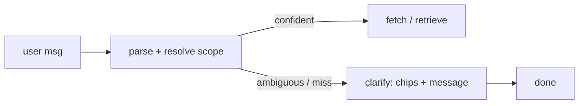

# Book Scope Resolve + Clarify Implementation Plan

> **For agentic workers:** REQUIRED SUB-SKILL: Use superpowers:subagent-driven-development (recommended) or superpowers:executing-plans to implement this plan task-by-task. Steps use checkbox (`- [ ]`) syntax for tracking.

**Goal:** Make chapter (`facilitate`/`resume`) and `qa` modes resolve fuzzy natural-language book/chapter/section references via a catalog-in-prompt parser, and emit a `clarify` two-step turn (candidate chips + chat line) only when the book is genuinely ambiguous or missing.

**Architecture:** A compact book catalog (slug · name · authors · chapter ids) is injected into the scope-parsing LLM call. A shared `agents/_scope.py` resolver returns `book_slug`, `book_confidence`, `book_candidates`, normalized `chapter_id`, and `requested_subtopics` (with numeric ranges expanded). `chapter.py` and `qa.py` delegate to it, then a confirm gate emits an SSE `clarify` event on ambiguity/miss. The frontend renders the clarify card on the existing `structuredOutput` rendering path; clicking a candidate selects that single book and re-sends (single-book fail-open guarantees the flow then runs).

**Tech Stack:** Python 3.12 (FastAPI, pydantic, openai async), pytest; TypeScript + React + Vite, vitest.

---

## File Structure

| File | Responsibility | Action |
|---|---|---|
| `src/services/chat/schemas/output.py` | `CatalogBook`, `BookResolution` models | Modify |
| `src/services/chat/schemas/__init__.py` | Re-export new models | Modify |
| `src/services/chat/books.py` | `parse_catalog()` builder | Modify |
| `src/services/chat/agents/_scope.py` | Shared `resolve_book` + numeric-range helpers | Create |
| `src/services/chat/prompts/chapter.py` | Catalog-aware `CHAPTER_PARSE_PROMPT` | Modify |
| `src/services/chat/agents/chapter.py` | `parse_scope` delegates; confirm gate + `clarify` | Modify |
| `src/services/chat/agents/qa.py` | Book resolution + confirm gate + `clarify` | Modify |
| `src/services/chat/tests/test_scope.py` | Resolver + numeric-range tests | Create |
| `src/services/chat/tests/test_chapter_clarify.py` | Chapter confirm-gate tests | Create |
| `src/services/chat/tests/test_qa_clarify.py` | QA confirm-gate tests | Create |
| `web/src/types.ts` | `clarify` event + `ClarifyData` | Modify |
| `web/src/state/chat.ts` | `case "clarify"` reducer | Modify |
| `web/src/state/chat.test.ts` | clarify reducer test | Modify |
| `web/src/components/ClarifyCard.tsx` | Render chips + chat line | Create |
| `web/src/components/ClarifyCard.test.tsx` | Card render + pick test | Create |
| `web/src/components/MessageThread.tsx` | Render `Clarify` schema; wire `onPick` | Modify |
| `web/src/App.tsx` | `handleClarifyPick`: select single book + re-send | Modify |
| `web/src/data/chapterPipeline.ts` | Add resolve/clarify nodes+edges | Modify |
| `web/src/data/qaPipeline.ts` | Add resolve/clarify annotation | Modify |
| `web/src/data/chapterPipeline.test.ts` | Node assertions | Modify |
| `docs/services/chat-features/52-book-scope-resolve.md` | Feature doc + mermaid | Create |
| `docs/services/chat-features/51-qa-mode.md` | Note resolve step | Modify |
| `docs/services/chat.md` | `clarify` SSE event | Modify |
| `docs/system/invariants.md`, `docs/system/changelog.md` | Invariant + entry | Modify |
| `docs/common ground/Elements/index.html` | Chat-page resolve/clarify | Modify |

---

## Task 1: Catalog schema + builder

**Files:**
- Modify: `src/services/chat/schemas/output.py`
- Modify: `src/services/chat/schemas/__init__.py`
- Modify: `src/services/chat/books.py`
- Test: `src/services/chat/tests/test_scope.py` (create)

- [ ] **Step 1: Write the failing test**

```python
# src/services/chat/tests/test_scope.py
from src.services.chat.books import parse_catalog
from src.services.chat.schemas import CatalogBook


def test_parse_catalog_returns_books_with_chapters():
    cat = parse_catalog()
    assert isinstance(cat, list)
    assert cat and all(isinstance(b, CatalogBook) for b in cat)
    b = cat[0]
    assert b.slug and b.name
    # chapters are ordered chNN ids
    assert all(c.startswith("ch") for c in b.chapters)
    assert b.chapters == sorted(b.chapters)
```

- [ ] **Step 2: Run test to verify it fails**

Run: `.venv/bin/python -m pytest src/services/chat/tests/test_scope.py -v`
Expected: FAIL — `ImportError: cannot import name 'CatalogBook'`.

- [ ] **Step 3: Add the models**

In `src/services/chat/schemas/output.py` add:

```python
class CatalogBook(BaseModel):
    slug: str
    name: str
    authors_short: str = ""
    field: str = ""
    chapters: list[str] = Field(default_factory=list)  # ordered chNN ids


class BookResolution(BaseModel):
    book_slug: str = ""
    book_confidence: float = 0.0
    book_candidates: list[str] = Field(default_factory=list)
    chapter_id: str = ""
    requested_subtopics: list[str] = Field(default_factory=list)
```

In `src/services/chat/schemas/__init__.py` add `CatalogBook` and `BookResolution` to the imports from `.output` and to `__all__`.

- [ ] **Step 4: Implement `parse_catalog`**

In `src/services/chat/books.py` (uses the already-loaded registry + manifest helpers):

```python
from src.services.chat.schemas import Book, CatalogBook  # extend existing import


def parse_catalog() -> list[CatalogBook]:
    """Compact per-book catalog (slug, name, authors, field, chapter ids).

    Names/authors come from the yaml registry; chapter ids from the manifest
    grouped by book_slug and sorted. Used by the scope resolver.
    """
    chapters_by_slug: dict[str, set[str]] = {}
    for e in _load_manifest():
        slug = e.get("book_slug") or ""
        ch = e.get("chapter_id") or ""
        if slug and ch:
            chapters_by_slug.setdefault(slug, set()).add(ch)
    out: list[CatalogBook] = []
    for b in list_books():
        out.append(CatalogBook(
            slug=b.id,
            name=b.name,
            authors_short=b.authorsShort,
            field=getattr(b, "field", "") or "",
            chapters=sorted(chapters_by_slug.get(b.id, set())),
        ))
    return out
```

> Note: confirm the `Book` field for the slug is `b.id` and short authors is `b.authorsShort` (per `books.py` `_build_book`). If the registry slug attribute differs, use the actual name.

- [ ] **Step 5: Run test to verify it passes**

Run: `.venv/bin/python -m pytest src/services/chat/tests/test_scope.py -v`
Expected: PASS.

- [ ] **Step 6: Commit**

```bash
git add src/services/chat/schemas/output.py src/services/chat/schemas/__init__.py src/services/chat/books.py src/services/chat/tests/test_scope.py
git commit -m "feat(chat): book catalog builder + scope schemas"
```

---

## Task 2: Numeric section-range expansion helper

**Files:**
- Create: `src/services/chat/agents/_scope.py`
- Test: `src/services/chat/tests/test_scope.py`

- [ ] **Step 1: Write the failing test**

```python
# append to src/services/chat/tests/test_scope.py
from src.services.chat.agents._scope import expand_section_refs


def test_expand_section_refs_range():
    assert expand_section_refs("sections 7.2 up to 7.4") == ["7.2", "7.3", "7.4"]

def test_expand_section_refs_list_and_dash():
    assert expand_section_refs("7.2, 7.3 and 7.5") == ["7.2", "7.3", "7.5"]
    assert expand_section_refs("7.2-7.4") == ["7.2", "7.3", "7.4"]

def test_expand_section_refs_none():
    assert expand_section_refs("teach me about variance") == []
```

- [ ] **Step 2: Run test to verify it fails**

Run: `.venv/bin/python -m pytest src/services/chat/tests/test_scope.py -k expand -v`
Expected: FAIL — module `_scope` does not exist.

- [ ] **Step 3: Implement the helper**

```python
# src/services/chat/agents/_scope.py
"""Shared book/chapter/section scope resolver for chapter + qa modes.

Catalog-in-prompt: the parse LLM is given a compact book catalog so fuzzy,
paraphrased, or author-only references resolve to a slug with a confidence.
Numeric section refs ("7.2 up to 7.4") are expanded deterministically here,
never left to the LLM.

Chinese-wall: imports only src.core.* and sibling src.services.chat.*.
"""
from __future__ import annotations

import json
import logging
import re

from src.core.config import settings
from src.services.chat._fences import strip_fences
from src.services.chat.schemas import BookResolution, CatalogBook

logger = logging.getLogger(__name__)

_SEC = re.compile(r"\b(\d+)\.(\d+)\b")


def expand_section_refs(text: str) -> list[str]:
    """Extract section numbers, expanding "X.a up to/-/through X.b" ranges.

    Returns ordered, de-duplicated "X.y" strings. Empty if none found.
    """
    nums = _SEC.findall(text or "")
    if not nums:
        return []
    is_range = bool(re.search(r"(up to|through|to|[-–—])", text))
    pairs = [(int(a), int(b)) for a, b in nums]
    out: list[str] = []
    if is_range and len(pairs) >= 2 and pairs[0][0] == pairs[-1][0]:
        chap = pairs[0][0]
        lo, hi = pairs[0][1], pairs[-1][1]
        if lo <= hi:
            out = [f"{chap}.{i}" for i in range(lo, hi + 1)]
    if not out:
        out = [f"{a}.{b}" for a, b in pairs]
    seen: set[str] = set()
    deduped = []
    for s in out:
        if s not in seen:
            seen.add(s)
            deduped.append(s)
    return deduped
```

- [ ] **Step 4: Run test to verify it passes**

Run: `.venv/bin/python -m pytest src/services/chat/tests/test_scope.py -k expand -v`
Expected: PASS.

- [ ] **Step 5: Commit**

```bash
git add src/services/chat/agents/_scope.py src/services/chat/tests/test_scope.py
git commit -m "feat(chat): numeric section-range expansion helper"
```

---

## Task 3: `resolve_book` catalog-in-prompt resolver

**Files:**
- Modify: `src/services/chat/agents/_scope.py`
- Modify: `src/services/chat/prompts/chapter.py`
- Test: `src/services/chat/tests/test_scope.py`

- [ ] **Step 1: Write the failing test**

```python
# append to src/services/chat/tests/test_scope.py
import json as _json
import pytest
from src.services.chat.agents import _scope
from src.services.chat.schemas import CatalogBook

_CAT = [
    CatalogBook(slug="islp", name="An Introduction to Statistical Learning",
                authors_short="James et al.", field="ml_dp",
                chapters=["ch01", "ch02", "ch07"]),
    CatalogBook(slug="hansen-econometrics", name="Econometrics",
                authors_short="Hansen", field="econometrics", chapters=["ch01"]),
]


@pytest.mark.asyncio
async def test_resolve_book_confident(monkeypatch):
    async def fake_chat(messages, *, model, max_tokens, temperature=0.0):
        return _json.dumps({
            "book_slug": "islp", "book_confidence": 0.92,
            "book_candidates": ["islp"], "chapter_id": "ch07",
            "requested_subtopics": [],
        })
    monkeypatch.setattr(_scope, "_chat", fake_chat)
    r = await _scope.resolve_book("chapter 7 of ISL", selected_slugs=None, catalog=_CAT)
    assert r.book_slug == "islp"
    assert r.chapter_id == "ch07"
    assert r.book_confidence >= 0.6


@pytest.mark.asyncio
async def test_resolve_book_expands_sections(monkeypatch):
    async def fake_chat(messages, *, model, max_tokens, temperature=0.0):
        return _json.dumps({
            "book_slug": "islp", "book_confidence": 0.9,
            "book_candidates": ["islp"], "chapter_id": "ch07",
            "requested_subtopics": [],
        })
    monkeypatch.setattr(_scope, "_chat", fake_chat)
    r = await _scope.resolve_book(
        "chapter 7 sections 7.2 up to 7.4 of ISL", selected_slugs=None, catalog=_CAT)
    assert r.requested_subtopics == ["7.2", "7.3", "7.4"]


@pytest.mark.asyncio
async def test_resolve_book_single_selection_failopen(monkeypatch):
    async def boom(*a, **k):
        raise RuntimeError("llm down")
    monkeypatch.setattr(_scope, "_chat", boom)
    r = await _scope.resolve_book("teach ch02", selected_slugs=["islp"], catalog=_CAT)
    assert r.book_slug == "islp"
    assert r.book_confidence == 1.0  # single selection never clarifies
```

- [ ] **Step 2: Run test to verify it fails**

Run: `.venv/bin/python -m pytest src/services/chat/tests/test_scope.py -k resolve_book -v`
Expected: FAIL — `_scope._chat` / `resolve_book` not defined.

- [ ] **Step 3: Add prompt**

In `src/services/chat/prompts/chapter.py` replace `CHAPTER_PARSE_PROMPT` with a catalog-aware version:

```python
CHAPTER_PARSE_PROMPT = """You extract the study scope from a request and match
it to a known book.

You are given:
  "catalog": array of {"slug","name","authors_short","field","chapters"} —
      the ONLY books available. "chapters" are valid chapter ids like "ch07".
  "selected_slugs": slugs the user already selected (may be empty).
  "message": the user's request.

Match the book the user means even when the title is paraphrased, partial, or
only the author is named (e.g. "Hansen's intro to probability"). Use meaning,
author surname, and field — not exact strings.

Return ONLY a JSON object with these keys:
  "book_slug": the single best slug, or "" if no catalog book is a plausible match.
  "book_confidence": 0..1 — how sure you are of book_slug.
  "book_candidates": array of slugs (best first) that plausibly match; one entry
      when confident, several when ambiguous, [] when nothing matches.
  "chapter_id": the chapter normalised as "chNN" (zero-padded). "" if none named.
  "requested_subtopics": array of the verbatim subtopic phrases the user named
      (NOT section numbers — those are handled separately). [] = whole chapter.

If exactly one slug is in selected_slugs, prefer it with high confidence.
Never invent a slug or chapter id that is not in the catalog.
"""
```

- [ ] **Step 4: Implement `_chat` seam + `resolve_book`**

Append to `src/services/chat/agents/_scope.py`:

```python
from src.services.chat.llm.router import aclient_for
from src.services.chat.prompts.chapter import CHAPTER_PARSE_PROMPT


async def _chat(messages, *, model, max_tokens, temperature=0.0) -> str:
    """Single LLM seam (tests monkeypatch this)."""
    oa = aclient_for(model)
    resp = await oa.chat.completions.create(
        model=model, messages=messages,
        temperature=temperature, max_completion_tokens=max_tokens,
    )
    return resp.choices[0].message.content or ""


def _catalog_payload(catalog: list[CatalogBook]) -> list[dict]:
    return [c.model_dump() for c in catalog]


async def resolve_book(
    message: str,
    *,
    selected_slugs: list[str] | None,
    catalog: list[CatalogBook],
    model: str | None = None,
) -> BookResolution:
    """Resolve {book, chapter, subtopics} from a fuzzy request via catalog-in-prompt."""
    single = selected_slugs[0] if selected_slugs and len(selected_slugs) == 1 else ""
    sections = expand_section_refs(message)
    # Fail-open default: a single selected book is taken with full confidence.
    fallback = BookResolution(
        book_slug=single,
        book_confidence=1.0 if single else 0.0,
        book_candidates=[single] if single else [],
        chapter_id="",
        requested_subtopics=sections,
    )
    chosen = model or settings.openai_model_nano
    try:
        raw = await _chat(
            [
                {"role": "system", "content": CHAPTER_PARSE_PROMPT},
                {"role": "user", "content": json.dumps({
                    "catalog": _catalog_payload(catalog),
                    "selected_slugs": selected_slugs or [],
                    "message": message,
                })},
            ],
            model=chosen, max_tokens=300,
        )
        data = json.loads(strip_fences(raw))
        valid = {c.slug for c in catalog}
        slug = str(data.get("book_slug") or single).strip()
        if slug and slug not in valid:
            slug = ""
        cands = [str(s).strip() for s in (data.get("book_candidates") or []) if str(s).strip() in valid]
        if single:
            slug = single
            cands = [single]
        # subtopics from LLM (word phrases) + deterministic numeric sections
        subtopics = [str(x).strip() for x in (data.get("requested_subtopics") or []) if str(x).strip()]
        subtopics = sections + [s for s in subtopics if s not in sections]
        return BookResolution(
            book_slug=slug,
            book_confidence=1.0 if single else float(data.get("book_confidence", 0.0)),
            book_candidates=cands or ([slug] if slug else []),
            chapter_id=str(data.get("chapter_id") or "").strip(),
            requested_subtopics=subtopics,
        )
    except Exception:  # noqa: BLE001
        logger.exception("_scope.resolve_book failed; fail-open")
        return fallback
```

- [ ] **Step 5: Run test to verify it passes**

Run: `.venv/bin/python -m pytest src/services/chat/tests/test_scope.py -v`
Expected: PASS (all scope tests).

- [ ] **Step 6: Commit**

```bash
git add src/services/chat/agents/_scope.py src/services/chat/prompts/chapter.py src/services/chat/tests/test_scope.py
git commit -m "feat(chat): catalog-in-prompt resolve_book with confidence + candidates"
```

---

## Task 4: Chapter confirm gate + `clarify` event

**Files:**
- Modify: `src/services/chat/agents/chapter.py`
- Test: `src/services/chat/tests/test_chapter_clarify.py` (create)

- [ ] **Step 1: Write the failing test**

```python
# src/services/chat/tests/test_chapter_clarify.py
import pytest
from src.services.chat.agents import chapter as chap
from src.services.chat.schemas import BookResolution, CatalogBook, ChatRequest

_CAT = [CatalogBook(slug="islp", name="ISL", authors_short="James et al.",
                    field="ml_dp", chapters=["ch02", "ch07"])]


async def _collect(req):
    return [ev async for ev in chap.run_chapter(req)]


@pytest.mark.asyncio
async def test_clarify_on_unknown_book(monkeypatch):
    monkeypatch.setattr(chap, "parse_catalog", lambda: _CAT)
    async def fake_resolve(*a, **k):
        return BookResolution(book_slug="", book_confidence=0.0, book_candidates=[])
    monkeypatch.setattr(chap, "resolve_book", fake_resolve)
    req = ChatRequest(message="ch7 of Hansen probability", mode="resume", bookFilter=[])
    evs = await _collect(req)
    types = [e["type"] for e in evs]
    assert "clarify" in types
    clar = next(e for e in evs if e["type"] == "clarify")
    assert clar["reason"] in {"book_unknown", "book_ambiguous"}
    assert isinstance(clar["candidates"], list)
    assert types[-1] == "done"
    assert "structured_output" not in types


@pytest.mark.asyncio
async def test_clarify_on_chapter_missing(monkeypatch):
    monkeypatch.setattr(chap, "parse_catalog", lambda: _CAT)
    async def fake_resolve(*a, **k):
        return BookResolution(book_slug="islp", book_confidence=0.95,
                              book_candidates=["islp"], chapter_id="ch99")
    monkeypatch.setattr(chap, "resolve_book", fake_resolve)
    req = ChatRequest(message="ch99 of ISL", mode="resume", bookFilter=["islp"])
    evs = await _collect(req)
    clar = next((e for e in evs if e["type"] == "clarify"), None)
    assert clar is not None and clar["reason"] == "chapter_missing"
    assert clar["chapter_guess"] == "ch99"


@pytest.mark.asyncio
async def test_no_clarify_kill_switch(monkeypatch):
    monkeypatch.setenv("CHAPTER_CLARIFY", "0")
    # reload module-level flag
    monkeypatch.setattr(chap, "_CHAPTER_CLARIFY", False)
    monkeypatch.setattr(chap, "parse_catalog", lambda: _CAT)
    async def fake_resolve(*a, **k):
        return BookResolution(book_slug="", book_confidence=0.0, book_candidates=[])
    monkeypatch.setattr(chap, "resolve_book", fake_resolve)
    req = ChatRequest(message="??", mode="resume", bookFilter=[])
    evs = await _collect(req)
    assert "clarify" not in [e["type"] for e in evs]
```

- [ ] **Step 2: Run test to verify it fails**

Run: `.venv/bin/python -m pytest src/services/chat/tests/test_chapter_clarify.py -v`
Expected: FAIL — `chapter` has no `resolve_book` / `parse_catalog` / no clarify emitted.

- [ ] **Step 3: Wire imports, flags, and delegate `parse_scope`**

In `src/services/chat/agents/chapter.py`:

Add imports near the top:
```python
from src.services.chat.agents._scope import resolve_book, maybe_clarify
from src.services.chat.books import parse_catalog
from src.services.chat.schemas import BookResolution, CatalogBook
```
> The gate helper `maybe_clarify` (and `_candidate_records`, `_BOOK_CONFIRM_CUTOFF`) live in `_scope.py` — see Step 4b — so both `chapter.py` and `qa.py` import them with no cycle.

Add flags beside the existing ones:
```python
_CHAPTER_CLARIFY = os.environ.get("CHAPTER_CLARIFY", "1") == "1"
```
> The cutoff `_BOOK_CONFIRM_CUTOFF` lives in `_scope.py` (used by `maybe_clarify`); don't redefine it here.

Refactor `parse_scope` to a thin wrapper over the resolver (keeps its
`ChapterScope` return for existing callers/tests; `run_chapter` calls
`resolve_book` directly in Step 4 so it also gets confidence/candidates):
```python
async def parse_scope(
    message: str,
    *,
    book_slugs: list[str] | None,
    model: str | None = None,
    catalog: list[CatalogBook] | None = None,
) -> ChapterScope:
    """Resolve scope via the shared catalog-in-prompt resolver (thin wrapper)."""
    cat = catalog if catalog is not None else parse_catalog()
    res: BookResolution = await resolve_book(
        message, selected_slugs=book_slugs, catalog=cat, model=model)
    return ChapterScope(
        book_slug=res.book_slug,
        chapter_id=res.chapter_id,
        requested_subtopics=res.requested_subtopics,
    )
```

> No `ChapterScope` schema change. Existing chapter tests that called the old
> `parse_scope` should monkeypatch `chapter.resolve_book` (or pass a stub
> `catalog=`) — note this in Step 5.

- [ ] **Step 4: Add the confirm gate in `run_chapter`**

Replace the parse block in `run_chapter` (currently `scope = await parse_scope(...)`) with:

```python
    # 1. parse + resolve scope (catalog-in-prompt)
    yield {"type": "stage", "stage": "parse", "label": "Parse + resolve scope"}
    catalog = parse_catalog()
    res = await resolve_book(
        message, selected_slugs=book_slugs, catalog=catalog,
        model=_model_for("parse", req))
    scope = ChapterScope(
        book_slug=res.book_slug, chapter_id=res.chapter_id,
        requested_subtopics=res.requested_subtopics)

    # confirm gate — fire clarify only on ambiguity/miss
    if _CHAPTER_CLARIFY:
        clar = maybe_clarify(res, catalog)
        if clar is not None:
            yield clar
            yield {"type": "usage", "durationMs": int((time.time() - t0) * 1000),
                   "promptChars": len(message), "completionChars": 0, "estTokens": 0}
            yield {"type": "done"}
            return
```

**Step 4b — define the gate in `_scope.py`** (imported by both `chapter.py` and `qa.py`). Add to `src/services/chat/agents/_scope.py`:
```python
_BOOK_CONFIRM_CUTOFF = float(os.environ.get("BOOK_CONFIRM_CUTOFF", "0.6"))  # add `import os`


def _candidate_records(slugs: list[str], catalog: list[CatalogBook]) -> list[dict]:
    by = {c.slug: c for c in catalog}
    out = []
    for s in slugs:
        c = by.get(s)
        if c:
            out.append({"slug": c.slug, "name": c.name,
                        "authors_short": c.authors_short, "chapters": c.chapters})
    return out


def maybe_clarify(res: BookResolution, catalog: list[CatalogBook]) -> dict | None:
    """Return a clarify event dict, or None to proceed. Ambiguity/miss only."""
    by = {c.slug: c for c in catalog}
    reason = ""
    cand_slugs = res.book_candidates or ([res.book_slug] if res.book_slug else [])
    if not res.book_slug:
        reason = "book_ambiguous" if len(cand_slugs) >= 2 else "book_unknown"
    elif res.book_confidence < _BOOK_CONFIRM_CUTOFF:
        reason = "book_ambiguous"
    elif len([s for s in cand_slugs if s != res.book_slug]) >= 1 and len(cand_slugs) >= 2:
        # multiple plausible candidates → ambiguous
        reason = "book_ambiguous"
    elif res.chapter_id and res.book_slug in by and res.chapter_id not in by[res.book_slug].chapters:
        reason = "chapter_missing"
    if not reason:
        return None
    msg = {
        "book_unknown": "I couldn't match that to a book I have. Pick one of these:",
        "book_ambiguous": "I'm not sure which book you mean. Did you mean one of these?",
        "chapter_missing": "That book doesn't have that chapter. Pick a chapter:",
    }[reason]
    cands = _candidate_records(cand_slugs or [c.slug for c in catalog], catalog)
    return {
        "type": "clarify", "reason": reason, "message": msg,
        "candidates": cands, "chapter_guess": res.chapter_id,
        "sections_guess": res.requested_subtopics,
    }
```

> Keep the existing "sections fetched empty → digest with 'Chapter not found' intro" block as a final safety net for confident matches whose fetch still returns nothing.

- [ ] **Step 5: Run test to verify it passes**

Run: `.venv/bin/python -m pytest src/services/chat/tests/test_chapter_clarify.py src/services/chat/tests/test_scope.py -v`
Expected: PASS. Also run existing chapter tests:
Run: `.venv/bin/python -m pytest src/services/chat/tests/ -k chapter -v`
Expected: PASS (no regressions; update any test that asserted the old `parse_scope` signature to pass `catalog=` or monkeypatch `resolve_book`).

- [ ] **Step 6: Commit**

```bash
git add src/services/chat/agents/chapter.py src/services/chat/tests/test_chapter_clarify.py
git commit -m "feat(chat): chapter confirm gate emits clarify on ambiguity/miss"
```

---

## Task 5: QA confirm gate + `clarify` event

**Files:**
- Modify: `src/services/chat/agents/qa.py`
- Test: `src/services/chat/tests/test_qa_clarify.py` (create)

- [ ] **Step 1: Write the failing test**

```python
# src/services/chat/tests/test_qa_clarify.py
import pytest
from src.services.chat.agents import qa
from src.services.chat.schemas import BookResolution, CatalogBook, ChatRequest

_CAT = [CatalogBook(slug="islp", name="ISL", authors_short="James et al.",
                    field="ml_dp", chapters=["ch02"])]


@pytest.mark.asyncio
async def test_qa_clarify_on_unknown_book(monkeypatch):
    monkeypatch.setattr(qa, "parse_catalog", lambda: _CAT)
    async def fake_resolve(*a, **k):
        return BookResolution(book_slug="", book_confidence=0.0, book_candidates=[])
    monkeypatch.setattr(qa, "resolve_book", fake_resolve)
    req = ChatRequest(message="in Hansen's probability, what is a sigma-algebra?",
                      mode="qa", bookFilter=[])
    evs = [e async for e in qa.run_qa(req)]
    types = [e["type"] for e in evs]
    assert "clarify" in types
    assert types[-1] == "done"


@pytest.mark.asyncio
async def test_qa_no_clarify_when_confident(monkeypatch):
    monkeypatch.setattr(qa, "parse_catalog", lambda: _CAT)
    async def fake_resolve(*a, **k):
        return BookResolution(book_slug="islp", book_confidence=0.95,
                              book_candidates=["islp"])
    monkeypatch.setattr(qa, "resolve_book", fake_resolve)
    # stub the downstream retrieve+generate so the test stays unit-scoped
    async def fake_chat(*a, **k):
        return '{"answer":"x","citations":[],"confidence":0.9}'
    monkeypatch.setattr(qa, "_chat", fake_chat)
    monkeypatch.setattr(qa, "hybrid_search", lambda *a, **k: [])
    req = ChatRequest(message="what is bias?", mode="qa", bookFilter=["islp"])
    evs = [e async for e in qa.run_qa(req)]
    assert "clarify" not in [e["type"] for e in evs]
```

- [ ] **Step 2: Run test to verify it fails**

Run: `.venv/bin/python -m pytest src/services/chat/tests/test_qa_clarify.py -v`
Expected: FAIL.

- [ ] **Step 3: Add resolution + gate to `run_qa`**

In `src/services/chat/agents/qa.py` add imports:
```python
from src.services.chat.agents._scope import resolve_book, maybe_clarify
from src.services.chat.books import parse_catalog
```

Add flag:
```python
_QA_CLARIFY = os.environ.get("CHAPTER_CLARIFY", "1") == "1"
```

In `run_qa`, right after computing `book_slugs` and emitting `meta`, before retrieval:
```python
    # resolve book scope from the question (fuzzy) + confirm gate
    catalog = parse_catalog()
    res = await resolve_book(query, selected_slugs=book_slugs, catalog=catalog,
                             model=_model_for("scope", req))
    if _QA_CLARIFY:
        clar = maybe_clarify(res, catalog)
        if clar is not None:
            yield clar
            yield {"type": "done"}
            return
    # if confident, narrow retrieval to the resolved book
    if res.book_slug:
        book_slugs = [res.book_slug]
```

> Wire `res.book_slug` into the retrieval book filter where `hybrid_search` is called (use `book_slugs` for the filter argument it already accepts).

- [ ] **Step 4: Run test to verify it passes**

Run: `.venv/bin/python -m pytest src/services/chat/tests/test_qa_clarify.py -v`
Expected: PASS. Then full QA suite:
Run: `.venv/bin/python -m pytest src/services/chat/tests/ -k qa -v`
Expected: PASS.

- [ ] **Step 5: Commit**

```bash
git add src/services/chat/agents/qa.py src/services/chat/agents/_scope.py src/services/chat/agents/chapter.py src/services/chat/tests/test_qa_clarify.py
git commit -m "feat(chat): qa book resolution + shared clarify gate"
```

---

## Task 6: Frontend — `clarify` event type + reducer

**Files:**
- Modify: `web/src/types.ts`
- Modify: `web/src/state/chat.ts`
- Modify: `web/src/state/chat.test.ts`

- [ ] **Step 1: Write the failing test**

```ts
// append to web/src/state/chat.test.ts
it("clarify event attaches a Clarify structuredOutput and completes the turn", () => {
  let state = reducer(initialState, { type: "USER_SENT", convId: "c1", text: "hi" } as Action);
  const clarify = {
    type: "clarify", reason: "book_unknown", message: "Pick one:",
    candidates: [{ slug: "islp", name: "ISL", authors_short: "James et al.", chapters: ["ch02"] }],
    chapter_guess: "ch07", sections_guess: ["7.2", "7.3"],
  } as const;
  state = reducer(state, { type: "EVENT", convId: "c1", ev: clarify } as Action);
  const last = state.messages[state.messages.length - 1] as AssistantMessage;
  expect(last.structuredOutput?.schema).toBe("Clarify");
  expect((last.structuredOutput?.data as ClarifyData).candidates[0].slug).toBe("islp");
});
```

- [ ] **Step 2: Run test to verify it fails**

Run: `cd web && npx vitest run src/state/chat.test.ts`
Expected: FAIL — `clarify` not in event union / not handled.

- [ ] **Step 3: Add the event type**

In `web/src/types.ts`:
```ts
export interface ClarifyCandidate {
  slug: string;
  name: string;
  authors_short: string;
  chapters: string[];
}
export interface ClarifyData {
  reason: "book_unknown" | "book_ambiguous" | "chapter_missing" | "sections_empty";
  message: string;
  candidates: ClarifyCandidate[];
  chapter_guess: string;
  sections_guess: string[];
}
```
Add to `StructuredOutputEvent` union:
```ts
  | { type: "structured_output"; schema: "Clarify"; data: ClarifyData }
```
Add to `ChatEventBody` union:
```ts
  | { type: "clarify"; reason: ClarifyData["reason"]; message: string;
      candidates: ClarifyCandidate[]; chapter_guess: string; sections_guess: string[] }
```

- [ ] **Step 4: Handle it in the reducer**

In `web/src/state/chat.ts`, add a case in the `EVENT` switch (mirrors `structured_output` + `done`):
```ts
        case "clarify":
          return {
            ...state,
            status: "idle",
            streamingPhase: "idle",
            messages: updateLastAssistant(state.messages, (msg) => ({
              ...msg,
              status: "complete",
              structuredOutput: {
                schema: "Clarify",
                data: {
                  reason: ev.reason, message: ev.message,
                  candidates: ev.candidates, chapter_guess: ev.chapter_guess,
                  sections_guess: ev.sections_guess,
                },
              },
            })),
          };
```

- [ ] **Step 5: Run test to verify it passes**

Run: `cd web && npx vitest run src/state/chat.test.ts`
Expected: PASS.

- [ ] **Step 6: Commit**

```bash
git add web/src/types.ts web/src/state/chat.ts web/src/state/chat.test.ts
git commit -m "feat(web): clarify SSE event -> Clarify structuredOutput"
```

---

## Task 7: `ClarifyCard` component

**Files:**
- Create: `web/src/components/ClarifyCard.tsx`
- Create: `web/src/components/ClarifyCard.test.tsx`

- [ ] **Step 1: Write the failing test**

```tsx
// web/src/components/ClarifyCard.test.tsx
import { render, screen, fireEvent } from "@testing-library/react";
import { describe, it, expect, vi } from "vitest";
import ClarifyCard from "./ClarifyCard";
import type { ClarifyData } from "../types";

const data: ClarifyData = {
  reason: "book_unknown", message: "Pick one:",
  candidates: [{ slug: "islp", name: "Intro to Statistical Learning",
                 authors_short: "James et al.", chapters: ["ch02", "ch07"] }],
  chapter_guess: "ch07", sections_guess: ["7.2", "7.3"],
};

describe("ClarifyCard", () => {
  it("renders message and a chip per candidate", () => {
    render(<ClarifyCard data={data} onPick={() => {}} />);
    expect(screen.getByText("Pick one:")).toBeInTheDocument();
    expect(screen.getByText(/Intro to Statistical Learning/)).toBeInTheDocument();
    expect(screen.getByText(/James et al\./)).toBeInTheDocument();
  });

  it("calls onPick with slug + guessed chapter/sections on click", () => {
    const onPick = vi.fn();
    render(<ClarifyCard data={data} onPick={onPick} />);
    fireEvent.click(screen.getByRole("button", { name: /Intro to Statistical Learning/ }));
    expect(onPick).toHaveBeenCalledWith("islp", "ch07", ["7.2", "7.3"]);
  });
});
```

- [ ] **Step 2: Run test to verify it fails**

Run: `cd web && npx vitest run src/components/ClarifyCard.test.tsx`
Expected: FAIL — file does not exist.

- [ ] **Step 3: Implement the component**

```tsx
// web/src/components/ClarifyCard.tsx
import React from "react";
import type { ClarifyData } from "../types";

interface Props {
  data: ClarifyData;
  onPick: (slug: string, chapter: string, sections: string[]) => void;
}

export default function ClarifyCard({ data, onPick }: Props) {
  return (
    <div className="clarify-card">
      <p className="clarify-card__msg">{data.message}</p>
      <div className="clarify-card__chips">
        {data.candidates.map((c) => (
          <button
            key={c.slug}
            type="button"
            className="clarify-card__chip"
            onClick={() => onPick(c.slug, data.chapter_guess, data.sections_guess)}
          >
            <span className="clarify-card__chip-name">{c.name}</span>
            <span className="clarify-card__chip-auth">{c.authors_short}</span>
          </button>
        ))}
      </div>
      {data.chapter_guess && (
        <p className="clarify-card__guess">
          Guessed chapter <strong>{data.chapter_guess}</strong>
          {data.sections_guess.length > 0 && <> · sections {data.sections_guess.join(", ")}</>}
        </p>
      )}
    </div>
  );
}
```

Add minimal styles to the existing chat stylesheet (e.g. `web/src/index.css` or the card stylesheet used by ChapterDigestCard) — chips as inline-flex pill buttons. Match existing card spacing tokens.

- [ ] **Step 4: Run test to verify it passes**

Run: `cd web && npx vitest run src/components/ClarifyCard.test.tsx`
Expected: PASS.

- [ ] **Step 5: Commit**

```bash
git add web/src/components/ClarifyCard.tsx web/src/components/ClarifyCard.test.tsx web/src/index.css
git commit -m "feat(web): ClarifyCard with candidate chips"
```

---

## Task 8: Render `Clarify` in the thread + wire `onPick` to re-send

**Files:**
- Modify: `web/src/components/MessageThread.tsx`
- Modify: `web/src/App.tsx`

- [ ] **Step 1: Add the render branch (MessageThread)**

Import and render alongside the other schema branches (around line 345):
```tsx
import ClarifyCard from "./ClarifyCard";
// ...
{msg.structuredOutput.schema === "Clarify" && (
  <ClarifyCard
    data={msg.structuredOutput.data as ClarifyData}
    onPick={onClarifyPick}
  />
)}
```
Add `onClarifyPick: (slug: string, chapter: string, sections: string[]) => void;` to `MessageThread`'s props and thread it through from where MessageThread is used.

- [ ] **Step 2: Implement `handleClarifyPick` (App.tsx)**

In `web/src/App.tsx`, add a handler that selects exactly the picked book and re-sends a normalized message (single selection → backend fail-open confidence 1.0 → flow runs, no second clarify):
```tsx
const handleClarifyPick = useCallback(
  (slug: string, chapter: string, sections: string[]) => {
    // select only the picked book
    setBooks((prev) => prev.map((b) => ({ ...b, selected: b.id === slug })));
    const chapText = chapter ? ` ${chapter}` : "";
    const secText = sections.length ? ` sections ${sections.join(", ")}` : "";
    const text = `${activeMode}${chapText}${secText}`.trim();
    sendMessage(text, activeConvId);
  },
  [setBooks, activeMode, activeConvId, sendMessage],
);
```
> Use the actual book-state setter name in App (`setBooks` or equivalent) and the actual active conversation id variable. Pass `handleClarifyPick` down to `MessageThread`.

- [ ] **Step 3: Run frontend build + tests**

Run: `cd web && npx vitest run && npx tsc --noEmit`
Expected: PASS, no type errors.

- [ ] **Step 4: Commit**

```bash
git add web/src/components/MessageThread.tsx web/src/App.tsx
git commit -m "feat(web): render Clarify card and re-send on candidate pick"
```

---

## Task 9: Pipeline diagrams — resolve + clarify nodes

**Files:**
- Modify: `web/src/data/chapterPipeline.ts`
- Modify: `web/src/data/qaPipeline.ts`
- Modify: `web/src/data/chapterPipeline.test.ts`
- Modify: `web/src/data/chapterMode.ts` (copy)

- [ ] **Step 1: Write the failing test**

```ts
// append to web/src/data/chapterPipeline.test.ts
import { CHAPTER_PIPELINE } from "./chapterPipeline";

it("parse node is relabeled to parse + resolve scope", () => {
  const parse = CHAPTER_PIPELINE.nodes.find((n) => n.id === "parse")!;
  expect(parse.label.toLowerCase()).toContain("resolve");
});

it("has a clarify node reachable from parse", () => {
  const clarify = CHAPTER_PIPELINE.nodes.find((n) => n.id === "clarify");
  expect(clarify).toBeTruthy();
  expect(CHAPTER_PIPELINE.edges).toContainEqual({ from: "parse", to: "clarify" });
});
```

- [ ] **Step 2: Run test to verify it fails**

Run: `cd web && npx vitest run src/data/chapterPipeline.test.ts`
Expected: FAIL — no `clarify` node; `parse` label has no "resolve".

- [ ] **Step 3: Update the pipeline data**

In `web/src/data/chapterPipeline.ts`: extend the node id union and add the node + edge.
```ts
  id: "parse" | "fetch" | "resolve" | "map" | "stitch" | "ground" | "clarify";
```
Relabel the parse node:
```ts
    { id: "parse", label: "Parse + resolve scope",
      desc: "Matches your request to a known book (fuzzy title/author), normalises the chapter, and expands section ranges — using the book catalog.",
      kind: "llm", defaultModel: "gpt-5.4-nano-2026-03-17" },
```
Add a clarify node (data/terminal) and edge:
```ts
    { id: "clarify", label: "Clarify (if ambiguous)",
      desc: "If the book is unknown or ambiguous, or the chapter doesn't exist, the run stops and asks you to pick — candidate chips + a short message. A confident match skips this.",
      kind: "data", defaultModel: "—" },
```
```ts
    { from: "parse", to: "clarify" },
```

In `web/src/data/qaPipeline.ts`: relabel the scope/entry node to mention "resolve book scope" and add an analogous `clarify` node + `{ from: <scope-node-id>, to: "clarify" }` edge (mirror the chapter change; use the qa pipeline's actual entry node id).

In `web/src/data/chapterMode.ts`: update the "Subtopic resolve" feature copy in both `FACILITATE_MODE` and `RESUME_MODE` to: `"Matches your book/chapter/sections even when named loosely; asks you to confirm only if it's ambiguous."`

- [ ] **Step 4: Confirm the diagram renderer handles a branch node**

Check `ChapterPipelineDiagram.tsx` / `PipelineDiagram` layout tolerates a node with two out-edges from `parse` (`fetch` and `clarify`). If the layout assumes a single linear chain, render `clarify` as a side/terminal node (no further out-edges). Adjust layout only if the diagram breaks visually.

- [ ] **Step 5: Run tests**

Run: `cd web && npx vitest run src/data/ src/components/ChapterPipelineDiagram.test.tsx`
Expected: PASS.

- [ ] **Step 6: Commit**

```bash
git add web/src/data/chapterPipeline.ts web/src/data/qaPipeline.ts web/src/data/chapterPipeline.test.ts web/src/data/chapterMode.ts
git commit -m "feat(web): pipeline diagrams show parse+resolve and clarify branch"
```

---

## Task 10: Docs + reference graph (lockstep)

**Files:**
- Create: `docs/services/chat-features/52-book-scope-resolve.md`
- Modify: `docs/services/chat-features/51-qa-mode.md`
- Modify: `docs/services/chat.md`
- Modify: `docs/system/invariants.md`
- Modify: `docs/system/changelog.md`
- Modify: `docs/common ground/Elements/index.html`

- [ ] **Step 1: Write feature doc 52**

Create `docs/services/chat-features/52-book-scope-resolve.md` with: purpose, the catalog-in-prompt mechanism, the confirm-gate rules (the four reasons), the `clarify` SSE event shape, env table (`BOOK_CONFIRM_CUTOFF=0.6`, `CHAPTER_CLARIFY=1`), and a mermaid graph:


- [ ] **Step 2: Update QA + chat docs**

- `51-qa-mode.md`: add a line that QA now resolves the book from the question (fuzzy) and may clarify before retrieval.
- `chat.md`: document the new `clarify` SSE event in the event-contract section (shape + that it is terminal → `done`, only on ambiguity/miss).

- [ ] **Step 3: Invariants + changelog**

- `invariants.md`: add — "A confident single book/chapter match never emits `clarify`; a single selected book is always confidence 1.0 (never clarifies)."
- `changelog.md`: add a dated entry summarizing the feature.

- [ ] **Step 4: Reference graph**

In `docs/common ground/Elements/index.html` (Chat & deep-tutor page): add the parse+resolve / clarify branch to the chapter and qa flow description so the reference set matches the modal.

- [ ] **Step 5: Commit**

```bash
git add "docs/services/chat-features/52-book-scope-resolve.md" "docs/services/chat-features/51-qa-mode.md" docs/services/chat.md docs/system/invariants.md docs/system/changelog.md "docs/common ground/Elements/index.html"
git commit -m "docs(chat): book scope resolve + clarify (feature 52, qa, sse, invariants)"
```

---

## Task 11: Full verification

**Files:** none (verification only)

- [ ] **Step 1: Backend suite**

Run: `.venv/bin/python -m pytest src/services/chat/tests/ -q`
Expected: all pass (existing + new). Fix any chapter test that depended on the old `parse_scope`/`selected_books`-only behavior.

- [ ] **Step 2: Frontend suite + build**

Run: `cd web && npx vitest run && npm run build`
Expected: tests pass; prod build green.

- [ ] **Step 3: Browser verify on :5175**

Run: `./scripts/dev.sh` (separately), then in the browser on **:5175**:
- Select multiple books. In `resume` mode, send "chapter 7, sections 7.2 up to 7.4 of Hansen's introduction to probability." → expect a **clarify card** (chips + message), since Hansen-probability isn't in the library.
- Click a candidate chip → the book is selected and the turn re-sends → the chapter flow runs.
- With a single book selected, send a fuzzy reference → flow runs with **no** clarify.
- Open the Facilitate / Resume / Q&A (i) modals → confirm the **parse + resolve scope** label and the **clarify** branch render, and that they match `docs/common ground/Elements/index.html`.

- [ ] **Step 4: Final commit (if any verify fixes)**

```bash
git add -A && git commit -m "test(chat): verify book scope resolve + clarify end-to-end"
```

---

## Notes for the implementer

- **Chinese wall:** `_scope.py` imports only `src.core.*` and `src.services.chat.*`. The gate helpers (`_maybe_clarify`, `_candidate_records`, cutoff constant) should live in `_scope.py` so both `chapter.py` and `qa.py` import them without a cycle.
- **Fail-open is sacred:** a single selected book is always confidence 1.0 → never clarifies. The kill-switch `CHAPTER_CLARIFY=0` restores pure fail-open.
- **No new `ChatRequest` fields.** `clarify` is SSE-only and rides the existing `structuredOutput` rendering path on the frontend (schema `"Clarify"`).
- Run `python ops/scripts/render_state.py` if state docs need regen after the feature lands.
