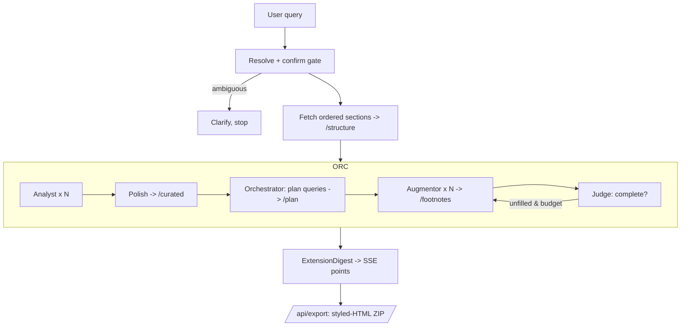

# Extension Mode Implementation Plan

> **For agentic workers:** REQUIRED SUB-SKILL: Use superpowers:subagent-driven-development (recommended) or superpowers:executing-plans to implement this plan task-by-task. Steps use checkbox (`- [ ]`) syntax for tracking.

**Goal:** Add a new `extension` chat mode that follows the structure of a corpus chapter/section and augments each part with cross-book + Wikipedia material, emitting curated to-the-point text + footnotes, plus a shiny styled-HTML ZIP export.

**Architecture:** Topology C — a deterministic runner (scope → resolve → confirm gate → fetch structure, order-fixed) wraps an agentic core built on `deepagents` (orchestrator + analyst/polish/augmentor subagents over a shared virtual filesystem). The runner owns a hard, env-capped round loop (`EXTENSION_MAX_ROUNDS`) and judges coverage between rounds; the deep-agent owns within-round reasoning. All augmentation lands only in footnotes. Hard-isolated in `extension_agents/` + `extension_skills/` — zero imports from tutor/qa.

**Tech Stack:** Python 3.12, FastAPI/SSE, Pydantic v2, `deepagents==0.6.8` + LangGraph (MemorySaver checkpointer, StateBackend virtual FS), OpenAI structured outputs, Qdrant hybrid search, Wikipedia REST API; React + Vite + TS + KaTeX frontend.

**Spec:** `docs/superpowers/specs/2026-06-09-extension-mode-design.md`

---

## File Structure

**Backend (new, isolated):**
- `src/services/chat/agents/extension_agents/__init__.py` — package marker + wall comment
- `src/services/chat/agents/extension_agents/_models.py` — per-stage model resolver (isolated copy)
- `src/services/chat/agents/extension_agents/tools.py` — `wikipedia_lookup`, `retrieve_corpus`, `retrieve_peek`
- `src/services/chat/agents/extension_agents/scope.py` — scope/resolve/clarify + structure fetch → FS files
- `src/services/chat/agents/extension_agents/prompts.py` — XML-tagged prompt constants
- `src/services/chat/agents/extension_agents/agent.py` — `build_extension_agent` (deepagents)
- `src/services/chat/agents/extension_agents/runner.py` — `run_extension` (round loop + judge + SSE)
- `src/services/chat/agents/extension_agents/export.py` — `build_export_zip(digest) -> bytes`
- `src/services/chat/agents/extension_skills/{curate-structure,gap-augment,judge-coverage}/SKILL.md`

**Backend (modified):**
- `src/services/chat/schemas/_core.py` — `ModeId` += `"extension"`; `extensionMaxRounds`, `extensionModels` knobs
- `src/services/chat/schemas/output.py` — `ExtensionFootnote`, `ExtensionPoint`, `ExtensionDigest`
- `src/services/chat/schemas/__init__.py` — export the new models
- `src/services/chat/router.py` — `_run_extension` + `_V2_DISPATCH["extension"]`
- `src/services/chat/api.py` — `POST /api/export`

**Frontend (new):**
- `web/src/views/ExtensionView.tsx`
- `web/src/components/ExtensionDigestCard.tsx` (+ `.test.tsx`)
- `web/src/components/ExtensionPipelineDiagram.tsx` (+ `.test.tsx`)

**Frontend (modified):**
- `web/src/components/ModePicker.tsx` — extension entry

**Docs (interconnect):**
- `docs/services/chat-features/54-extension-mode.md`
- `docs/common ground/Elements/features/modes/extension.html` (+ Features index link)
- `docs/system/invariants.md`, `docs/system/changelog.md`, `CLAUDE.md`

**Tests:** `src/services/chat/tests/test_extension_*.py` + the frontend `.test.tsx` files.

---

## Task 1: ModeId + request knobs

**Files:**
- Modify: `src/services/chat/schemas/_core.py:11`, `ChatRequest`
- Test: `src/services/chat/tests/test_extension_schema.py`

- [ ] **Step 1: Write the failing test**

```python
# src/services/chat/tests/test_extension_schema.py
from src.services.chat.schemas import ChatRequest


def test_extension_is_valid_mode():
    req = ChatRequest(message="extend hansen ch7", mode="extension")
    assert req.mode == "extension"


def test_extension_knobs_default_none():
    req = ChatRequest(message="x", mode="extension")
    assert req.extensionMaxRounds is None
    assert req.extensionModels is None


def test_extension_knobs_accept_values():
    req = ChatRequest(
        message="x", mode="extension",
        extensionMaxRounds=2,
        extensionModels={"orchestrator": "gpt-5.4-2026-03-17", "analyst": "gpt-5.4-nano-2026-03-17"},
    )
    assert req.extensionMaxRounds == 2
    assert req.extensionModels["orchestrator"] == "gpt-5.4-2026-03-17"
```

- [ ] **Step 2: Run test to verify it fails**

Run: `.venv/bin/python -m pytest src/services/chat/tests/test_extension_schema.py -q`
Expected: FAIL — `extension` not a valid `ModeId` (pydantic ValidationError) / unknown field.

- [ ] **Step 3: Implement**

In `src/services/chat/schemas/_core.py` line 11, extend the literal:

```python
ModeId = Literal["tutor", "qa", "facilitate", "resume", "extension"]
```

Add to `ChatRequest` (after `tutorWorkflow`):

```python
    # Extension mode: hard cap on the augmentation re-delegation rounds the
    # runner will drive (judge re-runs the augmentor for unfilled gap queries).
    # None -> EXTENSION_MAX_ROUNDS env default (3).
    extensionMaxRounds: int | None = Field(default=None, ge=1, le=6)

    # Extension per-stage model overrides. Keys: "orchestrator", "analyst",
    # "polish", "augmentor", "judge". Values = model ids from the picker
    # registry. Unknown stage/model -> stage default (orchestrator/judge top,
    # analyst/augmentor nano). None -> all stage defaults.
    extensionModels: dict[str, str] | None = None
```

- [ ] **Step 4: Run test to verify it passes**

Run: `.venv/bin/python -m pytest src/services/chat/tests/test_extension_schema.py -q`
Expected: PASS.

- [ ] **Step 5: Commit**

```bash
git add src/services/chat/schemas/_core.py src/services/chat/tests/test_extension_schema.py
git commit -m "feat(extension): add extension ModeId + request knobs"
```

---

## Task 2: ExtensionDigest output models (strict-safe)

**Files:**
- Modify: `src/services/chat/schemas/output.py` (append), `src/services/chat/schemas/__init__.py`
- Test: `src/services/chat/tests/test_extension_schema.py` (append)

- [ ] **Step 1: Write the failing test**

```python
# append to test_extension_schema.py
from src.services.chat.schemas import ExtensionDigest, ExtensionPoint, ExtensionFootnote


def test_extension_digest_shape():
    d = ExtensionDigest(
        book="hansen-probability", chapter="ch07",
        points=[ExtensionPoint(
            title="Law of Large Numbers",
            curated_text="The LLN states the sample mean converges to the expectation.",
            footnotes=[ExtensionFootnote(
                marker="1", body="Chebyshev gives $P(|X-\\mu|\\ge k)\\le \\sigma^2/k^2$.",
                source="ross-probability ch05", kind="corpus")],
        )],
        unfilled_gaps=[],
    )
    assert d.points[0].footnotes[0].kind == "corpus"


def test_extension_digest_strict_safe():
    # OpenAI strict structured outputs forbid open-keyed dict fields anywhere.
    import json
    schema = json.dumps(ExtensionDigest.model_json_schema())
    assert '"additionalProperties": true' not in schema
    # No bare dict field types (all are closed-key models / lists).
    assert "patternProperties" not in schema
```

- [ ] **Step 2: Run test to verify it fails**

Run: `.venv/bin/python -m pytest src/services/chat/tests/test_extension_schema.py -q`
Expected: FAIL — ImportError (models not defined).

- [ ] **Step 3: Implement**

Append to `src/services/chat/schemas/output.py`:

```python
class ExtensionFootnote(BaseModel):
    """One augmentation note. ALL augmentation (incl. formulas, inline or
    display LaTeX) lives here, never in curated_text."""
    marker: str
    body: str
    source: str
    kind: Literal["corpus", "wikipedia"]


class ExtensionPoint(BaseModel):
    """One curated point in the ordered timeline."""
    title: str
    curated_text: str
    footnotes: list[ExtensionFootnote] = Field(default_factory=list)


class ExtensionDigest(BaseModel):
    """Final extension-mode result: ordered curated points + footnotes."""
    book: str
    chapter: str
    points: list[ExtensionPoint] = Field(default_factory=list)
    unfilled_gaps: list[str] = Field(default_factory=list)
```

Ensure `Literal` and `Field` are imported at the top of `output.py` (they are — verify). Then export in `src/services/chat/schemas/__init__.py`:

```python
from src.services.chat.schemas.output import (  # add to the existing import block
    ExtensionDigest,
    ExtensionFootnote,
    ExtensionPoint,
)
```

Add the three names to `__all__` in that file.

- [ ] **Step 4: Run test to verify it passes**

Run: `.venv/bin/python -m pytest src/services/chat/tests/test_extension_schema.py -q`
Expected: PASS.

- [ ] **Step 5: Commit**

```bash
git add src/services/chat/schemas/output.py src/services/chat/schemas/__init__.py src/services/chat/tests/test_extension_schema.py
git commit -m "feat(extension): ExtensionDigest output models (strict-safe)"
```

---

## Task 3: Per-stage model resolver (isolated)

**Files:**
- Create: `src/services/chat/agents/extension_agents/__init__.py`, `src/services/chat/agents/extension_agents/_models.py`
- Test: `src/services/chat/tests/test_extension_models.py`

- [ ] **Step 1: Write the failing test**

```python
# src/services/chat/tests/test_extension_models.py
from src.services.chat.agents.extension_agents._models import resolve_stage_model, STAGE_DEFAULTS


def test_defaults_top_for_orchestrator_and_judge():
    assert resolve_stage_model("orchestrator", None) == STAGE_DEFAULTS["orchestrator"]
    assert resolve_stage_model("judge", None) == STAGE_DEFAULTS["judge"]
    # analyst/augmentor default to the cheap model
    assert resolve_stage_model("analyst", None) == STAGE_DEFAULTS["analyst"]


def test_override_applies():
    assert resolve_stage_model("analyst", {"analyst": "gpt-5.4-2026-03-17"}) == "gpt-5.4-2026-03-17"


def test_unknown_override_falls_back_to_default():
    assert resolve_stage_model("analyst", {"analyst": ""}) == STAGE_DEFAULTS["analyst"]
    assert resolve_stage_model("analyst", {"other": "x"}) == STAGE_DEFAULTS["analyst"]
```

- [ ] **Step 2: Run test to verify it fails**

Run: `.venv/bin/python -m pytest src/services/chat/tests/test_extension_models.py -q`
Expected: FAIL — module missing.

- [ ] **Step 3: Implement**

`src/services/chat/agents/extension_agents/__init__.py`:

```python
"""Extension mode — agentic core (deepagents) + deterministic runner.

Chinese-wall: imports ONLY src.core.* and shared src.services.chat.* infra
(schemas, retrieval, books, llm.router, _scope). NEVER imports deep_tutor*,
qa*, ow_* — extension is hard-isolated from tutor/qa.
"""
```

`src/services/chat/agents/extension_agents/_models.py`:

```python
"""Per-stage model resolution for extension mode (isolated copy; do not import
the tutor resolver — keep the wall)."""
from __future__ import annotations

_TOP = "gpt-5.4-2026-03-17"        # orchestrator + judge: open reasoning
_MID = "gpt-5.4-nano-2026-03-17"   # polish
_CHEAP = "gpt-5.4-nano-2026-03-17" # analyst + augmentor: bounded tasks

STAGE_DEFAULTS: dict[str, str] = {
    "orchestrator": _TOP,
    "judge": _TOP,
    "polish": _MID,
    "analyst": _CHEAP,
    "augmentor": _CHEAP,
}


def resolve_stage_model(stage: str, stage_models: dict | None) -> str:
    """Return the model id for a stage. Override wins if it names a non-empty
    value; otherwise the stage default. Unknown stage -> cheap default."""
    cand = (stage_models or {}).get(stage)
    if isinstance(cand, str) and cand.strip():
        return cand.strip()
    return STAGE_DEFAULTS.get(stage, _CHEAP)
```

- [ ] **Step 4: Run test to verify it passes**

Run: `.venv/bin/python -m pytest src/services/chat/tests/test_extension_models.py -q`
Expected: PASS.

- [ ] **Step 5: Commit**

```bash
git add src/services/chat/agents/extension_agents/__init__.py src/services/chat/agents/extension_agents/_models.py src/services/chat/tests/test_extension_models.py
git commit -m "feat(extension): isolated per-stage model resolver"
```

---

## Task 4: Wikipedia lookup tool

**Files:**
- Create: `src/services/chat/agents/extension_agents/tools.py`
- Test: `src/services/chat/tests/test_extension_tools.py`

- [ ] **Step 1: Write the failing test**

```python
# src/services/chat/tests/test_extension_tools.py
import src.services.chat.agents.extension_agents.tools as T


def test_wikipedia_lookup_returns_extract(monkeypatch):
    class _Resp:
        status_code = 200
        def json(self):
            return {"title": "Probability distribution",
                    "extract": "A probability distribution is a mathematical function...",
                    "content_urls": {"desktop": {"page": "https://en.wikipedia.org/wiki/Probability_distribution"}}}
        def raise_for_status(self): pass

    def _fake_get(url, *a, **k):
        assert "rest_v1/page/summary" in url
        return _Resp()

    monkeypatch.setattr(T.httpx, "get", _fake_get)
    out = T.wikipedia_lookup.invoke({"query": "probability distribution"})
    assert "mathematical function" in out
    assert "en.wikipedia.org/wiki/Probability_distribution" in out


def test_wikipedia_lookup_handles_missing(monkeypatch):
    class _Resp:
        status_code = 404
        def json(self): return {}
        def raise_for_status(self): pass
    monkeypatch.setattr(T.httpx, "get", lambda url, *a, **k: _Resp())
    out = T.wikipedia_lookup.invoke({"query": "zzznotreal"})
    assert "no wikipedia" in out.lower()
```

- [ ] **Step 2: Run test to verify it fails**

Run: `.venv/bin/python -m pytest src/services/chat/tests/test_extension_tools.py::test_wikipedia_lookup_returns_extract -q`
Expected: FAIL — module/tool missing.

- [ ] **Step 3: Implement**

`src/services/chat/agents/extension_agents/tools.py`:

```python
"""Extension-mode agent tools: Wikipedia lookup + cross-book / peek retrieval.

Chinese-wall: imports only src.core.* and src.services.chat.retrieval."""
from __future__ import annotations

import urllib.parse

import httpx
from langchain.tools import tool

_WIKI_SUMMARY = "https://en.wikipedia.org/api/rest_v1/page/summary/"


@tool
def wikipedia_lookup(query: str) -> str:
    """Fetch the lead extract of the best-matching English Wikipedia article.
    Returns the extract text followed by the article URL, or a 'no wikipedia
    result' marker. Use to augment a section gap from Wikipedia."""
    title = urllib.parse.quote(query.strip().replace(" ", "_"))
    try:
        resp = httpx.get(_WIKI_SUMMARY + title, timeout=10.0,
                         headers={"accept": "application/json"})
    except Exception as exc:  # noqa: BLE001
        return f"no wikipedia result ({type(exc).__name__})"
    if resp.status_code != 200:
        return "no wikipedia result"
    data = resp.json()
    extract = (data.get("extract") or "").strip()
    if not extract:
        return "no wikipedia result"
    url = (data.get("content_urls", {}).get("desktop", {}).get("page") or "")
    return f"{extract}\n\n[source] {url}"
```

- [ ] **Step 4: Run test to verify it passes**

Run: `.venv/bin/python -m pytest src/services/chat/tests/test_extension_tools.py -q`
Expected: PASS (both wikipedia tests).

- [ ] **Step 5: Commit**

```bash
git add src/services/chat/agents/extension_agents/tools.py src/services/chat/tests/test_extension_tools.py
git commit -m "feat(extension): wikipedia_lookup tool"
```

---

## Task 5: Corpus retrieval tools (cross-book + peek)

**Files:**
- Modify: `src/services/chat/agents/extension_agents/tools.py`
- Test: `src/services/chat/tests/test_extension_tools.py` (append)

- [ ] **Step 1: Write the failing test**

```python
# append to test_extension_tools.py
def test_retrieve_corpus_excludes_base_book(monkeypatch):
    captured = {}
    def _fake_hybrid(query, *, book_slugs=None, top_k=5, rerank=False, rerank_top_n=None, **k):
        captured["book_slugs"] = book_slugs
        class S:
            text = "Distributions chapter text"
            book = "ross-probability"; section = "5.1"; score = 0.9
        return [S()]
    monkeypatch.setattr(T, "hybrid_search", _fake_hybrid)

    out = T.make_retrieve_corpus(exclude_book="hansen-probability",
                                 all_slugs=["hansen-probability", "ross-probability"]).invoke(
        {"query": "distributions"})
    # base book filtered out of the slug list passed to hybrid_search
    assert "hansen-probability" not in (captured["book_slugs"] or [])
    assert "ross-probability" in (captured["book_slugs"] or [])
    assert "Distributions" in out


def test_retrieve_peek_readonly(monkeypatch):
    monkeypatch.setattr(T, "hybrid_search",
                        lambda q, **k: [type("S", (), {"text": "peek", "book": "b", "section": "1", "score": 0.5})()])
    out = T.make_retrieve_peek(all_slugs=["b"]).invoke({"query": "x"})
    assert "peek" in out
```

- [ ] **Step 2: Run test to verify it fails**

Run: `.venv/bin/python -m pytest src/services/chat/tests/test_extension_tools.py -k retrieve -q`
Expected: FAIL — `make_retrieve_corpus` / `make_retrieve_peek` missing.

- [ ] **Step 3: Implement**

Append to `tools.py`:

```python
from src.services.chat.retrieval import hybrid_search  # noqa: E402


def _fmt_sources(rows) -> str:
    parts = []
    for r in rows:
        loc = f"{getattr(r, 'book', '?')} §{getattr(r, 'section', '?')}"
        parts.append(f"[{loc}]\n{getattr(r, 'text', '')}")
    return "\n\n---\n\n".join(parts) if parts else "no results"


def make_retrieve_corpus(*, exclude_book: str, all_slugs: list[str]):
    """Augmentor tool: cross-book retrieval EXCLUDING the base book."""
    slugs = [s for s in all_slugs if s != exclude_book]

    @tool
    def retrieve_corpus(query: str) -> str:
        """Search OTHER books in the corpus (never the base book) for material
        that augments a gap. Returns matched passages with book/section tags."""
        # Under rerank=True the count is rerank_top_n, not top_k — pass it.
        rows = hybrid_search(query, book_slugs=slugs, top_k=6, rerank=True, rerank_top_n=6)
        return _fmt_sources(rows)

    return retrieve_corpus


def make_retrieve_peek(*, all_slugs: list[str]):
    """Analyst tool: read-only peek across the corpus to judge what a section
    covers / is missing. Does not augment."""

    @tool
    def retrieve_peek(query: str) -> str:
        """Peek at what the corpus says about a topic (read-only, for gap
        analysis). Returns matched passages."""
        rows = hybrid_search(query, book_slugs=all_slugs, top_k=4, rerank=False)
        return _fmt_sources(rows)

    return retrieve_peek
```

> Note: verify `hybrid_search`'s real kwarg name for the slug filter in `src/services/chat/retrieval.py:325` (it may be `book_slugs` or `books`). Match it exactly in both the factory and the test's `_fake_hybrid` signature.

- [ ] **Step 4: Run test to verify it passes**

Run: `.venv/bin/python -m pytest src/services/chat/tests/test_extension_tools.py -q`
Expected: PASS.

- [ ] **Step 5: Commit**

```bash
git add src/services/chat/agents/extension_agents/tools.py src/services/chat/tests/test_extension_tools.py
git commit -m "feat(extension): cross-book + peek retrieval tools"
```

---

## Task 6: Scope, clarify gate, structure fetch

**Files:**
- Create: `src/services/chat/agents/extension_agents/scope.py`
- Test: `src/services/chat/tests/test_extension_scope.py`

- [ ] **Step 1: Write the failing test**

```python
# src/services/chat/tests/test_extension_scope.py
import pytest
from src.services.chat.agents.extension_agents import scope as SC


def test_structure_files_are_ordered():
    sections = [
        {"section_id": "7.2", "h2_path": "Random Variables", "text": "rv text"},
        {"section_id": "7.1", "h2_path": "Intro", "text": "intro text"},
    ]
    # caller passes already-ordered sections (fetch_chapter_sections orders);
    # build_structure_files preserves the given order with NN prefixes.
    files = SC.build_structure_files(sections)
    names = list(files.keys())
    assert names[0].startswith("/structure/00_")
    assert names[1].startswith("/structure/01_")
    assert "rv text" in files[names[0]]


def test_resolve_returns_clarify_when_ambiguous(monkeypatch):
    # When maybe_clarify yields a dict, scope surfaces it as the clarify gate.
    from src.services.chat.schemas import BookResolution
    monkeypatch.setattr(SC, "resolve_book",
                        lambda *a, **k: BookResolution(book_slug="", book_confidence=0.1,
                                                       book_candidates=["a", "b"], chapter_id="",
                                                       requested_subtopics=[]))
    monkeypatch.setattr(SC, "maybe_clarify", lambda res, catalog: {"type": "clarify", "options": ["a", "b"]})
    clar, resolved = SC.resolve_scope_or_clarify("extend something", catalog=[], selected_slugs=[])
    assert clar == {"type": "clarify", "options": ["a", "b"]}
    assert resolved is None
```

- [ ] **Step 2: Run test to verify it fails**

Run: `.venv/bin/python -m pytest src/services/chat/tests/test_extension_scope.py -q`
Expected: FAIL — module/functions missing.

- [ ] **Step 3: Implement**

`src/services/chat/agents/extension_agents/scope.py`:

```python
"""Deterministic structural shell for extension mode: resolve book+chapter,
clarify gate, fetch ordered sections, lay them out as /structure files.

Chinese-wall: reuses shared scope + retrieval; no tutor/qa imports."""
from __future__ import annotations

from src.services.chat.agents._scope import maybe_clarify, resolve_book
from src.services.chat.schemas import BookResolution, CatalogBook


def resolve_scope_or_clarify(message: str, *, catalog: list[CatalogBook],
                             selected_slugs: list[str]):
    """Return (clarify_dict_or_None, BookResolution_or_None). When the book is
    ambiguous, returns (clarify, None) — the runner must surface it and stop
    before any agentic spend (the common-ground gate)."""
    import asyncio
    res: BookResolution = asyncio.get_event_loop().run_until_complete(
        resolve_book(message, catalog, selected_slugs)
    ) if False else _resolve_sync(message, catalog, selected_slugs)
    clar = maybe_clarify(res, catalog)
    if clar is not None:
        return clar, None
    return None, res


async def aresolve_scope_or_clarify(message: str, *, catalog: list[CatalogBook],
                                    selected_slugs: list[str]):
    """Async variant used by the runner (resolve_book is async)."""
    res = await resolve_book(message, catalog, selected_slugs)
    clar = maybe_clarify(res, catalog)
    if clar is not None:
        return clar, None
    return None, res


def _resolve_sync(message, catalog, selected_slugs):  # test seam (monkeypatched resolve_book)
    import asyncio
    return asyncio.run(resolve_book(message, catalog, selected_slugs))


def build_structure_files(sections: list[dict]) -> dict[str, str]:
    """Lay out already-ordered sections as /structure/NN_<id>.md virtual files.
    Order is preserved from the input (fetch_chapter_sections fixes it)."""
    files: dict[str, str] = {}
    for i, s in enumerate(sections):
        sid = str(s.get("section_id", i)).replace("/", "-")
        path = f"/structure/{i:02d}_{sid}.md"
        head = f"# {s.get('h2_path', sid)}\n\n"
        files[path] = head + (s.get("text") or "")
    return files
```

> Note: the test monkeypatches `SC.resolve_book` and `SC.maybe_clarify`, so the sync test path must call them through module globals. Simplify `resolve_scope_or_clarify` to call `_resolve_sync` (which calls the patched `resolve_book`) — drop the dead `if False` ternary when implementing; it's shown only to flag that `resolve_book` is async. Keep `aresolve_scope_or_clarify` as the real runner entry.

- [ ] **Step 4: Run test to verify it passes**

Run: `.venv/bin/python -m pytest src/services/chat/tests/test_extension_scope.py -q`
Expected: PASS.

- [ ] **Step 5: Commit**

```bash
git add src/services/chat/agents/extension_agents/scope.py src/services/chat/tests/test_extension_scope.py
git commit -m "feat(extension): scope/clarify gate + ordered structure files"
```

---

## Task 7: XML-tagged prompts + schema guard

**Files:**
- Create: `src/services/chat/agents/extension_agents/prompts.py`
- Test: `src/services/chat/tests/test_extension_prompts.py`

- [ ] **Step 1: Write the failing test**

```python
# src/services/chat/tests/test_extension_prompts.py
import src.services.chat.agents.extension_agents.prompts as P

PROMPTS = [P.ORCHESTRATOR_PROMPT, P.ANALYST_PROMPT, P.POLISH_PROMPT,
           P.AUGMENTOR_PROMPT, P.JUDGE_PROMPT]


def test_every_prompt_is_xml_tagged():
    for p in PROMPTS:
        assert "<role>" in p and "</role>" in p
        assert "<context>" in p and "</context>" in p
        assert "<task>" in p and "</task>" in p


def test_augmentor_states_footnote_only_rule():
    assert "footnote" in P.AUGMENTOR_PROMPT.lower()
    assert "<rules>" in P.AUGMENTOR_PROMPT


def test_polish_states_curate_not_summarize():
    low = P.POLISH_PROMPT.lower()
    assert "not a summary" in low or "do not summarize" in low
```

- [ ] **Step 2: Run test to verify it fails**

Run: `.venv/bin/python -m pytest src/services/chat/tests/test_extension_prompts.py -q`
Expected: FAIL — module missing.

- [ ] **Step 3: Implement**

`src/services/chat/agents/extension_agents/prompts.py` (Chinese-wall: pure strings, no imports):

```python
"""XML-tagged prompts for extension mode (Zeroth law: <role>/<context>/<task>
on every prompt). Chinese-wall: pure string constants."""
from __future__ import annotations

ORCHESTRATOR_PROMPT = """<role>
You are the Orchestrator of the extension pipeline. You drive the augmentation
of a book chapter: you plan gap-filling queries and coordinate subagents via the
task tool and a shared virtual filesystem.
</role>

<context>
The /structure/*.md files hold the chapter's real sections in order. Subagents
write /context/*.md (per-section analysis), /curated/timeline.md (curated
points), and /footnotes/*.md (augmentation). You read these and write
/plan/queries.md. Output of this pipeline is rendered as KaTeX-capable React;
augmentation must be confined to footnotes by the augmentor.
</context>

<task>
1. Delegate one `analyst` task per /structure file to produce /context/NN.md.
2. Delegate `polish` once to produce /curated/timeline.md.
3. Read the context gaps and write /plan/queries.md: a deduplicated list of OPEN
   gap queries (concept present in the chapter but under-explained, or named but
   not defined elsewhere). One query per line, prefixed with the point title:
   `POINT :: query`.
4. Delegate `augmentor` tasks for the queries.
Do not summarize or rewrite the chapter yourself; that is polish's job.
</task>

<rules>
- Never write augmentation into /curated/*; augmentation belongs only in
  /footnotes/* (the augmentor owns this).
- Deduplicate queries before delegating — merge near-duplicate gaps into one.
</rules>
"""

ANALYST_PROMPT = """<role>
You are an Analyst subagent. You inspect ONE chapter section and report what it
covers and what it is MISSING (augmentation opportunities).
</role>

<context>
You receive the path of one /structure/NN.md file. You may call `retrieve_peek`
to check what the wider corpus says about the topic. You write a single
/context/NN.md file. Your output feeds the polish and orchestrator stages.
</context>

<task>
Read the assigned /structure file. Write /context/NN.md with: the section's core
concept, its key ideas (bullet list), and a `MISSING:` list naming concepts that
a complete treatment would include but this section omits (e.g. "defines random
variables but never distributions").
</task>

<rules>
- Ground every claim in the section text or retrieve_peek results; do not invent.
- Keep it under ~200 words.
</rules>
"""

POLISH_PROMPT = """<role>
You are the Polish subagent. You turn per-section analyses into one ordered,
curated timeline of points — direct, to-the-point text. This is NOT a summary.
</role>

<context>
You read all /context/*.md files (in NN order). You write /curated/timeline.md.
Downstream, the augmentor attaches footnotes to your points and the result is
rendered to the user as the document body.
</context>

<task>
Produce /curated/timeline.md as an ordered list of points from introduction to
conclusion. For each point: a short title and curated to-the-point prose that
keeps the real concepts and key ideas (NOT a summary, NOT bullet shorthand).
Cluster duplicate sections (e.g. four sections on the Law of Large Numbers) into
ONE point. Drop exercises and tiny/irrelevant sections.
</task>

<rules>
- Curate, do not summarize: keep substantive explanation, just remove fluff,
  exercises, and duplication. "not a summary".
- Preserve intro->conclusion ordering.
- Do NOT add new external material here — that is the augmentor's job.
</rules>

<output>
Markdown. Each point: `## <title>` then the curated prose.
</output>
"""

AUGMENTOR_PROMPT = """<role>
You are an Augmentor subagent. You fill ONE batch of gap queries with material
from OTHER books and Wikipedia, returning footnotes only.
</role>

<context>
You receive gap queries (each `POINT :: query`) and /curated/timeline.md for
context. Tools: `retrieve_corpus` (other books, never the base book) and
`wikipedia_lookup`. You write /footnotes/<point>.md. Footnote bodies are
rendered with KaTeX, so formulas use `$...$` (inline) or `$$...$$` (display).
</context>

<task>
For each query: retrieve from the corpus and/or Wikipedia, JUDGE whether the
result genuinely fits the point (discard if off-topic), then write a footnote to
/footnotes/<point>.md. Each footnote: a marker, the augmenting text (including
any formulas), and the source (book §section, or Wikipedia URL). Mark each query
done or unfilled at the end of the file as `# COVERAGE: <query> = done|unfilled`.
</task>

<rules>
- ALL augmentation lives in footnotes — including formulas, inline or display.
  Never rewrite the curated body.
- Cite every footnote (corpus slug+section or Wikipedia URL). Do not invent.
- Discard a retrieval that does not fit rather than forcing it.
</rules>

<failure_mode>
If no source fits a query, mark it `unfilled` and write no footnote for it.
</failure_mode>
"""

JUDGE_PROMPT = """<role>
You are the Judge. You assemble the final ExtensionDigest and decide whether the
query plan is complete.
</role>

<context>
You read /curated/timeline.md and all /footnotes/*.md. You emit the final JSON
ExtensionDigest (book, chapter, points[], unfilled_gaps[]). It is parsed by
Pydantic — no markdown, no code fences.
</context>

<task>
Merge curated points with their footnotes into ExtensionPoint objects (preserve
order). Move every footnote body into a footnote with kind "corpus" or
"wikipedia". Collect any queries still marked unfilled into unfilled_gaps.
</task>

<rules>
- curated_text carries NO augmentation; all augmentation is in footnotes.
- Output ONLY the JSON object, no preamble, no code fences.
</rules>

<output>
A single JSON object matching the ExtensionDigest schema.
</output>
"""
```

- [ ] **Step 4: Run test to verify it passes**

Run: `.venv/bin/python -m pytest src/services/chat/tests/test_extension_prompts.py -q`
Expected: PASS. Also run the global guard: `.venv/bin/python -m pytest src/services/chat/tests/test_prompt_schema.py -q` — expected PASS (it walks `prompts/*.py` + inline `agents/*.py`; if it does not scan `extension_agents/`, extend its glob to include the new package in the same commit).

- [ ] **Step 5: Commit**

```bash
git add src/services/chat/agents/extension_agents/prompts.py src/services/chat/tests/test_extension_prompts.py
git commit -m "feat(extension): XML-tagged stage prompts + schema guard"
```

---

## Task 8: Extension skills (SKILL.md)

**Files:**
- Create: `src/services/chat/agents/extension_skills/curate-structure/SKILL.md`, `gap-augment/SKILL.md`, `judge-coverage/SKILL.md`
- Test: `src/services/chat/tests/test_extension_skills.py`

- [ ] **Step 1: Write the failing test**

```python
# src/services/chat/tests/test_extension_skills.py
from pathlib import Path

SKILLS = Path("src/services/chat/agents/extension_skills")


def test_three_skills_with_frontmatter():
    for name in ("curate-structure", "gap-augment", "judge-coverage"):
        p = SKILLS / name / "SKILL.md"
        assert p.exists(), f"missing {p}"
        text = p.read_text()
        assert text.startswith("---")
        assert "name:" in text and "description:" in text
```

- [ ] **Step 2: Run test to verify it fails**

Run: `.venv/bin/python -m pytest src/services/chat/tests/test_extension_skills.py -q`
Expected: FAIL — files missing.

- [ ] **Step 3: Implement**

`curate-structure/SKILL.md`:

```markdown
---
name: curate-structure
description: Turn per-section analyses into an ordered curated timeline — cluster duplicate sections into one, drop exercises and tiny sections, keep direct substantive prose (not a summary), preserve intro to conclusion order.
---

# Curate Structure

## When to Use
When the polish subagent assembles /context/*.md into /curated/timeline.md.

## Instructions
1. Read /context/*.md in NN order.
2. Group sections covering the same concept (e.g. multiple Law of Large Numbers
   sections) into ONE point.
3. Drop exercise sections and tiny/irrelevant fragments.
4. Write each point as `## <title>` + curated prose. Keep the real explanation;
   do NOT compress to a summary or bullet shorthand.
5. Add no external material — augmentation is handled later, as footnotes.
```

`gap-augment/SKILL.md`:

```markdown
---
name: gap-augment
description: Fill chapter gap queries from other corpus books and Wikipedia, returning footnotes only (including formulas), judging fit before citing.
---

# Gap Augment

## When to Use
When the augmentor subagent processes /plan/queries.md.

## Instructions
1. For each `POINT :: query`, call retrieve_corpus (other books) and/or
   wikipedia_lookup.
2. Judge fit; discard off-topic results.
3. Write a footnote to /footnotes/<point>.md — marker, augmenting text (formulas
   as `$...$` / `$$...$$`), and source (book §section or Wikipedia URL).
4. End the file with `# COVERAGE: <query> = done|unfilled` per query.
5. Never modify curated body text.
```

`judge-coverage/SKILL.md`:

```markdown
---
name: judge-coverage
description: Assemble the final ExtensionDigest JSON from curated points + footnotes and report unfilled gap queries.
---

# Judge Coverage

## When to Use
When the judge assembles the final result and decides completeness.

## Instructions
1. Read /curated/timeline.md and /footnotes/*.md.
2. Build ExtensionPoint objects in order; attach footnotes (kind corpus|wikipedia).
3. Ensure curated_text holds no augmentation.
4. Collect unfilled queries into unfilled_gaps.
5. Emit ONLY the ExtensionDigest JSON.
```

- [ ] **Step 4: Run test to verify it passes**

Run: `.venv/bin/python -m pytest src/services/chat/tests/test_extension_skills.py -q`
Expected: PASS.

- [ ] **Step 5: Commit**

```bash
git add src/services/chat/agents/extension_skills src/services/chat/tests/test_extension_skills.py
git commit -m "feat(extension): curate/gap-augment/judge SKILL.md"
```

---

## Task 9: Deep-agent builder

**Files:**
- Create: `src/services/chat/agents/extension_agents/agent.py`
- Test: `src/services/chat/tests/test_extension_agent.py`

- [ ] **Step 1: Write the failing test**

```python
# src/services/chat/tests/test_extension_agent.py
from src.services.chat.agents.extension_agents.agent import build_extension_agent


def test_builds_agent_with_subagents(monkeypatch):
    captured = {}
    def _fake_create(**kwargs):
        captured.update(kwargs)
        return object()
    import src.services.chat.agents.extension_agents.agent as A
    monkeypatch.setattr(A, "create_deep_agent", _fake_create)

    agent = build_extension_agent(
        stage_models=None,
        exclude_book="hansen-probability",
        all_slugs=["hansen-probability", "ross-probability"],
    )
    assert agent is not None
    names = {s["name"] for s in captured["subagents"]}
    assert names == {"analyst", "polish", "augmentor"}
    # orchestrator model is the top default
    from src.services.chat.agents.extension_agents._models import STAGE_DEFAULTS
    assert captured["model"] == STAGE_DEFAULTS["orchestrator"]
    # skills wired
    assert any("extension_skills" in s for s in captured["skills"])
```

- [ ] **Step 2: Run test to verify it fails**

Run: `.venv/bin/python -m pytest src/services/chat/tests/test_extension_agent.py -q`
Expected: FAIL — builder missing.

- [ ] **Step 3: Implement**

`src/services/chat/agents/extension_agents/agent.py`:

```python
"""Build the extension deepagents agent: orchestrator + analyst/polish/augmentor
subagents over a shared virtual filesystem.

Chinese-wall: imports deepagents + sibling extension_agents only."""
from __future__ import annotations

import os

from deepagents import create_deep_agent
from langgraph.checkpoint.memory import MemorySaver

from src.services.chat.agents.extension_agents._models import (
    STAGE_DEFAULTS,
    resolve_stage_model,
)
from src.services.chat.agents.extension_agents.prompts import (
    ANALYST_PROMPT,
    AUGMENTOR_PROMPT,
    ORCHESTRATOR_PROMPT,
    POLISH_PROMPT,
)
from src.services.chat.agents.extension_agents.tools import (
    make_retrieve_corpus,
    make_retrieve_peek,
    wikipedia_lookup,
)

SKILLS_DIR = os.path.join(os.path.dirname(__file__), "..", "extension_skills")


def build_extension_agent(*, stage_models: dict | None, exclude_book: str,
                          all_slugs: list[str]):
    """Create the deep-agent. Subagents carry their own stage models + tools.
    Shared virtual FS (StateBackend default) persists across runner rounds when
    invoked with the same thread_id under the MemorySaver checkpointer."""
    peek = make_retrieve_peek(all_slugs=all_slugs)
    corpus = make_retrieve_corpus(exclude_book=exclude_book, all_slugs=all_slugs)

    subagents = [
        {
            "name": "analyst",
            "description": "Inspect one chapter section; report concept, key ideas, and gaps.",
            "system_prompt": ANALYST_PROMPT,
            "model": resolve_stage_model("analyst", stage_models),
            "tools": [peek],
            "skills": [os.path.join(SKILLS_DIR, "curate-structure")],
        },
        {
            "name": "polish",
            "description": "Curate per-section analyses into an ordered timeline of points.",
            "system_prompt": POLISH_PROMPT,
            "model": resolve_stage_model("polish", stage_models),
            "tools": [],
            "skills": [os.path.join(SKILLS_DIR, "curate-structure")],
        },
        {
            "name": "augmentor",
            "description": "Fill gap queries from other books + Wikipedia as footnotes only.",
            "system_prompt": AUGMENTOR_PROMPT,
            "model": resolve_stage_model("augmentor", stage_models),
            "tools": [corpus, wikipedia_lookup],
            "skills": [os.path.join(SKILLS_DIR, "gap-augment")],
        },
    ]

    return create_deep_agent(
        name="extension",
        model=resolve_stage_model("orchestrator", stage_models),
        system_prompt=ORCHESTRATOR_PROMPT,
        subagents=subagents,
        skills=[SKILLS_DIR],
        checkpointer=MemorySaver(),
    )
```

> Note: confirm the deepagents 0.6.8 subagent dict keys (`system_prompt`, `model`, `tools`, `skills`) against the installed package (`.venv/bin/python -c "import deepagents, inspect; print(inspect.signature(deepagents.create_deep_agent))"`). Adjust key names if the installed version differs.

- [ ] **Step 4: Run test to verify it passes**

Run: `.venv/bin/python -m pytest src/services/chat/tests/test_extension_agent.py -q`
Expected: PASS.

- [ ] **Step 5: Commit**

```bash
git add src/services/chat/agents/extension_agents/agent.py src/services/chat/tests/test_extension_agent.py
git commit -m "feat(extension): deepagents agent builder (orchestrator + subagents)"
```

---

## Task 10: Runner — round loop, judge, SSE stream

**Files:**
- Create: `src/services/chat/agents/extension_agents/runner.py`
- Test: `src/services/chat/tests/test_extension_runner.py`

This is the heart. The runner: (a) parses catalog + resolves scope, (b) emits the clarify gate and stops if ambiguous, (c) fetches ordered sections and seeds /structure files, (d) runs the deep-agent up to `EXTENSION_MAX_ROUNDS`, judging coverage between rounds (re-run augmentor only for unfilled queries), (e) parses the final `ExtensionDigest`, (f) streams each point then the structured_output + usage + done events. A single `_chat`/`_run_agent` seam is monkeypatched in tests.

- [ ] **Step 1: Write the failing test**

```python
# src/services/chat/tests/test_extension_runner.py
import json
import pytest
from src.services.chat.schemas import ChatRequest, ExtensionDigest, ExtensionPoint, ExtensionFootnote
import src.services.chat.agents.extension_agents.runner as R


def _events(req):
    import asyncio
    async def _collect():
        return [e async for e in R.run_extension(req)]
    return asyncio.run(_collect())


def test_clarify_gate_stops_before_agent(monkeypatch):
    monkeypatch.setattr(R, "parse_catalog", lambda: [])
    async def _ascope(*a, **k):
        return {"type": "clarify", "options": ["a", "b"]}, None
    monkeypatch.setattr(R, "aresolve_scope_or_clarify", _ascope)
    # if the agent were built, this would explode — assert it is NOT called
    monkeypatch.setattr(R, "build_extension_agent",
                        lambda **k: pytest.fail("agent built despite clarify"))
    evs = _events(ChatRequest(message="extend something vague", mode="extension"))
    assert any(e.get("type") == "clarify" for e in evs)
    assert evs[-1]["type"] == "done"


def test_happy_path_streams_points(monkeypatch):
    digest = ExtensionDigest(
        book="hansen-probability", chapter="ch07",
        points=[ExtensionPoint(title="LLN", curated_text="sample mean converges",
                               footnotes=[ExtensionFootnote(marker="1", body="$\\bar X\\to\\mu$",
                                                            source="ross §5.1", kind="corpus")])],
        unfilled_gaps=[])
    monkeypatch.setattr(R, "parse_catalog", lambda: [])
    async def _ascope(*a, **k):
        from src.services.chat.schemas import BookResolution
        return None, BookResolution(book_slug="hansen-probability", book_confidence=0.9,
                                    book_candidates=["hansen-probability"], chapter_id="ch07",
                                    requested_subtopics=[])
    monkeypatch.setattr(R, "aresolve_scope_or_clarify", _ascope)
    monkeypatch.setattr(R, "fetch_chapter_sections",
                        lambda **k: [{"section_id": "7.1", "h2_path": "Intro", "text": "t"}])
    monkeypatch.setattr(R, "_all_slugs", lambda catalog: ["hansen-probability", "ross-probability"])
    # one round: agent run returns the digest JSON and reports no unfilled queries
    async def _run_round(agent, instruction, thread_id):
        return json.dumps(digest.model_dump()), [], 10, 20
    monkeypatch.setattr(R, "build_extension_agent", lambda **k: object())
    monkeypatch.setattr(R, "_run_round", _run_round)

    evs = _events(ChatRequest(message="extend hansen ch7", mode="extension"))
    types = [e["type"] for e in evs]
    assert "structured_output" in types
    so = next(e for e in evs if e["type"] == "structured_output")
    assert so["schema"] == "ExtensionDigest"
    assert so["data"]["points"][0]["title"] == "LLN"
    assert evs[-1]["type"] == "done"


def test_round_loop_caps(monkeypatch):
    monkeypatch.setattr(R, "parse_catalog", lambda: [])
    async def _ascope(*a, **k):
        from src.services.chat.schemas import BookResolution
        return None, BookResolution(book_slug="b", book_confidence=0.9, book_candidates=["b"],
                                    chapter_id="ch01", requested_subtopics=[])
    monkeypatch.setattr(R, "aresolve_scope_or_clarify", _ascope)
    monkeypatch.setattr(R, "fetch_chapter_sections", lambda **k: [{"section_id": "1", "h2_path": "i", "text": "t"}])
    monkeypatch.setattr(R, "_all_slugs", lambda catalog: ["b"])
    monkeypatch.setattr(R, "build_extension_agent", lambda **k: object())
    calls = {"n": 0}
    empty = json.dumps(ExtensionDigest(book="b", chapter="ch01", points=[], unfilled_gaps=["q"]).model_dump())
    async def _run_round(agent, instruction, thread_id):
        calls["n"] += 1
        return empty, ["q"], 1, 1   # always reports "q" unfilled -> would loop forever w/o cap
    monkeypatch.setattr(R, "_run_round", _run_round)

    evs = _events(ChatRequest(message="extend b ch1", mode="extension", extensionMaxRounds=2))
    assert calls["n"] == 2   # capped
    so = next(e for e in evs if e["type"] == "structured_output")
    assert so["data"]["unfilled_gaps"] == ["q"]
```

- [ ] **Step 2: Run test to verify it fails**

Run: `.venv/bin/python -m pytest src/services/chat/tests/test_extension_runner.py -q`
Expected: FAIL — runner missing.

- [ ] **Step 3: Implement**

`src/services/chat/agents/extension_agents/runner.py`:

```python
"""Extension-mode runner: deterministic shell + capped round loop over the
deepagents core. Emits v1 SSE event dicts.

Chinese-wall: src.core.* + sibling extension_agents + shared chat infra only."""
from __future__ import annotations

import asyncio
import json
import os
import time
from typing import AsyncIterator

from src.services.chat.agents.extension_agents.agent import build_extension_agent
from src.services.chat.agents.extension_agents.scope import (
    aresolve_scope_or_clarify,
    build_structure_files,
)
from src.services.chat.books import parse_catalog
from src.services.chat.retrieval import fetch_chapter_sections
from src.services.chat.schemas import ChatRequest, ExtensionDigest


def _max_rounds(req: ChatRequest) -> int:
    if req.extensionMaxRounds:
        return int(req.extensionMaxRounds)
    try:
        return max(1, int(os.environ.get("EXTENSION_MAX_ROUNDS", "3")))
    except ValueError:
        return 3


def _all_slugs(catalog) -> list[str]:
    return [b.slug for b in catalog]


async def _run_round(agent, instruction: str, thread_id: str):
    """Invoke the deep-agent for one round. Returns
    (final_text, unfilled_queries, in_tok, out_tok). The agent shares its
    virtual FS across rounds via thread_id + checkpointer."""
    from langchain_core.callbacks import UsageMetadataCallbackHandler
    cb = UsageMetadataCallbackHandler()
    result = await asyncio.to_thread(
        agent.invoke,
        {"messages": [{"role": "user", "content": instruction}]},
        {"configurable": {"thread_id": thread_id}, "callbacks": [cb]},
    )
    msgs = result.get("messages", []) if isinstance(result, dict) else []
    text = (msgs[-1].content if msgs else "") or ""
    # The agent writes COVERAGE lines into /footnotes/*; surface unfilled via the
    # virtual FS in result["files"] if present, else parse from text.
    unfilled = _parse_unfilled(result, text)
    it = ot = 0
    for v in (getattr(cb, "usage_metadata", None) or {}).values():
        it += int(v.get("input_tokens", 0) or 0)
        ot += int(v.get("output_tokens", 0) or 0)
    return text, unfilled, it, ot


def _parse_unfilled(result, text: str) -> list[str]:
    files = result.get("files", {}) if isinstance(result, dict) else {}
    unfilled: list[str] = []
    for path, content in files.items():
        if "/footnotes/" not in path:
            continue
        body = content if isinstance(content, str) else getattr(content, "content", "") or ""
        for line in body.splitlines():
            if line.startswith("# COVERAGE:") and "= unfilled" in line:
                q = line.split("# COVERAGE:", 1)[1].split("=", 1)[0].strip()
                if q:
                    unfilled.append(q)
    return unfilled


def _parse_digest(text: str, *, book: str, chapter: str) -> ExtensionDigest:
    from src.services.chat._fences import strip_fences
    raw = strip_fences(text)
    try:
        data = json.loads(raw)
        return ExtensionDigest(**data)
    except Exception:  # noqa: BLE001
        return ExtensionDigest(book=book, chapter=chapter, points=[],
                               unfilled_gaps=["could not parse agent output"])


async def run_extension(req: ChatRequest) -> AsyncIterator[dict]:
    t0 = time.time()
    yield {"type": "stage", "stage": "parse", "label": "Parse + resolve scope"}
    catalog = parse_catalog()
    selected = [] if req.bookFilter == "ALL" else list(req.bookFilter)
    clar, res = await aresolve_scope_or_clarify(req.message, catalog=catalog,
                                                selected_slugs=selected)
    if clar is not None:
        yield clar
        yield {"type": "usage", "durationMs": int((time.time() - t0) * 1000),
               "inputTokens": 0, "outputTokens": 0}
        yield {"type": "done"}
        return

    book = res.book_slug
    chapter = res.chapter_id
    yield {"type": "stage", "stage": "fetch", "label": f"Fetch {book} {chapter}"}
    sections = fetch_chapter_sections(book_slug=book, chapter_id=chapter,
                                      subtopics=res.requested_subtopics)
    structure = build_structure_files(sections)

    agent = build_extension_agent(stage_models=req.extensionModels,
                                  exclude_book=book, all_slugs=_all_slugs(catalog))
    thread_id = f"ext-{book}-{chapter}-{int(t0)}"

    # Seed the virtual FS with the structure files (round 1 instruction lists them).
    seed = "\n".join(f"- {p}" for p in structure.keys())
    in_tok = out_tok = 0
    text = ""
    rounds = _max_rounds(req)
    for r in range(rounds):
        if r == 0:
            instr = (
                "These /structure files hold the chapter sections (seed them as "
                f"files first):\n{seed}\n\nFile contents follow:\n" +
                "\n\n".join(f"=== {p} ===\n{c}" for p, c in structure.items()) +
                "\n\nRun the full pipeline: analyst per section -> polish -> "
                "plan queries -> augmentor. Then emit the ExtensionDigest JSON."
            )
        else:
            instr = ("Some gap queries are still unfilled. Re-run the augmentor "
                     "ONLY for unfilled queries, then re-emit the ExtensionDigest JSON.")
        yield {"type": "stage", "stage": "augment", "label": f"Augment · round {r + 1}"}
        text, unfilled, it, ot = await _run_round(agent, instr, thread_id)
        in_tok += it
        out_tok += ot
        if not unfilled:
            break

    digest = _parse_digest(text, book=book, chapter=chapter)

    for pt in digest.points:
        yield {"type": "stage", "stage": "point", "label": pt.title}
    yield {"type": "structured_output", "schema": "ExtensionDigest", "data": digest.model_dump()}
    yield {"type": "sources_full", "sources": []}
    yield {"type": "usage", "durationMs": int((time.time() - t0) * 1000),
           "inputTokens": in_tok, "outputTokens": out_tok}
    yield {"type": "done"}
```

> Note: confirm `fetch_chapter_sections`' real parameters in `src/services/chat/retrieval.py:270` (kwarg names `book_slug`/`chapter_id`/`subtopics` may differ — match exactly, and align the test monkeypatch signature). Confirm `parse_catalog` import path from how `chapter.py` imports it (`from src.services.chat.books import parse_catalog`).

- [ ] **Step 4: Run test to verify it passes**

Run: `.venv/bin/python -m pytest src/services/chat/tests/test_extension_runner.py -q`
Expected: PASS (all three tests).

- [ ] **Step 5: Commit**

```bash
git add src/services/chat/agents/extension_agents/runner.py src/services/chat/tests/test_extension_runner.py
git commit -m "feat(extension): runner — capped round loop, judge, SSE stream"
```

---

## Task 11: Footnote-only-augmentation guard

**Files:**
- Test: `src/services/chat/tests/test_extension_invariant.py`
- (No production change if the prompt + judge enforce it; this is the regression guard for the invariant.)

- [ ] **Step 1: Write the failing test**

```python
# src/services/chat/tests/test_extension_invariant.py
from src.services.chat.schemas import ExtensionPoint, ExtensionFootnote
from src.services.chat.agents.extension_agents.runner import curated_text_is_clean


def test_curated_text_has_no_augmentation_markers():
    # A well-formed point: curated body free of footnote source tags / URLs.
    good = ExtensionPoint(title="t", curated_text="The mean converges.",
                          footnotes=[ExtensionFootnote(marker="1", body="$x$",
                                                       source="ross §1", kind="corpus")])
    assert curated_text_is_clean(good) is True
    # A violation: a Wikipedia URL leaked into the curated body.
    bad = ExtensionPoint(title="t",
                         curated_text="See https://en.wikipedia.org/wiki/X for more.",
                         footnotes=[])
    assert curated_text_is_clean(bad) is False
```

- [ ] **Step 2: Run test to verify it fails**

Run: `.venv/bin/python -m pytest src/services/chat/tests/test_extension_invariant.py -q`
Expected: FAIL — `curated_text_is_clean` missing.

- [ ] **Step 3: Implement**

Append to `runner.py`:

```python
import re as _re

_AUG_LEAK = _re.compile(r"https?://|\[source\]|en\.wikipedia\.org", _re.IGNORECASE)


def curated_text_is_clean(point) -> bool:
    """Invariant guard: curated_text must carry no augmentation artefacts
    (URLs / source tags). All augmentation belongs in footnotes."""
    return _AUG_LEAK.search(point.curated_text or "") is None
```

Wire it into `run_extension` just before emitting `structured_output`: drop any leaked URL/source from `curated_text` into a fallback footnote, or (minimal) log + keep — for the guard test, the function is the contract. Add (after `digest = _parse_digest(...)`):

```python
    digest.unfilled_gaps = list(digest.unfilled_gaps)
    for pt in digest.points:
        if not curated_text_is_clean(pt):
            # strip leaked URLs from the body; they belong in footnotes
            pt.curated_text = _AUG_LEAK.sub("", pt.curated_text).strip()
```

- [ ] **Step 4: Run test to verify it passes**

Run: `.venv/bin/python -m pytest src/services/chat/tests/test_extension_invariant.py -q`
Expected: PASS.

- [ ] **Step 5: Commit**

```bash
git add src/services/chat/agents/extension_agents/runner.py src/services/chat/tests/test_extension_invariant.py
git commit -m "feat(extension): footnote-only-augmentation invariant guard"
```

---

## Task 12: Router wiring + exhaustiveness

**Files:**
- Modify: `src/services/chat/router.py`
- Test: existing `src/services/chat/tests/test_mode_routing_contract.py` (must already assert every `ModeId` is routed)

- [ ] **Step 1: Run the contract test to verify it fails**

Run: `.venv/bin/python -m pytest src/services/chat/tests/test_mode_routing_contract.py -q`
Expected: FAIL — `extension` in `ModeId` but absent from `_V2_DISPATCH` (the exhaustiveness test catches it). If it unexpectedly passes, add this assertion to that test:

```python
def test_extension_is_routed():
    from src.services.chat.router import _V2_DISPATCH
    assert "extension" in _V2_DISPATCH
```

- [ ] **Step 2: Implement**

In `src/services/chat/router.py`, add a runner (next to `_run_resume`):

```python
async def _run_extension(req: ChatRequest, history: list[dict] | None) -> AsyncIterator[dict]:
    """Extension runner -> agents.extension_agents.runner.run_extension."""
    from src.services.chat.agents.extension_agents.runner import run_extension  # noqa: PLC0415
    async for event in run_extension(req):
        yield event
```

Add to `_V2_DISPATCH`:

```python
    "extension": _run_extension,
```

- [ ] **Step 3: Run tests to verify they pass**

Run: `.venv/bin/python -m pytest src/services/chat/tests/test_mode_routing_contract.py -q`
Expected: PASS.

- [ ] **Step 4: Commit**

```bash
git add src/services/chat/router.py src/services/chat/tests/test_mode_routing_contract.py
git commit -m "feat(extension): route extension mode in _V2_DISPATCH"
```

---

## Task 13: Export endpoint — styled-HTML ZIP

**Files:**
- Create: `src/services/chat/agents/extension_agents/export.py`
- Modify: `src/services/chat/api.py`
- Test: `src/services/chat/tests/test_extension_export.py`

- [ ] **Step 1: Write the failing test**

```python
# src/services/chat/tests/test_extension_export.py
import io
import json
import zipfile
from src.services.chat.agents.extension_agents.export import build_export_zip
from src.services.chat.schemas import ExtensionDigest, ExtensionPoint, ExtensionFootnote


def _digest():
    return ExtensionDigest(book="hansen-probability", chapter="ch07",
        points=[ExtensionPoint(title="LLN", curated_text="The mean converges.",
            footnotes=[ExtensionFootnote(marker="1", body="$\\bar X\\to\\mu$",
                                         source="ross §5.1", kind="corpus")])],
        unfilled_gaps=[])


def test_zip_contains_html_and_sources():
    blob = build_export_zip(_digest())
    zf = zipfile.ZipFile(io.BytesIO(blob))
    names = set(zf.namelist())
    assert "extension.html" in names
    assert "sources.json" in names
    html = zf.read("extension.html").decode()
    assert "<html" in html.lower()
    assert "LLN" in html
    assert "katex" in html.lower()              # KaTeX rendering wired in
    assert "The mean converges" in html
    sources = json.loads(zf.read("sources.json"))
    assert sources[0]["source"] == "ross §5.1"


def test_html_is_self_contained():
    html = zipfile.ZipFile(io.BytesIO(build_export_zip(_digest()))).read("extension.html").decode()
    assert "<style" in html.lower()             # embedded CSS, no external file
```

- [ ] **Step 2: Run test to verify it fails**

Run: `.venv/bin/python -m pytest src/services/chat/tests/test_extension_export.py -q`
Expected: FAIL — module missing.

- [ ] **Step 3: Implement**

`src/services/chat/agents/extension_agents/export.py`:

```python
"""Build a self-contained styled-HTML ZIP for an ExtensionDigest.

Chinese-wall: schemas only."""
from __future__ import annotations

import html as _html
import io
import json
import zipfile

_KATEX = ("https://cdn.jsdelivr.net/npm/katex@0.16.9/dist/katex.min.css")
_KATEX_JS = ("https://cdn.jsdelivr.net/npm/katex@0.16.9/dist/katex.min.js")
_AUTO = ("https://cdn.jsdelivr.net/npm/katex@0.16.9/dist/contrib/auto-render.min.js")

_CSS = """
body{font-family:Georgia,serif;max-width:46rem;margin:3rem auto;padding:0 1rem;color:#1a1a1a;line-height:1.6}
h1{font-size:1.8rem;border-bottom:2px solid #333;padding-bottom:.4rem}
h2{font-size:1.3rem;margin-top:2.2rem;color:#222}
.fn{font-size:.85rem;color:#444;border-left:3px solid #bbb;padding-left:.8rem;margin:.4rem 0}
.fn .src{color:#888;font-style:italic}
sup{color:#0a58ca}
.gaps{margin-top:3rem;color:#a33;font-size:.9rem}
"""


def _render_html(digest) -> str:
    parts = [
        "<!doctype html><html lang=en><head><meta charset=utf-8>",
        f'<title>{_html.escape(digest.book)} {_html.escape(digest.chapter)} — extended</title>',
        f'<link rel="stylesheet" href="{_KATEX}">',
        f"<style>{_CSS}</style></head><body>",
        f"<h1>{_html.escape(digest.book)} · {_html.escape(digest.chapter)} — Extended</h1>",
    ]
    for pt in digest.points:
        parts.append(f"<h2>{_html.escape(pt.title)}</h2>")
        parts.append(f"<p>{_html.escape(pt.curated_text)}</p>")
        for fn in pt.footnotes:
            parts.append(
                f'<div class="fn"><sup>{_html.escape(fn.marker)}</sup> {fn.body} '
                f'<span class="src">({_html.escape(fn.source)} · {fn.kind})</span></div>'
            )
    if digest.unfilled_gaps:
        gaps = ", ".join(_html.escape(g) for g in digest.unfilled_gaps)
        parts.append(f'<div class="gaps">Unfilled gaps: {gaps}</div>')
    parts.append(
        f'<script defer src="{_KATEX_JS}"></script>'
        f'<script defer src="{_AUTO}" '
        'onload="renderMathInElement(document.body,{delimiters:['
        "{left:'$$',right:'$$',display:true},{left:'$',right:'$',display:false}]})">'
        "</script>"
    )
    parts.append("</body></html>")
    return "".join(parts)


def build_export_zip(digest) -> bytes:
    """Return ZIP bytes: self-contained styled extension.html + sources.json."""
    sources = [
        {"point": pt.title, "marker": fn.marker, "source": fn.source, "kind": fn.kind}
        for pt in digest.points for fn in pt.footnotes
    ]
    buf = io.BytesIO()
    with zipfile.ZipFile(buf, "w", zipfile.ZIP_DEFLATED) as zf:
        zf.writestr("extension.html", _render_html(digest))
        zf.writestr("sources.json", json.dumps(sources, indent=2))
    return buf.getvalue()
```

In `src/services/chat/api.py` add (note the existing routes use the `/api/...` prefix):

```python
from fastapi import Response  # if not already imported
from src.services.chat.schemas import ExtensionDigest  # add to imports


@app.post("/api/export")
async def export_extension(digest: ExtensionDigest) -> Response:
    """Return a ZIP with self-contained styled HTML + sources.json for an
    extension-mode result."""
    from src.services.chat.agents.extension_agents.export import build_export_zip  # noqa: PLC0415
    blob = build_export_zip(digest)
    return Response(
        content=blob, media_type="application/zip",
        headers={"Content-Disposition": f'attachment; filename="{digest.book}-{digest.chapter}-extended.zip"'},
    )
```

- [ ] **Step 4: Run tests to verify they pass**

Run: `.venv/bin/python -m pytest src/services/chat/tests/test_extension_export.py -q`
Expected: PASS. Add an endpoint test if `api.py` has a `TestClient` fixture pattern (mirror existing api tests): POST a digest to `/api/export`, assert `200`, `content-type == application/zip`, and a non-empty body.

- [ ] **Step 5: Commit**

```bash
git add src/services/chat/agents/extension_agents/export.py src/services/chat/api.py src/services/chat/tests/test_extension_export.py
git commit -m "feat(extension): /api/export — self-contained styled-HTML ZIP"
```

---

## Task 14: Frontend — ExtensionDigestCard + ExtensionView (KaTeX footnotes + download)

**Files:**
- Create: `web/src/components/ExtensionDigestCard.tsx`, `web/src/components/ExtensionDigestCard.test.tsx`, `web/src/views/ExtensionView.tsx`
- (Reuse `web/src/components/Math.tsx` for KaTeX.)

- [ ] **Step 1: Write the failing test**

```tsx
// web/src/components/ExtensionDigestCard.test.tsx
import { render, screen } from "@testing-library/react";
import { describe, it, expect } from "vitest";
import { ExtensionDigestCard } from "./ExtensionDigestCard";

const digest = {
  book: "hansen-probability", chapter: "ch07",
  points: [{ title: "LLN", curated_text: "The mean converges.",
    footnotes: [{ marker: "1", body: "x to mu", source: "ross §5.1", kind: "corpus" }] }],
  unfilled_gaps: [],
};

describe("ExtensionDigestCard", () => {
  it("renders points, titles, curated text and footnotes", () => {
    render(<ExtensionDigestCard digest={digest} />);
    expect(screen.getByText("LLN")).toBeInTheDocument();
    expect(screen.getByText(/mean converges/)).toBeInTheDocument();
    expect(screen.getByText(/ross §5.1/)).toBeInTheDocument();
  });

  it("shows a download control", () => {
    render(<ExtensionDigestCard digest={digest} />);
    expect(screen.getByRole("button", { name: /download/i })).toBeInTheDocument();
  });
});
```

- [ ] **Step 2: Run test to verify it fails**

Run: `cd web && npx vitest run src/components/ExtensionDigestCard.test.tsx`
Expected: FAIL — component missing.

- [ ] **Step 3: Implement**

`web/src/components/ExtensionDigestCard.tsx` (mirror `ChapterDigestCard.tsx` conventions; use the existing `Math`/markdown renderer for `body`/`curated_text`):

```tsx
import { Math } from "./Math";

export interface ExtensionFootnote { marker: string; body: string; source: string; kind: "corpus" | "wikipedia"; }
export interface ExtensionPoint { title: string; curated_text: string; footnotes: ExtensionFootnote[]; }
export interface ExtensionDigest { book: string; chapter: string; points: ExtensionPoint[]; unfilled_gaps: string[]; }

async function downloadZip(digest: ExtensionDigest) {
  const res = await fetch("/api/export", {
    method: "POST", headers: { "Content-Type": "application/json" },
    body: JSON.stringify(digest),
  });
  if (!res.ok) return;
  const blob = await res.blob();
  const url = URL.createObjectURL(blob);
  const a = document.createElement("a");
  a.href = url;
  a.download = `${digest.book}-${digest.chapter}-extended.zip`;
  document.body.appendChild(a); a.click(); a.remove();
  URL.revokeObjectURL(url);
}

export function ExtensionDigestCard({ digest }: { digest: ExtensionDigest }) {
  return (
    <div className="extension-card">
      <div className="extension-head">
        <h2>{digest.book} · {digest.chapter} — Extended</h2>
        <button onClick={() => downloadZip(digest)}>Download ZIP</button>
      </div>
      {digest.points.map((pt, i) => (
        <section key={i} className="extension-point">
          <h3>{pt.title}</h3>
          <Math source={pt.curated_text} />
          {pt.footnotes.map((fn, j) => (
            <div key={j} className="extension-fn">
              <sup>{fn.marker}</sup> <Math source={fn.body} />
              <span className="extension-src"> ({fn.source} · {fn.kind})</span>
            </div>
          ))}
        </section>
      ))}
      {digest.unfilled_gaps.length > 0 && (
        <div className="extension-gaps">Unfilled gaps: {digest.unfilled_gaps.join(", ")}</div>
      )}
    </div>
  );
}
```

> Note: check `Math.tsx`'s real prop name (`source` vs `children` vs `text`) and the mid-line `$$`→`$` handling; match it exactly. `ExtensionView.tsx` wraps the card for the mode's message rendering — wire it where the other mode views are dispatched (follow how `ChapterDigestCard`/`QAAnswerCard` are selected by `mode`/`schema` in `MessageThread.tsx`).

- [ ] **Step 4: Run tests + typecheck to verify they pass**

Run: `cd web && npx tsc --noEmit && npx vitest run src/components/ExtensionDigestCard.test.tsx`
Expected: PASS.

- [ ] **Step 5: Commit**

```bash
git add web/src/components/ExtensionDigestCard.tsx web/src/components/ExtensionDigestCard.test.tsx web/src/views/ExtensionView.tsx
git commit -m "feat(extension): ExtensionDigestCard + view (KaTeX footnotes, ZIP download)"
```

---

## Task 15: Frontend — ExtensionPipelineDiagram + ModePicker entry

**Files:**
- Create: `web/src/components/ExtensionPipelineDiagram.tsx`, `web/src/components/ExtensionPipelineDiagram.test.tsx`
- Modify: `web/src/components/ModePicker.tsx`

- [ ] **Step 1: Write the failing test**

```tsx
// web/src/components/ExtensionPipelineDiagram.test.tsx
import { render, screen } from "@testing-library/react";
import { describe, it, expect } from "vitest";
import { ExtensionPipelineDiagram } from "./ExtensionPipelineDiagram";

describe("ExtensionPipelineDiagram", () => {
  it("renders the topology C stages", () => {
    render(<ExtensionPipelineDiagram />);
    for (const label of ["Resolve + confirm", "Fetch structure", "Analyst", "Polish", "Augmentor", "Judge"]) {
      expect(screen.getByText(new RegExp(label, "i"))).toBeInTheDocument();
    }
  });
});
```

- [ ] **Step 2: Run test to verify it fails**

Run: `cd web && npx vitest run src/components/ExtensionPipelineDiagram.test.tsx`
Expected: FAIL — component missing.

- [ ] **Step 3: Implement**

`web/src/components/ExtensionPipelineDiagram.tsx` (mirror `ChapterPipelineDiagram.tsx`'s structure; render a node per stage so labels match the reference graph and the modal card):

```tsx
const STAGES = [
  { id: "resolve", label: "Resolve + confirm" },
  { id: "fetch", label: "Fetch structure" },
  { id: "analyst", label: "Analyst (per section)" },
  { id: "polish", label: "Polish (curate timeline)" },
  { id: "queries", label: "Plan gap queries" },
  { id: "augmentor", label: "Augmentor (corpus + Wikipedia)" },
  { id: "judge", label: "Judge (loop, capped)" },
];

export function ExtensionPipelineDiagram() {
  return (
    <div className="pipeline-diagram extension">
      {STAGES.map((s) => (
        <div key={s.id} className="pipeline-node" data-stage={s.id}>{s.label}</div>
      ))}
    </div>
  );
}
```

In `web/src/components/ModePicker.tsx`, add an `extension` entry to the mode list (mirror the existing `resume`/`facilitate` entries — label "Extension", description "Extend a chapter with cross-book + Wikipedia footnotes"). Verify the mode id string matches the backend `ModeId` exactly (`"extension"`).

- [ ] **Step 4: Run tests + typecheck**

Run: `cd web && npx tsc --noEmit && npx vitest run src/components/ExtensionPipelineDiagram.test.tsx`
Expected: PASS.

- [ ] **Step 5: Commit**

```bash
git add web/src/components/ExtensionPipelineDiagram.tsx web/src/components/ExtensionPipelineDiagram.test.tsx web/src/components/ModePicker.tsx
git commit -m "feat(extension): pipeline diagram + ModePicker entry"
```

---

## Task 16: Docs, interconnect close-out, full verification

**Files:**
- Create: `docs/services/chat-features/54-extension-mode.md`, `docs/common ground/Elements/features/modes/extension.html`
- Modify: `docs/system/invariants.md`, `docs/system/changelog.md`, `CLAUDE.md`, Features index in `docs/common ground/Elements/features/index.html`

- [ ] **Step 1: Per-feature doc**

Create `docs/services/chat-features/54-extension-mode.md` covering: purpose, topology C diagram (mermaid), the roster table (agents + default models + tools + FS files), the env table (`EXTENSION_MAX_ROUNDS` default 3), `extensionModels` keys, the `/api/export` contract, and the footnote-only invariant. Mermaid graph:



- [ ] **Step 2: Reference graph + Features index**

Create `docs/common ground/Elements/features/modes/extension.html` mirroring the other `modes/*.html` pages (two diagrams: the topology and the agent roster). Add a link to it from `docs/common ground/Elements/features/index.html`. Set its status pill to "✓ implemented (2026-06-09)".

- [ ] **Step 3: Invariants + changelog + CLAUDE.md**

Add a numbered invariant to `docs/system/invariants.md`: "Extension mode confines ALL augmentation to footnotes; `curated_text` carries no augmentation (URLs/source tags). Check: `test_extension_invariant.py` + `curated_text_is_clean`." Add a second: "Extension augmentation loop is hard-capped at `EXTENSION_MAX_ROUNDS` (default 3); check `test_extension_runner.py::test_round_loop_caps`."

Prepend a dated entry to `docs/system/changelog.md` describing the new mode and the verified result.

In `CLAUDE.md`: add `extension` to the modes list and add `54` to the chat-features recent-docs pointer line.

- [ ] **Step 4: Full backend + frontend suites**

```bash
.venv/bin/python -m pytest src/services/chat/tests/ -q
cd web && npx tsc --noEmit && npx vitest run
```
Expected: all green, no regressions.

- [ ] **Step 5: rag-verify (retrieval touched)**

Invoke the `rag-verify` skill. Expected: 8 invariants pass against live Qdrant.

- [ ] **Step 6: Final Chrome MCP verification on :5175**

Start the app (`./scripts/dev.sh`), then via Chrome MCP:
1. Select **Extension** mode in the ModePicker.
2. Send a query naming a corpus book + chapter (e.g. "extend chapter 7 of Hansen's probability").
3. Confirm the **clarify gate** appears if book/chapter is ambiguous; resolve it.
4. Watch the points stream in order; open the (i) modal and confirm the
   pipeline diagram matches `modes/extension.html`.
5. Read the rendered result: confirm footnotes show real corpus + Wikipedia
   material and that **formulas render inside footnotes, not in the base text**.
6. Click **Download ZIP**; confirm the ZIP downloads, open `extension.html`
   standalone in a browser tab, and confirm it renders (KaTeX math, styling,
   `sources.json` present).
7. Monitor backend logs for errors throughout.

- [ ] **Step 7: Commit**

```bash
git add docs CLAUDE.md
git commit -m "docs(extension): feature doc, reference graph, invariants, changelog, CLAUDE.md"
```

---

## Self-Review notes (author)

- **Spec coverage:** §3 topology → Tasks 6/9/10; §4 roster → Tasks 7/9; §5 judge cap → Task 10; §6 tools → Tasks 4/5; §7 schema+footnote rule → Tasks 2/11; §8 frontend+export → Tasks 13/14/15; §9 isolation → Task 3 wall comment + every module's import discipline; §10 interconnect → Task 16; per-stage models → Tasks 1/3/9; shiny ZIP → Tasks 13/14; Chrome MCP final test → Task 16 step 6.
- **Open verification points flagged inline** (real signatures to confirm at build time, not placeholders): `hybrid_search` slug kwarg (Task 5), deepagents subagent dict keys for v0.6.8 (Task 9), `fetch_chapter_sections`/`parse_catalog` params (Task 10), `Math.tsx` prop name (Task 14), `test_prompt_schema.py` glob coverage of `extension_agents/` (Task 7).
- **Isolation guard:** no task imports `deep_tutor*`, `qa*`, or `ow_*`. Reuse is limited to `_scope`, `retrieval`, `books`, `schemas`, `_fences`, `llm`, and `deepagents`.
```
