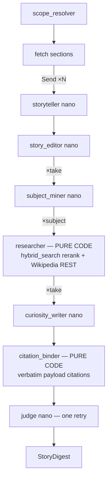

# Extension v2 — Story Timeline + Curiosity Boxes Implementation Plan

> **For agentic workers:** REQUIRED SUB-SKILL: Use superpowers:subagent-driven-development (recommended) or superpowers:executing-plans to implement this plan task-by-task. Steps use checkbox (`- [ ]`) syntax for tracking.

**Goal:** Replace the deepagents extension core with a deterministic async LangGraph pipeline that emits a `StoryDigest` — a timeline of story "takes" (one per section, author's sequence) each carrying a collapsed "curiosity box" of cited expansion bullets, where every citation is copied by code from retrieval payloads (never model-written).

**Architecture:** `scope → fetch → storyteller×N (Send) → story_editor → subject_miner×take (Send) → researcher×subject (pure code) → curiosity_writer×take (Send) → citation_binder (pure code) → judge (one bounded retry) → StoryDigest`. LLM stages use `ChatOpenAI(...).with_structured_output(Schema)`; research and binding are plain Python. Frontend renders a timeline-rail card with per-take toggle boxes (justified text, KaTeX + markdown).

**Tech Stack:** Python 3.12, langgraph (`StateGraph` + `Send`), langchain-openai, pydantic v2, httpx (Wikipedia REST), existing `src/services/chat/retrieval.py` (`hybrid_search`, `fetch_chapter_sections`); React + TS + vitest + KaTeX.

**Spec:** `docs/superpowers/specs/2026-06-10-extension-v2-story-curiosity-design.md`
**Branch:** work in a worktree off `feat/component-equation-enforcement` (use superpowers:using-git-worktrees).

**Conventions used below**
- Run backend tests: `.venv/bin/python -m pytest <path> -q`
- Run frontend tests: `cd web && npx vitest run <path>`
- All new backend files live in `src/services/chat/agents/extension_agents/`; tests in `src/services/chat/tests/`.
- Every commit message ends with `Co-Authored-By: Claude Fable 5 <noreply@anthropic.com>` (omitted below for brevity — DO add it).

## File structure (lock-in)

```
src/services/chat/schemas/output.py        MODIFY  add Citation/CuriosityItem/Take/StoryDigest (keep ExtensionDigest)
src/services/chat/agents/extension_agents/
  _models.py                               MODIFY  v2 stage keys (scope/storyteller/editor/miner/writer/judge)
  research.py                              CREATE  Evidence + corpus_evidence() + wiki_evidence()  [pure code]
  binder.py                                CREATE  bind_citations()  [pure code]
  prompts.py                               REWRITE 5 XML-scaffold prompts (storyteller/editor/miner/writer/judge)
  nodes.py                                 CREATE  langgraph node functions + _structured_llm helper
  graph.py                                 CREATE  build_extension_graph() — StateGraph wiring
  runner.py                                REWRITE run_extension() SSE wrapper around the graph
  export.py                                MODIFY  StoryDigest HTML branch + filename sanitizer
  agent.py                                 DELETE  (deepagents build)
  ../extension_skills/                     DELETE  (3 SKILL.md dirs)
  scope.py, tools.py                       KEEP    (tools.py keeps wikipedia raw fetch helpers used by research.py)
web/src/lib/renderRichText.tsx             CREATE  shared renderMathText+markdown (extracted from ExtensionDigestCard)
web/src/components/StoryDigestCard.tsx     CREATE  timeline rail + toggle boxes
web/src/components/ExtensionDigestCard.tsx MODIFY  import shared renderer (no behavior change)
web/src/components/MessageThread.tsx       MODIFY  StoryDigest dispatch
web/src/types.ts                           MODIFY  StoryDigest TS types
web/src/styles/app.css                     MODIFY  rail/toggle/justify/chips styles
```

---

### Task 1: Schema v2 — `Citation`, `CuriosityItem`, `Take`, `StoryDigest`

**Files:**
- Modify: `src/services/chat/schemas/output.py` (append after `ExtensionDigest`)
- Test: `src/services/chat/tests/test_story_schema.py`

- [ ] **Step 1: Write the failing test**

```python
# src/services/chat/tests/test_story_schema.py
"""StoryDigest schema (extension v2)."""
import pytest
from pydantic import ValidationError

from src.services.chat.schemas.output import Citation, CuriosityItem, StoryDigest, Take


def _corpus_citation(**over):
    base = dict(kind="corpus", label="Moss — Probability §6.5.2, pp. 142–144",
                book_slug="moss", book_name="Probability", authors="Moss", year=2020,
                chapter="ch06", section_id="6.5.2", pages="142–144", chunk_id="abc123")
    base.update(over)
    return Citation(**base)


def test_corpus_citation_roundtrip():
    c = _corpus_citation()
    assert c.kind == "corpus" and c.url is None and c.chunk_id == "abc123"


def test_wikipedia_citation_minimal():
    c = Citation(kind="wikipedia", label="Wikipedia: Chebyshev's inequality",
                 title="Chebyshev's inequality",
                 url="https://en.wikipedia.org/wiki/Chebyshev%27s_inequality")
    assert c.book_slug is None and c.url.startswith("https://")


def test_curiosity_item_requires_at_least_one_citation():
    with pytest.raises(ValidationError):
        CuriosityItem(subject="s", body="b", citations=[])


def test_story_digest_shape():
    item = CuriosityItem(subject="Why $\\delta^{-2}$", body="Because…",
                         citations=[_corpus_citation()])
    take = Take(heading="Chebyshev", story="The chapter opens…", items=[item])
    d = StoryDigest(book="hansen-probability", chapter="ch07 · 7.4–7.5",
                    takes=[take], unfilled_subjects=["history of LLN"])
    assert d.takes[0].items[0].citations[0].book_slug == "moss"
    assert StoryDigest(**d.model_dump()) == d  # persistence roundtrip


def test_take_items_default_empty():
    assert Take(heading="h", story="s").items == []
```

- [ ] **Step 2: Run to verify failure**

Run: `.venv/bin/python -m pytest src/services/chat/tests/test_story_schema.py -q`
Expected: `ImportError: cannot import name 'Citation'`

- [ ] **Step 3: Implement — append to `src/services/chat/schemas/output.py`**

```python
class Citation(BaseModel):
    """One reference attached to a curiosity bullet. Fields are copied VERBATIM
    from retrieval payloads by the citation binder — never model-generated
    (invariant: see docs/system/invariants.md, extension v2)."""

    kind: Literal["corpus", "wikipedia"]
    label: str
    book_slug: str | None = None
    book_name: str | None = None
    authors: str | None = None
    year: int | None = None
    chapter: str | None = None
    section_id: str | None = None
    pages: str | None = None
    title: str | None = None
    url: str | None = None
    chunk_id: str | None = None


class CuriosityItem(BaseModel):
    """One curiosity-box bullet: a subject expanded from evidence only."""

    subject: str
    body: str
    citations: list[Citation] = Field(min_length=1)


class Take(BaseModel):
    """One timeline take (1 source section), story register."""

    heading: str
    story: str
    items: list[CuriosityItem] = Field(default_factory=list)


class StoryDigest(BaseModel):
    """Extension v2 result: story timeline + per-take curiosity boxes."""

    book: str
    chapter: str
    takes: list[Take] = Field(default_factory=list)
    unfilled_subjects: list[str] = Field(default_factory=list)
```

- [ ] **Step 4: Run to verify pass** — same command, expected `5 passed`.

- [ ] **Step 5: Commit** — `git add src/services/chat/schemas/output.py src/services/chat/tests/test_story_schema.py && git commit -m "feat(extension-v2): StoryDigest schema — Citation/CuriosityItem/Take"`

---

### Task 2: Stage-model table v2

**Files:**
- Modify: `src/services/chat/agents/extension_agents/_models.py`
- Test: `src/services/chat/tests/test_extension_models.py` (replace stage names in existing tests)

- [ ] **Step 1: Failing test** — in `test_extension_models.py` replace the v1 stage assertions with:

```python
def test_v2_stage_defaults_exist():
    from src.services.chat.agents.extension_agents._models import STAGE_DEFAULTS
    assert set(STAGE_DEFAULTS) == {"scope", "storyteller", "editor", "miner", "writer", "judge"}


def test_v2_override_and_fallback():
    from src.services.chat.agents.extension_agents._models import resolve_stage_model, STAGE_DEFAULTS
    assert resolve_stage_model("storyteller", {"storyteller": "x-model"}) == "x-model"
    assert resolve_stage_model("editor", None) == STAGE_DEFAULTS["editor"]
    assert resolve_stage_model("unknown-stage", None)  # falls back, never raises
```

- [ ] **Step 2: Run** `.venv/bin/python -m pytest src/services/chat/tests/test_extension_models.py -q` — expected FAIL (old keys).

- [ ] **Step 3: Implement** — in `_models.py` replace `STAGE_DEFAULTS` / `STAGE_TEMPERATURES`:

```python
STAGE_DEFAULTS: dict[str, str] = {
    "scope":       _CHEAP,
    "storyteller": _CHEAP,
    "editor":      _CHEAP,   # upgradeable via extensionModels["editor"]
    "miner":       _CHEAP,
    "writer":      _CHEAP,
    "judge":       _CHEAP,
}

STAGE_TEMPERATURES: dict[str, float] = {
    "scope": 0.0, "storyteller": 0.4, "editor": 0.3,
    "miner": 0.0, "writer": 0.2, "judge": 0.0,
}
```

Keep `resolve_stage_model` / `resolve_stage_temperature` bodies as-is (the
`EXTENSION_JUDGE_MODEL` env hook still applies to `"judge"`).

- [ ] **Step 4: Run** — expected PASS. Also run the whole file: any v1-stage tests that contradict v2 get updated here, not deleted silently.

- [ ] **Step 5: Commit** — `git commit -m "feat(extension-v2): per-stage model table (scope/storyteller/editor/miner/writer/judge)"`

---

### Task 3: `research.py` — Evidence + pure-code researcher

**Files:**
- Create: `src/services/chat/agents/extension_agents/research.py`
- Test: `src/services/chat/tests/test_extension_research.py`

- [ ] **Step 1: Failing tests**

```python
# src/services/chat/tests/test_extension_research.py
"""Pure-code researcher: corpus + wikipedia evidence with verbatim payload meta."""
from types import SimpleNamespace
from unittest.mock import patch

from src.services.chat.agents.extension_agents.research import (
    Evidence, corpus_evidence, wiki_evidence,
)


def _src(**over):
    base = dict(chunk="Chebyshev states that …", book_slug="moss",
                book_name="Probability", authors="Marcus Moss", year=2020,
                chapter_id="ch06", section="6.5.2", page_from=142, page_to=144,
                chunk_id="c-1", score=0.81)
    base.update(over)
    return SimpleNamespace(**base)


def test_corpus_evidence_copies_payload_meta_verbatim():
    with patch("src.services.chat.agents.extension_agents.research.hybrid_search",
               return_value=([_src()], None)) as hs:
        ev = corpus_evidence("tail bounds", subject_id="s1",
                             exclude_book="hansen-probability",
                             all_slugs=["hansen-probability", "moss"], seen_ids=set())
    assert hs.call_args.kwargs["book_slugs"] == ["moss"]      # target book excluded
    assert hs.call_args.kwargs["rerank"] is True
    e = ev[0]
    assert isinstance(e, Evidence) and e.kind == "corpus" and e.subject_id == "s1"
    assert e.meta["book_name"] == "Probability" and e.meta["pages"] == "142–144"
    assert e.meta["section_id"] == "6.5.2" and e.meta["chunk_id"] == "c-1"


def test_corpus_evidence_dedupes_seen_ids():
    seen = {"c-1"}
    with patch("src.services.chat.agents.extension_agents.research.hybrid_search",
               return_value=([_src()], None)):
        ev = corpus_evidence("q", subject_id="s1", exclude_book="x",
                             all_slugs=["x", "moss"], seen_ids=seen)
    assert ev == []


def test_wiki_evidence_returns_title_url_extract():
    payload = {"title": "Chebyshev's inequality",
               "extract": "In probability theory…",
               "content_urls": {"desktop": {"page": "https://en.wikipedia.org/wiki/Chebyshev%27s_inequality"}}}
    with patch("src.services.chat.agents.extension_agents.research._wiki_summary_json",
               return_value=payload):
        ev = wiki_evidence("Chebyshev inequality", subject_id="s2")
    e = ev[0]
    assert e.kind == "wikipedia" and e.meta["title"] == "Chebyshev's inequality"
    assert e.meta["url"].startswith("https://en.wikipedia.org/wiki/")
    assert "probability theory" in e.text


def test_wiki_evidence_empty_on_failure():
    with patch("src.services.chat.agents.extension_agents.research._wiki_summary_json",
               return_value=None):
        assert wiki_evidence("nonexistent zzz", subject_id="s") == []
```

- [ ] **Step 2: Run** — expected `ModuleNotFoundError: research`.

- [ ] **Step 3: Implement `research.py`**

```python
"""Extension v2 researcher — PURE CODE (no LLM).

Turns a subject query into Evidence objects whose ``meta`` is copied verbatim
from retrieval payloads (corpus) or the Wikipedia REST summary (wikipedia).
The citation binder later builds Citation objects ONLY from these metas, which
is what makes extension citations verifiable by construction."""
from __future__ import annotations

import os
import urllib.parse
import uuid
from dataclasses import dataclass, field

import httpx

from src.services.chat.retrieval import hybrid_search

_WIKI_SUMMARY = "https://en.wikipedia.org/api/rest_v1/page/summary/"
_WIKI_SEARCH = "https://en.wikipedia.org/w/api.php"


@dataclass
class Evidence:
    subject_id: str
    kind: str                      # "corpus" | "wikipedia"
    text: str
    meta: dict = field(default_factory=dict)
    id: str = field(default_factory=lambda: uuid.uuid4().hex[:12])


def corpus_evidence(query: str, *, subject_id: str, exclude_book: str,
                    all_slugs: list[str], seen_ids: set[str],
                    top_n: int = 4) -> list[Evidence]:
    """Cross-book hybrid search (rerank ON), payload meta copied verbatim."""
    slugs = [s for s in all_slugs if s != exclude_book]
    if not slugs:
        return []
    floor = float(os.environ.get("EXTENSION_MIN_SCORE", "0"))
    try:
        rows, _ = hybrid_search(query, book_slugs=slugs, top_k=top_n,
                                rerank=True, rerank_top_n=top_n)
    except Exception:  # noqa: BLE001 — retrieval failure degrades to no evidence
        return []
    out: list[Evidence] = []
    for r in rows:
        cid = getattr(r, "chunk_id", "") or ""
        if cid and cid in seen_ids:
            continue
        if floor and (getattr(r, "score", 0) or 0) < floor:
            continue
        if cid:
            seen_ids.add(cid)
        pf, pt = getattr(r, "page_from", None), getattr(r, "page_to", None)
        pages = f"{pf}–{pt}" if pf and pt and pf != pt else (str(pf) if pf else None)
        out.append(Evidence(
            subject_id=subject_id, kind="corpus",
            text=getattr(r, "chunk", "") or getattr(r, "excerpt", "") or "",
            meta={
                "book_slug": getattr(r, "book_slug", None),
                "book_name": getattr(r, "book_name", None),
                "authors": getattr(r, "authors", None),
                "year": getattr(r, "year", None),
                "chapter": getattr(r, "chapter_id", None),
                "section_id": getattr(r, "section", None),
                "pages": pages,
                "chunk_id": cid or None,
            }))
    return out


def _wiki_summary_json(query: str) -> dict | None:
    """REST summary for best-matching article; search-API fallback on miss."""
    def _get(title: str) -> dict | None:
        try:
            r = httpx.get(_WIKI_SUMMARY + urllib.parse.quote(title.replace(" ", "_")),
                          timeout=10.0, headers={"accept": "application/json"})
            return r.json() if r.status_code == 200 else None
        except Exception:  # noqa: BLE001
            return None

    data = _get(query.strip())
    if data is None:
        try:
            sr = httpx.get(_WIKI_SEARCH, timeout=10.0, params={
                "action": "query", "list": "search", "srsearch": query,
                "format": "json", "srlimit": 1})
            hits = sr.json().get("query", {}).get("search", []) if sr.status_code == 200 else []
            if hits:
                data = _get(hits[0]["title"])
        except Exception:  # noqa: BLE001
            data = None
    return data


def wiki_evidence(query: str, *, subject_id: str) -> list[Evidence]:
    data = _wiki_summary_json(query)
    if not data or not data.get("extract"):
        return []
    url = (data.get("content_urls", {}).get("desktop", {}) or {}).get("page", "")
    return [Evidence(subject_id=subject_id, kind="wikipedia", text=data["extract"],
                     meta={"title": data.get("title", query), "url": url})]
```

- [ ] **Step 4: Run** — expected `4 passed`.

- [ ] **Step 5: Commit** — `git commit -m "feat(extension-v2): pure-code researcher — Evidence + corpus/wiki collectors"`

---

### Task 4: `binder.py` — citation binder (the verifiability core)

**Files:**
- Create: `src/services/chat/agents/extension_agents/binder.py`
- Test: `src/services/chat/tests/test_extension_binder.py`

- [ ] **Step 1: Failing tests**

```python
# src/services/chat/tests/test_extension_binder.py
"""Citation binder: bullets cite only via evidence_ids; fields copied verbatim."""
from src.services.chat.agents.extension_agents.binder import BulletDraft, bind_citations
from src.services.chat.agents.extension_agents.research import Evidence


def _ev_corpus(eid="e1", sid="s1"):
    return Evidence(id=eid, subject_id=sid, kind="corpus", text="…",
                    meta={"book_slug": "moss", "book_name": "Probability",
                          "authors": "Marcus Moss", "year": 2020, "chapter": "ch06",
                          "section_id": "6.5.2", "pages": "142–144", "chunk_id": "c-1"})


def _ev_wiki(eid="e2", sid="s1"):
    return Evidence(id=eid, subject_id=sid, kind="wikipedia", text="…",
                    meta={"title": "Chebyshev's inequality",
                          "url": "https://en.wikipedia.org/wiki/Chebyshev%27s_inequality"})


def test_binder_builds_citations_verbatim_from_evidence():
    bullets = [BulletDraft(take_idx=0, subject="Why δ⁻²", body="Because…",
                           evidence_ids=["e1", "e2"])]
    items, dropped = bind_citations(bullets, [_ev_corpus(), _ev_wiki()])
    cits = items[0][1].citations
    corpus = next(c for c in cits if c.kind == "corpus")
    wiki = next(c for c in cits if c.kind == "wikipedia")
    assert corpus.book_name == "Probability" and corpus.pages == "142–144"
    assert corpus.section_id == "6.5.2" and corpus.chunk_id == "c-1"
    assert "Moss" in corpus.label and "6.5.2" in corpus.label
    assert wiki.url.endswith("Chebyshev%27s_inequality") and wiki.label.startswith("Wikipedia:")
    assert dropped == []


def test_binder_drops_bullet_with_no_valid_ids():
    bullets = [BulletDraft(take_idx=0, subject="Ghost", body="…",
                           evidence_ids=["nope"])]
    items, dropped = bind_citations(bullets, [_ev_corpus()])
    assert items == [] and dropped == ["Ghost"]


def test_binder_ignores_invalid_ids_but_keeps_valid_ones():
    bullets = [BulletDraft(take_idx=1, subject="Half", body="…",
                           evidence_ids=["e1", "invented"])]
    items, dropped = bind_citations(bullets, [_ev_corpus()])
    assert len(items[0][1].citations) == 1 and dropped == []


def test_binder_property_no_field_outside_evidence():
    """Every populated citation field value must literally appear in some evidence meta."""
    evs = [_ev_corpus(), _ev_wiki()]
    bullets = [BulletDraft(take_idx=0, subject="x", body="…", evidence_ids=["e1", "e2"])]
    items, _ = bind_citations(bullets, evs)
    allowed = set()
    for e in evs:
        allowed |= {str(v) for v in e.meta.values() if v is not None}
    for _, item in items:
        for c in item.citations:
            for f in ("book_slug", "book_name", "authors", "chapter",
                      "section_id", "pages", "title", "url", "chunk_id"):
                v = getattr(c, f)
                if v is not None:
                    assert str(v) in allowed, f"{f}={v!r} not from evidence"
```

- [ ] **Step 2: Run** — expected `ModuleNotFoundError: binder`.

- [ ] **Step 3: Implement `binder.py`**

```python
"""Citation binder — PURE CODE. Maps writer bullets (evidence_ids) to Citation
objects copied verbatim from Evidence.meta. A bullet with zero valid ids is
dropped and its subject reported (→ unfilled_subjects)."""
from __future__ import annotations

from dataclasses import dataclass, field

from src.services.chat.schemas.output import Citation, CuriosityItem

from .research import Evidence


@dataclass
class BulletDraft:
    take_idx: int
    subject: str
    body: str
    evidence_ids: list[str] = field(default_factory=list)


def _label(e: Evidence) -> str:
    m = e.meta
    if e.kind == "wikipedia":
        return f"Wikipedia: {m.get('title', '')}"
    parts = [m.get("authors") or m.get("book_name") or m.get("book_slug") or "corpus"]
    if m.get("book_name") and m.get("authors"):
        parts.append(f"— {m['book_name']}")
    if m.get("section_id"):
        parts.append(f"§{m['section_id']}")
    if m.get("pages"):
        parts.append(f"pp. {m['pages']}")
    return " ".join(parts)


def _citation(e: Evidence) -> Citation:
    m = e.meta
    return Citation(
        kind="corpus" if e.kind == "corpus" else "wikipedia",
        label=_label(e),
        book_slug=m.get("book_slug"), book_name=m.get("book_name"),
        authors=m.get("authors"), year=m.get("year"), chapter=m.get("chapter"),
        section_id=m.get("section_id"), pages=m.get("pages"),
        title=m.get("title"), url=m.get("url"), chunk_id=m.get("chunk_id"),
    )


def bind_citations(
    bullets: list[BulletDraft], evidence: list[Evidence],
) -> tuple[list[tuple[int, CuriosityItem]], list[str]]:
    """Returns ([(take_idx, CuriosityItem)], dropped_subjects)."""
    by_id = {e.id: e for e in evidence}
    out: list[tuple[int, CuriosityItem]] = []
    dropped: list[str] = []
    for b in bullets:
        cits = [_citation(by_id[i]) for i in b.evidence_ids if i in by_id]
        if not cits:
            dropped.append(b.subject)
            continue
        out.append((b.take_idx,
                    CuriosityItem(subject=b.subject, body=b.body, citations=cits)))
    return out, dropped
```

- [ ] **Step 4: Run** — expected `4 passed`.

- [ ] **Step 5: Commit** — `git commit -m "feat(extension-v2): citation binder — verbatim payload citations, uncited bullets dropped"`

---

### Task 5: Prompts v2

**Files:**
- Rewrite: `src/services/chat/agents/extension_agents/prompts.py`
- Test: `src/services/chat/tests/test_extension_prompts.py` (rewrite)

- [ ] **Step 1: Failing tests** — replace `test_extension_prompts.py` content:

```python
"""Extension v2 prompt scaffolds."""
import src.services.chat.agents.extension_agents.prompts as P

ALL = [P.STORYTELLER_PROMPT, P.EDITOR_PROMPT, P.MINER_PROMPT, P.WRITER_PROMPT, P.JUDGE_PROMPT]


def test_all_prompts_use_xml_scaffold_and_pin_english():
    for p in ALL:
        assert "<role>" in p and "<task>" in p and "<rules>" in p
        assert "ENGLISH" in p.upper()


def test_storyteller_story_register_and_sequence():
    low = P.STORYTELLER_PROMPT.lower()
    assert "story" in low and "take" in low
    assert "author" in low and "sequence" in low or "order" in low


def test_editor_forbids_new_facts():
    low = P.EDITOR_PROMPT.lower()
    assert "no new fact" in low or "do not add" in low
    assert "10%" in P.EDITOR_PROMPT


def test_writer_forbids_writing_citations():
    low = P.WRITER_PROMPT.lower()
    assert "evidence_ids" in P.WRITER_PROMPT
    assert "never write citation" in low or "do not write citation" in low


def test_miner_has_gap_taxonomy():
    low = P.MINER_PROMPT.lower()
    for kind in ("formal-def", "derivation", "comparative", "application", "history"):
        assert kind in low
```

- [ ] **Step 2: Run** — expected FAIL (old prompt names).

- [ ] **Step 3: Implement** — replace `prompts.py` with five prompts. Full text:

```python
"""Extension v2 prompts. Every stage is structured-output enforced; these
scaffolds carry register + hard rules only (schemas live in nodes.py)."""

STORYTELLER_PROMPT = """<role>You are a storyteller distilling ONE textbook section into a narrative "take".</role>
<task>Given the section text (and the previous take's heading for continuity), write:
1. heading — short title for this take (may contain $...$ math),
2. story — 1-3 justified paragraphs narrating the section's pieces of information IN THE AUTHOR'S SEQUENCE (what is introduced, why, what it builds toward). Story register: flowing prose, not bullet lists.
3. key_items — 3-6 short noun phrases naming the concrete pieces of information in this take (used later to mine curiosity subjects).</task>
<rules>
- Write in ENGLISH only, whatever the source language looks like.
- Use $...$ / $$...$$ for ALL math; never \\(...\\) or \\[...\\].
- Stay faithful to THIS section only; no outside knowledge, no spoilers of later sections.
- Markdown bold/italic allowed; no headings inside story.
</rules>"""

EDITOR_PROMPT = """<role>You are a story editor stitching per-section takes into one continuous timeline.</role>
<task>Given the ordered list of take drafts, return the same takes with story text adjusted ONLY for: continuity between consecutive takes, consistent voice/tense, removal of repeated framing sentences.</task>
<rules>
- ENGLISH only.
- NO new facts, formulas, or examples. Do not add content.
- Total length may grow at most 10% over the input.
- Keep headings and the take order untouched; keep all math delimiters as $...$ / $$...$$.
</rules>"""

MINER_PROMPT = """<role>You mine "curiosity subjects" — things a curious reader would want expanded — from one timeline take.</role>
<task>Given a take (heading + story + key_items), propose 2-4 subjects. For each: a short title and 2-3 search queries (mix conceptual phrasing and exact terms; include the book's terminology).</task>
<rules>
- ENGLISH only.
- Use this gap taxonomy, one tag per subject: formal-def | derivation | comparative | application | history.
- Subjects must EXPAND the take (proofs skipped, comparisons unstated, applications unmentioned, historical origin) — never restate it.
</rules>"""

WRITER_PROMPT = """<role>You write curiosity-box bullets for one take, strictly from supplied evidence.</role>
<task>Given the take, its subjects, and Evidence items (each with an id and text), write one bullet per answerable subject: subject title + a justified prose body (markdown bold/italic + $-math allowed) synthesizing ONLY what the evidence says, and the list of evidence_ids you actually used (>=1, prefer >=2).</task>
<rules>
- ENGLISH only.
- NEVER write citation text, source names, page numbers, or URLs in the body — citations are attached by the system from your evidence_ids. Do not write citations yourself.
- If no evidence covers a subject, omit that subject entirely (do not invent).
- Math: $...$ / $$...$$ only. $$ on its own line.
</rules>"""

JUDGE_PROMPT = """<role>You are a coverage judge for one take's curiosity box.</role>
<task>Given the take's mined subjects and the final bullets, list the subject titles that are NOT adequately covered (missing bullet, or bullet that merely restates the take).</task>
<rules>
- ENGLISH only. Return only the failed subject titles, nothing else.
- An adequately covered subject has >=1 bullet grounded in evidence; do not fail subjects for style.
</rules>"""
```

- [ ] **Step 4: Run** — expected `5 passed`.

- [ ] **Step 5: Commit** — `git commit -m "feat(extension-v2): v2 prompt scaffolds (storyteller/editor/miner/writer/judge)"`

---

### Task 6: `nodes.py` — LLM node functions

**Files:**
- Create: `src/services/chat/agents/extension_agents/nodes.py`
- Test: `src/services/chat/tests/test_extension_nodes.py`

- [ ] **Step 1: Failing tests**

```python
# src/services/chat/tests/test_extension_nodes.py
"""Extension v2 LLM nodes — structured outputs, parse-retry, mockable LLM."""
from unittest.mock import AsyncMock, patch

import pytest

from src.services.chat.agents.extension_agents.nodes import (
    SubjectList, TakeDraft, TakeDraftList, WriterOut, WriterBullet,
    run_storyteller, run_editor, run_miner, run_writer, run_judge, JudgeOut,
)


@pytest.mark.asyncio
async def test_storyteller_returns_takedraft():
    draft = TakeDraft(idx=0, heading="Chebyshev", story="The chapter opens…",
                      key_items=["tail bound", "finite variance"])
    fake = AsyncMock(return_value=draft)
    with patch("src.services.chat.agents.extension_agents.nodes._ainvoke", fake):
        out = await run_storyteller(idx=0, section={"h2_path": "7.4 Chebyshev", "text": "…"},
                                    prev_heading=None, stage_models=None)
    assert out.idx == 0 and out.heading == "Chebyshev"


@pytest.mark.asyncio
async def test_storyteller_parse_failure_degrades_to_flagged_raw_take():
    fake = AsyncMock(side_effect=ValueError("parse"))
    with patch("src.services.chat.agents.extension_agents.nodes._ainvoke", fake):
        out = await run_storyteller(idx=2, section={"h2_path": "7.6 X", "text": "Raw section body."},
                                    prev_heading="prev", stage_models=None)
    assert out.idx == 2 and "7.6 X" in out.heading
    assert out.degraded is True and "Raw section body." in out.story
    assert fake.await_count == 2          # one retry happened before degrading


@pytest.mark.asyncio
async def test_writer_output_carries_evidence_ids():
    wo = WriterOut(bullets=[WriterBullet(subject="Why δ⁻²", body="Because…",
                                         evidence_ids=["e1"])])
    fake = AsyncMock(return_value=wo)
    with patch("src.services.chat.agents.extension_agents.nodes._ainvoke", fake):
        out = await run_writer(take_idx=0, take_heading="h", take_story="s",
                               subjects=[], evidence=[], stage_models=None)
    assert out[0].evidence_ids == ["e1"] and out[0].take_idx == 0


@pytest.mark.asyncio
async def test_judge_returns_failed_subjects():
    fake = AsyncMock(return_value=JudgeOut(failed_subjects=["history of LLN"]))
    with patch("src.services.chat.agents.extension_agents.nodes._ainvoke", fake):
        failed = await run_judge(take_heading="h", subjects=["a", "history of LLN"],
                                 bullets_summary="…", stage_models=None)
    assert failed == ["history of LLN"]
```

- [ ] **Step 2: Run** — expected `ModuleNotFoundError: nodes`.

- [ ] **Step 3: Implement `nodes.py`**

```python
"""Extension v2 LLM nodes. Each node = harness (prompt + structured schema)
+ model (resolve_stage_model). One parse retry, then graceful degradation."""
from __future__ import annotations

from langchain_openai import ChatOpenAI
from pydantic import BaseModel, Field

from src.core.config import settings

from ._models import resolve_stage_model, resolve_stage_temperature
from .prompts import (EDITOR_PROMPT, JUDGE_PROMPT, MINER_PROMPT,
                      STORYTELLER_PROMPT, WRITER_PROMPT)
from .binder import BulletDraft
from .research import Evidence


# ── structured-output schemas (LLM-facing) ──────────────────────────────────
class TakeDraft(BaseModel):
    idx: int = 0
    heading: str
    story: str
    key_items: list[str] = Field(default_factory=list)
    degraded: bool = False


class TakeDraftList(BaseModel):
    takes: list[TakeDraft]


class Subject(BaseModel):
    id: str = ""
    take_idx: int = 0
    title: str
    tag: str = "formal-def"
    queries: list[str] = Field(default_factory=list)


class SubjectList(BaseModel):
    subjects: list[Subject]


class WriterBullet(BaseModel):
    subject: str
    body: str
    evidence_ids: list[str] = Field(default_factory=list)


class WriterOut(BaseModel):
    bullets: list[WriterBullet]


class JudgeOut(BaseModel):
    failed_subjects: list[str] = Field(default_factory=list)


# ── invocation helper (patched in tests) ────────────────────────────────────
async def _ainvoke(stage: str, schema, system: str, user: str, stage_models):
    llm = ChatOpenAI(model=resolve_stage_model(stage, stage_models),
                     temperature=resolve_stage_temperature(stage),
                     api_key=settings.openai_api_key,
                     max_retries=6).with_structured_output(schema)
    return await llm.ainvoke([{"role": "system", "content": system},
                              {"role": "user", "content": user}])


async def _with_retry(stage, schema, system, user, stage_models):
    try:
        return await _ainvoke(stage, schema, system, user, stage_models)
    except Exception:  # noqa: BLE001 — one repair retry
        return await _ainvoke(stage, schema, system,
                              user + "\n\nREMINDER: answer ONLY with valid structured output.",
                              stage_models)


# ── node runners ─────────────────────────────────────────────────────────────
async def run_storyteller(*, idx: int, section: dict, prev_heading: str | None,
                          stage_models) -> TakeDraft:
    label = section.get("h2_path") or section.get("section_id") or f"take {idx + 1}"
    user = (f"Previous take heading: {prev_heading or '(this is the first take)'}\n\n"
            f"SECTION: {label}\n\n{section.get('text', '')}")
    try:
        d = await _with_retry("storyteller", TakeDraft, STORYTELLER_PROMPT,
                              user, stage_models)
        d.idx = idx
        return d
    except Exception:  # noqa: BLE001 — degrade, never abort the run
        return TakeDraft(idx=idx, heading=str(label), degraded=True,
                         story=(section.get("text", "") or "")[:1200])


async def run_editor(drafts: list[TakeDraft], stage_models) -> list[TakeDraft]:
    ordered = sorted(drafts, key=lambda d: d.idx)
    user = "\n\n".join(f"[take {d.idx}] {d.heading}\n{d.story}" for d in ordered)
    try:
        out = await _with_retry("editor", TakeDraftList, EDITOR_PROMPT, user, stage_models)
        if len(out.takes) == len(ordered):
            for new, old in zip(out.takes, ordered):
                new.idx, new.key_items, new.degraded = old.idx, old.key_items, old.degraded
            return out.takes
    except Exception:  # noqa: BLE001
        pass
    return ordered  # editor failure → keep drafts


async def run_miner(*, take: TakeDraft, stage_models) -> list[Subject]:
    user = (f"TAKE {take.idx}: {take.heading}\n{take.story}\n"
            f"key_items: {', '.join(take.key_items)}")
    try:
        out = await _with_retry("miner", SubjectList, MINER_PROMPT, user, stage_models)
    except Exception:  # noqa: BLE001
        return []
    for i, s in enumerate(out.subjects[:4]):
        s.take_idx, s.id = take.idx, f"t{take.idx}-s{i}"
    return out.subjects[:4]


async def run_writer(*, take_idx: int, take_heading: str, take_story: str,
                     subjects: list[Subject], evidence: list[Evidence],
                     stage_models) -> list[BulletDraft]:
    ev_block = "\n\n".join(f"[{e.id}] ({e.kind}) {e.text[:1500]}" for e in evidence)
    subj_block = "\n".join(f"- ({s.tag}) {s.title}" for s in subjects)
    user = (f"TAKE: {take_heading}\n{take_story}\n\nSUBJECTS:\n{subj_block}"
            f"\n\nEVIDENCE:\n{ev_block}")
    try:
        out = await _with_retry("writer", WriterOut, WRITER_PROMPT, user, stage_models)
    except Exception:  # noqa: BLE001
        return []
    return [BulletDraft(take_idx=take_idx, subject=b.subject, body=b.body,
                        evidence_ids=b.evidence_ids) for b in out.bullets]


async def run_judge(*, take_heading: str, subjects: list[str],
                    bullets_summary: str, stage_models) -> list[str]:
    user = (f"TAKE: {take_heading}\nSUBJECTS:\n" + "\n".join(f"- {s}" for s in subjects)
            + f"\n\nBULLETS:\n{bullets_summary}")
    try:
        out = await _with_retry("judge", JudgeOut, JUDGE_PROMPT, user, stage_models)
        return [s for s in out.failed_subjects if s in subjects]
    except Exception:  # noqa: BLE001
        return []
```

- [ ] **Step 4: Run** — expected `4 passed`. (`pytest-asyncio` already configured in the suite.)

- [ ] **Step 5: Commit** — `git commit -m "feat(extension-v2): LLM nodes — storyteller/editor/miner/writer/judge with parse retry + degradation"`

---

### Task 7: `graph.py` — pipeline orchestration

**Files:**
- Create: `src/services/chat/agents/extension_agents/graph.py`
- Test: `src/services/chat/tests/test_extension_graph.py`

The graph is plain async Python orchestration (asyncio.gather fan-out) rather
than a langgraph StateGraph: every stage boundary is deterministic, so a
StateGraph adds checkpointer/reducer machinery without buying control flow.
Keep the module name `graph.py` and a single entry `run_pipeline`.

- [ ] **Step 1: Failing test**

```python
# src/services/chat/tests/test_extension_graph.py
"""End-to-end pipeline test with all LLM + retrieval boundaries mocked."""
from unittest.mock import AsyncMock, patch

import pytest

from src.services.chat.agents.extension_agents.binder import BulletDraft
from src.services.chat.agents.extension_agents.graph import run_pipeline
from src.services.chat.agents.extension_agents.nodes import Subject, TakeDraft
from src.services.chat.agents.extension_agents.research import Evidence

SECTIONS = [{"section_id": "7.4", "h2_path": "7.4 Chebyshev", "text": "AAA"},
            {"section_id": "7.5", "h2_path": "7.5 WLLN", "text": "BBB"}]


def _patches():
    ev = Evidence(id="e1", subject_id="t0-s0", kind="wikipedia", text="…",
                  meta={"title": "Chebyshev's inequality", "url": "https://en.wikipedia.org/wiki/X"})
    return [
        patch("src.services.chat.agents.extension_agents.graph.run_storyteller",
              AsyncMock(side_effect=lambda *, idx, section, prev_heading, stage_models:
                        TakeDraft(idx=idx, heading=section["h2_path"], story=f"story {idx}"))),
        patch("src.services.chat.agents.extension_agents.graph.run_editor",
              AsyncMock(side_effect=lambda drafts, sm: sorted(drafts, key=lambda d: d.idx))),
        patch("src.services.chat.agents.extension_agents.graph.run_miner",
              AsyncMock(side_effect=lambda *, take, stage_models:
                        [Subject(id=f"t{take.idx}-s0", take_idx=take.idx,
                                 title=f"subj {take.idx}", queries=["q"])])),
        patch("src.services.chat.agents.extension_agents.graph.corpus_evidence",
              lambda *a, **k: []),
        patch("src.services.chat.agents.extension_agents.graph.wiki_evidence",
              lambda q, *, subject_id: [Evidence(id="e1", subject_id=subject_id,
                                                 kind="wikipedia", text="…",
                                                 meta={"title": "T", "url": "https://w/X"})]),
        patch("src.services.chat.agents.extension_agents.graph.run_writer",
              AsyncMock(side_effect=lambda *, take_idx, take_heading, take_story,
                        subjects, evidence, stage_models:
                        [BulletDraft(take_idx=take_idx, subject=subjects[0].title,
                                     body="body", evidence_ids=[evidence[0].id])]
                        if subjects and evidence else [])),
        patch("src.services.chat.agents.extension_agents.graph.run_judge",
              AsyncMock(return_value=[])),
    ]


@pytest.mark.asyncio
async def test_pipeline_produces_story_digest_with_bound_citations():
    stages: list[str] = []
    with _patches()[0], _patches()[1], _patches()[2], _patches()[3], \
         _patches()[4], _patches()[5], _patches()[6]:
        digest, evidence = await run_pipeline(
            book="hansen-probability", chapter_label="ch07 · 7.4–7.5",
            sections=SECTIONS, all_slugs=["hansen-probability", "moss"],
            stage_models=None, on_stage=lambda k, lbl: stages.append(k))
    assert digest.book == "hansen-probability"
    assert [t.heading for t in digest.takes] == ["7.4 Chebyshev", "7.5 WLLN"]
    assert digest.takes[0].items[0].citations[0].kind == "wikipedia"
    assert digest.unfilled_subjects == []
    assert "story" in stages and "bind" in stages and "judge" in stages
    assert all(e.kind == "wikipedia" for e in evidence)
```

NOTE for the implementer: the chained `with` over `_patches()` calls creates
fresh patch objects per call — refactor to `contextlib.ExitStack` over ONE
`_patches()` list in the actual test file:

```python
import contextlib
with contextlib.ExitStack() as st:
    for p in _patches():
        st.enter_context(p)
    digest, evidence = await run_pipeline(...)
```

- [ ] **Step 2: Run** — expected `ModuleNotFoundError: graph`.

- [ ] **Step 3: Implement `graph.py`**

```python
"""Extension v2 pipeline — deterministic async orchestration.

Stage order: storyteller×N (parallel) → editor → miner×take (parallel) →
researcher×subject (threaded code) → writer×take (parallel) → binder →
judge (ONE bounded retry of miner→research→write for failed takes)."""
from __future__ import annotations

import asyncio
from typing import Callable

from src.services.chat.schemas.output import StoryDigest, Take

from .binder import bind_citations
from .nodes import (TakeDraft, run_editor, run_judge, run_miner,
                    run_storyteller, run_writer)
from .research import Evidence, corpus_evidence, wiki_evidence

OnStage = Callable[[str, str], None]   # (stage_key, label) → emits SSE upstream


async def _research_subject(s, *, exclude_book, all_slugs, seen_ids) -> list[Evidence]:
    out: list[Evidence] = []
    for q in (s.queries or [s.title])[:3]:
        out += await asyncio.to_thread(
            corpus_evidence, q, subject_id=s.id, exclude_book=exclude_book,
            all_slugs=all_slugs, seen_ids=seen_ids, top_n=3)
    out += await asyncio.to_thread(wiki_evidence, s.title, subject_id=s.id)
    return out


async def _box_for_takes(takes, *, book, all_slugs, seen_ids, stage_models, on_stage):
    """miner → researcher → writer for the given takes. Returns (bullets, evidence, subjects)."""
    subj_lists = await asyncio.gather(
        *(run_miner(take=t, stage_models=stage_models) for t in takes))
    subjects = [s for lst in subj_lists for s in lst]

    on_stage("research", f"Researching {len(subjects)} subjects")
    ev_lists = await asyncio.gather(
        *(_research_subject(s, exclude_book=book, all_slugs=all_slugs,
                            seen_ids=seen_ids) for s in subjects))
    evidence = [e for lst in ev_lists for e in lst]
    by_take_ev = {t.idx: [] for t in takes}
    by_take_sub = {t.idx: [] for t in takes}
    for s in subjects:
        by_take_sub[s.take_idx].append(s)
    for e in evidence:
        tk = next((s.take_idx for s in subjects if s.id == e.subject_id), None)
        if tk is not None:
            by_take_ev[tk].append(e)

    on_stage("write", f"Curiosity boxes 0/{len(takes)}")
    bullet_lists = await asyncio.gather(
        *(run_writer(take_idx=t.idx, take_heading=t.heading, take_story=t.story,
                     subjects=by_take_sub[t.idx], evidence=by_take_ev[t.idx],
                     stage_models=stage_models) for t in takes))
    bullets = [b for lst in bullet_lists for b in lst]
    return bullets, evidence, subjects


async def run_pipeline(*, book: str, chapter_label: str, sections: list[dict],
                       all_slugs: list[str], stage_models: dict | None,
                       on_stage: OnStage) -> tuple[StoryDigest, list[Evidence]]:
    seen_ids: set[str] = set()

    # 1. storyteller fan-out (prev_heading = section label of predecessor — cheap continuity)
    drafts: list[TakeDraft] = list(await asyncio.gather(*(
        run_storyteller(idx=i, section=sec,
                        prev_heading=(sections[i - 1].get("h2_path") if i else None),
                        stage_models=stage_models)
        for i, sec in enumerate(sections))))
    for d in sorted(drafts, key=lambda d: d.idx):
        on_stage("story", f"Take {d.idx + 1}/{len(drafts)} — {d.heading}")

    # 2. editor
    on_stage("edit", "Stitch timeline")
    takes_d = await run_editor(drafts, stage_models)

    # 3-5. miner → researcher → writer
    bullets, evidence, subjects = await _box_for_takes(
        takes_d, book=book, all_slugs=all_slugs, seen_ids=seen_ids,
        stage_models=stage_models, on_stage=on_stage)

    # 6. binder
    on_stage("bind", "Binding citations")
    bound, dropped = bind_citations(bullets, evidence)

    # 7. judge + ONE retry round for failed takes
    on_stage("judge", "Coverage check")
    items_by_take: dict[int, list] = {}
    for tk, item in bound:
        items_by_take.setdefault(tk, []).append(item)
    unfilled: list[str] = list(dropped)
    failed_takes = []
    for t in takes_d:
        subs = [s.title for s in subjects if s.take_idx == t.idx]
        if not subs:
            continue
        summary = "\n".join(f"- {i.subject}: {i.body[:200]}"
                            for i in items_by_take.get(t.idx, []))
        failed = await run_judge(take_heading=t.heading, subjects=subs,
                                 bullets_summary=summary, stage_models=stage_models)
        if failed:
            failed_takes.append(t)
            unfilled += failed
    if failed_takes:
        on_stage("judge", f"Retry round — {len(failed_takes)} takes")
        rb, rev, _ = await _box_for_takes(
            failed_takes, book=book, all_slugs=all_slugs, seen_ids=seen_ids,
            stage_models=stage_models, on_stage=on_stage)
        rbound, rdropped = bind_citations(rb, rev)
        evidence += rev
        retried = {t.idx for t in failed_takes}
        recovered_subjects = set()
        for tk, item in rbound:
            items_by_take.setdefault(tk, []).append(item)
            recovered_subjects.add(item.subject)
        unfilled = [u for u in unfilled if u not in recovered_subjects] + rdropped

    takes = [Take(heading=d.heading, story=d.story,
                  items=items_by_take.get(d.idx, []))
             for d in sorted(takes_d, key=lambda d: d.idx)]
    digest = StoryDigest(book=book, chapter=chapter_label, takes=takes,
                         unfilled_subjects=sorted(set(unfilled)))
    return digest, evidence
```

- [ ] **Step 4: Run** — expected `1 passed`.

- [ ] **Step 5: Commit** — `git commit -m "feat(extension-v2): pipeline orchestration — parallel takes, code research, bind, judged retry"`

---

### Task 8: `runner.py` rewrite — SSE wrapper

**Files:**
- Rewrite: `src/services/chat/agents/extension_agents/runner.py` (keep: scope handling incl. `_scope_label`, `_filter_subtopics`, `_needle_matches`, `_section_to_dict`, `_warm_retrieval`, math normalizers; delete: deepagents round loop, `_coerce_digest`, `_parse_digest`, `_run_round`, `_parse_unfilled`, `_max_rounds`)
- Test: `src/services/chat/tests/test_extension_runner.py` (keep scope/label/filter tests; replace run-loop tests)

- [ ] **Step 1: Failing test** — replace the v1 run tests with:

```python
@pytest.mark.asyncio
async def test_run_extension_emits_meta_first_then_story_digest(monkeypatch):
    import src.services.chat.agents.extension_agents.runner as R
    from src.services.chat.schemas.output import StoryDigest, Take

    monkeypatch.setattr(R, "parse_catalog", lambda: [SimpleNamespace(slug="hansen-probability"),
                                                     SimpleNamespace(slug="moss")])
    async def fake_resolve(msg, *, catalog, selected_slugs):
        return None, SimpleNamespace(book_slug="hansen-probability", chapter_id="ch07",
                                     requested_subtopics=[])
    monkeypatch.setattr(R, "aresolve_scope_or_clarify", fake_resolve)
    monkeypatch.setattr(R, "fetch_chapter_sections",
                        lambda **k: [{"section_id": "7.4", "h2_path": "7.4 C", "text": "A"}])
    monkeypatch.setattr(R, "_warm_retrieval", lambda slugs: None)

    digest = StoryDigest(book="hansen-probability", chapter="ch07",
                         takes=[Take(heading="h", story="s")])
    async def fake_pipeline(**kwargs):
        kwargs["on_stage"]("story", "Take 1/1 — h")
        return digest, []
    monkeypatch.setattr(R, "run_pipeline", fake_pipeline)

    events = [e async for e in R.run_extension(SimpleNamespace(
        message="Extend 7.4", bookFilter="ALL", model="m", extensionModels=None))]
    assert events[0]["type"] == "meta" and events[0]["mode"] == "extension"
    so = next(e for e in events if e["type"] == "structured_output")
    assert so["schema"] == "StoryDigest" and so["data"]["takes"][0]["heading"] == "h"
    assert any(e["type"] == "stage" and e["stage"] == "story" for e in events)
    assert any(e["type"] == "sources_full" for e in events)
    assert events[-1]["type"] == "done"
```

(`SimpleNamespace` from `types`; `fetch_chapter_sections` is monkeypatched with
dicts so `_section_to_dict` passes them through.)

- [ ] **Step 2: Run** — expected FAIL (`run_pipeline` not in runner).

- [ ] **Step 3: Implement** — new `run_extension` body (replacing the round loop):

```python
async def run_extension(req: ChatRequest) -> AsyncIterator[dict]:
    t0 = time.time()
    bf = req.bookFilter
    book_slugs = list(bf) if isinstance(bf, list) and bf else []
    yield {"type": "meta", "mode": "extension", "books": book_slugs,
           "sourceCount": 0, "latencyMs": 0, "model": req.model}
    yield {"type": "stage", "stage": "parse", "label": "Resolve scope"}
    catalog = parse_catalog()
    selected = [] if req.bookFilter == "ALL" else list(req.bookFilter)
    clar, res = await aresolve_scope_or_clarify(req.message, catalog=catalog,
                                                selected_slugs=selected)
    if clar is not None:
        yield clar
        yield {"type": "usage", "durationMs": int((time.time() - t0) * 1000),
               "inputTokens": 0, "outputTokens": 0}
        yield {"type": "done"}
        return

    book, chapter = res.book_slug, res.chapter_id
    yield {"type": "stage", "stage": "fetch", "label": f"Fetch {book} {chapter}"}
    all_sections = [_section_to_dict(s) for s in
                    fetch_chapter_sections(book_slug=book, chapter_id=chapter)]
    sections = _filter_subtopics(all_sections, res.requested_subtopics, book_slug=book)
    narrowed = bool(res.requested_subtopics) and len(sections) < len(all_sections)
    chapter_label = _scope_label(chapter, sections, narrowed=narrowed)

    slugs = _all_slugs(catalog)
    _warm_retrieval([s for s in slugs if s != book])   # embedder+reranker on main thread

    stage_q: asyncio.Queue[dict] = asyncio.Queue()
    def on_stage(key: str, label: str) -> None:
        stage_q.put_nowait({"type": "stage", "stage": key, "label": label})

    task = asyncio.create_task(run_pipeline(
        book=book, chapter_label=chapter_label, sections=sections,
        all_slugs=slugs, stage_models=req.extensionModels, on_stage=on_stage))
    while not task.done() or not stage_q.empty():
        try:
            yield await asyncio.wait_for(stage_q.get(), timeout=0.25)
        except asyncio.TimeoutError:
            continue
    digest, evidence = await task

    for pt in digest.takes:          # delimiter safety net (same helpers as v1)
        pt.heading = _normalize_math_delimiters(pt.heading)
        pt.story = _normalize_math_delimiters(_isolate_midline_display(pt.story))
        for it in pt.items:
            it.body = _normalize_math_delimiters(_isolate_midline_display(it.body))

    yield {"type": "structured_output", "schema": "StoryDigest",
           "data": digest.model_dump()}
    yield {"type": "sources_full", "sources": [
        {"kind": e.kind, **{k: v for k, v in e.meta.items() if v is not None}}
        for e in evidence]}
    yield {"type": "usage", "durationMs": int((time.time() - t0) * 1000),
           "inputTokens": 0, "outputTokens": 0}
    yield {"type": "done"}
```

Imports to add at top: `from .graph import run_pipeline`. Token accounting via
callbacks is dropped in v2 step 1 (usage emits duration only) — acceptable, noted in doc 54.

- [ ] **Step 4: Run** the whole runner test file — kept scope tests + new run test all pass.

- [ ] **Step 5: Commit** — `git commit -m "feat(extension-v2): runner — SSE wrapper around deterministic pipeline"`

---

### Task 9: Delete deepagents artifacts

**Files:**
- Delete: `src/services/chat/agents/extension_agents/agent.py`, `src/services/chat/agents/extension_skills/` (whole dir), `src/services/chat/tests/test_extension_agent.py`, `src/services/chat/tests/test_extension_skills.py`
- Modify: `src/services/chat/agents/extension_agents/__init__.py` (drop agent exports if any), `tools.py` (drop `@tool` decorators usage if unused — keep `wikipedia_lookup` only if still imported elsewhere; otherwise delete it and keep file for `make_retrieve_*` only if used; if nothing remains, delete `tools.py` too)

- [ ] **Step 1:** `grep -rn "build_extension_agent\|extension_skills\|make_retrieve_corpus\|make_retrieve_peek\|wikipedia_lookup" src/ --include="*.py" | grep -v tests/` — enumerate remaining references; remove them with the deletions.
- [ ] **Step 2:** Delete the files/dirs listed above; fix imports.
- [ ] **Step 3:** Run FULL backend suite: `.venv/bin/python -m pytest src/services/chat/tests/ -q` — expected: all pass (v1-agent tests deleted, everything else green).
- [ ] **Step 4: Commit** — `git commit -m "chore(extension-v2): remove deepagents core (agent.py, extension_skills, v1 agent tests)"`

---

### Task 10: Export — StoryDigest HTML + filename sanitizer

**Files:**
- Modify: `src/services/chat/agents/extension_agents/export.py` + its API route (grep `"/api/export"` in `src/services/chat/api.py`)
- Test: `src/services/chat/tests/test_extension_export.py` (extend)

- [ ] **Step 1: Failing tests** (append):

```python
def test_export_story_digest_html_structure():
    from src.services.chat.agents.extension_agents.export import render_story_html
    d = StoryDigest(book="hansen-probability", chapter="ch07 · 7.4–7.5", takes=[
        Take(heading="Chebyshev", story="Opens with $\\mu$…", items=[
            CuriosityItem(subject="Why $\\delta^{-2}$", body="Because…",
                          citations=[Citation(kind="wikipedia", label="Wikipedia: X",
                                              title="X", url="https://en.wikipedia.org/wiki/X")])])])
    html = render_story_html(d)
    assert "Chebyshev" in html and "katex" in html.lower()
    assert "footnote" in html.lower()                      # curiosity as footnotes
    assert 'href="https://en.wikipedia.org/wiki/X"' in html
    assert "text-align: justify" in html or "text-align:justify" in html


def test_export_filename_sanitized():
    from src.services.chat.agents.extension_agents.export import zip_filename
    assert zip_filename("hansen-probability", "ch07 · 7.4–7.5") == \
        "hansen-probability-ch07-7.4-7.5-extended.zip"
```

- [ ] **Step 2: Run** — FAIL (`render_story_html` missing).
- [ ] **Step 3: Implement** in `export.py`: `zip_filename(book, chapter)` = lowercase, replace ` · `→`-`, `–`/`—`→`-`, spaces→`-`, collapse `--`; `render_story_html(digest)` reusing the existing HTML/KaTeX scaffold from the v1 renderer: title block, then per take `<section>` with justified story `<p>`, then `<ol class="footnotes">` per take where each `CuriosityItem` is one `<li>` (subject as `<b>` heading; body; citation labels, wiki labels as `<a href>`). Route: detect payload schema — if `"takes"` key → StoryDigest path, else legacy ExtensionDigest path. ZIP still bundles `sources.json` (citations flattened).
- [ ] **Step 4: Run** export tests + full suite — green.
- [ ] **Step 5: Commit** — `git commit -m "feat(extension-v2): ZIP export — story HTML with per-take footnotes, sanitized filename"`

---

### Task 11: Frontend — shared renderer + types

**Files:**
- Create: `web/src/lib/renderRichText.tsx` (move `normalizeMathDelimiters`, `renderInlineMarkdown`, `stripLeadingMarker`, `renderMathText` out of `ExtensionDigestCard.tsx` verbatim; export `renderMathText` + `stripLeadingMarker`)
- Modify: `web/src/components/ExtensionDigestCard.tsx` (import from the new lib; delete local copies)
- Modify: `web/src/types.ts` — append:

```ts
export interface StoryCitation {
  kind: "corpus" | "wikipedia";
  label: string;
  book_slug?: string; book_name?: string; authors?: string; year?: number;
  chapter?: string; section_id?: string; pages?: string;
  title?: string; url?: string; chunk_id?: string;
}
export interface CuriosityItem { subject: string; body: string; citations: StoryCitation[]; }
export interface StoryTake { heading: string; story: string; items: CuriosityItem[]; }
export interface StoryDigest {
  book: string; chapter: string; takes: StoryTake[]; unfilled_subjects: string[];
}
```

- Test: existing `ExtensionDigestCard.test.tsx` must stay green after the extraction (no new tests needed for the move; types compile via tsc).

- [ ] **Step 1:** Extract the four functions into `web/src/lib/renderRichText.tsx` unchanged; update imports in `ExtensionDigestCard.tsx`.
- [ ] **Step 2:** Append types to `types.ts`.
- [ ] **Step 3:** Run `cd web && npx vitest run && npx tsc -p . --noEmit` — all green, exit 0.
- [ ] **Step 4: Commit** — `git commit -m "refactor(web): extract shared rich-text renderer; StoryDigest TS types"`

---

### Task 12: Frontend — `StoryDigestCard`

**Files:**
- Create: `web/src/components/StoryDigestCard.tsx`
- Modify: `web/src/styles/app.css`
- Test: `web/src/components/StoryDigestCard.test.tsx`

- [ ] **Step 1: Failing tests**

```tsx
// @vitest-environment jsdom
import { render, screen, fireEvent } from "@testing-library/react";
import { describe, it, expect } from "vitest";
import StoryDigestCard from "./StoryDigestCard";
import type { StoryDigest } from "../types";

const digest: StoryDigest = {
  book: "hansen-probability", chapter: "ch07 · 7.4–7.5",
  takes: [
    { heading: "Chebyshev $\\delta^{-2}$", story: "The chapter **opens** with $\\mu$.",
      items: [{ subject: "Why $\\delta^{-2}$", body: "Because **worst-case**…",
                citations: [
                  { kind: "corpus", label: "Moss — Probability §6.5.2, pp. 142–144" },
                  { kind: "wikipedia", label: "Wikipedia: Chebyshev's inequality",
                    url: "https://en.wikipedia.org/wiki/X" }] }] },
    { heading: "WLLN", story: "Then…", items: [] },
  ],
  unfilled_subjects: ["history of LLN"],
};

describe("StoryDigestCard", () => {
  it("renders rail nodes, headings, justified story with KaTeX + markdown", () => {
    const { container } = render(<StoryDigestCard digest={digest} />);
    expect(container.querySelectorAll(".story-take").length).toBe(2);
    expect(container.querySelectorAll(".story-take__num").length).toBe(2);
    const story = container.querySelector(".story-take__story")!;
    expect(story.querySelector(".katex")).not.toBeNull();      // KaTeX in story
    expect(story.querySelector("strong")).not.toBeNull();      // markdown in story
  });

  it("curiosity box collapsed by default, expands on toggle, shows chips", () => {
    const { container } = render(<StoryDigestCard digest={digest} />);
    expect(container.querySelector(".curiosity-box__items")).toBeNull();
    fireEvent.click(screen.getByText(/Curiosity box \(1\)/));
    const items = container.querySelector(".curiosity-box__items")!;
    expect(items.querySelector(".katex")).not.toBeNull();      // KaTeX in box
    expect(items.querySelector("strong")).not.toBeNull();      // markdown in box
    const wiki = items.querySelector("a.citation-chip--wiki")!;
    expect(wiki).toHaveAttribute("href", "https://en.wikipedia.org/wiki/X");
    expect(wiki).toHaveAttribute("target", "_blank");
    expect(items.textContent).toContain("Moss — Probability §6.5.2");
  });

  it("expand-all / collapse-all toggles every box", () => {
    const { container } = render(<StoryDigestCard digest={digest} />);
    fireEvent.click(screen.getByRole("button", { name: /expand all/i }));
    expect(container.querySelectorAll(".curiosity-box__items").length).toBe(1); // take 2 has none
    fireEvent.click(screen.getByRole("button", { name: /collapse all/i }));
    expect(container.querySelectorAll(".curiosity-box__items").length).toBe(0);
  });

  it("no curiosity toggle when take has no items; unfilled subjects listed", () => {
    render(<StoryDigestCard digest={digest} />);
    expect(screen.getAllByText(/Curiosity box/).length).toBe(1);
    expect(screen.getByText(/history of LLN/)).toBeInTheDocument();
  });

  it("shows download control", () => {
    render(<StoryDigestCard digest={digest} />);
    expect(screen.getByRole("button", { name: /download/i })).toBeInTheDocument();
  });
});
```

- [ ] **Step 2: Run** — FAIL (module missing).
- [ ] **Step 3: Implement `StoryDigestCard.tsx`**

```tsx
import { useState } from "react";
import StructuredErrorBoundary from "./StructuredErrorBoundary";
import { renderMathText } from "../lib/renderRichText";
import type { StoryDigest, StoryCitation } from "../types";

function Chip({ c }: { c: StoryCitation }) {
  if (c.kind === "wikipedia" && c.url) {
    return (
      <a className="citation-chip citation-chip--wiki" href={c.url}
         target="_blank" rel="noopener noreferrer">🌐 {c.label}</a>
    );
  }
  return <span className="citation-chip citation-chip--corpus" title={c.label}>📕 {c.label}</span>;
}

function StoryDigestCardInner({ digest }: { digest: StoryDigest }) {
  const [open, setOpen] = useState<Set<number>>(new Set());
  const [isDownloading, setIsDownloading] = useState(false);
  const toggle = (i: number) =>
    setOpen((s) => { const n = new Set(s); n.has(i) ? n.delete(i) : n.add(i); return n; });
  const withItems = digest.takes.map((t, i) => [t, i] as const).filter(([t]) => t.items.length > 0);

  const download = async () => {
    setIsDownloading(true);
    try {
      const res = await fetch("/api/export", { method: "POST",
        headers: { "Content-Type": "application/json" }, body: JSON.stringify(digest) });
      if (!res.ok) return;
      const blob = await res.blob();
      const url = URL.createObjectURL(blob);
      const a = document.createElement("a");
      a.href = url; a.download = "story-extended.zip";
      document.body.appendChild(a); a.click(); a.remove(); URL.revokeObjectURL(url);
    } finally { setIsDownloading(false); }
  };

  return (
    <div className="story-card">
      <div className="story-card__hd">
        <span className="story-card__scope">{digest.book} · {digest.chapter} — Story</span>
        <button type="button" onClick={() => setOpen(new Set(withItems.map(([, i]) => i)))}>Expand all</button>
        <button type="button" onClick={() => setOpen(new Set())}>Collapse all</button>
        <button type="button" disabled={isDownloading} onClick={download}>
          {isDownloading ? "Downloading…" : "Download ZIP"}
        </button>
      </div>

      {digest.takes.map((t, i) => (
        <div key={i} className="story-take">
          <div className="story-take__rail">
            <div className="story-take__num">{i + 1}</div>
            {i < digest.takes.length - 1 && <div className="story-take__line" />}
          </div>
          <div className="story-take__body">
            <h3 className="story-take__heading">{renderMathText(t.heading)}</h3>
            <div className="story-take__story">{renderMathText(t.story)}</div>
            {t.items.length > 0 && (
              <div className="curiosity-box">
                <button type="button" className="curiosity-box__toggle" onClick={() => toggle(i)}>
                  {open.has(i) ? "▾" : "▸"} Curiosity box ({t.items.length})
                </button>
                {open.has(i) && (
                  <ul className="curiosity-box__items">
                    {t.items.map((it, j) => (
                      <li key={j} className="curiosity-item">
                        <span className="curiosity-item__subject">{renderMathText(it.subject)}</span>
                        <div className="curiosity-item__body">{renderMathText(it.body)}</div>
                        <div className="curiosity-item__chips">
                          {it.citations.map((c, k) => <Chip key={k} c={c} />)}
                        </div>
                      </li>
                    ))}
                  </ul>
                )}
              </div>
            )}
          </div>
        </div>
      ))}

      {digest.unfilled_subjects.length > 0 && (
        <div className="story-card__unfilled">
          <h4>Unfilled subjects</h4>
          <ul>{digest.unfilled_subjects.map((g, i) => <li key={i}>{renderMathText(g)}</li>)}</ul>
        </div>
      )}
    </div>
  );
}

export default function StoryDigestCard(props: { digest: StoryDigest }) {
  return <StructuredErrorBoundary><StoryDigestCardInner {...props} /></StructuredErrorBoundary>;
}
```

CSS to append in `app.css` (key rules; match existing dark-theme variables):

```css
.story-take { display: flex; gap: 14px; }
.story-take__rail { display: flex; flex-direction: column; align-items: center; }
.story-take__num { width: 26px; height: 26px; border-radius: 50%; background: var(--accent-secondary);
  color: #fff; display: flex; align-items: center; justify-content: center; font-weight: 700; }
.story-take__line { width: 2px; flex: 1; background: color-mix(in srgb, var(--accent-secondary) 30%, transparent); }
.story-take__body { flex: 1; padding-bottom: 18px; min-width: 0; }
.story-take__story, .curiosity-item__body { text-align: justify; }
.curiosity-box { border: 1px solid color-mix(in srgb, var(--accent-secondary) 35%, transparent);
  border-radius: 8px; padding: 8px 12px; margin-top: 8px;
  background: color-mix(in srgb, var(--accent-secondary) 5%, transparent); }
.curiosity-box__toggle { background: none; border: none; color: inherit; font-weight: 700; cursor: pointer; }
.curiosity-box__items { margin: 8px 0 0; padding-top: 8px;
  border-top: 1px dashed color-mix(in srgb, var(--accent-secondary) 25%, transparent); list-style: none; }
.curiosity-item { margin-bottom: 10px; }
.curiosity-item__subject { font-weight: 700; }
.citation-chip { display: inline-block; border: 1px solid var(--border-subtle); border-radius: 10px;
  padding: 1px 8px; margin: 4px 4px 0 0; font-size: 11px; }
.citation-chip--wiki { color: var(--accent-secondary); text-decoration: none; }
```

(`StoryDigestCardInner` wraps in `StructuredErrorBoundary` at export for parity
with the MessageThread-level boundary — the outer one is the operative net; the
inner wrap here is intentionally NOT added, only the boundary at default export,
mirroring no other card. If reviewer flags redundancy with the MessageThread
boundary, drop the local wrap.)

- [ ] **Step 4: Run** `cd web && npx vitest run src/components/StoryDigestCard.test.tsx` — `5 passed`. Then full vitest + tsc.
- [ ] **Step 5: Commit** — `git commit -m "feat(web): StoryDigestCard — timeline rail, toggle curiosity boxes, citation chips, justified text"`

---

### Task 13: MessageThread dispatch + live skeleton

**Files:**
- Modify: `web/src/components/MessageThread.tsx` (add branch inside the StructuredErrorBoundary block):

```tsx
{msg.structuredOutput.schema === "StoryDigest" && (
  <StoryDigestCard digest={msg.structuredOutput.data as unknown as StoryDigest} />
)}
```

- Modify: `web/src/state/chat.ts` — the existing `stage{stage:"story"}` events reuse the `pendingExtensionPoints` mechanism: extend the reducer's `case "stage"` guard from `ev.stage === "point"` to `(ev.stage === "point" || ev.stage === "story")`.
- Test: `web/src/state/chat.test.ts` — add:

```ts
it("stage{stage:'story'} appends to pendingExtensionPoints (v2 skeleton)", () => {
  const s0 = run([send("A"), event("A", { type: "thinking" } as unknown as ChatEvent)]);
  const s1 = storeReducer(s0, event("A", { type: "stage", stage: "story", label: "Take 1/5 — Chebyshev" }));
  const lastMsg = s1.byConv["A"].messages.at(-1) as AssistantMessage;
  expect(lastMsg.pendingExtensionPoints).toEqual(["Take 1/5 — Chebyshev"]);
});
```

And in `MessageThread`-adjacent test (or mapConversationMessages test): a
persisted message with `_schema:"StoryDigest"` produces `structuredOutput.schema === "StoryDigest"` (revive path needs no change — verify only).

- [ ] **Step 1:** failing tests → **Step 2:** implement both edits → **Step 3:** `npx vitest run && npx tsc -p . --noEmit` green → **Step 4: Commit** `git commit -m "feat(web): StoryDigest dispatch in MessageThread + v2 story skeleton events"`

---

### Task 14: Docs lockstep + final gates

**Files:**
- Rewrite: `docs/services/chat-features/54-extension-mode.md` — v2 mermaid:



plus the Agent=Harness+model table from the spec §3 and the env table
(`EXTENSION_MIN_SCORE`, `EXTENSION_JUDGE_MODEL`).
- Modify: `docs/system/invariants.md` — append invariant: *"Extension v2 citations: every `Citation` field is copied verbatim from a retrieval payload or Wikipedia REST response by `binder.py` — LLMs never produce citation text. Verify: `test_extension_binder.py::test_binder_property_no_field_outside_evidence`."*
- Modify: `docs/system/changelog.md` — top entry "2026-06-XX — Extension v2: story timeline + curiosity boxes" summarizing the replacement.
- Modify: `docs/common ground/Elements/modes/extension.html` — replace pipeline diagram with the v2 stage list (same visual language as other mode pages).
- Modify: CLAUDE.md pending row — mark extension v2 as shipped/in-verify.

- [ ] **Step 1:** write all doc updates.
- [ ] **Step 2: Final gates** — `.venv/bin/python -m pytest src/services/chat/tests/ -q` (expect ~870+ pass after v1-test removals/additions), `cd web && npx vitest run` (250+), `npx tsc -p web --noEmit` exit 0.
- [ ] **Step 3: Commit** — `git commit -m "docs(extension-v2): doc 54 rewrite, citation invariant, changelog, Elements page"`

---

### Task 15: Live verify (manual, with user)

- [ ] Start `./scripts/dev.sh` from the implementation worktree; run prompt *"Extend section 7.4 (Chebyshev) and 7.5 (WLLN) of Hansen Probability and Statistics for Economists"* on :5175.
- [ ] Verify in browser: badge EXTENSION MODE; timeline rail renders takes in section order; story justified w/ KaTeX + bold; curiosity boxes collapsed → expand shows cited bullets; 📕 chips show book+section+pages; 🌐 chips open Wikipedia; sources side panel populated; ZIP downloads with sanitized name; footnotes in HTML.
- [ ] Verify persistence: reload page → conv re-renders identically.
- [ ] Record duration + token use; compare vs ~17 min v1 baseline.

**Self-review notes (run after writing):** spec coverage — §3 roster→Tasks 2–8; §4 schema→Task 1; §5 SSE→Task 8/13; §6 frontend→Tasks 11–13; §7 export→Task 10; §8 errors→Tasks 6–7; §9 tests→every task + binder property test (Task 4); §10 lockstep→Task 14; §11 deletions→Task 9. No placeholders; type names consistent (`TakeDraft`/`Subject`/`Evidence`/`BulletDraft`/`StoryDigest` defined before use).
