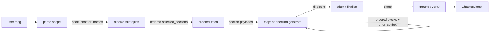

# Chapter Modes (Facilitate + Resume) — Design Spec

**Date:** 2026-05-31
**Branch:** `feat/qa-mode` (chapter modes build on the mode infrastructure; new branch off main at implementation time)
**Status:** approved design → ready for writing-plans

---

## 0 · Goal

Add **two** new chat modes that operate over a chapter's intrinsic structure
rather than search relevance:

- **`facilitate`** — *teach*. A flowing didactic narrative that walks the
  selected topics in order, explaining and scaffolding the ideas.
- **`resume`** — *resumir / compress*. A terse, condensed recap of the same
  ordered span (bullets/synopsis per subtopic), for revisiting before an exam.

Both share two hard properties:

1. **Scoped** to a *limited set of topics/subtopics* the user names within one
   chapter (not whole-corpus search, not necessarily the whole chapter).
2. **Order-preserving** — the chapter has a hidden logic of construction (ideas
   build on each other). The output MUST follow the chapter's intrinsic section
   order. No relevance-reordering, no merging out of sequence.

These differ from the existing modes:

| Mode | Driver | Shape |
|---|---|---|
| `tutor` | query, multi-aspect, may reorder by coverage/relevance | global topic teaching |
| `qa` | single punctual doubt | one scoped answer |
| **`facilitate`** | chapter structure, ordered span | ordered didactic walkthrough |
| **`resume`** | chapter structure, ordered span | ordered compressed recap |

`facilitate` and `resume` are **structural, not search-driven**: the chapter's
section order *is* the output order. Embedding retrieval is used only for the
fuzzy subtopic→heading resolve, never for the main content fetch.

## 1 · Feasibility (payload grounding)

Chunk payloads (`src/ingestion/build_documents.py:_flat_meta`) already carry the
structural backbone needed:

- `book_slug`, `book_name`, `chapter_id`, `section_id`
- `h1`, `h2_path` (subtopic heading path)
- `synopsis` (≤500 chars per section), `page_from`, `page_to`
- `has_formula`, `has_image`, `has_table`, `n_formulas`, `index_extended`

A whole chapter is fetched by a Qdrant **scroll with filter** `book_slug` +
`chapter_id`, ordered by `section_id`. No new ingestion work required.

## 2 · Architecture

- Two new mode ids, siblings to `tutor`/`qa`:
  - `facilitate` (icon `graduation-cap`)
  - `resume` (icon `file-text`)
- Both `arch="multi"` (state-graph runner, like `qa`).
- **One shared agent module** `src/services/chat/agents/chapter.py`, exposing
  `async def run_chapter(req: ChatRequest, history=None) -> AsyncIterator[dict]`,
  mirroring the SSE-emitter shape of `agents/qa.run_qa`. The mode id is read from
  `req.mode`; the only internal branch is which per-section generate prompt to
  use (teach vs compress) and the verbosity knob.
- Registered in `modes.py` as two `ModeSpec`s pointing at the shared runner,
  distinct `system_prompt` (from `prompts/chapter.py`), shared
  `output_schema=ChapterDigest`. Both gated behind `use_v2_modes`.
- Dispatched in `router.py:stream_chat`:
  `if req.mode in ("facilitate", "resume"): run_chapter(req)`. Requires the mode
  in `settings.use_v2_modes`.
- **Chinese wall:** `chapter.py` imports only `src.core.*` and sibling
  `src.services.chat.*`. Structural fetch uses the Qdrant scroll/filter API via
  `src.core.qdrant_store` — not `src.ingestion`. The closest-match resolve
  borrows the existing hybrid query in `retrieval.py` (a chat-service sibling),
  scoped to the chosen chapter.
- Does **not** reuse the tutor density / author-diversity / coverage /
  figure-judge / orchestrator-workers stack.

## 3 · Pipeline — Approach A (per-section map + stitch)

```
parse-scope → resolve-subtopics → ordered-fetch → map(per-section, in order) → stitch/finalise → ground
```

Mermaid (for `docs/services/chat-features/NN-chapter-modes.md`):



| Node | Input | Output | Model | Fail-open |
|---|---|---|---|---|
| **parse-scope** | raw user msg | `ChapterScope{book_slug, chapter_id, requested_subtopics[]}` | nano | parse fail → whole chapter, `requested_subtopics=[]` |
| **resolve-subtopics** | requested names + chapter's real `h2_path` set (scrolled) | ordered `selected_sections[]` + `resolution[]` (`asked → matched_h2`, fuzzy/semantic via hybrid query scoped to chapter) | nano + embeddings | no match for a name → drop it, note in `resolution`; `[]` requested → all sections |
| **ordered-fetch** | `selected_sections` | full section payloads (`text`, `synopsis`, formulas, page) **sorted by `section_id`** | none (scroll) | section text missing → use `synopsis` |
| **map** | each section + running `prior_context` digest | per-section `ChapterBlock` (teach OR compress, per mode) | nano | one section errors → emit `synopsis` as `body`, continue |
| **stitch** | ordered blocks | `intro` + connective transitions + `outro`; order untouched | nano | error → empty intro/outro, blocks as-is |
| **ground** | blocks + source sections | `grounding{ok, unsupported[], confidence}` | nano | error → `ok=false`, low confidence; never blocks output |

- **Order-preservation is structural:** the section sequence (sorted by
  `section_id`) is fixed *before any LLM runs*. The map node walks sections in
  that order; each call receives a compact `prior_context` (the build-of-ideas
  so far) so transitions respect the author's logic. Reordering is impossible by
  construction.
- `facilitate` vs `resume` differ **only at the map node**: teach prompt
  (~250–400 tok/section, narrative, intuition) vs compress prompt
  (~60–100 tok/section, terse bullets). Gated on `req.mode` via a `CHAPTER_MODE`
  verbosity branch. Everything else shared.
- **Streaming:** each completed map block streams as it finishes (token stream +
  a `stage` event carrying its `h2_path`) so the user watches the chapter build
  in order — important UX for long spans.

### "Closest-match + confirm" (the resolve contract)

When the user names a subtopic not present verbatim in the chapter, the resolve
node fuzzy/semantic-matches it to the nearest real `h2_path` (hybrid query
scoped to that chapter), records the mapping in `resolution[]` as
`asked → matched_h2` with a score, and proceeds. The frontend surfaces this
("interpreted *X* as *Y*") so the match is transparent. A name with no
acceptable match is dropped and noted. Empty `requested_subtopics` → whole
chapter in order.

## 4 · Schemas

### 4.1 Output (`src/services/chat/schemas/output.py`)

```python
class ResolvedSubtopic(BaseModel):
    asked: str            # what the user named
    matched_h2: str       # real h2_path it resolved to ("" if dropped)
    section_id: str
    score: float          # match confidence (1.0 = whole-chapter default)

class ChapterScope(BaseModel):
    book_slug: str
    chapter_id: str
    requested_subtopics: list[str] = Field(default_factory=list)  # [] = whole chapter
    resolution: list[ResolvedSubtopic] = Field(default_factory=list)

class ChapterBlock(BaseModel):
    h2_path: str          # subtopic heading (order = list position)
    section_id: str
    body: str             # teach narrative OR compressed bullets (markdown, inline [n])
    page_from: int = -1
    page_to: int = -1

class ChapterDigest(BaseModel):
    mode: Literal["facilitate", "resume"]
    scope: ChapterScope                # echoed for UI transparency
    intro: str = ""                    # stitch-generated lead-in
    blocks: list[ChapterBlock]         # ORDERED — list order = chapter order
    outro: str = ""
    citations: list[TutorCitation] = Field(default_factory=list)  # REUSE
    math_blocks: list[str] = Field(default_factory=list)
    grounding: dict = Field(default_factory=dict)  # {ok, unsupported[], confidence}
```

- `blocks` list order **is** the chapter order — frontend renders top-to-bottom,
  no sort.
- Reuses `TutorCitation` so existing citation cards render unchanged.
- Single schema shared by both modes; the `mode` field tells the renderer which
  header/styling to apply.

### 4.2 Request / mode id

- `src/services/chat/schemas/_core.py`:
  `ModeId = Literal["tutor", "qa", "facilitate", "resume"]`.
- `src/services/chat/schemas/__init__.py`: re-export `ResolvedSubtopic`,
  `ChapterScope`, `ChapterBlock`, `ChapterDigest`.
- No new `ChatRequest` fields. `stageModels` already supports per-stage override;
  stage keys are `"resolve"`, `"map"`, `"stitch"`, `"ground"`.

## 5 · SSE contract

Reuses the existing event sequence (frontend changes are additive):

```
meta → stage(parse) → stage(resolve) → stage(fetch) →
stage(map:<h2>)…token… (one per section, in order) →
stage(stitch) → stage(ground) →
structured_output{schema:"ChapterDigest", data:{…}} → sources_full →
retrieval_meta → usage → done
```

- New `structured_output.schema` value: `"ChapterDigest"`. Frontend selects the
  chapter renderer on this value; unknown schemas already fall back gracefully.
- Per-section `stage` events carry the `h2_path` label so the (i) pipeline modal
  and the thread animate the chapter assembling in order.

## 6 · Models — cost-benefit

All nodes default to **`gpt-5.4-nano`** — consistent with `qa`, cost-first,
strong instruction-adherence + reliable structured JSON, native OpenAI (no extra
key, not chat-only). The **map** node dominates cost (N calls, one per section);
nano keeps a 30-section `facilitate` run to a few cents. `resume` is cheaper
(shorter per-section output). Per-node override stays available via `stageModels`
(`resolve` / `map` / `stitch` / `ground`) for power users.

`cost.py:PRICE_PER_1M` must include the nodes' model; reuse the entries added in
the `qa` build.

## 7 · Env flags

| Flag | Default | Meaning |
|---|---|---|
| `CHAPTER_RESOLVE` | `1` | enable fuzzy subtopic→`h2_path` resolve (0 = exact match only) |
| `CHAPTER_MAX_SECTIONS` | `30` | safety cap on sections per run (huge chapters) |
| `CHAPTER_STITCH` | `1` | enable connective stitch pass (0 = raw concat of blocks) |
| `CHAPTER_GROUND` | `1` | enable grounding-verify node (0 = skip) |
| `CHAPTER_RESOLVE_MODEL` / `CHAPTER_MAP_MODEL` / `CHAPTER_STITCH_MODEL` / `CHAPTER_GROUND_MODEL` | nano | per-node model env override (below `stageModels`) |

`facilitate` and `resume` must be added to the `use_v2_modes` setting for the
router to dispatch them.

## 8 · Frontend (`web/`)

- **Types:** `web/src/types.ts` `ModeId` mirrors `_core.py` (add `facilitate`,
  `resume`) — lockstep.
- **Mode selector:** two new chips in `ModePicker` (teach icon / compress icon).
- **Chapter picker:** in the input area — book → chapter dropdown (from existing
  collection/manifest metadata) + a free-text "subtopics" field. Picking a
  chapter is required; subtopics optional (empty = whole chapter).
- **Renderer:** new `ChapterDigestCard.tsx` keyed on
  `schema === "ChapterDigest"`: `intro`, then ordered `blocks` (each: `h2_path`
  heading + body + page ref + citation pills, reusing existing pills), `outro`, a
  **resolution line** ("interpreted *X* as *Y*") when any subtopic was
  fuzzy-matched, and a grounding badge (✓ grounded / ⚠ partial from
  `grounding.confidence`). `resume` renders compact; `facilitate` renders
  spacious — branched on the `mode` field.
- **Pipeline diagram:** new `web/src/data/chapterPipeline.ts` (6 nodes) consumed
  by `PipelineDiagram`. The (i) modal for these modes must visually match this
  design — per CLAUDE.md the modal is the source of truth users see. Both modes
  share the diagram (only node-label copy verbosity differs, gated on `mode`).

## 9 · Error handling

- Every node fail-opens per the §3 table; the pipeline always emits a
  `ChapterDigest`, never a hard 500 for routine LLM hiccups.
- Empty chapter / bad `chapter_id`: honest "chapter not found — here are the
  available chapters" listing real `chapter_id`s, empty `citations`, never a
  fabricated citation.
- Grounding is advisory: it degrades the badge, it does not suppress output.

## 10 · Testing

- `src/services/chat/tests/test_chapter_agent.py`:
  - resolve fuzzy-matches a near-miss subtopic name to the right `h2_path`.
  - ordered-fetch returns sections sorted by `section_id`.
  - **order-preservation (core invariant):** output `blocks` sequence ==
    input `section_id` sequence (hard assertion).
  - `facilitate` block body length ≫ `resume` block body length for the same
    section (verbosity branch works).
  - empty `requested_subtopics` → whole chapter.
  - empty/invalid chapter → honest miss message, no fabricated citation.
- `src/services/chat/tests/test_chapter_schema.py`: `ChapterDigest` /
  `ChapterScope` / `ChapterBlock` / `ResolvedSubtopic` validation + one
  schema-repair-retry path (ADR-005).
- `web/src/components/ChapterDigestCard.test.tsx`: renders ordered blocks,
  resolution line, grounding badge; compact vs spacious by `mode`.
- `web/src/data/chapterPipeline` diagram parity test (with `PipelineDiagram`).

## 11 · Synced artifacts (CLAUDE.md interconnected-stage rule)

A logic change is incomplete until **all** of these reflect it:

| Aspect | Path |
|---|---|
| Agent logic | `src/services/chat/agents/chapter.py` |
| Prompts | `src/services/chat/prompts/chapter.py` (teach + compress map prompts, resolve, stitch, ground) |
| Output schema | `src/services/chat/schemas/output.py` (+ `__init__` re-export) |
| Mode id | `src/services/chat/schemas/_core.py` |
| Mode registration | `src/services/chat/modes.py` (×2 specs) |
| Dispatch | `src/services/chat/router.py` |
| Cost table | `src/services/chat/cost.py` |
| Frontend types | `web/src/types.ts` |
| Mode selector | `web/src/components/ModePicker.tsx` |
| Renderer | `web/src/components/ChapterDigestCard.tsx` (+ `MessageThread` wiring) |
| Chapter picker | input-area component (book/chapter dropdown + subtopics field) |
| Pipeline diagram | `web/src/data/chapterPipeline.ts` + `PipelineDiagram.tsx` |
| Per-feature doc | `docs/services/chat-features/NN-chapter-modes.md` (+ mermaid) |
| Invariants + changelog | `docs/system/invariants.md`, `docs/system/changelog.md` |
| Service doc | `docs/services/chat.md` (mention the two new modes) |
| Tests | the files in §10 |

## 12 · Out of scope (YAGNI)

- No figure retrieval / vision (a tutor concern).
- No author-diversity, coverage, or orchestrator-workers.
- No cross-chapter spans (one chapter per run).
- No progress-persistence / "resume where I left off" — `resume` here means
  *resumir / summarize*, not session continuation.
- No relevance-reordering — order is always the chapter's intrinsic
  `section_id` order.
- No new request knobs beyond the existing `stageModels`.
