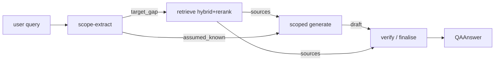

# Q&A Mode — Design Spec

**Date:** 2026-05-31
**Branch:** `feat/qa-mode`
**Status:** approved design → ready for writing-plans

---

## 0 · Goal

Add a second chat mode, `qa`, for **punctual, to-the-point answers**. Tutor mode
teaches a topic globally (multi-aspect, scaffolded, long). Q&A answers a single
specific doubt and nothing else.

Driving example:

> "What is the bias–variance tradeoff? I know what the elements are, except the
> tradeoff."

Expected Q&A output: a direct explanation of *the tradeoff only* — no definition
of bias, no definition of variance, no applications, no examples — because the
user stated they already know those.

Two failure modes matter equally:

1. **Scoping** — answering more than the specific gap (re-explaining what the
   user already knows) is a failure.
2. **Grounding** — a punctual answer has no scaffolding to hedge behind, so a
   hallucinated direct answer is nakedly wrong. Answers must be corpus-grounded
   and cited.

## 1 · Why this shape (book grounding)

RAG patterns surveyed from the ingested textbooks (hindsight `claude-code` bank):

| Pattern | Source | Relevance |
|---|---|---|
| Naive RAG (embed→top-k→stuff→generate) | RAG-Driven GenAI ch1 | base case, no quality control |
| Advanced RAG (pre: rewrite/expand; post: rerank) | RAG-Driven GenAI ch1/ch4 | **already implemented** in repo `retrieval.py` (hybrid dense+sparse+RRF+rerank) |
| Modular RAG (swappable retriever) | RAG-Driven GenAI ch1/ch4 | repo retrieval is already modular |
| Adaptive RAG (route: skip / feedback / standard) | RAG-Driven GenAI ch5 | informs the "no hits → don't fabricate" branch |
| **4-node LangGraph RAG** (retrieve→generate→double-check→finalise) | Generative AI with LangChain ch4 | **primary blueprint** — grounding-verify + citation attribution |
| Eval (LLM-as-judge, conciseness criterion) | Generative AI with LangChain ch8 | conciseness KPI for tests |

The books optimize **retrieval + grounding**; none solve **answer-scoping**
("the user already knows X"). That is the genuinely new part of this feature and
is handled by a dedicated scope-extraction node. The grounding half reuses the
LangChain-book ch4 verify-node idea.

Q&A = `scope → Advanced-RAG retrieve (reuse) → scoped generate → verify/finalise`.
It is **not** naive (has quality control) and **not** the deep-tutor pipeline
(that is the global-learning mode that already exists).

## 2 · Architecture

- New mode id `"qa"`, sibling to `"tutor"`. Registered in `modes.py`
  (`arch="multi"`, `output_schema=QAAnswer`).
- New agent module `src/services/chat/agents/qa.py`, exposing
  `async def run_qa(req: ChatRequest, history=None) -> AsyncIterator[dict]`,
  mirroring the SSE-emitter shape of `agents/deep_tutor.run_deep_tutor`.
- Dispatched in `router.py:stream_chat`: `if req.mode == "qa": run_qa(req)`.
  Requires `"qa"` in `settings.use_v2_modes` (feature-flag rollout, same as
  tutor).
- Reuses the existing hybrid retrieval functions in `retrieval.py` directly
  (graph node, not the tutor tool-loop). Does **not** reuse the tutor density /
  author-diversity / coverage / figure-judge / orchestrator-workers stack.
- **Chinese wall:** `qa.py` imports only `src.core.*` and sibling
  `src.services.chat.*`. No imports from `src.ingestion` or other services.

## 3 · Pipeline — four nodes

```
scope → retrieve → generate(scoped) → verify/finalise
```

Mermaid (for `docs/services/chat-features/NN-qa-mode.md`):



| Node | Input | Output | Model | Fail-open behaviour |
|---|---|---|---|---|
| **scope** | raw user query | `QAScope{target_gap, assumed_known[], answer_form}` | nano | parse fail → `target_gap = whole query`, `assumed_known = []`, `answer_form = "explanation"` |
| **retrieve** | `target_gap` (sharper than raw query) | top-k `Source` list (hybrid + rerank, k = `QA_TOP_K`, default 4) | none (embeddings only) | 0 hits → emit honest "not covered in selected books", skip generate, no fabricated citation |
| **generate** | `target_gap` + `assumed_known` + sources | `QAAnswer` draft (terse markdown, inline `[n]` markers) | nano | `ValidationError` → one schema-repair retry (ADR-005) |
| **verify** | draft + sources | grounded answer + `grounding{ok, unsupported[], confidence}` | nano | verify error → keep draft, set `grounding.ok = false`, `confidence` low; never blocks output |

- The **scope node** is the scoping half: it makes `assumed_known` explicit so
  generation can be hard-instructed to skip those items.
- The **verify node** is the grounding half: it checks every claim in the draft
  is supported by the retrieved sources, strips/flags unsupported claims, and
  sets a confidence the UI renders as a badge. Advisory, not a hard gate.

## 4 · Schemas

### 4.1 Output (`src/services/chat/schemas/output.py`)

```python
class QAScope(BaseModel):
    target_gap: str
    assumed_known: list[str] = Field(default_factory=list)
    answer_form: Literal[
        "explanation", "definition", "comparison",
        "derivation", "yes_no", "list",
    ] = "explanation"

class QAAnswer(BaseModel):
    text: str                                  # terse markdown, inline [n] markers
    citations: list[TutorCitation] = Field(default_factory=list)  # REUSE
    math_blocks: list[str] = Field(default_factory=list)
    scope: QAScope                             # echoed for UI transparency
    grounding: dict = Field(default_factory=dict)  # {ok: bool, unsupported: [str], confidence: float}
```

- Reuses `TutorCitation` so the existing frontend citation cards render
  unchanged.
- No `sections`, `figures`, or `aspects` — deliberately lean vs `TutorAnswer`.

### 4.2 Request / mode id

- `src/services/chat/schemas/_core.py`: `ModeId = Literal["tutor", "qa"]`.
- `src/services/chat/schemas/__init__.py`: re-export `QAScope`, `QAAnswer` if it
  re-exports output models.
- No new `ChatRequest` fields required. `stageModels` already supports per-stage
  override; Q&A stage keys are `"scope"`, `"generate"`, `"verify"`.

## 5 · SSE contract

Reuses the existing event sequence (frontend changes are additive):

```
meta → stage(×N, one per node) → token(stream of generate) →
structured_output{schema:"QAAnswer", data:{…}} → sources_full →
retrieval_meta → usage → done
```

- New `structured_output.schema` value: `"QAAnswer"`. Frontend selects the Q&A
  renderer on this value; unknown schemas already fall back gracefully.
- `stage` events carry node id + label so the (i) pipeline modal animates the
  four nodes. (If deep_tutor's stage event has a fixed shape, Q&A reuses it.)

## 6 · Models — cost-benefit

Workload: generate node ≈ 1800 input / 250 output tokens (short vs tutor's
~2800 output). Estimated `$ / generate call`:

| Model | Provider | in/out $/1M | $/call | Notes |
|---|---|---|---|---|
| **gpt-5.4-nano** | OpenAI | 0.10 / 0.40 | **0.00028** | best instruction-adherence + reliable structured JSON; project default; native (not chat-only) |
| llama-4-scout | Groq | 0.11 / 0.34 | 0.00028 | tied cheapest, fast; Groq chat-only, weaker strict-scope + JSON |
| gpt-oss-20b | Groq | 0.10 / 0.50 | 0.00031 | cheap/fast; same Groq caveats |
| gpt-4o-mini | OpenAI | 0.15 / 0.60 | 0.00042 | solid, no upside over nano here |
| gemini-2.5-flash | Google | ~0.15 / 0.60 | ~0.00042 | 1M ctx wasted on short Q&A; extra key |
| qwen-plus | Alibaba | ~0.40 / 1.20 | ~0.00102 | won tutor *draft* battle (long-output consistency — irrelevant for short Q&A); 3.6× nano |
| deepseek-chat | DeepSeek | 0.27 / 1.10 | 0.00076 | fine, 2.7× nano |
| deepseek-v4-pro / gemini-pro / qwen-max | — | $$+ | 5–10×+ | overkill |
| gpt-5.4 full | OpenAI | 5.0 / 15.0 | 0.01275 | 45× nano — never for punctual |

**Verdict:** default all four LLM nodes to **`gpt-5.4-nano`**. Cheapest tier and
best at the two things Q&A needs — strict scope-obedience and reliable
structured output — native OpenAI (no extra provider key, not chat-only).
Qwen-plus's advantage is long-output consistency, which a 250-token answer never
exercises. Per-stage override stays available via `stageModels`
(`scope` / `generate` / `verify`) for power users.

Pricing note: `cost.py:PRICE_PER_1M` currently lacks gemini + qwen entries; add
them while wiring Q&A so the cost log is accurate.

## 7 · Env flags

| Flag | Default | Meaning |
|---|---|---|
| `QA_TOP_K` | `4` | retrieved sections (narrow for precision) |
| `QA_SCOPE` | `1` | enable scope-extraction node (0 = treat raw query as gap) |
| `QA_VERIFY` | `1` | enable grounding-verify node (0 = emit draft as-is) |
| `QA_SCOPE_MODEL` / `QA_GENERATE_MODEL` / `QA_VERIFY_MODEL` | nano | per-node model env override (below `stageModels`) |

`"qa"` must be added to the `use_v2_modes` setting for the router to dispatch it.

## 8 · Frontend (`web/`)

- **Mode selector:** add a `"qa"` chip beside tutor (icon `target`/`zap`).
  `ModeId` in `web/src/types.ts` mirrors `_core.py` in lockstep.
- **Renderer:** `QAAnswerCard` (new) or a branch in `MessageThread` keyed on
  `schema === "QAAnswer"`: terse answer body + citation pills (reuse existing) +
  a small "Scope" line ("Answering: *target_gap* · assuming you know:
  *assumed_known*") + a grounding badge (✓ grounded / ⚠ partial, from
  `grounding.confidence`).
- **Pipeline diagram:** new `web/src/data/qaPipeline.ts` (four nodes) consumed by
  `PipelineDiagram`. The (i) modal for Q&A must visually match this design — per
  CLAUDE.md, the modal is the source of truth users see.

## 9 · Error handling

- Every node fail-opens per the table in §3; the pipeline always emits a
  `QAAnswer` (or an honest corpus-miss message), never a hard 500 for routine LLM
  hiccups.
- Hard corpus miss (0 retrieved sources): honest "this isn't covered in the
  selected books" with empty `citations` — never a fabricated citation.
- Verify is advisory: it degrades the grounding badge, it does not suppress the
  answer.

## 10 · Testing

- `tests/test_qa_agent.py`:
  - scope extraction parses the bias–variance example → `target_gap` ≈ "the
    tradeoff", `assumed_known` includes bias and variance.
  - retrieve node queries with `target_gap`, not the raw user message.
  - generate honours `assumed_known` (asserts the answer does **not**
    re-define bias/variance when listed as known).
  - verify flags an injected unsupported claim and lowers confidence.
- `tests/test_qa_schema.py`: `QAAnswer` / `QAScope` validation + one repair-retry
  path.
- `web/src/components/QAAnswerCard.test.tsx`: renders scope line, citation pills,
  grounding badge.
- `web/src/data/qaPipeline` diagram test (parity with `PipelineDiagram`).
- Conciseness KPI (LangChain-book ch8): Q&A answer length ≪ tutor answer length
  for the same query (sanity assertion, not a hard gate).

## 11 · Synced artifacts (CLAUDE.md interconnected-stage rule)

A logic change is incomplete until **all** of these reflect it:

| Aspect | Path |
|---|---|
| Agent logic | `src/services/chat/agents/qa.py` |
| Prompts | `src/services/chat/prompts/qa.py` |
| Output schema | `src/services/chat/schemas/output.py` (+ `__init__` re-export) |
| Mode id | `src/services/chat/schemas/_core.py` |
| Mode registration | `src/services/chat/modes.py` |
| Dispatch | `src/services/chat/router.py` |
| Cost table | `src/services/chat/cost.py` (add gemini + qwen prices) |
| Frontend types | `web/src/types.ts` |
| Mode selector | mode-chip component |
| Renderer | `web/src/components/QAAnswerCard.tsx` (+ `MessageThread` wiring) |
| Pipeline diagram | `web/src/data/qaPipeline.ts` + `PipelineDiagram.tsx` |
| Per-feature doc | `docs/services/chat-features/NN-qa-mode.md` (+ mermaid) |
| Invariants + changelog | `docs/system/invariants.md`, `docs/system/changelog.md` |
| Service doc | `docs/services/chat.md` (mention the new mode) |
| Tests | the files in §10 |

## 12 · Out of scope (YAGNI)

- No figure retrieval / vision in Q&A (that is a tutor concern).
- No author-diversity, coverage, or orchestrator-workers.
- No multi-turn "refine" chips (could be a later iteration; not this build).
- No new request knobs beyond the existing `stageModels`.
