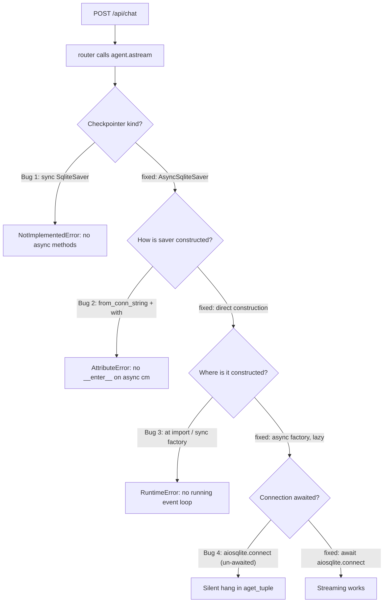

# Chat Service — Bug-fix Log

- **Date**: 2026-05-18
- **Scope**: End-to-end probe of the chat service (`src/services/chat/` + `web/`). Async checkpointer wiring, Tutor citation rendering, frontend dev-server confusion, settings affordance.
- **Contributors**: session

This log is reference history. The codebase already contains every fix described below; entries are ordered by the sequence in which the bugs surfaced during the probe.

---

## Saver-flow diagnostic chain (Bugs 1–4)

Four bugs in a row, all on the path from "POST `/api/chat`" to "first agent step persisted to SQLite". Each fix revealed the next defect downstream.

---

## Bug 1 — `SqliteSaver does not support async methods`

**commit-title**: `fix(chat): add AsyncSqliteSaver factory for router astream path`

- **Symptom**: POSTing to `/api/chat` returned an `error` SSE event:
  - `code = NotImplementedError`
  - `message = "The SqliteSaver does not support async methods. Consider using AsyncSqliteSaver instead."`
- **Root cause**: `src/services/chat/checkpointer.py` exposed only the sync `langgraph.checkpoint.sqlite.SqliteSaver`, but the v2 router invokes `agent.astream(...)`. LangGraph refuses to drive a sync saver from an async path.
- **Fix**: introduced `get_async_checkpointer()` returning `langgraph.checkpoint.sqlite.aio.AsyncSqliteSaver`. Sync and async savers share `settings.checkpointer_db`. The sync side creates the LangGraph tables (`saver.setup()`); the async side reuses them via `_ensure_tables_exist()` so an async-only process still bootstraps cleanly.
- **Files**: `src/services/chat/checkpointer.py` (factory + table bootstrap, lines 53–139).

## Bug 2 — `_AsyncGeneratorContextManager has no attribute __enter__`

**commit-title**: `fix(chat): construct AsyncSqliteSaver directly, skip async cm`

- **Symptom**: After Bug 1, the container raised `AttributeError: '_AsyncGeneratorContextManager' object has no attribute '__enter__'`.
- **Root cause**: `AsyncSqliteSaver.from_conn_string(...)` returns an **async** context manager — it requires `async with` to enter. The sync-style `cm.__enter__()` used by the sibling sync factory does not apply.
- **Fix**: bypassed `from_conn_string` entirely on the async side. Build the saver directly by passing an `aiosqlite.Connection` to `AsyncSqliteSaver(conn)`.
- **Files**: `src/services/chat/checkpointer.py:137-138`.

## Bug 3 — `RuntimeError: no running event loop` in `AsyncSqliteSaver.__init__`

**commit-title**: `fix(chat): defer async checkpointer construction to event loop`

- **Symptom**: Module-level / sync-factory construction of the saver raised `RuntimeError: no running event loop`.
- **Root cause**: `AsyncSqliteSaver.__init__` creates an `asyncio.Lock`, which calls `asyncio.get_running_loop()`. There is no loop at module import time or inside a synchronous factory.
- **Fix**: made `get_async_checkpointer()` an `async def`. Construction is deferred until the router awaits it inside the request's event loop. Table bootstrap (`_ensure_tables_exist`) is kept sync — it does not need a loop.
- **Files**: `src/services/chat/checkpointer.py:99-139` (note the docstring warning about loop requirement, lines 100–117).

## Bug 4 — Silent hang at `aget_tuple()`

**commit-title**: `fix(chat): await aiosqlite.connect before passing to saver`

- **Symptom**: After Bug 3, the chat stream emitted the `meta` SSE frame and then nothing. No error, no token, no completion.
- **Root cause**: `aiosqlite.connect(...)` returns a **coroutine**, not a `Connection`. The saver received the un-awaited coroutine; its internal `asyncio.Lock` then attempted to coordinate against a non-existent connection and silently blocked on the first `aget_tuple()`.
- **Fix**: `await aiosqlite.connect(...)` inside the async factory before handing the connection to `AsyncSqliteSaver`.
- **Files**: `src/services/chat/checkpointer.py:137` (`conn = await aiosqlite.connect(...)`).

---

## Bug 5 — `## Sources` block duplicates the UI Sources panel

**commit-title**: `fix(tutor): drop LLM "## Sources" block, render from citations[]`

- **Symptom**: Tutor responses rendered Sources twice — once as an LLM-emitted markdown `## Sources` section, once as the structured `TutorView` Sources panel built from the `citations[]` array.
- **Root cause**: The Tutor prompt did not forbid an LLM-authored Sources block, and the frontend rendered every markdown block it received.
- **Fix (frontend)**: `splitIntoBlocks` in `web/src/components/views/TutorView.tsx` (line ~122) `break`s as soon as it encounters a `## Sources` heading, dropping the rest of the LLM body.
- **Fix (backend prompt)**: explicit instruction added — "Do NOT write a `## Sources` block — UI renders it from `citations[]`."
- **Files**:
  - `web/src/components/views/TutorView.tsx:91-130` (`splitIntoBlocks` with the early `break`).
  - Tutor prompt under `src/services/chat/prompts/`.

## Bug 6 — Literal `pp. null–null` / `(n.d.)` strings in citations

**commit-title**: `fix(tutor-prompt): omit citation fields entirely when null`

- **Symptom**: LLM emitted human-visible strings such as `pp. null–null` and `(n.d.)` whenever the underlying chunks lacked page or year metadata.
- **Root cause**: The `<citation_template>` block instructed the LLM to fill all fields, with no guidance for the missing-data case. The model dutifully serialised the JSON `null`.
- **Fix**: rewrote `<citation_template>` to mandate **omit each field entirely** when the source value is null, with an explicit forbidden-strings list (`null`, `n.d.`, `pp. null–null`).
- **Files**: Tutor prompt under `src/services/chat/prompts/`.

## Bug 7 — Raw JSON streamed as user-visible tokens

**commit-title**: `fix(chat-ui): hide raw blocks when structuredOutput is set`

- **Symptom**: During a Tutor stream the user saw the raw JSON of the structured response as it tokenised, immediately followed by the re-rendered `TutorView` of the same content.
- **Root cause**: `MessageThread` rendered both `msg.blocks` (the raw token stream) and `msg.structuredOutput` (the parsed view). For structured modes the blocks duplicate the structured payload.
- **Fix**: gate the raw block render on `!msg.structuredOutput`.
- **Files**: `web/src/components/MessageThread.tsx:233` and `:299` (the `!msg.structuredOutput` guard).

## Bug 8 — Inline citation markers cite indices that don't exist

**commit-title**: `fix(tutor): renumber citation markers, prune orphans`

- **Symptom**: Test query "What is data generating process?" produced Tutor text with `[2][5][6][8]` markers, but the `citations[]` array only held indices 1–4. The UI's pill-lookup failed for the orphan markers.
- **Root cause**: The LLM used the `retrieve` tool's `rank` field (1..10) as the inline marker number rather than a 1-based index into `citations[]`. The marker numbers therefore tracked retrieval position, not the citation list.
- **Fix (prompt)**: added a MANDATORY numbering rule plus a bidirectional contract — every `[n]` marker must point at `citations[n-1]`, every citation must be referenced at least once.
- **Fix (defensive backend post-processor)**: `_reconcile_tutor_citations()` in `src/services/chat/router.py:26` renumbers markers in order of first inline appearance, drops `citations[]` entries with no marker, and strips markers with no corresponding citation. Invoked at `router.py:188`.
- **Test**: `src/services/chat/tests/test_t22_reconcile_citations.py` — 7 tests covering renumbering, orphan markers, orphan citations, idempotence, and pass-through when input is already consistent.

---

## Bug 9 — Wrong frontend served on `:5173`

**commit-title**: `docs(frontend): clarify dev port :5175 vs container :5173`

- **Symptom**: The user opened `http://localhost:5173` and saw an outdated app. T13/T18/T19/T20 changes were invisible despite the host source already containing them.
- **Root cause**: Port `:5173` is served by the `statrag-web` Docker container, which bakes `web/dist/` into the image at build time. There is no volume mount from host into the container, so host edits never reach the running container.
- **Fix**: use `:5175` (the local Vite dev server started by `./scripts/dev.sh`) for active development; rebuild the Docker image only when shipping a release. Documented in `docs/services/frontend.md` (authored in a sibling session).

## Bug 10 — Settings drawer rendered offscreen / duplicate model picker location

**commit-title**: `feat(chat-ui): replace SettingsDrawer FAB with InputBar SettingsPicker`

- **Symptom**: An earlier iteration mounted `SettingsDrawer` as a floating ⚙ button at the bottom-right corner. UX was inconsistent with `ModelPicker` and `ModePicker`, both of which live in the `InputBar`.
- **Fix**: replaced the FAB + drawer with a `SettingsPicker` popover that sits in the `InputBar` toolbar alongside the other pickers. The FAB was removed.
- **Files**:
  - `web/src/components/SettingsPicker.tsx` (new popover affordance).
  - `web/src/components/SettingsDrawer.tsx` (legacy; no longer mounted from `InputBar`).

---

## Test-count delta

| Surface | Before | After |
|---|---|---|
| Backend pytest | 389 | 396 |
| Frontend `tsc --noEmit` | clean | clean |

Net `+7` backend tests, all in `src/services/chat/tests/test_t22_reconcile_citations.py` (Bug 8).
