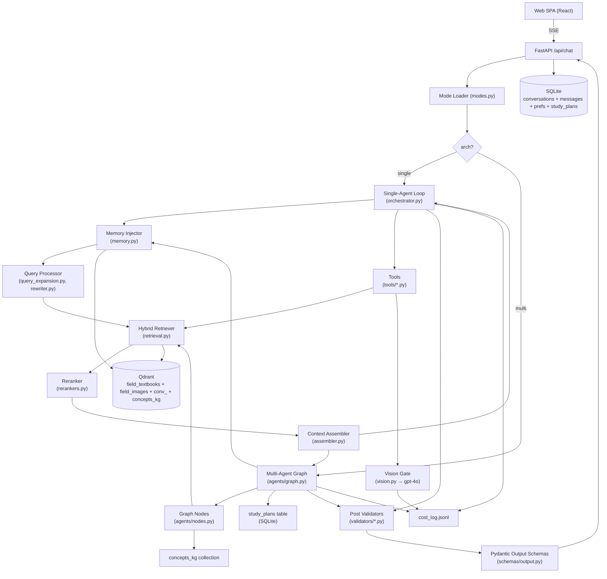
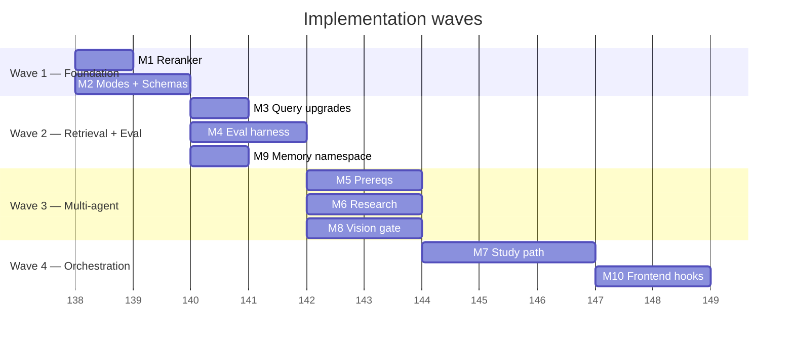
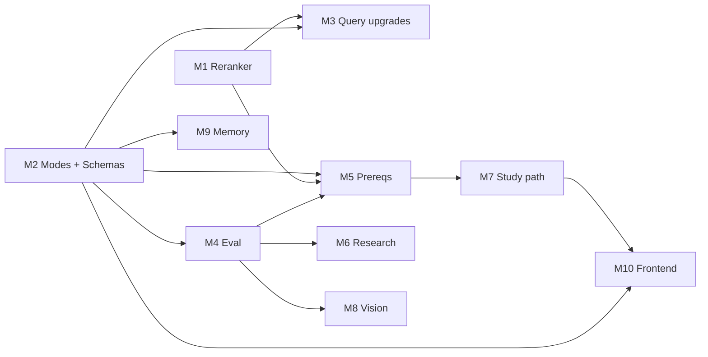

# Implementation Plan — Chat RAG System

> Step 4a deliverable (skill-driven rewrite). Produced using `architecture-designer` (ADRs, NFRs, diagram, risks) + `create-implementation-plan` (self-contained milestones, execution waves, acceptance criteria) patterns adapted to file-based project (no Jira/Confluence).
>
> Source: `build_instructions.md` (Pass-2 revision) + verified code state in `src/services/chat/`.

---

## 0. Summary

| Metric | Value |
|--------|-------|
| **Overview** | `docs/upgrades/abstract.md` (11 services) |
| **Build spec** | `docs/upgrades/Chat/build_instructions.md` |
| **Tracker** | `docs/upgrades/control.md` |
| **Milestones** | 10 (M1–M10) |
| **Story points** | 31 (1 pt = ~half-day) |
| **Execution waves** | 4 |
| **Overall complexity** | High |
| **Blocked-by external** | user §10 decisions (defaults proposed) |

---

## 1. Functional requirements (recap)

FR1. 11 chat modes operational via single `POST /api/chat` w/ `mode` field (existing IDs).
FR2. Hybrid retrieval (dense + sparse) preserved; reranker added.
FR3. Phase-2 retrieval upgrades (HyDE, multi-query, decompose, adjacent) gated by `RetrievalFlags`.
FR4. Multi-agent graph runner for modes 6 (`prereqs`), 8 (`research`), 10 (`path`).
FR5. Schema-validated structured output per mode; SSE events unchanged on wire.
FR6. Per-conversation memory namespace (sliding/summary/vec).
FR7. Vision gate for modes 3 (`figures`) and 9 (`math`).
FR8. Plan persistence + replan for mode 10.
FR9. Cost log per LLM call.
FR10. Evaluation harness w/ synthetic Q/A generation + LLM-judge metrics.

## 2. Non-functional requirements

| ID | NFR | Target | Why |
|----|-----|--------|-----|
| NFR1 | p95 latency (single-agent) | ≤8s | UX (tutor/quiz/navigate) |
| NFR2 | p95 latency (multi-agent) | ≤25s | acceptable for prereqs/research/path |
| NFR3 | Faithfulness | ≥0.85 (LLM-judge) | hallucination control |
| NFR4 | Context precision @10 | ≥0.65 | retrieval quality |
| NFR5 | Citation coverage | 100% of factual claims | A3 invariant |
| NFR6 | Test coverage | ≥80% in `chat/` | regression safety |
| NFR7 | Chinese-wall | grep returns clean | `src/services/chat/` imports only `src/core` |
| NFR8 | Backward compat | existing 61 tests stay green | no churn |
| NFR9 | Cost transparency | every LLM call logged | budget control |
| NFR10 | Reranker mem | ≤2GB resident | local dev box |
| NFR11 | Schema validation | 100% modes produce schema-valid output (after ≤1 retry) | downstream UI trust |
| NFR12 | Memory namespace cleanup | `conv_<id>` deleted on conv delete | Qdrant disk hygiene |

---

## 3. Target architecture (Mermaid)



---

## 4. Architecture Decision Records

### ADR-001: Roll-own multi-agent state-graph runner

**Status**: Accepted (default; user may override §10.6).

**Context**: Modes 6, 8, 10 need a deterministic node graph w/ shared state. Options: LangGraph (mature, but adds dep + transitive packages), LlamaIndex Workflows, custom.

**Decision**: Custom `chat/agents/graph.py` (≤300 LoC). Synchronous node dispatch over `AgentState` dataclass. No external framework.

**Alternatives**:
- LangGraph — adds ~30 transitive deps, opinionated checkpointing we don't need.
- LlamaIndex Workflows — heavier; couples to LlamaIndex retrieval.

**Consequences**:
- (+) Zero new deps; full control of iter cap, retries, cost log.
- (+) Easier Chinese-wall enforcement.
- (–) Must hand-roll observability / checkpoint replay.
- (–) Migration cost if scope explodes (≥30 nodes per mode).

**Trade-off**: Minimal-dep, project-aligned simplicity over framework features we don't use yet.

---

### ADR-002: Reranker = `BAAI/bge-reranker-v2-m3` in-process

**Status**: Accepted (default; user may override §10.1, §10.9).

**Context**: Reranker is M1, highest-ROI upgrade.

**Decision**: In-process via `sentence-transformers`. Lazy load. Local model (≈600MB).

**Alternatives**:
- Cohere `rerank-3` API — paid, network dependency, contradicts "local-first" project ethos (CLAUDE.md).
- Separate microservice — operational overhead for single dev box.

**Consequences**:
- (+) Free, offline, no rate limits.
- (+) Matches "local-first" project ethos.
- (–) ~1.5GB resident after load → NFR10 ≤2GB still OK.
- (–) Cold-start latency on first call.

---

### ADR-003: KG persistence in Qdrant collection vs NetworkX/SQLite

**Status**: Accepted (default; user may override §10.7).

**Context**: Mode 6 (prereqs) builds concept DAGs from textbook content. Persistence needed for incremental enrichment and cross-mode reuse by mode 10.

**Decision**: Qdrant collection `concepts_kg` w/ vector = concept name embedding, payload = `{from, to, weight, source_citation}`.

**Alternatives**:
- NetworkX + SQLite — pure-Python KG, no Qdrant dep for this feature, but loses semantic-similarity lookup ("concept like X").
- Neo4j — heavyweight; new infra.

**Consequences**:
- (+) One DB to operate.
- (+) Semantic concept lookup free.
- (–) Edge queries less natural than property graph.
- (–) Pagination on large DAGs awkward.

---

### ADR-004: Single-score vision gate (defer image embeddings)

**Status**: Accepted.

**Context**: `Figure` schema has only caption score; no image embedding pipeline exists.

**Decision**: V1 gate on caption score thresholds (τ_high=0.62, τ_low=0.45). Defer CLIP/SigLIP image embedding (v2) until metrics show v1 insufficient.

**Consequences**:
- (+) No ingestion-pipeline change.
- (–) Caption-quality bound on vision-trigger precision.
- Mitigation: hand-labeled `vision20.jsonl` calibrates τ; revisit if F1 < 0.7.

---

### ADR-005: Output schema enforcement via Pydantic + 1 repair retry

**Status**: Accepted.

**Context**: 11 modes return structured output. LLMs occasionally drift from schema.

**Decision**: Pydantic validation post-LLM. On `ValidationError`: 1 schema-repair pass (prompt includes error + JSON Schema). Second failure → emit partial + SSE `error` event.

**Consequences**:
- (+) Bounded retry cost.
- (+) Frontend can trust schema (after success).
- (–) Up to 2 main-model calls per response in worst case.

---

### ADR-006: Memory namespace = per-conv Qdrant collection (auto-escalation)

**Status**: Accepted (default; user may override §10.8).

**Context**: Memory needs both recency (sliding) and semantic recall (vec) at scale.

**Decision**: Three strategies w/ auto-escalation by turn count: sliding ≤10, summary 11–30, vec >30. Vec namespace = `conv_<id>` collection, deleted on conv delete.

**Consequences**:
- (+) Cost-bounded for short convs; scalable for long convs.
- (–) Qdrant collection count grows w/ conv count → mitigate via TTL cron (post-v1).

---

## 5. Risks + mitigations

| ID | Risk | Likelihood | Impact | Mitigation |
|----|------|-----------|--------|-----------|
| R1 | Reranker lifts metrics < projected | M | M | M4 baseline first; gate via T2 lift assert |
| R2 | LLM stance F1 < 0.6 (mode 8) | M | H | Hand-labeled `stance20.jsonl` gate; consider fine-tuned classifier fallback |
| R3 | Multi-agent iter cap hits in production | L | M | Per-mode budgets + emit partial + error event |
| R4 | Schema-repair retry doubles cost on fragile modes | M | L | Track repair rate in cost log; tune temperature |
| R5 | `concepts_kg` collection becomes stale vs ingestion updates | M | M | Re-build on ingest event (post-v1 hook) |
| R6 | Vision cost balloons | L | M | τ_high default + cap N=5 figures + cost-log alarms |
| R7 | LangGraph users disappointed by roll-own runner | L | L | ADR-001 documents trade-off; migration path exists |
| R8 | Reranker memory > NFR10 on small dev boxes | L | L | Optional fallback to `BAAI/bge-reranker-base` |
| R9 | Synthetic Q/A leaks LLM bias into eval | M | M | Hand-labeled subsets `stance20`, `vision20`, `nav15` |
| R10 | Per-conv Qdrant collection sprawl | M | L | Post-v1 TTL job |

---

## 6. Execution waves

Topologically sorted; 4 waves. Items within a wave have no inter-dependency and may proceed in parallel.



### Wave summary

| Wave | Milestones | Points | Parallel | Gate to next wave |
|------|-----------|--------|----------|-------------------|
| 1 Foundation | M1, M2 | 6 | yes | M1 + M2 acceptance |
| 2 Retrieval + Eval | M3, M4, M9 | 8 | yes | M4 baseline numbers committed |
| 3 Multi-agent + Vision | M5, M6, M8 | 12 | yes (3-way) | All 3 pass NFR3 + T-tests |
| 4 Orchestration | M7, M10 | 5 | partial | M7 done before M10 final wiring |

**Total: 31 pts.**

---

## 7. Milestone tickets (self-contained)

Each ticket includes: summary, files-to-modify, code/test snippets, acceptance criteria, recommended agent.

---

### M1 — Reranker (3 pts) — Wave 1

**Summary**: Add cross-encoder reranker between RRF fusion and context assembly.

**Files to modify**:

| File | Action | Description |
|------|--------|-------------|
| `src/services/chat/rerankers.py` | Create | `CrossEncoderReranker` lazy-loading `bge-reranker-v2-m3` |
| `src/services/chat/retrieval.py` | Modify | `hybrid_search()` accepts `rerank`, `rerank_top_n`, calls reranker |
| `src/core/config.py` | Modify | Add `RERANKER_MODEL`, `RERANK_TOP_K_IN=50`, `RERANK_TOP_N_OUT=10` |
| `requirements.txt` | Modify | Add `sentence-transformers>=2.7` |
| `src/services/chat/tests/test_reranker.py` | Create | 3 cases |

**Snippet** (`rerankers.py`):

```python
from __future__ import annotations
from functools import cached_property
from sentence_transformers import CrossEncoder
from src.core.config import settings

class CrossEncoderReranker:
    def __init__(self, model: str | None = None) -> None:
        self.model_name = model or settings.RERANKER_MODEL

    @cached_property
    def _model(self) -> CrossEncoder:
        return CrossEncoder(self.model_name, max_length=512)

    def rerank(self, query: str, hits: list, top_n: int) -> list:
        if not hits: return hits
        pairs = [(query, h.excerpt) for h in hits]
        scores = self._model.predict(pairs, show_progress_bar=False)
        ranked = sorted(zip(scores, hits), key=lambda t: -t[0])[:top_n]
        return [h for _, h in ranked]
```

**Test snippet**:

```python
def test_reranker_reorders_monotonically():
    r = CrossEncoderReranker()
    hits = [Source(excerpt="The bias-variance tradeoff ...", ...),
            Source(excerpt="Pizza toppings vary by region ...", ...)]
    out = r.rerank("explain bias-variance", hits, top_n=2)
    assert out[0].excerpt.startswith("The bias-variance")
```

**Acceptance criteria**:
- [ ] `pytest src/services/chat/tests/test_reranker.py` green.
- [ ] `pytest src/services/chat/tests/` 61+ green (no regression).
- [ ] Memory after first call ≤2GB (NFR10).
- [ ] Tutor-mode w/ rerank=True shows ≥10% lift on T2 (after M4).

**Agent**: backend-developer.

---

### M2 — Mode registry + 11 personas + output schemas (5 pts) — Wave 1

**Summary**: 11 `ModeSpec` entries, system prompts, Pydantic output schemas.

**Files to modify**:

| File | Action | Description |
|------|--------|-------------|
| `src/services/chat/modes.py` | Create | `ModeRegistry`, `ModeSpec`, `RetrievalFlags`, `ModelTier` |
| `src/services/chat/prompts/<mode>.py` × 11 | Create | system prompt + few-shot per mode |
| `src/services/chat/schemas/__init__.py` | Create | re-export |
| `src/services/chat/schemas/output.py` | Create | 11 Pydantic output models from `build_instructions.md §8.2` |
| `src/services/chat/schemas/output_repair.py` | Create | schema-repair prompt builder |
| `src/services/chat/api.py` | Modify | `POST /api/chat` reads `mode` → `ModeRegistry.get(mode)` |
| `src/services/chat/orchestrator.py` | Modify | dispatch on `ModeSpec.arch`; thread `flags` to retrieval; validate output via schema |
| `src/services/chat/tests/test_modes.py` | Create | each mode loads + validates fixture output |

**Snippet** (`modes.py`):

```python
@dataclass(frozen=True)
class ModeSpec:
    id: ModeId
    icon: str
    arch: Literal["single", "multi"]
    system_prompt: str
    few_shot: list = field(default_factory=list)
    output_schema: type[BaseModel] = TutorAnswer
    tools: list = field(default_factory=list)
    retrieval_flags: RetrievalFlags = field(default_factory=RetrievalFlags)
    model: Literal["nano", "pro", "pro_vision"] = "nano"
    max_tool_calls: int = 3
    max_graph_iters: int = 12
    post_validators: tuple[str, ...] = ("citation",)
    memory: Literal["off", "sliding", "summary", "vec", "auto", "persist"] = "off"

class ModeRegistry:
    _registry: dict[ModeId, ModeSpec] = {}
    @classmethod
    def register(cls, spec: ModeSpec) -> None: cls._registry[spec.id] = spec
    @classmethod
    def get(cls, mode_id: ModeId) -> ModeSpec: return cls._registry[mode_id]
    @classmethod
    def all(cls) -> list[ModeSpec]: return list(cls._registry.values())
```

**Acceptance criteria**:
- [ ] All 11 `ModeId` literals registered (`len(ModeRegistry.all()) == 11`).
- [ ] Each mode's `output_schema.model_validate(fixture)` passes for a hand-crafted fixture.
- [ ] `POST /api/chat` w/ each `mode` returns SSE `done` (LLM responses mocked).
- [ ] Schema-repair retry exercised in `test_modes.py::test_schema_repair_path`.
- [ ] Existing 61 tests + 11 new tests green.

**Agent**: fullstack-developer.

---

### M3 — Query upgrades: HyDE + multi-query + decompose (3 pts) — Wave 2

**Summary**: Three query-expansion strategies wired via `RetrievalFlags`.

**Files to modify**:

| File | Action | Description |
|------|--------|-------------|
| `src/services/chat/query_expansion.py` | Create | `hyde`, `multi_query`, `decompose` |
| `src/services/chat/retrieval.py` | Modify | `hybrid_search()` consumes expansion outputs; dedup by `chunkId` |
| `src/services/chat/orchestrator.py` | Modify | applies `flags` from `ModeSpec` |
| `src/services/chat/tests/test_query_expansion.py` | Create | mock-LLM cases |

**Snippet** (`query_expansion.py`):

```python
async def hyde(query: str, model: str) -> str:
    prompt = f"Write a 3-sentence hypothetical textbook answer to: {query}"
    return await llm_short(prompt, model=model, max_tokens=200)

async def multi_query(query: str, n: int, model: str) -> list[str]:
    prompt = (f"Generate {n} short alternative phrasings of this query "
              f"(JSON array of strings only): {query}")
    raw = await llm_short(prompt, model=model)
    return json.loads(raw)[:n]

async def decompose(query: str, model: str) -> list[str]:
    prompt = (f"Decompose this question into atomic sub-questions. "
              f"Return JSON array. Question: {query}")
    raw = await llm_short(prompt, model=model)
    return json.loads(raw)
```

**Acceptance criteria**:
- [ ] `navigate` mode w/ `hyde=True` finds gold section on ≥1 hand-crafted vocabulary-mismatch test where `hyde=False` misses.
- [ ] `compare` mode emits ≥2 retrieval calls per book on `multi_query=2`.
- [ ] Dedup by `chunkId` verified in `test_query_expansion.py::test_dedup_after_multi_query`.

**Agent**: backend-developer.

---

### M4 — Evaluation harness + synthetic Q/A generator (5 pts) — Wave 2

**Summary**: Promote `src/services/eval/` placeholder; build runner + 4 metrics + Q/A generator.

**Files to modify**:

| File | Action | Description |
|------|--------|-------------|
| `src/services/eval/__init__.py` | Modify | activate package |
| `src/services/eval/generator.py` | Create | `generate_qa(n)` LLM-generates from `data/parsed/manifest.json` |
| `src/services/eval/dataset.py` | Create | JSONL load/save |
| `src/services/eval/metrics.py` | Create | `context_precision`, `context_recall`, `faithfulness`, `answer_relevance` |
| `src/services/eval/runner.py` | Create | CLI `python -m src.services.eval.runner --set base50 --mode tutor` |
| `data/eval/base50.jsonl` | Create | bootstrap once: 50 Q/A across collections |
| `src/services/chat/tests/test_eval.py` | Create | 3-Q toy set end-to-end |

**Snippet** (`metrics.py`):

```python
async def faithfulness(answer: str, contexts: list[str], judge_model: str) -> float:
    prompt = ("List claims in ANSWER not directly supported by CONTEXTS. "
              "Return JSON {{total_claims:int, unsupported:int}}.\n"
              f"ANSWER:\n{answer}\n\nCONTEXTS:\n{chr(10).join(contexts)}")
    raw = await llm_short(prompt, model=judge_model)
    j = json.loads(raw)
    return 1.0 - (j["unsupported"] / max(j["total_claims"], 1))
```

**Acceptance criteria**:
- [ ] `data/eval/base50.jsonl` exists, 50 entries, each w/ `q`, `gold_chunk_id`, `gold_answer`.
- [ ] `python -m src.services.eval.runner --set base50 --mode tutor` writes report under `data/eval/reports/`.
- [ ] All 4 metrics ≥ baseline floors stored in `data/eval/baselines.json`.
- [ ] Used as regression gate from M5 onwards.

**Agent**: backend-developer + test-automator.

---

### M9 — Per-conversation memory namespace (2 pts) — Wave 2 (parallel)

**Summary**: Memory namespace w/ sliding/summary/vec auto-escalation.

**Files to modify**:

| File | Action | Description |
|------|--------|-------------|
| `src/services/chat/memory.py` | Create | `MemoryStrategy` w/ 3 sub-strategies |
| `src/services/chat/orchestrator.py` | Modify | inject memory context before retrieval when `ModeSpec.memory != "off"` |
| `src/services/chat/api.py` | Modify | `DELETE /api/conversations/{id}` also drops Qdrant `conv_<id>` collection |
| `src/services/chat/tests/test_memory.py` | Create | sliding/summary/vec cases + recall |

**Acceptance criteria**:
- [ ] Sliding @ 5 turns: prior fact present in built context.
- [ ] Summary @ 15 turns: oldest 50% compressed; recent intact.
- [ ] Vec @ 35 turns: `conv_<id>` collection exists; semantic recall returns relevant prior turn.
- [ ] Conv delete drops Qdrant collection (assert via `client.get_collections()`).

**Agent**: backend-developer.

---

### M5 — Multi-agent shell + Mode 6 prereqs (4 pts) — Wave 3

**Summary**: Roll-own state graph runner + `prereqs` graph + KG persistence.

**Files to modify**:

| File | Action | Description |
|------|--------|-------------|
| `src/services/chat/agents/__init__.py` | Create | wall guard |
| `src/services/chat/agents/state.py` | Create | `AgentState` dataclass |
| `src/services/chat/agents/graph.py` | Create | `StateGraph` runner (≤300 LoC) |
| `src/services/chat/agents/nodes.py` | Create | generic nodes |
| `src/services/chat/agents/prereqs.py` | Create | Mode 6 graph wiring |
| `src/services/chat/kg.py` | Create | `concepts_kg` collection R/W |
| `src/services/chat/tests/test_agents_graph.py` | Create | graph runner cap + retry |
| `src/services/chat/tests/test_agents_prereqs.py` | Create | DAG correctness + cycle injection |

**Snippet** (`graph.py`):

```python
@dataclass
class Node:
    name: str
    fn: Callable[[AgentState], Awaitable[AgentState]]

class StateGraph:
    def __init__(self, nodes: list[Node], max_iters: int) -> None:
        self.nodes = nodes; self.max_iters = max_iters

    async def run(self, state: AgentState) -> AgentState:
        for node in self.nodes:
            if state.iter >= self.max_iters:
                state.errors.append(f"iter cap hit at {node.name}"); break
            state = await node.fn(state); state.iter += 1
            if state.qc_status == "fail" and state.iter < self.max_iters:
                # one retry of previous node
                state.qc_status = "pending"
                state = await self.nodes[max(0, self.nodes.index(node)-1)].fn(state)
                state.iter += 1
        return state
```

**Acceptance criteria**:
- [ ] `POST /api/chat` w/ `mode=prereqs` on a real Qdrant returns valid `DAG`.
- [ ] DAG fixture w/ injected cycle → `cycles_broken` non-empty.
- [ ] `concepts_kg` collection populated; subsequent run reads it (incremental enrich).
- [ ] Iter cap respected; partial + error on overflow.

**Agent**: backend-developer.

---

### M6 — Mode 8 research (4 pts) — Wave 3

**Summary**: Claim extraction + per-claim retrieval + stance classification + synthesis.

**Files to modify**:

| File | Action | Description |
|------|--------|-------------|
| `src/services/chat/agents/research.py` | Create | graph wiring |
| `src/services/chat/agents/nodes.py` | Modify | add `extract_claims`, `classify_stance` |
| `data/eval/stance20.jsonl` | Create | 20 hand-labeled (claim, chunk, stance) |
| `src/services/chat/tests/test_agents_research.py` | Create | stance F1 on `stance20` |

**Acceptance criteria**:
- [ ] Stance F1 ≥0.6 on `stance20.jsonl` (gate; if fail, raise to user for fine-tune decision).
- [ ] `Report` schema validates on a mock paper excerpt.
- [ ] `coverage_gaps` non-empty when claim hits no chunks above τ.

**Agent**: backend-developer.

---

### M8 — Vision gate + Modes 3 + 9 (4 pts) — Wave 3

**Summary**: Vision-gate algorithm + `inspect_figure` tool + wire into figures/math modes.

**Files to modify**:

| File | Action | Description |
|------|--------|-------------|
| `src/services/chat/vision.py` | Create | `vision_gate()` |
| `src/services/chat/tools/inspect_figure.py` | Create | `gpt-4o` vision call w/ image URL |
| `src/services/chat/cost.py` | Create | static price table + `usd_est()` |
| `data/vision_log.jsonl` | Create on first call | per-call log |
| `data/eval/vision20.jsonl` | Create | 20 hand-labeled (q, figure, vision_needed) |
| `src/services/chat/tests/test_vision_gate.py` | Create | score-combination cases |

**Acceptance criteria**:
- [ ] Vision triggered ↔ τ matrix (per `build_instructions.md §7.2`).
- [ ] Cost log row per vision call w/ `usd_est`.
- [ ] `math` mode answers a LaTeX-heavy query w/ correct figure inclusion (qualitative).
- [ ] On `vision20.jsonl`: precision ≥0.7 on "vision needed" detection.

**Agent**: backend-developer.

---

### M7 — Mode 10 study path + persistence + replan (5 pts) — Wave 4

**Summary**: Goal decomposer → invokes prereqs subgraph → sequence → coverage → persist → replan API.

**Files to modify**:

| File | Action | Description |
|------|--------|-------------|
| `src/services/chat/agents/study_path.py` | Create | graph wiring; calls prereqs graph in-process |
| `src/services/chat/store.py` | Modify | `study_plans(conv_id PK, state_json, updated_at)` |
| `src/services/chat/api.py` | Modify | `GET /api/study_plans/{id}`, `POST .../replan`, `DELETE .../section/{ref}` |
| `src/services/chat/schemas/output.py` | Modify | `StudyPlan` w/ `replanned_from_version` |
| `src/services/chat/tests/test_agents_study_path.py` | Create | persist + replan diff |

**Acceptance criteria**:
- [ ] Plan persists across requests (`GET` after `POST /api/chat` returns same).
- [ ] `POST .../replan` produces diff w/ incremented `replanned_from_version`.
- [ ] `DELETE .../section/{ref}` triggers replan node.
- [ ] Cross-mode `invoke_subgraph(prereqs)` shares state; combined iter ≤15.

**Agent**: backend-developer.

---

### M10 — Frontend hooks for new modes (2 pts) — Wave 4

**Summary**: Surface 11 modes + new schemas in React SPA. Minimal — just enough to exercise backend end-to-end.

**Files to modify**:

| File | Action | Description |
|------|--------|-------------|
| `web/src/types.ts` | Modify | mirror new Pydantic output schemas |
| `web/src/state/chat.ts` | Modify | reducer handles new SSE event shapes for structured outputs |
| `web/src/components/ModePicker.tsx` | Modify (or Create) | 11 mode buttons |
| `web/src/components/views/<Mode>View.tsx` | Create per mode | render schema (table for `DAG`, list for `Quiz`, YAML viewer for `Roadmap`) |

**Acceptance criteria**:
- [ ] Each mode renders a non-error response in browser smoke test.
- [ ] Source chips clickable in tutor/compare modes.
- [ ] `Roadmap` YAML view downloadable.
- [ ] `tsc --noEmit` clean; `npm run build` succeeds.

**Agent**: frontend-developer.

---

## 8. Cumulative timeline

| Wave | Span | Cumulative pts | Cumulative days (1pt=0.5d) |
|------|------|----------------|-----------------------------|
| 1 | days 1–2 | 8 | 4 |
| 2 | days 3–5 | 16 | 8 |
| 3 | days 6–8 | 28 | 14 |
| 4 | days 9–12 | 33 | 16.5 |

**Total: 16–17 dev-days w/ parallelism; 31 pts.**

---

## 9. Agent recommendations

| Work type | Recommended agent |
|-----------|-------------------|
| Reranker, query expansion, retrieval mods | backend-developer |
| Eval harness + metrics | backend-developer + test-automator |
| Multi-agent graph runner | backend-developer |
| Vision gate | backend-developer |
| Frontend mode views | frontend-developer |
| Schema design review | architecture-designer (this skill) |
| ADR updates if scope drift | architecture-designer |

---

## 10. Dependency graph



---

## 11. Out of scope (post-v1)

- LLM-cited highlight ranges (currently heuristic in `highlights.py`).
- CLIP image embeddings (vision gate v2).
- Auth + multi-tenant.
- Production Docker compose for backend + nginx static.
- Cost dashboard UI.
- Synthetic Q/A regeneration on collection update.
- Cron TTL job for `conv_<id>` collections.
- `concepts_kg` rebuild on ingest event.

---

## 12. Adjustments log

| Date | Change | Reason |
|------|--------|--------|
| 2026-05-17 | Initial plan committed (S3) | First skill-driven version |

(Future entries appended here when scope or estimates shift.)
