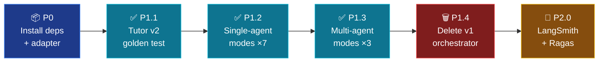

# Target Architecture — Chat Service v2 (LangChain 1.0 + LangGraph)

> Supersedes ADR-001 (roll-own runner). User decision 2026-05-18: adopt full LangChain + LangGraph migration.
>
> Source skills loaded for this design:
> - `framework-selection` — confirmed LangChain `create_agent` for single-agent modes + LangGraph for multi-agent (Deep Agents rejected: modes bounded).
> - `langchain-fundamentals` — `create_agent`, `@tool`, `MemorySaver`, `response_format`.
> - `langgraph-fundamentals` — `StateGraph`, `Command`, `Send`, conditional edges, retries, ToolNode.
> - `langchain-rag` — `as_retriever`, MMR, metadata filter, RAG-as-tool.
> - `langchain-middleware` — `HumanInTheLoopMiddleware`, `@wrap_tool_call`.
> - `langgraph-persistence` — checkpointer (SQLite → Postgres), Store for cross-thread memory.
> - `langchain-dependencies` — LangChain 1.0 LTS, package list, semver.

---

## Stack

```
LangChain 1.0   — base layer: ChatOpenAI, @tool, retrievers, response_format
LangGraph 1.0   — orchestration: StateGraph for multi-agent modes
Qdrant          — existing vector DB, accessed via langchain-qdrant retriever
SQLite          — checkpointer (dev) + user_profile + study_plans store
Postgres        — checkpointer (prod, future)
LangSmith       — observability + eval (replaces vision-only cost log)
```

---

## High-level DAG

```mermaid
flowchart LR
    accTitle: Chat service v2 target dispatch
    accDescr: ChatRequest enters API, hits classifier, routes single-agent modes to create_agent and multi-agent modes to dedicated StateGraphs; both layer on shared retrievers, checkpointer, store, and stream SSE events.

    api["📥 FastAPI<br/>/api/chat"]
    classifier["🧭 Query<br/>classifier"]
    branch{{"arch?"}}
    single["⚙️ create_agent<br/>+ middleware"]
    multi["🌐 LangGraph<br/>StateGraph"]
    retrievers["📚 Retriever<br/>tools"]
    checkpointer["💾 SqliteSaver<br/>checkpointer"]
    store["🗄️ Store<br/>user_profile"]
    eval["🔬 LangSmith<br/>trace"]
    sse["📤 SSE<br/>stream"]

    api --> classifier --> branch
    branch -->|tutor compare figures quiz navigate annotate math roadmap| single
    branch -->|prereqs research path| multi
    single --> retrievers
    multi --> retrievers
    single --> checkpointer
    multi --> checkpointer
    single --> store
    multi --> store
    single --> eval
    multi --> eval
    single --> sse
    multi --> sse

    classDef io fill:#1e3a8a,stroke:#3b82f6,color:#fff
    classDef route fill:#5b21b6,stroke:#8b5cf6,color:#fff
    classDef agent fill:#0e7490,stroke:#06b6d4,color:#fff
    classDef graph fill:#9d174d,stroke:#ec4899,color:#fff
    classDef infra fill:#166534,stroke:#22c55e,color:#fff
    classDef obs fill:#854d0e,stroke:#eab308,color:#fff
    classDef out fill:#7f1d1d,stroke:#ef4444,color:#fff

    class api,sse io
    class classifier,branch route
    class single agent
    class multi graph
    class retrievers,checkpointer,store infra
    class eval obs
```

---

## Component map — what replaces what

| Current | v2 | Why |
|---------|-----|-----|
| `orchestrator.stream_chat` | `create_agent` per mode + thin dispatcher | LangChain handles tool-loop, schema validation, streaming for free |
| `agents/graph.py` (custom `StateGraph`) | `langgraph.graph.StateGraph` | Real graphs: conditional edges, `Send` fan-out, retries, time-travel |
| `memory.py` (sliding/summary/vec hand-rolled) | `SqliteSaver` checkpointer + `InMemoryStore`/`SqliteStore` for cross-thread | Battle-tested; thread-scoped + cross-thread separation native |
| `store.py` (SQLite messages + study_plans) | Same SQLite file, but messages move to checkpointer; study_plans stay (custom model) | Checkpointer = canonical conversation log |
| Schema validate+repair (`_validate_and_repair`) | `create_agent(response_format=Schema)` | Native OpenAI JSON-schema constrained decoding kills repair retries (B6 dies) |
| `rewriter.py` (concat hack) | Real LLM rewriter via `@tool` or dedicated step | Fixes B2 (corrupted retrieval signals) |
| `query_expansion.py` | Keep, but wire as toolchain step before retrieval | No regression, just clearer pipeline |
| `retrieval.hybrid_search` | Wrap as `BaseRetriever` (via `langchain-qdrant`) — exposed as `@tool retrieve(query, k, filters)` | Agentic retrieval; LLM controls when to re-query |
| `rerankers.py` (BGE cross-encoder) | Keep as Python function, wrap as `@tool rerank` or call inside retriever | No reason to change a working perf-critical component |
| `vision.py` + `tools/inspect_figure.py` | `@tool inspect_figure(figure_ref, query)` registered to figures/math agent tool list | Becomes real LLM-callable tool, drops `_is_vision_mode` string match |
| `cost.py` (vision-only ledger) | LangSmith tracing + token-usage hooks | All LLM calls tracked automatically |
| `kg.py` (concepts_kg) | Keep; expose `@tool kg_neighbors(concept_id)` | Reusable across modes |
| Multi-agent dispatch in orchestrator | Each multi-agent mode = one compiled `StateGraph` registered in a mode router | One place per mode, parallel via `Send` |
| SSE token-stream parser | `graph.stream(..., stream_mode="messages")` + `stream_mode="custom"` for agent_step | Native LangGraph streaming; drops fragile state machine |

---

## Architecture Decision Records

### ADR-006: Adopt LangChain 1.0 + LangGraph for chat service

**Status**: Accepted (2026-05-18). Supersedes ADR-001.

**Context**: Diagnostic audit revealed 10 ship-blocker bugs and fictional tool surface in the roll-own architecture. Maintenance cost > framework cost.

**Decision**: Migrate `src/services/chat/` to LangChain 1.0 + LangGraph 1.0. Pin: `langchain>=1.0,<2.0`, `langchain-core>=1.0,<2.0`, `langgraph>=1.0,<2.0`, `langchain-openai`, `langchain-qdrant`, `langsmith>=0.3.0`.

**Alternatives considered**:
- Roll-own (status quo + bug fixes) — rejected: tool-use rewrite alone is multi-week work LC gives free.
- LangGraph for multi-agent only, raw OpenAI for single-agent — rejected: avoids consolidation win; two memory layers.
- Deep Agents — rejected: modes are bounded, not open-ended; planning + skills middleware not needed.

**Consequences**:
- (+) `response_format` + `create_agent` eliminate ~2k LoC (validate/repair, custom graph runner, token-stream parser, dead `build_prompt` helpers).
- (+) HITL, persistence, time-travel, retries — all native.
- (+) LangSmith ≈ free observability + Ragas eval integration.
- (−) +30 transitive deps; +~150 MB venv (already paying via ingestion).
- (−) Migration risk: requires per-mode parity test before cutover.

---

### ADR-007: Replace `memory.py` with LangGraph checkpointer + Store

**Status**: Accepted.

**Context**: B1 + B10 — SQLite messages never written, vec memory grows but conversation doesn't. Custom 5-strategy memory layer has 6 bugs (token-vs-char truncation, non-existent collection scan, persist-vs-vec equivalence lie).

**Decision**:
- **Short-term (thread-scoped)** — `SqliteSaver` checkpointer keyed by `thread_id = conversationId`. Full message history persisted automatically by LangGraph.
- **Long-term (cross-thread)** — `SqliteStore` keyed by `(user_id, namespace, key)` for `user_profile`, learner mastery, review_queue (Phase 3 U3).
- Existing `conversations` / `messages` SQLite tables migrate into checkpointer storage (single source of truth).
- `study_plans` table stays — domain-specific, not message log.

**Consequences**:
- (+) B1 + B10 disappear (no parallel writes to coordinate).
- (+) Time-travel for free → `path` mode replan lineage native (`get_state_history`).
- (+) `update_state` + `Overwrite` for explicit replan steps.
- (−) One-time migration script for existing conversations.

---

### ADR-008: Drop schema-repair retry; use `response_format` constrained decoding

**Status**: Accepted. Supersedes ADR-005.

**Context**: B6 (fence-strip + char-set strip bugs); repair is a band-aid for unconstrained generation.

**Decision**: For OpenAI providers, pass `response_format=PydanticSchema` to `create_agent`. LLM decode-time enforces schema. For DeepSeek/Ollama (no native JSON-schema), keep one repair attempt as fallback.

**Consequences**:
- (+) ~0 repair retries on OpenAI → lower cost + latency.
- (+) Removes brittle fence-stripping logic.
- (−) Schemas must be JSON-Schema-compatible (no Pydantic custom validators that don't serialize). Audit `output.py` for any.

---

### ADR-009: Tools become real LLM-callable functions

**Status**: Accepted.

**Context**: B3 — `ModeSpec.tools` declared but no tool loop. Modes pretend agentic.

**Decision**: Each tool is a `@tool`-decorated Python function in `src/services/chat/tools/`. Registered to `create_agent(tools=[...])`. LLM decides invocation order, frequency, args. Initial tool set:

| Tool | Args | Returns | Used by modes |
|------|------|---------|---------------|
| `retrieve` | `query: str, k: int=5, book_filter: list[str]=None` | list of `Source` | all single-agent |
| `retrieve_per_book` | `query: str, books: list[str], k_per_book: int=3` | dict[book → list[Source]] | compare |
| `retrieve_figures` | `query: str, k: int=2` | list of `Figure` | figures, math |
| `inspect_figure` | `figure_ref: str, query: str` | str (gpt-4o description) | figures, math |
| `extract_terms` | `text: str` | list[str] | annotate |
| `kg_neighbors` | `concept_id: str, depth: int=1` | list of `ConceptNode` | prereqs, annotate, path |
| `recall` (Phase 3) | `query: str, namespace: str` | list of prior memory items | tutor, quiz, path |
| `commit` (Phase 3) | `fact: str, kind: str` | None | quiz, path (mastery flags) |

**Constraints**: `recursion_limit=10` in invoke config (replaces fictional `max_tool_calls`). `handle_tool_errors=True` so LLM recovers from tool failures.

---

### ADR-010: Versioned prompts + per-mode few-shot

**Status**: Accepted.

**Context**: Diagnostic — every non-tutor `build_prompt` is dead code; tutor uses different citation format; prompts have typos (`REGRIEVED`); no version tracking.

**Decision**:
- One source of truth per mode: `src/services/chat/prompts/<mode>/v<N>.md` (versioned).
- `ModeSpec.prompt_version` field — bumped per release.
- Few-shot examples in `prompts/<mode>/examples.jsonl` (Phase 2); sample by query similarity at runtime.
- Unified citation format: `{book, chapter, section}` everywhere; tutor's `**Book (chapter, section)**` migrates.

---

### ADR-011: LangSmith for tracing + Ragas for eval (replaces cost log)

**Status**: Accepted.

**Context**: B7 — cost log only on vision tool. No retrieval@k, faithfulness, answer relevance metrics. No regression safety net.

**Decision**:
- LangSmith trace per request (env `LANGSMITH_API_KEY`, `LANGSMITH_PROJECT`). Captures token usage, latency, tool calls, errors automatically.
- Ragas integrated for per-mode synth eval set (chapter Q/A generation). Nightly CI runs `ops/scripts/nightly_eval.py`.
- `cost.py` deprecated; LangSmith dashboard replaces it.

---

### ADR-012: HITL clarification node via LangChain middleware

**Status**: Accepted.

**Context**: Synopsis §2 — clarification node for ambiguous intent in navigate/path/roadmap.

**Decision**: `HumanInTheLoopMiddleware` configured per-mode with `interrupt_on={"clarify_intent": True}`. Frontend detects `__interrupt__` in stream, prompts user, resumes via `Command(resume={"decisions": [...]})`. Requires checkpointer + `thread_id` (already there per ADR-007).

---

## Per-mode runtime shape (v2)

```mermaid
flowchart LR
    accTitle: Per-mode runtime in v2
    accDescr: Single-agent modes use create_agent with mode-specific tools, response_format schema, and middleware; multi-agent modes use a compiled LangGraph StateGraph that internally calls the same tool set.

    req["📥 ChatRequest<br/>+ thread_id"]
    spec["📋 ModeSpec<br/>v2"]
    ca["⚙️ create_agent<br/>tools, schema,<br/>middleware"]
    sg["🌐 StateGraph<br/>nodes + edges<br/>compiled"]
    tools["🔧 Tool set<br/>retrieve, kg, etc"]
    schema["📜 response_format<br/>Pydantic"]
    cp["💾 Checkpointer<br/>thread_id"]
    stream["📤 stream_mode<br/>messages + custom"]

    req --> spec
    spec -->|arch=single| ca
    spec -->|arch=multi| sg
    ca --> tools
    sg --> tools
    ca --> schema
    sg --> schema
    ca --> cp
    sg --> cp
    ca --> stream
    sg --> stream

    classDef io fill:#1e3a8a,stroke:#3b82f6,color:#fff
    classDef cfg fill:#5b21b6,stroke:#8b5cf6,color:#fff
    classDef agent fill:#0e7490,stroke:#06b6d4,color:#fff
    classDef graph fill:#9d174d,stroke:#ec4899,color:#fff
    classDef infra fill:#166534,stroke:#22c55e,color:#fff
    classDef obs fill:#854d0e,stroke:#eab308,color:#fff
    classDef out fill:#7f1d1d,stroke:#ef4444,color:#fff

    class req io
    class spec cfg
    class ca agent
    class sg graph
    class tools,cp infra
    class schema obs
    class stream out
```

### Single-agent mode skeleton

```python
from langchain.agents import create_agent
from langchain.agents.middleware import HumanInTheLoopMiddleware
from langgraph.checkpoint.sqlite import SqliteSaver
from src.services.chat.tools import retrieve, retrieve_figures, inspect_figure
from src.services.chat.schemas.output import FiguresAnswer
from src.services.chat.prompts import load_prompt

agent = create_agent(
    model="openai:gpt-5.4-nano-2026-03-17",  # ModeSpec.model
    tools=[retrieve, retrieve_figures, inspect_figure],
    system_prompt=load_prompt("figures", version=1),
    response_format=FiguresAnswer,
    checkpointer=SqliteSaver.from_conn_string("data/checkpoints.db"),
    middleware=[HumanInTheLoopMiddleware(interrupt_on={"inspect_figure": False})],
)

config = {"configurable": {"thread_id": req.conversationId}, "recursion_limit": 10}

async for chunk in agent.astream(
    {"messages": [{"role": "user", "content": req.message}]},
    config=config,
    stream_mode="messages",
):
    token, metadata = chunk
    yield {"type": "token", "text": token.content}
```

### Multi-agent (research) skeleton

```python
from langgraph.graph import StateGraph, START, END
from langgraph.types import Send, RetryPolicy
from typing import Annotated
import operator

class ResearchState(TypedDict):
    query: str
    book_slugs: list[str] | None
    claims: list[dict]
    claim_results: Annotated[list[dict], operator.add]  # reducer for Send fan-out
    report: Report | None

def extract_claims(state: ResearchState) -> dict: ...

def fanout_claims(state: ResearchState):
    return [Send("classify_claim", {"claim": c, "book_slugs": state["book_slugs"]}) for c in state["claims"]]

def classify_claim(state: dict) -> dict:  # worker
    ...
    return {"claim_results": [{"claim": ..., "stance": ..., "evidence": ...}]}

def synthesize(state: ResearchState) -> dict: ...

graph = (
    StateGraph(ResearchState)
    .add_node("extract_claims", extract_claims, retry_policy=RetryPolicy(max_attempts=2))
    .add_node("classify_claim", classify_claim)
    .add_node("synthesize", synthesize)
    .add_edge(START, "extract_claims")
    .add_conditional_edges("extract_claims", fanout_claims, ["classify_claim"])
    .add_edge("classify_claim", "synthesize")
    .add_edge("synthesize", END)
    .compile(checkpointer=checkpointer)
)
```

Note `Send` fan-out fixes the serial per-claim retrieval bug from current `research.py`.

---

## Target folder layout

```
src/services/chat/
  agents/                      ← LangGraph multi-agent only (3 modes)
    prereqs.py                 — StateGraph
    research.py                — StateGraph w/ Send fan-out
    study_path.py              — StateGraph; calls run_prereqs as sub-graph
  mode_impls/                  ← NEW. One file per single-agent mode (named to avoid collision with v1 modes.py).
    tutor.py                   — create_agent(...)
    compare.py
    figures.py
    quiz.py
    navigate.py
    annotate.py
    math.py
    roadmap.py
  tools/                       ← @tool functions
    retrieve.py
    retrieve_per_book.py
    retrieve_figures.py
    inspect_figure.py
    extract_terms.py
    kg_neighbors.py
    recall.py                  ← Phase 3
    commit.py                  ← Phase 3
  prompts/                     ← versioned per-mode prompts + few-shots
    <mode>/
      v1.md
      examples.jsonl
  schemas/                     ← unchanged
    output.py
  retrievers/                  ← NEW. LangChain retriever wrappers.
    qdrant_hybrid.py           — wraps existing hybrid_search as BaseRetriever
    cross_collection.py        — fixes B5
    mmr.py                     — diversity reranker (Phase 2)
  router.py                    ← NEW. Mode dispatch. Replaces orchestrator routing.
  classifier.py                ← NEW Phase 2. Query classifier (adaptive RAG).
  api.py                       ← thin: persistence handled by checkpointer
  memory.py                    ← DELETE in Phase 1 (checkpointer replaces it)
  rewriter.py                  ← rewrite as real LLM tool in Phase 1
  vision.py                    ← keep gate logic; called inside inspect_figure tool
  cost.py                      ← DELETE in Phase 2 (LangSmith replaces it)
  store.py                     ← shrink to study_plans + user_profile (Phase 3)
  modes.py                     ← simplify ModeSpec: id, icon, arch, model, prompt_version, tools, schema, memory
```

---

## Streaming protocol (v2)

```
meta → token* → agent_step* → tool_call* → tool_result* → [structured_output] → sources_full → done
```

Native LangGraph streaming yields:
- `stream_mode="messages"` → token events (LangChain handles `paragraph_break` & math-block at render time — frontend katex).
- `stream_mode="custom"` → `agent_step` (which node ran), `tool_call` (which tool, args), `tool_result`.
- `stream_mode="updates"` → final structured output via `result["structured_response"]`.

Frontend reads via `EventSourceResponse`; no SSE parser needs custom math state machine.

---

## Non-functional requirements

| NFR | Target | Validation |
|-----|--------|-----------|
| P95 latency (tutor mode, single-query) | ≤ 4s end-to-end | Per-feature perf bench in `tests/perf/` |
| P95 latency (compare mode w/ 3 books) | ≤ 8s | Same |
| P95 latency (research mode, 6 claims) | ≤ 12s (parallel `Send` fan-out) | Same |
| Tokens per turn (tutor nano) | ≤ 4k input + 2k output | LangSmith dashboard |
| Faithfulness @ Ragas | ≥ 0.85 baseline (Phase 2) | Nightly CI eval |
| Cost per turn (avg) | ≤ $0.005 nano / $0.05 pro | LangSmith |
| Recursion limit per turn | 10 | hard-set in `create_agent` config |
| Memory recall round-trip (vec) | ≤ 200ms | `tests/perf/test_memory.py` |

---

## Risks + mitigation

| Risk | Severity | Mitigation |
|------|----------|-----------|
| R1 — Per-mode parity regression after migration | High | Per-mode golden test set; cutover one mode at a time. Phase 1 ships tutor first, ratchet. |
| R2 — `response_format` JSON-Schema doesn't accept some Pydantic fields (custom validators, `tuple`) | Med | Audit `output.py` for custom validators + `tuple[int, int]` (`Annotation.position`) → migrate to `list[int]` w/ length=2 constraint. |
| R3 — LangGraph SqliteSaver perf on high-concurrency dev | Low | Acceptable for local; Postgres for prod. |
| R4 — DeepSeek lacks native JSON-schema → repair fallback needed | Med | Keep one-shot repair on non-OpenAI; LangChain supports per-model `with_structured_output(method="json_mode")`. |
| R5 — Token-stream events change shape; frontend mode-views break | Med | Phase 0 — adapter layer in `router.py` translates LangGraph events to current SSE schema; frontend untouched. |
| R6 — Migration spans multiple days; old + new code coexist | Med | Feature-flag per mode (`USE_V2_MODES=tutor,quiz`); fall back to v1 orchestrator if absent. |

---

## Migration path



---

## Open questions before Phase 1

1. **Checkpointer DB location** — `data/checkpoints.db` (next to `data/parsed/manifest.json`) or merged into the existing SQLite at `data/chat.db`? Prefer split for migration safety.
2. **Adapter layer or hard cutover** — keep SSE event shape identical for frontend (adapter inside `router.py`) so frontend ships unchanged, OR break + bump frontend? Recommend adapter for Phase 1; align in Phase 2.
3. **Feature flag granularity** — env `USE_V2_MODES=...` (comma list) or single bool `USE_V2_CHAT`? Per-mode wins for staged rollout.
4. **LangSmith mandatory in Phase 1?** Or behind flag? Even free tier writes traces. Recommend mandatory in dev; opt-out env var.
