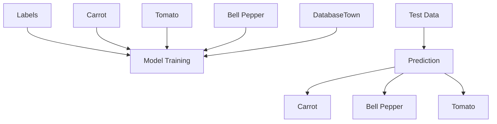
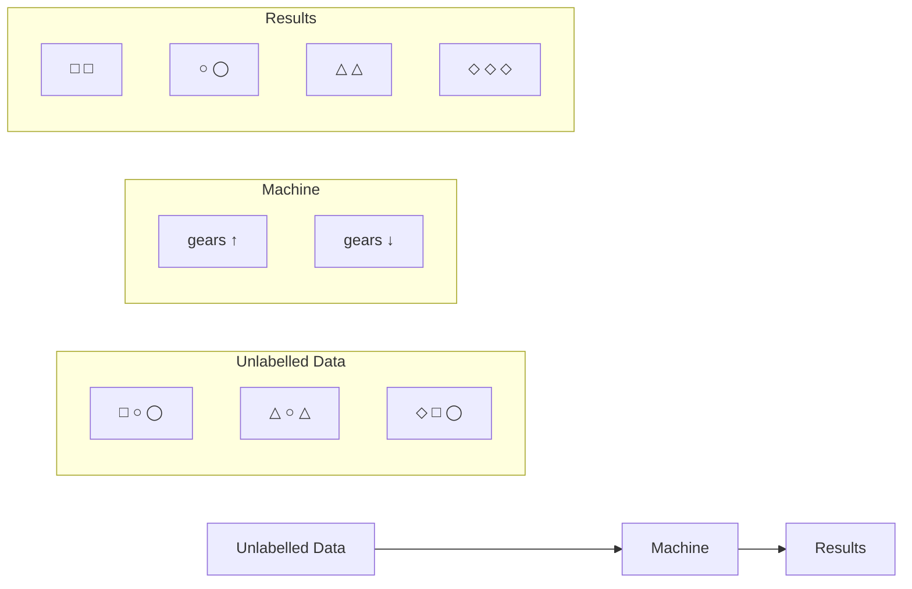
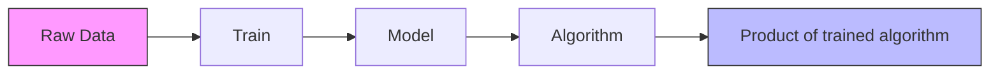
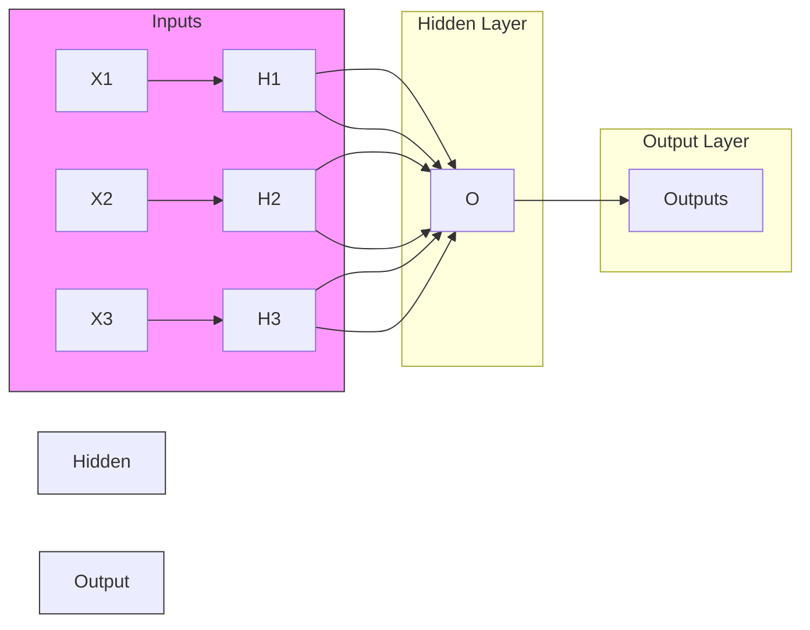
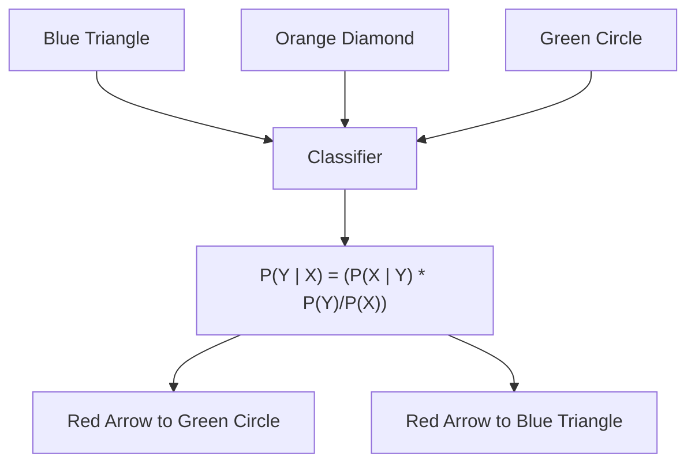
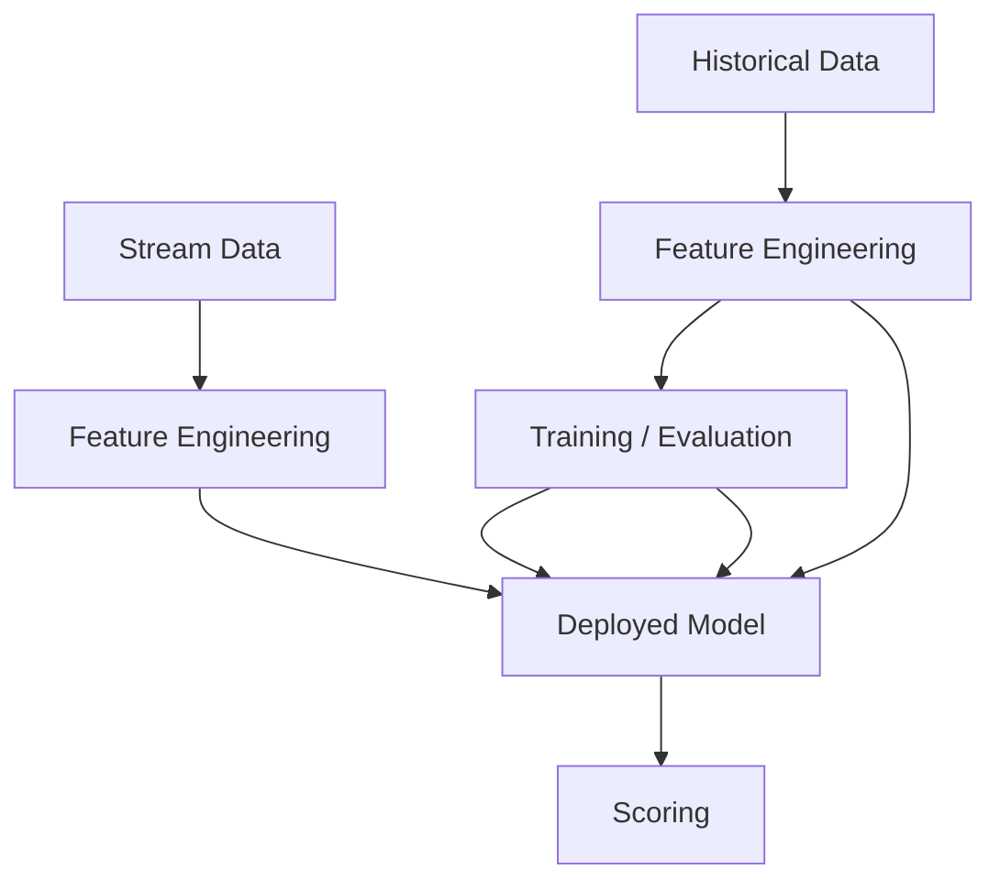
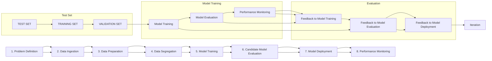
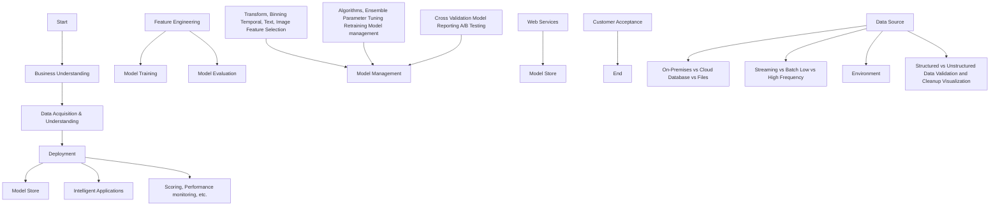
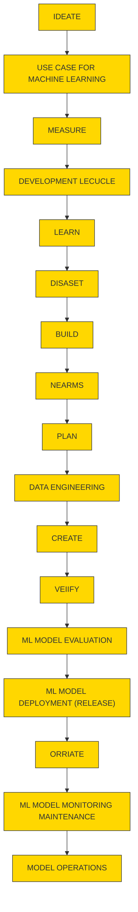
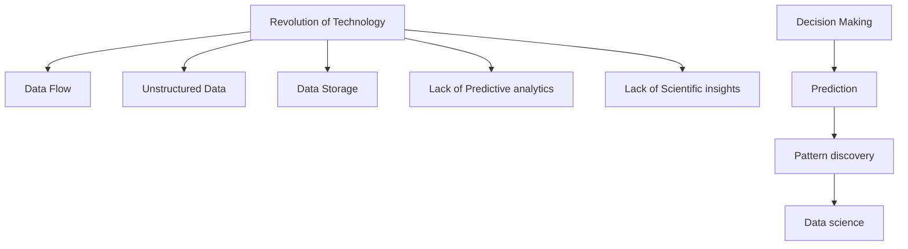

David MacKay

Mathematical Foundations of Machine Learning

## Copyright © 2023 by David MacKay

All rights reserved. No part of this publication may be reproduced, stored or transmitted in any form or by any means, electronic, mechanical, photocopying, recording, scanning, or otherwise without written permission from the publisher. It is illegal to copy this book, post it to a website, or distribute it by any other means without permission.

First edition

This book was professionally typeset on Reedsy Find out more at reedsy.com

## Contents

Mathematical Foundations of Machine Learning

Introduction

Chapter 1: Introduction to Machine Learning

Types of Machine Learning

Unsupervised Machine Learning

Semi-Supervised Machine Learning

Reinforcement Machine Learning

Importance of Machine Learning

Core Concepts of Machine Learning

Representation

Evaluation

Optimization

Statistical Learning Framework

Prediction and Inference

Parametric and Non-parametric Techniques

Predictions Accuracy and Model Interpretability.

Assessing Model Accuracy.

Chapter 2: Machine Learning Algorithms Regression

Types of “Naïve Bayes classifier”

Applications of “Naïve Bayes”

Chapter 3: Neural Network Learning Models Hyperparameter of ANN

Unsupervised Training

Candidate Model Evaluation

Model Deployment

Model Scoring

Applications of Neural Network Models

Chapter 4: Learning Through Uniform Convergence Impact of Uniform Convergence on Learnability.

Learnability without Uniform Convergence

Chapter 5: Data Science Lifecycle and Technologies
Data Science Lifecycle

Stage I – Business Understanding

Stage II – Data Acquisition and Understanding

Stage III – Modeling

Importance of Data Science

Business Intelligence vs. Data Science

Conclusion

## Mathematical Foundations of Machine Learning

natural_image

Abstract scientific visualization with color gradients and geometric shapes (no text or symbols)

Embark on a journey into the realm of Deep Learning by immersing yourself in the world of Data Science. This guide will illuminate the path to crafting Artificial Intelligence, drawing upon the fundamental principles of Statistics, Algorithms, Analysis, and Data Mining.

-David MacKay

## Introduction

Congratulations on your purchase of “Mathematical Foundations of Machine Learning: Study Deep Learning through Data Science.” Thank you for choosing this book.

The upcoming chapters delve into fundamental machine learning concepts and the significance of machine learning in addressing contemporary business challenges. The first chapter provides a comprehensive explanation of the four main types of machine learning algorithms available today, emphasizing the importance of machine learning. It covers representation, evaluation, and optimization as the three core concepts of machine learning. Additionally, the chapter introduces the concept of “Statistical Learning,” a descriptive statistics-based machine learning framework categorized as supervised or unsupervised.

In the second chapter, titled “Machine Learning Algorithms,” you will explore the development and application of popular supervised machine learning algorithms. Detailed insights into linear regression, logistic regression, and Naïve Bayes classification algorithms are provided. Moving on to the third chapter, “Neural Network Learning Models,” a comprehensive guide is presented for successfully developing neural network models. This includes building data pipelines and adopting specific neural network training approaches. The chapter outlines an end-to-end process for creating machine learning models, focusing on neural network models, and explores the components and functions of Artificial Neural Network and Perceptron models. Various applications of these advanced machine learning models for solving everyday business problems are also covered.

In the fourth chapter, “Learning Through Uniform Convergence,” the overlap of machine learning with statistics is examined. The borrowed statistical concept of “Uniform Convergence” is explored, allowing developers to assess the learnability of a problem based on data sample size using empirical risk minimizers. The chapter delves into Vapnik’s 1995 concept of the “General Setting of Learning,” central to machine learning development. A statistical explanation of the impact of “Uniform Convergence” on learnability with finite classes is provided, along with a discussion on potential learnability without “Uniform Convergence.”

The final chapter offers a comprehensive overview of cutting-edge data science technologies such as data mining and artificial intelligence. It details the “Team Data Science Process” (TDSP) lifecycle for structured data science projects, explaining various deliverables at each stage. The chapter explores how businesses leverage data science in decision-making and distinguishes between Business Intelligence and Data Science technology. Real-life examples are incorporated to enhance understanding, along with descriptions of multiple tools for further exploration and selective implementation in business.

While there are numerous books on this subject, thank you once again for choosing this one! Every effort has been made to ensure it is filled with useful information. Enjoy your reading!

## Chapter 1: Introduction to Machine Learning

The concept of Artificial Intelligence Technology is rooted in the idea that computers can be engineered to demonstrate human-like intelligence and replicate human reasoning and learning abilities. This involves adapting to new inputs and carrying out tasks without requiring human intervention. The principle of artificial intelligence encompasses machine learning.

Machine Learning Technology (ML) refers to the concept of Artificial Intelligence Technology, primarily focusing on the designed capacity of computers to learn explicitly and self-train. This involves identifying information patterns to improve the underlying algorithm and making autonomous decisions without human involvement. The term “machine learning” was coined in 1959 by the pioneering professor of gaming and artificial intelligence, Arthur Samuel, during his tenure at IBM.

Machine learning posits that contemporary computers can be trained using targeted training datasets, easily tailored to create the required functionality. It employs a pattern-recognition method where past interactions and outcomes are recorded and revisited in a way that corresponds to its present position. Due to the need to process vast volumes of data, with fresh data constantly flowing in, machines must adapt to new data without being explicitly programmed by a person, considering the iterative aspect of machine learning.

Machine learning has close relations with the field of Statistics, focused on generating predictions using advanced computing tools and technologies. The research of “mathematical optimization” provides machine learning with techniques, theories, and implementation areas. In its application to address business issues, machine learning is also referred to as “predictive analytics.” In ML, the “target” is known as the “label,” while in statistics, it’s called the “dependent variable.” A “variable” in statistics is known as a “feature” in ML.

Furthermore, “feature creation” in ML is referred to as “transformation” in statistics.

ML technology is closely related to data mining and optimization. ML and data mining often utilize the same techniques with significant overlap. ML focuses on generating predictions based on predefined characteristics of the given training data, while data mining identifies unknown characteristics in a large volume of data. Data mining uses many ML techniques but with distinct objectives. Machine learning also uses data mining techniques through “unsupervised learning algorithms” or as a pre-processing phase to enhance the prediction accuracy of the model.

The intersection of these two research areas stems from the fundamental assumptions they operate with. In machine learning, efficiency is generally assessed in terms of the model's ability to reproduce known knowledge, while in “knowledge discovery and information mining (KDD),” the primary task is to discover new information. An “uninformed or unsupervised” technique, evaluated based on known information, will be easily outperformed by other “supervised techniques.” Conversely, “supervised techniques” cannot be used in a typical “KDD” task due to the lack of training data.

Data optimization is another area closely linked to machine learning. Various learning issues can be formulated as the minimization of certain “loss function” on a training dataset. “Loss functions” are derived as the difference between the predictions generated by the model being trained and the input data values. The distinction between the two areas arises from the objective of “generalization.” Optimization algorithms aim to decrease the loss of the training dataset, while the goal of machine learning is to minimize the loss of input data from the real world.

Machine learning has become such a hot topic that its definition varies across the worlds of academia, corporate companies, and the scientific community. Here are some commonly accepted definitions from select sources that are widely known:

“Machine learning is based on algorithms that can learn from data without relying on rules-based programming.” – McKinsey.

scatter

| Group | X1     | X2     |
|-------|--------|--------|
| Purple| 0.1    | 0.3    |
| Purple| 0.2    | 0.4    |
| Purple| 0.3    | 0.5    |
| Purple| 0.4    | 0.6    |
| Purple| 0.5    | 0.7    |
| Purple| 0.6    | 0.8    |
| Purple| 0.7    | 0.9    |
| Purple| 0.8    | 1.0    |
| Teal  | 0.1    | 0.2    |
| Teal  | 0.2    | 0.3    |
| Teal  | 0.3    | 0.4    |
| Teal  | 0.4    | 0.5    |
| Teal  | 0.5    | 0.6    |
| Teal  | 0.6    | 0.7    |
| Teal  | 0.7    | 0.8    |
| Teal  | 0.8    | 0.9    |
| Teal  | 0.9    | 1.0    |
| Red   | 0.1    | 0.4    |
| Red   | 0.2    | 0.5    |
| Red   | 0.3    | 0.6    |
| Red   | 0.4    | 0.7    |
| Red   | 0.5    | 0.8    |
| Red   | 0.6    | 0.9    |
| Red   | 0.7    | 1.0    |
| Red   | 0.8    | 1.1    |
| Red   | 0.9    | 1.2    |
| Red   | 1.0    | 1.3    |

scatter

| X₁ | X₂ |
|----|----|
| 0.1 | 0.2 |
| 0.3 | 0.4 |
| 0.5 | 0.6 |
| 0.7 | 0.8 |
| 0.9 | 1.0 |
| 1.1 | 1.2 |
| 1.3 | 1.4 |
| 1.5 | 1.6 |
| 1.7 | 1.8 |
| 1.9 | 2.0 |
| 2.1 | 2.2 |

Machine Learning, at its most fundamental, is the practice of employing algorithms to analyze data, learn from it, and subsequently make determinations or predictions about phenomena in the world.” – Nvidia

"The field of Machine Learning aims to address the question: How can we construct computer systems that autonomously enhance their capabilities through experience, and what are the fundamental principles governing all learning processes?" – Carnegie Mellon University

“Machine learning is the science of enabling computers to act without explicit programming.” – Stanford University

Types of Machine Learning

Supervised Machine Learning

“Supervised machine learning” is widely utilized in predictive big data analysis because it can assess and apply lessons learned from previous iterations and interactions to new datasets. These learning algorithms can label current events based on provided instructions, efficiently forecasting and predicting future events. For instance, the machine can be programmed to label data points as “R” (Run), “N” (Negative), or “P” (Positive). The machine-learning algorithm then labels input data as programmed, compares it with the “expected or correct” output, identifies potential modifications, and resolves errors to enhance the model’s accuracy. By employing methods like “regression,” “prediction,” “classification,” and “boosting of ingredients” to train learning algorithms effectively, new input data can be fed to the machine as a “target” dataset to shape the learning program as desired. This kick-starts the analysis, propelling the learning algorithms to create an “inferred feature,” which can generate forecasts and predictions based on output values for future events. For example, financial organizations and banks heavily rely on machine-learning algorithms to detect credit card fraud and predict the likelihood of a potential customer not making timely loan payments.

## SUPERVISED LEARNING

Supervised machine learning is a branch of artificial intelligence that focuses on training models to make predictions or decisions based on labeled training data.

Labeled Data   

flowchart

## Unsupervised Machine Learning

In situations where labeled and categorized training datasets are unavailable, companies often turn to unsupervised machine learning. “Unsupervised learning algorithms” illustrate how machines can produce “inferred features” to reveal hidden patterns in an unlabeled and unclassified stack of data. These algorithms explore data to define a structure within the data mass. Although unsupervised machine learning algorithms are as effective as supervised learning algorithms in exploring input data and drawing insights, they cannot identify the correct output. These algorithms can define data outliers, provide personalized product suggestions, and classify text topics using techniques such as “self-organizing maps,” “singular value decomposition,” and “k-means clustering.” For instance, in online marketing, unsupervised learning algorithms are commonly used for customer identification, segmenting customers into groups with shared shopping attributes, and targeting them with similar marketing strategies and campaigns.

## Unsupervised Learning

flowchart

## Semi-Supervised Machine Learning

“Semi-supervised machine learning algorithms” are highly flexible and can learn from both “labeled” and “unlabeled” or raw data. These algorithms represent a hybrid of supervised and unsupervised ML algorithms. Typically, the training dataset consists predominantly of unlabeled data and a small portion of labeled data. The use of analytical methods such as “forecast,” “regression,” and “classification” with semi-supervised learning algorithms allows the computer to significantly improve its accuracy in learning and training. These algorithms are often employed when producing processed and labeled training data from the raw dataset is resource-intensive and less cost-effective for the company. Companies use systems with semi-supervised learning algorithms to avoid additional personnel and equipment expenses. For example, the application of technology for “facial recognition” demands a vast quantity of facial data from various sources. Processing, classifying, and labeling raw data obtained from sources like internet cameras require substantial resources and thousands of hours to create a training dataset.

flowchart

## Reinforcement Machine Learning

The reinforcement machine learning algorithm is distinct from previously discussed machine learning algorithms. It learns from its environment by performing actions and meticulously recording the outcomes, marking them as errors for failed results or rewards for excellent ones. Two key features set the reinforcement learning algorithm apart: the “trial and error” analysis technique and the “delayed reward” feedback loop. The computer consistently analyzes input data through various calculations, signaling reinforcement for correct or intended outputs. This iterative process creates a feedback loop for assessing, recording, and learning efficient activities, optimizing results over time. These algorithms find extensive application in gaming, robotics, and navigation systems.

## Importance of Machine Learning

The continuous interest in Machine Learning (ML) stems from factors like increasing data quantities and varieties, cost-effective computational processing, and affordable data storage. ML, along with Artificial Intelligence, forms the core of the “Fourth Industrial Revolution,” impacting every aspect of human life. ML’s ability to analyze large, complex data sets rapidly and accurately allows businesses to identify growth opportunities and mitigate risks. Data-driven strategies, powered by ML, play a crucial role in distinguishing successful companies. The automation of tasks, such as image recognition and text processing, showcases ML’s transformative potential. Machines, exemplified by Google’s DeepMind and OpenAI’s Dota Bot, have demonstrated capabilities beyond initial expectations, reshaping the economic and social landscape.

Repetitive Learning Automation and Information Revelation

Machine learning, unlike robotic automation, automates computer-oriented tasks with adaptability and continuous improvement. ML algorithms learn from data, adapting to changing environments and minimizing mistakes. These algorithms, acting as classifiers or forecasting tools, develop unique capabilities, such as self-learning chess playing or personalized product suggestions. Deep learning models, with multiple hidden layers, excel in processing vast data sets, contributing to accuracy improvements. The combination of big data analytics and self-learning algorithms enhances data's value, turning it into intellectual property. ML's ability to create thousands of models per week, as opposed to human capacity, accelerates innovation and problem-solving.

Core Concepts of Machine Learning

Today, there are various types of machine learning (ML), but the foundation of ML revolves around three key components: “representation,” “evaluation,” and “optimization.” Here are some fundamental concepts applicable to all ML types:

## Representation

Machine learning models cannot directly perceive, see, or sense input examples. Therefore, data representation is crucial to provide a meaningful perspective for the model regarding the main data attributes. Choosing significant characteristics that best represent data is essential for effectively training a machine learning model. “Representation” simply involves the act of presenting data points to a computer in a language it understands, using a set of classifiers. A classifier is defined as a model that takes in a vector of discrete and/or continuous function values and outputs a single discrete value called a “class.” To learn from the represented data, a model must have the desired classifier in the training dataset or “hypothesis space” where you want the models to be trained. The data features used to represent the input are critical to the machine learning system. Any “classifier” external to the hypothesis space cannot be learned by the model. Developing a required machine learning model hinges on the essential nature of data characteristics, often making the difference between successful and unsuccessful machine learning projects.

flowchart

A training dataset with several independent “features” well linked to the “class” can significantly ease learning for the machine. On the other hand, it may be challenging for the machine to learn from a class with complex functions. This often necessitates processing raw data to build the desired features for the ML model. Deriving features from raw datasets tends to be the most time-consuming and laborious part of an ML project. It is also considered the most creative and interesting part, where intuition and “trial and error” play as important a role as technical requirements. The ML process is not a “one-shot” process but an iterative one requiring analysis of post-execution output, followed by modification of the training dataset. Domain specificity is another reason why the training dataset requires comprehensive time and effort. A training dataset for predicting consumer behavior in an e-commerce platform will be vastly different from the one needed for a self-driving car. However, the core machine learning mechanism remains the same in industrial sectors.

Hence, there is ongoing research to automate the process of feature engineering.

## Evaluation

In the context of ML, “evaluation” essentially refers to the method of assessing various hypotheses or models to choose one over another. An “evaluation function” is required to distinguish effective classifiers from vague ones. The evaluation function is also known as the “objective,” “utility,” or “scoring” function. The machine-learning algorithm has its internal evaluation function, typically different from the researchers’ external evaluation function used to optimize the classifier. Usually, the evaluation function is described in the initial phase of the project before selecting the data representation tool. For instance, the evaluation function for a self-driving car ML model might involve identifying pedestrians at near-zero false-negative and low false-positive rates, and this condition needs to be “represented” using applicable data features.

## Optimization

The process of exploring the hypothesis space of the represented machine learning model to identify the highest-scoring classifier and achieve better evaluation is termed “optimization.” For algorithms with more than one optimum classifier, selecting the optimization method is crucial in determining the generated classifier and achieving a more effective learning model. Various “off-the-shelf optimizers” are available to kickstart new machine learning models before replacing them with custom-designed optimizers.

## Statistical Learning Framework

“Statistical learning” is a descriptive statistics-based learning framework categorized as supervised or unsupervised. “Supervised statistical learning” involves constructing a statistical model to predict or estimate output based on single or multiple inputs. In contrast, “unsupervised statistical learning” involves inputs without supervisory output, helping in learning data relationships and structure. Understanding statistical learning involves identifying the connection between the “predictor” (independent variables, attributes) and the “response” (dependent variable) to produce a model capable of predicting the “response variable (Y)” based on “predictor factors (X).”

surface_3d

| X Coordinate | Y Coordinate | Value |
| ------------ | ------------ | ----- |
| 0            | 0            | 0     |
| 1            | 1            | 0     |
| 2            | 2            | 0     |
| 3            | 3            | 0     |
| 4            | 4            | 0     |
| 5            | 5            | 0     |
| 6            | 6            | 0     |
| 7            | 7            | 0     |
| 8            | 8            | 0     |
| 9            | 9            | 0     |
| 10           | 10           | 0     |
| 11           | 11           | 0     |
| 12           | 12           | 0     |
| 13           | 13           | 0     |
| 14           | 14           | 0     |
| 15           | 15           | 0     |
| 16           | 16           | 0     |
| 17           | 17           | 0     |
| 18           | 18           | 0     |
| 19           | 19           | 0     |
| 20           | 20           | 0     |
| 21           | 21           | 0     |
| 22           | 22           | 0     |
| 23           | 23           | 0     |
| 24           | 24           | 0     |
| 25           | 25           | 0     |
| 26           | 26           | 0     |
| 27           | 27           | 0     |
| 28           | 28           | 0     |
| 29           | 29           | 0     |
| 30           | 30           | 0     |
| 31           | 31           | 0     |
| 32           | 32           | 0     |
| 33           | 33           | 0     |
| 34           | 34           | 0     |
| 35           | 35           | 0     |
| 36           | 36           | 0     |
| 37           | 37           | 0     |
| 38           | 38           | 0     |
| 39           | 39           | 0     |
| 40           | 40           | 0     |
| 41           | 41           | 0     |
| 42           | 42           | 0     |
| 43           | 43           | 0     |
| 44           | 44           | 0     |
| 45           | 45           | 0     |
| 46           | 46           | 0     |
| 47           | 47           | 0     |
| 48           | 48           | 0     |
| 49           | 49           | 0     |
| 50           | 50           | 0     |
| ...          | ...          | ...   |
| ...          | ...          | ...   |
| ...          | ...          | ...   |
| ...          | ...          | ...   |
| ...          | ...          | ...   |
| ...          | ...          | ...   |
| ...          | ...          | ...   |
| ...          | ...          | ...   |
| ...          | ...          | ...   |
| ...          | ...          | ...   |
| ...          | ...          | ...    |
| ...          | ...          | ...   |
| ...          | ...          | ...   |
| ...          | ...          | ...   |
| ...          | ...          | ...   |
| ...          | ...          | ...   |
| ...          | ...          | ...   |
| ...          | ...          | ...   |
| ...          | ...          | ...   |
| ...          | ...          | ...   |
| ...          | ...          | ... nan|
| ...          | ...          | ... nan|
| ...          | ...          | ... nan|
| ...          | ...          | ... nan|
| ...          | ...          | ... nan|
| ...          | ...          | ... nan|
| ...          | ...          | ... nan|
| ...          | ...          | ... nan|
| ...          | ...          | ... nan|
| ...          | ...          | ... nan|
| ...          | ...          | ... nan|

“X = f(X) + ε where X = (X1, X2, . . ., Xp)”, where “f” is an “unknown function” & “ε” is “random error (reducible & irreducible)”.

Here are some fundamental concepts of Statistical Learning:

## Prediction and Inference

When there are several easily accessible inputs “X,” but the output “B” production is unknown, “f” is often treated as a black box, provided that it generates accurate predictions for “Y.” This is called “prediction.” There are circumstances in which we need to understand how “Y” is influenced as “X” changes. We want to estimate “f” in this scenario, but our objective is not simply to generate predictions for “Y.” In this situation, we want to establish and better understand the connection between “Y” and “X.” Now, “f” is not regarded as a black box since we have to understand the underlying process of the system. This is called “inference.” In everyday life, various issues can be categorized into the setting of “predictions,” the setting of “inferences,” or a “hybrid” of the two.

## Parametric and Non-parametric Techniques

The “parametric technique” can be defined as an evaluation of “f” by calculating the set parameters (a finite summary of the data) while establishing an assumption about the functional form of “f.” The mathematical equation of this technique is “f(X) = β0 + β1X1 + β2X2 + . . . + βpXp.” The “parametric models” tend to have a finite number of parameters independent of the size of the data set. This is also known as “model-based learning.” For example, “k-Gaussian models” are driven by the parametric technique.

scatter

| x    | y     |
| ---- | ----- |
| 0.0  | 0.0   |
| 0.5  | -0.2  |
| 1.0  | 0.8   |
| 1.5  | 1.2   |
| 2.0  | 0.9   |
| 2.5  | 0.4   |
| 3.0  | 0.1   |
| 3.5  | -0.3  |
| 4.0  | -0.7  |
| 4.5  | -0.9  |
| 5.0  | -1.0  |
| 5.5  | -0.6  |
| 6.0  | -0.4  |

Kernel Estimate, $h = 0.1$   

line

| x    | y     |
| ---- | ----- |
| 0.0  | 0.0   |
| 0.5  | 0.2   |
| 1.0  | 0.8   |
| 1.5  | 1.0   |
| 2.0  | 0.9   |
| 2.5  | 0.4   |
| 3.0  | 0.1   |
| 3.5  | -0.2  |
| 4.0  | -0.5  |
| 4.5  | -0.8  |
| 5.0  | -1.0  |
| 5.5  | -0.8  |
| 6.0  | -0.4  |

On the other hand, the “non-parametric technique” generates an estimation of “f” based on its closeness to the data points, without making any assumptions on the functional form of “f.” The “non-parametric models” tend to have a varying number of parameters that grow proportionally with the size of the data set. This is also known as “memory-based learning.” For example, “kernel density models” are driven by a non-parametric technique.

## Predictions Accuracy and Model Interpretability

Some of the many methods used to learn from statistical data are less adaptable and extremely restrictive. When “inference” is the target, the use of easy and comparatively inflexible techniques of statistical learning has significant benefits. On the other hand, if the target is the generation of forecasts and predictions, flexible models are preferred.

The performance of the model can be estimated based on its accuracy in predicting the occurrence of an event on new input data. A more accurate model is deemed more valuable. Interpretability of the model offers insight into the input-output relationship. An interpreted model can provide insight into the capability of independent features to generate predictions for the dependent attribute. The problem occurs because, at the expense of interpretability, as model accuracy improves, so does the complexity of the model.

A more accurate model can offer a business more possibilities, advantages, time, or money. But the model accuracy needs to be optimized for such prediction. The optimization of accuracy extends the complexity of the model even further by introducing additional model parameters (and resources needed to adjust those parameters). It is much easier and quicker to interpret a model with a relatively small number of parameters. An input coefficient and an intercept term are part of a linear regression model. For instance, every single term can be explored to assess how it contributes to the production of the output. Switching to a logistic regression model provides greater authority in the context of the relationships underlying the potential transformation of a function to output, and that too should be explored along with the coefficients.

It is relatively easy to understand a decision tree of small size, but a heavily loaded decision tree needs a distinct perspective to understand why the event is predicted to occur. Furthermore, the optimized combination of several models into one prediction tends to have no significant or timely interpretation. Interpretation is deemed ancillary to model accuracy.

For example, models designed to separate and classify “spam” emails from “non-spam” emails, as well as models designed to evaluate the price of real estate.

scatter

| Model               | Model Interpretability | Prediction Accuracy |
| ------------------- | ---------------------- | ------------------- |
| DNN                 | Low                    | High                |
| Ensembles           | Medium                 | Medium              |
| Support Vector Machines | Medium               | Medium              |
| Random Forests      | Medium                 | Medium              |
| K-Nearest Neighbours | Medium                 | Medium              |
| Decision Trees      | Medium                 | Medium              |
| Linear Regression   | High                   | Low                 |
| Rule based          | High                   | Low                 |

## Assessing Model Accuracy

In the realm of statistics, there is no one-size-fits-all or jack-of-all-trades technique. It’s impossible for a single approach to dominate across the vast array of datasets. The most commonly used metric in the regression environment is the mean squared error (MSE). This metric quantifies the extent to which the predicted answer value aligns with the true answer value for the target observation. When predicted responses closely match true responses, the MSE is small. However, if there’s considerable variation between predicted and true responses for certain observations, the MSE is large.

For instance, consider clinical data for patients, including weight, blood pressure, gender, age, family illness history, and diabetic status. This dataset can train a statistical technique to predict diabetes risk based on clinical measures.

In the classification environment, the most frequently used metric is the confusion matrix. A core characteristic of statistical learning is that, with continuous learning, the model becomes more flexible and reduces training errors. However, this may not necessarily decrease the test error.

Bias and Variance

In machine learning, bias is defined as the simplified assumptions made by a model to facilitate the learning of the target task. Parametric models, designed with inherent strong bias, enable faster and simpler learning but reduce overall model flexibility. Examples of low-bias algorithms include decision trees, k-nearest neighbors, and support vector machines. High-bias ML algorithms include linear regression, linear discriminant analysis, and logistic regression.

Variance in machine learning is the amount by which the estimation of the target function will change with the use of a different training dataset. Non-parametric models with high flexibility tend to have a high variance score. Low-variance ML algorithms include linear regression, linear discriminant analysis, and logistic regression, while high-variance ones include decision trees, k-nearest neighbors, and support vector machines.

The Trade-Off between Bias and Variance

In statistical learning, bias and variance are inversely related. A model with high bias significantly reduces the variance score and vice versa. Striking a compromise between these two factors drives the selection and configuration of the model to address the targeted issue by achieving a balance. The right level of flexibility is crucial for the efficiency and performance of any statistical learning technique in both regression and classification environments. The trade-off between bias and variance, resulting in a U-shape in the test error, presents a major challenge.

line

| Model Complexity | Total Error | Variance | Bias² |
| ---------------- | ----------- | -------- | ----- |
| Low              | High        | Low      | High  |
| Optimum Model Complexity | Low         | Low      | Low   |
| High             | High        | High     | Low   |

## Chapter 2: Machine Learning Algorithms

Machines can now autonomously learn and train themselves, utilizing past computations and underlying algorithms to generate high-quality, easily reproducible decisions and results. Although machine learning has been in existence for a considerable period, recent advancements in algorithms have empowered machines to efficiently process and analyze extensive data volumes. This is achieved through high-speed, frequency automation, applying advanced mathematical calculations to machines. Today's sophisticated computing machines can swiftly evaluate enormous data volumes, yielding faster and more accurate results. Companies leveraging machine learning algorithms benefit from enhanced flexibility, adapting training datasets to align with their business needs and training machines accordingly. These customized machine learning algorithms enable businesses to identify potential risks and growth opportunities. Typically employed in tandem with artificial intelligence and cognitive technologies, machine learning algorithms contribute to the creation of highly effective and efficient computers capable of processing vast amounts of information or big data, producing highly accurate results.

The field of machine learning has seen the generation of hundreds and thousands of algorithms, with some of the most commonly used categorized based on their type of machine learning. To revisit, “supervised learning” involves data scientists guiding the algorithm on the conclusions it should draw using a predefined training dataset that is labeled with expected or correct results. Now, let’s delve into two well-known supervised learning algorithms used in developing machine learning models:

## Regression

Supervised machine learning encompasses “regression” techniques, aiming to predict or describe a specific numerical value based on prior information. For instance, predicting property costs based on previous cost information for similar characteristics. Regression techniques range from simple, such as “linear regression,” to complex options like “regular linear regression,” “polynomial regression,” “decision trees,” “random forest regression,” and “neural networks,” among others.

The simplest method, “linear regression,” employs the mathematical equation $y= m*x+b$ of a line to model data collection. Multiple data pairs $(x, y)$ can train a “linear regression” model by calculating the position and slope of a line that minimizes the total distance between data points and the line. This calculation of slope $(m)$ and y-intercept $(b)$ is utilized for a line that provides the closest approximation for data observations. Relationships in the data can be modeled using “linear predictor functions,” where unidentified model variables are estimated from the data, known as “linear models.” Traditionally, if values of explanatory variables or predictors are known, the conditional mean of the response is used as the “affinity function” for those values. The use of conditional mean and other measures in linear models is uncommon. Like other forms of regression analysis, “linear regression” operates on the conditional probability distribution of responses rather than the joint probability distribution of variables obtained through multivariate analysis.

scatter

| experience | Salary |
| ---------- | ------ |
| 1          | 35000  |
| 1.5        | 38000  |
| 2          | 42000  |
| 2.5        | 36000  |
| 3          | 52000  |
| 3.5        | 58000  |
| 4          | 60000  |
| 4.5        | 55000  |
| 5          | 65000  |
| 5.5        | 62000  |
| 6          | 78000  |
| 6.5        | 88000  |
| 7          | 95000  |
| 7.5        | 92000  |
| 8          | 108000 |
| 8.5        | 105000 |
| 9          | 112000 |
| 9.5        | 118000 |
| 10         | 115000 |

The most thoroughly researched type of regression analysis with broad applicability is “linear regression.” This stems from the simplicity of working with models that linearly depend on their unidentified parameters, in contrast to non-linearly related models. Determining the statistical characteristics of resulting predictors is straightforward with a linear distribution. “Linear regression” finds numerous practical applications, falling into the following categories:

Forecasting and Predictions: If the goal is to generate forecasts, predictions, or minimize errors, a predictive model can be aligned with an identified dataset and explanatory variables using a linear regression algorithm. Once developed, the fitted model easily predicts new input data lacking a response.

Understanding Variations: For understanding variations in response variables due to changes in explanatory variables, “linear regression analysis” quantifies the relationship between predictors and responses. It helps assess

whether certain explanatory variables lack a linear relationship with the response and identifies subsets of predictors with redundant data about response values.

Most “linear regression models” are fitted using the “least squares” approach. However, models can also be fitted by reducing “lack of fit” using alternative methods like “least absolute deviation regression” or by minimizing a penalized version of least squares, as seen in ridge regression (L2-norm penalty) and lasso regression (L1-norm penalty). Although “least squares” and “linear model” are strongly associated, they are not synonymous.

“Multiple Linear Regression” is a prevalent form of “regression” in data science and statistical tasks. Like “linear regression,” it involves an output variable “Y.” The difference lies in having multiple “X” or independent variables predicting “Y.”

For instance, predicting the cost of housing in Washington DC would use “multiple linear regression.” Here, the cost of housing in Washington DC is the “Y” or dependent variable, and “X” or independent variables include proximity to public transport, schooling district, square footage, and rooms, determining the market price of housing.

The mathematical equation for this model would be:

housing\_price = β0 + β1 sq\_foot + β2 dist\_transport + β3 num\_rooms

Polynomial Regression: Unlike the linear models mentioned earlier, polynomial regression introduces a curve to the relationship between “X” and “Y.” It deviates from the linear influence of changing “X” values on “Y.”

scatter

| Model Type         | x-axis Label | y-axis Label |
| ------------------ | ------------ | ------------ |
| Simple linear model | (various)    | (various)    |
| Polynomial model   | (various)    | (various)    |

If we attempt to model a graph with non-linear features using “linear regression,” it won’t provide an optimal fit for the non-linear aspects. For example, the left graph in the picture below depicts a scatter plot with an upward trend but a curve. A straight line is inadequate in this scenario. Instead, we will create a curved line to match the data's curve using polynomial regression, as illustrated by the right chart in the picture below. The polynomial equation resembles the linear equation, with the difference being that one or more “X” variables are connected to a polynomial expression, such as “Y = mX2+b.”

Another significant regression technique for data researchers is “Support Vector Regression,” commonly used in “case classification.” The idea is to find a line in space that separates data points into distinct categories, also used for regression analysis. It’s a form of “binary classification” unrelated to probability.

“Ridge Regression” is widely employed for analyzing multi-collinear datasets. Correctly utilizing ridge regression can reduce standard errors and significantly enhance model accuracy. It’s especially useful when dealing with highly correlated independent variables, as predicting one variable using another can lead to “multi-collinearity.” For instance, using variables like height and weight in a model may induce multi-collinearity.

Multicollinearity can impact forecast accuracy, and it’s crucial to be mindful of the predictive variables used in the model to prevent it. Causes may include data type, collection method, or a small variety of independent variables resulting in similar data points. Ridge regression can address multicollinearity issues in a linear model by introducing a hint of bias, also known as “regularization.”

Another method to improve model accuracy is standardizing independent variables. Simplifying by setting certain variables to null is not just about making them null but rewarding values closer to zero, reducing coefficients and model complexity while maintaining all independent variables. This introduces more bias as a trade-off for increased prediction accuracy.

Another reduction technique is “LASSO regression,” a complement to ridge regression that promotes simpler and leaner models for predictions. In lasso regression, coefficients are reduced more rigidly, and it stands for the “least absolute shrinkage and selection operator.” It’s used when facing high multicollinearity, similar to ridge regression.

An amalgamation of “LASSO” and “ridge regression” is “ElasticNet Regression,” aiming to further enhance prediction accuracy from LASSO regression. ElasticNet is a confluence of both LASSO and ridge regression techniques, rewarding smaller coefficient values. All three designs are available in the R and Python “Glmnet suite.”

“Bayesian regression” models prove valuable when there is insufficient data or the available data exhibits poor distribution. These regression models are constructed based on probability distributions rather than individual data points. Consequently, the resulting chart takes the form of a bell curve, illustrating variance with the most frequently occurring values centered on the curve. In “Bayesian regression,” the dependent variable “Y” represents not valuation but rather probability. Instead of predicting a specific value, the goal is to estimate the probability of an event occurring. This approach aligns with “frequentist statistics,” built upon Bayes’ theorem, which hypothesizes the occurrence of an event and its probability of recurring in the future.

scatter

| Feature 1 | Feature 2 |
| --------- | --------- |
| [Value]   | [Value]   |

The concept of “conditional probability” is crucial in “frequentist statistics,” pertaining to events whose outcomes are dependent on one another. Events can be conditional, meaning a preceding event can potentially alter the probability of the next event. For example, drawing M&Ms from a bag illustrates conditional probability. If, on the first draw, you get a blue M&M from a set of 3 yellow and 3 blue M&Ms, the probability of drawing another blue M&M on the next draw is lower. Conversely, an independent event, like flipping a coin, doesn’t affect the probability of subsequent coin flips, making it unrelated to “conditional probability.”

Moving on to classification, the “classification algorithm” in machine learning categorizes new input data based on predefined rules established by a training dataset. This dataset comprises related data with identified categories. For instance, incoming emails can be categorized as “spam” or “non-spam,” and patient diagnoses can be categorized based on observed attributes. Classification is a form of pattern recognition technology, with hypotheses analyzed into properties, termed “explanatory variables or features.” These variables can be “categorical,” like blood groups, “ordinal,” like sizes, or involve “integer” or “real values.” Classifiers operate by comparing new input with prior observations using a “similarity or distance function.”

In statistics, data classification often employs “logistic regression,” where observations’ characteristics are explanatory variables or regressors, and the predicted categories are outcomes. This technique, though named regression,

is actually an algorithm for classification. It estimates the likelihood of an event based on single or multiple input values. For instance, predicting a patient's likelihood of developing diabetes using symptoms, blood glucose level, and family history. The output is a probability ranging from ‘1’ to ‘10,’ where ‘10’ implies certainty. If the probability exceeds 5, it predicts the patient will have diabetes; otherwise, it predicts they won’t. Logistic regression is widely used for binary classification tasks, and its name stems from the “logistic function,” an S-shaped curve mapping real-valued integers to values between ‘0’ and ‘1,’ created by statisticians to model population growth in ecosystems approaching their carrying capacity.”

line

| z    | φ(z)   |
| ---- | ------ |
| -8   | 0.0000 |
| -6   | 0.0000 |
| -4   | 0.0000 |
| -2   | 0.0500 |
| 0    | 0.5000 |
| 2    | 0.8500 |
| 4    | 0.9800 |
| 6    | 0.9950 |
| 8    | 1.0000 |

SCALER Topics

Here is a graph of figures ranging from -5 to 5, which has been transformed by the logistic function into a range between 0 and 1.

Similar to the linear regression technique, logistic regression utilizes an equation for data representation.

Input values (X) are grouped linearly to forecast an output value (Y), with the use of weights or coefficient values (presented as the symbol Beta). It is mainly different from linear regression because the modeled output value tends to be binary (0 or 1) instead of a range of values.

Below is an example of the logistic regression equation, where the single input value coefficient (X) is represented by ‘b1’, the intercept or bias term is ‘b0’, and the expected result is ‘Y’. Every column in the input data set has a connected coefficient ‘b’ with it, which should be understood by learning the training data set. The actual model representation, stored in a file or in the system memory, would be the coefficients in the equation (the beta values).

$$
" \mathrm{y} = \mathrm{e} ^ {\wedge} (\mathrm{b0} + \mathrm{b1} ^ {*} \mathrm{x}) / (1 + \mathrm{e} ^ {\wedge} (\mathrm{b0} + \mathrm{b1} ^ {*} \mathrm{x}))"
$$

The logistic regression algorithm's coefficients (the beta values) must be estimated based on the training data. This can be accomplished using another statistical technique called maximum-likelihood estimation, a popular ML algorithm utilized with a multitude of other ML algorithms. Maximum-likelihood estimation works by making certain assumptions about the distribution of the input data set.

An ML model that can predict a value nearer to 0 for the other class and a value nearer to 1 for the default class can be obtained by employing the best coefficients of the model. The underlying assumption for most likelihood of the logistic regression technique is that a search procedure attempts to find values for the coefficients that will reduce the error in the probabilities estimated by the model pertaining to the input data set (e.g. probability of 0 if the input data is not the default class).

Without going into mathematical details, it is sufficient to state that you will be using a minimization algorithm to optimize the values of the best coefficients from your training data set. In practice, this can be achieved with the use of an effective numerical optimization algorithm, for example, the Quasi-newton technique.

Here, you can simply plug in the measurements into the logistic regression equation and calculate the outcome to generate predictions with the logistic regression model. Let's take a look at an example to solidify this concept. Let's assume there is a model that is capable of generating predictions if an individual is masculine or woman depending on fictitious values of their height. If the value of the height for an individual is set as 150 cm, would the individual be predicted as a male or female? Assuming we have already discovered the values of coefficients b0 = -100 and b1 = 0.6. By leveraging the above equation, the probability of male with a height of 150 cm or P(male|height=150) can be easily calculated. The function EXP() will be used for e because if you log this instance into your spreadsheet, this is what you can use:

$$
\mathrm{y} = \mathrm{e} ^ {\wedge} (\mathrm{b0} + \mathrm{b1} * \mathrm{X}) / (1 + \mathrm{e} ^ {\wedge} (\mathrm{b0} + \mathrm{b1} * \mathrm{X}))
$$

$$
" \mathrm{y} = \exp (- 1 0 0 + 0. 6 * 1 5 0) / (1 + \operatorname{EXP} (- 1 0 0 + 0. 6 * \mathrm{X}))"
$$

$$
\mathrm{y} = 0. 0 0 0 0 4 5 3 9 7 8 6 8 7
$$

Or a near 0 probability male is the gender of that specific person. In theory, probability can simply be used. But since this is a classification algorithm and we want a sharp outcome, the probabilities can be tagged onto a binary class value. For instance, the model can predict 0 if P(male) < 0.51 and predict 1 if P(male) >= 0.5. Now that you know how predictions can be generated using logistic regression, you can easily pre-process the training data set to get the most out of this technique. The assumptions made of the distribution and relations within the data set by the logistic regression technique are nearly identical to the assumptions made in the linear regression technique.

A lot of research has been done to define these hypotheses and to use accurate probabilistic and statistical language. It is recommended to use these

as thumb rules or directives and try with various processes for data preparation.

The ultimate goal in predictive modeling machine learning initiatives is the generation of highly accurate predictions rather than analysis of the outcomes. Considering everything some assumptions could be broken if the designed model is stable and has high performance.

Binary Output Variable: This may be evident as we have already discussed it earlier, but logistic regression is designed specifically for issues with binary (two-class) classification. This will generate predictions for the probability of a default class instance that can be tagged into a classification of 0 or 1.

Remove Noise: Logistic regression does not assume errors in the output variable ('y'), therefore, the outliers and potentially misclassified cases should be removed from the training data set.

Gaussian Distribution: Logistic regression can be considered as a type of linear algorithm but with a non-linear transform on the output. A linear connection between the output and input variables is also assumed. Data transforms of the input variables may lead to a more accurate model with a higher capability of revealing the linear relationships of the data set. For instance, to better reveal these relationships, we could utilize log, root, Box-Cox and other single variable transformations.

Remove Correlated Inputs: If you have various highly correlated inputs, the model could potentially be over-fit similar to the linear regression technique. To address this issue, you can calculate the pairwise correlations between all input data points and remove the highly correlated inputs.

Failure to converge: It is likely for the expected likelihood estimation method that is trained on the coefficients to fail to converge. It could occur if the data set contains several highly correlated inputs or there is very limited data (e.g. loads of 0 in the input data).

Naïve Bayes classifier algorithm is another classification learning algorithm with a wide variety of applications. It is a method of classification derived from the Bayes theorem, which assumes predictors are independent of one another. Simply put, a Naïve Bayes classifier assumes that all the

features in a class are unrelated to the existence of any other feature in that class. For instance, if input data has an image of a fruit which is green, round, and about 10 inches in diameter, the model can consider the input to be a watermelon. Although these attributes rely on one another or the presence of a specific feature, all of the characteristics contribute independently to the probability that the image of the fruit is that of a watermelon, hence it is referred to as Naive. Naïve Bayes model for large volumes of data sets is relatively simple to construct and extremely effective.

Naïve Bayes has reportedly outperformed even the most advanced techniques of classification, along with its simplicity of development. Bayes theorem can also provide the means to calculate the posterior probability $P(c|x)$ using $P(c)$ , $P(x)$ , and $P(x)$ . On the basis of the equation shown in the picture below, where the probability of c can be calculated if x has already occurred.

P(c|x) is the posterior probability of class (c, target) provided by the predictor (x, attributes). P(c) is the class's previous probability

## Naive Bayes Classifier

flowchart

Here is an example to better elucidate the application of the “Bayes Theorem.” The diagram below represents the dataset regarding the identification of suitable weather days for playing golf. The columns portray the weather features of the day, while the rows contain individual entries. Examining the initial row of the dataset, one can infer that the weather will be excessively hot and humid with rain, making the day unsuitable for playing golf. The primary assumption here is that all these features or predictors are independent of one another. Another assumption is that all the predictors potentially have the same effect on the result. This implies that if the day is windy, it would have a relevance to the decision of playing golf similar to the impact of rain. In this instance, variable (c) represents the class (playing golf), indicating the decision on whether the weather is suitable for golf, and variable (x) represents the features or predictors.

Types of “Naïve Bayes classifier”

“Multinomial Naïve Bayes” - Widely used for classifying documents, determining which category a document belongs to, such as beauty, technology, politics, etc. The frequency of phrases in the document is considered as the features or predictors of the classifier.

“Bernoulli Naïve Bayes” - Nearly identical to “Multinomial Naïve Bayes,” but uses “boolean variables” as predictors. For example, depending on whether a specific phrase occurs in the text or not, the parameters used to predict the class variable can be either a yes or no value.

“Gaussian Naive Bayes” - Applied when predictors are not distinct and have very similar or continuous values. It is assumed that these values are obtained from a Gaussian distribution.

Applications of “Naïve Bayes”

“Real-Time Prediction”: Naive Bayes is exceptionally quick in learning from input data and can be seamlessly used to generate predictions in real-time.

“Multi-class Prediction”: Widely used to generate predictions for multiple classes simultaneously, allowing the prediction of the probability of various classes of the target variable.

“Text Classification / Spam Filtering / Sentiment Analysis”: Naive Bayes classifiers are heavily utilized in text classification models due to their ability to address problems with multiple classes of the target variable and the autonomy rule. This algorithm has reported higher success rates than any other algorithm and is commonly used for identifying spam emails and conducting sentiment analysis by discerning favorable and negative consumer feelings on social media platforms.

“Recommendation Combining “Naive Bayes Classifier” and “Collaborative Filtering” can generate a “Recommendation System” that utilizes ML and data mining methods to filter hidden data and provide insight into whether a customer would prefer a particular item or product.

## Chapter 3: Neural Network Learning Models

Artificial Neural Networks (ANN), also known as “Artificial Neural Networks,” aim to replicate the communication pathways found in the human brain. The human body houses billions of interconnected neurons that traverse the spine and extend into the brain. These neurons connect through root-like nodes, passing messages one by one along the chain until reaching the brain. ANNs learn to perform tasks by examining examples, often without explicit configuration of task-specific rules. For example, in image recognition, they might learn to distinguish pictures containing dogs by evaluating samples marked manually as “dog” or “no dog” and using these outcomes to identify dogs in other pictures. Remarkably, these systems achieve this without prior knowledge of dog features like fur, tails, or dog-like faces. Instead, they autonomously derive identification features from the training samples.

An ANN operates as a network of interconnected units or nodes, termed “artificial neurons,” mirroring the biological neurons in the human brain. Each link can transmit a signal to connected neurons, akin to synapses in the human brain. An artificial neuron, upon receiving a signal, processes and transfers it to connected neurons. During implementation, the signal at a connection is a real number, and each neuron’s outcome is calculated using a specific non-linear function of the input sum. The connections are referred to as “edges,” with neurons and edges assigned values or weights optimized through learning. These weights adjust the strength of the signal received by the connected neuron. Concepts form and propagate through shared neuron sub-networks. Neurons may have threshold limits, transmitting a signal only if the accumulated signal exceeds the set threshold. Neurons typically consist of multiple layers,

transforming inputs uniquely. Signals pass from the initial “input layer” to the final “output layer,” sometimes traversing the layers multiple times.

While the initial objective of the ANN model was to solve problems akin to the human brain, its focus has shifted over time to specific tasks. ANNs find applications in various tasks such as computer vision, speech recognition, machine translation, social media filtering, playing board and video games, medical diagnostics, and even painting.

The most prevalent ANN operates with a unidirectional flow of information, termed “Feedforward ANN.” However, ANNs can also facilitate bidirectional and cyclic information flow for achieving state equilibrium. ANNs learn from past cases by adjusting connected weights and rely on fewer prior assumptions. This learning can be supervised or unsupervised. Supervised learning ensures every input pattern results in the correct ANN output, adjusting weights to minimize errors. Reinforced learning, a form of supervised learning, informs the ANN about the correctness of the generated output rather than providing the correct output directly. Unsupervised learning involves providing multiple input patterns to the ANN, allowing it to explore relationships and categorize them accordingly. ANNs employing a combination of supervised and unsupervised learning also exist.

For addressing data-heavy problems with unknown or complex rules, ANNs prove highly valuable due to their data structure and non-linear computations. They excel at processing complex information in parallel and are robust to multi-variable data errors. However, the black-box nature of ANN poses a significant drawback, making them less suitable for problems requiring a deep understanding of the underlying process.

Components of ANNs

Neurons: ANNs retain the concept of artificial neurons receiving input, incorporating internal state and threshold values if available, utilizing an “activation function,” and generating output through an “output function.” Initial inputs can include any form of data, such as pictures and files, leading to outcomes like object recognition in a picture. The key feature of the activation function is ensuring a smooth transition as input values change, meaning minor input changes result in minor output changes.

Connections and weights: ANNs consist of connections using the output from one neuron as input to an associated neuron. Each connection is assigned a “weight” reflecting the relative significance of the signal. A neuron may have multiple input and output connections.

Propagation function: The “propagation function” calculates a neuron’s input from the outputs of its predecessors and their connections, in the form of a weighted sum. A “bias term” may be applied to the propagation result. Backpropagation adjusts connection weights to account for errors encountered during the learning process. The error is distributed between connections, and “backprop” theoretically calculates the gradient of the cost function linked to the weight of the given state. Weights can be updated using techniques like stochastic gradient descent or other methods, including Extreme Learning Machines, No-prop network, weightless network, and non-connectionist neural network.

## Hyperparameter of ANN

A “hyperparameter” is a parameter established before the initiation of the learning process. These values are determined through the learning process itself, such as the learning rate, batch size, and number of concealed layers. Certain hyperparameter values may be interdependent; for example, the size of specific layers might depend on the total number of layers.

The learning rate signifies the magnitude of corrective measures needed for the model to rectify errors in each observation. A higher learning rate shortens training time but sacrifices accuracy, while a lower rate extends training time for potentially higher accuracy. Optimization techniques like “Quickprop” aim to hasten error minimization, while other enhancements focus on increasing output reliability. These refinements employ an “adaptive learning rate” that adjusts to prevent oscillation and enhance convergence.

line

| x    | y       |
| ---- | ------- |
| -10  | 0.0000  |
| -5   | 0.0000  |
| 0    | 0.5000  |
| 5    | 0.9999  |
| 10   | 1.0000  |

The momentum principle balances the gradient and the previous alteration, with the weight adjustment influenced by the prior alteration. A momentum value close to “0” emphasizes the gradient, while a value near “1” emphasizes the last change.

## Neural Network Training with Data Pipeline

A neural network, defined as a function learning expected output from training datasets, features a single neuron or “perceptron.” Unlike traditional programming, neural networks autonomously determine parameters (weights and biases) through learning from provided training datasets, using algorithms like “backpropagation” and “gradient descent.”

Programmers establish a data pipeline, a cyclical and iterative process where each stage utilizes data from the preceding stage. Development environments like Python and R enable efficient training and testing of models in a sandboxed environment, facilitating interactive prototype development.

The goal of constructing a machine learning pipeline includes:

Reduction of system latency.

Integration with other model components with loose coupling.

Horizontal and vertical scalability.

Message-driven communication through asynchronous, non-blocking messages.

Effective calculations for dataset management.

Resilience to system errors and recovery with minimal supervision.

Support for both batch and real-time processing of input data.

Traditional data pipelines involve overnight batch processing, but in machine learning models, batch processing doesn't always suffice. The image below illustrates a machine learning data pipeline applied to real-time business problems, including applications in product recommendations, estimated time of arrival, new link recommendations, and search engines.

flowchart

The swim lane diagram above comprises two explicitly specified components:

Online Model In the top swim lane of the picture, the elements of the application required for operation are depicted. It shows where the model is used to make real-time decisions.

Offline Data The bottom swim lane illustrates the learning element of the model, used to analyze historical data and generate the machine learning model using the ‘batch processing’ method.

There are eight fundamental stages in the creation of a data pipeline, which are shown in the picture below and explained in detail here:

Problem In this stage, the business problem requiring resolution using a machine learning model will be identified and documented with all pertinent details.

Data The first stage of any machine learning workflow is to channel input data into a database server. It's crucial to remember that the data is ingested raw and without modification to maintain an invariable record of the original dataset. Data may be supplied from various sources, acquired either through requests or transmitted from other systems.

“NoSQL document databases” are best suited to store a huge amount of defined and labeled as well as unorganized raw data, rapidly evolving as they don’t need to adhere to a predefined scheme. They even provide a “distributed, scalable, and replicated data storage.”

Data flows into the “offline” layer to the raw data storage through an “Ingestion Service,” a composite orchestration service capable of encapsulating data sourcing and persistence. A repository model internally communicates with a data service, interacting with the data storage in exchange. When saving data in the database, a unique batch ID is given to the dataset, allowing effective query, end-to-end tracking, and monitoring.

To be computationally efficient, data ingestion is distributed into two folds. The first is a specific pipeline for every dataset to process each simultaneously. The second aspect is that within each pipeline, data can be divided to make the best use of various server cores, processors, and perhaps even the entire server. Distributing data preparation across several vertical and horizontal pipelines reduces the total time required.

The “ingestion service” runs at regular intervals based on a predefined schedule (one or more times a day) or upon encountering a trigger. A subject decouples producers (data source) from processors, the data pipeline for this example. When source data is collected, the “producer system” notifies the “broker,” and the “embedded notification service” responds by inducing data ingestion. The “notification service” also informs the “broker” that processing of the original dataset was completed successfully, and the dataset is now stored in the database.

The “Online Ingestion Service” forms the entrance to the “streaming architecture” of the online layer, decoupling and managing data flow from source to processing and storage components. It offers consistent, high-performance, low-latency functionalities and serves as an enterprise-level “Data Bus.” Data is stored on long-term “Raw Data Storage,” also serving as a mediating layer to the subsequent online streaming service for further real-time processing. Techniques used may include “Apache Kafka (pub/sub messaging system)” and “Apache Flume (data collection to the long-term database).” Various other similar techniques can be selectively applied based on the business’s technology stack.

Data After ingesting information, a centralized pipeline evaluates data conditions, searching for format variations, outliers, patterns, inaccurate,

incomplete, or distorted information, correcting any abnormalities. The “feature engineering process” is also included in this stage. The three primary characters of a feature pipeline are “extraction, transformation, and selection.”

Since this is often the most complicated component of any machine learning project, introducing appropriate design patterns is essential. In the context of coding, it implies the use of a factory technique to produce features based on certain shared abstract function behavior and a strategy pattern for selecting the correct features at the time of execution. It’s important to consider the composition and reusability of the pipeline when structuring “feature extractors” and “transformers.”

The selection of functionalities could be attributed to the caller or automated. For instance, a “chi-square statistical test” can be applied to classify the impact of each function on the concept label, discarding low-impact features before starting to train the model. To accomplish this, some “selector APIs” can be identified. In any case, a unique ID must be allocated to each feature set to ensure consistency in model inputs and impact scoring. Overall, it’s necessary to assemble a data preparation pipeline into a set of unalterable transformations, readily combinable. Now, the importance of “testing and high code coverage” becomes a critical factor in the model’s success.

Data The primary goal of the machine learning model is to develop a high-accuracy model based on the quality of its forecasts and predictions for information derived from new input data, not part of the training dataset. Therefore, the available labeled dataset will be utilized as a ‘proxy’ for future unknown input data by dividing the data into training and testing datasets. Many approaches are available to split the dataset, and some of the most widely used techniques include using either the default or customized ratio to sequentially divide the dataset into two subsets to ensure no overlap in the sequence in which the data appears from the source. For example, you could select the first 75% of data to train the model and the subsequent 25% of data to test the model’s accuracy.

flowchart

Splitting the dataset into training and testing subsets using a default or custom ratio with a random seed. For example, you could choose a random 75% of the dataset to train the model and the remaining 25% of the random dataset to test the model.

Utilizing either of these techniques (“sequential vs. random”) and then also mixing the data within each data subset.

Employing a customized injected approach for splitting the data when extensive control over the segregation of the data is required.

Technically, the data segregation stage is not considered an independent machine learning pipeline; however, an “API” or tool has to be provided to support this stage. To return the required datasets, the next two stages (“model training” and “model assessment”) must be able to call this “API.” Concerning the organization of the code, a “strategy pattern” is required so that the “caller service” can select the appropriate algorithm during execution, and the capability to inject the percentage or random seed is required. The “API” must also be prepared to return the information with or without labels to train and test the model, respectively. A warning can be created and passed along with the dataset to secure the “caller service” from defining parameters that could trigger uneven distribution of the data.

Model Training

The model pipelines are always “offline,” and their schedule will vary from a matter of a few hours to just one run per day, based entirely on the complexity of the application. The training can also be initiated by time and event, not just by the system schedulers. It includes many libraries of machine learning algorithms such as “linear regression, ARIMA, k-means, decision trees,” and many more, designed to make provisions for the rapid production of new model types as well as making the models interchangeable.

Containment is also important for the integration of “third-Party APIs” using the “facade pattern” (at this stage, the “Python Jupyter notebook” can also be called).

You have several choices for “parallelization”:

A specialized pipeline for individual models tends to be the easiest method, which means all the models can be operated at the same time.

Another approach would be to duplicate the training dataset; i.e., the dataset can be divided, and each dataset will contain a replica of the model. This approach is favored for the models that require all fields of an instance for performing the computations, for example, “LDA,” ‘MF”.

Another approach can be to parallelize the entire model, meaning the model can be separated, and every partition can be responsible for the maintenance of a fraction of the variables. This approach is best suited for linear machine learning models like “Linear Regression,” “Support Vector Machine.”

Lastly, a hybrid strategy could also be utilized by leveraging a combination of one or more of the approaches mentioned above.

It is important to implement training the model while taking error tolerance into consideration. The data checkpoints and failures on training partitions must also be taken into account, for example, if every partition fails due to some transient problem like timeout, then every partition could be trained again.

Training approaches for Neural Network

Similar to most traditional machine learning models, Neural Networks can be trained using supervised and unsupervised learning algorithms as described below:

Supervised Training

Both inputs and outputs are supplied to the machine as part of the supervised training effort. Then the network will process the inputs and compare the outputs it generated to the expected outputs. Errors will then be propagated back through the model, resulting in the model adjusting the weights that regulate the network. This cycle is repeated time and again with the weights constantly changing. The dataset enabling the learning is called the “training set.” The same dataset is processed several times while the weights of a relationship are constantly improved through the course of training of a network.

Current business network development packages supply resources for monitoring the convergence of an artificial neural network on its capacity to forecast the correct result. These resources enable the training routine to continue for days only until the model reaches the required statistical level or precision. Some networks, however, are incapable of learning. This could be due to the lack of concrete information in the input data from which the expected output is obtained. Networks will also fail to converge if a sufficient quantity and quality of the data are not available to confer complete learning. In order to keep a portion of the dataset for testing, a sufficient volume of the dataset must be available. Most multi-node layered networks can memorize and store large volumes of data. To monitor the network to determine whether the system merely retains the training data in a manner that has no significance, supervised learning requires a set of data to be saved and used to evaluate the system once it has been trained.

To avoid insignificant memorization, the number of processing elements should be reduced. If a network cannot simply resolve the issue, the developer needs to evaluate the inputs and outputs, the number of layers and

its elements, the links between these layers, the data transfer and training functionalities, and even the original input weights. These modifications that are needed to develop an effective network comprise the approach in which the “art” of neural networking plays out. Several algorithms are required to provide the iterative feedback needed for weight adjustments through the course of the training. The most popular technique used is “backward-error propagation,” more frequently referred to as “back-propagation.” To ensure that the network is not “overtrained,” supervised training must incorporate an intuitive and deliberate analysis of the model. An artificial neural network is initially configured with current statistical data trends. Subsequently, it needs to continue to learn other data aspects that could be erroneous from a general point of view. If the model is properly trained and no additional learning is required, weights may be “frozen,” if needed. In some models, this completed network is converted into hardware to increase the processing speed of the model. Certain machines do not lock in but continue learning through its use in the production environment.

## Unsupervised Training

During “unsupervised or adaptive” training, the network receives inputs without expected results. The model must autonomously determine how to group input data, often termed “self-organization or adaptation.” The concept of unsupervised learning remains not fully understood. This adaptability to surroundings holds the promise of enabling robots to learn continuously as they encounter new circumstances. In real-world scenarios lacking training data, such as military interventions requiring novel techniques and weaponry, ongoing research persists. Despite this, the majority of neural network work currently revolves around supervised learning models.

Teuvo Kohonen, an electrical engineer at the “Helsinki University of Technology,” is a key figure in unsupervised training research. He crafted a self-organizing network, also called an “auto-associator,” capable of learning without knowledge of expected outcomes. This network, with an unconventional structure, requires initialized weights and normalized inputs. Neurons are organized in a “winner-take-all fashion.” Kohonen’s ongoing research explores networks designed differently from traditional methods like feed-forward and back-propagation.

Kohonen's focus is on organizing neurons within the model's network. Neurons within a domain exhibit “topological organization,” a mathematical concept studying mappings between spaces without altering geometric configurations. Kohonen argues that the absence of topology in artificial neural network designs oversimplifies them compared to real neural networks in the human brain. Advanced self-learning networks may become feasible with further study.

## Candidate Model Evaluation

Model evaluation is typically “offline,” comparing predictions against actual data using performance indicators. The best model from the testing subset is chosen for generating future predictions. Evaluators, such as ROC or PR curves, are applied and stored in a repository. The “Model Evaluation Service” coordinates testing using the “Data Segregation API” and evaluators from the “Model Candidate repository.” The best model undergoes incremental procedures, hyper-parameter optimization, and regularization for deployment. The deployment details are announced by the “notification service.”

## Model Deployment

The top-performing machine learning model is selected for “offline” and “online” prediction generation. Deploying multiple models simultaneously ensures a smooth transition. Historically, language disparities between model operation and construction languages posed challenges. Solutions include code translation, creating a DSL, micro-services accessible through RESTful APIs, an API-first approach, and containerization. Deployment tasks are automated through continuous delivery, ensuring necessary files are packaged, models are validated, and final deployment occurs in a running container.

## Model Scoring

“Model Scoring” involves generating new values with a given model and input data. This term is used interchangeably with “Model Serving.” Scoring results in various values, such as product recommendations, numerical values for time series and regression models, probability values, alphabetical values, or predicted classes. Models deployed in both “offline” and “online” modes must maintain high accuracy and performance.

“Offline” scoring optimizes for large data volumes, producing predictions asynchronously. The scoring service prepares data, retrieves features, and stores results in the “Score Data Store.” In the “online” mode, a client sends a request to the “Online Scoring Service.” The client prepares data, retrieves features, and receives scores from the “Score Data Store.” Scoring results may be supplied asynchronously to the client through push or poll methods.

Loan applications assessed by two models   

scatter

| LOGISTIC REGRESSION SCORING MODEL | TREE BASED SCORING MODEL | Outcome |
| --------------------------------- | ------------------------- | ------- |
| 0.00                              | 0.00                      | Bad     |
| 0.25                              | 0.25                      | Good    |
| 0.50                              | 0.50                      | Good    |
| 0.75                              | 0.75                      | Good    |
| 1.00                              | 1.00                      | Good    |
Overall risk: 8.55%

These techniques aim to reduce system response time, such as saving input features in a low-read latency in-memory data store or caching offline predictions for convenient access.

## Performance Monitoring

A well-defined “performance monitoring solution” is essential for every machine learning model. For the “model serving clients,” some data points that you may want to observe include:

Model Identifier

Deployment date and time

The number of times the model was served.

The average, min, and max of the time it took to serve the model.

The distribution of the features that were utilized.

The difference between the predicted or expected results and the actual or observed results.

Throughout the model scoring process, this metadata can be computed and subsequently used to monitor the model's performance.

Another offline pipeline is the “Performance Monitoring Service,” which will be notified whenever a new prediction has been served and then proceed to evaluate the performance while persisting the scoring result and raising any pertinent notifications. The assessment will be carried out by drawing a comparison between the scoring results and the output created by the training set of the data pipeline. To implement fundamental performance monitoring of the model, various methods can be used. Some widely used methods include logging analytics such as Kibana, Grafana, and Splunk.

A low-performing model that is not able to generate predictions at high speed will trigger the scoring results to be produced by the preceding model to maintain the resiliency of the machine learning solution. A strategy of being incorrect rather than being late is applied, implying that if the model requires an extended period to time for computing a specific feature, it will be

replaced by a preceding model instead of blocking the prediction.

Furthermore, the scoring results will be connected to the actual results as they are accessible. This implies continuously measuring the precision of the model, and at the same time, any sign of deterioration in the speed of the execution can be handled by returning to the preceding model. To connect the distinct versions together, a “chain of responsibility pattern” could be utilized. Monitoring the performance of the models is an ongoing method, considering that a simple prediction modification can cause a model structure to be reorganized. Remember, the advantages of a machine learning model are defined by its ability to generate predictions and forecasts with high accuracy and speed to contribute to the success of the company.

## Applications of Neural Network Models

Image processing and character recognition: ANNs have an inherent ability to consume various inputs, which can be processed to derive concealed as well as intricate, non-linear relationships. ANNs play a significant role in the recognition of images and characters. Character recognition, such as handwriting, adds diverse applicability in the identification of fraudulent monetary transactions and matters concerning national security. Image recognition is a booming area with extensive applications ranging from facial recognition on social media platforms like Instagram and Facebook to medical sciences for detecting cancer in patients and satellite image processing for environmental research and agricultural uses. Advancements in the field of ANN have now laid the foundation for deep neural networks that serve as the basis for deep learning technology.

A variety of groundbreaking and transformative developments in cutting-edge technologies like computer vision, voice recognition, and natural language processing has been achieved. ANNs are effective and sophisticated models with a broad variety of utilizations. Some real-world applications are:

Speech Recognition Network developed by Asahi Chemical

Identification of dementia from the electrode-electroencephalogram study

Generating predictions of potential myocardial infarction in the patient based on their electrocardiogram (ECG)

Software for recognition of cursive handwriting utilized by the Longhand program of Lexicus2

Optical character recognition (OCR) used by fax machines like FaxGrabber developed by Calera Recognition System and Anyfax OCR engine licensed by Caere Corporation to other companies including well-known WinFax Pro and FaxMaster

Science Applications International Corporation or (SAIC) developed the technology to detect bombs in luggage called thermal neutron analysis (TNA), with the use of a neural network algorithm.

Forecasting: In day-to-day enterprise decisions, for example, sales forecast, capital distribution between commodities, capacity utilization), economic and monetary policy, finance, and inventory markets, forecasting is the tool of choice across the industrial spectrum. For instance, predicting inventory prices is a complicated issue with a host of underlying variables that can be concealed in the depths of big data or readily available. Traditional forecasting models tend to have various restrictions to take these complicated, non-linear associations into consideration. Due to its capacity to model and extract hidden characteristics and interactions, the implementation of ANNs in the correct manner can provide a reliable solution to the problem at hand.

ANNs are also free of any restrictions on input and residual distributions, unlike traditional forecast models. Ongoing progress in this area has resulted in recent advancements in predictive use of LSTM and Recurrent Neural Networks to generate forecasts from the model. For example, forecasting the weather; foreign exchange systems used by Citibank London are driven by neural networks.

## Chapter 4: Learning Through Uniform Convergence

The central concern of statistical learning theory lies in characterizing a model's ability to learn. In the context of models driven by “supervised classification and regression” techniques, learnability hinges on the “uniform convergence” of empirical risk to population risk. This implies that a problem is learnable if it can be trained by minimizing the empirical risk of the data. In statistical asymptotic theory and probability theory, “uniform convergence in probability” is a type of convergence that signifies the convergence of empirical frequencies to theoretical probabilities within a specific event-family under certain circumstances. This concept, integral to statistical learning theory, finds broad applicability in machine learning. Defined as “a mode of convergence stronger than pointwise convergence in the mathematical field of analysis,” uniform convergence plays a pivotal role.

In 1995, Vapnik published “The General Setting of Learning,” addressing the learnability of models within statistical contexts. This framework defines a learning problem using a “hypothesis class ‘H,’” an instance set ‘Z’ with a sigma-algebra, and an objective function (e.g., loss or cost) denoted as “f: H × Z → R.” The goal is to minimize a population risk functional over a hypothesis class ‘H,’ where the distribution ‘D’ of ‘Z’ is unknown, based on a sample ‘z1,...,zm’ drawn from ‘D.’

$$
\mathrm{``F=[f}
$$

This general setting encompasses various techniques, including supervised classification and regression, unsupervised learning algorithms, and density estimation. In supervised learning, where ‘z = (x, y)’ is an instance-label pair, ‘h’ is a predictor, and ‘f(h; (x, y)) = loss(h(x), y)’ is the loss function, the goal is to minimize “F(h) = EZ\~D [f(h;Z)]” within experimental accuracy based on a finite sample only (‘z1,...zm’). The focus here is not on the computational aspects but on achieving statistical minimization based solely on the sample (‘z1,...zm’).

It is widely acknowledged that a supervised classification and regression problem can only be learned when the empirical risks for the entire ‘h ∈ H’ uniformly converge to the population risk. According to research by Blumer (1989) and Alon (1997), if uniform convergence holds, the empirical risk minimizer (ERM) is consistent, meaning the population risk of the ERM converges to the optimal population risk, rendering the problem learnable using the ERM. This establishes “uniform convergence” of empirical risks as a necessary and sufficient condition for learnability, akin to a “combinatorial condition” with a finite “VC-dimension” for classification algorithms and a finite “fat-shattering dimension” for regression algorithms.

Apart from “uniform convergence,” specific concepts of “stability” have been proposed as prerequisites for learnability. These concepts evaluate the sensitivity of learning laws or algorithms to fluctuations in the training data set. ERM stability, in particular, is deemed sufficient for learnability. According to “Mukherjee et al. (2006),” stability is essential to learning, with the understanding that stability characterizes learning skill only where uniform convergence characterizes learning skill.

The equivalence of uniform convergence and learning is officially established only in a supervised classification and regression environment. The implications extend to finite fat-shattering dimensions, uniform convergence, and ERM stability, making them suitable for learnability using the ERM. Vapnik's work reveals that a concept of “non-trivial” or “rigid” learnability associated with the ERM corresponds to uniform convergence of empirical risks, addressing some of the learning’s “trivial” issues that can be learned without uniform convergence. Even with these issues, empirical risk minimization can facilitate learning. Thus, in the general learning setting or supervised classification and regression, an issue appears to be learnable only when it can be learned by empirical risk minimization.

This framework, while not highly specific, sufficiently covers a significant portion of optimization and statistical learning problems, such as stochastic convex optimization in Hilbert spaces, density estimation, K-means clustering

in Euclidean space, large margin classification in a reproducing kernel Hilbert space (RKHS), regression, and binary classification.

The ultimate goal in this setting is the selection of a hypothesis ‘h ∈ H’ based on a finite number of samples with minimal potential risk. It is assumed that learning guidelines enabling the choice of such hypotheses are consistent. Formally, “rule A” is considered consistent with rate “εcons(m)” under distribution “D” if, for all “m,” where “F\* = infh∈H F(h),” the rate ε(m) is monotonically decreasing with “εcons(m) → 0.”

Choosing a “D-based” learning rule is impractical due to the unknown distribution ‘D.’ Instead, a stronger requirement is needed, ensuring the rule is consistent with rate $\varepsilon\text{cons}(m)$ under all distributions ‘D’ over ‘Z.’ The key definition states, “A learning problem is learnable if there exists a learning rule A and a monotonically decreasing $m \to \infty$ sequence $\varepsilon\text{cons}(m)$ , such that $\varepsilon\text{cons}(m) \to 0$ , and $\forall D$ , $ES \sim Dm [F(A(S)) - F^{*}] \leq \varepsilon\text{cons}(m)$ . A learning rule A for which this holds is denoted as a universally consistent learning rule.”

This definition of learnability, demanding a uniform rate across all distributions, is the most appropriate concept for studying learnability of a hypothesis class. It is a direct generalization of “agnostic PAC-learnability” to “Vapnik’s General Setting of Learning,” as studied by Haussler in 1992. The potential path to learning involves minimizing the empirical risk “FS(h)” over a sample “S,” defined as

$$
\text { “FS(h) = 1 / m\sumf(h;z).” }
$$

<table><tr><td> $\mathcal{Z},\mathbf{z}$ </td><td>Instance domain and a specific instance.</td></tr><tr><td> $\mathcal{H},\mathbf{h}$ </td><td>Hypothesis class and a specific hypothesis.</td></tr><tr><td> $f(\mathbf{h},\mathbf{z})$ </td><td>Loss of hypothesis  $\mathbf{h}$  on instance  $\mathbf{z}$ </td></tr><tr><td> $B$ </td><td> $\textsuperscript{\texttt{sup}}_{\mathbf{h},\mathbf{z}} |f(\mathbf{h};\mathbf{z})|$ </td></tr><tr><td> $\mathcal{D}$ </td><td>Underlying distribution on instance domain  $\mathcal{Z}$ </td></tr><tr><td> $S$ </td><td>Empirical sample  $\mathbf{z}_1,\dots,\mathbf{z}_m$ , sampled i.i.d. from  $\mathcal{D}$ </td></tr><tr><td> $m$ </td><td>Size of empirical sample  $S$ </td></tr><tr><td> $\mathbf{A}(S)$ </td><td>Learning rule  $\mathbf{A}$  applied on empirical sample  $S$ </td></tr><tr><td> $\varepsilon_{\text{cons}}(m)$ </td><td>Rate of consistency for a learning rule</td></tr><tr><td> $F(\mathbf{h})$ </td><td>Risk of hypothesis  $\mathbf{h}$ ,  $\mathbb{E}_{\mathbf{z}\sim\mathcal{D}}[f(\mathbf{h};\mathbf{z})]$ </td></tr><tr><td> $F^*$ </td><td> $\inf_{\mathbf{h}\in\mathcal{H}}F(\mathbf{h})$ </td></tr><tr><td> $F_S(\mathbf{h})$ </td><td>Empirical risk of hypothesis  $\mathbf{h}$  on sample  $S$ ,  $\frac{1}{m}\sum_{\mathbf{z}\in S}f(\mathbf{h};\mathbf{z})$ </td></tr><tr><td> $\hat{\mathbf{h}}_S$ </td><td>An ERM hypothesis,  $F_S(\hat{\mathbf{h}}_S)=\inf_{\mathbf{h}\in\mathcal{H}}F_S(\mathbf{h})$ </td></tr><tr><td> $\varepsilon_{\text{erm}}(m)$ </td><td>Rate of AERM for a learning rule</td></tr><tr><td> $\varepsilon_{\text{stable}}(m)$ </td><td>Rate of stability for a learning rule</td></tr><tr><td> $\varepsilon_{\text{gen}}(m)$ </td><td>Rate of generalization for a learning rule</td></tr></table>

M11 4 M11 CNT

The “rule is an Risk Minimizer” if it can minimize the empirical risk

$$
= = \inf
$$

where = is referred to as the “minimal empirical risk”. Given the odds that multiple hypotheses minimize the empirical risk, does not pertain to a certain hypothesis and there could potentially be multiple rules which are all “ERM”.

“Rule A” can, therefore, be concluded to be an (Asymptotic Empirical Risk Minimizer) with rate under distribution D”, when:

“ES\~Dm

A learning rule can be considered an “AERM universally” with “rate if it is an AERM with “rate under all distributions over A learning rule can be considered AERM” with “rate if for any sample of size it holds that $\leq$ It can be concluded that “rule generalizes with rate under distribution D if for all where A rule generalizes with rate if it generalizes with rate under all distributions D over

$$
\mathrm{“ES} \sim \mathrm{Dm} - \leq
$$

## Impact of Uniform Convergence on Learnability

Uniform convergence is considered applicable to learning problems if the empirical risks of hypotheses in the hypothesis class converge to their population risk uniformly, with a distribution-independent rate: sup D ES\~Dm [sup h∈H |F(h)−FS(h)|] − m→∞ → 0

It is easy to demonstrate that an issue can be deemed learnable using the ERM learning rule if uniform convergence holds.

In 1971, Chervonenkis and Vapnik demonstrated that the finiteness of a straightforward combinatorial measure known as the VC dimension indicates uniform convergence for binary classification issues (where $Z = X \times \{0, 1\}$ , each hypothesis is a mapping from X to $\{0, 1\}$ , and f(h; (x, y)) = 1 {h(x)≠y}).

Also, it can be confirmed that, in a distribution-independent sense, problems regarding binary classification with infinite VC-dimension cannot be learned. As a necessary and sufficient condition for learning, this identifies the situation of having a finite VC-dimension, and therefore, uniform convergence.

This characterization is extensible to “regression” techniques as well, namely “regression with squared loss, where h is now a real-valued function, and f = - The property of having a “finite fat-shattering dimension” on all finite scales can substitute for the property of containing “finite VC dimensions”, but the basic equivalence still contains, however, a problem can be learned only if there is a uniform convergence. These findings are typically based on sensible reductions made to binary classification. Even though, the “General Learning Setting” observed is

not as specific as the classification and regression, including scenarios where it is difficult to reduce the classification to binary classification.

In 1998, Vapnik sought to depict that “in the General Learning Setting, learnability with the ERM learning rule is equivalent to uniform convergence”, to bolster the need of uniform convergence in this setting while noting that the result may not hold true to “trivial” situations. Specifically, cases pertaining to “arbitrary learning problem with hypothesis class H and adding H to a single hypothesis h̃ such that f < inf f for all z ∈ Z”, as shown in the picture below. This particular problem of learning can be “trivially” learned using the “ERM learning rule” which always chooses ”. Although, “H” can be an arbitrary complex with no prior assumptions and uniform convergence. It must be noted that this is not applicable to binary classification models, where (h; (x, y)) = since on any there will be hypotheses with = f therefore, if is highly complex with infinite “VC dimensions then multiple hypotheses will have “0” empirical error on any given training data set.

To eliminate such “trivial” scenarios, Vapnik introduced the concept of “strict consistency” as a more robust version of consistency. It’s defined with the equation below, where convergence lies within probability.

$\in \mathrm{R},\inf -\inf$

The idea is that the empirical risk of ERM is crucial for the convergence of the smallest potential risk, even after removing “good” hypotheses with less risk than the threshold. Vapnik successfully proved that such “strict consistency” of the ERM is genuinely equivalent to uniform convergence in probability, as expressed below.

$$
\mathrm{``sup(F(h)-(h))-m} \rightarrow \infty \rightarrow 0 \text { ''}
$$

This research study implies that, up to trivial situations, a uniform convergence property indeed characterizes learnability, at least using the ERM learning rule.

## Learnability without Uniform Convergence

A “stochastic convex optimization” or learnability without uniform convergence problem can be considered an exceptional case of the “General Learning Setting” explained above, including additional limitations that “the objective function is Lipschitz-continuous and convex in h for every and that H is closed, convex and bounded”. The problems where is a subset of a “Hilbert space” will be addressed here. An exceptional scenario is “the familiar linear prediction setting, where z = y) is an instance-label pair, each hypothesis h belongs to a subset H of a Hilbert space, and f y) = l( , y) for some feature mapping φ and a loss function l : R × Y → which is convex with respect to its first argument”.

The scenario has been successfully established where the stochastic dependence on is linear, similar to the previous example, has been established successfully. When the “domain H” and the “mapping $\varphi$ ” is bounded, there is uniform convergence, meaning that – is uniformly bounded overall $\in H$ ”. This uniform convergence of to validates selection of the empirical minimizer =arg and ensures that the expected value of converges to the optimal value =inf h

Although dependency on “h” is nonlinear, uniform convergence can still be established with the use of “covering number arguments” provided “H” is a finite dimension. Regrettably, uniform convergence may not take place if we go to infinite-dimensional hypothesis and empirical minimization may not make impart the ability to learn to the algorithm. Remarkably, this does not mean that the problem can be deemed “unlearnable”. It can be shown that with regularization mechanisms, even when uniform convergence doesn’t

exist, a learning algorithm can be developed to solve any “stochastic convex optimization” issue. This mechanism directly relates to the principle of stability. For example, let’s look at the “convex stochastic optimization” problem given by the equation in the picture below, where for this example will be the unit sphere $H = : \leq 1$ , with $\alpha \in [0, and \in H]$ , and “u \* v” can be defined as an element-wise product.

$$
f ^ {(3)} (\mathbf {h}; (\mathbf {x}, \alpha)) = \| \alpha * (\mathbf {h} - \mathbf {x}) \| = \sqrt {\sum_ {i} \alpha^ {2} [ i ] (\mathbf {h} [ i ] - \mathbf {x} [ i ]) ^ {2}}
$$

Now, considering a series of learning problems, where = for any sample size and establishing that a “convergence rate independent of the dimensionality cannot be expected”. This case can be formalized into infinite dimensions. The learning problem in the equation above can be considered as “that of finding the center of an unknown distribution over $x \in$ where stochastic per-coordinate confidence measures are also available”. For now, we will be focusing on the scenario wherein certain coordinates are missing, meaning =

By taking into consideration the distribution given below over $\alpha$ ): x = with probability as 1, and is uniform over That is, are independent and identically distributed uniform “Bernoulli”. For a random sample )” if “d > then that is a result of probability greater than “1 -> 0.63” and a coordinate $\in 1 \ldots d$ ” is present such that all “confidence vectors in the sample are “0” on the coordinate i.e. = for all = Assume $\in H$ ” is the “standard basis vector corresponding to this coordinate”. Then in the equation shown in the picture below, ( $\cdot$ )” represents the empirical risk concerning the ( $\cdot$ )”.

$$
F _ {S} ^ {(3)} (\mathbf {e} _ {j}) = \frac {1}{m} \sum_ {i = 1} ^ {m} \left\| \alpha_ {i} * (\mathbf {e} _ {j} - 0) \right\| = \frac {1}{m} \sum_ {i = 1} ^ {m} | \alpha_ {i} [ j ] | = 0,
$$

In another scenario, if $(\cdot)$ ” denotes the actual risk for the function the equation shown in the picture below is obtained.

$$
\boxed {F ^ {(3)} (\mathbf {e} _ {j}) = \mathbb {E} _ {\mathbf {x}, \alpha} \left[ \left\| \alpha * (\mathbf {e} _ {j} - 0) \right\| \right] = \mathbb {E} _ {\mathbf {x}, \alpha} [ | \alpha [ j ] | ] = 1 / 2}
$$

In any given sample size ‘m,’ it is possible to construct a convex ‘Lipschitz-continuous objective’ in a sufficiently high dimension. This construction ensures that, with a minimum probability of ‘0.63’ over the sample, ‘suph $|F(3)(h)-F(3)(h)|\geq\frac{1}{2}$ .’ Additionally, as ‘f( $\cdot;\cdot$ )’ is non-negative, ‘ej’ can be identified as an ‘empirical minimizer,’ even though its expected value, ‘F(3)(ej)= $\frac{1}{2}$ ,’ is not closely aligned with the optimal expected value ‘minh F(3)(h)=F(3)(0)=0.’”

To elucidate this scenario without relying on sample size, let's consider “H” as the unit sphere in an infinite-dimensional Hilbert space with orthonormal basis where for its coordinates are denoted as with respect to this basis. The “confidences function as a map of each coordinate to the interval [0,1][0,1], signifying an infinite sequence of real numbers in [0,1][0,1]. The operation of the product denoted as is defined based on this mapping, and the objective function of the equation (depicted in the first picture of this example) can be straightforwardly defined in this infinite-dimensional space.

Let's reconsider the distribution over where and $\alpha$ is an infinite, independent, and identically distributed sequence of uniform Bernoulli random variables (i.e., a Bernoulli process with each $\alpha$ i uniform over $\{0,1\}$ $\{0,1\}$ and independent of all other It can be inferred that for any finite sample, there is a high likelihood of finding a coordinate $j$ with for all and therefore, an empirical minimizer with can be obtained.

As a result, it is evident that the empirical values are not uniform while converging as expected, and empirical minimization does not ensure a solution to the learning problem. Moreover, one could potentially generate a

sharper counter-example, wherein the “unique empirical minimizer is nowhere close to the optimal expected value. To achieve this, must be augmented with the use of a small term that ensures its empirical minimizer is unique and not too close to the origin. Considering the equation below where

=

The goal remains convex, and “1 + ε” maintains its Lipschitz property. Furthermore, as the added term is strictly convex, “f(4)(h;z)” becomes strictly convex concerning “h,” explaining the uniqueness of the empirical minimizer.

Under the same distribution for “z: x = 0” with “α[i]” independently and identically distributed as uniform 0 or 1, the minimizer of “FS(4)(h)” is termed the empirical minimizer, subject to the constraints “|h| ≤ 1.” The positive aspect is that while solving this constrained optimization problem is intricate, it is not obligatory. It suffices to demonstrate that “the optimum of the unconstrained optimization problem h\*UC = arg minFS(4)(h) (with no constraining h ∈ H).

has norm ≥

It's important to note that in the unconstrained problem, where $\alpha i[j] = 0$ for all $i = 1\dots n$ , only the second term of $f(4)$ is dependent on $h[j]$ , and we have $h*UC[j] = 1$ . For certain coordinate 'j', the occurrence of this situation leads to the conclusion that the solution to the constrained optimization problem lies on the boundary of H, expressed as $|h^{\wedge}S| = 1$ . This condition can be represented by the equation shown in the picture below, while ensuring that $F* \leq F(0) = \varepsilon$ .

$$
F ^ {(4)} (\hat {\mathbf {h}} _ {S}) \geq \mathbb {E} _ {\alpha} \left[ \sqrt {\sum_ {i} \alpha [ i ] \hat {\mathbf {h}} _ {S} ^ {2} [ i ]} \right] \geq \mathbb {E} _ {\alpha} \left[ \sum_ {i} \alpha [ i ] \hat {\mathbf {h}} _ {S} ^ {2} [ i ] \right] = \sum_ {i} \hat {\mathbf {h}} _ {S} ^ {2} [ i ] \mathbb {E} _ {\alpha} [ \alpha [ i ] ] = \frac {1}{2} \| \hat {\mathbf {h}} _ {S} \| ^ {2} = \frac {1}{2}
$$

## Chapter 5: Data Science Lifecycle and Technologies

The term data science finds its roots in 1960, attributed to “Peter Naur,” who initially used it interchangeably with computer science and later introduced “datalogy.” In 1974, Naur incorporated the term extensively in his book, “Concise Survey of Computer Methods.” The contemporary definition of data science emerged in 1992 at “The Second Japanese-French Statistics Symposium,” recognizing a novel discipline focusing on data types, dimensions, and structures.

Data, defined as information processed and stored by computers, saturates our digital existence. From website clicks to constant smartphone location tracking, our world is immersed in data. Extracting solutions from this vast data requires the process known as “data science,” where insights are derived from measurable data using mathematical equations and statistics. The role of data scientists is versatile, often mistaken for computer scientists or statisticians. Anyone, be it an individual or a company, delving into extensive data for information, can be termed a data science practitioner. For instance, companies like “Amazon” and “Target” track in-store and online purchases to offer personalized recommendations. Social media platforms like “Twitter” and “Instagram” analyze user-provided data, identifying global migration patterns.

## Data Science Lifecycle

The recommended lifecycle for structured data science projects is the “Team Data Science Process” (TDSP), widely employed for projects involving artificial intelligence or machine learning algorithms. It adapts to “exploratory data science” and “ad hoc analytics” projects. The TDSP is an agile, sequential iteration guiding tasks for deploying predictive models in a company’s production environment. Effective communication within the team and with stakeholders is crucial for seamless project execution.

The fundamental components of TDSP include:

Definition of a Data Science Lifecycle

The five major stages of the TDSP lifecycle are: “Business understanding,” “Data acquisition and understanding,” “modeling,” “deployment,” and “customer acceptance.” Further details on each stage will be provided shortly.

Standardized Project Structure

A shared directory structure and templates facilitate quick access to project documents for team members. Employing a version control system like “TFS,” “Git,” or “Subversion” enhances team collaboration. Agile project tracking systems like “JIRA,” “Rally,” and “Azure DevOps” store business requirements, tasks, and functionalities, aiding resource and cost estimation. Separate storage for each project is created on the version control system, promoting effective management and team collaboration. Standardizing

project structures across an organization builds an institutional knowledge library.

## Infrastructure and Resources for Data Science Projects

The TDSP recommends tools like “machine learning service,” databases, “big data clusters,” and cloud-based systems for storing data sets. Whether cloud-based or on-premises, the infrastructure supports reproducibility, preventing data duplication and redundancy. Specific permissions and activity tracking ensure secure resource access for team members.

natural_image

Abstract digital illustration of a glowing central point surrounded by curved, binary code patterns (no text or symbols)

## Tools and Utilities for Project Execution

Implementing changes in organizational processes can be challenging. TDSP provides tools to automate basic tasks like “data exploration” and “baseline modeling.” A well-defined structure facilitates the contribution of shared tools and utilities to the team’s “shared code repository,” promoting reuse and cost savings.

The TDSP lifecycle, based on Microsoft's best practices and structures, serves as a standardized template for effective team collaboration and communication. It comprises a selection of practices to successfully deliver predictive analytics solutions and intelligent applications.

Details of each stage in the TDSP lifecycle, including “Business understanding,” “Data acquisition and understanding,” “modeling,” “deployment,” and “customer acceptance,” will be explored further.

Data Science Lifecycle   

flowchart

## Stage I – Business Understanding

The initial phase aims to collect and delve into the crucial variables earmarked as targets for the model. The metrics linked with these variables will play a pivotal role in determining the overall success of the project. Another significant objective in this stage involves pinpointing the necessary data sources that the company either possesses or might need to acquire. Two primary tasks must be accomplished at this stage: “defining objects and identifying data sources.”

Deliverables to be generated in this stage

Charter document – This serves as a “living document” that necessitates regular updates throughout the project’s duration, considering new project discoveries and evolving business requirements. The TDSP “project structure definition” provides a standard template. It’s imperative to enhance this document progressively by incorporating more details throughout the project while keeping stakeholders promptly informed of all modifications.

Data sources – Located within the TDSP “project data report folder,” the data sources can be accessed in the “Raw Data Sources” section of the “Data Definitions Report.” This section not only specifies the initial and final locations of the raw data but also furnishes additional details such as the “coding scripts” for transferring the data to any desired environment.

natural_image

3D rendering of a human brain with circuit-like patterns arranged in a grid, no text or symbols present.

Data dictionaries – The descriptions of the characteristics and features of the data such as the “data schematics” and available “entity-relationship diagrams”, provided by the stakeholders are documented within the Data dictionaries.

flowchart

@visenger

## Stage II – Data Acquisition and Understanding

The objective of this stage is to generate a high-quality processed dataset with well-defined relationships to the model targets and establish the data set's location in the required analytics environment. Additionally, the development of the “solution architecture” for the data pipeline, enabling regular updates and scoring of the data, is crucial. The three primary tasks to be accomplished during this stage are: “Data Ingestion,” “Data Exploration,” and “Data Pipeline Setup.”

Data Ingestion

This phase involves setting up the process required to transfer data from the source location to the target location. The determination of target locations is based on environments that facilitate analytical activities such as training and predictions.

Data Exploration

Before the data set can be used to train the data models, it must undergo scrubbing to remove discrepancies and errors. To assess data quality and gather necessary information for processing the data before modeling, tools like data summarization and visualization should be employed. Given the repetitive nature of this process, an automated utility named “IDEAR,” provided by TDSP, can be utilized for data visualization and the creation of data summary reports. Achieving satisfactory quality

of processed data allows for the observation of inherent data patterns, aiding in the selection and development of an appropriate “predictive model” for the target. It is crucial at this point to assess if the required amount of data is available to initiate the modeling process, which is iterative and may necessitate the identification of new data sources for increased relevance and accuracy.

Setting Up a Data Pipeline

To complement the iterative process of data modeling, a standard process for scoring new data and refreshing the existing data set must be established through the setup of a “data pipeline or workflow.” The solution architecture of the data pipeline should be developed by the end of this stage. Three types of pipelines can be used based on business needs and constraints: “batch-based,” “real-time or streaming,” and “hybrid.”

Deliverables in this stage

Data Quality Report: This report must include a “data summary,” the relationship between business requirements and their attributes, and variable ranking, among other details. The “IDEAR” tool provided with TDSP is capable of generating data quality reports in various formats like a relational table, CSV file, or any other tabular data set.

Solution Architecture: A description or diagram of the data pipeline used to score new data and generate predictions after the model has been built is referred to as “solution architecture.” This diagram can also outline the data pipeline needed to “retrain” the model based on new data.

Checkpoint Decision: Before commencing the actual model-building process, the project must be reevaluated to determine if the expected value

can be achieved. These evaluations are also known as “Go or No-Go” decisions.

## Stage III - Modeling

The objective of this stage is to identify “optimal data features” for the machine learning model, ensuring it is informative enough to predict target variables accurately and can be deployed in the production environment. The three primary tasks in this stage are: “Feature Engineering,” “Model Training,” and “Determination of Model Suitability for the Production Environment.”

## Deliverables in this stage

Feature Sets: This document contains all the features described in the “feature sets” section of the data definition report. It is heavily used by programmers to write the required code and develop features based on descriptions provided in the document.

Model Report: This document must contain details of each model evaluated, following a standard template report.

Checkpoint decisions – A decision regarding deployment of the model to the production environment must be made based on the performance of different models.

## Stage IV – Deployment

The objective of this stage is to introduce the solution models to a lower production-like environment, such as a pre-production environment and a user acceptance testing environment, before eventually deploying the model in the production environment. The primary task to be achieved in this stage is the “operationalization of the model.”

## Operationalize the model

Once a set of models with expected performance levels is obtained, these models can then be operationalized for other applicable applications. According to the business requirements, predictions can be made in real-time or on a batch basis. To deploy the model, they must be integrated with an open “Application Programming Interface” (API) to allow interaction of the model with all other applications and its components, as needed.

Deliverables to be created in this stage

A dashboard report using key performance indicators and metrics to assess the health of the system.

A document or runbook with the details of the deployment plan for the final model.

A document containing the solution architecture of the final model.

Stage V – Customer Acceptance

The goal of this stage is to ensure that the final solution for the project meets the expectations of the stakeholders and fulfills the business requirements gathered during Stage I of the Data Science lifecycle. The two primary tasks that must be accomplished in this stage are “system validation and project hand-off.”

Deliverables to be created in this stage

The most important document created during this stage is for the stakeholders and is called the “exit report.” The document contains all the available details of the project that are significant to provide an understanding of the operations of the system. TDSP supplies a

standardized template for the “exit report,” which can be easily customized to cater to specific stakeholder needs.

## Importance of Data Science

The ability to analyze and closely examine data trends and patterns using machine learning algorithms has resulted in the significant application of data science in the cybersecurity space. With the use of data science, companies can not only identify the specific network terminal(s) that initiated the cyber attack but also predict potential future attacks on their systems and take required measures to prevent the attacks from happening in the first place. The use of “active intrusion detection systems” that can monitor users and devices on any network of choice and flag any unusual activity serves as a powerful weapon against hackers and cyber attackers. Meanwhile, “predictive intrusion detection systems” that use machine learning algorithms on historical data to detect potential security threats serve as a powerful shield against cyber predators.

Cyber attacks can result in a loss of priceless data and information, causing extreme damage to the organization. To secure and protect the dataset, sophisticated encryption and complex signatures can be used to prevent unauthorized access. Data science can help with the development of such impenetrable protocols and algorithms. By analyzing the trends and patterns of previous cyber attacks on companies across different industrial sectors, data science can help detect the most frequently targeted dataset and even predict potential future cyber attacks. Companies heavily rely on the data generated and authorized by their customers, but in the light of increasing cyberattacks, customers are extremely wary of their personal information being compromised and are looking to take their businesses to companies that can assure them of their data security and privacy by implementing advanced data security tools and technologies.

This is where data science becomes the saving grace of the companies by helping them enhance their cybersecurity measures.

Data science has made the use of advanced machine learning algorithms possible, which has a wide variety of applicability across multiple industrial domains. For example, the development of self-driving cars that can collect real-time data using their advanced cameras and sensors to create a map of their surroundings and make decisions about the speed of the vehicle and other driving maneuvers. Companies are always on the prowl to better understand the needs of their customers. This is now achievable by gathering data from existing sources like customer's order history, recently viewed items, gender, age, and demographics and applying advanced analytical tools and algorithms over this data to gain valuable insights. With the use of ML algorithms, the system can generate product recommendations for individual customers with higher accuracy. The smart consumer is always looking for the most engaging and enhanced user experience, so companies can use these analytical tools and algorithms to gain a competitive edge and grow their business.

flowchart

Data Science Strategies

Data science plays a crucial role in decision-making by employing precise predictions through “predictive causal analytics,” “prescriptive analytics,” and machine learning.

Predictive causal analytics involves developing models that accurately predict and forecast the likelihood of specific future events. Financial institutions, for instance, use these tools to assess the risk of customer default on credit card payments by analyzing payment history across borrowing institutions.

Prescriptive analytics is instrumental in creating intelligent tools and applications capable of learning with dynamic parameters and making independent decisions. For example, self-driving cars collect driving-related data to train themselves for better decision-making.

Machine learning is essential for predicting future trends based on transactional data. Supervised machine learning, elaborated further in this book, is used in fraud detection systems analyzing historical data to identify fraudulent transactions.

Unsupervised machine learning, employing algorithms like Clustering, helps develop models for pattern discovery. Telecom companies often use clustering to expand networks by identifying optimal signal strength locations.

Artificial Intelligence

Despite humans claiming superiority due to intelligence, defining human intelligence is complex. Psychologists describe it as a composite of abilities like learning from experiences, adapting, understanding abstract concepts, reasoning, problem-solving, language use, and perception.

Artificial Intelligence (AI) is the science of developing human-like machinery, such as digital computers or robots, capable of mimicking human intelligence, adapting to new inputs, and performing tasks. The core goals of AI are learning, reasoning, and perception.

The term AI was coined in 1956, but Alan Turing's mid-20th-century work laid the groundwork. Turing's universal Turing Machine concept serves as the basis for modern computers, emphasizing learning from experience and heuristic problem-solving.

AI research in the 1950s focused on problem-solving and symbolic methods. By the 1960s, the US Department of Defense aimed at training computers to mirror human reasoning. DARPA's achievements, including intelligent personal assistants in 2003, paved the way for modern-day automation.

Core Human Traits for AI Mimicry:

Knowledge: Machines need abundant data and information for human-like actions.

Learning: AI employs trial and error, rote learning, and generalization.

Problem Solving: Systematic processes to reach goals, e.g., means-end analysis.

Reasoning: Deductive and inductive reasoning, a challenge for AI.

Perception: Creating awareness of the environment, a breakthrough in AI.

Business Intelligence vs. Data Science

Data science is interdisciplinary, applying mathematical algorithms to extract insights from raw data. Business Intelligence (BI) uses analytical tools to understand the company's current state and historical performance. While BI offers retrospective wisdom, data science is more futuristic, focusing on predictive and prescriptive analysis.

Data science handles vast raw data for future predictions, automating BI tasks with data-driven tools. The fundamental distinction lies in the questions addressed: data science explores why events occur and their future recurrence, while BI focuses on what happened during events and what changes can fix them.

Traditionally, BI required computer science expertise, but data science is making it accessible to non-technical users. Data scientists operationalize data, and BI experts collaborate to develop optimal data models and solutions. Unlike BI, data science employs built-in machine learning libraries, turning business analysis into a more democratic and advanced field.

<table><tr><td></td><td>Business Intelligence</td><td>Advanced Analytics</td></tr><tr><td>Orientation</td><td>Rearview</td><td>Future</td></tr><tr><td>Types of questions</td><td>What happenedWhen, who, how many</td><td>What will happen?What will happen if we change this one thing? What&#x27;s next?</td></tr><tr><td>Methods</td><td>Reporting (KPIs, metrics)Automated Monitoring/Alerting (thresholds)DashboardsScorecardsOLAP (Cubes, Slice &amp; Dice, Drilling)Ad hoc query</td><td>Predictive ModelingData MiningText MiningMultimedia MiningDescriptive ModelingStatistical / Quantitative AnalysisSimulation &amp; Optimization</td></tr><tr><td>Big Data</td><td>Yes</td><td>Yes</td></tr><tr><td>Data types</td><td>Structured, some unstructured</td><td>Structured and Unstructured</td></tr><tr><td>Knowledge Generation</td><td>Manual</td><td>Automatic</td></tr><tr><td>Users</td><td>Business Users</td><td>Data scientists, Business analysts, IT, Business Users</td></tr><tr><td>Business Initiatives</td><td>Reactive</td><td>Proactive</td></tr></table>

## Data Mining

Data mining is the process of exploring and analyzing large volumes of data to extract meaningful patterns and rules, falling under the umbrella of data science. It’s widely used for developing artificial intelligence-based machine learning models, such as search engine algorithms. While the concept of uncovering hidden patterns in data has existed for a long time under the term “knowledge discovery in databases,” the term “data mining” was coined in the 1990s.

According to SAS, 90% of the digital universe consists of unstructured data. The application of data mining technology helps filter redundant and

unnecessary data noise, allowing for a clearer understanding of relevant information crucial for immediate decision-making.

Data mining comprises three interconnected disciplines: statistics (mathematical study of data relationships), machine learning algorithms (algorithms with the ability to learn), and artificial intelligence (machines displaying human-like intelligence). With the advent of big data, data mining technology has evolved to keep up with its limitless potential, thanks to relatively cheaper advanced computing abilities.

Data Mining Trends

Increased Computing Speed: As the volume and complexity of big data grow, data mining tools require more powerful and faster computers. Supercomputers are becoming necessary for efficiently analyzing the expanding big data.

Language Standardization: The data science community is actively working to standardize a language for the data mining process. This effort aims to allow analysts to work conveniently with various data mining platforms by mastering a single standard data mining language.

Scientific Mining: The success of data mining technology in the industrial world has attracted attention from the scientific and academic research community. For instance, psychologists use association analysis to capture and identify human behavioral patterns for research purposes.

Web Mining: Web mining involves discovering hidden data patterns on the Internet using techniques similar to data mining. Amazon, for example, uses web mining to understand customer interactions and enhance user experience on their website and mobile application.

Data Mining Tools

Some widely used data mining tools include:

Orange: An open-source component-based software written in Python, frequently used for basic data mining analysis.

RapidMiner: An open-source component-based software written in Java, commonly used for predictive analysis and offering integrated environments for machine learning, deep learning, and text mining.

Mahout: An open-source platform primarily used for unsupervised learning processes, developed by Apache. It’s used for developing machine learning algorithms for clustering, classification, and collaborative filtering.

MicroStrategy: A business intelligence and data analytics software that complements all data mining models, offering a variety of drivers and gateways to connect with enterprise resources and analyze complex big data.

## Conclusion

Thank you for reaching the end of “Mathematical Foundations of Machine Learning: Study Deep Learning through Data Science.” We hope it provided you with the tools you need to achieve your goals. The next step is to apply your new-found wisdom on the mathematical and statistical workings of machine learning. Understanding these concepts is crucial for navigating the fourth industrial revolution, where machines, operated by humans today in a limited capacity, are transitioning into a world where machines could be indistinguishable from human beings. This transition is powered by machine learning, and your understanding of statistical learning frameworks is key to success.

Becoming a machine learning expert requires not only programming skills but also a solid understanding of statistical and mathematical concepts. This book simplifies the explanation of the statistical learning framework for ease of understanding. A crucial aspect of developing a successful machine learning algorithm is the quality and generation of the training data set, along with its learnability by the algorithm. With this knowledge, you are well-equipped to design machine learning algorithms tailored to your business needs. Whether you're a software developer aiming to create the next application that can learn from open data or compete with the likes of “Amazon Alexa” and “Apple Siri,” this book provides you with a head start.
