Stephen L. Morgan Editor

## Handbook of Causal Analysis for Social Research

Handbook of Causal Analysis for Social Research

## Handbooks of Sociology and Social Research

Series Editor:

Howard B. Kaplan $^{\dagger}$ , Texas A & M University, College Station, Texas

HANDBOOK OF SOCIOLOGY OF AGING

Edited by Richard A. Settersten, Jr. and Jacqueline L. Angel

HANDBOOK OF COMMUNITY MOVEMENTS AND LOCAL ORGANIZATIONS

Edited by Ram. A. Cnaan and Carl Milofsky

HANDBOOK OF DISASTER RESEARCH

Edited by Havidan Rodriguez, Enrico L. Quarantelli, and Russell Dynes

HANDBOOK OF THE LIFE COURSE

Edited by Jeylan T. Mortimer and Michael J. Shanahan

HANDBOOK OF POPULATION

Edited by Dudley L. Poston and Michael Micklin

HANDBOOK OF RELIGION AND SOCIAL INSTITUTIONS

Edited by Helen Rose Ebaugh

HANDBOOK OF SOCIAL PSYCHOLOGY

Edited by John Delamater

HANDBOOK OF SOCIOLOGICAL THEORY

Edited by Jonathan H. Turner

HANDBOOK OF THE SOCIOLOGY OF EDUCATION

Edited by Maureen T. Hallinan

HANDBOOK OF THE SOCIOLOGY OF GENDER

Edited by Janet Saltzman Chafetz

HANDBOOK OF THE SOCIOLOGY OF MENTAL HEALTH

Second Edition

Edited by Carol S. Aneshensel, Jo C. Phelan, and Alex Bierman

HANDBOOK OF THE SOCIOLOGY OF THE MILITARY

Edited by Giuseppe Caforio

## Handbook of Causal Analysis for Social Research

Editor

Stephen L. Morgan

Department of Sociology

Cornell University

Ithaca

USA

ISSN 1389-6903

ISBN 978-94-007-6093-6

ISBN 978-94-007-6094-3 (eBook)

DOI 10.1007/978-94-007-6094-3

Springer Dordrecht Heidelberg New York London

Library of Congress Control Number: 2013934708

© Springer Science+Business Media Dordrecht 2013

This work is subject to copyright. All rights are reserved by the Publisher, whether the whole or part of the material is concerned, specifically the rights of translation, reprinting, reuse of illustrations, recitation, broadcasting, reproduction on microfilms or in any other physical way, and transmission or information storage and retrieval, electronic adaptation, computer software, or by similar or dissimilar methodology now known or hereafter developed. Exempted from this legal reservation are brief excerpts in connection with reviews or scholarly analysis or material supplied specifically for the purpose of being entered and executed on a computer system, for exclusive use by the purchaser of the work. Duplication of this publication or parts thereof is permitted only under the provisions of the Copyright Law of the Publisher's location, in its current version, and permission for use must always be obtained from Springer. Permissions for use may be obtained through RightsLink at the Copyright Clearance Center. Violations are liable to prosecution under the respective Copyright Law.

The use of general descriptive names, registered names, trademarks, service marks, etc. in this publication does not imply, even in the absence of a specific statement, that such names are exempt from the relevant protective laws and regulations and therefore free for general use.

While the advice and information in this book are believed to be true and accurate at the date of publication, neither the authors nor the editors nor the publisher can accept any legal responsibility for any errors or omissions that may be made. The publisher makes no warranty, express or implied, with respect to the material contained herein.

Printed on acid-free paper

## Preface

In spring of 2010, Howard Kaplan invited me to compile a volume on sociological methodology for the Springer series, Handbooks of Sociology and Social Research. I proposed causal analysis for the focus of a new volume because (1) causal explanation is a common goal of social research, (2) the nature and practice of causal analysis has been a topic of methodological debate for decades, and (3) the literature on causality has moved quickly in the last 20 years to a point where a volume-length assessment by a diverse collection of scholars would be of considerable value to readers in sociology and in the social sciences more broadly.

After selecting causal analysis as the focus of the volume, I recruited contributors with established track records of publishing sophisticated and readable methodological scholarship, most of whom held appointments in sociology departments and/or were trained as sociologists. Contributors were encouraged to recruit graduate student coauthors in order to expand the community of scholars in sociology who write on methodological topics.

As a target audience, I asked contributors to write for advanced graduate students and faculty researchers in sociology. I also recommended that contributors include conceptual and empirical examples from sociology and from the allied social sciences whenever appropriate. To maximize accessibility, I asked contributors to develop chapters with mathematical details and demands that would be only as difficult as they needed to be, in recognition of the fact that too much methodological scholarship already uses more mathematics than is necessary for the purposes at hand. As an objective standard, I asked for chapters that required mathematical preparation that is no more advanced than is necessary to read the typical articles published in Sociological Methodology and Sociological Methods and Research.

I also made it clear to contributors that my goal, as Editor, was not to push for the adoption of any particular model of causality, including the counterfactualist perspective on quantitative causal analysis of which I am most enamored. However, I did note that, because of the shape of the recent literature, I hoped that all chapters would engage some of the counterfactuals literature to some extent. I indicated that such engagement could be critical and/or brief, as appropriate, and that I was inviting a collection of scholars whom I expected would collectively disagree on the ultimate value of the potential outcome version of the counterfactual model. As readers of the complete Handbook will discern, I succeeded in generating a diversity of positions on this issue.

I thank the contributors to the volume for their uniformly strong dedication to their chapters. We hope that this Handbook will strengthen the conclusions typical of social research, providing a wide range of researchers with methodological guidance that can help them to (a) select and utilize methods

of estimation and inference appropriately and (b) determine when causal conclusions are warranted, based on the particular standards in the subfields in which they work. If this Handbook succeeds in promoting these goals, then all of the credit is due to the talent and skill of the contributors to the volume.

Ithaca, NY

Stephen L. Morgan

## Contents

1 Introduction.... 1

Stephen L. Morgan

## Part I Background and Approaches to Analysis

2 A History of Causal Analysis in the Social Sciences 9

Sondra N. Barringer, Scott R. Eliason, and Erin Leahey

3 Types of Causes 27

Jeremy Freese and J. Alex Kevern

## Part II Design and Modeling Choices

4 Research Design: Toward a Realistic Role for Causal Analysis 45

Herbert L. Smith

5 Causal Models and Counterfactuals.... 75

James Mahoney, Gary Goertz, and Charles C. Ragin

6 Mixed Methods and Causal Analysis 91

David J. Harding and Kristin S. Seefeldt

## Part III Beyond Conventional Regression Models

7 Fixed Effects, Random Effects, and Hybrid Models for Causal Analysis 113

Glenn Firebaugh, Cody Warner, and Michael Massoglia

8 Heteroscedastic Regression Models for the Systematic Analysis

of Residual Variances 133

Hui Zheng, Yang Yang, and Kenneth C. Land

9 Group Differences in Generalized Linear Models 153

Tim F. Liao

10 Counterfactual Causal Analysis and Nonlinear Probability Models 167

Richard Breen and Kristian Bernt Karlson

11 Causal Effect Heterogeneity 189

Jennie E. Brand and Juli Simon Thomas

12 New Perspectives on Causal Mediation Analysis.... 215
Xiaolu Wang and Michael E. Sobel

## Part IV Systems of Causal Relationships

13 Graphical Causal Models 245
Felix Elwert

14 The Causal Implications of Mechanistic Thinking: Identification Using Directed Acyclic Graphs (DAGs) 275
Carly R. Knight and Christopher Winship

15 Eight Myths About Causality and Structural Equation Models 301
Kenneth A. Bollen and Judea Pearl

## Part V Influence and Interference

16 Heterogeneous Agents, Social Interactions, and Causal Inference.... 331
Guanglei Hong and Stephen W. Raudenbush

17 Social Networks and Causal Inference 353
Tyler J. VanderWeele and Weihua An

## Part VI Retreat from Effect Identification

18 Partial Identification and Sensitivity Analysis 377 Markus Gangl

19 What You Can Learn from Wrong Causal Models .... 403
Richard A. Berk, Lawrence Brown, Edward George, Emil Pitkin,
Mikhail Traskin, Kai Zhang, and Linda Zhao

## About the Editor and Contributors

## Editor

Stephen L. Morgan is the Jan Rock Zubrow '77 Professor in the Social Sciences at Cornell University, Ithaca, NY, USA

## Contributors

Weihua An is an Assistant Professor of Sociology and Statistics at Indiana University, Bloomington, IN, USA   
Sondra N. Barringer is a doctoral candidate in Sociology at the University of Arizona, Tucson, AZ, USA   
Richard A. Berk is a Professor of Statistics and Criminology at the University of Pennsylvania, Philadelphia, PA, USA   
Kenneth A. Bollen is the H.R. Immerwahr Distinguished Professor of Sociology at the University of North Carolina, Chapel Hill, NC, USA   
Jennie E. Brand is an Associate Professor of Sociology and Associate Director of the California Center for Population Research at the University of California – Los Angeles, CA, USA   
Richard Breen is the William Graham Sumner Professor of Sociology at Yale University, New Haven, CT, USA   
Lawrence Brown is the Miers Busch Professor and Professor of Statistics at the University of Pennsylvania, Philadelphia, PA, USA   
Scott R. Eliason is an Associate Professor of Sociology at the University of Arizona, Tucson, AZ, USA   
Felix Elwert is an Associate Professor of Sociology at the University of Wisconsin-Madison, WI, USA   
Glenn Firebaugh is the Roy C. Buck Professor of American Institutions and Professor of Sociology and Demography at Pennsylvania State University, University Park, PA, USA

Jeremy Freese is a Professor of Sociology and Faculty Fellow of the Institute for Policy Research at Northwestern University, Evanston, IL, USA   
Markus Gangl is a Professor of Sociology at the J.W. Goethe University, Frankfurt am Main, Germany, and an Honorary Fellow in the Department of Sociology at the University of Wisconsin-Madison, WI, USA   
Edward George is the Universal Furniture Professor and Professor of Statistics at the University of Pennsylvania, Philadelphia, PA, USA   
Gary Goertz is a Professor of Political Science at Notre Dame University, South Bend, IN, USA   
David J. Harding is an Associate Professor of Sociology and Public Policy at the University of Michigan, Ann Arbor, MI, USA   
Guanglei Hong is an Associate Professor of Comparative Human Development and Education at the University of Chicago, Chicago, IL, USA   
Kristian B. Karlson is a doctoral student in Sociology at SFI – The Danish National Centre for Social Research and the Department of Education at Aarhus University, Denmark   
J. Alex Kevern is a doctoral student in Sociology at Northwestern University, Evanston, IL, USA   
Carly R. Knight is a doctoral student in Sociology at Harvard University, Cambridge, MA, USA   
Kenneth C. Land is the John Franklin Crowell Professor of Sociology and Demographic Studies at Duke University, Durham, NC, USA   
Erin Leahey is an Associate Professor of Sociology at the University of Arizona, Tucson, AZ, USA   
Tim F. Liao is a Professor of Sociology and Statistics at the University of Illinois at Urbana-Champaign, IL, USA   
James Mahoney is Fulcher Professor of Political Science and Sociology at Northwestern University, Evanston, IL, USA   
Michael Massoglia is an Assistant Professor of Sociology at the University of Wisconsin-Madison, WI, USA   
Judea Pearl is a Professor of Computer Science and Statistics at the University of California, Los Angeles, CA, USA   
Emil Pitkin is a doctoral student in Statistics at the University of Pennsylvania, Philadelphia, PA, USA   
Charles C. Ragin is the Chancellor's Professor of Sociology and Political Science at the University of California, Irvine, USA, and also a part-time Professor of Political Science and Public Management at the University of Southern Denmark   
Stephen W. Raudenbush is the Lewis-Sebring Distinguished Service Professor at the University of Chicago, Chicago, IL, USA   
Kristin S. Seefeldt is an Assistant Professor of Social Work at the University of Michigan, Ann Arbor, MI, USA   
Herbert L. Smith is a Professor of Sociology and Director of the Population Studies Center at the University of Pennsylvania, Philadelphia, PA, USA   
Michael E. Sobel is a Professor of Statistics at Columbia University, New York, NY, USA

Juli Simon Thomas is a doctoral student in Sociology at the University of California – Los Angeles, CA, USA

Mikhail Traskin is a Machine Learning Scientist at Amazon.com

Tyler J. VanderWeele is an Associate Professor of Epidemiology in the Departments of Epidemiology and Biostatistics at the Harvard School of Public Health, Boston, MA, USA

Xiaolu Wang is a doctoral candidate in Sociology at Columbia University, New York, NY, USA

Cody Warner is a doctoral candidate in Sociology and Crime, Law, and Justice at Pennsylvania State University, University Park, PA, USA

Christopher Winship is the Diker-Tishman Professor of Sociology and a member of the Senior Faculty at the Kennedy School of Government at Harvard University, Cambridge, MA, USA

Yang Yang is an Associate Professor of Sociology in both the Department of Sociology and the Lineberger Comprehensive Cancer Center at the University of North Carolina, Chapel Hill, NC, USA

Kai Zhang is a doctoral student in Statistics at the University of Pennsylvania, Philadelphia, PA, USA

Linda Zhao is a Professor of Statistics, University of Pennsylvania, Philadelphia, PA, USA

Hui Zheng is an Assistant Professor of Sociology at the Ohio State University, Columbus, OH, USA

# Chapter 1 Introduction

Stephen L. Morgan

In disciplines such as sociology, the meaning and interpretations of key terms are debated with great passion. From foundational concepts (e.g., class and structure) to more recent ones (e.g., globalization and social capital), alternative definitions grow organically from exchanges between competing researchers who inherit and then strive to strengthen the conceptual apparatus of the discipline. For the methodology of social inquiry, similar levels of contestation are less common, presumably because there is less scope for dispute over matters that many regard as mere technique. $^{1}$ The terms causality and causal are the clear exceptions. Here, the debates are heated and expansive, engaging the fundamentals of theory (What constitutes a causal explanation, and must an explanation be causal?), matters of research design (What warrants a causal inference, as opposed to a descriptive regularity?), and domains of substance (Is a causal effect present or not, and which causal effect is most important?). In contrast to many conceptual squabbles, these debates traverse all of the social sciences, extending into most fields in which empirical relations of any form are analyzed. The present volume joins these debates with a collection of chapters from leading scholars.

## Summary of Contents

Part I offers two chapters of overview material on causal inference, weighted toward the forms of causal analysis practiced in sociology. In Chap. 2, “A History of Causal Analysis in the Social Sciences,” Sondra Barringer, Scott Eliason, and Erin Leahey provide an illuminating examination of 12 decades of writing on causal analysis in sociology, beginning with Albion Small’s 1898 guidance published in the American Journal of Sociology. The chapter introduces readers to the main variants of causal modeling that are currently in use in the social sciences, revealing their connections to foundational writings from the nineteenth century and forecasting advances in their likely development.

In Chap. 3, “Types of Causes,” Jeremy Freese and J. Alex Kevern lay out the variety of causal effects of concern to social scientists and some of the types of causal mechanisms that are posited to generate them. Beginning with arrow salad, and followed by discussions of proximity, necessity, and sufficiency, the chapter provides examples of causal effects that the social science literature has labeled actual, basic, component, fundamental, precipitating, and surface. The chapter also draws some of the connections to the literature in epidemiology and health-related social science, where important methodological and substantive work has enriched the literature on causality (and in ways still too infrequently appreciated by researchers working in the core social sciences).

Part II offers three chapters that assess some of the major issues in the design of social research. In Chap. 4, “Research Design: Toward a Realistic Role for Causal Analysis,” Herbert Smith begins with the principled guidelines for causal analysis supplied by the influential statisticians David Freedman, Paul Holland, and Leslie Kish, which he then discusses alongside the design advice offered by social scientists from the 1950s onward. Filled with examples from demography and the social sciences more broadly, the chapter argues that many of the excesses of recent efforts to establish causality should be replaced by more sober attempts to understand the full range of data available on outcomes of interest.

In Chap. 5, “Causal Models and Counterfactuals,” James Mahoney, Gary Goertz, and Charles Ragin argue for the supremacy of set-theoretic models of causal processes for small-N and case-oriented social science. Contrary to the forecast offered by Barringer, Leahey, and Eliason in Chap. 2, it seems rather unlikely that future innovations in set-theoretic approaches to causal analysis proposed by Mahoney, Goertz, and Ragin will emerge from embracing probabilistic or potential outcome models of counterfactuals. Practitioners of small-N research will find much in this chapter that will help them bridge the communication divide that exists with large-N researchers who deploy alternative methodologies. Large-N researchers will benefit from the same.

In Chap. 6, “Mixed Methods and Causal Analysis,” David Harding and Kristin Seefeldt explain how using qualitative methods alongside quantitative methods can enhance the depth of research on causal questions of importance. Stressing the value of qualitative methods for enhancing models of selection processes, mechanisms, and heterogeneity, they develop their argument by detailing concrete examples of success, often from the latest research on poverty, stratification, and urban inequality.

For Part III, six chapters present some of the important extensions to conventional regression-based approaches to data analysis that may aid in the analysis of causal effects. In Chap. 7, “Fixed Effects, Random Effects, and Hybrid Models for Causal Analysis,” Glenn Firebaugh, Cody Warner, and Michael Massoglia explain the value of fixed effects models, and several variants of them, for strengthening the warrants of desired causal conclusions. In Chap. 8, “Heteroscedastic Regression Models for the Systematic Analysis of Residual Variances,” Hui Zheng, Yang Yang, and Ken Land explain how variance-component models can deepen the analysis of within-group heterogeneity for descriptive and causal contrasts. Both chapters offer empirical examples from stratification and demography, which demonstrate how to estimate and interpret the relevant model parameters.

In Chap. 9, “Group Differences in Generalized Linear Models,” Tim Liao steps back to the full generalized linear model and demonstrates the variety of group difference models that can be deployed for outcomes of different types, paying particular attention to distributional assumptions and the statistical tests that can rule out differences produced by chance variability. In Chap. 10, “Counterfactual Causal Analysis and Non-Linear Probability Models,” Richard Breen and Kristian Karlson then offer an extended analysis of the class of these models that are appropriate for binary outcomes. Together these two chapters demonstrate how the general linear model can be put to use to prosecute causal questions, and yet they also show how the parametric restrictions of particular models can represent constraints on inference and subsequent explanation.

In Chap. 11, “Causal Effect Heterogeneity,” Jennie Brand and Juli Simon Thomas consider how regression, from a potential outcome perspective, can offer misleading representations of causal effects that vary across individuals. Taking this theme further, in Chap. 12, “New Perspectives on Causal

Mediation Analysis,” Xiaolu Wang and Michael Sobel show how models that assume variability of individual-level causal effects, and permit general forms of nonlinearity across distributions of effects, are incompatible with claims that regression techniques can identify and effectively estimate separate “direct” and “indirect” effects. Together, these two chapters demonstrate that analysis can proceed under reasonable assumptions that causal effects are not constant and additive, but the standard tool kit offered in generic linear modeling textbooks will fail to deliver meaningful estimates. Both chapters offer alternative solutions that are effective and less onerous than some researchers may assume.

For Part IV, three chapters cover most of the central issues in the identification of systems of causal relationships, all united by their attention to how modern graphical models can be used to represent them. In Chap. 13, “Graphical Causal Models,” Felix Elwert provides a careful introduction to the burgeoning literature on causal graphs, fully explaining the utility of directed acyclic graphs for considering whether or not causal effects are identified with the data available to an analyst. With incisive examples from demography and health research, the chapter demonstrates when and why common conditioning strategies impede a causal analysis as well as how identification strategies for time-varying treatments can be developed.

In Chap. 14, “The Causal Implications of Mechanistic Thinking: Identification Using Directed Acyclic Graphs (DAGs),” Carly Knight and Christopher Winship enrich the recent literature on causal mechanisms in the social sciences, which is all too often cited while also being misunderstood. The chapter clarifies the importance and promise of the empirical search for the mechanisms that generate effects and demonstrates how mechanisms can be represented with causal graphs, all while remaining grounded in the most prominent and convincing treatments of mechanisms from the philosophy of science literature. The chapter also demonstrates how casual effects that remain unidentified by all other methods may still be identified by the specification and observation of a mechanism, under assumptions that may be no more restrictive than those commonly invoked for other models routinely employed by others.

In Chap. 15, “Eight Myths about Causality and Structural Equation Models,” Kenneth Bollen and Judea Pearl team up to dispel what they see as considerable misunderstanding in the literature on the power and utility of structural equation models. Bridging their prior work, they return to the origins of structural modeling, trace it through the modern literature on causal graphs, and provide a convincing case that the best days for structural equation modeling are still in the future. The chapter demonstrates both the depth of the literature before modern causal graph methodology was developed and the contribution of the latter in clarifying adjustment criteria, mediation methodology, and the role of conditional independence assumptions in effect identification. Here, as in other places in the volume, the reader will find healthy disagreement with other chapters of the volume (most notably with Chap. 12, which takes an alternative position on contributions to the mediation literature and the value of causal graphs more generally).

For Part V, two chapters consider the emergent literature on models of influence and interference. In Chap. 16, “Heterogeneous Agents, Social Interactions, and Causal Inference,” Guanglei Hong and Stephen Raudenbush demonstrate how traditional assumptions of no-unit-level interference of causal effects can be relaxed and why such relaxation may be essential to promote consistency between the estimated model and the true processes unfolding in the observed world. The chapter demonstrates that such modeling is possible and that it can greatly improve conclusions of research (and with manageable additional demands on the analyst).

In Chap. 17, “Social Networks and Causal Inference,” Tyler VanderWeele and Weihua An consider the other side of the noninterference coin: social influence that travels across network connections that have been established, in most cases, prior to the introduction of a treatment or exposure to a cause. Considering both the recent experimental literature and (controversial) attempts to identify network effects with observational data, the chapter discusses the extent to which data can reveal social influence effects that propagate through networks (and, additionally, the effects of interventions on social networks, including those on an ego’s ties and those on the deeper structural features of

complete networks). No reader will fail to appreciate how difficult such effect identification can be (nor, after some independent reflection, how naïve many explanatory claims from the new network science clearly are).

For Part VI, two final chapters consider how empirical analysis that seeks to offer causal knowledge can be undertaken, even though the identification of specific effects is not possible. In Chap. 18, “Partial Identification and Sensitivity Analysis,” Markus Gangl explains the two most prominent strategies to determine how much information is contained in data that cannot point-identify causal effects. Sensitivity analysis considers how large a violation of a false maintained assumption would have to be in order to invalidate a conclusion that rests on a claim of statistical significance. Partial identification analysis considers how much can be said about an effect with certainty while maintaining the most strong assumptions one can assert that all critics will agree are beyond reproach (which, in reality, will therefore be weak assumptions). More researchers should use these techniques than do, and this chapter shows them how.

Finally, in Chap. 19, “What You Can Learn from Wrong Causal Modes,” Richard Berk and six of his colleagues take empirical inquiry one step further. If one knows that a simple parametrically constrained regression model will not deliver a warranted point estimate of some form of an average causal effect, then why step away only from the causal interpretation? One should step away entirely from the clearly incorrect model and its entailed parametric constraints and instead allow the data to reveal more of the full complexity that nature must have constructed. The challenge is to represent such complexity in ways that can still be summarized crisply by a model, and the chapter shows that the most recent developments in nonparametric and semi-parametric statistics are more powerful and practical than many researchers in the social sciences are aware. The chapter is justified by the claim, echoed by other chapters in the volume (especially Chap. 4) that one does not need to estimate causal effects in order to learn something about them.

## Contribution

For a volume on causality, it seems especially appropriate to ask: What effects will this one have on research practice? It is reasonable to hope that the considerable work that was required to produce it will generate positive effects of some form.

Forecasting these effects requires that one first consider the challenges and realities of today's social science research. As relatively recent entrants into the academy, social scientists aspire to produce knowledge of the highest utility that can elucidate processes that journalists, politicians, and others opine. Yet, it would be surprising to all if such successes were easy to come by or if the goals of social scientists were to settle by fiat the conundrums that eminently talented thinkers could not lay to rest before the modern social sciences were established. Accordingly, nearly all domains of substantive research in the social sciences are rife with everyday causal controversies. Verified causal explanations to some scholars are spurious associations to others. Deep and compelling causal accounts to some scholars are shallow surface narratives to others.

Why are causal controversies in the social sciences so persistent? It would appear that the answer to this question is found in the confluence of substantive domains that are largely observational with the freedom that academic researchers have from real-world demands for action. The former prompts researchers to ask questions for which no infallible and easy-to-implement designs exist, and the latter, when paired with the former, has bred fields of social science that lack inquiry-ending standards. Consider some counterexamples, where observational inquiry is productively paired with such standards. In the law, decisions must be rendered, either by judges or by juries, and so the concepts of “cause-in-fact” and “legal cause” have been developed to bring cases to a close. In medical practice, a treatment must begin, which requires that a diagnosis for the relevant malady first

be adopted. The diagnosis, this nonphysician perhaps mistakenly assumes, amounts to asserting the existence of responsible causes in sufficient detail to pick from amongst the most effective available treatments. In academic social science, what brings our causal controversies to conclusion in the absence of shared routines for doing so? Too often, little more than fatigue and fashion.

I would not claim that any of the questions raised long ago by Hume, Mill, Peirce, and others have been resolved by the contents of this volume. However, I am optimistic that this volume, when read alongside other recent writing on causality, will move us closer to a threshold that we may soon cross. On the other side, most researchers will understand when causal conclusions are warranted, when off-the-shelf methods do not warrant them, and when causal questions cannot be answered with the data that are available. We will then be able to evolve inquiry-ending standards, sustained by new systems that promote the rapid diffusion of research findings. If we can cross this threshold, some of the unproductive contestation that now prevails will subside, and manifestly incorrect results will receive less attention. Fewer causal conclusions will be published, but those that are will be believed.

## Part I

## Background and Approaches to Analysis

# Chapter 2 A History of Causal Analysis in the Social Sciences

Sondra N. Barringer, Scott R. Eliason, and Erin Leahey

Abstract In this chapter we provide an overview of the history of causal analysis in the social sciences. We review literature published from the mid-1800s to the present day, tracing the key strains of thought that lead to our current understandings of causal analysis in the social sciences. Given space limitations, we focus on three of the most important strands of causal analysis – those based on (1) constant conjunction and regularity accounts, (2) correlational and path analytic techniques, and (3) potential outcomes and counterfactual frameworks. We then return to the complexity of a Weberian approach, which contains nearly all of the elements of these three major frameworks into a single case-oriented method to causal analysis. We conclude by speculating on the future of causal analysis in the social sciences.

## Introduction

A scant three decades after the United States Civil War, Albion Small, drawing largely on the work of Wilhelm Wundt (1883) and writing in the fledgling American Journal of Sociology, told his readers that “Radical error and persistent confusion would be forestalled, if students could be familiar from the start with the fact that sociology is not, first and foremost, a set of schemes to reform the world” (Small 1898: 113). Instead, this new discipline was to be focused on collecting and assessing empirical information about society, and a keen attention to research methods was required to gain legitimacy and success. Small went on to elaborate three stages in the “essential methodological process” (1898: 118) for this young science. The first was descriptive analysis of the basic components of the object of study. While descriptive analysis was seen by Small as a necessary first step in sociological understanding, the second was by its nature more interesting and important and difficult to achieve. The second stage was causal analysis.

Causal analysis to Small meant many things – understanding causal relations, articulating cause and effect, and explanation of some complex whole from examination of the parts. At its heart, causal analysis to Small was the breaking apart of processes into constituent components, examining which components produce which outcomes in isolation, and then putting it all back together “to test the causal principles, analytically reached, by seeing whether they are applicable as explanations in a

synthesis” (1898: 120). The key to understanding how the parts worked was, in turn, the experimental method; “Whenever experiment can be used, it deserves preference above every other kind of causal analysis. It is the most direct way of determining the causal relation of the parts of a phenomenon” (1898: 121).

When put in context, these comments were remarkably insightful and prescient. Critical foundations of the experimental method had yet to be laid when Small staked out this territory for sociology. As well, concrete connections between results of experiments and the counterfactual causal effect now commonly known as the average treatment effect (ATE) were many years over the horizon. It would be decades before Neyman (1923) would explicitly connect results from experiments to potential outcomes and to counterfactual causal effects, $^{1}$ before Fisher would publish his highly influential Design of Experiments (1935) and before Neyman and Pearson (1928) would lay the foundation for what would become the companion inferential infrastructure. Prior to these breakthroughs, Small's contemporaries such as Charles S. Peirce – perhaps best known in the social sciences for his theories of pragmatism – and his colleagues had already articulated the benefits of randomized experiments and began to develop accompanying theories of inference (Peirce and Jastrow 1884). While much of the heavy lifting was yet to be done, Small, Peirce, and their colleagues clearly viewed the experimental design as key in harnessing empirical information to address causal hypotheses and causal analysis more generally. By this point, the path leading to current understandings of estimating counterfactual causal effects in a potential outcomes framework was becoming well established.

In this chapter we trace that path, and others, leading to current understandings of causal analysis in the social sciences and covering the time period from the mid-1800s to the present day. Given space limitations, we focus on three of the most important strands of causal analysis running through this time frame – those based on (1) constant conjunction and regularity accounts, (2) correlational and path analytic techniques, and (3) potential outcomes and counterfactual frameworks. We then return to the complexity of a Weberian approach, which contains nearly all of the elements of these three major frameworks into a single case-oriented method to causal analysis. We conclude this chapter by speculating on the future of causal analysis in the social sciences.

## Regularity, Constant Conjunction, and the Birth of Configurational Causal Analysis

While Small had one type of experiment in mind, John Stuart Mill (1882), in his quest to understand cause and effect, was sorting out a different kind of design. Understanding Mill, however, is aided by a brief detour into the mind of David Hume and the role of experience (e.g., Hume (1896)). At the time, Hume was attempting to, and largely succeeding in, shifting the focus of casual analysis away from pure logic – the predominant thinking at the time – and toward empirical experience. In a simplification of Hume’s argument, the only way to understand cause and effect lay not in understanding universal laws through the lens of logic but instead in repeated observations of things that occur together regularly. However, Hume dismissed the idea that, even with observed regularities, we could know much at all about cause and effect as some objective or lawlike properties attributable to the object of study. Instead, the notion of cause and effect, especially causal necessity, was intertwined with both the human mind and the object of study, which could not be separated. Interestingly, this part of Hume’s argument was presented by Karl Pearson (1900) some years later, but in a very different methodological context.

Mill, it appears, took Hume's assertion as a challenge and set out to show how observed regularities could indeed reveal objective causes and effects, or so he thought. In fact, in A System of Logic, Ratiocinative and Inductive (1882: 74), Mill writes, “The notion that what is of primary importance . . . in a proposition, is the relation between the two ideas [italics in the original] corresponding to the subject and predicate (instead of the relation between the two phenomena which they respectively express), seems to me one of the most fatal errors ever introduced into the philosophy of Logic; and the principal cause why the theory of the science has made such inconsiderable progress during the last two centuries.” In effect, Mill was rejecting Hume’s (and Pearson’s) conclusions on knowable causal relations.

In his theory of induction, Mill went on to describe four empirical methods that could be used to, in part, establish what he called “physical causes” (1882: 236), all of which are based in some way on the notion of constant conjunction. These are the methods of agreement, difference, residue, and concomitant variation. Here we focus on the methods of agreement and difference and their lineage. We return to the method of concomitant variation in the next section. The method of residue is of least importance to our story and will not be addressed here.

The method of agreement focuses a researcher's attention on a sample of cases of some phenomenon (say, e.g., high levels of inequality) which agree on only one observed factor (say, e.g., high levels of market deregulation) but which vary on all other observed factors (levels of schooling, other economic conditions, demographic distributions, etc.). The one factor in agreement across cases, then, is considered the (potential) cause of the phenomenon.

In the method of difference, on the other hand, a researcher samples cases that differ on the phenomenon of study (say, e.g., high vs. low levels of inequality) and examines a single potential causal factor or conjunction of factors that differ in accordance with the phenomenon (say, e.g., high vs. low levels of market deregulation). Or, one samples cases that differ systematically on the potential causal factor or conjunction of factors and examines whether the phenomenon of study differs in accordance with the factors (Mill 1882). In both instances, the remaining factors may be constant (as is implied in Mill (1882)), or they may be nonsystematically or randomly varying relative to the factor(s) and phenomenon of interest. Again, if that pattern is observed between the factor or conjunction of factors and the phenomenon of study, then that (those) factor(s) is (are) considered the potential cause of the phenomenon.

It is clear, however, that Mill understood both of these to be methods of elimination where factors – or combination of factors – are eliminated from consideration as part of the causal story (1882). He also understood both methods as incapable, by themselves, of establishing causal relations. Using one or more of these methods to establish a constant conjunction empirical relation through the process of elimination, with one or a combination of antecedents (potential causes), still leaves us a step or two away from establishing a cause-effect relation. It is only when, after establishing a constant conjunction relation, we “produce the antecedent artificially, and if, when we do so, the effect follows, the induction is complete; that antecedent is the cause of the consequent” (1882: 277). In fact, he was advocating the use of the experimental design as the final arbiter of causal relations; “Observation, in short, without experiment . . . can ascertain sequences and co-existences, but cannot prove causation” (1882: 277). Thus, even Mill, who is viewed in many ways as the father of the modern comparative method in the social sciences, was in fact an advocate for the experimental design and by extension the more general potential outcomes framework, which came many years after his time. It is difficult, as a consequence of his writings, to not be curious of what Mill would have to say about current debates pitting today’s versions of the comparative method, such as Ragin’s QCA and fsQCA, against the potential outcomes framework of Rubin, Rosenbaum, Heckman, and others. In this spirit, Eliason and Stryker (2009) show one way to combine a recent and refined rendition of Mill’s methods (Charles Ragin’s QCA and fsQCA) with potential outcomes methods for observational, nonexperimental, data (which we discuss later).

Nevertheless, without the aid of experimental methods, many scholars have embraced versions of Mill's methods of difference and agreement and have been influential in their development, especially in sociology and political science. Contrary to a commonly held misunderstanding of Mill's methods of agreement and difference, there is nothing inherent in these methods that prevents scholars from examining conjunctural causal relations or multiple causal pathways. However, doing so is cumbersome and requires multiple analyses on the same data for the same set of research questions. Overcoming this issue, Charles Ragin's (1987, 2000, 2008) methodological innovations took Mill's ideas to new heights, establishing rigorous methods – qualitative comparative analysis and its fuzzy-set variant – in place of the informal approach to Mill's methods that were common before Ragin's breakthroughs. (See, e.g., Theda Skocpol's (1979) work using Mill's methods.)

Ragin's method of qualitative comparative analysis (QCA) and its fuzzy-set variant (fsQCA) is a case-centered approach to data analysis (1987, 2000, 2008). In its development, Ragin draws upon and integrates the logic of set theory, Boolean algebra, and what Ragin calls truth tables – the list of logically possible combinations of factors and the empirical outcome associated with each combination. In QCA, the focus is on the cases, which are classified according to their membership in a limited number of analyst-delineated sets. If the cases of interest are countries, sets may include poor nations and democracies. Sets can be crisp or fuzzy. Crisp sets indicate whether a case is a member of each set, noting membership with a value of “1” and nonmembership with a value of “0.” Fuzzy sets indicate the degree to which a case is a member of each set, so membership can be partial (i.e., somewhere between “fully in the set” and “fully out of the set”). fsQCA requires calibration that is ideally theoretically informed (Ragin 2008).

Ragin advances Mill's method in other ways as well: by highlighting conjunctural causal relations (how two or more factors, or ingredients, work together) and the possibility of multiple causal pathways, or recipes, associated with an outcome. Recipes can be assessed based on their consistency, coverage, unique coverage, and their degree of overlap to get a sense of the most dominant recipes (Ragin 2008). One of the key advantages of QCA is that it allows researchers to examine multi-way conjunctions and multiple “recipes,” to use Ragin’s (1987, 2000, 2008) term, that give rise to some outcome. Ragin (2000, 2008) has developed useful descriptive measures for evaluating the utility of the different possible recipes. Eliason and Stryker (2009) establish a firm inferential foundation for Neyman-Pearson style tests involving (conjunctions of) factors and hypotheses of necessary and sufficient causal relations. These tests are based on measurement variability and are especially useful for fsQCA analysis, given that fsQCA is especially sensitive to simple additive variation in the fuzzy-set scores that are, in turn, critical to the analysis itself. Some recent applications of QCA and fsQCA include an examination of the determinants of poor employment performance in 14 countries over time (Epstein et al. 2008), a study of the emotional consequences of interactive service work (Grant et al. 2009), and an examination of postcolonial development in Latin American countries (Mahoney 2003).

While Ragin (2000, 2008) has made substantial progress on Mill's original methods, the flaws residing in the underlying logic girding this approach, constant conjunction, still pertain to QCA and fsQCA. Recall that Mill (1882) realized that constant conjunction methods need to be combined with experimental design-based methods to assess cause and effect. This suggests that an analysis combining QCA/fsQCA methods with current potential outcomes methods would be a fruitful avenue to explore in assessing causal relations in nonexperimental data. The work on female labor force participation by Eliason et al. (2008) and Stryker et al. (2011b) provides a preliminary framework for this.

At the same time that Mill was developing his ideas on causal relations, other scholars were arguing that he was taking the business of empirically uncovering causes and effects a bit too far. This brings us back to Karl Pearson, who wrote in The Grammar of Science (1900), like Hume, that an unconditional knowledge of causes and effects was inherently beyond human understanding. Rather, all we can experience, and all that we can understand from science, is statistical variation, association, and empirically “the machinery of [our] perceptions” to put it in Pearson’s words (1900: 115). That is, all

we can perceive in empirical observation is constant conjunction and our own perceptions of constant conjunction. Cause, either as production or counterfactually construed, was simply not possible for the human activity called science to apprehend as true empirically grounded knowledge. To Pearson, such “routine of perception” (1900: 115) was equivalent to causation, and nothing more could be said about it. It was not possible to understand empirically anything like necessary causation, thus scuttling claims that current QCA and fsQCA researchers strive to make about necessary conditions for an outcome. Moreover, Pearson argued that the best we can do in predicting how future events follow from observing past sequences is to assess their probability distributions:

That a certain sequence has occurred and recurred in the past is a matter of experience to which we give expression in the concept causation; that it will continue to recur in the future is a matter of belief to which we give expression in the concept probability. Science in no case can demonstrate any inherent necessity in a sequence, nor prove with absolute certainty that it must be repeated. Science for the past is a description, for the future a belief; it is not, and has never been, an explanation, if by this word is meant that science shows the necessity of any sequence of perceptions. (Pearson 1900: 113)

This statement in itself is interesting coming from Pearson, whose product moment correlation and related covariances are the foundation for much of modern-day structural equation modeling, to which we now turn.

## The Path to Structural Equation Modeling

The path to structural equation models (SEM) can also be traced (at least) back to Mill and the method of concomitant variation (Mill 1882). The method of concomitant variation is based on two factors varying together, that is, based on two factors having a nonzero correlation. For Mill, the method of concomitant variation was useful for establishing what he called permanent causes, causes that are “indestructible natural agents, which it is impossible either to exclude or to isolate; which we can neither hinder from being present, nor contrive that they shall be present alone” (1882: 285). Of course, this flies in the face of the logic of the standard experimental design which is based on the ability to manipulate treatments to assess their causal relationship with an outcome of interest. We will elaborate on this in greater detail in the following section.

Here, what is important for our story is that Emile Durkheim – widely recognized as one of the founders of modern-day sociology – heralded this method as the method on which to base social scientific empirical investigation involving cause and effect (1938). In fact, Durkheim dismissed the methods of agreement and difference as untenable in the social sciences and pressed beyond Mill in arguing that the social sciences must adhere to the principle that “a given effect has always a single corresponding cause” (1938: 128) (emphasis in the original). Today this argument is far from current thinking about the complexity of causal relations. However, Durkheim cleverly sidestepped the complexity issue by arguing that if a multitude of (conjunctions of) factors were necessary to produce a given effect, then it is a plethora of different effects, rather than a conjunction of causal factors, which our measurement instruments are ill equipped to distinguish. It was through Durkheim’s influence on the social sciences and his advocacy for correlation-based causal analysis that this method became firmly established in the social sciences. As we saw in the previous section, this was at the opposition of Karl Pearson himself, who derived the modern-day sample estimates for the very (partial) correlations that are the foundation of structural equation modeling. This foundation, in turn, is based almost entirely on Mill’s concomitant variation among factors. $^{2}$ However, the issue of

spuriousness, that one unobserved factor may be the cause of two observed factors with concomitant variation (i.e., nonzero correlation), threatened to derail this approach before it even had a chance to blossom.

Concerns of spuriousness were clearly understood by Durkheim but were not fully integrated into his assessments of causal relations (1938). It was also clear to him that it took a combination of imagination and logic to extract the notion of cause from the data, which he understood as knowing how one factor produced another (1938). However, it wasn't until George Udny Yule (1896) extended Karl Pearson's (1900) work on the so-called triple correlation and then Herbert Simon's (1954) elaboration on Yule (1932) that the issue of causal relations in the face of possible spuriousness was tackled from this standpoint.

What Yule (1896, 1932), and then Simon (1954), did was to show how patterns of correlations with three factors would be observed under different spurious and causal relations. This was nothing short of revolutionary at the time, giving researchers a powerful tool to eliminate specific factors either as the source of spuriousness or as potential causal factors. This, in turn, became one of the bases for rendering structural equation models as so-called structural causal models in practice. However, the elimination idea quickly got lost in practice, as many researchers, wittingly or unwittingly, used Yule's and Simon's results to show (instead of eliminate) the existence of a causal relation as originally described by Mill and then Durkheim, when in fact the method is not capable of estimating causal effects, except under very stringent assumptions that are almost never met (Sobel 1995, 1996).

The breakthrough in turning correlational analysis into the forerunner of SEMs – path models – was Sewall Wright's (1920) analysis of the bone sizes of rabbits (Bollen 1989; Matsueda 2012). This analysis was the first known attempt to translate partial correlations into path coefficients with an accompanying causal interpretation. One of the key advantages of path analysis that it shares with QCA is that it allows for multiple paths among observed variables toward some outcome or outcomes of interest. As a result, path analysis is capable of modeling hypothesized routes to the same outcome, assessing reciprocal effects, and decomposing the total effect of a hypothesized causal factor into direct and indirect components. It wasn't until the 1960s that sociologists interested in stratification, including Otis Dudley Duncan (1966), Hubert Blalock (1961a, b, 1962, 1969), and William Sewell and Robert Hauser (1975), began applying path analytic techniques to understand intergenerational influences on career attainments. One classic example by Duncan et al. (1968) used path analysis to model peer influences on high school student aspirations. Using path models, these researchers were able to show that a student's occupational aspirations intervened in the effect of socioeconomic status on educational aspirations. A reciprocal relationship between a student's aspirations and his peers' aspirations was also shown.

Though scientists in other fields largely ignored Wright's developments until the 1960s, economists like Haavelmo (1943) were advancing simultaneous equation models, while psychologists were building upon Spearman's (1904) work on factor analysis. These developments in economics and psychology were joined with path analysis by Jöreskog (1973), Keesling (1972), and Wiley (1973), who developed a coherent analytic framework, the general model for structural equations with latent variables. This general model has two parts, (1) a structural part that shows the relationships among variables as in path analysis, but here the variables can be latent (unobserved), and (2) a measurement part that delineates how the latent variables are measured by observed indicators, as in factor analysis. Jöreskog and Sorbom's LISREL computer program (2001) helped popularize these models, to such an extent that they were often referred to as LISREL models.

The draw of SEM is threefold. First, structural equation modeling is ideal for understanding causal chains – for example, how antecedent and intervening variables affect an outcome of interest. Of course, variables in separate parts of the model can be measured at different time points, but even with cross-sectional data, the analyst can assess a variable's direct effect on an outcome as well as its indirect effect through an intervening variable. Erin Leahey takes this approach to assess how the extent to which scientists specialize (a theorized mechanism) helps explain gender differences in productivity (2006) and earnings (2007). Second, structural equation modeling distinguishes itself by allowing measurement models (which, like factor analysis, link latent variables with observed indicators) and structural/causal models to be combined into a single estimable model. Researchers no longer need to assume that their key variables are perfectly measured (an assumption that is also necessary when an index is created from multiple variables), and measurement error itself can be modeled and incorporated into estimation of “causal” effects. This is exemplified in Bollen and Paxton (1998) in their study of bias in subjective ratings. In addition to these two distinguishing characteristics, SEM also has the capacity to model multiple outcomes simultaneously, including reciprocal effects. Structural equation models can, given enough observed variables (and thus sample moments), accomplish all of these things (mechanisms, decomposition of total effects into direct and indirect effects, multiple outcomes, and reciprocal effects) in one equation.

Given these advantages, it is no surprise that structural equation models (SEM) became a core method for assessing hypothesized causal relationships in the social sciences. Bollen, largely through his 1989 book Structural Equations with Latent Variables, helped reinvigorate SEM and its components, path analysis and factor analysis. Bollen also emphasized the importance of theory to model building, which characterizes SEM's deductive and confirmatory approach to understanding causal relationships (Bollen 1989). SEM has its own journal (Structural Equation Modeling, first published in 1994) and an active interdisciplinary research community and discussion forum (SEMNET). Recent advances in SEM, outlined by Matsueda (2012), include the development of distribution-free estimators (Browne 1984), models for categorical outcomes (Muthen 1984), latent growth models (Bollen and Curran 2006), and Bayesian approaches (Raftery 1993). Chapter 12 in this volume, by Wang and Sobel, proposes a way to integrate direct and indirect effects into the potential outcomes approach, which we discuss in the next section.

Although Wright (1934: 193) cautioned that “the method of path coefficients is not intended to accomplish the impossible task of deducing causal relations from the values of correlation coefficients,” SEM came to be seen as synonymous with causal modeling, and critics and their cautionary tales soon surfaced. Freedman (1987) argued that causal analysis and structural equation models were incompatible, and he discouraged causal interpretations based on SEMs. Lest researchers forget the “pervasive presence of the assumption of causality in structural equations models,” Bollen (1989: 40) devoted a chapter to causal assumptions and their meanings and reminded us of the limits of causal modeling. Other SEM scholars, including Muthen (1987) and Kelloway (1998), advised steering clear of causal language altogether. And Sobel (1995, 1996) shows explicitly why, in the context of a potential outcomes framework, coefficients from structural equation models do not relate to any identified causal effect, except under very stringent conditions that almost never hold in practice. Bollen and Pearl (Chap. 15, this volume) address eight myths about causality and SEM.

By moving away from untestable assumptions, Judea Pearl claims to lay most of these concerns to rest. In his book (2000, 2009b) and related articles (Pearl 2009a, 2010), Pearl outlines what he calls a general theory of causation – the structural causal model (SCM) – which, he argues, subsumes most other approaches to causality: “most if not all aspects of causation can be formulated, analyzed, and compared” within SCM (Pearl 2009a: 98). Pearl recognizes that causal assumptions are necessary to substantiate causal conclusions, and while such assumptions can rarely be tested individually, when joined together, they have testable implications (2009a). He also moves away from linearity restrictions toward nonparametric models and graphs. By introducing new notation to represent logical possibilities (e.g., the “do” operator) and capitalizing on graphic modeling, Pearl shows that

a coefficient estimated via SEM (but not linear regression) is indeed an effect coefficient (2009a). For research questions that do not lend themselves to experimental testing, like the majority of sociological research questions, Pearl relies on structural equation modeling. SEM provides the formal machinery necessary to analyze counterfactual relationships (2009a): in essence, it involves replacing the equation for the key explanatory variable with a constant value. Pearl formulates the counterfactual foundations of SEMs (2009a) and argues that this structural definition of counterfactuals also serves as the foundation for the Neyman-Rubin potential outcomes approach (2009a). In essence, Pearl's unifying theory combines SEM, graphical models developed for causal analysis, and the potential outcomes framework (Pearl 2000, 2009b), the approach we turn to next.

## Randomization, Experiments, and the Potential Outcomes Framework

While structural equation models (SEMs) have been extremely useful in the social sciences, they have never been able to fully reconcile the core notion of Yule, Simon, and others that an analysis based on partial correlations, the heart of SEMs, can only eliminate factors from the list of hypothesized causes and can never prove a causal relation should one exist for some process under study. This is in large part because of the spuriousness problem. SEMs in practice can rarely eliminate all possible sources of spuriousness, except under strict constraints that almost never hold for nonexperimental data (Sobel 1995, 1996).

As Albion Small, John Stuart Mill, Emile Durkheim, George Udny Yule, Karl Pearson, and their contemporaries already knew, the specter of spuriousness could only be eliminated either under randomization of observations to levels (categories) of a hypothesized causal factor (e.g., treatment vs. control) or under a method that somehow mimics that randomization process. Physical randomization accomplishes this by rendering cases statistically equivalent in different levels of the hypothesized causal factor, except for those different levels whatever they may be. It is this statistical equivalence that allows researchers to infer counterfactual causal relations from results of experiments.

The work on what would become known as the potential outcomes framework, where randomization and counterfactuals take center stage, can once again be traced back to John Stuart Mill (1882). Mill clearly understood the importance of randomization and experimental designs. And at the time, experimental designs were thought to be the only route to truly randomizing observations across what are known as treatment levels. However, at the time Mill was writing, it was widely accepted that, for the social sciences, randomized experiments were nearly impossible to carry out.

Clearly, then, social scientists were grappling with two competing goals. Whenever possible, experiments should be employed. However, experiments are rarely possible in the social sciences, thus the hunt for a method that takes the core idea of the experimental design, randomization, and marries it with the most common data available to social scientists, nonexperimental observations.

This in fact was the motivation behind Mill's methods, especially the method of difference (Mill 1882). But the underlying foundation of these methods, as well as those of their contemporary offspring (Ragin 1987, 2000, 2008), remains lacking. Once again, these methods were based on ideas of eliminating possible causal factors and were incapable by themselves of revealing cause and effect. It wasn't until counterfactuals were at least partially understood that the theoretical foundation for methods that mimicked the experimental design could be constructed – which in fact could reveal specific types of counterfactual causal effects – but were instead fashioned for observational data. As early as the late 1800s, researchers, such as Charles Peirce and Joseph Jastrow (1884), were already developing an in-depth understanding of the benefits of randomized experiments and accompanying theories of statistical inference. However, it wasn't until the work of Jerzy Neyman (1923) that the results from experiments were explicitly connected to counterfactuals and what would later become known as the potential outcomes framework (Rubin 2005).

The potential outcomes framework is based entirely on the theoretical and philosophical foundations of counterfactual causal analysis (rather than regularity-based, or constant conjunction, causal analysis). The theoretical statement on counterfactual causal analysis is articulated by the philosopher David Lewis. Lewis (1973, 2000) clearly shows, as Mill all along suspected, that a causal analysis can never succeed on a constant conjunction analysis alone. What was needed instead was an analysis based on what would have happened had a case (person, object, etc.) experienced something other than it did, the counterfactual. Combining the set of observed factual and unobserved counterfactual experience(s) or condition(s) gives rise to a set of potential outcomes. The condition-outcome pair in fact experienced by a case and observed by the researcher is of course the factual pair. All other condition-outcome pairs not experienced by a case and inherently unobservable are considered counterfactuals. Understanding this distinction is critical to understanding any causal analysis based on potential outcomes.

The contemporary history of what is known as the potential outcomes framework is ripe with competition and rather interesting backstories. But these, of course, are for another time. Here we briefly discuss three primary approaches within the potential outcomes framework: Donald Rubin's causal model based on experimental designs (Holland 1986; Rubin 1974, 1977, 1978, 2005), James Heckman's econometric approach based on control functions (Heckman 2005), and instrumental variable-style approaches (Angrist 1990; Angrist et al. 1996). More detailed elaborations of each of these, as well as others, can be found in a number of the chapters in this volume including Brand and Thomas (Chap. 11), Wang and Sobel (Chap. 12), Hong and Raudenbush (Chap. 16), and Gangl (Chap. 18).

As noted above, the underlying logic of the potential outcomes framework is a straightforward application of Lewis' (1973, 2000) counterfactual approach to assessing causal effects. The fact that we can only observe the outcome for what actually occurred and not any of the counterfactual condition-outcome pairs for a single case is known as the fundamental problem of causal inference (Holland 1986). While we cannot estimate the causal effect for a single case, from a sample of cases, under varying identifying assumptions, we can estimate (aspects of) the counterfactual distributions, along with the factual distributions. Comparison of these distributions then gives rise to different kinds of counterfactual causal effects and inferences on those effects to the samples' populations. The most common by far are those involving the mean values (averages) for these distributions. However, any component of the distributions (e.g., variances, n-tiles, etc.) can be harnessed to assess various types of causal effects.

## Donald Rubin's Counterfactual Causal Model

Originally, Rubin's causal model is founded on the problem of nonrandom assignment-to-treatment levels (i.e., levels of the hypothesized causal effect) deriving from noncompliance to the assignment-to-treatment mechanism in experimental designs (Holland 1986). In the 1970s and 1980s, the model had been extended beyond experimental data to nonexperimental observational data (Rubin 1974, 1977, 1978, 1981, 1986). Still, the primary perspective of Rubin's causal model is from an experiment contaminated by a nonrandom assignment-to-treatment mechanism.

To facilitate comparison to James Heckman's econometric control function model, it is useful to consider the general form of Rubin's approach as modeling two processes – one involving the distribution(s) of the outcome(s) of interest and another involving the assignment-to-treatment mechanism(s). The simplest form of the outcome distribution(s) model contains only an indicator for treatment status and some sort of random error (usually normally distributed, but not necessarily so). In fact, many of the estimators for the so-called average treatment effect (ATE) – the expected value of the difference between the treated and non-treated outcome random variables – are obtained

without explicit reference to an underlying statistical equation, though one is certainly there. The same holds for another commonly estimated treatment effect, the average treatment effect on the treated (ATT). These include the popular matching estimators such as stratification, nearest neighbor, radius, and kernel-matching estimators (Becker and Ichino 2002). More complex specifications for the outcome distribution(s) are also possible including models with covariates, higher order interactions, and nonlinear effects (see, e.g., Robins et al. (2000)). However, these more complex specifications necessarily change the meaning of the identified and estimated causal effect. Discussion of this important issue is, however, beyond the scope of this chapter.

The model for the assignment-to-treatment mechanism often takes the form of a linear probability, logit, or probit model, or some other model for discrete outcomes. In its simplest form, this model aims to obtain a sample of cases not experiencing the so-called treatment but that are statistically equivalent in other ways to cases that did in fact experience treatment. A case in the non-treated sample is then matched to a case in the treated sample based on its proximity to the treated case as measured by some function of the probability of experiencing treatment, known generally as the propensity score. This creates a factual-counterfactual matched sample from which to estimate treatment effects such as those mentioned above. One of the many breakthroughs in this approach is the theorem showing that matching on the propensity score is as good as matching on configurations of all independent variables included in the matching equation (Rosenbaum and Rubin 1983). The importance of this theorem cannot be overstated for this type of analysis, as it allows us to escape the so-called curse of dimensionality that gives rise to sparse data when matching on all independent variables is required. $^{3}$

Estimated causal (treatment) effects from matched samples of this nature are good insofar as specific assumptions hold for the studied process. It is here that we find (often considerable) controversy in the literature. One of the most important assumptions is the stable unit treatment value assumption or SUTVA. SUTVA simply states that there is no contamination, no information shared, between treated and untreated matched samples on the assignment-to-treatment mechanism, the treatment status, and the outcome distributions. All this does in practice is ensure that each case can be considered uncorrelated on these factors from every other case. While philosophers and some other scholars tend to gnash their teeth on SUTVA, from a random variable perspective, this assumption is related to the nearly universal independent and identically distributed (IID) observation assumption necessary for many forms of maximum likelihood, least squares, and Bayes estimators. The primary exception to the IID assumption, and thus SUTVA, is when observations are clearly correlated in time (as in time-series data), space (as in spatially correlated data), or by some other mechanism (e.g., by sampling cases based on matched pairs such as data on dual-career couples). To be clear, a violation of this assumption does not constitute the death knell for the Rubin's causal model but only that these correlations would require modification of the functions (likelihood, priors, posteriors, etc.) used to obtain estimators for the various treatment effects of interest to account for the nature of the violation.

One of the other more important assumptions with Rubin's causal model is that of matching on observables. In other words, the model assumes that the researcher has as much information on the measured variables in the assignment-to-treatment model as do the cases or as much information on those measured variables as is necessary to accurately reflect the nonrandom process matching cases to levels of the hypothesized causal effect. There are other assumptions underlying Rubin's causal model, but these are covered well in other chapters in this volume (Chap. 16 by Hong and Raudenbush, this volume), as well as elsewhere (Morgan and Winship 2007; Winship and Morgan 1999).

## James Heckman's Counterfactual Causal Model

Whether the matching-on-observables assumption is reasonable depends on course on the researcher's knowledge of the nonrandom process sorting cases into levels of the hypothesized causal effect (or effects). It is on this important point that we find one of the main differences between Rubin's causal model and James Heckman's econometric control function approach to the counterfactual causal model (Heckman 2005; Sobel 2005). This assumption also relates to the assumption of exogeneity of the nonrandom sorting process relative to the outcome, which Rubin's model embraces and Heckman's model rejects (or at least subjects to empirical testing). Importantly, this assumption can be understood from the standpoint of whether the assignment-to-treatment mechanism involves some sort of self-selection whereby cases are allowed to select into, or otherwise become matched to, levels of the hypothesized causal effect with knowledge of the expected outcome (gain or loss). This would be the case, for example, with actors attempting to maximize (or in general change) their position on the outcome distribution, as with those entering job training programs in order to maximize expected market wages. When the matching or sorting process is subject to these types of mechanisms, the exogeneity assumption is necessarily invalid which, in turn, renders Rubin's causal model invalid as a model of that process.

Heckman's control function approach to causal modeling, on the other hand, “explicitly models the relationship between the unobservables in outcome equations and selection equations to identify causal models from data and to clarify the nature of the identifying assumptions” (Heckman 2005: 6). This is most often achieved by modeling directly the correlated errors in the two main equations mentioned above. By doing so, Heckman's method accounts for the violation of the exogeneity assumption embedded in Rubin's causal model.

Accounting for endogeneity in the way that Heckman's model demands, however, is not costless. As any practitioner of this method will tell you, sample estimates of the causal effects – ATE, ATT, or one of the many other treatment effects often obtained in these models – are very sensitive to choice of model specification, as well as the distributional assumptions for the unobservables. While SUTVA is an important part of the standard Heckman model, the so-called exclusion restriction assumption common to instrumental variable estimators (discussed below and elsewhere in this volume) is extremely important in this context. The exclusion restriction assumption states that the impact of at least one factor (the exclusion-restricted variable) on the outcome is restricted to be indirect through the matching equation (and thus the propensity toward levels of the hypothesized causal effect) and not directly on the outcome itself. This places estimators from Heckman's model highly dependent on, and identified through, the specification of the exclusion restriction. The insightful reader will recognize this as being remarkably close to the identifying marks of the instrumental variable approach and the so-called local average treatment effect, to which we now turn.

## Instrumental Variables and Related Methods

Instrumental variable estimators were first developed by biologists and economists analyzing equilibrium price determination in market exchange in the 1920s as detailed by Goldberger (1972), Bowden and Turkington (1984), and Heckman (2000). Economists used these techniques to “estimate simultaneous equation models with jointly determined supply and demand equations from a set of competitive markets” (Hood and Koopmans 1953; Winship and Morgan 1999: 680). The development of instrumental variables shares some origins with the structural equation model literature, for example, see Wright (1921, 1925) and Duncan (1975). Instrumental variable approaches have become widespread in economics and are increasingly being employed within sociological research as a way

to deal with nonrandom selection. For example, instrumental variables are used by Lizardo (2006) to assess how cultural tastes shape personal networks and by Angrist (1990) to evaluate the effect of veteran status on civilian earnings in the 1980s. Eliason et al. (2008) and Stryker et al. (2011b) use the Angrist et al.'s (1996) approach to assess the effects of welfare state programs on female labor force participation.

Instrumental variables (IVs) are variables (or sets of variables) that affect assignment or selection into levels of the hypothesized causal effect but do not have direct effects on the outcome. These variables are used to identify different types of causal effects. Both the strength and weakness of the IV approach come from this exclusion restriction assumption. The exclusion restriction is a strength in that, when this holds with a strong instrument (i.e., one that has a strong effect on sorting cases into levels of the hypothesized causal effect), it aids in identifying important causal effects. This assumption is also a fundamental weakness as it is difficult to test. Moreover, a weak instrument causes more problems than it solves in standard IV analysis.

However, the Angrist et al. (1996) approach to obtaining instrumental variable estimates is more informative than most, if not all, competing approaches. In this framework the population is divided into four latent subpopulations: compliers, defiers, always-takers, and never-takers. Recall that an instrument is a factor that influences a case to select or be matched into a level of the hypothesized causal effect (e.g., a parent's education as an instrument influencing a child's decision to obtain a college degree). Compliers are those who respond to the instrument in the way expected by the researcher (if a parent has a college degree, then the child is encouraged to obtain a college degree). Defiers are those who respond in the opposite direction as compliers (if a parent has a college degree, then the child is encouraged to not obtain a college degree). Always-takers are those who always take the so-called treatment regardless of the instrument (the level of the causal effect typically of most interest, the child's college degree for example). Never-takers are those who never take the so-called treatment regardless of the instrument (the child not obtaining a college degree). In the Angrist-Imbens-Rubin approach, and under various assumptions, a Bayes estimator is used to obtain posterior distributions on (1) the proportion of compliers, defiers, always-takers, and never-takers in the population, (2) the average treatment effect for compliers (CACE) under very general conditions (and excluding the exclusion restriction assumption), (3) the local average treatment effect (LATE) when exclusion restrictions hold for compliers, (4) a test assessing whether exclusion restrictions hold for non-compliers, and (5) various other quantities of interest such as intention-to-treat effects (the direct effect of the instrument on the outcome for non-compliers). As mentioned above, Eliason et al. (2008) and Stryker et al. (2011b) use this informative approach to estimate these various quantities of interest to assess the effects of welfare state programs on female labor force participation. They also show the additional assumptions necessary to combine this method with Ragin's fuzzy-set QCA methods for cross-national time-series data that necessarily violates the IID and SUTVA assumption. This approach opens up tremendous opportunities for scholars interested in macro-social processes.

## Max Weber and the Heart of Causal Complexity

One of the most common criticisms of any of these potential outcomes approaches is that, by embracing the experimental design as, more or less, the gold standard, empirical methods borne out of this approach cannot easily account for causal complexity. While this critique is often overplayed by many critics in a rush to discredit statistical analyses in general, it is nonetheless the case in practice that the potential outcomes framework tends to focus the researcher on one or a handful of causal effects at best, though there is nothing in the framework that necessarily restricts the analysis in such a way.

To better understand these critiques, we once again return the literature of the late 1800s and early 1900s. But this time, Max Weber, rather than John Stuart Mill, takes center stage. No chapter on the history of causal analysis in the social sciences would be complete without a discussion of Weber's remarkable insights on the subject. As it turns out, Weber had already worried and written about nearly all of the current-day concerns – constant conjunctions, path-dependent processes, counterfactuals, potential outcomes, probabilistic vs. deterministic causation, inferring off the support of the data, and so on. One of Weber's main concerns, again a contemporary concern especially where science and law meet, is deriving for a single case causal effects which are based on general (theoretical) social science knowledge. So, while rarely cited as such, to give Weber his due is to recognize him as one of the fathers of modern-day causal analysis, from almost any current sense of the term. There is almost nothing in the current debates that Weber did not touch on in some meaningful way. As a result, much can be learned by a (re)reading of his work in the context of current debates on causal analysis, especially when paired with today's understanding of complex systems and corresponding computer power. It is not an understatement to suggest that there is a goldmine of knowledge in Weber's writings waiting to be tapped from the context of current perspectives and analytic capacity. $^{4}$

To better understand Weber's work on causal analyses, however, it is first instructive to understand the work of Johannes von Kries in the late 1800s. Von Kries was also concerned with causal analysis as could be discerned in a single case (Ringer 1997, 2002; von Kries 1888). His ideas were firmly embedded in the language of counterfactuals, probabilities, and sequences of events. So while his, and eventually Weber's, idea of cause and effect is founded in part on conjoined observations mapping out a sequence of events (constant conjunction over time if you will), their causal analysis involved thought experiments putting together the observed sequence of events with a hypothesized adequate cause, a counterfactual based on Weber's notion of ideal types, and the comparison of probabilities of at least two discrete outcomes – (1) one with the observed sequence of events, including the hypothesized adequate cause, and (2) another with the hypothesized observed adequate cause transformed into its ideal type, rendering the unobserved counterfactual sequence of events and outcome upon which to compare the observed sequence. Von Kries and Weber had all of the ingredients of a potential outcomes framework, not fashioned from an experimental design but rather fashioned for a single case unfolding over time.

Central to this idea were the concepts of (1) adequate causation, (2) ideal types, and (3) comparison of probabilities between (among) counterfactuals and the observed sequence of events. Adequate causation, at first, appears similar to Hume's understanding of sufficient causation. However, an adequate cause, to von Kries and to Weber, was one based on probabilistic, not deterministic, causation. Building on von Kries, Weber's conceptualization of an adequate cause is one that, embedded in a nexus of conditions prior to some specified outcome, increases the probability that that outcome would happen, compared to the probability that the very same outcome would have happened had the hypothesized adequate cause been replaced by a well-defined counterfactual based on a well-defined ideal type constructed by the researcher (Ringer 1997, 2002). Importantly, the ideal type, to Weber, was the defined counterfactual against which to judge factual events. Additionally, the ideal type was defined as what the researcher – not the actor – expected from a rational actor to affect a specified outcome to a high degree of probability (Ringer 1997, 2002). This, in turn, requires case-specific knowledge to the point where the researcher understands what would have maximized the likelihood of the outcome under study.

One fruitful avenue for well-defining the ideal-typical counterfactual can be found in Stryker's strategic narrative analysis (Pedriana and Stryker 2004; Stryker 1989, 1990, 1996; Stryker et al. 2011a). In strategic narrative, the empirical observation – a (collection of) narrative(s) of some sequence of events – is anomalous relative to that expected under a given theory for which the observation is a case within the scope (Walker and Cohen 1985) of the theory. The ideal-typical

counterfactual in strategic narrative is the way the sequence of events – the empirical case – should have played out under the cause-effect structure predicted by the theory. The goal then is to understand why the case diverged from this ideal-typical counterfactual expected under the theory. Importantly, this is a theory-building – rather than theory-testing – method employing Weber’s conceptualization of causal analysis and has been quite successful in that regard (Pedriana and Stryker 2004; Stryker 1989, 1990; Stryker et al. 2011a).

Still, Stryker's tight-knit strategic narrative approach does not offer a method for calculating comparative probabilities for the factual and counterfactual observations. Weber himself struggled with how to obtain these probabilities in his causal analysis, eventually arguing that they were incalculable and at best doomed to the imprecision of a subjective ordinal construct (subjective, i.e., relative to the researcher's viewpoint, which Weber considered objective). Nevertheless, given current advances and capacities, there is nothing in Weber's causal analysis, or in Stryker's strategic narrative, that would prohibit the thoughtful and replicable calculation and comparison of these probabilities. This is especially so when one considers the problem from the standpoint of Bayesian priors and posteriors and their relative comparisons using measures such as Raftery's BIC (1986, 1995) modified to suit this situation. In fact, for all future causal analyses and especially for case-based analyses in the social sciences, we see tremendous potential in combining these causal analyses with Bayesian probability calculations and comparative measures. It is unfortunate that current curriculums and divisions in the social sciences, which often pit case-based against statistical research and ignore Bayesian approaches, make this potentially fruitful synthesis all the more difficult in the practice of current social science research.

## The Future of Causal Analysis in the Social Sciences

It should be clear based on the historical narrative above that the debates over these analyses are likely here to stay. We have been debating key components of these issues for well over a century and a half. And, the last three decades have seen tremendous progress in moving the debates into practical applications and toward answering important theoretical and policy questions (for examples see any of the recent empirical works cited above and the chapters in this volume).

Our aim in this chapter has been twofold: first, to acquaint the reader with some of the main approaches to causal analysis in the social sciences and, second, to outline some of the major historical developments within these approaches. With this in mind, we outlined key developments in the causal complexity, path models, and potential outcomes approaches to causal analysis. Our discussion was necessarily selective; for a discussion of additional methods, we suggest Winship and Morgan (1999), Gangl (2010), and Morgan and Winship (2007) to name a few.

While it is always dangerous to enter into the business of predicting directions of such debates, we see two avenues of advancement that have potential. First, we see potential in combining current constant conjunction-based analyses, such as Ragin's QCA and fsQCA (1987, 2000, 2008), with current potential outcomes analyses (Heckman 2005; Rubin 1986, 2001, 2005). A combination of these techniques would build on the strengths of both methods. First, it would utilize the ability of QCA and fsQCA to cull patterns from data in a way that captures the complexity of factors working in conjunction and identifies multiple recipes associated with a given outcome. Second, it would incorporate that ability of the potential outcomes models to estimate causal effects for the various factors illuminated by the QCA and fsQCA techniques. A fruitful approach for combining potential outcomes models with fsQCA is outlined in Eliason et al. (2008) and Stryker et al. (2011b). $^{5}$

A second avenue for further development is an extension of any or all of the three approaches to better conceptualize and model time within a longitudinal framework. Time is critical to causal analysis because of the necessity of time ordering when evaluating causal relationships and is therefore a key component of many of these techniques. The approaches outlined here vary in respect to their attention to time, specifically whether, when, and to what degree it comes into play. Structural equation modeling and causal complexity can accommodate measurements taken at different times, but a concern with time was not critical to their development or applications. Recent advances, however, integrate time more explicitly. For example, within the structural equation modeling framework, Bollen and Curran (2004) have developed latent growth curve modeling that models change over time by allowing both the intercept and slope of a growth trajectory to be latent. Within the causal complexity approach, time-sensitive QCA (TQCA) is being developed (Caren and Panofsky 2005; Ragin and Strand 2005) but applications to date are limited. Time comes into play in the estimation of potential outcomes models because of the necessity of the treatment occurring prior to the outcome of interest and the instrumental variable(s) being measured prior to the treatment status. Firebaugh, Warner, and Massoglia (Chap. 7, this volume) outline how fixed effects, random effects, and hybrid models can be used to exploit longitudinal data in the study of causal effects.

These are just two of many potential avenues for advancement in causal inference in the social sciences. Many other advances and potential advances in causal analysis are outlined in subsequent chapters in this book in addition to those already mentioned. Harding and Seefeldt (Chap. 6, this volume) outline the utility of mixed methods approaches to causal analysis and argue for the potential utility of this approach for causal analysis. Brand and Thomas (Chap. 11, this volume) outline potential approaches for assessing heterogeneous treatment effects. Knight and Winship (Chap. 14, this volume) discuss an alternative to the experimental or quasi-experimental framework that focuses on establishing evidence for mechanisms that link cause and effect. Others deal with nonlinear causal analysis (Chap. 10 by Breen and Karlson, this volume), group differences in statistical analyses (Chap. 9 by Liao, this volume), the partial identification of estimators (Chap. 18 by Gangl, this volume), and social networks and causality (Chap. 17 by VanderWeele and An, this volume). We think, upon reflection, that Albion Small and his contemporaries would find tremendous satisfaction in current vibrant debates and fruitful future directions in causal analysis in the social sciences.

Acknowledgements The authors would like to thank Stephen L. Morgan and Robin Stryker for their invaluable time and comments, which helped to make this chapter all the better. We, of course, are solely responsible for any remaining errors.

## References

Angrist, J. D. (1990). Lifetime earnings and the Vietnam era draft lottery: Evidence from social security administrative records. The American Economic Review, 80, 313–336.   
Angrist, J. D., Imbens, G., & Rubin, D. B. (1996). Identification of causal effects using instrumental variables. Journal of the American Statistical Association, 91, 444–455.   
Becker, S. O., & Ichino, A. (2002). Estimation of average treatment effects based on propensity scores. The Stata Journal, 2, 358–377.   
Blalock, H. M., Jr. (1961a). Causal inference in nonexperimental research. New York: Norton.   
Blalock, H. M., Jr. (1961b). Correlation and causality: The multivariate case. Social Forces, 39, 246–251.   
Blalock, H. M., Jr. (1962). Four-variable causal models and partial correlations. The American Journal of Sociology, 68, 182–194.   
Blalock, H. M., Jr. (1969). Multiple indicators and the causal approach to measurement error. The American Journal of Sociology, 75, 264–273.   
Bollen, K. A. (1989). Structural equations with latent variables. New York: Wiley.

Bollen, K. A., & Curran, P. J. (2004). Autoregressive latent trajectories (ALT) models: A synthesis of two traditions. Sociological Methods & Research, 32, 336–383.   
Bollen, K. A., & Curran, P. J. (2006). Latent curve models: A structural equation perspective. New York: Wiley.   
Bollen, K. A., & Paxton, P. (1998). Detection and determinants of bias in subjective measures. American Sociological Review, 63, 465-478.   
Bowden, R. J., & Turkington, D. A. (1984). Instrumental variables. Cambridge: Cambridge University Press.   
Browne, M. W. (1984). Asymptotically distribution-free methods for the analysis of covariance structures. British Journal of Mathematical and Statistical Psychology, 37, 62–83.   
Caren, N., & Panofsky, A. (2005). TQCA: A technique for adding temporality to qualitative comparative analysis. Sociological Methods & Research, 34, 147–172.   
Duncan, O. D. (1966). Path analysis: Sociological examples. The American Journal of Sociology, 72, 1–16.   
Duncan, O. D. (1975). Introduction to structural equation models. New York: Academic.   
Duncan, O. D., Haller, A. O., & Portes, A. (1968). Peer influences on aspirations: A reinterpretation. The American Journal of Sociology, 74, 119–137.   
Durkheim, E. (1938). The rules of sociological method (S. A. Solovay & J. H. Mueller, Trans.). Glencoe: The Free Press.   
Eliason, S. R., & Stryker, R. (2009). Goodness-of-fit tests and descriptive measures in fuzzy set analysis. Sociological Methods and Research, 38, 102–146.   
Eliason, S. R., Stryker, R., & Tranby, E. (2008). The welfare state, family policies and women's labor forces participation: Combining fuzzy-set and statistical methods to assess causal relations and estimate causal effects. In L. Kenworthy & A. Hicks (Eds.), Method and substance in macrocomparative analysis, research methods series (pp. 135–195). New York: Palgrave Macmillan.   
Epstein, J., Duerr, D., Kenworthy, L., & Ragin, C. C. (2008). Comparative employment performance: A fuzzy-set analysis. In L. Kenworthy & A. Hicks (Eds.), Method and substance in macrocomparative analysis, research methods series (pp. 67–90). New York: Palgrave Macmillan.   
Fisher, R. A. (1935). The design of experiments. New York: Hafner.   
Freedman, D. A. (1987). As others see us: A case study in path analysis (with discussion). Journal of Educational Statistics, 12, 101–223.   
Gangl, M. (2010). Causal inference in sociological research. Annual Review of Sociology, 36, 21–47.   
Goldberger, A. S. (1972). Structural equation methods in the social sciences. Econometrica, 40, 979–1001.   
Grant, D., Morales, A., & Sallaz, J. J. (2009). Pathways to meaning: A new approach to studying emotions at work. The American Journal of Sociology, 115, 327–364.   
Haavelmo, T. (1943). The statistical implications of a system of simultaneous equations. Econometrica, 11, 1–12.   
Heckman, J. J. (2000). Causal parameters and policy analysis in economics: A twentieth century retrospective. Quarterly Journal of Economics, 115, 45–97.   
Heckman, J. J. (2005). The scientific model of causality. Sociological Methodology, 35, 1–97.   
Holland, P. W. (1986). Statistics and causal inference. Journal of the American Statistical Association, 81, 945–960.   
Hood, W. C., & Koopmans, T. C. (1953). Studies in econometric method. New York: Wiley.   
Hume, D. (1896). A treatise of human nature. Oxford: Clarendon.   
Jöreskog, K. G. (1973). A general method for estimating a linear structural equation system. In A. Goldberger & O. D. Duncan (Eds.), Structural equation models in the social sciences(pp. 85–112). New York: Academic.   
Jöreskog, K. G., & Sorbom, D. (2001). LISREL 8 user's reference guide. Chicago: Scientific Software International.   
Keesling, J. W. (1972). Maximum likelihood approaches to causal flow analysis. Chicago: Department of Education, University of Chicago.   
Kelloway, E. K. (1998). Using LISREL for structural equation modeling: A researcher's guide. Thousand Oaks: Sage.   
Leahey, E. (2006). Gender differences in productivity: Research specialization as a missing link. Gender and Society, 20, 754–780.   
Leahey, E. (2007). Not by productivity alone: How visibility and specialization contribute to academic earnings. American Sociological Review, 72, 533–561.   
Lewis, D. (1973). Causation. The Journal of Philosophy, 70, 556–567.   
Lewis, D. (2000). Causation as influence. Journal of Philosophy, 97, 182–197.   
Lizardo, O. (2006). How cultural tastes shape personal networks. American Sociological Review, 71, 778–807.   
Mahoney, J. (2003). Long-run development and the legacy of colonialism in Spanish America. The American Journal of Sociology, 109, 51–106.   
Matsueda, R. L. (2012). Key advances in the history of structural equation modeling. In R. Hoyle (Ed.), Handbook of structural equation modeling (pp. 17–42). New York: Guilford Press.   
Mill, J. S. (1882). A system of logic, ratiocinative and inductive: Being a connected view of the principles of evidence and the methods of scientific investigation. New York: Harper & Brothers.   
Morgan, S. L., & Winship, C. (2007). Counterfactuals and causal inference: Methods and principles for social research. Cambridge: Cambridge University Press.

Muthen, B. (1984). A general structural equation model with dichotomous, ordered categorical, and continuous latent variable indicators. Psychometrika, 49, 115–132.   
Muthen, B. (1987). Response to freedman's critique of path analysis: Improve credibility by better methodological training. Journal of Educational Statistics, 12, 178–184.   
Neyman, J. (1923). On the application of probability theory to agricultural experiments. Essay on principles. Section 9. Roczniki Nauk Rolniczych Tom X [in Polish]; translated in Statistical Science 5, 465–480.   
Neyman, J., & Pearson, E. S. (1928). On the use and interpretation of certain test criteria for purposes of statistical inference. Biometrika, 20A(175-240), 63-94.   
Pearl, J. (2000). Causality: Models, reasoning, and inference. Cambridge: Cambridge University Press.   
Pearl, J. (2009a). Causal inference in statistics: An overview. Statistics Surveys, 3, 96–146.   
Pearl, J. (2009b). Causality: Models, reasoning, and inference. Cambridge: Cambridge University Press.   
Pearl, J. (2010). The foundations of causal inference. Sociological Methodology, 40, 75–149.   
Pearson, K. (1900). The grammar of science. London: Adam & Charles Black.   
Pedriana, N., & Stryker, R. (2004). The strength of a weak agency: Title VII of the 1964 Civil Rights Act and the expansion of state capacity, 1965–1971. The American Journal of Sociology, 110, 709–760.   
Peirce, C. S., & Jastrow, J. (1884). On small differences of sensation. Proceedings of the National Academy of Sciences, 3, 75–83.   
Raftery, A. E. (1986). Choosing models for cross-classifications. American Sociological Review, 51, 145–146.   
Raftery, A. E. (1993). Bayesian model selection in structural equation models. In K. A. Bollen & J. S. Long (Eds.), Testing structural equation models (pp. 163–180). Newberry Park: Sage.   
Raftery, A. E. (1995). Bayesian model selection in social research. Sociological Methodology, 25, 111–163.   
Ragin, C. C. (1987). The comparative method: Moving beyond qualitative and quantitative strategies. Berkeley: University of California Press.   
Ragin, C. C. (2000). Fuzzy-set social science. Chicago: University of Chicago Press.   
Ragin, C. C. (2008). Redesigning social inquiry: Fuzzy sets and beyond. Chicago: University of Chicago Press.   
Ragin, C. C., & Strand, S. I. (2005). Using qualitative comparative analysis to study causal order comment on caren and panofsky. Sociological Methods & Research, 36, 431–441.   
Ringer, F. (1997). Max Weber's methodology: The unification of the cultural and social sciences. Cambridge, MA: Harvard University Press.   
Ringer, F. (2002). Max Weber on causal analysis, interpretation, and comparison. History and Theory, 41, 163–178.   
Robins, J. M., Hernan, M. A., & Brumback, B. (2000). Marginal structural models and causal inference in epidemiology. Epidemiology, 11, 550–560.   
Rosenbaum, P. R., & Rubin, D. B. (1983). The central role of the propensity score in observational studies for causal effects. Biometrika, 70, 41-55.   
Rubin, D. B. (1974). Estimating causal effects of treatments in randomized and nonrandomized studies. Journal of Educational Psychology, 66, 688–701.   
Rubin, D. B. (1977). Assignment of treatment group on the basis of a covariate. Journal of Educational Statistics, 2, 1–26.   
Rubin, D. B. (1978). Bayesian inference for causal effects: The role of randomization. The Annals of Statistics, 6, 34–58.   
Rubin, D. B. (1981). Estimation in parallel randomized experiments. Journal of Educational Statistics, 6, 377–400.   
Rubin, D. B. (1986). Statistics and causal inference: Comment: Which ifs have causal answers? Journal of the American Statistical Association, 83, 961–962.   
Rubin, D. B. (2001). Using propensity scores to help design observational studies: Application to the tobacco litigation. Health Service Outcomes Research Methodology, 2, 169–188.   
Rubin, D. B. (2005). Causal inference using potential outcomes. Journal of the American Statistical Association, 100, 322–331.   
Sewell, W. H., & Hauser, R. M. (1975). Education, opportunity, and earnings: Achievement in the early career. New York: Academic.   
Simon, H. A. (1954). Spurious correlation: A causal interpretation. Journal of the American Statistical Association, 49, 467–479.   
Skocpol, T. (1979). States and social revolutions: A comparative analysis of France, Russia, and China. Cambridge: Cambridge University Press.   
Small, A. W. (1898). The methodology of the social problem. Division I. The sources and uses of material. The American Journal of Sociology, 4, 113–144.   
Sobel, M. E. (1995). Causal inference in the social and behavioral sciences. In G. Arminger, C. C. Clogg, & M. E. Sobel (Eds.), Handbook of statistical modeling for the social and behavioral sciences (pp. 1–38). New York: Plenum.   
Sobel, M. E. (1996). An introduction to causal inference. Sociological Methods & Research, 24, 353–379.   
Sobel, M. E. (2005). Discussion: The scientific model of causality. Sociological Methodology, 35, 99–133.   
Spearman, C. (1904). General intelligence, objectively determined and measured. The American Journal of Psychology, 15, 201–293.

Stryker, R. (1989). Limits on technocratization of the law: The elimination of the National Labor Relations Board's Division of Economic Research. American Sociological Review, 54, 341–358.   
Stryker, R. (1990). Science, class and the welfare state: A class-centered functional account. The American Journal of Sociology, 96, 684–726.   
Stryker, R. (1996). Beyond history vs. theory: Strategic narrative and sociological explanation. In P. J. Dubeck and K. Borman (Eds.), Women and work: A handbook (pp. 74–77). New York: Garland.   
Stryker, R., Docka-Filipek, D., & Wald, P. (2011a). Employment discrimination law and industrial psychology: Social science as social authority and the co-production of law and science. \*Law & Social Inquiry\*, 37, 777–814.   
Stryker, R., Eliason, S. R., Tranby, E., & Hamilton, W. (2011b). Family policies, education and female labor market participation in advanced capitalist democracies. In G. Cohen, B. Ansell, J. Gingrich, & R. Cox (Eds.), Social policy in the smaller European Union states (pp. 42–70). New York: Berghahn Books.   
von Kries, J. (1888). Uber den Begriff der objektiven Mötigkeit. Zeitschriftfiir wissenschaftliche Philosophie, 12, 180–220.   
Walker, H., & Cohen, B. (1985). Scope statements: Imperatives for evaluating theory. American Sociological Review, 50, 288-301.   
Wiley, D. E. (1973). The identification problem for structural equation models with unmeasured variables. In A. Goldberger & O. D. Duncan (Eds.), Structural equation models in the social sciences (pp. 69–84). New York: Academic.   
Winship, C., & Morgan, S. L. (1999). The estimation of causal effects from observational data. Annual Review of Sociology, 25, 659–706.   
Wright, S. (1920). The relative importance of heredity and environment in determining the piebald pattern of guinea pigs. Proceedings of the National Academy of Sciences, 6, 320–332.   
Wright, S. (1921). Correlation and causation. Journal of Agricultural Research, 20, 557–585.   
Wright, S. (1925). Corn and hog correlations. Washington, DC: U.S. Department of Agriculture.   
Wright, S. (1934). The method of path coefficients. Annals of Mathematical Statistics, 5, 161–215.   
Wundt, W. (1883). Logik (Methodenlehre, Vol. 2). Stuttgart: Enke.   
Yule, G. U. (1896). On the correlation of total pauperism with proportion of out-relief. The Economic Journal, 6, 613–623.   
Yule, G. U. (1932). An introduction to the theory of statistics. London: Charles Griffin and Co.

# Chapter 3 Types of Causes

Jeremy Freese and J. Alex Kevern

Abstract The complexity of actual cause and effect relationships in social life can lead quickly to confused thinking and muddled discussions. Helpful here are distinctions that allow one to speak about some causes as different from others. Our chapter describes several distinctions among causes that we find especially useful for social science. First, taking a broad view of what “causes” are, we discuss some issues concerning whether causes are manipulable or preventable. Then, we consider the distinction between proximal and distal causes, connecting these to concepts of mediation and indirect effects. Next, we propose ways that concepts related to the distinction between necessary and sufficient causes in case-oriented research may be also useful for quantitative research on large samples. Afterward, we discuss criteria for characterizing one cause as more important than another. Finally, we describe ultimate and fundamental causes, which do not concern the relationship between an explanatory variable and outcome so much as the causes of properties of the systems in which more concrete causal relationships exist.

The arrow salad: we have all seen examples before, and many of us have made them. One begins with the helpful convention of using boxes and arrows to specify consequential features of a system and the causal relations between them. But once one starts working theoretically—that is, trying to depict how we think some corner of human affairs might actually work—the boxes and arrows proliferate. Single-headed arrows turn into bidirectional ones as we contemplate feedback effects. Boxes are drawn within boxes and arrows collide with other arrows in our efforts to represent dimensionality and synergy.

The result is mess. We are left with both a vague sense that “everything causes everything else” and an anxious recognition that this revelation does little toward actually completing any research.

Social life comprises a series of nested complex systems—individual human organisms embedded in families, networks, and workplaces—which in turn are all embedded in nations and eras. The central trick of social inquiry is figuring out how to make orderly, accurate statements about these systems in the face of their enormous complexity and our limited capacity both to measure and to intervene. Social systems are dynamic, so an outcome of interest to one researcher figures as a central

cause of another outcomes studied by someone else. A voluminous literature considers the causes of differences in educational attainment, another voluminous literature considers the consequences of differences in educational attainment, and each is part of what motivates the other.

Social science explanations entail statements of cause and effect. But, as arrow salads illustrate, the actual cause-effect relationships in the world quickly overwhelm our everyday sense of something as “a cause” of something else. Undisciplined thinking about causes leads quickly to muddled thinking, people talking past one another, unproductive rehashing of first principles, and confused data analysis. Meanwhile, the professional philosophical literature on causality is often surprisingly unhelpful: the practical-minded researcher digs in looking for clarity and instead is soon invited to consider examples of simultaneous assassination attempts or billiard balls being rolled into time machines. No uncontroversial general philosophical account of causality exists, and social researchers have plenty of our own work to do while we wait.

What does exist are ways of expanding our working vocabulary of causality by means of useful distinctions among causes. Our chapter is motivated by a conviction that one can avoid some of the confusion that results when thinking about complex, dynamic phenomena by better appreciating differences among causes—ways that not all the arrows in a box-and-arrows diagram are alike. In this chapter, we articulate a few of the most important distinctions among causes that have been drawn in the social sciences and explain why we think these are especially useful to keep at hand.

## Counterfactuals, Predictability, and Manipulation

Counterfactual dependence has become an essential part of the social science toolkit for thinking about causality. X is counterfactually dependent on Y if Y would be different had X been different. In the highly influential potential outcomes framework, one is invited to think about causal effects in terms of differences in the outcome (Y) over different states of an explanatory variable (X), even though only one state of X is observed for each case. For example, the effect of attending a private school for unit i is the difference between achievement had i attended a private school and achievement had i attended a public school, when only one of these potential outcomes was actually observed and the defensibly estimating the other is the key matter of causal inference.

Equating causality with counterfactual dependence has important limits. As it turns out, philosophers can make short work of any simple version of idea (see essays in Collins et al. 2004). We will discuss this a bit more later, but part of the issue is that relations we recognize as causal combine two notions that typically, but not always, go together: causes produce effects, and effects depend on causes (Hall 2004). At the same time, it is important to keep in mind that the practical baseline for social science work is not advanced philosophy but rather commonplace intuitions. And grafting unsystematic commonsense intuitions about causality onto social science questions yields a mess. That this is so is evident, for example, by the need for social scientists to make clear when they intend to talk about causal effects, as if there is honestly any other kind of “effect.” From the baseline, counterfactual thinking provides a significant cognitive upgrade for social scientists, even if later one may regret its limitations.

Counterfactual thinking provides especial clarity for how causal relations stand beyond association and beyond predictability. A nice foil here is provided by the concept of Granger causality in economics. As articulated by Granger (1969), $X$ Granger causes $Y$ if a time series of $X$ is useful for predicting subsequent $Y$ even after conditioning on preceding $Y$ and preceding other variables $Z$ , with Granger providing specific tests of this conditional association. The advantage is full explicitness about what one means when one asserts Granger causality. The key disadvantage is that Granger causality achieves this transparency by reducing causality to usefulness for prediction, and, depending

on what is outside one's data, $X$ can Granger cause $Y$ even though both are actually caused—in the sense of being counterfactually dependent—by something else. In other words, $X$ can Granger cause $Y$ even if $X$ does not produce $Y$ and independent changes in $X$ would not yield changes in $Y$ . From the counterfactual perspective, then, Granger causality is not a type of cause so much as not genuine causality at all, but rather an admirably well-operationalized form of conditional association.

Counterfactualist thinking invites thinking in terms of actual and hypothetical manipulations. This is congenial for social scientists, who are often interested in causes precisely so they can propose and evaluate interventions that would change outcomes. A temptation here is to take this a step further and make potential manipulability a criterion of causality. Holland touts a slogan “NO CAUSATION WITHOUT MANIPULATION” (capitalization in original, 1986: 959). More specifically, he recommends a distinction between causes and attributes, in which “causes are experiences that units undergo and not attributes that they possess” (2003: 8).

Holland (1986) cites the following as an example of the “confusion between attributes and causes” that he regards as pervasive in social science: “scholastic achievement affects the choice of secondary school” (p. 955). Holland argues that scholastic achievement is an attribute of the individual and not a cause of school choice because he cannot conceive of how scholastic achievement could be experimentally manipulated. Here, one might argue that this simply reflects a failure of experimentalist imagination on Holland’s part (see also critique by Glymour 1986).

More fundamentally, though, one can also imagine several distinct interventions that are consequential for school choice only through their effect on achievement, so without the vocabulary of talking about achievement in a causal manner, one can misapprehend how these interventions are actually working. Similarly, one may be interested in how different policies might affect school choice by changing the strength of the counterfactually dependent relationship between achievement and choice. In brief, events and attributes together provide the basic nodes of causal narratives—the verbs and adjectives, as it were, with units serving as the nouns—and outcomes may be counterfactually dependent on either. As Pearl (2009: 361) puts frankly, “Since Holland coined the phrase . . . many good ideas have been stifled or dismissed from causal analysis” (see also Chap. 15 by Bollen and Pearl, this volume).

Alongside Holland's distinction between causes and attributes, one also sees distinctions made between “causes” and “enabling conditions,” or between “events” and “conditions,” where, in some sense, only events are asserted to be causal. In practice, our sense is this is typically not worth the argument, except in the need to be clear that one is not doing anything incoherent being interested in using a vocabulary of cause and effect to talk about how outcomes can depend on attributes or conditions and how contingent attributes and conditions can be involved in the production of outcomes. Being mindful of the distinction between events and attributes or conditions is valuable when constructing explanations, but restricting the use of “cause” to the former seems to us overly restrictive in practice.

Of course, whether a cause can actually be manipulated is valuable for assessing the potential for intervention. Epidemiology uses the concept of “preventable” causes of death to refer to those causes that can be modified by behavioral changes or relatively straightforward interventions. For example, Danaei et al. (2009) identifies the four leading preventable causes of death as smoking ( $\sim$ 19% of all 2005 deaths), high blood pressure ( $\sim$ 16%), overweight/obesity ( $\sim$ 9), and physical inactivity ( $\sim$ 8). Key to note among these preventable causes of death is precisely that they are not the causes of death that are listed as primary causes of death on a death certificate or on the leading causes of death list (e.g., isochemical heart disease, cancer, and stroke). Rather, each of these preventable causes of death is a manipulable behavior or attribute that is linked to multiple, more proximate causes of death. In other words, whether and how causes can be manipulated is vital for policy, but recognizing this does not require stipulating manipulability as a criterion of what can be called a cause.

## Causal Proximity

We can illustrate the basic issue of causal proximity with an example from Leahey (2007), who begins by noting that, on average, female academics in many fields are paid less than men and also have lower research productivity (Leahey 2007). Imagine if someone were to argue that the entire reason female academics are paid less than men is that they are less productive. We might then diagram the proposed relationship between gender $(G)$ , productivity $(P)$ , and earnings $(E)$ like this:

$$
G \to P \to E
$$

In this case, setting aside the above concern about attributes versus causes, both gender and productivity may be properly characterized as causes of school achievement, but productivity is a more proximal cause and gender is a more distal cause. $^{1}$ In other words, the cause of a cause of the outcome is still a cause, just a more distal one.

Distance here is a matter of the length of the chain of more proximate causes mediating the relationship between a cause and outcome. This is not some natural fact about the world but a matter of the level and kind of causes we are considering. For instance, Leahey proposes that gender causes differences in the degree of specialization by academics, and degree of specialization $(S)$ enhances productivity. She also posits that productivity differences cause differences in visibility $(V)$ among academics, and differences in visibility cause differences in earnings. The best-fitting model in her analysis ends up as:

$$
G \to S \to P \to V \to E
$$

Productivity is now a distal cause relative to the newly added construct of visibility, and gender is now several variables distal from salary. We have not changed anything about the natural world in the move from the first diagram to this one; what we have done is potentially elaborate our theoretical understanding.

Indeed, progress in social science often proceeds precisely by establishing intervening relationships that make a previously inadequately understood causal relationship more distal. This is perhaps especially so in the study of social inequalities, as typically in this area the animating questions are not “what causes Y?” but “why do groups X differ in Y?” thereby putting the questions of whether X is really a cause of Y and, if so, why at the fore. Competing theories of why X causes Y often turn on different implications about more proximate causes. An important criticism of the increased emphasis on “natural experiments” and instrumental variable techniques in causal inference is precisely that these techniques often offer little or no leverage for analyzing mediating relationships (Morgan and Winship 2007).

In the earlier examples, proximate causes are depicted as strictly mediating more distal causes. Cause $Z$ strictly mediates the causal relationship between $X$ and $Y$ if the causal relationship is exclusively due to $X$ causing $Z$ and $Z$ causing $Y$ . In terms of interventions, strict mediation means that if we were able to intervene and stop the causal influence of either $X$ on $Z$ or $Z$ on $Y$ (e.g., by equalizing $Z$ on all cases), then interventions on $X$ would no longer affect $Y$ . In other words, if a hypothetical intervention eliminated gender differences in specialization, then we would no longer expect to observe gender differences in productivity, visibility, or earnings.

Fig. 3.1 Proposed theoretical model of relationship between gender and earnings among academics (Leahey 2007)   


<details>
<summary>flowchart</summary>

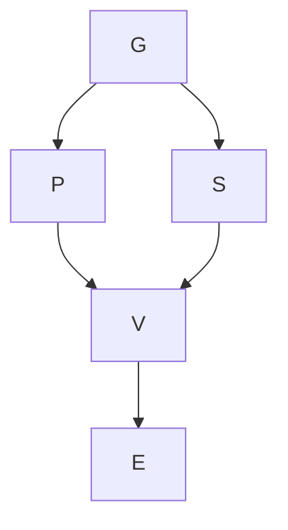
</details>

More commonly, social science proceeds by identifying more proximate causes that partially, rather than strictly, mediate the relationship between a cause and an outcome. For example, the theoretical model that Leahey proposes for the relationship between gender and earnings is actually as shown in Fig. 3.1.

In this model, Leahey proposes that gender differences in specialization are part, but not all, of why gender is causally related to productivity. Also, gender differences in productivity are part, but not all, of why gender is causally related to salary differences. The hypothetical intervention that eliminated in gender differences in specialization may be thus expected to reduce, but not eliminate, gender differences in salary.

The most common language for talking about partially mediating relationships is that of direct, indirect, and total causal effects. Leahey's theoretical model also proposes that productivity partially, but not strictly, mediates the relationship between specialization and visibility. The total causal effect of specialization on visibility corresponds to the change in visibility which results from a change in degree of specialization, regardless of the mechanisms involved. The total causal effect can then be decomposed into indirect effect(s) via specific, partially mediating, proximate cause(s), and the remaining direct effect.

The indirect effect of specialization on visibility here is the effect changes in specialization would have if the only way specialization affected visibility was through productivity. This is a tricky concept for the counterfactual framework, and Pearl (2009: 132) calls the indirect effect “a concept shrouded in controversy and mystery.” His solution is to consider indirect effects as a quantity that depends on two separate counterfactuals. First, one estimates what values of mediator Z we would have observed under counterfactual values of X. Then, we estimate what values of outcome Y we would have observed if X was held to its actual values but Z was changed to their estimated values from the first counterfactual.

The direct effect of specialization on visibility is simpler: it is the effect changes in specialization would have if those changes were somehow blocked from having any influence on productivity. An easy way to conceptualize this in counterfactual terms is to imagine a joint intervention in which values of X are changed but Z is artificially held constant.

What is crucial to keep in mind in such analyses is that “direct” effects here are only direct given the variable(s) for which indirect effects are being estimated. An estimated direct effect may be entirely mediated by more proximate causes not in the model. In other words, a direct effect is a residual finding about how much of a distal causal relationship remains unaccounted for after specific more proximal causes are considered. It does not imply anything further about the immediacy of the process by which the cause brings about the outcome.

Note also that when we acknowledge that the causes of causes of an outcome are themselves causes, we acknowledge that the number of causes of an outcome is indefinite, akin to how our number of ancestors is indefinite and, if we go far enough back, may include most everyone alive at some point. This makes some people suspicious. For example, Martin (2011: 38) presents two scenarios: (1) A sells B a store and a year later, C breaks into the store and kills B and (2) in which A was a Pleistocene-era ancestor of C, who kills B. In each case, he asks, “Did A cause the death of B?” and his answer of “yes” leads him to conclude that, in the counterfactualist framework, “we cannot ask the question, ‘What caused B’s death?’ and bring in anything less than an infinite number of causes, with little way of telling them apart.”

It is the last clause that makes all the difference. Martin is correct that once one gets into (causes of) causes of causes, historical questions like ‘What caused B’s death?’ or ‘What caused World War I?’ do not have a clear stopping point. Where his reasoning errs is in its suggestion that we are powerless to draw useful distinctions among causes nevertheless. From the above, for example, we can distinguish that C murdering B is a more proximate cause of B’s death than A’s selling him a store. In our discussion of causal importance below, we can likewise determine that C murdering B is a more important cause of B’s death. At the population level, these same pseudo-conundrums lead either to causes that are so indirect that their influence on the outcome is beneath whatever threshold of trivial (Martin’s shop-seller example) or to causes that pertain to explaining the existence of the population rather than variation in the population (his Pleistocene example). $^{2}$ In other words, yes, anybody who has watched enough time-travel movies appreciates how any single event is the culmination of a whole plenum of things that could have happened differently, but this has no crippling implication for the use of counterfactuals as the major conceptual workhorse for thinking about causality and causal explanation in social science.

## Causal Configurations

Perhaps the major divide in causal analysis in social science separates “case-oriented” and “population-oriented” (or “variable-oriented”) endeavors. Case-oriented projects “seek to explain particular outcomes in specific cases” (Mahoney 2008: 414). Many such projects are nevertheless comparative and seek to make general statements that apply across multiple cases. An example of a comparative case-oriented question would be “When do austerity programs result in severe social protests?” (see Ragin 2000). Population-oriented projects seek to make general statements about the distribution of causal effects over populations or subgroups of populations. An example of population-oriented questions would be “Does growing up in a bad neighborhood affect school achievement? If so, how much is this effect, why does it exist, and does it vary in systematic ways across persons?”

This chapter, like the rest of this volume, is predominantly concerned with causal distinctions as they pertain to the practice of population-oriented social science. That said, case-oriented researchers have made a vigorous effort in recent decades at articulating the logic of causal inference from comparative case-study data, especially in terms of establishing the limitations of thinking of causal inference for such data in statistical terms (see, e.g., essays in Brady and Collier 2010). Moreover, one way that counterfactual frameworks are cognitively useful for population-oriented research is that they heighten attention to the fact that the effects estimated by regression-type models, when causal, are summaries of case-level causal effects. Populations are comprised of individual cases even if the researcher is only interested in aggregate statements. As such, population-oriented approaches need to be compatible with the explanation of individual cases.

Two fundamental logical distinctions that are common in case-oriented research but practically absent in large-N variable-oriented research are necessary causes and sufficient causes. Saying that $X$ is a necessary cause of $Y$ implies that some state of $X$ is needed in order for some value of $Y$ to occur. To say, for instance, that contracting HIV is a necessary cause of developing AIDS is to imply that nobody has AIDS who does not first have HIV. Saying that $X$ is a sufficient cause of $Y$ implies that some state of $Y$ will occur if some state of $X$ occurs. Prior to medical developments, rabies was a sufficient cause of mortality; every single person who contracted rabies died fairly shortly thereafter.

For a binary cause and outcome, both cases imply an empty cell in a $2 \times 2$ table (no HIV-free AIDS victims; no rabies survivors). Rarely when you do large-N population-based research do you actually see an empty cell that is not based on some mechanical aspect of the data. There are various reasons that necessary or sufficient conditions observed in case-oriented research may be far more elusive in population-oriented research, but two stand out. The first reason is that observing necessary and sufficient causes demands accurate operationalization and measurement. In survey research, for example, large samples often contain enough measurement errors that even logically mandatory relationships will often not appear as such in survey research unless specifically imposed by investigators. Somebody reports having never attended college and yet being employed as a physician; somebody else reports five sexual partners in one wave of a survey and being a virgin in the next. The second reason is that since populations encompass many more cases, they are much more likely to include genuinely exceptional cases that negate the necessary or sufficient causal claim. Dion (1998) suggests that “probabilistically necessary” and “probabilistically sufficient” can be used for large N where either measurement issues or the possibility of unaccountably idiosyncratic processes lead to relations that are still useful to talk about in quasi-deterministic terms even though observed exceptions exist. $^{3}$

What may be necessary or sufficient to produce an outcome is not a single cause but rather a configuration of causes. Key concepts here are INUS causes and SUIN causes. A SUIN cause is a sufficient but unnecessary part of a causal condition that is itself insufficient but necessary. Mahoney (2008) gives the example of the democratic peace theory, in which the absence of democracy is necessary (but not sufficient) for war. If different conditions are sufficient to undermine democracy (e.g., “fraudulent elections,” “repression”), then these conditions are SUIN causes of war. By undermining democracy, fraudulent elections are neither necessary nor sufficient for war, but they do enable the possibility.

A general example of SUIN causes may be precipitating causes, events that bring about an outcome in the presence of other enabling conditions. Riots generally follow a preceding event (like the Rodney King beating verdict and the Los Angeles riots of 1994). Yet, that event is typically understood as not a sufficient cause—deteriorating conditions made the area in question ripe for a riot—or a necessary cause (other events, had they happened instead, could have triggered a riot given the same conditions). The occurrence of some precipitating event may therefore be a necessary but not sufficient condition for a riot, and any of a number of possible events may be sufficient but not necessary to serve as a precipitating event.

INUS causes have received more attention. An INUS cause is an insufficient but necessary part of a causal condition that is itself unnecessary but sufficient (Mackie 1965; sometimes “nonredundant” is used instead of necessary here). For example, in studying when countries undertake policy reform, rightist partisanship has been identified as an INUS cause of unpopular reform. If so, the existence of rightist partisanship does not itself bring about reform, and unpopular reform can occur in the absence of rightist partisanship, but there are specific conditions under which unpopular reform will happen in the presence of rightist partisanship but not in its absence.

INUS causes are known as component causes in epidemiology (Rothman and Greenland 2005; Johansson and Lynøe 2008). The idea here is that there are many different configurations of causes that are each sufficient to produce a disease. A component cause influences the outcome by being part of at least some of these configurations. Having unprotected sexual intercourse is neither necessary nor sufficient to contract HIV, yet of course many people are HIV positive who would not be had they

never had unprotected sex. One possible conceptualization then is that there are various conditions sufficient for HIV transmission to occur, and unprotected sexual intercourse is a necessary part of some but not all of these conditions.

Population-oriented research typically works with imperfect measures on only a subset of the actual causes that influence outcomes. When an outcome is produced by the realization of one configuration of a large set of sufficient causal configuration and some INUS causes important to the configuration are unobserved, then the outcome will look like it has a probabilistic relationship to the INUS causes that we do observe. In other words, a deterministic world replete with INUS causality is consistent with a world that can only be modeled in statistical terms with largely additive causal relationships when the variables in the model comprise only a modest subset of all relevant causes (Rothman and Greenland 2005 and Mahoney 2008 provide a nice juxtaposition of this point from the perspectives of epidemiology and comparative-historical social science, respectively). There has been some work in epidemiology on a sufficient component cause model that conceptualizes component causes as such rather than as additive and interacting terms in a conventional model, but this work has not yet reached the point where its applicability to practical social science research problems has been demonstrated (e.g., Flanders 2006; VanderWeele and Robins 2007). Nevertheless, the idea that additive models may be estimating what are really highly complex and possibly deterministic component cause relationships allows one way of connecting the logic of population models with case-specific explanations.

## Causal Importance

In their excellent chapter on “causal asymmetries,” Wright et al. (1992) cover a variety of rationales by which it could be asserted that one cause is “more important” than another. Obviously, such assertions might serve a variety of rhetorical purposes. Their position, in the end, is that various kinds of qualitative distinctions that one can make about causes do not provide systematic grounds for declaring one cause more important than another. Rather, the only grounds on which they conclude that claims about relative importance of causes to be consistently, coherently made is if they can be articulated and adjudicated in quantitative terms.

In regression models that afford causal interpretations, coefficients can be interpreted as the effect of a unit increase of $x$ on $y$ . Comparing the magnitude of two coefficients to determine which is the most important cause raises the obvious problem that the magnitude of coefficients depends on what scale we choose: we could make age an arbitrarily more or less important cause of an outcome by changing measurement from seconds to centuries. A common approach is to allow the population distribution of our variables to define what comprises a commensurate metric for us by using the population distribution. The prime example here are $x$ or fully standardized coefficients—that is, regression coefficients based on measuring $x$ in standard deviations.

Of course, one typically does not know the population distribution of $X$ , but must estimate it using the observed distribution of $X$ in one's sample. For standardized coefficients to make any sense whatsoever, the standard deviations on which they are based must be meaningful quantities in terms of the population whose parameters we are attempting to estimate. This is important to keep in mind because, in properly specified models, sample-based regression coefficients do not actually have to be based on representative samples in terms of $X$ —weighted or unweighted—in order for coefficients to be unbiased, but the same cannot be said for standardized regression coefficients.

Beyond this, many commentators have been critical of comparing standardized coefficients to evaluate relative importance. If we are talking about comparing coefficients in a single model, one may note the counsel of Winship and Sobel (2004: 499) that successfully estimating the effect of one independent variable on an outcome is sufficiently difficult that “attempts to estimate the

effects of multiple variables simultaneously are generally ill advised.” Blalock (1961: 868) more specifically advises that it is “unwise to become involved with the problem of evaluating the relative importance of variables which stand in some sort of causal relationship to each other”; that is, to compare the importance of distal and proximal causes. If one is to forge ahead, the claims about the relative importance of two causes would seem to imply a comparison of the total causal effects of each variable, which would imply either a structural equation modeling approach or one based on estimating the total causal effect of the distal and proximate cause as separate models.

A different, more questionable, idea is that comparing standardized coefficients is misguided because it conflates the estimated effect with the variance of X, when typically researchers are only interested in the former (King 1986: 671). The same principle that standardized coefficients are problematic because of their dependence on the variance of X is also sometimes used to argue that comparing standardized coefficients is especially a bad idea when comparing coefficients across groups (Treiman 2009). To consider an applied example, Branigan et al. (2011) found that skin color measured in objective terms (percent reflectance) has about the same estimated unstandardized coefficient with educational attainment for white men and for black men. For purposes here, let us presume in both cases the coefficient indeed does accurately estimate the total causal effect of skin color differences on educational attainment (via, e.g., differential treatment by teachers or peers).

Does this imply that skin color is an equally important cause of educational differences for black men and white men? Variation in skin color reflectance is much larger for blacks than for whites. So while the unstandardized coefficient is the same, the standardized coefficients are much different; if you look at the difference between the 25th and 75th percentiles for each group, the expected education difference for black men is twice as large as it is for white men. To us, this implies that skin color is more important cause of educational attainment for black men than white men even though the unstandardized coefficients are the same (see also Hargens 1976), while others have drawn the opposite conclusion from logically comparable worked examples (Treiman 2009: 110).

More broadly, we think the question of “Does $X_{1}$ or $X_{2}$ have a bigger effect on Y?” differs from “Is $X_{1}$ a more important cause of $X_{2}$ than Y?” precisely in that the latter question depends in part on how common the two causes are. Consider again the study that found that smoking was the leading preventable cause of death in the United States. The sense here by which smoking is said to be “leading” is that smoking is estimated as having killed the most people of any cause in the set of preventable causes. We regard this as a defensible warrant for saying that it is the most important of these causes. But this is not directly a claim about the magnitude of the size of the effect of smoking on the mortality prospects of individuals—many behaviors are more lethal than smoking for those who engage in them, but not as many people do. That is, the number of people killed by smoking is a function of both (1) how lethal smoking is for those who smoke and (2) how many people smoke.

Epidemiologists refer to this sometimes as the population attributable fraction. There are complexities here depending on particularities of the application (see Greenland and Robins 1988), but a rough way of thinking about this quantity in counterfactual terms is to consider the difference between the actual population distribution of the outcome and the potential distribution if X was held constant across all cases (e.g., if no one smoked). A simple expression of this quantity can be computed as $p(X) \left[p(Y|X) - p(Y \sim X)\right]$ .

Importance here is a population-specific determination, in that it depends on the particular distribution of causes in the population, as well as on the distribution of anything else that would cause the effect size to differ over individuals in the population. Populations can be divided into strata (e.g., age groups) and effects estimated within strata; these can be used to evaluate how the relative importance of different causes changes with actual or hypothetical changes in the population distribution (Greenland and Rothman 2008). Of course, the magnitude of effects themselves may change as populations change. For example, there has long been debate about how the value of an educational credential for wages changes as the percentage of the population with that credential increases.

Also, outcomes are not exclusively attributed to particular causes; that is, the sum of attributable fractions across all cases is greater than 1 (Rothman and Greenland 2005). Consider the example of causes that operate synergistically, for example, if smoking was much more lethal among obese people than nonobese people. Then, there would be overlap in the counterfactual survivors of an intervention that prevented anybody from smoking and an alternative intervention that prevented anybody from becoming obese.

The same could be said for causes that stand in a distal/proximate relationship to one another. Presume that low physical activity is a cause of obesity and vice versa. Again, this implies overlap in the counterfactual survivors of an intervention that increased physical activity (and reduced obesity indirectly) and an alternative one that reduced obesity (and increased physical activity indirectly).

To give another example, in behavioral genetics, variance decomposition techniques are often used toward generating findings about the relative importance of genetic variation versus environmental variation, as in, for example, a report that genetic variation is more important than environmental variation in determining height. Yet part of how genes can influence outcomes is by influencing traits that influence the experience of environmental exposures—children who evince an early aptitude for reading report enjoying reading more are encouraged to read more and spend more time reading (Rutter 2006). For the variance decompositions of behavioral genetics to add to 100%, one either needs to assume that there are no interactions or correlations between genes and environments or that the decomposition is actually between genes and exogenous environments, that is, environmental influences that are independent of genetic endowments (Freese 2008).

Typically, whether one cause is more distal or proximate than another does not indicate whether it is more important in a quantitative sense. Again, the relative size of the total causal effect would seem to be at issue, and either a distal or proximate cause can have a larger total causal effect. $^{4}$ In the health disparities literature, there is a longstanding debate about the relative benefit of “upstream” (distal) interventions versus “downstream” (proximate) ones, which turns on downstream interventions having bigger effects on particular pathways to disease but upstream interventions potentially exerting influence through many more pathways.

For that matter, we should underscore the crucial practical difference between changes in an outcome under a hypothetical equalizing intervention and the changes that may be anticipated by actually available interventions. If one can actually intervene more on A than on B—either in absolute terms or in terms of what can be attained for the same cost—then intervening on A instead of B may have a greater effect on the full distribution of Y even if B is a more important cause in the sense of the attributable fraction.

For the kinds of causes that are prominent within case-oriented research, Mahoney et al. (2009) offers a technique based on Venn diagrams that depict the sets of cases in which the cause and outcome occur. For a necessary cause, the set of cases in which the outcome occurs is entirely subsumed within the set of cases in which the cause occurs. The opposite is true for sufficient causes: the set of cases in which the cause occurs is entirely subsumed in the set with the outcome. The relative importance of two necessary or two sufficient causes, then, may be adjudged by which is closer to being a necessary and sufficient cause, in which case the two Venn circles would be exactly coterminous. Equivalently, of two necessary causes, the more important cause is the less common one; of two sufficient causes, the more important cause is the more common one.

For SUIN and INUS causes, Mahoney et al. (2009) suggest that some causes are more important than others to the extent to which they approximate necessary (for SUIN) or sufficient (INUS) causes. This is more debatable. The implication is that any sufficient cause is more important than any INUS

cause. The tension, analogous to our discussion of quantitative comparison, comes in comparing a rare sufficient cause to a common INUS cause. A very rare radiation exposure that is sufficient for developing lung cancer is still hard to consider being as important of a cause of lung cancer as smoking, even though smoking is not only an insufficient cause of lung cancer but most smokers do not get lung cancer (example adapted from Wright et al. 1992). Again, the issue is that, because smoking is so common, many more cases of lung cancer are attributable to it than to the radiation exposure.

A better standard, one that makes more consistent use of the Venn diagram technique, may be simply to judge one INUS cause as more important than another INUS cause to the extent to which it approaches a necessary and sufficient cause—that is, to the extent to which the cause and outcome are coterminous. If we use X to indicate the presence of the cause and Y to indicate the presence of the outcome, this can be expressed as $p(X,Y)/[p(X)+p(Y)-p(X,Y)]$ .

Note that there is a slight difference here between the conceptualization that underlies this formulation and that which underlies the attributable fraction. When answering the question of how many deaths are attributable to smoking, the number of smokers who do not die is irrelevant. By that standard, if smoking and obesity killed the same number of people each year in terms of the attributable fraction, we would consider them equally important causes even if obesity was more common than smoking. In terms of the Venn diagram technique, however, if smoking and obesity killed the same number of people, this would mean they had the same overlap with the cause (i.e., that they were equally sufficient causes), but because smoking was rarer, it would have less area outside the cause. We would therefore judge smoking to be a more important cause than obesity because it was closer to being a necessary cause. The broader point is that either standard provides a consistent and coherent way of determining which of two causes is more important, but what differs is whether what we consider important is accounting for the occurrence of a binary outcome (which is what the attributable fraction does) or distinguishing occurrences from non-occurrences.

## Causes of Causal Relationships

Lieberson (1985) distinguishes between surface causes which “appear to be generating a given outcome” and basic causes which “actually generate an outcome” (p. 185). The hypothetical example he provides is of a gap in income between racial groups that appears attributable to educational differences, but reductions in the educational differences do not lead to any change in the income gap. Lieberson’s example permits multiple interpretations, and a trivializing one would be to say just that surface causes are not properly causes at all, but simply exemplify spurious association between a real (“basic”) cause and the outcome.

Two more interesting possibilities, however, each call attention to distinctions arising from how simple estimates of causal effects can be misleading given broader dynamics of the system in which they occur. The first possibility is that the basic cause and outcome could be linked by a number of different surface causes in such a way that what is actually generating group differences in a given context is effectively redundant with other potential causes of group differences. Earlier, we mentioned that causality encompasses two notions that are not entirely the same: that causes produce outcomes and that outcomes depend on causes. Redundancy in causal systems provides one case in which the divergence of these two notions may be clear. In a given case, for instance, an educational difference may provide the grounds on which a minority-race candidate is passed over for a job in favor of a majority candidate. When educational credentials are equal, however, perhaps other characteristics that would have earlier disadvantaged minority-race candidates with less education come to the fore (like perceived fit with existing employees), which lead again to the minority candidate being passed over. In other words, by tracing the causal process in given cases (e.g., Bennett 2010), we might come

to proper inferences about causes that produced the outcome in those cases that nevertheless overstate the changes that would result from intervening on the cause.

Many information systems, like telecommunications systems, are designed to be redundant—the system will still convey messages from A to B even if a node that is normally part of the actual connection used to link A and B is removed. In the philosophical literature, one popular toy example involves someone who is fatally shot after having ingested a poison that would have killed them otherwise—one can say the shooting was the actual cause of death and yet the outcome would have been the same had it not happened. Lieberson’s distinction between basic and surface causes may suggest the analogous possibility at the level of social dynamics: that a mediating variable like education may account for racial differences in one context but that disadvantages are sufficiently redundant that interventions on education do not actually affect the ultimate magnitude of the race gap.

An alternative possibility suggested by Lieberson's example is that the basic cause and outcome could be linked by a mechanism implicated in the generation of the surface causes themselves, such that addressing one surface cause leads to another surface cause emerging or increasing in importance. Consider a democratic society that includes one region in which members of the dominant ethnic group wish to dilute the voting power of a subordinate group. A literacy test is instituted that accomplishes this purpose. Egalitarian-minded courts ban the use of these tests. The dominant group responds by instituting a poll tax, which has much the same effect on participation by the subordinate group that the literacy test did.

In this example, when the literacy test was in place, it was the surface cause of group differences in electoral participation in the sense that it served as the proximate means whereby the group difference was produced. Yet the difference in participation was not counterfactually dependent on the existence of a literacy test so long as the more basic cause existed of the dominant group wishing to suppress participation by the subordinate group and having various other available means of doing so.

In Lieberson's example of educational differences and income differences, imagine if the basic cause of income differences was employers being strongly disinclined to hire minority-race workers. Educational differences may then provide a pretext for not hiring black workers, but, if education were equalized, employers would emphasize some other criterion that disadvantaged black workers. The difference between this example and the earlier example of causal redundancy is that here part of why the proximate causal relations exist and are sustained is their role in preserving the relation between a distal cause and outcome.

These more systemic interpretations of basic and superficial causes presage the concept of fundamental cause that has become a central concept of epidemiological sociology (Phelan et al. 2010; Link and Phelan 1995). The concept has been used primarily as a potential characterization of the inverse relationship between socioeconomic status and health. Its usage is more easily understood against a backdrop in which some have regarded SES as simply a placeholder construct to be supplanted by “real” causes of population health or regarded SES as a real cause but too distal to be of value for epidemiology beyond highlighting an ignorance to be resolved by a search for mediating variables. The problem with this view is that the relationship between socioeconomic status and health has largely proven more robust than the more immediate causes of disease and death that prevail in a particular population at a particular time. Roughly, what kills people changes, but that lower-status members of society die earlier does not.

Lutfey and Freese (2005) argue that fundamental causality is thus a distinct logical type of causal relationship. For $X$ to be a fundamental cause of $Y$ , $X$ must be a distal cause with many proximate consequences, and $Y$ must be an outcome with many proximate causes. Consequently, $X$ and $Y$ are typically linked by massively multiple mechanisms, and a systematic asymmetry exists among these mechanisms such that those by which $X$ influence $Y$ in one direction are much greater in number and magnitude than the mechanisms by which $X$ influences $Y$ in the other. In other words, the detailed pathways by which low social standing may negatively influence health are vast and overwhelming in

comparison to the ways that low social standing positively influences health. Then, there must exist some “meta-mechanism” or “durable narrative” that accounts for the preservation of this asymmetry as mechanisms change.

Link and Phelan emphasize “flexible resources” as a durable narrative linking SES and health: good health is a broadly desirable end and socioeconomic status provides differential means in achieving that end. Freese and Lutfey (2011) distinguish the claim that SES is a fundamental cause of health from any particular theory of the durable narrative involved, and they raise the possibility of spillovers as a durable narrative separate from “flexible resources” that may be important for understanding enduring and robust health disparities. Regardless, note that SES as a fundamental cause is not an academic claim devoid of policy implications: the implication is that differences in social standing and the capacity to use means to protect health are together sufficient for health disparities. In other words, calls to “eliminate” health disparities without addressing resource differences are likely fanciful, and the real effect of interventions on disparities may depend on their overall effect on the capacity for agentic behavior to protect health.

Relatedly, evolutionary biologists and psychologists sometimes distinguish proximate and ultimate causes (Mayr 1961; Laland et al. 2011). Consider the theory that father absence influences the pace of pubertal development because, in our species history, father absence provides a proxy for the amount of a paternal investment a woman's own children would receive, and the optimal pace of development in terms of reproductive fitness is accelerated in low-investment versus high-investment environments (Belsky et al. 1991). (Set aside whether this theory is actually true.) In this theory, father absence is a proximate cause of differences in pubertal development. The implication is that we would expect manipulations of father absence would lead to differences in development and that some mechanism exists linking immediate consequences of father absence to the immediate physiological causes of different rates of development.

But “ultimate” causes here are not the same as the “distal” causes discussed earlier, even though both terms were contrasted with proximate causes. Distal causes in this example would be causes of father absence. Ultimate cause, on the other hand, makes reference to the possibility of a historical explanation for the development of the embodied physiological mechanisms responsible for the causal relationship between father absence and pubertal development. That claim entails either direct historical information or some theory of the “logic of history.” In this case, the logic of history is provided by the shaping of physiology over generations by natural selection, and the theory is that the fitness advantages associated with an adaptive timing of pubertal development caused physiological mechanisms responsive to father absence to evolve in our species history.

Ultimate causes do not have to reference species history or natural selection. Functionalist explanations trace the origins and sustenance of causal relationships to larger systemic imperatives. A classic example here is Malinowski's explaining the elaborate fishing rituals of the Trobriand Islanders by their effects on reducing fears associated with an intrinsically dangerous task (Stinchcombe 1968; Wright et al. 1992). The implication is that a counterfactualist who came ashore with Malinowski would observe the Islanders and come away with a causal story about the fearfulness reducing effects of the ritual. While correct, this would miss a vital part of the phenomenon, which is the role of this causal relationship in explaining why the Islanders conduct the ritual in the first place. If Islanders were prevented by outsiders from observing this ritual—but not from fishing!—we might expect the development of some alternative cultural or institutional mechanism for reducing fear. Likewise, if changes resulted in fishing no longer being as otherwise fear-provoking, the rituals may persist by cultural inertia but would not have the same dynamic resisting their discontinuation or evolution to a different form.

## Conclusion

Societies are enormously complex systems and so social science is an extraordinarily complex project. A temptation toward making the enterprise more tractable is to focus on narrow questions of assessing interventions. While obviously important, there are many puzzles to social life that cannot be reduced to analogies of program evaluation. Even so—or especially so—questions about complex causal relationships in social research require clear and disciplined thinking about the structure of causal relationships if they are to be successfully engaged. In this chapter, we have focused on distinctions that can be made among causes and have tried to explicate aspects of several of the most handy ones. To be sure, not every complexity of social science explanation can be reduced to finding just the right adjective to put in front of “cause,” but recognizing how fundamentally different types of causes can be complements toward a more complete understanding of a phenomenon provides valuable cognitive tools.

## References

Belsky, J., Steinberg, L., & Draper, P. (1991). Childhood experience, interpersonal development, and reproductive strategy: An evolutionary theory of socialization. Child Development, 62, 647–670.   
Bennett, A. (2010). Process tracing and causal inference. In H. E. Brady & D. Collier (Eds.), Rethinking social inquiry: Diverse tools, shared standards (2nd ed.). Lanham: Rowman & Littlefield.   
Blalock, H. M. (1961). Evaluating the relative importance of variables. American Sociological Review, 26, 866–874.   
Brady, H. E., & Collier, A. (2010). Rethinking social inquiry: Diverse tools, shared standards (2nd ed.). Lanham: Rowman & Littlefield.   
Branigan, A. R., Freese, J., Patir, A., McDade, T. W., Liu, K., & Kiefe, C. (2011). Skin color, sex, and educational attainment in the post-civil-rights era. Presented at the Meeting of the Research Committee on Social Stratification and Mobility (RC28) of the International Sociological Association. Essex, UK.   
Collins, J., Hall, N., & Paul, L. A. (Eds.). (2004). Causation and counterfactuals. Cambridge, MA: MIT Press.   
Danaei, G., Ding, E. L., Dariush, M., Ben, T., Jurgen, R., Murray, C. J. L., & Majid, E. (2009). The preventable causes of death in the United States: Comparative risk assessment of dietary, lifestyle, and metabolic risk factors. PLoS Medicine, 6, e1000058.   
Dion, D. (1998). Evidence and inference in the comparative case study. Comparative Politics, 30, 127–145.   
Flanders, D. (2006). On the relationship of sufficient component cause models with potential outcome (counterfactual) models. European Journal of Epidemiology, 21, 847–853.   
Freese, J. (2008). Genetics and the social science explanation of individual outcomes. American Journal of Sociology, 114, S1–S35.   
Freese, J., & Lutfey, K. E. (2011). Fundamental causality: Challenges of an animating concept for medical sociology. In B. Pescosolido, J. Martin, J. McLeod, & A. Rogers (Eds.), Handbook of medical sociology. New York: Springer.   
Granger, C. W. J. (1969). Investigating causal relations by econometric models and cross-spectral models. Econometrica, 37, 424–438.   
Greenland, S., & Robins, J. (1988). Conceptual problems in the definition and interpretation of attributable fractions. American Journal of Epidemiology, 128, 1185–1197.   
Greenland, S., & Rothman, K. J. (2008). Introduction to stratified analysis. In K. J. Rothman, S. Greenland, & T. L. Lash (Eds.), Modern epidemiology (3rd ed., pp. 258–283). Philadelphia: Lippincott, Williams, & Wilkins.   
Hall, N. (2004). Two concepts of causation. In J. Collins, N. Hall, & L. A. Paul (Eds.), Causation and counterfactuals. Cambridge, MA: MIT Press.   
Hargens, L. L. (1976). A note on standardized coefficients as structural parameters. Sociological Methods and Research, 5, 247–256.   
Holland, P. (1986). Statistics and causal inference. Journal of the American Statistical Association, 81, 945–960.   
Holland, P. W. (2003). Causation and race (Educational Testing Service Research Report RR-03-03).   
Johansson, I., & Lynøe, N. (2008). Medicine and philosophy: A twenty-first century introduction. Piscataway: Transaction Books.   
King, G. (1986). How not to lie with statistics: Avoiding common mistakes in quantitative political science. American Journal of Political Science, 30, 666–687.

Laland, K. N., Sterelny, K., Odling-Smee, J., Hoppitt, W., & Uller, T. (2011). Cause and effect in biology revisited: Is Mayr's proximate-ultimate distinction still useful? Science, 334, 1512–1516.   
Leahey, E. (2007). Not by productivity alone: How visibility and specialization contribute to academic earnings. American Sociological Review, 72, 533–561.   
Lieberson, S. (1985). Making it count: The improvement of social research and theory. Berkeley/Los Angeles: University of California Press.   
Lieberson, S. (1991). Small N's and big conclusions: An examination of the reasoning in comparative studies based on a small number of cases. Social Forces, 70, 307–320.   
Link, B. G., & Phelan, J. C. (1995). Social conditions as fundamental causes of disease. Journal of Health and Social Behavior, 35, 80–94.   
Lutfey, K., & Freese, J. (2005). Toward some fundamentals of fundamental causality: Socioeconomic status and health in the routine clinic visit for diabetes. The American Journal of Sociology, 110, 1326–1372.   
Mackie, J. L. (1965). Causes and conditions. American Philosophical Quarterly, 2, 245–264.   
Mahoney, J. (2008). Toward a unified theory of causality. Comparative Political Studies, 41, 412–436.   
Mahoney, J., Kimball, E., & Koivu, K. L. (2009). The logic of historical explanation in the social sciences. Comparative Political Studies, 42, 114–146.   
Martin, J. L. (2011). The explanation of social action. Oxford: Oxford University Press.   
Mayr, E. (1961). Cause and effect in biology. Science, 134, 1501–1506.   
Morgan, S. L., & Winship, C. (2007). Counterfactuals and causal inference: Methods and principles for social research. Cambridge, UK: Cambridge University Press.   
Pearl, J. (2009). Causality: Models, reasoning, and inference (2nd ed.). Cambridge: Cambridge University Press.   
Phelan, J. C., Link, B. G., & Tehranifar, P. (2010). Social conditions as fundamental causes of health inequalities: Theory, evidence, and policy implications. Journal of Health and Social Behavior, 51(1), S28–S40.   
Ragin, C. C. (2000). Fuzzy-set social science. Chicago: University of Chicago Press.   
Rothman, K. J., & Greenland, S. (2005). Causation and causal inference in epidemiology. American Journal of Public Health, 95, S144–S150.   
Rutter, M. (2006). Genes and behavior: Nature-nurture interplay explained. Malden: Blackwell.   
Stinchcombe, A. (1968). Constructing social theories. New York: Harcourt, Brace & World.   
Treiman, D. J. (2009). Quantitative data analysis: Doing social research to test ideas. San Francisco: Jossey-Bass.   
VanderWeele, T., & Robins, J. M. (2007). The identification of synergism in the sufficient-component-cause framework. Epidemiology, 18, 329–339.   
Winship, C., & Sobel, M. (2004). Causal inference in sociological studies. In M. Hardy & A. Bryman (Eds.), Handbook of data analysis. Thousand Oaks: Sage.   
Wright, E. O., Levine, A., & Sober, E. (1992). Reconstructing Marxism: Essays on explanation and the theory of history. London: Verso.

Part II

## Design and Modeling Choices

# Chapter 4 Research Design: Toward a Realistic Role for Causal Analysis

Herbert L. Smith

Abstract For a half-century, sociology and allied social sciences have worked with a model of research design founded on a distinction between internal validity, the capacity of designs to support statements about cause and effect, and external validity, the extent to which the results from specific studies can be generalized beyond the batch of data on which they are founded. The distinction is conceptually useful and has great pedagogic value, that is, the association of the experimental model with internal validity, and random sampling with external validity. The advent of the potential outcomes model of causation, by emphasizing the definition of a causal effect at the unit level and the heterogeneity of causal effects, has made it clear how indistinct (and interpenetrated) are these “twin pillars” of research design. This is the theme of this chapter, which inveighs against the idea of a hierarchy of research design desiderata, with causal inference at the peak. Rather, I adopt the design typology of Leslie Kish (1987), which advocates an appropriate balance of randomization, representation, and realism, and illustrate how all three elements (and not just randomization, the internal validity design mechanism) are integrated aspects of meaningful causal analysis. What is meaningful causal analysis? It depends first and foremost on getting straight why we are doing what we are doing. Understanding why something has happened may tell us a lot about what will happen if we were actually to do something, but this is not necessarily so.

## Introduction

When it comes to social research, research design is both everything and nothing. To quote Babbie (2010), “... research design involves a set of decisions regarding what topic is to be studied among what population with what research methods for what purpose” (p. 117). Or, as a text on The Design of Social Research had put it two generations earlier, “It is an old and wise saying that ‘a problem well put is half-solved’” (Ackoff 1953: 14).

Sometimes the same point is made through contradistinction. Tukey's (1986) sunset salvo that “[t]he combination of some data and an aching desire for an answer does not ensure that a reasonable answer can be extracted from a body of data” (pp. 74–75) is intended to warn off researchers who have not done their research design homework—who do not have a problem “well put”—but who hope to avoid facing the fact by appealing to the apparent fastness of statistics. This is not caricature.

Ackoff's (1953) book had plenty of good-sense advice on research design, but like many other texts on research design, it was primarily devoted to teaching contemporary statistical practice—in particular, the calculations required for various tests of hypotheses. Thus, 10 years later, when Campbell and Stanley (1963) published Experimental and Quasi-Experimental Designs for Research, they had to begin by differentiating their concept of research design from both statistics texts and Fisher's ([1925] 1951, 1935) canonical work on the “optimal statistical efficiency” (p. 1) of experimental research designs.

Campbell and Stanley (1963) fixed key concepts of research design. Their short book—it was originally a chapter in a handbook (Gage 1963)—is chock-full of influential ideas. There is no articulation of the notion of a counterfactual, but there is a strong emphasis on comparison (p. 6): of subjects both before and after an intervention or treatment and especially between groups who have and have not been exposed to an experimental variable. There is a strong emphasis on experimentation—witness the title—and on the role of randomization (random assignment of subjects to groups) in the definition of an experiment. Randomization is the principal factor dividing experimental from quasi-experimental research designs, the latter of which may have strong comparative components, but whose validity can be jeopardized by the presence of “extraneous variables,” including (but not limited to) “differential selection of respondents for the control groups” (p. 5). Twelve factors that potentially jeopardize valid inference are discussed and attributed to either internal validity or external validity.

Internal validity “is the basic minimum without which any experiment is uninterpretable: Did in fact the experimental treatments make a difference in this specific experimental instance?” External validity is about generalizability: “To what populations, settings, treatment variables and measurement variables can this effect be generalized?” (p. 5). Campbell and Stanley (1963) coined the phrase “external validity” (Shadish et al. 2002: xvii), and I am struck in rereading Campbell and Stanley (1963) by their attentiveness to the generalizability of experimental results. Nonetheless, they did emphasize the distinction between internal and external validity (e.g., pp. 23 and 71), and one form of validity does emerge as more equal (“the sine qua non” [p. 5]) than the other, namely, internal validity. This is partly Whiggish history: The primacy of internal validity as a criterion for the evaluation of research design was never as great in the initial telling as it became in the habits of researchers (and teachers of research methods) in the social sciences. But one way or the other, the distinction became an invidious one, inviting first critics (Cronbach 1982; Smith 1990), then a shift in emphasis in later versions toward external validity and “the problems of causal generalization” (Shadish et al. 2002: xix).

Campbell and Stanley (1963), however, were not overtly concerned with causation. The terms cause, causality, and causation do not feature in the books' index; they show up only a dozen times in the text, comparatively late, and never with great moment. We have already encountered their prosaic definition of internal validity—whether a treatment “make[s] a difference” or not. Campbell and Stanley (1963) were more interested in rehabilitating the experiment as a way of doing educational research (pp. 2–4), and they were clear about what an experiment meant: “By experiment, we refer to that portion of research in which variables are manipulated and their effects upon other variables observed” (p. 1). Contrast this characterization with the later Shadish et al. (2002) version, Experimental and Quasi-Experimental Designs for Generalized Causal Inference. The opening chapter spells out the connection between experiments and causation. The “structural design features from the theory of experimentation” (p. xvi) are emphasized in service to a “preference for design solutions over statistical solutions for causal inference” (p. xviii [emphasis added]). Experimentation is still associated with manipulation (p. 2), but the question of whether causation exists without the possibility of manipulation is treated equivocally (pp. 7–9).

I do not mean to exaggerate the differences between the two texts. Shadish et al. (2002: xvii–xix) give their own account of the evolution from Campbell and Stanley (1963) through Cook and

Campbell (1979) to their volume. To read Shadish et al. (2002) is to appreciate the encyclopedic treatment of the logic of social research design, the compendium of research designs themselves, and the extent to which even at four decades' remove most of the key pillars and many of the details of Campbell and Stanley (1963) still undergird the edifice. But there were developments in thinking about causation. These explain the change in titles from Campbell and Stanley (1963) to Shadish et al. (2002), and they also give some new perspectives on the relationship between causation and research design. The problem of designing research to “establish causation” was once limited to the problem of designing observational schemes and concomitant data analytic plans for avoiding threats to internal validity. This is no longer the case.

The developments in thinking about causation that intervened between Campbell and Stanley (1963) and Shadish et al. (2002) are summarized in an influential paper by Holland (1986). They include the following:

• The definition of effects of causes at the unit level   
- The distinction between the effects of causes versus causes of effects   
• Emphasis on scientific as well as statistical methods for identifying effects of causes   
- The importance of the manipulation criterion to the definition of a cause

These concepts are defined as they arise in the following four thematic sections, on (1) statistical perspectives on research design, (2) causes of effects and the effects of causes, (3) the experimental model, and (4) research designs above the unit level. Taken together, the four thematic sections aim to convince that the common practice of evaluating research designs for causation or causal analysis on the primary dimension of “internal validity” is overly simplistic and misguided. Substituting invariant, abstract principles for reasoned assessment of the contours of real-world problems is rarely good practice, and what is research design about, if not the good practice of research?

## Three Perspectives from Statisticians

Holland's (1986) seminal article is pithily titled, “Statistics and Causal Inference” [emphasis added], and statistics figures prominently in how social scientists think about causation. However, I follow Campbell and Stanley (1963) and Shadish et al. (2002) in de-emphasizing computational statistical considerations in favor of observational frames: conceptualization of problems, delimitation of inferential scope, appropriate comparisons, and prospects for (and meanings of) manipulation schemes. I thus join many others in warning against the ever-seductive idea that somewhere, somehow, there is a dominant, statistical solution that can and will solve problems of social research—that we can eventually “outsource” comprehension of our slippery, contested human world to a “higher power” that can slice definitively and rule categorically, with a logic grounded in mathematics. Duncan (1984) termed this hope (or illusion) statisticism:

The notion that computing is synonymous with doing research, the naïve faith that statistics is a complete or sufficient basis for scientific methodology, the superstition that statistical formulas exist for evaluating such things as the relative merits of different substantive theories or the “importance” of the causes of a “dependent variable”; and the delusion that decomposing the covariations of some arbitrary and haphazardly assembled collection of variables can somehow justify a “causal model....” (p. 226)

Fortunately, when prominent statisticians discuss causal inference, one rarely finds statisticism. Rather, one encounters strong briefs on behalf of important principles of research design. As an antidote to the siren song of statistical “methods” and “techniques” and a review of valuable ideas

on causation and research design, I abstract from the writings of three statisticians—Leslie Kish, David Freedman, and Paul Rosenbaum—well known for their technical contributions. $^{1}$

## Leslie Kish on Randomization, Realism, and Representation

Leslie Kish provided the comprehensive, definitive integration of sampling theory with the practice of survey research (Kish 1965). $^{2}$ He introduced the concept of design effects—the departure of variance estimates for complex sampling designs from those computed under the assumptions of simple random sampling. If one adopts a narrow association of the criterion of external validity with the details of sampling from finite populations, then Kish (1965) is the canonical source. Yet when Kish (1987) summarized his rich scientific career, it was in a slim volume entitled Statistical Design for Research, the first chapter of which considers the “compromises between the desirable and the possible” for “the basic philosophical problems of all empirical sciences: how to make inferences to large populations, to infinite universes, and to causal systems from limited samples of observations, which are also subject to diverse errors and to random fluctuations” (p. 1).

The key features of Kish's (1987: chap. 1) exegesis are the following:

1. An emphasis on three desiderata for research design—randomization, representation, and realism—where randomization is with respect to subjects over treatments as per classical experimentation; representation pertains to subjects over populations, including theoretical populations (Kish 1987: chap. 2), and realism is the correspondence (or lack thereof) between variables or constructs as they exist in the social world and as we are able to observe, measure, and manipulate them in our research.   
2. An insistence, pace Campbell and Stanley (1963), that “there is no supercriterion that would lead to a unique, overall, and ubiquitous superiority among the three criteria” (Kish 1987: 10); since, for example,   
3. “all relations in the physical [?] world between predictor and predicted variables are conditioned on the elements of the population subjected to research” (Kish 1987: 13).

The presence of realism is noteworthy. In Campbell and Stanley (1963), most elements of both realism and representation are subsumed under the rubric of external validity, of generalizability. There is no explicit mention of construct validity (one aspect of realism), but in Shadish et al. (2002: chap. 3) construct validity and external validity share a chapter, including explicit efforts to differentiate them (e.g., p. 95). Any teacher who has worked with either scheme knows how difficult it is to make concrete examples stay in their “box.” When we express skepticism about the stereotypical psychology laboratory experiment performed on college sophomores, is it because we think that college sophomores are not representative of the population to which we want to generalize the result? Or is it because we think that the laboratory setting is a faithless simulacrum of the environment within which social life and various human behaviors play themselves out—that the tasks enacted in the experimental setting resemble their “real-world” counterpart activities in name only?

Consider the issue of the support for inference, in the data analytic sense: Are our estimates of “effects” at various combinations of predictor values a function of information available on or about those values? Or do they rely less on local observations and more on distant observations and assumptions about the functional forms of conditional (if not causal) relationships? This is a statistical

problem with antecedents deep in the history of the field: Pearson was concerned about the model bias associated with parametric functions, whereas Fisher wished to avoid inefficiencies associated with small numbers of observations (Härdle 1990: 3–5). If we lack data at points of interest because of sampling design (inadequate sample sizes, poor coverage or survey execution), this is a problem of representation. $^{3}$ If we are relying on parametric specifications of causal relationships to make statements about the effects of causes where no alternatives to these alleged causes exist (Smith 1997: 333–334), then we have a problem with realism.

The realism criterion motivates research designs labeled observational studies (Kish 1987:20–22) or controlled investigations (pp. 6–11). These are defined in terms of what sample surveys and randomized experiments are not: “the collection of data—with care, and often with considerable control—without either the randomization of experiments or the probability sampling of surveys” (p. 6). A design that is defined as a residual category lacks aesthetic appeal, and it is more difficult to judge the fidelity of an observational study with respect to realism than it is to evaluate an experiment, for example, with respect to randomization. Nonetheless, by elevating the diffuse but important criterion of realism to the level of the more familiar ideas of randomization and representation, Kish (1987) does a real service to the practice of designing social research.

## David Freedman on Research Designs for the Social Sciences

David Freedman was well known in statistics for, inter alia, his contributions to the theory of Markov chains (Freedman 1983), the bootstrap (Bickel and Freedman 1981; Freedman 1981), and Bayesian estimation (Diaconis and Freedman 1986). Prior to the 1980s, he was primarily known among social scientists for his introductory statistics textbook (Freedman et al. 1978). It was (is) a gem. It began not with the standard typology of levels of measurement but with a brief in favor of the randomized experiment as the best mechanism for making inferences about cause and effect.

At some point, statistical practices in the social sciences caught Freedman's eye, especially the use of statistical methods to make inferences about causal relationships. He was not impressed with what he saw. He railed against the penchant of social scientists to use off-the-shelf regression models for just about everything (e.g., Freedman 1985). The use of such “models” necessitates lazy and/or unacknowledged assumptions about functional forms and distributions of errors, both of which he viewed as symptomatic of self-deception and pseudoscience. $^{4}$ As more than one social scientist pointed out (e.g., Blalock 1991), this critique of vast swaths of social science was hardly new; social scientists plow a tough terrain and, anyhow, what exactly is one supposed to do? Freedman was undeterred and mocked the habit of those who engaged in special pleading to motivate “the possibility of disentangling complex causal processes by means of statistical modeling” (Freedman 2005: 195). $^{5}$

He was less forthcoming regarding how sociology and the social sciences should proceed, but here are two themes: The first is “a reduction over the medium term in scientific aspirations” (Berk 1991:318). This is the flavor:

We should adopt the habit of making empirical claims that are more sharply focused and perhaps more modest. We need to take more seriously the job of comparing theory to reality. And we need to build the requisite tools: reality tests instead of t tests. It is not complexity that will help us, but simplicity.

At any given time, most interesting questions will not have empirical answers. Some do, however, and we have to identify these. Then, different questions demand different kinds of answers. For some issues, anecdotal evidence is the best that can be brought to bear. For others, case studies are appropriate. At times, descriptive statistics will help: $2 \times 2$ tables, or even a regression equation. A formal statistical model with significance tests may be just the right approach, on occasion. At present, such distinctions are seldom made. And typical empirical papers, even the good ones, drift off into fantasy. Yet the real world, with all its frustrations, is where we belong (Freedman 1991b: 358).

Note the emphasis on realism, a de-emphasis on statistics per se, and a situational preference for observation, including the focused (case studies) and the opportunistic (anecdotal evidence). Left ambiguous is whether any of this justifies causal statements about the real world (as per Harding and Seefeldt, Chap. 6, this volume) or whether description is the un-shameful supper of the humble poor. $^{6}$

The second piece of advice pertained to the need for “strong research designs” (Berk 1991: 318). Freedman (1991a: 293–300) narrated the great “detective work” that John Snow did in establishing that cholera was an infectious, waterborne disease and that eliminating exposure to contaminated water would short-circuit epidemics. There are many interesting elements to the story: Snow had a theory of cholera based on observation of the natural history of epidemics. There were key observations that accorded with his theory but not the theory of others. There were causal mechanisms in the story, including an infection cycle, concomitant symptoms, and the release by the body of water, with a subsequent contamination of the water supply to the detriment of others. But a complete mechanistic account was not needed. Although the identification of the pathogen and the full specification of the pathogenesis of cholera lay in the future, enough was known to suggest some interventions. Snow prescribed the removal of specific pump handles, a dramatic manipulation that makes for a good story but turns out to have itself been contaminated by some of the messy confounding details enshrined in Campbell and Stanley (1963) (history, maturation). That’s okay; Snow recognized that this was inconclusive. He was not content to let his causal inferences rest on suggestive evidence or study. Although he was not able to effect an experimental intervention to show how contaminated water caused cholera, random human affairs dealt him a natural experiment the likes of which the rest of us can only drool over: Two different water companies, one with a clean intake of water, the other with an intake contaminated with sewage, supplying the same neighborhoods in London; the collection of neighborhoods diverse socially and economically; and—best of all—no apparent rhyme or reason as to why one house was served by one water company and the neighbor by another. The tens of thousands of houses were thus balanced across all factors save the company furnishing their water, and the source of water for each company was singular and well differentiated. A careful mapping of cholera deaths to houses revealed that the death rate was an order of magnitude higher in households served by the company that drew its water downstream from sewage.

Freedman viewed experimentation as the preferred method for adducing causation, but that is not the moral of this story. After all, this was not a randomized, controlled trial. It was a natural experiment. Snow was certainly clever to notice it, but that was at best half of the story. There was a lot of work involved, from the tracing of deaths to houses and of houses to water suppliers; not to mention all of the background work required to convince himself (and others) that the assignment of households to water companies was in essence random with respect to both the outcome of interest and other potential confounding variables, even if there were indeed some specific and in some sense conscious chain of events that linked each household to a water supplier (i.e., an idiographic causal account for selection to treatment). The two take-away messages are (1) the effort to move from causal accounts—including accounts of mechanisms—to the identification of elements subject

to manipulation and (2) the importance of hard work over a dogmatic commitment to a research “method” or even a research design. The title of Freedman’s (1991a) essay, after all, was “Statistical Models and Shoe Leather” [emphasis added].

## Paul Rosenbaum on Elaborating Causal Theories

Paul Rosenbaum has made foundational statistical contributions to the problems of making causal inferences from observational studies (Rosenbaum 2002), including propensity scores for balance across groups via matching (Rosenbaum and Rubin 1983a) and sensitivity analyses to evaluate the potential bias in a study due to unmeasured covariates (Rosenbaum and Rubin 1983b). This work articulates with the design of observational studies (Rosenbaum 2009).

Here is an example, abstracted from Rosenbaum (1984), beginning with a verbal outline of Rubin's (1974, 2005) model for potential outcomes and responses. This model shows up elsewhere in this volume. It is equivalent to the counterfactual model (Morgan and Winship 2007: chap. 2). Its elucidation here helps set ideas that appear later in this chapter.

Potential outcomes are defined for each unit (e.g., individual) across all treatments or interventions. They are potential outcomes because they are observed only when a unit receives the corresponding treatment. The difference between two potential outcomes is the causal effect of a treatment, and this effect is defined at the level of a unit. Since in general a unit is assigned to but one intervention, the effect—difference in response given two alternative treatments—cannot be observed for any given unit. What can be observed is the difference in average response between those units receiving the treatment and those units receiving some other treatment.

Under what circumstances is this difference in group averages an unbiased estimate of the average treatment effect for the data at hand? As is well known, when units are assigned to treatments at random, as in a randomized experiment, the difference between the group averages gives an unbiased estimate of the average causal effect of the treatment relative to an alternative treatment (or control) condition. In an observational study, however, there are likely concomitant variables that are related to the assignment of subjects to treatments. For those covariates—potential confounding variables—that can be observed, causal inference for averages conditioned on these covariates (e.g., subclassification, matching via propensity scores) relies on an assumption of strongly ignorable treatment assignment, to wit:

- The set of potential outcomes or responses is independent of the treatment to which units are assigned, conditional on the observed covariates.   
- For all fixed values of observed covariates, there is a nonzero probability of assignment to all treatments. $^{7}$

A causal effect is thus defined by a combination of treatments and potential responses. In the case of a randomized experiment, strong ignorability obtains. A corollary is that nothing need be said about causal mechanisms for the purpose of inference. A theory of how a cause translates into an effect—as per Snow and the etiology of cholera—will be useful for thinking about the particular experiment to execute, but it is inessential for lending a causal interpretation to results. $^{8}$

For observational studies, however, causal mechanisms and theory are essential, for in elaborating theories, one is led toward designs that incorporate tests that assignment to treatment is strongly ignorable. Causal mechanisms include

1. The effects of the treatments on (typically unmeasured) responses other than the responses under study ...;   
2. The effects of the treatments in a broader population than the one under study ... ; and   
3. The effects of closely related treatments, and, in particular, delineation of the changes in the treatment that are inessential in the sense of not altering the treatments' effects . . . (Rosenbaum 1984: 42).

These correspond to specifications of unaffected units, essentially equivalent treatments, and unaffected responses (Rosenbaum 1984: 44).

To evaluate the possibly causal effects of high exposure to nuclear fallout (radiation) on mortality from childhood leukemia, Rosenbaum (1984: 45–47) presents leukemia mortality rates per 100,000 person-years of exposure for a period of above-ground nuclear testing (from 1951 to 1958) in Utah counties characterized by high levels of exposure and for the same counties for the periods both prior and subsequent. Rates (in temporal order) are 2.1, 4.4, and 2.2, which is not inconsistent with the idea that nuclear fallout raises (doubles) rates of childhood leukemia. The design element is the compilation, presentation, and interpretation of additional data: rates of mortality for low-exposure Utah counties in the same three periods and for childhood cancers other than leukemia. A log-linear model is used to test equality restrictions derived from the elaboration of the causal theory, for example, that both before and after the period of above-ground testing, counties that were either high exposure or low exposure during the period of testing should have mortality rates that “are essentially equivalent . . . because the active ingredient—radiation from fallout—is present at comparatively low levels” (Rosenbaum 1984: 46). The analyses pertain only to rates at times other than that when the treatment (nuclear fallout) was being delivered. This is because what is being tested is not the effect of the treatment but the assumption that assignment to treatment is strongly ignorable. Because these data show variation inconsistent with the causal theory, the assumption is not met. This weakens our capacity to attribute the doubling of rates in high-exposure counties during the period of above-ground testing to the effects of exposure to fallout from nuclear tests.

## Summary

This section is deliberately tendentious. I have selectively emphasized ideas about research design in the works of three prominent statisticians. I have downplayed—no equations, no notation—the statistical rigor of their presentations. $^{9}$ These are not the only statisticians to dwell on research design, and one can find many of the same ideas (perhaps less elegantly put) in the writings (and, more important, the research) of nonstatisticians. There are also subtle differences in the underlying philosophies of the three statisticians: Kish emphasizes a nonhierarchical equivalence in the importance of randomization, representation, and realism (hence, in experiments, sample surveys, and observational studies); Rosenbaum focuses on how observational studies can be shown to yield results comparable to those of experiments; and Freedman, although quite catholic with respect to all the ways one might study a topic, has a decided preference for randomized experiments and a tolerant resignation toward everything else.

No matter. The purpose is to counter the notion that in studies intended to show causal relationships, that when push comes to shove, statistical considerations must trump design considerations, if only because the former appear sharp and definitive and the latter—randomized trials and random sampling aside—do not.

## Effects of Causes and Causes of Effects

If we go back to the adage that a problem well put is half solved, then one of the best things that sociologists and other social scientists can do in designing their research is get clear whether they are studying the effects of causes or the causes of effects. This powerful distinction jump-starts Holland (1986: 945). Although the distinction dates at least to John Stuart Mill (1843) and is crisply described in Sherlock Holmes (Kadane 2011: 349), it still has the power to astonish—and clarify. If Molière’s bourgeois gentleman was surprised to discover that he had been speaking prose all his life, veteran researchers are similarly taken aback to learn that in all these years of “doing causal analysis,” they were likely doing two demonstrably different things.

Demonstrably different in what way? A favorite way of posing the distinction (e.g., Dawid 2000) is some variant of “If I take an aspirin, will my headache go away?” (What is the effect of a given cause?) versus “My headache is gone. Was it because I took that aspirin?” (What is the cause of the observed effect?) This is an unfortunate rendering of the difference, not because the topic (aspirin, headaches) is not sociological but because the perspective is not sociological or population based. It elides the important distinction between the effect of a cause and the cause of an effect with the problem of how to ascribe specific outcomes to specific treatments. Better is the distinction, for example, between the two question types:

• Why did divorce increase in the United States after 1950?   
- What is the effect on divorce of a change in laws bearing on the distribution of marital assets?

The questions are not the same. The first is a “cause of effects” question. The second is a question regarding the “effect of a cause.” They are related, but being related is not the same thing as being the same, and where they are not the same matters crucially for the design of research.

## Why It Is Hard to Distinguish the Two: Causation of Cholera and of Autism

It is not always easy to know when one is studying effects of causes versus causes of effects. Depending on the conception of the phenomenon, they can be more or less difficult to distinguish. What, for example, was John Snow up to when he was studying the causes of cholera? He needed a theory of what caused cholera (causes of an effect) in order to understand what might be done to stop cholera (effect of a cause). In the crucial study cited by Freedman (1991a), Snow seems to have gotten a “twofer”: A strong natural experiment is by definition the next best thing to a randomized experiment and, as I note below, a randomized experiment is all but inseparable from the definition of the average effect of a cause in a given population. Snow’s study showed convincingly what happens when households are or are not exposed to water that has been contaminated with human waste. The “what happens” is so dramatic that from the standpoint of causal analysis, it is “game, set, and match.” Get rid of exposure to cholera-contaminated human waste, and you will get rid of cholera.

Freedman (1991b) points out that this is not the whole story—“most people who were exposed to contaminated water survived; some who drank clean water died” (p. 354)—so there is more variation left to explain. Still, this seems more argumentative than illuminating in this case:

Detectives in novels practically always search from among a large number of possible candidates for single killers (causes), or at least for several who are closely linked. Snow's problem was of a similar nature, and he indeed must have employed ingenious and carefully designed studies to uncover a single source. It is very different, however, in most social science applications, where multiple causation is the rule rather than the exception and where it is often the case that no five or six variables stand out as overwhelming favorites (Blalock 1991: 330).

Lest the usefulness of Blalock's (1991) observation be submerged under the image of a regression where five or six variables stand out from among many others, consider a problem in multiple causation usually posed in terms of the “causes of effects”: Why has the prevalence of diagnoses of autism increased so dramatically in recent decades (e.g., Jick and Kaye 2003)? Or, what are the causes of autism? Here are results from a recent research program:

- Changes in practices for diagnosing autism account for 25% of the increase in the prevalence of autism in California between 1992 and 2005 (King and Bearman 2009).   
- The likelihood of a diagnosis of autism among Hispanic children in California, relative to Anglo children, was suppressed when the antiimmigration Proposition 187 was in effect (Fountain and Bearman 2011).   
- A social influence mechanism accounts for 16% of the increase in autism prevalence in California data for the period 2000–2005. Children living very close to a child previously diagnosed with autism are more likely themselves to be diagnosed with autism, net of personal characteristics associated with a diagnosis of autism. Various unmeasured joint factors such as a common toxicological environment are plausibly ruled out. For example, if a child with a diagnosis of autism moved away in a given neighborhood, similar children in the same neighborhood are less likely to be diagnosed with autism than if the neighborhood child earlier diagnosed with autism had stayed. This comports better with a social contagion process—for example, mothers talking to one another—than with exposure common to toxins in utero, the joint effects of which would not be attenuated by geographic separation of families (Liu et al. 2010a).   
- Population-based studies on the concordance of autism in twins reveal that “the heritability of autism has been wildly overestimated.... Autism is very heritable but not more than other neurodevelopmental disorders” (Liu et al. 2010b: 335). The genetic basis of autism is more likely a function of diffuse de novo mutations. These are more common in older parents, and the demographic rise in the number of older parents is plausibly related to an increase over time in the increased heritability of autism, that is, more concordance among monozygotic twins, less among dizygotic twins, since it is the probability of a mutation, not a specific allele, that is being inherited (Liu et al. 2010b: 337–339).   
- The probability of a child being diagnosed for autism increases when the mother is over age 40. The extent of this increase varies substantially by year-specific birth cohorts of children (King et al. 2009). $^{10}$   
- Second children in California are more likely to be diagnosed with autism if the inter-birth interval is short, especially if it is less than 12 months. The analysis pertains to families in which the first-born did not have an autism diagnosis (Cheslack-Postava et al. 2011).

These are also “ingenious and carefully designed studies” (Blalock 1991: 330). One basic data source underlies these studies: approximately a decade of client data on children diagnosed with autism from California’s Department of Developmental Services. These are linked to the children’s birth records to obtain further information on the families, the data are geo-coded, and environmental measures are obtained from various sources. Plenty of twenty-first century shoe leather is thus expended. A variety of analytic methods are employed: Retrospective case-control matching and

analysis; covariance adjustment via generalized linear models, including event history analysis and estimators for nested data; estimation of heritability based on concordance among different forms of sibling pairs, including twins; and interrupted time series. Sometimes there are restrictions on the data in order to get “sharp” measures of the effect of a cause (e.g., maternal age, birth interval). Much attention is given to the population structure of associations (e.g., within and between cohorts) so as to give coherent demographic or epidemiological accounts of changing prevalence over time. And several studies emphasize mechanisms (e.g., de novo mutations, social influence).

Yet one is no closer to identifying a “single source” (Blalock 1991: 330), and the evidence appears to be moving against the very idea. There is little if anything that would be definitively resolved by a randomized experiment or the fortuitous discovery of a strong instrumental variable. I have not yet discussed the Rubin-Holland “manipulation criterion,” but there is little here that admits to intervention. Granted, one could ask what the prevalence of autism would be under standard diagnostic criteria, equal access to services, and so on, or subsequent to a campaign to inform women of the greater risk of an autistic child for a birth in their 40s. If the goal is to do an experiment, sure, where there’s a will, there’s a way and idem for an instrument hunt. In this example, however, which is illustrative of many problems not just in social epidemiology but in social sciences writ large, recognition that one is working in the “causes of an effect” genre should free us up somewhat from the logical (hence, design) strictures of Campbell and Stanley (1963) and the counterfactual model (Morgan and Winship 2007: chap. 2).

We are free—or somewhat free—to go, but where? Part of the problem is epistemological. Whereas the potential outcomes or counterfactual model provides a framework for inference about the effects of causes, no comparable logic obtains with respect to establishing the causes of observed effects: “No amount of wishful thinking, clever analysis, or arbitrary untestable assumptions can license unambiguous inference about causes of effects, even when the model is simple and the data are extensive (unless one is lucky enough to discover uniformity among units)” (Dawid 2000: 418) $^{11}$ . Some progress may be possible when there is some strong information about causal mechanisms, in which case one can sharpen the bounds on statements regarding the probability that a unit with a given outcome owes that outcome to one treatment versus another (Dawid and Fienberg 2011). Even then, however, “[c]ausal identification [establishing the effect of a cause] is often a form of speculative postmortem” (Holland 2008: 97), and most of what passes for causal analysis in sociology and related social sciences have as intent something other than reconstruction of the causes of specific outcomes after the fact.

## Delimiting Causes of Effects

The other problem is that there is no end of causes and not just in the sense of “five or six variables [that] stand out as overwhelming favorites” (Blalock 1991: 330).

Traditional analyses of causation start by looking for the cause of an effect. I think that looking for causes of effects is a worthwhile scientific endeavor, but it is not the proper perspective in a theoretical analysis of causation. Moreover, I would hold that the “cause” of a given effect is always subject to revision as our knowledge about the phenomenon increases. For example, do bacteria cause disease? Well, yes . . . until we dig deeper and find that it is the toxins the bacteria produce that really cause the disease; and this is really not it either. Certain chemical reactions are the real causes . . . and so on, ad infinitum (Holland 1986: 959).

At a minimum, analyses of the causes of an effect should do a better job of distinguishing among kinds of causes (Lieberson and Lynn 2002: 11–12, Chap. 3 by Freese and Kevern, this volume). This

is variously the distinction between proximate and distal causes, between causes that admit easily to intervention and those that do not, and between causes that are operating at different levels of a phenomenon.

This also leads to some advice on research design when one is seeking to establish the causes of effects: It should be informed demographically, in the sense that Stinchcombe (1969: 60–79) elaborated the idea of demographic explanations of social phenomena. In the strictly mechanical sense, this can reduce to decomposition of aggregates into rates and compositions, and/or standardization to adjust for compositional differences, and/or simulations in which some parameters are varied and others are held fixed. The attribution of 25% of the increase in cases of autism in California to changes in diagnostic practice (King and Bearman 2009) is an example of this last. But the point is not merely mechanical: One is seeking to get straight what can and should be explained (Stinchcombe 1969: 79). Thus, compositional differences in the proportion of children born to older mothers (King et al. 2009), along with a very specific causal mechanism for the genetic basis of autism, can account for the recent increase in the apparent heritability of autism (Liu et al. 2010b). It is this demographic component to the research design that explains why I have classified the work of Bearman and colleagues on autism within the genre “causes of effects,” notwithstanding the fact that many of the specific studies have an “effect of a cause” flavor to them as well.

Another excellent example is the framework for studying the proximate determinants of human fertility (Bongaarts and Potter 1983). Fertility can be decomposed into four proximate causes:

- Exposure to intercourse   
• Length of postpartum amenorrhea (as influenced by breastfeeding practices)   
• Use of contraception (including efficacy)   
• Practice of abortion

Data from these four variables account for virtually all of the variation in rates of fertility between populations (cross-sectionally and inter-temporally), and they also explain much variation at the individual level. Their relationships to fertility are often nonlinear and depend a great deal on one another. For example, when the use of contraception is high, an abortion in essence averts a birth, but when contraceptive use is nonexistent, the impact of abortion on fertility is less, since women are being rapidly returned to exposure to pregnancy. The deterministic relationships that comprise the proximate determinants model were derived from knowledge of biological mechanisms, logical accounting of time intervals, plus a certain amount of empiricism (curve fitting).

Do we now know the causes of human fertility? Yes, in an accounting sense; yes, in a certain scientific sense; but, no, in the sense that knowing how contraception affects fertility is not the same thing as knowing what will make couples practice contraception, another “cause of effect” question, now displaced further upstream along the causal chain (see, also, Johnson-Hanks et al. 2011: 62–63). Nor does it tell us how defunding Planned Parenthood will (or will not) affect fertility. It does focus studies of this “effect of a cause” on a suite of intervening mechanisms: abortion, use of contraception, and exposure to intercourse.

## Summary

Most social scientists do not recognize, unprompted, the distinction between effects of causes and causes of effects. Most research is motivated within a framework that is decidedly cause of effect: "What accounts for . . . ?" But it is executed and evaluated within the epistemological framework for estimating the effects of causes. Small wonder: Here there is a model, if not a method, that is all but indistinguishable from the definition of an (average) causal effect.

## The Experiment as the Model for Research Design

Randomized experiments occupy a special case in the literature on research design in the social and behavioral sciences (Campbell and Stanley 1963). Cook (2002: 275) refers to the “well-nigh universal acknowledgement that experiments provide the best justification for causal conclusions” and in Shadish et al. (2002: xvi), extends to other research designs the “structural design features from the theory of experimentation.” The experiment enjoys a privileged place in Rubin’s model because randomized assignment of subjects to treatments is the canonical statistical solution to the fundamental problem of causal inference, the impossibility of simultaneously observing a unit response under two alternative treatment conditions (Holland 1986: 947). Thus,

the randomized experiment's status as the gold standard for causal inference; and the imperative to analyze observational data by reconstructing a hypothetical randomized experiment by (among other things) separating covariates from intermediate outcomes and balancing covariates between treatment and control groups ... (Greiner and Rubin 2011: 775–776).

In practice, the experiment itself is more ideal—model—than method in the social sciences. Experiments are adjudged infeasible for reasons of expense or ethical considerations, including the problem of what would be required in effecting the assignment at random of subjects to treatments (Winship and Morgan 1999: 659–660). The extent to which this incapacity is true rather than trope can be debated (Cook 2002). Nonetheless, well-designed experiments in the social world do routinely encounter problems in execution that make analysis of data—hence causal inference—less straightforward than under ideal form (e.g., difficulties in delivering treatments as assigned [Berk and Sherman 1988]).

## Heterogeneity of Treatment Effects

It is a modest irony that the notational “breakthrough” that reinvigorated the experimental model with respect to causal inference has also called into question the superiority of the experimental method sui generis. The breakthrough was indexing potential outcomes at the unit level, as per $Y_{1}(1)$ for the response of unit 1 under the treatment (1) condition, $Y_{1}(0)$ for the response of unit 1 under the control (0) condition, and similarly with the pair of potential responses $Y_{i}(1)$ , $Y_{i}(0)$ defined over all units i=1, ..., N. A set of N unit-level causal effects can then be defined by the comparisons $Y_{i}(1)$ versus $Y_{i}(0)$ (Rubin 2005). They cannot in general be estimated for individuals, but when random assignment of subjects to treatment and control conditions obtains, as in an experiment, differences between the observed means for, respectively, treated and control groups gives the average unit-level causal effect over the set of N units.

It has long been recognized that treatment effects might be different in different parts of a population (e.g., Campbell and Stanley 1963: 17), but the implications for the prima facie “dominance” of the experimental method as a design for (causal) research were not in general well apprehended (Smith 1990). A notation that emphasized individual-specific treatment effects fostered and reinforced theoretical and empirical work that brought this heterogeneity to the fore. $^{12}$ Thus, Card (1999: 1803) notes that “[a] unifying theme” of studies on the economic return to education is that

this “is not a single parameter in the population, but rather a random variable that may vary with other characteristics of individuals . . .”; see, also, Heckman (2001: 255) and Brand and Simon Thomas (Chap. 11, this volume). This rethinking of what is being measured with an average causal effect puts into question the unreflective idealization of the randomized experiment as the preferred research design.

One “simple” answer (simple in concept, not in execution) is to do experiments on random samples of subjects. Then the average treatment effect estimated under the experiment does pertain to a parameter of a population. Rosenbaum (1984: 42) begins his definition of the causal effects of treatments as follows: “Suppose, for example, that an experimenter randomly samples units from some population for inclusion in the experiment . . .” Aye, but there’s the rub: some population? Here is an opportunity for social scientists: Once we get past the idea that we can somehow outsource causal inference to special methods, we have the chance to use our experience in thinking about relationships at the population level to better specify the real-world domains to which our causal inferences apply (Smith 2009: 237; Sampson 2010: 491). This is the difference between treating the “... among what population ...” (Babbie 2010: 117) element of research design as a checklist reminder to state where you got your data from and realizing that it is a serious part of a bigger scientific problem.

The converse is to recognize that some experimental designs involving heterogeneity have nothing to do with population-level inference. Loring and Powell (1988) randomly assigned vignettes featuring persons manifesting psychological distress to psychiatrists. The fictive persons were randomly male or female, black or white, or not described in terms of gender and race. Psychiatrists were randomly sampled from among strata defined by the cross-classification of their gender and race. Such a design is pointless from the standpoint of estimating the population average effect of, say, appearing black and male versus white and female on the diagnosis accorded an identical set of behaviors. The psychiatric profession being what it was at the time, the population average would be very close to the estimated parameter for the stratum of white male psychiatrists. Reweighting the estimate to account for heterogeneity among psychiatrists as indexed by their sex and their race would barely budge the estimate. Nor is this a case where an alternative set of weights might be used to calculate an alternative synthetic parameter: the effect of a patient's race on diagnosis in a world with more African-American psychiatrists, for example. Rather, the stratified sampling design was in service to the test of a hypothesis not about a parameter of a population but of a property of a measurement instrument: the Diagnostic and Statistical Manual (DSM), which was supposed to promote diagnosis according to objective behavioral criteria, not ascriptive characteristics of persons presenting with symptoms. Being able to show that diagnosis was affected not simply by the characteristics of putative patients but by the relationship of these (gender and race) characteristics to those of the diagnosing clinician helps parry the common claim of those who discriminate on the basis of gender and, in particular, race: that there is “information” in these characteristics that goes beyond the “observables.” $^{13}$

Even when there is an actual population of interest, well represented by sampling or other means, heterogeneity of treatment effects at the unit level can be improper estimates of parameters of the population under alternative conceptualizations of the question at hand. Or, as Heckman and Smith (1995: 95) put it, “experiments provide little evidence on many questions of interest.” The frame for this statement is what is variously called policy or program evaluation. Consider two elements from these terms: The first is the idea that something is being, or will be, or could be done. This I set aside momentarily but return to in a discussion of the manipulation criterion. The second is the question of what is being done, because unless real-world assignment systems mesh with the randomization mechanism of an experiment, in the presence of heterogeneity, there can be problems. “Randomization

Table 4.1 Rates of polio observed and [calculated] (per 1,000) under two research designs 

<table><tr><td colspan="3">Nonrandomized design</td><td colspan="3">Randomized experiment</td></tr><tr><td></td><td>Parental consent not accorded (higher immunity)</td><td>Parental consent accorded (lower immunity)</td><td></td><td>Parental consent not accorded (higher immunity)</td><td>Parental consent accorded (lower immunity)</td></tr><tr><td></td><td colspan="2">54 (725)</td><td></td><td colspan="2">[60]</td></tr><tr><td>Not vaccinated</td><td>44 (125)</td><td>[60]</td><td>Not vaccinated</td><td>46 (335)</td><td>71 (200)</td></tr><tr><td>Vaccinated</td><td>Not observed</td><td>25 (225)</td><td>Vaccinated</td><td>Not observed</td><td>28 (200)</td></tr></table>

bias occurs when random assignment causes the type of persons participating in a program to differ from the type that would participate in the program as it normally operates” (Heckman and Smith 1995: 99).

Consider a hypothetical population in which half the units would show a value of +1 for some outcome under assignment to a new treatment and a value of 0 if the new treatment did not obtain. For the other half of the population, the respective values would be -1 and 0. Random assignment of subjects to the new treatment or not would yield average outcomes of 0 in both groups for a population average treatment effect of 0 as well. However, if the implementation of the program were “make the new treatment available” and units (subjects) were perfect judges of their own potentials, then half would opt for the new treatment and evince a collective average outcome of +1, while the other half would decline the new treatment and remain at 0. The population average outcome would be +½, as against 0 in the absence of availability (the status quo). In this example there is nothing wrong with the experiment per se. The (potential) problem would be in not thinking through what the experimental effect is estimating relative to the action at hand.

An obverse problem emerges even if a treatment is to be applied universally across a population, if the felt need to make causal inference on the basis of an experiment does not account for population heterogeneity. The textbook statement in favor of a randomized experiment compares two designs for assessing the effects of the Salk polio vaccine (Freedman et al. 1978). A nonexperimental design separated second from first and third graders. Second graders were immunized, assuming that their parents consented. Better-educated parents were more likely to consent to their child's participation. Better-educated parents also had children with better hygiene. Better hygiene in the early years of childhood tends to limit exposure to the polio virus: Children with better-educated parents are on average less likely to have built up natural immunities to the disease. When the immunized second graders were compared to non-immunized first and third graders, who were not differentiated by prior exposure to the virus, the effects of the vaccine were being confounded with the effects of “consent,” a proxy for vulnerability to the virus of children in function of prior exposure. A randomized trial, in contrast, did not differentiate by grade but instead first asked for consent, then randomized consenters into vaccinated and unvaccinated groups. Comparison between these two gives an effect uncontaminated by the unmeasured variable vulnerability (as manifested by consent, through the association with education).

The nonrandomized and experimental designs basically convey the same information. Consider Table 4.1, where rates of polio are cross-classified by whether parents consented or not and whether students are vaccinated or not. Numbers in parentheses are numbers of children, in thousands. The table follows Smith (2003: 463) but suppresses information on the order in which consent was obtained and the difference between first, second, and third graders. Each design gives observations on three rates. The similarity in rates for treated cases (25 in the nonexperimental design and 28 in the experimental design) and for non-treated non-consenters (44 and 46, respectively) is reassuring with respect to the assertion that confounding due to grade is minimal. The nonexperimental design

does not feature a rate for non-treated consenters, but it does have a rate for consenters irrespective of treatment (54), which overlaps with an observation of the rate for non-vaccinated students who did not consent (44). Under the assumption that the overall propensity to consent is consistent with that found among the second graders, one can calculate an implied rate absent treatment for those who would have consented if asked, that is, $60 = ((54 \times (125 + 225) - (44 \times 125))/225$ . This would give a treatment effect of 60 - 25 = 35 from the nonexperimental design versus 71 - 28 = 43 from the randomized experiment. Some of the discrepancy is attributable to choice of weights: The second graders were more avid consenters in the nonrandomized study than were students overall in the randomized experiment.

But rather than praising the experimental design simply for its capacity to dodge an issue of “proper” weights, let’s consider the question of the population estimand of interest. If the vaccine is deemed a success, one would hope to apply it universally, in which case its effects would meld those among the enlightened parents with polio-vulnerable children to those for the less-enlightened parents whose children had previously activated immune systems. Both tables lack information on one cell—rates of polio among children whose parents did not consent under the counterfactual condition that they were (or would be) vaccinated nonetheless. One assumption that could be made whether the observed data were generated under an experimental design or not is that the potential outcome given vaccination does not vary by consent, that is, that previous exposure to the virus is protective absent a vaccine, but is irrelevant when a vaccine is present. In this case, the estimand is the difference between rows (vaccinated or not) irrespective of consent or 29 = 54 - 25 for the nonexperimental design and 32 = 60 - 28 for the randomized experiment. (The figure of 60 was calculated with the weights on consent observed in the randomized experiment.) The first of these estimates is that excoriated in the textbook (Freedman et al. 1978). It is also an appropriate answer to the relevant question of interest.

## Causal Interpretations of Intervening Variables Consequent to Randomization

Reliance on randomized experiments is often contrasted with the “nonexperimental” or “econometric” approach that “uses a variety of microdata sources, statistical methods, and behavioral models to compare the outcomes of participants … with those of nonparticipants” (Heckman and Smith: 85). Other examples of data analytic strategies for observational data consequent to well-elaborated accounts of heterogeneous treatment effects are available from other fields (e.g., Morgan and Winship 2012). My interest is less in endorsing (or decrying) particular methods and analytic tools than in reinforcing the first principle of research design: Getting the question right. This is easier to see when there is randomization as per an experiment, but comparison of several structurally similar studies is a reminder that our specification of the research question is the determinative element in causal interest.

Table 4.2 describes in stylized form four studies with a common three-variable structure: a randomized variable Z and an outcome Y, and an intervening variable X that is a (causal) function of Z and is itself a cause of $Y.^{14}$ . The first (1) is Snow's natural experiment regarding water contamination and cholera, as described above. We assume that assignment of households to water sources (hence, contamination) is effectively at random, as per a “true” experiment. The second (2) is a study of the effects of financial payments on recidivism among persons released from prison. It was discussed previously by Smith (1990: 79–86) following Zeisel (1982a, b) and Rossi et al. (1982). The third (3) is based on ideas from Morgan and Winship (2012, Appendix) on how random assignment to a conditional cash transfer program would allow for the estimation of the effects of school type (charter

Table 4.2 Four examples of studies with three-variable causal chains 

<table><tr><td rowspan="2"></td><td colspan="2">Z</td><td colspan="2">X</td><td colspan="2">Y</td></tr><tr><td>Variable</td><td>Randomized?</td><td>Variable</td><td>Observed?</td><td>Variable</td><td>Caused by Z other than through X?</td></tr><tr><td>1. Water contamination and cholera</td><td>Company providing drinking water</td><td>Not by design, but by happenstance</td><td>Water and food consumption; presence of bacterium in gut</td><td>No, but in principle water and food consumption could be observed for all subjects, whereas presence of the bacterium could only be observed for those exposed</td><td>Mortality due to cholera</td><td>Not so far as one can tell</td></tr><tr><td>2. Financial payments and recidivism</td><td>Financial payments on release from prison vs. no payments</td><td>Yes, by design</td><td>Whether former inmate worked post-release</td><td>Yes, for all subjects</td><td>Whether former inmates were subsequently convicted of another crime</td><td>Quite plausibly, especially to the extent that crimes are for financial gain</td></tr><tr><td>3. School effects</td><td>Conditional cash transfer offer vs. no such offer</td><td>Yes, by design</td><td>School attended by child (charter vs. other)</td><td>Yes, for all subjects</td><td>Student achievement</td><td>Possibly—extra money could be used to pay for tutoring, for example</td></tr><tr><td>4. Get out the vote</td><td>A phone call urging subject to vote vs. no such phone call</td><td>Yes, by design</td><td>Whether subjects took the call</td><td>Only for those subjects to whom a call was made</td><td>Whether subjects voted or not</td><td>No, absent a convoluted story about effects of ringing but unanswered phones relative to phones that don’t ring at all</td></tr></table>

or non-charter) on student achievement. The fourth (4) is a study in which potential voters were telephoned at random to urge them to vote (Arceneaux et al. 2010).

Studies 1 and 2 differ from one another in the thinking about intervening variables. The cholera study had no measures of intervening variables. However, we know that a contaminated water source in large measure determines exposure to the cholera bacillus (but not completely), and that although not everyone exposed to the bacillus gets cholera, no one gets cholera without exposure to the bacillus. But none of this matters much: The estimated effect is so large, and so indicative of a change that could be made, that the intervening variables can be consigned to a later science.

The recidivism study (2), however, found no effect of payments to persons released from prison on their subsequent criminal activity. How could this be? Isn't crime at least in part a function of desire or need for money? In this case, data were collected on intervening variables, including work. Assuming that people prefer leisure to work, we can infer that money for nothing depresses work. Having a job is associated with lower rates of criminality, both theoretically and empirically. The causal effect of work is difficult to estimate within this scheme since ex-convicts are not exposed to working at random, and one of the causes of whether they work or not—the randomized financial payment—is posited to have its own effect on recidivism through mechanisms other than work (Smith 1990: 85). In the event, the causal effect of work is not at issue here.

It may be possible to make inferences about the non-work-related effects of payments to ex-prisoners. $^{15}$ Under the experimental design, former prisoners are randomly assigned to payments, or not. We observe whether they subsequently work or not. The idea of $principal\ stratification$ (Frangakis and Rubin 2002; Chap. 12 by Wang and Sobel, this volume: sec. 5) posits that the subjects can be classified by an unobserved propensity to act that exists prior to the randomization event and is not affected by it. Thus, there are individuals who would work in all events, whether they were paid or not; who would not work no matter what; and who would work if they weren't paid but would not work if they were paid. The groups that we can observe (the cross-classification of randomly assigned payments by subsequent work effort) contain a convolution of these types (or strata). For example, those who were paid and did not work are an admix of those who would not have worked no matter what and those who would have worked had they not been paid but who decided not to work once their monetary needs were acquitted via the experimental payments. Conversely, some of these latter types will also feature among those observed as not receiving payments and working. This group, in turn, also contains some people who would work no matter what. Are there also people who do not work if not given payments but do work when they receive the (non-work-related) payments? This would appear to contradict basic economic theory about preference for leisure rather than work, and if the existence of such types can be ruled out, then there are methods that will allow for statements about the (possibly different) effect of payments on recidivism for those who would work no matter what and those who would not work no matter what. It is also possible to estimate the relative frequency of the three unobserved strata and to put some bounds on the average effect across all three strata combined. See especially the discussion of $principal\ scores$ by Wang and Sobel (Chap. 12, this volume).

On the other hand, it is not so difficult to conjure the fourth type—persons who would sit on their hands without money but who, when money flows for no particular reason, become motivated to work for more money still. It is quite human to make connections among things that are not connected on paper, and perhaps a system that is willing to pay money to ex-convicts is a system that an otherwise cynical ex-convict is willing to invest himself in. If such types do exist, then it is far more difficult to make causal inferences based on principal stratification. Here I am straying into theory and speculation that are specific to a topic and in service to an analytic strategy that requires an assumption that is independent of the design of the study (ex-convicts being randomly assigned to a payment or not). And this is the point: The assumptions required are independent of the design. If these assumptions

are untenable, then we are back where Zeisel (1982a, b) and Rossi et al. (1982) were 30 years ago: The idea that the ameliorative effect of financial payments on recidivism is being suppressed by the deleterious effect on work is credible, but a positive causal effect of payments awaits not another analysis but the design of a payment scheme that is neutral with respect to work.

One such scheme that has become increasingly popular conditions payments on behaviors deemed positive that might otherwise be suppressed by unconditional payments (e.g., de Brauw and Hoddinott 2011). Thus, in 3 in Table 4.2, the randomized variable is designed to encourage “uptake” of the intervening variable X (school type) while having no other effect on the outcome variable Y: The conditional cash transfer, Z, another form of financial incentive, can only be “activated” by those who opt for the school type (in this case or perhaps charter). This is what makes it conditional; in the recidivism experiment (2) financial payments to randomly selected parolees were not conditional on whether the parolees worked or not. $^{16}$ Among those not selected for the conditional cash transfer, some will choose charter schools anyhow, others will not, and although these choices are hardly random, they will have nothing to do with a potential transfer. Among those who do receive the offer, some will not use it (and presumably would not have chosen charter schools in the absence of the financial incentive at which they are thumbing their noses), some will accept it but would have chosen to send their children to charter schools anyhow, and some who otherwise would not have will now choose charter schools by dint of the promised cash transfer. Extensions of the traditional theory of instrumental variables to the potential outcomes model (Angrist et al. 1996) allow for the estimation of causal effects for the intervening variable X for that slice of the study population who are (positively) influenced by the conditional cash transfer to choose a school type that they would not have chosen absent the money (Morgan and Winship 2007, chap. 7): This is the effect of going to a charter school versus not going to such a school for this group.

The final study, 4, is similar in structure to 3, except that whereas X in 3 is observable independent of assignment of Y, the variable has no meaning in 4 for those not assigned to the treatment condition on Z: You can choose between school type irrespective of whether you are offered a conditional cash transfer or not, but you cannot take a phone call to receive a get-out-to-vote message unless someone makes such a call to you. Whereas it appears that persons who receive the message are far more likely to vote than others who are identical on many observable characteristics correlated with voting behavior (e.g., whether someone had voted in the previous election), the randomized assignment of voters to phone calls allows for an instrumental variables estimate of the effect of getting the message. It is quite modest. People who answer a phone call from strangers are also the type of people who would have voted anyhow.

But what is really at issue here? In 1, it is clear: Move the water intake away from sewage, and cholera will go down dramatically. In 2, an effective intervention may or may not await a new payment design—a way of giving parolees money that does not discourage work. In 3, we have an estimate of a type-of-schooling effect, albeit for a thin slice of the study population. And this thin slice, folks who will send their children to charter schools when a cash transfer is proffered, but not otherwise, is not explicitly identified. It is also not clear what potential intervention maps onto the dichotomy charter school versus non-charter school. $^{17}$ However, if the study is reconceptualized as per 1 and 2, we have an estimate of gains in achievement attendant to a conditional cash transfer program targeted at charter schools (cf. Morgan and Winship 2007: 210). Similar comments apply with force to study 4: Is there

really a variable “affirmative receipt of a phone call with a message” (X) that has meaning absent the decision to make phone calls to likely voters? The effect of the latter—calling likely voters—is directly observable consequent to randomization on Z and without reference to X. This is not to argue that the reduced form as estimated by a randomized experiment is always to be preferred (see again study 2). But it does help in designing a study to think about what one is actually doing—in the literal sense of the term.

## The Manipulation Criterion

I have now stumbled onto the third rail of causal inference: the manipulation criterion. The stark rendering is “no causation without manipulation” (and that in capital letters [Holland 1986: 959]). If you can’t manipulate it, it isn’t a cause. It’s an attribute, and attributes aren’t causes.

You can see the problems. First, this is an assertion that lies completely outside the rest of the epistemological system that has grown up around the idea of an effect of a cause. One of the two defining statements of strong ignorability is that “at each value of [the joint distribution of covariates] there is a positive probability of receiving each treatment” (Rosenbaum 1984: 43). This can be read as both the need to have alternative potential outcomes to define an effect and that units be subject to manipulation with respect to alternative treatments (Smith 1997: 333–334). On the other hand, there is nothing in the mathematics of the statistical definition that would militate against a more capacious verbal rendering, for example, “being observed under each treatment” in place of “receiving each treatment.” Logical objections to the former—“being observed”—would arise from the standpoints of semantics and action orientation. If one grants that we are seeking to assess the effects of causes—that “[w]hen we ask a What-if question we seek to know the effect of some cause or intervention that we might contemplate making” (Holland 2008: 98)—then the capacity for manipulation is a must.

Second, the definition of what is or is not manipulable—what can be a cause and what is “merely” an attribute—can be fuzzy, as Holland (2008: 100) acknowledges. The kind of people who worry about whether they (and, more to the point, others) are “doing causal analysis” “right” are for the most part the same people for whom what’s “in” and what’s “out” can be parsed definitively. A standard recourse is to the experimental model, for this is where assignment and manipulation overlap most clearly. “[C]auses are only those things that could, in principle, be treatments in experiments” (Holland 1986: 954). The inclusion of the modifier “in principle” is of some avail: It helps bridge the gap between hypothetical manipulations on the one hand and ethical and practical considerations on the other. Still, the distinction between hypothetical as “possible but not yet or ordinarily realized” and hypothetical as “rhetorical flights of fancy” is not a sharp one.

Third, and fuzziness notwithstanding, there are some attributes that are explicitly ruled out as causes. One example is race (Holland 2008; Smith n.d.; pace Greiner and Rubin 2011). In fact, most of the individual-level variables that show up in “causal analyses” are attributes, not causes. Greiner and Rubin (2011) put a happy face on the manipulation criterion—that “prominent scholars” (p. 775) and/or “some scholars” (p. 776) have embraced the contention that what cannot be manipulated cannot be a cause, race and sex in particular—but I fear that that is a tendentious reading of the terrain. It ignores reasoned and sustained critiques (Marini and Singer 1988), and it ignores critiques issued in high dudgeon (Ní Bhrolcháin and Dyson 2007: 3; Russo et al. 2010: 8). $^{18}$ The latter are particularly telling because they give voice to the silent majority who have totally ignored the manipulation

criterion and have happily gone along “doing” causal analysis with an eye toward clever instruments and/or covariate adjustment alone: “How dare you tell me that X is not a cause?” Left implicit is the implication: “Because if X is not a cause, then how can I have been doing causal analysis? (And if I am not doing causal analysis, what is to become of me?)”

However, it's not about us. It's about the world as it exists and about what might happen if something were done and something else were not. Morgan and Winship (2007: 278–280) suggest some ways that the counterfactual causal framework can be adapted for a world of hard-to-manipulate “causes.” Elsewhere (Smith n.d.) I emphasize the link between causality and social action and de-emphasize a causal account of the social world built on outcomes conditional on individual attributes. Here I conclude the section on the experimental model and the experimental method with some comments that are germane for the section that follows, which takes on the question of the appropriate level of (causal) analysis:

In the social sciences we do a lot of causal analysis and very few experiments. Yet it is very difficult to unpack the notion of causation from the notion of experimentation. For the most part, this is because the randomization that is characteristic of our definition of experimentation—it is not for nothing that I have referred repeatedly to randomized experiments—is the canonical solution to the fundamental problem of causal inference: our incapacity to observe the potential outcomes of a unit under two (or more) alternative treatments. However, the definition of an experiment is also tied up with the idea of action, of doing things (e.g., Shadish et al. 2002: 2). This is more or less isomorphic with assignment of subjects to treatments, but it is not complete. The statistical solution to the fundamental problem of causal inference—randomization—is not the only solution. There are scientific solutions as well, including circumstances under which temporal homogeneity can be assumed—that a unit will evince the same outcome over time absent an intervention (Holland 1986: 947–948). In the physical sciences (and elsewhere), experimentation conjures action and intervention, rather than randomization.

This would be little more than another instance of “different strokes for different folks” were it not for our own habits in the social sciences. To keep the peace, why not drop the insistence that to be a cause, something must be subject to manipulation? Shadish et al. (2002: 8), for example, have a very catholic (or tautological) solution: “To be clear, we are not arguing that all causes must be manipulable—only that experimental causes must be so” (emphasis in the original). There are all sorts of causes, and if the causes happen to be subject to manipulation, then they are experimental causes. Otherwise they are not experimental causes. Except that, having executed a “causal analysis” with nonexperimental causes—attributes that cannot be manipulated, at least not at the level of analysis—it is the rare social scientist who can avoid pronouncing on the meaning of the estimated effect, usually in terms of “what will happen” or “what should be done.” This is no crime. This is our job. Unfortunately, the tendency is to use the “causal” nature of the just-effected analysis to make action statements, even when there is no action—no potential manipulation—that conforms to the attribute deemed causal.

## Research Designs with Causes Operating Above the Individual Level

When the bank robber Willie Sutton was asked why he robbed banks, he supposedly said that he robbed banks because that was where the money was (Rytand 1980). If one were to ask researchers to explain why they do causal analysis at the individual level, they might or might not reply that this is where the money is. They would certainly reply that this is where the data are.

The development, beginning in the 1970s, of comprehensive and integrated social statistics data systems, including unit-record (individual-level) data, was motivated in part for their value in “model construction” (Duncan 1974: 599). Social scientists recognized the potential of longitudinal panel data to help sort out causal relations of indeterminate order, for example, the relationship

between socioeconomic status and psychological disorder (Wheaton 1978). The collection of detailed individual-level data, including panel data, has led to great opportunities in the modeling of causal relationships. For example, to speak of “the effect” of disability on employment status is complicated by the fact that disability is a “treatment” that can occur at any point in time and that some of the “control” cases of the moment will become “treatments” at some point in the future—a classic issue in traditional case-control retrospective designs (Farewell 1979: 27–28). Prospective panel data, plus insights from the potential outcomes (or counterfactual) framework, admits to the identification and estimation of an array of causal effects (Brand and Xie 2007).

When one talks about causal analyses with aggregated data, at a higher level of analysis, it is hard to avoid conjuring an image of “the bad old days,” when relationships were examined at a higher level of analysis faute de mieux, since everyone would have preferred to talk about processes happening at the individual level (Firebaugh 1978). But it is less clear that the individual level is where the causes are. Social scientists chafe against the manipulation criterion because it is an unwelcome guest at what otherwise would be a sumptuous banquet of data, models, instruments, and estimators. In the midst of such a feast, who wants to be reminded that most of the individual-level causes map only weakly if at all onto the social actions that would be required to assign individuals to alternative states (typically not at random) (Smith n.d.)? Better to think about clever designs in which the race or gender of individuals can be made to vary (or appear to vary) so as to precipitate (or not) discrimination on the part of others (Greiner and Rubin 2011) than to deal with the meaningless of a statement to the effect that “your race (gender) is the cause of what is happening to you,” since redress is not possible through individual-specific reconfiguration of attributes, and what is subject to change (action, manipulation) often leads one away from precisely delimited measurement and analysis toward imagining other worlds (e.g., Holland 2008: 102).

## Interference Between Observations: SUTVA

There is also a fourth rail (or complementary overhead wire) to causation and research design: the stable unit-treatment variable assumption or SUTVA. This assumption states that the potential outcomes for a unit consequent to a treatment do not depend on the full set of treatment assignments over all units (Dawid 2000: 413). The response that unit i will manifest under a possible treatment should not depend on the treatment to which unit j has been assigned. When drugs are being tested against one another for noncontagious conditions, as in the prototypical randomized clinical trial, the assumption is reasonable: The outcome for any one trial participant has nothing to do with the treatment to which any other participant has been assigned, including the outcomes consequent to that treatment.

In the social sciences, however, this is rare (Chap. 16 by Hong and Raudenbush, this volume). Assignment to treatment is rarely random, and even with adjustment for observed assignment mechanisms, the distribution of treatments across other units is influencing both treatment choices and outcomes (e.g., Berk 2005: 421). As James Heckman asks,

… what happens in the evaluation of the negative income tax program and the like? When you come up with microeconomic studies you inevitably ask yourself, what would be the consequences of these things be if, in fact, it had some larger scale adjustment? Large-scale participation of a lot of poor people could actually be changing the labor market for the poor people. If everyone participated in training, the information taken from the training program might be much different than if nobody did. … I’m afraid that the assumptions required to address these adjustments are brutal.

It's also the case in unionism studies. You ask what happens If you go from a labor force that is $1\%$ unionized to one that is $30\%$ unionized? You rapidly change the whole idea of who unionization is likely to attract and even what would be the comparison group earnings. There's and assumption the program is operating in microeconomic isolation (quoted in Warner [1986] 2000: 62).

Morgan and Winship (2007: 37–40) discuss similar difficulties in the context of studies of the effect of Catholic schooling on achievement:

For SUTVA to hold, the effectiveness of Catholic schooling cannot be a function of the number (and/or composition) of students who enter the Catholic school sector. For a variety of reasons—endogenous peer effects, capacity constraints, and so on—most school effects researchers would probably expect that the Catholic school effect would change if large numbers of public school students entered the Catholic school sector. As a result, there are good theoretical reasons to believe that macro effects would emerge if Catholic school enrollments ballooned... (Morgan and Winship 2007: 38)

They observe that “SUTVA is very sobering” but reject the argument “that SUTVA is so restrictive that we need an alternative conception of causality for the social sciences,” adopting the position instead “that SUTVA reveals the limitations of observational data and the perils of immodest causal modeling . . .” (Morgan and Winship 2007: 38).

The problem, however, is not limited to observational data (Berk 2005: 420–422). Comparisons are not simply (and are often not meaningfully) between outcomes consequent to treatments to which individuals are assigned. Rather, they are between aggregated outcomes under alternative assignment mechanisms: random assignment versus universal imposition versus choice (self-selection), one set of labor laws versus another, universal health care coverage versus employer-based schemes, and so on. “An obvious response to potential violations of SUTVA is to move the analysis to a more aggregate level, i.e., a classroom, family, organization, or local labor market, at which SUTVA can more plausibly be maintained and estimate macro treatment effects at that level . . .” (Gangl 2010: 40). Would that it were so obvious! Sobel (2006) shows that in the presence of plausible interference between units, the results from the Moving to Opportunity trial—an experiment in which certain families in highly disadvantaged public housing projects were selected at random to receive various forms of relocation assistance—are very poorly bounded, to the point where it is impossible to say whether the treatment is harmful or beneficial. Ludwig et al. (2008: 155–156) counter by adducing side information on the comparative social isolation of the families involved—SUTVA was perhaps not violated. This still begs the question of what would happen if the treatment were reconfigured so that it were universally assigned to selective housing projects (Sobel 2006: 1405).

“A concern about shifting to the group as the analysis unit is that the substantive questions are changed” (Berk 2005: 422). Fair enough, but the change may be for the better if the group (or higher) level units dovetail more faithfully with what can and will be manipulated. Morgan and Winship (2007: 38) take the view that concerns about SUTVA do not vitiate the utility of the counterfactual model, and I agree, the possible difference being the level at which the treatments occur. Insofar as the alternative interventions pertain to aggregations of subunits, we need to distinguish the measurements obtained from the individual- or other lower-unit observations from the potential outcomes, which are the joint distributions of these micro-measurements and/or summarizations, such as averages.

One such study design is a place-based randomized experiment where supra-individual units (schools, clinics, communities, and so on) are randomly assigned to different treatment regimes (Boruch 2005; Chap. 16 by Hong and Raudenbush, this volume). The treatment regimes are generally “policies.” There is an inevitable vagueness here, since policies as designed and/or enunciated are rarely the same as policies as implemented and/or enforced. This is not a bad thing, since it encapsulates a great deal of realism that can be lost when the focus is on microlevel treatments or interventions that bear more resemblance to an experimental ideal than to the self-selection processes more likely to dictate treatment assignment and the rule systems (or choice sets, or policies) that condition these microlevel assignments. Aspects of social life and social process that appear as “rules violations” in causal inference at the level of micro causation—self-selection at the individual-level, interference between units (SUTVA violations)—are effectively “built in” to the design.

Place-based designs, or group-level experiments, typically have low power in the statistical sense, even when the studies themselves feature massive data collection efforts at the micro (individual) level: The analytic sample size for inference is determined in effect by the places or

groups or neighborhoods or schools subject to randomization (Berk 2005: 422; Sobel 2006: 1405). Things can get worse—at least in the sense of randomization and formal statistical inference—if there are heterogeneous treatment effects, where now heterogeneity is understood as obtaining at the higher-order level. In a study of supposed reforms in the Chinese family planning system, townships—administrative and geographic agglomerations of roughly 25 villages apiece—were randomly assigned to reformed policies (including newer contraceptives) or to the status quo (Smith 2005). Data were gathered from over a hundred thousand women of reproductive age, at multiple points in time, which allowed for the calculation of detailed statistics on what was going on within the study’s 24 townships (randomized units). But differences between treatments across townships cannot explain differences within townships—between villages or across women within villages. The intervention was not occurring at these lower levels. It became evident over the course of the study that the effect of the treatment—the new policies—depended crucially on the place of the county, a geographic, political, and administrative unit one level up from the townships where randomization occurred. In a county that needed to perform well to maintain its place politically, the reforms worked as imagined. Where the county leaders were already “connected” politically for reasons outside of the family planning establishment, there was little interest in playing along with the new reform (Merli et al. 2004). This is useful causal information, even if—and despite the hundreds or thousands of time-by-person observations of demographic event—the inferences are not rooted in the statistics of the formal randomization scheme.

In fact, most causal work at the supra-individual level is comparative but does not involve randomization and does not involve covariate adjustment, except by design (choice of units). Here are two examples, each of which involves only two units at the macrolevel:

\- Sloan et al. (1988) compare Seattle and Vancouver, to consider the effects of laws limiting the sale and possession of handguns on handgun violence. The treatment—the presence or absence of such a law—has no real individual-level counterpart. Granted, some people will never own a handgun regardless of the law, and some will possess one in spite of the law, and persons in the latter category are probably more likely to commit an act of violence using a gun, but these are secondary matters. Laws are enacted for jurisdictions. The researchers establish that gun laws map onto gun ownership, which is more prevalent in Seattle, where regulation is far less restrictive. On the other hand, it is shown that laws relating to crimes committed with handguns do not vary much between jurisdictions, which helps rule out differences in sanctions for gun violence as a cause of Seattle’s far greater incidence of homicide and aggravated assault using firearms. But might not people in Seattle just be more prone to crime and violence, laws notwithstanding? The evidence is to the contrary: rates of robbery, burglary, simple assault, aggravated assault by knives and other (non-firearm) means, and homicides by knives and other (non-firearm) means are indistinguishable in the two cities.

\- If you take fruit flies that have been eating a high-quality restricted diet and gorge them with lower-quality food, they start to die at a higher rate. When the diet is restricted once again, within 2 days mortality plunges back to the levels enjoyed by the flies that had lived under the restricted diet their entire lives. This and similar experiments involving animals—experiments based more on manipulation, homogeneity of research subjects, and assumptions of temporal stability absent interventions—buttress the contention that it is never too late to lower human mortality risks (Vaupel et al. 2003). Prior to the reunification of Germany, age-specific life expectancy in the East lagged those in the West, even as both increased. Soon after reunification, age-specific mortality rates in the former East converged with those in the West. The intervention was less clear than in the case of the fruit flies, but it plausibly involved two factors: greater wealth (since the East German currency was immediately converted at par to the deutschmark, an incredible boon for older persons on fixed pensions) and a standardized health care system equivalent to that that had prevailed in the former West (Vogt and Kluge 2012; Vogt et al. 2012). Because the uniform health care system

was rolled out in the East in a stepwise manner (but the currency revaluation was immediate and pertained to everyone), and because it had no individual-specific cost associated with it, increases in life expectancy could be partitioned into those associated with greatly increased economic well-being and those associated with access to a better health care system. Each contributed about half to elimination of the differential that had obtained prior to reunification. These are macrolevel effects. At the individual level, we can perhaps generalize from the fruit flies—that there is also a capacity to improve life expectancy at all ages if we adopt behaviors that are within the personal calculus, such as diet and exercise, and that we might live longer if we do something.

The individual level may be where the data are. It may even be where the money is. It is not necessarily where actions deemed causal are taking place. Continued attention to familiar designs for comparative analysis can also be fruitful for causal analysis, especially when wedded to some of the statistical design principles discussed earlier (Rosenbaum 1984; Kish 1987). VanderWeele and An (Chap. 17, this volume) treat similar issues from the standpoint of social networks and put into relief the dynamic nature of groups and clusters of individuals: If causation as defined at the individual level alone is problematic because individuals are interconnected, and groups of individuals are sometimes better conceptual “targets” for the effects of causes (Chap. 16 by Hong and Raudenbush, this volume), it is also the case that the constitution and meaning of groups can and will vary in function of individual-level actions.

## Conclusion

We can finely tune research designs in

the search for a causal “Good Housekeeping Seal of Approval” on associations [without having accomplished much, since] it is the use of an association for important purposes that is its enduring value, and not its status as a causal variable.... Being able to assert that [an] association is based on a causal connection is, in many circumstances, merely a status symbol, one that confers importance to the finding without any consequence... (Holland 2008: 101).

This is from a paragraph that begins, “Causation as a status symbol,” and it is a reminder that we can do science, including prediction, without a great deal of distinction between that which is causal and that which is not. Conversely, we can label as “causal,” based on adherence to formal logic systems, relationships that are only semantically similar to the recommendations for action that follow from the so-called causal analyses. When we do this, however, we should be aware that we may only be gratifying our own status needs. I have thus emphasized several things that go slightly against the grain and/or which tend to get lost in “the search for a causal ‘Good Housekeeping Seal of Approval’”:

- That design has a lot to do with being clear and articulate and little to do with calculation   
- The distinction between effects of causes and causes of effects   
- The utility of the manipulation criterion for parsing what is actually causal and what are, as a result, realistic designs   
- Designs at the supra-individual level as antidotes to endemic problems of action, self-selection, and interference between units

We have a long history of useful thought regarding the role of research design in ascertaining causation, one that has been advanced by the potential outcomes framework. However, we have not yet drawn the full conclusion from the contemporary synthesis, since we still have the habit of separating out “causal analysis” as a special feature of research design, one for which some methods (randomized experimentation) are especially suited, and as something that exists in distinction to problems of representation, description, and the like. This last tendency has two flavors. One is that

causation is the ultimate goal in some pyramid or hierarchy of social research. The other is that it is one desideratum among several that one attempts to optimize in research design. This is really a false choice, since causal inference is ubiquitous across so-called methods, and causal analysis cannot be logically separated from other desiderata of research design. Heterogeneity makes issues of theory and sampling integral to causal inference. Manipulation and an action orientation toward causation—elements of “realism” in the design of social research—are crucial if we hope to make meaningful statements about causation.

## References

Ackoff, R. L. (1953). The design of social research. Chicago: The University of Chicago Press.   
Angrist, J. D., Imbens, G. W., & Rubin, D. B. (1996). Identification of causal effects using instrumental variables. Journal of the American Statistical Association, 91(434), 444–455.   
Arceneaux, K., Gerber, A. S., & Green, D. P. (2010). A cautionary note on the use of matching to estimate causal effects: An empirical example comparing matching estimates to an experimental benchmark. Sociological Methods & Research, 39(2), 256–282.   
Babbie, E. (2010). The practice of social research (12th ed.). Belmont: Wadsworth.   
Berk, R. A. (1991). Toward a methodology for mere mortals. In P. V. Marsden (Ed.), Sociological methodology (pp. 315–324). Oxford: Basil Blackwell.   
Berk, R. A. (2005). Randomized experiments as the bronze standard. Journal of Experimental Criminology, 1(4), 417–433.   
Berk, R. A., & Sherman, L. W. (1988). Police responses to family violence incidents: An analysis of an experimental design with incomplete randomization. Journal of the American Statistical Association, 83(401), 70–76.   
Bickel, P. J., & Freedman, D. A. (1981). Some asymptotic theory for the bootstrap. The Annals of Statistics, 9(6), 1196-1217.   
Blalock, H. M., Jr. (1991). Are there really any constructive alternatives to causal modeling. In P. V. Marsden (Ed.), Sociological methodology (pp. 325–335). Oxford: Basil Blackwell.   
Bongaarts, J., & Potter, R. G. (1983). Fertility, biology, and behavior: An analysis of the proximate determinants. New York: Academic.   
Boruch, R. (Ed.). (2005). Place randomized trials: Experimental tests of public policy. Annals of the American Academy of Political and Social Science 599.   
Brand, J. E., & Xie, Y. (2007). Identification and estimation of causal effects with time-varying treatments and time-varying outcomes. In Y. Xie (Ed.), Sociological methodology (pp. 393–434). Boston/Oxford: Blackwell.   
Campbell, D. T., & Stanley, J. C. (1963). Experimental and quasi-experimental designs for research. Chicago: Rand McNally & Company.   
Card, D. (1999). The causal effect of education on earnings. In O. Ashenfelter & D. Card (Eds.), Handbook of labor economics (Vol. 5, pp. 1801–1863). New York: North-Holland.   
Cheslack-Postava, K., Liu, K., & Bearman, P. S. (2011). Closely spaced pregnancies are associated with increased odds of autism in California sibling births. Pediatrics, 127(2), 246–253.   
Cook, T. D. (2002). Randomized experiments in educational policy research: A critical examination of the reasons the educational evaluation community has offered for not doing them. Educational Evaluation and Policy Analysis, 24(3), 175–199.   
Cook, T. D., & Campbell, D. T. (1979). Quasi-experimentation: Design and analysis issues for field settings. Chicago: Rand McNally & Company.   
Cronbach, L. J. (1982). Designing evaluations of educational and social programs. San Francisco: Jossey-Bass.   
Dawid, A. P. (2000). Causal inference without counterfactuals. Journal of the American Statistical Association, 95(450), 407–424.   
Dawid, A. P., & Fienberg, S. E. (2011, July). The causes of effects. In Plenary talk presented at 8th international conference on forensic inference statistics, Seattle, WA.   
de Brauw, A., & Hoddinott, J. (2011). Must conditional cash transfer programs be conditioned to be effective? The impact of conditioning transfers on school enrollment in Mexico. Journal of Development Economics, 96(2), 359–370.   
Diaconis, P., & Freedman, D. (1986). On the consistency of Bayes estimates. The Annals of Statistics, 14(1), 1-26.   
Duncan, O. D. (1974). Developing social indicators. Proceedings of the National Academy of Sciences, 71(12), 5096–5102.

Duncan, O. D. (1984). Notes on social measurement: Historical and critical. New York: Russell Sage.   
Farewell, V. T. (1979). Some results on the estimation of logistic models based on retrospective data. Biometrika, 66(1), 27–32.   
Firebaugh, G. (1978). A rule for inferring individual-level relationships from aggregate data. American Sociological Review, 43(4), 557–572.   
Fisher, R. A. ([1925] 1951). Statistical methods for research workers (6th ed.). New York: Hafner Publishing Company.   
Fisher, R. A. ([1935] 1958). The design of experiments (13th ed.). New York: Hafner Publishing Company, Inc.   
Fountain, C., & Bearman, P. (2011). Risk as social context: Immigration policy and autism. Sociological Forum, 26(2), 215–240.   
Frangakis, C. E., & Rubin, D. B. (2002). Principal stratification in causal inference. Biometrics, 58(1), 21-29.   
Frankel, M., & King, B. (1996). A conversation with Leslie Kish. Statistical Science, 11(1), 65-87.   
Freedman, D. A. (1981). Bootstrapping regression models. The Annals of Statistics, 9(6), 1218–1228.   
Freedman, D. A. (1983). Markov chains. New York: Springer.   
Freedman, D. A. (1985). Statistics and the scientific method. In W. M. Mason & S. E. Fienberg (Eds.), Cohort analysis in social research: Beyond the identification problem (pp. 343–366). New York: Springer.   
Freedman, D. A. (1991a). Statistical models and shoe leather. In P. V. Marsden (Ed.), Sociological methodology 1991 (pp. 291–313). Oxford: Basil Blackwell.   
Freedman, D. A. (1991b). A rejoinder to Berk, Blalock, and Mason. In P. V. Marsden (Ed.), Sociological methodology 1991 (pp. 353–358). Oxford: Basil Blackwell.   
Freedman, D. A. (2005). Statistical models: Theory and practice. Cambridge: Cambridge University Press.   
Freedman, D., Pisani, R., & Purves, R. (1978). Statistics. New York: W. W. Norton.   
Gage, N. L. (Ed.). (1963). Handbook of research on teaching. Chicago: Rand McNally & Company.   
Gangl, M. (2010). Causal inference in sociological research. Annual Review of Sociology, 36, 21–47.   
Goldthorpe, J. H. (2001). Causation, statistics, and sociology. European Sociological Review, 17(1), 1–20.   
Greiner, D. J., & Rubin, D. B. (2011). Causal effects of perceived immutable characteristics. The Review of Economics and Statistics, 93(3), 775-785.   
Härdle, W. (1990). Applied nonparametric regression. Cambridge: Cambridge University Press.   
Heckman, J. J. (2001). Micro data, heterogeneity, and the evaluation of public policy: Nobel lecture. Journal of Political Economy, 109(4), 673–748.   
Heckman, J. J., & Smith, J. A. (1995). Assessing the case for social experiments. Journal of Economic Perspectives, 9(2), 85-110.   
Hedström, P., & Swedberg, R. (1998). Social mechanisms: An introductory essay. In P. Hedström & R. Swedberg (Eds.), Social mechanisms: An analytical approach to social theory (pp. 1–31). Cambridge: Cambridge University Press.   
Holland, P. W. (1986). Statistics and causal inference. Journal of the American Statistical Association, 81(396), 945–960.   
Holland, P. W. (2008). Causation and race. In T. Zuberi & E. Bonilla-Silva (Eds.), White logic, white methods: Racism and methodology (pp. 93–109). Lanham: Rowman & Littlefield.   
Jick, H., & Kaye, J. A. (2003). Epidemiology and possible causes of autism. Pharmacotherapy, 23(12), 1524–1530.   
Johnson-Hanks, J. A., Bachrach, C. A., Morgan, S. P., & Kohler, H.-P. (2011). Understanding family change and variation: Toward a theory of conjunctural action. New York: Springer.   
Kadane, J. B. (2011). Principles of uncertainty. Boca Raton: Chapman & Hall.   
King, M., & Bearman, P. (2009). Diagnostic change and the increased prevalence of autism. International Journal of Epidemiology, 38(5), 1224–1234.   
King, M. D., Fountain, C., Dakhlallah, D., & Bearman, P. S. (2009). Estimated autism and older reproductive age. American Journal of Public Health, 99(9), 1673–1679.   
Kish, L. (1965). Survey sampling. New York: Wiley.   
Kish, L. (1987). Statistical design for research. New York: Wiley.   
Kong, A., Frigge, M. L., Masson, G., Besenbacher, S., Sulem, P., Magnusson, G., Gudjonsson, S. A., Sigurdsson, A., Jonasdottir, A., Jonasdottir, A., Wong, W. S. W., Sigurdsson, G., Walters, G. B., Steinberg, S., Helgason, H., Thorleifsson, G., Gudbjartsson, D. F., Helgason, A., Magnusson, O. T., Thorsteinsdottir, U., & Stefansson, K. (2012). Rate of de novo mutations and the importance of father's age to disease risk. Nature, 488, 471–475.   
Lieberson, S., & Lynn, F. B. (2002). Barking up the wrong branch: Scientific alternatives to the current model of sociological science. Annual Review of Sociology, 28, 1–19.   
Liu, K.-Y., King, M., & Bearman, P. S. (2010a). Social influence and the autism epidemic. The American Journal of Sociology, 115(5), 1387–1434.   
Liu, K., Zerubavel, N., & Bearman, P. (2010b). Social demographic change and autism. Demography, 47(2), 327–343.   
Loring, M., & Powell, B. (1988). Gender, race, and DSM-III: A study of objectivity of psychiatric diagnostic behavior. Journal of Health and Social Behavior, 29(1), 1–22.

Ludwig, J., Liebman, J. B., Kling, J. R., Duncan, G. J., Katz, L. F., Kessler, R. C., & Sanbonmatsu, L. (2008). What can we learn about neighborhood effects from the moving to opportunity experiment? The American Journal of Sociology, 114(1), 144–188.   
Marini, M. M., & Singer, B. (1988). Causality in the social sciences. In C. C. Clogg (Ed.), Sociological methodology 1988 (pp. 347–409). Washington, DC: American Sociological Association.   
Merli, M. G., Qian, Z., & Smith, H. L. (2004). Adaptation of a political bureaucracy to economic and institutional change under socialism: The Chinese state family planning system. Politics and Society, 31(2), 231–256.   
Mill, J. S. (1843). A system of logic, ratiocinative and inductive, being a connected view of the principles of evidence, and the methods of scientific investigation. London: John W. Parker.   
Morgan, S. L., & Winship, C. (2007). Counterfactuals and causal inference: Methods and principles for social research. New York: Cambridge University Press.   
Morgan, S. L. & Winship, C. (2012). Bringing context and variability back in to causal analysis, Chapter 14. In H. Kincaid (Ed.), The Oxford handbook of the philosophy of the social sciences. New York: Oxford University Press.   
Ní Bhrolcháin, M., & Dyson, T. (2007). On causation in demography: Issues and illustrations. Population and Development Review, 33(1), 1–36.   
O'Roak, B. J., Vives, L., Girirajan, S., Karakoc, E., Krumm, N., Coe, B. P., Levy, R., Ko, A., Lee, C., Smith, J. D., Turner, E. H., Stanaway, I. B., Vernot, B., Malig, M., Baker, C., Reilly, B., Akey, J. M., Borenstein, E., Rieder, M. J., Nickerson, D. A., Bernier, R., Shendure, J., & Eichler, E. E. (2012). Sporadic autism exomes reveal a highly interconnected protein network of de novo mutations. Nature, 485(7397), 246–250.   
Rosenbaum, P. R. (1984). From association to causation in observational studies: The role of tests of strongly ignorable treatment assignment. Journal of the American Statistical Association, 79, 41–48.   
Rosenbaum, P. R. (2002). Observational studies (2nd ed.). New York: Springer.   
Rosenbaum, P. R. (2009). Design of observational studies. New York: Springer.   
Rosenbaum, P. R., & Rubin, D. B. (1983a). The central role of the propensity score in observational studies for causal effects. Biometrika, 70(1), 41-55.   
Rosenbaum, P. R., & Rubin, D. B. (1983b). Assessing sensitivity to an unobserved binary covariate in an observational study with binary outcome. Journal of the Royal Statistical Society, Series B, 45(2), 212–218.   
Rossi, P. H., Berk, R. A., & Lenihan, K. J. (1982). Saying it wrong with figures: A comment on Zeisel. The American Journal of Sociology, 88(2), 390–393.   
Rubin, D. B. (1974). Estimating causal effects of treatments in randomized and nonrandomized studies. Journal of Educational Psychology, 66(5), 688–701.   
Rubin, D. B. (2005). Causal inference using potential outcomes: Design, modeling, decisions. Journal of the American Statistical Association, 100(469), 322–331.   
Russo, F., Wunsch, G., & Mouchart, M. (2010). Inferring causality through counterfactuals in observational studies: Some epistemological issues (Discussion Paper 1029). Institut de statistique, biostatistique et sciences actuarielles (ISBA), Université Catholique de Louvain. http://www.stat.ucl.ac.be/ISpub/dp/2010/DP1029.pdf   
Rytand, D. A. (1980). Sutton's or dock's Law. The New England Journal of Medicine, 302(17), 972.   
Sampson, R. J. (2010). Gold standard myths: Observations on the experimental turn in quantitative criminology. Journal of Quantitative Criminology, 26(4), 489–500.   
Shadish, W. R., Cook, T. D., & Campbell, D. T. (2002). Experimental and quasi-experimental designs for generalized causal inference. Boston/New York: Houghton Mifflin Company.   
Shelton, J. F., Tancredi, D. J., & Hertz-Picciotto, I. (2010). Independent and dependent contributions of advanced maternal and paternal ages to autism risk. \*Autism Research\*, 3(1), 30–39.   
Sloan, J. H., Kellermann, A. L., Reay, D. T., Ferris, J. A., Koepsell, T., Rivara, F. P., Rice, C., Gray, L., & LoGerfo, J. (1988). Handgun regulations, crime, assaults, and homicide: A tale of two cities. The New England Journal of Medicine, 319(19), 1256–1262.   
Smith, H. L. (1990). Specification problems in experimental and nonexperimental social research. In C. C. Clogg (Ed.), Sociological methodology 1990 (pp. 59–91). Cambridge, MA: Basil Blackwell.   
Smith, H. L. (1997). Matching with multiple controls to estimate treatment effects in observational studies. In A. E. Raftery (Ed.), Sociological methodology 1997 (pp. 325–353). Oxford: Basil Blackwell.   
Smith, H. L. (2003). Some thoughts on causation as it relates to demography and population studies. Population and Development Review, 29(3), 459–469.   
Smith, H. L. (2005). Introducing new contraceptives in rural China: A field experiment. The Annals of the American Academy of Political and Social Science, 599, 246–271.   
Smith, H. L. (2009). Causation and its discontents. In H. Engelhardt-Woelfler, H.-P. Kohler, & A. Fuernkranz-Prskawetz (Eds.), Causal analysis in population studies: Concepts, methods, applications. Dordrecht: Springer.   
Smith, H. L. (n.d.). La causalité en sociologie et démographie. Retour sur le principe de l'action humaine.   
Sobel, M. E. (2006). What do randomized studies of housing mobility demonstrate? Causal inference in the face of interference. Journal of the American Statistical Association, 101(476), 1398–1407.   
Stinchcombe, A. L. (1969). Constructing social theories. New York: Harcourt, Brace & World, Inc.

Tukey, J. (1986). Sunset salvo. The American Statistician, 40(1), 72–76.   
Vaupel, J. W., Carey, J. R., & Christensen, K. (2003). It's never too late. Science, 301(5640), 1679–1681.   
Vogt, T., & Kluge, F. (2012, May 5). Does public spending level mortality inequalities? — Findings from East Germany after unification. In Presented at the annual meeting of the Population Association of America, San Francisco, CA.   
Vogt, T., Vaupel, J. W., & Rau, R. (2012). Health or wealth. Life expectancy convergence after the German unification. Dissertation, Max Planck Institute for Demographic Research.   
Wainer, H. (Ed.). ([1986] 2000). Drawing inferences from self-selected samples. Mahwah: Lawrence Erlbaum Associates.   
Wheaton, B. (1978). The sociogenesis of psychological disorder: Reexamining the causal issues with longitudinal data. American Sociological Review, 43(3), 383–403.   
Winship, C., & Morgan, S. L. (1999). The estimation of causal effects from observational data. Annual Review of Sociology, 25, 659–706.   
Zeisel, H. (1982a). Disagreement over the evaluation of a controlled experiment. American Journal of Sociology, 88(2), 378–389.   
Zeisel, H. (1982b). Hans Zeisel concludes the debate. American Journal of Sociology, 88(2), 394–396.

# Chapter 5 Causal Models and Counterfactuals

James Mahoney, Gary Goertz, and Charles C. Ragin

Abstract This article compares statistical and set-theoretic approaches to causal analysis. Statistical researchers commonly use additive, linear causal models, whereas set-theoretic researchers typically use logic-based causal models. These models differ in many fundamental ways, including whether they assume symmetric or asymmetrical causal patterns, and whether they call attention to equifinality and combinatorial causation. The two approaches also differ in how they utilize counterfactuals and carry out counterfactual analysis. Statistical researchers use counterfactuals to illustrate their results, but they do not use counterfactual analysis for the goal of causal model estimation. By contrast, set-theoretic researchers use counterfactuals to estimate models by making explicit their assumptions about empty sectors in the vector space defined by the causal variables. The paper concludes by urging greater appreciation of the differences between the statistical and set-theoretic approaches to causal analysis.

In the social sciences, statistical and set-theoretic scholars adopt different approaches to causal analysis. These differences are not well understood by either statistical or set-theoretic researchers. In this chapter, we seek to clarify what is distinctive about statistical and set-theoretic approaches by contrasting two approaches for causal analysis. Our purpose is not to argue that one approach is right and the other is wrong. Instead, we suggest the two approaches are designed to address different kinds of questions and meet different research goals. Both approaches make sense in light of some objectives but not others.

We examine the two approaches across two broad areas: casual models and counterfactuals. First, we compare an additive, linear causal model, which is common in statistical research, to a set-theoretic causal model based on logic, which is often used (implicitly) in set-theoretic research. We suggest

that while these causal models are quite different, neither is a priori correct. They are both potentially useful ways to explain social and political phenomena. Yet, because of their differences, major hurdles stand in the way of combining them. We suggest that a first step toward overcoming these hurdles is appreciating what is distinctive about each.

Second, we consider the different ways in which the two approaches utilize counterfactuals and carry out counterfactual analysis. While scholars in the statistical approach use counterfactuals for the purpose of illustrating statistical results, they do not use counterfactual analysis for the goal of causal model estimation itself. The standard, and implicit, use of counterfactuals in statistical research is to discuss the estimated model and the influence of key variables. The set-theoretic approach uses counterfactuals to estimate the model itself. The key for both is that with observational data we do not have information for the whole k-dimensional space defined by the k causal conditions or variables. This limitation often results in an abundance of empty sectors in the vector space defined by the causal variables. Researchers make explicit or implicit counterfactual claims about the outcomes displayed by cases in these sectors.

Our discussion in this chapter is not an exhaustive review of differences between the statistical and set-theoretic approaches, even within the specific domain of causal analysis. Nevertheless, the differences that we do describe suggest major divergences that can fuel scholarly misunderstandings unless they are recognized and their sources are understood. On the flipside, appreciation of these differences can provide a basis for mutual respect and learning across the statistical/set-theoretic divide.

## Causal Models

## Additive-Linear Versus Set-Theoretic Models

The standard causal models used in set-theoretic and statistical research are similar and different in nonobvious ways. To illustrate, consider the following two models:

$$
Y = \beta_ {0} + \beta_ {1} X _ {1} + \gamma_ {1} C _ {1} + \gamma_ {2} C _ {2} + \dots + \varepsilon \tag {5.1}
$$

$$
(A \text {   AND   } B \text {   AND   not   } C) \text {   OR   } (A \text {   AND   } C \text {   AND   } D \text {   AND   } E) \text {   is   sufficient   for   } Y. \tag {5.2}
$$

Obvious incarnations of Eq. (5.1) include the most popular general linear models such as OLS regression as well as other models in vogue such as difference-in-differences regression. The basic form of the equation also encompasses log-linear models and polynomial regression. While logit models use a nonlinear function, they are linear in the exponent. Logit models are normally used because they can treat dichotomous dependent variables, not because the analyst believes causal patterns are nonlinear. $^{1}$ Looking at research published in the best journals, some member of the family of Eq. (5.1) is the most commonly used approach to causal modeling in the statistical approach.

A key feature of Eq. (5.1) is that the researcher is interested in estimating the effect of $X_{1}$ on Y (i.e., $\beta_{1}$ ). Beyond the variable(s) linked to the core hypotheses (i.e., $X_{1}$ ), the model includes control or confounding variables (i.e., $C_{i}$ ). A significant bivariate effect, $\hat{\beta}_{1}$ , between $X_{1}$ and Y, is rarely convincing; the researcher has to respond to the concern that this relationship might disappear when controlling for variable $C_{i}$ .

Focusing on research as it is actually carried out, it is clear that variants of the basic model of Eq. (5.1) are at the core of the statistical paradigm. Shifting the focus to methodological debates about best practices, however, differences become apparent. Most notably, the Neyman–Rubin model or potential outcomes framework proposes a different approach to statistical research than the general linear model, one much more clearly linked to the ideal of a randomized experiment (see Morgan and Winship 2007). The basic model of this framework is:

$$
\text { Causal   effect } = \overline {{Y}} _ {(X = 1)} - \overline {{Y}} _ {(X = 0)} \tag {5.3}
$$

The “causal effect” is a random variable like Y in Eq. (5.1), and the researchers typically are testing the hypothesis that the causal effect is significantly different from zero. The framework is clearer than the general linear model approach that the goal is to estimate the average causal effect of X.

While the potential outcomes framework is quite influential among statistical methodologists, it has yet to become widespread in research practice. A key reason why is that the approach becomes complex as one moves from dichotomous variables to continuous ones and introduces other nuances, such as interaction terms or mediator variables. Nevertheless, many methodologists would insist that the basic causal model for the statistical paradigm should be Eq. (5.3), not Eq. (5.1). However, the latter dominates research practice.

Bayesian approaches are another important subcurrent among contemporary statistical methodologists. Although Bayesian analysis has been around for decades, historically it has not been much used in social science research. Yet with recent advances in computational power and the rise of Markov Chain Monte Carlo methods, major barriers to applied analyses have been reduced. Within political science, a vibrant Bayesian subculture exists within statistical methodology (e.g., see Schrodt 2010 for an enthusiastic view). The Bayesian approach begins with a quite different set of assumptions and philosophy than Eq. (5.1) (see Jackman 2009 for a good discussion).

Among statistical methodologists, in short, there is a variety of important groups, and they have debates among themselves. Yet, in substantive research as actually practiced and published in the social sciences, the basic model of Eq. (5.1) and its close variants are by far the most common.

Turning to set-theoretic causal analysis, we suggest that Eq. (5.2) above underlies much research. This suggestion is not without controversy because set-theoretic researchers are often unsystematic and do not write out equations formally. Nevertheless, we find that their arguments implicitly take a form similar to that of Eq. (5.2). Here, set-theoretic principles replace the linear algebra and statistics of the additive model.

We have used words to express the model, but one can also use mathematical symbols. In Eq. (5.4), the causal model identifies two combinations of conditions that generate, that is, are sufficient for, an outcome. The model uses logical notation and Boolean operators. The $\wedge$ symbol represents the logical AND, the $\vee$ symbol represents the logical OR, the $\neg$ means the logical negation, and the $\rightarrow$ symbol represents sufficiency:

$$
(A \land B \land \neg C) \lor (A \land C \land D \land E) \to Y. \tag {5.4}
$$

One can write the same equation using the notation of set theory, where $\cap$ means intersection, $\overline{C}$ means complement of $C$ , $\cup$ means union, and $\subseteq$ means subset or equivalent set:

$$
(A \cap B \cap \overline {{{C}}}) \cup (A \cap C \cap D \cap E) \subseteq Y. \tag {5.5}
$$

As written in Eqs. (5.2, 5.4 and 5.5), these causal models look quite different from the statistical model of Eq. (5.1). However, it is possible to write the same equation in a way that makes it seem more like its statistical counterpoint:

$$
(A * B * c) + (A * C * D * E) = Y. \tag {5.6}
$$

When presented this way, a possible reaction to the set-theoretic/logic model is to say that it is a way of talking about interaction terms. But as with translations between languages, the analogy between the logical AND and multiplication in a statistical model is only an analogy and not an identity.

Using Eq. (5.6), we can also translate the set-theoretic model into statistical terms:

$$
Y = \beta_ {1} (A * B * c) + \beta_ {2} (A * C * D * E) + \varepsilon . \tag {5.7}
$$

Is it possible to find such a model in a research article? The answer is almost certainly no. There is nothing that prohibits statistical software from estimating such a model. However, standard statistical advice has good reasons to reject such practices. For example, there is no intercept. Estimating Eq. (5.7) assumes that the intercept is zero, which is something that usually requires a test, and should not just be assumed. In contrast, the concept of an “intercept” makes little sense in the set-theoretic/logic paradigm. Furthermore, the statistical framework views the two interaction terms as additive in their effects, while in the set-theoretic framework they are viewed as fully substitutable.

## Causal Complexity

Both statistical and set-theoretic researchers assume that causal patterns in the real world are in certain ways quite complex. Likewise, they assume that modeling causation is itself a complex endeavor. However, the form of causal complexity varies across the statistical and set-theoretic paradigms.

In the statistical tradition, causal complexity is seen through the fact that analysts assume that there are always many causes of variation in a dependent variable. In Eq. (5.1), for example, there are several independent variables included. Moreover, the error term, that is, $\varepsilon$ , is usually interpreted as in part composed of unobserved independent variables. In this approach, the researcher normally assumes that there are so many causes that it is impossible to identify all of them. It is also assumed that omitted causal conditions are uncorrelated with those included in the estimated model.

Although there are many causes of variation in the dependent variable, the focus in statistical research is often on one particular independent variable. In the causal model represented by Eq. (5.1), for example, the focus is on $X_{1}$ ; the other independent variables are treated as “controls” or “confounders” and may not be of special interest themselves. The challenge raised by causal complexity is to develop a good estimate of the average effect of the variable of interest, given that there are many competing influences. This challenge is vexing because some of these other causes affect the main independent variable of interest as well as the dependent variable (introducing potentially spurious relationships), and thus, they need to be identified and included in the statistical model. More generally, control variables are needed to produce homogeneous groups. $^{2}$

In the set-theoretic paradigm, by contrast, causal complexity is seen in the fact that researchers model causal patterns in which attention is often focused on combinations of causes. As illustrated in Eq. (5.2), set-theoretic researchers frequently are looking for causal packages or recipes that consistently produce (i.e., are sufficient for) the outcome. In other words, the focus is on identifying sets of similar cases that share a given outcome. We see this above in Eq. (5.7), which rewrites the set-theoretic model in statistical terms: the $\beta$ s relate to causal packages, not individual variables.

In the search for causal recipes, the role of individual variables is often downplayed, especially when the individual variables are not necessary conditions. The question, “What is the average effect of cause C?,” may not make much sense if the role of C varies across causal configurations. In

Eq. (5.2), for example, $C$ sometimes must be present and sometimes must be absent for the outcome to follow, depending on which other causal factors are present. Likewise, $B$ matters in the combined presence of $A$ and in the absence of $C$ , but in other settings it is not relevant. Hence, adequately specifying the effect of $B$ requires saying something about the contexts (defined by the other causal conditions) in which $B$ appears.

The same thing can occur with statistical interaction terms. In Eq. (5.1), we presented the most common statistical model, but interaction hypotheses and models are not uncommon:

$$
Y = \beta_ {0} + \beta_ {1} X _ {1} + \beta_ {1} X _ {2} + \beta_ {3} X _ {1} * X _ {2} + \gamma_ {1} C _ {1} + \gamma_ {2} C _ {2} + \dots + \varepsilon \tag {5.8}
$$

With this model, it is possible for the impact of $X_{1}$ to be positive in some range of $X_{2}$ and negative in another range of $X_{2}$ . Both approaches agree that in the presence of interaction effects, there is often little one can say about the individual impact of the constituent variables of the interaction term.

A good statistician would almost never estimate a complex set-theoretic model like Eq. (5.6). To estimate this equation, statistical practice suggests that it is important to first include all lower-order terms such as A, AB, AC, and AD in the model. Although there are very good statistical reasons for this practice, in set-theoretic models these reasons rarely exist. It is hypothetically possible to develop statistical methods for modeling the kinds of configuration causal processes suggested in set-theoretic models. But these statistical models – for example, Boolean probit and Boolean logit (Braumoeller 2003) – fall well outside of the statistical mainstream.

In fact, the causal expressions of a set-theoretic model are really not interaction terms at all. They are particular causal combinations. In the formulation of Eq. (5.6), we do not have the generic $X_{1} * X_{2}$ but rather a specific causal combination that refers to membership in A, B, and negated C (i.e., c). It is membership in this specific configuration of A, B, and c that is sufficient for Y. Thus, in the set-theoretic model, the logical operator AND joins causal factors together as “packages” or what might be called “sufficiency combinations” (to highlight the idea that the combination is sufficient for the outcome). It encourages researchers to think about the whole package as greater than its separate components.

## Equifinality

Another difference between the causal models used in the set-theoretic and statistical paradigms revolves around the concept of “equifinality” (George and Bennett 2005) or what Ragin (1987) calls “multiple conjunctural causation.” Equifinality is the idea that there are multiple causal paths to the same outcome. In a set-theoretic causal model, equifinality is expressed using the logical OR. In Eq. (5.6), for example, there are two causal paths ABC or ACDE; either one is sufficient for the outcome. It is worth noting that equifinality does not require causal combinations. For example, the following model expresses equifinality without causal conjunctions: $A \vee B \vee C \rightarrow Y$ . The distinctive feature of equifinality is the presence of multiple paths to the same outcome, not the presence of conjunctural causation as we discussed above. $^{3}$ In practice, set-theoretic causal models designed to accommodate more than a small number of cases often include both conjunctions of causal factors and equifinality (as in Eq. 5.6).

The presence of equifinality is not unique to set-theoretic causal models. Implicit in statistical models such as Eq. (5.1) are thousands of potential paths to a particular outcome. The righthand side of the statistical equation essentially represents a weighted sum, and as long as that weighted sum is greater than the specified threshold – for example, in a logit analysis – then the outcome is predicted to occur. With this equifinality interpretation of Eq. (5.1), there are countless ways to reach a particular value on the dependent variable. One has equifinality in spades. Indeed, equifinality is so pervasive that it hardly makes sense to talk about it at all.

What makes equifinality a useful concept for set-theoretic work is the fact that, in this approach, there are only a few causal paths to a particular outcome. Each path is normally a specific conjunction of conditions, but there are not very many of them. Within the typically more limited scope conditions of set-theoretic work, the goal is to identify all the causal paths present in a given set of cases or at least the most travelled paths.

In set-theoretic research, in fact, researchers normally will try to assign each case included in a study to a specific causal path. Since the overall research goal is to explain cases, this objective is best accomplished by identifying the causal path that each case follows. For example, Hicks et al. (1995) conclude that there are three separate paths to early welfare state development, and their analysis pinpoints exactly which cases followed which paths (see also Esping-Andersen 1990). In set-theoretic research, these causal paths can play a key organizing role for general theoretical knowledge. To cite another example, Moore's (1966) famous work identifies three different paths to the modern world, each defined by a particular combination of variables, and the specific countries following each path are clearly identified.

Within statistical research, it does not seem useful to group cases according to common causal configurations on the causal variables. While it is possible to do this, it is not a common practice within this approach. To understand why not, it is useful to consider how the statistical Eq. (5.1) appears when viewed through the lens of logic. In Boolean algebra, the “+” symbol stands for the logical OR and indicates different causes or combinations that are each sufficient for the outcome. Thus, when viewed from this perspective, the statistical Eq. (5.1) could be read as indicating that each variable is sufficient on its own for Y. Most researchers would regard this proposition as unreasonable, because individual factors are almost never sufficient by themselves for outcomes; only combinations of factors are sufficient. Thus, just as Eq. (5.6) when translated into a statistical model makes little sense, translating the algebraic–statistical model into Boolean logic is also problematic.

In fact, each variable in the statistical Eq. (5.1) is just one of many potential causes influencing the outcome. The reality is that the overall model is the path. A nice illustration of this point comes from multimethod work that first tests a statistical model and then uses the results to select case studies for intensive analysis (e.g., Lieberman 2005). When selecting cases, the researcher could choose observations on the line or off the line (or both), depending on the research goals. But the line itself is the singular causal path for the whole population. The full causal model applies to all cases equally and stands as the explanation for all of them.

A key conclusion about the place of equifinality in the statistical approach follows from this discussion. Although in one sense it is correct to see statistical models as assuming extensive equifinality, in another sense this observation is not true. With equifinality, as conventionally understood, the researcher assigns each case to the specific causal recipe that accounts for its outcome. This practice does not apply in the statistical approach. Here, it makes more sense to think about individual cases in terms of their residuals – that is, how close they are to the line representing the causal model as a whole. There is no equifinality because the model as a whole is the explanation for the sample or population in question.

## Asymmetry

A final difference concerns symmetrical versus asymmetrical relationships. Quantitative models tend to assume causal symmetry, whereas set-theoretic models assume causal asymmetry (Ragin 2000).

To illustrate, first consider a $2 \times 2$ table. Almost all statistical measures of association for $2 \times 2$ tables are symmetric. Flipping rows or columns does not change the nature of the association. For statistical researchers, this is seen as a positive feature. It would be distressing if the, perhaps arbitrary, rearrangement of dichotomous variables could overturn or alter one's findings. In fact, the very counterfactual definition of causality used in statistical research (see below) implies symmetry: the researcher is no more interested in moving from zero to one than the reverse.

As we move from $2 \times 2$ tables to continuous variables, the symmetry of the statistical culture is normally preserved (in research as typically practiced). For example, in OLS regression, one estimates a model under the assumption that causal effects are symmetric. A given unit change on X is understood to have the same effect on Y regardless of the starting point of X and regardless of whether the value of X increases or decreases. One can easily see this with a linear regression line. The line posits a completely symmetric effect. With logit models, a given increase on X will have the same size of impact on the log odds Y as an equivalent decrease. Similarly, Eq. (5.3) from the potential outcomes framework is symmetric.

By contrast, set-theoretic models normally assume asymmetric relationships built around necessity (shared antecedents) and sufficiency (shared outcomes). For example, consider a hypothesis about a necessary condition. When X = 0, the hypothesis has a precise prediction: the outcome should not occur. More formally, the absence of a necessary condition yields a point prediction: $P(Y = 1|X = 0) = 0$ . In stark contrast, when X = 1, the necessary condition model makes a vague claim: $P(Y = 1|X = 1) > 0$ . The presence of a necessary condition (X = 1) merely allows for the “possibility” of Y = 1. All this means is that probability of Y = 1 is greater than zero.

We see the same basic asymmetry when thinking in terms of Y and its causes. The absence of a necessary cause is enough by itself to explain the Y = 0 cases. By contrast, the presence of a necessary cause is only a partial explanation for the Y = 1 cases. Work in cognitive psychology shows that people gravitate toward single-factor necessary condition explanations for Y = 0 cases but not for Y = 1 cases. Thus, when asked to explain failures or nonoccurrences, subjects are more likely to resort to one-variable necessary condition explanations. When asked to explain successes, they often have more complex, multivariate, often combinatorial explanations that may not invoke any necessary conditions.

With sufficient conditions, the asymmetry works the other way: $X = 1$ generates a pinpoint prediction, whereas $X = 0$ makes a vague claim merely stating the outcome is possible. Here, the presence of a sufficient condition does a fine job explaining any $Y = 1$ case; by contrast, the absence of a sufficient condition says very little about a case's value on $Y$ , simply that $P(Y = 1|X = 0) < 1$ .

Table 5.1 is a simple and understandable illustration (at least for academics) of an asymmetric relationship. The table contains actual data on admissions to a leading sociology department in 2009 (Vaisey 2009). The set-theoretic interpretation is that scoring above the median (620) on the quantitative portion of the Graduate Record Exam (GRE) is a virtual (only one exception) necessary condition for admission. In other words, it is a widely shared antecedent condition among applicants who were admitted. This necessary condition formulation is an adequate explanation for the non-admission of all students who scored below average. Students with low quantitative GRE scores can explain their rejection in terms of this one variable. This is not the full story, of course, since most of these students (counterfactually) would have been rejected even if their scores had been higher. Most

Table 5.1 Asymmetry in two-way tables: admissions to a leading sociology program, 2009 

<table><tr><td></td><td colspan="2">Quantitative GRE</td></tr><tr><td></td><td>&lt; 620</td><td>&gt; 620</td></tr><tr><td>Admit</td><td>1</td><td>34</td></tr><tr><td>No admit</td><td>98</td><td>209</td></tr></table>

Source: Vaisey (2009)

would have still lacked a set of conditions sufficient for admission. In this sense, their non-admission was overdetermined. Nevertheless, their low GRE quantitative scores were enough to virtually ensure their fate.

When considering the students who were admitted, we see that while quantitative GRE scores are one part of the explanation, this variable alone is hardly an adequate or complete explanation. Most students who scored above average were still not admitted; additional factors play a role in separating the above average scorers into admissions and rejections. $^{5}$

One might therefore ask about the various factors that cause admission. Assume that we have a simple – but pretty realistic – scenario: the factors that influence admission are (1) test scores, (2) GPA, (3) quality of undergraduate institution, and (4) letters of recommendation. A more realistic model would add a few additional factors (e.g., writing samples), but our points can be made with these four factors. A logit model of admission using these variables would be $Y = \beta_{0} + \beta_{1}T + \beta_{2}G + \beta_{3}U + \beta_{4}L + \varepsilon$ (T – test scores, G – GPA, U – undergraduate institution, and L – letters of recommendation). A possible alternative set-theoretic model would be $Y = T * G * (U + L)$ . This model suggests the following explanation for failure: $\neg Y = \neg T + \neg G + (\neg U * \neg L)$ .

With the logit model, there is a single explanation of success and failure: the weighted sum of the causal factors is either high enough to cross some threshold of success or it is too low and leads to failure. The whole model involves comparing zero cases with one cases. One cannot conceive writing separate logit models for the Y = 1 and Y = 0 cases. By contrast, with the set-theoretic approach, the explanations of success and failure – while related and using the same factors – have different forms. There are two paths to success (i.e., $T * G * U$ and $T * G * L$ ), whereas there are three paths to failure (i.e., $\neg T$ , $\neg G$ , and $(\neg U * \neg L)$ ). At least three factors must be considered to achieve success, whereas one factor is often enough to generate a failure. The set-theoretic representation seems reasonably consistent with actual admissions procedures: committee members look for fatal flaws to quickly eliminate most applications, whereas they consider a large range of factors and read carefully with successful applications.

This simple example calls attention to an important feature of logic-based models:

Asymmetry of Explanation: The causal model for failure is often different from the explanation for success.

The causes of a failure outcome are not necessarily equivalent to the absence or negation of the causes of the success outcome. In fact, in set-theoretic studies that use formal Boolean methods, such as Qualitative Comparative Analysis (QCA), researchers routinely arrive at quite different final models for the success and failure cases. The following three examples illustrate this point.

1. Wickham-Crowley (1992) explores the causes of successful revolutionary guerrilla movements in Latin America. His Boolean analysis shows that five conditions are individually necessary and jointly sufficient for successful social revolutions (A) guerrilla attempt, (B) peasant support, (C) strong guerrilla military, (D) patrimonial praetorian regime, and (E) loss of US support. Thus, his causal model for success is

Successful Social Revolution = ABCDE.

By contrast, Wickham-Crowley's explanation of failed revolutionary guerrilla movements is quite different

Absence of Social Revolution = ABd + bce + bcD.

The asymmetry is obvious: there is one path with five factors to success, whereas there are three paths, each containing three factors, to failure. Notice that the causal effect of some of the individual factors depends heavily on context (i.e., the other factors with which they are combined). For example, causal factor B (peasant support for guerrillas) is necessary for social revolution but also helps cause the absence of social revolution when a guerrilla attempt is led against a regime that is not patrimonial praetorian. One can also think about the asymmetry of these equations in the following way: whereas ABd is enough to ensure the absence of social revolution, the reverse is not true. That is, negating and then combining these three causes to arrive at abD will not produce a social revolution.

2. Stokke (2007) considers the factors that lead targets of shaming to comply with international fishing regimes. He examines five causal factors: (A) Advice – explicit recommendations from the regime’s scientific advisory body; (C) Commitment – the target’s behavior explicitly violates a conservation measure; (S) Shadow of the future – perceived need of the target to strike new deals under the regime; (I) Inconvenience – the behavioral change is inconvenient for the target; and (R) Reverberation – the target risks being scandalized for not complying. Stokke’s final model for success is the following:

$$
\text { Success } = A i + A R S
$$

Thus, there are two paths to success, and supportive scientific advice (A) is a necessary condition in general for successful compliance. One can run Stokke's data and generate a model of failure (i.e., not Success):

$$
\text { Failure } = I A r + I s c
$$

Again, the equation of failure is not simply the negation of the equation for success; the equations are not symmetric. For example, one might expect that if the presence of a factor is related to success, then its absence should appear in the equation for failure. This does occur to some extent with Reverberation, which is present in the equation for success and absent in one of the two paths leading to failure. However, the factor Advice is a necessary condition in the equation for success, but also present as a cause in one of the paths to failure. Hence, while Advice is necessary for success, it can also contribute to failure in a certain context.

3. Mahoney (2010) argues that variations in Spanish colonialism can explain differences in long-run levels of economic development among the Latin American countries. At the most aggregate level, his explanation emphasizes three causal factors: (M) Mercantilist colonial core – country was heavily settled by Habsburg Spain (1500–1700); (L) Liberal colonial core – country was heavily settled by Bourbon Spain (1700–1821); and (W) Warfare – country experienced costly warfare during postcolonial period. His aggregate findings can be summarized as follows:

$$
\text { Higher   Economic   Development } = m L + m l w
$$

$$
\text { Intermediate   Economic   Development } = M L
$$

$$
\text { Lower   Economic   Development } = M l + m l W
$$

Clearly, there is not a perfect symmetry across these explanations. There are two paths to a higher level of economic development: (1) a country can be a marginal territory during the Mercantilist Habsburg phase of colonialism and a core region during the Liberal Bourbon phase, or (2) a country can be marginal during both phases and then avoid costly Warfare during the postcolonial

period. There is only one road to intermediate economic development, and it entails having been a colonial core during both the Mercantilist and Liberal phases. For this path, the occurrence of costly postcolonial warfare is irrelevant. Finally, there are two ways to achieve lower levels of development: (1) a country can be a core territory during the Mercantilist Habsburg phase of colonialism and a marginal region during the Liberal Bourbon phase, or (2) a country can be marginal during both phases and then experience costly Warfare during the postcolonial period.

## Counterfactuals

Counterfactuals are central to several different issues in social science methodology. In the statistical approach, counterfactuals are used to define causality itself. The potential outcomes approach formalized by Rubin (1974, 1990; see also Morgan and Winship 2007) is called the “counterfactual approach” because it begins with a counterfactual for the individual case i. In philosophy, a counterfactual definition of causation has a long and distinguished history (e.g., Lewis 1973; Collins et al. 2004). In the set-theoretic approach of social science, scholars now commonly note the close linkage between necessary conditions and counterfactuals (e.g., Goertz and Starr 2003).

In this section, however, we focus on the role of counterfactual analysis for making causal arguments – not for defining causality or for defining types of causes. One issue concerns the role of counterfactuals and individual cases. Set-theoretic scholars will often use counterfactual analysis as a basis for making causal inferences about specific cases. By contrast, in the statistical tradition, scholars do not use individual counterfactual cases for the purpose of hypothesis testing. Instead, they use counterfactuals to articulate assumptions and to interpret the results of the statistical model.

A second issue concerns the use of counterfactuals for configurations of values on the causal variables for which there are no cases. With observational data not all possible configurations of values on the causal variables necessarily have empirical instances, even when each causal variable is reduced to a relatively small number of ordinal levels or even to dichotomies. Consequently, scholars from both approaches have the option of carrying out counterfactual analysis to specify the likely outcomes of these cases prior to running tests on cross-case data. In the set-theoretic approach, scholars frequently use counterfactual analysis to specify outcomes for these combinations without cases. These decisions can have a substantial impact on the findings of cross-case analyses. In the statistical tradition, it usually would be impossible to analyze counterfactually all configurations of values on the independent variables (given that there may be millions of such configurations). Moreover, researchers in this approach are reluctant to make any assumptions about counterfactual cases beyond what can be inferred from the actual data being analyzed.

## Constructing and Using Counterfactuals in Statistics

To illustrate the statistical approach to counterfactuals, it is useful to consider a standard practice in the evaluation of a given variable in a logit or probit analysis. With these nonlinear models, there is often no immediately transparent way of conceptualizing the size of causal effects. One solution for analysts is to use counterfactuals to provide a sense of the magnitude of the causal effect of $X$ on $Y$ for a model that is identified and warrants causal interpretation. The standard procedure is basically the following:

1. Set all control variables (i.e., all variables except the counterfactual X variable in question) to the mean or median – with the mean probably being the most common option. For dichotomous variables use the mode. This defines the “representative” case.   
2. Set the counterfactual antecedent $X$ to the minimum; a more conservative procedure is to use the value at the 25th percentile or perhaps one or one and a half standard deviations below the mean. This plus step (1) defines the case for which the counterfactual is being conducted.   
3. Change $X$ from the minimum to the maximum (a more conservative procedure would be to use the 75th percentile or one or one and a half standard deviations above the mean). This is the counterfactual.   
4. Use the statistical model and estimated parameters to evaluate the counterfactual in terms of the change in the probability of $Y$ .   
5. The change in the probability of $Y$ in the counterfactual is used as an interpretation of the magnitude of the causal effect of $X$ on $Y$ .

Countless articles and conference papers have used this procedure, though often the analyst will not explicitly link the practice to counterfactual reasoning.

Under this procedure, X is moved from a very low value to a very high value. One can thus say that the analyst follows a “maximum rewrite practice” or an “extreme counterfactual” approach: the counterfactual involves maximal or extreme changes in X. This practice is carried out because it allows the researcher to dramatically illustrate the potential impact of a change in X for Y.

The key point is that the counterfactual is used to illustrate and discuss the impact of a given variable of interest. There is no interest in the particular counterfactual per se, that is, the specific values of the independent variables used in the counterfactual. The choice of the counterfactual case typically is supposed to be in the middle of the data, as illustrated by the use of the mean, median, and mode for the control variables. The researcher almost never checks if this assumption of a representative case does in fact lie in regions that have a lot of data points. As we shall see in the next section, the set-theoretic approach focuses on very specific counterfactuals and specifically on regions with no data. The fact that there are sectors of the vector space that lack cases is the main motivation behind counterfactual analysis.

## Counterfactuals in the Set-Theoretic Approach

Most discussions of counterfactuals address the selection of a specific case for counterfactual analysis, where the researcher's goal is to test a hypothesis or illustrate a causal effect. Yet counterfactuals also play an important – if under-acknowledged – role in generating findings in cross-case analysis. Because observational data rarely, if ever, include empirical instances of all possible combinations of values on the causal variables, the analyst must choose whether to make counterfactual assumptions regarding the cases not represented in the data set. (In set-theoretic work, such cases are often labeled “remainders.”) It is common for researchers to carry out counterfactual thought experiments for selected remainders, provided that theory and established substantive knowledge allow for an informed assessment. The counterfactual assumptions made about these cases, in turn, have an impact on findings, often generating a solution that is a superset of the solution that is found without counterfactual analysis. With statistical analysis, by contrast, the researcher does not make any explicit assumptions about the likely outcome in remainder cases prior to testing the statistical model.

Table 5.2 will be our main example in this section. The data are for two dichotomous independent variables – strong left party and strong unions – and a dichotomous outcome, generous welfare state. In this example, there are no cases for the $(0,1)$ configuration of independent variables, that is, there are no “strong left party—not strong unions” cases. An experimental researcher would certainly include

Table 5.2 Counterfactuals and model specification 

<table><tr><td>Row no.</td><td>Strong unions</td><td>Strong left party</td><td>Generous welfare state</td><td>N</td></tr><tr><td colspan="5">Empirical cases</td></tr><tr><td>1</td><td>Yes</td><td>Yes</td><td>Yes</td><td>12</td></tr><tr><td>2</td><td>Yes</td><td>No</td><td>No</td><td>14</td></tr><tr><td>3</td><td>No</td><td>No</td><td>No</td><td>10</td></tr><tr><td colspan="5">Counterfactual cases</td></tr><tr><td>CF1</td><td>No</td><td>Yes</td><td>Yes</td><td>0</td></tr><tr><td>CF2</td><td>No</td><td>Yes</td><td>No</td><td>0</td></tr></table>

cases displaying all possible configurations of the causal variables. But with nonexperimental data, the limited diversity of the real world means that it is not possible to observe all configurations. $^{6}$

The remainder cases of Table 5.2 raise the following counterfactual question: Would a generous welfare state occur if there were actual (0,1) cases with strong left parties and not strong unions? The two possible answers to this question are represented by the CF1 and CF2 rows in Table 5.2. Prior to running a cross-case analysis, researchers have the choice of either weighing in on the validity of CF1 versus CF2 (i.e., making a counterfactual assumption about these cases) or simply remaining agnostic about them (i.e., not making any counterfactual assumptions). The choice is consequential.

In set-theoretic analysis, techniques such as Qualitative Comparative Analysis (QCA) “force” the analyst to make a conscious and explicit decision about remainder cases (Ragin 2008). $^{7}$ It is possible that the set-theoretic researcher will decide that one cannot reasonably say anything about these (0,1) cases. The researcher then analyzes the data without first weighing in on the validity of CF1 versus CF2. This decision, however, can lead to overly complex and/or inconclusive findings. For example, without making any assumptions about counterfactual cases, the evidence in Table 5.2 is consistent with both of the following conclusions: (1) having strong left parties is sufficient by itself for a generous welfare state, and (2) for a generous welfare state to emerge, both strong unions and a strong left party are required. Ideally, one would like to know which of these arguments is correct.

In the language of QCA, the CF rows of the truth table shown in Table 5.2 represent a remainder – a combination of causal conditions that lacks empirical instances. In QCA, the solution to this truth table depends on how this remainder is treated. The most conservative strategy is to treat it as false (excluded) when assessing the conditions for the emergence of generous welfare states (i.e., CF1) and also as false (excluded) when assessing the conditions for the absence of generous welfare states (i.e., CF2). The presence of generous welfare state is assessed as

$$
L * U \leq G. \tag {5.9}
$$

The absence of generous welfare state is assessed as

$$
\neg L * U + \neg L * \neg U \leq \neg G \tag {5.10}
$$

$$
\neg L * (U + \neg U) \leq \neg G \tag {5.11}
$$

$$
\neg L \leq \neg G. \tag {5.12}
$$

Equation (5.9) summarizes the first row of Table 5.2; Eq. (5.10) summarizes the second and third rows; Eqs. (5.11) and (5.12) simplify the second equation, using Boolean algebra. According to this analysis, the combination of a strong left party and strong unions is sufficient for the emergence of a generous welfare state. The absence of a strong left party is sufficient for the absence of a generous welfare state.

In QCA, an alternate strategy is to treat remainders as “don’t care” combinations. (The don’t care label reflects the origin of QCA’s truth table approach in the design and analysis of switching circuits.) When treated as a don’t care, a remainder is available as a potential “simplifying assumption.” That is, it will be treated as an instance of the outcome if doing so results in a logically simpler solution for the outcome. Likewise, it also can be treated as an instance of the absence of the outcome, again, if doing so results in a logically simpler solution for the absence of the outcome. This use of don’t cares can be represented in equation form as follows, with the remainder term $L * \neg U$ added to both equations. The equation for presence of generous welfare state is:

$$
L * U + L * \neg U \leq G \tag {5.13}
$$

$$
L * (U + \neg U) \leq G \tag {5.14}
$$

$$
L \leq G \tag {5.15}
$$

The equation for the absence of generous welfare state

$$
\neg L * U + \neg L * \neg U + L * \neg U \leq \neg G \tag {5.16}
$$

$$
\neg L * (U + \neg U) + \neg U * (L + \neg L) \leq \neg G \tag {5.17}
$$

$$
\neg L + \neg U \leq \neg G \tag {5.18}
$$

It is clear from these results that using the remainder as a don't care combination in the solution for the presence of generous welfare states leads to a logically simpler solution, while it leads to a more complex solution for the absence of generous welfare states. Thus, a researcher interested in deriving a more parsimonious solution might prefer the use of the remainder (the CF rows of the truth table) as a don't care combination in the solution for the presence of generous welfare states.

In QCA, it is incumbent upon the researcher to evaluate the plausibility of any don't care combination that is incorporated into a solution. Assume that the researcher in this example chose the more parsimonious solution for the presence of generous welfare states – concluding that this outcome is due entirely to the presence of strong left parties. It would then be necessary for the researcher to evaluate the plausibility of the simplifying assumption that this solution incorporates, namely, that if instances of the presence of strong left parties combined with the absence strong unions did in fact exist, these cases would display generous welfare states. This is a very strong assumption. Many researchers would find it implausible in light of existing substantive and theoretical knowledge. That “existing knowledge” would be the simple fact that all known instances of generous welfare states (in this hypothetical example) occur in countries with strong unions. Existing knowledge could also include in-depth, case-level analyses of the emergence of generous welfare states. This case-level knowledge might indicate, for example, that strong unions have been centrally involved in the establishment of generous welfare states.

The important point here is not the specific conclusion of the study or whether or not having a strong left party is sufficient by itself for the establishment of a generous welfare state. Rather, the issue is the status of assumptions about combinations of conditions that lack empirical instances. In QCA, these assumptions must be evaluated; don't care combinations (remainders) should not be grafted onto solutions in a mechanistic fashion because, after all, we do care.

Turning now to the statistical approach, one can ask about a statistical evaluation of the data in Table 5.2. From this point of view, one might note that the strong left party variable is perfectly correlated with generous welfare state. That is, all 12 cases with strong left parties have generous welfare states, whereas all 24 cases without strong left parties have not-generous welfare states. By contrast, there is a less strong correlation between strong unions and the presence of generous welfare states. Of the 26 cases with strong unions, only 12 of them have generous welfare states (though all ten cases without strong unions lack generous welfare states). Hence, the strong left party variable is a better predictor because it successfully predicts both success and failure, whereas the strong unions variable does not (bivariate $\chi^{2}$ tests confirm this). $^{8}$

What about the $(0,1)$ cases – those without data? The implicit default assumption in the statistical tradition is that one cannot reasonably assume anything about these cases prior to specifying and testing a statistical model. Thus, it is not possible to weigh in on the validity of CF1 versus CF2 as part of the statistical analysis. The assumption is that the only way we can learn something about cases with no data is by independently analyzing the cases for which we do have data. The choice to not make any counterfactual assumptions about the remainder cases is hardly without consequences. For example, imagine that CF2 is correct, a result that would be clear in an experiment with cases assigned to the $(0,1)$ configuration. Making the assumption that CF2 is correct prior to running the statistical test would change the statistical findings substantially. With CF2, there are cases with strong left parties that also lack generous welfare states. CF2 thus works against the statistically based finding regarding the causal impact of strong left parties, that is, that its correlation with generous welfare states is perfect.

Once the observed data and statistical model are used to generate findings, of course, one can then easily estimate the predicted value of Y for the remainder cases. Indeed, the regression line represents the expected value of Y for any value of X. Hence, one can arrive at best-guess counterfactuals about what would have been expected to happen if cases had assumed any particular configuration of values on the causal variables. As noted above, extreme counterfactuals posed for individual observations may be too far away from the observed data to estimate reasonably. However, that is a separate issue from the ability to use a statistical model to make a prediction about the value of Y given a hypothetical set of values on the independent and control variables.

The key difference between the two approaches, therefore, is the relative willingness of researchers to use counterfactual analysis as a basis for making assumptions about regions of their data where there are no cases. Set-theoretic researchers are often willing to make assumptions about what would have happened in cases for which there are no data. They believe that saying nothing about these cases is not a neutral decision if the researcher has an independent basis for inferring something about these cases. If there is good reason to believe that a certain outcome would have happened in a counterfactual case, then the researcher should introduce this information into the analysis, because it could improve the final results. Not including this information could lead to serious error.

By contrast, prior to testing a statistical model, statistical scholars virtually never make any assumptions about configurations of causal variables for which there are no cases. This reluctance is rooted in the belief that researchers should not speculate about cases before completing the statistical analysis. While assigning probable outcomes to counterfactual cases could easily change statistical results, in practice it could also introduce many biases, including biases of the investigator supporting a favored hypothesis. In this tradition, then, the norm is to let the data speak for themselves and to avoid imputing likely outcome values to cases for which there is no information in the data set.

## Conclusion

The standard causal models used in the statistical and set-theoretic approaches are quite different and in many ways defy comparison. But from the perspective of a dialogue among statistical and set-theoretic researchers, it is better to understand the differences than to fight over who is right or which is better. The logic and Boolean ideas that form the basis of the set-theoretic model of causation are not more or less rigorous than the probability theory and statistics that underlie the statistical model. The set-theoretic approach emphasizes that causal factors are context dependent and operate together as packages. Equifinality is a useful concept for this approach, given that its typical causal model implies several causal paths to a given outcome. The set-theoretic approach is also well suited for the analysis of asymmetrical relationships. By contrast, the statistical approach sees causal complexity in the fact that there are a large number of causes for any outcome. Equifinality is not a useful concept for this approach, given that its causal model implies either massive equifinality or just one causal path.

Although counterfactuals inform leading definitions of causality in the statistical tradition, researchers in this tradition do not normally engage in the counterfactual analysis of individual cases. Instead, a counterfactual is presented as a way to interpret the results of the statistical estimation and to make general claims about causal effects. More generally, researchers in the statistical tradition do not try to make counterfactual claims about configurations of values on independent variables for which there are no cases. These researchers are hesitant to make assumptions about cases without data beyond what can be inferred from the actual data being analyzed. With set-theoretic research, by contrast, counterfactual analysis is central to within-case causal analysis. For individual case studies, counterfactual analysis is a major tool that researchers use in conjunction with process tracing when evaluating hypotheses. In addition, set-theoretic scholars are instructed to use counterfactual analysis to specify outcomes for these missing cases in medium-N research designs. These decisions can have a substantial impact on the results of their cross-case analyses.

Acknowledgements We thank Stephen Morgan and Judea Pearl for helpful comments on a previous version.

## References

Bates, D. M., & Watts, D. G. (1988). Nonlinear regression analysis and its applications. New York: Wiley.   
Braumoeller, B. (2003). Causal complexity and the study of politics. Political Analysis, 11, 209–233.   
Cartwright, N. (1989). Nature's capacities and their measurement. Oxford: Oxford University Press.   
Collins, J., Hall, N., & Paul, L. A., (Eds.) (2004). Causation and counterfactuals. Cambridge: MIT Press.   
Esping-Andersen, G. (1990). The three worlds of welfare capitalism. Cambridge: Polity Press.   
George, A., & Bennett, A. (2005). Case studies and theory development in the social sciences. Cambridge: MIT Press.   
Goertz, G., & Starr, H., (Eds.) (2003). Necessary conditions: theory, methodology, and applications. New York: Rowman and Littlefield.   
Hicks, A., Misra, J., & Ng, T. N. (1995). The programmatic emergence of the social security state. American Sociological Review, 60, 329–350.   
Jackman, S. (2009). Bayesian analysis for the social sciences. New York: Wiley.   
King, G., Keohane, R. O., & Verba, S. (1994). Designing social inquiry: Scientific inference in qualitative research. Princeton: Princeton University Press.   
Lewis, D. (1973). Counterfactuals. Cambridge: Harvard University Press.   
Lieberman, E. S. (2005). Nested analysis as a mixed-method strategy for comparative research. American Political Science Review, 99, 435–452.   
Mahoney, J. (2010). Colonialism and postcolonial development: Spanish America in comparative perspective. Cambridge: Cambridge University Press.   
Moore, Jr., B. (1966). Social origins of dictatorship and democracy: lord and peasant in the making of the modern world. Boston: Beacon Press.

Morgan, S. L., & Winship, C. (2007). Counterfactuals and causal inference: Methods and principles for social research. Cambridge: Cambridge University Press.   
Ragin, C. C. (1987). The comparative method: Moving beyond qualitative and statistical strategies. Berkeley: University of California Press.   
Ragin, C. C. (2000). Fuzzy-set social science. Chicago: University of Chicago Press.   
Ragin, C. C. (2008). Redesigning social inquiry: Fuzzy sets and beyond. Chicago: University of Chicago Press.   
Rubin, D. B. (1974). Estimating causal effects of treatments in randomized and nonrandomized studies. Journal of Education Psychology, 66, 688–701.   
Rubin, D. B. (1990). Comment: Neyman and causal inference in experiments and observational studies. Statistical Science, 5, 472–480.   
Schneider, C., & Wagemann, C. (2012). Set-theoretic methods for the social sciences: A guide to qualitative comparative analysis. New York: Cambridge University Press.   
Schrodt, P. A. (2010). Seven deadly sins of contemporary statistical political analysis. Paper presented at the annual meetings of the American Political Science Association, Washington, DC.   
Stokke, O. S. (2007). Qualitative comparative analysis, shaming, and international regime effectiveness. Journal of Business Research, 60, 501–511.   
Vaisey, S. (2009). QCA 3.0: The Ragin Revolution Continues. Contemporary Sociology, 38, 308–312.   
Wickham-Crowley, T. (1992). Guerrillas and revolution in Latin America: A comparative study of insurgents and regimes since 1956. Princeton: Princeton University Press.

# Chapter 6 Mixed Methods and Causal Analysis

David J. Harding and Kristin S. Seefeldt

Abstract Interest in and use of mixed methods research in the social sciences has grown tremendously in recent years and has the potential to assist in addressing core challenges in causal inference. We discuss ways in which the addition of a qualitative component can serve multiple roles in causal analyses, including understanding treatment definition, concept measurement, selection into treatment, causal effect mechanisms, and effect heterogeneity. We also describe how quantitative and qualitative methodologies can be and have been combined in studies seeking to make causal claims, highlighting some of the key research design decisions in integrating qualitative and quantitative methodologies. Given the ability of qualitative research to greatly enhance quantitative studies concerned with causality, we argue that more causal studies should incorporate mixed methods approaches into their research designs.

## Introduction

Interest in and use of mixed methods research designs has exploded in the last two decades, both in traditional social science disciplines like sociology and political science and in applied fields like education, nursing, public health, and social work (Bryman 2006). The result has been an accumulation of studies and practical knowledge about combining qualitative and quantitative methods as well as a growing cottage industry of mixed methods handbooks, textbooks, and readers (e.g., Tashakkori and Teddlie 2003; Creswell and Plano Clark 2007; Plano Clark and Creswell 2008). Given this existing base of knowledge on mixed methods, our objective in this chapter is narrower: to describe the ways in which qualitative research contributes to the goals of causal inference as defined

We thank Jennifer Barber, Gary Goertz, and Stephen Morgan for helpful comments on a previous version of this paper.

D.J. Harding (✉)

Sociology and Public Policy, University of Michigan, Ann Arbor, MI, USA

e-mail: dharding@umich.edu

K.S. Seefeldt

Social Work, University of Michigan, Ann Arbor, MI, USA

e-mail: kseef@umich.edu

S.L. Morgan (ed.), Handbook of Causal Analysis for Social Research,

Handbooks of Sociology and Social Research, DOI 10.1007/978-94-007-6094-3\_6,

© Springer Science+Business Media Dordrecht 2013

by the potential outcomes (or counterfactual) framework. $^{1}$ Our intended audiences are quantitative researchers who wish to understand the benefits of including qualitative data and analysis in research seeking to make causal inferences and qualitative researchers who want to increase the relevance of their work to quantitative causal analysis. We discuss the potential for mixed methods studies to better address core challenges in quantitative causal inference – including treatment definition, concept measurement, selection into treatment, causal effect mechanisms, and effect heterogeneity – that purely statistical studies cannot resolve on their own. We also describe the ways that quantitative and qualitative methodologies can be and have been combined in studies seeking to make causal claims, both at the research design and data analysis stages of a project. $^{2}$

For the purposes of this chapter, we define qualitative research as research that provides detailed information on social, cultural, and economic processes as they are experienced by their participants and collected using primarily open-ended or subject-driven data collection procedures. The studies we examine primarily use fieldwork approaches that rely on ethnographic, unstructured interview, or focus-group data. $^{3}$ Both quantitative and qualitative data can be longitudinal and both can be selected to be representative of a well-defined population (Fearon and Laitin 2008), although of course small sample sizes may limit generalizability in either case. Qualitative data are typically well suited to understanding process, or how events or outcomes unfold step by step over time, and to understanding interpretation, or how individuals understand and interpret their own actions, decisions, experiences, and circumstances as well as those of others (Lofland and Lofland 1995). We illustrate below how greater understanding of process and interpretation can improve our capacity to make causal inferences.

The promise of mixed methods research is based on a number of premises, which we briefly discuss here so that the reader is aware of our assumptions. First, all methods have strengths and weaknesses, but their strengths and weaknesses are often complimentary (Roth and Mehta 2002; Axinn and Pearce 2006; Gerring 2007; Greene et al. 1989; Mahoney and Goertz 2006). As a result, bringing multiple methodologies to bear on a research question produces a more complete and convincing answer. Perhaps the most commonly invoked version of this argument is that while quantitative studies of well-defined populations are well suited to establishing generalizable associations between causes and effects, qualitative methods are well suited to uncovering and describing the mechanisms through which effects come about (e.g., Fearon and Laitin 2008). Second, both qualitative and quantitative data can be used for either theory generation or theory testing (King et al. 1994; Mahoney 1999, 2000, 2008; Brady and Collier 2010). Both types of methods can be used to explore the associations between concepts that are the basis for theory construction. Similarly, both types of methods can be used to examine patterns in empirical data to see if those patterns match with the patterns predicted by various theories.

Third, all methodological traditions have rigorous standards for evaluation, although there may be more or less consensus among practitioners of a given methodology on what exactly those standards are, and often practitioners of other methodologies are ill-informed of what these standards are and

how to evaluate whether they are met (Mahoney and Goertz 2006). For example, just as quantitative researchers have at their disposal a set of statistical procedures for assessing measurement reliability, qualitative researchers have a set of procedures that allow them to assess the degree to which the presence of the researcher in the social setting or the researcher's own social status in relation to research subjects has influenced the data collected. Fourth, most of the core methodological challenges are similar but not identical across methodologies (King et al. 1994; Gerring 2007), although the ideal resolution will vary by method and by the research setting at hand. For example, researchers from all traditions consider carefully the definition of the units of analysis, the selection of cases, the reliability and validity of measurement of concepts or constructs, and the appropriate comparisons to make across cases to answer a particular research question (Ragin and Becker 1992). This last premise means that qualitative and quantitative methods are commensurable, that they can be used, evaluated, and understood together in a common framework, even though terminology sometimes makes translation difficult and even though different research practices are appropriate for different methodologies (Greene et al. 1989; Mahoney 2008; Mahoney and Goertz 2006; for a dissenting view, see Sale et al. 2002).

We begin by reviewing the logic of causal analysis in qualitative research, on the assumption that other chapters in this volume discuss in sufficient detail the potential outcomes framework now commonly used in quantitative causal research. We then describe the roles that qualitative research can play in causal studies within the potential outcomes framework, paying particular attention to treatment definition, concept measurement, selection into treatment, causal effect mechanisms, and effect heterogeneity. Where possible, we illustrate these roles with recent mixed methods studies, some of which use randomized experimental designs while others use observational data. In the latter category, we include studies that were not explicitly framed as making causal claims but which were strengthened by the addition of a qualitative component. Next, we turn to the ways that quantitative and qualitative methods can be integrated in practice, both in the research design and data analysis, again relying on illustrative examples wherever possible. We conclude by arguing that more frequent use of mixed methods approaches will improve causal inference research designs.

## Causal Analysis in Qualitative Research

Causal analysis in qualitative research is typically based on at least one of three logics, which Mahoney (1999, 2000) calls nominal comparison, ordinal comparison, and within-case analysis (also called narrative appraisal). Although Mahoney develops this framework for comparative historical (or “macrocausal”) analysis, we believe these logics also apply equally well to analysis of qualitative data collected via fieldwork. We will argue, as does Mahoney, that the strongest and most convincing qualitative research designs rely on a combination of these logics. The first two logics involve cross-case analysis. Nominal comparison involves comparing and contrasting cases with different configurations of causal factors and outcomes in order to examine necessary and/or sufficient causes (Mahoney 2000). $^{4}$ This approach has been criticized as being overly deterministic (e.g., Lieberson 1991, 1994), as the idea of necessary and sufficient conditions assumes a deterministic logic that is at

odds with the probabilistic logic of quantitative research (Mahoney 2000). $^{5}$ For those uncomfortable with deterministic logic, ordinal comparison is more compatible with a probabilistic logic. This approach permits anomalous cases and focuses on the most common patterns, as a quantitative researcher would. Ragin's fuzzy set QCA methods also allow for ordinal treatments and are designed to determine the complex configurations of sufficient causes that lead to the outcome (Ragin 2000, 2008).

Because a mixed methods analysis typically employs its quantitative portion to compare and contrast across cases, in this chapter we focus primarily on the logic of within-case analysis for qualitative research (Mahoney 1999). The idea is to use the detailed information about a case to examine the links between causes and effects. The emphasis is on detailed information. Whereas quantitative data typically include a large number of cases with a relatively small amount of information on each case, qualitative data typically provide a relatively large amount of information on a smaller number of cases.

Two variants of within-case analysis described by Mahoney (2000) are process tracing and pattern matching. In process tracing, the researcher uses the in-depth information about the case or subject to understand how causes and effects are linked (see also Gerring 2007; Brady and Collier 2010). By examining how actions, events, or experiences build upon one another over time, the researcher traces the steps in the causal chain. $^{6}$ In pattern matching, hypotheses about the patterns in the data that should exist if a particular cause is at work are described, and then detailed data for the case can be examined to see if the hypothesized patterns occur. For example, a particular cause might be expected to work through a particular process or have particular effects in other domains distinct from that of the outcome.

Combining the logics of cross-case and within-case analysis is where the strength of qualitative methods for causal analysis lies. The weakness of the cross-case logic is in difficulties of dismissing alternative explanations, just as in quantitative research. Yet within-case analysis can be particularly effective at ruling out alternative explanations. By process tracing, the researcher can see whether the potential alternative explanation plays a role in the causal links leading to the outcome (Harding et al. 2002; Brady and Collier 2010). Pattern matching can be used to examine whether patterns that should be associated with a potential alternative explanation are in fact present in the events of the case or the experiences and perspectives of the subject.

Conversely, the weakness of within-case analysis is that patterns or processes that seem to be consistent with a particular causal conclusion may or may not be present in other cases. Yet the cross-case logic is designed to protect against this problem by explicitly comparing and contrasting. For those interested in causal inference, the strongest qualitative research is that which compares and contrasts across cases – not just on the presence or absence of particular causal factors, alternative explanations, or outcomes, but also on the processes and patterns that are revealed by in-depth data, what we term “comparative process tracing” (Mahoney (2000) calls this “causal narrative”). The researcher compares cases with similar or different outcomes to see whether similar or different processes are evident. When qualitative research takes such cross-case comparisons seriously, it is also particularly commensurable with quantitative research in the potential outcomes tradition. That tradition’s focus on categorical treatments provides a natural set of comparisons for a qualitative research design.

An example of comparative process tracing comes from Mario Small's (2009) research on organizations, social networks, and social inequality. Although the larger project is a mixed methods study of child care centers and mothers that employs individual and organizational surveys, individual qualitative interviews, and participant observation, we focus here on the qualitative data generated in the interviews and participant observation. Small's goal is to understand how features of organizations like child care centers affect the social networks of their members as well as the resources to which they have access via these social networks and through interorganizational connections. Small and his research team observed child care centers and interviewed 67 mothers with children in the centers. The data are comparative in that different centers had different organizational characteristics, such as formal rules and procedures and informal practices. Comparing across centers with different organizational characteristics allowed Small to understand how different organizational characteristics led to different social networks and access to different resources among the mothers. These comparisons explicitly involved tracing the processes that created the links between center characteristics, social networks, and resources by understanding how individual mothers created social ties and accessed the resources they needed to solve problems in their everyday lives. The analysis revealed that seemingly simple organizational characteristics like the rules for pick-up and drop-off of children affected who the mothers interacted with and what resources they could draw from their network ties formed at the center.

One common criticism of qualitative research that we do not discuss extensively here is lack of generalizability. This is closely linked to perceptions of qualitative research as being based on small sample sizes or unrepresentative samples. While qualitative research does often have smaller sample sizes and typically selects cases based on considerations other than representativeness (such as representation of key categories of cases or subjects in the data), this is not uniformly the case. Moreover, the importance of generalizability relative to other factors, particularly ruling out alternative explanations, is unclear in causal analysis. For example, in quantitative analyses involving natural experiments, researchers typically sacrifice generalizability in favor of identification. This is most evident in instrumental variables analyses that estimate the local average treatment effect, a parameter for which the population to which it applies is often impossible to define precisely (Angrist et al. 1996).

In sum, the most important strength of qualitative methodology for causal analysis is its ability to understand processes or mechanisms. As Lin (1998) notes, although analysis of quantitative data can show “whether two or more phenomenon are linked consistently, it does not explain why the link exists” [p. 167]. Although it is certainly possible to analyze mechanisms using quantitative methods, given the relatively small amount of information available about each case, the challenges are immense. For example, it is difficult to sort out convincingly that a certain variable in a quantitative analysis is a mechanism unless the data set contains measures of all possible mechanisms, lest the researcher attribute the role of one mechanism to another unobserved mechanism with which it is correlated. $^{7}$ The researcher must be able to anticipate and measure accurately all hypothesized mechanisms.

Using a qualitative approach, however, provides the researcher data on possible mechanisms, including those that the researcher may not have suspected ahead of time. The reason is that qualitative data typically provides the researcher with much more detail about each case. Such detailed information allows for both greater likelihood of detection of multiple mechanisms as well as the ability to consider more complex configurations and interactions of mechanisms and causal

factors. Moreover, qualitative data often include information about the perspectives, interpretations, and decision-making of subjects themselves, which can inform our evaluation of causal hypotheses (see, e.g., Miles and Huberman 1994; Lin 1998; Staggenborg 2008). $^{8}$

## Multiple Roles for Qualitative Methods in Mixed Methods Causal Analysis

In this section, we describe five roles that qualitative research can play in mixed methods research studies that seek to make causal inferences. These roles do not constitute a comprehensive list, but they do illustrate the importance of qualitative research for correct interpretation of causal effect estimates and for understanding the social, economic, and cultural forces generating such effects. $^{9}$

## Elucidating Selection Processes

One of the core implications of the potential outcomes framework for causal inference is that how subjects come to be in one treatment category or another is critical for understanding how to estimate causal effects from observational data (Winship and Morgan 1999). Whether one is working with instrumental variables, regression discontinuity designs, matching, fixed effects, or some other method, the analyst must make assumptions about the selection processes that determine treatment assignment. The primary concern is which factors determine treatment assignment and whether such variables are otherwise correlated with the outcomes, in which case they are confounders, or whether such variables are only correlated with the outcome through treatment, in which case they are instruments. Typically arguments about the validity of assumptions about treatment assignment rest either on results from prior research studies or on knowledge of institutional rules and practices.

Consider some examples from research on neighborhood effects, which seeks to estimate the effect of living in poor neighborhoods compared to more advantaged neighborhoods. Because families make decisions about which neighborhood to live in based in part on their expectations about future outcomes in different neighborhoods, this field of research faces considerable challenges in producing estimates of neighborhood effects that are free from selection bias. One approach has been to rely on previous research on residential mobility and residential choice (e.g., Sampson and Sharkey 2008) to understand the factors that determine residential location. This approach may be unsatisfactory, however, when one cannot be confident that previous research has identified all factors determining treatment assignment or when one cannot be confident that selection processes identified in previous research apply to the population of the current study. In such cases, observational, ethnographic, or interview data that specifically probe in an open-ended fashion how study subjects come to receive one treatment or another may be important for understanding how to correctly model treatment

assignment when estimating causal effects. Such qualitative data and analysis can identify which selection processes are related to confounders or to instruments and increase confidence that selection processes are well understood.

Another approach has been to rely on natural experiments or quasi experiments that use instrumental variables estimation to harness exogenous sources of variation in the treatment based on institutional rules or procedures. In the neighborhood effects literature, the Gautreaux housing mobility study is the most prominent example of a quasi-experimental design (see Rubinowitz and Rosenbaum (2000) for an overview). A lawsuit against the Chicago Housing Authority and the US Department of Housing and Urban Development (HUD) over segregation in Chicago's public housing resulted in a court-ordered housing voucher program that allowed participants to move to the city or the suburbs. The researchers argued that because families on the waitlist overwhelmingly took the first unit available, the randomness in the ordering of the waitlist provided a source of exogenous variation in whether families moved to the city or the suburbs. As a result, differences in child and parent outcomes between city and suburban participants could be attributed to differences in those social environments rather than to preexisting family differences. Critics countered that the assignment to city or suburb may not have been entirely random, instead reflecting family preferences to some degree. For example, a correlation between pretreatment and posttreatment neighborhood characteristics was discovered (Keels et al. 2005; Votruba and Kling 2008). Rubinowitz and Rosenbaum (2000) report that only $19\%$ of eligible families who were accepted into the Gautreaux program moved as a result and suggest that this low number was due to program screening, self-selection, and difficulties finding appropriate housing units. If any of these three factors operated differently for those offered city vs. suburban units, selection bias would result.

We do not wish a to take a stand on the specifics of this debate, but rather to note that qualitative research focusing on the treatment assignment process would have gone a long way toward resolving controversies over the quasi-random nature of moves to city or suburb and differential selection into treatment. $^{10}$ Observation in the administrative offices or interviews with housing counselors could have illuminated the processes by which available units were assigned. Interviews with program participants could have shed light on participants' decision-making about which housing units to accept, how much choice they had to decline undesirable units, and whether they exercised those options. Note, however, that this would require interviews with both city and suburban movers and with families initially deemed eligible but who did not end up leasing a housing unit under the program.

Qualitative analysis of treatment assignment or selection processes has other potential benefits. We often assume that selection processes operate similarly for all subjects, but this may not always be the case. Certainly in the case of neighborhood effects, different racial and economic groups have different constraints on their residential mobility and face different choice sets for housing and neighborhoods (Sampson and Sharkey 2008). Qualitative research on institutional or individual selection processes would likely uncover such heterogeneity where it was not suspected a priori. Randomized experiments are also not immune from differential selection processes. Noncompliance occurs when subjects defy the treatment assigned by the researcher and take another treatment. For example, it is not uncommon in field experiments in the social sciences for some participants in the control group to gain access on their own to the resources provided to the treatment group. Qualitative research that follows subjects through treatment assignment and follow-up data collection would help to illuminate the sources of noncompliance, differential noncompliance by subgroups, and the validity of assumptions needed to produce estimates when noncompliance is present. In other words, treatment assignment can be viewed as a social process to be investigated by qualitative methods

just like any other process. In contrast to the other roles for qualitative methods we discuss next, the potential for qualitative data and analysis to elucidate selection processes has been the least exercised in contemporary research and represents an important domain for future mixed methods research.

## Mechanisms: The Why and How of Treatment Effects

For many social scientists, causal inferences are incomplete without evidence on why and how the treatment affects the outcome. At least as far back as Durkheim's discussion of Mills' method of concomitant variation (Durkheim 1982 [1901]), it has been argued that eliminating alternative explanations is not the only criteria for causal inference, but rather the processes through which the causal effects come about should also be demonstrated. As discussed above, qualitative methods are especially well suited to studying processes and mechanisms. By comparing how processes vary across treatment groups and how those in different groups experience the treatment received, qualitative research can contribute to causal inference.

As an example, consider the Moving to Opportunity housing mobility experiment, a follow-up to the Gautreaux study discussed above. Based on the results of Gautreaux, HUD funded a housing mobility experiment that randomly assigned willing residents of public housing in five cities to three treatment groups: (1) a control group, (2) an unrestricted housing voucher, and (3) a housing voucher with housing counseling and restrictions on the neighborhood poverty rate. Because the offer of a housing voucher was randomly assigned and individuals with vouchers ended up in lower poverty neighborhoods than the control group, MTO researchers could use the variation in neighborhoods created by the vouchers to estimate neighborhood effects among the MTO families. MTO results and their interpretation have been extensively described elsewhere (e.g., Goering and Feins 2003; Orr et al. 2003; Kling et al. 2007; Sanbonmatsu et al. 2006), so here we focus on one example of the role of qualitative research in the MTO evaluation.

One of the most surprising findings to emerge from the MTO study was that girls who moved to more advantaged neighborhoods exhibited fewer risky behaviors (substance use, problem behaviors, arrests) but boys who moved to more advantaged neighborhoods exhibited more risky behaviors. What were the processes that led to less risky behavior among girls, and what were the processes that led to more risky behavior among boys? Employing a comparative process tracing research design that allowed for comparison of social processes across cases defined by treatment status, two teams of qualitative researchers conducted in-depth unstructured interviews with both control group families and experimental group families. They focused on the adolescents' daily lives, experiences in their neighborhoods, and social networks, domains that were not easily studied from the survey research on MTO. Based on interviews in Chicago and Baltimore, Calmpet-Lundquist et al. (2011) found that girls' leisure and recreation activities matched well with the social environment and cultural expectations of more advantaged neighborhoods, allowing them to take advantage of the greater safety and opportunities of more advantaged neighborhoods. Girls in more advantaged neighborhoods also made friends at school and work rather than in the community, exposing them to a different set of peers. Among boys, a different set of social processes occurred. Boys who moved to more advantaged neighborhoods were separated from male role models left behind in their former neighborhoods, engaged in public leisure activities like hanging out and playing sports that put them at greater risk of contact with police, and lost the opportunity to develop “street smarts” that they would be more likely to need to navigate dangerous streets when they returned to poor neighborhoods. Based on interviews in Los Angeles, Boston, and New York, Briggs et al. (2010) found that girls in high poverty neighborhoods were at especially high risk of sexual pressure, violence, and harassment compared to the experimental group girls who moved to more advantaged neighborhoods. As a result, the girls in the experimental group had fewer mental health problems and less risky behavior. Treatment

group boys, on the other hand, faced greater stress and social exclusion in the more advantaged neighborhoods they lived in, leading to more risky behaviors than the control group boys who stayed in the inner city. These studies illustrate the importance of qualitative research for understanding the social and cultural processes through which the MTO treatment effects were generated.

## Sources of Effect Heterogeneity

As quantitative causal inference has become more sophisticated, interest in heterogeneous treatment effects has grown. This reflects in part a substantive interest in variation in treatment effects across groups. For example, Brand and Xie (2010) find that the effects of college education on income are largest for those least likely to go to college, which has important implications for social mobility. This also reflects new realizations about the complexities of estimating causal effects in the presence of effect heterogeneity, particularly when the structure of such heterogeneity is unknown or unobserved. For example, in the presence of effect heterogeneity, regression-based estimates of causal effects produce a variance weighted average treatment effect rather than the average treatment effect for the population (Morgan and Winship 2007: Chapter 5). Instrumental variables estimators also fail to estimate the average treatment effect in the presence of effect heterogeneity, instead producing the local average treatment effect, or the treatment effect for those whose treatment status was changed by the instrument (Angrist et al. 1996). Thus, careful causal studies must take effect heterogeneity seriously.

Qualitative research methods are well equipped to uncover the dimensions and sources of effect heterogeneity, particularly when they are unknown in advance. Because qualitative data collection is typically open-ended and unstructured (as compared to a survey), unanticipated findings more easily emerge from the data through a detailed consideration of subjects' experiences. Consider the New Hope Evaluation, a mixed methods study of the impacts of an antipoverty program in Milwaukee that provided low-income families with incentives and supports to encourage employment, including income subsidies, child care, and subsidized health insurance as well as case management services. The random assignment evaluation examined parent and child outcomes, including employment, welfare use, behavior problems, and school performance, using survey and administrative data. The study also included a random subsample of 43 families who participated in longitudinal qualitative interviews over the course of the evaluation. Gibson-Davis and Duncan (2005) describe the important role that the qualitative interviews played in the study, one of which was to identify previously unrecognized subgroups for which there were large variations in treatment effects. Analysis of the qualitative interviews identified three groups based on families' employment barriers. One group had a large number of barriers that the New Hope treatment could not reasonably be expected to overcome, including substance abuse problems, abusive relationships, and children with severe behavior problems. Treatment effects for families in this group were found to be zero in the quantitative data, as both treatment and control subjects had poor outcomes. A second group had no barriers to employment. Here too there were no treatment effects of the New Hope intervention, as families in both the treatment and control groups who had no barriers to employment did well. It was only in a middle group, those with one employment barrier, where the New Hope interventions made a significant difference in earnings. This is an example of findings from the qualitative component of a mixed methods study informing analysis of quantitative data.

Qualitative methods are also well suited to investigating the processes generating effect heterogeneity through comparative process tracing. One example discussed above is the MTO study of gender differences in the effects of residential mobility and neighborhood context. In that project, strong but puzzling findings from a quantitative analysis were explained by qualitative research. Another example comes from the New Hope evaluation. Here too treatment effect heterogeneity was found by

child gender. Preadolescent boys in New Hope treatment families showed significant improvements in teacher-reported school achievement and behavior compared to control group boys, but no such treatment effect was found for girls. To resolve this puzzle, qualitative researchers paid particular attention to gender differences in their interviews with parents. They discovered that treatment group parents with both boys and girls devoted more of the program resources to their sons than their daughters because they perceived greater threats to boys' than girls' safety and development in their low-income neighborhoods. Parents worried that boys were more likely to be negatively affected by gangs and neighborhood violence than girls, and so devoted program resources such as after school program subsidies to sons rather than daughters. These findings were later corroborated in the quantitative analysis of New Hope data as well as nationally representative survey data, and survey questions on daily activities that might inform quantitative analyses about exposure to neighborhood risk factors were added to future New Hope surveys (Gibson-Davis and Duncan 2005).

## Understanding Variable Measurement from Survey and Administrative Data

Most quantitative causal analysis relies on data from surveys, administrative data, or both. Incorporating a qualitative component into a project can aid in evaluating the reliability and validity of measurement of key variables by collecting data from participants (either research subjects or institutional actors recording administrative data) on the interpretations and procedures that generate the data. Survey questions can have multiple interpretations and meanings to respondents, and different respondents may interpret the same question differently. Because qualitative data collection is more open-ended, there is room for respondents to explain their answers to close-ended questions or to provide information about their experiences and perspectives that would indicate whether data from close-ended survey questions are accurately capturing what is intended. $^{11}$ For example, in a mixed methods study of adolescent boys based on both in-depth interviews and nationally representative survey data from the National Longitudinal Study of Adolescent Health (Addhealth), Harding (2007, 2010) asked interview subjects to complete selected questions from the Addhealth survey questionnaires and then debriefed their responses. This led to a greater understanding of how the words in the survey questions were understood by adolescent boys, which questions were potentially confusing and which aspects were typically confused, and therefore which survey items were likely to be valid measures and which concepts they measured.

Administrative data may also benefit from close scrutiny through qualitative investigation. One option is to observe the data generation process or to interview the individuals who enter the data and make decisions about how information should be recorded in administrative databases. Often administrative rules are not specific enough to cover all eventualities or are not fully or consistently implemented in practice. A severe discrepancy between data entry rules and practices can lead to incorrect interpretation of data extracted from administrative records if the researcher only has access to the written rules. In order to detect variation in data entry, multiple individuals entering data must be observed or interviewed. A second option is to collect data directly from a subset of subjects via qualitative interviews and then compare this information with administrative records to look for discrepancies. For example, in the Michigan Study of Life After Prison, researchers were concerned that residential histories collected from administrative data on parolees might be incomplete (e.g., missing residences for more serious offenders or drug-involved offenders or missing residences with

only short stays). Through in-depth longitudinal interviews with parolees, they were able to compare reports directly from subjects with what parole agents recorded in administrative data for the same subjects and assess agreement, thereby providing information on the completeness of administrative records and on the types of offenders or residences most likely to be incorrect or missing (Harding et al. forthcoming). In this case, privileging the qualitative interview reports on residences over the administrative records is justified by the greater trust between interviewer and subject than between parole agent and parolee.

## Treatment Definition and Program Fidelity

Even when it is clear who is assigned to which treatment category in a causal inference study, it is not always clear what each treatment constitutes. For example, if the treatment is exposure to a particular social context, it may not be clear which aspects of that context are driving any treatment effects detected. In the MTO study discussed above, subjects experienced neighborhoods with different poverty rates, but researchers also wanted to understand what about those neighborhoods actually had an effect on the subjects. Qualitative interviews about the daily experiences of children and parents in the treatment and control groups revealed that one of the key changes when moving to a more advantaged neighborhood was decreased exposure to violence and victimization and the decrease in stress that resulted (Kling et al. 2005). In this instance, understanding what the treatment actually changed in subjects' daily lives and how they interpreted and understood those changes was critical to understanding the processes generating treatment effects.

In program evaluation research, qualitative methods are often used to evaluate program fidelity, or the extent to which the program components received or experienced by the participants match what the program's designers intended, usually called an “implementation” or “process” evaluation, as part of the larger design. This can be accomplished by observing programming as it is happening or by interviewing subjects about their experiences with the program, either in conjunction with other types of qualitative data or as the sole qualitative component in the design. Whether or not the quantitative estimates from a program evaluation can be interpreted as program effects will hinge closely on program fidelity as the program was actually implemented. In random assignment evaluations, a major goal of the process component is to understand whether or not the program or intervention was implemented as intended and thus represents a true test of the intervention (Sherwood and Doolittle 2003). For example, in the New Hope evaluation discussed above, qualitative interviews revealed that most program participants were not using the services provided as the program model intended. Rather than a continuously used bundle of benefits, participants used the services selectively and intermittently. Participants weighed particular program services in cost-benefits terms and some also eschewed program services they found demeaning, such as community service jobs (Gibson-Davis and Duncan 2005).

Another example comes from the Building Strong Families (BSF) program evaluation. BSF is a counseling program for young unwed couples with new children that seeks to improve their relationship quality, encourage marriage, and stabilize relationships. It is primarily a group counseling and relationship-skills education program that also includes referrals to other services and case management and counseling from “family coordinators.” Implemented in eight sites around the county, it is still undergoing an evaluation of its long-term impacts. However, qualitative research on program implementation has already been conducted. In addition to site visits and observation with program staff, researchers also conducted focus groups with participants and interviews with those who initially enrolled but did not participate or dropped out quickly. Among other findings, the qualitative analysis revealed important differences across sites in the form and content of services received. While it was known in advance that some sites were creating new programs from scratch,

others were embedding BSF within existing programs, and others were primarily recruiting BSF participants from current clients, the implications of this variation in program delivery were not revealed until the qualitative research was completed. Family coordinators provided different services in different sites. In some, they primarily encouraged participation in group sessions and provided referrals to other service providers, while in others they did more individual counseling (Dion et al. 2008).

## Integrating Qualitative and Quantitative Methods

Conducting a mixed methods study requires a number of decisions regarding how qualitative and quantitative methods will be integrated in the research design. The handbooks and readers listed above provide a number of typologies of mixed methods research design configurations, so we limit our discussion to three dimensions along which mixed methods research designs vary. We believe these are particularly central to addressing the causal inference challenges discussed above: (1) sample selection, including (1a) random vs. purposive sampling of qualitative subjects or cases and (1b) the nesting of qualitative and quantitative samples, (2) the sequencing of qualitative and quantitative data collection and analysis, and (3) “researcher-driven” vs. “subject-driven” approaches to qualitative data collection and analysis. As Small (2011) also argues, such research design decisions must be made based on the role that the qualitative component is expected to serve in a mixed methods causal study and the causal inference challenges it is intended to address.

## Subject or Case Selection: Random Samples vs. Purposive Samples

We highlight two dimensions along which sampling in mixed methods studies may vary. The first dimension is whether the qualitative sample is drawn using purposive sampling techniques common in qualitative research or is drawn based on principles of random or representative sampling more frequently used in statistical research. (Although nearly all of the studies that we use as examples utilize some variation of a random sample for the quantitative component of the study or are randomized control trials, we note that other sample designs for the quantitative component may also be appropriate.)

Qualitative researchers interested in studying a particular event or outcome often select cases that have experienced that event or outcome, which falls under the rubric of purposive sampling in qualitative research but is often derided as “selecting on the dependent variable” by quantitative researchers. Moreover, qualitative researchers often select cases that are anomalous or otherwise provide analytical leverage for a particular question, while quantitative researchers will typically select cases at random from the population of interest because of their focus on generalizability (Mahoney and Goertz 2006). Rather than enter into this debate (see, e.g., Achen and Snidal 1989; King et al. 1994), we posit that how qualitative cases are selected in a mixed methods study depends upon the role that researchers expect the qualitative data to play in elucidating or developing causal claims.

For example, if the goal of the qualitative research is to understand selection into treatment, researchers may wish to interview a sample of individuals who are “treated” as well as individuals who are part of the target population but who fail to participate in the treatment or intervention. If the goal is to obtain more detailed and nuanced information about the experiences and outcomes of a variety of individuals participating in an intervention in order to understand the various mechanisms driving the outcomes, then researchers might design a qualitative sample by selecting cases at random from the larger population participating in the intervention or collect both qualitative and quantitative

data from all individuals in the study. In other instances, it might be appropriate to draw upon sampling strategies more typical of qualitative studies, such as purposive sampling. If an outcome of interest was experienced only by a certain subset of individuals or an unexpected finding emerges from analyses of the quantitative data, then researchers might seek to examine the cases (or a subset thereof) that experienced the outcome or have certain characteristics that are associated with the outcome in the quantitative data.

The New Hope evaluation, described earlier, randomly sampled from all participants when designing the qualitative piece of the evaluation, although the decision to do so was arrived at after much discussion. Gibson-Davis and Duncan (2005) describe the debates among researchers involved with the evaluation. Some members of the team wished to explore experiences of only experimental group families or “exemplar” cases, those who went through the intervention and used the services in the way that program designers had envisioned. These families were thought to be more “interesting” from the standpoint of learning more about how the intervention itself operated. Eventually, though, the investigators abandoned this strategy, deciding instead to randomly select cases from both experimental and control groups and conduct in-depth interviews with those cases. According to Gibson-Davis and Duncan, doing so proved important since as they noted, “Our a priori theoretical expectations about “interesting” and “uninteresting” situations proved depressingly inaccurate in the light of what subsequent analysis of both quantitative and qualitative data revealed to be truly interesting situations for understanding New Hope program impacts” (p. 290). By selecting cases randomly, the researchers had access to a wide range of subjects and were able to explore further some of the unexpected findings from the quantitative analyses, such as the heterogeneity in treatment effects between boys and girls discussed above. If the researchers had only selected “exemplar” cases, they may not have been able to make a strong case that parents devoted more resources to boys than girls.

While Gibson-Davis and Duncan (2005) argue that more qualitative studies (and presumably by extension mixed methods studies) should use random sampling techniques, it may not always be desirable to do so. At times, researchers may be interested in understanding more about a phenomenon that is somewhat rare or only occurs among certain types of individuals. If so, then a more in-depth examination of that subgroup may be needed. Using purposive sampling, Seefeldt (2008) conducted in-depth interviews with a subsample of respondents who were part of the Women's Employment Study, a panel survey of current and former welfare recipients. She was interested in understanding more about the choices women made about searching for and taking higher-paying jobs. Analyses of the survey data found that, net of sociodemographic characteristics and various barriers to employment, working in jobs in which higher level skills were performed (such as supervising others) was associated with subsequent movement into a better paying job (Johnson and Corcoran 2003). Since Seefeldt wanted to examine why some women were able to obtain these higher-paying jobs while others who also worked steadily did not, she selected her qualitative sample from among those women with fairly regular employment records, excluding those who never worked or worked only sporadically.

## Subject or Case Selection: Nested vs. Non-nested Samples

Another dimension along which mixed methods sampling can vary is whether or not the qualitative sample is drawn from the sample used for the quantitative component. Qualitative samples that are embedded within a larger quantitative sample are said to use “nested” designs (Small 2011). Yet depending on the role of the qualitative component, a mixed methods study need not collect both types of data from the same respondents.

The qualitative samples in both the New Hope and the Women's Employment Study used nested designs, whereby a condition for selection into the qualitative sample was participation in the larger study (see Lieberman 2005). An advantage of a nested design is that multiple types of data are collected from the same individuals or households. This may be particularly useful for researchers who wish to learn more about selection processes or treatment effects on a select group of individuals (e.g., those who were part of a specific intervention) or who want to understand cases that are outliers in statistical models. However, as Small (2011) notes, it is not always practical, feasible, or even necessary for a qualitative sample to be nested within a larger quantitative sample. For example, a researcher wishing to conduct a qualitative study using respondents from a completed nationally representative sample might find it prohibitively expensive to track down respondents who may be scattered across the country.

Respondent burden might also be a reason to employ different samples in a mixed methods design, particularly if both arms of the study call for repeated data collection. In the Moving to Opportunity Study, which did use a nested design, researchers noted concerns that respondents would become “burned out” and thus not complete later surveys. To minimize the impact of this possibility, they limited the sample size of the qualitative component. The Three City Study, a multiyear observational study of the effects of welfare reform on low-income families, used separate samples for survey and ethnographic data collection, although the two groups were closely aligned on demographic characteristics and with respect to the types of neighborhoods in which they lived. Both components had intensive data collection efforts. Survey sample members completed up to three surveys, and those with preschool children completed additional surveys and time diaries and were also videotaped and observed interacting with their children. Those in the ethnographic component were interviewed one to two times a month during a 12- to 18-month period and then every 6 months for approximately two more years (Cherlin et al. 2004). Although not explicitly discussed by the investigators, it is likely that had the design called for a nested ethnographic sample, those respondents would have found themselves greatly inconvenienced by their participation in the study, and response rates might have suffered.

Which design – nested or non-nested – is preferable should ultimately depend upon the purpose of the qualitative component of a mixed methods study. Among any of the five roles that a qualitative research can play (i.e., elucidating selection processes, explaining mechanisms, explaining sources of treatment heterogeneity, evaluating variable measurement, and understanding the treatment and program fidelity), it is not always the case that nested designs are more advantageous than non-nested, or vice versa. When the treatment constitutes a particular intervention, such as in New Hope or MTO, a nested design will likely prove most useful, since researchers will want to be able to understand, for example, treatment effect heterogeneity among participants or program fidelity to the specific intervention being evaluated. In other instances, however, a non-nested design may provide insight into these issues. Small (2009) used a non-nested design in the portion of his study examining mothers' network ties made through child care centers. While he analyzed survey data from a large dataset to document the percentage of mothers who made ties via a child care center, the purpose of the qualitative interviews with mothers was to understand the processes through which these types of ties do or do not get formed. As such, interviewing the same women was not crucial.

## Sequencing of Qualitative and Quantitative Data Collection

Qualitative data collection in a mixed methods study might be collected prior to, concurrent with, or at the end of quantitative data collection and/or analysis. Particularly when the phenomenon being studied is not well understood, an exploratory qualitative pilot study before beginning larger data collection efforts may be useful. Researchers can use findings from the qualitative component to

inform development of survey questions and analyses of the resulting data (Tashakkori and Teddlie 1998). While Small's (2009) study of child care centers and their impact on social ties combines qualitative and quantitative data in a number of ways, he began his work with a small pilot study. Having previously observed that parents using a child care center in Boston were also making connections to work and social services through conversations that occurred at the center, Small later interviewed child care center providers in both a middle class and a poor neighborhood in New York, gathering more information and refining his theory about how this type of organization was able to generate social ties. Using the knowledge gained from the pilot and additional qualitative work, Small was subsequently able to develop a survey of child care providers and add questions to the survey component of the Fragile Families and Child Wellbeing Study (an observational study of unmarried parents and their children described further below) to test his ideas on larger samples using quantitative data. In this example, using the qualitative data for theory construction and development of measures for key concepts necessitated collecting and analyzing qualitative data prior to the quantitative data.

Other mixed methods studies collect qualitative and quantitative data concurrently. Such an approach allows researchers to have two sources of data, each with its own strengths, that were collected at roughly the same time. Although the Three City Study collected survey and ethnographic data at different intervals, all data were collected between 1999 and 2001 (an additional survey was fielded in 2005). Since researchers were interested in examining the effects of welfare reform, such a concurrent design allowed for two types of data that were both collected during the years following passage of welfare reform. Alternatively, a mixed methods study may launch the qualitative component toward the end of the study, so that unanswered questions or anomalous findings from the quantitative data can be explored further. As noted earlier, Seefeldt (2008) employed such a design, interviewing a subset of Women's Employment Study respondents at the conclusion of the study, when puzzles about the mechanisms driving heterogeneity in employment advancement opportunities for former welfare recipients remained. Of course, if resources allow, alternating between quantitative and qualitative data collection and analysis can allow results from each method to inform the other.

## Subject- vs. Researcher-Driven Approaches

A final dimension we consider in the design of a mixed methods causal study is the extent to which the qualitative component is subject-driven or researcher-driven. By subject-driven we mean qualitative research that is guided by principles of grounded theory (Glaser and Strauss 1977), whereby researchers enter into their fieldwork with a research topic in mind but no specific research questions and few preconceptions about what they will discover. What researchers learn using a subject-driven approach depends upon the topics the respondents themselves raise during the course of an interview or ethnographic encounters. Subject-driven methods are particularly common in, but not unique to, pilot studies. Researcher-driven methods, by contrast, impose more structure on the design by identifying specific questions that researchers hope the qualitative data will answer. To address these questions, data collection instruments, while generally not close-ended like surveys, ask all respondents similar questions about previously determined topics. Of course, few if any studies follow either approach completely, and all qualitative research is to some extent subject-driven, so it is perhaps more accurate to categorize an individual study's qualitative component as falling somewhere along a continuum from completely subject-driven to completely researcher-driven. The following examples illustrate these different design approaches but also demonstrate how subject-driven and researcher-driven designs can serve different purposes in mixed methods causal studies.

The Three City Study ethnography employed what the researchers termed “structured discovery” in its approach to gathering qualitative data. Although not purely subject-driven, the structured discovery method called for interviews and observations focused on a particular set of topics but with enough

flexibility so that individual ethnographers could pursue interesting and unexpected topics as they arose. Using this approach, the ethnography uncovered histories of sexual abuse among many of the poor women who were interviewed. The survey component of the study also asked about abuse, but only in sufficient detail to capture prevalence rates. When the study began, understanding the role of abuse in women's lives was not a central focus. Rather, it emerged through the ethnographic interviews (Burton et al. 2009). The study team was able to develop and refine theories about how experiences of various types of abuse (sexual, physical, childhood, adult) influenced different types of union formation (e.g., cohabitation, serial relationships, relationship avoidance). Finding an association in the survey data between experiences of abuse and union formation, the study team turned to the ethnographic data. By coding the qualitative data, specific hypotheses were developed about the timing and types of abuse experienced and the processes through which they influenced union formation. Then the researchers tested these hypotheses with multivariate analyses of the survey data (Cherlin et al. 2004). Although these analyses cannot conclusively demonstrate that experiencing abuse is a central cause of variation in relationship patterns, the combination of the qualitative and quantitative data helps to further our understanding of why and how low-income women end up in certain types of relationships rather than others and suggests new potential sources of effect heterogeneity for other causes.

The qualitative components of the Fragile Families and Child Wellbeing study and the Women's Employment Study used much more structured methods when gathering data. The Fragile Families qualitative component used a preset list of topics that covered a standard set of domains. While the ordering and wording of questions asked varied, interviewers were trained using a very detailed interview guide to ensure consistency across interviews (Gibson-Davis et al. 2005). Similarly, qualitative interviews in the Women's Employment Study used a semi-structured interview guide with specific probes for follow-up, but all interviewers covered a very similar set of questions (Seefeldt 2008).

Even with a more structured approach, new and perhaps unexpected findings can emerge from qualitative research that can then be used to generate hypotheses that can subsequently be tested with survey data. For example, an emerging finding from the first wave of the survey data from the Fragile Families study was that the majority of unmarried parents said that they planned to marry. Yet 1 year later, few had done so (Harknett and McLanahan 2004). The qualitative component explored this disjuncture between aspirations and behavior, finding that even though most unwed parents continued to aspire to marriage, they had a lengthy list of requirements they had to meet before becoming married. Many of these were financial, including having enough money saved to afford a “respectable wedding” and to purchase a home (Gibson-Davis et al. 2005). With later waves of the survey data, researchers were able to test this “financial expectations” theory, finding that positive changes in earnings were associated with an increase in the odds of becoming married, while becoming poor was associated with a decreased likelihood of marriage among cohabiting couples (Gibson-Davis 2009). While the latter analyses could have been accomplished without the aid of the qualitative component, the qualitative data provide a more nuanced understanding of the social and cultural processes generating the quantitative findings. It may not just be increased earnings themselves that are important, but rather the symbolism of what the earnings represent: stability and thus a readiness to marry (Gibson-Davis 2009).

Both the Fragile Families and Three City Study mixed methods analyses illustrate how well an iterative process, whereby researchers look back and forth between researcher-driven and subject-driven data collection, can be a productive exercise, allowing for additional analyses beyond what might be completed if just researcher-driven data alone were examined. In other instances, however, researcher-driven quantitative data may have already been mined for their usefulness, yet unanswered questions and puzzles remain. Conducting qualitative research after exhausting the possibilities for causal inference from the quantitative data may prove beneficial in untangling remaining questions

or puzzles, whether they be related to effect heterogeneity, causal processes, or treatment definition. Thus, considerations of sequencing and researcher-driven vs. subject-driven data collection often go hand in hand.

Finally, process and implementation studies can also be subject- or researcher-driven in that researchers can determine the extent to which their observations focus on a predetermined set of activities (researcher-driven) or whether observations are carried out in a more ethnographic vein, whereby researchers observe an intervention or setting without any preexisting notions as to what should occur (subject-driven). In some circumstances, checklists of activities that are expected to be carried out or information that should be imparted to participants may be important for researchers who are interested in documenting adherence to a specific model for the intervention or program. In other instances, less structured observations of program activities may be appropriate when researchers need to understand what the intervention entails.

## Conclusion

This chapter highlights the significant contributions that mixed methods studies can make to studies seeking to make causal claims. Qualitative research can help researchers understand selection processes, mechanisms through which causal effects occur, underlying causes of effect heterogeneity, measurement of variables from survey or administrative data, and treatment definition and program fidelity. Of these roles, mixed methods studies have most frequently taken advantage of qualitative methods to understand causal mechanisms and effect heterogeneity, while their potential for contributing to understanding of selection processes and variable measurement appears to have been least exploited. In designing a mixed methods study, researchers have at their disposal a variety of options for selecting a qualitative sample, deciding when and how often to conduct qualitative research during the study's data collection period, and structuring the design so that findings emerge naturalistically from subjects or are structured ahead of time by researcher hypotheses. Such research design issues should be made based on the roles that the qualitative component is expected to play in the causal analysis that the larger study seeks to undertake.

Given the ability of qualitative research to greatly improve quantitative studies concerned with causality, we argue that more studies should incorporate a mixed methods approach into their design. The examples this chapter has reviewed, both experimental and observational, illustrate the power of qualitative methods to contribute to causal inference in mixed methods studies. In some cases, results from the qualitative component, or results generated from a sequential back and forth between qualitative and quantitative analysis, represent some of the signature findings of the studies we have reviewed. The sources of effect heterogeneity by child gender in MTO and New Hope, the role of sexual abuse in union formation among poor women in the Three City Study, and the symbolic importance of economic advancement for marriage decisions among poor unwed parents in Fragile Families are just some examples. Indeed, this evidence suggests that given the power of qualitative methods to address key challenges in causal inference, researchers seeking to make causal claims would be remiss not to include a qualitative component in studies seeking to make causal claims.

## References

Achen, C. H., & Snidal, D. (1989). Rational deterrence theory and comparative case studies. World Politics, 41, 144–169.   
Angrist, J. D., Imbens, G., & Rubin, D. B. (1996). Identification of causal effects using instrumental variables. Journal of the American Statistical Association, 91, 444–472.

Axinn, W. G., & Pearce, L. D. (2006). Mixed method data collection strategies. Cambridge: Cambridge University Press.   
Barber, J., Kusunoki, Y., & Gatny, H. (2011). Design and implementation of an online weekly journal to study unintended pregnancies. Vienna Yearbook of Population Research, 9, 327–334.   
Brady, H. E., & Collier, D. (Eds.). (2010). Rethinking social inquiry: Diverse tools, shared standards (2nd ed.). New York: Rowman & Littlefield.   
Brand, J., & Xie, Y. (2010). Who benefits most from college? Evidence for negative selection in heterogeneous economic returns to higher education. American Sociological Review, 75, 273–302.   
Briggs, X. d. S., Popkin, S. J., & Goering, J. (2010). Moving to opportunity: The story of an American experiment to fight ghetto poverty. Oxford: Oxford University Press.   
Bryman, A. (2006). Integrating quantitative and qualitative research: How is it done? Qualitative Research, 6, 97–113.   
Burton, L. M., Purvin, D., & Garrett-Peters, R. (2009). Longitudinal ethnography: Uncovering domestic abuse in low-income women's lives. In G. Elder & J. Z. Giele (Eds.), The craft of life course research (pp. 70–92). New York: Guilford Press.   
Cherlin, A. J., Burton, L. M., Hurt, T. R., & Purvin, D. (2004). The influence of physical and sexual abuse on marriage and cohabitation. American Sociological Review, 69, 768–789.   
Clampet-Lundquist, S., Edin, K., Kling, J. R., & Duncan, G. J. (2011). Moving teenagers out of high risk neighborhoods: How girls fare better than boys. The American Journal of Sociology, 116, 1154–1189.   
Creswell, J. W., & Plano Clark, V. L. (2007). Designing and conducting mixed methods research. Thousand Oaks: Sage.   
Dion, R. M., Hershey, A. M., Zaveri, H. H., Avellar, S. A., Strong, D. A., Silman, T., & Moore, R. (2008). Implementation of the building strong families program. Washington, DC: Mathematica Policy Research.   
Durkheim, E. (1982 [1901]). In: S. Lukes (Ed.) The rules of sociological method (W.D. Halls, Trans.). New York: Free Press.   
Fearon, J. D., & Laitin, D. D. (2008). Integrating qualitative and quantitative methods. In J. M. Box-Steffensmeier, H. E. Brady, & C. David (Eds.), Oxford handbook of political methodology (pp. 756–776). Oxford: Oxford University Press.   
Gerring, J. (2007). Case study research: Principles and practices. Cambridge: Cambridge University Press.   
Gibson-Davis, C. (2009). Money, marriage, and children: Testing the financial expectations and family formation theory. Journal of Marriage and Family, 71, 146–160.   
Gibson-Davis, C., & Duncan, G. J. (2005). Qualitative/quantitative synergies in a random assignment program. In T. Weisner (Ed.), Discovering successful pathways in children's development: New methods in the study of childhood and family life (pp. 283–303). Chicago: University of Chicago Press.   
Gibson-Davis, C., Edin, K., & McLanahan, S. (2005). High hopes but even higher expectations: The retreat from marriage among low-income couples. Journal of Marriage and Family, 67, 1301–1312.   
Glaser, B. G., & Strauss, A. L. (1977). The discovery of grounded theory: Strategies for qualitative research. New York: Aldine Publishing.   
Goering, J., & Feins, J. D. (2003). Choosing a better life: Evaluating the moving to opportunity experiment. Washington, DC: Urban Institute Press.   
Goertz, G., & Mahoney, J. (2012). A tale of two cultures: Contrasting qualitative and quantitative paradigms. Princeton: Princeton University Press.   
Greene, J. C., Caracelli, V. J., & Graham, W. F. (1989). Toward a conceptual framework for mixed-method evaluation designs. Educational Evaluation and Policy Analysis, 11, 255–274.   
Harding, D. J. (2007). Cultural context, sexual behavior, and romantic relationships in disadvantaged neighborhoods. American Sociological Review, 72, 341–364.   
Harding, D. J. (2010). Living the drama: Community, conflict, and culture among inner-city boys. Chicago: University of Chicago Press.   
Harding, D. J., Fox, C., & Mehta, J. D. (2002). Studying rare events through qualitative case studies: Lessons from a study of rampage school shootings. Sociological Methods and Research, 31, 174–217.   
Harding, D. J., Morenoff, J. D., & Herbert, C. (Forthcoming). Home is hard to find: Neighborhoods, institutions, and the residential trajectories of returning prisoners. Annals of the American Academy of Political and Social Science.   
Harknett, K., & McLanahan, S. (2004). Explaining racial and ethnic differences in marriage among new, unwed parents. American Sociological Review, 69, 790–811.   
Johnson, R. C., & Corcoran, M. (2003, Fall). The road to economic self-sufficiency: Job quality and job transition patterns after welfare reform. Journal of Policy Analysis & Management, 22(4), 615–639.   
Keels, M., Duncan, G. J., DeLuca, S., Mendenhall, R., & Rosenbaum, J. E. (2005). Fifteen years later: Can residential mobility programs provide a permanent escape from neighborhood crime and poverty? Demography, 42, 51–73.   
King, G., Keohane, R. O., & Verba, S. (1994). Designing social inquiry: Scientific inference in qualitative research. Princeton: Princeton University Press.

Kling, J. R., Liebman, J. B., & Katz, L. F. (2005). Bullets don't got no name: Consequences of fear in the ghetto. In T. S. Weisner (Ed.), Discovering successful pathways in children's development: Mixed methods in the study of childhood and family life (pp. 243–281). Chicago: University of Chicago Press.   
Kling, J. R., Liebman, J. B., & Katz, L. F. (2007). Experimental analysis of neighborhood effects. Econometrica, 75, 83–119.   
Lichterman, P., & Reed, I. A. (2012, March 8–9). Interpretation and explanation in ethnography: A pragmatist approach. Paper presented at the AJS Conference on Causal Thinking and Ethnographic Research, University of Chicago.   
Lieberman, E. S. (2005, August). Nested analysis as a mixed-method strategy for comparative research. American Political Science Review, 99(3), 435–452.   
Lieberson, S. (1991). Small N's and big conclusions: An examination of the reasoning in comparative studies based on a small number of cases. Social Forces, 70, 307–320.   
Lieberson, S. (1994). More on the uneasy case for using mills-type methods in small-N comparative studies. Social Forces, 72, 1225–1237.   
Lin, A. C. (1998). Bridging positivist and interpretivist approaches to qualitative methods. \*Policy Studies Journal\*, 26, 162–180.   
Lofland, J., & Lofland, L. H. (1995). Analyzing social settings: A guide to qualitative observation and analysis (3rd ed.). New York: Wadsworth.   
Mahoney, J. (1999). Nominal, ordinal, and narrative appraisal in macrocausal analysis. The American Journal of Sociology, 104, 1154–1196.   
Mahoney, J. (2000). Strategies of inference in small-N analysis. Sociological Methods and Research, 28, 387–424.   
Mahoney, J. (2008). Toward a unified theory of causality. Comparative Political Studies, 41, 412–436.   
Mahoney, J., & Goertz, G. (2006). A tale of two cultures: Contrasting qualitative and qualitative research. Political Analysis, 14, 227–249.   
Miles, M. B., & Huberman, A. M. (1994). Qualitative data analysis: An expanded sourcebook. Thousand Oaks: Sage.   
Morgan, S. L., & Winship, C. (2007). Counterfactuals and causal inference: Methods and principles for social research. Cambridge: Cambridge University Press.   
Orr, L., Feins, J. D., Jacob, R., Beecroft, E., Sanbonmatsu, L., Katz, L. F., Liebman, J. B., & Kling, J. R. (2003). Moving to opportunity: Interim impacts evaluation. Washington, DC: Department of Housing and Urban Development.   
Plano Clark, V. L., & Creswell, J. W. (Eds.). (2008). The mixed methods reader. Thousand Oaks: Sage.   
Presser, S., Couper, M., Lessler, J., Martin, E., Martin, J., Rothgeb, J., & Singer, E. (2004). Methods for evaluating and testing survey questions. Public Opinion Quarterly, 68, 109–130.   
Ragin, C. C. (2000). Fuzzy-set social science. Chicago: University of Chicago Press.   
Ragin, C. C. (2008). Redesigning social inquiry: Fuzzy sets and beyond. Chicago: University of Chicago Press.   
Ragin, C. C., & Becker, H. S. (Eds.). (1992). What is a case? Exploring the foundations of social inquiry. Cambridge: Cambridge University Press.   
Roth, W. D., & Mehta, J. D. (2002). The Rashomon effect: Combining positivist and interpretivist approaches in the analysis of contested events. Sociological Methods and Research, 31, 131–173.   
Rubinowitz, L. S., & Rosenbaum, J. E. (2000). Crossing the class and color lines: From public housing to white suburbia. Chicago: University of Chicago Press.   
Sampson, R. J., & Sharkey, P. (2008). Neighborhood selection and the social reproduction of concentrated racial inequality. Demography, 45, 1–29.   
Sanbonmatsu, L., Kling, J. R., Duncan, G. J., & Brooks-Gunn, J. (2006). Neighborhoods and academic achievement: Results from the moving to opportunity experiment. Journal of Human Resources, 41, 649–691.   
Sale, J. E., Lohfeld, L. H., & Brazil, K. (2002). Revisiting the quantitative-qualitative debate: Implications for mixed-methods research. Quality and Quantity, 36, 43–53.   
Schaeffer, N. C., & Presser, S. (2003). The science of asking questions. Annual Review of Sociology, 29, 65–88.   
Seefeldt, K. S. (2008). Working after welfare: How women balance jobs and family in the wake of welfare reform. Kalamazoo: W.E. Upjohn Institute Press.   
Sherwood, K. E., & Doolittle, F. (2003). What lies behind the impacts? In M. C. Lennon & T. Corbett (Eds.), Policy into action: Implementation research and welfare reform (pp. 193–234). Washington, DC: Urban Institute Press.   
Small, M. L. (2009). Unanticipated gains: Origins of network inequality in everyday life. Oxford: Oxford University Press.   
Small, M. L. (2011). How to conduct a mixed methods study: Recent trends in a rapidly growing literature. Annual Review of Sociology, 37, 57–86.   
Staggenborg, S. (2008). Seeing mechanisms in action. Qualitative Sociology, 31, 341–344.   
Tashakkori, A., & Teddlie, C. (1998). Mixed methodology: Combining qualitative and quantitative approaches. Thousand Oaks: Sage.   
Tashakkori, A., & Teddlie, C. (2003). Handbook of mixed methods in social and behavioral science. Thousand Oaks: Sage.

Tavory, I., & Timmermans, S. (2012, March 8–9). Consequences in action: A pragmatist approach to causality in ethnography. Paper presented at the AJS Conference on Causal Thinking and Ethnographic Research, University of Chicago.   
Votruba, M. E., & Kling, J. R. (2008). Effects of neighborhood characteristics on the mortality of black male youth: Evidence from Gautreaux (Working Paper No. 08-03). Ann Arbor: University of Michigan, National Poverty Center.   
Winship, C., & Morgan, S. L. (1999). The estimation of causal effects from observational data. Annual Review of Sociology, 25, 659–706.

Part III

Beyond Conventional Regression Models

# Chapter 7 Fixed Effects, Random Effects, and Hybrid Models for Causal Analysis

Glenn Firebaugh, Cody Warner, and Michael Massoglia

Abstract Longitudinal data are becoming increasingly common in social science research. In this chapter, we discuss methods for exploiting the features of longitudinal data to study causal effects. The methods we discuss are broadly termed fixed effects and random effects models. We begin by discussing some of the advantages of fixed effects models over traditional regression approaches and then present a basic notation for the fixed effects model. This notation serves also as a baseline for introducing the random effects model, a common alternative to the fixed effects approach. After comparing fixed effects and random effects models – paying particular attention to their underlying assumptions – we describe hybrid models that combine attractive features of each. To provide a deeper understanding of these models, and to help researchers determine the most appropriate approach to use when analyzing longitudinal data, we provide three empirical examples. We also briefly discuss several extensions of fixed/random effects models. We conclude by suggesting additional literature that readers may find helpful.

## Introduction

The problem of causal inference is fundamentally one of unobservables. - Charles Halaby (2004: 508)

Fixed effects models provide a way to estimate causal effects in analyses where units (individuals, schools, neighborhoods, etc.) are measured repeatedly over time. The beauty of the fixed effects method is that it can eliminate the effects of confounding variables without measuring them or even knowing exactly what they are, as long as they are stable over time. In this chapter we describe the kinds of confounding variables that the fixed effects method eliminates and demonstrate how the method does so. We also compare the fixed effects method to its closest cousin and chief alternative, the random effects method, and discuss recent hybrid methods that combine appealing features of the two methods.

The chapter unfolds as follows. The first section establishes essential notation for the fixed effects model. From this notation, it is relatively easy to demonstrate the advantage of fixed effects models over more conventional regression methods for dealing with omitted-variable bias. The second section introduces the random effects model and compares it with the fixed effects model, highlighting the key differences across the models. The third section describes a hybrid model that contains features of both the fixed effects and random effects models. We follow this by summarizing the guiding principles for choosing between fixed effects and random effects models. We then provide empirical illustrations of the different models, including tests that allow researchers to compare fixed and random effects coefficients and models directly. We conclude by briefly outlining extensions of the fixed effects model to different types of data and response variables and provide annotated references for those who are interested in further reading on fixed effects, random effects, and hybrid models for analyzing longitudinal data.

## The Fixed Effects Model

To understand the fixed effects model, it is useful to begin with the linear regression model for quantitative dependent variables. The standard regression model can be expressed in the following generic form, where $\beta X = \beta_{1}X_{1} + \beta_{2}X_{2} + \cdots + \beta_{K}X_{K}$ :

$$
Y _ {i} = \alpha + \boldsymbol {\beta} \boldsymbol {X} _ {i} + \varepsilon_ {i} \tag {7.1}
$$

$Y_{i}$ is the value of the dependent variable for the $i$ th unit, $\alpha$ is an intercept, $\beta$ is a row vector of regression coefficients, $X$ is a column vector of the $K$ causes of $Y$ , and $\varepsilon$ is a random disturbance. We assume that $\varepsilon$ has a mean of zero and constant variance and that it is uncorrelated with the variables in $X$ . We also assume (for now) that $Y$ is a quantitative variable.

Estimation of the standard regression model is complicated by the possibility of omitted-variable bias resulting from the failure of the researcher to include all possible K causes of Y in the empirical model. The size of the bias depends on the magnitude of the effects of the omitted causes and the strength of the correlation between the measured and unmeasured causes. The penalty paid for the omission of causal variables can be severe (Leamer 1983). Indeed, because of its pervasiveness and the danger it poses to the estimation of causal effects, omitted-variable bias is a transcendent issue in social science methodology, a problem that is particularly acute with regard to nonexperimental research designs (our focus here). Method texts would be much shorter, and estimation procedures much simpler, if it were always easy to identify all causes of Y and to measure them without error.

With these points in mind, we restate Eq. (7.1), this time distinguishing the measured $(X)$ and unmeasured $(X^{*})$ causes of $Y$ :

$$
Y _ {i} = \alpha + \beta X _ {i} + \beta^ {*} X _ {i} ^ {*} + \varepsilon_ {i} \tag {7.2}
$$

In this equation, unlike (7.1), the vector X includes only a subset of the causal variables; the unmeasured causes are in vector $X^{*}$ . Because some of the causal variables are missing, the regression of Y on X will generally result in biased estimates of the coefficients in $\beta$ .

Consider how we might alleviate this bias. The most common approach in nonexperimental research is to try to reduce the size of the vector $X^{*}$ , that is, to try to measure all the causes we can. Assuming we can measure at least some of those causes, we have several options: We can add them directly as predictors in the standard regression model, we can use them as tools to match individual units (as in propensity score methods), or we can use both matching and regression (see Ho et al. 2007).

In social science research, however, it is virtually impossible to identify and measure all causal variables. It is sometimes possible nevertheless to alleviate omitted-variable bias by reducing or eliminating the association between the unmeasured causes and the cause or causes that we are interested in. One of the most common methods is through random assignment. Although random assignment figures most prominently in experiments in the social sciences, randomization provides the basis for other social science methods as well, such as the use of instrumental variables (Firebaugh 2008, chapter 5). The attractive feature of randomization is that it can alleviate the biasing effects of confounding variables without actually measuring them (or even knowing what they are).

Random assignment is not, however, the only tool social scientists have for alleviating the confounding effects of unmeasured causes. Indeed, since many social scientists use secondary data, randomization might not even be an option. However, if the data under consideration are longitudinal, the fixed effects approach can also alleviate the effects of confounding variables without measuring them (Allison 2005; Halaby 2004; Hsiao 2003; Wooldridge 2010) – and it can do this even in the absence of random assignment. To show how this is possible, we first revise Eq. (7.2) to represent an analysis based on panel data with $t = 1, 2, \ldots, T$ measurements for each unit:

$$
Y _ {i t} = \alpha_ {t} + \boldsymbol {\beta} X _ {i t} + \boldsymbol {\beta} ^ {*} X _ {i} ^ {*} + \boldsymbol {\beta} ^ {* *} X _ {i t} ^ {* *} + \varepsilon_ {i t} \tag {7.3}
$$

By modeling different intercepts for each point in time, the term $\alpha_{t}$ allows for period effects (those not accounted for by other aspects of the model) that change the response variable by the same amount for each unit. And by appending the subscript “t” to the appropriate “i” in Eq. (7.2), we are permitting values to change for the ith unit over time. Thus, for example, $Y_{it}$ denotes the value of Y for unit i at time t. $^{1}$

The critical point of this new notation is to subdivide the unmeasured causes into those that change over time (the $X_{it}$ variables) and those that are constant over time (the $X_{i}$ variables). For the latter, we include the subscript i, to indicate that the causes vary from unit to unit, but not the subscript t. (For convenience, we often assume below that the units are persons, but they could be neighborhoods, ethnic groups, classrooms, nations, corporations, and so on.) Date of birth, for example, varies across individuals, but is a constant for any given individual. Educational attainment, by contrast, varies both across persons and over time because individuals can add to their education. The vector of time-invariant causes ( $X_{i}$ ) often includes important causes that are hard to measure and hence are likely to remain unmeasured in many analyses, such as individual-level personality traits, or geographic features in the case of nations.

The $\beta$ s in Eq. (7.3) have no subscript t, meaning that the coefficients are constant over time. Hence, for each of the stable unmeasured causes $X_{i}$ , the product $\beta^{*}X_{i}^{*}$ is constant over time. It follows that the sum of these products is also constant over time for persons, although it varies across persons. In other words, $\beta^{*}X_{i}^{*} = \beta_{1}^{*}X_{i1}^{*} + \beta_{2}^{*}X_{i2}^{*} + \cdots + \beta_{i}^{*}X_{iP}^{*} = \mu_{i}$ , where $\mu_{i}$ is a constant for the ith individual.

Substituting $\mu_{i}$ for $\pmb{\beta}^{*}\pmb{X}_{i}^{*}$ in Eq. (7.3), we have:

$$
Y _ {i t} = \alpha_ {t} + \mu_ {i} + \boldsymbol {\beta} X _ {i t} + \boldsymbol {\beta} ^ {* *} X _ {i t} ^ {* *} + \varepsilon_ {i t} \tag {7.4}
$$

If all the unmeasured causes are constant over time, then $X_{it}^{**}$ is empty by definition, and Eq. (7.4) reduces to:

$$
Y _ {i t} = \alpha_ {t} + \mu_ {i} + \boldsymbol {\beta} X _ {i t} + \varepsilon_ {i t} \tag {7.5}
$$

Equation (7.5) is the foundational fixed effects model. It is sometimes referred to as a “two-way fixed-effects model” because it allows for both period-specific $(\alpha_{t})$ and unit-specific $(\mu_{i})$ fixed effects. The key is the term $\mu_{i}$ , a term that varies across persons but is constant for each person over time (note that the term has no subscript for time). This term, then, captures all relevant differences between persons that are stable over time and are not accounted for by the other independent variables in the model. Because we have multiple observations for each person, we have sufficient degrees of freedom to include dummy variables for the $\mu_{i}$ Hence, one common way to estimate a fixed effects model is with person-specific dummies. Observe that the dummy variables remove the stable effects (constant $\beta$ s) of time-invariant unmeasured causes (constant $X_{i}$ s) even when we do not know what those causes are. As a result, the fixed effects approach is less prone to bias because its assumptions about unmeasured causes are more realistic than the assumptions that we usually need to make about those causes. We refer to this as the fixed effects advantage (Firebaugh 2008, p. 136):

Fixed effects advantage. The fixed effects approach replaces the typically unrealistic assumption that the measured and unmeasured causes are uncorrelated with the less restrictive assumption that the unmeasured causes are constant, and their effects are stable.

In sum: The fixed effects approach removes the effects of time-invariant causes, whether those causes are measured or not. That is a powerful feature because it means that fixed effects methods can alleviate omitted-variable bias in a less-than-fully-specified model. Moreover, fixed effects models eliminate this bias even when we do not know what a fully specified model would look like. It is important to keep in mind, however, that the fixed effects approach does not remove the biasing effects of time-varying confounders, so the key assumption of the method is that unmeasured causes are constant.

Fixed effects models are especially useful, then, in instances where there are important causes of Y that are hard to measure and that tend to change slowly, or not at all, over time, a common situation in nonexperimental research. For research on individuals, difficult-to-measure enduring causes might include personal traits such as ambition, work ethic, determination, or physical attractiveness. In research on crime, it might be important to control for individual differences in the propensity to commit crime, yet that is hard to measure directly. Likewise, in studies of corporations, “corporate culture” is an important, yet difficult-to-measure, concept. In the case of cross-national research, there are many examples of country characteristics that are slow to change yet difficult to measure with standard social science data – factors such as a country’s history, geographic location, and access to seaports. As these examples illustrate, across the social sciences, the most troublesome unmeasured causes very often are slow-to-change, hard-to-measure traits. Thus, the ability of fixed effects models to alleviate the biasing effects of such causes is a very attractive feature.

## What Is Sacrificed in Fixed Effects Models?

As Allison (2005: 3) observes, “The essence of a fixed effects method is captured by saying that each individual serves as his or her own control . . . [which is] accomplished by making comparisons within individuals.” As is often the case with estimation methods, model strengths and weakness are often related. While personal comparisons are powerful, a great deal of information can be lost by focusing only on variation within individuals, thereby ignoring the variation across individuals. Because fixed effects models remove the effects of all time-invariant causes – measured as well as unmeasured – the standard fixed effects model is unable to estimate the effects of time-invariant measured causes. Whether this presents a problem for researchers is, of course, related to the substantive questions of interest. If the causes of interest are time-invariant, standard fixed effects is not appropriate (this

limitation often can be overcome, however, by using hybrid models [described later] or instrumental variables). In contrast, if the causes of interest are all time-varying, then the inability to estimate time-invariant predictors becomes inconsequential.

The fixed effects focus on within-unit variance – the feature that makes it attractive – also reduces its statistical power. As estimated in the fixed effects method, the $\mu_{i}$ -term is an ignorance term, that is, it is a fitted value for each unit that reflects unit differences without indicating why the units are different. Although this strategy makes fixed effects an effective method for alleviating the confounding effects of unmeasured time-invariant causes, it involves the loss of information. Hence, the fixed effects method is often less efficient than estimation methods that are based on between-unit variance as well as on within-unit variance.

The primary alternative approach to estimating causal effects with panel data is the random effects method which, unlike the fixed effects method, makes use of between-unit as well as within-unit variance. While the random effects method potentially can deliver more powerful tests of hypotheses and narrower confidence intervals, it is more vulnerable to omitted-variable bias from unmeasured time-invariant causes. We now consider the random effects model in more detail.

## The Random Effects Model

For the random effects model, we start with Eq. (7.5), the same as the foundational equation for the fixed effects model:

$$
Y _ {i t} = \alpha_ {t} + \mu_ {i} + \boldsymbol {\beta} \boldsymbol {X} _ {i t} + \varepsilon_ {i t} \tag {7.6}
$$

The difference between random effects and fixed effects boils down to this question (Nerlove 1971): Do we treat $\mu$ as a random variable? In both models, $\mu_{i}$ represents the composite effect of unmeasured traits that vary across individuals. In the fixed effects approach, we treat the $\mu_{i}$ as fixed constants and omit all between-person variance from the model. The random effects approach, on the other hand, declares the $\mu_{i}$ to be drawn from a random variable $\mu$ with fixed variance that can be estimated from the data.

The random effects and fixed effects approaches differ, then, in the way they estimate the individual-specific term (Hsiao 2003; Wooldridge 2010). The random effects approach treats this individual-specific effect as randomly varying, whereas the fixed effects approach treats it as fixed for each individual. The usual assumption of the random effects model is that $\mu$ has a zero mean and constant variance and that it is independent of the $X$ s and of $\varepsilon_{it}$ . We also assume, as we did for the fixed effects model, that the $\beta$ s are constant over time (though they might vary across units: see below) and that $\varepsilon_{it}$ is a zero-mean error term that is independent of the $X$ s as well as with the random variable $\mu$ .

The random effects method can be thought of as regression with a random constant term for the person-specific intercepts (Greene 2003). That is, one way to handle the ignorance term represented by $\mu$ is to assume that the intercept for each person is a random variable consisting of a mean value plus a random error. For this model to provide unbiased estimates, however, the regressors in the model must be uncorrelated with that random variable; otherwise the estimated effects of those regressors will be inconsistent.

Unlike a fixed effects approach, random effects estimation does not discard variation across individual units. The additional information inherent in the between-unit variation implies several advantages for the random effects approach over the fixed effects approach. One advantage is smaller sampling variability and thus narrower confidence intervals. In addition, the random effects method can estimate the effect of measured causes that do not vary over time – something the standard fixed

effects method cannot do, as we noted earlier. Moreover, with respect to measured causes that do vary over time, the random effects method allows coefficients to vary across individuals. This is done by inserting $\beta_{i}$ in place of $\beta$ in Eq. (7.6) and assuming that $\beta_{i}$ is a vector of normally distributed random variables with a common mean and variance (Allison 2005: 27).

The virtues of the random effects method come at a potentially steep price, however. The random effects method assumes that the time-invariant individual differences are drawn from a random variable $\mu$ , rather than treating them as fixed values. Therefore, it does not automatically remove the effects of the time-invariant causes that are bundled up in the $\mu_{i}$ term – and thus does not enjoy the aforementioned fixed effects advantage. Absent that feature, the random effects method must – like most methods common to the social sciences – assume that the unmeasured causes in $\mu_{i}$ are uncorrelated with measured causes. That is often a difficult assumption to make and, if it is not true, the results will be subject to omitted-variable bias.

Ideally we would like a method that retains the fixed effects advantage – sweeping away the effects of all unmeasured time-invariant confounders – while also adding the attractive features of the random effects approach. To some extent this is possible by using random effects models that are centered in the way described in the next section.

## Hybrid Model: The Centered Random Effects Model

We make three points in this section. First, fixed effects models can be estimated by centering each unit around its mean. Second, random effects models can be estimated by centering in the same manner. Third, centered random effects models possess the fixed effects advantage of eliminating the effects of unmeasured time-invariant causes. As a result, centered random effects models replicate the results of fixed effects models for regression coefficients and their standard errors, while being more flexible than the standard fixed effects model.

## Centering to Estimate Fixed Effects Models

To move to a consideration of centering around the mean, we note first that fixed effects models can be estimated using change scores instead of dummy variables. This is easiest to see in the case of two observations for each person. Substituting $t = 1, 2$ into Eq. (7.5) yields these equations for time 1 and time 2, respectively:

$$
Y _ {i 1} = \alpha_ {1} + \mu_ {i} + \boldsymbol {\beta} X _ {i 1} + \varepsilon_ {i 1} \tag {7.7a}
$$

$$
Y _ {i 2} = \alpha_ {2} + \mu_ {i} + \boldsymbol {\beta} \boldsymbol {X} _ {i 2} + \varepsilon_ {i 2} \tag {7.7b}
$$

Subtracting (7.7a) from (7.7b), we have:

$$
Y _ {i 2} - Y _ {i 1} = (\alpha_ {2} - \alpha_ {1}) + \boldsymbol {\beta} (X _ {i 2} - X _ {i 1}) + (\varepsilon_ {i 2} - \varepsilon_ {i 1}) \tag {7.8}
$$

Observe that Eq. (7.8) can be estimated by regressing change in $Y$ on change in the $Xs$ . The $y$ -intercept is the difference in the $y$ -intercepts at time 1 and time 2, and the $\beta s$ are the effects of the change in $X$ on the change in $Y$ . The $\mu_i$ have differenced out, meaning that the model alleviates omitted-variable

bias arising from time-invariant confounders. Moreover, if $\varepsilon_{i1}$ and $\varepsilon_{i2}$ both satisfy the assumptions of the standard regression model, their difference $(\varepsilon_{i2} - \varepsilon_{i1})$ will satisfy those assumptions as well, and Eq. (7.8) can be estimated using ordinary least squares.

In estimating the model in (7.8), suppose that we replaced the values of the Ys and the Xs with values that were centered around their respective unit-specific means. More formally, let $x_{it} = X_{it} - \bar{X}_{i}$ be called the deviation score. Then, Eq. (7.8) could be rewritten as:

$$
y _ {i 2} - y _ {i 1} = \left(\alpha_ {2} - \alpha_ {1}\right) + \boldsymbol {\beta} \left(\boldsymbol {x} _ {i 2} - \boldsymbol {x} _ {i 1}\right) + \left(\varepsilon_ {i 2} - \varepsilon_ {i 1}\right) \tag {7.9}
$$

In the case of two observations per unit, then, it is easy to see that, instead of estimating the fixed effects model by regressing change in $Y$ on change in the $Xs$ , we would get the same results by regressing differences in unit-specific deviation scores for $Y$ on differences in unit-specific deviation scores for the $Xs$ . This is the case because the difference in the deviation scores is the same as the difference in the values themselves, for example, $x_{i2} - x_{i1} = (X_{i2} - \bar{X}_i) - (X_{i1} - \bar{X}_i) = X_{i2} - X_{i1}$ .

Although there is nothing to be gained by using the deviation score fixed effects method of Eq. (7.9) in place of the simple change score fixed effects method of Eq. (7.8), the deviation score method becomes preferable when there are multiple observations for each unit. Moreover, readily available software packages make it easy to estimate fixed effects models using deviation scores. In SAS, for example, this can be accomplished by using the ABSORB command in PROC GLM (Allison 2005); in STATA, if the data are in the wide form, unit-specific means across multiple observations of a given measure can be obtained by using the “egen” command combined with the “rowmean” option.

In general, then, with repeated data points, fixed effects models are estimated using unit-specific deviation scores. That point bears on our discussion here because there is nothing to prevent one from also using unit-specific deviation scores in the estimation of random effects models – as we elaborate in the next section on the centering of random effects models.

Before that discussion, however, there is a final point to be made about fixed effects models: In differencing out the effects of constant unmeasured variables, the fixed effects model in (7.8) also differences out the effects of constant measured variables. As noted earlier, this is problematic when the causal variables of interest are time-invariant. It is possible nonetheless to use the fixed effects model to estimate whether or not the effect of a constant trait has changed over time. To see this through notation, consider that the term $\beta(X_{i2}-X_{i1})$ in Eq. (7.8) assumes that the effect of the Xs did not change over time. To permit the effects to change, we replace $\boldsymbol{\beta}(X_{i2}-X_{i1})$ with the term $\beta_{2}X_{i2}-\beta_{1}X_{i1}$ and rewrite Eq. (7.8) as:

$$
Y _ {i 2} - Y _ {i 1} = \left(\alpha_ {2} - \alpha_ {1}\right) + \boldsymbol {\beta} _ {2} \left(\boldsymbol {X} _ {i 2} - \boldsymbol {X} _ {i 1}\right) + \left(\boldsymbol {\beta} _ {2} - \boldsymbol {\beta} _ {1}\right) \boldsymbol {X} _ {i 1} + \left(\varepsilon_ {i 2} - \varepsilon_ {i 1}\right) \tag {7.10}
$$

To illustrate, suppose we want to investigate the effect of gender on earnings in the United States. Consistent with Eq. (7.10), we regress the change in earnings on the determinants of earnings measured at time 1 ( $X_{i1}$ ) and on the change in those determinants from time 1 to time 2 ( $X_{i2} - X_{i1}$ ). Although we cannot estimate the causal effect of gender because the term $X_{i2} - X_{i1}$ drops out for gender, we can determine whether the gender effect has changed over time, since gender at time 1 ( $X_{i1}$ ) does not difference out in Eq. (7.10) – in other words, even though we cannot estimate either $\beta_1$ or $\beta_2$ for gender, we can estimate whether they are different. So if we know that males have an earnings advantage, and we code the gender dummy variable as 1 for men and 0 for women, a positive coefficient for the gender dummy would indicate a growing gender effect and a negative coefficient would indicate a declining gender effect. In that way, we can at least determine whether the gender gap is widening or narrowing, which may have important substantive implications.

## Centering to Estimate Random Effects Models

To retain the ability to remove unmeasured time-invariant confounders while allowing for variation across individuals, suppose we include both the within- and between-person variation in the time-varying predictors as separate predictors in our regression model. In other words, we decompose the time-varying predictors into two parts – a deviation score for the within-person variation, and a mean value for each person to capture between-person variation – and enter those components as separate predictors in the regression equation. The regression coefficients for the within-person component will be identical to the coefficients in the standard fixed effects model, thereby retaining the fixed effects advantage. At the same time, because the model incorporates between-person variation, this “hybrid” model retains the virtues of the random effects approach.

Note that we retain the fixed effects advantage by differencing out the unit-specific means from each time-varying predictor. In the literature on multilevel models, the subtraction of unit-specific means is called group-mean centering (Raudenbush and Bryk 2002). Because the term “unit” can refer to individuals or to organizations such as schools or to spatially defined areas such as census tracts or cities, unit-specific means could exist at different levels of aggregation, with some units possibly nested within others. Regardless of the specific level of analysis, because each predictor is expressed as the deviation from its unit-specific mean, by centering around the unit means the model differences out the effects of all unmeasured time-invariant causes at that level, thereby eliminating that source of bias at that level.

In estimating random effects models with group-mean centering, the first step is to create a data set consisting of unit-specific means, and deviations from those means, for each of the time-varying predictors in the model (there are software programs that will do this automatically). This procedure is applied only to the predictors, not to the dependent variable. As noted above, the deviation scores capture the within-person variance and the means provide the between-person variance. Then we regress the dependent variable on the random variable $\mu$ and on the means and deviation scores for the Xs (see Raudenbush 2009, equation 7).

This type of hybrid fixed effects-random effects model gives the same estimates for the time-varying predictors as the fixed effects model does (Allison 2005; Raudenbush 2009). Why, then, use this method in place of the standard fixed effects method? First, the hybrid model allows for the estimation of the effects of time-invariant as well as time-varying predictors. Second, by permitting random intercepts for each person, the hybrid model gives estimates of between-person effects. This is important because the between-person coefficients can be compared with the corresponding within-person coefficients to test whether the person-specific effects (the $\mu_{i}$ ) are in fact independent of the time-varying causes in the model - the key assumption of the random effects model. If there are no differences (so the assumptions of the random effects model hold), then the more flexible random effects method is preferred over the fixed effects method. By using the hybrid model, then, we can determine whether it is appropriate to use the more efficient random effects method in place of the fixed effects method.

## Types of Observable and Unobservable Causes

As we have seen, the fixed effects approach is most appropriate when the causal variables of interest change over time and the unmeasured causes are stable. In contemplating the use of a fixed effects model for a particular analysis, then, it is useful to begin by thinking about the nature of the likely

observable and unobservable causes (see also Chap. 3 by Freese and Kevern, this volume). Two basic conditions should be satisfied:

1. The causes we are most interested in should change over time.   
2. By contrast, unobservable causes should be constant over time.

With regard to the first condition, we have already noted that standard fixed effects models cannot be used to estimate the effects of ascribed characteristics such as gender or race. This problem is not fatal, however, since the effect of such causes can be estimated using hybrid models. In reality, the problem researchers are more likely to face with fixed effects analysis is a limited amount of change – rather than the absence of change – in the key variables of interest. The issue is one of variance, as variables must, of course, vary to determine their effects. The fixed effects coefficient is based on within-unit variance, that is, on change over time. If we want to estimate the effect of schooling on income in the United States, for example, we must remember that the vast majority of adults in the United States complete their formal education by age 30, so fixed effects analyses using a sample of largely middle-aged adults is likely to understate the effect of schooling on (say) income because incomes generally continue to increase in the post-schooling years. Although the lack of variance on the predictor is clear in this example, it might be less obvious in other instances, and researchers should be alert to the potential problem.

We have addressed the second condition earlier as well. The point we want to stress now is that the assumption of constant unobservables is very often quite defensible. As Allison (2005) points out, the confounders that are hardest to measure are often time-invariant, or nearly so. In any case, in nonexperimental research, the assumption – embedded in random effects models – that the unmeasured causes are uncorrelated with measured causes generally requires a much bigger leap of faith than the assumption that those causes are not changing over time (as assumed in fixed effects models). Although the operative variance in fixed effect models is smaller, it is often more telling, since it has been purged of the enduring effects of the unmeasured – and often hard-to-measure – time-invariant traits of the units under consideration.

## Illustrations

## Determinants of Wages in the United States

We illustrate the fixed effects, random effects, and hybrid models using wage data from a portion of the National Longitudinal Survey of Youth (NLSY79). In conjunction with the Bureau of Labor Statistics (BLS), data collection for the NLSY79 began in 1979 on a nationally representative sample of 12,686 young men and women who were 14–22 years old. We focus here on a subset of 10 survey waves collected annually from 1983 to 1992, when the respondents were ages 18–35. Our dependent variable is the logged hourly wage rate for a respondent's current or most recent main job. $^{2}$

To provide a baseline for the fixed effects, random effects, and hybrid models, we begin with results from a simple OLS regression with basic controls. Suppose we modeled the logged hourly wages for young adult workers in the United States as a function of job tenure (number of weeks on current job, logged), hours worked per week, age and age squared, and years of education, with dummy variables for race, urban residence, gender (male = 1), marital status (married = 1), parental status (living with child under age 10 = 1), and work status (full-time = 1). We also include nine dummy variables for time, one each for years 1983 through 1991.

Table 7.1 Predicting logged hourly wage rate across model specification: NLSY79 (1983–1992) 

<table><tr><td rowspan="3"></td><td colspan="2">OLS regression</td><td rowspan="2">Random effects</td><td rowspan="2">Fixed effects</td></tr><tr><td>Cross sectional (1992)</td><td>Pooled W/time dummies</td></tr><tr><td>Model 1</td><td>Model 2</td><td>Model 3</td><td>Model 4</td></tr><tr><td>Job tenure (in weeks, logged)</td><td>0.97*** (.04)</td><td>0.82*** (.01)</td><td>0.56*** (.01)</td><td>0.44*** (.01)</td></tr><tr><td>Hours worked per week</td><td>-0.05*** (.01)</td><td>-0.06*** (.002)</td><td>-0.06*** (.002)</td><td>-0.06*** (.002)</td></tr><tr><td>Full time worker</td><td>2.81*** (.24)</td><td>2.86*** (.07)</td><td>2.02*** (.06)</td><td>1.68*** (.06)</td></tr><tr><td>Age</td><td>1.18 (.77)</td><td>1.07*** (.06)</td><td>1.26*** (.06)</td><td>1.28*** (.08)</td></tr><tr><td>(Age) $^{2}$ </td><td>-0.02 (.01)</td><td>-0.02*** (.001)</td><td>-0.02*** (.001)</td><td>-0.02*** (.001)</td></tr><tr><td>Years of education</td><td>0.76*** (.03)</td><td>0.63*** (.01)</td><td>0.68*** (.01)</td><td>0.77** (.03)</td></tr><tr><td>Marital status</td><td>0.71*** (.14)</td><td>0.67*** (.04)</td><td>0.51*** (.04)</td><td>0.41*** (.05)</td></tr><tr><td>Children under age 10</td><td>0.24 (.14)</td><td>-0.12** (.04)</td><td>-0.11* (.05)</td><td>-0.09 (.05)</td></tr><tr><td>Urban residence</td><td>1.62*** (.16)</td><td>1.43*** (.04)</td><td>0.96*** (.05)</td><td>0.60*** (.06)</td></tr><tr><td>Male</td><td>2.16*** (.13)</td><td>2.18*** (.04)</td><td>2.43*** (0.7)</td><td>- -</td></tr><tr><td>Race (white omitted)</td><td></td><td></td><td></td><td></td></tr><tr><td>African American</td><td>-1.81*** (.15)</td><td>-1.29*** (.04)</td><td>-1.30*** (.08)</td><td>- -</td></tr><tr><td>Hispanic</td><td>-0.48** (.17)</td><td>-0.28*** (.05)</td><td>-0.15 (.09)</td><td>- -</td></tr><tr><td>Intercept</td><td>-1.75 (1.19)</td><td>-1.31*** (.08)</td><td>-1.46*** (.08)</td><td>-1.34*** (.17)</td></tr><tr><td> $R^2$ </td><td>0.27</td><td>0.26</td><td>-</td><td>-</td></tr><tr><td>Variance components</td><td></td><td></td><td></td><td></td></tr><tr><td>Intercept</td><td>-</td><td>-</td><td>0.10*** (.00)</td><td>- -</td></tr><tr><td>Residual</td><td>-</td><td>-</td><td>0.15*** (.00)</td><td>- -</td></tr></table>

Notes: $*p<.05$ ; $**p<.01$ ; $***p<.001$ ; All models (other than Model 1) include dummy variables for survey wave (wave 10 omitted); Sample size for Model 1: 7,155 respondents; Sample size for Models 2–4: 83,725 person observations clustered in 11,743 respondents (average of 7.1 waves per respondent); All coefficients and standard errors multiplied by 10

With the NLSY data, we could have added more predictors, but a relatively basic model serves our purposes here. Table 7.1 presents estimates for the predictors described above for two OLS regressions. First, to show what the results would look like if we regressed wages on the predictors for a given year, we regressed hourly wages in 1992 on job tenure, hours worked per week, and the other predictors in 1992 (model 1 in Table 7.1). Cross-sectionally, variance in the predictors across individuals accounts for 27% of the variance in log hourly wages across individuals. Because of the relatively large sample, almost all predictors have statistically significant effects; the only exceptions are age and age squared and resident children under age 10. Other things equal, full-time workers earn more than part-time workers, and workers who have been in their current job longer tend to earn

higher hourly wages than those who were recently hired. On the other hand, controlling for full-time versus part-time status and the other variables in the model, those who work longer hours tend to have diminished hourly wages.

Education has a significant positive effect on wages. Workers who are married tend to earn more than those who are not, with the effect of being married being about the same as the effect of an additional year of education. Men tend to earn more than women and whites tend to earn more than Hispanics and (especially) African Americans. Urban residence has a positive effect on earnings; in fact, the OLS coefficients in this cross-sectional model indicate that the wage gap between urban and rural workers is almost as large as the wage gap between whites and African Americans. In this OLS model, women need nearly three more years of education than comparable men to match their wages, and African Americans need over two more years of education than comparable whites to match their wages.

The second model in Table 7.1 also employs OLS regression, but this time we use the pooled (i.e., panel) data, which allows us to make use of variance over time as well as variance across individuals. In this model, we include dummy variables for time (not shown) but not for individuals. Including dummy variables for individuals would create a fixed effects model, which we do not want to estimate yet, because our purpose is to create baseline estimates against which to compare the results of fixed effects and random effects models. Given the larger sample size we expect the coefficients in the second model to attain statistical significance, and they all do. $^{3}$

The switch from cross-sectional to panel data does not change the results dramatically. The coefficients for the three work variables – job tenure, hours worked per week, and full-time versus part-time work status – remain about the same, except that the effect of job tenure is somewhat attenuated. The effects of marital status and gender are about the same. The effect of urban residence declines by about 12%, and the effect of education declines by about 17%. The coefficient for resident children under age 10 is now negative (as opposed to zero) and statistically significant, but the effect is marginal. The most noteworthy changes involve the wage gaps between whites and minorities, which in the panel data are about 30% narrower for African Americans and whites and about 40% narrower for Hispanics and whites.

Even if we added many more predictors to these OLS models, we could never realistically claim that we have included every difference between workers that could affect their earnings. What we want to know, then, is how well the OLS findings from the panel data hold up when we add the person-specific term $\mu_{i}$ either as a random variable (as in the random effects model) or as a fixed value (as in the fixed effects model). Those results are also reported in Table 7.1, as models 3 and 4 respectively.

Three patterns immediately stand out. First, adding the $\mu_{i}$ term affects the results substantially. The results for models 3 and 4 differ from the results for model 2 more than the results for model 2 differ from those in model 1. In other words, the OLS estimates for the panel data are closer to the OLS estimates for the cross-sectional data than they are to the fixed effects and random effects estimates for the panel data. This observation is noteworthy because it indicates that estimation method (fixed or random effects versus OLS) is more important here than the size and structure of the data (panel data over 10 years versus cross-section data for a single year).

Second, the estimated effects of the predictor variables are not always smaller in the random effects and fixed effects models than they are in the analogous OLS model. While some of the estimated effects are attenuated by the addition of the $\mu_{i}$ term, the estimates for other predictors are larger in the random effects and fixed effects models. Specifically, the random effects and fixed effects estimates are smaller for job tenure, full-time work status, marital status, and urban residence and larger for age and years of education.

Table 7.2 Comparing random- and fixed-effects coefficients and models 

<table><tr><td></td><td>df</td><td>Chi-squared</td><td>p-value</td></tr><tr><td>Hausman test</td><td>17</td><td>1,207.22</td><td>&lt;0.001</td></tr><tr><td colspan="4">Using centered scores</td></tr><tr><td>Job tenure</td><td>1</td><td>381.52</td><td>&lt;0.001</td></tr><tr><td>Hours per week</td><td>1</td><td>2.07</td><td>0.150</td></tr><tr><td>Full time worker</td><td>1</td><td>195.43</td><td>&lt;0.001</td></tr><tr><td>Age</td><td>1</td><td>6.31</td><td>0.012</td></tr><tr><td>(Age) $^{2}$ </td><td>1</td><td>4.04</td><td>0.045</td></tr><tr><td>Years of education</td><td>1</td><td>20.19</td><td>&lt;0.001</td></tr><tr><td>Marital status</td><td>1</td><td>9.59</td><td>0.002</td></tr><tr><td>Children under age 10</td><td>1</td><td>1.01</td><td>0.310</td></tr><tr><td>Urban residence</td><td>1</td><td>123.84</td><td>&lt;0.001</td></tr><tr><td>Full model</td><td>9</td><td>1,236.27</td><td>&lt;0.001</td></tr></table>

Note: Wald $\chi^{2}$ tests of equality of coefficients. p-values of <0.05 suggest that coefficients are not equal and random-effects estimates are not consistent

Third, differences between the fixed effects estimates and the pooled data OLS estimates are consistently larger than the differences between the random effects estimates and the pooled data OLS estimates. Thus, when coefficients shrink with the addition of the $\mu_{i}$ term, they decrease more for the fixed effects; and when they increase with the addition of the $\mu_{i}$ term, they increase more for the fixed effects model. For example, the estimated effect of education on wages is 0.63 in the OLS panel model, 0.68 in the random effects model, and 0.77 in the fixed effects model, whereas the effect of job tenure on wages is 0.82 in the OLS model, 0.56 in the random effects model, and 0.44 in the fixed effects model.

The fundamental question becomes, which estimates most accurately represent causal effects? Consider the impact of job tenure on wages. If we suppose that workers who move from job to job tend to have unmeasured traits that differ from the traits of workers who stay where they are – perhaps those who jump from job to job have a weaker work ethic, or do not get along well with others – then the cross-worker comparison of the wages of short-term and long-term workers could be a misleading gauge of causal effects because it fails to separate out the difference-in-workers effect from the length-of-time-in-a-job effect. To find the true length-of-time-in-a-job effect, it would seem more appropriate to rely on variance within workers, as the fixed effects model does. By ignoring between-worker variance, we of course reduce the power of our models, but statistical power is not a major concern here, given the size of our sample.

More generally, how do we decide between the models? While it is clear that, in this case, the panel models are superior to the cross-sectional OLS model, and the fixed and random effects models are superior to the OLS panel model, there is still the choice to be made between the fixed and random effects methods. Should we assume, as in the random effects approach, that u is independent of the covariates? To answer this question empirically, we employ two approaches for comparing fixed and random effects models, one based on the Hausman test and the second utilizing the hybrid model outlined above. Both of these approaches, summarized in Table 7.2, are estimated as Wald $\chi^{2}$ tests with k-1 degrees of freedom.

Perhaps the most widely used, the Hausman specification test (Hausman 1978) compares an estimator known to be consistent when unobserved person-specific differences are time-invariant (the fixed effects estimator) with an estimator that is efficient under the null hypothesis that those unobserved differences across persons are orthogonal to the predictor variables (the random effects estimator). The Hausman test compares results from the fixed and random effects models to determine if there is sufficient evidence to reject the null hypothesis that the unobserved person-specific

differences are orthogonal to the regressors in the model. If we fail to reject the null hypothesis, then we assume that the unobserved heterogeneity is uncorrelated with the regressors, and thus that the random effects estimates are consistent. Otherwise, if we reject the null hypothesis – as we do in Table 7.2 – then we conclude that the random effects estimates are not consistent, and we reject them in favor of the fixed effects estimates.

For an alternative to the Hausman test, we can estimate the previously described hybrid model that contains both fixed and random effects estimators. The advantage of this approach is that it enables a direct comparison of estimates, coefficient by coefficient. When the wage model is estimated in this fashion, we find that the fixed and random effects coefficients in fact are significantly different for most of the predictors; the only exceptions are hours worked per week and resident children under age 10 (Table 7.2). Also, as in the Hausman test, we can test all of the time-varying variables simultaneously (final line in Table 7.2). When we do this, we find that the two tests point to the same conclusion (note the similar Chi-squared values). In the example under consideration, then, there is sufficient evidence that the random effects model should be rejected in favor of the fixed effects model.

## Family Size and Children's Intellectual Development

For a second example, it is instructive to examine the results of an exchange in the April, 1999, issue of the American Sociological Review. In the lead article in that issue, Guo and VanWey (1999) apply fixed effects methods to investigate whether a child's intellectual development is affected by the number of siblings in a family. As they note, there is an extensive and contentious literature on that issue, stemming from the observation that children from larger families tend to have lower test scores and acquire less schooling. What is unclear, however, is whether family size has a causal effect on intellectual development. Perhaps it is the case that parents who choose to have more children are inherently different in a way that also affects motivation for schooling, so their children would have had lower test scores (the dependent variable in the Guo-VanWey study) regardless of number of siblings. This is precisely the sort of question that fixed effects models are well positioned to address, since the fixed effects models can sweep away the confounding effects of hard-to-measure persistent differences between couples who choose large families versus those who choose to have fewer children.

Contrary to earlier findings (e.g., Blake 1981; Downey 1995), the family fixed effects models of Guo and VanWey show limited support for the “dumber by the dozen” claim (Zajonc 1975). If we accept the Guo-VanWey results, the obvious implication is that previous findings supporting the claim that more children lead to lower test scores were distorted by omitted-variable bias. In their commentaries, Phillips (1999) and Downey et al. (1999) note several limitations of the Guo-VanWey study, and Downey et al. (1999) offer alternative explanations for the results presented by Guo and VanWey. We note that these criticisms are quite consistent with some of the issues discussed earlier in this chapter. One criticism, for instance, is that the results are based on small incremental changes in family size over time. This is the problem of limited within-unit variance which, as noted earlier, is not unusual in fixed effects analyses. A second potential problem raised by Downey et al. 1999 (and also addressed earlier in this chapter) is that fixed effects models remove only the effects of time-invariant unmeasured confounders. The failure to sweep away the effects of unmeasured changing family characteristics could be problematic if these characteristics change as additional children are added to the family. Third, the fixed effects models utilized by Guo and VanWey do not control for differences between siblings that might affect decisions parents make about whether to have more children (“difficult” children, for example, might discourage further childbearing). If these temperament differences are associated with differences in children’s academic achievement, this

would bias the fixed effects estimates of family size on educational achievement. Finally, Downey et al. (1999) argue that the results of Guo and VanWey miss most of the family size effect because their sample omits closely spaced siblings, where we would expect the strongest size effects (a charge that Guo and VanWey dispute in their rejoinder).

In a subsequent study based on Norwegian data, Black et al. (2005) report findings that, consistent with those of Guo and VanWey (1999), undermine the notion that family size has a causal effect on children's academic development. Although Black et al. (2005) investigate the effect of family size on completed schooling rather than on test scores, their study is nonetheless noteworthy because of its magnitude. Using administrative files consisting of all children and parents aged 16–74 at some point during the interval 1986 to 2000, the authors matched individuals to their children, resulting in a population of 1,427,100 children from 647,035 families. To remove children who had not completed their schooling, the analysis is restricted to those who were at least 25 years of age in 2000. With a sample this size the authors are able to overcome many of the limitations of prior analyses of family size effects. There is, for example, enough statistical power to separate the effects of birth order from the effects of family size, a problem that had vexed prior studies. More to the point here, because a twin birth occurs in about one of every 65 families in this population, the authors were able to investigate the causal effect of family size by using the birth of twins as a source of exogenous variation in family size. The coefficient is negative and statistically significant, but negligible in magnitude. In line with the findings of Guo and VanWey (1999) for the United States, then, Black et al. (2005) find that family size has little causal effect on academic achievement in Norway.

## Estimating the Effect of a Particular Cause: Incarceration and Wages

As a final illustration, we estimate the causal effect of incarceration on wages by adding a dummy variable for incarceration to our previous fixed effects model of wages. This application of the fixed effect model differs from the previous examples because we are interested in only one effect – the effect of incarceration – and the effect of incarceration pertains only to a small subset of the population. This illustration, then, touches upon two important practical issues: the use of fixed effects models to estimate the “effect of a cause” (Morgan and Winship 2007) and the issue of severely limited variance on the focal variable.

Because more than 700,000 individuals are released from American prisons each year (Glaze 2011), the reintegration of ex-inmates into American society has become a pressing national issue. We know that ex-inmates are more likely to be unemployed and to earn lower wages when they are employed (Pager 2003; Western 2006). However, the question of how much these differences reflect the causal effect of being in prison is not an easy one to answer because inmates are not a random sample of American adults. Compared to the rest of the U.S. adult population, a prisoner is more likely to be male, young, poor, unemployed, a member of a racial or ethnic minority, and to have a low level of education (Western 2006: 16–18).

To provide a fixed effects estimate of the causal effect of incarceration on wages, we added a dummy variable coded 1 for all years after an individual is released from prison. Correctional confinement is measured in the NLSY using an annual residence item, and our measure of ex-inmate status is coded 1 for all survey waves after a respondent is last interviewed in prison. It is coded 0 for all pre-prison waves and for all waves among the never-incarcerated respondents. For our purposes here, we drop respondents from the regression models during the waves they were interviewed while incarcerated. Given that most respondents in the NLSY have never been incarcerated, the incarceration values consist of a string of zeros for most respondents. In this case, then, the use of a fixed effects approach represents a classic example of limited variance on the variable of interest.

Table 7.3 Fixed effects estimates of the effect of incarceration on wages: NLSY79 (1983–1992) 

<table><tr><td rowspan="3"></td><td colspan="2">Fixed effects model</td></tr><tr><td>All respondents</td><td>Only ex-inmate sample</td></tr><tr><td>Sample 1</td><td>Sample 2</td></tr><tr><td rowspan="2">Ex-inmate status</td><td>-0.65*</td><td>-0.58*</td></tr><tr><td>(.26)</td><td>(.27)</td></tr><tr><td rowspan="2">Job tenure (in weeks, logged)</td><td>0.45***</td><td>0.38***</td></tr><tr><td>(.01)</td><td>(.07)</td></tr><tr><td rowspan="2">Hours worked per week</td><td>-0.06***</td><td>-0.03*</td></tr><tr><td>(.00)</td><td>(.01)</td></tr><tr><td rowspan="2">Full time worker</td><td>1.66***</td><td>0.12</td></tr><tr><td>(.06)</td><td>(.32)</td></tr><tr><td rowspan="2">Age</td><td>1.31***</td><td>1.37**</td></tr><tr><td>(.08)</td><td>(.45)</td></tr><tr><td rowspan="2">(Age) $^{2}$ </td><td>-0.02***</td><td>-0.02**</td></tr><tr><td>(.00)</td><td>(.01)</td></tr><tr><td rowspan="2">Years of education</td><td>0.79***</td><td>0.08</td></tr><tr><td>(.03)</td><td>(.22)</td></tr><tr><td rowspan="2">Marital status</td><td>0.39***</td><td>-0.08</td></tr><tr><td>(.05)</td><td>(.32)</td></tr><tr><td rowspan="2">Children under age 10</td><td>-0.12*</td><td>0.25</td></tr><tr><td>(.05)</td><td>(.28)</td></tr><tr><td rowspan="2">Urban residence</td><td>0.57***</td><td>0.55</td></tr><tr><td>(.06)</td><td>(.38)</td></tr><tr><td rowspan="2">Intercept</td><td>-1.39***</td><td>-0.96</td></tr><tr><td>(.17)</td><td>(.97)</td></tr><tr><td>Person-observations</td><td>83,240</td><td>2,601</td></tr><tr><td>Persons</td><td>11,730</td><td>499</td></tr></table>

Notes: $*p < .05$ ; $**p < .01$ ; $***p < .001$ ; Both models include dummy variables for survey wave (wave 10 omitted). All coefficients and standard errors multiplied by 10

Table 7.3 reports the results when the ex-inmate dummy is added to the fixed effects model in Table 7.1. Sample 1 in Table 7.3 utilizes the full sample of NLSY respondents. Consistent with Western (2002), we find that incarceration depresses wages, though perhaps not as much as one might expect. The estimated causal effect of incarceration is somewhat larger in absolute size than the effect of urban residence, and somewhat smaller than the effect of an additional year of education.

Yet, as discussed at various points in this chapter, the fixed effects approach focuses on individual change. This raises the issue of how best to estimate the effect of a single cause when, as here, most subjects contribute no variation on that cause. In the current analysis, how do our estimates change when we examine only respondents with a history of incarceration?

The second sample in Table 7.3 reports the fixed effects estimates when we restrict the analysis to ex-inmates. Although the new estimates draw upon dramatically fewer cases – 499 respondents (2,601 person-observations) as opposed 11,730 respondents (83,240 person-observations) – the coefficient for the incarceration variable remains statistically significant, and is similar in magnitude (Table 7.3). This reflects that fact that the original estimate of the incarceration effect (Table 7.3, sample 1) is based on the 499 ex-inmates, since those respondents are responsible for all the variation on incarceration. In other words, as specified in our model, the incarceration parameter represents within-person change in earnings attributable to incarceration. That effect can only be estimated among those with variance on incarceration status. Because those individuals are the same in models 1 and 2, there are only minor differences in the incarceration slopes across the two samples.

Moreover, because the ex-inmates supply all the variation for the incarceration variable, the standard errors for the incarceration coefficient are virtually the same for the two samples. Thus our conclusion regarding the causal effect of incarceration on wages is the same whether we include or exclude the 11,231 respondents who were never incarcerated. Our conclusions about the effects of the other predictors differ, not surprisingly, across the two samples. Based on the ex-inmates sample we would conclude that wages are determined only by job tenure, hours worked per week, and age, in addition to the incarceration effect; the other predictors in the model – education, full-time worker status, and so on – have no effect on wages in the fixed effects estimates for ex-inmates.

## Extensions and Further Reading

In this chapter, we have introduced readers to the fundamentals of fixed effects, random effects, and hybrid fixed effects-random effects models by focusing on the general linear regression model for continuous dependent variables. We conclude our chapter on fixed effects models by noting extensions of the fixed effects and hybrid models to other types of dependent variables and pointing interested readers to some of the key literature describing fixed effects, random effects, and hybrid models in greater detail. Before doing so, however, we first point out a fixed effect method that most researchers are familiar with, and perhaps have even used, without realizing that it belongs to the fixed effects family of models.

## Growth Rate Models

Rate of growth over a time interval often is calculated based on values at the end points of the interval. When that method is used, the rate of growth of $Y$ from time 1 to time 2 is $\log Y_{i2} - \log Y_{i1}$ (where log denotes natural logarithm), so regressing growth rates on growth rates is in effect the regression of change scores on change scores.

Because this type of growth rate model regresses change on change, it is the same model as in Eq. (7.8) above, except that the variables in the growth rate model are logged. In both cases, the $\mu_{i}$ have been differenced out, sweeping away potential omitted-variable bias arising from stable confounders. Hence, like other members of the fixed effects family, growth rate models of this type enjoy the fixed effects advantage.

In addition to rate of change, growth rate models can also include initial level as a regressor. Recall that the parameter attached to X at time 1 is $\beta_{2}-\beta_{1}$ in the fixed effects model (Eq. 7.10 above). By adding X at time 1 to the growth rate equation, then, we can determine whether the effect of the growth rate of a predictor on the growth of a dependent variable depends on the initial level of the predictor. This specification of the model can be especially useful for investigating the presence of ceiling or floor effects, or of scale economies or diseconomies.

## Fixed Effects and Hybrid Models for Categorical Dependent Variables and Beyond

Fixed effects can be utilized with logistic regression models for categorical dependent variables, in Cox regression models for event history data, and in Poisson models for count data, as we now see.

## Categorical Dependent Variables

The fixed effects estimator is sometimes referred to as the “within estimator” because it relies solely on within-unit change over time. Should we then include units that do not change over time? The question arose earlier with respect to a categorical predictor (incarceration), where incarceration can be viewed as a “treatment” that applies only to a subset of the population. The question arises in the case of categorical dependent variables because estimates will differ depending on whether we apply logistic regression to all the units, resulting in population-averaged estimates, or apply logistic regression only to the units that change, yielding subject-specific estimates. $^{4}$ Indeed, unlike fixed effects estimation for continuous dependent variables – where there are multiple ways to obtain the same results – the options for subject-specific fixed effects estimates are limited when the dependent variable is categorical. One possibility is conditional logistic regression (Allison 2005, chapter 3), a method that yields subject-specific estimates by in effect limiting the sample to those individuals who changed on the response variable over the period of observation. In these fixed effects models, then, information is lost in two ways: first by restricting the analysis to within-unit change and second by excluding units that did not change on the response variable.

## Event History Data and Analysis

Event history analyses investigate the occurrence and timing of events. The events can be either repeatable (e.g., divorce) or nonrepeatable (e.g., death). Event history data consist of the record of events for individuals over a fixed interval of time, so we know when events occurred (or approximately so) and their sequence. Because some individuals contribute multiple spells, treating each data point as a separate and unique observation, when they are in fact related, results in downwardly biased standard errors. To solve this problem, Allison (1996) suggests the application of Cox's partial likelihood method with each individual treated as a separate stratum. The result is a fixed effects model that alleviates both the nonindependence-of-observations problem as well as the problem of omitted-variable bias due to unmeasured time-invariant predictors. As with other fixed effects methods, the partial likelihood fixed effects approach can result in a significant loss of statistical power because it is restricted to within-unit variance.

## Count Data

Fixed effects methods are also available for panel data where the response variable is based on counts that are highly skewed to the right. For instance, criminologists studying arrest data often find that number of arrests in a given year is a highly concentrated event, with a few individuals accounting for most arrests (Wolfgang et al. 1972). Undergraduate class size in many research universities very often is also highly skewed. This results in the well-known “size dilemma” in that, with many small classes and a few huge ones, most students are experiencing huge classes, even though large classes are the exception. Poisson models and negative binomial models have been developed to handle such skewed response variables. Fixed effects and hybrid models with panel data are available for both Poisson and negative binomial distributions. As in the hybrid models described earlier, the hybrid models

here are formed by including two terms - a unit-specific mean, and a deviation from that mean - for each of the predictors. Allison (2005, chapter 4) describes these models, along with SAS programs to estimate them.

## Suggestions for Further Reading

In our view, one of the best places to start is Paul Allison's Fixed Effects Regression Methods for Longitudinal Data Using SAS (2005). This excellent book contains separate chapters on fixed effects and hybrid models for categorical dependent variables (chapter 3), for count data (chapter 4), and for event history analysis (chapter 5). Each chapter provides plenty of examples rooted in actual data, along with the SAS commands used to generate the output. Even those not proficient in SAS can gain much from this reader-friendly book, as it provides a nice balance of theory and application. Although the SAS programs in the book will become dated over time as the software changes, this book will remain an important reference for social researchers interested in fixed effects methods and applications.

Another user-friendly, but shorter, exegesis of fixed effects models is available in Halaby (2004). Halaby's review chapter is a good source for readers seeking more detailed information on tests for comparing fixed effects and random effects results, and on the application of fixed effects approaches in models with lagged dependent variables.

Firebaugh's Seven Rules for Social Research (2008) describes fixed effects models in the context of the fifth rule, “Compare like with like.” Fixed effects models compare like with like by matching units to themselves at different points in time. In line with Allison (2005), Halaby (2004), and the current chapter, this treatment of the fixed effects approach stresses its potential for alleviating omitted-variable bias.

Hsiao (2003) provides a more detailed econometric treatment of fixed and random effects models in his Analysis of Panel Data. The book is logically organized, beginning with analysis of covariance and proceeding to simple fixed and random effects models before addressing the complications added by heteroscedastic and autocorrelated disturbances. The book also includes chapters on dynamic models with variable intercepts, simultaneous equation models (including instrumental variables approaches), variable-coefficient models, and models for discrete response variables, truncated and censored data, and incomplete panel data.

Raudenbush and Bryk (2002) discuss fixed effects and random effects models in the context of multilevel models in their book Hierarchical Linear Models. The book, which is widely used in graduate seminars on multilevel modeling, goes into considerably more detail than space permits in the present treatment. Readers may find the book an appropriate extension of our chapter. For example, the book devotes an entire chapter to hypothesis testing, which affords the readers an opportunity to learn about a variety of robustness and model specificity tests. The book also devotes one chapter to individual change and a different chapter to organizational change. This allows the authors to direct considerable attention to some of the nuanced differences between fixed, random, and hybrid effects models, depending on the population of interest.

Of recent substantive applications of fixed and random effects models in sociology, we note two that are especially useful because of the templates they provide for researchers. Teachman (2011) demonstrates how to implement random and fixed effects techniques to approximate hazard models, that is, models where the researcher is interested in the time that it takes for a particular event to occur. Teachman argues that if the data are treated as discrete-time (i.e., pooled data in which the event in question either does or does not occur at each interval), the resulting database can be modeled using any procedure appropriate for binary outcomes (e.g., logit). Teachman combines this reasoning with multilevel modeling techniques for nominal data to show how to construct a multilevel discrete-time

hazard-rate model to examine marital dissolution, a repeatable event. Although the example he uses involves events clustered within individuals, he notes that the same logic applies to other types of clustering, such as individuals clustered within geographic units. Teachman explains in detail why results in this framework can vary across different model specifications: logistic regression, random effects model, fixed effects model, and a Generalized Estimating Equations (GEE) model. He also includes both the SAS and STATA code used to estimate the models he presents.

Readers who prefer to work within a structural equations framework should refer to Bollen and Brand's (2010) discussion of a general panel model that includes fixed effects and random effects models as special cases (see also Chap. 15 by Bollen and Pearl, this volume). The key insight is that random and fixed effects specifications can be modeled by imposing restrictions within a general structural equations model (SEM) framework. Using this strategy enables researchers to specify and test a sequence of nested models that can be compared using likelihood ratio and fit statistics that are readily available in standard SEM software. The authors present the classic random and fixed effects models as path diagrams and outline a series of steps researchers can use to build up to those models. Readers who are unclear about the nature of the relationship between time-varying and time-stable observed and unobserved variables will find these figures very useful. Bollen and Brand also discuss how their general SEM panel model can incorporate lagged effects, and they detail a number of tests of model fit that can help researchers decide which model specification most closely represents the data under consideration.

## References

Allison, P. D. (1996). Fixed-effects partial likelihood for repeated events. Sociological Methods and Research, 25, 207–222.   
Allison, P. D. (2005). Fixed effects regression methods for longitudinal data using SAS. Cary: SAS Institute, Inc.   
Black, S. E., Devereux, P. J., & Salvanes, K. G. (2005). The more the merrier? The effect of family size and birth order on children's education. Quarterly Journal of Economics, 120, 669–700.   
Blake, J. (1981). Family size and the quality of children. Demography, 18, 421–442.   
Bollen, K., & Brand, J. E. (2010). A general panel model with random and fixed effects: A structural equations approach. Social Forces, 89, 1-34.   
Downey, D. B. (1995). When bigger is not better: Family size, parental resources, and children's educational performance. American Sociological Review, 60, 746–761.   
Downey, D. B., Powell, B., Steelman, L. C., & Pribesh, S. (1999). Much ado about siblings: Change models, sibship size, and intellectual development. American Sociological Review, 64, 193–198.   
Firebaugh, G. (2008). Seven rules for social research. Princeton: Princeton University Press.   
Glaze, L. E. (2011). Correctional population in the United States, 2010. Washington, DC: Bureau of Justice Statistics.   
Greene, W. H. (2003). Econometric analysis (5th ed.). Upper Saddle River: Prentice Hall.   
Guo, G., & VanWey, L. K. (1999). Sibship size and intellectual development: Is the relationship causal? American Sociological Review, 64, 169–187.   
Halaby, C. N. (2004). Panel models in sociological research: Theory into practice. Annual Review of Sociology, 30, 507–544.   
Hausman, J. A. (1978). Specification tests in econometrics. Econometrica, 46, 1251–1271.   
Ho, D. E., Imai, K., King, G., & Stuart, E. A. (2007). Matching as a nonparametric preprocessing for reducing model dependence in parametric causal inference. Political Analysis, 15, 199–236.   
Hsiao, C. (2003). Analysis of panel data (2nd ed.). Cambridge: Cambridge University Press.   
Leamer, E. E. (1983). Let's take the 'con' out of econometrics. American Economic Review, 73, 31–43.   
Morgan, S. L., & Winship, C. (2007). Counterfactuals and causal inference. New York: Cambridge University Press.   
Nerlove, M. (1971). Further evidence on the estimation of dynamic economic relations from a time series of cross-sections. Econometrica, 39, 359–387.   
Pager, D. (2003). The mark of a criminal record. The American Journal of Sociology, 108, 937–975.   
Phillips, M. (1999). Sibship size and academic achievement: What we now know and what we still need to know. American Sociological Review, 64, 188–192.

Raudenbush, S. (2009). Adaptive centering with random effects: An alternative to the fixed effects model for studying time-varying treatments in school settings. Education Finance and Policy, 4, 468–491.   
Raudenbush, S. W., & Bryk, A. S. (2002). Hierarchical linear models: Applications and data analysis methods (2nd ed.). Thousand Oaks: Sage.   
Teachman, J. (2011). Modeling repeatable events using discrete-time data: Predicting marital dissolution. Journal of Marriage and Family, 73, 525–540.   
Western, B. (2002). The impact of incarceration on wage mobility and inequality. American Sociological Review, 67, 526–546.   
Western, B. (2006). Punishment and inequality in America. New York: Russell Sage.   
Wolfgang, M. E., Figlio, R. M., & Sellin, T. (1972). Delinquency in a birth cohort. Chicago: University of Chicago Press.   
Wooldridge, J. M. (2010). Econometric analysis of cross section and panel data (2nd ed.). Cambridge, MA: MIT Press. Zajonc, R. B. (1975). Dumber by the dozen. Psychology Today, 8(8), 37–43.

# Chapter 8 Heteroscedastic Regression Models for the Systematic Analysis of Residual Variances

Hui Zheng, Yang Yang, and Kenneth C. Land

Abstract Conventional linear regression models assume homoscedastic error terms. This assumption often is violated in empirical applications. Various methods for evaluating the extent of such violations and for adjusting the estimated model parameters if necessary are generally available in books on regression methodology. Recent developments in statistics have taken a different approach by examining the data to ascertain whether the estimated heteroscedastic residuals (from a first-stage regression model of the conditional mean of an outcome variable as a function of a set of explanatory variables or covariates) are themselves systematically related to a set of explanatory variables in a second-stage regression. These extensions of the conventional models have been given various names but, most generally, are heteroscedastic regression models (HRMs). Instead of treating heteroscedasticity as a nuisance to be adjusted out of existence to reduce or eliminate its impact on regression model parameter estimates, the basic idea of HRMs is to model the heteroscedasticity itself. This chapter systematically reviews the specification of HRMs in both linear and generalized linear model forms, describes methods of estimation of such models, and reports empirical applications of the models to data on changes over recent decades in the US income distribution and in self-reported health/health disparities. A concluding section points to similarities and complementarities of the goals of the counterfactual approach to causal inference and heteroscedastic regression models.

## Introduction

Conventional normal error linear regression models and their extensions to generalized linear models, linear mixed (fixed and random effects) models, and generalized linear mixed models are essential work tools for social research that can be modified and adapted in various ways to embody various aspects of the counterfactual paradigm for causal inference (Morgan and Winship 2007; Guo and Fraser 2010). However, conventional linear regression models assume homoscedastic error terms.

This assumption often is violated in empirical applications, and statistics textbooks typically describe various procedures for evaluating the extent of such violations and for adjusting the estimated model parameters if necessary. Recent developments in statistics $^{1}$ have taken a different approach by examining the data to ascertain whether the estimated heteroscedastic residuals (from a first-stage regression model of the conditional mean of an outcome variable as a function of a set of explanatory variables or covariates) are themselves systematically related to a set of explanatory variables in a second-stage regression. The explanatory variables in this second-stage regression could be the same as those in the first stage, but need not be.

Most generally, these extensions of the conventional models are termed heteroscedastic regression models (HRMs) (Smyth 1989), although the terms variance function regression models (Western and Bloome 2009), double hierarchical generalized linear models (Lee and Nelder 2006), and generalized additive models for location, scale, and shape (Rigby and Stasinopoulos's 2005) have been used by various authors. What HRMs allow an analyst to do is look inside the strata or cells defined by the regressors of conventional regression models and model that internal variability. Thus, instead of treating heteroscedasticity as a nuisance to be adjusted out of existence to reduce or eliminate its impact on regression model parameter estimates, the basic idea is to model the heteroscedasticity itself. This is a development in statistics of which social scientists should be aware, as it can lead to many new analyses and empirical discoveries. This chapter systematically reviews the specification of HRMs in both linear and generalized linear model forms, describes methods of estimation of such models, and reports empirical applications of the models to data on changes over recent decades in the US income distribution and in self-reported health/health disparities. A concluding section points to similarities and complementarities of the goals of the counterfactual approach to causal inference and heteroscedastic regression models.

## The Basic Model Specification of HRMs

Conventional linear regression models estimated by ordinary least squares are based on the assumption that the residual error terms of the models are independently and identically distributed with constant or homoscedastic variance and, especially important for small samples for which asymptotic statistical properties of estimators do not apply, that the errors have normal probability distributions (see, e.g., Fox 2008: 187–219). Violations of these assumptions affect estimators of the standard errors of regression coefficients and reduce the statistical efficiency of conventional least-squares estimators. A variety of statistical methods have been developed for diagnosing and correcting nonconstant error variances (Fox 2008: 272–277), including transformation of the response variable to stabilize the variance, using weighted least-squares estimation within a generalized least-squares framework, White's (1980) heteroscedasticity-consistent covariance estimator, and Long and Ervin's (2000) modified White's estimator.

The key feature of HRMs is that they treat violations of homoscedasticity as more than a data problem that needs to be corrected in order to obtain well-behaved estimators. Rather, these violations are viewed as being of potential substantive importance and regression models to account for them are specified and estimated. HRMs regard the residual variance of a regression as representing within-group heterogeneity. Group here means each category of a covariate. For example, “gender” has two groups: men and women. Conventional linear regression examines conditional means or expected differences in outcomes between groups treated as regressors or between-group differences (e.g., men vs. women, black vs. white, higher educated vs. lower educated). By regressing the residual

variance from the conventional linear regression on a set of covariates, HRMs test the heterogeneity within groups or within-group heterogeneity (e.g., within men and within women) for systematic differences. For example, a conventional linear regression model estimates how men and women differ in means of monthly salaries; HRMs, in addition, permit an examination of differences in the distribution or variances of monthly salaries between men and women. Comparing conditional means and conditional variances of the salary distribution across gender portrays a more complete picture of gender differences in income. This is also substantively meaningful as within-group income heterogeneity may represent within-group income insecurity for sociologists (e.g., Western et al. 2008) or return to unobserved skills and compositional changes in the distribution of skilled workers for economists (Lemieux 2006).

Assuming the outcome variable $y_{i}$ is normally distributed, that is, $y_{i} \sim N\big(\hat{y}_{i}, \sigma_{i}^{2}\big)$ , HRMs have two parts, including a linear regression for the mean, $\hat{y}_{i}$ and a generalized linear regression for the residual variances, $\sigma_{i}^{2}$ :

$$
\hat {y} _ {i} = x _ {i} ^ {\prime} \beta \quad \text { or } \quad y _ {i} = x _ {i} ^ {\prime} \beta + e _ {i} \tag {8.1}
$$

$$
\log \left(\sigma_ {i} ^ {2}\right) = z _ {i} ^ {\prime} \lambda , \tag {8.2}
$$

where observations on individual sample members are indexed by i, $x_{i}$ is a $P \times 1$ vector of covariates, and $z_{i}$ is a $Q \times 1$ vector of covariates (possibly equal to $x_{i}$ ), with residual random error term $e_{i}$ for $y_{i}$ . The quantity $\sigma_{i}^{2}$ is the square of the corresponding residuals $\hat{e}_{i}^{2}$ from the first regression. The vector $\beta_{p}$ describes the association between one unit increase in the explanatory variable $x_{p}$ and the outcome variable y. The vector $\lambda_{q}$ describes the association between one unit increase in the explanatory variable $z_{q}$ and the log variance of y. The parameter vector $\lambda$ summarizes the relationship between the covariates z and within-group variability. From a substantive viewpoint, the first regression describes how covariates affect the $y_{i}$ response variable and account for the deviations of the within-group sample means from the average or grand mean (which can be termed the between-group difference), while the second regression explains how covariates affect the within-group variability of the response variable around the group means (which can be termed the within-group heterogeneity).

In sum, while conventional linear regression models assume that the residual variances are constant or homoscedastic across levels of covariates, HRMs allow residual variances to be heteroscedastic and to covary with explanatory variables/covariates.

## Methods of Estimation

Four methods have been developed to estimate heteroscedastic regression models: a two-stage approach (Nelder and Lee 1991), maximum likelihood (ML) estimation (Aitkin 1987), restricted maximum likelihood (REML) estimation (Smyth et al. 2001), and Bayesian estimation (Fahrmeir and Lang 2001; Rigby and Stasinopoulos 2005; Lee and Nelder 2006; Western and Bloome 2009).

## Two-Stage Method

As suggested by its name, the two-stage method developed by Nelder and Lee (1991) involves two steps.

First, using the notation of Eq. (8.1), it regresses the outcome variable $y_{i}$ on a set of covariates $x_{i}$ using a linear regression model if $y_{i}$ , or a transformation of $y_{i}$ (e.g., $\log y_{i}$ ), is normally distributed.

This step produces a vector of least-squares estimate regression coefficients $\hat{\beta}$ , which evaluate the contributions of $x_{i}$ to the explanation of variance in the conditional expected values or conditional means of the outcome variable.

Second, using the notation of Eq. (8.2), it calculates the residuals $\left(\hat{e}_i = y_i - x'_i\hat{\beta}\right)$ from the Step 1 regression, for each sample respondent $i$ , and computes the squared residuals, $\hat{e}_i^2$ , denoted as $\sigma_i^2$ . For normally distributed errors, the squared residuals will have a gamma distribution, which is positively or right-skewed. So $\lambda$ is estimated in generalized linear model form—as a gamma regression of $\sigma_i^2$ on the $z_i$ using a log link function (Nelder and Lee 1991). This step produces estimates of a set of coefficients $\lambda$ which evaluate the contributions of these variables to the explanation of variance in the logarithm of the residual variances $\log \left(\sigma_i^2\right)$ .

This method can be implemented in standard software, for example, Stata and SAS. It produces consistent point estimates but incorrect standard errors for the parameters $\lambda$ because it does not take into account the uncertainty in the estimates of $\beta$ . The estimates of $\beta$ are also inefficient, because they do not take into account the heteroscedasticity of the $y_{i}$ within groups defined by z (Western and Bloome 2009).

## Maximum Likelihood Estimates

Aitkin (1987) suggested iterating the two-stage method to obtain maximum likelihood (ML) estimators for the heteroscedastic regression model. Given observations $(y_{i}, x_{i}, z_{i}), i = 1, \dots, n$ , and an outcome variable $y_{i} \sim N(\hat{y}_{i}, \sigma_{i}^{2})$ , following model (8.2), the log-likelihood is

$$
\begin{array}{l} l (\beta , \lambda) = - \frac {1}{2} \sum \log \sigma_ {i} ^ {2} - \frac {1}{2} \sum \left(y _ {i} - x _ {i} ^ {\prime} \beta\right) ^ {2} / \sigma_ {i} ^ {2} \\ = - \frac {1}{2} \sum z _ {i} ^ {\prime} \lambda - \frac {1}{2} \sum (y _ {i} - x _ {i} ^ {\prime} \beta) ^ {2} / \exp (z _ {i} ^ {\prime} \lambda). \tag {8.3} \\ \end{array}
$$

This log-likelihood function suggests that the estimates of $\beta$ and $\lambda$ are dependent on each other. To obtain the maximum likelihood estimates of $\lambda$ , we first complete the two steps in the two-stage method and save the fitted values, $\hat{\sigma}_i^2 = \exp (z_i' \hat{\lambda})$ , from the second step gamma regression. We then fit a weighted linear regression of $y_i$ on $x_i$ with weights $1 / \hat{\sigma}_i^2$ . Estimates of the residuals $\hat{e}_i$ from Step 1 are then updated, Step 2 is computed, and so forth until convergence. So, for given $\lambda$ , $\hat{\beta}$ is a weighted least-squares estimate with weights $1 / \hat{\sigma}_i^2$ . For given $\beta$ , $\hat{\lambda}$ is a maximum likelihood estimate obtained from a gamma distribution of $\hat{e}_i^2$ (Aitkin 1987).

This estimation can be performed with standard software. The ML estimator may perform poorly in small samples “because variance estimation does not adjust for degrees of freedom and a biased score vector is used for estimation” (Western and Bloome 2009: 301), in which case a restricted maximum likelihood (REML) estimator or Bayes estimator (which will be described below) can be used.

## Restricted Maximum Likelihood Estimates

Compared to maximum likelihood estimation, restricted maximum likelihood estimation (REML) has several advantages (Smyth 2002). First, it produces less biased estimators and appropriate degree of freedom correction in small samples (also see Tunnicliffe Wilson 1989). Second, it is related to Bayesian marginal inference (Harville 1974) and less sensitive to outliers in the mean model (also see

Verbyla 1993). Third and most importantly, it yields unbiased and consistent estimators for variance coefficients in situations where ML estimators are inconsistent (also see Smyth et al. 2001).

Smyth (2002) used restricted maximum likelihood estimation to estimate the variance parameters $\lambda$ using a marginal likelihood function. An explicit algorithm was given for REML scoring which produces the REML estimates and their standard errors and likelihood values. This algorithm included a Levenberg-Marquardt restricted step modification to ensure the REML likelihood increases at each iteration (Smyth 2002: 837–838). This method is quite complex and requires specialized calculations (e.g., decomposition of the REML information matrix and $O(n)$ computation) and can be implemented in S-Plus and R.

## Bayesian Estimates

Western and Bloome (2009) applied Bayesian inference to estimate the variance regression parameters. The Bayesian approach provides advantages particularly for small samples where the nonnormality in the distribution of $\lambda$ coefficients may lead to inaccurate estimates by using the ML method. “The Bayesian model combines the normal likelihood for $y_{i}$ with a prior distribution for the coefficients, $\beta$ , and a hierarchical prior for the variance coefficients, $\lambda$ ” (Western and Bloome 2009:302). As laid out earlier, the heteroscedastic regression model in Eqs. (8.1) and (8.2) is given prior distributions for $\beta$ and $\lambda$ :

$$
\beta \sim N (a, V), \quad \lambda \sim N (b, W) \text { with } W _ {q q} \sim \operatorname{Gamma} ^ {- 1} (w _ {0}, w _ {1})
$$

Western and Bloome (2009) use a noninformative prior by setting the prior mean vectors, $a$ and $b$ , to zero. They also assume $V$ , the $P \times P$ prior covariance matrix, is diagonal with large prior variances. $\lambda$ is given a hierarchical prior to ensure the sample data dominates the estimation of the variance coefficients. They also experimented with a nonhierarchical prior on $\lambda$ but this approach performed poorly in small samples. $W$ , the $Q \times Q$ prior covariance matrix, is also diagonal and the prior variances follow an inverse gamma distribution. The Bayesian method can be estimated by using MCMC software (e.g., BUGS, R2WinBUGS).

## Comparative Performance of the Estimation Methods

Western and Bloome (2009: 303–305) compared these four estimation methods—two-stage, ML, REML, and Bayesian—by performing a Monte Carlo experiment. They compared the bias of point estimates on $\beta$ and $\lambda$ and the sampling variance of these point estimates across different sample sizes. In general, they found REML and Bayesian estimators perform better than two-stage and ML methods especially in small samples, where the two-stage method poorly estimates the mean coefficients, $\beta$ , and ML yields poor estimates of the variance coefficients, $\lambda$ . But when sample size increases, the performance of all four estimators improves, and the difference among them narrows. The two-stage estimator is still the least efficient, because the sampling variances of point estimates are larger than those retrieved from the other three estimators. It can be improved by iterating the two steps and using weighted least-squares regression to estimate $\beta$ with weights $1/\hat{\sigma}_{i}^{2}$ , which are retrieved from the gamma regression on the log of the squared residuals. In the empirical application, if the sample sizes are very large, the adjustments in the REML made for the loss of degrees of freedom resulting from estimation of the regression parameters will be very small (Zheng et al. 2011).

## Generalized Linear Mixed Forms of HRMs

The linear regression form of HRMs described above has been extended to generalized linear mixed forms of HRMs by several authors. Smyth (1989) developed an approach termed double generalized linear models (DGLM) for heterogeneous regression—the simultaneous estimation of conditional means and variances in both linear and generalized linear models (see also Smyth 2002; Smyth et al. 2001). Lee and Nelder (2006) extended the DGLM framework to one of double hierarchical generalized linear models (DHGLM), in which random effects can be specified for both the mean and variance, heteroscedasticity between clusters can be modeled via random effects in the dispersion model, and heterogeneity between clusters can be modeled in the mean model. Alternative methods that accomplish similar things include Rigby and Stasinopoulos's (2005) generalized additive models for location, scale, and shape (GAMLSS) and Goldstein's (2003) multilevel modeling framework. There are a number of differences in the statistical model specifications and estimation algorithms developed in the DHGLM and GAMLSS approaches to heteroscedastic regression. For instance, the DHGLM approach uses the (hierarchical or) $h$ -likelihood algorithm of Lee and Nelder for model estimation. The $h$ -likelihood is a form of extended quasi-likelihood that has the advantage of eliminating integration (e.g., MCMC iterations) for many model specifications by means of a first-order Laplace approximation, but may not always give good results. By comparison, the GAMLSS model and approach to estimation is based on maximization of a penalized likelihood, but there are several possible choices for the penalty function.

## Empirical Application I: Earning Insecurity and Income Inequality

Heteroscedastic regression models have been applied to the studies of the impact of incarceration on earnings insecurity and the trend in income inequality by Western and his colleagues (e.g., Western et al. 2008; Western and Bloome 2009). The residual variance in these studies can be interpreted as measuring within-group income risk or insecurity.

## Incarceration and Earning Insecurity

Prior research studies were focused on the impact of incarceration on the mean earnings of ex-offenders (e.g., Western 2002); as these released prisoners face limited job opportunities and mostly find jobs in the secondary sector of the labor market where job tenure is quite short, incarceration may affect their earnings variability as well (Western and Bloome 2009). Based on the 1979 cohort in the National Longitudinal Survey of Youth (NLSY79), Western and Bloome (2009) investigated how incarceration may affect both the mean and variance of log earnings for 517 male respondents who were in prison at some time from 1983 to 2000. As these are panel data, they were able to detect changes in the mean and variance of log earnings before and after incarceration. They used a fixed effects model for the mean to account for the unobserved time-constant heterogeneity across the respondents. They used mean-deviated explanatory variables for the variance regression; therefore, the intercept represents the average log residual variance. The key explanatory variable, “previously incarcerated,” is a dummy equal to 0 in all years up to release from prison and 1 afterwards. The results are displayed in Table 8.1.

As the REML and Bayes estimates are quite close, we focus on the interpretation of Bayes estimates. The key interest here is the impact of incarceration on the mean and variance of log

Table 8.1 Heteroscedastic regression of mean and variance of log earnings on incarceration status and other individual covariates among incarcerated men, NLSY79, 1983–2000 (standard errors in parentheses) 

<table><tr><td rowspan="2"></td><td colspan="2">REML</td><td colspan="2">Bayes</td></tr><tr><td> $\beta$ </td><td> $\lambda$ </td><td> $\beta$ </td><td> $\lambda$ </td></tr><tr><td>Intercept</td><td>.086(.018)</td><td>-.147(.027)</td><td>.085(.018)</td><td>-.149(.025)</td></tr><tr><td>Previously incarcerated</td><td>-.326(.056)</td><td>.464(.086)</td><td>-.329(.056)</td><td>.435(.078)</td></tr><tr><td>Currently incarcerated</td><td>-.460(.050)</td><td>.196(.076)</td><td>-.462(.051)</td><td>.178(.071)</td></tr><tr><td>Years of schooling</td><td>.041(.032)</td><td>-.119(.050)</td><td>.038(.032)</td><td>-.107(.042)</td></tr><tr><td>Work experience</td><td>.010(.003)</td><td>-.017(.004)</td><td>.010(.003)</td><td>-.017(.004)</td></tr></table>

Source: Western and Bloome (2009)

earnings for men who have been incarcerated. Incarceration reduces the average annual earnings by 28% $(1-e^{-.329})*100)$ and increases the residual variance of log earnings by 54% $(e^{.435}-1)*100)$ . Therefore, incarceration increases the income variability or insecurity for ex-prisoners. Even among these formerly incarcerated men, education and work experience are associated with higher levels of average annual earnings and lower levels of earning variability.

## Trends in Income Inequality

Besides the application to studies of earning risk or income insecurity, the parameters from the heteroscedastic regression can also be used to study trends in inequality (e.g., income inequality). Western et al. (2008) measured income inequality as the variance of log income and use standard variance decomposition technique to examine the relative contribution of between-group and within-group inequality to the trends in income inequality from 1975 to 2005 based on the March Current Population Survey (CPS) for the years 1976–2006. In order to apply decomposition techniques, all explanatory variables should be categorized. For example, years of education should be recoded into three or four categories: less than a high school diploma, high school diploma or some college, and a bachelor diploma or more. Then all the categorized covariates are cross classified to form groups. Between-group inequality represents the differences in income across these groups, and within-group inequality represents heterogeneity in income within each group.

Because they were interested in how income inequality changed from 1975 to 2005, Western et al. (2008) estimated heteroscedastic regressions for each year instead of pooling all 21 years together. The heteroscedastic regressions can be denoted:

$$
\hat {y} _ {t i} = x _ {t i} ^ {\prime} \beta_ {t}
$$

$$
\log \left(\sigma_ {t i} ^ {2}\right) = z _ {t i} ^ {\prime} \lambda_ {t},
$$

where t denotes year, ranging from 1975 to 2005. After estimating all the $\beta_{t}$ and $\lambda_{t}$ coefficients for each year, they predicted the mean and residual variance of income for each group in each year (i.e., the $\hat{y}_{tj}$ and $\hat{\sigma}_{tj}^{2}$ , where j demotes group). Each group j has a compositional weight or cell proportion, $\pi_{tj}$ , giving the fraction of individuals falling into this group. Then the total variances in income can be written (Western et al. 2008):

$$
V _ {t} = B _ {t} + W _ {t} = \sum_ {j = 1} ^ {J} \pi_ {t j} \hat {r} _ {t j} ^ {2} + \sum_ {j = 1} ^ {J} \pi_ {t j} \hat {\sigma} _ {t j} ^ {2}, \tag {8.4}
$$

where $B_{t}$ is between-group component (weighted sum of squared group deviation or between-group variance $\hat{r}_{tj}^{2}$ ) and $W_{t}$ is within-group component (weighted sum of residual variance or within-group variance $\hat{\sigma}_{tj}^{2}$ ). Group deviation $\hat{r}_{tj}$ is the deviation of the group mean from grand mean, that is, $\hat{r}_{tj} = \hat{y}_{tj} - \bar{y}_{t}$ .

With estimates at two time points, t=0, 1, changes in total variance can be written in the following way:

$$
\begin{array}{l} V _ {1} - V _ {0} \\ = B _ {1} - B _ {0} + W _ {1} - W _ {0} \\ = \underbrace {\sum_ {j = 1} ^ {J} \left(\pi_ {1 j} - \pi_ {0 j}\right) \hat {r} _ {1 j} ^ {2} + \sum_ {j = 1} ^ {J} \left(\hat {r} _ {1 j} ^ {2} - \hat {r} _ {0 j} ^ {2}\right) \pi_ {0 j}} _ {B _ {1} - B _ {0}} \\ + \underbrace {\sum_ {j = 1} ^ {J} \left(\pi_ {1 j} - \pi_ {0 j}\right) \hat {\sigma} _ {1 j} ^ {2} + \sum_ {j = 1} ^ {J} \left(\hat {\sigma} _ {1 j} ^ {2} - \hat {\sigma} _ {0 j} ^ {2}\right) \pi_ {0 j}} _ {W _ {1} - W _ {0}} \\ = \underbrace {\sum_ {j = 1} ^ {J} \left(\pi_ {1 j} - \pi_ {0 j}\right) \left(\hat {r} _ {1 j} ^ {2} + \hat {\sigma} _ {1 j} ^ {2}\right)} _ {E _ {C}} + \underbrace {\sum_ {j = 1} ^ {J} \left(\hat {r} _ {1 j} ^ {2} - \hat {r} _ {0 j} ^ {2}\right) \pi_ {0 j}} _ {E _ {B}} + \underbrace {\sum_ {j = 1} ^ {J} \left(\hat {\sigma} _ {1 j} ^ {2} - \hat {\sigma} _ {0 j} ^ {2}\right) \pi_ {0 j}} _ {E _ {W}} \\ = E _ {C} + E _ {B} + E _ {W} \tag {8.5} \\ \end{array}
$$

The change in the between-group variance $B_{1} - B_{0}$ is associated with a compositional effect $\left(\sum_{j=1}^{J}\left(\pi_{1j} - \pi_{0j}\right)\hat{r}_{1j}^{2}\right)$ and a socioeconomic effect $\left(\sum_{j=1}^{J}\left(\hat{r}_{1j}^{2} - \hat{r}_{0j}^{2}\right)\pi_{0j}\right)$ . The change in the within-group variance $W_{1} - W_{0}$ is associated with a compositional effect $\left(\sum_{j=1}^{J}\left(\pi_{1j} - \pi_{0j}\right)\hat{\sigma}_{1j}^{2}\right)$ and a socioeconomic effect $\left(\sum_{j=1}^{J}\left(\hat{\sigma}_{1j}^{2} - \hat{\sigma}_{0j}^{2}\right)\pi_{0j}\right)$ . In sum, Eq. (8.5) indicates that changes in income inequality $V_{t}$ can be decomposed into (8.1) a compositional effect that changes the distribution of population across groups (i.e., $E_{C}$ , or changes in $\pi_{tj}$ ) (8.2) a socioeconomic effect that changes the gradient of socioeconomic status on between-group inequality (i.e., $E_{B}$ , or changes in $\hat{r}_{tj}^{2}$ ), and (8.3) a socioeconomic effect that changes the gradient of socioeconomic status on within-group disparities (i.e., $E_{w}$ , or changes in $\hat{\sigma}_{tj}^{2}$ ).

They also standardized adjusted variances by fixing $\pi_{tj}$ , $\hat{r}_{tj}^{2}$ , or $\hat{\sigma}_{tj}^{2}$ at baseline time point, for example, t=0. Adjusted variances can be interpreted as the variance we could observe if population compositions, between-group variances, or within-group variances remained unchanged at their t=0 values. Additionally, they calculated an explanatory variable's (e.g., income or education) socioeconomic effect or compositional effect by fixing its regression coefficients or weights at t=0. The heteroscedastic regression model was estimated, with standard errors for the decomposition and standardization quantities constructed from the Bayesian posterior simulation.

The results from the decomposition technique are displayed in Table 8.2. Table 8.2 separates socioeconomic and compositional effects on the growth of income inequality from 1975 to 2005 in the USA. In general, the increasing income inequality is mainly driven by the changes in the mean and dispersion of group incomes (i.e., socioeconomic effect), rather than compositional changes in the population. Demographic change further balances the increasing income gap between groups and

Table 8.2 Decomposition of the change in variance of log annual income for families with children under age 18 

<table><tr><td></td><td>1975–1985</td><td>1985–1995</td><td>1995–2005</td></tr><tr><td>Change in variance</td><td>.260</td><td>.072</td><td>.037</td></tr><tr><td>Between-group</td><td>.150</td><td>.049</td><td>.002</td></tr><tr><td>Socioeconomic effect</td><td>.084</td><td>.061</td><td>.046</td></tr><tr><td>Compositional effect</td><td>.066</td><td>-.012</td><td>-.044</td></tr><tr><td>Within-group</td><td>.110</td><td>.023</td><td>.035</td></tr><tr><td>Socioeconomic effect</td><td>.128</td><td>.026</td><td>.030</td></tr><tr><td>Compositional effect</td><td>-.018</td><td>-.002</td><td>.005</td></tr></table>

Source: Western et al. (2008)

Table 8.3 The contribution of education effects, educational attainment, and within-group variance to the change in variances in the incomes of families with children, 1975–2005 

<table><tr><td rowspan="2"></td><td colspan="3">Change in variance</td><td rowspan="2">Percent of change explained</td></tr><tr><td>1975–1985</td><td>1985–1995</td><td>1995–2005</td></tr><tr><td>Change in income variance</td><td>.260</td><td>.072</td><td>.037</td><td></td></tr><tr><td>Change associated with Educational inequality in incomes</td><td>.026(.008)</td><td>.018(.008)</td><td>.002(.008)</td><td>12.4</td></tr><tr><td>Educational attainment</td><td>-.050(.002)</td><td>-.048(.004)</td><td>.006(.006)</td><td>-25.0</td></tr><tr><td>Benchmark within-group variance</td><td>.157(.013)</td><td>.023(.016)</td><td>.051(.015)</td><td>62.5</td></tr></table>

Adapted from Western et al. (2008)

income dispersion within groups in some periods. Between-group income inequality contributes a bit more to the growth of income inequality from 1975 to 1995 than within-group income inequality, which, however, explains most of the increased income inequality from 1995 to 2005.

Table 8.3 gives an example of using standardization techniques to capture the contribution of an individual covariate and its corresponding population composition to the growth of income inequality. Rising educational inequality in incomes only accounts for 12.4% of the increase in income variance from 1975 to 2005, which is outweighed by the equalizing impact of rising educational attainment on income inequality. The most striking finding is that within-group variance (i.e., dispersion of income within socioeconomic groups) accounts for 62.5% of the growth of income inequality in the last three decades.

## Empirical Application II: Health Dispersions Across Age-Period-Cohort Time Dimensions

Zheng et al. (2011) estimated HRMs within recently developed hierarchical age-period-cohort (HAPC) models. More specifically, they embed HRMs within HAPC framework. This facilitates the decomposition not only of between-group inequality $^{2}$ into age, period, and cohort components (i.e., variations in the conditional mean of an outcome across age, period, and cohort) but also a similar APC decomposition of within-group inequality (i.e., variations in the conditional variance or dispersion of an outcome across age, period, and cohort).

## Hierarchical Age-Period-Cohort Models

Consider the three time dimensions—age, time period, and birth cohort—the distinction of which is crucial for proper inference in studies of temporal change in many social domains. Age effects represent the variation across different age groups brought about by physiological changes, accumulation of social experience, and/or role or status changes. Period effects represent variation over time periods that affect all living age groups simultaneously—often resulting from shifts in social, cultural, economic, or physical environments. Cohort effects are associated with changes across groups of individuals who experience an initial event such as birth or marriage in the same year or years; these may reflect the effects of having different formative experiences for successive age groups in successive time periods (Yang 2010).

One common goal of APC analysis is to assess the effects of one of the three factors on some outcomes of interest net of the influences of the other two (Mason and Fienberg 1985). Conventional linear regression models fit to aggregate population rates or proportions suffer from the model identification problem due to the exact linear dependency among age, period, and cohort variables (period = age + cohort) in such data (Mason et al. 1973). A recently developed modeling approach, hierarchical APC (HAPC) models, has been used to avoid this problem using microdata and a multi-level modeling framework. The HAPC approach conceptualizes time periods and cohort memberships as social historical contexts, within which individuals are embedded and ordered by age, and then models them as random as opposed to fixed effects additive to that of age (Yang and Land 2006, 2008; Yang 2006). $^{3}$ This contextual approach broadens the theoretical foundation of APC analysis, helps to deal with the identification problem, and also accounts for potentially correlated errors.

Note that the individual-level data available in survey designs allow age intervals to differ from period and cohort intervals. Unequal age, period, and cohort intervals then break the exact linear dependency of the three variables in the APC accounting model suited for aggregate population level data. This solution to the identification problem alone is unsatisfactory for two reasons (Yang 2010). It is still embedded in the simple linear regression model which assumes linearity and additivity of the three variables and does not completely avoid the identification problem. The results may be sensitive to the choice of interval widths as longer widths may allow a higher degree of overidentification. And more importantly, simple linear models do not account for potential correlated errors of individual sample respondents grouped into periods or cohorts. Ignoring multilevel heterogeneity in the data may lead to underestimated standard errors. $^{4}$

The HAPC approach utilizes unique features of the multilevel survey design and presents a more thorough solution. It begins with the recognition that in this design, respondents are nested in, and cross classified simultaneously by, the two higher-level social contexts defined by time period and birth cohort. A reasonable alternative to the linear model then is a different family of models—a family of mixed (fixed and random) effects or hierarchical models—that do not assume that all age, period, and cohort effects are fixed and additive and therefore avoid the identification problem and can statistically characterize contextual effects of historical time and cohort membership. The HAPC

model, and, specifically, the cross-classified random-effects model (CCREM) form of this model, satisfies these criteria and can accommodate covariates at both individual and contextual levels to aid better conceptualization of specific social processes generating observed patterns in the data.

This HAPC-CCREM approach to APC analysis can be illustrated with a linear mixed effects or hierarchical regression model for data on an outcome variable y for which we specify variability associated with individuals, cohorts, and periods as follows:

Level 1 or “within-cell” model $^{4}$ :

$$
y _ {i j k} = \beta_ {0 j k} + \beta_ {1} x _ {1 i j k} + \beta_ {2} x _ {2 i j k} + \dots + \beta_ {P} x _ {P i j k} + e _ {i j k}, \quad e _ {i j k} \sim N (0, \sigma^ {2}) \tag {8.6}
$$

Level 2 or "between-cell" model:

$$
\beta_ {0 j k} = \gamma_ {0} + u _ {0 j} + v _ {0 k}, \quad u _ {0 j} \sim N (0, \tau_ {u}) \quad v _ {0 k} \sim N (0, \tau_ {v}) \tag {8.7}
$$

Combined or mixed effects model:

$$
y _ {i j k} = \gamma_ {0} + \beta_ {1} x _ {1 i j k} + \beta_ {2} x _ {2 i j k} + \dots + \beta_ {P} x _ {P i j k} + u _ {0 j} + v _ {0 k} + e _ {i j k} \tag {8.8}
$$

for

$i = 1,2,\dots ,n_{jk}$ individuals within cohort $j$ and period $k$

$j = 1,\dots ,J$ birth cohorts

$k=1,\ldots,K$ time periods (survey years),

where within each birth cohort $j$ and survey year $k$ , respondent $i$ 's outcome, $y_{ijk}$ , is modeled as a function of explanatory variables/covariates $x_{1ijk}, x_{2ijk}, \ldots, x_{Pijk}$ , (which are grand mean centered for continuous variables and usually include grand mean centered age and possibly higher-order functions of age such as age-squared), and the intercept varies by birth cohort and time period.

In this CCREM, $\beta_{0jk}$ is the intercept or “cell mean,” that is, the mean y of individuals who belong to birth cohort j and were surveyed in year k; $\beta_{1},\ldots,\beta_{p}$ are the level 1 fixed effects; $e_{ijk}$ is the random individual effect, that is, the deviation of individual ijk’s y from the cell mean with defined covariates, which are assumed normally distributed with mean 0 and a within-cell variance $\sigma^{2}$ ; $\gamma_{0}$ is the expected mean at zero values of all level-1 variables averaged over all periods and cohorts; $u_{0j}$ is the residual random effect of cohort j, that is, the contribution of cohort j averaged over all periods, on $\beta_{0jk}$ , assumed normally distributed with mean 0 and variance $\tau_{u}$ ; and $v_{0k}$ is the residual random effect of period k, that is, the contribution of period k averaged over all cohorts, assumed normally distributed with mean 0 and variance $\tau_{v}$ . In addition, $\beta_{0j} = \gamma_{0} + u_{0j}$ is the cohort y score averaged over all periods with all individual-level covariates at grand mean level, and $\beta_{0k} = \gamma_{0} + v_{0k}$ is the period y score averaged over all cohorts with all individual-level covariates at grand mean level.

The HAPC-CCREM model specified in Eqs. (8.6), (8.7), and (8.8) is a random intercepts model that specifies that significant random variation across cohorts and periods occurs only in the intercepts and not in the slopes of regressors at of the individual level. The specification of such a model for a specific empirical application should be preceded by preliminary testing using standard methods (see, e.g., Raudenbush and Bryk 2002) to determine whether or not there is evidence of random variation across time periods or cohorts in the level-1 slope coefficients. If there is evidence of such significant variation, then the model should be modified to incorporate this variation.

Zheng et al. (2011) integrated the HR model with the HAPC model by using the HAPC model to estimate Eqs. (8.1) and (8.2) of the heteroscedastic regression model. This intersection of the two

models facilitates the estimation of cohort and period random effects in the context of a repeated cross-section survey research design across a broad range of ages—so that the question of the relative contributions of the age, time period, and birth cohort temporal dimensions is relevant. We illustrate this integrated HAPC-HR model by reference to Zheng et al.'s (2011) empirical application to trends in health disparities.

## Application of HAPC-HR Models to Health Disparities

In addition to a large body of demographic and epidemiologic research on age variation and temporal trends in health and mortality which has addressed between-group health disparities (variation in group-specific expected or mean levels of health outcomes across APC), there are three standard approaches to the study of changes in within-group health disparities (variation in health dispersion across APC): (1) across the life course (e.g., House et al. 1994; Dannefer 2003), (2) across cohorts (e.g., Chen et al. 2010; Yang and Lee 2009; Warren and Hernandez 2007), and (3) across time periods (e.g., Pappas et al. 1993; Goesling 2007). The limitation of prior research is that it has treated these three approaches separately; however, they are intertwined with each other. For example, an increase in health disparities across time periods may result from either cohort replacement in which cohorts with larger within-cohort health disparities succeed cohorts with smaller within-cohort health disparities or an aging society wherein the elderly, who usually have larger within-age health disparities than younger people, increase their proportionate share in the population structure, or from some combination of the two. Similarly, a widening health disparity with age may be confounded with the temporal patterns. That is, period patterns in health disparities may affect age variations in health disparities. And a widening health disparity across age groups may also be influenced by cohort patterns. Some studies have tried to disentangle age and cohort patterns in health disparities and found distinct age effects and cohort variations in mean levels of health and also changing health disparities by education, income, gender, and race over life course and across birth cohorts (Chen et al. 2010; Lauderdale 2001; Lynch 2003; Yang and Lee 2009). Lynch (2003) also found each pattern is suppressed when the other one is ignored. However, an integrated model that simultaneously assesses the effects of age, period, and cohort on both between- and within-group health disparities has not heretofore been presented prior to Zheng et al. (2011).

Their analysis is based on annual data from the National Health Interview Survey (NHIS) for the 24-year period 1984–2007. The outcome variable, self-rated health, has remained largely unchanged across periodic revisions of the NHIS questionnaires, which facilitates the analysis of trends. It has five response categories: poor, fair, good, very good, and excellent.

The nature of the self-rated health outcome variable—in the form of a five ordered response categories (poor, fair, good, very good, and excellent)—complicates the specification and estimation of the combined HAPC-HR model. This model was described above in a linear mixed effects regression format. Because the equal-intervals assumption of the five-point scale is, in fact, a good specification for the self-rated health responses in the NHIS data, they apply this specification to the NHIS data by scaling the self-rated health outcome variable as a five-point scale with responses numbered from 1 to 5.

With respect to the two-step algorithm for estimation of the model stated above, analysis of the estimated conditional expectation function or mean outcome variable describes how the age, period, and cohort temporal dimensions affect the reported health outcome. These regressions tell us about differences in mean levels of self-reported health among groups defined by age, time periods, and birth cohorts as well as other measured covariates. These differences in group-specific means are the topic of study in prior studies of health status and the HAPC model permits the decomposition of temporal changes therein into age, period, and cohort components. By comparison, the integrated

Fig. 8.1 Observed means of self-rated health, NHIS, 1984–2007. \*The trends are adjusted for sample weights and smoothed by a three-point moving average (Adapted from Zheng et al. 2011)   


<details>
<summary>line</summary>

| Year | Mean of Self-Rated Health |
|---|---|
| 1984 | 3.78 |
| 1985 | 3.79 |
| 1986 | 3.80 |
| 1987 | 3.80 |
| 1988 | 3.81 |
| 1989 | 3.82 |
| 1990 | 3.83 |
| 1991 | 3.82 |
| 1992 | 3.80 |
| 1993 | 3.79 |
| 1994 | 3.78 |
| 1995 | 3.78 |
| 1996 | 3.78 |
| 1997 | 3.79 |
| 1998 | 3.81 |
| 1999 | 3.81 |
| 2000 | 3.80 |
| 2001 | 3.79 |
| 2002 | 3.78 |
| 2003 | 3.77 |
| 2004 | 3.76 |
| 2005 | 3.75 |
| 2006 | 3.74 |
| 2007 | 3.72 |
</details>

Fig. 8.2 Observed variances in self-rated health, NHIS, 1984–2007.
\*The trends are adjusted for sample weights and smoothed by a three-point moving average (Adapted from Zheng et al. 2011)   


<details>
<summary>line</summary>

| Year | Variance in Self-Rated Health |
| ---- | ----------------------------- |
| 1984 | 1.36                          |
| 1985 | 1.34                          |
| 1986 | 1.31                          |
| 1987 | 1.29                          |
| 1988 | 1.28                          |
| 1989 | 1.27                          |
| 1990 | 1.27                          |
| 1991 | 1.27                          |
| 1992 | 1.27                          |
| 1993 | 1.27                          |
| 1994 | 1.27                          |
| 1995 | 1.27                          |
| 1996 | 1.23                          |
| 1997 | 1.18                          |
| 1998 | 1.14                          |
| 1999 | 1.14                          |
| 2000 | 1.14                          |
| 2001 | 1.14                          |
| 2002 | 1.14                          |
| 2003 | 1.14                          |
| 2004 | 1.15                          |
| 2005 | 1.15                          |
| 2006 | 1.17                          |
| 2007 | 1.18                          |
</details>

HAPC-HR analysis of the regression model for the logarithm of the residual variances explains how dispersions of self-reported health status change temporally within these groups, that is, health disparities changes across age, period, and cohort. It is the detection of these temporal changes in within-group variations and their decomposition into age, period, and cohort components that are made possible by the integrated HAPC-HR model.

Figure 8.1 displays the sample means of self-rated health in the NHIS for the years from 1984 to 2007 after adjusting for sample weights and smoothing the annual estimates with a three-point moving average, but without controlling for individual-level covariates and disentangling age-period-cohort effects. Overall, for the whole sample, self-rated health increased from 1984 to 1990, decreased until the mid-1990s, increased afterwards, and decreased again after the late 1990s.

Figure 8.2 portrays the observed variance in self-reported health in the NHIS from 1984 to 2007 without controlling for individual-level covariates and disentangling age-period-cohort effects, but

Table 8.4 Estimated HAPC-HR models of self-rated health, NHIS, 1984–2007 

<table><tr><td rowspan="2"></td><td colspan="2"> $\beta$ </td><td colspan="2"> $\lambda$ </td></tr><tr><td>Coefficient</td><td>se</td><td>Coefficient</td><td>se</td></tr><tr><td colspan="5">Fixed effects</td></tr><tr><td>Intercept</td><td>3.281***</td><td>0.009</td><td>0.403***</td><td>0.022</td></tr><tr><td>Age</td><td>-0.142***</td><td>0.002</td><td>0.071***</td><td>0.005</td></tr><tr><td>Age2</td><td>0.034***</td><td>0.001</td><td>-0.041***</td><td>0.001</td></tr><tr><td>Male</td><td>0.030***</td><td>0.003</td><td>-0.009*</td><td>0.005</td></tr><tr><td>White</td><td>0.165***</td><td>0.003</td><td>-0.080***</td><td>0.004</td></tr><tr><td>Married</td><td>0.022***</td><td>0.003</td><td>-0.024***</td><td>0.004</td></tr><tr><td>Education</td><td>0.060***</td><td>0.000</td><td>-0.026***</td><td>0.001</td></tr><tr><td>Employed</td><td>0.388***</td><td>0.003</td><td>-0.338***</td><td>0.004</td></tr><tr><td>Income/10000</td><td>0.065***</td><td>0.001</td><td>-0.042***</td><td>0.001</td></tr><tr><td>Redesign</td><td>-0.061***</td><td>0.009</td><td>-0.068***</td><td>0.008</td></tr><tr><td>Redesign* male</td><td>-0.021***</td><td>0.005</td><td>0.016*</td><td>0.007</td></tr><tr><td colspan="5">Random effects</td></tr><tr><td colspan="5">Cohort</td></tr><tr><td>1899</td><td>0.027*</td><td>0.012</td><td>0.201***</td><td>0.033</td></tr><tr><td>1905</td><td>-0.005</td><td>0.010</td><td>0.124***</td><td>0.029</td></tr><tr><td>1910</td><td>-0.008</td><td>0.009</td><td>0.030</td><td>0.027</td></tr><tr><td>1915</td><td>0.002</td><td>0.008</td><td>-0.003</td><td>0.025</td></tr><tr><td>1920</td><td>-0.005</td><td>0.007</td><td>-0.021</td><td>0.024</td></tr><tr><td>1925</td><td>-0.020**</td><td>0.007</td><td>-0.029</td><td>0.023</td></tr><tr><td>1930</td><td>-0.009</td><td>0.007</td><td>-0.024</td><td>0.022</td></tr><tr><td>1935</td><td>-0.001</td><td>0.006</td><td>-0.029</td><td>0.022</td></tr><tr><td>1940</td><td>0.003</td><td>0.006</td><td>-0.041</td><td>0.022</td></tr><tr><td>1945</td><td>-0.009</td><td>0.006</td><td>-0.066**</td><td>0.021</td></tr><tr><td>1950</td><td>0.007</td><td>0.005</td><td>-0.088***</td><td>0.022</td></tr><tr><td>1955</td><td>0.018***</td><td>0.005</td><td>-0.103***</td><td>0.022</td></tr><tr><td>1960</td><td>0.023***</td><td>0.006</td><td>-0.097***</td><td>0.023</td></tr><tr><td>1965</td><td>0.003</td><td>0.006</td><td>-0.066**</td><td>0.024</td></tr><tr><td>1970</td><td>-0.006</td><td>0.007</td><td>-0.039</td><td>0.025</td></tr><tr><td>1975</td><td>-0.026***</td><td>0.008</td><td>0.044</td><td>0.027</td></tr><tr><td>1980</td><td>-0.007</td><td>0.009</td><td>0.077**</td><td>0.029</td></tr><tr><td>1985</td><td>0.012</td><td>0.011</td><td>0.129***</td><td>0.033</td></tr><tr><td colspan="5">Period</td></tr><tr><td>1984</td><td>-0.011</td><td>0.007</td><td>0.018**</td><td>0.006</td></tr><tr><td>1985</td><td>-0.006</td><td>0.007</td><td>0.005</td><td>0.006</td></tr><tr><td>1986</td><td>0.006</td><td>0.008</td><td>-0.005</td><td>0.006</td></tr><tr><td>1987</td><td>-0.007</td><td>0.007</td><td>-0.009</td><td>0.006</td></tr><tr><td>1988</td><td>-0.013</td><td>0.007</td><td>0.006</td><td>0.006</td></tr><tr><td>1989</td><td>0.008</td><td>0.007</td><td>-0.008</td><td>0.006</td></tr><tr><td>1990</td><td>0.020**</td><td>0.007</td><td>0.000</td><td>0.006</td></tr><tr><td>1991</td><td>0.017*</td><td>0.007</td><td>-0.006</td><td>0.006</td></tr><tr><td>1992</td><td>0.002</td><td>0.007</td><td>-0.008</td><td>0.006</td></tr><tr><td>1993</td><td>-0.005</td><td>0.007</td><td>0.006</td><td>0.006</td></tr><tr><td>1994</td><td>0.004</td><td>0.007</td><td>0.001</td><td>0.006</td></tr><tr><td>1995</td><td>-0.012</td><td>0.007</td><td>0.000</td><td>0.006</td></tr><tr><td>1996</td><td>-0.004</td><td>0.008</td><td>0.001</td><td>0.007</td></tr><tr><td>1997</td><td>0.025***</td><td>0.007</td><td>-0.004</td><td>0.006</td></tr><tr><td>1998</td><td>0.025**</td><td>0.008</td><td>-0.005</td><td>0.006</td></tr><tr><td>1999</td><td>0.025**</td><td>0.008</td><td>0.000</td><td>0.006</td></tr><tr><td>2000</td><td>0.015</td><td>0.008</td><td>0.003</td><td>0.006</td></tr></table>

(continued)

Table 8.4 (continued) 

<table><tr><td rowspan="2"></td><td colspan="2"> $\beta$ </td><td colspan="2"> $\lambda$ </td></tr><tr><td>Coefficient</td><td>se</td><td>Coefficient</td><td>se</td></tr><tr><td>2001</td><td>0.007</td><td>0.008</td><td>0.002</td><td>0.006</td></tr><tr><td>2002</td><td>0.003</td><td>0.008</td><td>0.001</td><td>0.006</td></tr><tr><td>2003</td><td>0.002</td><td>0.008</td><td>0.000</td><td>0.006</td></tr><tr><td>2004</td><td>-0.023**</td><td>0.008</td><td>-0.005</td><td>0.006</td></tr><tr><td>2005</td><td>-0.021**</td><td>0.008</td><td>-0.004</td><td>0.006</td></tr><tr><td>2006</td><td>-0.011</td><td>0.008</td><td>-0.001</td><td>0.007</td></tr><tr><td>2007</td><td>-0.046***</td><td>0.008</td><td>0.011</td><td>0.007</td></tr><tr><td></td><td>Variance</td><td>se</td><td>Variance</td><td>se</td></tr><tr><td colspan="5">Variancecomponents</td></tr><tr><td>Cohort</td><td>0.0002*</td><td>0.000</td><td>0.008**</td><td>0.003</td></tr><tr><td>Period</td><td>0.0003**</td><td>0.000</td><td>0.000</td><td>0.000</td></tr><tr><td colspan="5">Model fit</td></tr><tr><td>BIC</td><td>1941250</td><td></td><td></td><td></td></tr><tr><td>-2 Res log pseudolikelihood</td><td></td><td></td><td>2351732</td><td></td></tr></table>

Source: Zheng et al. (2011)   
\*indicates $p < {.05}$ ; \*\*indicates $p < {.01}$ ; \*\*\*indicates $p < {.001}$

adjusting for sample weights and applying a three-point moving average to smooth the estimates. Overall, for the whole sample, self-reported health disparity decreased from 1984 to 1990, leveled off until around 1995, decreased afterwards, and then rose again after 1998–1999.

Table 8.4 reports estimates of parameters, standard errors, and model fit statistics, for the HAPC-HR models of self-rated health in NHIS data from 1984 to 2007. The results were obtained using the maximum likelihood estimation method described above. The $\beta$ column presents the results for the first-stage regression of the HAPC-HR model (which estimates variations in mean health across groups), and $\lambda$ column presents the results for the second-stage regression of the HAPC-HR model (which estimates variations in dispersion of health across groups).

As shown in $\beta$ column, consistent with findings from previous studies, being male, white, married, more educated, having a job, and more income are associated with better self-rated health. The estimates of residual variance components at level 2 indicate significant period and cohort effects net of the effects of individual-level covariates, while the period effect is larger than cohort effect as reported in the “Variance Components” section.

The top graph in Fig. 8.3 clearly portrays this quadratic age dependence of the conditional mean of self-rated health. Figure 8.3 also contains graphs of annual and smoothed estimates of cohort and period effects on mean self-rated health from the HAPC part of the integrated model. These show that late baby boomers born between 1955 and 1964 generally have better self-rated health than earlier or later birth cohorts. An exception is the 1899–1904 cohort, whose relatively large positive effect may be due to the selective survival effect as well as the small number of respondents from this early cohort in the NHIS data. In addition, before 1998, the period-to-period changes in self-rated health exhibit a very slight increase accompanied by cycles up and down, with a significant decline after 1998. Comparing the graphs of the estimated cohort and period effects in Fig. 8.3 to the overall trends in Fig. 8.1 and the number of significant $\beta$ coefficients and the size of residual variance components by cohort and period in Table 8.4, it is clear that periods explain modestly more than cohorts of the overall trend in self-rated health from 1984 to 2007.

As a key output of the HR part of the integrated model, the $\lambda$ column in Table 8.4 shows how individual-level covariates affect within-group health disparities. The estimated within-group health

Fig. 8.3 Variations in conditional expected values of self-rated health across age, cohort, and period.
\*The dotted lines in the bottom two figures indicate trends smoothed by a three-point moving average (Source: Zheng et al. 2011)   


disparities for males, whites, married persons, the more highly educated, employed individuals, and those with more income are smaller than those of their counterparts, that is, females, blacks, unmarried persons, the less educated, unemployed individuals, and those with less income. In addition, the integrated HAPC-HR model yields estimates of expected or predicted variations in health disparities across age, period, and cohort (or within-age, within-period, and within-cohort health

Fig. 8.4 Variations in predicted dispersion of self-rated health across age, cohort, and period (Source: Zheng et al. 2011)   


disparities). The estimates of residual variance components at level 2 indicate significant cohort and nonsignificant period effects net of the effects of individual-level covariates as reported in the “Variance Components” section.

Graphs of these estimated effects are shown in Fig. 8.4. After controlling for demographic and socioeconomic statuses, estimated health disparities in the young adult ages are relatively small, indicating that almost everyone is relatively healthy. But health disparities increase with age, reaching a peak around age 55 as shown in the top figure in Fig. 8.4, after which a decline sets in.

Figure 8.4 also shows that within-cohort health disparities decreased from the 1899–1904 cohort to the 1925–1929 cohort, leveled off in cohorts born in the Great Depression and World War II, and then decreased in baby boomer cohorts followed by substantial increases in post-baby boomer cohorts (this increasing trend is most pronounced in recent cohorts). After controlling for individual-level covariates and age and cohort effects, the estimates of within-period health disparities graphed in Fig. 8.4 are very flat between 1984 and 2007. When compared with Fig. 8.2, it appears that cohort effects contribute to the fluctuations of crude variance in self-rated health over time. For example, the recent increase in health disparities after circa the year 2000 in Fig. 8.2 corresponds to the increasing proportions of post-baby boomer cohorts (born after 1964) in the population—cohorts that have larger within-cohort health disparities than the preceding cohorts as seen in Fig. 8.4. The number of significant $\lambda$ coefficients by cohort and period in Table 8.4 further confirms this argument. The statistically insignificant variance component for the period effects in Table 8.4 also implies that the variance in self-rated health does not significantly vary across periods.

These findings suggest net of the effects of age and individual-level covariates; in recent decades, cohort differences in the conditional means of self-rated health have been less important than period differences that cut across all cohorts. By contrast, cohort differences of variances in these conditional means have dominated period differences. In particular, post-baby boomer birth cohorts show significant and increasing levels of within-group disparities. These findings illustrate how the integrated model provides a powerful framework and lens through which to identify and study the evolution of variations in social inequalities across the age, period, and cohort temporal dimensions. Accordingly, this model should be broadly applicable to the study of social inequality in many different substantive contexts.

## Discussion and Conclusion

This chapter has reviewed the specification of HRMs in both linear and generalized linear model forms, described methods of estimation of such models, and reported empirical applications of the models to data on changes over recent decades in the US income distribution and in self-reported health/health disparities. These empirical applications have demonstrated the potential of HRMs to reveal new insights into the evolution of both between-group and within-group heterogeneity across dimensions of time.

The question remains as to how these recently developed statistical models can be related to the counterfactual paradigm of causal inference in the social sciences. This question lies beyond the objectives of this chapter, and we regard it as an important topic for systematic methodological study. Some possibility directions can, however, be sketched.

The literature on counterfactual causal inference has defined a number of estimators of treatment effects, with the average treatment effect—the difference in the expected value of an outcome variable for those who are exposed to a treatment state and the expected value of the outcome for those who are not exposed—being the simplest and most basic. Conventional regression models as estimators of causal effects also have been studied. Two complications in the interpretation of estimates of treatment effect coefficients in regression models have been identified (Morgan and Winship 2007: 136–138). First, consider a fixed slope coefficient, $\delta$ , of a binary variable for treated versus untreated subsamples in conventional normal error regression model with control variables introduced as adjustments for omitted variables. Then the ordinary least-squares estimator of $\delta$ is unbiased and consistent only under the assumption that $\delta$ is truly constant across individuals. Second, the residual error term of the regression model cannot be interpreted independently of decisions about the specification of the control variables and this complicates the definition of when a net covariance between the treatment and the error term can be assumed to be zero.

Focusing on heteroscedastic regression models in the form of normal error linear regression models or their generalized linear model extensions, it can be anticipated that these two complications occur at the two points of the analysis—that is, in regression analyses of both between-group heterogeneity and within-group heterogeneity. In the counterfactual causal analysis literature to date, various weighted regression methods have been developed to address the first stage of an HRM, that is, regression models for between-group heterogeneity. These methods have been shown to produce adjusted regression coefficient estimators that can be interpreted as adjusting the regression model to make it similar to what matching methods produce and thus as producing estimators of average treatment effects and/or their extensions. Some literature also suggests using matching procedures to select matched treatment and control cases whereby produce balanced data and then apply regression to this balanced data (e.g., Ho et al. 2005; Morgan and Winship 2007: 158). It can be anticipated, accordingly, that methodological analyses of estimators of the second stage of an HRM will show that weighting methods and matching as a data preprocessor similarly should be applied. The details of such methodological analyses and the optimal weighting methods are yet to be explored.

Regression models assume the covariates of interest are net independent of the error term, or the so-called “unconfoundedness,” “selection on observables,” or “conditional mean independence” assumption. Although heteroscedastic regression models directly model the estimated heteroscedastic residuals from the first-stage regression, it cannot eliminate the possibility that the estimated within-group heterogeneity from the second-stage regression may be due to unobservables and sample selection, that is, controlling for unobservables and adjusting for sample selection (if data allow) may change the observed within-group heterogeneity pattern. In this sense, heteroscedastic regression models cannot simplistically assume causal inference as they cannot rule out omitted variable bias and sample selection bias. A possible methodological development by incorporating instrumental variable estimation or other methods into the second-stage regression may be explored. All of these possibilities, however, do not imply that heteroscedastic regression models cannot warrant causal inference at all, but rather that HR models can provide unbiased and consistent estimates when the conditional mean independence assumption is valid and proper weighting method has been applied.

Based on estimates from HR models, Western et al. (2008) further employed decomposition and standardization method to explore research questions concerning trends in income inequality such as “what would happen if the effects of covariates or population composition (weights) with regard to the covariates were fixed at a certain level?” This approach is essentially a counterfactual analysis although they did not use this term. Zheng et al. (2011) further explored how the within-group heterogeneity may change across three time dimensions: age, period, and cohort. As these time components tend to be regarded as exogenous, casual inference is actually warranted in their model.

## References

Aitkin, M. (1987). Modelling variance heterogeneity in normal regression using GLIM. Applied Statistics, 36, 332–339.   
Chen, F., Yang, Y., & Liu, G. (2010). Social change and socioeconomic disparity in health over the life course in China. American Sociological Review, 75, 126–150.   
Dannefer, D. (2003). Cumulative advantage/disadvantage and the life course: Cross-fertilizing age and social science theory. The Journals of Gerontology Series B: Psychological Sciences and Social Sciences, 58, S327–S337.   
Fahrmeir, L., & Lang, S. (2001). Bayesian inference for generalized additive mixed models based on Markov random field priors. Applied Statistics, 50, 201-220.   
Fox, J. (2008). Applied regression analysis and generalized linear models. Los Angeles: Sage.   
Goesling, B. (2007). The rising significance of education for health? Social Forces, 85(4), 1621–1644.   
Goldstein, H. (2003). Multilevel statistical models (3rd ed.). London: Oxford University Press.   
Guo, S., & Fraser, M. W. (2010). Propensity score analysis: Statistical methods and applications. Thousand Oaks: Sage.   
Harville, D. A. (1974). Bayesian inference for variance components using only error contrasts. Biometrika, 61, 383–385.   
Hilbe, J. M. (2009). Logistic regression models. New York: CRC Press.

Ho, D., Imai, K., King, G., & Stuart, E. (2005). Matching as nonparametric preprocessing for reducing model dependence in parametric causal inference (Working Paper). Department of Government, Harvard University.   
House, J. S., Lepkowski, J. M., Kinney, A. M., Mero, R. P., Kessler, R. C., & Regula Herzog, A. (1994). The social stratification of aging and health. Journal of Health and Social Behavior, 35, 213–234.   
Lauderdale, D. S. (2001). Education and survival: Birth cohort, period, and age effects. Demography, 38(4), 551–561.   
Lee, Y., & Nelder, J. A. (2006). Double hierarchical generalized linear models. Journal of the Royal Statistical Society Series C(Applied Statistics), 55, 139-185.   
Lemieux, T. (2006). Increasing residual wage inequality: Composition effects, noisy data, or rising demand for skill? American Economic Review, 96(3), 461–498.   
Long, J. S., & Ervin, L. H. (2000). Using heteroscedasticity consistent standard errors in the linear regression model. The American Statistician, 54, 217-224.   
Lynch, S. M. (2003). Cohort and life-course patterns in the relationship between education and health: A hierarchical approach. Demography, 40(2), 309–331.   
Mason, W. M., & Fienberg, S. E. (1985). Cohort analysis in social research: Beyond the identification problem. New York: Springer.   
Mason, K. O., Mason, W. H., Winsborough, H. H., & Kenneth Poole, W. (1973). Some methodological issues in cohort analysis of archival data. American Sociological Review, 38, 242–258.   
Morgan, S. L., & Winship, C. (2007). Counterfactuals and causal inference: Methods and principles for social research. New York: Cambridge University Press.   
Nelder, J. A., & Lee, Y. (1991). Generalized linear models for the analysis of Taguchi-type experiments. Applied Stochastic Models and Data Analysis, 7, 101-120.   
Pappas, G., Queen, S., Hadden, W., & Fisher, G. (1993). The increasing disparity in mortality between socioeconomic groups in the United States, 1960 and 1986. The New England Journal of Medicine, 329, 103–115.   
Raudenbush, S. W., & Bryk, A. S. (2002). Hierarchical linear models: Applications and data analysis methods. Thousand Oaks: Sage.   
Rigby, R. A., & Stasinopoulos, D. M. (2005). “Generalized additive models for size, location, and shape” with discussion. Journal of the Royal Statistical Society, Series C, 54, 507–554.   
Smyth, G. K. (1989). Generalized linear models with varying dispersion. Journal of the Royal Statistical Society, Series B, 51, 47–60.   
Smyth, G. K. (2002). An efficient algorithm for REML in heteroscedastic regression. Journal of Graphical and Computational Statistics, 11, 836–847.   
Smyth, G. K., Frederik Huele, A., & Verbyla, A. P. (2001). Exact and approximate REML for heteroscedastic regression. Journal of Graphical and Computational Statistics, 11, 836–847.   
Tunnicliffe Wilson, G. (1989). One the use of marginal likelihood in time series model estimation. Journal of the Royal Statistical Society, Series B, 51, 15–27.   
Verbyla, A. P. (1993). Modeling variance heterogeneity: Residual maximum likelihood and diagnostics. Journal of the Royal Statistical Society, Series B, 55, 493–508.   
Warren, J. R., & Hernandez, E. M. (2007). Did socioeconomic inequalities in morbidity and mortality change in the United States over the course of the twentieth century? Journal of Health and Social Behavior, 48, 335–351.   
Western, B. (2002). The impact of incarceration on wage mobility and inequality. American Sociological Review, 67, 526–546.   
Western, B., & Bloome, D. (2009). Variance function regression for studying inequality. Sociological Methodology, 39, 293-325.   
Western, B., Bloome, D., & Percheski, C. (2008). Inequality among American families with children, 1975 to 2005. American Sociological Review, 73, 903–920.   
White, H. (1980). A heteroskedasticity-consistent covariance matrix estimator and a direct test for heteroskedasticity. Econometrica, 48, 817–838.   
Yang, Y. (2006). Bayesian inference for hierarchical age-period-cohort models of repeated cross-section survey data. Sociological Methodology, 36, 39–74.   
Yang, Y. (2010). Aging, cohorts, and methods, Chapter 2. In B. Binstock & L. K. George (Eds.), The handbook of aging and the social sciences (7th ed., pp. 17–30). London: Academic Press.   
Yang, Y., & Land, K. C. (2006). A mixed models approach to the age-period-cohort analysis of repeated cross-section surveys, with an application to data on trends in verbal test scores. Sociological Methodology, 36, 75–98.   
Yang, Y., & Land, K. C. (2008). Age-period-cohort analysis of repeated cross-section surveys: Fixed or random effects? Sociological Methods and Research, 36(February), 297–326.   
Yang, Y., & Lee, L. C. (2009). Sex and race disparities in health: Cohort variations in life course patterns. Social Forces, 87, 2093–2124.   
Zheng, H., Yang, Y., & Kenneth, C. L. (2011). Variance function regression in hierarchical age-period-cohort models, with applications to the study of self-reported health. American Sociological Review, 76(6), 955–983.

# Chapter 9 Group Differences in Generalized Linear Models

Tim F. Liao

Abstract This chapter deals with making comparisons between fixed groups in the framework of generalized linear models. First, we briefly introduce generalized linear models, the most common type of regression models. Next, we discuss a simple system for analyzing group differences in regression. We primarily focus on two types of comparisons—analyzing differences in the parameter vectors of the linear predictor and differences in the underlying distributions for the groups in the model. To illustrate such comparative methods for group differences, we perform analyses using real-world data. Theoretically, group differences in regression estimates can be viewed as an example of conditional causality. Practically, testing group differences in regression may see many useful applications in social science research.

## Introduction

This chapter deals with the topic of making group comparisons in regression analysis. By “group comparisons,” we mean examining the differences in certain statistical properties between fixed groups. “Regression analysis” refers to analysis applying any member of the family of statistical models known as generalized linear models or their extensions. For comparing underlying distributions, the framework of generalized linear models is convenient because certain models may assume different statistical distributions. Making proper comparisons is fundamentally important in conducting empirical sociological research, because “virtually all theories with empirical ramifications imply some form or another of comparison” (Lieberson 1985: 45). This chapter presents a systematic method for making comparisons between fixed groups in the regression setting, following the principles for such purposes in Liao (2002). We do, however, go beyond the earlier treatment by examining more closely distributional differences between groups and between link functions as well as effects decomposition in the systematic component.

Most often, data analysts seek to compare parameters across fixed social groups such as gender, race, and nationality by testing their hypothesized equality. This, however, represents only one, albeit arguably the most common, type of comparison. In addition, one may be interested in comparing across groups the statistical distribution underlying the data or link functions for the groups under comparison. Indeed, researchers must ascertain that it is the parameters instead of the distributions or link functions that give rise to group differences.

Typically, the statistical distribution generating a random variable or its link to the predictor variables is assumed to be the same for one social group versus the distribution assumed for another group. This, however, is not necessarily true. For example, the distribution underlying the random variable in one group may be normal, while the distribution in another may be lognormal. It is also theoretically possible that the distributions generating the random variable in two different groups are two different members of the exponential family when applying the generalized linear model. Sometimes, the differences between two or more empirical distributions may be of substantive interest to the researcher, thereby needing close examination. Even if the researcher may not be interested in distributional differences per se, distributional sameness must be established before any comparisons of parameters become sensible.

By the same token, most often we assume not only identical distributions but also identical link functions for the groups under comparison. In such a situation, the researcher is interested in the variations in parameter estimates. In other words, we typically compare parameter estimates of some or all independent variables across groups. When latent variables are present in our statistical models, parameters in the measurement models can also be tested for equality across groups. It is the researcher's decision as to which type of comparisons to make or which sets of comparisons between parameters to make in a model. In this chapter, we focus on group comparisons in regression analysis where either the underlying distributions can be different, the link functions can be different, the regression parameters can be different, or any combinations of these differences.

Whether the statistical property under comparison is the distribution or the parameter, by making comparisons between fixed groups, we in effect make a causal argument. It is not the most common type of direct causation (as in $X \rightarrow Y$ or X causes Y) I imply here (I use “→” to indicate causality in this chapter). Instead, for our purposes in the chapter, we are interested in conditional causality. In a typical regression setting, the data analyst intends to study how the outcome variable Y depends on a set of certain explanatory variables Xs. Such a design implies causality of $X_{k} \rightarrow Y$ , that is, the kth independent variable $X_{k}$ causes Y. The implied causality can be a strong or a weak version, and the researcher may follow Davis’ (1987: 16) suggestions of the following four types of causal order:

(1a) Y starts after X freezes.   
(1b) $X$ is linked to an earlier step in a well-known sequence.   
(1c) $X$ never changes and $Y$ sometimes changes.   
(1d) $X$ is more stable, harder to change, or more fertile.

The causal relationship described concerns with a temporal order in (1a) and a logical order in (1b). Fixed groups in sociological research can be categorized by the situation in (1c). Finally, two types of causal relations are described in (1d): one type has the cause variable more stable and less likely to change than the effect variable, while the other type has the cause variable more consequential and productive in having results than the effect variable. It is possible to further differentiate among the four types of causal relations, with (1c) implying the strongest causation, (1a) and (1b) causation of medium strength, and (1d) the weakest causation. We leave to the reader to determine what causal roles their X variables perform. For the consideration in the chapter, we suggest that when analyzing differences between groups, memberships in the groups either never change (1c) or in the event that they do, they take precedence over all of the other X variables in the regression analysis.

Therefore, of interest here is a type of conditional causality. Conditional causality is discussed in the data analytical literature, as conditional causal modeling (Brée et al. 1995) or even conditional Granger causality for time series data (Chen et al. 2006) when causal effects can be indirect. For the purposes of this chapter, we define conditional causality as $X_{k} \to Y \mid G$ , or the causal effect of $X_{k}$ on $Y$ is conditional upon $G$ , where $X_{k}$ can be any of the independent variables in the regression analysis, $Y$ the dependent variable, and $G$ the grouping variable. Ideally, $G$ represents fixed groups, or at least

groups that are formed prior to the $X$ variables take on their current values recorded in the data. Note that the fixed group $G$ is not the cause of interest in this chapter; rather, the data analyst's causal focus is on the $X$ variables and how they may differ between fixed groups.

## Differences in Generalized Linear Models

An overwhelming majority of regression analysis in sociology and in the larger social sciences applies a member of the family of generalized linear models (McCullagh and Nelder 1989; Liao 1994). Examples of such models include the classical linear regression, logit model or logistic regression, probit model, Poisson or negative binomial regression, and gamma regression. Panel data analysis, which has been increasingly popular in recent years, applies a group of models that extend generalized linear models to allowing for clustering of individuals over time. This family of models is known as generalized linear mixed models. The same framework also includes clustering in a spatial or social dimension and thus extends to multilevel modeling.

Generalized linear models take the following form:

$$
E (\mathbf {Y}) = \boldsymbol {\mu},
$$

$$
\eta = g (\mu), \tag {9.1}
$$

$$
\mu = \mathbf {X} \boldsymbol {\beta}
$$

where the Y vector is an i.i.d. random variable with a probability distribution belonging to the exponential family. The explanatory variables X, a matrix, and the parameter vector $\beta$ form a linear predictor $\eta$ , which is related to $\mu$ , the expected value vector of Y, by a certain link function $g(\cdot)$ .

The framework of generalized linear models views the outcome or response Y as having two components, a systematic and a random component. In other words,

$$
\text { outcome } = \text { systematic   component } + \text { random   component }
$$

The systematic component is defined by our substantive understanding of mechanisms at work through $\beta$ and by our explanatory variables X in our regression model or substantive mechanism $\Rightarrow$ causal model. This component takes the same form for all generalized linear models. The random component in the observed random i.i.d. variable Y, on the other hand, is defined by some probability distribution (in the exponential family) or random mechanism $\Rightarrow$ probability model. The link between the random and systematic components is specified by a monotone, differentiable link function.

We can further define the random component and the link function a bit more formally. The random component of generalized linear models follows the distribution that belongs to the exponential family:

$$
f (y, \theta) = \exp \left\{\left(\frac {y \theta - b (\theta)}{a (\psi)} + c (y, \psi)\right) \right\} \tag {9.2}
$$

where $\theta$ is the canonical parameter, $\psi$ is the scale factor, and $a(\psi)$ , $b(\theta)$ , and $c(y, \psi)$ are known functions definable for each member of the exponential family. Without going through the mathematics showing the details of these functional definitions, for example, the normal, the binomial, the Poisson, the negative binomial, and the gamma distributions can be shown to belong to the exponential family.

Table 9.1 A summary of some common distributions and link functions of the generalized linear models 

<table><tr><td rowspan="2">Link function</td><td colspan="4">Distribution</td></tr><tr><td>Binomial</td><td>Gamma</td><td>Normal</td><td>Poisson</td></tr><tr><td>Logit</td><td> $\checkmark$  (canonical)</td><td></td><td></td><td></td></tr><tr><td>Probit</td><td> $\checkmark$ </td><td></td><td></td><td></td></tr><tr><td>Cloglog</td><td> $\checkmark$ </td><td></td><td></td><td></td></tr><tr><td>Identity</td><td></td><td> $\checkmark$ </td><td> $\checkmark$ </td><td> $\checkmark$ </td></tr><tr><td>Inverse</td><td></td><td> $\checkmark$  (canonical)</td><td></td><td></td></tr><tr><td>Log</td><td></td><td> $\checkmark$ </td><td></td><td> $\checkmark$  (canonical)</td></tr><tr><td>Square root</td><td></td><td></td><td></td><td> $\checkmark$ </td></tr></table>

The link function defines the relation between the expected Y (or $\mu$ ) and $\eta$ , the linear predictor based on a set of independent variables and their parameter estimates. The link distinguishes the members of the family of generalized linear models, and there are many possible link functions for these models. The most common link functions include the following:

<table><tr><td>Identity:</td><td> $\eta = \mu$ .</td></tr><tr><td>Logarithm:</td><td> $\eta = \ln(\mu)$ .</td></tr><tr><td>Logit:</td><td> $\eta = \ln\{\mu/(1-\mu)\}$ .</td></tr><tr><td>Probit:</td><td> $\eta = \Phi^{-1}(\mu)$ .</td></tr><tr><td>Reciprocal:</td><td> $\eta = 1/\mu$ .</td></tr></table>

For a particular member of the exponential distribution, there exists one or more than one link function, as shown by some example distributions in Table 9.1. This point will become clear in a later section.

Each cell with a checkmark in Table 9.1 indicates a specific statistical model. For example, when the underlying distribution is binomial and when the link function is logit, we have the logit model; when the underlying distribution is normal and when the link function is identity, we have the classical linear regression model. Therefore, differences in generalized linear models may come in three forms: there can be differences in the random component or the random distribution of Y, in the systematic component or Xβ, and in the link function between the two components. Social science researchers are mostly interested in β estimates between different fixed social groups, assuming statistically controlled X. We demonstrate through a real-world example in later sections that differences in generalized linear models can appear in all three forms.

For researchers interested in testing equality between vectors of parameters, the typical null hypothesis is of the form

$$
\mathrm{H} _ {0}: \boldsymbol {\beta} _ {1} = \boldsymbol {\beta} _ {2},
$$

which can be generalized to the form for multiple groups

$$
\mathrm{H} _ {0}: \boldsymbol {\beta} _ {1} = \boldsymbol {\beta} _ {2} = \dots = \boldsymbol {\beta} _ {G}
$$

where it is hypothesized that $\beta_{g}$ for g=1 to G are all equal. A general test in the form of likelihood ratio test can be simply applied for such hypothesis (Liao 2002):

$$
\mathrm{LRT} = - 2 \left(L _ {\mathrm{R}} - L _ {\mathrm{U}}\right) \tag {9.3}
$$

where $L_{R}$ is the log-likelihood of the restricted model and $L_{U}$ is the log-likelihood of the unrestricted model. When a model is restricted, all $\beta_{g}$ parameters take on the same values for all G groups. When

a model is unrestricted, the $\beta_{g}$ parameters can vary by taking on unique values for different groups. Following the likelihood proposed by Liao (2002), Eq. (9.3) can be expressed by expanding $L_{U}$ into multiple G groups such that

$$
\mathrm{LRT} = - 2 \left(L (\beta) - \sum_ {1} ^ {G} L \big (\beta_ {g} \big)\right) \tag {9.4}
$$

The LRT in Eq. (9.4) follows a $\chi^{2}$ distribution and has an asymptotic large sample property (i.e., when the sample size gets larger, the statistic asymptotically approaches a true $\chi^{2}$ distribution). Note that the LRT of Eq. (9.4) testing differences in the systematic component of generalized linear models can only be valid when the other two parts (i.e., the random components and the link functions) are constant across fixed groups. It is also sensible that differences are tested one type at a time—the distribution, the link function, and the $\beta$ vector—so that we can identify the differences uniquely.

## An Illustrative Example

For illustrating how we may study differences in generalized linear regression models, we use a sample of the 2011 March Current Population Survey (CPS) data. The outcome variable of concern here is total personal earnings. To facilitate the presentation and the pedagogical purposes here, the original 2011 March CPS sample is selected by the following steps.

First, only those in the civilian labor force were selected. This resulted in a subsample of 100,683 cases from the original CPS sample of 204,983 cases. To avoid the potential bias from using the income of heads of household or householders to study individual incomes, a 20% random sample was drawn from within the households. With this random sample selection, the personal earnings of individuals are better represented. To further simplify the presentation of gender differences, only whites and those who were in full-time employments were chosen. The resulting sample has a size of 3,267, consisting of 1,834 men and 1,433 women. Gender will be our focus for examining differences in regression models of total personal earnings.

We are interested in using a total income or earnings variable instead of a variable such as hourly wages, which sometimes is used in research on inequality (such as when investigating the effect of union membership, see Western and Rosenfeld 2011). As we know, many individuals' earnings cannot be reported hourly. To construct a reasonably informative and correctly specified model of earnings, we include the obvious explanatory variables of age, education, and occupation. We further include marital status, region of the country, and metropolitan residence, factors studied in previous research even though the earlier research focus was primarily on earnings and race (Thomas 1993). This gives us six independent variables plus gender.

Age is used as a continuous variable. Education is recoded into five categories: “less than high school” (the reference category), “high school diploma,” “some college or associate degree,” “bachelor’s degree,” and “graduate or professional degree.” Occupation is recoded into five categories: “managerial,” “professional,” and “other.” Marital status is recoded into a dummy variable, 1 if married with spouse present, 0 otherwise. Region of the country is recoded into a dummy variable, 1 if living in the South, 0 otherwise. Metropolitan residence is also a dummy variable, coded 1 if residing in a metropolitan area, 0 otherwise. The regression models presented later in the chapter will all have total personal earnings as the dependent variable and these six independent variables on the right-hand side, estimated separately by gender so that gender differences in income effects can be studied.

Before conducting any regression analysis, however, let us take a look at the difference in the mean values of total personal earnings between the sexes. The earnings variable has these descriptive statistics:

Men: mean = \$52,982.37, median = \$38,800, standard deviation = \$77,952.94

Women: mean = \$34,525.33, median = \$30,000, standard deviation = \$27,406.75

It is obvious that for both gender groups the mean is much greater than the median, indicating a right-skewed distribution. It is also clear that the male sample has a higher mean or median and a greater standard deviation or variance than the female sample. However, a statistical test is required to formally assess the difference between the two sample means.

A two-sample $t$ -test produces a $t$ -statistic of 8.559 on 3,265 degrees of freedom, rejecting the null equal-mean hypothesis at the 0.001 level at least. A Levene test of variance homogeneity acquires an $F_{(1,3265)} = 82.735$ , rejecting the null hypothesis that the variances are equal at the 0.001 level at least, and a Brown-Forsythe test that replaces the mean in the Levene test with the median obtains an $F_{(1,3265)} = 59.018$ , also rejecting the null hypothesis at the 0.001 level at least.

Because the equal variance assumption for the standard two-sample $t$ -test of the difference between two sample means is violated, we move on to conduct a two-sample $t$ -test with unequal variances, obtaining a $t$ -statistic of 9.422 on 2,382.51 degrees of freedom (Satterthwaite's adjustment) or 2,383.13 degrees of freedom (Welch's adjustment). In either case, the null hypothesis of equal means is rejected because the $t$ -statistic now is even greater than the test statistic assuming variance equality.

## A Naïve Regression Analysis of Gender Differences

Because the variable of total personal earnings is a continuous or metric variable, we naturally chose OLS linear regression for the initial analysis. Income and earnings variables most often are skewed to the right. The total personal earnings variable from the March 2011 CPS is also skewed to the right for both sexes, with their mean values greater than their medians as reported earlier.

A popular practice in analyzing such data is that of transforming such variables by the natural logarithm. For two important reasons, we do not take that approach here. First, one man had negative earnings and 39 men had no earnings at all; two women had negative earnings and 30 women had no reported income. Omitting of these cases would truncate the distribution and lose information. Another common practice that assigns the zero income observations a small value smaller than one would result in a heap of cases with a large negative value. This is not desirable either. Second, as it will become clear later in the chapter, distributions other than the normal can be used to model a skewed income distribution.

With this in mind, an OLS linear regression model is fit to both sexes, with the results presented in Table 9.2. Note that here we adopt a common practice of estimating models for fixed groups separately. An alternative popular practice is to include interactions between the grouping variable and explanatory variables of interest in the model. The results are the same, but the latter approach becomes cumbersome when a large number of independent variables may differ in their effects across groups. The method of estimation by group has the advantage of clarity and ease for visual comparison. For the sake of space, we only present this practice here.

The estimates in Table 9.2 indicate that men and women differ more than just in the mean and variance of their earnings. The effects of the explanatory variables are different between the two sexes as well. But how different are these estimates? Are the differences statistically significant? There are two types of hypotheses one can test: $\beta_{Mk} = \beta_{Fk}$ and $\boldsymbol{\beta}_M = \boldsymbol{\beta}_F$ . Our focus is on the second testing situation. We will, however, illustrate how the first test is done below as well.

Table 9.2 OLS regression estimates of the 2011 CPS personal earnings by sex 

<table><tr><td></td><td>Males</td><td>Females</td></tr><tr><td>Age</td><td>668.4**(172.2)</td><td>461.9**(58.93)</td></tr><tr><td>Metro</td><td> $7,566^{+}$ (4,467)</td><td>5,617**(1,566)</td></tr><tr><td>South</td><td> $-10,216^{**}$ (3,813)</td><td>164.5(1,380)</td></tr><tr><td>Married</td><td>16,388**(4,757)</td><td>5,265**(1,484)</td></tr><tr><td>High school</td><td>-214.0(5,348)</td><td>6,646**(2,337)</td></tr><tr><td>Some college</td><td>6,031(5,673)</td><td>12,134**(2,354)</td></tr><tr><td>Bachelors</td><td>18,976**(6,633)</td><td>22,089**(2,679)</td></tr><tr><td>Graduate</td><td>34,664**(8,857)</td><td>31,129**(3,196)</td></tr><tr><td>Professional</td><td> $9,643^{+}$ (5,825)</td><td>6,845**(1,695)</td></tr><tr><td>Managerial</td><td>25,864**(5,305)</td><td>16,806**(1,984)</td></tr><tr><td>Constant</td><td>-597.7(8,067)</td><td>-9,434**(3,360)</td></tr><tr><td>N</td><td>1,834</td><td>1,433</td></tr><tr><td>R-squared</td><td>0.113</td><td>0.283</td></tr></table>

Note: Standard errors in parentheses
\*\*p < 0.05, +p < 0.1

While the estimates for the dummy variable of graduate/professional degree holders are both significant and seem different between the two sexes, is the difference between the estimates really significant statistically speaking, given their respective (sizable) standard errors? This is a question we cannot answer without conducting a formal test. Assuming fixed groups (and independent estimates), we can perform a simple Wald test on these estimates by applying $\left(\hat{\beta}_{M}-\hat{\beta}_{F}\right)^{\prime}\left[\operatorname{var}\left(\hat{\beta}_{F}\right)+\operatorname{var}\left(\hat{\beta}_{F}\right)\right]^{-1}\left(\hat{\beta}_{M}-\hat{\beta}_{F}\right)$ on the two estimates from the table (Liao 2004). We obtain $(34,664-31,129)^{2}/(8,857^{2}+3,196^{2})=0.141$ on one degree of freedom. The result is not statistically significant at the 0.05 level because the cutoff value is 3.84. Let us try another pair of estimates, those of the region of the American South. In this case, one of the two estimates is not statistically different from zero. By applying the formula above, we have $(-10,216-164.5)^{2}/(3,813^{2}+1,380^{2})=6.553$ . In this case, the estimates for the two sexes are statistically significant at the 0.05 level. Note that here our outcome variable is continuous or metric. If it is dichotomous, a logit or probit model is commonly applied. However, the comparison of logit or probit estimates across groups (by way of the Wald test above) may be complicated by different residual variances between groups and must be analyzed with an adjusted test (Allison 1999).

Now let us test the second hypothesis of $\beta_{M} = \beta_{F}$ . The classical Chow test can be applied here (Chow 1960). The Chow test, which is an $F$ -test, takes the form of

$$
F _ {K + 1, N _ {1} + N _ {2} - 2 (K + 1)} = \frac {\left(\mathrm{SSE} _ {\mathrm{R}} - \mathrm{SSE} _ {\mathrm{U}}\right) / (K + 1)}{\mathrm{SSE} _ {\mathrm{U}} / \left(N _ {1} + N _ {2} - 2 (K + 1)\right)} \tag {9.5}
$$

where $SSE_{R}$ is the sum of squared error (or residual) from the restricted model where the two sets of parameters are constrained to be equal and $SSE_{U}$ is the sum of squared error from the unrestricted model where the two sets of parameters are not constrained to be equal. $N_{1}$ is the sample size of the first group, $N_{1}$ is sample size of the second group, and K is the number of explanatory variables. In addition to the two models estimated and reported in Table 9.2, to obtain $SSE_{R}$ , we must estimate another combined model where both men and women are included in the same model run and the dummy variable of sex is not included in the estimation. By applying (9.6) to the results from the three estimated models, we have

$$
F _ {1 1, 3 2 4 5} = \frac {\left(1 . 1 0 5 9 \mathrm{e} ^ {+ 1 3} - \left(9 . 8 7 4 8 \mathrm{e} ^ {+ 1 2} + 7 . 7 1 6 1 \mathrm{e} ^ {+ 1 1}\right)\right) / (1 0 + 1)}{\left(9 . 8 7 4 8 \mathrm{e} ^ {+ 1 2} + 7 . 7 1 6 1 \mathrm{e} ^ {+ 1 1}\right) / (1 , 8 3 4 + 1 , 4 3 3 - 2 (1 0 + 1))} = 1 1. 4 3 2
$$

For $F_{11,3245}$ , we have a cutoff value for the 0.05 level of 1.792. The obtained statistic is much greater than the cutoff value, in fact statistically significant at least at the 0.000001 level (in effect virtually zero). Using a statistics program such as Stata, one can easily find out the cutoff and significance levels.

We in fact can obtain the same conclusion without using the Chow test. We can apply the likelihood ratio test of $(9.4)$ presented in an earlier section. This is calculated as $-2 \times (-40,479.03164) - (-2 \times (-23,149.32491) + -2 \times (-16,438.01118)) = 1,783.391$ . The critical value for the 0.05 level on 11 degrees of freedom is 19.675. The value 1,783.391 rejects the null hypothesis of equal parameter sets between men and women at a level that is close to zero. Note that tests based on the $\chi^{2}$ distribution are sample size dependent. Here the sample size should not raise a big concern since it is moderately large.

## Differences in Distributions

In the section above, we saw that the two sex-specific distributions of total personal earnings have not only rather distinctive means but also very different dispersions. Do the two income variables have the same underlying distribution? Do they both follow the normal distribution? To answer these questions, we can perform the classical Kolmogorov-Smirnov test designed to test differences between two empirical distributions and graph normal quantile plots. The Kolmogorov-Smirnov test is a nonparametric test for the equality of one-dimensional continuous probability distributions. Here we have a two-sample situation and the null hypothesis is that the two empirical samples are drawn from the same distribution. The test statistic D is defined as

$$
D _ {N _ {1}, N _ {2}} = \sup _ {y} | F _ {1, N _ {1}} (y) - F _ {2, N _ {2}} (y) |
$$

where $sup_{y}$ is the supremum of the set of distances and $F_{1,N1}$ and $F_{2,N2}$ are the empirical distribution functions of the first and second samples, respectively. Applying the Kolmogorov-Smirnov test to the CPS data, we obtain D=0.185, with a p-value smaller than 0.001, thus rejecting the null hypothesis that the two empirical distributions are drawn from the same underlying distribution. Note that the ideal situation for performing the test is when there are no tied values (or all values are unique). This, of course, is impractical with income data (or with most other social science data). The test, on the other hand, is robust enough for testing situations where there are ties.

Next, we examine the relation between the two empirical distributions and the normal distribution. This can be routinely achieved by the normal quantile plot. We graph the two plots side by side and present them here.

  
Fig. 9.1 Normal quantile plots by sex

A few words about how to interpret normal quantile plots are in order. We plot the quantiles of two distributions—typically one empirical and one theoretical though both can be empirical (in that case, it is called a quantile-quantile plot)—against each other. If the two distributions are identical, the plot follows the $45^{\circ}$ line. If the plot shows a flatter trend than the $45^{\circ}$ line, the distribution plotted on the horizontal axis is more dispersed than the distribution on the vertical axis. If the plot shows a steeper trend, the distribution on the vertical axis is more dispersed. These normal quantile plots often display curves, suggesting that one of the distributions—the empirical distribution when it is plotted against the theoretical distribution—is distributed less normally. Note that quantiles are not marked on the axes though grids based on quantiles can be requested (and they will make the plot messier looking). Also note that the straight line in the plot actually is not the $45^{\circ}$ perfectly fitting line; rather, it is a line that passes through the first and the third quartiles by convention.

From the two plots in Fig. 9.1, we see that for the CPS males, their total personal earnings distribution deviates from the normal quantiles severely, largely because the male earnings distribution is extremely skewed. The deviation of the female distribution from the normal quantiles is much milder (as shown by the smaller amount of deviation from the straight line) even though it is less dispersed (as shown by the flatter trend). The findings from the normal quantile plots further indicate that these two observed distributions are not drawn from the same underlying distribution and that the male distribution certainly does not follow the normal distribution. The female distribution conforms to normality better even though it has narrower dispersion than a normal distribution.

We can also plot the kernel density for the two empirical distributions and present the two density curves in Fig. 9.2. Here we see that the male total personal earnings distribution is very right-skewed, while the female distribution is only mildly skewed to the right. It is also obvious that, while there is a lot of overlapping, the mass of the female curve is located to the left of the male counterpart.

As a next step, we model the two samples differently, assuming the gamma distribution for the male sample and for now keeping the normal distributional assumption for the female sample. The support for the gamma distribution is $y \in [0, \infty)$ , and by definition, any negative values have a gamma density of 0. Therefore, merely a few negative values will not affect much the estimation of a gamma regression. We present in Table 9.3 the results from the generalized linear model with the gamma distribution for the males and the normal distribution for the females, using the identity link in both models.


<details>
<summary>line</summary>

| Total Personal Earnings | Males Density | Females Density |
| ----------------------- | ------------- | --------------- |
| 0                       | 0.000015      | 0.00025         |
| 50000                   | 0.00001       | 0.000015        |
| 100000                  | 0.000005      | 0.00001         |
| 500000                  | 0.000001      | 0.000001        |
| 1000000                 | 0.000001      | 0.000001        |
</details>

Fig. 9.2 Kernel density distribution by sex   
Table 9.3 Generalized linear model estimates of the 2011 CPS personal earnings by sex: gamma distribution for men and normal distribution for women

<table><tr><td></td><td>Males</td><td>Females</td></tr><tr><td>Age</td><td>874.5**(152.5)</td><td>461.9**(58.93)</td></tr><tr><td>Metro</td><td>3,705(2,420)</td><td>5,617**(1,566)</td></tr><tr><td>South</td><td>-2,052(2,298)</td><td>164.5(1,380)</td></tr><tr><td>Married</td><td>11,179**(3,982)</td><td>5,265**(1,484)</td></tr><tr><td>High school</td><td>2,691(2,575)</td><td>6,646**(2,337)</td></tr><tr><td>Some college</td><td>6,524+(3,178)</td><td>12,134**(2,354)</td></tr><tr><td>Bachelors</td><td>20,081**(5,631)</td><td>22,089**(2,679)</td></tr><tr><td>Graduate</td><td>36,438**(12,155)</td><td>31,129**(3,196)</td></tr><tr><td>Professional</td><td>3,789(5,242)</td><td>6,845**(1,695)</td></tr><tr><td>Managerial</td><td>22,645**(6,735)</td><td>16,806**(1,984)</td></tr><tr><td>Constant</td><td>-5,502(5,098)</td><td>-9,434**(3,360)</td></tr><tr><td>N</td><td>1,834</td><td>1,433</td></tr><tr><td>Log-likelihood</td><td>-21,542.034</td><td>-16,438.011</td></tr></table>

Note: Standard errors in parentheses   
$^{**}p <   0.05,^{+}p <   0.1$

The estimates for men and women reported in the table are comparable because the identity link function is present in both estimated models. Does the gamma regression give a better fit to the male data than the classical linear regression does? Because the only thing we altered in the new model is the distributional assumption while keeping the other elements of the generalized linear model unchanged, we can simply compare the log-likelihood values from the two models. The log-likelihood function is the natural logarithm of the likelihood function. Because the estimation of a generalized linear model is achieved when its likelihood is maximized, the final value of the likelihood is obtained when the model parameters produce a distribution that gives the observed data the greatest probability (or the likelihood of having been observed). Therefore, a log-likelihood function value that is closer to 0 (or less negative) describes a better-fitting model. The generalized linear regression assuming a normal distribution and an identity link for the males gives a log-likelihood value of -23,149.325, while the value becomes -21,542.034 when a gamma distribution and an identity link are assumed. Clearly, the gamma distribution fits the observed data much better.

Would a gamma distribution do better for the generalized linear model for women as well? To assess the difference between the two distributional assumptions, we estimated the models with a gamma distribution and with a normal distribution while keeping the rest of the model unchanged. The generalized linear regression, assuming a normal distribution for the females, gives a log-likelihood value of -16,438.011, while the value becomes -16,283.195 when a gamma distribution and an identity link are assumed. Therefore, the gamma distribution assumption also provides a better fit for the observed data for the female sample even though the improvement is not as great as that for the male sample. In the next section, we will consider a gamma regression for both sexes.

Having two generalized linear models with the same link function makes comparing parameter estimates across groups possible because the same link function leads to the same measurement scale. In the current case, both models were estimated with the identity link. Take, for example, the effect of marital status, which is statistically significant at the 0.01 level in both samples. Do the two estimates differ significantly? By applying the Wald test introduced earlier, we have $(11,179-5,265)^{2}/(3,982^{2}+1,484^{2})=1.936$ , which is not statistically significant at the 0.05 level. How about age effect difference then? Applying the Wald test again, we obtain $(874.5-461.9)^{2}/(152.5^{2}+58.93^{2})=6.369$ , which is statistically significant at the 0.05 level. Note that the likelihood test for the difference between the two vectors of $\beta_{M}$ and $\beta_{F}$ that we performed in the last section cannot be conducted here because the unrestricted model combining both samples is undefined due to the assumption of a distributional difference. That is, even though the link functions in the two models are identical, we cannot fit a combined model within which some cases are assumed to follow one distribution, while the others are assumed to follow another distribution.

## Differences in Link Functions

For certain generalized linear models, more than one link function is available under the same distributional assumption. The regression assuming a gamma distribution, for example, has three link functions to choose from, the identity, the inverse or reciprocal, and the log link function (Table 9.1). The same kind of decision-making faces researchers analyzing binomial data, with the choices of including the common logit and probit links to choose from.

Czado and Raftery (2006) proposed a method of formally using Bayes factors to choose link functions while accounting for link uncertainty. Without their algorithm, however, researchers have been using the Bayesian Information Criterion (BIC) for choosing link functions. We present BIC and deviance in Table 9.4. Deviance is a core part of Czado and Raftery's (2006) method. Because our models have the same degrees of freedom and parameters, these two statistics are equivalently useful.

Table 9.4 Generalized linear models of the 2011 CPS personal earnings by sex: assuming a gamma distribution for sexes and three link functions 

<table><tr><td rowspan="2">Link function</td><td colspan="2">Males</td><td colspan="2">Females</td></tr><tr><td>BIC</td><td>Deviance</td><td>BIC</td><td>Deviance</td></tr><tr><td>Identity</td><td>-12,628.86</td><td>1,069.622</td><td>-9,853.279</td><td>481.142</td></tr><tr><td>Logit</td><td>-12,622.65</td><td>1,075.833</td><td>-9,857.753</td><td>476.668</td></tr><tr><td>Reciprocal</td><td>-12,582.69</td><td>1,115.801</td><td>-</td><td>-</td></tr></table>

Note: The estimation of a gamma regression with a reciprocal link for the female sample had convergence problem

It appears that the differences between link functions are not very large. For the gamma regressions estimated, the logit link is the winner out of the three choices for the male sample, while the identity link is better than the logit link for the female sample. Because the difference between the identity link and the logit is not large for either sample even though it is slightly greater for the male sample, we use the identity link for the analysis of both samples below.

## Decomposition of Differences in the Systematic Component

We fitted a generalized linear model with a gamma distribution and an identity link to both the male and the female samples and present the estimates in the first two columns of Table 9.5. To perform a test of the hypothesis that $\beta_{M} = \beta_{F}$ , we must estimate a restricted model. To save space, we do not present that model in the table. As one may suspect, the estimates from that model fall halfway between the estimates in the first column for the males and those in the second column for the females.

The restricted model has a log-likelihood of $-37,911.394$ . The restricted model involves two separate sets of estimates for the two sexes, yielding the two log-likelihoods of $-21,542.034$ and $-16,438.011$ , respectively. Applying Eq. (9.4), we obtain $-2 \times (-37,911.394 - (-21,542.034 - 16,438.011)) = 172.33$ . The critical value for the $\chi^2$ distribution on 11 degrees of freedom at the 0.01 level is 24.725 and at the 0.001 level is 31.264. Therefore, we reject the null hypothesis that $\beta_M = \beta_F$ at the 0.001 level at least. Readers interested in testing equality of pairs of estimates can easily apply the Wald test illustrated in an earlier section.

We may want to revisit the earnings gap we tested earlier with a two-sample t-test without assuming variance equality. Now that we have fitted two gamma regressions, we can decompose this mean difference in total personal earnings between the sexes by applying a decomposition procedure. This popular procedure is known in the literature as the Blinder-Oaxaca decomposition, or simply the Oaxaca decomposition (Blinder 1973; Oaxaca 1973). The purpose of the procedure is to divide income differentials between social groups into a component that is “explained” by human capital type of background group differences such as education and a residual component that cannot be explained by such income determinants (which can include unobserved factors). Approximate variance estimators also exist, with certain variants initially proposed by Oaxaca and Ransom (1998). A popular implementation of the Oaxaca decomposition is a threefold decomposition, taking the form of

$$
\begin{array}{l} E \left(Y _ {1}\right) - E \left(Y _ {2}\right) = \left[ E \left(X _ {1}\right) - E \left(X _ {2}\right) \right] \beta_ {2} + E \left(X _ {2}\right) \left(\beta_ {1} - \beta_ {2}\right) \\ + \left[ E (X _ {1}) - E (X _ {2}) \right] (\beta_ {1} - \beta_ {2}) \tag {9.6} \\ \end{array}
$$

where 1 and 2 represent two social groups, such as males and females in the current application. Thus, the difference in the expected Y is decomposed into three parts: the differential that is due to group differences in the explanatory variables (or the endowment effect), the differential that is due to group differences in the parameters (or the coefficient effect), and the differential that is due to group differences in both (or the interaction effect).

Table 9.5 Generalized linear model estimates of the 2011 CPS personal earnings by sex: gamma distribution with identity link for both sexes 

<table><tr><td></td><td>Males</td><td>Females</td><td>Endowment</td><td>Coefficient</td><td>Interaction</td></tr><tr><td>Age</td><td>874.5**(152.5)</td><td>461.9**(58.93)</td><td>-354.966+(199.472)</td><td>18,629.1**(6,724.26)</td><td>-361.791(238.537)</td></tr><tr><td>Metro</td><td>3,705(2,420)</td><td>5,617**(1,566)</td><td>45.738(52.246)</td><td>35.244(2,098.06)</td><td>.5482005(32.639)</td></tr><tr><td>South</td><td>-2,052(2,298)</td><td>164.5(1,380)</td><td>6.217(13.656)</td><td>-735.450(692.335)</td><td>-27.864(49.472)</td></tr><tr><td>Married</td><td>11,179**(3,982)</td><td>5,265**(1,484)</td><td>-55.187(79.296)</td><td>4125.92(2,576.51)</td><td>-79.947(123.791)</td></tr><tr><td>High school</td><td>2,691(2,575)</td><td>6,646**(2,337)</td><td>100.400(63.224)</td><td>-124.1067(881.186)</td><td>-12.908(91.884)</td></tr><tr><td>Some college</td><td>6,524+(3,178)</td><td>12,134**(2,354)</td><td>-529.176**(149.687)</td><td>-280.668(1,131.97)</td><td>60.905(246.006)</td></tr><tr><td>Bachelors</td><td>20,081**(5,631)</td><td>22,089**(2,679)</td><td>-23.087(216.635)</td><td>718.989(1,068.32)</td><td>-5.787(54.973)</td></tr><tr><td>Graduate</td><td>36,438**(12,155)</td><td>31,129**(3,196)</td><td>-467.596+(255.666)</td><td>910.181(1,106.47)</td><td>-187.630(248.298)</td></tr><tr><td>Professional</td><td>3,789(5,242)</td><td>6,845**(1,695)</td><td>-822.383**(203.446)</td><td>-889.781(1,378.54)</td><td>396.763(616.440)</td></tr><tr><td>Managerial</td><td>22,645**(6,735)</td><td>16,806**(1,984)</td><td>461.102**(201.654)</td><td>920.792(912.621)</td><td>215.409(230.585)</td></tr><tr><td>Constant</td><td>-5,502(5,098)</td><td>-9,434**(3,360)</td><td></td><td>-3,187.049(5,373.25)</td><td></td></tr><tr><td>Total</td><td>18,481.88**(1,981.18)</td><td></td><td>-1,638.94**(525.069)</td><td>20,123.1**(2,018.84)</td><td>-2.302(701.320)</td></tr><tr><td>N</td><td>1,834</td><td>1,433</td><td></td><td></td><td></td></tr><tr><td>Log-likelihood</td><td>-21,542.034</td><td>-16,438.011</td><td></td><td></td><td></td></tr></table>

Note: Standard errors in parentheses   
Entry in the total row between “males” and “females” column: total personal earnings difference   
\*\*p<0.05, $^{+}$ p<0.1

We apply (9.6) to the CPS data and present the results in the third, the fourth, and the fifth columns of Table 9.5. To make sense of the threefold decomposition, let us begin from the row with the “total” heading. The first entry in the row is the difference in the two-sample group means studied earlier. On the average, that amount of a man’s total personal earnings was \$18,481.88 more than a woman’s, according to our 20% within-household sample of the 2011 CPS data. Let us now move onto the three components of this total difference (though we can ignore the total interaction effect because it lacks statistical significance).

The most profound findings are revealed by the other two total effects, the endowment and the coefficient effects. The total endowment effect suggests that given the observed levels of relevant demographic and socioeconomic characteristics, men should have earned on the average \$1,638.94 less than women did. According to the total coefficient effect, however, they actually earned \$20,123.1 more than women did. Such decomposition results suggest serious wage discrimination. We may want to zero in and examine which particular factors are at work. From column 3, we see that there were a greater number of women with some college education or associate degrees, and there were a greater number of women professionals. However, from the next column, we see that women were significantly underpaid overall, but especially in terms of the seniority factor of age. The conclusion of discrimination can only be made if the model is correctly specified because omitted variables would be subsumed under the constant term. The Oaxaca-type decomposition, assuming no important variables omitted from the model, can be useful for fine-tune group differences.

## Conclusion

In this chapter, we have presented a systematic method of studying group differences in generalized linear model type of regression analysis. We examined differences in distributions, in link functions, and in the systematic component of the model in terms of the explanatory variables and their parameters. Whereas differences in the systematic component are the type that draws the most attention from researchers, we must not ignore potential differences in the other two types—the underlying distribution and the link function.

We demonstrated that differences in the systematic component reflect the overall mean difference in the response variable. Assuming no model specification error in omitted variables, such differences can be further analyzed by an Oaxaca type of decomposition so that the difference in $\mathbf{Y}$ can be broken down into the components of differences in $\mathbf{X}$ , differences in $\beta$ , and differences in their interactions. Such exercises can be useful for sociologists who are interested in not just differences in outcome variables but also what may be responsible for explaining such differences.

At the outset of the chapter, we proposed to view the case of causal regression analysis among fixed social groups as a type of causality or rather conditional causality expressed as $\mathbf{X} \to \mathbf{Y} \mid G$ . When we study causal or associative differences in fixed social groups $G$ , we actually assume such conditional causality is at work. Even though most researchers are interested in $\mathbf{X} \to \mathbf{Y}$ , when fixed groups are present, conditional causality of $\mathbf{X} \to \mathbf{Y} \mid G$ must be investigated, not only in terms of the differential effects of $\mathbf{X}$ , but also in terms of the potential differences in the underlying distribution and in the link function.

## References

Allison, P. D. (1999). Comparing logit and probit coefficients across groups. Sociological Methods & Research, 28, 186–208.   
Blinder, A. S. (1973). Wage discrimination: Reduced form and structural estimates. The Journal of Human Resources, 8, 436–455.   
Brée, D. S., Hogeveen, H., Schakenraad, M. H. W., Scheinemakers, J. F., & Michael Tepp, D. (1995). Conditional causal modeling. Applied Artificial Intelligence, 9, 181–212.   
Chen, Y., Bressler, S. L., & Ding, M. (2006). Frequency decomposition of conditional Granger causality and application to multivariate neural field potential data. Journal of Neuroscience Methods, 150, 228–237.   
Chow, G. C. (1960). Tests of equality between sets of coefficients in two linear regressions. Econometrica, 28, 591–605.   
Czado, C., & Raftery, A. E. (2006). Choosing the link function and accounting for link uncertainty in generalized linear models using Bayes Factors. Statistical Papers, 47, 419-442.   
Davis, J. A. (1987). The logic of causal order. Thousand Oaks: Sage.   
Liao, T. F. (1994). Interpreting probability models: Logit, probit, and other generalized linear models. Thousand Oaks: Sage.   
Liao, T. F. (2002). Statistical group comparison. New York: Wiley-Interscience.   
Liao, T. F. (2004). Comparing social groups: Wald statistics for testing equality among multiple logit models. International Journal of Comparative Sociology, 45, 3–16.   
Lieberson, S. (1985). Making it count: The improvement of social research and theory. Berkeley: University of California Press.   
McCullagh, P., & Nelder, J. A. (1989). Generalized linear models (2nd ed.). London: Chapman & Hall.   
Oaxaca, R. (1973). Male-female wage differentials in urban labor markets. International Economic Review, 14, 693–709.   
Oaxaca, R. L., & Ransom, M. (1998). Calculation of approximate variances for wage decomposition differentials. Journal of Economic and Social Measurement, 24, 55–61.   
Thomas, M. E. (1993). Race, class, and personal income: An empirical test of the declining significance of race thesis, 1968–1988. Social Problems, 40, 328–342.   
Western, B., & Rosenfeld, J. (2011). Unions, norms, and the rise in U.S. wage inequality. American Sociological Review, 76, 513–537.

# Chapter 10 Counterfactual Causal Analysis and Nonlinear Probability Models

Richard Breen and Kristian Bernt Karlson

Abstract Nonlinear probability models, such as logits and probits for binary dependent variables, the ordered logit and ordered probit for ordinal dependent variables and the multinomial logit, together with log-linear models for contingency tables, have become widely used by social scientists in the past 30 years. In this chapter, we show that the identification and estimation of causal effects using these models present severe challenges, over and above those usually encountered in identifying causal effects in a linear setting. These challenges are derived from the lack of separate identification of the mean and variance in these models. We show their impact in experimental and observational studies, and we investigate the problems that arise in the use of standard approaches to the causal analysis of nonexperimental data, such as propensity scores, instrumental variables, and control functions. Naive use of these approaches with nonlinear probability models will yield biased estimates of causal effects, though the estimates will be a lower bound of the true causal effect and will have the correct sign. We show that the technique of Y-standardization brings the parameters of nonlinear probability models on a scale that we can meaningfully interpret but cannot measure. Other techniques, such as average partial effects, can yield causal effects on the probability scale, but, in this case, the linear probability model provides a simple and effective alternative.

## Introduction

Many of the outcomes encountered in social research are categorical, ordinal, or counts. Several models have been developed to deal with data of these sorts: they include log-linear models for contingency tables; logit and probit models for binary dependent variables; cumulative probability models, such as the ordered logit and ordered probit, for ordinal dependent variables; and the multinomial logit for unordered polytomous categorical outcomes. Although many social scientists believe that coefficients from these models can be interpreted in the same way as coefficients from linear models, this is not so. In nonlinear probability models like the logit, probit, ordered logit,

ordered probit, and multinomial logit, the mean and variance are not separately identified, and consequently, the identification and interpretation of causal effects in the nonlinear framework are less clear-cut than in linear models.

We begin this chapter by presenting nonlinear probability models and discussing some of the consequences of this lack of separate identification of the mean and variance. We do this using the standard latent variable derivation, but we also show that the resulting problems do not depend on interpreting or motivating the models in this way. We then turn to the analysis of causal effects, and we consider the use of nonlinear probability models in a range of scenarios, beginning with randomized control trials and moving to observational studies. We show how the lack of separate identification of the mean and variance in these models adds to the already formidable difficulties of identifying causal effects. We show, however, that the method of Y-standardization (Winship and Mare 1984) can be used to give us an estimate of a causal effect measured in standard deviations of the underlying latent variable. If causal effects on the probability scale are required, however, then the linear probability model is a convenient and easily implemented solution. Throughout this chapter, we make no reference to problems of statistical inference: the interest here is identification.

## Nonlinear Probability Models and Log-Linear Models

Probably the most popular nonlinear probability model is the logit, and so we use it to motivate our discussion of the problems inherent in these models.

Assume an underlying latent variable regression model:

$$
Y ^ {*} = \beta_ {0} + \beta_ {1} X + \beta_ {2} Z + e \tag {10.1}
$$

where $Y^{*}$ is an unobserved continuous latent variable, X and Z are predictors, and e is an i.i.d. error term. $^{1}$ The dependent variable may be unobserved either because it is a fundamentally unobservable construct (such as an attitude or a propensity) or because, although it could be observed in its continuous form, we have observed it only partially (e.g., we might know only whether respondents' incomes exceeded a given value or not).

We observe the manifest variable Y according to a threshold rule:

$$
\begin{array}{l} Y = 1 \text {when} Y ^ {*} > \tau \\ Y = 0, t _ {1}, \dots \end{array} \tag {10.2}
$$

$$
Y = 0 \mathrm{otherwise}
$$

Here $\tau$ is a threshold parameter, often set equal to zero for identification. Nonzero thresholds are in any case absorbed into the intercept of the logit model that follows.

To derive the logit model, we impose a distributional assumption on the error term in (10.1): we assume that it follows a logistic distribution. We may then write the error term in (10.1) as $e = \sigma \cdot u$ where $\sigma$ is a scalar, often called a scale factor or scale parameter, and u is a standard logistic random variable with mean 0 and standard deviation, $\pi / \sqrt{3}$ . The role of the scale factor is to allow the standard deviation of e to be greater or smaller than that of the standard logistic. Then we can write the logistic response model:

$$
\operatorname{pr} (Y ^ {*} > \tau) = \frac {\exp \left[ \frac {\beta_ {0} + \beta_ {1} X + \beta_ {2} Z}{\sigma} \right]}{1 + \exp \left[ \frac {\beta_ {0} + \beta_ {1} X + \beta_ {2} Z}{\sigma} \right]} \Rightarrow \tag {10.3}
$$

$$
\operatorname{logit} (Y = 1) = \frac {\beta_ {0} + \beta_ {1} X + \beta_ {2} Z}{\sigma} = b _ {0} + b _ {1} X + b _ {2} Z
$$

The probit model can be derived in the same way, but this time under the assumption that the error term in (10.1) is normally distributed and that $u \sim N(0,1)$ . The ordered logit and probit can be generated in the same way, except that, in these cases, we observe the latent variable a little more fully because we know the interval of the distribution of $Y^{*}$ into which a given observation falls. But, once again, these models estimate $b = \beta / \sigma$ with $\sigma$ being a scale factor.

The multinomial logit model is slightly more complicated than the models for a binary or ordinal outcome because it has an equation for a latent variable for each of the J alternatives:

$$
U _ {j} = V _ {j} + \varepsilon_ {j} \quad \text { for   all } j = 0, \dots , J - 1
$$

U, the latent index, depends on an observed (by the social scientist) part, V, an unobserved part, $\varepsilon$ , assumed to be a draw from a standard type I extreme value (Gumbel) distribution. Option j is preferred to option k if $\varepsilon_{j} < \varepsilon_{k} + V_{j} - V_{k}$ , and McFadden (1974) showed that the probability of this is given by $P_{j} = \exp(V_{j}) / \sum_{j} \exp(V_{j})$ . Assuming that V is linear in observed covariates, we can substitute $x'\beta_{j}$ for $V_{j}$ to get the usual multinomial logit model. Train (2009: 44–6) makes the model more general by writing $U_{j} = V_{j} + \sigma\varepsilon_{j}$ where $\sigma$ is a scale factor that allows the error to have a nonstandard standard deviation: $\sigma$ is common to all the J alternatives but may vary across different samples. So this yields $P_{ij} = \exp(X'\beta_{j}/\sigma) / \sum_{j} \exp(X'\beta_{j}/\sigma)$ , and once again, we recover $b_{j} = \beta_{j}/\sigma$ for $j = 1, \ldots, J - 1$ with a constraint such as $b_{0} = 0$ to secure identification.

## Nonlinear Probability Models

Because the coefficients of nonlinear probability models are equal to the underlying $\beta$ divided by the scale factor, they are said to be identified “only up to scale” (Cameron and Heckman 1998: 281) and only return the latent variable model $\beta$ when the error term of that model has a scale factor equal to one—something, which, of course, we cannot know. $^{2}$ There is a literature (Amemiya 1975; Allison 1999; Swait and Louviere 1993; Mood 2010) pointing to the difficulties of interpretation that this lack of identification entails. For example, in Eqs. (10.1) and (10.3), if we take Z to be a confounder of the $X - Y^{*}$ and X - Y relationship, we might fit the following model:

$$
\operatorname{logit} (Y = 1) = c _ {0} + c _ {1} X \tag {10.4}
$$

with the goal of comparing $c_{1}$ , the gross, or unconditional, effect of X, with its partial or conditional effect, $b_{1}$ . The latent variable counterpart to (10.4) is

$$
Y ^ {*} = \gamma_ {0} + \gamma_ {1} X + v \tag {10.5}
$$

and here we can write $\mathrm{sd}(v)=\zeta\pi/\sqrt{3}$ , where $\zeta$ is a scale factor and $\pi/\sqrt{3}$ is the standard deviation of the standard logistic distribution. $^{3}$ Comparing Eqs. (10.3) and (10.4), the ratio or difference between $b_{1}$ and $c_{1}$ will not equal that between $\beta_{1}$ and $\gamma_{1}$ from Eqs. (10.1) and (10.5), because $b_{1}=\beta_{1}/\sigma$ and $c_{1}=\gamma_{1}/\varsigma$ . That is, the true difference in coefficients of the latent variable model will be confounded with the different scale factors, reflecting the different residual variation in the two models, (10.1) and (10.5) (Karlson et al. 2012).

A similar, but even more serious, difficulty arises when we try to compare across groups such as sexes, birth cohorts, countries, or ethnic groups. We can consider $(10.1)$ to apply to one group and

$$
Y ^ {*} = \alpha_ {0} + \alpha_ {1} X + \alpha_ {2} Z + w \quad \text { with } \quad \operatorname{sd} (w) = \omega \pi / \sqrt {3}
$$

to the other. If we observed only a dichotomized realization of $Y^{*}$ , a comparison of two logit models (or a single model with interactions of X and Z with a dummy variable indicating group) cannot recover the true difference between the corresponding $\alpha$ and $\beta$ parameters because, as in the cross-model comparisons, this is confounded by the difference in scaling: $\sigma$ in the first group and $\omega$ in the second (Allison 1999).

Nonlinear probability models can be derived without the use of latent variables, and so we might hope that the problems of interpretation discussed thus far might be avoided. In the case of a binary response variable, Y, we can write its expected value as a function of a linear combination of predictor variables:

$$
E (Y | X, Z) = g (b _ {0} + b _ {1} X + b _ {2} Z) \tag {10.6a}
$$

and the choice of the link function $g(.)$ can give rise to, for example, the logit model when $g(b_{0} + b_{1}X + b_{2}Z) = \exp(b_{0} + b_{1}X + b_{2}Z) / 1 + (\exp(b_{0} + b_{1}X + b_{2}Z))$ .

In this case, there are no underlying parameters of the latent variable model to be recovered, and the $b$ parameters can be interpreted as effects of the predictor variables on the model's linear prediction or linear index function, defined as $g^{-1}(\mathrm{pr}(Y = y))$ , where $\mathrm{pr}(Y = y)$ is the predicted probability under the model. Denote this by $L(Y)$ . In the case of the logit, $L(Y)$ is the log of the odds, $\mathrm{pr}(Y = 1) / \mathrm{pr}(Y = 0)$ , and $b_{1}$ is the ratio of the log odds of $Y = 1$ rather than $Y = 0$ among observations with the same value of $Z$ but differing by one unit in their value of $X$ . Despite this more direct interpretation, the same problems manifest themselves. Comparing the coefficient for $X$ in model (10.6a) (and assuming $g(.)$ is the logistic function) with the coefficient for $X$ in

$$
E (Y | X) = \frac {\exp (c _ {0} + c _ {1} X)}{1 + \exp (c _ {0} + c _ {1} X)}, \tag {10.6b}
$$

we find that

$$
c _ {1} = [ b _ {1} + b _ {2} m _ {1} ] \sqrt {\frac {\pi^ {2} / 3}{\pi^ {2} / 3 + b _ {2} ^ {2} \operatorname{var} (Z | X)}} \tag {10.7}
$$

where $m_{1}$ is $E(Z|X)$ , usually recovered via the linear regression:

$$
E (Z | X) = m _ {0} + m _ {1} X
$$

In a linear model, the total effect of X is equal to its direct effect plus its indirect effect, with the latter given by the product of the effect of X on Z and the effect of Z on Y. In the nonlinear probability model with binary Y, however, those terms make up part of the unconditional effect, but there is also an extra term (the term under the square root sign in $(10.7)$ ) whose size depends on both the size of the effect of the variables omitted from $(10.6a)$ to yield $(10.6b)$ and their conditional variance. Furthermore, this term is present even when the omitted variable, Z, is independent of X because then $(10.7)$ reduces to

$$
c _ {1} = b _ {1} \sqrt {\frac {\pi^ {2} / 3}{\pi^ {2} / 3 + b _ {2} ^ {2} \mathrm{var} (Z)}} \tag {10.8}
$$

(Winship and Mare 1984; Yatchew and Griliches 1985). Unlike linear models, even when X and Z are orthogonal, the coefficient of X will vary, depending on whether Z is included or not. And, as (10.8) shows, the unconditional effect, $c_{1}$ , will be smaller than the conditional effect, $b_{1}$ , when X and Z are uncorrelated. When X and Z are correlated, we often assume that the inclusion of Z, in so far as it mediates the effect of X on the outcome, will cause the coefficient of X to shrink. But the term under the square root sign in (10.7) is less than one, and so this will tend to mask the reduction in the effect of X.

Equations (10.7) and (10.8) can be derived from the latent variable interpretation of the logit. The error variance of Eq. (10.5) depends on the error variance of the full model, Eq. (10.1), and the variance of the omitted term involving Z:

$$
\operatorname{var} (v) = \sigma^ {2} \cdot \operatorname{var} (u) + \beta_ {2} ^ {2} \operatorname{var} (Z | X) = \sigma^ {2} \left(\operatorname{var} (u) + b _ {2} ^ {2} \operatorname{var} (Z | X)\right)
$$

In terms of the coefficients from the latent variable model, we have the path analytic decomposition $\gamma_{1} = \beta_{1} + \beta_{2}m_{1}$ , and, given $c_{1} = \gamma_{1} / \zeta$ , $b_{1} = \beta_{1} / \sigma$ , and $b_{2} = \beta_{2} / \sigma$ , we can write this as

$$
c _ {1} \zeta = (b _ {1} + b _ {2} m _ {1}) \sigma \Rightarrow
$$

$$
c _ {1} \frac {\operatorname{sd} (v)}{\operatorname{sd} (u)} = \left(b _ {1} + b _ {2} m _ {1}\right) \frac {\operatorname{sd} (e)}{\operatorname{sd} (u)} \Rightarrow c _ {1} = \left(b _ {1} + b _ {2} m _ {1}\right) \frac {\sigma \cdot \operatorname{sd} (u)}{\sigma \sqrt {\left(\operatorname{var} (u) + b _ {2} ^ {2} \operatorname{var} (Z | X)\right)}}
$$

by the definition of the scale factors. Recalling that $u$ has the standard logistic distribution, we get (10.7) because the $\sigma$ term cancels from the top and the bottom of the expression.

When X and Z are independent, the logit coefficient for X in the reduced model, $c_{1}$ , will always lie between zero and $b_{1}$ , its coefficient in the full model (Gail 1986). This is because, given that $\gamma_{1} = \beta_{1}$ in this case, $b_{1} = \beta_{1}/\sigma$ and $c_{1} = \beta_{1}/\zeta$ and, since Eq. (10.1) explains as much or more of the variance in $Y^{*}$ than Eq. (10.5), $\sigma \leq \zeta$ . But it follows that, if $b_{1} = 0$ , $c_{1}$ will also equal zero because $\beta_{1} = 0$ . That is, failing to control for a variable like Z, uncorrelated with X, will never lead one to find an effect when none is present (Hauck et al. 1991). $^{4}$

The difficulties sketched above also apply to the ordered logit and probit and to the multinomial logit (see Karlson et al. 2012; Breen et al. 2012).

Table 10.1 Log-linear model in which Y is related to X and Z and X and Z are independent 

<table><tr><td colspan="5">Panel A: X by Y by Z table</td></tr><tr><td></td><td colspan="2">Z = 0</td><td colspan="2">Z = 1</td></tr><tr><td></td><td>X = 0</td><td>X = 1</td><td>X = 0</td><td>X = 1</td></tr><tr><td>Y = 0</td><td>4,228</td><td>1,772</td><td>3,000</td><td>1,000</td></tr><tr><td>Y = 1</td><td>1,772</td><td>2,228</td><td>3,000</td><td>3,000</td></tr><tr><td colspan="5">Panel B: X by Z table</td></tr><tr><td></td><td colspan="2">X = 0</td><td colspan="2">X = 1</td></tr><tr><td>Z = 0</td><td colspan="2">6,000</td><td colspan="2">4,000</td></tr><tr><td>Z = 1</td><td colspan="2">6,000</td><td colspan="2">4,000</td></tr><tr><td colspan="5">Panel C: X by Y table</td></tr><tr><td></td><td colspan="2">X = 0</td><td colspan="2">X = 1</td></tr><tr><td>Y = 0</td><td colspan="2">7,228</td><td colspan="2">2,772</td></tr><tr><td>Y = 1</td><td colspan="2">4,772</td><td colspan="2">5,228</td></tr></table>

## Log-Linear Models

Log-linear models have been extensively used by sociologists and others to model data in the form of contingency tables, in which each cell contains a count of the number of cases having a particular combination of values on a set of categorical variables. They are often derived under the assumption that the cell counts follow a Poisson distribution (but see Fienberg 1977 for a more complete discussion of the distributional assumptions that can underlie these models), and, as we might expect, because of the close relationship between the Poisson and binomial, the problems explained above also apply to log-linear models, as the example in Table 10.1 shows.

Panel A of Table 10.1 shows a cross-tabulation of three binary categorical variables, X, Y, and Z. Y is related to both X and Z but, as panel B shows, X and Z are independent. In panel A, the odds ratio involving X and Y given Z equals 3 at both Z=0 and Z=1, but when we ignore Z (i.e., we collapse the table over the Z margin), the odds ratio (shown in panel C) is 2.86. The difference is not large, but this is because it depends on the variance of Z, and since Z is a dummy variable, this can never exceed 0.25 (which is the value it takes in this case).

In the conventional log-linear notation, the comparison here is between two models: the first is $(YX)$ $(YZ)$ $(ZX)$ and the second $(YX)$ $(ZX)$ .⁵ Even though Z is unrelated to X, removing the YZ association from the model nevertheless causes the XY relationship, as measured by their odds ratio, to change. Hauck et al. (1991), who present a similar example, call a variable like Z a “maverick” because its omission biases the estimate of the odds ratio, but it is not a classic confounder in the sense of being associated with both treatment (X in our example) and outcome (Y). Hauck et al. (1991) also point out the two conditions under which a maverick’s exclusion will not change estimates of the XY odds ratio. We have already met the first in our discussion of nonlinear probability models: when X has no effect on Y, omitting Z cannot artificially induce an effect. The second condition is that omitting Z will be inconsequential when X and Z are conditionally independent given Y. That is, Z and X should be independent at any (and all) value(s) of Y. In the example shown in Table 10.1, this does not hold: the XZ odds ratio at both levels of Y is 0.795.

## Identification in Nonlinear Probability and Log-Linear Models

The parameters of nonlinear probability models can be interpreted in two ways. In the first, we view them as estimates of the underlying parameters of the true latent variable model. As such, they are identified only up to scale. Under the second interpretation they tell us the effect of predictor variables on the categorical outcome, expressed on the scale of the model's linear index function, such as log odds ratios in the case of the logit. The parameters of log-linear models are usually interpreted in terms of log odds ratios too. Under both interpretations the estimates are more sensitive to the particular specification of the model than is the case with linear models because they will be affected by the inclusion or exclusion of predictors, whether or not these predictors are correlated with the predictor of interest. In this sense, the properties of coefficients from these models are very similar to those of the standardized regression coefficient (Blalock 1967a, b; Kim and Mueller 1976) and of the correlation coefficient (Achen 1977; Breen et al. 2012).

## Nonlinear Probability Models and Causal Effects

## Potential Outcomes in Nonlinear Probability Models

We define individual causal effects using the potential outcomes or counterfactual approach (for recent expositions see Morgan and Winship 2007; Imbens and Wooldridge 2009; Gangl 2010). Let Y be a continuous response variable and X a treatment with J discrete values. Under the stable unit treatment value assumption, we define potential outcomes for each individual unit, indexed by i, as

$$
Y _ {i, X} \equiv (Y _ {i, X = 0}, Y _ {i, X = 1},.., Y _ {i, X = J - 1}), \quad j = 0, \dots , J - 1 \tag {10.9}
$$

These are the outcomes when $X$ takes the values 0 through $J - 1$ , respectively. In the binary treatment case average causal effects are given by $E(Y_{i,X = 1} - Y_{i,X = 0})$ : this is the average of the difference in each unit's potential outcomes. But, because we only observe one of the potential outcomes for each unit in a study, our ability to recover the average causal effects depends on how well we can proxy the unobserved individual potential outcomes with the observed outcomes for another individual, who is similar in terms of observed and unobserved characteristics. In other words, we would like to use the observed differences in average outcomes between similar units that did and did not receive treatment in place of the unobserved difference in the expected values of the potential outcomes. We obtain unbiased estimates of average causal effects in this way if

$$
Y _ {X} \bigsqcup X \tag {10.10a}
$$

Condition (10.10a) says that the values of the potential outcomes are unconditionally independent of treatment assignment, X. This is a strong condition, and we would normally be justified in supposing it held only in the case of random assignment to treatment. A weaker assumption is

$$
Y _ {X} \bigsqcup X | Z \tag {10.10b}
$$

(10.10b) says that the potential outcomes are independent of treatment conditional on some set of observed covariates Z. Z stands for one or more confounders of the $Y_{X}-X$ relationship such that

controlling for them is sufficient to render $Y_{X}$ and $X$ independent. $Z$ need not always comprise the full set of $Y_{X} - X$ confounders, and there may be more than one set, $Z$ , for which (10.10b) holds true.

Given (10.10b), we write

$$
\begin{array}{l} E [ Y _ {i, X = 1} - Y _ {i, X = 0} | Z _ {i} ] = E [ Y _ {i, X = 1} | Z _ {i} ] - E [ Y _ {i, X = 0} | Z _ {i} ] \\ = E (Y _ {i} | Z _ {i}, X _ {i} = 1) - E (Y _ {i} | Z _ {i}, X _ {i} = 0) \tag {10.11} \\ \end{array}
$$

(10.11) tells us that, in this case, when we condition on Z, we can use the difference in the averages of the observed values of Y among those who did and those who did not receive treatment, X, to estimate the mean difference in potential outcomes $Y_{X}$ . But note that this derivation relies on an assumption of linearity in the relationship between the outcome and the predictors, X and Z, allowing us to set the expected difference of the potential outcomes equal to the difference in their expected values.

Now suppose that $Y$ is a categorical or ordinal outcome: how would we apply the potential outcomes interpretation of causal effects? In nonlinear probability models, the probability $\mathrm{pr}(Y = y)$ is, by definition, a nonlinear function of the model's predictors. However, $L(Y)$ is a linear function and so we might consider using this in deriving the counterfactual causal model. We define potential outcomes as $L(Y)_{i,X = j}, j = 0,\dots ,J - 1$ and we can write the counterpart to (10.11) as

$$
\begin{array}{l} E [ (L (Y _ {i, X = 1}) - L (Y _ {i, X = 0})) | Z _ {i} ^ {\prime} ] \\ = E [ L (Y _ {i, X = 1}) | Z _ {i} ^ {\prime} ] - E [ L (Y _ {i, X = 0}) | Z _ {i} ^ {\prime} ] \\ = E (L (Y _ {i}) | Z _ {i} ^ {\prime}, X _ {i} = 1) - E (L (Y _ {i}) | Z _ {i} ^ {\prime}, X _ {i} = 0) \tag {10.12} \\ \end{array}
$$

The set of control variables $Z'$ plays the same role in (10.12) as $Z$ in (10.11). In the case of the logit, the first part of (10.12) is the average of the conditional log odds ratios for each unit based on their potential outcomes:

$$
E \left(\log \left\{\left[ \frac {\operatorname{pr} (Y _ {i 1} = 1 | Z _ {i} ^ {\prime})}{\operatorname{pr} (Y _ {i 1} = 0 | Z _ {i} ^ {\prime})} \right] \times \left[ \frac {\operatorname{pr} (Y _ {i 0} = 0 | Z _ {i} ^ {\prime})}{\operatorname{pr} (Y _ {i 0} = 1 | Z _ {i} ^ {\prime})} \right] \right\}\right)
$$

while the final part of $(10.12)$ is the conditional average of the log odds ratios among those who did and those who did not receive treatment.

$$
E \left(\log \left\{\left[ \frac {\operatorname{pr} (Y = 1 | Z ^ {\prime} , X = 1)}{\operatorname{pr} (Y = 0 | Z ^ {\prime} , X = 1)} \right] \times \left[ \frac {\operatorname{pr} (Y = 0 | Z ^ {\prime} , X = 0)}{\operatorname{pr} (Y = 1 | Z ^ {\prime} , X = 0)} \right] \right\}\right)
$$

The latent variable equation underlying a nonlinear probability model is also usually linear (see Eq. 10.1), and so we have two possible metrics on which the response might be measured and thus two metrics for causal effects. The first is the unobserved latent variable, $Y^{*}$ , and the second is the linear response index, $L(Y)$ . Throughout we will use both metrics, depending on the question at hand.

In this chapter we consider three broad situations in which we want to estimate causal effects: when $(10.10a)$ holds, as occurs in randomized controlled trials; when $(10.10b)$ holds, as we might assume in an observational study; and when neither holds (often a more plausible assumption in an observational study). In each of these cases, we consider how some standard techniques, such as instrumental variables and propensity scores, fare when we use nonlinear probability models. Since almost all the derivations of causal estimators in textbooks rely on linear models, it is important to know what happens in the nonlinear case. And, indeed, many of these techniques should be employed with caution when implemented together with nonlinear probability models. In all the examples we

consider, we begin by applying the method when the outcome is continuous, and we assume the best scenario for each method: all its assumptions, including distributional assumptions, are met. This means that in these examples, the method works in textbook fashion. We then define a categorical dependent variable (e.g., using Eq. 10.2) and, keeping everything else unchanged, apply the method to the resulting nonlinear probability model. In this way, we try to isolate the problems that arise, for a given technique, from the use of a nonlinear probability model, uncontaminated by the difficulties that arise when the assumptions of the particular technique fail to hold.

## Identification of Causal Effects Using Nonlinear Probability Models in RCTs

Assume a randomized control trial, RCT, with binary outcome, Y, and a binary treatment, X. Randomization ensures that $E(Y_{X})$ is independent of all measured and unmeasured confounders. If we model Y using a logit link for $\Pr(Y=1|X)$ as in Eq. (10.6b)

$$
E (Y | X) = \frac {\exp (c _ {0} + c _ {1} X)}{1 + \exp (c _ {0} + c _ {1} X)} \tag {10.6b}
$$

we find that the difference in predicted values from the model with X=1 and X=0 yields unbiased estimates of the difference in the mean of Y in the treatment and control groups, and $c_{1}$ , the estimated parameter for X in the logit, is an unbiased estimator of the logarithm of the unconditional observed odds ratio $\frac{\Pr(Y=1|X=1)/\Pr(Y=0|X=1)}{\Pr(Y=1|X=0)/\Pr(Y=0|X=0)}$ . The parameter, $c_{1}$ , can be considered the average causal effect under the assumption that (10.6b) is the true model, that is, the model on which we want to base our inferences. This assumption is equivalent to the assumption that Y is unaffected by any covariates other than X.

However, if we instead assume that Y depends not only on the treatment, X, but also on a measured pretreatment covariate, Z, the logit model would be

$$
E (Y | X, Z) = \frac {\exp (b _ {0} + b _ {1} X + b _ {2} Z)}{1 + \exp (b _ {0} + b _ {1} X + b _ {2} Z)} \tag {10.13}
$$

By design Z is orthogonal to treatment X, and, if this were a linear model, we would include Z only to increase the precision of our estimate of the effect of X or to adjust for a finite sample relationship between Z and X in our data (Fisher 1932; Cox 1958). But, in this case, as noted earlier, $b_{1} \neq c_{1}$ : the introduction of the orthogonal predictor Z changes the estimate of the treatment effect. Indeed, since Z and X are independent, we know that $b_{1} \geq c_{1}$ . This has been noted in the literature on experimental designs. Gail et al. (1984: 443) show that, for certain nonlinear models (including the logit), “randomization does not always lead to asymptotically unbiased estimates of treatment effects when needed covariates are omitted.” In our example, $b_{1}$ is an estimate of the log of the odds ratio involving Y and X at a fixed value of Z. This, rather than the unconditional odds ratio, is the quantity that would normally be of interest. If, for example, Z were sex, then, since (almost) everyone is of one sex or the other, we would want to know the causal effect of treatment taking account of the effect of sex on the outcome. Thus, under the assumption that (10.13) is the true model, $b_{1}$ can be considered the average causal effect of interest.

However, this leads to a further difficulty. Suppose that, in addition to Z, there were also unmeasured pretreatment covariates, U, influencing Y; that is, the true model now includes X, Z, and U. Again, in the linear model framework, randomization would ensure that omitted covariates would be orthogonal to treatment and hence not be of concern. But that is not so in the nonlinear cases. Now $b_{1}$ would be an estimate of the conditional (on Z) log odds ratio, ignoring U, and this will

be an underestimate of the log odds ratio conditional on both Z and U. In other words, identifying average causal effects in an RCT in nonlinear probability models is complicated by the fact that the size of the treatment effect recovered depends on variables omitted from the model, even when they are uncorrelated with treatment by design. One unfortunate consequence of this issue is that, if we are to identify the causal effect with a nonlinear probability model like the logit, we need to maintain an extra assumption, namely, that the model specified is the true model. This assumption is generally not testable and will often be difficult to defend in applied analyses.

However, although presented with these formidable difficulties induced by arbitrary scale identification, we suggest two approaches researchers can use to overcome these difficulties, at least partially. $^{6}$ The first approach recognizes that the attenuation bias caused by not controlling for pretreatment covariates, U, bounds the estimated average causal effect. The average causal effect recovered in a model including only the treatment variable (as in $(10.6b)$ ) will always be a lower bound estimate, and if it is statistically significant, we can safely conclude that the treatment causally affects the outcome. Because the sign of the causal effect is unaffected by attenuation bias, we will also know the direction of the causal effect.

The second approach draws on the method of Y-standardization, associated with the work of McKelvey and Zavoina (1975) and Winship and Mare (1984), to define a general effect size metric. Y-standardization was originally developed to make unbiased comparisons of coefficients across nested models sequentially controlling for covariates. The method rescales the coefficients of the models such that they are measured in standard deviation units of the latent, dependent variable, $Y^{*}$ , removing any attenuation bias and making cross-model comparisons feasible. However, we suggest giving the Y-standardized coefficients a meaningful interpretation in terms of effect size, as this is usually defined in the methodological literature on meta-analysis (Cohen 1969). Assume that X is a randomized treatment and that the following latent variable model underlies the model in (10.6b),

$$
Y ^ {*} = \gamma_ {0} + \gamma_ {1} X + v
$$

such that $c_{1} = \gamma_{1} / \varsigma$ , where $\varsigma$ is a scale factor, and so $\operatorname{sd}(v) = \zeta \pi / \sqrt{3}$ . The $Y$ -standardized coefficient is given by

$$
c _ {1} ^ {Y \text { std }} = \frac {c _ {1}}{h} \tag {10.14a}
$$

Where

$$
h = \sqrt {c _ {1} ^ {2} \mathrm{var} (X) + \pi^ {2} / 3}
$$

h is derived under the assumption that the error of the model follows a logistic distribution, and it is an estimate used for the Y-standardization of the logit coefficient. $^{7}$

With some algebra, we can rewrite (10.14a) in terms of the underlying model parameters:

$$
c _ {1} ^ {Y \text { std }} = \frac {\gamma_ {1}}{\sigma_ {Y *}} \tag {10.14b}
$$

In (10.14b), $\sigma_{Y^{*}}$ is the true (though unknown) standard deviation of $Y^{*}$ . The Y-standardized coefficient tells us the expected change in $Y^{*}$ , measured in standard deviations, for a unit change in X. If we assume X is a binary treatment then we have

$$
c _ {1} ^ {Y \mathrm{std}} = \frac {E (Y ^ {*} | X = 1) - E (Y ^ {*} | X = 0)}{\sigma_ {Y ^ {*}}} \tag {10.14c}
$$

The coefficient in (10.14c) is equivalent to Cohen's $d$ for observed outcome variables. Cohen's $d$ is considered a general effect size metric, often used in meta-analysis (Cohen 1969). Furthermore, the $Y$ -standardized coefficient is not affected by the inclusion or exclusion of covariates orthogonal to $X$ (Winship and Mare 1984). In other words, if we estimated the logit model in (10.13), with the underlying model being

$$
Y ^ {*} = \beta_ {0} + \beta_ {1} X + \beta_ {2} Z + e
$$

and applied the method of Y-standardization to the effect of X in the logit (i.e., $b_{1}$ ), we would recover the estimate in (10.14c). $^{8}$

We close this section by pointing to a further problem that, as far as we aware, has gone unremarked. When the outcome of interest in an RCT is a set of categories, it would seem natural to analyze the data using a multinomial logit model. But the contrasts estimated by this model, namely, pairwise comparisons of the odds of an observation being found in category k, say, rather than the reference category, introduce a selection bias. Although, by design, treatment will be independent of other predictors of the outcome in the population as a whole, independence will not necessarily hold among those in either category k or the reference category, among whom the odds are calculated. This means that estimates of the treatment effect on the odds of being in any particular category, compared with being in the reference category, will be biased by the omission, from the model, of other predictors of the outcome, many of which, of course, will not have been measured. Without going into the details, it may indeed be apparent that this problem is just a particular consequence of the independence from irrelevant alternative assumption on which the multinomial logit model rests (see Olsen 1982).

## Identification of Causal Effects Using Nonlinear Probability Models in Observational Studies

## Directed Acyclic Graphs

Now we turn to observational studies in which we do not have control over assignment to treatment and consider first the case of an observational study in which the hypothesized true model generating the outcome is known and is fully observed: in particular there are no unmeasured confounders. In the case in which the outcome is continuous and we can use linear models, we can readily obtain causal estimates, but matters are more difficult when we use nonlinear probability models.

Fig. 10.1 Directed acyclic graph (Based on Pearl 1995:675, Figure 2)   


<details>
<summary>flowchart</summary>

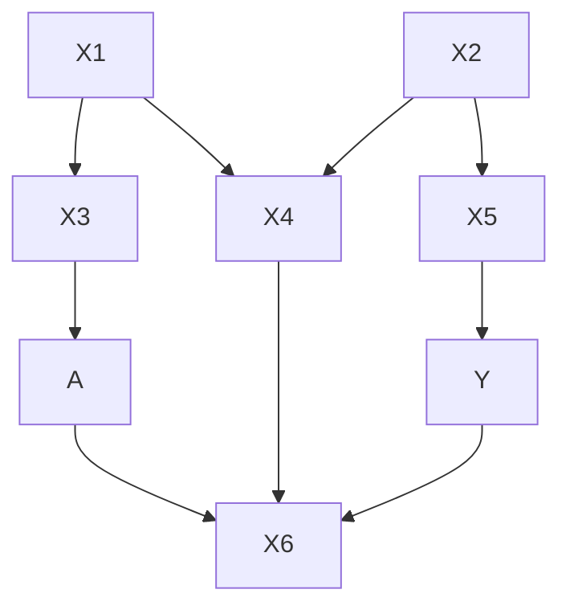
</details>

As an illustration, consider Fig. 10.1, based on one used by Pearl to illustrate the use of directed acyclic graphs for identification in causal analysis (a version of the figure appears as Figure 2 in Pearl 1995 and also as Figure 3.4 in Pearl 2006). The figure is employed to demonstrate the technique of “d-separation.” Pearl (1995: 675) claims that adjusting for either $\{X3, X4\}$ or $\{X4, X5\}$ in Fig. 10.1 will yield consistent estimates of the causal effect of A on Y, $E(Y|A)$ . This is the method of blocking all “backdoor paths”—that is, removing the effect of variables that confound the causal relationship of interest by controlling a subset of them, which, given the model, is sufficient to eliminate the confounding effect of them all. In this case, one can block the backdoor paths from A to Y by controlling for X3 and X4 because this blocks the path from A to Y via X1 and the path via X4. Controlling for X4 and X5 blocks the paths from A to Y via X4 and via X2. It is not sufficient to control only for X4 without controlling for either X3 or X5, because, in this case, X4 will act as a “collider” opening a path A-X3-X1-X4-X2-X5-Y.

But matters are problematic when we analyze the data using a nonlinear probability model. This can most easily be shown using simulated data. We first generated eight variables, X1 and X2 and $e_{3}$ to $e_{8}$ , as 1,000 random draws from standard normal distributions. We then computed the eight variables shown in Fig. 10.1, assuming a linear system of equations, as follows:

$$
\begin{array}{l} X 1 = X 1 \\ X 2 = X 2 \\ X 3 = 1 + X 1 + e 3 \\ X 4 = 0. 5 - X 1 + X 2 + e 4 \\ X 5 = 1. 5 + 1. 5 * X 2 + e 5 \\ A = 1 + X 3 + 2 * X 4 + e 7 \\ X 6 = A + e 6 \\ Y ^ {*} = 2 + 2 * X 4 + 3 * X 5 + X 6 + e 8 \\ Y = 1 \text {   if   } Y ^ {*} > \operatorname{median} (Y ^ {*}) \\ Y = 0 \text {   otherwise   } \\ \end{array}
$$

This sets up a pattern of dependencies consistent with Fig. 10.1. If we take the continuous $Y^{*}$ as the dependent variable, rather than $Y$ , then the causal effect of $A$ on $Y^{*}$ is equal to one, because it is given by the product of $A$ on $X6$ (equal to 1) multiplied by the effect of $X6$ on $Y^{*}$ , also equal to 1. An OLS regression of $Y^{*}$ on $A$ controlling for $X3$ and $X4$ yields estimates (averaged over 50 repetitions) of the causal effect of $A$ equal to 1. We get the same result when we control for $X4$ and $X5$ instead of $X3$ and

X4. But this is not so when we take Y as the dependent variable and use a probit model. $^{9}$ Controlling for X3 and X4 we estimate the effect of A to be 0.22 while controlling for X4 and X5 we estimate it as 0.71.

Probit estimates equal those from the underlying latent variable linear model divided by the scale factor. In this case, $e_{8}$ has a standard normal distribution, but the two models have different sets of control variables, and so, although their errors are normally distributed, they have different variances and thus different scale factors. So, while the parameter estimates should be interpreted as the causal effect of A on $L(Y)$ (which in this case is $\Phi^{-1}(\mathrm{pr}(Y = 1))$ where $\Phi(.)$ is the standard normal distribution function), and not of A on $Y^{*}$ , they nevertheless differ, with the model controlling for X4 and X5 returning a much larger estimate than that controlling for X3 and X4.

Part of the difficulty in this particular case comes from the fact that A does not have a direct effect on Y or $Y^{*}$ . Nevertheless, under certain circumstances, the causal effect of A on $Y^{*}$ can be recovered, even when we only observe Y, using Pearl's “front-door” method by which we compute the indirect effect of A on Y through X6. First we estimate, by OLS,

$$
E (X 6 | A) = \alpha_ {0} + \alpha_ {1} A \tag {10.15a}
$$

and then we use a probit to estimate

$$
\operatorname{pr} (Y = 1 | X 4, X 5, X 6) = \Phi (b _ {0} + b _ {4} X 4 + b _ {5} X 5 + b _ {6} X 6) \tag {10.15b}
$$

Notice that (10.15b) contains the same predictors as the equation used to generate $Y^{*}$ , and so, because $e_{8}$ is standard normal, $b_{6}$ is an unbiased estimate of the causal effect of X6 on $Y^{*}$ , namely, 1. And because $\alpha_{1}$ (also equal to 1) is an unbiased estimate of the effect of A on X6, the product $\alpha_{1} \times b_{6}$ returns the true causal effect of A on $Y^{*}$ . But this is only so when $e_{8}$ is standard normal. If the variance of $e_{8}$ were greater or smaller than 1, the estimate, $b_{6}$ , would be, respectively, less than or greater than 1. And since, in a real application, we would not know the variance of $e_{8}$ (we would not even know its distribution), we could not have any confidence that this method had yielded consistent causal estimates of the effect of A on the latent outcome.

Suppose, instead, that A had a direct effect on $Y^{*}$ or Y, could we use the backdoor approach to get causal estimates of the effect of A on Y? Imagine, in Fig. 10.1, that X6 is removed and the equation for $Y^{*}$ is

$$
Y ^ {*} = 2 + 2 * X 4 + 3 * X 5 + A + e 8 \tag {10.16}
$$

Because the relevant parts of the causal structure have remained unchanged, controlling for either $\{X3, X4\}$ or $\{X4, X5\}$ yields identical estimates of the parameter for A when we take $Y^{*}$ as the dependent variable in a linear model. But when Y is the dependent variable in a probit model, only the model that controls for X4 and X5 returns an unbiased estimate of the true causal effect of A on Y. The difference arises because the model controlling for X4 and X5 has a residual standard deviation of 1, as required, and the model controlling for X3 and X4 has a residual standard deviation of approximately 4.7, and so here the effect of A is underestimated.

Given the causal structure shown in Fig. 10.1, and assuming we observe Y and not $Y^{*}$ , it seems that nonlinear regression models cannot be guaranteed to provide unbiased estimates of the causal effect, even if the effect is known to be nonparametrically identifiable according to the d-separation criterion. We can recover the causal effect using the front-door method but only up to scale: our estimate will be equal to the true estimate divided by the (in reality unknown) standard deviation of $e_{8}$ (in the case

when $e_8$ has a normal distribution). If we care about the causal effect of $A$ on $L(Y)$ , rather than on $Y^*$ , our estimate will differ depending on whether we control for $\{X3, X4\}$ or $\{X4, X5\}$ .

But Y-standardization may resolve this issue. In this situation, using either $\{X3, X4\}$ or $\{X4, X5\}$ as control variables would return the same Y-standardized coefficient, that is, the same causal effect size, equal to the true causal effect of A on $Y^{*}$ divided by the standard deviation of $Y^{*}$ . Although the numerator and denominator of this ratio are not separately identifiable, their ratio can be interpreted as the causal effect of A on $Y^{*}$ measured in standard deviations of $Y^{*}$ .

## Propensity Scores

Under the assumption of no unmeasured confounders, propensity scores are sometimes used to recover causal effects. Let Y be an outcome or response, X the treatment of interest, and Z a set of confounders, correlated with both X and Y but prior to X in the causal graph. In this case, researchers often turn to propensity score matching in preference to controlling for Z using, say, multiple regression. There are two main reasons for this. On the one hand, matching allows one to correct for the nonoverlapping support of the different treatment groups, and, on the other, it permits one to correct for possible mis-weighting on the common support—the problem that arises from the confounders differing across the treatment groups in their distribution, even when they are on the common support (Blundell et al. 2005: 479–80; Heckman et al. 1998). There are various ways of using the propensity score for matching, including direct matching of observations, stratification, and weighting, but here we simply use the estimated propensity score as a control variable in the outcome equation in place of the control variables themselves. This is adequate because the example that follows has been constructed so that the treatment and control groups are already on the common support and have the same distribution of confounders. Given this most favorable of settings, we ask whether, using propensity scores, we can recover an estimate of the causal effect using nonlinear probability models.

Assume the following equation generating a continuous outcome, $Y^{*}$ :

$$
E (Y ^ {*}) = \beta_ {0} + \beta_ {1} X + \beta_ {\mathbf {Z}} ^ {\prime} \mathbf {Z} + \beta_ {\mathbf {W}} ^ {\prime} \mathbf {W} \tag {10.17}
$$

In (10.17), the variables in $\mathbf{Z}$ are correlated with $X$ given the variables in $\mathbf{W}$ , but $X$ and $\mathbf{W}$ are conditionally independent given $\mathbf{Z}$ . This means that although the variables in $\mathbf{W}$ affect $Y^{*}$ , they do not need to be included in the propensity score: indeed, since they have no influence on $X$ , their true parameter values would be zero and the estimated propensity score would be the same whether or not we included them. The equation to estimate the propensity score, $p(\mathbf{Z})$ , is therefore

$$
p (\mathbf {Z}) = \operatorname{pr} (X = 1) = g \left(\mathbf {a} ^ {\prime} \mathbf {Z}\right) \tag {10.18}
$$

Here $g(.)$ is usually the probit link function. We can then write

$$
E (Y ^ {*}) = \theta_ {0} + \theta_ {1} X + \theta_ {2} p (\mathbf {Z}) \tag {10.19}
$$

The vector $\beta_{\mathbf{Z}}$ in (10.17) has been replaced by the scalar $\theta_{2}$ in (10.19). If Eqs. (10.18) and (10.19) have the correct functional form, then, given that $X$ and $\mathbf{W}$ are conditionally independent, and provided that $\mathbf{Z}$ includes all necessary confounders of the relationship between $X$ and $Y^{*}$ , $\theta_{1}$ will be an unbiased estimate of the causal effect of $X$ on $Y^{*}$ , $\beta_{1}$ .

Now consider the case using a nonlinear probability model. If $Y^{*}$ were the assumed latent variable, the manifest counterpart to Eq. (10.17) would be

$$
E (Y = 1) = f \left(b _ {0} + b _ {1} X + \mathbf {b} _ {\mathbf {Z}} ^ {\prime} \mathbf {Z} + \mathbf {b} _ {\mathbf {W}} ^ {\prime} \mathbf {W}\right) \tag {10.20}
$$

Fig. 10.2 Instrumental variable setup   


<details>
<summary>flowchart</summary>

```mermaid
graph TD
    X --> V
    X --> Y
    U --> Y or Y*
    V --> X
    Y or Y* --> Y
```
</details>

where $f(.)$ is any applicable link function. It would seem that the counterpart to (10.19) should be

$$
E (Y = 1) = f (c _ {0} + c _ {1} X + c _ {2} p (\mathbf {Z})) \tag {10.21}
$$

A difficulty arises, however, because the propensity score is independent of W. In the linear case, this would not matter: W are not confounders precisely because they are conditionally independent of X, and so neither their inclusion in the propensity score nor as controls in the equation for $Y^{*}$ will affect the estimate of the effect of X. But their omission in the nonlinear case is consequential because it affects the residual variation in the model and thus the scale factor, leading to $b_{1} > c_{1}$ (because the scale factor will be smaller in the model with more predictors). Only if we supplement (10.21) by adding W as predictors will we recover a coefficient for X equal to $b_{1}$ , but adding W as additional predictors in the equation for the propensity score will make no difference because they will have no effect on the propensity score.

Even given the correct functional form for the outcome equation and the propensity score equation, controlling for the propensity score in the outcome equation will not yield unbiased estimates of the causal effect of X on $L(Y)$ for a dichotomous or ordinal Y if there are other variables that affect Y but are conditionally independent of X. They must be included as additional predictors in the outcome equation: augmenting the propensity score with them will have no effect.

This issue can again be resolved by referring to the method of Y-standardization. In this situation, adding the orthogonal W will not affect the Y-standardized coefficient, thereby overcoming the issue that arises in models (10.20) and (10.21) and permitting us to recover a common estimate of the causal effect of X on $Y^{*}$ denominated in standard deviations of $Y^{*}$ .

## Instrumental Variables

Now we turn to the situation in which we do not assume that the potential outcomes are independent of assignment to treatment, given the covariates we have measured, and we consider the use of instrumental variables. The case is illustrated by Fig. 10.2 in which U is an unmeasured confounder of the causal effect of X on the continuous $Y^{*}$ or its binary counterpart, Y, and V is an instrument that is correlated with or affects X but has no direct effect on $Y^{*}$ or Y. It is well known that, if Fig. 10.2 accurately depicts the relevant causal structure, instrumental variables (IV) will yield a consistent estimate of the causal effect of X on $Y^{*}$ . $^{10}$ The question we now address is whether it will also yield consistent estimates of the effect of X when we observe not $Y^{*}$ but the dichotomous Y.

The true model for $Y^{*}$ is

$$
Y ^ {*} = \beta_ {0} + \beta_ {1} X + \beta_ {2} U + e \tag {10.22}
$$

And the first-stage instrumental variable equation regresses X on V:

$$
X = \varphi_ {0} + \varphi_ {1} V + w \tag {10.23a}
$$

and the second-stage regresses $Y^{*}$ on V:

$$
Y ^ {*} = \alpha_ {0} + \alpha_ {1} V + k \tag {10.23b}
$$

Given that Fig. 10.2 is a correct representation of the causal structure, the IV estimator returns the true causal effect: that is,

$$
\frac {\alpha_ {1}}{\varphi_ {1}} = \beta_ {1} \tag {10.24}
$$

Under the assumption that $e$ is logistic we would write the equivalent true model for the dichotomized version of $Y^{*}$ , $Y$ , as

$$
E (Y | X, u) = \frac {\exp (b _ {0} + b _ {1} X + b _ {2} U)}{1 + \exp (b _ {0} + b _ {1} X + b _ {2} U)} \tag {10.25}
$$

And the estimable IV equation would be

$$
E (Y | V) = \frac {\exp (a _ {0} + a _ {1} V)}{1 + \exp (a _ {0} + a _ {1} V)} \tag {10.26}
$$

The first IV equation, Eq. (10.23a), would apply here as well.

If e has a logistic distribution with scale factor, $\sigma$ , the residual standard deviation of (10.22) is $\sigma \cdot \pi / \sqrt{3}$ , and so, if we were able to estimate the relevant parameters, we would find that $b_{1} = \beta_{1} / \sigma$ : that is, the estimate from the logit model would equal to the latent variable model estimate divided by the unknown scale factor. The latent variable parameter could only be recovered under the assumption that $\sigma = 1$ , even if we had observed U. But even if we do not care about recovering the estimates from the latent variable model and are interested only in $b_{1}$ , the true partial log odds ratio involving X and Y, the instrumental variable estimator, $a_{1} / \varphi_{1}$ , will not equal $b_{1}$ , and so (10.24) has no counterpart when we are concerned with the causal effect of X on $L(Y)$ . The reason for this is that $a_{1}$ is an estimate of $\alpha_{1}$ divided by the scale factor from (10.23a)—call it $\zeta$ —which will not equal $\sigma$ , the scale factor from (10.22).

The standard deviation of k, the error term in $(10.23b)$ , is

$$
\begin{array}{l} \operatorname{sd} (k) = \left[ \beta_ {1} ^ {2} \operatorname{var} (w) + \beta_ {2} ^ {2} \operatorname{var} (u) + 2 \beta_ {1} \beta_ {2} \operatorname{cov} (w, u) + \operatorname{var} (e) \right] ^ {1 / 2} \\ = \sigma \times [ b _ {1} ^ {2} \text { var } (w) + b _ {2} ^ {2} \text { var } (u) + 2 b _ {1} b _ {2} \text { cov } (w, u) + \pi^ {2} / 3 ] ^ {1 / 2} \tag {10.27} \\ \end{array}
$$

The final part of $(10.27)$ follows from the assumption that e is logistic. The scale factor $\zeta$ is equal to $(10.27)$ divided by $\pi/\sqrt{3}$ , and this allows us to write the relationship between the logit and linear IV estimators as

$$
\frac {a _ {1}}{\varphi_ {1}} = \frac {\alpha_ {1}}{\varphi_ {1}} \frac {1}{\sigma} \left[ \frac {\pi^ {2} / 3}{b _ {1} ^ {2} \operatorname{var} (w) + b _ {2} ^ {2} \operatorname{var} (u) + 2 b _ {1} b _ {2} \operatorname{cov} (w , u) + \pi^ {2} / 3} \right] ^ {1 / 2} \tag {10.28a}
$$

The logit IV estimate is equal to the linear IV estimate multiplied by the unknown $1 / \sigma$ times the term in square brackets, which is also unknown because $u$ is unobserved.

The relationship between the logit IV estimator and $b_{1}$ is

$$
\frac {a _ {1}}{\varphi_ {1}} = b _ {1} \times \left[ \frac {\pi^ {2} / 3}{b _ {1} ^ {2} \operatorname{var} (w) + b _ {2} ^ {2} \operatorname{var} (u) + 2 b _ {1} b _ {2} \operatorname{cov} (w , u) + \pi^ {2} / 3} \right] ^ {1 / 2} \tag {10.28b}
$$

So the logit IV estimate does not return the true partial log odds ratio for the causal effect of $X$ on $L(Y)$ either, when we assume the data have been generated by model (10.22).

However, applying the method of Y-standardization can provide a solution to this issue. In this situation, we would be able to identify the average causal effect up to the scale of $Y^{*}$ :

$$
b _ {\mathrm{IV}} ^ {Y \mathrm{STD}} = \frac {a _ {1}}{\varphi_ {1} h} = \frac {\beta_ {1}}{\sigma_ {Y ^ {*}}}
$$

where $h = \sqrt{a_{1}^{2}\operatorname{var}(V) + \pi^{2}/3}$ . $b_{IV}^{Y\ STD}$ is the Y-standardized average causal effect, equal to $\beta_{1}$ , the true causal effect of X on $Y^{*}$ given in model (10.22), divided by the standard deviation of $Y^{*}$ .

## Control Functions

Nowadays control functions are a less popular method for recovering causal estimates than hitherto, but the approach we use here—Heckman's (1979) sample selection correction model—is nevertheless still widely and routinely used. The underlying idea of control function approaches is that selection into treatment on the basis of unmeasured factors will lead to a correlation between the error of the outcome equation and the error of an equation modeling selection into treatment, X, if we estimate these using observed variables. As a result, the error term of the outcome equation will have a nonzero expectation. Control functions try to control for this correlation and in so doing model the nonzero expectation of the outcome equation's error (Blundell et al. 2005: 491). In the Heckman selection model, under some assumptions about the distributions of the errors, this is accomplished by adding the estimated inverse Mills' ratio to the outcome equation.

The setup we consider here is shown in Fig. 10.3. U is a normally distributed unobserved variable that affects both X and $Y^{*}$ or Y, and Z1 through Z3 are all observed: Z1 affects X and $Y^{*}$ or Y while Z2 affects only X and Z3 only $Y^{*}$ or Y. The true model for $Y^{*}$ is assumed to be $^{11}$

$$
Y ^ {*} = \beta_ {0} + \beta_ {1} X + \beta_ {2} Z _ {1} + \beta_ {3} Z _ {3} + \beta_ {4} U + w \tag {10.29a}
$$

with w a normally distributed error. The model for the binary treatment X is derived from an assumed underlying continuous latent variable, $X^{*}$ , which might be interpreted as the likelihood or propensity to receive treatment:

$$
X ^ {*} = \varphi_ {0} + \varphi_ {1} Z _ {1} + \varphi_ {2} Z _ {2} + \varphi_ {3} U + k \tag {10.29b}
$$

Fig. 10.3 Control function setup. Double-headed dashed arrows denote correlations   


<details>
<summary>flowchart</summary>

```mermaid
graph TD
    X --> Z1
    X --> Z2
    X --> Z3
    Z1 -.-> Z2
    Z1 -.-> Z3
    Z2 -.-> Z3
    U --> Y* or Y
    Y* or Y --> Z1
    Y* or Y --> Z2
    Y* or Y --> Z3
```
</details>

k is a normally distributed error. Because U is unobserved there would be a correlation between the errors of $(10.29a)$ and $(10.29b)$ if they were estimated without U. The inverse Mills ratio, $\lambda$ , is derived from the probit model:

$$
E (X | Z _ {1}, Z _ {2}) = \Phi (c _ {0} + c _ {1} Z _ {1} + c _ {2} Z _ {2}) \tag {10.30}
$$

In this particular setup, $Z_{2}$ , because it affects $X$ but not $Y^{*}$ , acts as an instrumental variable or exclusion restriction to identify the model.

In the control function approach, we have the linear model

$$
Y ^ {*} = \alpha_ {0} + \alpha_ {1} X + \alpha_ {2} Z _ {1} + \alpha_ {3} Z _ {3} + \alpha_ {4} \lambda + m \tag {10.31}
$$

where m is a mean-zero error term. Given the assumptions, $\alpha_{1}$ will be a consistent estimate of the true causal effect of X on $Y^{*}$ given by $\beta_{1}$ . If we now suppose that we observe only the dichotomous Y, rather than $Y^{*}$ (under the observational scheme given by (10.2)), then we have counterparts to (10.29a) and (10.31) as follows (and assuming a probit model throughout):

$$
E (Y | X, Z _ {1}, Z _ {3}, U) = \Phi (b _ {0} + b _ {1} X + b _ {2} Z _ {1} + b _ {3} Z _ {3} + b _ {4} U) \tag {10.32a}
$$

$$
E (Y | X, Z _ {1}, Z _ {3}, \lambda) = \Phi (a _ {0} + a _ {1} X + a _ {2} Z _ {1} + a _ {3} Z _ {3} + a _ {4} \lambda) \tag {10.32b}
$$

As before, $b_{1}$ will equal $\beta_{1}$ divided by an unknown scale factor equal to the standard deviation of w. But since we do not observe U, we cannot estimate this parameter. We might therefore hope that, as in the linear case, the coefficient for X in (10.32b) will be a consistent estimator of that in (10.32a), but this is not so because of the difference in the residual standard deviations of those equations. In fact, $a_{1} = b_{1}(\text{sd}(w)) / (\text{sd}(m))$ and the ratio of standard deviations is given by

$$
\frac {\operatorname{sd} (w)}{\operatorname{sd} (m)} = \frac {\operatorname{var} (w)}{\sqrt {\operatorname{var} (w) + b _ {4} ^ {2} \operatorname{var} (U | \lambda)}}
$$

Because $\mathrm{sd}(m)>\mathrm{sd}(w)$ , the estimate from the control function approach using a nonlinear probability model for the outcome equation will always be an underestimate of the true causal effect of X on $L(Y)$ . In other words, we obtain a lower bound estimate of the average causal effect.

The average causal effect in (10.32a) can be recovered from (10.32b) by applying $Y$ -standardization to yield the average causal effect measured in standard deviation units of $Y^{*}$ . Because we used the probit in the derivation, the Y-standardized coefficient is obtained by dividing the coefficient of $X$ , $a_{1}$ , with $h = \sqrt{\operatorname{var}(\mathbf{x}'\boldsymbol{\alpha}) + 1}$ , where $\mathbf{x}'\boldsymbol{\alpha}$ is the linear predictor of the probit model in (10.32b).

## Conclusions

There are several techniques that can be used to identify the causal effect of treatment in a linear setting. In an RCT, random allocation to treatment is sufficient. In an observational study, we can control for a sufficient set of confounders of the treatment—outcome relationship through regression, weighting (as in marginal structural models: see Robins 1999; Robins et al. 2000), or propensity score matching. If there are unmeasured variables such that we cannot control for a sufficient set of confounders, we can, in principle, recover causal effects given a variable that affects allocation to treatment but is independent of potential outcomes, given treatment.

However, when we use nonlinear probability models, none of this holds. If we want to recover, using a nonlinear probability model, the causal effect of treatment on the hypothesized latent variable outcome, $Y^{*}$ , the best we can do is to identify the effect up to scale. This is a well-known limitation of nonlinear probability models (see, e.g., Mare (2006) or Xie (2011) for recent discussions of its consequences for the study of educational inequality). If we want to recover the causal effect of treatment on, for example, the log odds ratio of the binary Y (or, more generally, its effect on the linear predictor or index function, $L(Y)$ ), the assumptions we must make are much more restrictive than in the linear case, and, in general, the effect we can recover is less informative about the average causal effect than it would be in the linear case.

Consider the simple case in which the outcome is a linear function of binary treatment, X, and measured confounders Z and U, with X independent of U given Z. If the outcome were continuous, (10.10b) would imply (10.11), and, because, in this case, $E(Y_{iX}|Z) = E(Y_{iX}|Z, U)$ , we could write

$$
E (Y _ {i} | Z _ {i}, X _ {i} = 1) - E (Y _ {i} | Z _ {i}, X _ {i} = 0) = E [ Y _ {i, X = 1} - Y _ {i, X = 0} | Z _ {i}, U _ {i} ]
$$

But this is not so when the outcome is the linear predictor of the nonlinear probability model. Now we find $E(L_{iX}|Z) \neq E(L_{iX}|Z, U)$ , and so

$$
E \left(L _ {i} \mid Z _ {i}, X _ {i} = 1\right) - E \left(L _ {i} \mid Z _ {i}, X _ {i} = 0\right) \neq E \left[ L _ {i, X = 1} - L _ {i, X = 0} \mid Z _ {i}, U _ {i} \right]
$$

$U$ is not a confounder of the treatment-outcome relationship and so would not need to be included in $Z$ in (10.10b) and (10.11), but it must be included in $Z'$ in (10.12).

However, because we know, a priori, the direction of the attenuation bias—the bias caused by omitted variables orthogonal to treatment—in nonlinear probability models, in many situations, we can establish the recovered effect as a lower bound estimate of the average causal effect. Applying standard statistical tests thus allows us to assess the significance and direction of the average causal effect, though not its magnitude.

Drawing on the work by McKelvey and Zavoina (1975) and Winship and Mare (1984), we suggested using $Y$ -standardization for reporting effects when using nonlinear probability models. Doing so allows researchers to express the average causal effect as an effect size, equivalent to Cohen's $d$ , telling us how much $Y^{*}$ changes in standard deviations for a unit change in $X$ , the treatment variable of interest. This approach explicitly recognizes the inherent standardization of coefficients and uses it to express the average causal effect in a metric that is more interpretable than unstandardized logit or probit coefficients.

Nevertheless, the metric of Y-standardized effects—the standard deviation of $Y^{*}$ —remains unknown. An appealing alternative is causal effects measured on the probability scale, and these can be obtained through the use of average partial effects (Wooldridge 2002) or, more simply, by making Y, which is an observed quantity, a linear function of the predictor variables. This gives rise to the linear probability model. If the outcome were binary, Y would be regressed directly on treatment, X, and a set of controls, Z. Assuming (10.10b) held, the parameter for X would be an unbiased estimate of the

causal effect of $X$ , telling us how much the probability of $Y = 1$ was expected to change for a unit change in $X$ . This approach is widely used by economists (see, e.g., Angrist and Pischke 2008), and it is also straightforward to construct linear probability models for ordinal and polytomous outcomes.

In this chapter, we have outlined the additional challenges and obstacles that nonlinear probability models pose for researchers who seek to identify causal effects using the potential outcomes or counterfactual approach. We have explained, and illustrated, how these difficulties are manifested in experimental and observational studies and in the commonly used techniques for deriving causal effect estimates in nonexperimental settings. Y-standardization is a means by which the parameter estimates of nonlinear probability models may be given a sound causal interpretation, albeit on a scale which itself is unknown. Effects on the probability scale can be derived from nonlinear probability models using average partial effects, but, in this case, it seems more straightforward to use the linear probability model.

## References

Achen, C. H. (1977). Measuring representation: Perils of the correlation coefficient. American Journal of Political Science, 21, 805–821.   
Allison, P. D. (1999). Comparing logit and probit coefficients across groups. Sociological Methods & Research, 28, 186–208.   
Amemiya, T. (1975). Qualitative response models. Annals of Economic and Social Measurement, 4, 363–388.   
Angrist, J. D., & Pischke, J.-S. (2008). Mostly harmless econometrics: An empiricist's companion. Princeton: Princeton University Press.   
Blalock, H. M. (1967a). Path coefficients versus regression coefficients. The American Journal of Sociology, 72, 675–676.   
Blalock, H. M. (1967b). Causal inference, closed populations, and measures of association. American Political Science Review, 61, 130–136.   
Blundell, R., Dearden, L., & Sianesi, B. (2005). Evaluating the effect of education on earnings: Models, methods and results from the National Child Development Survey. Journal of the Royal Statistical Society, Series A, 168, 473–512.   
Breen, R., Karlson, K. B., & Holm, A. (2012). Correlations and non-linear probability models. Unpublished paper.   
Cameron, S. V., & Heckman, J. J. (1998). Life cycle schooling and dynamic selection bias: Models and evidence for five cohorts of American males. Journal of Political Economy, 106, 262–333.   
Cohen, J. (1969). Statistical power analysis for the behavioral sciences. New York: Academic.   
Cox, D. R. (1958). Planning of experiments. New York: Wiley.   
Cramer, J. S. (2007). Robustness of logit analysis: Unobserved heterogeneity and mis-specified disturbances. Oxford Bulletin of Economics and Statistics, 69, 545–555.   
Fienberg, S. E. (1977). The analysis of cross-classified categorical data. Cambridge, MA: MIT Press.   
Fisher, R. A. (1932). Statistical methods for research workers. Edinburgh: Oliver and Boyd.   
Gail, M. H. (1986). Adjusting for covariates that have the same distribution in exposed and unexposed cohorts. In S. H. Moolgavkar & R. L. Prentice (Eds.), Modern statistical methods in chronic disease epidemiology (pp. 3–18). New York: Wiley.   
Gail, M. H., Wieand, S., & Piantdosi, S. (1984). Biased estimates of treatment effect in randomized experiments with nonlinear regressions and omitted covariates. Biometrika, 71, 431–444.   
Gangl, M. (2010). Causal inference in sociological research. Annual Review of Sociology, 36, 21–48.   
Hauck, W. W., Neuhaus, J. M., Kalbfleisch, J. D., & Anderson, S. (1991). A consequence of omitted covariates when estimating odds ratios. Journal of Clinical Epidemiology, 44, 77–81.   
Heckman, J. J. (1979). Sample selection bias as specification error. Econometrica, 47, 153–161.   
Heckman, J. J., Ichimura, H., Smith, J., & Todd, P. (1998). Characterizing selection bias using experimental data. Econometrica, 66, 1017–1098.   
Imbens, G. W., & Angrist, J. D. (1994). Identification and estimation of local average treatment effects. Econometrica, 62, 467–475.   
Imbens, G. W., & Wooldridge, J. M. (2009). Recent developments in the econometrics of program evaluation. Journal of Economic Literature, 47, 5–86.

Karlson, K. B., Holm, A., & Breen, R. (2012). Comparing regression coefficients between same sample nested models using logit and probit: A new method. Sociological Methodology, 42(1), 286–313.   
Kim, J.-O., & Mueller, C. W. (1976). Standardized and unstandardized coefficients in causal analysis: An expository note. Sociological Methods & Research, 4, 423-438.   
Mare, R. D. (2006). Response: Statistical models of educational stratification – Hauser and Andrew's models for school transitions. Sociological Methodology, 36, 27–37.   
McFadden, D. (1974). Conditional logit analysis of qualitative choice behavior. In P. Zarembka (Ed.), Frontiers in econometrics (pp. 105–142). New York: Academic.   
McKelvey, R. D., & Zavoina, W. (1975). A statistical model for the analysis of ordinal level dependent variables. Journal of Mathematical Sociology, 4, 103-120.   
Mood, C. (2010). Logistic regression: Why we cannot do what we think we can do, and what we can do about it. European Sociological Review, 26, 67–82.   
Morgan, S. L., & Winship, C. (2007). Counterfactuals and causal inference: Methods and principles for social research. New York: Cambridge University Press.   
Olsen, R. J. (1982). Independence from irrelevant alternatives and attrition bias: Their relation to one another in the evaluation of experimental programs. Southern Economic Journal, 49, 521–535.   
Pearl, J. (1995). Causal diagrams for empirical research. Biometrika, 82, 669–710.   
Pearl, J. (2006). Causality: Models, reasoning and inference. Cambridge: Cambridge University Press.   
Robins, J. M. (1999). Association, causation, and marginal structural models. Synthese, 121, 151–179.   
Robins, J. M., Hernán, M. A., & Brumback, B. (2000). Marginal structural models and causal inference in epidemiology. Epidemiology, 11, 550–560.   
Robinson, L. D., & Jewell, N. P. (1991). Some surprising results about covariate adjustment in logistic regression models. International Statistical Review, 58, 227-240.   
Swait, J., & Louviere, J. (1993). The role of the scale parameter in the estimation and comparison of multinomial logit models. Journal of Marketing Research, 30, 305–314.   
Train, K. (2009). Discrete choice methods with simulation. Cambridge: Cambridge University Press.   
Vytlacil, E. (2002). Independence, monotonicity, and latent index models: An equivalence result. Econometrica, 70, 331–441.   
Winship, C., & Mare, R. D. (1984). Regression models with ordinal variables. American Sociological Review, 49, 512-525.   
Wooldridge, J. M. (2002). Econometric analysis of cross section and panel data. Cambridge, MA: MIT Press.   
Xie, Y. (2011). Values and limitations of statistical models. Research in Social Stratification and Mobility, 29, 343–349.   
Yatchew, A., & Griliches, Z. (1985). Specification error in probit models. The Review of Economics and Statistics, 67, 134–139.

# Chapter 11 Causal Effect Heterogeneity

Jennie E. Brand and Juli Simon Thomas

Abstract Individuals differ not only in background characteristics, often called “pretreatment heterogeneity,” but also in how they respond to a particular treatment, event, or intervention. A principal interaction of interest for questions of selection into treatment and causal inference in the social sciences is between the treatment and the propensity of treatment. Although the importance of “treatment-effect heterogeneity,” so defined, has been widely recognized in the causal inference literature, empirical quantitative social science research has not fully absorbed these lessons. In this chapter, we describe key estimation strategies for the study of heterogeneous treatment effects; we discuss recent research that attends to causal effect heterogeneity, with a focus on the study of effects of education, and what we gain from such attention; and we demonstrate the methods with an example of the effects of college on civic participation. The primary goal of this chapter is to encourage researchers to routinely examine treatment-effect heterogeneity with the same rigor they devote to pretreatment heterogeneity.

## Introduction

As attention to questions of causality increasingly occupies social science research, so too has attention to underlying heterogeneity across individuals or other units of analysis. Individuals differ not only in background characteristics, often called “pretreatment heterogeneity,” but also in how

This research made use of facilities and resources at the California Center for Population Research, UCLA, which receives core support from the National Institute of Child Health and Human Development, Grant R24HD041022. Simon Thomas was supported by a UCLA Graduate Summer Research Mentorship program, the Institute for Research on Labor and Employment, and a pre-doctoral advanced quantitative methodology training grant (R305B080016) awarded to UCLA by the Institute of Education Sciences of the U.S. Department of Education. This research was conducted with restricted access to the Bureau of Labor Statistics (BLS) data. The views expressed here do not necessarily reflect the views of the BLS. We thank Yu Xie and Ben Jann for their contributions to related work, and Stephen Morgan and Judea Pearl for comments and suggestions. The ideas expressed herein are those of the authors.

J.E. Brand (✉)

Department of Sociology and California Center for Population Research, University of California – Los Angeles, 264 Haines Hall, Los Angeles, CA 90095-1551, USA

e-mail: brand@soc.ucla.edu

J. Simon Thomas

Department of Sociology, University of California – Los Angeles, Los Angeles, CA, USA

they respond to a particular treatment, event, or intervention (Angirist and Krueger 1999; Elwert and Winship 2010; Gangl 2010; Holland 1986; Heckman and Robb 1985; Heckman et al. 2006; Moffitt 2008; Morgan and Winship 2007, 2012; Winship and Morgan 1999; Xie 2011; Xie et al. 2012). Causal effects should vary across members of a society; it is implausible to assume that different members of a population respond identically to the same treatment condition. Our task is to uncover differential treatment response resulting from population heterogeneity.

A simple approach to studying variation in causal effects is to examine interactions between the cause (i.e., the treatment of interest) and specific covariates, such as gender or race. For example, we may want to estimate the effect of college on wages and believe that college effects differ for blacks and whites. Examining effect variation via interaction terms is a straightforward practice in quantitative social science research, although such interactions are perhaps not incorporated as routinely as we might expect (Elwert and Winship 2010; Morgan and Winship 2007, 2012; Xie 2011). However, for causal inference and the assessment of selection bias in the social sciences, the subject of this volume, a principal interaction is between the treatment of interest and the propensity of treatment (Heckman et al. 2006; Xie 2011).

In this chapter, we are concerned with the estimation of the interaction between the treatment and the propensity of treatment using observational data. We refer to this—distinguishing it from general covariate and treatment interaction—as “treatment-effect heterogeneity.” Although the importance of treatment-effect heterogeneity, so defined, has also been widely recognized in the causal inference literature (Morgan and Winship 2007), empirical quantitative social science research has not fully absorbed these lessons. Yet, the study of effect heterogeneity should figure prominently in social science research. If there is treatment-effect heterogeneity, average treatment effects can vary widely depending on the population composition of the treated, and thus, despite common beliefs, simple averages do not have a straightforward interpretation (Angrist 1998; Elwert and Winship 2010; Morgan and Todd 2008; Morgan and Winship 2007, 2012; Xie 2011).

In addition to attending to matters of selection, effect heterogeneity analyses can yield important insights as to the distribution of scarce social resources in an unequal society and to social policies (Brand 2010; Brand and Davis 2011; Brand and Xie 2010). We can answer such questions as who is most likely to receive a desired social good and whether they are the optimal beneficiaries under given circumstances. Many policies, such as increasing or decreasing college tuition, free or subsidized immunization for children, subsidized housing, food stamps, Head Start, and increasing or decreasing enrollments at selective colleges, are issued without regard to group characteristics. In these and many other cases, different marginal persons are “recruited” into treatment as policies, and thus, eligibility thresholds are introduced or revised (Xie 2011). If policymakers understand patterns of treatment-effect heterogeneity, they can more effectively assign treatments to individuals so as to balance competing objectives, including reducing cost and maximizing average outcomes for a given population.

The primary goal of this chapter is to encourage researchers to routinely examine treatment-effect heterogeneity. The chapter has four main sections. The first section describes key estimation strategies for the study of heterogeneous treatment effects. The second section discusses recent research that attends to causal effect heterogeneity, what we gain from such attention, and how we reconcile discrepant findings across methods. We focus this discussion on research on education, as it provides a particularly well-developed example of the study of effect heterogeneity in sociology and economics. The third section offers an empirical demonstration of estimating heterogeneous effects, using the example of the effects of college on civic participation. We summarize and conclude our discussion in the fourth section.

## Methods for Estimating Heterogeneous Treatment Effects

In this section, we first review pretreatment heterogeneity. We then discuss treatment-effect heterogeneity and a range of analytic approaches for estimating heterogeneous treatment effects under different assumptions: weighted regressions and propensity score matching to recover subpopulation treatment effects; stratification-multilevel, matching-smoothing, and smoothing-differencing for estimating effects across the propensity score distribution; and instrumental variables for estimating local average and marginal treatment effects.

## Pretreatment Heterogeneity

We begin by considering a binary treatment, such as receiving a college education or losing one's job, and then partition the total population $U$ into the subpopulation of the treated $U_{1}$ (for which $d = 1$ ) and the subpopulation of the untreated $U_{0}$ (for which $d = 0$ ). Let $Y$ denote an outcome variable of interest and $y_{i}^{1}$ denote the $i$ th member's potential outcome if treated and $y_{i}^{0}$ the $i$ th member's potential outcome if untreated. We define a treatment effect as the difference in potential outcomes associated with different treatment states for the same member in $U$ :

$$
\delta_ {i} = y _ {i} ^ {1} - y _ {i} ^ {0}, \tag {11.1}
$$

where $\delta_{i}$ represents the hypothetical treatment effect for the ith member. We, however, observe only if $y_{i}^{1}$ if $d_{i}=1$ or $y_{i}^{0}$ if $d_{i}=0$ and thus can never compute individual-level treatment effects (Holland 1986). $^{1}$ However, due to population heterogeneity, there is no guarantee that the group receiving the treatment is comparable, in observed and unobserved contextual and individual characteristics, to the group not receiving the treatment. Generally, individuals select or are selected into treatment based on anticipated costs and benefits of treatment, or as a result of structural or socioeconomic circumstances (Brand and Xie 2010; Heckman 2001, 2005). For example, children from advantaged families who enroll in college-preparatory classes would be incomparable to more disadvantaged children who do not enroll in college-preparatory classes without adequate control for family socioeconomic resources and early achievement.

We can decompose the expectation for the two counterfactual outcomes as follows:

$$
E (y ^ {1}) = E (y ^ {1} | d = 1) P (d = 1) + E (y ^ {1} | d = 0) P (d = 0) \tag {11.2}
$$

and

$$
E (y ^ {0}) = E (y ^ {0} | d = 1) P (d = 1) + E (y ^ {0} | d = 0) P (d = 0). \tag {11.3}
$$

What we observe from the data are $E(y^{1}|d = 1)$ , $E(y^{0}|d = 0)$ , $P(d = 1)$ , and $P(d = 0)$ . If there is selection bias,

$$
E (y ^ {1} | d = 1) \neq E (y ^ {1} | d = 0) \neq E (y ^ {1}) \tag {11.4}
$$

and/or

$$
E (y ^ {0} | d = 1) \neq E (y ^ {0} | d = 0) \neq E (y ^ {0}). \tag {11.5}
$$

Thus, with observational data, and when selection bias is present, it is clear that the independence condition,

$$
d \coprod (y ^ {1}, y ^ {0}), \tag {11.6}
$$

does not hold because subjects are sorted into treatment or control groups for a number of reasons, some of which may be unknowable to the researcher.

To address nonrandom treatment assignment, researchers primarily use two strategies. First, they may control for relevant pretreatment covariates and assume conditional independence (also called “ignorability,” “unconfoundedness,” or “selection on observables”):

$$
d \coprod (y ^ {1}, y ^ {0}) | X, \tag {11.7}
$$

where X denotes a vector of observed covariates. The ignorability condition is held as an unverifiable assumption. Its plausibility hinges on the mechanism governing exposure or assignment to the different values of a given cause. Substantive knowledge about the subject matter needs to be considered before a researcher can entertain the ignorability assumption. Measurement of theoretically meaningful confounders makes ignorability tentatively plausible, but not necessarily true. $^{2}$ Pearl (2009) provides guidance for including covariates as appropriate controls; generally, only theoretically motivated pretreatment, non-collider covariates should be conditioned upon. Rosenbaum and Rubin (1983, 1984) show that, when the ignorability assumption holds true, it is sufficient to condition on the propensity score as a function of X. Thus, Eq. (11.7) is changed to

$$
d \coprod (y ^ {1}, y ^ {0}) | P (d = 1 | X), \tag {11.8}
$$

where $P(d = 1|X)$ is the propensity score, the probability of treatment that summarizes all the relevant information in covariates X, estimated by a probit or logit regression model. The literature on propensity score methods recognizes the utility of the propensity score as a solution to data sparseness in a finite sample (Morgan and Harding 2006).

Second, researchers can capitalize on an “instrumental” variable (or variables) (IV) to address nonrandom treatment assignment. A valid IV is an exogenous factor that causes at least some of the variation in treatment status and affects the outcome only indirectly through treatment (Angirist and Krueger 1999; Angrist et al. 1996; Angrist and Piscke 2009; Bound et al. 1995; Heckman et al. 2006; Morgan and Winship 2007). Identifying a valid IV is a difficult task; a weak IV may give rise to imprecise IV estimates and lead to biased estimates in finite samples (Bound et al. 1995).

## Treatment-Effect Heterogeneity

An important development of the causal inference literature is the recognition that treatment effects are likely to be heterogeneous (e.g., Angirist and Krueger 1999; Holland 1986; Heckman and Robb 1985; Heckman et al. 2006; Morgan and Winship 2007, 2012; Winship and Morgan 1999). For example, colleges may select persons who gain more (Willis and Rosen 1979; Carniero et al. 2011) or less (Brand and Xie 2010) than persons who do not attend college. This example underscores the kind of heterogeneity that does not merely reflect group differences at the baseline that can be “controlled for” by covariates or fixed effects. In other words, it reflects treatment effect, rather than merely pretreatment, heterogeneity.

As we note above, researchers are sometimes concerned with stratification by selected covariates, allowing the interaction of treatment and certain covariates that are believed to be of primary importance, such as gender and race. However, the interaction between the propensity score and the treatment indicator is the key interaction for questions of variation by selection into treatment (Heckman and Robb 1985; Heckman et al. 2006; Morgan and Winship 2007; Xie 2011). The recognition that treatment effects may vary by the probability of treatment has led to new methods of causal inference and to refined interpretations of effect estimates derived from existing methods (Angrist 1998; Brand and Xie 2010; Elwert and Winship 2010; Morgan and Todd 2008; Morgan and Winship 2007; Xie 2011; Xie et al. 2012). Despite widespread belief by practitioners, traditional regression estimates do not represent straightforward averages of individual-level causal effects if individual-level variation in the causal effect of interest is not random. Instead, they give a peculiar type of average—a conditional variance-weighted average of the heterogeneous individual-level effects, where population composition weights can produce widely different effect estimates (Angrist 1998; Elwert and Winship 2010; Morgan and Winship 2007; Xie 2011).

Let us define several parameters central to the causal inference literature and to assessing heterogeneity, beginning with the difference between a randomly selected set of individuals in U who were treated to another randomly selected set of individuals who were untreated, that is, the “average treatment effect” (ATE):

$$
\bar {\delta} _ {\mathrm{ATE}} = E (y ^ {1} - y ^ {0}) \tag {11.9}
$$

A general definition of causal effect heterogeneity is when

$$
\bar {\delta} _ {\mathrm{ATE}} \neq \delta_ {i}, \tag {11.10}
$$

that is, the treatment effect differs across individuals. In this case, conventional regression coefficients have equivocal interpretations. Let us define the average difference among those individuals who were actually treated, the “treatment effect of the treated” (TT):

$$
\bar {\delta} _ {T T} = E (y ^ {1} - y ^ {0} | d = 1). \tag {11.11}
$$

And let us define the average difference among those individuals who were not treated, the “treatment effect of the untreated” (TUT):

$$
\bar {\delta} _ {\mathrm{TUT}} = E (y ^ {1} - y ^ {0} | d = 0). \tag {11.12}
$$

With independence, $\bar{\delta}_{ATE} = \bar{\delta}_{TT} = \bar{\delta}_{TUT} = E(y^{1}|d = 1) - E(y^{0}|d = 0)$ . Here, we define treatment-effect heterogeneity more specifically, relative to the general definition given by (11.10), as

$$
\bar {\delta} _ {\mathrm{ATE}} \neq \bar {\delta} _ {\mathrm{TT}} \neq \bar {\delta} _ {\mathrm{TUT}}. \tag {11.13}
$$

To see how selection into treatment may cause biases in estimates of treatment effects, we use the following abbreviated notations, as described in Xie et al. (2012):

p = the proportion treated (i.e., the proportion of units d = 1),

q = the proportion untreated (i.e., the proportion of units d = 0),

$$
E \left(y _ {d = 1} ^ {1}\right) = E (y ^ {1} | d = 1),
$$

$$
E \left(y _ {d = 1} ^ {0}\right) = E (y ^ {0} | d = 1),
$$

$$
E \left(y _ {d = 0} ^ {1}\right) = E (y ^ {1} | d = 0),
$$

$$
E \left(y _ {d = 0} ^ {0}\right) = E (y ^ {0} | d = 0).
$$

Now we decompose: $\bar{\delta}_{ATE}$

$$
\begin{array}{l} \bar {\delta} _ {\mathrm{ATE}} = E (y ^ {1} - y ^ {0}) \\ = E \left(y _ {d = 1} ^ {1}\right) p + E \left(y _ {d = 0} ^ {1}\right) q - E \left(y _ {d = 1} ^ {0}\right) p - E \left(y _ {d = 0} ^ {0}\right) q \\ = E \left(y _ {d = 1} ^ {1}\right) - E \left(y _ {d = 1} ^ {1}\right) q + E \left(y _ {d = 0} ^ {1}\right) q - E \left(y _ {d = 1} ^ {0}\right) + E \left(y _ {d = 1} ^ {0}\right) q - E \left(y _ {d = 0} ^ {0}\right) q \\ = \left[ E \left(y _ {d = 1} ^ {1}\right) - E \left(y _ {d = 0} ^ {0}\right) \right] - \left[ E \left(y _ {d = 1} ^ {0}\right) - E \left(y _ {d = 0} ^ {0}\right) \right] - (\bar {\delta} _ {\mathrm{TT}} - \bar {\delta} _ {\mathrm{TUT}}) q. \tag {11.14} \\ \end{array}
$$

Noting that the simple estimator from observed data is $E\left(y_{d=1}^{1}\right) - E\left(y_{d=0}^{0}\right)$ , we see two sources of bias for $\bar{\delta}_{ATE}$ , both of which are selection biases that may threaten the validity of causal inference with observational data (see also Morgan and Winship 2007, eq. 2.12):

1. The average difference between the two groups in the absence of treatment, $E\left(y_{d=1}^{0}-y_{d=0}^{0}\right)$ , or pretreatment heterogeneity bias; and

2. The difference in the average treatment effect between the two groups, $\bar{\delta}_{TT}-\bar{\delta}_{TUT}$ , weighted by the proportion untreated q, or treatment-effect heterogeneity bias.

Therefore, when treatment effects are heterogeneous, an average treatment effect for a population is a weighted average of varying treatment effects, a quantity that depends on population composition (Xie 2011; Xie et al. 2012).

There have been a few primary approaches to estimating heterogeneous treatment effects in the literature on causal inference. A simple and straightforward approach is to assume ignorability and to find empirical patterns of treatment-effect heterogeneity as a function of observed covariates through the difference between $\bar{\delta}_{TT}$ and $\bar{\delta}_{TUT}$ by way of weighted regressions (Morgan and Todd 2008) or propensity score matching (Abadie and Imbens 2006; Brand and Halaby 2006; Morgan 2001) or by statistical modeling to explore empirical patterns of effect heterogeneity as a function of the propensity score (Brand 2010; Brand and Davis 2011; Brand et al. 2012; Brand and Simon Thomas 2012; Brand and Xie 2010; Musick et al. 2012; Tsai and Xie 2008; Xie 2011; Xie et al. 2012; Xie and Wu 2005). The plausibility of the (unverifiable) ignorability assumption depends on the richness of the empirical data. The researcher can always evaluate the assumption through sensitivity or auxiliary analyses (DiPrete and Gangl 2004; Chap. 18 by Gangl, this volume; Harding 2003; Rosenbaum 2002). Indeed, the analyses of treatment-effect heterogeneity provide a kind of sensitivity analysis themselves, indicating potential sources of departure from the ignorability assumption.

Just as the presence of effect heterogeneity changes the interpretation of traditional regression estimates, so too effect heterogeneity changes the interpretation of the IV estimator to a local average treatment effect (LATE). The LATE pertains only to units whose treatment status is induced by the

instrument (Angirist and Krueger 1999; Angrist et al. 1996; Angrist and Pischke 2009; Heckman et al. 2006; Imbens and Angrist 1994). $^{3}$ We define the LATE as

$$
\overline {{{\delta}}} _ {\text { LATE }} = E (y ^ {1} - y ^ {0} | d _ {Z = 1} > d _ {Z = 0}), \tag {11.15}
$$

where Z is an instrumental variable. The IV approach does not rely on the ignorability assumption, but it does rely on its own set of stringent assumptions, to be discussed in more detail below. A limit form of the IV estimator (i.e., with a continuous IV variable) is the marginal treatment effect (MTE), that is, the treatment effect for units at the margin of treatment assignment (Bjorklund and Moffitt 1987; Heckman et al. 2006). $^{4}$ Heckman et al. (2006) show that all conventional estimands in causal inference, such as ATE, TT, and TUT, are weighted averages of MTE over unobserved variables and X. However, IVs that could be utilized to identify MTE for the whole distribution of unobserved variables conditional on X are extremely difficult to find.

In each of these approaches, and indeed a defining feature of empirical social science research, is the ceaseless tension between the reality of effect heterogeneity and the practical assumption of effect homogeneity (Xie 2007, 2011). That is, we cannot, nor would we want to, eliminate individual-level response variability, and yet, statistical analysis of causal effects for a population science, such as sociology, demography, and economics, generally involves a group-level average and an implicit effect homogeneity assumption. Indeed, each of the methods we describe assumes effect homogeneity for some subpopulation. Different methods essentially differ on how those subpopulations are defined, whether treated or untreated individuals, strata of the propensity distribution, or individuals induced into treatment. Yet, the common element for the approaches we describe is that the subpopulations are defined according to their likelihood of selection into treatment. Now let us describe each of these approaches and their estimation methods in more detail.

## Heterogeneity Analysis via Differences Between $\bar{\delta}_{TT}$ and $\bar{\delta}_{TUT}$

Researchers may wish to decide, from observational data, whether $\bar{\delta}_{TT} - \bar{\delta}_{TUT}$ is equal or not equal to zero, given a set of observed covariates. Differences between $\bar{\delta}_{TT}$ and $\bar{\delta}_{TUT}$ indicate heterogeneity in treatment effects by selection into treatment. If the $\bar{\delta}_{TT}$ exceeds the, $\bar{\delta}_{TUT}$ the effect of treatment is greater for units more likely to select into treatment, sometimes described as “positive selection”; analogously, if the $\bar{\delta}_{TUT}$ exceeds the $\bar{\delta}_{TT}$ , the effect of treatment is greater for units less likely to select into treatment, sometimes described as “negative selection.” These different parameters can be estimated in a weighted regression, where the population weights are a function of the predicted probabilities of membership in the treatment group ( $p_{i}$ ) (Morgan and Todd 2008):

$$
\text { For   } d _ {i} = 1, w _ {i, \mathrm{TT}} = 1 \text {   and   } w _ {i, \mathrm{TUT}} = \frac {1 - \widehat {p} _ {i}}{\widehat {p} _ {i}}; \quad \text { for   } d _ {i} = 0,
$$

$$
w _ {i, \mathrm{TT}} = \frac {\widehat {p} _ {i}}{1 - \widehat {p} _ {i}} \mathrm{and} w _ {i, \mathrm{TUT}} = 1.
$$

As the goal is to represent the respective population compositions, $w_{i,TT}$ and $w_{i,TUT}$ are used like survey weights. The weight $w_{i,TT}$ makes the control group a representative sample of the treatment group while leaving the treated group unaltered, and the weight $w_{i,TUT}$ works in the opposite direction.

The parameters can also be estimated through matching procedures, where units immaterial to the estimation of the specified treatment effect are given zero weight (e.g., discarded in nearest neighbor matching) or weighted (e.g., in kernel matching) (Abadie and Imbens 2006; Morgan and Harding 2006; Rubin 1974). The multiple-match procedure is generally more efficient but results in greater bias. The motivation of matching, like with weighted regressions, is to change the observed distribution of the control cases to that of the treated cases to estimate $\bar{\delta}_{\mathrm{TT}}$ or to change the observed distribution of the treated cases to that of the control cases to estimate $\bar{\delta}_{\mathrm{TUT}}$ . Matching estimators of the treatment effects for the treated take the following general form:

$$
\overline {{\delta}} _ {\mathrm{TT}} = \frac {1}{n _ {1}} \sum_ {i} ^ {n _ {i}} \left\{y _ {i, d = 1} - \sum_ {i (j)} ^ {i, j} w _ {i (j)} y _ {i (j), d = 0} \right\}, \tag {11.16}
$$

where $n_I$ is the number of treatment cases, $i$ is the index over treatment cases, $j$ is the index over control cases, and $w_{i,j}$ represent a set of scaled weights that measure the distance between each treated and control case. The difference between propensity scores is the most commonly used metric to construct weights. While in Eq. (11.16) we focus on a matching estimator for the $\overline{\delta}_{\mathrm{TT}}$ , we could instead match control units to treated units to construct an estimate of the $\overline{\delta}_{\mathrm{TUT}}$ . These different estimators require different independence assumptions, as described in the large literature on matching (see Morgan and Harding 2006 for a review).

For both the regression and matching routines, there are few examples of systematic tests for whether differences between the respective treatment effects represent statistically significant differences. In one study, Brand and Halaby (2006) take the difference between matching estimates of the $\bar{\delta}_{TT}$ and $\bar{\delta}_{TUT}$ and calculate bootstrap standard errors (generated from 1,000 replications).

## Heterogeneity Analysis via Statistical Modeling over the Propensity Score Distribution

A few recently developed methods provide statistical tests for differences in effects (i.e., tests for the trend in estimated effects across the propensity score distribution) and an approach to assess possible nonlinearities in subpopulation effects. These methods are described in detail in Xie et al. (2012) as well as applied in studies of college effects in the United States (Brand 2010; Brand and Davis 2011; Brand et al. 2012; Brand and Xie 2010; Musick et al. 2012) and Taiwan (Tsai and Xie 2008), market processes in China (Xie and Wu 2005), and effects of maternal job displacement (Brand and Simon Thomas 2013).

The first method, the stratification-multilevel method (SM) of estimating heterogeneous treatment effects, consists of the following steps: (1) Estimate propensity scores for all units for the probability of treatment given a set of observed covariates, $P(d = 1|X)$ . (2) Construct balanced propensity score strata where there are no significant differences in the average values of covariates and the propensity score between the treatment and control groups. This practice ignores heterogeneity within a stratum. While the assumption of within-strata homogeneity is still implausible, it is more plausible than without stratification. (3) Estimate propensity score strata-specific treatment effects. (4) Evaluate a trend across the strata using variance-weighted least-squares regression of the strata-specific treatment effects on strata rank at level-2:

$$
\delta_ {s} = \delta_ {0} + \gamma S + \eta_ {s} \tag {11.17}
$$

where level-1 slopes $(\delta_j)$ are regressed on propensity score rank indexed by $S$ , $\delta_0$ represents the level-2 intercept (i.e., the predicted value of the treatment effect for the lowest propensity individuals), and $\gamma$ represents the level-2 slope (i.e., the change in the treatment effect with each one-unit change to a higher propensity score stratum).

The goal of the SM method is to look for a systematic pattern of heterogeneous treatment effects across strata. A linearity specification, typically assumed in order to preserve statistical power, tells us whether the treatment effect is either a positive or a negative function of the propensity of treatment. The SM approach offers useful and easily interpretable estimates of strata-specific treatment effects and the unit change in estimates as we move between strata to test whether there is systematic effect heterogeneity by the propensity for treatment. However, the SM approach is limited in that the researcher is forced to divide the full range of propensity scores into a limited number of strata, assume within-strata homogeneity, and use a strong functional form to detect patterns of treatment heterogeneity.

To overcome these shortcomings, Xie et al. (2012) describe two nonparametric methods. First, the matching-smoothing method of estimating heterogeneous treatment effects consists of the following steps: (1) Estimate the propensity scores for all units. (2) Match treated units to control units with a matching algorithm. (3) Plot the observed difference in a pair between a treated unit and an untreated unit against a continuous representation of the propensity score. (4) Use a nonparametric model such as local polynomial or lowess smoothing to smooth the variation in matched differences, and to obtain the pattern of treatment-effect heterogeneity as a function of the propensity score. That is, we can fit a nonparametric smoothed curve to the trend in matched differences as a function of the propensity score, and thus, unlike SM, we need not assume homogeneity within strata. Second, the smoothing-differencing method of estimating heterogeneous treatment effects is closely related to the matching-smoothing method as it also uncovers the heterogeneity pattern as a nonparametric function of the propensity score. The steps of the method are the following: (1) Estimate the propensity scores for all units. (2) For the control group and the treatment group, fit separate nonparametric regressions of the dependent variable on the propensity score, such as local polynomial smoothing. (3) Take the difference in the nonparametric regression line between the treatment and the control groups at different levels of the propensity score. The results of matching-smoothing and smoothing-differencing should be comparable, although both procedures have specific advantages: examination of (raw) observation-level differences between treated and untreated units in the matching-smoothing method and the simplicity of few modeling decisions in the smoothing-differencing method.

An increase in the treatment effect with an increase in the propensity for treatment using stratification-multilevel, matching-smoothing, or smoothing-differencing is similar to observing $\bar{\delta}_{TT} > \bar{\delta}_{TUT}$ ; likewise, a decrease in the treatment effect with an increase in the propensity for treatment is similar to observing $\bar{\delta}_{TUT} > \bar{\delta}_{TT}$ . Yet, results from the three methods (SM, MS, SD) offer additional information: We obtain subpopulation treatment effects and a test for the trend in effects using stratification-multilevel, and we may observe situations using matching-smoothing and smoothing-differencing in which there is a curvilinear pattern of effects across the distribution of the propensity score for which there is no simple analog to the regression and matching estimates of $\bar{\delta}_{TT}$ and $\bar{\delta}_{TUT}$ .

## Heterogeneity Analysis via Instrumental Variables

As we note above, the presence of effect heterogeneity changes the interpretation of the IV estimator to a local average treatment effect (LATE), and a limit form is the marginal treatment effect (MTE). Conditioning on $X$ , IV regression is estimated using two-stage least squares (2SLS). In the first step,

the instrumental variable(s) Z (and other independent variables) is used to predict the instrumented variable d. In the second stage, the predicted values of the instrumented variable $\hat{d}$ are used to predict the outcome variable. $^{5}$ Use of IVs does not require the strong ignorability assumption, but it relies on its own set of stringent assumptions (Angrist and Pischke 2009). First, we must satisfy an “independence assumption,” that is, that the instrument is as good as randomly assigned. Second, commonly called the “exclusion restriction,” the IV must affect the likelihood of treatment status, even if it does so within a small range, but affect the outcome only indirectly through the treatment (i.e., it does not affect the outcome independent of treatment selection). Third, the IV must satisfy a “monotonicity assumption” that although the instrument may have no effect on some people, all those affected are affected in the same direction.

In actual social settings, the inducement effect of an IV on treatment is usually very small. If treatment effects are homogeneous, low inducement effect of IVs on the treatment likelihood is not necessarily a major limitation, as the estimator based on the small proportion of individuals who were induced into treatment can be generalized to the whole population. $^{6}$ However, in the presence of heterogeneous treatment effects, we must limit the interpretation of the resulting estimator to this particular “local” group of units induced, or units on the “margin” of treatment, as implied by the terms “local average treatment effect” (Angrist et al. 1996; Angrist and Pischke 2009) and “marginal treatment effect” (Bjorklund and Moffitt 1987; Heckman et al. 2006). Thus, estimating heterogeneous treatment effects over the entire range of the unobserved factors via IV’s given X is far more demanding than what is available in actual settings for empirical research (Morgan and Winship 2007).

Comparisons between estimates of TT/TUT and LATE/MTE are complex. Let us describe the TT as a combination of the effect for individuals induced by the instrument (so-called compliers) and individuals who are treated regardless of the inducement (“always-takers”); likewise, the TUT is a combination of the effect for compliers and individuals untreated regardless of the inducement (“never-takers”) (Angrist and Pischke 2009). $^{7}$ Angrist and Pischke (2009) write: “Because an IV is not directly informative about effects on always-takers and never-takers, instruments do not usually capture the average causal effect on all of the treated or on all of the non-treated” (p. 160). The subpopulation induced into treatment, which cannot actually be identified, can differ on both observed and unobserved characteristics from the treated and the untreated subpopulations. As we cannot know what subpopulation of the treated corresponds to individuals induced into treatment by an instrument, comparisons between strata-specific treatment effect estimates and LATE/MTE estimates are likewise complex. Moreover, those induced into treatment can differ as the inducement changes, because different instruments will affect treatment status for different segments of the population (Angrist and Pischke 2009; Gangl 2010). Thus, with treatment-effect heterogeneity, estimates of treatment effects based on different IVs will differ (Chap. 18 by Gangl, this volume). $^{8}$

## Research on Effect Heterogeneity

Although recent research in causal inference recognizes the importance of population heterogeneity and response variation, with notable contributions to the literature from several authors of this volume (Elwert and Winship 2010; Heckman 2005; Holland 1986; Manski 1995; Morgan and Winship 2007, 2012; Winship and Morgan 1999; Xie et al. 2012), empirical substantive research has been slow to capitalize on these insights. Here we discuss the costs in assuming effect homogeneity and potential benefits in assessing effect heterogeneity using examples from research on education, a substantive area that has more quickly absorbed heterogeneity lessons from the causal literature. We choose examples that demonstrate the use of the different methods for heterogeneity analyses described above and, where applicable, describe how these different methods complement or challenge one another.

Often, a lively unresolved debate surrounds a particular treatment effect of interest, as to whether there is an effect or whether it is positive or negative. As traditional regression estimates of treatment effects have ambiguous interpretation that depend upon the population composition of the treated in the presence of effect heterogeneity, settling such debates may beg for analyses of variation in effects across the population. For example, the ongoing debate over whether there is a positive Catholic school effect, that is, whether Catholic private schools are more effective than public schools (despite fewer dollars spent per pupil), may reflect school effect heterogeneity (see Morgan 2001 for a review). Catholic schooling may be more or less beneficial to students who are more or less likely to attend them. Morgan and Todd (2008) using weighted regressions and Morgan (2001) using propensity score matching find that those students who are least likely to attend Catholic schools (in this case, more disadvantaged students) experience the largest effects ( $\bar{\delta}_{TUT} > \bar{\delta}_{TT}$ ). Understanding the effects of school environments is important to students, parents, and schools making enrollment decisions and to debates on school choice and vouchers. Disadvantaged students may have poor public school options, such that Catholic schools distribute learning opportunities more evenly and thus more effectively equalize outcomes than do public schools. Or if financially constrained parents select those children they think will be most likely to benefit, there may be greater unobserved selectivity among poor, low-propensity students.

Effects of attendance at elite colleges on career achievement provide a similar example underscoring the importance of analyses of treatment-effect heterogeneity. An early body of research largely concluded that attendance at highly selective colleges yielded an economic payoff, while several recent studies, which attended more rigorously to issues of selection, yielded mixed results (see Brand and Halaby 2006 for a review). However, effects may differ for individuals more or less likely to attend elite colleges. Indeed, Brand and Halaby (2006), using propensity score matching, find that the returns to attending an elite college are small by comparison to those that would have been achieved by otherwise comparable students who attended nonelite colleges $\left(\overline{\delta}_{\mathrm{TUT}} > \overline{\delta}_{\mathrm{TT}}\right)$ .⁹ The explanations for this pattern in effects mirror that for the Catholic school effect: An elite college education may be more beneficial for students who have socioeconomically disadvantaged backgrounds and lack social capital, or it may be that low-propensity students are the most selective. If unobserved selection is a stronger factor for low-propensity students, and the $\overline{\delta}_{TUT}$ is based on a higher proportion of such students, then endogeneity bias may be a more salient issue for the $\overline{\delta}_{TUT}$ than for the $\overline{\delta}_{TT}$ . Understanding this pattern of heterogeneity is likewise important to students, parents, and schools making enrollment decisions and to debates about equal access to selective universities.

School quality is not the only educational effect subject to response variation by selection; heterogeneity in effects may also occur for the years of schooling and credentials individuals receive. College graduates on average earn more money, hold more stable jobs with better working conditions, lead more traditional family lives, are healthier, and participate more in civic life (Hout 2012). However, each of these average relationships may conceal systematic effect heterogeneity. A recent series of papers finds larger college effects among students with lower propensities for attending and completing college on earnings (Brand and Xie 2010), on civic engagement (Brand 2010), and on reductions in marriage and fertility (Brand and Davis 2011; Musick et al. 2012). These papers all model heterogeneous effects as a function of the propensity for college attendance using the stratification-multilevel (SM) approach described above. $^{10}$

One interpretation of the results of Brand and Xie (2010) is that a college education may be particularly beneficial among groups targeted by educational expansion efforts—that is, individuals who are otherwise unlikely to attend college based on their observed characteristics. Echoing the theme from this series of papers, Hout 2012 notes: “Young people with the most abilities may learn and ultimately earn the most, but their education augments their success less than it augments less-able people’s success” (p. 14). In addition to this probable mechanism, Brand and Xie (2010) note: “…the very pattern of heterogeneous treatment effects of college education by the propensity to complete college suggests an unobserved selection mechanism at work: individuals from disadvantaged social backgrounds, for whom college is not a culturally expected outcome, overcome considerable odds to attend college and may be uniquely driven by the economic rationale” (p. 294). As we suggest earlier, analyses of effect heterogeneity facilitate sensitivity to differential sources of endogeneity. Although we cannot know how strong the observed set of characteristics is relative to the unobserved in influencing selection into treatment, we may hypothesize that we have more unobserved factors influencing selection into treatment among “against the odds” cases. As Harding and Seefeldt (Chap. 6, this volume) argue, qualitative analysis of the college selection process would enhance interpretation of estimated college effects.

Another series of papers using instrumental variables, including compulsory schooling laws, secondary and university reforms, and distance to the nearest college or university, found that IV estimates exceed those of OLS estimates (see Card 2001; Hout 2012 for reviews). Recall that such estimates can be interpreted as local average treatment effects (LATE), and LATE estimates that exceed OLS estimates suggest larger returns for individuals on the margin of school continuation than average individuals. However, an early paper by Willis and Rosen (1979) and more recent work by Heckman and colleagues reached a different conclusion (Carniero et al. 2011). While the majority of the early studies used a binary instrument, and hence only one portion of the marginal return was identified, this more recent work used multiple, multivalued instruments enabling estimates for a wider portion of the return function (Moffit 2008). Carniero et al. (2011) argue that people select into schooling on the basis of realized returns to schooling; in other words, those who perceive the largest financial benefit from college generally attend, whereas those who do not perceive high financial benefits choose not to attend. Based on these results, they argue that too many people are attending college. As we suggest above, reconciling divergent findings from these methods requires understanding as to how observable and unobservable characteristics influence selection into treatment differently for subpopulations defined by propensity strata and alternative treatment inducements (Zhou and Xie 2011).

We have focused on research from education to illustrate what we gain from attending to treatment-effect heterogeneity. However, the usefulness of such analyses is not limited to education research. It extends to a broad array of the effects of access to social resources and social programs as well as to potentially negative life events and changes in socioeconomic conditions. For example, Brand and Simon Thomas (2013) find that, among families with single mothers, the negative effects of maternal job displacement on children's educational attainment and mental health are higher when displacement is an unlikely event. As low-propensity mothers are more advantaged, the shock of a displacement event to relatively higher status families may induce larger negative intergenerational effects. Or, larger observed effects among children who have a low propensity for maternal displacement could be the result of greater unobserved selectivity.

## Empirical Demonstration

In this section, we demonstrate the methods we present above, using the example of civic returns to higher education. Civic returns to education, particularly among disadvantaged members of the population, continue to offer a central justification for public policy promoting equal access to schooling. Education is a key correlate, if not determinant, of civic participation (see Brand 2010 for a review). Some studies recognize the endogeneity problem associated with assessing the causal effect of education on civic participation, but few recognize potential effect heterogeneity. Brand (2010), an exception to this deficiency, addressed heterogeneous effects of college on civic participation by the propensity of college education using the SM approach. We extend the work of Brand (2010) by comparing a range of approaches to assess treatment-effect heterogeneity.

## Data Description

We use panel data from the National Longitudinal Survey of Youth (NLSY) 1979 to assess causal effect heterogeneity of college completion on subsequent civic participation. The NLSY is a nationally representative sample of 12,686 respondents who were 14–22 years old when they were first interviewed in 1979. These individuals were interviewed annually through 1994 and are currently interviewed on a biennial basis. We use information gathered from 1979 to 2006. We restrict the sample to respondents who were 14–17 years old at the baseline survey in 1979 (n = 5,582), who had completed at least the 12th grade by 2006 (n = 4,827), and who did not have missing data on measures of educational attainment or civic participation from the 2006 survey wave (n = 3,452). $^{11}$ We set these sample restrictions to ensure all measures we use are pre-college, particularly ability, and to compare college graduates with individuals who completed at least a high school education. The individuals we lose due to attrition and nonresponse tend to be from more disadvantaged family backgrounds and have lower levels of achievement than those individuals we retain.

Appendix A describes measures of pre-college covariates and post-college civic participation. The pre-college measures figure prominently in economic and sociological studies of educational and occupational attainment, and their measurement is straightforward; for details, see Brand (2010). The likelihood of college varies by gender, race and ethnicity, family background, academic achievement,

friends' plans, and parents' encouragement in expected directions. We use two dichotomous indicators of civic participation measured in 2006 (the only year such measures were collected in the NLSY) asking respondents if they performed any unpaid volunteer work in the past 12 months for (1) civic, community, or youth groups and (2) charitable organizations or social welfare groups. About $13\%$ of college graduates compared to $5\%$ of noncollege graduates volunteer for civic, community, or youth groups, and $9\%$ of graduates compared to $4\%$ of non-graduates volunteer for charitable organizations or social welfare groups.

## Treatment-Effect Analyses

## Homogeneous Effect Estimates

We first estimate propensity scores for each individual in the sample for the probability of college completion given a set of observed covariates using a logit regression model. Table 11.1 provides results for the logit model, which support the literature on the determinants of college education. In Table 11.2, we report average effects of college completion on our two measures of civic participation using logit regression models under an assumption of effect homogeneity. The first model represents the bivariate association; the second model controls for the estimated propensity score. $^{12}$ The bivariate models suggest college graduates are about 3.4 times more likely ( $e^{1.223}$ ; predicted probabilities are 0.12 for college graduates and 0.04 for noncollege graduates) to volunteer for civic, community, or youth groups than noncollege graduates and about 2.4 times more likely ( $e^{0.887}$ ; predicted probabilities are 0.08 for college graduates and 0.04 for noncollege graduates) to volunteer for charitable organizations or social welfare groups. Results are highly statistically significant. Controlling for the estimated propensity for college, we find that college graduates are about 2.1 times more likely to volunteer for civic, community, or youth groups than noncollege graduates and about 1.4 times more likely to volunteer for charitable organizations or social welfare groups. Propensity for college has a significant positive effect on both forms of volunteering. Point estimates are reduced in the propensity score-adjusted models, and the college effect on charitable organizations and social welfare groups no longer reaches statistical significance. $^{13}$

Regression models with homogeneity assumptions such as this one are ubiquitous in empirical social science research. However, in the presence of treatment-effect heterogeneity, average effects can vary widely depending on population composition. We next assess whether there is evidence for heterogeneity in the effects of college on civic participation.

## Differences Between $\bar{\delta}_{TT}$ and $\bar{\delta}_{TUT}$

In Table 11.3, we report estimates for $\bar{\delta}_{\mathrm{TT}}$ and $\bar{\delta}_{\mathrm{TUT}}$ using both weighted regression and propensity score nearest neighbor and kernel matching. Weighted regression estimates of the $\bar{\delta}_{\mathrm{TT}}$ suggest that college graduates are about 2 times more likely to volunteer for civic, community, or youth groups than noncollege graduates and about 1.3 times more likely to volunteer for charitable organizations or social welfare groups (although the latter effect is not statistically significant). However, estimates

Table 11.1 Logit regression model predicting college completion (N = 3,452) 

<table><tr><td>Male</td><td>-0.189†(0.100)</td></tr><tr><td>Black</td><td>-0.558***(0.137)</td></tr><tr><td>Hispanic</td><td>-0.862***(0.166)</td></tr><tr><td>Mother&#x27;s education</td><td>-0.403***(0.076)</td></tr><tr><td>(Mother&#x27;s education) $^{2}$ </td><td>0.021***(0.003)</td></tr><tr><td>Father&#x27;s education</td><td>0.077***(0.020)</td></tr><tr><td>Parents&#x27; inc. (1979 $10,000s)</td><td>0.001(0.001)</td></tr><tr><td>Intact family</td><td>0.102(0.120)</td></tr><tr><td>Number of siblings</td><td>-0.029(0.024)</td></tr><tr><td>Southern residence</td><td>0.232†(0.109)</td></tr><tr><td>Cognitive ability</td><td>1.083***(0.168)</td></tr><tr><td>Cog. ability * par. income</td><td>0.002*(0.001)</td></tr><tr><td>College-preparatory</td><td>0.584***(0.107)</td></tr><tr><td>Parents&#x27; encouragement</td><td>0.511***(0.133)</td></tr><tr><td>Friends&#x27; schooling plans</td><td>0.830***(0.111)</td></tr><tr><td>Non-missing on covariates</td><td>0.051(0.111)</td></tr><tr><td>Constant</td><td>-1.889***(0.500)</td></tr><tr><td>Wald  $\chi^{2}$ </td><td>1,278.55</td></tr><tr><td> $P > \chi^{2}$ </td><td>0.000</td></tr></table>

Notes: Numbers in parentheses are standard errors $\dagger p < .10;$ $*p < .05;$ $***p < .001$ (two-tailed tests)

Table 11.2 Regression estimates of homogeneous effects of college completion on civic participation (N = 3,452) 

<table><tr><td></td><td>Civic, community, or youth groups</td><td>Charitable orgs. or social welfare groups</td></tr><tr><td>Bivariate association</td><td>0.083***(0.009)</td><td>0.047***(0.008)</td></tr><tr><td>Propensity score-adjusted logit regression</td><td>0.727***(0.187)</td><td>0.339(0.211)</td></tr></table>

Notes: Numbers in parentheses are standard errors. Propensity scores were estimated by a logit regression model of college completion on the set of pre-college covariates as reported in Table 11.1

\*\*\*p < .001 (two-tailed tests)

Table 11.3 Regression and matching estimates of heterogeneous effects of college completion on civic participation ( $\delta_{TT}$ and $\delta_{TUT}; N = 3,452$ ) 

<table><tr><td></td><td>Civic, community, or youth groups</td><td>Charitable orgs. or social welfare groups</td></tr><tr><td>Weighted logit regression ( $\delta_{TT}$ )</td><td>0.670**(0.211)</td><td>0.284(0.240)</td></tr><tr><td>Weighted logit regression ( $\delta_{TUT}$ )</td><td>1.029***(0.204)</td><td>0.678**(0.226)</td></tr><tr><td>Kernel matching ( $\delta_{TT}$ )</td><td>0.050**(0.016)</td><td>-0.012(0.015)</td></tr><tr><td>Kernel matching ( $\delta_{TUT}$ )</td><td>0.067**(0.022)</td><td>0.027(0.018)</td></tr><tr><td>Nearest neighbor matching (k=5;  $\delta_{TT}$ )</td><td>0.051**(0.018)</td><td>-0.010(0.016)</td></tr><tr><td>Nearest neighbor matching (k=5;  $\delta_{TUT}$ )</td><td>0.066†(0.035)</td><td>0.011(0.017)</td></tr></table>

Notes: Numbers in parentheses are standard errors. Regression estimates are adjusted for propensity scores, and matching estimates are matched on propensity scores. Propensity scores were estimated by a logit regression model of college completion on the set of pre-college covariates as reported in Table 11.1. Standard errors for matching estimates of the $\delta_{TT}$ are bootstrapped based on 50 replications   
$\dagger p < .10; **p < .01; ***p < .001$ (two-tailed tests)

are much larger for the $\bar{\delta}_{TUT}$ : college graduates are about 2.8 times more likely to volunteer for civic groups than noncollege graduates and about 2 times more likely to volunteer for charitable organizations (where both effects are statistically significant).

Matching estimates of the $\delta_{TT}$ and $\delta_{TUT}$ , both kernel and nearest neighbor are similar in that they too suggest larger college effects on civic volunteering among individuals who went to college but have the characteristics of those who did not. Matching estimates are based on simple differences between predicted probabilities of volunteering between college and noncollege graduates; we roughly transform these to odds ratios to compare to our weighted logit regression estimates. For the $\bar{\delta}_{TT}$ , college graduates are about 1.8 times more likely to volunteer for civic, community, or youth groups than noncollege graduates and about 0.9 times as likely to volunteer for charitable organizations or social welfare groups (the latter effect is not significant). Effects for the $\bar{\delta}_{TUT}$ once again exceed those for the $\bar{\delta}_{TT}$ : College graduates are about 2.8 times more likely to volunteer for civic groups than noncollege graduates and about 1.5 times more likely to volunteer for charitable organizations (where for the matching estimates, in contrast to the weighted regressions, the latter effect is not significant).

## Statistical Modeling over the Propensity Score Distribution

Differences between the estimates of $\bar{\delta}_{TT}$ and $\bar{\delta}_{TUT}$ suggest subpopulation effect variation by selection into treatment. We next ask whether effects systematically differ across the propensity score distribution. For the stratification-multilevel model (SM), we first generate propensity score strata such that within each interval of the propensity score, the average score and the means of each covariate do not significantly differ between college and noncollege graduates (Becker and Ichino 2002). Appendix B provides useful descriptive statistics we obtain after constructing such strata,

Table 11.4
Heterogeneous effects of college completion on civic participation (N = 3,452) 

<table><tr><td></td><td>Civic, community,youth groups</td><td>Charitable orgs.or social welfare groups</td></tr><tr><td colspan="3">Level-1 logit regressions</td></tr><tr><td>P-Score stratum 1: [.0–.1)</td><td>2.031***</td><td>1.124†</td></tr><tr><td>n = 1,486</td><td>(.445)</td><td>(.563)</td></tr><tr><td>P-Score stratum 2: [.1–.2)</td><td>.473</td><td>-.086</td></tr><tr><td>n = 553</td><td>(.481)</td><td>(.637)</td></tr><tr><td>P-Score stratum 3: [.2–.3)</td><td>.844*</td><td>.689</td></tr><tr><td>n = 345</td><td>(.410)</td><td>(.463)</td></tr><tr><td>P-Score stratum 4: [.3–.4)</td><td>.755†</td><td>.374</td></tr><tr><td>n = 234</td><td>(.434)</td><td>(.573)</td></tr><tr><td>P-Score stratum 5: [.4–.6)</td><td>.098</td><td>.734†</td></tr><tr><td>n = 343</td><td>(.352)</td><td>(.410)</td></tr><tr><td>P-Score stratum 6: [.6–.8)</td><td>.673</td><td>-.301</td></tr><tr><td>n = 290</td><td>(.515)</td><td>(.402)</td></tr><tr><td>P-Score stratum 7: [.8–1.0)</td><td>-.020</td><td>-.509</td></tr><tr><td>n = 201</td><td>(.584)</td><td>(.677)</td></tr><tr><td>Level-2 variance weighted</td><td>-.259**</td><td>-.196†</td></tr><tr><td>Least-squares regressions</td><td>(.092)</td><td>(.104)</td></tr></table>

Notes: Numbers in parentheses are standard errors. Propensity scores were estimated by a logit regression model of college completion on the set of pre-college covariates as reported in Table 11.1. Propensity score strata were balanced such that mean values of covariates and the propensity score did not significantly differ between college and noncollege graduates $\dagger p < .10$ ; $^{*}p < .05$ ; $^{**}p < .01$ ; $^{***}p < .001$ (two-tailed tests)

characteristics of typical individuals within each propensity score stratum. Individuals with parents who were high school dropouts, have four siblings, have low ability, were enrolled in a noncollege-prep track, and who had friends who had not planned to go to college are characteristic of stratum 1. By contrast, individuals with parents who went to college, have two siblings, have high ability, were enrolled in a college-prep track, and who had parents who encouraged college and friends who planned to complete college are characteristic of stratum 7. $^{14}$ These are nevertheless averages, albeit more informative than global averages; we note that not all covariates are positively correlated with one another within propensity score strata.

In Table 11.4, we report estimated effects for logit regressions of college on civic participation by propensity score strata (level-1) and the estimated trend in these effects using variance-weighted least-squares regression (level-2). The level-2 slopes for both indicators of volunteering reveal significant declines in the effect of college completion as the propensity for college increases. For civic,

$$
B _ {k, j} = \frac {| \bar {X} _ {k , j , D = 1} - \bar {X} _ {k , j , D = 0} |}{\sqrt {\frac {S _ {k , j , D = 1} ^ {2} + S _ {k , j , D = 0} ^ {2}}{2}}}
$$

where $\bar{X}$ is the sample mean and $S^2$ is the sample variance of the $k$ th covariate in the $j$ th stratum for the treated and control groups as indexed by $D = (1,0)$ . The standardized difference is larger in some strata than in others for selected covariates.


<details>
<summary>scatter</summary>

| Propensity Score Strata | Civic, Community | Charitable, Social Welfare |
| ----------------------- | ---------------- | -------------------------- |
| 0.1                     | 0.12             | 0.04                       |
| 0.1                     | 0.03             | -0.01                      |
| 0.2                     | 0.07             | 0.05                       |
| 0.3                     | 0.07             | 0.02                       |
| 0.4                     | 0.01             | 0.05                       |
| 0.6                     | 0.05             | -0.03                      |
| 0.8                     | 0.00             | -0.05                      |
</details>

Fig. 11.1 College effects on volunteering (SM-HTE)

community, and youth groups, the level-2 slope indicates a significant 0.26 reduction in the college effect for each unit change in propensity score rank. That is, level-1 estimates range from college graduates being 7.6 times more likely to volunteer for civic groups than noncollege graduates in stratum 1 to equally likely to volunteer in stratum 7. Similarly for charitable organizations and social welfare groups, the level-2 slope indicates a statistically significant 0.20 reduction in the college effect for each unit change in propensity score rank. Estimates range from college graduates being 3.1 times more likely to volunteer than noncollege graduates in stratum 1 and 0.6 as likely to volunteer in stratum 7. Levels of volunteering by propensity score strata and college completion, reported in Appendix B, provide further evidence as to the pattern in effects. While levels of volunteering by propensity for college are equalized among college graduates, there is a socioeconomic gradient in volunteering among noncollege graduates, particularly for civic, community, and youth groups, generating large observed effects of college among disadvantaged individuals who completed college.

Figure 11.1 graphically depicts the results presented in Table 11.4. “Points” in Fig. 11.1 represents estimates of level-1 slopes, and the lines in the figure are the level-2 slopes. We plot mean differences in levels of volunteering rather than logit regression coefficients for comparability to the smoothing-differencing results we present below. The figure depicts the similarity in the decline in the effect of college completion on both forms of civic participation as the propensity for college increases. This figure also suggests potential nonlinearities in effects. To investigate this possibility, we turn to the nonparametric methods. $^{15}$


<details>
<summary>line</summary>

| Propensity Score | Civic, Community | Charitable, Social Welfare |
| ---------------- | ---------------- | -------------------------- |
| 0.0              | 0.09             | 0.02                       |
| 0.2              | 0.07             | 0.03                       |
| 0.4              | 0.05             | 0.03                       |
| 0.6              | 0.04             | 0.01                       |
| 0.8              | 0.04             | -0.05                      |
| 1.0              | 0.01             | -0.10                      |
</details>

Fig. 11.2 College effects on volunteering (SD-HTE)

To estimate heterogeneous treatment effects with the matching-smoothing method, we match treated and control units by the estimated propensity scores and calculate differences between outcomes, plot the matched differences between treated and control units along a propensity score x-axis, and fit a smoothed curve. For the smoothing-differencing method, we fit two separate nonparametric regression models for the outcome variable on the propensity score, one for the treatment group and one for the control group. The results from matching-smoothing and smoothing-differencing yield similar results, and so to conserve space, we choose to present results only from smoothing-differencing. We use local polynomial regression as a smoothing device (degree 1, bandwidth 0.2). The difference between the group-specific regressions provides an estimate of the heterogeneous treatment effects.

Figure 11.2 displays the resulting curves. Figure 11.2 differs from Fig. 11.1 in that the x-axis is now a continuous representation of the propensity score rather than discrete strata. Smoothing-differencing provides a fully nonparametric depiction of treatment-effect heterogeneity, rather than the imposition of a functional form on the heterogeneity in effects. For civic groups, we find a flattening in differences at the mid- to high propensity scores and larger differences for high-propensity college goers than we expect given the linear trend reported from the stratification-multilevel method. Linearity was not a reasonable functional form for effects on charitable organizations: We have a relatively flat college effect from the low- to mid-propensity scores and then a significant drop in effects at the upper end of the propensity distribution. Thus, we uncover a potential difference in effects across the propensity for college that we overlook when examining the weighted regressions, propensity score matching, and stratification-multilevel results.

## Instrumental Variables

As we describe above, instrumental variable (IV) estimates should be interpreted as local average treatment effects (LATE) in the presence of treatment-effect heterogeneity. Following Carniero et al. (2011), we aimed to consider two IVs from the private geocode data of the NLSY, one indicating local availability of college at age 14 and one indicating local area unemployment at age 17. Because ours is an analysis of college effects on civic participation, rather than earnings as in Carniero et al. (2011), we first questioned whether the exclusion restriction holds. That is, could we reasonably assume that having a college in a community impacts civic engagement only through its effect on individual educational attainment? A more educated local populace, which we might assume given local availability of college, results in a higher level of civic engagement, which in turn could induce higher civic involvement independent of one's own educational level (Putnam 2000). We have a similar issue using local area unemployment rate as an instrument. Brand and Burgard (2008) show that job displacement has a significant negative impact on civic engagement; consequently, high levels of unemployment could impact levels of civic involvement independent of educational attainment.

However, because we measure college completion in 2006 when respondents were in their early 40s, our concerns with the exclusion restriction may be mitigated, particularly in the use of local unemployment rate at age 17. We chose to measure college in this way because we were interested in the effect of college on civic involvement, whether college was attended immediately following high school or some time later. But the disjuncture between when some individuals completed college and when they lived in a community for which the instruments were valid led to a potentially even more pressing issue than the exclusion restriction: The instruments were very weak. The $F$ -statistic was 3.04 and 1.02 for the first-stage regressions of college completion on local unemployment and on college availability, respectively. The correlations between college and each of the candidate instruments were under $|0.05|$ . As Bound et al. (1995) note, candidate instruments are quite commonly only weakly correlated with the endogenous explanatory variable (p. 443). Weak instruments exacerbate the bias due to other IV assumptions, including the exclusion restriction, as well as the independence and monotonicity assumptions.

At this point, we decided not to pursue the IV analysis. Although we regrettably do not demonstrate the comparison between IV-based and the other heterogeneity effect estimates, we nevertheless offer a general cautionary note: Although an IV is a potentially useful tool for causal analysis, finding a good one can be very difficult.

## Conclusion

In this chapter, we have described the importance of studying treatment-effect heterogeneity and methods for how to do so. We focused on the interaction between the treatment and the propensity of treatment. We do not contend that this is the only interaction of social significance; indeed, interactions between specific key covariates may be more important for particular studies. However, for questions of treatment-effect variation that relate to matters of causality and selection, the propensity score is consequential. As the propensity score proved beneficial for studies seeking to account for pretreatment heterogeneity by reducing the problem of dimensionality (Rosenbaum and Rubin 1983, 1984), it is similarly expedient for the study of treatment-effect heterogeneity.

Heterogeneity in treatment effects has important implications for understanding how scarce social resources are distributed in an unequal society, for social and behavioral research designs, and for

social policy. With a research design that attends to pretreatment heterogeneity, we assess the internal validity of our effect estimates (i.e., the degree to which we successfully uncover causal effects for the population being studied); but with a design that attends to treatment-effect heterogeneity, we also assess the external validity of our effect estimates (the predictive value of the findings in a different context) (Angrist and Pischke 2009; Smith, this volume). That is, when individuals differ in their response to treatments, treatment effects can vary widely depending on population composition, and we must tailor the interpretation of our effect estimates to specific subpopulations. If a treatment is costly and difficult to administer and, as a result, is available only to those subjects who are likely to benefit most from it, increasing the pool of subjects receiving the treatment may reduce its average effectiveness. Conversely, if highly resourceful individuals acquire a costly treatment, but not necessarily individuals most likely to benefit, increasing the availability of the treatment may increase the average effect among the treatment recipients. Policymakers who understand patterns of treatment-effect heterogeneity can more effectively assign different treatments to individuals to balance competing objectives, such as reducing cost, maximizing average outcomes, and reducing variance in outcomes in a given population.

We discussed and demonstrated a variety of methods used to study treatment effect-heterogeneity. In our example of college effects on civic participation, we found larger effects for the treatment effects for the untreated (TUT) than for the treatment effects for the treated (TT) using weighted regressions and propensity score matching. Point estimates were lower and some effects were not statistically significant using matching; this difference is to be expected, as matching estimates, which compare units to fewer controls, may achieve less bias but typically at the expense of efficiency. We then examined effects across the distribution of the propensity score using stratification-multilevel and smoothing-differencing methods. The stratification-multilevel analysis augmented our analysis of differences in TT and TUT, suggesting larger effects of college on volunteering for individuals least likely to go to college. But by generating estimated effects for seven balanced propensity strata using this approach, we exposed more finely graded estimates than our analysis of the TT and TUT, and we explored a linear trend for the variation in effects. Using the stratification-multilevel analysis, we found statistically significant heterogeneity in effects of college on volunteering, suggesting that college effects decrease as the propensity for college increases. This analysis also revealed potential nonlinearities in effects, and our smoothing-differencing analysis confirmed interesting deviations from the linear trend. Finally, we considered instrumental variables to estimate local average treatment effects, effects that correspond to a particular subpopulation for which the instrument induces a change in the treatment regime. Such analyses, in contrast to the preceding methods, do not rely on the ignorability assumption; however, valid instruments are difficult to come by, and in our demonstration, our instruments were too weak to be considered useful.

A note from Halaby (2004) bears repeating here: “… causal inference cannot be reduced to any one formula applied to data. Because causal inference from observational data is by its nature precarious, it pays to experiment with the host of basic techniques …” (p. 541). The analytic methods we described for assessing treatment-effect heterogeneity have different strengths and weaknesses and are based on different assumptions. But the methods are also essentially different ways to identify subpopulations with varying probability of selection into treatment, and as such, the analysis of the basic techniques yields further insight into effect heterogeneity. As treatment-effect heterogeneity is still too infrequently empirically assessed in quantitative social science research, we hope our exposition furthers the absorption of analytic techniques for the study of effect heterogeneity into research practice.

## Appendixes

## Appendix A

Table A.1 Descriptive statistics of pre-college covariates and civic participation (N = 3,452) 

<table><tr><td rowspan="2">Variables</td><td colspan="2">No college completion</td><td colspan="2">College completion</td></tr><tr><td>Mean</td><td>Std. dev.</td><td>Mean</td><td>Std. dev.</td></tr><tr><td colspan="5">Pre-college covariates</td></tr><tr><td>Male (0–1)</td><td>0.487</td><td>0.500</td><td>0.484</td><td>0.500</td></tr><tr><td>Black (0–1)</td><td>0.176</td><td>0.381</td><td>0.083</td><td>0.276</td></tr><tr><td>Hispanic (0–1)</td><td>0.075</td><td>0.263</td><td>0.032</td><td>0.177</td></tr><tr><td>Mother&#x27;s education (years of schooling)</td><td>11.130</td><td>2.395</td><td>13.133</td><td>2.383</td></tr><tr><td>Father&#x27;s education (years of schooling)</td><td>11.070</td><td>3.049</td><td>13.933</td><td>3.250</td></tr><tr><td>Parents&#x27; income (1979 dollars)</td><td>183.481</td><td>107.372</td><td>273.763</td><td>138.860</td></tr><tr><td>Intact family age 14 (0–1)</td><td>0.698</td><td>0.459</td><td>0.826</td><td>0.379</td></tr><tr><td>Number of siblings age 14</td><td>3.372</td><td>2.321</td><td>2.600</td><td>1.686</td></tr><tr><td>Southern residence age 14 (0–1)</td><td>0.335</td><td>0.469</td><td>0.296</td><td>0.453</td></tr><tr><td>Mental ability</td><td>-0.015</td><td>0.638</td><td>0.718</td><td>0.527</td></tr><tr><td>College-prep (0–1)</td><td>0.223</td><td>0.401</td><td>0.573</td><td>0.485</td></tr><tr><td>Parents&#x27; encouraged college (0–1)</td><td>0.650</td><td>0.465</td><td>0.882</td><td>0.320</td></tr><tr><td>Friends&#x27; plans (years of schooling)</td><td>0.428</td><td>0.492</td><td>0.803</td><td>0.397</td></tr><tr><td colspan="5">Civic participation</td></tr><tr><td>Civic, community, youth groups (0–1)</td><td>0.050</td><td>0.219</td><td>0.129</td><td>0.335</td></tr><tr><td>Charitable orgs., social welfare groups (0–1)</td><td>0.041</td><td>0.198</td><td>0.085</td><td>0.278</td></tr><tr><td>Sample size</td><td colspan="2">2,592</td><td colspan="2">860</td></tr><tr><td>Weighted sample proportion</td><td colspan="2">0.69</td><td colspan="2">0.31</td></tr></table>

Notes: Ability is measured with a scale of standardized residuals of the ASVAB. All statistics are weighted for sample selection and nonresponse

Appendix B   
Table B.1 Covariate and outcome means by propensity score strata and college completion (N = 3,452) 

<table><tr><td rowspan="3">Variables</td><td colspan="3">Stratum 1</td><td colspan="3">Stratum 2</td><td colspan="3">Stratum 3</td><td colspan="3">Stratum 4</td><td colspan="3">Stratum 5</td><td colspan="3">Stratum 6</td><td colspan="3">Stratum 7</td></tr><tr><td colspan="3">[.0-.1)</td><td colspan="3">[.1-.2)</td><td colspan="3">[.2-.3)</td><td colspan="3">[.3-.4)</td><td colspan="3">[.4-.6)</td><td colspan="3">[.6-.8)</td><td colspan="3">[.8-1.0)</td></tr><tr><td> $E(X,Y)|$  $d=0$ </td><td> $E(X,Y)|$  $d=1$ </td><td> $B$ </td><td> $E(X,Y)|$  $d=0$ </td><td> $E(X,Y)|$  $d=1$ </td><td> $B$ </td><td> $E(X,Y)|$  $d=0$ </td><td> $E(X,Y)|$  $d=1$ </td><td> $B$ </td><td> $E(X,Y)|$  $d=0$ </td><td> $E(X,Y)|$  $d=1$ </td><td> $B$ </td><td></td><td></td><td></td><td></td><td></td><td></td><td></td><td></td><td></td></tr><tr><td>Male</td><td>0.509</td><td>0.426</td><td>0.17</td><td>0.461</td><td>0.472</td><td>0.02</td><td>0.472</td><td>0.412</td><td>0.12</td><td>0.431</td><td>0.477</td><td>0.09</td><td>0.519</td><td>0.518</td><td>0.00</td><td>0.449</td><td>0.507</td><td>0.12</td><td>0.458</td><td>0.435</td><td>0.05</td></tr><tr><td>Black</td><td>0.401</td><td>0.361</td><td>0.08</td><td>0.312</td><td>0.427</td><td>0.24</td><td>0.287</td><td>0.250</td><td>0.08</td><td>0.205</td><td>0.273</td><td>0.16</td><td>0.223</td><td>0.189</td><td>0.08</td><td>0.225</td><td>0.129</td><td>0.25</td><td>0.167</td><td>0.101</td><td>0.12</td></tr><tr><td>Hispanic</td><td>0.247</td><td>0.311</td><td>0.14</td><td>0.190</td><td>0.191</td><td>0.00</td><td>0.124</td><td>0.162</td><td>0.11</td><td>0.130</td><td>0.114</td><td>0.05</td><td>0.151</td><td>0.085</td><td>0.20</td><td>0.124</td><td>0.065</td><td>0.20</td><td>0.042</td><td>0.068</td><td>0.11</td></tr><tr><td>Mother&#x27;s edu.</td><td>9.577</td><td>9.639</td><td>0.02</td><td>10.760</td><td>10.639</td><td>0.05</td><td>11.335</td><td>11.874</td><td>0.25</td><td>11.897</td><td>11.840</td><td>0.02</td><td>12.184</td><td>12.695</td><td>0.22</td><td>13.553</td><td>12.908</td><td>0.27</td><td>14.039</td><td>15.108</td><td>0.34</td></tr><tr><td>Father&#x27;s edu.</td><td>9.100</td><td>9.289</td><td>0.06</td><td>10.881</td><td>10.447</td><td>0.13</td><td>11.749</td><td>12.070</td><td>0.12</td><td>11.970</td><td>12.207</td><td>0.09</td><td>12.623</td><td>13.087</td><td>0.16</td><td>14.079</td><td>14.229</td><td>0.05</td><td>15.250</td><td>16.028</td><td>0.21</td></tr><tr><td>Parents&#x27;inc./1,000</td><td>12.474</td><td>12.893</td><td>0.05</td><td>16.184</td><td>14.503</td><td>0.16</td><td>18.177</td><td>20.179</td><td>0.21</td><td>19.645</td><td>18.716</td><td>0.09</td><td>21.147</td><td>21.743</td><td>0.06</td><td>25.522</td><td>26.334</td><td>0.07</td><td>30.128</td><td>37.998</td><td>0.47</td></tr><tr><td>Intact family</td><td>0.571</td><td>0.525</td><td>0.09</td><td>0.684</td><td>0.539</td><td>0.30</td><td>0.660</td><td>0.750</td><td>0.20</td><td>0.678</td><td>0.648</td><td>0.06</td><td>0.704</td><td>0.823</td><td>0.28</td><td>0.809</td><td>0.866</td><td>0.15</td><td>0.917</td><td>0.881</td><td>0.12</td></tr><tr><td>Num. of siblings</td><td>4.469</td><td>4.279</td><td>0.07</td><td>3.687</td><td>3.437</td><td>0.11</td><td>3.026</td><td>3.062</td><td>0.02</td><td>3.055</td><td>3.068</td><td>0.01</td><td>2.709</td><td>2.549</td><td>0.09</td><td>2.416</td><td>2.632</td><td>0.13</td><td>2.333</td><td>2.367</td><td>0.02</td></tr><tr><td>Southern res.</td><td>0.423</td><td>0.427</td><td>0.01</td><td>0.393</td><td>0.358</td><td>0.07</td><td>0.318</td><td>0.432</td><td>0.24</td><td>0.342</td><td>0.334</td><td>0.02</td><td>0.332</td><td>0.360</td><td>0.06</td><td>0.391</td><td>0.295</td><td>0.20</td><td>0.333</td><td>0.294</td><td>0.08</td></tr><tr><td>Mental ability</td><td>-0.417</td><td>-0.166</td><td>0.54</td><td>0.162</td><td>0.228</td><td>0.15</td><td>0.410</td><td>0.344</td><td>0.15</td><td>0.532</td><td>0.582</td><td>0.12</td><td>0.751</td><td>0.727</td><td>0.06</td><td>0.922</td><td>0.946</td><td>0.06</td><td>1.176</td><td>1.222</td><td>0.11</td></tr><tr><td>College-prep.</td><td>0.087</td><td>0.087</td><td>0.00</td><td>0.262</td><td>0.339</td><td>0.17</td><td>0.362</td><td>0.391</td><td>0.06</td><td>0.439</td><td>0.382</td><td>0.12</td><td>0.571</td><td>0.559</td><td>0.02</td><td>0.690</td><td>0.738</td><td>0.11</td><td>0.792</td><td>0.815</td><td>0.06</td></tr><tr><td>Parents&#x27; enc.</td><td>0.598</td><td>0.586</td><td>0.03</td><td>0.739</td><td>0.779</td><td>0.10</td><td>0.755</td><td>0.809</td><td>0.13</td><td>0.828</td><td>0.838</td><td>0.03</td><td>0.881</td><td>0.871</td><td>0.03</td><td>0.944</td><td>0.940</td><td>0.02</td><td>1.000</td><td>0.959</td><td>0.29</td></tr><tr><td>Friends&#x27; plans</td><td>0.200</td><td>0.443</td><td>0.54</td><td>0.558</td><td>0.559</td><td>0.00</td><td>0.692</td><td>0.575</td><td>0.24</td><td>0.783</td><td>0.750</td><td>0.08</td><td>0.838</td><td>0.791</td><td>0.12</td><td>0.865</td><td>0.950</td><td>0.30</td><td>0.917</td><td>0.966</td><td>0.21</td></tr><tr><td>Propensity score</td><td>0.042</td><td>0.062</td><td>0.80</td><td>0.143</td><td>0.148</td><td>0.18</td><td>0.247</td><td>0.246</td><td>0.03</td><td>0.345</td><td>0.354</td><td>0.32</td><td>0.482</td><td>0.504</td><td>0.36</td><td>0.680</td><td>0.702</td><td>0.38</td><td>0.857</td><td>0.895</td><td>0.77</td></tr><tr><td>Civic,community,youth</td><td>0.020</td><td>0.131</td><td></td><td>0.043</td><td>0.067</td><td></td><td>0.065</td><td>0.137</td><td></td><td>0.075</td><td>0.148</td><td></td><td>0.101</td><td>0.110</td><td></td><td>0.056</td><td>0.104</td><td></td><td>0.167</td><td>0.164</td><td></td></tr><tr><td>Charitable,socialwelfare</td><td>0.022</td><td>0.066</td><td></td><td>0.037</td><td>0.034</td><td></td><td>0.053</td><td>0.100</td><td></td><td>0.048</td><td>0.068</td><td></td><td>0.056</td><td>0.110</td><td></td><td>0.124</td><td>0.094</td><td></td><td>0.125</td><td>0.079</td><td></td></tr><tr><td>Sample size</td><td>1,425</td><td>61</td><td></td><td>464</td><td>89</td><td></td><td>265</td><td>80</td><td></td><td>146</td><td>88</td><td></td><td>179</td><td>164</td><td></td><td>89</td><td>201</td><td></td><td>24</td><td>177</td><td></td></tr></table>

Notes: $E(X,Y)|d = 0$ indicates the mean of $X$ or $Y$ for individuals who did not complete college and $E(X,Y)|d = 1$ indicates the mean of $X$ or $Y$ for individuals who completed college. All statistics are weighted for sample selection and nonresponse. $\pmb{B}$ is the standardized difference metric between the treated and control groups for $X$

## References

Abadie, A., & Imbens, G. W. (2006). Large sample properties of matching estimators for average treatment effects. Econometrica, 74(1), 235–267.   
Angrist, J. D. (1998). Estimating the labor market impact on voluntary military service using social security date on military applicants. Econometrica, 66, 249–288.   
Angrist, J. D. (2001). Estimation of limited dependent variable models with dummy endogenous regressors: Simple strategies for empirical practice. Journal of Business and Economic Statistics, 19, 2–16.   
Angrist, J. D., & Krueger, A. (1999). Empirical strategies in labor economics. In O. Ashenfelter & D. Card (Eds.), Handbook of labor economics (Vol. 3A, pp. 1277–1366). Amsterdam: Elsevier.   
Angrist, J. D., & Pischke, J.-S. (2009). Mostly harmless econometrics: An empiricist's companion. Princeton: Princeton University Press.   
Angrist, J. D., Imbens, G. W., & Rubin, D. B. (1996). Identification of causal effects using instrumental variables. Journal of the American Statistical Association, 91(434), 444–455.   
Becker, S., & Ichino, A. (2002). Estimation of average treatment effects based on propensity scores. The Stata Journal, 2(4), 358–377.   
Bjorklund, A., & Moffitt, R. (1987). The estimation of wage gains and welfare gains in self-selection models. The Review of Economics and Statistics, 69(1), 42–49.   
Bound, J., Jaeger, D. A., & Baker, R. M. (1995). Problems with instrumental variables estimation when the correlation between the instruments and the endogenous explanatory variable is weak. Journal of the American Statistical Association, 90(430), 443-450.   
Brand, J. E. (2010). Civic returns to higher education: A note on heterogeneous effects. Social Forces, 89(2), 417–433.   
Brand, J. E., & Burgard, S. A. (2008). Job displacement and social participation over the life course: Findings for a cohort of joiners. Social Forces, 87(1), 211–242.   
Brand, J. E., & Davis, D. (2011). The impact of college education on fertility: Evidence for heterogeneous effects. Demography, 48(3), 863–887.   
Brand, J. E., & Halaby, C. N. (2006). Regression and matching estimates of the effects of elite college attendance on educational and career achievement. Social Science Research, 35, 749–770.   
Brand, J., & Simon Thomas, J. (2013). Job displacement among single mothers: Effects on children's outcomes in young adulthood (Working Paper).   
Brand, J. E., & Xie, Y. (2010). Who benefits most from college? Evidence for negative selection in heterogeneous economic returns to higher education. American Sociological Review, 75(2), 273–302.   
Brand, J. E., Pfeffer, F., & Goldrick-Rab, S. (2012). Interpreting Community College effects in the presence of heterogeneity and complex counterfactuals (Working Paper PWP-2012-004). California Center for Population Research.   
Card, D. (2001). Estimating the return to schooling: Progress on some persistent econometric problems. Econometrica, 69, 1127–1160.   
Carniero, P., Heckman, J. J., & Vytlacil, E. (2011). Estimating marginal returns to education. American Economic Review, 101, 2754–2781.   
Dale, S., & Krueger, A. B. (2011). Estimating the return to college selectivity over the career using administrative earning data (Working Paper). Princeton University.   
DiPrete, T., & Gangl, M. (2004). Assessing bias in the estimation of causal effects: Rosenbaum bounds on matching estimators and instrumental variables estimation with imperfect instruments. Sociological Methodology, 34, 271–310.   
Elwert, F., & Winship, C. (2010). Effect heterogeneity and bias in main-effects-only regression models. In R. Dechter, H. Geffner, & J. Y. Halpern (Eds.), Heuristics, probability, and causality: A tribute to Judea Pearl (pp. 327–336). London: College Publications.   
Gangl, M. (2010). Causal inference in sociological research. Annual Review of Sociology, 36, 21–47.   
Halaby, C. N. (2004). Panel models in sociological research: Theory into practice. Annual Review of Sociology, 30, 507–544.   
Harding, D. J. (2003). Counterfactual models of neighborhood effects: The effect of neighborhood poverty on dropping out and teenage pregnancy. The American Journal of Sociology, 109(3), 676–719.   
Heckman, J. J. (1978). Dummy endogenous variables in a simultaneous equation system. Econometrica, 46(4), 931–959.   
Heckman, J. J. (2001). Micro data, heterogeneity, and the evaluation of public policy: Nobel lecture. Journal of Political Economy, 109, 673–748.   
Heckman, J. J. (2005). The scientific model of causality. In R. M. Stolzenberg (Ed.), Sociological methodology (Vol. 35, pp. 1–98). Boston: Blackwell Publishing.

Heckman, J. J., & Robb, R., Jr. (1985). Alternative methods for evaluating the impact of interventions. Journal of Econometrics, 30, 239–267.   
Heckman, J., Urzua, S., & Vytlacil, E. (2006). Understanding instrumental variables in models with essential heterogeneity. The Review of Economics and Statistics, 88, 389–432.   
Holland, P. W. (1986). Statistics and causal inference. Journal of the American Statistical Associations, 81(396), 945–960.   
Hout, M. (2012). Social and economic returns to college education in the United States. Annual Review of Sociology, 38, 379–400.   
Imbens, G. W., & Angrist, J. D. (1994). Identification and estimation of local average treatment effects. Econometrica, 62(2), 467–475.   
Manski, C. F. (1995). Identification problems in the social sciences. Boston: Harvard University Press.   
Moffitt, R. (2008). Estimating average and marginal treatment effects in heterogeneous populations (Working Paper).   
Morgan, S. (2001). Counterfactuals, causal effect heterogeneity, and the Catholic school effect on learning. Sociology of Education, 74, 341–374.   
Morgan, S., & Harding, D. (2006). Matching estimators of causal effects: Prospects and pitfalls in theory and practice. Sociological Methods and Research, 35(1), 3-60.   
Morgan, S. L., & Todd, J. J. (2008). A diagnostic routine for the detection of consequential heterogeneity of causal effects with a demonstration from school effects research. Sociological Methodology, 38, 231–281.   
Morgan, S., & Winship, C. (2007). Counterfactuals and causal inference: Methods and principles for social research. New York: Cambridge University Press.   
Morgan, S., & Winship, C. (2012). Brining context and variability back into causal analysis. In H. Kincaid (Ed.), Oxford handbook of the philosophy of the social sciences (pp. 319–354). New York: Oxford University Press.   
Musick, K., Brand, J. E., & Davis, D. (2012). Variation in the relationship between education and marriage: Marriage market mismatch? Journal of Marriage and Family, 74, 53–69.   
Pearl, J. (2009). Causality: Models, reasoning, and inference (2nd ed.). Cambridge: Cambridge University Press.   
Putnam, R. (2000). Bowling Alone: The collapse and revival of American Community. New York: Simon & Schuster.   
Quandt, R. E. (1972). A new approach to estimating switching regressions. Journal of the American Statistical Association, 67(338), 306–310.   
Robins, J. M., Hernán, M. A., & Brumback, B. (2000). Marginal structural models and causal inference in epidemiology. Epidemiology, 11, 550–560.   
Rosenbaum, P. (2002). Observational studies. New York: Springer.   
Rosenbaum, P. R., & Rubin, D. B. (1983). The central role of the propensity score in observational studies for causal effects. Biometrika, 70, 41-55.   
Rosenbaum, P. R., & Rubin, D. B. (1984). Reducing bias in observational studies using subclassification on the propensity score. Journal of the American Statistical Association, 79, 516-524.   
Rubin, D. (1974). Estimating causal effects of treatments in randomized and nonrandomized studies. Journal of Educational Psychology, 66, 685–701.   
Tsai, S.-L., & Xie, Y. (2008). Changes in earnings returns to higher education in Taiwan since the 1990s. Population Review, 47(1), 1–20.   
Willis, R. J., & Rosen, S. (1979). Education and self-selection. Journal of Political Economy, 87(5, part 2), S7–S36.   
Winship, C., & Morgan, S. L. (1999). The estimation of causal effects from observational data. Annual Review of Sociology, 25, 659–706.   
Xie, Y. (2007). Otis Dudley Duncan's legacy: The demographic approach to quantitative reasoning in social science. Research in Social Stratification and Mobility, 25, 141–156.   
Xie, Y. (2011). Population heterogeneity and causal inference (University of Michigan Population Studies Center Research Report 11–731).   
Xie, Y., & Wu, X. (2005). Market premium, social process, and statisticism. American Sociological Review, 70, 865–870.   
Xie, Y., Brand, J. E., & Jann, B. (2012). Estimating heterogeneous treatment effects with observational data. Sociological Methodology, 42(1), 314–347.   
Zhou, X., & Xie, Y. (2011). Propensity-score-based methods versus MTE-based methods in causal inference (Population Studies Center, University of Michigan Working Paper Series 11–747).

# Chapter 12 New Perspectives on Causal Mediation Analysis

Xiaolu Wang and Michael E. Sobel

Abstract Social and behavioral scientists have long used path analysis and related linear structural equation models (SEMs) to decompose parameters of ordered systems of equations into “direct effects” and “indirect effects” through mediating variables. These decompositions have been used to address substantive questions of fundamental interest, for example, how a person’s social background affects his/her earnings through education. However, in general, the “direct effects” and “indirect effects” defined in and estimated from these models should not be given causal interpretations, even in randomized experiments. To illustrate this, we first define various direct and indirect effects using potential outcomes notation and discuss situations where an investigator might want to consider these. Second, we consider identification of these effects: the required identifying assumptions are more often than not implausible for the kinds of data collected and questions considered in social and behavioral research. Third, we present other identifying assumptions that might be used to identify direct and indirect effects, and then briefly discuss different methods to estimate these effects, including regression, instrumental variables, marginal structural models, and weighting methods. Finally, we introduce an alternative approach to mediation (principal stratification), define several possible effects of interest, and briefly discuss identifying assumptions and estimation.

## Introduction

Social and behavioral scientists have long used Sewall Wright's path analysis and related linear structural equation models to decompose the total effects of causal variables into direct and indirect effects through mediating variables (on this usage, see, e.g., Duncan 1966; Sobel 1990). These decompositions have been used to address substantive questions of fundamental interest. Hauser and Featherman (1977), for example, decompose the total effect of a person's social background on his/her earnings into an indirect effect through his/her education and a net direct effect.

The basic idea of mediation is simple. Consider the path diagram in Fig. 12.1, where the variable Z is a causal/treatment variable, M is a mediator, and Y is the outcome. Of particular interest is the manner in which the effect of Z on Y comes about. If Z affects M and M in turn affects Y, then

Fig. 12.1 Three variable path diagram with mediator M   


<details>
<summary>flowchart</summary>

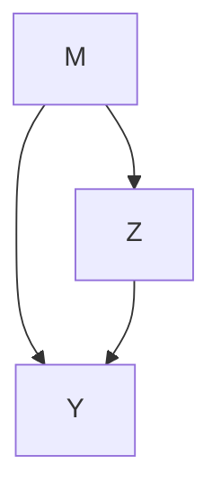
</details>

M mediates the Z-Y relationship; if Z does not affect M and/or if M does not affect Y, then M does not mediate the Z-Y relationship (see also Freese and Kevern, Chap. 3 and Knight and Winship, Chap. 14, this volume, for related discussions).

Baron and Kenny (1986) popularized the use of linear structural equation models to study this mediation problem (and moderation). Because the model they use is linear, the total Z-Y relationship can be decomposed into the “indirect effect” of Z on Y through M and the “direct effect” of Z on Y, which includes the effect through all other causal pathways from Z to Y. In many respects, the two-equation system with three variables in Baron and Kenny is a step backward compared with earlier work in psychology and sociology that featured systems with more variables and equations. Nevertheless, it is a useful template, and for the sake of simplicity, we continue to treat Z and M as scalar quantities. We also introduce a vector of covariates X (not included in Fig. 12.1) prior to Z. If the relationship among Z, M, and Y varies in different subpopulations defined by X, the elements of X are referred to as moderators in the literature on mediation (see MacKinnon 2008). The elements of X may also be confounders for the causal relationship between Z and M, Z and Y, and possibly M and Y. When needed, we specifically indicate the role of X in the context at hand.

The above approach to mediation, which is still widely used in empirical practice, is problematic, as demonstrated in section “‘Direct and Indirect Effects’ Defined in the Regular SEM”. Consider the best case scenario where Z is a treatment variable randomly assigned to subjects. Then, the average effect of Z on M can be estimated by the difference between the means of M in the treatment and control groups and similarly for the (total) average effect of Z on Y. If M were then randomly assigned (or behaved as if it were randomly assigned) within the treatment group and the control group, the average effect of M on Y could then be estimated using the regressions of Y on M and Z. But M has not been randomly assigned in either group, and in general, unless it can be assumed that there are no confounders for the M-Y relationship, the partial association between M and Y should not be given a causal interpretation.

Two approaches to mediation have been developed using ideas from a more recent statistical literature on causal inference. The first defines various types of direct and indirect effects using potential outcomes (see section “Direct and Indirect Effects: Definitions of the Causal Parameters” for details) $M(z)$ and $Y(z, m)$ and then asks what conditions must be met in order for these effects to be identified and, then, if identified, how these might be estimated (e.g., see Vanderweele 2009). The second approach is based on principal stratification (Frangakis and Rubin 2002). Here the idea is that the variable M cannot be manipulated (at least not in the context of the experiment that only manipulates Z) and thus it may not make sense to think of potential outcomes $Y(z, m)$ . As above, regression adjustments for the observed variable M are problematic because it is an outcome, but the potential outcomes $M(z)$ have the same status as pretreatment variables. Thus one might be interested in the average effect of Z on Y within strata defined by these potential outcomes. Readers familiar with the literature on complier-average causal effects (Angrist et al. 1996) will immediately recognize that compliance is a special case of principal stratification.

This chapter introduces readers to these two approaches. The aims are (1) to define the types of effects researchers might be interested in and give situations/reasons for interest in these, thereby helping researchers to more carefully consider what effects they wish to estimate, and (2) to better understand the assumptions that must be met in order to identify these effects, thereby enabling researchers to ask if they are justified in maintaining one or more sets of identifying assumptions

with their data. With this better understanding, researchers might decide to find alternative data where such assumptions might be justified and, if not, either to design studies that will allow estimation of appropriate effects or to turn their attention to other problems that might be more fruitfully addressed.

Various examples are used to illustrate the notation, definitions, and points made herein. Starting with Halaby (1979), sociologists have developed a large literature on earnings and occupational choice by sex, suggesting that much of the earnings gap between males and females is due to occupational sex segregation. Here the variable sex is the “treatment” Z; occupational choice of the respondent, more specifically, the fraction of female incumbents in the chosen occupation, may be taken as the mediator M, and the outcome Y is earnings. This is our primary example.

Before proceeding further, an important point about the nomenclature used herein is in order. The term “structural equation model” dates back at least to the psychometric and social science literature in the 1970s (e.g., see Jöreskog 1977) and, until recently at least, has been used to refer to models including latent and observed variables (often recursive and linear) that imply a particular covariance structure for the observed variables; these models are also called mean and covariance structure models. The parameters of these models were (and still are) often interpreted as effects. Beginning with Robins (1986) and Holland (1988), it came to be recognized that in order for the parameters of these models (or more generally, partial associations in a graphical model) to be endowed with a valid causal interpretation, additional conditions (ignorability conditions) must hold. Robins (1986) first set out these conditions, incorporating these into what he called the “finest randomized causally interpreted structured tree graph” (FRCISTG). More recently, some authors (e.g., Pearl 2009; Bollen and Pearl, Chap. 15, this volume) have argued for including such conditions as part of the definition of a structural equation model, and researchers who have adopted this convention now refer to a directed graphical model with the additional ignorability types of assumptions as a structural equation model (SEM). Others (Dawid 2008; Lindquist and Sobel 2011a, b) have argued against the use of this convention. In addition, the majority of psychometricians and statisticians working on mean and covariance structure models do not include these conditions as part of what they mean when referring to a structural equation model. (See also Barringer et al., Chap. 2, this volume, for a more detailed historical review.) We do not take a stance on this matter here. However, in order to minimize any potential confusion that might be created by using the term “structural equation model” in a manner that is not clear to the reader and/or inconsistent with the manner in which other authors in this volume may have used the term, we distinguish between regular structural equation models (hereafter regular SEMs) and causal structural equation models (hereafter causal SEMs), the latter being directed graphical models with ignorability assumptions (see Robins 1986 or Robins 2003). Note that causal SEMs are therefore a subset of regular SEMs. Thus, when the additional conditions needed for the application of a causal SEM are not met in a real application, the assumptions required for the use of a regular SEM may still be met; in this case, it is simply inappropriate to interpret the associations among variables in the model as indicative of causation. (Note also that the models discussed in this chapter are mainly path analytic models, a special kind of structural equation models, but the major results derived herein apply to the more general case).

Given this distinction, it is also important to point out that while the causal estimands identified in the causal SEM are not the same as the associations identified in the regular SEM, these causal estimands have the same values as the associations in the regular SEM when the ignorability conditions mentioned above (discussed in greater detail in the chapter) hold. As the causal estimands involve counterfactual quantities and cannot be estimated per se, the regular SEM is estimated, and the estimates then also estimate the causal estimands of interest (when the additional conditions needed for the validity of the causal SEM hold). In this particular instance, it is not necessary to distinguish between regular and causal SEMs and possibly confusing to do so; thus, in this case, we simply use the term “structural equation model” (SEM).

In addition to regular and causal SEMs, we also discuss causal models explicitly including potential outcomes that are analogous in functional form to SEMs. Although these causal models are not

bundled together with ignorability types of conditions, if these conditions do hold, these causal models are then equivalent to the corresponding causal SEMs. Therefore, in such a case, the parameters of these causal models can be estimated by estimating the parameters of the corresponding regular SEM.

We proceed as follows. In section “Direct and Indirect Effects: Definitions of the Causal Parameters”, we define a variety of causal effects, including various direct and indirect effects, using potential outcomes notation, and discuss situations where an investigator might want to consider these. In section “‘Direct and Indirect Effects’ Defined in the Regular SEM”, we consider the “direct effects” and “indirect effects” defined using regular SEMs, showing why these generally cannot be given causal interpretations. Section “Identification and Estimation of Controlled Effects and Pure/Total Direct and Indirect Effects” first considers ignorability assumptions for the identification of direct and indirect causal effects using SEMs. We believe these assumptions are far more often than not implausible for the kinds of data collected and questions considered in the social and behavioral research. We then present other identifying assumptions that might be used to identify direct and indirect effects and briefly discuss estimation of these effects. Section “Mediators as Moderators” introduces principal stratification and defines several possible effects of interest; identifying assumptions are also introduced there, and estimation is briefly discussed. Section “Discussion” concludes.

## Direct and Indirect Effects: Definitions of the Causal Parameters

Consider again the path diagram in Fig. 12.1. Of interest are the effect of Z on M, the direct effect of Z on Y, and the indirect effect of Z on Y through M. In general, these variables can be continuous, binary, or categorical. To keep matters simple, in this chapter, Z is treated as either discrete or continuous, and M and Y are treated as binary or continuous; this treatment can be modified to handle more general cases. Let z index the values that the random variable Z may take, and let m index the values that the random variable M takes. We assume the reader is familiar with potential outcomes notation, and we hereafter make the stable unit treatment value assumption (Rubin 1980) that for every unit i, its potential outcomes depend only on its own possible treatment values $Z_{i}$ , not on any other unit's values $Z_{i'}$ (where $i' \neq i$ ). (For our example of the effect of sex on earnings, this assumption, strictly speaking, is not satisfied, as is the case in many studies in the social sciences; although we can deal with this, for the sake of tractable exposition, we do not do so here.) The potential outcomes are thus denoted by $M_{i}(z)$ , $Y_{i}(z,m)$ , and $Y_{i}[z, M_{i}(z)]$ . $M_{i}(z)$ is the value for unit i that the mediator would take at treatment level Z = z (possibly contrary to fact). Similarly, $Y_{i}(z,m)$ is the potential outcome for unit i at treatment level Z = z and mediator level M = m. $Y_{i}[z, M_{i}(z)]$ is the potential outcome for unit i at treatment level Z = z (possibly contrary to fact) and at the mediator level $M_{i}(z)$ that i would take on the mediator at treatment level Z = z. We assume (through section “Identification and Estimation of Controlled Effects and Pure/Total Direct and Indirect Effects”) that each unit i in the population has potential outcomes $Y_{i}(z,m)$ for all possible z and m, not just the particular values $Z = z_{i}$ and $M \equiv M_{i}(z_{i})$ actually realized. The fact that not all the potential outcomes are observable has been described as the fundamental problem of causal inference.

## Causal Effects Defined at the Unit Level

For each unit (respondent or subject) $i$ , we define seven sets of effects, which, for readers' convenience, are summarized in the first column of Table 12.1. First, for all $(z, z')$ , the unit effect of $Z$ on $M$ at $z$ versus $z'$ is defined as $M_i(z) - M_i(z')$ , that is, the difference between the potential value the mediator $M$ would take if unit $i$ were at level $Z = z$ and the potential value $M$ would take

Table 12.1 Definitions of causal effects 

<table><tr><td colspan="2"></td><td>Unit level</td><td>Aggregate level</td></tr><tr><td rowspan="5">Controlled effects</td><td>Effect of Z on M</td><td> $M_i(z) - M_i(z')$ </td><td> $E\{M(z) - M(z')|\mathbf{X} = \mathbf{x}\}$ </td></tr><tr><td>Total effect of Z on Y</td><td> $Y_i[z, M(z)] - Y_i[z', M(z')]$ </td><td> $E\{Y[z, M(z)] - Y[z', M(z')]|\mathbf{X} = \mathbf{x}\}$ </td></tr><tr><td>Controlled effect of Z and M on Y</td><td> $Y_i(z, m) - Y_i(z', m')$ </td><td> $E\{Y(z, m) - Y(z', m')|\mathbf{X} = \mathbf{x}\}$ </td></tr><tr><td>Controlled direct effect</td><td> $UCDE_i^{z,z'}(m) = Y_i(z, m) - Y_i(z', m)$ </td><td> $CDE^{z,z'}(m; \mathbf{x}) = E\{Y(z, m) - Y(z', m)|\mathbf{X} = \mathbf{x}\}$ </td></tr><tr><td>Controlled effect of M on Y</td><td> $UCE_i^{m,m'}(z) = Y_i(z, m) - Y_i(z, m')$ </td><td> $CE^{m,m'}(z; \mathbf{x}) = E\{Y(z, m) - Y(z, m')|\mathbf{X} = \mathbf{x}\}$ </td></tr><tr><td rowspan="2">Direct effects</td><td>Pure (or natural) direct effect</td><td> $UPDE_i^{z,z'}[M(z')] = Y_i[z, M(z')] - Y_i[z', M(z')]$ </td><td> $PDE^{z,z'}[M(z'); \mathbf{x}] = E\{Y[z, M(z')] - Y[z', M(z')]|\mathbf{X} = \mathbf{x}\}$ </td></tr><tr><td>Total direct effect</td><td> $UTDE_i^{z,z'}[M(z)] = Y_i[z, M_i(z)] - Y_i[z', M_i(z)]$ </td><td> $TDE^{z,z'}[M(z); \mathbf{x}] = E\{Y[z, M(z)] - Y[z', M(z)]|\mathbf{X} = \mathbf{x}\}$ </td></tr><tr><td rowspan="2">Indirect effects</td><td>Pure (or natural) indirect effect</td><td> $UPIE_i^{z,z'}(z') = Y_i[z', M(z)] - Y_i[z', M(z')]$ </td><td> $PIE^{z,z'}(z'; \mathbf{x}) = E\{Y[z', M(z)] - Y[z', M(z')]|\mathbf{X} = \mathbf{x}\}$ </td></tr><tr><td>Total indirect effect</td><td> $UTIE_i^{z,z'}(z) = Y_i[z, M(z)] - Y_i[z, M(z')]$ </td><td> $TIE^{z,z'}(z; \mathbf{x}) = E\{Y[z, M(z)] - Y[z, M(z')]|\mathbf{X} = \mathbf{x}\}$ </td></tr></table>

if the same unit i were at level $Z = z'$ . In terms of our example, with Z = 1 for male, 0 for female, $M_{i}(1) - M_{i}(0)$ is the effect of sex (defined as male vs. female) for respondent i on occupational choice, specifically the difference for respondent i in occupational sex segregation/composition between the two occupations i would choose if born male ( $M_{i}(1)$ ) and female ( $M_{i}(0)$ ), respectively.

Second, for all $(z,z')$ , the unit total effect of Z on Y at z versus $z'$ is defined as $Y_{i}[z,M_{i}(z)] - Y_{i}[z',M_{i}(z')]$ , the difference between the potential value the outcome Y would take if unit i were at level Z = z and the potential value Y would take if the same unit i were at level $Z = z'$ . In our example, this is $Y_{i}[1,M_{i}(1)] - Y_{i}[0,M_{i}(0)]$ , the unit total effect of sex on earnings.

Third, for all $(z,m)$ and $(z',m')$ , the unit controlled effect of Z and M on Y is defined as $Y_{i}(z,m)-Y_{i}(z',m')$ . As a special case, the quantity $Y_{i}(z,m)-Y_{i}(z',m)$ is called the unit controlled (direct) effect of Z on Y at z versus $z'$ and at m. This effect is denoted by $\mathrm{UCDE}_{i}^{z,z'}(m)$ where the superscript “z, $z''$ ” indicates the two treatment levels being compared and the “m” in parentheses indicates the level at which the mediator is controlled. In our example, $\mathrm{UCDE}_{i}^{1,0}(m)$ is the effect of sex on earnings that would occur for respondent i if i's occupation were “controlled” at the one with sex composition m. Here the mediator value is “controlled” and only sex varies. Note that in general, $\mathrm{UCDE}_{i}^{z,z'}(m)\neq\mathrm{UCDE}_{i}^{z,z'}(m')$ . As another special case of the unit controlled effect, $Y_{i}(z,m)-Y_{i}(z,m')$ is called the unit controlled effect of M on Y at m versus $m'$ and at z, denoted by $\mathrm{UCE}_{i}^{m,m'}(z)$ where the superscript “m, $m''$ ” indicates the two mediator levels being compared and the “z” in parentheses indicates the level at which Z is controlled. Thus, in our example, $\mathrm{UCE}_{i}^{m,m'}(1)$ is the effect for respondent i, if i were male, on earnings in an occupation that is $m\times100\%$ female as opposed to $m'\times100\%$ female. Note that in general, $\mathrm{UCE}_{i}^{m,m'}(z)\neq\mathrm{UCE}_{i}^{m,m'}(z')$ .

Fourth, for all $(z,z')$ , the unit pure direct effect of Z on Y at z versus $z'$ is defined as $Y_{i}[z,M_{i}(z')] - Y_{i}[z',M_{i}(z')]$ (with $Z = z'$ as the reference treatment level for the mediator), denoted by $UPDE_{i}^{z,z'}[M(z')]$ where the superscript “z,z” indicates the two treatment levels being compared and the “ $M(z')$ ” in brackets indicates the reference mediator level. In contrast to the controlled direct effect, here each unit is compared with itself at the actual mediator level $M_{i}(z')$ the unit would take on at treatment level $z'$ , that is, the unit controlled direct effect at $M_{i}(z')$ . For our example, $UPDE_{i}^{1,0}[M(0)]$ is the effect of sex on earnings if i's occupation had sex composition $M_{i}(0)$ (the value the mediator would take if i were born female).

Fifth, the unit total direct effect of $Z$ on $Y$ at $z$ versus $z'$ is defined as $Y_{i}[z,M_{i}(z)] - Y_{i}[z',M_{i}(z)]$ (with $Z = z$ as the reference treatment level for the mediator), denoted by $\mathrm{UTDE}_i^{z,z'}[M(z)]$ . Generally, $\mathrm{UPDE}_i^{z,z'}[M(z')]$ , $\mathrm{UTDE}_i^{z,z'}[M(z)]$ , and $\mathrm{UCDE}_i^{z,z'}(m)$ are not equal to each other.

Sixth, for all $(z,z')$ , the unit pure indirect effect of Z on Y at z versus $z'$ is defined as $Y_{i}[z', M_{i}(z)] - Y_{i}[z', M_{i}(z')]$ (with $Z = z'$ as the reference treatment level for the treatment), denoted by $\mathrm{UPIE}_{i}^{z,z'}(z')$ where the “ $z''$ ” in parentheses indicates the reference treatment level. For our example, the unit pure indirect effect of sex on earnings with female as the reference treatment level, $\mathrm{UPIE}_{i}^{1,0}(0)$ , is equal to $Y_{i}[0, M_{i}(1)] - Y_{i}[0, M_{i}(0)]$ . That is, $\mathrm{UPIE}_{i}^{1,0}(0)$ is the change in earnings of unit i induced by hypothetically changing i's occupation from the one i would “naturally” choose if born male to the one i would “naturally” choose if born female while controlling i's sex as female.

Seventh, the unit total indirect effect is defined as $Y_{i}[z, M_{i}(z)] - Y_{i}[z, M_{i}(z')]$ , denoted by $\mathrm{UTIE}_i^{z,z'}(z)$ . Generally, $\mathrm{UPIE}_i^{z,z'}(z') \neq \mathrm{UTIE}_i^{z,z'}(z)$ .

It is easy to verify that the unit total effect = $\mathrm{UTDE}_{i}^{z,z'}[M(z)] + \mathrm{UPIE}_{i}^{z,z'}(z') = \mathrm{UPDE}_{i}^{z,z'}[M(z')] + \mathrm{UTIE}_{i}^{z,z'}(z)$ , but in general, the unit total effect is not equal to either $\mathrm{UTDE}_{i}^{z,z'}[M(z)] + \mathrm{UTIE}_{i}^{z,z'}(z)$ or $\mathrm{UPDE}_{i}^{z,z'}[M(z')] + \mathrm{UPIE}_{i}^{z,z'}(z')$ .

## Causal Effects Defined at the Aggregate Level

We also associate with each unit covariates $\mathbf{X}_i$ prior to $Z_{i}$ , and we define seven sets of effects at the aggregate level, each obtained by averaging the corresponding unit effects within subpopulations $\mathbf{X} = \mathbf{x}$ . These effects are summarized in the second column of Table 12.1. The first quantity is the average effect of $Z$ on $M$ at $z$ versus $z'$ in the subpopulation $\mathbf{x}$ , defined as the average of the unit effects of $Z$ on $M$ in subpopulation $\mathbf{X} = \mathbf{x}$ :

$$
E \{M (z) - M (z ^ {\prime}) \mid \mathbf {X} = \mathbf {x} \}. \tag {12.1}
$$

Hereafter, for statistical quantities defined at the aggregate level, the subscript “i” is suppressed for simplicity.

The (average) total effect of Z on Y at z versus $z'$ in subpopulation X = x is defined similarly:

$$
E \{Y [ z, M (z) ] - Y [ z ^ {\prime}, M (z ^ {\prime}) ] \mid \mathbf {X} = \mathbf {x} \}. \tag {12.2}
$$

The (average) controlled effect of $Z$ and $M$ on $Y$ at $(z, m)$ versus $(z', m')$ within subpopulation $\mathbf{X} = \mathbf{x}$ is defined as the average of the unit controlled effects of $Z$ and $M$ on $Y$ :

$$
E \{Y (z, m) - Y (z ^ {\prime}, m ^ {\prime}) \mid \mathbf {X} = \mathbf {x} \}. \tag {12.3}
$$

The effects above are often of greatest interest in the entire population; the condition X = x above can then be removed. In this case, we shall refer to the effects above as “unconditional”.

Holland (1988) considered the controlled effect (12.3) where Z is binary (Z = 1 for treatment, Z = 0 for no treatment) and M is continuous. As a special case of Eq. (12.3), the quantity

$$
E \{Y (z, m) - Y (z ^ {\prime}, m) \mid \mathbf {X} = \mathbf {x} \}, \tag {12.4}
$$

denoted by $CDE^{z,z'}(m;\mathbf{x})$ (or $CDE^{z,z'}(m)$ in the unconditional case), is now often called the (conditional) controlled direct effect of Z on Y at z versus $z'$ given X = x. Subsequent authors who considered this effect include Pearl (2001), Peterson et al. (2006), Robins and Greenland (1992), Sobel (2008), and Vanderweele (2009). As another special case of Eq. (12.3), the controlled effect of M on Y,

$$
E \{Y (z, m) - Y (z, m ^ {\prime}) \mid \mathbf {X} = \mathbf {x} \}, \tag {12.5}
$$

is denoted by $\mathrm{CE}^{m,m'}(z;\mathbf{x})$ (or $\mathrm{CE}^{m,m'}(z)$ in the unconditional case).

Vanderweele (2009) argues that the controlled (direct) effect of Z on Y will be of interest in policy contexts where both Z and M can be manipulated. Controlled effects may also be of fundamental scientific interest. For example, Riach and Rich (2006) conduct a field experiment to examine the effect of sex on employment discrimination. Four occupations varying in sex composition are examined: (1) programmer (mixed), (2) accountant (mixed), (3) engineer (male dominated), and (4) secretary (female dominated). Within each occupation, the researchers design two resumes essentially identical except for the treatment sex (one is female and the other is male), so all other personal characteristics shown in the two resumes, including possible mediators M (e.g., education and hobbies), are essentially identical. Copies of the pair of resumes are then sent to prospective employers who have advertised job vacancies in that occupation. The outcome Y is whether or not the employer offers a telephone or face-to-face interview to each of the two bogus applicants (Y = 1 if yes, 0 otherwise). In such a special case, the two potential outcomes of the same employer i are “simultaneously” observed: $Y_{i}(1,\mathbf{m})$ induced by the male resume and $Y_{i}(0,\mathbf{m})$ by the female one. The unit controlled direct effect of sex is then measured, $\mathrm{UCDE}_{i}^{1,0}(\mathbf{m}) = Y_{i}(1,\mathbf{m}) - Y_{i}(0,\mathbf{m})$ . Within each of the four occupations, the authors then estimate the controlled direct effect of sex on interview status by averaging $\mathrm{UCDE}_{i}^{1,0}(\mathbf{m})$ over all employers i in that occupation, $\mathrm{CDE}^{1,0}(\mathbf{m};\mathbf{x}) = E\{Y(1,\mathbf{m}) - Y(0,\mathbf{m}) \mid X = x\}$ , where X = x denotes the subpopulation of employers seeking to hire in a particular occupation under consideration, for example, engineers. (Note that here “occupation” is a characteristic of the employer, the unit of analysis, rather than the job applicants/employees, as in our primary example. Thus, here occupation is a pretreatment covariate/moderator rather than a mediator.) They find bias in favor of women in the mixed and female dominated occupations and bias in favor of men in engineering.

While the total effect of Z on Y (12.2) is typically of great interest, especially in randomized trials, where it is called the intent to treat estimand (hereafter ITT), the ITT does not bear on the manner in which Z is propagated through the mediator M. One way to think about this is to decompose the total effect (12.2) into a component mediated by M (indirect effect) and a component not mediated by M (direct effect). (See Holland (1988) and Robins and Greenland (1992), who define “pure” and “total” direct and indirect effects for the case of a binary treatment, for early work on this subject using potential outcomes. Pearl (2001) later changed the names, but not the definitions, of the pure and total direct/indirect effects defined in Robins and Greenland (1992) to natural direct/indirect effects, and some authors now use this nomenclature. We follow Robins and Greenland’s original terminology here, which more clearly distinguishes between the two pairs of direct and indirect effects resulting from two different ways of decomposing the total effect. For readers’ convenience, the relationship between the two nomenclatures is mapped out in Table 12.1.) The pure direct effect in subpopulation X = x is defined as

$$
E \{Y [ z, M (z ^ {\prime}) ] - Y [ z ^ {\prime}, M (z ^ {\prime}) ] \mid \mathbf {X} = \mathbf {x} \}, \tag {12.6}
$$

denoted by $\mathrm{PDE}^{z,z'}[M(z');\mathbf{x}]$ .

The total direct effect in subpopulation $\mathbf{X} = \mathbf{x}$ is defined as

$$
E \{Y [ z, M (z) ] - Y [ z ^ {\prime}, M (z) ] \mid \mathbf {X} = \mathbf {x} \}, \tag {12.7}
$$

denoted by $\mathrm{TDE}^{z,z'}[M(z);\mathbf{x}]$ .

In the unconditional case without X, we use the notations $PDE^{z,z'}[M(z')]$ and $TDE^{z,z'}[M(z)]$ instead. Different from $CDE^{z,z'}(m)$ , where the value of the mediator is fixed at m for all units, for $PDE^{z,z'}[M(z')]$ (or $TDE^{z,z'}[M(z)]$ ) the mediator varies over units, taking values $M_i(z')$ (or $M_i(z)$ ), the particular value that unit i would take if $Z = z'$ (or $Z = z$ ). In general, $PDE^{z,z'}[M(z');x]$ , $TDE^{z,z'}[M(z);x]$ , and $CDE^{z,z'}(m)$ are not equal.

The pure indirect effect (in subpopulation $\mathbf{x}$ ) is defined as

$$
E \{Y [ z ^ {\prime}, M (z) ] - Y [ z ^ {\prime}, M (z ^ {\prime}) ] \mid \mathbf {X} = \mathbf {x} \}, \tag {12.8}
$$

denoted by $\mathrm{PIE}^{z,z'}(z';\mathbf{x})$ .

The total indirect effect (in subpopulation $\mathbf{x}$ ) is defined as

$$
E \{Y [ z, M (z) ] - Y [ z, M (z ^ {\prime}) ] \mid \mathbf {X} = \mathbf {x} \}, \tag {12.9}
$$

denoted by $\mathrm{TIE}^{z,z^{\prime}}(z;\mathbf{x})$ . In the unconditional case, notations $\mathrm{PIE}^{z,z^{\prime}}(z^{\prime})$ and $\mathrm{TIE}^{z,z^{\prime}}(z)$ are used. Generally, $\mathrm{PIE}^{z,z^{\prime}}(z^{\prime};\mathbf{x})\neq\mathrm{TIE}^{z,z^{\prime}}(z;\mathbf{x})$ .

Following directly from the results at the unit level, the (average) total effect (12.2) = TDE $^{z,z'}$ [M(z); x] + PIE $^{z,z'}$ (z'; x) = PDE $^{z,z'}$ [M(z'); x] + TIE $^{z,z'}$ (z; x), but in general, the total effect is not equal to either TDE $^{z,z'}$ [M(z); x] + TIE $^{z,z'}$ (z; x) or PDE $^{z,z'}$ [M(z'); x] + PIE $^{z,z'}$ (z'; x).

An important special case occurs if the unit controlled effect of Z and M on Y is “additive” (Holland 1988):

$$
Y _ {i} (z, m) - Y _ {i} (z ^ {\prime}, m) = Y _ {i} (z, m ^ {\prime}) - Y _ {i} (z ^ {\prime}, m ^ {\prime}), \tag {12.10}
$$

for all i, m, and $m'$ . That is, the unit controlled direct effect, $\mathrm{UCDE}^{z,z'}(m)$ , is constant across different levels of m for each unit i. Then the controlled direct effect, $\mathrm{CDE}^{z,z'}(m)$ , is also constant across different levels of m, and $\mathrm{CDE}^{z,z'}(m) = \mathrm{TDE}^{z,z'}[M(z)] = \mathrm{PDE}^{z,z'}[M(z')]$ , $\mathrm{TIE}^{z,z'}(z) = \mathrm{PIE}^{z,z'}(z')$ . Note that these equalities also hold in the conditional case with covariates X. Robins and Greenland (1992) refer to additivity as a no-interaction assumption.

## "Direct and Indirect Effects" Defined in the Regular SEM

Before the work above on direct and indirect effects, researchers using regular linear SEMs (and especially path analysis) defined “direct,” “indirect,” and “total” effects using observed variables. In this section, we compare these definitions (the quotation marks are hereafter used to distinguish between the two sets of definitions) to those in the previous section. In general, these “effects” should not be given a causal interpretation. We also provide a numerical example to illustrate this point.

## Earlier "Effect" Definitions

As previously noted, regular linear SEMs are used in the approach to mediation popularized by Baron and Kenny (and more generally, in earlier sociological literature). We now show why parameters from these models in general are not equal to the causal effects defined in section “Direct and Indirect Effects: Definitions of the Causal Parameters”.

Consider the regular SEM below:

$$
M _ {i} = \alpha_ {1} ^ {s} + \delta_ {1} ^ {s} \mathbf {X} _ {i} + \gamma_ {1} ^ {s} Z _ {i} + \varepsilon_ {i} (1), \tag {12.11}
$$

$$
Y _ {i} = \alpha_ {2} ^ {s} + \delta_ {2} ^ {s} \mathbf {X} _ {i} + \gamma_ {2} ^ {s} Z _ {i} + \beta_ {2} ^ {s} M _ {i} + \varepsilon_ {i} (2), \tag {12.12}
$$

where X is the set of covariates and $E\{\varepsilon(1) \mid \mathbf{X}, Z\} = 0$ , $E\{\varepsilon(2) \mid \mathbf{X}, Z, M\} = 0$ . The two error terms $\varepsilon_{i}(1)$ and $\varepsilon_{i}(2)$ may or may not be independent of each other, though independence is typically assumed in the regression approach, as in Baron and Kenny (1986). Here Z is continuous or binary, and M and Y are continuous; the superscript “s” indicates that these are parameters of a regular SEM.

Researchers using this framework (or more typically the simpler setup without X) define (1) $\gamma_{1}^{s}$ as the “direct effect” of Z on M, (2) $\gamma_{2}^{s}$ as the “direct effect” of Z on Y and $\beta_{2}^{s}$ as the “direct effect” of M on Y, (3) $\gamma_{1}^{s}\beta_{2}^{s}$ as the “indirect effect” of Z on Y, and (4) $\tau^{s} \equiv \gamma_{2}^{s} + \gamma_{1}^{s}\beta_{2}^{s}$ as the “total effect” of Z on Y:

$$
\begin{array}{l} \gamma_ {1} ^ {s} = E \{M \mid Z = z + 1, \mathbf {X} = \mathbf {x} \} - E \{M \mid Z = z, \mathbf {X} = \mathbf {x} \} \\ = E \{M (z + 1) \mid Z = z + 1, \mathbf {X} = \mathbf {x} \} - E \{M (z) \mid Z = z, \mathbf {X} = \mathbf {x} \}, \tag {12.13} \\ \end{array}
$$

$$
\begin{array}{l} \gamma_ {2} ^ {s} = E \{Y \mid Z = z + 1, M = m, \mathbf {X} = \mathbf {x} \} - E \{Y \mid Z = z, M = m, \mathbf {X} = \mathbf {x} \} \\ = E \{Y (z + 1, m) \mid Z = z + 1, M (z + 1) = m, \mathbf {X} = \mathbf {x} \} \\ - E \{Y (z, m) \mid Z = z, M (z) = m, \mathbf {X} = \mathbf {x} \}, \tag {12.14} \\ \end{array}
$$

$$
\begin{array}{l} \beta_ {2} ^ {s} = E \{Y \mid Z = z, M = m + 1, \mathbf {X} = \mathbf {x} \} - E \{Y \mid Z = z, M = m, \mathbf {X} = \mathbf {x} \} \\ = E \{Y (z, m + 1) \mid Z = z, M (z) = m + 1, \mathbf {X} = \mathbf {x} \} \\ - E \{Y (z, m) \mid Z = z, M (z) = m, \mathbf {X} = \mathbf {x} \}. \tag {12.15} \\ \end{array}
$$

For the case where Z is binary, $\gamma_{1}^{s}$ and $\gamma_{2}^{s}$ compare units in the treatment group (Z = 1) with units in the control group (Z = 0) and for the continuous case units with $Z = z + 1$ to units with Z = z.

## Comparison of Effects and "Effects"

Even if a regular SEM is correctly specified, the three sets of “effects” defined above are not generally equal to their causal counterparts of interest. In a randomized study, the average effect (12.1) of Z on M (with $z - z' = 1$ ) in the subpopulation X = x equals the “direct effect” (12.13), and the total effect (12.2) of Z on Y in the subpopulation X = x (with $z - z' = 1$ ) is equal to the “total effect” $\tau^{s}$ in the regular SEM, but (12.14) is not generally equal to the controlled direct effect $\mathrm{CDE}^{z+1,z}(m; \mathbf{x}) \equiv E\{Y(z + 1, m) - Y(z, m) \mid \mathbf{X} = \mathbf{x}\}$ nor is (12.15) equal to the controlled effect $\mathrm{CE}^{m+1,m}(z; \mathbf{x}) \equiv E\{Y(z, m + 1) - Y(z, m) \mid \mathbf{X} = \mathbf{x}\}$ . To understand the relationship between the two sets of definitions, consider a randomized study. In such studies, treatment assignment is independent of background covariates and potential outcomes: for all i,

$$
Y _ {i} (z, m), Y _ {i} [ z, M _ {i} (z) ], M _ {i} (z), \mathbf {X} _ {i} \| Z _ {i}, \tag {12.16}
$$

implying also

$$
Y _ {i} (z, m), Y _ {i} [ z, M _ {i} (z) ], M _ {i} (z) \parallel Z _ {i} \mid \mathbf {X} _ {i}, \tag {12.17}
$$

where “ $\parallel$ ” denotes statistical independence. In cases where Eq. (12.16) holds, treatment assignment is said to be ignorable, and when Eq. (12.17) holds, treatment assignment is said to be conditionally ignorable given X. In an observational study, ignorability (12.16) is unlikely to hold. However, if X includes all confounders for both the $Z - Y$ and $Z - M$ relationships, conditional ignorability (12.17) holds. Thus, if an investigator wishes to make inferences about causation and a randomized study cannot or has not been performed, the investigator can treat the observational study as a randomized experiment within levels $\mathbf{X} = \mathbf{x}$ . In practice, a researcher cannot be sure that he/she has specified all the relevant confounders and the causal inferences derived from observational studies are, all else equal, more tentative than those drawn from a randomized study.

Thus, in a study where (conditional) ignorability (12.17) holds, $E\{M \mid Z = z, X = x\} = E\{M(z) \mid Z = z, X = x\} = E\{M(z) \mid X = x\}$ . Substituting this expression into Eq. (12.13) reveals that the “effect” (12.13) of Z on M is equal to its causal counterpart (12.1). Similarly, we have $E\{Y \mid Z = z, X = x\} = E\{Y[z, M(z)] \mid Z = z, X = x\} = E\{Y[z, M(z)] \mid X = x\}$ , implying the total effect (12.2) is equal to the “total effect” $\tau^{s} \equiv \gamma_{2}^{s} + \gamma_{1}^{s} \beta_{2}^{s}$ . That is, even though the (average) causal effect compares each unit with itself, whereas units in the treatment group and the control group are compared in the regular SEM, the units in the two groups are exchangeable, as would be the case if the units were chosen from a common pool and assigned to treatment groups using randomization.

Mediation analyses are concerned not only with the effect of Z on M and the effect of Z on Y but also with the extent to which the effect of Z on Y is mediated through M. To study this, many researchers estimate the “direct effect” (12.14) and the “indirect effect” of Z on Y. To understand what these parameters actually mean, consider Eq. (12.12), which gives $E\{Y \mid Z = z, M = m, X = x\} = E\{Y(z, m) \mid Z = z, M(z) = m, X = x\} = E\{Y(z, m) \mid M(z) = m, X = x\}$ , where the last equality is due to Eq. (12.17). Substituting this expression into Eq. (12.15) reveals that the “direct effect” of M on Y Eq. (12.15) compares units with $M(z) = m + 1$ to units with $M(z) = m$ . However, these two groups of units are generally not exchangeable, because under the same treatment Z = z and in the same subpopulation X = x, the units with response M = m usually differ systematically from units with $M = m + 1$ . Since the two sets of units are generally not exchangeable, the comparison is descriptive, not causal. In contrast, the controlled effect of M on Y at $(z, m + 1)$ versus $(z, m)$ , $E\{Y(z, m + 1) - Y(z, m) \mid X = x\}$ , compares each unit to itself, in one condition when the unit has mediator value $M = m + 1$ and, in the other, when the same unit has value M = m.

Similarly, the “direct effect” of Z on Y (12.14), in the subpopulation with X = x, compares units with $M(z + 1) = m$ to units with $M(z) = m$ ; in general, these two groups are not exchangeable (Rosenbaum 1984). If Z affects the mediator, as hypothesized, units with $M_i(z) = m$ will not generally have $M_i(z + 1) = m$ , and the “direct effect” is therefore a comparison between units in two subgroups with different characteristics. (However, if for each unit in the subpopulation with X = x and M = m, $M_i(z) = M_i(z + 1) = m$ , that is, contrary to hypothesis, Z does not affect M, the two groups of units in this comparison are exchangeable.)

To summarize, even in randomized studies or in observational studies where the conditional ignorability assumption (12.17) holds, only the “direct effect” of Z on $M$ , $\gamma_{1}^{s}$ , and the “total effect” of Z on Y, $\tau^{s}$ , are generally equal to their causal counterparts (12.1) and (12.2), respectively. However, the “direct effect” of Z on Y, $\gamma_{2}^{s}$ , and the “direct effect” of M on Y, $\beta_{2}^{s}$ , cannot be given causal interpretations, because they are based on comparison between groups of units that are typically not exchangeable (see Holland 1988). However, this point has not received enough attention among empirical researchers: some continue to act as if random assignment of units to treatment and control groups allows them to estimate not only the effects of the variable randomized but also the effects of dependent variables (mediators) that have not been randomized. For example, Molm et al. (2003) are interested in the effect of the form of exchange (negotiated vs. reciprocal) between actors on an actor’s perception of the fairness of his/her exchange partner. They hypothesize that perceptions are mediated by attributions of causality and inferences about the traits of the exchange partner. To

study this, they estimate effects of treatments on the mediators and outcomes, and they also estimate “direct effects” (12.14) for the case where M consists of multiple mediators, concluding that the mediational analysis supports the conflict theory they propose, as opposed to procedural justice theory. However, as demonstrated above, these “direct effects” do not permit a causal interpretation. By way of contrast, in a study of the relationship between social support visibility and stress, Bolger and Amarel (2007) randomly assigned subjects to visible support, invisible support, and no support conditions and measured subject’s distress on a stressful task. After establishing that visible support causes more distress than invisible support, the authors asked whether visible support causes more distress because it communicates a sense of inefficacy (the mediator) to the subject. To investigate this, the authors designed a study where visible support was combined with a condition in which no inefficacy was communicated to the subject and compared this with the standard visible support condition in which inefficacy is communicated. That is, realizing that the strategy above does not lead to valid causal inferences, Bolger and Amarel manipulated the mediator, allowing them to look at the effect of efficacy/inefficacy in the visible support condition.

## A Numerical Example

In the following hypothetical randomized experiment, in which there are no covariates, the controlled effects and pure/total direct and indirect effects of Z on Y are all equal to 0 at both the unit and aggregate levels, that is, Z has absolutely no causal effect on Y through any pathway. However, even in this ideally randomized experiment, the “direct effect” and “indirect effect” obtained from the regular SEM are not equal to zero. The setup is as follows:

(1) $Z$ is binary, with $Z = 1$ for assignment to treatment and $Z = 0$ for assignment to the control group. $Z$ has a nonzero causal effect on the mediator $M$ . A constant unit effect of $Z$ on $M$ is assumed, which is set to 2.0, so that $M_{i}(1) - M_{i}(0) = 2.0$ holds for all $i$ .   
(2) $M$ has zero unit controlled effect on the outcome $Y$ , that is, $Y_{i}(z,m) - Y_{i}(z,m') = 0$ holds for all $i, z, m$ , and $m'$ .   
(3) $Z$ has zero unit controlled direct effect on $Y$ , that is, $Y_{i}(1,m) - Y_{i}(0,m) = 0$ holds for all $i$ and all $m$ .

Table 12.2 shows the first ten cases for a hypothetical dataset containing 200 observations generated under this setting. The first two columns, $M(0)$ and $M(1)$ , are the potential values of the mediator corresponding to $Z = 0$ and 1, respectively. $M(0)$ is randomly drawn from a normal distribution with mean 8 and variance 2.5, that is, $N(8, 2.5)$ , and $M(1)$ is obtained by adding a constant (2.0, the constant unit effect) to $M(0)$ . Columns 3–6 are the potential outcomes for $Y$ ; the columns are identical by virtue of requirements (2) and (3). $Y(0, m)$ is generated by the formula $Y_i(0, m) = M_i(0) + 4 + \epsilon_i$ , where the error term $\epsilon_i$ follows a $N(0, 0.2)$ distribution and is independent of $M(0)$ . In reality, such an association between $Y(0, m)$ and $M(0)$ may be induced by some unobserved confounders U for the $M-Y$ relation.

Now suppose a randomized experiment is conducted using these 200 cases. Each case independently has probability 0.5 of assignment to the treatment group. Column 7 (Z) is the realized treatment assignment; thus for each case i, only one of the potential mediator values is realized and only one of the potential Y outcomes is observed. Column 8 (M) is the observed value of the mediator for each case under this treatment assignment $M = M(1) * Z + M(0) * (1 - Z)$ . The last column (Y) is the realized outcome of Y $Y = Y[1, M(1)] * Z + Y[0, M(0)] * (1 - Z)$ . Note that the last three columns – Z, M, and Y – are the only data actually observed.

Table 12.3 presents the true and estimated parameters of the regular SEM (Eqs.(12.11) and (12.12) without covariates $\mathbf{X}_i$ , the two error terms $\varepsilon_i(1)$ and $\varepsilon_i(2)$ being mutually independent in

Table 12.2 A numerical example 

<table><tr><td></td><td>M(0)</td><td>M(1)</td><td>Y(0,m)</td><td>Y(1,m&#x27;)</td><td>Y[0,M(0)]</td><td>Y[1,M(1)]</td><td>Z</td><td>M</td><td>Y</td></tr><tr><td>1.</td><td>5.7</td><td>7.7</td><td>9.9</td><td>9.9</td><td>9.9</td><td>9.9</td><td>0</td><td>5.7</td><td>9.9</td></tr><tr><td>2.</td><td>7.0</td><td>9.0</td><td>11.3</td><td>11.3</td><td>11.3</td><td>11.3</td><td>0</td><td>7.0</td><td>11.3</td></tr><tr><td>3.</td><td>8.3</td><td>10.3</td><td>12.2</td><td>12.2</td><td>12.2</td><td>12.2</td><td>1</td><td>10.3</td><td>12.2</td></tr><tr><td>4.</td><td>4.2</td><td>6.2</td><td>8.5</td><td>8.5</td><td>8.5</td><td>8.5</td><td>1</td><td>6.2</td><td>8.5</td></tr><tr><td>5.</td><td>6.4</td><td>8.4</td><td>10.4</td><td>10.4</td><td>10.4</td><td>10.4</td><td>0</td><td>6.4</td><td>10.4</td></tr><tr><td>6.</td><td>9.8</td><td>11.8</td><td>13.4</td><td>13.4</td><td>13.4</td><td>13.4</td><td>0</td><td>9.8</td><td>13.4</td></tr><tr><td>7.</td><td>11.2</td><td>13.2</td><td>15.0</td><td>15.0</td><td>15.0</td><td>15.0</td><td>1</td><td>13.2</td><td>15.0</td></tr><tr><td>8.</td><td>8.0</td><td>10.0</td><td>12.0</td><td>12.0</td><td>12.0</td><td>12.0</td><td>0</td><td>8.0</td><td>12.0</td></tr><tr><td>9.</td><td>5.9</td><td>7.9</td><td>10.1</td><td>10.1</td><td>10.1</td><td>10.1</td><td>1</td><td>7.9</td><td>10.1</td></tr><tr><td>10.</td><td>5.7</td><td>7.7</td><td>9.8</td><td>9.8</td><td>9.8</td><td>9.8</td><td>1</td><td>7.7</td><td>9.8</td></tr><tr><td>...</td><td>...</td><td>...</td><td>...</td><td>...</td><td>...</td><td>...</td><td>...</td><td>...</td><td>...</td></tr></table>

Table 12.3 Problems of the regular SEM 

<table><tr><td></td><td>Average effect of Z on M</td><td>Controlled direct effect of Z on Y</td><td>Controlled effect of M on Y</td></tr><tr><td></td><td> $(\gamma_1^s = 2)$ </td><td> $(\gamma_2^s = -2)$ </td><td> $(\beta_2^s = 1)$ </td></tr><tr><td>SEM parameters(true and estimated)</td><td>2.20[1.47, 2.93]</td><td>-1.95[-2.01, -1.89]</td><td>0.98[0.97, 0.99]</td></tr><tr><td>True causal effects</td><td>2</td><td>0</td><td>0</td></tr></table>

(this example), and these regular SEM parameters, true and estimated, are compared with their causal counterparts. (Note that this SEM, as a regular SEM, is correctly specified in this case but is not so as a causal one.) The estimates of these parameters are obtained by applying two separate OLS regressions to the actually observed data. That is, here we distinguish three different things: (1) the regular SEM with its true parameters, (2) the regression estimates of these parameters, and (3) the causal counterparts of these parameters (the true causal effects). In Table 12.3, each entry of the first row has three values: the first (in parentheses) is the true regular SEM parameter, the second the point estimate of the parameter, and the third the $95\%$ interval estimate. The second row presents the corresponding true causal effects.

Clearly, the regressions consistently estimate all the true regular SEM parameters. However, among these parameters, only the “effect” of Z on M and the “total effect” of Z on Y are equal to their causal counterparts. The “direct effect” of Z on Y and the “effect” of M on Y are not; these effects should be zero, but the “effects” differ from zero. It can be verified from Table 12.2 that given Z = 1 (or 0), M does not behave as if it is randomly assigned, that is, M and $Y(z, m)$ are not independent.

This example shows that even in a randomized experiment, where there are no unobserved confounders for the Z-Y and Z-M relationships, causal interpretations for the parameters $\gamma_{2}^{s}$ and $\beta_{2}^{s}$ are inappropriate, unless there are no unobserved confounders for the M-Y relationship. This example also highlights the fact that independence between the two error terms $\varepsilon_{i}(1)$ and $\varepsilon_{i}(2)$ in the regular SEM (Eqs. 12.11 and 12.12) cannot be seen as evidence of the absence of unobserved confounding for the M-Y relationship, which is different from the case of a causal SEM.

The example above illustrates the more general principle that adjusting for intermediate outcomes induces exchangeability problems (Rosenbaum 1984; Elwert, Chap. 13, this volume). It is worth noting that this problem is not widely recognized in social research. For example, researchers often exclude from consideration units that drop out of a study or fail to provide valid outcome data. Social psychologists often perform manipulation checks, using these to exclude subjects from further analysis. In labor force studies of the effects of variables such as education or experience

on wages/earnings, part-time workers are typically excluded, even though hours worked is certainly affected by the causal variable(s); further compounding this error, results are often reported within groups created by partitioning other intermediate outcomes which may be affected by Z.

## Identification and Estimation of Controlled Effects and Pure/Total Direct and Indirect Effects

In the previous section, we saw that the controlled effects of $Z$ and $M$ on $Y$ are not generally identified from the regular linear SEM nor can be estimated from the regression of $Y$ on $Z$ and $M$ , even in a randomized study. More generally, in a randomized study (or an observational study where conditional ignorability (12.17) holds), the total effects at $z$ versus $z'$ of $Z$ on $M$ and $Z$ on $Y$ are identified, but the controlled effects and the pure/total direct and indirect effects are not. In this section, additional assumptions under which these parameters are identified are studied. Estimation is also discussed.

## Identifying Controlled Effects and Pure/Total Direct and Indirect Effects Under Sequential Ignorability with Reference to SEMs

Suppose that in addition to the conditional ignorability assumption (12.17), we assume for all i:

$$
Y _ {i} (z, m) \underline {{\parallel}} M _ {i} \mid Z _ {i}, \mathbf {X} _ {i}; \tag {12.18}
$$

Equations (12.17) and (12.18) say that assignment (first $Z$ , then $M$ ) is sequentially ignorable. That is, $\mathbf{X}$ now includes not only all confounders for the $Z - Y$ and $Z - M$ relationships, but also all confounders for the $M - Y$ relationship. It then follows that $E\{Y \mid Z = z, M = m, \mathbf{X} = \mathbf{x}\} = E\{Y(z, m) \mid Z = z, M = m, \mathbf{X} = \mathbf{x}\} = E\{Y(z, m) \mid Z = z, \mathbf{X} = \mathbf{x}\} = E\{Y(z, m) \mid \mathbf{X} = \mathbf{x}\}$ , implying that the controlled effects (12.3), (12.4) and (12.5) are identified from the regular SEM parameters $\beta_2^s$ and $\gamma_2^s$ in Eq. (12.12).

The conditions (12.17) and (12.18) are readily extended to the case of a sequence of mediating variables and form an essential part of the finest fully randomized causally interpreted structured tree graph model of Robins (1986); the so-called “nonparametric structural equation model” later promoted by Pearl (2001) is simply a special case of Robins’ model. See Robins (2003) for further discussion and a clear exposition of the additional assumptions that must hold for the associations in directed graphical models to be legitimately endowed with a causal interpretation.

It is worth reiterating that the additional identifying condition (12.18), which essentially says that M is randomly assigned, given assignment Z and covariates X, is very strong and does not hold just because Z has been randomized. Indeed, for the vast majority of questions of interest to social scientists, we believe this assumption is substantively unreasonable. Hence, despite the recent uptick in statistical work on direct and indirect effects under sequential ignorability, which implies that a regular SEM may be used to estimate the parameters of the corresponding causal SEM, we would not generally advocate making sequential ignorability assumptions, and if such assumptions are made, accompaniment by a sensitivity analysis (Vanderweele 2010) is an absolute must.

In general, additional or alternative assumptions are needed to identify pure/total direct and indirect effects, due to the necessity of identifying $E\{Y[z, M(z')]\mid\mathbf{X}=\mathbf{x}\}$ (see Eqs. 12.6, 12.7, 12.8, and 12.9). To that end, assume in addition to Eqs. (12.17) and (12.18) that for all i,

$$
Y _ {i} (z, m) \underline {{\|}} M _ {i} (z ^ {\prime}) \mid \mathbf {X} _ {i}. \tag {12.19}
$$

$E\{Y[z,M(z')]\mid\mathbf{X}=\mathbf{x}\}$ is then identified, as

$$
\begin{array}{l} E \{Y [ z, M (z ^ {\prime}) ] \mid \mathbf {X} = \mathbf {x} \} = E E \{Y [ z, M (z ^ {\prime}) ] \mid \mathbf {X} = \mathbf {x}, M (z ^ {\prime}) = m \} \\ = \int E \{Y (z, m) \mid \mathbf {X} = \mathbf {x}, M (z ^ {\prime}) = m \} f _ {M (z ^ {\prime})} (m \mid \mathbf {x}) d m \\ = \int E \{Y (z, m) \mid \mathbf {X} = \mathbf {x} \} f _ {_ {M (z ^ {\prime})}} (m \mid \mathbf {x}) d m \\ = \int E \{Y (z, m) \mid \mathbf {X} = \mathbf {x}, Z = z \} f _ {M (z ^ {\prime})} (m \mid \mathbf {x}, z ^ {\prime}) d m \\ = \int E \{Y (z, m) \mid \mathbf {X} = \mathbf {x}, Z = z, M = m \} f _ {_ {M (z ^ {\prime})}} (m \mid \mathbf {x}, z ^ {\prime}) d m \\ = \int E \{Y \mid \mathbf {X} = \mathbf {x}, Z = z, M = m \} f _ {M (z ^ {\prime})} (m \mid \mathbf {x}, z ^ {\prime}) d m, \tag {12.20} \\ \end{array}
$$

where the third equation follows from Eq. (12.19), the fourth equation from Eq. (12.17), and the fifth from Eq. (12.18); the function $f_{M(z^{\prime})}(m \mid *)$ represents the conditional probability density function of $M(z^{\prime})$ . Assumption (12.19) and proofs similar to Eq. (12.20) are also discussed in Pearl (2001) and Vanderweele (2010). For similar assumptions that may be used in place of (12.19), see Imai et al. (2010). For a somewhat different identifying assumption, see Peterson et al. (2006).

As a special case, if sequential ignorability (12.17) and (12.18) holds, and the regular SEM (12.11) and (12.12) holds, it follows that the controlled effects are identified from the parameters of the regular SEM: $\mathrm{CDE}^{z+1,z}(m;\mathbf{x})=\gamma_{2}^{s}$ for all m, and $\mathrm{CE}^{m+1,m}(z;\mathbf{x})=\beta_{2}^{s}$ for all z. Further, in this case, the pure/total direct and indirect effects are also identified without assumption (12.19): $\mathrm{TDE}^{z+1,z}[M(z+1);\mathbf{x}]=\mathrm{PDE}^{z+1,z}[M(z);\mathbf{x}]=\mathrm{CDE}^{z+1,z}(m;\mathbf{x})=\gamma_{2}^{s}$ , and $\mathrm{TIE}^{z+1,z}(z+1;\mathbf{x})=\mathrm{PIE}^{z+1,z}(z;\mathbf{x})=\beta_{2}^{s}\gamma_{1}^{s}$ , for all z and m. The proof follows:

$$
\begin{array}{l} P D E ^ {z + 1, z} [ M (z); \mathbf {x} ] = E \{Y [ z + 1, M (z) ] - Y [ z, M (z) ] \mid \mathbf {X} = \mathbf {x} \} \\ = E E \{Y [ z + 1, M (z) ] - Y [ z, M (z) ] \mid M (z) = m, \mathbf {X} = \mathbf {x} \} \\ = E E \{Y (z + 1, m) - Y (z, m) \mid M (z) = m, \mathbf {X} = \mathbf {x} \} \\ = E E \{Y (z + 1, m) - Y (z, m) \mid M (z) = m, Z = z, \mathbf {X} = \mathbf {x} \} \\ = E E \{Y (z + 1, m) - Y (z, m) \mid M = m, Z = z, \mathbf {X} = \mathbf {x} \} \\ = E E \{Y (z + 1, m) - Y (z, m) \mid \mathbf {X} = \mathbf {x} \} \\ = \int E \{Y (z + 1, m) - Y (z, m) \mid \mathbf {X} = \mathbf {x} \} f _ {M (z)} (m \mid \mathbf {x}) d m \\ = \int C D E ^ {z + 1, z} (m; \mathbf {x}) f _ {M (z)} (m \mid \mathbf {x}) d m \\ = \int \gamma_ {2} ^ {s} f _ {M (z)} (m \mid \mathbf {x}) d m \\ = \gamma_ {2} ^ {s}, \tag {12.21} \\ \end{array}
$$

where the fourth equation follows from Eq. (12.17), the sixth from Eqs. (12.17) and (12.18). Similarly, $TDE^{z+1,z}[M(z+1);\mathbf{x}]$ also equals $\gamma_{2}^{s}$ . The results for $TIE^{z+1,z}(z+1;\mathbf{x})$ and $PIE^{z+1,z}(z;\mathbf{x})$ can be obtained by the fact that the pure/total direct and indirect effects sum up to the total effect. (Note that

all these results also hold in the unconditional case without X because here all the causal effects are constant across different X.) Similar proofs can be found in Imai et al. (2010) and Pearl (2001).

In sum, in this special case, because the sequential ignorability conditions hold, the controlled effects and pure and total direct and indirect effects can be identified from the regular SEM (12.11) and (12.12). Therefore, the parameters of the regular SEM are equal to the parameters of the causal SEM.

## Identifying Controlled Effects and Pure/Total Direct and Indirect Effects Under a Linear Causal Model

Thus far, it has been assumed that the ignorability conditions (12.17) and (12.18) hold. An alternative approach does not require the use of the typically unreasonable assumption (12.18). Consider the following causal model (see Holland (1988) for the case with no covariates) for potential outcomes analogous to the regular SEM Eqs. (12.11) and (12.12) for only observed outcomes:

$$
M _ {i} (z) = \alpha_ {1} ^ {c} + \delta_ {1} ^ {c} \mathbf {X} _ {i} + \gamma_ {1} ^ {c} z + \varepsilon_ {i} (z), \tag {12.22}
$$

$$
Y _ {i} (z, m) = \alpha_ {2} ^ {c} + \delta_ {2} ^ {c} \mathbf {X} _ {i} + \gamma_ {2} ^ {c} z + \beta_ {2} ^ {c} m + \varepsilon_ {i} (z, m), \tag {12.23}
$$

where $E\{\varepsilon(z) \mid \mathbf{X}\} = 0$ , $E\{\varepsilon(z, m) \mid \mathbf{X}\} = 0$ , and the mediator M is a scalar; the superscript “c” indicates that these are parameters of the causal model rather than the parameters of the analogous regular SEM. Thus, $\gamma_{1}^{c} = E\{M(z + 1) - M(z) \mid \mathbf{X} = \mathbf{x}\}$ (for all z) is the average effect (12.1) of Z on M; $\gamma_{2}^{c} = E\{Y(z + 1, m) - Y(z, m) \mid \mathbf{X} = \mathbf{x}\} = \mathrm{CDE}^{z+1,z}(m; \mathbf{x})$ (for all m); and $\beta_{2}^{c} = E\{Y(z, m + 1) - Y(z, m) \mid \mathbf{X} = \mathbf{x}\} = \mathrm{CE}^{m+1,m}(z; \mathbf{x})$ (for all z). The parameters $\delta_{1}^{c}$ and $\delta_{2}^{c}$ for covariates X should not be given a causal interpretation.

Under the (conditional) ignorability assumption (12.17), that is, X includes all the confounders for the Z-M and Z-Y relationships, we have $\gamma_{1}^{s} = \gamma_{1}^{c} = (12.1)$ , $\tau^{s} = E\{Y[z + 1, M(z + 1)] \mid X = x\} - E\{Y[z, M(z)] \mid X = x\} \equiv \tau^{c}$ . That is, the “effect” of Z on M = the (average) effect of Z on M, and the “total effect” of Z on Y = the total effect of Z on Y. If sequential ignorability Eq. (12.18) is also assumed, it can be shown that $\gamma_{2}^{s} = \gamma_{2}^{c}$ and $\beta_{2}^{s} = \beta_{2}^{c}$ . That is, under sequential ignorability, the causal model (12.22) and (12.23) for potential outcomes become equivalent to a causal SEM, which is also the regular SEM (12.11) and (12.12) combined with (conditional) sequential ignorability assumptions (12.17) and (12.18).

However, since sequential ignorability (12.18) is often substantively unreasonable, Holland instead assumes only ignorability (12.17) and replaces Eq. (12.18) with the assumptions that $\gamma_{1}^{c} \neq 0$ and that the direct effects in the causal model are constant for all units: $\varepsilon_{i}(z) = \eta_{i}(1)$ , $\varepsilon_{i}(z, m) = \eta_{i}(2)$ , in which case the additivity assumption (12.10) holds. Thus, from section “Causal Effects Defined at the Aggregate Level”, the controlled direct effect $\mathrm{CDE}^{z+1,z}(m; \mathbf{x}) = \mathrm{TDE}^{z+1,z}[M(z+1); \mathbf{x}] = \mathrm{PDE}^{z+1,z}[M(z); \mathbf{x}]$ , and $\mathrm{TIE}^{z+1,z}(z+1; \mathbf{x}) = \mathrm{PIE}^{z+1,z}(z; \mathbf{x})$ . (These relationships also hold in the unconditional case.)

Under the constant (unit) effect assumption, it is easy to verify, based on the causal model (12.22) and (12.23), that $\tau^c = \gamma_2^c +\beta_2^c\gamma_1^c$ . It follows that $\tau^s = \gamma_2^c +\beta_2^c\gamma_1^s$ . This is a linear equation in the two unknowns $\gamma_2^c$ , $\beta_2^c$ . Further, as a special case, if $\gamma_2^c = 0$ , that is, the controlled/pure/total direct effect of $Z$ on $Y$ is zero and thus the effect of $Z$ on $Y$ is totally mediated by $M$ , then we have: (1) the treatment $Z$ can be used as an instrumental variable (IV) and the controlled effect of $M$ on $Y$ , $\beta_2^c$ , is identified as $\tau^s /\gamma_1^s$ , and (2) the pure/total indirect effect is equal to the total effect $\tau^s$ . Therefore, the controlled effects and the pure/total direct and indirect effects are all identified. (Note that the problem of mediation does not simply disappear when the direct effects are zero. Rather, in such a

case, the effect of Z on Y is entirely mediated by M. Mediation analysis usually does not stop at decomposing the total effect into the direct and indirect effects; it often goes further to decompose the indirect effect as the product of the effect of Z on M and the controlled effect of M on Y, which is of particular interest in intervention/policy studies. This secondary decomposition, which usually requires additional and strong assumption(s), is a major reason why mediation is still relevant in our discussion of the IV approach.)

If the constant unit effect assumption does not hold, but the weaker assumption of additivity holds, we still have $\mathrm{CDE}^{z+1,z}(m;\mathbf{x})=\mathrm{TDE}^{z+1,z}[M(z+1);\mathbf{x}]=\mathrm{PDE}^{z+1,z}[M(z);\mathbf{x}]=\gamma_{2}^{c}=0$ , where the last equality is by hypothesis. In this case, also $\mathrm{TIE}^{z+1,z}(z+1;\mathbf{x})=\mathrm{PIE}^{z+1,z}(z;\mathbf{x})=\tau^{s}$ . However, the controlled effect of M on Y, $\beta_{2}^{c}$ , is not identified, and thus the indirect (and also total) effect of Z on Y cannot be further expressed as a product of the effect of Z on M and the controlled effect of M on Y.

In social science research, the constant unit effect assumption is almost always substantively unreasonable, even more so than sequential ignorability $(12.18)$ . To avoid making either of these assumptions, one can replace the assumption of constant unit effects with the assumption

$$
E \{\varepsilon [ z, M (z) ] - \varepsilon [ z ^ {\prime}, M (z ^ {\prime}) ] \mid \mathbf {X} = \mathbf {x} \} = 0, \tag {12.24}
$$

but still assuming, as in Holland, ignorability (12.17), the causal model (12.22) and (12.23), $\gamma_1^c \neq 0$ , and $\gamma_2^c = 0$ (see Sobel 2008 for a slightly simpler case where covariates are not considered).

Under the assumptions above, it is easy to see that $\beta_{2}^{c}$ , the controlled effect of M on Y, is identified and equals $\tau^{s}/\gamma_{1}^{s}$ . Clearly, Eq. (12.24) is a weaker assumption than the assumption of constant unit effects, and more importantly, it is also weaker than the sequential ignorability assumption (12.18) (proof omitted here).

It is noteworthy that under the causal model (12.22) and (12.23), the condition $\gamma_{2}^{c}=0$ (i.e., the controlled direct effect is zero) itself, even together with assumption (12.24), does not imply that the pure/total direct effect is equal to zero (see the first equation of (12.26)) nor that the pure/total indirect effect is equal to the total effect. (This is another reason why the problem of mediation is still relevant in our discussion of this IV approach.) To identify the pure/total direct and indirect effects, assumption (12.24) is not sufficient and needs to be replaced with a stronger assumption

$$
\varepsilon_ {i} (z, m) - \varepsilon_ {i} (z ^ {\prime}, m ^ {\prime}) \| M _ {i} (z), M _ {i} (z ^ {\prime}) \mid \mathbf {X} _ {i}. \tag {12.25}
$$

Note that this is still weaker than the constant unit effect assumption. It can be shown that if assumption (12.25) holds, (12.24) holds, but not vice versa (see Sobel 2008). Under Eq. (12.25), the pure direct effect $\mathrm{PDE}^{z + 1,z}[M(z);\mathbf{x}]$ is identified and equals to zero because

$$
\begin{array}{l} E \{Y [ z, M (z ^ {\prime}) ] - Y [ z ^ {\prime}, M (z ^ {\prime}) ] \mid \mathbf {X} = \mathbf {x} \} \\ = E \{\varepsilon [ z, M (z ^ {\prime}) ] - \varepsilon [ z ^ {\prime}, M (z ^ {\prime}) ] \mid \mathbf {X} = \mathbf {x} \} \\ = E E \{\varepsilon [ z, M (z ^ {\prime}) ] - \varepsilon [ z ^ {\prime}, M (z ^ {\prime}) ] \mid M (z ^ {\prime}) = m, \mathbf {X} = \mathbf {x} \} \\ = E E \{\varepsilon (z, m) - \varepsilon (z ^ {\prime}, m) \mid M (z ^ {\prime}) = m, \mathbf {X} = \mathbf {x} \} \\ = E \{\varepsilon (z, m) - \varepsilon (z ^ {\prime}, m) \mid \mathbf {X} = \mathbf {x} \} \\ = 0, \tag {12.26} \\ \end{array}
$$

where the first equation follows directly from the causal model (12.22) and (12.23) and the condition $\gamma_2^c = 0$ , the fourth from assumption (12.25), and the last from the assumption that the errors in Eq. (12.23) have mean 0. Similarly, $\mathrm{TDE}^{z + 1,z}[M(z + 1);\mathbf{x}]$ (12.7) is also equal to zero.

Thus, after substituting assumption (12.25) for assumption (12.24), we obtain the additional results that $\mathrm{PDE}^{z+1,z}[M(z);\mathbf{x}]=\mathrm{TDE}^{z+1,z}[M(z+1);\mathbf{x}]=\mathrm{CDE}^{z+1,z}[m;\mathbf{x}]=0$ and that the total effect of Z on $Y=\mathrm{PIE}^{z+1,z}(z;\mathbf{x})=\mathrm{TIE}^{z+1,z}(z+1;\mathbf{x})=\tau^{s}$ .

Assumption (12.25) requires that the difference between the potential outcomes $Y_{i}(z,m)$ and $Y_{i}(z',m')$ (equivalently, the difference between the potential errors $\varepsilon_{i}(z,m)$ and $\varepsilon_{i}(z',m')$ ), for any fixed m and $m'$ , be independent of the potential mediator at both levels $M_{i}(z)$ and $M_{i}(z')$ . In contrast, assumptions (12.18) and (12.19) together virtually require that the absolute levels of $Y_{i}(z,m)$ and $Y_{i}(z',m')$ be independent of $M_{i}(z)$ and $M_{i}(z')$ . (An assumption similar in spirit to Eq. (12.25) is used by Peterson et al. (2006) to identify pure/total direct and indirect effects in a more general setting.) Examples where Eqs. (12.18) and (12.19) are not likely to hold, but Eq. (12.24) or Eq. (12.25) may hold, are given in Sobel (2008) and Lindquist and Sobel (2011a).

However, the assumption $\gamma_2^c = 0$ is still strong and often will not be met. To identify this parameter and/or deal with the case of multiple mediators, additional identifying equations are needed. To that end, Emsley et al. (2010) show how to use a binary covariate $X = 1,2$ (treatment site in their example), by which the effect of treatment assignment on the mediator varies, to identify both $\beta_2^c$ and $\gamma_2^c$ : $\tau_1^c = \gamma_2^c + \beta_2^c\gamma_{11}^c$ , $\tau_2^c = \gamma_2^c + \beta_2^c\gamma_{12}^c$ ; this is a system of two equations in the two unknowns $\gamma_2^c$ and $\beta_2^c$ .

The model (12.22) and (12.23) is also easily extended to the case of multiple mediators and multiple instruments, with each additional mediator necessitating an additional instrument, that is, an additional linear equation for the coefficient of the additional mediator (Gennetian et al. 2005).

To analyze mediation in the context of an fMRI experiment, Lindquist (2012) extends the results in Sobel (2008) to the case of a functional mediator. In his analysis, Z is a thermal stimulus and $M(t)$ is the blood-oxygenation-level-dependent contrast in a particular brain voxel at time t, $t = 1, \ldots, T$ , and Y (measured after time T) is the subject's reported pain. Although functional data analysis does not appear to have found much use in the social sciences, such an approach might prove extremely useful in longitudinal studies where health and social outcomes depend upon the cumulated results of a mediator.

## Identifying Controlled Effects and Pure/Total Direct and Indirect Effects in the Case with Treatment-by-Mediator Interaction

The regular SEM given by Eqs. (12.11) and (12.12) (and the analogous equations for the potential outcomes Eqs. (12.22) and (12.23)) assumes no interaction between treatment Z and mediator M in the outcome equations. In this case, under sequential ignorability (12.17) and (12.18), the controlled effects and pure/total direct and indirect effects are directly identified from the regular SEM parameters, as shown in section “Identifying Controlled Effects and Pure/Total Direct and Indirect Effects Under Sequential Ignorability with Reference to SEMs”

Both the model (12.22) and (12.23) and the regular SEM above can be readily extended to the case where there is a treatment by mediator interaction, implying the controlled direct effects $E\{Y(z,m) - Y(z',m)\}$ depend on $m$ . Suppose Eq. (12.23) is replaced by

$$
Y _ {i} (z, m) = \alpha_ {2} ^ {c} + \delta_ {2} ^ {c} \mathbf {X} _ {i} + \gamma_ {2} ^ {c} z + \beta_ {2} ^ {c} m + \theta_ {2} ^ {c} m z + \varepsilon_ {i} (z, m), \tag {12.27}
$$

where, as before, $E\{\varepsilon(z,m) \mid \mathbf{X}\} = 0$ ; similarly, in the regular SEM, Eq. (12.12) is replaced by

$$
Y _ {i} = \alpha_ {2} ^ {s} + \delta_ {2} ^ {s} \mathbf {X} _ {i} + \gamma_ {2} ^ {s} Z _ {i} + \beta_ {2} ^ {s} M _ {i} + \theta_ {2} ^ {s} M _ {i} Z _ {i} + \varepsilon_ {i} (2), \tag {12.28}
$$

where $E\{\varepsilon(2) \mid Z, X, M\} = 0$ .

From before, assuming the sequential ignorability assumptions (12.17) and (12.18) continue to hold and the potential outcomes model given now by Eqs. (12.22) and (12.27) holds, which together imply that the regular SEMs Eqs. (12.11) and (12.28) also hold and become a causal SEM, the parameters of the causal model for the potential outcomes are identified by the corresponding parameters of the regular SEM, and thus the controlled effects are identified. Now allowing z and $z'$ to be any two different values of Z, $\mathrm{CDE}^{z,z'}(m;\mathbf{x})$ is identified as

$$
\begin{array}{l} C D E ^ {z, z ^ {\prime}} (m; \mathbf {x}) \\ = E \{Y (z, m) - Y (z ^ {\prime}, m) \mid \mathbf {X} = \mathbf {x} \} \\ = E \{Y (z, m) \mid Z = z, \mathbf {X} = \mathbf {x} \} - E \{Y (z ^ {\prime}, m) \mid Z = z ^ {\prime}, \mathbf {X} = \mathbf {x} \} \\ = E \{Y (z, m) \mid M = m, Z = z, \mathbf {X} = \mathbf {x} \} - E \{Y (z ^ {\prime}, m) \mid M = m, Z = z ^ {\prime}, \mathbf {X} = \mathbf {x} \} \\ = E \{Y \mid M = m, Z = z, \mathbf {X} = \mathbf {x} \} - E \{Y \mid M = m, Z = z ^ {\prime}, \mathbf {X} = \mathbf {x} \} \\ = (\alpha_ {2} ^ {s} + \delta_ {2} ^ {s} \mathbf {x} + \gamma_ {2} ^ {s} z + \beta_ {2} ^ {s} m + \theta_ {2} ^ {s} m z) - (\alpha_ {2} ^ {s} + \delta_ {2} ^ {s} \mathbf {x} + \gamma_ {2} ^ {s} z ^ {\prime} + \beta_ {2} ^ {s} m + \theta_ {2} ^ {s} m z ^ {\prime}) \\ = (\gamma_ {2} ^ {s} + \theta_ {2} ^ {s} m) (z - z ^ {\prime}), \tag {12.29} \\ \end{array}
$$

where the first equation follows from Eq. (12.17) and the second from Eq. (12.18). Similarly, allowing m and $m'$ to be any two distinct values of M, $\mathrm{CE}^{m,m'}(z;\mathbf{x})$ can be identified. For details regarding identification and estimation of these controlled effects and pure/total direct and indirect effects using regression, and of computing the corresponding standard errors, see Vanderweele (2010) and VanderWeele and Vansteelandt (2009).

## Estimation Under Sequential Ignorability: The General Case

Under the sequential ignorability assumptions (12.17) and (12.18), the controlled effects (12.3) at $\mathbf{X} = \mathbf{x}$ are identified from the regular SEM (with possible interaction terms) and can be estimated consistently using OLS regression. If the unconditional controlled effects are desired, the conditional effects can be averaged over the distribution of $\mathbf{X}$ . In the case where Eq. (12.16) holds and also

$$
Y _ {i} (z, m) \underline {{\parallel}} M _ {i} \mid Z _ {i} \tag {12.30}
$$

for all i, the unconditional effects can also be estimated directly from the regression of Y on M and Z.

To estimate the pure/total direct and indirect effects, it is necessary to estimate $E\{Y[z, M(z')] \mid \mathbf{X} = \mathbf{x}\}$ . Under assumptions (12.17), (12.18), and (12.19),

$$
E \{Y [ z, M (z ^ {\prime}) ] \mid \mathbf {X} = \mathbf {x} \} = E E \{Y \mid Z = z, M = m, \mathbf {X} = \mathbf {x} \}, \tag {12.31}
$$

with the outer average/expectation taken over the distribution of $M(z') \mid \mathbf{X} = \mathbf{x}$ (see Eq. 12.20). In general, this can be estimated by (1) estimating the distribution of $M(z') \mid \mathbf{X} = \mathbf{x}, Z = z'$

and taking a sample $M_{j}(z')$ , $j = 1, \dots, n_{x}$ from this distribution; (2) substituting $M_{j}(z')$ into the estimated regression function $\hat{E}\{Y \mid Z, M, \mathbf{X}\}$ to form estimates $\hat{Y}_{j}[z, M(z')] = \hat{E}\{Y \mid Z = z, M = M_{j}(z'), \mathbf{X} = \mathbf{x}\}$ ; and (3) averaging the estimates $\hat{E}\{Y[z, M(z')] \mid \mathbf{X} = \mathbf{x}\} = \frac{1}{n_x} \sum_{j=1}^{n_x} \hat{Y}_{j}[z, M_j(z')]$ . Peterson et al. (2006) show how to estimate the pure/total direct effects using regression.

As an alternative set of assumptions to sequential ignorability, for the case of an instrumental variable $Z$ , if additivity (12.10) holds and the controlled/pure/total direct effect of $z$ versus $z'$ at $\mathbf{X} = \mathbf{x}$ is 0, the total effect at $\mathbf{X} = \mathbf{x}$ is equal to $\mathrm{TIE}^{z,z'}(z; \mathbf{x})$ , also equal to $\mathrm{PIE}^{z,z'}(z'; \mathbf{x})$ , which can be estimated from the regression of $Y$ on $Z$ and $\mathbf{X}$ if ignorability (12.17) holds. Averaging over the distribution of $\mathbf{X}$ then gives the total effect. For the case considered earlier of the linear causal model (12.22) and (12.23), if (12.24) holds and $\gamma_2^c = 0$ , instrumental variables (more generally two-stage least squares) can be used to estimate the controlled effects at $\mathbf{X} = \mathbf{x}$ . However, the estimation of pure/total direct and indirect effects requires stronger assumption(s), such as Eq. (12.25). Effects of multiple mediators can also be estimated if there are multiple instruments.

## Estimation Under Sequential Ignorability with Post-treatment Confounders

When there are posttreatment confounders V, which may be affected by the treatment, of the M-Y relationship, as is typically the case,

$$
Y _ {i} (z, m) \parallel M _ {i} \mid Z _ {i}, \mathbf {X} _ {i}, \mathbf {V} _ {i} \tag {12.32}
$$

holds, but Eq. (12.18) does not, implying in general neither the controlled effects nor the pure/total direct and indirect effects can be estimated consistently using conventional regressions.

However, these effects (conditional and unconditional) may be estimated with marginal structural models (MSMs) using inverse probability of treatment weighting (IPTW) (Robins 1999; Vanderweele 2009). The idea behind IPTW, which goes back to Horvitz and Thompson (1952), is to create pseudo treatment and control groups by properly weighting the original sample based on observed confounders so that the pseudo units in these groups being compared are exchangeable while the causal effects in this pseudo sample remain the same as in the original one.

The controlled effects can be estimated using the following marginal structural model if assumptions (12.17) and (12.32) hold:

$$
E \{Y (z, m) \} = h _ {1} (z, m; \mathbf {B} _ {1}); \tag {12.33}
$$

however, estimation of pure/total direct and indirect effects requires an additional assumption (12.19) and the use of the two marginal structural models:

$$
E \{Y (z, m) \mid \mathbf {X} = \mathbf {x} \} = h _ {2} (z, m, \mathbf {x}; \mathbf {B} _ {2}), \tag {12.34}
$$

and

$$
E \{M (z) \mid \mathbf {X} = \mathbf {x} \} = h _ {3} (z, \mathbf {x}; \mathbf {B} _ {3}), \tag {12.35}
$$

where $h_{1}$ , $h_{2}$ , and $h_{3}$ are three functions whose parametric forms need to be specified on a case-by-case basis; $B_{1}$ , $B_{2}$ , and $B_{3}$ are the corresponding vectors of model parameters. If linear functional forms are assumed for the MSMs, regular regression can be used on the weighted sample to obtain estimates of the MSM parameters, since confounding has been properly adjusted for by the weighting procedure. Then, the controlled effects and pure/total direct and indirect effects can be calculated using these estimated parameters. (See Vanderweele 2009 for details.) Alternatively, Hong and Nomi (2012) estimate pure/total direct and indirect effects by employing a series of weighting methods, without

specifying parametric MSMs, as above (see also Hong and Raudenbush, Chap. 16, this volume); the approach, however, is not fully nonparametric as a parametric model is used to specify the propensity score function used to create the weights.

## Sensitivity to Violations of Sequential Ignorability Assumptions

Because the ignorability assumptions (12.17), (12.18), (12.19), (12.32) are not testable and (apart from Eq. 12.17, which is reasonable in a randomized study and may hold conditionally on X in an observational study) typically unreasonable, a sensitivity analysis should be employed to assess the extent to which the qualitative conclusions drawn from the estimation of causal parameters are robust to violations of these assumptions. For a general approach to sensitivity analysis in causal mediation analysis, see Vanderweele (2010) (see also Gangl, Chap. 18, this volume); for the linear case, see Imai et al. (2010); and for sensitivity analysis for marginal structural models, see Brumback et al. (2004).

## Mediators as Moderators

Observed pretreatment moderators X were considered in previous sections. The mediator M has been treated as a variable that could potentially be manipulated along with Z and interest focused on estimands such as the controlled effect $(12.3)$ or the pure indirect effect $(12.8)$ . Some might object that (at least in the context of the experiment where only Z can be assigned) it is not reasonable to think of M as a causal variable. Even if that is not the case, we have seen that the ignorability assumptions needed to identify these causal estimands are typically unreasonable. An alternative approach is to treat M (more precisely $M(0)$ and/or $M(1)$ ) as moderators, avoiding the first objection. Nor is it necessary in this approach to make sequential ignorability assumptions $(12.18)$ and $(12.19)$ (or similar versions) discussed in previous sections, though ignorability assumption $(12.16)$ or $(12.17)$ is still needed.

The question now shifts from how the mediator affects the response (or how $Z$ affects the response through $M$ ) to how the effect of $Z$ on $Y$ depends on the mediator. As an example, consider again the effect of sex on earnings, with occupational sex composition as mediator. Let $m \times 100\%$ denote the percentage of occupational incumbents who are female in an occupation of interest to the investigator. We might ask what is the controlled direct effect of sex $E\{Y(1,m) - Y(0,m)\}$ ? Or we might ask what is the total direct effect of sex on earnings $E\{Y[1,M(1)] - Y[0,M(1)]\}$ when persons choose the jobs they would choose if they were male? Or instead we might ask what is the effect of sex on earnings for persons who, whether born male or female, would take up occupations with $m \times 100\%$ female incumbents ( $M(1) = M(0) = m$ )?

As with the first two questions, most researchers would address this by comparing earnings of men and women in jobs where, for example, 25% of the incumbents are women. But this is a descriptive comparison, because the two groups are not exchangeable: only a subset of the men who take up the jobs with 25% female in composition would take up the same jobs if they were born female (similarly for the women who take up jobs with $M(0) = 0.25$ ). Principal stratification (Frangakis and Rubin 2002) is an outgrowth of the statistical literature on compliance that deals with this problem by defining estimands within subpopulations of units (principal strata) defined by the potential mediators $M(0)$ and $M(1)$ which have the same status as pretreatment covariates, for example,

$$
E \{Y [ z, M (z) ] - Y [ z ^ {\prime}, M (z ^ {\prime}) ] \mid M (z) = m, M (z ^ {\prime}) = m ^ {\prime} \}, \tag {12.36}
$$

the average effect of Z on Y for units with $M(z) = m$ and $M(z') = m'$ .

To understand the rationale for, and limitations of principal stratification, it is useful to begin with the literature on compliance, where the issues are especially clear. In randomized experiments, subjects who are assigned to either a treatment group or control group do not always follow the protocol to which they have been assigned. This is not a problem for estimating the ITT Eq. (12.2), but the ITT is not the effect of the treatment per se but the effect of treatment assignment. For that reason, investigators interested in this question have traditionally analyzed the data either by the actual treatment received ( $M = 0$ for no treatment, $M = 1$ for treatment) or by the treatment received for subjects who are observed to follow protocol. But both of these strategies compare units that are not exchangeable.

Angrist et al. (1996) ask what is the effect of military service in the Vietnam war on excess civilian mortality. They examine a birth cohort subject to the draft lottery ( $Z = 1$ if drafted, 0 otherwise). The mediator $M$ (in this case, the actual treatment received) is military service (1 if served, 0 otherwise), and the outcome $Y$ is civilian (as opposed to wartime) mortality (1 if died, 0 otherwise). They write the unconditional intent to treat estimand (ITT) as a weighted average of effects of $Z$ on $Y$ for four groups of units defined using the potential intermediate outcomes: (1) units who never take up treatment ( $M(0) = M(1) = 0$ ); (2) units who always take up treatment ( $M(0) = M(1) = 1$ ); (3) compliers, who take treatment if assigned to treatment and who do not take treatment if not assigned to treatment ( $M(0) = 0$ , $M(1) = 1$ ); and (4) defiers, units with $M(0) = 1$ and $M(1) = 0$ . These four groups are four principal strata. By virtue of randomization, assumption (12.16) holds and the ITT is identified. But the stratum averages and proportions are not identified without further identifying assumptions. To that end, Angrist et al. assume there are no defiers: $M(1) \geq M(0)$ . This is the monotonicity assumption, implying the compiler probability/proportion $\Pr[M(0) = 0$ , $M(1) = 1] = E\{M(1) - M(0)\}$ . They also assume that $Y_i[1,m] - Y_i[0,m] = 0$ ( $m = 0,1$ ) for units with $M(0) = M(1)$ , that is, always-takers and never-takers. This is the exclusion restriction (or zero unit controlled direct effect), which also implies that the unit total effect for such units is 0.

Now let S stand for principal stratum membership, S = a for always takers, S = c for compliers, S = d for defiers, and S = n for never-takers. Then we have

$$
\begin{array}{l} E \{Y [ 1, M (1) ] - Y [ 0, M (0) ] \} = E \{Y [ 1, M (1) ] - Y [ 0, M (0) ] \mid S = c \} \times P r (S = c) \\ + E \{Y [ 1, M (1) ] - Y [ 0, M (0) ] \mid S = a \} \times P r (S = a) \\ + E \{Y [ 1, M (1) ] - Y [ 0, M (0) ] \mid S = n \} \times P r (S = n) \\ = E \{Y [ 1, M (1) ] - Y [ 0, M (0) ] \mid S = c \} \times P r (S = c) \\ = E \{Y [ 1, M (1) ] - Y [ 0, M (0) ] \mid M (0) = 0, M (1) = 1 \} \\ \times E \{M (1) - M (0) \}, \tag {12.37} \\ \end{array}
$$

where the first equation follows from the monotonicity assumption (no defiers), the second from the exclusion restriction, and the third directly from the definition of compliers and monotonicity. That is, the ITT is the product of the complier-average causal effect (CACE) and the complier probability; assuming the later is nonzero, the CACE is then the instrumental variable (IV) estimand: $E\{Y[1, M(1)] - Y[0, M(0)]\}/E\{M(1) - M(0)\}$ . If we also assume that the unit controlled direct effect of draft lottery is also 0 for compliers, the IV estimand is the average effect of military service on excess civilian mortality for compliers.

In subsequent work, Little and Yau (1998) estimated CACE by maximum likelihood, incorporating covariates. Unemployed workers were assigned to a control group or a treatment group receiving job search training, and their level of depression Y was measured at subsequent times. Subjects in the control group could not receive the treatment, so there were no always-takers and defiers. This situation is common in many randomized studies and simplifies analysis, as group membership is observable in the treatment group. Responses of compliers in the treatment group were assumed to

follow a normal distribution conditional on covariates X. Responses of never-takers in the treatment group were also assumed to follow a normal distribution conditional on covariates X. In the control group, compliance status is unobserved. Responses in the control group were modeled as a mixture of two normal distributions. To implement the exclusion restriction, the component for never-takers is constrained to be the same in the treatment and control groups. Logistic regression was used to predict compliance type. Jo (2002) also analyzed these data.

In other extensions, Hirano et al. (2000) modeled a binary outcome using Bayesian methods. They did not impose the exclusion restriction within any compliance subgroup. Yau and Little (2001) extended the analysis in Little and Yau (1998) to the longitudinal case with missing data, treating the missing data as missing at random. Small et al. (2006) take up the case of a repeated binary outcome with time-varying compliance. Sobel and Muthén (2012) note that in most interventions, the treatment is designed to target one or more mediators and they argue that this creates pathways that are effective for some units but not others. Compliers thus consist of a subclass with zero effect and a subclass with an effect. For certain types of outcome variables, it is possible to distinguish the two subclasses and estimate the proportions in each. They also show how missing data can be handled under the assumption that the missing data are missing at random and the assumption that the missing data are latently ignorable (Frangakis and Rubin 1999).

One reason the CACE has received so much attention is that it can (under assumptions like those above) be identified and therefore estimated. Whether or not the CACE is of substantive interest, however, requires careful thought (see also Bollen and Pearl, Chap. 15, this volume, for related critiques). For example, in the paper by Angrist et al. (1996), the question is what is the effect of service in Vietnam on excess civilian mortality? We assume this means the effect of service for those who served, that is, the “effect of treatment on the treated” (Belsen 1956; Rubin 1977). But CACE does not bear directly on this question because almost 20% of the population are always-takers, more than the 16% who are compliers. For CACE to bear on this question, several additional assumptions would be required. First, we must assume that it is reasonable to define counterfactual outcomes for always-takers, had they not served. If we also assume that CACE is the effect of service for the compliers and the treatment effects for compliers and always-takers are equal, then CACE is the effect of service on mortality. But it is at least reasonable to think that persons who joined the service voluntarily during this period and persons who merely complied with their draft assignment are different.

Had the compliers constituted the vast majority of those who served, the bias in the CACE for estimating the effect of treatment on the treated would have been small. In particular, when there are no always-takers (and defiers), CACE = the effect of treatment on the treated. This is important because not only are the identifiability conditions and analysis simplified, but as noted previously, in many randomized trials, it is impossible to receive the treatment unless it is offered, mirroring the circumstances under which the intervention would be implemented full scale. Here then, the estimated CACE estimates the treatment effect among those who would take treatment were it universally offered. In this situation, the CACE is clearly of great interest.

In randomized experiments where CACE is large, a policy maker might want to offer the treatment to compliers. But as $M(0)$ and $M(1)$ are never jointly observed, the compliers are a latent subpopulation. If the compliers are a substantial percentage of the population, one might offer treatment universally, but if the compliers are a small fraction of the population, offering treatment may be costly. If there is also reason to believe that treatment is not so beneficial for always-takers, offering treatment universally might prove too costly for the benefit so derived.

Above, both $Z$ and $M$ are binary. But the estimand of interest Eq. (12.36) can accommodate the more general case of mediation (or partial compliance, see Jin and Rubin 2008, 2009) where $M$ is continuous or has more categories, and/or $Z$ takes on more values. Since $M(0)$ and $M(1)$ are not jointly observed, strong assumptions are needed to identify Eq. (12.36) in this more general case. We advocate making identifying assumptions on a case-by-case basis, with the understanding that monotonicity assumptions and exclusion restrictions may often prove especially useful.

Consider again the example of sex discrimination. Principal stratification focuses interest on the effect of sex on earnings within subpopulations defined by the conjunction of potential occupational choices people make given their actual sex and their counterfactual sex, for example, persons who choose engineering whether born male or female. Of greater interest would be the effect of sex on earnings among women who choose, say engineering, where $m_{e} \times 100\%$ of engineers are female: $E\{Y[1, M(1)] - Y[0, M(0)] \mid M = m_{e}, Z = 0\} = E\{Y[1, M(1)] \mid M = m_{e}, Z = 0\} - E\{Y[0, M(0)] \mid M = m_{e}, Z = 0\} = E\{Y[1, M(1)] - Y[0, M(0)] \mid M(0) = m_{e}\}$ , where the second equality follows from the ignorability assumption (12.16). Note that this is also the effect of sex on earnings among people who would choose engineering if born female, which is an example of what Joffe et al. (2007) call single principal stratification. Note also that $E\{Y[0, M(0)] \mid M = m_{e}, Z = 0\}$ is observable. Additional assumptions are required to identify $E\{Y[1, M(1)] \mid M(0) = m_{e}, Z = 0\}$ ; interested readers may consult Joffe et al. (2007) for more details. Joffe et al. (2007) also note that under Eq. (12.16), the subpopulation to which the effect refers is observable. However, this is not really useful in a policy context where a treatment is to be offered, as this subpopulation is not observable before the posttreatment mediator is measured (see also Brand and Simon Thomas, Chap. 11, this volume, for related issues).

As an alternative to estimating effects within subgroups that are not identifiable at the time of treatment, one could estimate effects within strata defined by “principal scores” (Hill et al. 2002). Unlike principal strata, which are created from values of the potential mediators, principal scores are based on predicted distributions of potential mediators calculated using pretreatment covariates. This proposal has the advantage that the treatment benefit can be assessed within subgroups to which the treatment can be offered/not offered.

Formally, let $f_{M(z)}(m \mid \mathbf{x})$ denote the conditional probability distribution of $M(z)$ given X = x. A principal score is a function of this distribution, for example, $\Pr[M(0) = m \mid \mathbf{X} = \mathbf{x}]$ if $M(0)$ is discrete or $E\{M(0) \mid \mathbf{X} = \mathbf{x}\}$ if $M(0)$ is binary or continuous, or more generically, $g[f_{M(z)}(m \mid \mathbf{x})]$ . Analogously to principal stratification, estimands of the form below may be considered

$$
E \{Y [ z, M (z) ] - Y [ z ^ {\prime}, M (z ^ {\prime}) ] \mid g [ f _ {M (z)} (m \mid \mathbf {x}) ] = g _ {1}, g [ f _ {M (z ^ {\prime})} (m \mid \mathbf {x}) ] = g _ {2} \}, \tag {12.38}
$$

where $g_{1}$ and $g_{2}$ are two constants. Estimands analogous to those considered in single principal stratification may also be considered.

For example, Hill et al. (2002) estimate the treatment effects of high-quality center-based child care on children's early cognitive development. Subjects are randomly assigned to the treatment and control groups. After treatment assignment, subjects in the control group decide by themselves to use either no non-maternal care $M(0)=1$ , some non-maternal care $M(0)=2$ , or some common center-based care $M(0)=3$ . Their question of interest is the effect of high-quality child care for the families which would make each of these three choices in the absence of access to high-quality center-based care, for example, $E\{Y[1,M(1)]-Y[0,M(0)]\mid M(0)=1\}$ , that is, effects defined in single principal strata. To estimate these, they use “principal scores” such as $g[f_{M(0)}(m|\mathbf{x})]\equiv Pr\{M(0)=1\mid\mathbf{X}=\mathbf{x}\}$ to match subjects in the treatment group to each of the three control groups. However, one could also estimate, for instance, effect of high-quality center-based care on subjects who would be “most likely” to choose no non-maternal care in the absence of access to the treatment, $E\{Y[1,M(1)]-Y[0,M(0)]\mid g[f_{M(0)}(m\mid\mathbf{x})]\geq0.7\}$ . These subgroups of subjects are identifiable before treatment using pretreatment covariates, if such intervention is to be carried out in another similar population. Joffe et al. (2007) note that consistent estimates of the principal scores can be used in place of the scores and that the resulting estimates are, under reasonable conditions, consistent and asymptotically normal. Jo and Stuart (2009) discuss what they call the principal ignorability assumption that underlies this approach.

## Discussion

We have given an overview of recent statistical work on mediation and compliance. Essentially two distinct approaches have been discussed. In the first, the mediator is treated as a causal variable, implying each unit has potential outcome values for every possible value of the mediator. We then defined controlled effects as well as pure/total direct and indirect effects, and gave ignorability conditions that suffice to identify these effects. Estimation was then briefly discussed. In the second approach, in which the mediator is viewed not as another cause but as a moderator, we discussed principal stratification, single principal stratification, and stratification by principal scores. Because the mediator occurs subsequent to $Z$ , identification and estimation are no longer straightforward under Eq. (12.17), as in the case where the moderator is prior to $Z$ . Although we have not considered such matters here, it is also possible to combine the two approaches. As an example, Sobel (2008) considers the complier-average-mediated causal effect in an encouragement design.

In an observational study, the (conditional) sequential ignorability assumptions (12.17) and (12.18) were used to identify controlled effects. If these assumptions are met and also the regular SEM Eqs. (12.11) and (12.12) holds, this regular SEM becomes equivalent to a causal SEM. Thus, the controlled effects and pure/total effects are identified. In general, however, additional assumptions are needed to identify pure/total direct and indirect effects. Similarly, in a randomized study, the randomization and sequential randomization assumptions (12.16) and (12.30) can be used to identify unconditional controlled effects, and when these assumptions are met and also the model (12.11) and (12.12) (without covariates) holds, the SEM can be used to identify these. Alternatively, one could consider the causal model (12.22) and (12.23) for the potential outcomes. If the sequential ignorability conditions hold, this causal model becomes equivalent to the causal SEM; then, its causal parameters can be identified using the corresponding SEM.

However, in an observational study where assumption (12.17) holds, we do not believe assumption (12.18) is likely to be met for the kind of questions social and behavioral scientists typically ask, using the types of data currently collected. Similarly, in a randomized study, we do not believe it will typically be reasonable to assume Eq. (12.30) holds. These points imply that the “direct and indirect effects” defined in regular SEMs do not generally warrant a causal interpretation. In this case, while the direct and indirect effects defined using causal SEMs warrant a causal interpretation, the causal SEM is not identified.

It is also worth noting that a sequential ignorability assumption very closely related to Eq. (12.18) is typically needed to identify causal parameters from longitudinal data (Hernán and Robins 2009) and social scientists who estimate regression models using panel data and interpret the coefficients as effects may make a mistake that is similar to that made by users of regular SEMs (Sobel 2012) who are unaware of the additional ignorability assumptions that must hold in order for the model parameters to warrant a causal interpretation (see also Firebaugh et al., Chap. 7, this volume).

More generally, empirical researchers who wish to use the results in this chapter should pay close attention to several issues. First, it is important to be clear about the substantive question of interest and to then see if it can be addressed using one or more of the estimands defined in this chapter. If the answer is yes, one then needs to ask what conditions are needed to identify the estimand of interest and to ask whether these conditions are met with the available data and, if not, whether it is possible and sufficiently worthwhile to collect new data. While we have been skeptical about the general utility of using structural equation models for causal inference, the other assumptions we have discussed for identifying controlled effects and pure/total direct and indirect effects are also strong, and it is important for researchers to ask whether these are reasonable for identifying the effects of interest in the application under consideration. Similarly, principal stratification and single principal stratification require identifying assumptions whose reasonableness must be assessed, and as seen above, the estimands that are identified by such procedures are not always of substantive interest.

We have limited attention to a simple setup with components Z, M, and Y. Here, even the case where Z is binary and M is univariate is challenging. Structural equation modeling is readily extended to the case of a sequence of mediators, and the identifying assumptions required for justification extend readily as well (see Robins 1986, 2003). The other types of methods we have discussed have not been extended and/or would require additional data and identifying assumptions. No doubt such extensions and others will be developed. From our point of view, however, the primary service statisticians have performed lies in clarifying the identifying assumptions on which causal inferences about mediation rest.

While many of the results may be disappointing to substantive investigators, they also free up researchers to redirect their research toward questions that might be profitably addressed. In the literature on sex differences in earnings due to occupational sex segregation, sociologists have simply compared men and women, using regression adjustment for occupational composition. As we have seen, estimates produced in this fashion are not credible in general. However, there is some hope that even with observational data, some headway can be made. That is because at least sex behaves as if randomized, implying the effect of sex on occupational (sex composition) choice and the total effect of sex on earnings can be consistently estimated. Decomposing the total effect into direct and indirect effects clearly requires more assumptions; if, however, an adequate set of posttreatment confounders can be measured, marginal structural models, for example, could be used to obtain more credible estimates of, at least, the controlled direct effect than have hitherto appeared in the literature.

The results also provide future workers an opportunity and a challenge to design new types of studies that can be used to estimate bona fide effects. This highlights a second important point, often inadequately understood by social researchers. Study design matters (see also Smith, Chap. 4, this volume, for related issues)! In randomized clinical studies, sequentially randomized designs are sometimes used in order to identify causal parameters in longitudinal data. As noted above, the randomization assumptions here are similar to those required for causal mediation analyses. If a researcher can design a study so that assumptions (12.17) and (12.18) (or (12.16) and (12.30)) are satisfied, regression methods can be used to at least estimate controlled effects.

In some instances, it may be possible to manipulate both the treatment and mediator. In fMRI research, subjects are assigned a task and task performance is measured. Of interest is the brain activity intervening between the task and task performance. Lindquist and Sobel (2011a) discuss the potential role of transcranial magnetic stimulation (TMS) in controlling the mediator; this is a procedure by which temporary brain lesions can be simulated. By conducting parallel experiments in which treatment is randomized and in which treatment and mediator are randomized, the types of direct and indirect effects discussed herein can be estimated (see Imai et al. 2013, who also discuss TMS). In the study by Riach and Rich (2006) on employment discrimination, prospective employers receive two applications, one from a female and one from a male who share otherwise virtually identical characteristics. Possible mediators M are held constant at value m. Thus, from each prospective employer i in a given occupation, the two potential outcomes $Y_{i}(0,\mathbf{m})$ and $Y_{i}(1,\mathbf{m})$ are both observed. If the job openings applied for are a random sample of job openings in that occupation, an unbiased estimate of the controlled effect of sex is obtained by averaging the difference in potential outcomes over the employers. In this study, the types of ignorability assumptions discussed throughout this chapter are not needed!

We began this chapter asking about the effects of social background on earnings through education, a question that has occupied stratification researchers for a long time and which has been addressed using observational studies and structural equation models. It is not possible to think of a single example in which researchers have measured or even identified all confounders for the relationship between background and subsequent outcomes. Thus Eq. (12.17) will not hold, much less Eq. (12.18). To be sure, causal processes are at work and are reflected in the estimates, but that does not mean the estimates warrant interpretation as causal effects.

This said, these estimates quantitatively describe how the process of socioeconomic attainment unfolds to differentiate among persons and social groupings. This is interesting in its own right. More generally, in many contexts, a researcher might actually want to provide such descriptions and/or to make predictions, and the use of causal language in this case might lead the researcher to misunderstand his subject, to miss important considerations, and to make inappropriate policy recommendations.

When causal questions are well articulated and explicitly at the fore, social scientists could do well to pay more attention to the role of study design in both experiments and observational studies (Rosenbaum 2010). For example, as an alternative to the less than credible causal inferences on background effects obtained using large and costly social surveys, one might design a study like that of Riach and Rich (2006) in which social background and education are manipulated, with outcomes similar to those in their study. While it would be impossible to use actual earnings as an outcome, employment interviews, job offers, and wage offers could be used as outcomes. While such a study does not address effects on earnings, at least it might answer some related questions in a credible manner that might bear on this question.

Acknowledgements We thank Felix Elwert, Stephen Morgan, Geoffrey Wodtke, Kenneth Bollen and Judea Pearl for helpful comments. Any remaining errors are the authors' alone.

## References

Angrist, J. D., Imbens, G. W., & Rubin, D. B. (1996). Identification of causal effects using instrumental variables. Journal of the American Statistical Association, 91, 444–472.   
Baron, R. M., & Kenny, D. A. (1986). The moderator-mediator variable distinction in social psychological research: Conceptual, strategic and statistical considerations. Journal of Personality and Social Psychology, 51, 1173-1182.   
Belsen, W. A. (1956). A technique for studying the effects of a television broadcast. Applied Statistics, 5, 195–202.   
Bolger, N., & Amarel, D. (2007). Effects of social support visibility on adjustment to stress: Experimental evidence. Journal of Personality and Social Psychology, 92, 458–475.   
Brumback, B. A., Hernán, M. A., Haneuse, S. J., & Robins, J. M. (2004). Sensitivity analyses for unmeasured confounding assuming a marginal structural model for repeated measures. Statistics in Medicine, 23, 749–767.   
Dawid, A. P. (2008). Beware of the DAG!. Journal of Machine Learning Research: Workshop and Conference Proceeding, 6, 59–86.   
Duncan, O. D. (1966). Path analysis: Sociological examples. American Journal of Sociology, 76, 1–16.   
Emsley, R., Dunn, G., & White, I. R. (2010). Mediation and moderation of treatment effects in randomised controlled trials of complex interventions. Statistical Methods in Medical Research, 19, 237–270.   
Frangakis, C. E., & Rubin, D. B. (1999). Addressing complications of intent-to-treat analysis in the combined presence of all-or-none treatment-noncompliance and subsequent missing outcomes. Biometrika, 86, 365–379.   
Frangakis, C. E., & Rubin, D. B. (2002). Principal stratification in causal inference. Biometrics, 58, 21-29.   
Gennetian, L. A., Morris, P. A., Bos, J. M., & Bloom, H. S. (2005). Constructing instrumental variables from experimental data to explore how treatments produce effects. In H. S. Bloom (Ed.), Learning more from social experiments: Evolving analytic approaches (1st ed., pp. 75–114). New York: Russell Sage Foundation.   
Halaby, C. N. (1979). Job-specific sex differences in organizational reward attainment: Wage discrimination vs. rank segregation. Social Forces, 58, 108–127.   
Hauser, R. M., & Featherman, D. L. (1977). The process of stratification: Trends and analyses. New York: Academic Press.   
Hernán, M. A., & Robins, J. M. (2009). Estimation of the causal effects of time-varying exposure. In G. Fitzmaurice, M. Davidian, G. Verbeke, & G. Molenberghs (Eds.), Longitudinal data analysis. Boca Raton: Chapman and Hall/CRC.   
Hill, J., Waldfogel, J., & Brooks-Gunn, J. (2002). Differential effects of high-quality child care. Journal of Policy Analysis and Management, 21, 601–627.   
Hirano, K., Imbens, G. W., Rubin, D. B., & Zhou, X.-H. (2000). Assessing the effect of an influenza vaccine in an encouragement design. Biostatistics, 1, 69–88.   
Holland, P. W. (1988). Causal inference, path analysis, and recursive structural equation models (with discussion). Sociological Methodology, 18, 449–493.

Hong, G., & Nomi, T. (2012). Weighting methods for assessing policy effects mediated by peer change. Journal of Educational Effectiveness (special issue on the statistical approaches to studying mediator effects in education research), 5, 261–289.   
Horvitz, D. G., & Thompson, D. J. (1952). A generalization of sampling without replacement from a finite universe. Journal of the American Statistical Association, 47, 663–685.   
Imai, K., Keele, L., & Yamamoto, T. (2010). Identification, inference and sensitivity analysis for causal mediation effects. Statistical Science, 25, 51–71.   
Imai, K., Tingley, D., & Yamamoto, T. (2013). Experimental designs for identifying causal mechanisms. Journal of the Royal Statistical Society, Series A, 176, 5–51.   
Jin, H., & Rubin, D. B. (2008). Principal stratification for causal inference with extended partial compliance. Journal of the American Statistical Association, 103, 101-111.   
Jin, H., & Rubin, D. B. (2009). Public schools versus private schools: Causal inference with partial compliance. Journal of Educational and Behavioral Statistics, 34, 24-45.   
Jo, B. (2002). Estimating intervention effects with noncompliance: Alternative model specifications. Journal of Educational and Behavioral Statistics, 27, 385–430.   
Jo, B. (2008). Causal inference in randomized experiments with mediational processes. Psychological Methods, 13, 314–336.   
Jo, B., & Stuart, E. A. (2009). On the use of propensity scores in principal causal effect estimation. Statistics in Medicine, 28, 2857-2875.   
Joffe, M. M., Small, D., & Hsu, C.-Y. (2007). Defining and estimating intervention effects for groups that will develop an auxiliary outcome. Statistical Science, 22, 74–97.   
Jöreskog, K. (1977). Structural equation models in the social sciences: Specification, estimation and testing. In P. R. Krishnaiah (Ed.), Application of Statistics (pp. 265–287). Amsterdam: North-Holland.   
Lindquist, M. A. (2012). Functional causal mediation analysis with an application to brain connectivity. Journal of the American Statistical Association, 107, 1297–1309.   
Lindquist, M. A., & Sobel, M. E. (2011a). Graphical models, potential outcomes and causal inference: Comment on Ramsey, Spirtes and Glymour. Neuroimage, 57, 334–336.   
Lindquist, M. A., & Sobel, M. E. (2011b). Cloak and DAG: A response to the comments on our comment. Neuroimage, doi:10.1016/j.neuroimage.2011.11.027.   
Little, R. J., & Yau, L. H. Y. (1998). Statistical techniques for analyzing data from prevention trials: Treatment of no-shows using Rubin's causal model. Psychological Methods, 2, 147-159.   
MacKinnon, D. P. (2008). Introduction to statistical mediation analysis. New York: Lawrence Erlbaum Associates.   
Molm, L. D., Takahashi, N., & Peterson, G. (2003). In the eye of the beholder: Procedural justice in social exchange. American Sociological Review, 68, 128–152.   
Pearl, J. (2001). Direct and indirect effects. In Proceedings of the seventeenth conference on uncertainty and artificial intelligence (pp. 411–420). San Francisco, CA: Morgan Kaufmann.   
Pearl, J. (2009). Causality: Models, reasoning, and inference. Cambridge: Cambridge University Press.   
Peterson, M. L., Sinisi, S. E., & van der Laan, M. J. (2006). Estimation of direct causal effects. Epidemiology, 17, 276–284.   
Riach, P. A., & Rich, J. (2006). An experimental investigation of sexual discrimination and hiring in the English labor market. The B. E. Journal of Economic Analysis and Policy, 6(2), 1.   
Robins, J. M. (1986). A new approach to causal inference in mortality studies with sustained exposure periods – Application to control of the healthy worker survivor effect. Mathematical Modeling, 7, 1393–1512.   
Robins, J. M. (1999). Association, causation and marginal structural models. Synthese, 121, 51–179.   
Robins, J. M. (2003). Semantics of causal DAG models and the identification of direct and indirect effects. In P. Green, N. L. Hjort, & S. Richardson (Eds.), Highly structured stochastic systems (pp. 70–81). New York: Oxford University Press.   
Robins, J. M., & Greenland, S. (1992). Identifiability and exchangeability of direct and indirect effects. Epidemiology, 3, 143–155.   
Rosenbaum, P. R. (1984). The consequences of adjustment for a concomitant variable that has been affected by the treatment. Journal of the Royal Statistical Society, Series A, 147, 656–666 (General).   
Rosenbaum, P. R. (2010). Design of observational studies. New York: Springer.   
Rubin, D. B. (1977). Assignment to treatment group on the basis of a covariate. Journal of Educational Statistics, 2, 1–26.   
Rubin, D. B. (1980). Discussion of ‘randomization analysis of experimental data: The Fisher randomization test’ by D. Basu. Journal of the American Statistical Association, 75, 591–593.   
Small, D., Ten Have, T., Joe, M., & Cheng, J. (2006). Random effects logistic models for analysing efficacy of a longitudinal randomized treatment with non-adherence. Statistics in Medicine, 25, 1981–2007.   
Sobel, M. E. (1990). Effect analysis and causation in linear structural equation models. Psychometrika, 55, 495–515.

Sobel, M. E. (2008). Identification of causal parameters in randomized studies with mediating variables. Journal of Educational and Behavioral Statistics, 33, 230–251.   
Sobel, M. E. (2012). Does marriage boost men's wages?: Identification of treatment effects in fixed and random effects regression models for panel data. Journal of the American Statistical Association, 107, 521–529.   
Sobel, M. E., & Muthén, B. O. (2012). Compliance mixture modeling with a zero effect complier class and missing data. Biometrics, 68, 1037-1045.   
VanderWeele, T. J. (2009). Marginal structural models for the estimation of direct and indirect effects. Epidemiology, 20, 18–26.   
VanderWeele, T. J. (2010). Bias formulas for sensitivity analysis for direct and indirect effects. Epidemiology, 21, 540–551.   
VanderWeele, T. J., & Vansteelandt, S. (2009). Conceptual issues concerning mediation, interventions and composition. Statistics and Its Interface, 2, 457–468.   
Yau, L. H. Y., & Little, R. J. (2001). Inference for the complier-average causal effect from longitudinal data subject to noncompliance and missing data, with application to a job training assessment for the unemployed. Journal of the American Statistical Association, 96, 1232–1244.

Part IV

## Systems of Causal Relationships

# Chapter 13 Graphical Causal Models

Felix Elwert

Abstract This chapter discusses the use of directed acyclic graphs (DAGs) for causal inference in the observational social sciences. It focuses on DAGs' main uses, discusses central principles, and gives applied examples. DAGs are visual representations of qualitative causal assumptions: They encode researchers' beliefs about how the world works. Straightforward rules map these causal assumptions onto the associations and independencies in observable data. The two primary uses of DAGs are (1) determining the identifiability of causal effects from observed data and (2) deriving the testable implications of a causal model. Concepts covered in this chapter include identification, d-separation, confounding, endogenous selection, and overcontrol. Illustrative applications then demonstrate that conditioning on variables at any stage in a causal process can induce as well as remove bias, that confounding is a fundamentally causal rather than an associational concept, that conventional approaches to causal mediation analysis are often biased, and that causal inference in social networks inherently faces endogenous selection bias. The chapter discusses several graphical criteria for the identification of causal effects of single, time-point treatments (including the famous backdoor criterion), as well identification criteria for multiple, time-varying treatments.

## Introduction

Visual representations of causal models have a long history in the social sciences, first gaining prominence with path diagrams for linear structural equation models in the 1960s (Blalock 1964; Duncan 1975). Since these beginnings, methodologists in various disciplines have made remarkable progress in developing formal theories for graphical causal models that not only generalize the linear path diagrams of yore into a fully nonparametric framework but also integrate graphical models with the reigning potential outcomes framework of causal inference. Best of all, methodologists have developed a system that is both rigorous and easy to use.

In recent years, graphical causal models have become largely synonymous with directed acyclic graphs (DAGs). On their own, DAGs are just mathematical objects built from dots and arrows. With a few assumptions, however, DAGs can be rigorously related both to data (probability distributions) and to causal frameworks, including the potential outcomes framework. Various closely related (but not identical) bridges between DAGs and causation exist (see Robins and Richardson (2011) for a concise

comparison). Among these, the interpretation of DAGs as nonparametric structural equation models (NPSEM) unquestionably dominates the literature. This chapter discusses the use of DAGs interpreted as NPSEM for causal inference (henceforth simply called DAGs) in the observational social sciences. It focuses on DAGs' main uses, building powerful rules from basic principles, and it gives applied examples. Technical details are found in the specialist literature.

DAGs are visual representations of qualitative causal assumptions: They encode researchers' expert knowledge and beliefs about how the world works. Simple rules then map these causal assumptions onto statements about probability distributions: They reveal the structure of associations and independencies that could be observed if the data were generated according to the causal assumptions encoded in the DAG. This translation between causal assumptions and observable associations underlies the two primary uses for DAGs. First, DAGs can be used to prove or disprove the identification of causal effects, that is, the possibility of computing causal effects from observable data. Since identification is always conditional on the validity of the assumed causal model, it is fortunate that the second main use of DAGs is to present those assumptions explicitly and reveal their testable implications, if any.

DAGs are rigorous tools with formal rules for deriving mathematical proofs. And yet, in many situations, using DAGs in practice requires only modest formal training and some elementary probability theory. DAGs are thus extremely effective for presenting hard-won lessons of modern methodological research in a language comprehensible to applied researchers. Beyond this pedagogical use, DAGs have become an enormously productive engine of methodological progress in their own right. The rapid adoption of DAGs across disciplines in recent years, especially in epidemiology, testifies to their success.

DAGs were primarily developed in computer science by Judea Pearl (1985, 1988, 1995, [2000] 2009) and Spirtes et al. ([1993] 2001), with important contributions by statisticians, philosophers, mathematicians, and others, including Verma, Lauritzen, Balke, Tian, Robins, Greenland, Hernán, Shpitser, and VanderWeele. For a detailed technical treatment, see Pearl (2009) and the references therein. For recent, less-technical overviews, see Morgan and Winship (2007), Pearl (2010, 2012a), and the excellent chapter by Glymour and Greenland (2008). For important early applications in epidemiology, see Greenland et al. (1999a), Robins (2001), Cole and Hernán (2002), and Hernán et al. (2004). For sociological applications, see Morgan and Winship (2007, 2012), Elwert and Winship (forthcoming), Winship and Harding (2008), Shalizi and Thomas (2011), Sharkey and Elwert (2011), and Wodtke et al. (2011).

This chapter has two overarching aims: first, to establish fundamental concepts and rules for using DAGs and second, to provide applied social science examples, conceptual insights, and extensions. In the first half of the chapter, I begin by emphasizing the difference between identification and estimation. I then introduce basic graphical terminology and the three structural sources of observable associations (as well as three corresponding biases). A section on d-separation consolidates the three sources of association into a single tool for translating between causation and association and illustrates how to derive the testable implications of a causal model. Following a short interlude on NPSEM and effect heterogeneity, I present seven interrelated graphical identification criteria, including the adjustment criterion and the famous backdoor criterion. In the second half of the chapter, I demonstrate that confounding is a causal concept that cannot be reduced to associational rules, use DAGs to elucidate diverse examples of selection bias at all stages of the causal process, illustrate the central problem of causal mediation analysis, and show how DAGs can illuminate causal inference in social network analysis. The final section illustrates a powerful graphical identification criterion for the causal effects of time-varying treatments.

## Identification and Estimation

Causal inference must bridge a gap between goals and means. Analysts seek causation, but the data, on their own, only communicate associations. Associations usually consist of a mixture of causal and noncausal (spurious) components. Identification analysis determines whether, and under which conditions, it is possible to strip an observed association of all its spurious components. We say that a causal effect is identified if a properly stripped association equals (“identifies”) the causal effect.

Identification analysis requires causal assumptions about how the data were generated. The sum of these causal assumptions is called a causal model, which must describe both how the world works (how observed and unobserved variables take their values) and how the data were collected (what variables and variable values are recorded) (Greenland 2010). All identification results are conditional on the validity of the stated causal model (Pearl 1995). $^{1}$ DAGs are useful for identification analysis because they are transparent graphical displays of the causal model. The relative ease with which causal assumptions and their implications can be encoded in, and read from, a DAG enables subject-matter experts to assess and debate their validity (while acknowledging that it is never possible to test all relevant causal assumptions in nonexperimental studies (Robins and Wasserman 1999)).

Identification is not the same as estimation. Identification refers to the possibility of correctly estimating a causal effect asymptotically from a given set of observed variables, as the number of observations goes to infinity. Actually estimating, that is, computing, the causal effect from finite sample data is a different matter. As we will see, causal effects that are nonparametrically identified (i.e., asymptotically computable regardless of the distribution of the variables and the functional form of the causal effects) often cannot be estimated with specific conventional parametric regression models.

Relatedly, it is important to distinguish between causal models (e.g., as encoded in DAGs) and statistical models (e.g., regression equations). In theory, nonparametric identification immediately implies a valid general nonparametric estimator. In practice, however, the nonparametric estimator is often not feasible with real data such that analysts must try their luck with more restrictive parametric estimators. It is often far from obvious how one might specify a parametric statistical model to estimate the parameters of a causal model. Conversely, it is impossible to offer a causal interpretation of a statistical model absent an explicitly stated causal model: The same regression coefficient may yield drastically different interpretations depending on which causal model the analyst believes to be true. The common practice of writing a causal model in regression-like algebraic notation, or, worse, of writing regression equations in lieu of specifying an explicit causal model, can lead to serious confusion. DAGs are helpful for maintaining the distinction between causal and statistical models because they offer a notation specifically for causal assumptions.

The graphical approach to causal inference reviewed in this chapter appeals to the same counterfactual notion of causality as the potential outcomes framework of causality (e.g., Neyman [1923] 1990; Rubin 1974; Holland 1986). Analysts should view graphical and potential outcome notations as equivalent: A theorem in one framework is a theorem in the other (Galles and Pearl 1998). The choice between the two notations is to an extent a matter of taste. For many purposes (such as articulating assumptions and inferring testable implications), DAGs are more accessible than algebraic notation.

For other purposes, a hybrid potential outcomes/graphical notation is more helpful. Of course, clarity is in the eye of the beholder. Pearl (2009: Chapter 7, 2012a) discusses equivalence and trade-offs. $^{2}$

## Terminology and Preliminaries

DAGs consist of three elements: variables (nodes, vertices), arrows (edges), and missing arrows. Arrows represent possible direct causal effects between pairs of variables and order the variables in time. The arrow between C and Y in Fig. 13.1 means that C may exert a direct causal effect on Y for at least one member of the population. Missing arrows represent the strong assumption of no direct causal effect between two variables for every member of the population (a so-called “strong null” hypothesis of no effect). The missing arrow between T and Y asserts the complete absence of a direct causal effect of T on Y. DAGs are nonparametric constructs: They make no statement about the distribution of the variables (e.g., normal, Poisson), the functional form of the direct effects (e.g., linear, nonlinear, stepwise), or the magnitude of the causal effects.

The variables directly caused by a given variable are called its children. The only child of T is C. All variables directly or indirectly caused by a given variable are called its descendants. The descendants of T are C and Y. The direct causes of a variable are called its parents. The only parent of T is X. All direct and indirect causes of a variable are called its ancestors. The ancestors of T are X, $U_{1}$ , and $U_{2}$ .

Paths are sequences of adjacent arrows that traverse any given variable at most once. The arrows along a path may point in any direction. Causal paths are paths in which all arrows point away from the treatment and toward the outcome; all other paths are called noncausal paths. Causal and noncausal paths are defined relative to a specific treatment and outcome. If T is the treatment and Y is the outcome, then among the eight distinct paths between T and Y, $T \rightarrow C \rightarrow Y$ is the only causal path, and $T \rightarrow C \leftarrow X \leftarrow U_{1} \rightarrow Y$ is a noncausal path.

A collider on a path is a variable with two arrows along the path pointing into it. Otherwise, the variable is a noncollider on the path. Note that the same variable may be a collider on one path and a noncollider along another. For example, X is a collider along the path $U_{1} \rightarrow X \leftarrow U_{2}$ and a noncollider along the path $U_{1} \rightarrow X \rightarrow T$ .

DAGs encode the analyst's qualitative causal assumptions about the data generating process in the population. But in contrast to conventional social theory, which focuses on justifying what relationships do exist, DAGs insistently redirect the analyst's attention to justifying what arrows do not exist. Present arrows represent the analyst's ignorance. Missing arrows, by contrast, represent definitive claims of knowledge. It is the missing arrows—“exclusion restrictions” in the language of economics—that enable the identification of a causal effect. Adding arrows to an existing set of variables in a DAG (i.e., relaxing exclusion restrictions) never aids nonparametric identification.

Fig. 13.1 A directed acyclic graph (DAG)   


<details>
<summary>flowchart</summary>

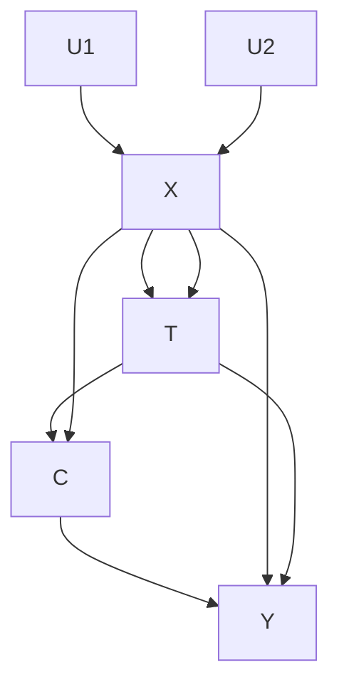
</details>

Adding variables, however, can help (Pearl 2009). Being representations of the population, DAGs abstract from sampling variability and thus from many issues in statistical inference, such as standard errors and significance tests.

When working with DAGs, the analyst (for the most part) needs to assume that the DAG captures the causal structure of everything that matters about a process. What matters most are the common causes. Causal DAGs are defined as DAGs that include all common measured and unmeasured causes of any pair of variables already included in the DAG (Spirtes et al. [1993] 2001). All DAGs in this chapter are assumed to be causal DAGs. My assertion that the DAG in Fig. 13.1 is a causal DAG means that I believe, for example, that there exists no variable Z that exerts both a direct causal effect on X and a direct causal effect on T. Causal DAGs may include variables that are not common causes, such as T. As a conventional shorthand, causal DAGs usually do not display the idiosyncratic factors generically assumed to affect each variable in the DAG, that is, exogenous non-common causes (sometimes called independent error terms), $^{3}$ such as $U_{T}\rightarrow T$ . Such idiosyncratic causes never contribute to the ability to nonparametrically identify causal effects. In some cases, it is useful to display idiosyncratic error terms and other variables that are not common causes in order to demonstrate why identification may fail, and I will do so on occasion in the examples below. Asserting that a DAG represents a causal DAG is a bold claim—a claim that should be carefully considered and tested against the data as far as possible. As we will see below, a causal model encoded in a causal DAG straightforwardly enables the enumeration of its testable components.

DAGs are called “acyclic” because they may not contain directed cycles, that is, paths that can be traced strictly along the direction of the arrows to arrive back at the starting point. Acyclicity preserves the truth that the future cannot cause the past. Apparent counterexamples are usually resolved by more finely articulating the temporal sequence of events (Greenland et al. 1999a). For example, the statement that “schooling and earnings cause each other” might be understood to mean that, say, a 15-year-old student’s expectations about her future earnings may influence her decision to enter college at age 18, and graduating from college at age 21, in turn, may increase her wages at age 30. Youthful wage expectations are not the same thing as adult earnings, mandating that they be represented as separate variables in the DAG, which removes the apparent cycle. Most theoretical and practical applications of DAGs in the literature assume that true simultaneity (of A causing B and B causing A) does not exist, but theory exists for cyclic graphs as well.

## The Three Sources of Association: Causation, Confounding, and Endogenous Selection

With the help of two mild assumptions, analysts can translate from the causal assumptions encoded in the DAG to associations observable in the data. $^{4}$ The rules for moving from causation to association are remarkably straightforward. Absent chance (i.e., apart from sampling variation), one only needs to consider the three elementary causal structures from which all DAGs can be constructed: chains $A \rightarrow C \rightarrow B$ (and its contraction $A \rightarrow B$ ), forks $A \leftarrow C \rightarrow B$ , and inverted forks $A \rightarrow C \leftarrow B$ . Conveniently, these structures correspond exactly to causation, confounding, and endogenous selection.


  
Fig. 13.2 (a) A and B are associated by causation. This marginal association identifies the causal effect of A on B. (b) A and B are conditionally independent given C. This conditional association does not identify the causal effect of A on B (overcontrol bias)


<details>
<summary>flowchart</summary>

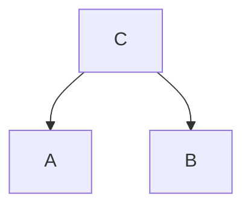
</details>


<details>
<summary>flowchart</summary>


</details>

Fig. 13.3 (a) A and B are associated by common cause. The marginal association does not identify the causal effect of A on B (confounding bias). (b) A and B are conditionally independent given C. The conditional association does identify the causal effect of A on B

First, two variables may be marginally associated if one variable directly or indirectly causes the other. In Fig. 13.2a, A and B are associated only because A is an indirect cause of B. The observed marginal association between A and B identifies the causal effect of A on B. Conditioning on C—for example, by including C as a control variable in a nonparametric regression of A on B and C—would block, or control away, the association flowing from A to B (Fig. 13.2b). Thus, the conditional association between A and B given C would not identify the causal effect of A on B. We say that conditioning on C leads to overcontrol bias (Elwert and Winship forthcoming). A box drawn around a variable denotes conditioning.

Second, two variables may be associated if they share a common cause. For example, A and B in Fig. 13.3a are only associated because they are both caused by C. This is the familiar situation of common cause confounding bias (confounding for short). The marginal association between A and B is spurious, or biased, because it does not identify a causal effect of A on B. Conditioning on C would eliminate this spurious association (Fig. 13.3b). Therefore, the conditional association between A and B given C would identify the causal effect of A on B (which, in this DAG, happens to be zero). $^{5}$

The third way in which two variables may be associated is less well known, but it is no less important: Conditioning on the common outcome of two variables (i.e., a collider) induces a spurious association between them for at least one value of the collider. A and B in Fig. 13.4a are marginally independent because they do not cause each other and do not share a common cause. Thus, the marginal association between A and B identifies the causal effect (the marginal association and the causal effect are both zero). Conditioning on the common outcome C of A and B, however, induces a nonzero association between A and B (Fig. 13.4b). The conditional association between A and B given C does not identify the causal effect of A on B. Elwert and Winship (forthcoming) call this phenomenon endogenous selection. $^{6}$ A dashed line between two variables, A--B (without arrowheads), indicates an association induced by endogenous selection. Dashed lines act like a regular path segment.


Fig. 13.4 (a) A and B are marginally independent. The marginal association identifies the causal effect of A on B. (b) A and B are associated due to conditioning on a common outcome (collider). The conditional association between A and B given C does not identify the causal effect of A on B (endogenous selection bias)   
Fig. 13.5 Conditioning on a descendant, D, of a collider also induces a spurious association between A and B   


<details>
<summary>flowchart</summary>

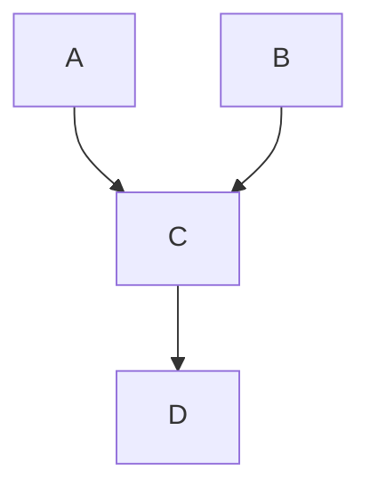
</details>

Conditioning on the descendant of a collider results in the same problem as conditioning on the collider itself. For example, in Fig. 13.5, conditioning on D (rather than C) may induce a spurious association between A and B. The intuition for this fact is that D carries information about A and B as encoded in C, such that conditioning on D amounts to conditioning on C itself.

Endogenous selection is a common problem in the social sciences—a problem virtually guaranteed to occur if the analyst conditions on a collider variable. $^{7}$ To develop intuition for the problem, consider the following causal model for the relationships between productivity, A, originality, B, and academic tenure, C. Suppose, for argument's sake, that productivity and originality are unassociated in the general population (i.e., productivity does not cause originality, originality does not cause productivity, and productivity and originality do not share any common cause). Suppose further that originality and productivity are separately sufficient for promotion to tenure. The causal DAG for this model is given by $A \rightarrow C \leftarrow B$ . Tenure is a collider variable. Now condition on the collider, for example, assess the relationship between originality and productivity only among tenured faculty. Knowing that an unoriginal scholar has tenure implies that he must have been productive. Conversely, knowing that an unproductive scholar has tenure implies that he must have been original. Either way, conditioning on the collider tenure creates an association between productivity and originality among tenured faculty, even though one does not cause the other.

This example may lack sociological nuance, but it demonstrates the essential logic of endogenous selection bias. To achieve greater realism, one could embellish the causal model by loosening assumptions to allow that B causes A (maybe because original scholars have more to write about) and that A and B share a common cause (maybe because having had a good graduate school advisor has caused both a knack for original thinking and irreproachable work habits). The problem of endogenous selection, however, would not go away. The observed conditional association between productivity

and originality given tenure would remain biased for the true causal effect of productivity on originality—it would represent a mixture of (1) the true causal effect of originality on productivity, (2) confounding by advisor quality, and (3) the spurious association between productivity and originality induced by conditioning on tenure.

In sum, there are three structural sources of association and three corresponding structural sources of bias. It is helpful to draw sharp distinctions between these biases because they originate from different causal structures and from different analytic actions and hence require different remedies. Confounding bias arises from failure to condition on a common cause; the remedy is to condition on the common cause. Overcontrol bias results from conditioning on a variable on a causal path between treatment and outcome; the remedy is not to condition on the variable. Endogenous selection bias results from conditioning on a (descendant of a) collider on any path connecting treatment and outcome; the remedy is not to condition on such variables. $^{8}$

## d-Separation and Testable Implications

All associations between variables in a DAG are transmitted along paths. Not all paths, however, transmit association. Whether a path transmits association depends both on the orientation of its arrows and on which variables the analyst conditions on. The concept of d-separation consolidates the three sources of association—causation, confounding, and endogenous selection—into a general graphical rule to determine when a path transmits association and when it does not.

D-separation (Pearl 1988): A path between two variables, A and B, is said to be d-separated (blocked or closed) if:

1. The path contains a noncollider that has been conditioned on, for example, $A \to \boxed{C} \to B$ or $A \leftarrow \boxed{C} \to B$ ; or   
2. The path contains a collider that has not been conditioned on, for example, $A \rightarrow C \leftarrow B$ , and no descendant of any collider on the path has been conditioned on either.

A path is said to be d-connected (unblocked or open) if it is not d-separated. We say that two (sets of) variables are d-separated if they are d-separated along all paths; they are d-connected otherwise. In an important theorem, Verma and Pearl (1988; Pearl 2009: 18) prove that if two (sets of) variables A and B are d-separated by conditioning on a (possibly empty) set of variables C in a causal DAG, then A is statistically independent of B conditional on C, $A \coprod B|C$ (where $\coprod$ stands for statistical independence) in any distribution generated by a process consistent with the DAG (so-called compatible distributions). Conversely, if two (sets of) variables A and B are not d-separated by C along all paths, then A and B are almost certainly statistically dependent given C, $A \not\cup B|C$ .

Conditioning on a variable here refers to perfect stratification by the values of the variable. Short of perfect stratification, conditioning only on some parsimonious function of a noncollider (e.g., in a regression) may not fully block a path and could let some residual association sneak by. In practice, there are many ways by which one may condition on a variable. Most generally speaking, conditioning


<details>
<summary>flowchart</summary>

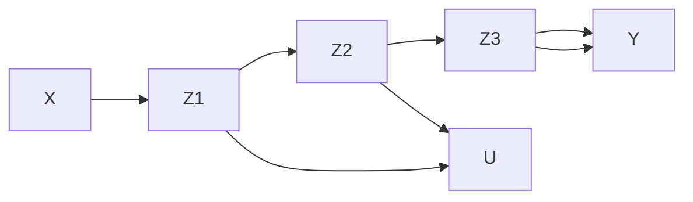
</details>

Fig. 13.6 $X$ and $Y$ can be d-separated and d-connected by conditioning on various sets of observed variables. $U$ is unobserved

refers to incorporating some information about that variable into the analysis. This can occur in the research design stage of a study, when only individuals with certain values on variable are purposefully selected into the sample (e.g., only collecting data on employed women). Alternatively, conditioning can occur inadvertently due to attrition or nonresponse on a variable. Or it may occur because one has explicitly conditioned on a variable in the analysis stage of the study through stratification, subgroup analysis, or entering the variable as a control in a regression-type model.

Getting a firm grip on the mechanics of d-separation is essential for using DAGs. As an example, consider the DAG in Fig. 13.6, where all variables except $U$ are observed. The variables $X$ and $Y$ can be d-separated, that is, rendered statistically independent, by conditioning on various sets of the observed variables. First, note that $X$ and $Y$ are marginally independent because all paths between $X$ and $Y$ contain the collider $Z_{1}$ , and not conditioning on a collider blocks a path. Conditioning on $Z_{2}$ or $Z_{3}$ changes nothing, since $Z_{2}$ and $Z_{3}$ does not unblock any path between $X$ and $Y$ . Conditioning on $Z_{1}$ alone, however, would unblock three paths between $X$ and $Y$ ( $X \to \boxed{Z_{1}} \leftarrow Z_{2} \to Z_{3} \to Y$ , $X \to \boxed{Z_{1}} \leftarrow U \to Z_{3} \to Y$ , and $X \to \boxed{Z_{1}} \leftarrow Z_{2} \to Y$ ) such that $X$ and $Y$ would become conditionally dependent given $Z_{1}$ . Conditioning on $Z_{1}$ together with $Z_{3}$ would block two of these newly opened paths, since $Z_{3}$ is a noncollider along these paths ( $X \to \boxed{Z_{1}} \leftarrow Z_{2} \to \boxed{Z_{3}} \to Y$ and $X \to \boxed{Z_{1}} \leftarrow U \to \boxed{Z_{3}} \to Y$ ), but it would not block the third open path ( $X \to \boxed{Z_{1}} \leftarrow Z_{2} \to Y$ ), and it would furthermore open a fourth, previously closed, path ( $X \to \boxed{Z_{1}} \leftarrow U \to \boxed{Z_{3}} \leftarrow Z_{2} \to Y$ ), since $Z_{3}$ is a collider along this path. The latter two paths could be closed again by conditioning on $Z_{2}$ . In sum, $X$ and $Y$ are d-separated, or statistically independent, if one conditioned on either one of five sets—the empty set, $Z_{2}$ , $Z_{3}$ , ( $Z_{2}$ , $Z_{3}$ ), or ( $Z_{1}$ , $Z_{2}$ , $Z_{3}$ )—and $X$ and $Y$ would be d-connected, or statistically dependent, if one conditioned on either one of $Z_{1}$ , ( $Z_{1}$ , $Z_{2}$ ), or ( $Z_{1}$ , $Z_{3}$ ). Clearly, whether two variables are dependent or independent depends not only on the structure of the data generating mechanism encoded in the DAG but also on the analyst's conditioning actions.

Although the validity of a causal assumption cannot generally be tested against the data in isolation (because that would require ruling out unmeasured confounders, which is itself a causal assumption (Robins and Wasserman 1999)), combinations of assumptions can have testable implications (see Chap. 15 by Bollen and Pearl, this volume). One of the important practical uses of d-separation is that it enumerates the testable implications of a causal model. Table 13.1 lists all pairwise marginal and conditional independencies implied by the DAG in Fig. 13.6. $^{10}$ The terms involving only observed variables are the empirically testable implications. The terms involving unobserved variables are not empirically testable. To the extent that the testable predictions are not substantiated in the data—subject to the usual serious caveats about type I and type II errors of significance testing—the DAG

Table 13.1 All pairwise marginal and conditional independences and dependences implied by the causal DAG in Fig. 13.6 

<table><tr><td colspan="2">Independences</td><td colspan="2">Dependences</td></tr><tr><td>Marginal</td><td>Conditional</td><td>Marginal</td><td>Conditional</td></tr><tr><td> $X$  and  $Z_{2}$ </td><td> $X$  and  $Z_{2}$  given ( $Z_{3}$  or  $Y$  or  $U$ )</td><td> $X$  and  $Z_{1}$ </td><td> $X$  and  $Z_{1}$  given (any other)</td></tr><tr><td> $X$  and  $Z_{3}$ </td><td> $X$  and  $Z_{3}$  given ( $Z_{2}$  or  $Y$  or  $U$ )</td><td> $Z_{1}$  and  $U$ </td><td> $X$  and  $Z_{2}$  given ( $Z_{1}$  and (any other)) $X$  and  $U$  given ( $Z_{1}$  and (any other))</td></tr><tr><td> $X$  and  $Y$ </td><td> $X$  and  $Z_{3}$  given ( $Z_{1}$  and  $Z_{2}$  and  $U$  and ( $Y$  or ( )) $X$  and  $U$  given ( $Z_{2}$  or  $Z_{3}$  or  $Y$ )</td><td> $Z_{1}$  and  $Z_{2}$ </td><td> $X$  and  $Z_{3}$  given ( $Z_{1}$  and ( ( ) or ( $Z_{2}$  eo  $U$ ) or  $Y$ )</td></tr><tr><td> $X$  and  $U$ </td><td> $X$  and  $Y$  given ( $U$  or  $Z_{2}$  or  $Z_{3}$ )</td><td> $Z_{1}$  and  $Z_{3}$ </td><td> $X$  and  $Y$  given ( $Z_{1}$  and ( ( ) or ( $Z_{2}$  eo ( $U$  or  $Z_{3}))))</td></tr><tr><td rowspan="6">\( Z_{2}$  and  $U$ </td><td> $X$  and  $Y$  given ( $Z_{1}$  and  $Z_{2}$  and ( $U$  or  $Z_{3}$ ))</td><td> $Z_{1}$  and  $Y$ </td><td> $Z_{1}$  and  $U$  given (any others)</td></tr><tr><td> $Z_{1}$  and  $Z_{3}$  given ( $U$  and  $Z_{2}$  and ( ( ) or  $X$  or  $Y$ ))</td><td> $U$  and  $Z_{3}$ </td><td> $Z_{1}$  and  $Z_{2}$  given (any others)</td></tr><tr><td> $Z_{1}$  and  $Y$  given ( $Z_{2}$  and ( $U$  or  $Z_{3}$ ) and ( ( ) or  $X$ ))</td><td> $U$  and  $Y$ </td><td> $Z_{1}$  and  $Z_{3}$  given ( $X$  or  $Y$  or ( $Z_{2}$  eo  $U$ ))</td></tr><tr><td> $Z_{2}$  and  $U$  given  $X$ </td><td> $Z_{2}$  and  $Z_{3}$ </td><td> $Z_{1}$  and  $U$  given ( $X$  or  $Z_{3}$  or ( $U$  eo  $Z_{2}$ ))</td></tr><tr><td></td><td></td><td> $Z_{2}$  and  $U$  given (( $Z_{1}$  or  $Z_{3}$ ) and (any other))</td></tr><tr><td> $U$  and  $Y$  given (( $Z_{2}$  and  $Z_{3}$ ) and (any other))</td><td> $Z_{2}$  and  $Y$ </td><td> $Z_{2}$  and  $Z_{3}$  given (any others) $Z_{2}$  and  $Y$  given (any others) $U$  and  $Z_{3}$  given (any others) $U$  and  $Y$  given ( $X$  or  $Z_{1}$  or ( $Z_{2}$  eo  $Z_{3}$ )) $Z_{3}$  and  $Y$  given (any others)</td></tr></table>

Notes: “Any other” is any combination of other variables not already named, including the empty set; “or” is the inclusive “either one or both”; “eo” is the exclusive “either one but not both”; () is the empty set

does not accurately represent the mechanism by which the data were generated. This would signal the analyst to modify her causal model. We distinguish between weak and strong contradictions between the causal model and the data. A weak contradiction occurs when a relationship that was predicted to be dependent turns out to be independent. A strong contradiction occurs when a relationship that was predicted to be independent turns out to be dependent. For example, the model would be strongly contradicted if X were not marginally independent of $Z_{2}$ . Strong contradictions always imply that the DAG is incorrect. The correct DAG, however, cannot be inferred from the data alone. Among other possibilities, the correct DAG might include the arrow $X \rightarrow Z_{2}$ , or the arrow $X \leftarrow Z_{2}$ , or another unmeasured confounder, V, $X \leftarrow V \rightarrow Z_{2}$ . DAGs have unambiguous implications for the independence structure of compatible probability distributions, but the independence structure of a distribution of observed variables is consistent with multiple DAGs. Spirtes et al. (2001) extensively discuss model testing. Pearl (2012a) discusses some problems with conventional approaches to model testing. See Robins and Wasserman (1999) and Greenland (2010) for critical perspectives. Outside of structural equation modeling, testing of model validity is extremely rare in applied sociology.

## DAGs as NPSEM and Effect Heterogeneity

Causal DAGs can be read as nonparametric structural equation models (NPSEM) (Pearl 2012a), a reading that this chapter has implicitly assumed all along. Going into a little more detail helps clarify the relationship between DAGs and conventional linear path models and corrects the common misconception that DAGs cannot represent effect heterogeneity.

Fig. 13.7 Causal DAGs can be read as nonparametric structural equation models (NPSEM)   


<details>
<summary>flowchart</summary>

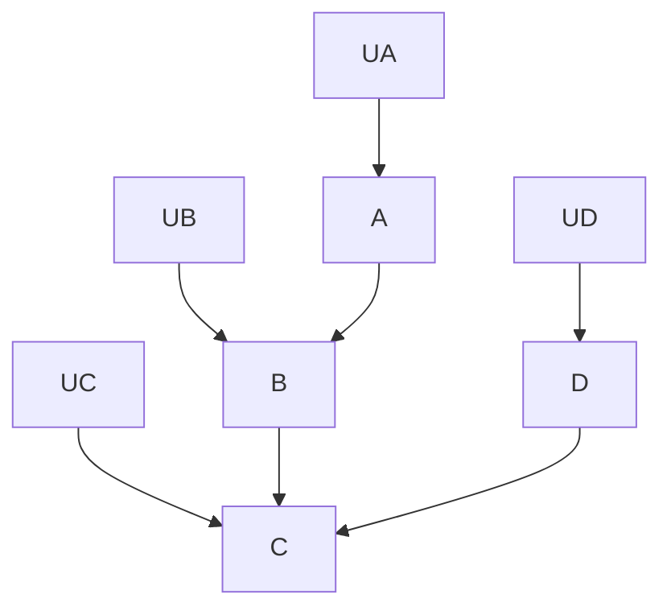
</details>

Consider the causal DAG in Fig. 13.7, which, in contrast to the usual convention, explicitly shows the independent idiosyncratic causes (error terms), U, of each variable. One can rewrite this DAG as a system of nonparametric structural equations where each endogenous variable V equals some function $f_{V}$ of its parents and each U trivially equals itself:

$$
A = f _ {A} (U _ {A}), \tag {13.1.1}
$$

$$
D = f _ {D} (U _ {D}), \tag {13.1.2}
$$

$$
B = f _ {B} (A, U _ {B}), \tag {13.1.3}
$$

$$
C = f _ {C} (B, D, U _ {C}). \tag {13.1.4}
$$

These equations are nonparametric in the sense that they make no statement about distributions or functional form. The only restriction placed upon them is the structure of dependencies and independencies implied by the DAG via d-separation. (Clearly, it is easier to glean the testable implications from a DAG, for example, that D and B may be conditionally associated given C.)

Every NPSEM is consistent with a variety of parametric specifications. We say that a parametric specification is consistent with an NPSEM if it preserves the parent-child relationships and error-term independencies of the DAG. For example, the nonparametric structural equation $C = f_{C}(B, D, U_{C})$ is consistent with the following parametric models, among others:

$$
C = \alpha + \beta_ {B} B + \beta_ {D} D + U _ {C}, \tag {13.2.1}
$$

$$
C = \beta_ {B, i} B + \beta_ {B D, i} \mathrm{BD} + U _ {C}, \tag {13.2.2}
$$

$$
\operatorname{logit} (C) = \beta_ {B, i} \sin^ {- 1} B + \beta_ {\mathrm{BD}} \frac {\sqrt [ 3 ]{B}}{D !} +. 7 * | U _ {C} | \text {   if   } \quad \mathrm{DB} > 0, \quad \text { else   } C = 3. \tag {13.2.3}
$$

Equation 13.2.1 corresponds to a conventional linear model without effect heterogeneity that is, the parameters $\beta_{B}$ and $\beta_{D}$ are asserted to be the same across individuals i in the population. The others do not. This makes clear that conventional linear SEMs are highly unusual special cases of NPSEMs.

In contrast to conventional linear path models, DAGs generically presume that all causal effects vary across units unless otherwise stated. DAGs also permit effect modification and interaction effects between variables (VanderWeele and Robins 2007; VanderWeele 2009), subject only to the functional constraints embedded in the DAG. For example, the DAG in Fig. 13.7 permits that the causal effect of B on C varies with the value of D since the DAG states that C causally depends both on B and on D. This possibility is encoded in Eqs. (13.2.2) and (13.2.3) (which make different assumptions about how exactly the effect of B may vary with D). At the same time, the DAG in Fig. 13.7 rules out that the effect of D on C varies with the value of A after conditioning on B, since C does not

depend on A given B. In contrast to linear path models, where interactions are sometimes encoded with arrows pointing into arrows, effect modification and interactions in DAGs need to be read from the d-separation constraints in the model (pointing arrows into arrows would invalidate the formal syntax for working with DAGs). $^{11}$

Estimating the statistical parameters of an NPSEM is in principle straightforward if all variables are observed and the sample is large. The chain rule of probability theory factors the joint probability distribution $P(x_{1}, x_{2}, \ldots, x_{n})$ of a set of n discrete variables $X_{1} = x_{1}, X_{2} = x_{2}, \ldots, X_{n} = x_{n}$ as

$$
P \left(x _ {1}, x _ {2}, \dots , x _ {n}\right) = \prod_ {j} P \left(x _ {j} \mid x _ {1}, \dots , x _ {j - 1}\right). \tag {13.3}
$$

Since every variable in a NPSEM only depends on its parents, this simplifies to

$$
P \left(x _ {1}, x _ {2}, \dots , x _ {n}\right) = \prod_ {j} P \left(x _ {j} | \mathrm{pa} \left(x _ {j}\right)\right). ^ {1 2} \tag {13.4}
$$

Recovering desired causal parameters, if they are identified and if all terms in Eqs. (13.3) and (13.4) are positive, is then just a question of skillfully isolating the required parts of this distribution (as in Eq. (13.5) below). Of course, this can be difficult to impossible in practice if some variables are unobserved. The remainder of this chapter discusses various graphical identification criteria that imply valid nonparametric estimators when the causal effect is identified and the necessary variables are observed, and it discusses some challenges of inserting parametric specifications when nonparametric estimation is not feasible.

## Graphical Identification Criteria

Graphical identification criteria are DAG-based rules that specify when and how identification is possible. This chapter focuses primarily on nonparametric graphical identification criteria which work regardless of how the variables are distributed and regardless of the functional form of the causal effects, that is, criteria that establish identification purely on the basis of the qualitative causal assumptions encoded in a DAG. Most graphical identification criteria discussed in the literature are sufficient (i.e., they positively determine when a causal effect can be identified), and some are necessary (i.e., they negatively determine when a causal effect cannot be identified). D-separation is the essential tool underlying all graphical identification criteria.

## Identification by Covariate Adjustment

## The Adjustment Criterion

Most empirical approaches to causal inference rely on adjusting (conditioning, controlling, stratifying) for numerous covariates (the so-called adjustment set) in some kind of regression model in order to strip an observed association of all spurious components. The danger of this strategy is that

Fig. 13.8 Multiple adjustment sets satisfy the adjustment criterion relative to the total causal effect of T on Y   


<details>
<summary>flowchart</summary>

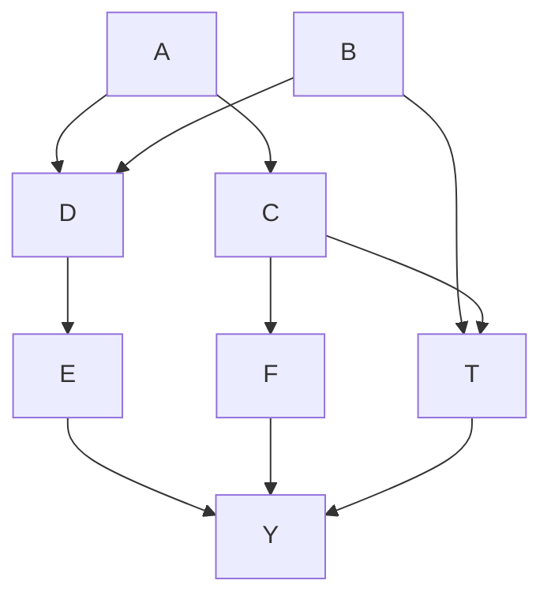
</details>

unprincipled covariate adjustment may fail to remove all confounding bias or even introduce new biases through overcontrol or endogenous selection. Various graphical identification criteria exist to guide the proper choice of covariates if a sufficient set of covariates is in fact observed.

The main insight of the graphical approach to covariate adjustment is that the adjustment set must block all noncausal paths without blocking any causal paths between treatment and outcome. This is accomplished if the adjustment set meets the adjustment criterion.

Adjustment criterion (Shpitser et al. 2010): A set of observed variables Z (which may be empty) satisfies the adjustment criterion relative to the total causal effect of a treatment T on an outcome Y if:

1. Z blocks all noncausal paths from T to Y; and   
2. No variable in Z lies on or descends from a causal path from T to Y. $^{13}$

If $Z$ satisfies the adjustment criterion, then the total causal effect of $T$ on $Y$ is nonparametrically identified by adjusting for $Z$ (Shpitser et al. 2010).

Figure 13.8 illustrates the adjustment criterion relative to the total causal effect of $T$ on $Y$ . $T$ and $Y$ are connected by nine distinct paths. Of these, two are causal paths, $T \to F \to Y$ and $T \to E \to Y$ , which together comprise the total causal effect of interest. The other seven paths are noncausal paths that need to be blocked. Four of the noncausal paths are already (unconditionally) blocked because they contain colliders: $T \leftarrow B \rightarrow C \leftarrow A \rightarrow Y$ , where $C$ is the blocking collider; $T \rightarrow E \leftarrow D \rightarrow Y$ , where $E$ is the blocking collider; and $T \rightarrow E \leftarrow D \leftarrow B \rightarrow C \rightarrow Y$ and $T \rightarrow E \leftarrow D \leftarrow B \rightarrow C \leftarrow A \rightarrow Y$ , where $E$ and $C$ are blocking colliders. The remaining three noncausal paths are open, but they can be blocked by conditioning on $B$ : $T \leftarrow \boxed{B} \rightarrow C \rightarrow Y$ , $T \leftarrow \boxed{B} \rightarrow D \rightarrow E \rightarrow Y$ , and $T \leftarrow \boxed{B} \rightarrow D \rightarrow Y$ . Since $B$ does not lie on or descend from a causal path, the adjustment criterion for the total causal effect of $T$ on $Y$ is met by conditioning on the adjustment set $Z = B$ .

More than one adjustment set may meet the adjustment criterion. Instead of conditioning on B, we could block two of the three open noncausal paths by conditioning on D: $T \leftarrow B \rightarrow \boxed{D} \rightarrow E \rightarrow Y$ and $T \leftarrow B \rightarrow \boxed{D} \rightarrow Y$ . And we could block the third open noncausal path, $T \leftarrow B \rightarrow \boxed{C} \rightarrow Y$ , by conditioning on C. The last move, however, is problematic since conditioning on C opens up the previously closed noncausal path $T \leftarrow B \rightarrow \boxed{C} \leftarrow A \rightarrow Y$ on which C is a collider. This newly opened noncausal path can be blocked again by conditioning on A. Thus, conditioning on $Z = (A, C, D)$ would satisfy the adjustment criterion.

This example demonstrates several interesting facts about identification by adjustment. First, a given causal effect can often be identified by multiple possible adjustment sets. In Fig. 13.8, there are nine possible adjustment sets for the total causal effect of $T$ on $Y$ : (B), (B, A), (B, C), (B, D), (B, A, C), (B, C, D), (B, A, D), (A, C, D), and (A, B, C, D). Either one of these adjustment sets identifies the causal effect well as the others. Second, it may not be necessary to condition on any direct causes of treatment (the so-called assignment mechanism)—conditioning on (A, C, D) will do. Third, it may not

be necessary to condition on any direct causes of the outcome—conditioning on B will do. Fourth, it may not be necessary to condition on any joint ancestors of treatment and outcome—conditioning on $(A, C, D)$ will do. These facts grant the analyst considerable flexibility in the identification of a causal effect, which is useful if one or more of the covariates are unobserved, such that one or more of the possible adjustment strategies are rendered infeasible.

## Adjustment and Ignorability

The adjustment criterion is theoretically important because it provides a direct link to the potential outcomes framework of causal inference. Conditional ignorability of treatment assignment with respect to the potential outcomes, $Y^{T} \perp T|Z$ , (Rosenbaum and Rubin 1983) implies that the adjustment criterion is met by adjusting for Z; and the fact that the adjustment criterion is met implies conditional ignorability (Shpitser et al. 2010). Knowledge of the DAG therefore helps analysts understand when conditional ignorability is met and when it is not met. Best of all, it does so by making reference only to qualitative causal statements about in-principle observable variables encoded in the DAG, not always-unobservable counterfactuals.

## Estimation When the Adjustment Criterion Is Met

The correspondence between the adjustment criterion and conditional ignorability, together with elementary rules of probability theory, gives rise to a straightforward nonparametric estimator. Write $P(v)$ for the probability distribution of V, V = v. If Z meets the adjustment criterion for the total causal effect of T on Y, then the distribution of the potential outcomes can be estimated nonparametrically from observed data $(Z, T, Y)$ by

$$
P \left(y ^ {T}\right) = \sum_ {z} P (y | t, z) P (z) \tag {13.5}
$$

or its continuous analogue (Robins 1986; Pearl 1995; Shpitser et al. 2010). $^{14}$ Equation (13.5) is known by various names, including stratification estimator and, lately, adjustment formula. For a binary treatment and categorical Z, the total effect of T on Y evaluates to

$$
\begin{array}{l} E \left[ Y ^ {T = 1} \right] - E \left[ Y ^ {T = 0} \right] \\ = \sum_ {z} E [ Y | T = 1, Z = z ] \operatorname * {P r} (Z = z) - \sum_ {z} E [ Y | T = 0, Z = z ] \operatorname * {P r} (Z = z). \tag {13.6} \\ \end{array}
$$

Nonparametric estimators for arbitrarily distributed variables follow analogously.

Unfortunately, the nonparametric estimator in Eq. (13.5) is rarely feasible in practice. If Z is high dimensional or the sample is small, the analyst may need to insert parametric functions into the terms of Eq. (13.5). It is important to realize that things can go badly wrong at this step. Just because a causal effect is proved nonparametrically identifiable by the adjustment criterion does not imply that it can be estimated with just any parametric estimator (e.g., by throwing the variables in the adjustment set, $Z = Z_{1}, \ldots, Z_{n}$ , as main effects into a linear regression $Y = a + b_{T} T + \sum_{k} b_{k} Z_{k} + e$ ). The


<details>
<summary>flowchart</summary>

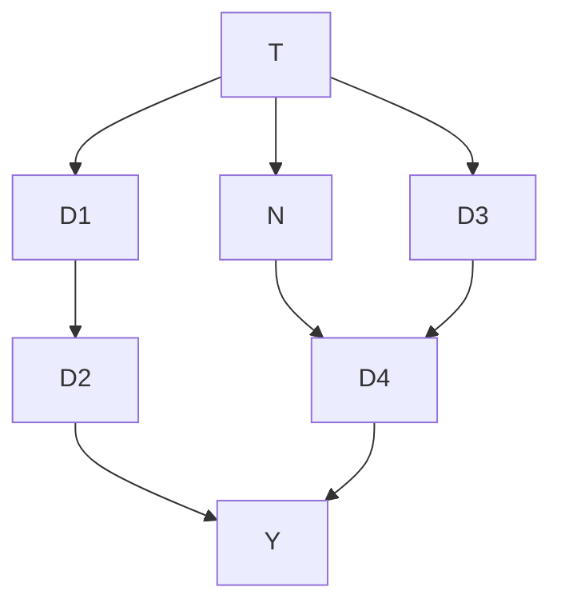
</details>

Fig. 13.9 A DAG for a randomized experiment that illustrates that conditioning on descendants of the treatment is either irrelevant or harmful for identification by adjustment

appropriateness of a specific parametric estimator depends on the appropriateness of its parametric assumptions for the specific substantive situation at hand, about which DAGs typically have little to say. Breen and Karlson (Chap. 10, this volume) discuss an example where the causal effect of a treatment on a binary outcome is nonparametrically identified by the adjustment criterion (and thus could be estimated nonparametrically using Eq. (13.5)), and yet the parametric assumptions embedded in off-the-shelf logit and probit models induce tricky biases. The problem in such cases lies not with identification, but with parametric estimators that have introduced faulty parametric assumptions.

## Sufficient Conditions for the Adjustment Criterion

The adjustment criterion implies several narrower identification criteria that offer useful guidance for quickly finding sufficient adjustment sets in practice.

First, note that it is never necessary, and often harmful, to condition on a descendant of the treatment. Consider the total causal effect of T on Y in Fig. 13.9, which is identified unconditionally since T is randomized. Conditioning on a descendant of T that lies on or descends from the causal path is always harmful because it either controls away the effect of interest $(D_{2})$ or induces endogenous selection bias $(D_{5})$ . $^{15}$ Conditioning on a descendant of T that lies on $(D_{3})$ , or descends from $(D_{4})$ , a noncausal path is never necessary because such paths are by definition blocked by a collider, and it may be harmful as it may unblock the path. Conditioning on a descendant of T that neither lies nor descends from a causal or noncausal pathway $(D_{1})$ is neither necessary nor harmful to identification (but it will reduce efficiency). Analysts interested in identifying the total causal effect of a treatment are thus well advised not to adjust for a descendant of treatment.

The analyst therefore only needs to worry about noncausal paths that start with an arrow into treatment, $\rightarrow T$ . Such noncausal paths are called backdoor paths.

Backdoor criterion (Pearl 1993, 2009): A set of observed variables Z (which may be empty) satisfies the backdoor criterion relative to the total causal effect of a treatment T on an outcome Y if:

1. No element of $Z$ is a descendant of $T$ ; and   
2. Z blocks all backdoor paths from T to Y.

If Z satisfies the backdoor criterion, then the total causal effect of T on Y is nonparametrically identified (Pearl 1995). In Fig. 13.10, the backdoor criterion is met by seven distinct adjustment sets: $(A, C)$ , $(B, C)$ , $(C, D)$ , $(A, B, C)$ , $(A, C, D)$ , $(B, C, D)$ , and $(A, B, C, D)$ . All effects identified by the adjustment criterion are also identified by the backdoor criterion (Shpitser et al. 2010).

Fig. 13.10 Illustrating various narrower identification criteria implied by the adjustment criterion   


<details>
<summary>flowchart</summary>

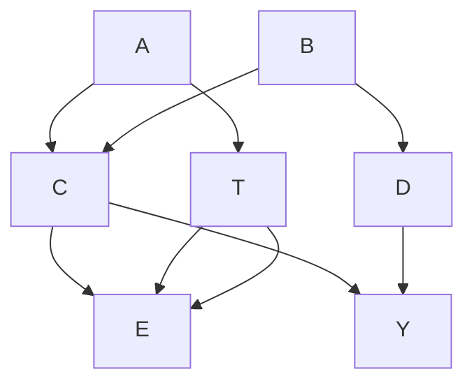
</details>

Sometimes, identification can be detected at a glance. Since all backdoor paths by definition start with an arrow into treatment, all backdoor paths can be blocked by conditioning on the parents of treatment, if they are observed.

Parents of treatment criterion (Pearl 1995): Conditioning on all parents of treatment, T, identifies the total causal effect of T on any outcome.

In Fig.13.10, the parents of treatment criterion is met by conditioning on $(A, C)$ . By contrast, conditioning on all parents of the outcome might induce overcontrol bias since the parents of the outcome usually include variables on a causal pathway between T and Y. However, under certain circumstances, restricting adjustment to parents that do not lie on a causal pathway is sufficient.

Parents of the outcome criterion: If no backdoor path shares a node with any causal path (other than $T$ and $Y$ ), then conditioning on all parents of the outcome $Y$ that do not lie on a causal path from $T$ to $Y$ identifies the total causal effect of $T$ on $Y$ .

In Fig. 13.10, the parents of the outcome criterion is met by conditioning on $(C, D)$ , but not by conditioning on $(C, D, E)$ . Next, note that all unconditionally open backdoor paths must contain a variable that is a joint direct or indirect cause of treatment and outcome, $T \leftarrow \cdots \leftarrow J \rightarrow \cdots \rightarrow Y$ . The following criterion can then be shown.

Joint ancestor criterion: Conditioning exclusively on all joint ancestors of $T$ and $Y$ identifies the total causal effect of $T$ on $Y$ . (Conditioning on additional variables may ruin identification.)

In Fig. 13.10, the joint ancestor criterion is met by conditioning on $(A, B, C)$ . Of course, all of these graphical identification criteria will only work if at least one possible adjustment set is actually observed. Conditioning only on the observed parents of treatment, or the observed joint ancestors of treatment and outcome, may fail to remove all bias or even create new biases. If only $T$ , $Y$ , and $C$ were observed in Fig. 13.10, then conditioning on $C$ as the sole observed parent of $T$ , parent of $Y$ , or joint ancestor of $T$ and $Y$ will not identify the causal effect (since conditioning on $C$ opens a noncausal path $T \leftarrow A \rightarrow \boxed{C} \leftarrow B \rightarrow D \rightarrow Y$ ). In practice, it is advisable to use the backdoor criterion, since the backdoor criterion may detect a possible adjustment set even if none of the narrower parent or ancestor criteria are met.

Finally, the backdoor criterion implies a very helpful identification criterion that works (i.e., avoids inadvertent bias) even if the structure of the DAG is not fully known.

Confounder selection criterion (VanderWeele and Shpitser 2011): If there is a set of observed covariates that meets the backdoor criterion (i.e., if the analyst is willing to assume ignorability), then it is sufficient to condition on all observed pretreatment covariates that either cause treatment, outcome, or both.

If the total causal effect of $T$ on $Y$ is identified by any of the above criteria, then it can be estimated nonparametrically by Eq. (13.5).

  
Fig. 13.11 The total effect of $T$ on $Y$ is identifiable via the frontdoor criterion but not via the adjustment criterion. $U$ is unobserved

## Identification Beyond Adjustment: Frontdoor Identification, the do-Calculus, and Instrumental Variables

Covariate adjustment is not the only road to nonparametric identification. Numerous additional strategies exist that may work even if treatment is not ignorable and no set of covariates satisfies the adjustment criterion. All of these strategies can be represented graphically with DAGs, and all ultimately rely on d-separation.

One of the alternatives to the adjustment criterion is Pearl's (1995) frontdoor identification criterion. Frontdoor identification relies on piecing together a total causal effect from its constituent parts through repeated application of the backdoor criterion. For example, the total causal effect of $T$ on $Y$ in Fig. 13.11, where $U$ is unobserved, is not identifiable via the adjustment criterion because the backdoor path $T \leftarrow U \rightarrow Y$ cannot be blocked. All segments of the causal path, $T \rightarrow M \rightarrow Y$ , however, can be identified separately. $T \rightarrow M$ is identified by the marginal association between $T$ and $M$ (because no open backdoor path connects them); and $M \rightarrow Y$ is identified by the conditional association between $M$ and $Y$ given $T$ (since $T$ lies on the only open backdoor path). Piecing the parts together is a matter of straightforward algebra. Pearl (2009: 83) gives a nonparametric estimator for frontdoor-identified causal effects. See Knight and Winship (Chap. 14, this volume) for a detailed discussion of frontdoor identification.

The most general nonparametric graphical identification criterion is Pearl's calculus of intervention, or do-calculus (1995, 2009: Section 3.4). Shpitser and Pearl (2006) prove that the do-calculus is complete in that it detects the identifiability of all nonparametrically identifiable causal effects of interventions. All other graphical identification criteria, including the adjustment (ignorability) and frontdoor criteria, are special cases of the do-calculus.

Few of the nonparametric identification strategies beyond covariate adjustment are known outside of specialist circles. Many of these strategies make exacting demands on data and theory by requiring clever exclusion restrictions. Careful development of sociological theory will no doubt reveal fresh opportunities to apply these more advanced graphical identification criteria for empirical gain.

If a causal effect is not identifiable by any of the above nonparametric criteria (e.g., if treatment and a child of treatment on a causal pathway are confounded by an unobserved variable), then the analyst may be still able to achieve identification if he or she can defend additional parametric assumptions. Pearl (2009: chapter 5) discusses graphical criteria for identification in linear models; Brito and Pearl (2002) give a graphical criterion for detecting instrumental variables and instrumental sets in DAGs; and Chan and Kuroki (2010) give graphical criteria for instrument-like auxiliary variable identification strategies.

## The Importance of Having a Causal Model: Confounding as a Causal Rather Than an Associational Concept

The graphical identification criteria reviewed above all presume the validity of the causal model encoded in the DAG. This comports with the claim that identification analysis requires an explicit

Fig. 13.12 X fits the associational definition of confounding in both DAGs. But conditioning on X in (a) removes bias, whereas in (b) it creates bias. $U_{1}$ and $U_{2}$ are unobserved   


<details>
<summary>flowchart</summary>

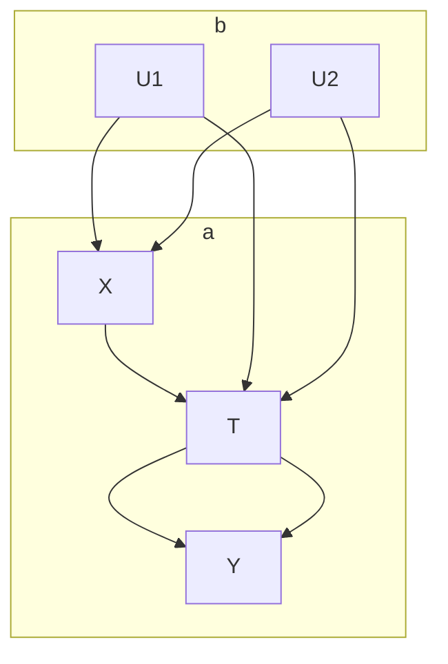
</details>

causal model. I will now draw on recent work on the nature of confounding to prove that having a causal model is in fact necessary and that purely observational, atheoretical approaches can lead the analyst astray (Greenland and Robins 1986; Greenland et al. 1999b; Cole and Hernán 2002).

Consider a conventional approach to confounder selection. Textbooks often define a confounder as a variable that (1) temporally precedes treatment and is both (2) associated with the treatment and (3) associated with the outcome. Standard recommendations dictate that such variables must be controlled to avoid bias.

The two DAGs in Fig. 13.12 show why this associational rule can lead to the introduction rather than removal of bias. In both DAGs, X fulfills the three conventional criteria of a confounder for the causal effect of T on Y: X precedes T, X is associated with T, and X is associated with Y (by direct causation in Fig. 13.12a and via unobserved variables U in Fig. 13.12b). The conventional prescription works in Fig. 13.12a: X sits on the only open noncausal path from T to Y and must be conditioned on to eliminate bias. By contrast, the conventional prescription fails in Fig. 13.12b: There is no open noncausal path between T and Y because X is a collider. Controlling for X would open this noncausal path and induce endogenous selection bias. The problem is compounded because there is no way to distinguish empirically between Fig. 13.12a, b, as both DAGs have the same set of testable implications (all observed variables are conditionally and unconditionally associated with each other). The lessons of this example are that it is not possible to decide on the proper set of control variables without an understanding of the underlying causal structure and that observable, associational, criteria alone cannot justify the identification of causal effects.

## Examples of Endogenous Selection Bias

One of the practical uses of DAGs lies in elucidating the nature of selection bias as conditioning on a collider (Hernán et al. 2004; Elwert and Winship forthcoming). Selection bias can occur at any time in a causal process. It can occur due to conditioning on an outcome or a descendant of an outcome; it can occur due to conditioning on an intermediate variable affected by the treatment; and it can even occur due to conditioning on a pretreatment variable (Greenland 2003).

## Heckman Selection and the Motherhood Wage Penalty: Conditioning on a Descendant of the Outcome Creates Bias

So-called Heckman sample selection bias can be explicated as bias arising from conditioning on a post-outcome collider (Elwert and Winship forthcoming). Suppose that we are interested in estimating the total causal effect of having a child, M, on the wages offered to women by potential employers,


<details>
<summary>flowchart</summary>

```mermaid
graph TD
    C --> M
    M --> (W_R)
    E --> W_O
    W_O --> E
    C -.-> M
    W_O -.-> W_O
    ε --> W_O
```
</details>


<details>
<summary>flowchart</summary>

```mermaid
graph TD
    C --> M
    M --> (W_R)
    M --> W_O
    W_O --> E
    E -.-> M
    M -.-> W_O
    C -.-> W_O
    W_O -.-> M
    style C fill:#fff,stroke:#000
    style M fill:#fff,stroke:#000
    style W_O fill:#fff,stroke:#000
    style E fill:#fff,stroke:#000
```
</details>

Fig. 13.13 Conditioning on a post-outcome collider can induce multiple endogenous selection biases. M, motherhood; $W_{R}$ , reservation wage (unmeasured); $W_{O}$ , offer wage; E, employment status; $\varepsilon$ , “error” term on offer wages; C, common causes of motherhood and wages. (a) No effect of motherhood on offer wages. (b) With effect of motherhood on offer wages

$W_{O}$ , (Fig. 13.13a). We assume that motherhood will affect a woman's reservation wage, $W_{R}$ (i.e., the wage that would be necessary to draw her into the workforce; see Gronau 1974; Heckman 1974). $W_{R}$ is not measured. The decision to accept employment, E, is affected both by the offer wage, $W_{O}$ , and the reservation wage, $W_{R}$ , because a woman will only accept the job if the offer wage meets or exceeds her reservation wage. Employment thus is a collider on a noncausal path between motherhood and offer wages, $M \rightarrow W_{R} \rightarrow E \leftarrow W_{O}$ . A vector of common causes, C, confounds these relationships, but, for simplicity, we assume that the analyst has appropriately conditioned on them to block all backdoor paths between M and $W_{O}$ .

The central problem is that most datasets include information on offer wages only for those women who are actually employed. Many analyses have therefore restricted the sample to employed women. But this sample restriction implies conditioning on the collider E, which unblocks the noncausal path from motherhood to offer wages, $M \rightarrow W_{R} \rightarrow \boxed{E} \leftarrow W_{O}$ , and induces endogenous selection bias: The analysis would detect an association between motherhood and wages even if the causal effect of motherhood on wages were in fact zero (Fig. 13.13a).

If motherhood has no effect on offer wages, as assumed in Fig. 13.13a, the endogenous selection problem is bad enough. A second source of endogenous selection bias is introduced if motherhood really has an effect on offer wages (e.g., because of mothers' differential productivity or employer discrimination). This is shown in Fig. 13.13b by adding the arrow $M \to W_{\mathrm{O}}$ . Since all outcomes are implicit colliders between the treatment and the error term (if there is an effect of treatment), conditioning on $E$ now also amounts to conditioning on the descendant of the collider $W_{\mathrm{O}}$ along the path $M \to W_{\mathrm{O}} \leftarrow \varepsilon$ , which induces a new noncausal association between motherhood and the error term, and from there with offer wages, $M - \varepsilon \to W_{\mathrm{O}}$ . Note that this second endogenous selection problem (but not the first) would exist even if we could measure and condition on $W_{\mathrm{R}}$ . $^{16}$

With a few additional assumptions, one can predict the direction of the bias (VanderWeele and Robins 2009). If motherhood decreases the chances of employment and if higher offer wages increase the chances of accepting employment for all women, then mothers who are employed must on average have received higher offer wages than childless women. Consequently, an analysis that is restricted to working women would underestimate the motherhood wage penalty.

  
Fig. 13.14 T, randomized treatment; M, nonrandomized variable affected by T; Y, outcome; U, unobserved common cause. (a) Conditioning on the mediator M induces endogenous selection that biases the regression estimate for the direct effect of T on Y. (b) The marginal association between T and Y does not equal the conditional association between T and Y given M, falsely suggesting the presence of an “indirect” effect via M where no such indirect effect exists

## Direct Effects, Indirect Effects, and Mediation Analysis: Conditioning on an Intermediate Variable Can Create Bias

Outside of certain unlikely scenarios, conventional mediation analysis (e.g., following Baron and Kenny 1986), and with it the estimation of causal mechanisms, direct and indirect effects, is virtually guaranteed to suffer endogenous selection bias. The problem is well known in methodological circles (e.g., Rosenbaum 1984; Holland 1988; Robins 1989; Smith 1990; Wooldridge 2005, 2006; Sobel 2008), but it stubbornly persists in empirical social science. DAGs readily communicate the essence of the problem as endogenous selection bias (Pearl 1998; Robins 2001; Cole and Hernán 2002).

To fix ideas, consider whether class size in first grade, T, has a direct effect on high school graduation, $Y, T \rightarrow Y$ , via some mechanism other than boosting student achievement in third grade, M (Finn et al. 2005). Assume that class size is randomized, as in the well-known Project STAR experiment (Finn and Achilles 1990). Figure 13.14a gives the basic corresponding DAG. As in any well-executed randomized experiment, the total effect of treatment, T, on the outcome, Y, is identified by the marginal association between T and Y because T and Y share no common cause. As in all observational studies, however, the posttreatment mediator, M, is not randomized and may therefore share an unmeasured cause, U, with the outcome, Y. Candidates for U in this application might include parental education, underlying ability, student motivation, and any other confounders of M and Y not explicitly controlled in the study. The existence of the confounder U would make M a collider variable. Conditioning on M in order to estimate the direct causal effect $T \rightarrow Y$ would unblock the noncausal path $T \rightarrow M \leftarrow U \rightarrow Y$ and induce endogenous selection bias. Therefore, the direct effect $T \rightarrow Y$ in this DAG is not identified by conditioning on M.

The conventional strategy for detecting indirect effects is similarly susceptible to endogenous selection bias. It is a common practice to infer the existence of an indirect effect of T on Y by comparing an estimate for the total effect of T on Y with an estimate for the direct effect of T on Y. If the total effect estimate (e.g., from a regression of Y on T) differs from the naïve direct effect estimate (e.g., from a regression of Y on T and M), analysts commonly conclude that there must be an indirect effect and that M is a “mediator.” Figure 13.14b shows why this strategy may lead to the wrong conclusion. In this DAG, the total effect of T on Y is identical with the direct effect because no indirect effect of T on Y via M exists. The total effect is identified by the marginal association between T and Y. The conditional association between T and Y given M, however, will differ from the marginal association between T and Y because M is a collider, and conditioning on the collider induces endogenous selection bias along the noncausal path $T \rightarrow \boxed{M} \leftarrow U \rightarrow Y$ . Thus, the correct estimate for the total causal effect and the biased estimate for the direct effect of T on Y would differ, and the analyst would falsely conclude that an indirect effect exists even though it does not.

Generally, neither direct nor indirect effects are nonparametrically identifiable by simple conditioning on the mediator if there exist unmeasured common causes of the mediator and the outcome (but see the section on time-varying treatments below).

  
Fig. 13.15 Homophily in social network analysis is endogenous selection bias. $M_{ij}$ , marital status of woman $i$ and man $j$ ; $D$ , vital status; $U$ , characteristics influencing marital choice and vital status; $H$ , health in old age. (a) Computing the association between $D_i$ and $D_j$ implies conditioning on $M_{ij}$ , which induces an association between $D_i$ and $D_j$ even if $D_i$ exerts no causal effect on $D_j$ . (b) If $D_i$ affects $D_j$ only if $i$ and $j$ are married (effect modification), then the existence of the effect implies two arrows in the DAG, $D_i \to D_j$ and $M_{ij} \to D_j$ . Conditioning on either one of $H_i$ or $H_j$ would block the noncausal path opened by conditioning on the social tie $M_{ij}$ and allow for the identification of the causal effect of $D_i$ on $D_j$

## Homophily in Social Network Analysis: Conditioning on Pretreatment Variables Can Create Bias

One of the more surprising results of recent research on causal inference is that controlling for certain pretreatment variables—colliders—can increase rather than decrease bias (Pearl 1995, 2009; Greenland et al. 1999a, b; Hernán et al. 2002, 2004; Greenland 2003). $^{17}$ Even more surprising is that a central problem of modern social network analysis—latent homophily bias—is exactly of this type (Shalizi and Thomas 2011).

Consider one of the simplest social networks—the marital dyad—and ask whether the death of a wife i at time t, $D_{i}$ , exerts a causal effect on the subsequent death of her husband j (Fig. 13.15). It has long been known that spouses tend to die in short succession. It has also long been suspected that this association may be owed not to a causal effect of one death on the other, but to spousal similarity, as like marries like (homophily) (Farr 1858). With the appropriate DAG, we can see that homophily bias is best understood as endogenous selection rather than confounding (Elwert and Winship forthcoming). Consider Fig. 13.15a, which encodes the null hypothesis that wife’s death does not affect husband’s mortality. It further assumes—for expositional clarity—that husband’s and wife’s vital statuses are not confounded by any common cause. However, there are unobserved factors, $U_{j}$ , such as husband’s education, that affect both his decision of whom to marry (and to stay married to), $M_{ij}$ , and his vital status, $D_{j}$ . Similarly, wife’s unobserved education, $U_{i}$ , affects both her decision to marry this specific husband and her vital status. If this DAG is true, then there is no open noncausal path between $D_{i}$ and $D_{j}$ , and husband’s and wife’s vital status should be marginally independent. The trouble is that one cannot observe this marginal association among married couples, because the simple act of searching for an association between the vital statuses of husbands and wives means that the analyst is conditioning on marital status, $M_{ij}=1$ . Conditional on marital status, $U_{i}$ and $U_{j}$ become associated: Knowing that a man and a woman are married to each other permits us to infer something about her education from his education. (If he has high education, then likely so does she.) Ultimately, conditioning on $M_{ij}$ induces an association between $D_{i}$ and $D_{j}$ along the path $D_{i}\leftarrow U_{i}\rightarrow\boxed{M_{ij}}\leftarrow U_{j}\rightarrow D_{j}$ . Therefore, wives’ deaths will be observationally associated with husbands’ deaths even if one does not cause the other.

This homophily problem is pervasive in network analysis, since social ties between spouses, friends, and any other kind of network alters are almost never formed at random. If tie formation or tie dissolution are affected by unobserved variables that are, respectively, associated with the treatment variable in one individual and the outcome variable in the other individual, then searching for interpersonal effects will induce a spurious association between individuals in the network.

Nevertheless, like in any other setting, causal inference in social networks is possible if the biasing paths can be blocked (Shalizi and Thomas 2011). For the present example, Elwert and Christakis (2006) argue in essence that the effect of husbands' and wives' $U$ (e.g., unobserved education) on vital status should be substantially mediated by their health (and other observables) in old age, $H$ . Conditioning on good measures of health would thus permit the identification of interspousal health effects (Fig. 13.15b). $^{18}$

Greenland (2003) provides rules of thumb for the size of pretreatment endogenous selection bias. VanderWeele (2011) develops a formal sensitivity analysis. O'Malley et al. (2012) use DAGs to justify instrument-variable solutions for homophily bias. Fowler and Christakis (2010) avoid homophily bias altogether by experimentally randomizing network structure to eliminate the influence of all possible observed and unobserved variables on tie formation.

## Drawing DAGs for Social Networks

The previous example shows that DAGs can inform causal inference in social networks. $^{19}$ The mechanics of graphical analysis are the same in social networks as elsewhere, but the structure of DAGs for social networks merits some comments. First, DAGs for social networks should include the social ties between individuals (or groups of individuals) as variables in their own right, for example, $M_{ij}$ . Second, the DAG should contain separate variables for the attributes and actions of each individual (or groups of individuals) in the network, for example, $D_i$ and $D_j$ . $^{20}$ Third, the DAG should explicitly include the mechanism of tie formation, noting that tie formation is usually influenced by the attributes and actions of all individuals linked by the tie, for example, $U_i \to M_{ij} \leftarrow U_j$ . Fourth, if one individual causally influences another individual, then this implies not only a causal path from the treatment to the outcome but also a direct arrow from the social tie into the outcome (Shalizi and Thomas 2011). In our example, suppose that Ingrid's death, $D_i$ , increases the risk of Jack's death, $D_j$ , only if Ingrid and Jack are married, $M_{ij} = 1$ , but not if they are strangers, $M_{ij} = 0$ . This effect modification of the effect of $D_i$ on $D_j$ by the value of $M_{ij}$ suggests that the $D_j$ causally depends on $D_i$ and $M_{ij}$ , such that the DAG should contain two arrows, $D_i \to D_j$ and $M_{ij} \to D_j$ , to represent the causal effect of $D_i$ on $D_j$ (Fig. 13.15b). Fifth, investigating the spread of attitudes, states, or behaviors along a social tie necessarily implies that the analyst is conditioning on the tie, which is a collider, and hence risks inducing endogenous selection bias.

## The Sequential Backdoor Criterion for Time-Varying Treatments

The identification and estimation of causal effects from multiple, time-varying interventions has been one of the most exciting areas of causal inference over the past 15 years. In contrast to work on single, fixed-time interventions, however, the fruits of this literature are only slowly making inroads in applied social science research. In this section, I review the sequential backdoor criterion for the joint causal effect of time-varying treatments (Pearl and Robins 1995).

To fix ideas, suppose that we are interested in the joint causal effect of taking specific sequences of courses during the fall and spring terms of junior year of high school, $A_{0}$ and $A_{1}$ , on a student's SAT score during senior year, Y. Suppose that students must choose between two subjects in each term t, $A_{t}=0$ (math) or $A_{t}=1$ (English). Students' time-varying GPA, $L_{t}$ , is affected by past course choice, and $L_{t}$ in turn affects future course choice as well as SAT scores. Students' unobserved test-taking ability, U, affects their GPA and their SAT score, but not their course choice. Figure 13.16a shows the DAG for this causal model.

Joint causal effects are causal effects of multiple and possibly time-varying interventions (so-called unit treatments); they are defined as the change in the outcome that would occur if one intervened to change all unit treatments from one level to another. For example, we might be interested in the joint causal effect on SAT scores of taking the sequence (math, math) rather than the sequence (English, English). $^{21}$ In a DAG, the joint causal effect of multiple interventions is represented by all those causal paths emanating from the unit treatments to the outcome that are not mediated by later unit treatments (so-called proper causal paths (Shpitser et al. 2010)). In Fig. 13.16a, the joint causal effect of changing $A_{0}$ and $A_{1}$ is captured by the three proper causal paths $A_{0}\rightarrow Y$ , $A_{0}\rightarrow L_{1}\rightarrow Y$ , and $A_{1}\rightarrow Y$ . Note that the path $A_{0}\rightarrow L_{1}\rightarrow A_{1}\rightarrow Y$ is not part of the desired joint causal effect because it is not a proper causal path: Intervening on $A_{0}$ and $A_{1}$ prevents $A_{0}$ from affecting $A_{1}$ , thus rendering the path inactive. $^{22}$


<details>
<summary>flowchart</summary>

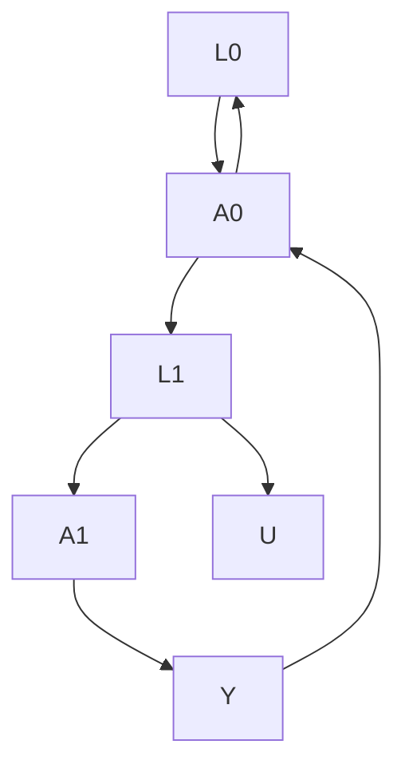
</details>


<details>
<summary>flowchart</summary>

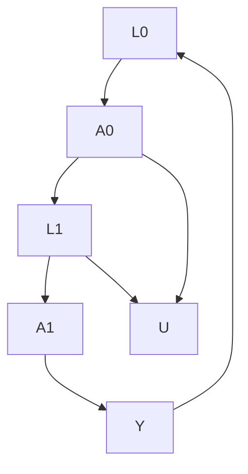
</details>

Fig. 13.16 $A_{t}$ , course choice in term $t$ ; $L_{t}$ , GPA going into $t$ ; $U$ , test-taking ability; $Y$ , SAT score. (a) DAG describing a causal model for the relationship between course choice and SAT score. (b) Modified DAG drawn from the perspective of $A_{0}$ , omitting all arrows into the later unit treatment $A_{1}$ . All causal paths from $A_{0}$ to $Y$ in this redrawn DAG are proper causal paths

Realizing that the joint causal effect only comprises proper causal paths simplifies identification analysis tremendously because it compartmentalizes the task: Each proper causal path belongs unambiguously to a specific unit treatment ( $A_{0} \rightarrow Y$ and $A_{0} \rightarrow L_{1} \rightarrow Y$ belong to $A_{0}$ ; and $A_{1} \rightarrow Y$ belongs to $A_{1}$ ). We can thus ascertain separately for each unit treatment whether its proper causal paths can be identified. If all proper causal paths of every unit treatment can be identified, then the joint causal effects of the unit treatment can be identified.

Graphically, this is assessed by first redrawing the DAG multiple times, once each from the perspective of each specific unit treatment, $A_{t}$ , such that the redrawn DAG contains only the proper causal paths belonging to $A_{t}$ (in addition to all noncausal paths). This boils down to deleting all arrows into future unit treatments, $A_{t+1}, A_{t+2} \ldots, A_{n}$ , downstream from $A_{t}$ . The redrawn DAG for the proper causal effects of $A_{0}$ in our example is given in Fig. 13.16b, which omits the arrows $A_{0} \rightarrow A_{1}$ and $L_{1} \rightarrow A_{1}$ . The redrawn DAG for $A_{1}$ equals the original DAG in Fig. 13.16a, because $A_{1}$ is the last unit treatment and hence there are no arrows into later unit treatments to be deleted.

Next, we apply the backdoor criterion to each redrawn DAG, starting with the first unit treatment and sequentially progressing to later unit treatments, to check if the total causal effect of each unit treatment on the outcome can be identified. With a few more technical details, this procedure gives the following sufficient graphical identification criterion:

Sequential backdoor criterion for the causal effect of intervening on all $A_{t}$ on Y (Pearl and Robins 1995):

1. Begin with the first unit treatment $A_{t}$ , $t = 0$ .   
2. Redraw the DAG for $A_{t}$ by deleting from the original DAG all arrows into future unit treatments $A_{t + 1}, A_{t + 2}, \ldots, A_{n}$ . Check if the total causal effect of $A_{t}$ on $Y$ in the redrawn DAG can be identified by the backdoor criterion. If so, select a minimally sufficient set of covariates that meet the backdoor criterion and call it $Z_{t}^{23}$ ; then repeat step 2 for the next unit treatment, $t = t + 1$ . If not, the joint causal effect is not identified by this criterion.   
3. If step 2 succeeds for all unit treatments, then the joint causal effect of intervening on all $A_{t}$ on $Y$ is identified.

This criterion is less complicated than it sounds. In our example, one would begin by investigating the effect of the first unit treatment, $A_{0}$ on Y in the redrawn DAG that omits all arrows into the sole future unit treatment, $A_{1}$ (Fig. 13.16b). Applying the backdoor criterion to this redrawn DAG, we see that the total causal effect of $A_{0}$ on Y is identified by conditioning on $Z_{0} = L_{0}$ , since $L_{0}$ blocks all backdoor paths. Then, move on to the next unit treatment, $A_{1}$ . Since $A_{1}$ is the last unit treatment in the sequence, its redrawn DAG is identical with the original DAG in Fig. 13.16a. Applying the backdoor criterion, we see that the total causal effect of $A_{1}$ on Y is identified by conditioning on $Z_{1} = (A_{0}, L_{1})$ , which block all backdoor paths. As the proper causal paths that each unit treatment, $A_{0}$ and $A_{1}$ , contributes to the joint causal effect are thus identified, the joint causal effect is identified.

If the sequential backdoor criterion is met, then the distribution of the potential outcomes after intervening to set $A_{t}=a_{t}$ for all t can be nonparametrically estimated by

$$
\begin{array}{l} P \left(y ^ {a _ {0}, \dots a _ {n}}\right) = \sum_ {l _ {0}, \dots l _ {n}} P \left(y | l _ {0}, \dots , l _ {n}, a _ {0}, \dots , a _ {n}\right) \\ \times \prod_ {t = 0} ^ {n} P (l _ {t} | l _ {0}, \dots , l _ {t - 1}, a _ {0}, \dots , a _ {t - 1}). \tag {13.7} \\ \end{array}
$$


<details>
<summary>flowchart</summary>

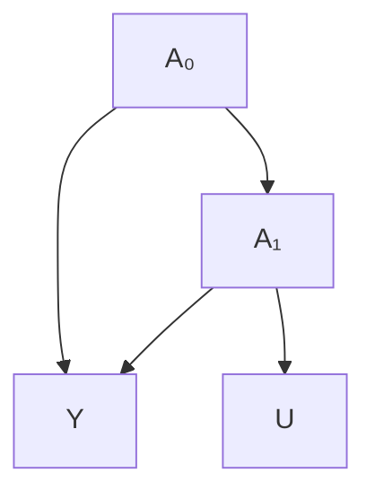
</details>


<details>
<summary>flowchart</summary>

```mermaid
graph TD
    A0["A₀"] --> A1["A₁"]
    A0 --> U["U"]
    A1 --> Y["Y"]
    A0 --> A1
    A1 --> Y
```
</details>


<details>
<summary>flowchart</summary>

```mermaid
graph TD
    A0["A₀"] --> L1["L₁"]
    L1 --> A1["A₁"]
    A1 --> L2["L₂"]
    L2 --> Y["Y"]
    Y --> A0
    Y --> L2
    U["U"] --> A1
```
</details>

Fig. 13.17 All variables except U are observed. (a) The total causal effect of $A_{0}$ on Y is identified but the joint causal effect of $A_{0}$ and $A_{1}$ on Y is not. (b) The total causal effect of $A_{0}$ on Y is not identified but the joint causal effect of $A_{0}$ and $A_{1}$ on Y is identified. (c) The joint causal effect of $A_{0}$ and $A_{1}$ on Y is identified by the do-calculus even though the sequential backdoor criterion fails

From this distribution, one can compute all desired causal effects simply by setting the $a_{t}$ to the desired values. Equation (13.7) is known as the g-formula in biostatistics (Robins 1986).

Unfortunately, the nonparametric estimator of Eq. (13.7) is often not practicable if there are many covariates or many treatment periods, or if the sample is small. As in Eq. (13.5), the analyst may be forced to insert parametric assumptions into the terms of the nonparametric estimator. Once more, things can go wrong at this stage. For example, conventional single-equation regression models, such as $Y = \alpha + \beta_0 A_0 + \beta_1 A_1 + \gamma_0 L_0 + \gamma_1 L_1 + e_Y$ , often fail to provide unbiased estimates for the nonparametrically identified joint causal effects, especially if there are time-varying confounders, such as $L_1$ in Fig. 13.16. DAGs readily communicate the heart of the problem. Consider how one should handle $L_1$ in the analysis. On one hand, $L_1$ is a confounder of $A_1$ , $A_1 \leftarrow L_1 \rightarrow Y$ and thus must be conditioned on. On the other hand, $L_1$ lies on a proper causal path from $A_0$ to $Y$ , $A_0 \rightarrow L_1 \rightarrow Y$ , such that conditioning on it would induce overcontrol bias. What is more, $L_1$ is also a collider on the noncausal path $A_0 \rightarrow L_1 \leftarrow U \rightarrow Y$ , such that conditioning on it would open the noncausal path and induce endogenous selection bias. It is thus both necessary and forbidden to condition on $L_1$ . In a conventional single-equation regression model, simultaneously conditioning and not conditioning on $L_1$ is impossible. Hence, conventional regression models may be biased for the joint causal effect of time-varying treatments even if the joint causal effect is in fact nonparametrically identified by the sequential backdoor criterion (Robins 1999).

For situations where (1) the joint causal effect is identified, (2) the nonparametric estimator is not practicable, and (3) the conventional regression methods fail, Robins and others have developed several more flexible parametric and semi-parametric estimators, such as structural nested models (Robins 1997) and marginal structural models with inverse probability of treatment weighting (Robins 1999). See Robins and Hernán (2009) for a comprehensive review. See Wodtke et al. (2011) for a sociological application to the joint effects of time-varying neighborhood conditions on education. See Sharkey and Elwert (2011) for an example of a formal sensitivity analysis for model violations (Robins 1999; Brumback et al. 2004).

A few further remarks on the sequential backdoor criterion can be helpful in practice. First, it is sometimes possible to assess the identification of the sequential backdoor criterion at a glance. Note, for example, that the sequential backdoor criterion is certainly met if there are no arrows from unobserved variables on the causal DAG into any unit treatment, as in Fig. 13.16. Such DAGs represent sequentially randomized experiments or observational studies in which all parents of all unit treatments are observed. Second, note that it may be possible to identify a joint causal effect even if the total causal effects of some unit treatments are not identified and vice versa. For example, in Fig. 13.17a, the total causal effect of $A_0$ on $Y$ is identified even though the joint causal effect of $A_0$ and $A_1$ is not identified; and in Fig. 13.17b, the joint causal effect of $A_0$ and $A_1$ is identified even though the total causal effect of $A_0$ on $Y$ is not identified. Finally, it is important to keep in mind that the sequential backdoor criterion is sufficient but not necessary for the identification of joint causal effects. For example, the joint causal effect of $A_0$ and $A_1$ on $Y$ in Fig. 13.17c is not identified by the sequential backdoor criterion, but it is identifiable by the do-calculus.

## Conclusion

The literature on DAGs is growing fast, both at the technical frontier and with respect to empirical applications. A central advantage of graphical causal models lies in combining rigor with transparency. DAGs enable applied researchers without years of mathematical training to assimilate and apply many previously inaccessible results. In part, practitioners seem to value DAGs as translation tools. Much as the ignorability criterion of the potential outcomes framework once helped methodologists make sense of regression-type approaches, so have the adjustment and backdoor criteria of the graphical framework helped analysts see ignorability in a new light (Pearl 2009: 341–43). Graphical approaches to causal inference are also drivers of methodological progress themselves. For example, Pearl's (1995) do-calculus gives nonparametric identification rules that are not only more general than ignorability but provably complete for the causal effects of interventions (Shpitser and Pearl 2006).

This chapter has introduced the central principles of working with DAGs and illustrated these principles with a number of methodological and substantive topics relevant for applied social science. Chief among the general principles are identification and model testing. DAGs, as visual representations of qualitative causal assumptions, encode the causal model needed for nonparametric identification analysis. Via d-separation, DAGs inform the analyst of all nonparametrically testable implications of their causal model. Using some sufficient graphical identification criteria (especially the adjustment criterion), this chapter then discussed several conceptual and applied topics in social research, including the causal nature of confounding and endogenous selection bias and the central identification problems of causal mediation and network analysis. Moving beyond simple covariate adjustment for single, fixed-time treatments, this chapter also showed how DAGs inform the nonparametric identification of joint causal effects from multiple, time-varying treatments.

One obvious challenge of working with DAGs is that the true causal DAG is often not known. This is a problem because identification always hinges on the validity of the causal model. If the DAG is incorrect, the identification conclusions drawn from it may be incorrect as well. It would be misguided, however, to blame DAGs for what ultimately are limitations of substantive scientific knowledge. The identification of causal effects requires causal assumptions regardless of how these assumptions are notated. DAGs seem to be especially well suited to draw attention to incomplete or implausible causal assumptions. This is a good thing. Assumptions do not disappear simply because they are hidden in a thicket of notation, and they cannot be corrected unless they are noticed and understood (Pearl 2009). One hopes that transparency might spur scientific progress.

A related problem is that the common-cause-inclusion requirement of causal DAGs quickly leads to unmanageably large DAGs in nonexperimental settings. Taking the shortcut of placing bi-headed arrows on pairs of variables that one suspects of being confounded usually leads to the disappearance of exclusion restrictions and hence to the realization that hardly any causal effect appears identifiable. This too, however, can hardly be blamed on the graphical framework per se, which merely reveals that poor theory (or strong theory coupled with poor data) rarely supports the identification of causal effects in observational studies.

Nevertheless, even unrealistically sparse DAGs can serve an important purpose in highlighting problems inherent in larger, more realistic DAGs built around them. For example, we do not need comprehensive theories of fertility, economic decision making in firms and families, and macroeconomic business cycles to understand why restricting the sample to employed women may bias estimates of the motherhood wage penalty. A simple DAG like that in Fig. 13.13 does the trick.

The frontier of technical research on DAGs today has moved on to topics beyond the scope of this chapter. Considerable work is being done on topics applied (e.g., the identification of various types of direct and indirect causal effects (Robins and Richardson 2011)), foundational (e.g., graphs for counterfactual variables (Shpitser and Pearl 2007)), and as yet arcane (e.g., auxiliary variable

identification (Chan and Kuroki 2010)). The foundational insights covered in this chapter, however, such as d-separation and the nonparametric identification of causal effects of interventions, are settled and have established a firm place in applied research.

Acknowledgments I thank Stephen Morgan, Judea Pearl, Tyler VanderWeele, Xiaolu Wang, Christopher Winship, and my students in Soc 952 at the University of Wisconsin for discussions and advice. Janet Clear and Laurie Silverberg provided editorial assistance. All errors are mine.

## References

Baron, R. M., & Kenny, D. A. (1986). The moderator-mediator variable distinction in social psychological research: Conceptual, strategic, and statistical considerations. Journal of Personality and Social Psychology, 51, 1173-1182.   
Berkson, J. (1946). Limitations of the application of fourfold table analysis to hospital data. Biometrics Bulletin, 2(3), 47–53.   
Blalock, H. M. (1964). Causal inferences in nonexperimental research. Chapel Hill: University of North Carolina Press.   
Brito, C., & Pearl, J. (2002). Generalized instrumental variables. In A. Darwiche & N. Friedman (Eds.), Uncertainty in artificial intelligence, proceedings of the eighteenth conference(pp. 85–93). San Francisco: Morgan Kaufmann.   
Brumback, B. A., Hernán, M. A., Haneuse, S. J. P. A., & Robins, J. M. (2004). Sensitivity analyses for unmeasured confounding assuming a marginal structural model for repeated measures. Statistics in Medicine, 23, 749–767.   
Burns, B. D., & Wieth, M. (2004). The collider principle in causal reasoning: Why the Monty Hall Dilemma is so hard. Journal of Experimental Psychology: General, 133(3), 434–449.   
Chan, H., & Kuroki, M. (2010). Using descendants as instrumental variables for the identification of direct causal effects in linear SEMs. In Proceedings of the thirteenth international conference on Artificial Intelligence and Statistics (AISTATS-10) (pp. 73–80), Sardinia, Italy.   
Cole, S. R., & Hernán, M. A. (2002). Fallibility in estimating direct effects (with discussion). International Journal of Epidemiology, 31, 163–165.   
Duncan, O. D. (1975). Introduction to structural equation models. New York: Academic.   
Elwert, F., & Christakis, N. A. (2006). Widowhood and race. American Sociological Review, 71(1), 16–41.   
Elwert, F., & Christakis, N. A. (2008). Wives and ex-wives: A new test for homogamy bias in the widowhood effect. Demography, 45(4), 851–873.   
Elwert, F., & Winship, C. (2010). Effect heterogeneity and bias in main-effects-only regression models. In R. Dechter, H. Geffner, & J. Y. Halpern (Eds.), Heuristics, probability and causality: A tribute to Judea Pearl (pp. 327–336). London: College Publications.   
Elwert, F., & Winship, C. (forthcoming). Endogenous selection bias the dangers of conditioning on collider variables. Annual Review of Sociology.   
Farr, W. (1858). Influence of marriage on the mortality of the French people. In G. W. Hastings (Ed.), Transactions of the national association for the promotion of social science (pp. 504–513). London: John W. Park & Son.   
Finn, J. D., & Achilles, C. M. (1990). Answers and questions about class size. American Educational Research Journal, 27(3), 557–577.   
Finn, J. D., Gerber, S. B., & Boyd-Zaharias, J. (2005). Small classes in the early grades, academic achievement, and graduating from high school. Journal of Educational Psychology, 97(2), 214–223.   
Fowler, J. H., & Christakis, N. A. (2010). Cooperative behavior cascades in human social networks. PNAS: Proceedings of the National Academy of Sciences, 107(12), 5334–5338.   
Galles, D., & Pearl, J. (1998). An axiomatic characterization of causal counterfactuals. Foundations of Science, 3(1), 151-182.   
Glymour, M. M., & Greenland, S. (2008). Causal diagrams. In K. J. Rothman, S. Greenland, & T. Lash (Eds.), Modern epidemiology (3rd ed., pp. 183–209). Philadelphia: Lippincott.   
Greenland, S. (2003). Quantifying biases in causal models: Classical confounding versus collider-stratification bias. Epidemiology, 14, 300–306.   
Greenland, S. (2010). Overthrowing the tyranny of null hypotheses hidden in causal diagrams. In R. Dechter, H. Geffner, & J. Y. Halpern (Eds.), Heuristics, probability and causality: A tribute to Judea Pearl (pp. 365–382). London: College Publications.   
Greenland, S., & Robins, J. M. (1986). Identifiability, exchangeability and epidemiological confounding. International Journal of Epidemiology, 15, 413–419.   
Greenland, S., Pearl, J., & Robins, J. M. (1999a). Causal diagrams for epidemiologic research. Epidemiology, 10, 37–48.

Greenland, S., Robins, J. M., & Pearl, J. (1999b). Confounding and collapsibility in causal inference. Statistical Science, 14, 29–46.   
Gronau, R. (1974). Wage comparisons-a selectivity bias. Journal of Political Economy, 82, 1119–1144.   
Heckman, J. J. (1974). Shadow prices, market wages and labor supply. Econometrica, 42(4), 679–694.   
Heckman, J. J. (1976). The common structure of statistical models of truncation, sample selection, and limited dependent variables and a simple estimator for such models. Annals of Economic and Social Measurement, 5, 475–492.   
Hernán, M. A., Hernández-Diaz, S., Werler, M. M., Robins, J. M., & Mitchell, A. A. (2002). Causal knowledge as a prerequisite of confounding evaluation: An application to birth defects epidemiology. American Journal of Epidemiology, 155(2), 176–184.   
Hernán, M. A., Hernández-Diaz, S., & Robins, J. M. (2004). A structural approach to section bias. Epidemiology, 155(2), 174–184.   
Hernán, M. A., Clayton, D., & Keiding, N. (2011). The Simpson's paradox unraveled. International Journal of Epidemiology, 40, 780–785.   
Holland, P. W. (1986). Statistics and causal inference (with discussion). Journal of the American Statistical Association, 81, 945–970.   
Holland, P. W. (1988). Causal inference, path analysis, and recursive structural equation models. Sociological Methodology, 18, 449–484.   
Kim, J.H., & Pearl, J. (1983). A computational model for combined causal and diagnostic reasoning in inference systems. In Proceedings of the 8th International Joint Conference on Artificial Intelligence (pp. 190–193). Karlsruhe.   
Kyono, T. (2010). Commentator: A front-end user-interface module for graphical and structural equation modeling (Tech. Rep. (R-364)). UCLA Cognitive Systems Laboratory.   
Morgan, S. L., & Winship, C. (2007). Counterfactuals and causal inference: Methods and principles for social research. Cambridge: Cambridge University Press.   
Morgan, S. L., & Winship, C. (2012). Bringing context and variability back in to causal analysis. In H. Kincaid (Ed.), Oxford handbook of the philosophy of the social sciences. New York: Oxford University Press.   
Neyman, J. ([1923] 1990). On the application of probability theory to agricultural experiments. Essay on principles, section 9, translated (with discussion). Statistical Science, 5(4), 465–480.   
O'Malley, A. J., Elwert, F., Rosenquist, J. N., Zaslavsky, A. M., & Christakis, N. A. (2012). Estimating peer effects in longitudinal dyadic data using instrumental variables (Working Paper). Department of Health Care Policy, Harvard Medical School.   
Pearl, J. (1985). Bayesian networks: A model of self-activated memory for evidential reasoning. In Proceedings, Cognitive Science Society (pp. 329–334). Irvine: University of California.   
Pearl, J. (1988). Probabilistic reasoning in intelligent systems. San Mateo: Morgan Kaufman.   
Pearl, J. (1993). Comment: Graphical models, causality, and interventions. Statistical Science, 8(3), 266–269.   
Pearl, J. (1995). Causal diagrams for empirical research. Biometrika, 82(4), 669–710.   
Pearl, J. (1998). Graphs, causality, and structural equation models. Sociological Methods and Research, 27(2), 226–284.   
Pearl, J. (2001). Direct and indirect effects. In Proceedings of the seventeenth conference on Uncertainty in Artificial Intelligence (pp. 411–420). San Francisco: Morgan Kaufmann.   
Pearl, J. ([2000] 2009). Causality: Models, reasoning, and inference (2nd ed.). Cambridge: Cambridge University Press.   
Pearl, J. (2010). The foundations of causal inference. Sociological Methodology, 40, 75–149.   
Pearl, J. (2012a). The causal foundations of structural equation modeling. In R. H. Hoyle (Ed.), Handbook of structural equation modeling (pp. 68–91). New York: Guilford Press.   
Pearl, J. (2012b). Interpretable conditions for identifying direct and indirect effects (Tech. Rep. (R-389)). UCLA Cognitive Systems Laboratory.   
Pearl, J., & Robins, J. M. (1995). Probabilistic evaluation of sequential plans from causal models with hidden variables. In P. Besnard & S. Hanks (Eds.), Uncertainty in artificial intelligence 11 (pp. 444–453). San Francisco: Morgan Kaufmann.   
Robins, J. M. (1986). A new approach to causal inference in mortality studies with a sustained exposure period: Application to the health worker survivor effect. Mathematical Modeling, 7, 1393–1512.   
Robins, J. M. (1989). The control of confounding by intermediate variables. Statistics in Medicine, 8, 679–701.   
Robins, J. M. (1997). Causal inference from complex longitudinal data. In M. Berkane (Ed.), Latent variable modeling and applications to causality (Lecture notes in statistics 120, pp. 69–117). New York: Springer.   
Robins, J. M. (1999). Association, causation, and marginal structural models. Synthese, 121, 151–179.   
Robins, J. M. (2001). Data, design, and background knowledge in etiologic inference. Epidemiology, 23(3), 313–320.   
Robins, J. M., & Greenland, S. (1992). Identifiability and exchangeability for direct and indirect effects. Epidemiology, 3, 143–155.   
Robins, J. M., & Hernán, M. A. (2009). Estimation of the causal effects of time-varying exposures. In G. Fitzmaurice et al. (Eds.), Handbooks of modern statistical methods: Longitudinal data analysis (pp. 553–599). Boca Raton: CRC Press.

Robins, J. M., & Richardson, T. (2011). Alternative graphical causal models and the identification of direct effects. In P. Shrout, K. Keyes, & K. Ornstein (Eds.), Causality and psychopathology: Finding the determinants of disorders and their cures (pp. 103–158). New York: Oxford University Press.   
Robins, J. M., & Wasserman, L. (1999). On the impossibility of inferring causation from association without background knowledge. In C. N. Glymour & G. G. Cooper (Eds.), Computation, causation, and discovery (pp. 305–321). Cambridge: AAAI/MIT Press.   
Rosenbaum, P. R. (1984). The consequences of adjustment for a concomitant variable that has been affected by the treatment. Journal of the Royal Statistical Society, Series A, 147(5), 656–666.   
Rosenbaum, P. R., & Rubin, D. B. (1983). The central role of the propensity score in observational studies for causal effects. Biometrika, 70(1), 41-55.   
Rubin, D. B. (1974). Estimating causal effects of treatments in randomized and non-randomized studies. Journal of Educational Psychology, 66, 688–701.   
Rubin, D. B. (1980). Comment on ‘randomization analysis of experimental data in the fisher randomization test’ by Basu. Journal of the American Statistical Association, 75, 591–593.   
Shalizi, C. R., & Thomas, A. C. (2011). Homophily and contagion are generically confounded in observational social network studies. Sociological Methods and Research, 40, 211–239.   
Sharkey, P., & Elwert, F. (2011). The legacy of disadvantage: Multigenerational neighborhood effects on cognitive ability. The American Journal of Sociology, 116(6), 1934–1981.   
Shpitser, I., & Pearl, J. (2006). Identification of conditional interventional distributions. In R. Dechter & T. S. Richardson (Eds.), Proceedings of the twenty-first national conference on Artificial Intelligence (pp. 437–444). Menlo Park: AAAI Press.   
Shpitser, I., & Pearl, J. (2007). What counterfactuals can be tested. In Proceedings of the twenty-third conference on Uncertainty in Artificial Intelligence (UAI-07) (pp. 352–359). Corvallis: AUAI Press.   
Shpitser, I., VanderWeele, T. J., & Robins, J. M. (2010). On the validity of covariate adjustment for estimating causal effects. In Proceedings of the 26th conference on Uncertainty and Artificial Intelligence (pp. 527–536). Corvallis: AUAI Press.   
Shrier, I. (2009). Letter to the editor. Statistics in Medicine, 27, 2740–2741.   
Sjölander, A. (2009). Letter to the editor: Propensity scores and M-structures. Statistics in Medicine, 28, 1416–1423.   
Smith, H. L. (1990). Specification problems in experimental and nonexperimental social research. Sociological Methodology, 20, 59–91.   
Sobel, M. E. (2008). Identification of causal parameters in randomized studies with mediating variables. Journal of Educational and Behavioral Statistics, 33(2), 230–251.   
Spirtes, P., Glymour, C. N., & Schein, R. ([1993] 2001). Causation, prediction, and search (2nd ed.). Cambridge, MA: MIT Press.   
Textor, J., Hardt, J., & Knüppel, S. (2011). Letter to the editor: DAGitty: A graphical tool for analyzing causal diagrams. Epidemiology, 22(5), 745.   
VanderWeele, T. J. (2009). On the distinction between interaction and effect modification. Epidemiology, 20, 863–871.   
VanderWeele, T. J. (2011). Sensitivity analysis for contagion effects in social networks. Sociological Methods and Research, 40, 240–255.   
VanderWeele, T. J., & Robins, J. M. (2007). Four types of effect modification: A classification based on directed acyclic graphs. Epidemiology, 18(5), 561–568.   
VanderWeele, T. J., & Robins, J. M. (2009). Minimal sufficient causation and directed acyclic graphs. The Annals of Statistics, 37, 1437-1465.   
VanderWeele, T. J., & Shpitser, I. (2011). A new criterion for confounder selection. Biometrics, 67, 1406–1413.   
Verma, T., & Pearl, J. (1988). Causal networks: Semantics and expressiveness. In Proceedings of the fourth workshop on Uncertainty in Artificial Intelligence (pp. 352–359). Minneapolis/Mountain View: AUAI Press.   
Winship, C., & Harding, D. J. (2008). A mechanism-based approach to the identification of age-period-cohort models. Sociological Methods and Research, 36(3), 362–401.   
Wodtke, G. T., Harding, D. J., & Elwert, F. (2011). Neighborhood effects in temporal perspective: The impact of long-term exposure to concentrated disadvantage on high school graduation. American Sociological Review, 76, 713–736.   
Wooldridge, J. (2005). Violating ignorability of treatment by controlling for too many factors. Econometric Theory, 21, 1026–1028.   
Wooldridge, J. (2006). Acknowledgement of related prior work. Econometric Theory, 22, 1177–1178.

# Chapter 14 The Causal Implications of Mechanistic Thinking: Identification Using Directed Acyclic Graphs (DAGs)

Carly R. Knight and Christopher Winship

Abstract In analyzing causal claims, the most common evidentiary strategy is to use an experimental or quasi-experimental framework; holding all else constant, a treatment is varied and its effect on the outcome is determined. However, a second, quite distinct strategy is gaining prominence within the social sciences. Rather than mimic an experiment, researchers can identify causal relations by finding evidence for mechanisms that link cause and effect. In this chapter, we use Directed Acyclic Graphs (DAGs) to illustrate the power of using mechanisms. We show how mechanisms can aid in causal analysis by bringing additional variation to bear in instances where causal effects would otherwise not be identified. Specifically, we examine five generic situations where a focus on mechanisms using DAGs allows an analyst to warrant causal claims.

## Introduction

Much of social science is concerned with providing convincing evidence for causal claims. Typically, researchers are interested in identifying the effect of a cause, sometimes referred to as the treatment, on an outcome. There are two basic evidentiary strategies for supporting causal claims. One approach is to carry out an experiment where the researcher controls the treatment, holding all other factors constant. A closely related alternative is to mimic the experiment by attempting to hold other explanatory variables constant through stratification, matching, or regression. This general approach has dominated the social sciences for decades.

However, a second, quite distinct strategy is gaining prominence. Rather than mimic an experiment, researchers identify causal relations by positing and finding evidence for mechanisms that link cause and effect. Often, this is done by specifying one or more mediating variables and by demonstrating first, that they have been affected by the treatment and second, that they have affected the outcome. Empirical methods utilizing this strategy span both quantitative and qualitative approaches and include mediation analysis as well as process tracing (George and Bennett 2005; Bennett 2008; Collier et al. 2010).

Recent trends in sociological analysis have opened the doors for increased usage of this second approach. Over the past decade, researchers have focused on causal mechanisms as an important aspect of sociological inquiry. While the term some have used to describe this resurgence—a “mechanistic revolution”—may be a bit of an exaggeration, it is clear that increasingly researchers regard the elaboration of causal relations as necessary for adequate explanation.

In this chapter, we wish to demonstrate not only the theoretical benefits of using mechanistic analysis but also its ability to provide empirical support for causal claims. With respect to the later goal, we show how Pearl's DAG calculus (Pearl 2000, 2009), in particular his Front Door Criterion, can provide a rigorous method for determining when an analysis of mechanisms provides support for a particular causal claim.

In Part II, we provide a historical overview of mechanism-focused scholarship, going back to Weber, Marx, and Durkheim, and then moving forward through Kendall, Lazarfeld, and Merton to current discussions by Swedberg, Hedstrom, and Bearman among others.

In Part III, we examine the question of what, precisely, a mechanism is. A particular challenge is that there is no definitional consensus on the nature of mechanisms. To remedy this, we address two questions that we argue are fundamental for a rigorous definition of causal mechanisms: (1) what is meant by claiming that a process is causal? (2) what does it mean for a causal process to have structure? We then examine the relevant literature and discuss our preferred solutions: (1) causality in terms of counterfactual dependence or potential outcome analysis; (2) structure as presented by a causal graph or more specifically, a directed acyclic graph (DAG).

In Part IV, we provide the reader with tools to represent and test assumptions about causal mechanistic pathways using graphical analysis. Specifically, we provide a brief introduction to Pearl's DAG calculus and review different strategies of identification.

Finally, in Part V, we bring the conceptual structure from Part III and the analytic tools from Part IV to bear on a hypothetical example. In a situation within a single organization in which women with children have lower wages than women without children, we investigate whether this difference might be due to discrimination or differences in effort. Using DAGs and focusing on mechanisms, we examine five issues: (1) using the Front Door Criterion to identify a causal effect, (2) inference in the presence of unobserved intervening variables, (3) expanding a DAG to achieve identification, (4) where to focus analysis in a causal chain, and (5) inference when there is insufficient variability. From these analyses, we find that focusing on intervening variables in the early part of a causal chain is especially useful in identification; such variables can not only potentially be used in a Front Door analysis but additionally as instrumental variables for subsequent intervening variables. Second, we find that it is possible to use mechanisms to deal with situations in which there is insufficient variation in one's independent variables as a result of perfect dependence.

Our goal is to demonstrate the power of DAGs in analyzing causal mechanisms. Our presentation is minimally technical and instead focuses on the conceptual insights mechanistic analysis can provide. In doing so, our intention is to demonstrate how mechanism-oriented analysis can contribute to the assessment of the strength of causal claims.

## Mechanisms and Social Science

Social science, like any science, seeks to provide understanding about its object of inquiry. Consequently, it is easy to see the appeal of examining mechanisms. By providing a greater level of detail about the production of a given phenomenon, mechanisms seem to get at the heart of what it means to provide understanding. Indeed, some philosophers of science have gone so far as to equate explanation itself with the identification of causal mechanisms (Salmon 1984). Drawing

upon the biological sciences, Machamer, Darden, and Craver likewise argue that progress in scientific explanation has always been closely intertwined with the discovery of mechanisms (2000).

The explanatory appeal of mechanisms certainly has its place in sociological inquiry. Although recently there has been a notable rise in the popularity of mechanistic explanation, sociological analysis, including the classics, has been thoroughly entrenched in the explication of mechanisms. Revisiting Max Weber, Karl Marx, and Emile Durkheim underscores this point: long before causal mechanisms became the subject of recent scholarship, they were employed to elaborate causal processes behind large-scale social phenomenon. For example, in the Protestant Ethic and the Spirit of Capitalism, Weber employs cultural and behavioral mechanisms: he argues that Protestantism laid the groundwork for the spirit of modern capitalism by describing how the cultivation of a certain work ethic and the behaviors it induced were conducive to capital accumulation (Swedberg 2000). Marx's treatment of historical materialism links the economic base and the ideological superstructure through a series of intended and unintended behavioral mechanisms (Little 1986). Durkheim's Elementary Forms of Religious Life stipulates collective assembly as a causal mechanism whereby rituals by way of collective effervescence generate solidarity.

While the theories above were not explicitly labeled as causal mechanisms, they are clearly claims about the nature of the causal chains leading from one social phenomenon to another. Indeed, they are undoubtedly crucial to the success of their overall endeavor: it would seem absurd to claim that a mere statistical association between Protestantism and capitalism would count as a satisfactory explanation of the cultural conditions under which market capitalism flourishes. Even had it been possible to definitively identify a causal effect, one might safely speculate that the Protestant Ethic and the Spirit of Capitalism achieved its renowned status due to its careful analysis of the crucial mechanism of work ethic. It was the greater detail about the productive relationship between religion and behavior that provided theoretical insight.

More modern sociological inquiry has likewise been steeped in mechanistic explanation. Kendall and Lazarfeld (1950) were proponents of what they called M-elaboration of the causal effect between a treatment T and a cause Y. Their concern was that explanation or interpretation of a given relationship could best be achieved through identification of the “links” between cause and effect. In Lazarfeld’s footsteps, empirical social scientists throughout the 1960s and 1970s focused their analytic goal on the search for mediating variables (e.g., Duncan et al. 1972).

While, historically, sociological inquiry may have been quite intertwined with mechanistic explanation, mechanisms' recent rise in popularity can, at least in part, be attributed to the weaknesses of other methods of explanation (Gerring 2010). For example, Merton argues for causal mechanisms on the basis that they constitute a satisfying middle ground between Hempelian social laws, of which there are decidedly few, and mere description. More recently, Hedstrom and Swedberg's volume Social Mechanisms (1996) appealed to the identification of causal mechanisms as an antidote to a sociology that, they argued, had an unfortunate “tendency to label, relabel, and describe, rather than to explain” (p. 1). Elster (2007) has long argued that statistical associations fail to constitute proper explanation, which should instead specify the social “cogs and wheels” that bring any phenomenon into existence. When analyzed vis-à-vis statistical inference, causal mechanisms held the promise of providing “something more”—opening up the black box of correlational analysis and providing social mechanisms as theoretical building blocks rather than simply amassing disjointed facts. As a result of this recent resurgence of interest, causal mechanisms are now more self-consciously part of the sociologist’s tool kit than ever before (Gerring 2007).

However, sociologists who focus on mechanisms do not just wish to remedy the inadequacies of other forms of explanation; they have also mounted a strong positive case for the contribution that the identification of mechanisms can make to sociological theory. Not only can an analysis of mechanisms provide greater elucidation about the production of social phenomena, they can furnish key information regarding potential avenues for policy intervention, a benefit that statistical or descriptive analyses often lack. Barbara Reskin (2003) explicitly made this case in her presidential

address to the American Sociological Association when she noted that, despite the wealth of research documenting ascriptive inequalities, surprisingly little is known about how variation in outcomes are produced. Knowing that a given inequality exists provides little information for those seeking to remedy it. Knowing the process that generates inequality, however, indicates possible points for policy intervention. According to Reskin, through mechanisms, “we stand to gain not only better research and better theory; we stand to gain the opportunity to meaningfully contribute to social policy” (p. 17).

## What Exactly Is a Causal Mechanism?

Despite agreement as to the utility of mechanisms for explanation, consensus around a precise definition of what a mechanism actually constitutes remains elusive. After all, what does it mean to call for a mechanistic approach to explanation, as opposed to some other approach? What, specifically, should we be searching for? To answer this question, we review some of the more influential approaches to defining causal mechanisms.

## Alternative Accounts

Attempting to provide clarity to the question of what constitutes a mechanism, social scientists and others have produced a multitude of accounts. The more influential among these were collected by Hedstrom and Ylikoski (2010) and are reproduced in Table 14.1.

To provide coherence to this literature, Hedstrom and Ylikoski (2010), Gross (2009), and others have attempted to distill what is common among these various definitions into a cohesive account. Hedstrom and Ylikoski (2010), for example, conclude that mechanisms consist of the following characteristics: (a) mechanisms are identified by the effect they produce; (b) mechanisms are causal; (c) mechanisms have a structure; and (d) mechanisms form a hierarchy. Similarly, Hedstrom and Bearman (2009) have utilized Machamer, Darden, and Craver's definition to conclude that mechanisms are “entities and activities organized such that they produce regular changes from start to finish (5).” These accounts largely boil down the fact that mechanisms should be thought of as causal and having some form of structure.

To our mind, these characterizations provide an unobjectionable foundation for an account of causal mechanisms. However, they remain unsatisfactorily vague. If mechanisms are to be thought of as an organized set of entities that form a structure and produce change, then an answer to “what constitutes a causal mechanism” must address the following two points:

1. Causality question: What does it mean for a mechanism to be causal or productive?   
2. Structure question: In what sense does a mechanism have a structure?

## The Problem of Causality

The supposition that mechanisms are “irreducibly causal notions” runs through all plausible definitions like a red thread. However, while many definitions are not inconsistent with a specific theory of causation, most do not provide an explicit account of what constitutes causal explanation. This is a

Table 14.1 Definitions of mechanisms 

<table><tr><td>Author</td><td>Definition</td><td>References</td></tr><tr><td>Bechtel and Abrahamsen</td><td>A mechanism is a structure performing a function by virtue of its component parts and component operations and their organization. The orchestrated functioning of the mechanism is responsible for one or more phenomena</td><td>Bechtel and Abrahamsen (2005) and Bechtel (2006, 2008)</td></tr><tr><td>Bunge</td><td>A mechanism is a process in a concrete system that is capable of bringing about or preventing some change in the system</td><td>Bunge (1997, 2004)</td></tr><tr><td>Glennan</td><td>A mechanism for a behavior is a complex system that produces that behavior by the interaction of several parts, where the interactions between parts can be characterized by direct, invariant, change-relating generalizations</td><td>Glennan (2002)</td></tr><tr><td>Machamer, Darden, and Craver</td><td>Mechanisms are entities and activities organized such that they produce regular changes from start to finish</td><td>Machamer et al. (2000), Darden (2006), and Craver (2007)</td></tr><tr><td>Elster I</td><td>A mechanism explains by opening up the black box and showing the cogs and wheels of the internal machinery. A mechanism provides a continuous and contiguous chain of causal or intentional links between the explanans and the explanandum</td><td>Elster (1989)</td></tr><tr><td>Elster II</td><td>Mechanisms are frequently occurring and easily recognizable causal patterns that are triggered under generally unknown conditions</td><td>Elster (1999)</td></tr><tr><td>Hedstrom</td><td>Mechanisms consist of entities (with their properties) and the activities that these entities engage in, either by themselves or in concert with other entities. These activities bring about change, and the type of change brought about depends on the properties of the entities and how the entities are organized spatially and temporally</td><td>Hedström (2005)</td></tr><tr><td>Little</td><td>A causal mechanism is a series of events governed by law-like regularities that lead from the explanans to the explanandum</td><td>Little (1991)</td></tr><tr><td>Woodward</td><td>A model of a mechanism (a) describes an organized or structured set of parts or components, where (b) the behavior of each component is described by a generalization that is invariant under interventions, where (c) the generalizations governing each component are also independently changeable, and where (d) the representation allows us to see how, by virtue of (a), (b), and (c), the overall output of the mechanism will vary under manipulation of the input to each component and changes in the components themselves</td><td>Woodward (2002)</td></tr></table>

problem in that a theory of causality should provide guidelines for empirical researchers to adjudicate between which elements of a given path are essential for causal explanation. As others have noted, for a given causal process, we do not necessarily want an account that includes all details of the process, but rather one that captures only the crucial, causal elements while leaving others out (Ylikoski 2011).

## General Definitions

Various scholars have sought to define causality with respect to mechanisms in a variety of ways. Among the more recent formulations is Hedstrom and Bearman's account (2009) in Oxford Handbook of Analytic Sociology that follows a definition given by Machamer, Darden, and Craver (MDC) (2000). Hedstrom and Bearman define mechanisms as:

A constellation of entities and activities that are organized such that they regularly bring about a particular type of outcome, and we explain an observed outcome by referring to the mechanism by which such outcomes are regularly brought about. (5, emphasis added)

While this is a start, it is not made entirely clear what to “regularly bring about” entails. Woodward (2002) describes the problems with MDC’s account in detail. To summarize his account, by defining mechanisms as the productive, “regular processes” that connect T and Y, we risk the same potential pitfalls as Humean regularity accounts of causality that sought regular statistical associations as a sufficient basis for explanation. The familiar example typically used to illustrate problems with the regularity account is that although there is a regular relationship between a barometer reading and a storm, the barometer reading certainly should not be thought to cause the storm.

What are the risks of social scientists using the above definition? One concern is the possibility of falsely identifying noncausal processes as causal mechanisms. For example, a social equivalent to the barometer/storm example might be a dictatorial regime that has regular elections that consistently elect a certain despot. We certainly would not want to say that this process is the causal mechanism by which the leader obtains power!

The reverse concern is equally worrying: that we mistakenly identify truly causal mechanisms as noncausal processes, simply because they are not regular. For example, welfare states might typically be brought about by social democratic parties (this is certainly the case for many European states). However, we would not want to call the processes that gave rise to US welfare state noncausal simply because they are idiosyncratic. Indeed, any causal process based upon luck or contingency is difficult to reconcile with a regularity account.

## Counterfactual Causality

In this chapter, we argue that an account of causation as counterfactual dependence provides a helpful and plausible framework. While we are hardly the first to make this claim (e.g., see Morgan and Winship 2007; Imai et al. 2011; Ylikoski 2011), the overwhelming majority of definitions of causal mechanisms have yet to take up a clear position on what constitutes a causal relationship. Moreover, by beginning with the counterfactual criterion for dependence as a key component of an account of causal mechanisms, we allow ourselves to provide an in-depth discussion of the empirical tools that can be used to identify causal mechanisms. Thus conceived, a theoretical account of causal mechanisms and an empirical strategy for their identification can be united.

The counterfactual criterion provides a framework for thinking about what it means for one thing to cause another. Simply stated, the counterfactual approach stipulates that treatment T can be considered a cause of outcome Y if it is the case that by changing (manipulating) T, we can change Y. In other words, were we to perform a “surgical intervention” on T (i.e., changing T without changing any other background conditions); any change in Y would only be the result of its causal connection to T (also see Pearl 2000, 2009; Woodward 2005).

Formally, causal inference through counterfactuals is typically represented by specifying potential outcomes associated with each unit across various stratifications of the treatment variable of interest. $^{1}$

For example, if we were concerned with the effect of a dichotomous treatment, T, taking on the values of 0 and 1, on some outcome, $Y(T)$ , for a given individual, this person would have two potential outcomes: his outcome $Y(1)$ if he were to receive the treatment and his outcome $Y(0)$ if he did not receive the treatment, that is, he were in the control group. The causal effect of the treatment would then be the difference between that person's two potential outcomes. Formally, the causal effect of treatment would be $Y(1) - Y(0)$ . This mathematical representation formalizes the idea that a causal effect of a variable is the difference between the possible (potential) outcomes that results from the treatment variable taking on different values. $^{2}$

As Woodward (2002) shows, the counterfactual logic can easily be transferred to a discussion of causal mechanisms. Drawing on Darden (2002), Woodward sees mechanisms as consisting of known modules that are cobbled together to construct a given mechanism. These modules should be independently changeable and thus subject to intervention. That is, we should be able to imagine intervening on a mechanism and “surgically” changing it: if it were to change the outcome, this would entail that it was causally relevant in producing the outcome.

Formally, the causal effect of T on M can be represented as the difference in the potential outcomes for the two values of $T: M(1) - M(0)$ . The effect of M on Y can be represented by allowing Y to depend both on M and T. The potential outcome states of Y can then be written as $Y(M, T)$ . As has been discussed at length in the literature on mechanisms and counterfactual outcomes, the effect of M on Y may be dependent on the level of T; $Y(1, 1) - Y(0, 1)$ may or may not equal $Y(1, 0) - Y(0, 0)$ . In other words the effect of M on Y may interact with T (e.g., Sobel 2008; VanderWeele 2009). $^{3}$

Furthermore, it may or may not be the case that the effect of T on Y only occurs through M; there may be multiple mechanisms through which T affects Y. If there is only one mechanism involved, then $Y(M(T), 1) = Y(M(T), 0)$ . If this is not the case, then even holding M constant, it is possible to change Y by changing T. This can be thought about either as T having a direct effect on Y independent of M or, alternatively, as T also affecting Y through some other (potentially unspecified) mechanism(s).

This structure clarifies how entities in a causal mechanistic chain must be linked, through relations of counterfactual dependence. While it is not the only possible account, it has the benefit of being widely accepted among empirical researchers and avoids problems presented by the regularity account referenced in other definitions. $^{4}$

Furthermore, it provides a precise way of formulating the potential ways that a mechanism may intervene between a treatment and an outcome, in particular allowing for the treatment and mechanism to interact in affecting Y and for the treatment to potentially independently affect Y.

## The Problem of Structure

The other half of a definition of causal mechanisms involves structure. What does it mean to claim that the entities in a causal system should have structure? Having provided a theory of causality to link the elements in a mechanistic chain, how are those mechanistic elements arranged? When identifying

a mechanism, we want more than a simple collection of mediating elements. Rather, mechanistic structure should provide knowledge as to how social processes that link the cause and outcome are organized.

This desire for a “structure” is articulated by Hedstrom and Ylikoski, who provide a series of questions that a mechanistic structure should help elucidate:

What are the participating entities and what are their relevant properties? How are the interactions of these entities organized (both spatially and temporally)? What factors could prevent the outcome? (p. 52, emphasis added)

## Modularity

What account of “mechanistic structure” could address these questions? The basis for one potential answer comes from the notion of modularity. A modular mechanistic system is one in which the component parts of the system are potentially independent processes. It should be possible, at least in theory, to change one component of a mechanistic process while holding other parts of causal process constant. $^{5}$

Consider an example in which being female is associated with lower wages. Imagine that two modular mechanisms are involved: (1) bias in the workplace and (2) self-selection into occupations. If this causal process is modular, then in theory, we should be able to at least imagine that we could change bias in the workplace without necessitating a change in self-selection into occupations. As Woodward states:

This sort of independence of the various components allows one to trace out the consequences of possible changes in any of them for the overall behavior of the system. By contrast, if any change in (what seems to be) the generalization governing the behavior of one component automatically brings with it changes in the generalizations governing the behavior of (what we believe to be) other components, this is an indication that our proposed decomposition of the mechanism into parts or stages is incorrect. (Woodward 2002, p. 374)

Modularity assumes social processes work in a very particular way—they are separable as opposed to organic or holistic. Thus, their appropriateness will depend on the particular substantive problem that is being studied. We do not assume, nor do we think it is necessary to assume, that causality always works as discussed here.

## Causal Graphs

How might we represent a modular mechanistic structure? The idea of a causal structure is already embedded in one of the most common ways social scientists represent causal systems—causal graphs. Causal graphs consist of variables connected by arrows where an arrow represents the possible causal effect of one variable on another. Although variables are typically thought of as characteristics of individuals or other units of study, this narrow conceptualization is not necessary. Variables can simply be states of the world.

When causal graphs are acyclic (i.e., two variables are not allowed to simultaneously affect one another and causality “flows” in only one direction), they are referred to as Directed Acyclic Graphs (DAGs). DAGs are nonparametric, meaning they represent structural equations of unspecified functional form, and are generalizations of the path models used in the 1950s and 1960s that

Fig. 14.1 An example where a single causal arrow connecting A and B could represent either one or two separate mechanisms   


<details>
<summary>flowchart</summary>

```mermaid
graph TD
    A --> B
    A --> M
    M --> B
    A --> M1
    A --> M2
    M1 --> B
    M2 --> B
```
</details>

represented systems of linear equations (Pearl 2000). Causal graphs can also represent necessary and sufficient relations between variables as found in Qualitative Comparative Analysis (QCA) and process tracing analysis (VanderWeele and Robins 2007).

While typically causal graphs are thought of as consisting of a set of variables whose causal relations are represented by a set of arrows, causal graphs can also be thought of as a set of arrows that are connected by a set of variables. However, the structure of variables and arrows is not symmetrical. A variable may both affect and/or be affected by none, one, or multiple other variables via different causal pathways. Thus, causal graphs allow variables to potentially affect each other in multiple ways. In contrast, any arrow in a causal graph is connected to only one variable that is the “cause” and another variable that is the “outcome.” In this sense, it is the causal arrows that are separable, independent parts of a causal graph.

In analyzing the causal effect of a variable A on B, we can always ask what the mediating variables are that exist along the causal path from A to B. In doing so, we seek to understand the mechanism(s) by which A affects B. This, of course, raises the question of how mechanisms are represented in causal graphs.

In the context of a DAG, we define a mechanism as a causal relationship involving one or more intervening variables between a treatment and an outcome. Consider Fig. 14.1a, which represents the hypothesis that A may cause B. In most, if not all, causal analyses, we would assume that implicit in this causal relation, there is a set of intervening variables. Consider two possible different situations. In Fig. 14.1b, there is a single causal path between A and B. If it were the case that after specifying additional intervening variables between either A and M or M and B, there still was only one pathway connecting A and B, we would term this a “singular” mechanism since there is only one causal path by which A affects B. Figure 14.1c represents a different situation. Here, there are two different causal pathways by which A affects B. These two pathways might represent distinctly different processes. We term this a “compound” mechanism as it involves two (or possibly more) ways in which A causes B. Note that in terms of intervention, the difference between a singular and compound mechanism is critical. If in Fig. 14.1b, we intervene and hold M constant, then A will fail to cause B. In Fig. 14.1c, however, if we hold $M_{1}$ fixed, A can still affect B via $M_{2}$ .⁶

In sum, we have defined mechanisms as modular sets of entities connected by relations of counterfactual dependence. This account of mechanisms is not the only possible response to the questions of causality and structure posed above (although we think any account of mechanisms should answer these questions). However, this framework has some clear benefits. First, the notion of

causality as counterfactual dependence accords with the way in which many social scientists already conceptualize causal effects; extending this thinking to accounts of causal mechanisms thus provides coherency. Second, the definition of a mechanism as modular process provides empirical researchers with a clear set of instructions for how to carry out their work. If causal mechanisms are modular, then one can usefully think of a mechanism as a potentially isolatable causal process. The task for the empirical researcher then is one of analyzing the isolatable mechanism and assessing the empirical evidence needed to support the claim for its existence. For a discussion on how a researcher might do this, we now turn to the graphical tools available for analyzing mechanisms.

## Tools for Analyzing Causality

Standard practice in mechanism-based analysis typically involves observing an association between a possible cause and effect and then positing mechanisms that could potentially link them. Yet, if explanation involves the identification of causal mechanisms, this approach is insufficient. The possible correspondence between a mechanism and an observed association does not imply causality unless it can be demonstrated that the association could only be due to the hypothesized mechanism.

The purpose of Pearl's DAG calculus is to provide a framework for determining when an observed (conditional) association in fact provides unambiguous support for a causal claim (Pearl 2000, 2009). A key premise in Pearl's (and our) approach that goes back to at least Hume (1739) is that causality is not something that we can observe, but must be inferred from an association or set of associations. Inference, however, is only possible in the context of a theory that provides a set of assumptions about how various variables are possibly causally related to each other. Causal graphs or specifically DAGs are a useful and explicit way of doing this. Pearl's calculus is then a method for determining whether or not a particular observed (conditional) association provides unambiguous evidence for a particular causal relationship.

## The DAG Calculus $^{7}$

Our presentation of Pearl's DAG calculus is necessarily brief. More extended discussions can be found in Morgan and Winship (2007), Elwert (Chap. 13, this volume), and Bollen and Pearl (Chap. 15, this volume). Generally, Pearl's calculus refers to causal DAGs, DAGs that include all common causes of all variables in the model.

The key point is that a DAG posits causal relationships between variables in graphical form and, in doing so, provides a theoretical claim about how the world works. Since DAGs provide a tool to understand relationships among variables, understanding DAGs requires understanding why variables may be associated in the first place. In this section, we discuss potential sources of association, identification strategies for making causal claims, and, then what will be the basis of much subsequent analysis, Pearl's Front Door Criterion. We then use these tools in the subsequent section to analyze a specific substantive problem.

Fig. 14.2 Example of a collider: variable C   


<details>
<summary>flowchart</summary>

```mermaid
graph TD
    A --> C
    B --> C
```
</details>

## Sources of Association

Typically, all we can observe in data is whether or not two or more variables are associated, either unconditionally or after conditioning on some other set of other variables. Causality is not observed but must be inferred from these associations. Association between variables may arise for three different reasons. First, if two variables are causally related, they must be associated. As the old adage goes, “no causation without association.” Two variables, however, may be associated for two other reasons: (1) their mutual dependence on a third variable (this is the well-known problem of omitted variable bias) or (2) because they both affect an outcome that has been conditioned on.

## Colliders

The first two sources of association, causality and omitted variable bias, are quite familiar. However, the third, which Pearl describes as conditioning on a “collider” and Elwert and Winship (2012) term “endogenous selection,” may be new to some readers. To briefly demonstrate association due to colliders, examine Fig. 14.2. Here, A and B are assumed to be independent. The variable C is described as a “collider” as the causal effects of A on C and B on C “collide” together at C. Formally, a variable is a collider on a path if the two arrows associated with it point at each other. However, if we condition on A and B’s common outcome C, we will induce an association between A and B. The fact that one can induce an association between two, initially independent, variables by conditioning on a common cause is known as Berkson’s Paradox. $^{8}$

Since the notion of a collider is somewhat abstract, consider a concrete example. Posit that how well a book sells is a function of two factors: the quality of the book (A) and its marketing by the publisher (B). For the sake of argument, assume that the quality of the book and the extent of marketing are independent. Also assume that a book's success (C) in terms of sales is a function of both quality and marketing; assume further that high scores on either (but not necessarily both) will result in the book achieving best-seller status. Now consider what would happen if we were to examine only those books that made the New York Times best-seller list. We would be then conditioning on an outcome C, a collider. This induces a negative association for books on the best-seller list between the quality of the book and extent of marketing. To wit, if a book had horrible marketing yet still made it to the best-seller list, this would indicate that the book must be of very high quality. Alternatively, if a book was of very low quality but made it to the best-seller list, this would indicate that the publisher had done extensive marketing. In either case, among books on the best seller's list, there would be a negative association between “quality” and “marketing” although by assumption in the population of all books, these two variables are independent. $^{9}$

## Identification Strategies

A causal relationship is “identified” if it is possible to compute an estimate of the causal effect that is uniquely consistent with the observed data. $^{10}$ A necessary condition for a causal effect to be identified is that one can reasonably rule out all other possible sources of association between a treatment and a control besides the possibility that the treatment causes the outcome.

Association between two variables in a DAG is created by the paths that connect them. Not all paths, however, contribute to association. As shown in Fig. 14.2, although A and B are connected through C, because C is a collider variable, this path does not induce association between A and B. More generally, our interest is in determining whether a particular path connecting two variables potentially contributes to their association. The following rules are sufficient to determine this (Pearl 2009, pp. 78–81):

1. All paths transmit association unless they are blocked.

1.1 Conditioning on a noncollider variable on a path blocks the path.   
1.2 A collider variable on a path blocks the path if it is not conditioned on.

2. Blocked paths can be unblocked to transmit association.

2.1 Conditioning on a collider variable on a path unblocks the path.   
2.2 Conditioning on a descendant $^{11}$ of a variable unblocks the path if that variable is a collider and blocks the path if it is a noncollider.

What is important to appreciate here is that conditioning on a variable (or one of its descendants) has opposite effects depending on whether a variable is a collider or not: conditioning on a noncollider variable blocks a path; conditioning on a collider variable unblocks a path.

## Identification Strategies I: Conditioning

The traditional way to deal with the potential problems raised by noncausal pathways is through conditioning. Conditioning can involve stratifying a sample by unique levels of a particular variable, exact matching, or, more commonly, by entering a variable into a regression equation as a control (although this approach typically involves strong linearity assumptions).

An important insight of Pearl's is that if a path contributes to an association, it is possible to block that path by conditioning on any variable along the path provided that the variable is not a collider (or the descendant of a collider) Thus, in the figure below, if we want to identify whether an association between $A$ and $B$ is causal, we can block the noncausal pathway going from $A$ to $D$ to $C$ to $E$ to $B$ by conditioning on any variable along the path $D$ , $C$ , or $E$ .

Note that in Fig. 14.3 if it were the case that C were caused by D and E, as opposed to causing them, C would be a collider. In this case, we would not need to worry about the path connecting A and B (A to D to C to E to B). Because the collider C blocks this path, this path would not contribute to the association between A and B. However, if one were to condition on the collider C, this would unblock the path. In this case, the path from A to D to C to E to B would contribute to any association between A and B.

Fig. 14.3 Example of where the path between A and B can be blocked by conditioning on any one of three variables D, C, or E   


<details>
<summary>flowchart</summary>

```mermaid
graph TD
    A --> D
    A --> B
    B --> E
    C --> D
    C --> E
```
</details>


<details>
<summary>flowchart</summary>

```mermaid
graph TD
    Z --> T
    T --> Y
    T --> U*
    U* --> Y
```
</details>

Fig. 14.4 Example of where the causal effort of T on Y can be identified using an instrumental variable strategy

## Identification Strategies II: Instrumental Variables

An important strategy for identification frequently used in economics, though less frequently in sociology and the other social sciences, is instrumental variable estimation (IV). Our discussion here is necessarily brief (see Bollen 2012 for a thorough overview). The basic idea behind IV is that if we can discover an exogenous source of variation in T that only affects Y through T (perhaps after conditioning on other variables), this source of variation can be used to estimate the causal effect of T on Y even when there are other unblocked paths connecting T and Y. Consider Fig. 14.4.

In Fig. 14.4, the causal effect of T on Y is not directly identified because there is a path going from T to $U^{*}$ to Y that potentially contributes to any observed association between T and Y. Note two things, however. First, the causal effect of Z on T is identified; there are no confounding, noncausal paths connecting them. Second, the causal effect of Z on Y is also identified. Although there is a path going from Z to T to U to Y, this path is blocked by T since T is a collider along this path. If we are willing to assume that Z has no direct effect on Y, we can then “net out” the causal effect of Z on T from the causal effect of Z on Y to identify the causal effect of T on Y. We make only very limited use of IV identification below. $^{12}$

## Identification Strategies III: Front Door Criterion

As discussed above, mechanisms are not only theoretically valuable, but they can also allow for empirical identification of causal effects. Pearl (2000, 2009) formally demonstrates this through what he calls the Front Door Criterion. As we will discuss below, the Front Door Criterion is the key to understanding when and how an analysis of mechanisms can lead empirical support to a causal claim. Take the simple case represented in the DAG below in Fig. 14.5.

For Fig. 14.5, our interest is in identifying the causal effect of T on Y. M is the intervening variable that mediates this effect. The variable $U^{*}$ represents an unobserved variable (or variables) that possibly affects both T and Y. The fact that $U^{*}$ is unobserved is important because it means that we cannot

Fig. 14.5 Graph illustrating the Front Door Criterion   


<details>
<summary>flowchart</summary>

```mermaid
graph TD
    U* --> T
    U* --> Y
    T --> M
    M --> Y
```
</details>

condition on it. Because of $U^{*}$ , there are two possible sources of association between T and Y. First, T could causally effect Y via M. Second, T and Y could mutually depend upon $U^{*}$ . Because there are two potential sources of association between T and Y, the unconditional association between T and Y does not identify the causal effect of T on Y.

How might M be useful in identifying the causal effect of T on Y? The intuition is that if we could identify the causal effect of T on M and identify the causal effect on M on Y, then the combination of these two identified causal effects would allow us to identify the causal effect of T on Y. Put simply, if we have evidence that T affects M and M affects Y, then we have evidence that T affects Y.

Let us begin by considering the question of whether the causal effect of T on M is identified. First, we note that there is a noncausal path going from M to Y to Y to $U^{*}$ to T. However, in this case, Y acts as a collider and, as such, this path does not contribute to the association between T and M. Consequently, we can identify the causal effect of T on M by the unconditional association between the two.

Now consider the question of whether the causal effect of M on Y is identified. Here, there is also a path connecting Y to $M\left(Y \leftarrow U^{*} \rightarrow T \rightarrow M\right)$ . This path contains no colliders and so we know that it potentially contributes to the association between M and Y. Fortunately, we can block this path by conditioning on T. In this case, the observed conditional association between M and T defined by levels of T is solely due to the causal effect of M on T. As such, the causal effect of M on T is identified. As we will show below, the power of DAGs in a mechanistic analysis is based on the application of Pearl's Front Door Criterion. First, however, we need to understand the conditions under which a mechanism can contribute to causal analysis.

## Isolatable Mechanisms

When might a mechanism contribute to the overall identification of a causal effect? Above, we have discussed the requirement of modularity, that is, the requirement that a causal process should consist of a number of component parts. If modularity holds, then a researcher should be able to break down a causal process into modules, each of which can be analyzed as a separate component. If this is possible, then we refer to the mechanism as “isolatable.” The notion of isolatability comes from an experimental framework in which it is possible to isolate and manipulate the treatment (cause) holding the other components of the overall mechanism constant. Formally, T’s effect on Y via M is isolatable if:

1. There are no unblocked or unblockable paths connecting $T$ and $M$ other than $T$ 's causal effect on $M$ . $^{13}$   
2. There are no unblocked or unblockable paths connecting $M$ and $Y$ other than $M$ 's causal effect on $Y$ .

The first condition ensures that the causal effect of $T$ on $M$ is identified. The second condition ensures that the causal effect of $M$ on $Y$ is identified (conditional on $T$ ). Thus, in Fig. 14.5 above,

Fig. 14.6 DAG illustrating when the Front Door Criterion can break down   


<details>
<summary>flowchart</summary>

```mermaid
graph TD
    U* --> T
    U* --> M
    U* --> Y
    T --> M
    M --> Y
    W* --> Y
```
</details>

M is isolatable. Isolatability guarantees that the Front Door Criterion applies; more specifically, isolatability guarantees that the causal effect of T on Y along the pathway through M is identified.

It is also possible to examine the other potential source of association between $T$ and $Y$ (the path going from $T$ to $U^{*}$ to $Y$ ). If all of the association between $T$ and $Y$ were attributable to the path through $M$ , then this would mean that the path through $U^{*}$ did not contribute to $T$ 's and $Y$ 's association. Thus, omitted variable bias would not be a problem. It would also be evidence that there were no other causal mechanisms through which $T$ affected $Y$ . If $T$ and $Y$ are conditionally associated, this association would be a measure of the strength of the path going from $T$ to $U^{*}$ to $Y$ . Note, however, that because $U^{*}$ is unobserved, there is no way to identify the separate causal effects of $U^{*}$ on $T$ or $U^{*}$ on $Y$ .

Now consider the DAG in Fig. 14.6. As before, $U^{*}$ presents no problem. $W^{*}$ , however, creates a path connecting $Y$ to $W^{*}$ to $M$ . If $W^{*}$ were observed, then it could be conditioned on, blocking the path from $M$ to $W^{*}$ to $Y$ . However, if $W^{*}$ is not observed, we cannot condition on it and, as a result, we cannot block the path from $Y$ to $W^{*}$ to $M$ . A similar set of issues would exist if $W^{*}$ affected both $T$ and $M$ or even worse $T$ , $M$ , and $Y$ . In any case, if $W^{*}$ is unobserved, $M$ is not an isolatable.

While $W^{*}$ might represent any unobserved variable, a particularly important case to consider is when $W^{*}$ is an indicator for unobserved heterogeneity across individuals/groups in the effect of T on M and M on Y. For example, imagine that treatment T refers to a drug that works better on a certain segment of the population than another. In this case, $W^{*}$ would represent an indicator of whether an individual was susceptible to treatment. Because DAGs are nonparametric, an arrow from $W^{*}$ into M as well as the arrow from T into M can represent the possibility that both T and $W^{*}$ affect M or that the effect of T on M is moderated by $W^{*}$ or both.

In many, if not most, situations, DAGs are assumed to represent population level relationships. As such, there is the good possibility that there is unobserved heterogeneity across individuals of the form specified here (Elwert and Winship 2012; Morgan and Winship 2010). If this is the case and there is a common source of heterogeneity in the causal effects associated with two or more outcomes, then this must be represented as a variable in the DAG. Alternatively, one can represent heterogeneous effects as a set of separate DAGs with one graph for each group that experiences a differential treatment effect (Morgan and Winship 2007). $^{14}$ To see why this is important, consider the following simple case:

Group $W^{*} = 0$ :

$$
M = . 5 T; Y = 0; M \Rightarrow Y = 0 T
$$

Group $W^{*} = 1$ :

$$
M = 0 T; Y = . 5; M \Rightarrow Y = 0 T
$$

At the population level, M and T are associated because they are associated within the $W^{*}=0$ group. Similarly, at the population level, M and Y are associated because they are associated within the $W^{*}=1$ group. However, in neither group does T affect Y. What is important to recognize here

is that the DAG in Fig. 14.5 does not represent this causal structure as it fails to incorporate the heterogeneity in causal effects due to $W^{*}$ . Rather, it is the DAG in Fig. 14.6 that is the correct representation.

## DAGs as Tools for Analyzing Mechanisms

DAGs provide a powerful tool for thinking rigorously about the use of mechanisms in causal analysis. In the following section, we apply DAGs to five issues. Across these issues, we demonstrate how the use of a mechanism-focused analysis can aid in causal inference, even when traditional techniques might fail. The issues we consider are:

1. How a mechanism can provide empirical support for a causal claim by using the Front Door Criterion.   
2. What type of inference is possible when a mechanism is unobserved.   
3. How expanding a DAG can be used to deal with an intervening variable that is not isolatable.   
4. Determining where in a causal chain an analytic focus is most likely to be most productive.   
5. How specification of mechanisms can be used to deal with problems of insufficient variation.

To demonstrate how DAGs can be used to deal with these issues, we consider a hypothetical “toy” example. We analyze a fictional organization where women with children earn lower wages than other women. Such disadvantages are well documented in the literature, and it has been estimated that women with children suffer a 5 % wage penalty per child (Budig and England 2001; Anderson et al. 2003; Correll et al. 2007). Among the various mechanisms that have been proposed to explain this gap are, on the one hand, discrimination in the workplace and, and on the other hand, lower work effort by mothers compared with non-mothers (Becker 1985; Anderson et al. 2003). The purpose of the discussion here is to show how DAGs might be used in attempting to determine the relative importance of discrimination and/or reduced work effort. Our goal is not to provide a thorough analysis of this question, but rather to use this hypothetical example to illustrate the power of DAGs. Our simple scenario can be represented by the DAG below in Fig. 14.7.

## Front Door Analysis

Given the DAG above, the question is whether it is possible to determine if the causal effect of having children Kids on Wages is due to Bias $^{*}$ and/or Effort. Here and below, we assume that both variables measuring whether a woman has kids and her wages are observed. Further, we assume, at least for the moment, that the researcher has an observed measure of Effort, but that Bias $^{*}$ is unobserved (indicated by the $*$ ). Note also, at least for the moment, we are assuming that Bias $^{*}$ has no effect on Effort nor does Effort affect Bias $^{*}$ . Below, we consider the implications of dropping this assumption.

Fig. 14.7 DAG with two alternative causal paths explaining why women with children earn lower wages   


<details>
<summary>flowchart</summary>

```mermaid
graph TD
    A["Kids"] --> B["Bias*"]
    A --> C["Effort"]
    B --> D["Wages"]
    C --> D
```
</details>

The problem here is that the association between Kids and Wages is potentially due to two separate causal paths. The question is whether it is possible to assess under the above model (or the more complicated versions of it we will discuss below) the relative importance of these two paths in contributing to the overall observed association between Kids and Wages. We can use Pearl's Front Door Criterion to show that this is possible.

If we can identify the causal effect of the treatment (Kids) on the mediating variable (Effort) and of the mediating variable (Effort) on the outcome (Wages), we can then identify the effect of the treatment (Kids) on the outcome (Wages). In the case of a linear model, the combined effect would simply be the product of the two individual effects. In the case of more complicated functional forms, the overall effect needs to be found via convolution (Pearl 2009). $^{15}$

How is it that the effect of the treatment (Kids) on the intervening variable (Effort) is identified? Notice that there is a second path that connects Kids and Effort through Wages. Wages, however, is a collider variable, and thus this path is blocked. The only unblocked path connecting Kids and Effort is their direct causal connection. Thus, the unconditional association between Kids and Effort identifies the causal effect of Kids on Effort. Put in other words, if there is an observed association between Kids and Effort and assuming our DAG is correct, this is unambiguous evidence that Kids causally affects Effort.

The second question is whether the causal effect of Effort on Wages is identified. Here, there is also a second path connecting Effort and Wages going through from Effort to Kids to Bias\* to Wages. This path is unblocked as it contains no colliders. Thus, the observed association between Effort and Wages is potentially the result of this second path as well as the causal effect of Effort on Wages. If, however, we condition on Kids, then this second causal path connecting Effort and Wages is blocked resulting in the association between Effort and Wages conditional on Kids identifying the causal effect of Effort on Wages. Put in other words, in order to estimate the effect of Effort on Wages, we will need to assess the association between Effort and Wages within the two strata defined by women who do not have kids and women who do have kids. Note that in applying both components of the Front Door Criterion, what is critical is that there will be no additional unblocked or unblockable paths contributing to the association between either the treatment variable, Kids and Effort, or Effort and the outcome variable, Wages. In short, the intervening variable Effort needs to be isolatable.

Can we say anything about the possible importance of $Bias^{*}$ in the differential wages of women with and without children assuming the DAG in Fig. 14.7 is correct? Yes, though not as much as we can say about the effect of Effort. If we condition on Effort, then the only unblocked pathway connecting Kids and Wages is through $Bias^{*}$ . Thus, if conditional on Effort there is no association between Kids and Wages, we know that the path from Kids to $Bias^{*}$ to Wages makes no contribution to the observed association between Kids and Wages. Either Kids does not affect $Bias^{*}$ and/or $Bias^{*}$ does not affect Wages. If Kids and Wages are associated even after conditioning on Effort, we can identify the overall causal effect of Kids on Wages via Bias, but since $Bias^{*}$ is unobserved, it is not possible to know how much of this association is due to the effect of Kids on $Bias^{*}$ or the effect of $Bias^{*}$ on Wages. As such, by conditioning on Effort, we can identify the effect of Kids on Wages as a result of Bias, but we cannot identify the separate components of this pathway.

Fig. 14.8 DAG where the mediating variable is unobserved   


<details>
<summary>flowchart</summary>

```mermaid
graph TD
    A["Kids"] --> B["Bias*"]
    A --> C["Effort*"]
    B --> D["Wages"]
    C --> D
    C --> E["Hours"]
```
</details>

## Unobserved Mechanisms

The above analysis depends on Effort being observed. Often in the social science literature, mechanisms are posited that are not observed. Is there any hope in this situation of testing for hypothesized causal effects of our mechanism of interest? In some cases, although a mechanism may not be observed, it may uniquely produce a secondary outcome (Pearl 2010; Mahoney 2012). In these cases, it is possible to test whether the causal path has an effect. In general, however, it will not be possible to estimate the size of the causal effect.

Assume that Effort was unobserved but that the researcher had an observed measure of the hours a woman worked. The DAG in Fig. 14.8 might be modified as follows whereas before an asterisk has been used to indicate that a variable is unmeasured.

If Kids causes unobserved Effort $^{*}$ which in turn causes both Wages and Hours, then this DAG implies two things: (1) that Kids and Hours are associated with each other and (2) that Hours and Wages are associated with each other, even after conditioning on Kids.

Note that with respect to (1), there is a second path connecting Hours and Kids going from Hours to Effort\* to Wages to Bias\* to Kids. However, once again, Wages acts as a collider along this path, and as a result, this path is blocked and does not contribute to the association between Kids and Hours. Therefore, if Kids and Hours are associated, then there must be a causal path from Kids through Effort\* to Hours. With respect to (2), there is also a second path connecting Hours and Wages which goes from Hours to Effort\* to Kids to Bias\* to Wages. If, however, we condition on Kids, this path is blocked. As such, if Hours and Kids are associated within the strata of women who do and do not have kids, this is evidence that there is a path from Hours to Effort\* to Wages. As a result in the DAG in Fig. 14.8, if Kids and Hours are associated and Hours and Wages are associated within strata of Kids, Kids must causally affect Wages through Effort\*. Note that, however, this effect is not identified, that is, it cannot be estimated, as the effect of the unobserved variable Effort\* on Hours cannot be identified. Thus, we do not know how much of the association between Kids and Hours or Wages and Hours is due to the association between Effort\* and Hours, as opposed to the association between Kids and Effort\* or Effort\* and Wages.

## Expanding DAGs

One might object that the causal assumptions in Figs. 14.7 and 14.8 are overly simplistic. For example, it might be reasonable to argue that there should be a causal arrow going from Bias\* to Effort as shown in Fig. 14.9. Why work hard if hard work is not going to pay off? In this case, can we still determine the relative importance of bias and effort?

Fig. 14.9 Example of where the Front Door Criterion fails since Effort is not isolatable   


<details>
<summary>flowchart</summary>

```mermaid
graph TD
    A["Kids"] --> B["Bias*"]
    A --> C["Effort"]
    B --> D["Wages"]
    C --> D
```
</details>

Fig. 14.10 Expanding by adding an intervening variable (Productivity) between Effort and Wages   


<details>
<summary>flowchart</summary>

```mermaid
graph TD
    A["Kids"] --> B["Bias*"]
    A --> C["Effort"]
    B --> D["Wages"]
    C --> D
    D --> E["Productivity"]
```
</details>

The new arrow from Bias to Effort does several things to complicate our analysis. First, it introduces a new causal path connecting our cause of interest Kids and our ultimate outcome Wages going from Kids to Bias\* to Effort to Wages. Second, and more problematically, the introduction of this path means that the causal mechanism between Kids and Wages that goes directly through Effort is no longer isolatable. That is, Effort is now also connected to Kids through Bias. As a result, it is no longer possible to use Pearl's Front Door Criterion to identify whether there is a causal effect going along the path going from Kids to Effort to Wages. Specifically, this new arrow causes the Front Door Criterion to fail on two accounts. First, the unconditional association between Effort and Kids no longer identifies the direct causal effect of Kids on Effort. Whereas before Wages functioned as a collider that allowed for identification, there is now an unblocked causal path going from Kids to Bias\* to Effort. Second, the association between Effort and Wages conditional on Kids no longer identifies the causal effect of Effort on Wages as there is now an unblocked path going from Effort to Bias\* to Wages. Thus, both components of the Front Door identification strategy fail. Can evidence for a causal mechanism be mounted in such a situation?

A key argument throughout the mechanism literature is that a causal process should be understood by specifying the mechanisms involved. But mechanisms themselves are causal processes and if a mechanism needs to be understood better, then the mechanism involved in it should be specified. In other words, we need to go deeper by considering the mechanisms involved in the mechanism of concern. More generally, the point is that it is necessary to specify the mechanisms involved in a causal processes in sufficient detail (or in sufficient depth) so that (some of) the mediating variables involved are isolatable. Consider the following DAG in Fig. 14.10 where we assume that we can measure Productivity. Although Effort is not isolatable in this DAG, Productivity is.

If we drop Kids from the diagram, we see that we have a standard omitted variable problem where the association between Effort and Wages may be spurious due to their mutual dependence on Bias. The presence of Productivity, however, allows us to apply the Front Door Criterion. We can first identify the causal effect of Effort on Productivity and second the causal effect of Productivity on Wages. As a result, we can identify the combined causal effect of Effort on Wages. Note most importantly, however, the presence of Productivity does not allow us to identify the direct causal effect of Kids on Effort. We have only been able to solve half the problem. We still have an unblocked path going from Effort to Bias to Kids.

Fig. 14.11 Expanding by adding an intervening variable (Care) between Kids and Effort   


<details>
<summary>flowchart</summary>

```mermaid
graph TD
    A["Kids"] --> B["Bias*"]
    A --> C["Care"]
    B --> D["Wages"]
    C --> E["Effort"]
    D --> E
```
</details>

Can we learn anything else from the DAG in Fig. 14.10? As in our discussion of Fig. 14.6, if we condition on Effort (or Productivity for that matter), we can identify the association due to the path from Kids to Bias $^{*}$ to Wages. As before, it is not possible to break things down any further. $^{16}$

## Where to Focus

Consider a second possibility—a mediating variable between Kids and Effort as shown in Fig. 14.11 where (Child)Care represents the quantity/quality of childcare a woman has available. $^{17}$

For the moment, drop Wages from the diagram. As in the case of the DAG in Fig. 14.10, the Front Door Criterion can be applied first by identifying the causal effect of Kids on Care and then by conditioning on Kids to identify the effect of Care on Effort, thus allowing us to identify the causal effect of Kids on Effort.

What, however, about identifying the causal effect of Effort on Wages? Do we need an isolated intervening variable between Effort and Wages to identify this causal effect? Somewhat surprisingly, the answer is no. Consider what happens in Fig. 14.11 when we condition on Kids. This is equivalent to omitting Kids from the DAG. What we see now is that (conditional on Kids) Care is an instrumental variable for Effort. As such, it can be used to estimate the causal effect of Effort on Wages. Whereas Productivity only allowed us to identify the causal effect of Effect on Wages, Care can be used both to identify the causal effect of Kids on Effort and Effort on Wages. Thus, finding an isolated mechanism that is prior in the causal chain to our original, non-isolated mechanism has proved considerably more useful than finding one that occurs afterwards. What we see here is that what is optimal is an isolated intervening variable that occurs just after the treatment of interest. More generally, isolatable mechanisms early in a causal chain will typically be more useful in that they can identify the effects for the relations that they are immediately involved in and serve as an instrument to identify the causal effect of the remainder of the causal chain.

Fig. 14.12 DAG with two potential causes of Y   


<details>
<summary>flowchart</summary>

```mermaid
graph TD
    U* --> T1
    U* --> T2
    T1 --> Y
    T2 --> Y
```
</details>

Fig. 14.13 Example of a DAG where it is not possible to separately condition on two variables   


<details>
<summary>flowchart</summary>

```mermaid
graph TD
    U* --> T1
    U* --> T2
    T1 --> Y
    T2 --> Y
```
</details>

## Insufficient Variation

This occurs when any one variable of interest is an exact function of other variables in one's model. Insufficient variation may happen for two distinct reasons. First, it may not be physically possible for a variable to vary if other variables are held constant. The paradigmatic case is the Age-Period-Cohort model where the value of any two of these variables exactly determines the third since Age = Period - Cohort. Winship and Harding (2008) provide a detailed discussion of this case and show how by using DAGs and incorporating mechanisms into a model the absence of (conditional) variance in a variable can be dealt with. The second possibility is that although it might be imaginable for a variable to vary holding all other variables constant, within the data set of concern, this is not the case. This situation often occurs when there are a large number of variables and a small number of cases. The example we discuss below is of this type.

To understand the problem of insufficient variation, consider an abstract DAG first.

In Fig. 14.12, $U^{*}$ represents a set of unobserved common causes of $T_{1}$ and $T_{2}$ . Our interest is in estimating the effect of $T_{1}$ on Y. As can be seen in Fig. 14.13, there is a noncausal path connecting $T_{1}$ to Y going from $T_{1}$ to U to $T_{2}$ to Y making identification an issue. The standard way around this problem would be to condition on $T_{2}$ blocking this path. This is represented by the box around $T_{2}$ .

What, however, would we do if it were not possible to condition on $T_{2}$ without simultaneously conditioning on $T_{1}$ ? Such a situation might occur if within levels of $T_{2}$ , there was no variation in $T_{1}$ . Formally, this would be equivalent to $T_{1}$ and $T_{2}$ being fully dependent on each other—knowing the value of $T_{2}$ completely determines the value of $T_{1}$ . We might represent this situation in Fig. 14.13 as:

In Fig. 14.13, the box around $T_{1}$ and $T_{2}$ indicates that conditioning on either $T_{1}$ or $T_{2}$ results in fully conditioning on the other. As in a standard regression model, if when holding one variable constant there is no separate variation in the other, it is impossible to estimate the separate effects of the later variable.

Consider now the possibility that we have an observed mechanism $M$ between $T_{1}$ and $Y$ as shown in Fig. 14.14:

Can the intervening variable $M$ be used to identify the effect of $T_{1}$ on $Y$ ? Applying a version of the Front Door Criterion, it can. First, we must identify the effect of $T_{1}$ on $M$ . Note that this is simply identified by their unconditional association as the path between $T_{1}$ and $M$ is blocked by the outcome variable $Y$ , which is a collider.

Fig. 14.14 DAG introducing a mediating variable M between $T_{1}$ and Y   
Fig. 14.15 DAG
representing the possible
effects of firm
antidiscrimination and
childcare policies on wages   
Fig. 14.16 Adding a mechanism (Hours) as a strategy for blocking a path   


Can we identify the causal effect of M on Y? This effect can be identified if we condition on the linearly dependent variables $T_{1}/T_{2}$ . Conditioning on these variables allows us to block the path between M and Y via $T_{1}-U^{*}-T_{2}$ . Having identified these two separate causal effects, that of $T_{1}$ on M and of M on Y, we can identify the causal effect of $T_{1}$ on Y even though $T_{1}$ and $T_{2}$ are perfectly associated with each other.

To apply this thinking to our current example, we need to extend it. Assume as before that our focus is entirely on women with young kids, but that we have two firms, where the wages of women with and without children in the first firm are the same, but where the wages of women with children in the second firm are lower than those of women without children. Assume furthermore that the first firm has a (antidiscrimination) Policy and also offers on-site childcare (Care). Neither is the case in the second firm. The question of interest is whether we can identify the effect of the childcare program versus the antidiscrimination policies on the greater wages of women with young children in the first firm as opposed to the second given that these two variables are perfectly correlated in the data. Consider the following DAG (Fig. 14.15):

Obviously without data on firms that vary in both antidiscrimination policies and childcare, it is going to be difficult to estimate their effects. Such is often the rationale for encouraging qualitative and comparative researchers to increase their sample size. The concern is that sufficient variation on the independent variables is necessary to identify causal effects and barring such variation, only correlations can be established (King et al. 1994).

We can, however, augment our analysis in another way. Consider the possibility that we could locate a mediating variable between Care and Wages, such as Hours worked. For the sake of this example, assume Hours is only a function of whether or not a woman has childcare and not whether or not the firm she works in has an antidiscrimination policy. This is shown in the following DAG (Fig. 14.16):

The presence of the intervening variable Hours allows us to identify the causal effect of Care on Wages using the Front Door Criterion. To see this, note that the unconditional association between Care and Hours is identified since Wages functions as a collider and thus blocks the noncausal path Care to Firm to Policy to Wages to Hours. Second, the association between Hours and Wages identifies Hour's causal effect on Wages if we condition on Care/Firm/Policy. In this case, having data on a variable, Hours, between our linearly determined set of variables and our outcome, has allowed us to identify the effect of Care on Wages. One might posit other such mechanisms that could be used to identify the effect of antidiscrimination policies on Wages.

## Conclusion

Above, we have provided an account of how assumptions about causal mechanisms can be used to identify causal effects. Across all examples, we show that focusing on mechanisms can aid in causal analysis by bringing additional variation to bear in instances where causal effects could otherwise not be identified. At a more general level, we have attempted to show how “thinking mechanistically” and analyzing the processes that produce a given outcome offers a different and important approach to causal analysis.

The legacy of simple regression analysis is a methodological paradigm in which researchers attempt to demonstrate causality by “controlling for” all other possible causes of variation. The associated metaphor is one of a laboratory, where all potential confounders are sterilized and the scientist is able to see that by manipulating one variable, a change has been produced. While this empirical strategy may certainly be sufficient for identifying causality, it need not be necessary. Focusing on mechanisms that constitute a causal process shows that causality between T and Y can be also be demonstrated, not by controlling for all other sources of variation that cause Y, but by identifying the productive processes that link T and Y. The metaphor here is a workbench in which a scientist disassembles an object of inquiry.

All causal analysis involves making assumptions. While traditional approaches may oftentimes involve a large gulf between a posited cause and its effect (such as gender and wages), the investigation of individuated causal mechanisms can break down complex relationships into more easily testable component parts. By suggesting auxiliary evidence that can be brought to bear, causal mechanisms can aid in the identification of effects. Far from being an afterthought that researchers appeal to explain a causal effect, causal mechanisms can serve as a key method of strengthening causal claims.

Acknowledgements The authors wish to thank Steve Morgan, Judea Pearl, Tyler VanderWeele, Chris Muller, and Joe Krupnick for helpful comments. Of course, any remaining errors are the authors' responsibility.

## References

Anderson, D. J., Binder, M., & Krause, K. (2003). Motherhood wage penalty revisited: Experience, heterogeneity, work effort, and work-schedule flexibility. Industrial and Labor Relations Review, 56(2), 273.   
Angrist, J. D., Imbens, G. W., & Rubin, D. B. (1996). Identification of causal effects using instrumental variables. Journal of the American Statistical Association, 91, 445–455.   
Avin, C., Shpitser, I., & Pearl, J. (2005). Identifiability of path-specific effects. In Proceedings of International Joint Conference on Artificial Intelligence (pp. 357–363). Edinburgh, Scotland.   
Bechtel, W. (2006). Discovering cell mechanisms. The creation of modern cell biology. New York: Cambridge University Press.   
Bechtel, W. (2008). Mental mechanism. Philosophical perspectives on cognitive neuroscience. London: Routledge.

Bechtel, W., & Abrahamsen, A. (2005). Explanation: A mechanist alternative. Studies in History and Philosophy of Biological and Biomedical Sciences, 36, 421–441.   
Becker, G. S. (1985). Human capital, effort, and the sexual division of labor. Journal of Labor Economics, 3(1), 33–58.   
Bennett, A. (2008). Process tracing: A Bayesian perspective. In J. Box-Steffensmeier, H. E. Brady, & D. Collier (Eds.), The Oxford handbook of political methodology (pp. 217–270). Oxford: Oxford University Press.   
Bollen, K. (2012). Instrumental variables in sociology and the social sciences. Annual Review of Sociology, 38, 37–72.   
Budig, M. J., & England, P. (2001). The wage penalty for motherhood. American Sociological Review, 66, 204–225.   
Bunge, M. (1997). Mechanism and explanation. Philosophy of the Social Sciences, 27, 410–465.   
Bunge, M. (2004). How does it work? The search for explanatory mechanisms. Philosophy of the Social Sciences, 34, 182–210.   
Collier, D., Brady, H. E., & Seawright, J. (2010). Sources of leverage in causal inference: Toward an alternative view of methodology. In H. E. Brady & D. Collier (Eds.), Rethinking social inquiry: Diverse tools, shared standards (2nd ed., pp. 161–199). Lanham: Rowman & Littlefield.   
Correll, S. J., Benard, S., & Paik, I. (2007). Getting a job: Is there a motherhood penalty? American Journal of Sociology, 112(5), 1297–1339.   
Craver, C. (2007). Explaining the brain. Mechanisms and the mosaic unity of neuroscience. Oxford: Oxford University Press.   
Darden, L. (2002). Strategies for discovering mechanisms: Schema instantiation, modular subassembly, forward/backward chaining. Philosophy of Science, 69(S3), 354–365.   
Darden, L. (2006). Reasoning in biological discoveries. Essays on mechanisms, interfield relations, and anomaly resolution. Cambridge, UK: Cambridge University Press.   
Duncan, O. D., Featherman, D. L., & Duncan, B. (1972). Socioeconomic background and achievement. New York: Seminar.   
Elster, J. (1989). Nuts and bolts for the social sciences. Cambridge, UK: Cambridge University Press.   
Elster, J. (1999). Alchemies of the mind: Rationality and the emotions. Cambridge, UK: Cambridge University Press.   
Elster, J. (2007). Explaining social behavior: More nuts and bolts for the social sciences. Cambridge: Cambridge University Press.   
Elwert, F., & Winship, C. (2012). Endogenous selection. Unpublished paper, University of Wisconsin.   
George, A. L., & Bennett, A. (2005). Case studies and theory development in the social sciences. Cambridge: MIT Press.   
Gerring, J. (2007). Review article: The mechanistic worldview. Thinking inside the box. British Journal of Political Science, 38, 161–179.   
Gerring, J. (2010). Causal mechanisms: Yes, but . . . Comparative Political Studies, 43(11), 1499–1526.   
Glennan, S. (2002). Rethinking mechanistic explanation. Philosophy of Science, 69, S342–S353.   
Gross, N. (2009). A pragmatist theory of social mechanisms. American Sociological Review, 74(3), 358–379.   
Hedström, P. (2005). Dissecting the social. On the principles of analytical sociology. Cambridge, UK: Cambridge University Press.   
Hedstrom, P., & Bearman, P. (2009). The Oxford handbook of analytic sociology. Oxford: Oxford University Press.   
Hedstrom, P., & Swedberg, R. (1996). Social mechanisms. Acta Sociologica, 39(3), 281-308.   
Hedstrom, P., & Ylikoski, P. (2010). Causal mechanisms in the social sciences. Annual Review of Sociology, 36, 49–67.   
Hume, D. (1739). A treatise on human nature. Oxford: Oxford University Press.   
Imai, K., Keele, L., Tingley, D., & Yamamoto, T. (2011). Unpacking the black box of causality: Learning about causal mechanisms from experimental and observational studies. American Political Science Review, 105(4), 265–289.   
Kendall, P. L., & Lazarsfeld, P. (1950). Problems of survey analysis. In R. K. Merton & P. F. Lazarsfeld (Eds.), Continuities in social research: Studies in the scope and methods of “The American Soldier” (pp. 133–196). Glencoe: Free Press.   
King, G., Keohane, R. O., & Verba, S. (1994). Designing social inquiry: Scientific inference in qualitative research. Princeton: Princeton University Press.   
Little, D. (1986). The scientific Marx. Minneapolis: University of Minnesota Press.   
Little, D. (1991). Varieties of social explanation: An introduction to the philosophy of social science. Boulder: Westview.   
Machamer, P., Darden, L., & Craver, C. F. (2000). Thinking about mechanisms. Philosophy of Science, 67(1), 1–25.   
Mahoney, J. (2012). The logic of process tracing tests in the social sciences. Sociological Methods & Research, 41(4), 570–597.   
Morgan, S. L., & Winship, C. (2007). Counterfactuals and causal inference: Methods and principles for social research. New York: Cambridge University Press.   
Morgan, S. L., & Winship, C. (2010). Bringing context and variability back in to causal analysis. In H. Kincaid (Ed.), Oxford handbook of the philosophy of the social sciences (pp. 319–354). Oxford: Oxford University Press.   
Pearl, J. (2000). Causality: Models, reasoning and inference. New York: Cambridge University Press.   
Pearl, J. (2009). Causality: Models, reasoning, and inference (2nd ed.). New York: Cambridge University Press.

Pearl, J. (2010). On measurement bias in causal inference. In P. Grunwald, & P. Spirtes (Eds.), Proceedings of UAI (pp. 425–432). Corvallis: AUAI.   
Pearl, J. (2012). The causal mediation formula—A guide to the assessment of pathways and mechanisms. Prevention Science, 13(4), 426–436.   
Reskin, B. (2003). Including mechanisms in our models of ascriptive inequality. American Sociological Review, 68, 1–21.   
Robins, J., & Greenland, S. (1992). Identifiability and exchangeability for direct and indirect effects. Epidemiology, 3(2), 143–155.   
Salmon, W. C. (1984). Scientific explanation and causal structure of the world. Princeton: Princeton University Press.   
Sawyer, R. K. (2005). Social emergence: Societies as complex systems. Cambridge: Cambridge University Press.   
Sobel, M. E. (2008). Identification of causal parameters in randomized studies with mediating variables. Journal of Educational and Behavioral Statistics, 33(2), 230–251.   
Swedberg, R. (2000). Max Weber and the idea of economic sociology. Princeton: Princeton University Press.   
VanderWeele, T. (2009). Mediation and mechanism. European Journal of Epidemiology, 24, 217–224.   
VanderWeele, T. J., & Robins, J. M. (2007). Directed acyclic graphs, sufficient causes, and the properties of conditioning on a common effect. American Journal of Epidemiology, 166(9), 1096–1104.   
Winship, C., & Harding, D. (2008). A mechanism-based approach to the identification of age-period-cohort models. Sociological Methods & Research, 36(3), 363–340.   
Woodward, J. (2002). What is a mechanism? A counterfactual account. Philosophy of Science, 69(3S), 366–378.   
Woodward, J. (2005). Making things happen: A theory of causal explanation. New York: Oxford University Press.   
Ylikoski, P. (2011). Social mechanisms and explanatory relevance. In P. Demeulenaere (Ed.), Analytical sociology and social mechanisms. New York: Cambridge University Press.

# Chapter 15 Eight Myths About Causality and Structural Equation Models

Kenneth A. Bollen and Judea Pearl

Abstract Causality was at the center of the early history of structural equation models (SEMs) which continue to serve as the most popular approach to causal analysis in the social sciences. Through decades of development, critics and defenses of the capability of SEMs to support causal inference have accumulated. A variety of misunderstandings and myths about the nature of SEMs and their role in causal analysis have emerged, and their repetition has led some to believe they are true. Our chapter is organized by presenting eight myths about causality and SEMs in the hope that this will lead to a more accurate understanding. More specifically, the eight myths are the following: (1) SEMs aim to establish causal relations from associations alone, (2) SEMs and regression are essentially equivalent, (3) no causation without manipulation, (4) SEMs are not equipped to handle nonlinear causal relationships, (5) a potential outcome framework is more principled than SEMs, (6) SEMs are not applicable to experiments with randomized treatments, (7) mediation analysis in SEMs is inherently noncausal, and (8) SEMs do not test any major part of the theory against the data. We present the facts that dispel these myths, describe what SEMs can and cannot do, and briefly present our critique of current practice using SEMs. We conclude that the current capabilities of SEMs to formalize and implement causal inference tasks are indispensable; its potential to do more is even greater.

## Eight Myths About Causality and Structural Equation Models

Social scientists' interest in causal effects is as old as the social sciences. Attention to the philosophical underpinnings and the methodological challenges of analyzing causality has waxed and waned. Other authors in this volume trace the history of the concept of causality in the social sciences and we leave this task to their skilled hands. But we do note that we are at a time when there is a renaissance, if not a revolution in the methodology of causal inference, and structural equation models play a major role in this renaissance.

Our emphasis in this chapter is on causality and structural equation models (SEMs). If nothing else, the pervasiveness of SEMs justifies such a focus. SEM applications are published in numerous substantive journals. Methodological developments on SEMs regularly appear in journals such as Sociological Methods & Research, Psychometrika, Sociological Methodology, Multivariate Behavioral Research, Psychological Methods, and Structural Equation Modeling, not to mention journals in the econometrics literature. Over 3,000 subscribers belong to SEMNET, a Listserv devoted to SEMs. Thus, interest in SEMs is high and continues to grow (e.g., Hershberger 2003; Schnoll et al. 2004; Shah and Goldstein 2006).

Discussions of causality in SEMs are hardly in proportion to their widespread use. Indeed, criticisms of using SEMs in analysis of causes are more frequent than explanations of the role causality in SEMs. Misunderstandings of SEMs are evident in many of these. Some suggest that there is only one true way to attack causality and that way excludes SEMs. Others claim that SEMs are equivalent to regression analysis or that SEM methodology is incompatible with intervention analysis or the potential outcome framework. On the other hand, there are valid concerns that arise from more thoughtful literature that deserve more discussion. We will address both the distortions and the insights from critics in our chapter.

We also would like to emphasize that SEMs have not emerged from a smooth linear evolution of homogenous thought. Like any vital field, there are differences and debates that surround it. However, there are enough common themes and characteristics to cohere, and we seek to emphasize those commonalities in our discussion.

Our chapter is organized by presenting eight myths about causality and SEMs in the hope that this will lead to a more accurate understanding. More specifically, the eight myths are the following: (1) SEMs aim to establish causal relations from associations alone, (2) SEMs and regression are essentially equivalent, (3) no causation without manipulation, (4) SEMs are not equipped to handle nonlinear causal relationships, (5) a potential outcome framework is more principled than SEMs, (6) SEMs are not applicable to experiments with randomized treatments, (7) mediation analysis in SEMs is inherently noncausal, and (8) SEMs do not test any major part of the theory against the data.

In the next section, we provide the model and assumptions of SEMs. The primary section on the eight myths follows and we end with our conclusion section.

## Model and Assumptions of SEMs

Numerous scholars across several disciplines are responsible for the development of and popularization of SEMs. Blalock (1960, 1961, 1962, 1963, 1969), Duncan (1966, 1975), Jöreskog (1969, 1970, 1973), and Goldberger (1972; Goldberger and Duncan 1973) were prominent among these in the wave of developments in the 1960s and 1970s. But looking back further and if forced to list just one name for the origins of SEMs, Sewall Wright (1918, 1921, 1934), the developer of path analysis, would be a good choice.

Over time, this model has evolved in several directions. Perhaps the most popular general SEM that takes account of measurement error in observed variables is the LISREL model proposed by Jöreskog and Sörbom (1978). This model simplifies if measurement error is negligible as we will illustrate below. But for now, we present the general model so as to be more inclusive in the type of structural equations that we can handle. We also note that this model is linear in the parameters and assumes that the coefficients are constant over individuals. Later, when we address the myth that SEMs cannot incorporate nonlinearity or heterogeneity, we will present a more general nonparametric form of SEMs which relaxes these assumptions. But to keep things simpler, we now stay with the widely used linear SEM with constant coefficients.

This SEM consists of two major parts. The first is a set of equations that give the causal relations between the substantive variables of interest, also called “latent variables,” because they are often inaccessible to direct measurement (Bollen 2002). Self-esteem, depression, social capital, and socioeconomic status are just a few of the numerous variables that are theoretically important but are not currently measured without substantial measurement error. The latent variable model gives the causal relationships between these variables in the absence of measurement error. It is $^{1}$

$$
\boldsymbol {\eta} _ {i} = \boldsymbol {\alpha} _ {\eta} + \mathbf {B} \boldsymbol {\eta} _ {i} + \boldsymbol {\Gamma} \boldsymbol {\xi} _ {i} + \boldsymbol {\zeta} _ {i} \tag {15.1}
$$

The second part of the model ties the observed variables or measures to the substantive latent variables in a two-equation measurement model of

$$
\mathbf {y} _ {i} = \boldsymbol {\alpha} _ {y} + \boldsymbol {\Lambda} _ {y} \boldsymbol {\eta} _ {i} + \boldsymbol {\varepsilon} _ {i} \tag {15.2}
$$

$$
\mathbf {x} _ {i} = \boldsymbol {\alpha} _ {x} + \boldsymbol {\Lambda} _ {x} \boldsymbol {\xi} _ {i} + \boldsymbol {\delta} _ {i} \tag {15.3}
$$

In these equations, the subscript of i stands for the ith case, $\eta_{i}$ is the vector of latent endogenous variables, $\alpha_{\eta}$ is the vector of intercepts, B is the matrix of coefficients that gives the expected effect $^{2}$ of the $\eta_{i}$ on $\eta_{i}$ where its main diagonal is zero, $^{3}$ $\xi_{i}$ is the vector of latent exogenous variables, $\Gamma$ is the matrix of coefficients that gives the expected effects of $\xi_{i}$ on $\eta_{i}$ , and $\zeta_{i}$ is the vector of equation disturbances that consists of all other influences of $\eta_{i}$ that are not included in the equation. The latent variable model assumes that the mean of the disturbances is zero $[E(\zeta_{i})=0]$ and that the disturbances are uncorrelated with the latent exogenous variables $[\mathrm{COV}(\zeta_{i},\xi_{i})=0]$ . If on reflection a researcher's knowledge suggests a violation of this latter assumption, then those variables correlated with the disturbances are not exogenous and should be included as an endogenous latent variable in the model.

The covariance matrix of $\xi_{i}$ is $\Phi$ , and the covariance matrix of $\zeta_{i}$ is $\Psi$ . The researcher determines whether these elements are freely estimated or are constrained to zero or some other value.

In the measurement model, $y_{i}$ is the vector of indicators of $\eta_{i}$ , $\alpha_{y}$ is the vector of intercepts, $\Lambda_{y}$ is the factor-loading matrix that gives the expected effects of $\eta_{i}$ on $y_{i}$ , and $\varepsilon_{i}$ is the vector of unique factors (or disturbances) that consists of all the other influences on $y_{i}$ that are not part of $\eta_{i}$ . The $x_{i}$ is the vector of indicators of $\xi_{i}$ , $\alpha_{x}$ is the vector of intercepts, $\Lambda_{x}$ is the factor-loading matrix that gives the expected effects of $\xi_{i}$ on $x_{i}$ , and $\delta_{i}$ is the vector of unique factors (or disturbances) that consists of all the other influences on $x_{i}$ that are not part of $\xi_{i}$ . The measurement model assumes that the means of disturbances (unique factors) $[E(\varepsilon_{i}), E(\delta_{i})]$ are zero and that the different disturbances are uncorrelated with each other and with the latent exogenous variables [i.e., $\mathrm{COV}(\varepsilon_{i}, \xi_{i})$ , $\mathrm{COV}(\delta_{i}, \xi_{i})$ , $\mathrm{COV}(\varepsilon_{i}, \zeta_{i})$ , $\mathrm{COV}(\delta_{i}, \zeta_{i})$ are all zero]. Each of these assumptions requires thoughtful evaluation. Those that are violated will require a respecification of the model to incorporate the covariance. The covariance matrix for $\delta_{i}$ is $\Theta_{\delta}$ , and the covariance matrix for $\varepsilon_{i}$ is $\Theta_{\varepsilon}$ . The researcher must decide whether these elements are fixed to zero, some other constraint, or are freely estimated.

The SEM explicitly recognizes that the substantive variables represented in $\eta_{i}$ and $\xi_{i}$ are likely measured with error and possibly measured by multiple indicators. Therefore, the preceding separate specification links the observed variables that serve as indicators to their corresponding latent variables. Indicators influenced by single or multiple latent variables are easy to accommodate.

Fig. 15.1 Unrestricted simultaneous equation model with feedback relations and correlated errors   


<details>
<summary>flowchart</summary>

```mermaid
graph TD
    Y4 --> Y1
    Y4 --> Y2
    Y4 --> Y3
    Y1 --> Y2
    Y1 --> Y3
    Y2 --> Y3
    Y3 --> Y4
    Y1 -->|ζ1| Y2
    Y2 -->|ζ2| Y3
    Y3 -->|ζ3| Y4
    Y4 -->|ζ4| Y1
    Y1 -->|ζ4| Y4
    Y2 -->|ζ4| Y3
```
</details>

Researchers can include correlated disturbances from the latent variable or measurement model by freely estimating the respective matrix entries in the covariance matrices of these disturbances mentioned above (i.e., $\Psi$ , $\Theta_{\delta}$ , $\Theta_{\varepsilon}$ ). If it happens that an observed variable has negligible measurement error, it is easy to represent this by setting the observed variable and latent variable equal (e.g., $x_{3i} = \xi_{3i}$ ).

Now we focus on the “structural” in structural equation models. By structural, we mean that the researcher incorporates causal assumptions as part of the model. In other words, each equation is a representation of causal relationships between a set of variables, and the form of each equation conveys the assumptions that the analyst has asserted.

To illustrate, we retreat from the general latent variable structural equation model presented above and make the previously mentioned simplifying assumption that all variables are measured without error. Formally, this means that the measurement model becomes $y_{i} = \eta_{i}$ and $x_{i} = \xi_{i}$ . This permits us to replace the latent variables with the observed variables, and our latent variable model becomes the well-known simultaneous equation model of

$$
\mathbf {y} _ {i} = \boldsymbol {\alpha} _ {\eta} + \mathbf {B} \mathbf {y} _ {i} + \boldsymbol {\Gamma} _ {i} \mathbf {x} _ {i} + \boldsymbol {\zeta} _ {i} \tag {15.4}
$$

We can distinguish weak and strong causal assumptions. Strong causal assumptions are ones that assume that parameters take specific values. For instance, a claim that one variable has no causal effect on another variable is a strong assumption encoded by setting the coefficient to zero. Or, if one assumes that two disturbances are uncorrelated, then we have another strong assumption that the covariance equals zero.

A weak causal assumption excludes some values for a parameter but permits a range of other values. A researcher who includes an arrow between two variables usually makes the causal assumption of a nonzero effect, but if no further restrictions are made, then this permits an infinite variety of values (other than zero) and this represents a weak causal assumption. The causal assumption is more restrictive if the researcher restricts the coefficient to be positive, but the causal assumption still permits an infinite range of positive values and is a weaker causal assumption than specifying a specific value such as zero.

To further explain the nature of causal assumptions, consider the special case of the simultaneous equations where there are four y variables as in Fig. 15.1. In this path diagram, the boxes represent observed variables. Single-headed straight arrows represent the effect of the variable at the base of the arrow on the variable at the head of the arrow. The two-headed curved arrows connecting the disturbances symbolize possible association among the disturbances. Each disturbance contains all of the variables that influence the corresponding y variable but that are not included in the model.

Fig. 15.2 Two examples of models with strong causal assumptions (zero coefficients and correlated errors) imposed on Fig. 15.1   


The curved arrow connecting the disturbances means that these omitted variables are correlated. The equations that correspond to the path diagram are

$$
y _ {1} = \alpha_ {1} + \beta_ {1 2} y _ {2} + \beta_ {1 3} y _ {3} + \beta_ {1 4} y _ {4} + \zeta_ {1}
$$

$$
y _ {2} = \alpha_ {2} + \beta_ {2 1} y _ {1} + \beta_ {2 3} y _ {3} + \beta_ {2 4} y _ {4} + \zeta_ {2}
$$

$$
y _ {3} = \alpha_ {3} + \beta_ {3 1} y _ {1} + \beta_ {3 2} y _ {2} + \beta_ {3 4} y _ {4} + \zeta_ {3}
$$

$$
y _ {4} = \alpha_ {4} + \beta_ {4 1} y _ {1} + \beta_ {4 2} y _ {2} + \beta_ {4 3} y _ {3} + \zeta_ {4} \tag {15.5}
$$

with $\mathrm{COV}(\zeta_j,\zeta_k)\neq 0$ for $j,k$ .

As a linear simultaneous equation system, the model in Fig. 15.1 and Eq. (15.5) assumes linear relationships, the absence of measurement error, and incorporates only weak causal assumptions that all coefficients and covariances among disturbances are nonzero. All other values of the coefficients and covariances are allowed. Other than assuming nonzero coefficients and covariances, this model represents near total ignorance or a lack of speculation about the data-generating process. Needless to say, this model is underidentified in the sense that none of the structural coefficients is estimable from the data. Still, this does not tarnish their status as causal effects as bestowed upon them by their position in the functional relationships in (15.5) and the causal interpretation of these relationships.

A researcher who possesses causal knowledge of the domain may express this knowledge by bringing stronger causal assumptions to the model and by drawing their logical consequences. Or a researcher who wants to examine the implications of or plausibility of a set of causal assumptions can impose them on the model and test their compatibility with the data. The two strongest types of causal assumptions are (1) imposing zero coefficients and (2) imposing zero covariances. For instance, consider the models in Fig. 15.2.

Figure 15.2a is the same as Fig. 15.1 with the addition of the following strong causal assumptions:

$$
\beta_ {1 2} = \beta_ {1 3} = \beta_ {1 4} = \beta_ {2 3} = \beta_ {2 4} = \beta_ {3 1} = \beta_ {3 4} = \beta_ {4 1} = \beta_ {4 2} = 0, C (\zeta_ {j}, \zeta_ {k}) = 0 \quad \text { for   all } j, k \tag {15.6}
$$

This is a causal chain model. The strong causal assumptions include forcing nine coefficients to zero and setting all disturbance covariances to zero. The weak causal assumptions are that the coefficients and covariances remaining in the model are nonzero. The resulting model differs from that of Fig. 15.1 in two fundamental ways. First, it has testable implications, and second, it allows all of the remaining structural coefficients to be estimable from the data (i.e., identifiable). The set of testable implications of a model as well as the set of identifiable parameters can be systematically identified from the diagram (although some exceptions exist) (Pearl 2000; Chap. 13 by Elwert, this volume).

Fig. 15.3 Two measurement models for four indicators: (a) single latent variable and (b) two latent variables   


<details>
<summary>flowchart</summary>

```mermaid
graph TD
    A["η₁"] --> B["V₁"]
    A --> C["V₂"]
    A --> D["V₃"]
    A --> E["V₄"]
    B --> F["ε₁"]
    C --> G["ε₂"]
    D --> H["ε₃"]
    E --> I["ε₄"]
```
</details>


<details>
<summary>flowchart</summary>

```mermaid
graph TD
    A["η₁"] --> B["Y₁"]
    A --> C["Y₂"]
    A --> D["Y₃"]
    A --> E["Y₄"]
    F["η₂"] --> G["Y₁"]
    F --> H["Y₂"]
    F --> I["Y₃"]
    F --> J["Y₄"]
    B --> K["ε₁"]
    C --> L["ε₂"]
    D --> M["ε₃"]
    E --> N["ε₄"]
```
</details>

The ability to systematize these two readings has contributed substantially to our understanding of the causal interpretation of SEM, as well as causal reasoning in general.

Figure 15.2b shows what results from Fig. 15.1 when imposing a different set of causal assumptions on the coefficients and disturbance covariances. The causal assumptions of Fig. 15.2b are

$$
\beta_ {1 2} = \beta_ {1 3} = \beta_ {1 4} = \beta_ {2 1} = \beta_ {2 3} = \beta_ {2 4} = \beta_ {3 2} = \beta_ {4 1} = 0,
$$

$$
C (\zeta_ {1}, \zeta_ {3}) = C (\zeta_ {1}, \zeta_ {4}) = C (\zeta_ {2}, \zeta_ {3}) = C (\zeta_ {2}, \zeta_ {4}) = 0 \tag {15.7}
$$

The model in Fig. 15.2b has eight strong causal assumptions on the coefficients that are set to zero and four strong causal assumptions about disturbance covariances set to zero. It can be shown that this model has no testable implications for the strong causal assumptions, yet all parameters are identified. The weak causal assumptions of nonzero values for those coefficients and covariances that remain in the model can be tested, given that the strong assumptions hold, but are less informative than the zero coefficient and covariance restrictions present in Fig. 15.2a.

In Figs. 15.1 and 15.2, we treated only models of observed variables in simultaneous equations. Suppose we stay with the same four y variables, but consider them measures of latent variables. The measurement model equation of

$$
\mathbf {y} _ {i} = \boldsymbol {\alpha} _ {y} + \boldsymbol {\Lambda} _ {y} \boldsymbol {\eta} _ {i} + \boldsymbol {\varepsilon} _ {i} \tag {15.8}
$$

covers factor analysis models.

Figure 15.3 contains two hypothetical measurement models for the four y variables that we have used for our illustrations. In the path diagram, the ovals or circles represent the latent variables. As stated above, these are variables that are part of our theory, but not in our data set. As in the previous path diagrams, the observed variables are in boxes, single-headed arrows stand for direct causal effects, and two-headed arrows (often curved) signify sources of associations between the connected variables, though the reasons for their associations are not specified in the model. It could be that they have direct causal influence on each other, that some third set of variables not part of the model influence both, or there could be some other unspecified mechanism (preferential selection) leading them to be associated. The model only says that they are associated and not why. Disturbances (“unique factors”) are included in the model not enclosed in circles or boxes. These are the $\varepsilon s$ in the diagram. Given that they could be considered as latent variables, they are sometimes enclosed by circles or ovals, though we do not do so here.

In Fig. 15.3a, our causal assumptions are that none of the indicators (ys) has direct effects on each other and that all covariances of disturbances are zero. In other words, the model assumes that a single latent variable ( $\eta$ ) explains all the association among the measures (ys). In addition, the model assumes that causal influences run from the latent variable to the indicators and that none of the indicators has a

causal effect on the latent variable. The weak causal assumptions are that the coefficients (i.e., “factor loadings”) in the model are nonzero. Similarly, the strong causal assumptions of Fig. 15.3b are that none of the indicators (ys) has direct effects on each other and all covariances of disturbances are zero. But, in addition, it assumes that $\eta_{1}$ has zero effect on $y_{3}$ and $y_{4}$ and that $\eta_{2}$ has zero effect on $y_{1}$ and $y_{2}$ . It also assumes that two correlated latent variables are responsible for any association among the four indicators. It assumes that all causal influences run from the latent variable to the indicators and none in the reverse direction. The weak causal assumptions are that the coefficients and covariances of the latent variables are nonzero.

Imposing different causal assumptions leads to different causal models, as illustrated by our examples. The causal assumptions derive from prior studies, research design, scientific judgment, or other justifying sources. In a minority of cases, the causal assumptions are well-supported and widely accepted (e.g., a variable at time 2 cannot cause a variable at time 1). But there are few situations where all causal assumptions are without challenge.

More typically, the causal assumptions are less established, though they should be defensible and consistent with the current state of knowledge. The analysis is done under the speculation of “what if these causal assumptions were true.” These latter analyses are useful because there are often ways of testing the model, or parts of it. These tests can be helpful in rejecting one or more of the causal assumptions, thereby revealing flaws in specification. Of course, passing these tests does not prove the validity of the causal assumptions, but it lends credibility to them. If we repeatedly test the model in diverse data sets and find good matches to the data, then the causal assumptions further gain in their credibility. In addition, when there are competing causal models, equally compatible with the data, an analyst can compare their performances under experimental conditions to see which are best. We will have more to say about testing these causal assumptions later when discussing the myth that SEMs do not permit any testing of these assumptions.

A second reason that the models resulting from causal assumption are valuable is that they enable an estimate of the coefficients (as well as variances, and covariances) that are important for guiding policies. For instance, Fig. 15.2a allows for $y_{1}$ having a direct effect on $y_{2}$ , but it does not specify its magnitude. With SEM estimation, and with the help of the strong assumptions, we can quantify the magnitude of this effect and of other estimated parameters and thus evaluate (albeit provisionally) the merits of interventional policies that depend on this effect.

This ability to quantify effects is available even in a saturated model (as in Fig. 15.2b) when it is not possible to test any of the strong causal assumptions, nor any combination thereof. In such cases, the quantified effects are still useful for policy evaluation, though they are predicated on the validity of modeling assumptions that received no scrutiny by the data.

The traditional path diagram, as well as the graphical model notation that we will discuss later, makes the causal assumptions of the model clear through the absence of certain arrows and certain curved arcs (double-headed arrows). The equation forms of these models are equally capable of making these causal assumptions clear but can be more complicated to interpret and to analyze, especially in their nonparametric form.

## Eight Myths

In the previous section, we presented the model, notation, and causal assumptions for SEMs as well as the role of identification, model testing, and advice to policy making. A great deal of misinformation on SEMs and causality appears in a variety of publications. Rather than trying to address all such inaccuracies, we highlight eight that are fairly frequent and widespread. The remaining part of this section is organized around these myths.

## Myth #1: SEMs Aim to Establish Causal Relations from Associations Alone

This misunderstanding is striking both in its longevity and in its reach. In essence, the critique states that developers and users of SEMs are under the mistaken impression that SEMs can convert associations and partial associations among observed and/or latent variables into causal relations. The mistaken suggestion is that researchers developing or using SEMs believe that if a model is estimated and it shows a significant coefficient, then that is sufficient to conclude that a significant causal influence exists between the two variables. Alternatively, a nonsignificant coefficient is sufficient to establish the lack of a causal relation. Only the association of observed variables is required to accomplish this miracle.

As an illustration of these critiques, Guttman (1977: 97) argues that sociologists using path analysis or causal analysis do so under the mistaken belief that they can use correlation alone to imply causation between variables. De Leeuw's (1985: 372) influential review of four early SEM manuscripts and books (Long 1983a, b; Everitt 1984; Saris and Stronkhorst 1984) gives an illustration of this claim: "I think that the use of causal terminology in connection with linear structural models of the LISREL type means indulging in a modern, but nevertheless clearly recognizable, version of the 'post hoc ergo propter hoc' fallacy." The "post hoc ergo propter hoc" fallacy is "after this, therefore because of this" where association (with a temporal lag) is incorrectly used to justify a causality claim.

Freedman (1987: 103) critiques recursive path models, a special case of SEM, suggesting that researchers are assuming causal or structural effects based on associations alone: “Of course, it is impossible to tell just from data on the variables in it whether an equation is structural or merely an association. In the latter case, all we learn is that the conditional expectation of the response variable shows some connection to the explanatory variables, in the population being sampled.” $^{4}$

Baumrind (1983: 1289) bemoans the tendency of those using SEM to assume that associations alone lead to causal claims: “Since the publication of Kenny’s (1979) book Correlation and Causation, there has been an explosion in the research literature of studies making causal inferences from correlational data in the absence of controlled experiments.” See also Cliff (1983) and Freedman (1981).

If these distorted portrayals ended in the 1980s, there would be little need to mention them today. They have not. Goldthorpe (2001: 11) suggests “causal path analysis” is regarded as a “means of inferring causation directly from data....” Freedman (2004: 268) suggests that: “Many readers will ‘know’ that causal mechanisms can be inferred from nonexperimental data by running regressions,” and he asks readers to suspend this belief. Or, look at Sobel (2008: 114) who writes: “First, there is a putative cause Z prior in some sense to an outcome Y. Furthermore, Z and Y are associated (correlated). However, if the Z - Y association vanishes when a (set of) variable(s) X prior to Z is conditioned on (or in some accounts, if such a set exists), this is taken to mean that Z ‘does not cause’ Y. The use of path analysis and structural equation models to make causal inferences is based on this idea. Granger causation (Geweke 1984; Granger 1969) extends this approach to time series.”

Other quotations and authors could be presented (e.g., Chap. 12 by Wang and Sobel, this volume), but the clear impression created by them is that SEM users and developers are either assuming that we can derive causal claims from complicated models of partial associations alone or, if they do make causal assumptions, they are very likely to misspecify those assumptions unless they articulate them in some other language (e.g., “ignorability”) far removed from their model.

Is this true? To address this question, it is valuable to read papers or books that present SEMs to see what they actually say. Duncan (1966: 1) was a key work introducing path analysis or SEMs into sociology and the social sciences. His abstract states: “Path analysis focuses on the problem of interpretation and does not purport to be a method for discovering causes.”

James et al. (1982) published a book devoted to causality in models and they were far from suggesting that mere association (or lack thereof) equals causality. A chapter of Bollen (1989, Ch. 3) on SEMs begins by saying that an SEM depends on causal assumptions and then goes on to examine the threats to and the consequences of violating causal assumptions. The chapter distinguishes the differences between model-data consistency versus model-reality consistency where the latter is essentially impossible to prove. A recent SEM text by Mulaik (2009, Ch. 3) devotes a chapter to causation in SEM which deals with the meaning of and threats to establishing causality.

As we explained in the last section, researchers do not derive causal relations from an SEM. Rather, the SEM represents and relies upon the causal assumptions of the researcher. These assumptions derive from the research design, prior studies, scientific knowledge, logical arguments, temporal priorities, and other evidence that the researcher can marshal in support of them. The credibility of the SEM depends on the credibility of the causal assumptions in each application.

In closing this subsection, it is useful to turn to Henry E. Niles, a critic of Wright's path analysis in 1922. He too suggested that path analysis was confusing associations with causation. Wright responded that he “never made the preposterous claim that the theory of path coefficients provides a general formula for the deduction of causal relations…” (Provine 1986: 142–143). Rather, as Wright (1921: 557) had explained: “The method [of path analysis] depends on the combination of knowledge of the degrees of correlation among the variables in a system with such knowledge as may be possessed of the causal relations. In cases in which the causal relations are uncertain the method can be used to find the logical consequences of any particular hypothesis in regard to them.”

The debate from the preceding paragraph occurred 90 years ago. How is it possible that we have the same misunderstandings today?

We see several possible reasons. One is that the critics were unable to distinguish causal from statistical assumptions in SEM, or to detect the presence of the former. An equation from an SEM appears identical to a regression equation, and the assumptions of zero covariances among disturbance terms and covariates appeared to be statistical in nature. Accordingly, Pearl (2009: 135–138) argues that notational inadequacies and the hegemony of statistical thinking solely in terms of probability distributions and partial associations contributed to these misunderstandings. Furthermore, SEM researchers were not very effective in explicating both the causal assumptions that enter a model and the “logical consequences” of those assumptions, which Wright considered so essential. For example, many SEM authors would argue for the validity of the weak causal assumptions of nonzero coefficients instead of attending to the strong ones of zero coefficients or covariances. SEM researchers who highlighted the weak over the strong causal assumptions might have contributed to the critics’ misunderstanding of the role of causal assumptions in SEM. The development of graphical (path) models, nonparametric structural equations, “do-calculus,” and the logic of counterfactuals now makes the causal content of SEM formal, transparent, and difficult to ignore (Pearl 2009, 2012a).

Lest there be any doubt:

SEM does not aim to establish causal relations from associations alone.

Perhaps the best way to make this point clear is to state formally and unambiguously what SEM does aim to establish. SEM is an inference engine that takes in two inputs, qualitative causal assumptions and empirical data, and derives two logical consequences of these inputs: quantitative causal conclusions and statistical measures of fit for the testable implications of the assumptions. Failure to fit the data casts doubt on the strong causal assumptions of zero coefficients or zero covariances and guides the researcher to diagnose or repair the structural misspecifications. Fitting the data does not “prove” the causal assumptions, but it makes them tentatively more plausible. Any such positive results need to be replicated and to withstand the criticisms of researchers who suggest other models for the same data.

## Myth # 2: SEM and Regression Are Essentially Equivalent

This second misunderstanding also is traced back to the origins of path analysis. In a biography of Wright, Provine (1986: 147) states that Henry Wallace who corresponded with Wright “kept trying to see path coefficients in terms of well-known statistical concepts, including partial correlation and multiple regression. Wright kept trying to explain how and why path coefficients were different from the usual statistical concepts.” More contemporary writings also present SEM as essentially the same as regression.

Consider Holland's (1995: 54) comment on models: “I am speaking, of course, about the equation: $y = a + bx + \varepsilon$ . What does it mean? The only meaning I have ever determined for such an equation is that it is a shorthand way of describing the conditional distribution of y given x. It says that the conditional expectation of y given x, $E(y \mid x)$ , is $a + bx \ldots$ .”

More recently, the same perspective is expressed by Berk (2004: 191): “However, the work of Judea Pearl, now summarized in a widely discussed book (Pearl 2000), has made causal inference for structural equation models a very visible issue. Loosely stated, the claim is made that one can routinely do causal inference with regression analysis of observational data.” In the same book, Berk (2004: 196) says: “The language of Pearl and many others can obscure that, beneath all multiple equation models, there is only a set of conditional distributions. And all that the data analysis can do by itself is summarize key features of those conditional distributions. This is really no different from models using single equations. With multiple equations, additional complexity is just laid on top. Including some more equations per se does not bring the researcher any closer to cause and effect.”

The gap between these critics and the actual writings on SEM is wide. The critics do not directly address the writings of those presenting SEM. For instance, Goldberger (1973: 2) has a succinct description of the difference between an SEM and a regression: “In a structural equation model each equation represents a causal link rather than a mere empirical association. In a regression model, on the other hand, each equation represents the conditional mean of a dependent variable as a function of explanatory variables.” Admittedly, Goldberger’s quote emphasizes the weak causal assumptions over the strong causal assumptions as distinguished by us earlier, but it does point to the semantic difference between the coefficients originating with a regression where no causal assumptions are made versus from a structural equation that makes strong and weak causal assumptions.

Perhaps the best proof that early SEM researchers did not buy into the regressional interpretation of the equations is the development of instrumental variable (IV) methods in the 1920s (Wright 1928), which aimed to identify structural parameters in models with correlated disturbances. The very notions of “correlated disturbances,” “identification,” or “biased estimate” would be an oxymoron under the regressional interpretation of the equation, where orthogonality obtains a priori. The preoccupation of early SEM researchers with the identification problem testifies to the fact that they were well aware of the causal assumptions that enter their models and the acute sensitivity of SEM claims to the plausibility of those assumptions.

In light of the lingering confusion regarding regression and structural equations, it might be useful to directly focus on the difference with just a single covariate. Consider the simple regression equation

$$
Y _ {i} = \alpha_ {y} + \beta_ {y x} X _ {i} + \zeta_ {y i}
$$

whose aim is to describe a line from which we can “best” predict $Y_{i}$ from $X_{i}$ . The slope $\beta_{yx}$ is a regression coefficient. If prediction is the sole purpose of the equation, there is no reason that we could not write this equation as

$$
X _ {i} = \alpha_ {x} + \beta_ {x y} Y _ {i} + \zeta_ {x i}
$$

Fig. 15.4 Path diagram of structural equation with single explanatory variable   


<details>
<summary>flowchart</summary>

```mermaid
graph LR
    X["X"] -->|βγx| Y["Y"]
    Y -->|ζy| Out
```
</details>

where $\alpha_{x} = -\beta_{yx}^{-1}\alpha_{y}, \beta_{xy} = \beta_{yx}^{-1}$ , and $\zeta_{xi} = -\beta_{yx}^{-1}\zeta_{yi}$ and use it to predict X from observations of Y. However, if the first equation, $Y_{i} = \alpha_{y} + \beta_{yx}X_{i} + \zeta_{yi}$ , is a structural equation, then $\beta_{yx}$ is a structural coefficient that tells us the causal effect on $Y_{i}$ for a one-unit difference in $X_{i}$ . With this interpretation in mind, a new structural equation will be needed to describe the effect of Y on X (if any); the equation $X_{i} = \alpha_{x} + \beta_{xy}Y_{i} + \zeta_{xi}$ (with $\beta_{xy} = \beta_{yx}^{-1}$ ) will not serve this purpose.

A similar confusion arises regarding the so-called error term $\zeta$ . In regression analysis, $\zeta$ stands for whatever deviation remains between Y and its prediction $\beta_{yx}X_{i}$ . It is therefore a human-made quantity, which depends on the goodness of our prediction. Not so in structural equations. There, the “error term” stands for substantive factors and an inherent stochastic element omitted from the analysis. Thus, whereas errors in regular regression equations are by definition orthogonal to the predictors, errors in structural equations may or may not be orthogonal, the status of which constitutes a causal assumption which requires careful substantive deliberation. It is those substantive considerations that endow SEM with causal knowledge, capable of offering policy-related conclusions (see Pearl 2011b). $^{5}$

The ambiguity in the nature of the equation is removed when a path diagram (graphical model) accompanies the equation (as in Fig. 15.4) $^{6}$ or when the equality sign is replaced by an assignment symbol:=, which is used often in programming languages to represent asymmetrical transfer of information, and here represents a process by which nature assigns values to the dependent variable in response to values taken by the independent variables.

In addition to judgments about the correlation of $\zeta_{yi}$ with $X_{i}$ , the equation $Y_{i} = \alpha_{y} + \beta_{yx}X_{i} + \zeta_{yi}$ embodies three causal assumptions, or claims, that the model builder should be prepared to defend:

1. Linearity - a unit change from $X = x$ to $X = x + 1$ will result in the same increase of $Y$ as a unit change from $X = x'$ to $X = x' + 1$ .   
2. Exclusion - once we hold $X$ constant, changes in all other variables (say $Z$ ) in the model will not affect $Y$ . (This assumption applies when the model contains other equations. For instance, if we added an equation $X_{i} = \alpha_{x} + \beta_{xz}Z_{i} + \zeta_{xi}$ to the model in Fig. 15.4, then changes in $Z$ have no effect on $Y$ once $X$ is held constant.)   
3. Homogeneity - every unit in the population has the same causal effect $\beta_{yx}$ .

We can write the first two assumptions in the language of do-calculus as

$$
E \left(Y | \mathrm{do} (x), \mathrm{do} (z)\right) = \alpha_ {y} + \beta_ {y x} x
$$

which can be tested in controlled experiments. The third assumption is counterfactual, as it pertains to each individual unit in the population, and cannot therefore be tested at the population level.

We should stress that these assumptions (or claims) are implied by the equation $Y_{i} = \alpha_{y} + \beta_{yx} X_{i} + \zeta_{yi}$ ; they do not define it. In other words, properties 1–3 are logical consequences of the structural interpretation of the equation as “nature’s assignment mechanism”; they do not “endow” $\beta_{yx}$ with its valid causal interpretation as conceptualized in Wang and Sobel (Chap. 12, this volume) but, quite the opposite, the equation “endows” claims 1–3 with empirical content. SEM instructs investigators to depict nature’s mechanism and be prepared for experiments; the former matches the way scientific knowledge is encoded and allows empirical implications such as claims 1–3 to be derived on demand (Chap. 14 by Knight and Winship, this volume). This explains the transparency and plausibility of SEM models vis-a-vis the opacity of potential outcome specifications (e.g., Chap. 12 by Wang and Sobel, this volume).

In the path diagram of Fig. 15.4, the single-headed arrow from $X_{i}$ to $Y_{i}$ , the absence of an arrow from $Y_{i}$ to $X_{i}$ , and the lack of correlation of the disturbance with $X_{i}$ clearly represent the causal assumptions of the model in a way that the algebraic equation does not. The causal assumptions can be challenged by researchers or in more complicated models; the set of causal assumptions could prove inconsistent with the data and hence worthy of rejection. However, the claim that a structural equation and a regression equation are the same thing is a misunderstanding that was present nearly a century ago and has lingered to the current day, primarily because many critics are either unaware of the difference or find it extremely hard to accept the fact that scientifically meaningful assumptions can be made explicit in a mathematical language that is not part of standard statistics.

## Myth #3: No Causation Without Manipulation

In an influential JASA article, Paul Holland (1986: 959) wrote on causal inference; he discusses the counterfactual or potential outcome view on causality. Among other points, Holland (1986: 959) states that some variables can be causes and others cannot:

The experimental model eliminates many things from being causes, and this is probably very good, since it gives more specificity to the meaning of the word cause. Donald Rubin and I once made up the motto

## NO CAUSATION WITHOUT MANIPULATION

to emphasize the importance of this restriction.

Holland uses race and sex as examples of “attributes” that cannot be manipulated and therefore cannot be causes and explicitly criticized SEMs and path diagrams for allowing arrows to emanate from such attributes.

We have two points with regard to this myth: (1) We disagree with the claim that the “no causation without manipulation” restriction is necessary in analyzing causation and (2) even if you agree with this motto, it does not rule out doing SEM analysis.

Consider first that the idea that “no causation without manipulation” is necessary for analyzing causation. In the extreme case of viewing manipulation as something done by humans only, we would reach absurd conclusions such as there was no causation before humans evolved on earth. Or we would conclude that the “moon does not cause the tides, tornadoes and hurricanes do not cause destruction to property, and so on” (Bollen 1989: 41). Numerous researchers have questioned whether such a restrictive view of causality is necessary. For instance, Glymour (1986), a philosopher, commenting on Holland’s (1986) paper finds this an unnecessary restriction. Goldthorpe (2001: 15) states: “The more fundamental difficulty is that, under the – highly anthropocentric – principle of ‘no causation without manipulation’, the recognition that can be given to the action of individuals as having causal force is in fact peculiarly limited.”

Bhrolcháin and Dyson (2007: 3) critique this view from a demographic perspective:

“Hence, in the main, the factors of leading interest to demographers cannot be shown to be causes through experimentation or intervention. To claim that this means they cannot be causes, however, is to imply that most social and demographic phenomena do not have causes—an indefensible position. Manipulability as an exclusive criterion is defective in the natural sciences also.”

Economists Angrist and Pischke (2009: 113) also cast doubt on this restrictive definition of cause.

A softer view of the “no causation without manipulation” motto is that actual physical manipulation is not required. Rather, it requires that we be able to imagine such manipulation. In sociology, Morgan and Winship (2007: 279) represent this view: “What matters is not the ability for humans to manipulate the cause through some form of actual physical intervention but rather that we be able, as observational analysts, to conceive of the conditions that would follow from a hypothetical (but perhaps physically impossible) intervention.” A difficulty with this position is that the possibility of causation then depends on the imagination of researchers who might well differ in their ability to envision manipulation of putative causes.

Pearl (2011) further shows that this restriction has led to harmful consequence by forcing investigators to compromise their research questions only to avoid the manipulability restriction. The essential ingredient of causation, as argued in Pearl (2009: 361), is responsiveness, namely, the capacity of some variables to respond to variations in other variables, regardless of how those variations came about.

Despite this and contrary to some critics, the restriction of “no causation without manipulation” is not incompatible with SEMs. An SEM specification incorporates the causal assumptions of the researcher. If a researcher believes that causality is not possible for “attributes” such as “race” and “gender,” then the SEM model of this researcher should treat those attributes as exogenous variables and avoid asking any query regarding their “effects.” $^{7}$ Alternatively, if a researcher believes that such attributes can serve as causes, then such attributes can act as ordinary variables in the SEM, without restrictions on queries that can be asked.

## Myth # 4: The Potential Outcome Framework Is More Principled Than SEMs

The difficulties many statisticians had in accommodating or even expressing causal assumptions have led them to reject Sewell Wright's ideas of path analysis as well as the SEMs adapted by econometricians and social scientists in the 1950s to 1970s. Instead, statisticians found refuge in Fisher's invention of randomized trials (Fisher 1935), where the main assumptions needed were those concerning the nature of randomization, and required no mathematical machinery for cause-effect analysis. Many statisticians clung to this paradigm as long as they could, and later on, when mathematical analysis of causal relations became necessary, they developed the Neyman–Rubin "potential outcome" (PO) notation (Rubin 1974) and continued to oppose structural equations as a threat to principled science (Rubin 2004, 2009, 2010; Sobel 2008). The essential difference between the SEM and PO frameworks is that the former encodes causal knowledge in the form of functional relationships among ordinary variables, observable as well as latent, while the latter encodes such knowledge in the form of statistical relationships among hypothetical (or counterfactual) variables, whose value is determined only after a treatment is enacted. For example, to encode the causal assumption that X does not cause Y (represented by the absence of an $X \rightarrow \cdots \rightarrow Y$ path in SEM),

the PO analyst imagines a hypothetical variable $Y_{x}$ (standing for the value that Y would attain had treatment X = x been administered) and writes $Y_{x} = Y$ , meaning that, regardless of the value of x, the potential outcome $Y_{x}$ will remain unaltered and will equal the observed value Y. Likewise, the SEM assumption of independent disturbances is expressed in the PO framework as an independence relationship (called “ignorability”) between counterfactual variables such as $Y_{x1}, Y_{x2}, X_{y1}, Z_{x2}$ . A systematic analysis of the syntax and semantics of the two notational systems reveals that they are logically equivalent (Galles and Pearl 1998; Halpern 1998); a theorem in one is a theorem in the other, and an assumption in one has a parallel interpretation in the other. Although counterfactual variables do not appear explicitly in the SEM equations, they can be derived from the SEM using simple rules developed in Pearl (2009: 101) and illustrated in Pearl (2012a).

Remarkably, despite this equivalence, potential outcome advocates have continued to view SEM as a danger to scientific thinking, labeling it an “unprincipled” “confused theoretical perspective,” “bad practical advice,” “theoretical infatuation,” and “nonscientific ad hockery” (Rubin 2009; Pearl 2009a). The ruling strategy in this criticism has been to lump SEM, graphs, and regression analysis under one category, called “observed outcome notation,” and blame the category for the blemishes of regression practice. “The reduction to the observed outcome notation is exactly what regression approaches, path analyses, directed acyclic graphs, and so forth essentially compels one to do” (Rubin 2010: 39). A more recent tactic of this strategy is to brand regression analysis as “regular SEM” to be distinguished from “causal SEM” (Chap. 12 by Wang and Sobel, this volume).

The scientific merits of this assault surface in the fact that none of the critics has thus far acknowledged the 1998 proofs of the logical equivalence of SEM and PO and none has agreed to compare the cognitive transparency of the two notational systems (which favors SEM, since PO becomes unwieldy when the number of variables exceeds three). (See Wang and Sobel (Chap. 12, this volume) and the derivation of identical results in SEM language (Pearl 2011b).)

Instead, the critics continue to discredit and dismiss SEM without examining its properties: “[we] are unconvinced that directed graphical models (DGMs) are generally useful for “finding causal relations” or estimating causal effects” (Lindquist and Sobel 2011).

Notwithstanding these critics, a productive symbiosis has emerged that combines the best features of the two approaches (Pearl 2010). It is based on encoding causal assumptions in the transparent language of (nonparametric) SEM, translating these assumptions into counterfactual notation, and then giving the analyst an option of either pursuing the analysis algebraically in the calculus of counterfactuals or use the inferential machinery of graphical models to derive conclusions concerning identification, estimation, and testable implications. This symbiosis has revitalized epidemiology and the health sciences (Greenland et al. 1999; Petersen 2011) and is slowly making its way into the social sciences (Morgan and Winship 2007; Muthén 2011; Chap. 13 by Elwert; Chap. 14 by Knight and Winship; Chap. 10 by Breen and Karlson, this volume), econometrics (White and Chalak 2009), and the behavioral sciences (Shadish and Sullivan 2012; Lee 2012).

## Myth #5: SEMs Are Not Equipped to Handle Nonlinear Causal Relationships

The SEM presented so far is indeed linear in variables and in the parameters. We can generalize the model in several ways. First, there is a fair amount of work on including interactions and quadratics of the latent variables into the model (e.g., Schumacker and Marcoulides 1998). These models stay linear in the parameters, though they are nonlinear in the variables. Another nonlinear model arises when the endogenous observed variables are not continuous. Here, dichotomous, ordinal, counts, censored, and multinomial observed variables might be present. Fortunately, such variables are easy to include in SEMs, often by formulating an auxiliary model that links the noncontinuous observed variables to

Fig. 15.5 Graphical structural model example with three variables   


<details>
<summary>flowchart</summary>

```mermaid
graph TD
    A["X"] --> B["Z"]
    B --> C["Y"]
    D["ε₁"] --> E["ε₁"]
    F["ε₂"] --> G["ε₂"]
    H["ε₃"] --> I["ε₃"]
```
</details>


<details>
<summary>flowchart</summary>

```mermaid
graph TD
    A["ε₁"] --> B["X=x"]
    C["ε₂"] --> D["Z"]
    E["ε₃"] --> F["Y"]
    D --> F
```
</details>

an underlying continuous variable via a series of thresholds or through formulations that deal directly with the assumed probability distribution functions without threshold models (e.g., Muthén 1984; Skrondal and Rabe-Hesketh 2005).

Despite these ventures into nonlinearity, they are not comprehensive in their coverage of nonlinear models. The classic SEM could be moved towards a more general nonlinear or nonparametric form by writing the latent variable model as

$$
\boldsymbol {\eta} _ {i} = f _ {\eta} (\eta_ {i}, \boldsymbol {\xi} _ {i}, \boldsymbol {\zeta} _ {i})
$$

and the two-equation measurement model as

$$
\mathbf {y} _ {i} = f _ {y} (\boldsymbol {\eta} _ {i}, \boldsymbol {\varepsilon} _ {i})
$$

$$
\mathbf {x} _ {i} = f _ {x} (\boldsymbol {\xi} _ {i}, \boldsymbol {\delta} _ {i})
$$

The symbols in these equations are the same as defined earlier. The new representations are the functions which provide a general way to represent the connections between the variables within the parentheses to those on the left-hand side of each equation.

Graphical models are natural for representing nonparametric equations (see Chap. 13 by Elwert, this volume) for they highlight the assumptions and abstract away unnecessary algebraic details. In contrast to the usual linear path diagrams, no commitment is made to the functional form of the equations.

To illustrate, consider the following model:

$$
x = f (\varepsilon_ {1}) \quad z = g (x, \varepsilon_ {2}) \quad y = h (z, \varepsilon_ {3})
$$

with $\varepsilon_{2}$ independent of $\{\varepsilon_{1},\varepsilon_{3}\}$ (see Pearl 2000, Figure 3.5). Figure 15.5 is a graph of the model where the single-headed arrows stand for nonlinear functions and the curved two-headed arrow connecting $\{\varepsilon_{1},\varepsilon_{3}\}$ represents statistical dependence between the two error terms, coming from an unspecified source.

Assume that we face the task of estimating the causal effect of X on Y from sample data drawn from the joint distribution $\Pr(x, y, z)$ of the three observed variables, X, Y, and Z. Since the functions f, g, and h are unknown, we cannot define the effect of X on Y, written $\Pr(Y = y \mid \text{do}(X = x))$ , in terms of a coefficient or a combination of coefficients, as is usually done in parametric analysis. Instead, we need to give the causal effect a definition that transcends parameters and captures the essence of intervening on X and setting it to X = x, while discarding the equation $x = f(\varepsilon_{1})$ that previously governed X.

This we do by defining $\Pr(Y=y\mid\mathrm{do}(X=x))$ as the probability of Y=y in a modified model, in which the arrow from $\varepsilon_{1}$ to X is removed, when X is set to the value x and all the other functions and covariances remain intact. See Fig. 15.5b. Symbolically, the causal effect of X on Y is defined as

$$
\operatorname * {P r} (Y = y | \mathrm{do} (X = x)) = \operatorname * {P r} [ h (g (x, \varepsilon_ {2}), \varepsilon_ {3}) = y _ {1} ]
$$

which one needs to estimate from the observed distribution $\Pr(x, y, z)$ .

Remarkably, despite the fact that no information is available on the functions f, g, and h, or the distributions of $\varepsilon_{1}$ , $\varepsilon_{2}$ , and $\varepsilon_{3}$ , we can often identify causal effects and express them in terms of estimable quantities. In the example above (Pearl 2000: 81), the resulting expression is (assuming discrete variables) $^{8}$

$$
\operatorname * {P r} (Y = y \mid \mathrm{do} (X = x)) = \sum_ {z} \operatorname * {P r} (Z = z \mid X = x) \sum_ {x ^ {\prime}} \operatorname * {P r} (Y = y \mid X = x ^ {\prime}, Z = z) \operatorname * {P r} (X = x ^ {\prime})
$$

All terms in the right-hand side of the equation are estimable from data on the observed variables X, Y, and Z. Moreover, logical machinery (called do-calculus) can derive such expressions automatically from any given graph, whenever a reduction to estimable quantities is possible. Finally, a complete graphical criterion has been derived that enables a researcher to inspect the graph and write down the estimable expression, whenever such expressions exist (Shpitser and Pearl 2008a).

This example also demonstrates a notion of “identification” that differs from its traditional SEM aim of finding a unique solution to a parameter, in terms of the means and covariances of the observed variables. The new aim is to find a unique expression for a policy or counterfactual question in terms of the joint distribution of observed variables. This method is applicable to both continuous and discontinuous variables and has been applied to a variety of questions, from unveiling the structure of mediation to finding causes of effects, to analyzing regrets for actions withheld (Shpitser and Pearl 2009). Concrete examples are illustrated in Pearl (2009, 2012a).

## Myth # 6: SEMs Are Less Applicable to Experiments with Randomized Treatments

This misunderstanding is not as widespread as the previous ones. However, the heavy application of SEMs to observational (nonexperimental) data and its relative infrequent use in randomized experiments have led to the impression that there is little to gain from using SEMs with experimental data. This is surprising when we consider that in the 1960s through 1980s during the early diffusion of SEMs, there were several papers and books that pointed to the value of SEMs in the analysis of data from experiments (e.g., Blalock 1985; Costner 1971; Miller 1971; Kenny 1979, Ch. 10).

Drawing on these sources, we summarize valuable aspects of applying SEMs to experiments. In brief, SEMs provide a useful tool to help to determine (1) if the randomized stimulus actually affects the intended variable (“manipulation check”), (2) if the output measure is good enough to detect an effect, (3) if the hypothesized mediating variables serve as the mechanism between the stimulus and effect, and (4) if other mechanisms, possibly confounding ones, link the stimulus and effect. These tasks require assumptions, of course, and SEM’s power lies in making these assumptions formal and transparent.

Fig. 15.6 Examples of structural equation models to check implicit assumptions of randomized experiments   


Figure 15.6a illustrates issues (1) and (2). Suppose X is the randomized stimulus intended to manipulate the latent variable $\eta_{1}$ and $\eta_{2}$ is the latent outcome variable measured by Y. A social psychologist, for instance, might want to test the hypothesis that frustration ( $\eta_{1}$ ) is a cause of aggression ( $\eta_{2}$ ). The stimulus (X) for frustrating the experiment subjects is to ask them to do a task at which they fail whereas an easier task is given to the control group. The measure of frustration is Y.

Even if frustration affects aggression (i.e., $\eta_{1} \rightarrow \eta_{2}$ ), it is possible that the ANOVA or regression results for Y and X are not statistically or substantively significant. One reason for this null result could be that the stimulus (X) has a very weak effect on frustration ( $\eta_{1}$ ), that is, the $X \rightarrow \eta_{1}$ effect is near zero. Another reason could be that Y is a poor measure of aggression, and the path of $\eta_{2} \rightarrow Y$ is near zero. The usual ANOVA/regression approach would not reveal this.

Points (3) and (4) are illustrated with Fig. 15.6b, c. In Fig. 15.6b, the stimulus causes another latent variable $(\eta_{3})$ besides frustration, which in turn causes aggression $(\eta_{2})$ . Here, frustration is not the true cause of aggression and is not the proper mechanism for explaining an association of Y and X. Rather, it is due to the causal path $X \rightarrow \eta_{3} \rightarrow \eta_{2} \rightarrow Y$ . The $\eta_{3}$ variable might be demand characteristics where the subject shapes her response to please the experimenter or it could represent experimenter biases. Figure 15.6c is another case with a significant Y and X association, yet the path $\eta_{1} \rightarrow \eta_{2}$ is zero. Here, the stimulus causes a different latent variable $(\eta_{4})$ which does not cause $\eta_{2}$ but instead causes Y.

An SEM approach that explicitly recognizes the latent variables hypothesized to come between the experimental stimulus and the outcome measure provides a means to detect such problems. Costner (1971), for instance, suggests that a researcher who collects two effect indicators of $\eta_{1}$ (say, $Y_{1}$ and $Y_{2}$ ) and two effect indicators of $\eta_{2}$ (say, $Y_{3}$ and $Y_{4}$ ) can construct a model as in Fig. 15.6d.

This model is overidentified and has testable implications that must hold if it is true. We talk more about testing SEMs below, but for now suffice it to say that under typical conditions, this model would have a poor fit if Fig. 15.6b, c were true. For instance, a stimulus with a weak effect on frustration ( $\eta_{1}$ ) would result in a low to zero R-squared for $\eta_{1}$ . A weak measure of aggression would be reflected in a weak R-squared for the measure of aggression.

Our discussion only scratches the surface of the ways in which SEM can improve the analysis of experiments. But this example illustrates how SEM can help aid manipulation checks, assess the quality of outcome measures, and test the hypothesized intervening mechanisms while controlling for measurement error.

## Myth # 7: SEM Is Not Appropriate for Mediation Analysis

Mediation analysis aims to uncover causal pathways along which changes are transmitted from causes to effects. For example, an investigator may be interested in assessing the extent to which gender disparity in hiring can be reduced by making hiring decisions gender-blind, compared with say eliminating gender disparity in education or job qualifications. The former concerns the “direct effect” (of gender on hiring) and the latter the “indirect effect” or the “effect mediated via qualification.”

The myth that SEM is not appropriate for mediation analysis is somewhat ironic in that much of the development of mediation analysis occurred in the SEM literature. Wright (1921, 1934) used path analysis and tracing rules to understand the various ways in which one variable's effect on another might be mediated through other variables in the model. The spread of path analysis through the social sciences from the 1960s to 1980s also furthered research on decomposition of effects and the study of mediation. Much research concentrated on simultaneous equations without latent variables (e.g., Duncan 1975; Fox 1980; Baron and Kenny 1986). More general treatments that include latent variables also were developed (e.g., Jöreskog and Sörbom 1981) which included asymptotic standard error estimates of indirect effects (Folmer 1981; Sobel 1986; Bollen and Stine 1990) and the ability to estimate the effects transmitted over any path or combination of paths in the model (Bollen 1987).

Although these methods were general in their extension to latent as well as observed variable models, they were developed for linear models. There was some limited work on models with interaction terms or quadratic terms (Stolzenberg 1979) and other work on limited dependent variable models (Winship and Mare 1983). But these works required a commitment to a particular parametric model and fell short of providing a causally justified measure of “mediation.” Pearl (2001) has extended SEM mediational analysis to nonparametric models in a symbiotic framework based on graphs and counterfactual logic.

This symbiotic mediation theory has led to three advances:

1. Formal definitions of direct and indirect effects that are applicable to models with arbitrary nonlinear interactions, arbitrary dependencies among the disturbances, and both continuous and categorical variables.

In particular, for the simple mediation model

$$
x = f (\varepsilon_ {1}); z = g (x, \varepsilon_ {2}); y = h (x, z, \varepsilon_ {3}),
$$

the following types of effects have been defined $^{9}$ :

(a) The Controlled Direct Effect

$$
\operatorname{CDE} (z) = E [ h (x + 1, z, \varepsilon_ {3}) ] - E [ h (x, z, \varepsilon_ {3}) ]
$$

(b) The Natural Direct Effect $^{10}$

$$
\mathrm{NDE} = E [ h (x + 1, g (x, \varepsilon_ {2}), \varepsilon_ {3}) ] - E [ h (x, g (x, \varepsilon_ {2}), \varepsilon_ {3}) ]
$$

(c) The Natural Indirect Effect

$$
\mathrm{NIE} = E [ h (x, g (x + 1, \varepsilon_ {2}), \varepsilon_ {3}) ] - E [ h (x, g (x, \varepsilon_ {2}), \varepsilon_ {3}) ]
$$

where all expectations are taken over the disturbances $\varepsilon_{2}$ and $\varepsilon_{3}$ .

These definitions set new, causally sound standards for mediation analysis, for they are universally applicable across domains, and retain their validity regardless of the underlying data-generating models.

2. The establishment of conceptually meaningful conditions (or assumptions) under which the controlled and natural direct and indirect effects can be estimated from either experimental of observational studies, while making no commitment to distributional or parametric assumptions (Pearl 2001, 2012b).

The identification of CDE is completely characterized by the do-calculus (Pearl 2009:126–132) and its associated graphical criterion (Shpitser and Pearl 2008a). Moreover, assuming no unmeasured confounders, the CDE can be readily estimated using the truncated product formula (Pearl 2009: 74–78). The natural effects, on the other hand, require an additional assumption that $\varepsilon_{2}$ and $\varepsilon_{3}$ be independent conditional on covariates that are unaffected by X (Pearl 2001, 2012b; Chap. 12 by Wang and Sobel, this volume). This requirement can be waived in parametric models (Pearl 2012b).

3. The derivation of simple estimands, called Mediation Formula, that measure (subject to the conditions in (2)) the extent to which the effect of one variable $(X)$ on another $(Y)$ is mediated by a set $(Z)$ of other variables in the model. For example, in the no-confounding case (independent disturbances), the Mediation Formula gives

$$
\operatorname{CDE} (z) = E (Y | x + 1, z) - E (Y | x, z)
$$

$$
\mathrm{NDE} = \Sigma_ {z} [ E (Y | x + 1, z) - E (Y | x, z) ] P (z | x)
$$

$$
\mathrm{NIE} = \Sigma_ {z} E (Y | x, z) [ P (z | x + 1) - P (z | x) ]
$$

where z ranges over the values that the mediator variable can take.

The difference between the total effect and the NDE assesses the extent to which mediation is necessary for explaining the effect, while the NIE assesses the extent to which mediation is sufficient for sustaining it.

This development allowed researchers to cross the linear-nonlinear barrier and has spawned a rich literature in nonparametric mediation analysis (Imai et al. 2010; Muthén 2011; Pearl 2011b;

VanderWeele and Vansteelandt 2009). These were shunned however by PO researchers who, constrained by the “no causation without manipulation” paradigm, felt compelled to exclude a priori any mediator that is not manipulable. Instead, a new framework was proposed under the rubric “Principal Strata Framework” which defines direct effect with no attention to structure or mechanisms.

Whereas the structural interpretation of “direct effect” measures the effects that would be transmitted in the population with all mediating paths (hypothetically) deactivated, the Principal Strata Direct Effect (PSDE) was defined as the effects transmitted in those subjects only for whom mediating paths happened to be inactive in the study. This seemingly mild difference in definition leads to paradoxical results that stand in glaring contradiction to common usage of direct effects and excludes from the analysis all individuals who are both directly and indirectly affected by the causal variable X (Pearl 2009b, 2011a). Take, for example, the linear model

$$
y = a x + b z + \varepsilon_ {1}; z = c x + \varepsilon_ {2}; \operatorname{cov} (\varepsilon_ {1}, \varepsilon_ {2}) = 0
$$

in which the direct effect of X on Y is given by a and the indirect effect (mediated by Z) by the product bc. The Principal Strata approach denies such readings as metaphysical, for they cannot be verified unless Z is manipulable. Instead, the approach requires that we seek a set of individuals for whom X does not affect Z and take the total effect of X on Y in those individuals as the definition of the direct effect (of X on Y). Clearly, no such individual exists in the linear model (unless c=0 overall), and hence, the direct effect remains flatly undefined. The same will be concluded for any system in which the $X \rightarrow Z$ relationship is continuous. As another example, consider a study in which we assess the direct effect of the presence of grandparent on child development, unmediated by the effect grandparents have on the parents. The Principal Strata approach instructs us to preclude from the analysis all typical families, in which parents and grandfather have simultaneous, complementary influences on children's upbringing, and focus instead on exceptional families in which parents are not influenced by the presence of grandparents. The emergence of such paradoxical conclusions underscores the absurdity of the manipulability restriction and the inevitability of structural modeling in mediation analysis.

Indeed, in a recent discussion concerning the utility of the Principal Strata Framework, the majority of discussants have concluded that “there is nothing within the principal stratification framework that corresponds to a measure of an ‘indirect’ or ‘mediated’ effect” (VanderWeele 2011), that “it is not the appropriate tool for assessing ‘mediation’” (ibid), that it contains “good ideas taken too far” (Joffe 2011: 1) that “when we focus on PSDEs we effectively throw the baby out with the bath-water [and] … although PSDE is a proper causal effect, it cannot be interpreted as a direct effect” (Sjolander 2011: 1–2). Even discussants, who found the principal stratification framework to be useful for some purposes, were quick to discount its usefulness in mediation analysis. $^{11}$

As we remarked earlier, the major deficiency of the PO paradigm is its rejection of structural equations as a means of encoding causal assumptions and insisting instead on expressing all assumptions in the opaque notation of “ignorability” conditions. Such conditions are extremely difficult to interpret (unaided by graphical tools) and “are usually made casually, largely because they justify the use of available statistical methods and not because they are truly believed” (Joffe et al. 2010).

Not surprisingly, even the most devout advocates of the “ignorability” language use “omitted factors” when the need arises to defend or criticize assumptions in any real setting (e.g., Sobel 2008).

SEM's terminology of “disturbances,” “omitted factors,” “confounders,” “common causes,” and “path models” has remained the standard communication channel among mediation researchers, including those who use the algebra of counterfactuals in its SEM-based semantics.

In short, SEM largely originated mediation analysis, and it remains at its core.

## Myth #8: SEMs Do Not Test Any Major Part of the Theory Against the Data

In a frequently cited critique of path analysis, Freedman (1987: 112) argues that “path analysis does not derive the causal theory from the data, or test any major part of it against the data.” $^{12}$ This statement is both vacuous and complimentary. It is vacuous in that no analysis in the world can derive the causal theory from nonexperimental data; it is complimentary because SEMs test all the testable implications of the theory, and no analysis can do better.

While it is true that no causal assumption can be tested in isolation and that certain combinations of assumptions do not have testable implications (e.g., a saturated model), SEM researchers are assured that those combinations that do have such implications will not go untested and those that do not will be recognized as such. More importantly, researchers can verify whether the assumptions necessary for the final conclusion have survived the scrutiny of data and how severe that scrutiny was (Pearl 2004).

What do we mean by testing the causal assumptions of an SEM? When a researcher formulates a specific model, it often has empirical implications that must hold if the model is true. For instance, a model might lead to two different formulas to calculate the same coefficient. If the model is true, then both formulas should lead to the same value in the population. Or a model might imply a zero partial correlation between two variables when controlling for a third variable. For example, the model of Fig. 15.2a implies a zero partial correlation between $Y_{1}$ and $Y_{3}$ when controlling for $Y_{2}$ .

Models typically differ in their empirical implications, but if the empirical implications do not hold, then we reject the model. The causal assumptions are the basis for the construction of the model. Therefore, a rejection of the model means a rejection of at least one causal assumption. It is not always clear which causal assumptions lead to rejection, but we do know that at least one is false and can find the minimal set of suspect culprits.

Alternatively, failure to reject the empirically testable implications does not prove the causal assumptions. It suggests that the causal assumptions are consistent with the data without definitively establishing them. The causal assumptions perpetually remain only a study away from rejection, but the longer they survive a variety of tests in different samples and under different contexts, the more plausible they become.

The SEM literature has developed a variety of global and local tests that can lead to the rejection of causal assumptions. In the classic SEM, the best-known global test is a likelihood ratio test that compares the model-implied covariance matrix that is a function of the model parameters to the population covariance matrix of the observed variables. Formally, the null hypothesis is

$$
H _ {o}: \boldsymbol {\Sigma} = \boldsymbol {\Sigma} (\boldsymbol {\theta}) \text {   for   some   } \boldsymbol {\theta}
$$

where $\Sigma$ is the population covariance matrix of the observed variables and $\Sigma(\theta)$ is the model-implied covariance matrix that is a function of $\theta$ , the parameters of the model (e.g., Bollen 1989). $^{13}$ The null hypothesis is that there exists a $\theta$ such that $\Sigma = \Sigma(\theta)$ . Several estimators (e.g., maximum likelihood) can find an estimate of $\theta$ that minimizes the disparity between the sample estimate of $\Sigma$ and sample estimate of $\Sigma(\theta)$ and thus provide a test of $H_{o}: \Sigma = \Sigma(\theta)$ . $^{14}$ The model-implied covariance matrix is based on the causal assumptions that are embedded in the path diagram or equations of the model. Rejection of $H_{o}$ casts doubt on one or more of the causal assumptions that led to the SEM. $^{15}$

One advantage of the chi-square likelihood ratio test is that it is a simultaneous test of all of the restrictions on the implied covariance matrix rather than a series of individual tests. However, this is a two-edged sword. If the chi-square test is significant, the source of the lack of fit is unclear. The causal relationships of primary interest might hold, even though other causal assumptions of the model of less interest do not. Additionally, the statistical power of the chi-square test to detect a particular misspecification is lower than a local test aimed directly at that misspecification. Nested chi-square difference tests of the values of specific parameters are possible, and these provide a more local test of causal assumptions than the test of $H_{o} : \Sigma = \Sigma(\theta)$ .

Simultaneous tetrad tests (Bollen 1990) that are used in confirmatory tetrad analysis (CTA) as proposed in Bollen and Ting (1993) provide another test statistic that is scalable to parts or to the whole model. $^{16}$ A tetrad is the difference in the product of pairs of covariances (e.g., $\sigma_{12}\sigma_{34}-\sigma_{13}\sigma_{24}$ ). The structure of an SEM typically implies that some of the tetrads equal zero whereas others do not. Rejection of the model-implied tetrads that are supposed to be zero is a rejection of the specified SEM structure and hence a rejection of at least some of its causal assumptions.

Another local test is based on partial correlations or, more generally, conditional independence conditions that are implied by the model structure (e.g., Simon 1954; Blalock 1961). Recent advances in graphical models have resulted in a complete systematization of conditional independence tests, to the point where they can be used to test nonparametric models which include latent variables (see Verma and Pearl 1990; Spirtes et al. 2000; Ali et al. 2009). Nonparametric models with no latent variables and zero error covariances further enjoy the fact that all testable implications are of the conditional independence variety and the number of necessary tests is equal to the number of missing edges in the graph.

Yet another way to test the model using one equation at a time comes from the Model-Implied Instrumental Variable (MIIV) approach proposed in Bollen (1996, 2001). Instrumental variables (IVs) offer a method to estimate coefficients when one or more of the covariates of an equation correlate with the equation disturbance. IVs should correlate with the covariates and be uncorrelated with the

Fig. 15.7 Two examples to illustrate tests of causal assumptions   


<details>
<summary>flowchart</summary>

```mermaid
graph TD
    Z1 --> Y1
    Z2 --> Y2
    Y1 --> Y3
    Y2 --> Y3
    Y3 --> Y4
    Z3 --> Y3
    Z4 --> Y4
```
</details>


<details>
<summary>flowchart</summary>

```mermaid
graph TD
    A["ζ₁"] --> B["Y₁"]
    C["ζ₂"] --> D["Y₂"]
    B --> E["Y₃"]
    D --> E
    E --> F["Y₄"]
    B --> G["ζ₃"]
    D --> G
    F --> G
    G --> H["ζ₄"]
    B --> I["ζ₅"]
    D --> I
    I --> J["ζ₅"]
```
</details>

equation disturbance. In addition, there should be a sufficient number of IVs to permit estimation of effects. The MIIV approach of Bollen begins by transforming all latent variable equations into observed variable equations by replacing all latent variables with their scaling indicators minus their errors. Then, a set of rules is applied to determine those observed variables that are uncorrelated with the disturbance for each equation (Bollen and Bauer 2004). This can also be determined with graphical methods (e.g., Kyono 2010). Those equations that have more than the bare minimum of MIIVs permit an overidentification test. The overidentification test reflects the presence of two or more separate ways to estimate a coefficient of interest, and if the model is correct, the solutions should result in the same coefficient values in the population. The overidentification test is a test of that equality (Sargan 1958; Kirby and Bollen 2009). Rejection of the null hypothesis is a rejection of the causal assumptions that led to the MIIV for that equation and means that at least one of the IVs tested is misspecified.

As a simple illustration, consider Fig. 15.7. In Fig. 15.7a, $y_{1}$ and $y_{2}$ correlate and both have direct effects on $y_{3}$ which in turn directly affects $y_{4}$ . Also, the equation errors of $y_{3}$ and $y_{4}$ correlate. This model is overidentified so that we could test it using the likelihood ratio chi-square test. A significant chi-square implies that one or more of the causal assumptions of this model are false (assuming that the other distributional assumptions are satisfied). A more localized test is possible for the $y_{4}$ equation using the MIIV approach. Both $y_{1}$ and $y_{2}$ are MIIVs for $y_{3}$ in the $y_{4}$ equation. Using these MIIVs separately, we can write

$$
\beta_ {4 3} = \frac {\operatorname{COV} \left(y _ {4} , y _ {1}\right)}{\operatorname{COV} \left(y _ {3} , y _ {1}\right)} = \frac {\operatorname{COV} \left(y _ {4} , y _ {2}\right)}{\operatorname{COV} \left(y _ {3} , y _ {2}\right)}
$$

as two solutions for $\beta_{43}$ that should be identical under the hypothesized model, which constitutes an indirect test for the assumption that both MIIVs are uncorrelated with the error $(\zeta_{4})$ for $y_{4}$ . Thus, we have global and local tests of the model readily available.

Now consider the model in Fig. 15.7b. Here, we have a similar structure to Fig. 15.7a except we have added all possible correlations among $\zeta_{1}$ , $\zeta_{2}$ , and $\zeta_{3}$ . $\zeta_{1}$ and $\zeta_{2}$ are still uncorrelated with $\zeta_{4}$ , and $\zeta_{3}$ and $\zeta_{4}$ are still correlated as in Fig. 15.7a. However, a simple inspection of the graph (using the d-separation criterion; see also Chap. 13 by Elwert, this volume) or using the MIIV method of Bollen (1996; Bollen and Bauer 2004) reveals that $y_{1}$ and $y_{2}$ are still MIIV for $y_{3}$ in the $y_{4}$ equation, and we can apply the coefficient identity above as a local test.

Graphical methods for enumerating all instrumental variables for a given equation are illustrated in Kyono (2010), including variables that turn into instruments by conditioning on auxiliary variables (Brito and Pearl 2002). See also Shpitser and Pearl (2008b) for further extensions using “dormant independencies.”

In sum, critics imply that the causal assumptions that lead to an SEM are not seriously tested. In fact, there is an abundance of both global and local tests including the likelihood ratio chi-square test and tests based on partial correlations, conditional independence, vanishing tetrads, and MIIV overidentification tests. When these tests fail, then one or more of the causal assumptions of the model fail. The inability to distinguish between equivalent models may place some conclusions at the mercy of scientific judgment. Likewise, issues of statistical power, the treatment of approximate models, and the use of fit indexes are all complicating factors. But, to say that SEM provides little empirical information to reject the causal assumptions of a model is false in overidentified models. Not less important, and unique to SEM methods, models that do not allow such rejection can be identified as such, in which case the credibility of their conclusions would be recognized as supported entirely by the plausibility of the input assumptions.

## Conclusions

SEMs have had a long and turbulent encounter with causality. They were conceived and motivated by needs to solve causal inference problems; they were attacked and misunderstood on account of these needs; today, they are emerging as a universal formalism that unifies nearly all approaches to causation around simple and transparent principles.

There are many myths and misunderstandings about SEMs. In this chapter, we have addressed just eight of them. Repetition of these myths among critics has led some to believe they are true. Our goal was to point out the inaccuracies of these beliefs and what the actual limitations of SEM are.

Indeed, we have our own critiques of common practices in the application of SEMs beyond those mentioned in the preceding discussion. Several come to mind. For one, practitioners give insufficient attention to the strong causal assumptions that are part of their models, and even seasoned analysts are often not clear on what those assumptions are. The rationale for them is not always provided, and plausible alternative structures are not considered. A related point is that SEM researchers tend to focus too heavily on global tests of model fit, such as the likelihood ratio chi-square test, and often ignore local tests such as partial correlations, MIIV tests, and tetrad tests which are indispensable for model diagnosis and respecification. These can be improved significantly through the advent of graphical models. We also feel that insufficient attention is given to the replication of models in different settings and among different populations. This handicaps the cumulative development of knowledge. Finally, measurement issues are often given short shrift where the dimensionality of measures and appropriateness of indicators are not always discussed. This list of our criticisms is not complete, but it is enough to illustrate that we see much room for improvement in SEM applications.

Part of the way to improve SEM practice is to better separate the true from the false limitations of SEMs and, not less important, to make the unique advantages of SEMs explicit and vivid to practitioners. We hope that the current chapter goes some ways towards accomplishing this goal.

Acknowledgments The authors would like to thank Shawn Bauldry, Stephen Cole, Keith Marcus, Cameron McIntosh, Stan Mulaik, Johannes Textor, and other researchers from SEMNET for their comments on and critiques of our chapter. Bollen's work was partially supported by NSF SES 0617276. Pearl's work was partially supported by grants from NIH #1R01 LM009961-01, NSF #IIS-0914211 and #IIS-1018922, and ONR #N000-14-09-1-0665 and #N00014-10-0933.

## References

Ali, R., Richardson, T., & Spirtes, P. (2009). Markov equivalence for ancestral graphs. The Annals of Statistics, 37, 2808–2837.   
Angrist, J. D., & Pischke, J.-S. (2009). Mostly harmless econometrics: An empiricist's companion. Princeton: Princeton University Press.

Baron, R. M., & Kenny, D. A. (1986). The moderator-mediator variable distinction in social psychological research: Conceptual, strategic, and statistical considerations. Journal of Personality and Social Psychology, 51, 1173-1182.   
Baumrind, D. (1983). Specious causal attributions in the social sciences: The reformulated stepping-stone theory of heroin use as exemplar. Journal of Personality and Social Psychology, 45, 1289–1298.   
Bentler, P. M., & Yuan, K.-H. (1999). Structural equation modeling with small samples: Test statistics. Multivariate Behavioral Research, 34, 181–197.   
Berk, R. A. (2004). Regression analysis: A constructive critique. Newbury Park: Sage.   
Bhrolcháin, M. N., & Dyson, T. (2007). On causation in demography: Issues and illustrations. Population and Development Review, 33, 1–36.   
Blalock, H. M., Jr. (1960). Correlation analysis and causal inferences. American Anthropologist, 62, 624–631.   
Blalock, H. M., Jr. (1961). Causal inferences in nonexperimental research. Chapel Hill: University of North Carolina Press.   
Blalock, H. M., Jr. (1962). Four-variable causal models and partial correlations. American Journal of Sociology, 68, 182–194.   
Blalock, H. M., Jr. (1963). Making causal inferences for unmeasured variables from correlations among indicators. American Journal of Sociology, 69, 53–56.   
Blalock, H. M., Jr. (1969). Multiple indicators and the casual approach to measurement error. American Journal of Sociology, 75, 264–272.   
Blalock, H. M., Jr. (1985). Causal models in the social sciences. Hawthorne: Aldine de Gruyter.   
Blau, P. M., & Duncan, O. D. (1967). The American occupational structure. New York: The Free Press.   
Bollen, K. A. (1987). Total, direct, and indirect effects in structural equation models. Sociological Methodology, 17, 37–69.   
Bollen, K. A. (1989). Structural equations with latent variables. New York: Wiley.   
Bollen, K. A. (1990). Outlier screening and a distribution-free test for vanishing tetrads. Sociological Methods & Research, 19, 80–92.   
Bollen, K. A. (1996). An alternative 2SLS estimator for latent variable models. Psychometrika, 61, 109–121.   
Bollen, K. A. (2001). Two-stage least squares and latent variable models: Simultaneous estimation and robustness to misspecifications. In R. Cudeck, S. D. Toit, & D. Sörbom (Eds.), Structural equation modeling: Present and future, a Festschrift in honor of Karl Jöreskog (pp. 119–138). Lincoln: Scientific Software.   
Bollen, K. A. (2002). Latent variables in psychology and the social sciences. Annual Review of Psychology, 53, 605–634.   
Bollen, K. A., & Bauer, D. J. (2004). Automating the selection of model-implied instrumental variables. Sociological Methods & Research, 32, 425-452.   
Bollen, K. A., & Stine, R. (1990). Direct and indirect effects: Classical and bootstrap estimates of variability. Sociological Methodology, 20, 115-140.   
Bollen, K. A., & Stine, R. A. (1993). Bootstrapping goodness-of-fit measures in structural equation modeling. In K. A. Bollen & J. S. Long (Eds.), Testing structural equation models (pp. 111-135). Newbury Park: Sage.   
Bollen, K. A., & Ting, K.-F. (1993). Confirmatory tetrad analysis. Sociological Methodology, 23, 147-175.   
Brito, C., & Pearl, J. (2002). Generalized instrumental variables. In A. Darwiche & N. Friedman (Eds.), Proceedings of the eighteenth conference on uncertainty in artificial intelligence(pp. 85–93). San Francisco: Morgan Kaufmann.   
Cliff, N. (1983). Some cautions concerning the application of causal modeling methods. Multivariate Behavioral Research, 18, 115–126.   
Costner, H. L. (1971). Utilizing causal models to discover flaws in experiments. Sociometry, 34, 398–410.   
de Leeuw, J. (1985). Reviews. Psychometrika, 50, 371–375.   
Duncan, O. D. (1966). Path analysis: Sociological examples. American Journal of Sociology, 72, 1–16.   
Duncan, O. D. (1975). Introduction to structural equation models. New York: Academic.   
Everitt, B. S. (1984). An introduction to latent variable models. New York: Chapman & Hall.   
Fisher, R. A. (1935). The design of experiments. Edinburgh: Oliver and Boyd.   
Folmer, H. (1981). Measurement of the effects of regional policy instruments by means of linear structural equation models and panel data. Environment and Planning A, 13, 1435–1448.   
Fox, J. (1980). Effect analysis in structural equation models: Extensions and simplified methods of computation. Sociological Methods & Research, 9, 3–28.   
Freedman, D. A. (1981). Pitfalls in large econometric models: A case study. Journal of Business, 54, 479–500.   
Freedman, D. A. (1987). As others see us: A case study in path analysis. Journal of Educational and Behavioral Statistics, 12, 101–128.   
Freedman, D. A. (2004). Graphical models for causation, and the identification problem. Evaluation Review, 28, 267–293.   
Freedman, D. A. (2009). Diagnostics cannot have much power against general alternatives. International Journal of Forecasting, 25, 833–839.   
Galles, D., & Pearl, J. (1998). An axiomatic characterization of causal counterfactuals. Foundations of Science, 3(1), 151–182, Kluwer Academic Publishers, 1998.

Glymour, C. (1986). Statistics and causal inference: Comment: Statistics and metaphysics. Journal of the American Statistical Association, 81, 964–966.   
Glymour, C., Scheines, R., Spirtes, P., & Kelly, K. (1987). Discovering causal structure: Artificial intelligence, philosophy of science, and statistical modeling. Orlando: Academic.   
Goldberger, A. S. (1972). Structural equation methods in the social sciences. Econometrica, 40, 979–1001.   
Goldberger, A. S. (1973). Structural equation models: An overview. In A. S. Goldberger & O. D. Duncan (Eds.), Structural equation models in the social sciences (pp. 1–18). New York: Seminar Press.   
Goldberger, A. S., & Duncan, O. D. (1973). Structural equation models in the social sciences. New York: Seminar Press.   
Goldthorpe, J. H. (2001). Causation, statistics, sociology. European Sociological Review, 17, 1–20.   
Granger, C. W. (1969). Investigating causal relationships by econometric models and cross-spectral methods. Econometrica, 37, 424–438.   
Greenland, S., Pearl, J., & Robins, J. M. (1999). Causal diagrams for epidemiologic research. Epidemiology, 10, 37–48.   
Guttman, L. (1977). What is not what in statistics. Journal of the Royal Statistical Society: Series D (The Statistician), 26, 81–107.   
Haavelmo, T. (1943). The statistical implications of a system of simultaneous equations. Econometrica, 11, 1–12.   
Halpern, J. (1998). Axiomatizing causal reasoning. In G. Cooper & S. Moral (Eds.), Uncertainty in artificial intelligence (pp. 202–210). San Francisco: Morgan Kaufmann.   
Hershberger, S. L. (2003). The growth of structural equation modeling: 1994–2001. Structural Equation Modeling, 10, 35–46.   
Holland, P. W. (1986). Statistics and causal inference. Journal of the American Statistical Association, 81, 945–970.   
Holland, P. W. (1995). Some reflections on Freedman's critiques. Foundations of Science, 1, 50–57.   
Imai, K., Keele, L., & Yamamoto, T. (2010). Identification, inference, and sensitivity analysis for causal mediation effects. Statistical Science, 25, 51–71.   
James, C. R., Mulaik, S. A., & Brett, J. M. (1982). Causal analysis: Assumptions, models, and data. Beverly Hills: Sage.   
Jöreskog, K. G. (1969). A general approach to confirmatory maximum likelihood factor analysis. Psychometrika, 34, 183–202.   
Jöreskog, K. G. (1970). A general method for the analysis of covariance structures. Biometrika, 57, 239–251.   
Jöreskog, K. G. (1973). A general model for estimating a linear structural equation system. In A. S. Goldberger & O. D. Duncan (Eds.), Structural equation models in the social sciences. New York: Seminar Press.   
Jöreskog, K. G., & Sörbom, D. (1978). LISREL IV [Computer software]. Chicago: Scientific Software International, Inc.   
Jöreskog, K. G., & Sörbom, D. (1981). LISREL V [Computer software]. Chicago: Scientific Software International, Inc.   
Joffe, M. (2011). Principal stratification and attribution prohibition: Good ideas taken too far. International Journal of Biostatistics, 7, 1–13.   
Joffe, M., Yang, W. P., & Feldman, H. I. (2010). Selective ignorability assumptions in causal inference. International Journal of Biostatistics, 6.   
Kaufman, S., Kaufman, J. S., & Maclehose, R. F. (2009). Analytic bounds on causal risk differences in directed acyclic graphs involving three observed binary variables. Journal of Statistical Planning and Inference, 139(10), 3473–3487.   
Kenny, D. A. (1979). Correlation and causality. New York: Wiley.   
Kirby, J. B., & Bollen, K. A. (2009). Using instrumental variable tests to evaluate model specification in latent variable structural equation models. Sociological Methodology, 39, 327-355.   
Kyono, T. (2010). Commentator: A front-end user-interface module for graphical and structural equation modeling (Tech. Rep. (R-364)). Los Angeles: Department of Computer Science, University of California. Available at http://ftp.cs.ucla.edu/pub/stat\_ser/r364.pdf   
Lee, J. L. (2012). Correlation and causation in the study of personality. European Journal of Personality, 26, 372–390.   
Lindquist, M. A., & Sobel, M. E. (2011). Graphical models, potential outcomes and causal inference: Comment on Ramsey, Spirtes and Glymour. NeuroImage, 57, 334–336.   
Long, J. S. (1983a). Confirmatory factor analysis. Newbury Park: Sage.   
Long, J. S. (1983b). Covariance structure models: An introduction to LISREL. Newbury Park: Sage.   
Miller, A. D. (1971). Logic of causal analysis: From experimental to nonexperimental designs. In H. M. Blalock Jr. (Ed.), Causal models in the social sciences (pp. 273–294). Chicago: Aldine Atherton.   
Morgan, S. L., & Winship, C. (2007). Counterfactuals and causal inference: Methods and principles for social research. New York: Cambridge University Press.   
Mulaik, S. A. (2009). Linear causal modeling with structural equations. Boca Raton: Chapman & Hall/CRC.   
Muthén, B. (1984). A general structural equation model with dichotomous, ordered categorical, and continuous latent variable indicators. Psychometrika, 49, 115–132.   
Muthén, B. (2011). Applications of causally defined direct and indirect effects in mediation analysis using SEM in Mplus (Tech. Rep.). Los Angeles: Graduate School of Education and Information Studies, University of California.   
Pearl, J. (2000). Causality: Models, reasoning, and inference (2nd ed., 2009). Cambridge: Cambridge University Press.

Pearl, J. (2001). Direct and indirect effects. In J. Breese & D. Koller (Eds.), Proceedings of the seventeenth conference on Uncertainty in Artificial Intelligence (pp. 411–420). San Francisco: Morgan Kaufmann. http://ftp.cs.ucla.edu/pub/stat\_ser/R273-U.pdf   
Pearl, J. (2004, July). Robustness of causal claims. Proceedings of the 20th Conference on Uncertainty in Artificial Intelligence (pp. 446–453). Banff, Canada.   
Pearl, J. (2009a). Myth, confusion, and science in causal analysis (Tech. Rep. (R-348)). UCLA Cognitive Systems Laboratory. http://ftp.cs.ucla.edu/pub/stat\_ser/r348-warning.pdf   
Pearl, J. (2009b). Causal inference in statistics: An overview. Statistics Surveys, 3, 96–146.   
Pearl, J. (2010). The foundations of causal inference. Sociological Methodology, 40, 75–149.   
Pearl, J. (2011a). Principal stratification – A goal or a tool? International Journal of Biostatistics, 7(1), 20.   
Pearl, J. (2011b). The causal mediation formula – A guide to the assessment of pathways and mechanisms. http://ftp.cs.ucla.edu/pub/statser/r379.pdf, online. Intervention Science, doi: 10.1007/S11121-0270-1.   
Pearl, J. (2011c). Forthcoming, Econometric Theory. http://ftp.cs.ucla.edu/pub/stat\_ser/r391.pdf   
Pearl, J. (2012a). The causal foundation of structural equation modeling. In R. Hoyle (Ed.), Handbook of structural equation modeling (pp. 68–91). Newbury Park: Sage.   
Pearl, J. (2012b). Interpretable conditions for identifying direct and indirect effects (Tech. Rep. (R-389)). http://ftp.cs.ucla.edu/pub/stat\_ser/r389-tr.pdf   
Petersen, M. (2011). Compound treatments, transportability, and the structural causal model: The power and simplicity of causal graphs. Epidemiology, 22, 378–381.   
Provine, W. B. (1986). Sewall Wright and evolutionary biology. Chicago: University of Chicago Press.   
Robins, J. M. (1986). A new approach to causal inference in mortality studies with a sustained exposure period – Applications to control of the healthy workers survivor effect. Mathematical Modeling, 7, 1393–1512.   
Robins, J. M. (2003). Semantics of causal (DAG) models and the identification of direct and indirect effects. In P. Green, N. Hjort, & S. Richardson (Eds.), Highly structured stochastic systems (pp. 70–81). Oxford: Oxford University Press.   
Robins, J., & Greenland, S. (1992). Identifiability and exchangeability for direct and indirect effects. Epidemiology, 3, 143–155.   
Rubin, D. B. (1974). Estimating causal effects of treatments in randomized and nonrandomized studies. Journal of Educational Psychology, 66, 688–701.   
Rubin, D. B. (2004). Direct and indirect causal effects via potential outcomes. Scandinavian Journal of Statistics, 31, 162–170.   
Rubin, D. B. (2009). Should observational studies be designed to allow lack of balance in covariate distributions across treatment groups. Statistics in Medicine, 28, 1420–1423.   
Rubin, D. B. (2010). Reflections stimulated by the comments of Shadish (2010) and West and Thoemmes (2010). Psychological Methods, 15, 38–46.   
Sargan, J. D. (1958). The estimation of economic relationships using instrumental variables. Econometrica, 26, 393–415.   
Saris, W., & Stronkhorst, H. (1984). Causal modeling in nonexperimental research. Amsterdam: Sociometric Research Foundation.   
Satorra, A., & Bentler, P. M. (1994). Corrections to test statistics and standard errors in covariance structure analysis. In A. V. Eye & C. C. Clogg (Eds.), Latent variable analysis: Applications for developmental research. Thousand Oaks: Sage.   
Schnoll, R. A., Fang, C. Y., & Manne, S. L. (2004). The application of SEM to behavioral research in oncology: Past accomplishments and future opportunities. Structural Equation Modeling, 11, 583–614.   
Schumacker, R. E., & Marcoulides, G. A. (Eds.). (1998). Interaction and nonlinear effects in structural equation modeling. Mahway: Erlbaum.   
Shadish, W. R., & Sullivan, K. J. (2012). Theories of causation in psychological science. In H. M. Cooper, P. M. Camic, D. L. Long, A. T. Panter, D. Rindskopf, & K. J. Sher (Eds.), APA handbook of research methods in psychology: Vol. 1. Foundations, planning, measures, and psychometrics (pp. 3–17). Washington, DC: American Psychological Association.   
Shah, R., & Goldstein, S. M. (2006). Use of structural equation modeling in operations management research: Looking back and forward. Journal of Operations Management, 24, 148–169.   
Shapiro, A. (1986). Asymptotic theory of overparameterized structural models. Journal of the American Statistical Association, 81, 142–149.   
Shpitser, I., & Pearl, J. (2008a). Complete identification methods for the causal hierarchy. Journal of Machine Learning, 9, 1941–1979.   
Shpitser, I., & Pearl, J. (2008b). Dormant independence. In Proceedings of the twenty-third conference on Artificial Intelligence (pp. 1081–1087). Menlo Park: AAAI Press.   
Shpitser, I., & Pearl, J. (2009). Effects of treatment on the treated: Identification and generalization. In J. Bilmes & A. Ng (Eds.), Proceedings of the twenty-fifth conference on uncertainty in artificial intelligence. Montreal: AUAI Press.

Simon, H. A. (1954). Spurious correlation: A causal interpretation. Journal of the American Statistical Association, 49, 467–479.   
Sjolander, A. (2011). Reaction to Pearl's critique of principal stratification. International Journal of Biostatistics, 7, 1–5.   
Skrondal, A., & Rabe-Hesketh, S. (2005). Generalized latent variable modeling: Multilevel, longitudinal, and structural equation models. Boca Raton: Chapman & Hall/CRC.   
Sobel, M. E. (1986). Some new results on indirect effects and their standard errors in covariance structure models. Sociological Methodology, 16, 159–186.   
Sobel, M. E. (2008). Identification of causal parameters in randomized studies with mediating variables. Journal of Educational and Behavioral Statistics, 33, 230–251.   
Spirtes, P., Glymour, C., & Scheines, R. (2000). Causation, prediction, and search (2nd ed.). Cambridge, MA: MIT Press.   
Stolzenberg, R. M. (1979). The measurement and decomposition of causal effects in nonlinear and nonadditive models. Sociological Methodology, 11, 459–488.   
VanderWeele, T. J. (2011). Principal stratification – Uses and limitations. International Journal of Biostatistics, 7, 1–14.   
VanderWeele, T., & Vansteelandt, S. (2009). Conceptual issues concerning mediation, interventions and composition. Statistics and Its Interface, 2, 457–468.   
Verma, T., & Pearl, J. (1990). Equivalence and synthesis of causal models. In Uncertainty in artificial intelligence, Proceedings of the sixth conference, Cambridge, MA.   
White, H., & Chalak, K. (2009). Settable systems: An extension of Pearl's causal model with optimization, equilibrium and learning. Journal of Machine Learning Research, 10, 1759–1799.   
Winship, C., & Mare, R. D. (1983). Structural equations and path analysis with discrete data. American Journal of Sociology, 89, 54-110.   
Wright, S. S. (1918). On the nature of size factors. Genetics, 3, 367–374.   
Wright, S. S. (1921). Correlation and causation. Journal of Agricultural Research, 20, 557–585.   
Wright, P. G. (1928). The tariff on animal and vegetable oils. New York: The MacMillan Company.   
Wright, S. S. (1934). The method of path coefficients. Annals of Mathematical Statistics, 5, 161–215.

Part V

## Influence and Interference

# Chapter 16 Heterogeneous Agents, Social Interactions, and Causal Inference

Guanglei Hong and Stephen W. Raudenbush

Abstract Most causal analyses in the social sciences depend on the assumption that each participant possesses a single potential outcome under each possible treatment assignment. Rubin (J Am Stat Assoc 81:961–962, 1986) labeled this the “stable unit treatment value assumption” (SUTVA). Under SUTVA, the individual-specific impact of a treatment depends neither on the mechanism by which the treatment is assigned nor on the treatment assignments of other individuals. However, in the social world, heterogeneous agents enact most interventions of interest: Teachers implement curricula, psychologists enact family therapy, and precinct captains supervise community policing. Moreover, the potential outcomes of one participant will often depend on the treatment assignment of other participants (classmates, family members, neighbors). This chapter presents a model that relaxes the conventional SUTVA by incorporating agents and social interactions. We define a treatment setting for an individual participant as a local environment constituted by a set of agents and participants along with their treatment assignments. Our model assigns a single potential outcome to each participant in each of such treatment settings. In a cluster-randomized trial, if no interference exists between clusters and if cluster composition remains intact, the treatment setting is fixed for all participants in a cluster and SUTVA becomes reasonable. However, when participants are assigned to treatments within clusters, we need a model for within-cluster interference among participants. When clusters are spatially contiguous, social interactions generate interference between clusters. We also incorporate new models for interference as a part of the meditation mechanism. In general, when SUTVA is relaxed, new causal questions come to light. We illustrate these ideas using studies of grade retention in elementary school, community policing in cities, school-wide interventions for behavioral improvement, and system-wide curricular changes for promoting math learning.

## Introduction

In this chapter, we focus on two pervasive features of social interventions designed to increase human health, skills, or productivity. First, the interventions are usually delivered by human agents – physicians, teachers, case workers, therapists, or workplace managers who tend to be heterogeneous

in beliefs, training, and experience. Second, the interventions typically target the behaviors of participants clustered in organizational settings. Social interactions among these participants may influence how participants respond to the interventions. Heterogeneous agents and social interactions among participants thus contribute to participants' potential outcomes.

The counterfactual account of causality can provide a conceptually powerful framework for studying such interventions, with profound implications for the design of causal-comparative studies and the framing of research questions. However, the vast majority of evaluation studies to date have relied, explicitly or implicitly, on the assumption that heterogeneity among agents and social interactions among participants are irrelevant in generating participant-specific potential outcomes. If this assumption is correct, each participant possesses a single potential outcome under each treatment condition, and causal effects are comparisons among these potential outcomes. However, if heterogeneous agents and socially interacting participants influence treatment enactment, a richer class of causal models is required, one that generates for each participant a set of potential outcomes under each possible treatment condition suggesting novel causal questions that are often theoretically interesting.

Building on key contributions of Hong (2004), Verbitsky-Savitz and Raudenbush (2004, 2012), Hong and Raudenbush (2006), Sobel (2006), Rosenbaum (2007), Hudgens and Halloran (2008), Tchetgen Tchetgen and VanderWeele (2012), and Manski (forthcoming), our aim in this chapter is to scrutinize the “stable unit treatment value assumption” (SUTVA) for applications in the social sciences and particularly in social policy analyses. We discuss how to relax the assumption to accommodate heterogeneous agents and socially interacting participants.

Section “The Role of Agents and Social Interactions: Illustrative Examples” illustrates the importance of heterogeneous agents and social interactions for understanding causality with a series of representative examples. We consider the cluster-randomized trial, interference within clusters, and spillovers in mediational models. Section “The Conventional Paradigm and Its Modification” formalizes our general causal framework that incorporates heterogeneous agents and social interactions. Sections “Accommodating Within-Cluster Interference by Design: The Cluster Randomized Trial,” “Modeling Within-Cluster Interference,” “Modeling Interference Between Clusters,” and “Spillovers in Mediational Models,” apply this framework to the representative examples. These are followed by a ‘Conclusion’ section.

## The Role of Agents and Social Interactions: Illustrative Examples

## The Conventional Paradigm: Agents and Social Interactions Ignored

The conventional paradigm for modeling potential outcomes often applies well to medicine. The aim is to compare a new “experimental” medication E to a conventional or “control” medication C. Each patient possesses a potential outcome under each of these two conditions, and the difference between the two potential outcomes is a patient-specific causal effect of E versus C. The average of these effects in the population is the population-average causal effect. A key implicit assumption, originally identified by Rubin (1986) as the “stable unit treatment value assumption” (or “SUTVA”), is that (a) how the treatment is enacted is irrelevant to each patient’s potential outcome, and (b) the treatment assignment of one patient has no influence on the potential outcome of another patient. Entailment (a) would fail if, for example, physicians vary in their skill in encouraging patients to comply with their prescribed medication. Entailment (b) would fail if, as a result of receiving the new drug, a patient interacts differently with a spouse who is also in the experiment. While possible failures of (a) and (b) might arguably be negligible in the case of a drug trial, these entailments may be highly implausible in a study of two alternative reading curricula, where (a) would imply that teachers do not vary in their skill in enacting the curricula in their instruction and (b) would imply that the classroom peers have no effect on a child’s potential response.

## Modified Causal Framework Incorporating Treatment Settings

To generalize counterfactual models to heterogeneous agents and social settings, Hong (2004) defined a “treatment setting” as a specific local environment composed of one or more agents and a set of participants along with the treatment assignments of those agents and participants. Under a given treatment, a participant may have as many potential outcome values as the number of possible treatment settings. Changing the treatment assignment of agents or peers may modify a participant’s potential outcome value even if that participant’s treatment assignment remains constant. This generalization relaxes SUTVA and enables one to pursue a rich class of meaningful causal questions. Person-specific causal effects can be defined as comparisons between potential outcomes associated with alternative treatments under a given treatment setting, or between potential outcomes associated with alternative treatment settings when a focal participant’s treatment assignment is fixed. In addition, one may investigate whether the treatment effect depends on the treatment setting.

## Accommodating Within-Site Interference in Cluster-Randomized Trials

A challenge then arises: If a treatment setting has an impact on an individual's potential outcome value, shifting one participant's treatment assignment may potentially perturb the outcome of every other participant. Causal inference seemingly becomes intractable. Cluster-randomized trials provide a solution to this problem. If the person-level randomized trial is the gold standard when SUTVA holds, the cluster-randomized trial will often be the gold standard when we expect agents and social interactions to modify potential outcome values. In a cluster-randomized trial, discussed in section “Accommodating Within-Cluster Interference by Design: The Cluster Randomized Trial,” every agent and every participant in a cluster are assigned to the same treatment. So there is one treatment setting per treatment condition, and the simple version of SUTVA holds: Each participant possesses one and only one potential outcome under each treatment condition. However, two additional assumptions are needed (Hong and Raudenbush 2006): (a) There is no interference between clusters, and (b) clusters are intact, meaning that cluster membership does not change in response to treatment.

## Interference Within Clusters in a Multisite Trial

Cluster-based assignment may not be practical for some treatments. In section “Modeling Within-Cluster Interference” we consider the case of grade retention (Hong and Raudenbush 2006). A child who displays relatively poor progress in cognitive skills or social behavior may be retained in grade or promoted to the next grade. The child’s potential outcome values will plausibly depend not only on whether the child is retained or promoted but also on how many of his or her low-achieving peers in the same school are retained or promoted. This is because the treatment assignment of the peers will determine the focal child’s peer composition in class. It makes no sense to assign an entire school to be retained, so the cluster-randomized trial is not an option. Nevertheless, we can proceed in this type of multisite trials if important features of treatment settings can be summarized in a low-dimensional function. In the current example, one may characterize peer treatment assignment as the fraction of children in the same grade who are retained. This fraction varies from school to school, while the retention treatment is assigned to individual students within schools. Hong and Raudenbush (2006) thus attempted to identify the effect of grade retention in schools retaining a relatively high fraction of

students at risk of being retained and the effect of grade retention in schools retaining a relatively low fraction of such students. The authors assumed intact schools (i.e., children did not transfer schools as a result of being retained or promoted) and no interference between schools.

## Interference Between Clusters

Interference between clusters – generated by social interactions that cross cluster lines – is inevitable in some cases. Thus, a cluster-randomized trial may fail to overcome the complexity induced by social interactions. In section “Modeling Interference Between Clusters,” we discuss a study of “community policing” in Chicago (Verbitsky-Savitz and Raudenbush 2012). In this study, police districts were assigned to receive either community policing or regular policing. Police work is organized and carried out, however, in much smaller police beats, with about 12 beats per district. We expect spillover effects across beats: If community policing is effective, its impact in one beat should depend on the treatment assignment of other beats. In particular, effective policing in one beat may encourage offenders to operate elsewhere. Indeed, the evidence suggests that a beat not assigned to community policing will suffer when nearby beats do receive community policing, and being assigned to community policing appears particularly beneficial when surrounding beats also receive the intervention. To approximate how this intervention would work at scale, one might design a study that randomly assigns whole cities to the intervention, and we show how our generalized potential outcomes framework easily adapts to clarify the assumptions needed for this approximation to be valid.

## Mediational Models with Spillovers

Spillover through social interactions is sometimes theorized as an important mechanism for the intervention effect. Section “Spillovers in Mediational Models” shows how such mediational models can be represented within our generalized framework. One illustration is by Hong and Nomi (2012) who evaluated the effect of a system-wide algebra-for-all policy on student math outcomes mediated by class peer ability change. The policy was intended to improve the math learning of lower-achieving students who would have taken remedial math had algebra not been required. However, many schools created mixed-ability algebra classes in response to the new policy. A rise in class peer ability for lower-achieving students seemingly contributed to an unintended negative side effect of the policy possibly due to unfavorable social comparisons in mixed-ability classes.

The second study, by VanderWeele, Hong, Jones, and Brown (forthcoming), evaluated a school-wide intervention designed to reduce aggression and depression among elementary school students. One would expect the effectiveness of the school-wide program to be mediated by the improvement of class quality by design. However, the analysts also hypothesized a second source of mediation: Students in a focal class may benefit from the program if other classes in the same school raise their quality. This is because children interact not simply with their classmates but also with those from other classes in the hallways or on the playground. The study emphasized that, even in a cluster-randomized trial, spillovers may occur if the mediator of interest is measured at a lower level than the treatment. In each case, evidence of spillovers enriches theoretical understanding and has direct implications for policymaking. See Chap. 12 in this volume for a related discussion on causal mediation analysis.

## The Conventional Paradigm and Its Modification

We adopt the counterfactual account of causality throughout this chapter. In its simplest and most widely applied form, participants are assigned to one of two treatments. Perhaps the canonical example is a randomized clinical trial.

## Potential Outcomes and Causal Effects

Let the random variable $Z_{i}$ denote possible treatment assignment of patient i: $Z_{i}=1$ if patient i is assigned to receive the new, experimental drug; $Z_{i}=0$ if that patient is assigned to receive the conventional, “control” drug. If $Z_{i}=1$ , we will at some later time observe that patient’s health outcome $Y_{i}(Z_{i}=1)=Y_{i}(1)$ . If, instead, $Z_{i}=0$ , we will observe $Y_{i}(Z_{i}=0)=Y_{i}(0)$ for that patient. A patient-specific causal effect of the experimental drug relative to the control for outcome Y is usually defined as

$$
\Delta_ {i} \equiv Y _ {i} (1) - Y _ {i} (0). \tag {16.1}
$$

Causal effects are thus comparisons between unit-specific potential outcomes, where each potential outcome is associated with a specific treatment assignment. Following Neyman (Neyman 1935), Rubin (1974, 1978) developed the logic of this framework. Holland (1986) provides an elegant synthesis. A parallel and largely independent development of these ideas is found in economics where interest focuses on potential choices and outcomes associated with alternative courses of action (Haavelmo 1943; Roy 1951; Heckman 1979).

One of the two potential outcomes is sure to be missing for each individual unit. Holland (1986) described this fact as “the fundamental problem of causal inference.” To address this problem, he wrote, social science must abandon the project of estimating unit-specific causal effects and instead focus on aggregate estimands, most commonly the population mean causal effect

$$
\delta \equiv E (\Delta) = E [ Y (1) - Y (0) ] = E [ Y (1) ] - E [ Y (0) ]. \tag {16.2}
$$

The population mean causal effect $\delta$ is the difference between two population means: $E[Y(1)]$ , the population-average response under assignment to the experimental drug; and $E[Y(0)]$ , the population-average response under assignment to the control drug.

## Identification

We cannot directly compute the two population means $E[Y(1)]$ and $E[Y(0)]$ because we cannot simultaneously observe the same population under these two treatment conditions. Nonetheless, if treatment assignment is statistically independent of the potential outcomes, that is, if treatment assignment is ignorable,

$$
Z \bot Y (1), Y (0), \tag {16.3}
$$

we have that

$$
E [ Y (1) | Z = 1 ] - E [ Y (0) | Z = 0 ] = E [ Y (1) ] - E [ Y (0) ] = \delta . \tag {16.4}
$$

Random assignment of patients to drugs ensures ignorable treatment assignment and thereby is the foundation for the success of the randomized clinical trial in medicine. In general, if treatment assignment is ignorable, then $E[Y(z)|Z=z]=E[Y(z)]$ where z is any possible value of the treatment assignment, categorical or continuous.

Researchers have adopted alternative approaches to causal inference with nonexperimental data, each requiring a set of identification assumptions. Some approaches rely on statistical adjustment of observed covariates, some resort to an instrumental variable, and some take advantage of “natural experiments” and invoke model-based assumptions.

## Stable Unit Treatment Value Assumption

In his discussion of Holland's paper, Rubin (1986) called attention to a key assumption that had rarely been stated explicitly: the assumption that each patient in our example possesses one and only one potential outcome under a given treatment condition. He called this the “stable unit treatment value assumption” (“SUTVA”) because the potential outcome value remains stable regardless of:

(a) The mechanism by which the treatment is assigned

(b) The treatment assignment of other units

Suppose that a clinical trial involves $N$ patients and $J$ physicians. If SUTVA does not hold, in the most general case, patient $i$ would have as many potential outcomes as the possible combinations of treatment assignments for all the units in the population. The patient's potential outcome would also depend on the physician to which the patient is assigned. Following Hong (2004), we describe the potential outcome of each patient as a function of the patient's own treatment assignment, the treatment assignment of other patients, as well as the assignment of the focal patient to a physician. Let $\mathbf{Z} \equiv (Z_1, \ldots, Z_i, \ldots, Z_N)$ represent the treatment assignment for all patients. For patient $i$ treated by physician $j$ , the potential outcome is denoted by

$$
Y _ {i} (\mathbf {Z}; j). \tag {16.5}
$$

SUTVA states that the treatment assignments of patients other than $i$ and the physician to which that patient is assigned have no effect on that patient's potential outcome. And hence, the potential outcome is a function of the focal patient's treatment assignment only:

$$
Y _ {i} (\mathbf {Z}; j) = Y _ {i} (Z _ {i})  . \tag {16.6}
$$

Reports of clinical trials routinely but implicitly rely on SUTVA; the same practice has been adopted nearly universally and largely uncritically in the social sciences. One may argue that SUTVA is quite reasonable in our hypothetical drug trial. Few patients in the trial may know each other or interact. Even if they do, the medication taken may have little influence on these social interactions, and even then, such social interactions may not affect the long-term health of patients. Physicians may vary little in their skill in motivating patients to comply with the directions of their medication.

How reasonable would SUTVA be, however, in a seemingly analogous experiment in education? Imagine that N children are assigned to receive either a new “experimental” method of reading instruction $z=1$ or the conventional “control” method of reading instruction $z=0$ . Shall we assume that the teacher who enacts the curriculum or the peers who attend the same class have no influence on the focal child’s learning? A large volume of research has shown unmistakably that teachers vary quite dramatically in their effectiveness (c.f., Nye et al. 2004; Gordon et al. 2006). Practitioners widely regard the peer composition of classrooms as salient for instructional

effectiveness. The data on peer effects, either through direct influence on one other's behaviors or indirectly through reallocation of teacher and school resources, are less definitive but highly suggestive (Harris 2010; Nomi 2010).

Social inference may become a salient issue in neighborhood studies as well. For example, in the Moving to Opportunity (MTO) experiment, the causal question is whether moving to a low-poverty neighborhood has a desired impact on individual outcomes such as safety, health, economic self-sufficiency, and delinquency. Eligible residents in high-poverty neighborhoods were assigned at random to one of three treatment conditions: housing voucher and additional assistance $a=2$ , housing voucher only $a=1$ , and the control condition $a=0$ . Sobel (2006) argued that social interactions among individuals may affect whether one volunteers to participate in the study, whether one moves to a low-poverty neighborhood after receiving the housing voucher, as well as housing project residents' subjective perceptions of their neighborhoods. The treatment assignments of other participants could affect the potential outcome of a focal unit also through affecting the rental market, job market, and school composition in the origin neighborhoods and the receiving neighborhoods. The latter is related to the so-called “general equilibrium effect” in the economics literature (Heckman et al. 1998).

## Consequences of SUTVA Violation

Sobel (2006) discussed the possible consequences of violating SUTVA in estimating the treatment effect of the MTO program. Without interference, the MTO program should have a zero impact on the potential outcome of a participant who is assigned to the control condition despite the fact that some other participants may use housing vouchers and move to low-poverty neighborhoods. However, with interference, the program may have a nonzero impact on the potential outcome of the untreated. As a result, despite the randomization of treatment assignment, the mean difference in the observed outcome between the treated units and the untreated units is biased for estimating the average treatment effect. Rather, this quantity estimates the difference between the treatment effect for the treated and the treatment effect for the untreated, the latter being the pure spillover effect for the untreated.

Thus SUTVA, while arguably plausible in the classic clinical trial, appears highly implausible and often consequential in social settings. The potential outcomes and causal effects will need to be defined differently when SUTVA does not hold.

## Treatment Settings

Hong (2004) describes a broad class of cases in which experimental units are clustered to receive individual-level or cluster-level treatments. SUTVA may become implausible because the potential outcomes of an experimental unit may depend on, among other factors, which units are assigned to the same cluster, what treatments are assigned to those other units, and who delivers the treatment. As mentioned earlier, Hong (2004) calls each local environment “a treatment setting.” Generally speaking, if cluster composition, treatment assignment, and agent allocation in some neighboring clusters show a direct or indirect impact on one’s potential outcomes, these factors should be included in defining one’s treatment setting as well. The value of one’s potential outcome associated with a treatment is likely to change as the treatment setting shifts. Once the treatment setting is given, we may reasonably assume that the value of an experimental unit’s potential outcome associated with a treatment will remain stable.

Under SUTVA, treatment settings should have no impact on a unit's potential outcomes. When this assumption fails, causal inference is nonetheless possible either by fixing the treatment setting for participants or by modeling the potential outcome as a function of the treatment setting.

## Accommodating Within-Cluster Interference by Design: The Cluster-Randomized Trial

In a cluster-randomized trial, all the individual units within a cluster are assigned to the same treatment. This particular design eliminates variation in treatment assignment among units in the same cluster. Once the treatment setting is fixed at the cluster level, an individual unit's potential outcome value associated with a given treatment becomes stable.

For example, the Reading, Writing, Respect, and Resolution (4Rs) program is a school-wide intervention program aimed at promoting not only literacy development but also intergroup understanding and conflict resolution. The program has three components: (1) a literacy-based curriculum in conflict resolution and social-emotional learning, (2) training and ongoing coaching of teachers in the delivery of the 4Rs curriculum, and (3) a family-based parent–child homework arrangement. The intervention was designed for an entire school on the basis of the theory that there would be reinforcement among teachers and students across different classrooms in the same building. Because interference among individuals within a school is an important feature of the treatment, by randomly assigning whole schools to the 4Rs program, all teachers and students in a school are assigned to the same treatment. Once the school-level treatment assignment is given, in theory, each individual will be surrounded by a single treatment setting. In this way, the cluster-randomized trial effectively accommodates within-cluster interference among units. The individual-specific causal effect would consist of not only the effect of changing the focal individual's treatment assignment but also the effect of changing the treatment assignments of all individuals in the same cluster. We formalize this definition below.

Two additional assumptions as noted by Hong and Raudenbush (2006) ease the task of defining potential outcomes and causal effects in cluster-randomized trials:

(a) No interference between clusters   
(b) Clusters are intact

Sobel (2006) and Hudgens and Halloran (2008) named these the assumption of partial interference when the clusters are well separated by time or space. In the 4Rs evaluation, assumption (a) requires that social interactions that might influence potential outcomes do not flow across school boundaries. This might be false if students attending different schools hang out together or if teachers in different schools participate in the same professional network. Assumption (b) implies that students and teachers do not change schools in response to their treatment assignment. Differential mobility would violate assumption (2) if struggling students in 4Rs schools received appropriate service while parents of struggling students in less effective control schools had to move their children to other schools.

In a cluster-randomized trial as described above, suppose that there are $n$ participants in school $j$ . Under assumptions (a) and (b), student $i$ in school $j$ if assigned to the experimental intervention will display a single potential outcome $Y_{ij}(z_{1j},\ldots ,z_{ij},\ldots ,z_{nj};j) = Y_{ij}(1,\dots ,1,\dots ,1;j)$ where the school identification indicator $j$ represents the staff composition in the school; if assigned to the control condition instead, the student's potential outcome is $Y_{ij}(0,\dots ,0,\dots ,0;j)$ . In each case, a single treatment setting consists of all other students and teachers who are in the same school and are therefore under the same treatment. We can write the potential outcome for student $i$ in school $j$ simply as $Y_{ij}(z_{1j},\ldots ,z_{ij},\ldots ,z_{nj};j) = Y_{ij}(z_j)$ . By virtue of this simplification, there is a single, person-specific causal effect for individual $i$ in school $j$ ,

$$
\Delta_ {i j} = Y _ {i j} (1,.., 1, \dots , 1; j) - Y _ {i j} (0,.., 0, \dots , 0; j) = Y _ {i j} (1) - Y _ {i j} (0). \tag {16.7}
$$

Under random assignment of clusters, we have that $Z_{j} \perp Y_{ij}(0)$ , $Y_{ij}(1)$ . We cannot identify cluster-specific causal effect $\delta_{j}$ for cluster j because there is no variation in treatment assignment within a cluster. However, we can identify the population-average causal effect $\delta = E[Y(1)] - E[Y(0)] = E[Y(1)|Z = 1] - E[Y(0)|Z = 0]$ that is relevant to a population of the existing clusters.

The 4Rs study involved 18 New York City elementary schools. The schools were pair matched at baseline to minimize within-pair multivariate distance based on multiple school characteristics. Within each pair, schools were randomly assigned to either the 4Rs treatment or the control group. The third-grade sample includes 82 classrooms and 942 children in the first year of the study. The outcome was child depressive symptoms scored on a scale of 0–1. An estimated total effect of the 4Rs intervention is 0.052 (standard error = 0.022; t = 2.305; p = 0.05), suggesting a marginally significant effect of the treatment in reducing child depressive symptoms (Jones et al. 2011). If treatment effects were heterogeneous, the between-cluster variance and within-cluster variance would tend to be heteroscedastic. However, standard errors based on assuming homoscedasticity would be robust if the data were not too unbalanced (Kasim and Raudenbush 1998), and robust standard errors would be available when the number of clusters was moderately large (Raudenbush et al. 1998).

We will show in sections “Spillovers in Mediational Models” and “Conclusion” that, even in a cluster-randomized trial such as in the 4Rs program, if the analytic interest is in the effects of the school-level intervention mediated by some class-level or individual-level processes, within-school interference among classes or individuals would become an issue again.

## Modeling Within-Cluster Interference

In the previous section, we have shown that assigning treatments to whole clusters makes SUTVA plausible when there are no social interactions between intact clusters. However, there are cases in which treatment assignment at the cluster level is unfeasible. We must characterize the within-cluster interference caused by agents and social interactions. An example involves grade retention in primary schools.

Children who display poor progress in cognitive skills or social behavior may be retained in grade rather than promoted to the next grade. The practice of grade retention has been controversial for a long time. To evaluate this practice, it is useful to compare the progress of children who have been retained in grade with the progress of similar children who have been promoted to the next grade. Past studies of this type have implicitly assumed that each child has a single potential outcome if retained and a single potential outcome if promoted. Hong and Raudenbush (2006) reasoned, however, that social interactions among children in the same school and actions taken by teachers would plausibly invalidate SUTVA.

For example, for a child at risk of being retained in grade, the impact of retention might depend on how many peers are retained. Some retained peers might become classmates of the focal child if that child is retained, and their presence in the classroom might affect how the teacher designs instruction and how children interact with each other. Hence, the effect of repeating a grade when relatively few peers are retained may not be equivalent to the effect when a relatively large number of peers are retained. This question was empirically examined by Hong and Raudenbush (2006) (henceforth denoted “HR”) in a study focusing on schools that allow kindergartners to be retained. Moreover, the outcomes of children who are making excellent progress and therefore have no risk of being retained might nonetheless be influenced by how many of their low-performing peers are retained. Indeed, it could be hypothesized that retaining low-performing peers will increase the learning opportunities of promoted children by making their classrooms more homogeneous in ability and thereby increasing instructional efficiency.

## Potential Outcomes and Causal Effects

Define $Z_{ij} = 1$ if child $i$ in school $j$ is retained in grade, $Z_{ij} = 0$ if the child is promoted. Suppose that there are $n_j$ students in this school. Again we assume intact schools and no interference between schools. The child's potential outcome can be represented as $Y_{ij}(z_{1j},\ldots ,z_{ij},\ldots ,z_{n_jj};j)$ . Here, we focus on interference among students as the key feature of a treatment setting. Let $\mathbf{z}_{-ij}$ denote the $n_j - 1$ dimensional vector of treatment assignments of the same-school peers of child $i$ in school $j$ . For example, $\mathbf{z}_{-1j} = (z_{2j},z_{3j},\dots,z_{n_j})$ is the vector of treatment assignments of the peers of student 1 in school $j$ . Since a child's school membership is given, the potential outcome can be written as $Y_{ij}(z_{1j},\dots,z_{ij},\dots,z_{n_j};j) = Y_{ij}(z_{ij},\mathbf{z}_{-ij})$ . In this framework, person-specific causal effects are comparisons between person-specific potential outcomes under a given treatment setting. In the case of a binary treatment such as retention versus promotion, the retention effect for child $i$ in school $j$ is $\delta_{ij} = Y_{ij}(1,\mathbf{z}_{-ij}) - Y_{ij}(0,\mathbf{z}_{-ij})$ .

Unfortunately this framework makes causal inference intractable. In particular, it is difficult to define average causal effects because of the vast number of possible treatment settings and the uniqueness of each treatment setting. HR reasoned that it would be plausible to summarize a child's peer assignments as a theory-based low-dimensional function. This solution drastically reduces the dimensionality of the treatment settings. A child's potential outcome is then represented as

$$
Y _ {i j} \left(z _ {i j}, \mathbf {z} _ {- i j}\right) = Y _ {i j} \left(z _ {i j}, v (\mathbf {z} _ {- i j})\right), \tag {16.8}
$$

where $v(\mathbf{z}_{-ij})$ is a function of the treatment assignments of the peers of child i in school j. One plausible function would be $v(\mathbf{z}_{-ij}) = \mathbf{z}_{-ij}^{T}\mathbf{z}_{-ij}/(n_{j}-1)$ , the fraction of one's peers who are retained. HR used an even simpler function, $v(\mathbf{z}_{-ij}) = v_{j} = 1$ if school j had a “high” retention rate and $v(\mathbf{z}_{-ij}) = v_{j} = 0$ if the school had a “low” rate. Hence, the child-specific potential outcome is $Y_{ij}(z_{ij}, 1)$ under a high-rate retention policy and $Y_{ij}(z_{ij}, 0)$ under a low-rate policy. The population-average causal effect of retention versus promotion under retention rate v is thus $E[Y(1, v) - Y(0, v)]$ . In general, a student at risk of grade retention may have four causal effects:

1. $Y(1,1) - Y(0,1)$ the effect of being retained versus promoted in a high-retention school   
2. $Y(1,0) - Y(0,0)$ the effect of being retained versus promoted in a low-retention school   
3. $Y(0,1) - Y(0,0)$ the effect of being promoted in a high-retention versus a low-retention school   
4. $Y(1,1) - Y(1,0)$ the effect of being retained in a high-retention school versus a low-retention school.

## Identification

HR noted that the optimal design for such a study would be a two-stage randomized experiment. First, schools would be assigned at random to a “high-rate” retention policy versus a low-rate policy. Next, students within schools would be assigned at random to retention or promotion according to the school-level retention rate.

While no such experimental data exist, the Early Childhood Longitudinal Study-Kindergarten Cohort (ECLS-K) provides a nationally representative sample of US kindergartners in 1998 with data on school retention rates, child retention, and an unusual wealth of pre-policy covariates at the school and the child level. Despite an impressive set of covariates, an inferential problem arises. For example, if every child in the population has a nonzero probability of attending a low-retention school and a nonzero probability of being retained in such a school, the population-average effect of retention in a low-retention school is

$$
\begin{array}{l} E [ Y (1, 0) - Y (0, 0) ] = E [ Y (1, 0) - Y (0, 0) | v = 1 ] \times \operatorname * {P r} (v = 1) \\ + E [ Y (1, 0) - Y (0, 0) | v = 0 ] \times \operatorname * {P r} (v = 0). \\ \end{array}
$$

The first term involves a counterfactual quantity $E[Y(1,0) - Y(0,0)|v = 1]$ , that is, the expected effect of being retained in a low-retention school for those who actually attended a high-retention school. HR reasoned that the data contained little information about this counterfactual quantity. Most importantly, a child who would likely be retained under a high retention rate may not be at such a risk under a low retention rate. For such a child, the causal effect of being retained in a low-retention school is not defined. Another child may never be retained even under a high retention rate. Let $q_{1}$ denote a child's probability of being retained under a high retention rate, and let $q_{0}$ denote the child's probability of repetition under a low retention rate. HR identified three subpopulations of children:

(A) Children at risk of being retained under a low retention rate ( $q_{1} \geq q_{0} > 0$ )   
(B) Children at risk of being retained only under a high retention rate ( $q_{1}>0$ , $q_{0}=0$ )   
(C) Children at no risk of being retained even under a high retention rate ( $q_{1}=q_{0}=0$ )

HR then redefined the causal effects of interest:

(a) The average effect of being retained in a low-retention school for those in subpopulation (A) attending low-retention schools, $\delta_{0}=E[Y(1,0)-Y(0,0)|v=0,q_{1}\geq q_{0}>0]$   
(b) The average effect of being retained in a high-retention school for those in subpopulations (A) and (B) attending high-retention schools, $\delta_{1}=E[Y(1,1)-Y(0,1)|v=1,q_{1}>0]$   
(c) The average effect of being promoted in a high-retention school as compared to being promoted in a low-retention school for those in subpopulation (C), $\delta_{2}=E[Y(0,1)-Y(0,0)|q_{1}=q_{0}=0]$

Let X be a vector of child-level covariates while W is a vector of school-level covariates. HR invoked the assumption of strongly ignorable treatment assignment:

$$
\begin{array}{l} Y _ {i j} \left(z _ {i j}, 0\right), Y _ {i j} \left(z _ {i j}, 1\right) \perp V _ {j} | \mathbf {W} _ {j}; \\ Z _ {i j} \bot Y _ {i j} (0, v _ {j}), Y _ {i j} (1, v _ {j}) | V _ {j} = v _ {j}, \mathbf {X} _ {i j}, \mathbf {W} _ {j}. \\ \end{array}
$$

Here, school assignment to high versus low retention rates is assumed ignorable given observed school-level covariates; student assignment to be retained is assumed ignorable given observed school-level covariates, observed student-level covariates, and school retention rates.

After estimating the propensity scores defined as $Q = \Pr(V = 1|\mathbf{W})$ , $q_{1} = \Pr(Z = 1|V = 1, \mathbf{X}, \mathbf{W})$ , and $q_{0} = \Pr(Z = 1|V = 0, \mathbf{X}, \mathbf{W})$ , HR used multilevel propensity-score stratification to approximate a two-stage experiment. The results indicate that kindergarten retainees attending high-retention schools would have achieved more in reading and mathematics during the treatment year had these children instead been promoted. Similar results held for retainees in low-retention schools. The authors did not detect a peer treatment effect on students not at risk of retention.

Other researchers have similarly proposed using two-stage group randomization to address concerns of social interference. For example, Hudgens and Halloran (2008) suggested comparing two treatment assignment strategies, one of which assigns individuals within a cluster to the individual-level treatment with a predetermined probability while the other assigns all individuals in a cluster to the control condition. Another application by Hong and Raudenbush (2005) illustrated such a design. The authors evaluated the effect of the school-level policy allowing kindergartners to be retained as well as the effect of individual-level retention versus promotion. The former effect is defined for all kindergartners, while the latter is relevant only for individual children at risk of being retained. The analysis of observational data approximated a two-stage randomized experiment: At the first stage, schools would be assigned at random to either having the kindergarten retention policy or banning

kindergarten retention; at the second stage, at-risk children in schools adopting the retention policy would be assigned at random to retention with a given probability while those in schools banning kindergarten retention would all be promoted. The authors highlighted the importance of examining the policy effect on the academic learning of children at no risk of repeating kindergarten, a causal effect that is primarily attributable to social interference.

## Modeling Interference Between Clusters

In the last two sections, we assumed no interference between clusters. This assumption will be plausible in settings where clusters operate mainly independently, as is arguably the case with schools or whole school districts. However, in other cases, social interactions may occur crossing cluster lines such that interference between clusters is the norm.

## Illustrative Example: Community Policing

One such case arises when the clusters receiving treatments are geographic areas. Experimental and control areas will be contiguous and so social interactions occurring in an experimental area will likely spill over into control areas. Verbitsky-Savitz and Raudenbush (2012) (henceforth “VR”) studied a community-policing innovation in Chicago. The city is divided into 279 police beats nested within 25 police districts. Before 1993, policing in all districts followed conventional practice in which police cars patrol areas and respond to calls for service. Then, in 1993, five districts implemented a new “community-policing” approach emphasizing small, local substations, foot patrols, and efforts to forge strong connections with community residents in order to engender trust between police and neighbors. Between 1995 and 1996, community policing was extended to all 25 districts.

Although this was not a cluster-randomized trial, analysts might approximate such a trial by applying statistical methods that may remove key sources of confounding. One such approach is to compare rates of change in crime within districts before and after implementation of the pilot policy using data collected between 1991 and 1998. By removing fixed effects of district and of year, one can remove time-invariant and time-varying confounding. A step function occurring during the pilot period in the experimental but not control districts would plausibly represent a causal effect of community policing under the assumption that no unmeasured contemporaneous shifts in conditions occurring at the same time as the pilot study can explain the observed step function.

Unfortunately, such a conventional analysis would, in our view, fail to provide insight about the effects of community policing. The analysis would require that we assume “no interference between clusters.” This assumption would not be plausible: Many beats in a district assigned to community policing would be located on the boundary of control districts and would thus be contiguous with beats assigned to the control condition. Similarly, many control beats would be border beats receiving community policing. Criminal activity is a spatial process in which enhanced guardianship in one area would motivate offenders to operate elsewhere. Thus, we can expect interference between clusters defined as districts. The standard analysis akin to that in a cluster-randomized trial in this setting would thus miss a key social process likely to generate effects: the social interactions occurring across district boundaries that might amplify or muffle the effects of the community-policing intervention.

VR hypothesized that if effective, community policing would tend to displace criminal activity into local areas not receiving community policing. If so, police beats interior an experimental district and hence surrounded by other beats receiving the intervention might expect reductions in crime while control beats contiguous to experimental beats might actually suffer from an increase in crime rates.

The study shows some evidence in favor of these hypotheses. The empirical findings would not emerge from a standard statistical analysis in which beats were regarded as nested within independently varying clusters assigned at random to treatments under a conventional SUTVA (Eq. 16.6). How do we formulate a model that specifies these spillover effects?

## Potential Outcomes and Causal Effects

For each beat i in district j, set $Z_{j} = 1$ if the district was assigned to community policing (experimental group) during the pilot period and $Z_{j} = 0$ if assigned to control. We may model a potential outcome for beat i in district j at time t as $Y_{tij}(Z_{1}, \ldots, Z_{j}, \ldots, Z_{25})$ . It may seem that the vector $(Z_{1}, \ldots, Z_{j}, \ldots, Z_{25})$ describes the treatment setting. Define $Z_{-ij}$ as a vector of treatment assignments of all beats in the city other than beat i in district j. If there exists no interference between districts, we have $Y_{tij}(Z_{1}, \ldots, Z_{j}, \ldots, Z_{25}) \equiv Y_{tij}(Z_{j}, \mathbf{Z}_{-ij}) = Y_{tij}(Z_{j})$ , a case of cluster-level assignment as discussed in section “Accommodating Within-Cluster Interference by Design: The Cluster Randomized Trial.” However, spatially based social interactions – in particular, the displacement of criminal activity by effective policing – contradict this assumption. VR modeled spatial social interactions as a many-to-one function so that $Y_{tij}(Z_{j}, \mathbf{Z}_{-ij}) = Y_{tij}(Z_{j}, F_{ij}(\mathbf{Z}_{-ij}))$ . Specifically, they defined $F(\mathbf{Z}_{-ij})$ as the fraction of beats contiguous to beat i in district j that did receive community policing during the pilot period. A key assumption, then, was that the treatment assignments of “second-order neighbors” had no impact on the potential outcomes of a focal beat. This is, of course, a much weaker assumption than “no interference between districts.”

VR asked four causal questions. First, what is the average effect on the crime rate of a focal beat of implementing community policing “everywhere” versus “nowhere” – that is, having the treatment in that beat and surrounding beats versus not having the treatment in that beat or any surrounding beats. Here, the estimand is $E[Y(1,1)-Y(0,0)]$ . Second, what is the average effect of implementing community policing in a focal beat, holding constant the treatment assignment of surrounding areas during the pilot period? The aim here is to estimate $E[Y\left(1,F\left(\mathbf{z}_{-ij}\right)\right)-Y\left(0,F\left(\mathbf{z}_{-ij}\right)\right)]$ . Third, what is the average effect on the crime rate of a focal beat of implementing community policing in surrounding areas (without changing the assignment of the focal beat). Here, $E[Y(1,1)-Y(1,0)]$ is the average impact of being surrounded by beats with community policing versus being surrounded by beats without community policing when the focal area has community policing, while $E[Y(0,1)-Y(0,0)]$ is the average impact of being surrounded by beats with community policing versus being surrounded by beats without community policing when the focal area does not have community policing. The fourth question asks whether the effect of implementing community policing in surrounding beats differs as a function of whether the focal area does or does not have community policing. The aim here is to estimate the interaction effect $E\{[Y(1,1)-Y(1,0)]-[Y(0,1)-Y(0,0)]\}$ .

## Identification

Define $\mathbf{W}$ as a vector of pretreatment characteristics of districts while $\mathbf{X}$ is a vector of pretreatment characteristics of beats. Questions involving the effects of a focal area's treatment assignment (questions 1 and 2 above) require ignorable assignment of districts as well as beats within districts. Thus, we might assume the main effects of treatment assignment (question 1) require ignorable assignment of districts. $\Pr\{Z, F(\mathbf{Z})|\mathbf{W}, \mathbf{X}, Y(Z, F(\mathbf{Z}))\} = \Pr\{Z, F(\mathbf{Z})|\mathbf{W}, \mathbf{X}\}$ , that is, the treatment assignment $(Z, F(\mathbf{Z}))$ of the focal area and of surrounding areas is independent of the potential outcomes $Y(Z, F(\mathbf{Z}))$ given covariates $\mathbf{W}$ and $\mathbf{X}$ . The longitudinal nature of the data enabled VR

to control for the trend in crime during the pretreatment period between 1991 and 1993 that preceded (a) the pilot period 1993–1995 when some but not all districts were assigned to community policing as well as (b) the post-pilot period 1996–1998 when all districts had community policing. Such an interrupted time series appears to provide a reasonable basis for causal inference. However, only five districts switched to community policing during the pilot period, providing little power for questions 1 and 2, which entail effects of the treatment assignment of the focal area.

Questions 3 and 4 concern the effects of neighboring treatment assignments holding constant the treatment assignment of the focal beat. For these questions, VR were able to control for district-by-year fixed effects, thus focusing only on variation among beats over time. The identification assumptions are thus weaker for questions 3 and 4. VR assumed $\Pr\{Z = 1, F(\mathbf{Z})|\mathbf{X}, Y(1, F(\mathbf{Z}))\} = \Pr\{Z = 1, F(\mathbf{Z})|\mathbf{X}\}$ , that is, neighbors' treatment assignments are ignorable within districts assigned to community policing and $\Pr\{Z = 0, F(\mathbf{Z})|\mathbf{X}, Y(0, F(\mathbf{Z}))\} = \Pr\{Z = 0, F(\mathbf{Z})|\mathbf{X}\}$ , neighbor treatment assignments are ignorable within districts not assigned to community policing, conditional on the pretreatment trends in crime. Notice that this specification removes all observed and unobserved confounding due to district-by-time influences. VR's key finding involved question 4. The evidence suggested that being surrounded by neighbors who have community policing has a more positive effect when the focal area has community policing than when the focal area does not have community policing. Indeed, there was some evidence of a negative effect of having neighbors with community policing if the focal area does not have community policing, that is, $E[Y(0,1) - Y(0,0)] < 0$ , consistent with the proposition that community policing displaces crime into areas that do not have community policing.

## Spillovers in Mediational Models

Social interactions and variation in treatment enactment are often important mechanisms through which an intervention exerts an impact. For example, banning smoking in office buildings could affect individual health not only through changing one's own smoking behavior but also through enforcing the new rule upon one's colleagues. Hence, if one individual's compliance behavior affects the outcomes of other individuals, a study of compliance as the mediator of the treatment effect may need to consider not only a focal individual's compliance but also the compliance rate among others. The latter therefore becomes a potential mediator of the intervention.

## Defining Policy Effects Mediated by Peer Change

In school settings, social interactions among students are an important part of the learning process; how a student responds to a curricular innovation may depend partly on who the classmates are. In evaluating the effect of a system-wide policy requiring algebra for all ninth graders, Hong and Nomi (2012) (henceforth denoted as “HN”) explicitly investigated the mediating role of a policy-induced change in class peer ability.

In 1997, the Chicago Public Schools (CPS) introduced a policy requiring algebra for all ninth graders. Policymakers reasoned that raising the curricular standards for lower-achieving students by exposing them to algebra content would improve their math learning. Past evaluations have shown that, unexpectedly, the policy failed to produce a desired improvement among these students.

In an attempt to uncover the reasons for this failure, HN revealed that when the schools replaced remedial math with algebra, they tended also to change the organization of ninth-grade math classes. Specifically, lower-achieving students who would in the past have taken remedial math together now

instead took algebra with higher-achieving peers. A question of theoretical interest is whether this policy-induced increase in class peer ability increased or reduced lower-achieving students' math learning. HN reasoned that participating in academic discourse that involved higher-ability peers was expected to advance lower-achieving students' math understanding. However, if the teacher pitched instructional content and pace to the higher-ability peers, the lower-achieving students might find the algebra content beyond their grasp. A rise in class peer ability might also heighten peer competition, induce negative social comparisons, and possibly reduce self-esteem. The authors therefore specified classroom peer ability as a potential mediator of the policy effect on lower-achieving students' algebra achievement.

For the subpopulation of students who would probably take remedial math instead of algebra in the pre-policy year and were expected to experience an improvement in class peer ability in the post-policy year, although the policy did not raise their math achievement on average, HN found a negative indirect effect of the policy working through class peer ability. The policy-induced rise in peer ability appeared to put lower-achieving students at a disadvantage. The authors found a positive direct effect of the policy on achievement that is not attributable to peer ability change. HN reasoned that this positive effect was attributable to a shift of course-taking from remedial math to algebra. This finding suggests that a policy increasing the mathematical level of the course content might be effective for lower-achieving students had their class peer ability remained unchanged by the policy. Let us now see how HN formalized their model and defined the assumptions under which such a conclusion becomes persuasive.

Under SUTVA, a student's potential math outcome associated with a new policy on course-taking should not depend on peer course-taking assignments. Hence, a conventional causal model under SUTVA contrasts two potential outcomes of a lower-achieving student: the student's potential math outcome associated with the old policy, $Y$ ( $z = 0$ ); and the potential math outcome associated with the new policy, $Y$ ( $z = 1$ ). On the contrary, HN argued that even when the curriculum is given, course assignments that shift the peer composition of a class may influence instructional content, pace, participation structure, peer interactions, and evaluation, which may subsequently influence a student's math learning and relative standing in class. By allowing one's potential math outcome to depend on class peer ability denoted by $C(z)$ , HN defined three potential math outcomes instead for a lower-achieving student:

$Y[0,C(0)]$ is the student's potential math outcome under the old policy when the student would take remedial math with lower-achieving peers.   
$Y[1, C(1)]$ is the student's potential math outcome under the new policy when the student would take algebra with higher-achieving peers.   
$Y[1, C(0)]$ is the student's potential math outcome under the new policy, while the class ability composition would remain unchanged by the policy, and hence, the student would take algebra with lower-achieving peers.

The unit-specific policy effect can thus be decomposed into $Y[1, C(1)] - Y[1, C(0)]$ , the indirect effect of the policy mediated by class peer composition change, and $Y[1, C(0)] - Y[0, C(0)]$ , the direct effect of the policy if class peer composition had remained unchanged by the policy. The expected change in math outcome associated with the policy change that cannot be attributed to policy-induced changes in class peer ability, represented as $E\{Y[1, C(0)] - Y[0, C(0)]\}$ , is called the natural direct effect; the expected change in student math outcome solely attributable to the change in class peer ability induced by the policy, represented as $E\{Y[1, C(1)] - Y[1, C(0)]\}$ , is called the natural indirect effect.

HN additionally noted that this framework of natural direct and indirect effects (Pearl 2001; Robins and Greenland 1992) requires that SUTVA be relaxed for potential outcome values and potential mediator values even when social interactions are not at issue. In the current application, after the algebra-for-all policy was introduced, student $i$ 's peer ability and math outcome might conceivably

have taken values different from the observed ones if, for example, the school had counterfactually decided to continue the same practice of sorting students to math classes as that prior to the policy. This would have led to a lack of change in class peer ability despite the policy change, in which case one would observe $Y_{i}[1, C_{i}(0)]$ . SUTVA requires a stable value of $Y_{i}(z = 1) = Y_{i}[1, C_{i}(1)]$ irrespective of the random variation in classroom setting for a given student. In contrast, HN argued that decomposing the total policy effect would have been impossible without relaxing SUTVA and allowing for $Y_{i}(z = 1) = Y_{i}[1, C_{i}(0)]$ .

## Identifying Direct and Indirect Effects

In this application, the causal inference is based on a comparison between a pre-policy cohort and a post-policy cohort of ninth graders. Let X denote student pretreatment characteristics; let $\overline{X}$ denote school pretreatment characteristics as most of these measures are school aggregates of student characteristics. Because the same schools were present in the pre-policy and post-policy years, the authors obtained repeated measures of school characteristics that could have been affected by the policy and could potentially confound the mediator-outcome relationship. For example, in the ninth grade in a typical school, small math classes increased from 18 to 27% between the two study years. Let $\mathbf{W}(0)$ denote school posttreatment characteristics had the policy not been introduced, and let $\mathbf{W}(1)$ denote school posttreatment characteristics had the policy been introduced. It seems plausible to assume that a student may attend the same neighborhood school regardless of the policy. Hence, pre-policy student i in school k who actually experienced school characteristics $\mathbf{W}_{k}(0)$ would have experienced $\mathbf{W}_{k}(1)$ instead had the policy been counterfactually introduced in an earlier year. When policy z takes a fixed value, $\mathbf{W}(z)$ is a function of observed and unobserved pretreatment covariates only. Hence, simultaneously controlling for a pair of observations $\mathbf{W}(0)$ and $\mathbf{W}(1)$ for each student does not introduce bias.

HN invoked a series of assumptions for identifying the natural direct and indirect effects. These include:

1. Nonzero probability of policy exposure, conditioning on the observed student and school pretreatment covariates: $\Pr(Z = z|\mathbf{X}, \overline{\mathbf{X}}) > 0$ for z = 0, 1.

2. Nonzero probability of class peer ability assignment under a given policy conditioning on the observed student and school pretreatment covariates and school posttreatment covariates: $\Pr\left(C(z)=c|Z=z,\mathbf{X},\overline{\mathbf{X}},\mathbf{W}(0),\mathbf{W}(1)\right)>0$ where z=0,1 and c takes values from the support for class peer ability within levels defined by X, $\overline{X}$ , W(0), and W(1).

Assumptions 1 and 2 define the common support for causal effect estimation.

3. No confounding of the relationship between policy exposure and math outcome conditioning on the observed student pretreatment covariates and school pretreatment and posttreatment covariates: $Y(0, C(0)), Y(1, C(1)), Y(1, C(0)) \perp Z|\mathbf{X}, \overline{\mathbf{X}}, \mathbf{W}(0), \mathbf{W}(1)$ .

4. No confounding of the relationship between policy exposure and class peer ability conditioning on the observed student pretreatment covariates and school pretreatment and posttreatment covariates: $C(z) \perp Z |X, \overline{X}, W(0), W(1)$ .

When Assumptions 1, 3, and 4 hold, policy assignment Z is ignorable conditioning on the observed covariates.

5. No confounding of the relationship between class peer ability and math outcome under a given policy conditioning on the observed student pretreatment covariates and school pretreatment and posttreatment covariates: $Y(z, c) \perp C(z) | Z = z, \mathbf{X}, \overline{\mathbf{X}}, \mathbf{W}(0), \mathbf{W}(1)$ .

6. No confounding of the relationship between class peer ability and math outcome across different policies conditioning on the observed student pretreatment covariates and school pretreatment and posttreatment covariates: $Y(z, c) \perp C(z') | Z = z, \mathbf{X}, \overline{\mathbf{X}}, \mathbf{W}(0), \mathbf{W}(1)$ .

Assumption 5 would be violated if, for example, the students who would take remedial math and therefore would experience relatively low peer ability in the pre-policy year would also display a relatively low math outcome in the pre-policy year after controlling for the observed covariates. Assumption 6 would be violated if, after controlling for the observed covariates, such students experiencing relatively low peer ability in the pre-policy year would display a relatively low math outcome if counterfactually being enrolled in the post-policy year instead.

Standard methods for decomposing the total effect into a natural direct effect and a natural indirect effect include path analysis and structural equation modeling (SEM) and the method of marginal structural models. These methods all require no-treatment-by-mediator interaction (Holland 1988; Robins 2003; Robins and Greenland 1992; Sobel 2008; VanderWeele 2009), that is, the direct effect of the policy does not depend on class peer ability. In the current application, the direct effect of the policy is primarily associated with a possible change in course-taking when class peer ability is fixed, that is, $E\{Y[1,C(0) = c] - Y[0,C(0) = c]\}$ . To illustrate, let $C(0) = 0$ denote low peer ability and $C(0) = 1$ for high peer ability in the pre-policy year. We reason that the direct effect of the policy, primarily induced by the new requirement for algebra, would be larger if a student took remedial math and therefore experiencing low peer ability in the pre-policy year than if the student already took algebra and experiencing high peer ability in the pre-policy year. In other words, we hypothesize that $E\{Y[1,C(0) = 0] - Y[0,C(0) = 0]\} > E\{Y[1,C(0) = 1] - Y[0,C(0) = 1]\}$ . Hence, the assumption of no-treatment-by-mediator interaction is contradictory with this hypothesis.

HN combined a number of adjustment strategies to remove between-cohort differences in measured and unmeasured confounding and subsequently employed an innovative weighting strategy to decompose the total policy effect into the direct effect and the indirect effect. Conditioning on the observed covariates, this weighting method transforms the class peer ability distribution of the post-policy cohort such that it resembles that of the pre-policy cohort. The weighted average math outcome of the post-policy cohort therefore estimates the counterfactual outcome $E\{Y[1,C(0)]\}$ (Hong 2010; Hong et al. 2011). This strategy avoids directly modeling the treatment-by-mediator interaction in an outcome model and therefore minimizes model-based assumptions. Under the identification assumptions stated above, the analytic results indicated that social interactions among class peers mediate the policy effect. For lower-achieving students on average, taking algebra classes with higher-achieving peers may not be as effective as taking these classes with peers of similar ability.

## Defining Within-Class and Spillover Effects

HN's study incorporated into their meditational model social interactions within the classrooms. However, social interactions between classrooms in the same school building may also produce spillover effects. This became the focus of the study by VanderWeele et al. (forthcoming) (henceforth referred to as “VW”).

Cluster-randomized trials evaluate school-wide intervention programs by assigning whole schools at random to either the intervention or the control condition. The Reading, Writing, Respect, and Resolution (4Rs) program was a school-wide intervention designed to improve students' emotional and social behaviors through improving the quality of teacher-student interactions within a class (called “class quality”). In their evaluation of the program effect on reducing individual students' depressive symptoms, VW pointed out that improvement in the quality of one classroom might

spillover to affect the outcomes of students in other classrooms. This is because students interact in the hallways, the lunchroom, on the playground, and in trips to and from school. If students in one classroom experience improvements in emotion regulation, they will be more likely to develop positive relationships with other students outside the classroom. This will be to the benefit of the students in other classrooms.

The 4Rs program showed a significant positive effect on class quality (Brown et al. 2010). However, implementation of the intervention varied in effectiveness across classrooms. A standard mediational model might regard class quality as a mediator under the assumption that a change in the quality of one class will influence only the students assigned to that class. VW defined this as the “within-class mediated effect.” However, such a model would be a theoretical misrepresentation if the improved quality in one class could have a positive impact on the outcomes of children from other classes. VW defined this as the “spillover mediated effect.” This framework allows an individual’s potential outcomes to depend on one’s own mediator value and on other individuals’ mediator values as well as on the treatment. VW further revealed that when the substantive question of interest is whether class quality mediates the treatment effect on child outcomes, a failure to account for spillover through interference among children from different classes within a school would seemingly lead to an underestimate of the actual importance of class quality.

Let $T_{k} = 1$ if school $k$ was assigned at random to the 4Rs program and 0 if assigned to the control group. Let $M_{jk}$ denote the classroom-level mediator for class $j$ in school $k$ . Assuming intact schools and no interference between schools, $Y_{ijk}(t_k, m_{jk}, \mathbf{m}_{-jk})$ denotes the counterfactual outcome that child $i$ in classroom $j$ and school $k$ would display if the school were assigned to treatment $t_k$ , if the quality of class $j$ in school $k$ were set to $m_{jk}$ , and if the quality of all other classes in school $k$ were set to the vector $\mathbf{m}_{-jk} = (m_{1k}, \ldots, m_{j-1k}, m_{j+1k}, \ldots, m_{J_kk})$ where $J_k$ denotes the number of classes in school $k$ . For simplicity, VW further assumed that the potential outcome depends on $\mathbf{m}_{-jk}$ through some scalar function $G(\mathbf{m}_{-jk})$ that may take on the value $g$ . For example, one may let $g = 1$ if, on average, other classes in the same school display a high quality, and let $g = 0$ if, on average, those classes display a low quality. Hence, the problem at hand involves two mediators, that may affect one's potential outcomes the quality of one's own class $M = m$ and the quality of other classes $G(\mathbf{m}) = g$ .

Controlled direct effects. VW defined three controlled direct effects of interest. The controlled direct effect of the 4Rs program $E[Y(1,m,g) - Y(0,m,g)]$ is the average effect of the program when the values of the mediators are fixed to a particular level $m$ and $g$ irrespective of the school-level treatment assignment. The controlled direct effect of a child's own class quality $E[Y(t,m,g) - Y(t,m^{*},g)]$ is the effect of changing the quality of one's own class from one level $m$ to another level $m^{*}$ while leaving the school-level treatment assignment $t$ and the quality of other classes $g$ fixed. The controlled direct effect of the quality of other classes $E[Y(t,m,g) - Y(t,m,g^{*})]$ can be used to assess the spillover effect on a child's outcome when the quality of other classes is changed from one level $g$ to another level $g^{*}$ while leaving the school-level treatment assignment $t$ and the quality of one's own class $m$ fixed. For example, this last effect would be positive if, recognizing problem behaviors concentrated among students in certain classes, an intervention targeted at improving the quality of these "problem classes" indirectly benefits students attending other classes in the same school.

## Identifying Within-Class and Spillover Effects

Let $X_{ijk}$ be a vector including child-level baseline covariates, class-level baseline covariates, school-level baseline covariates, functions of the baseline covariates of other children in the class or in the school, and functions of the baseline covariates of other classes in the school. Because schools were assigned at random to the 4Rs program or to the control group, the potential outcomes are independent

of treatment assignment. However, to identify the controlled direct effects also requires that selection into different levels of class quality be independent of the potential outcomes conditional on treatment and the covariates, that is, $Y_{ijk}(t,m,g) \perp \{M_{jk}, G(\mathbf{m}_{-jk})\} |T_k, \mathbf{X}_{ijk}$ for all $t,m,g$ .

To estimate the controlled direct effects, VW specified a multilevel model with saturated interactions among the treatment, one's own class quality, and the quality of other classes. The results called into question the hypothesized role of class quality as mediators of the 4Rs program effects. Although the program led to an improvement in class quality, a change in class quality did not seem to have a detectable impact on third graders' depressive symptoms. Rather, the 4Rs program showed a statistically significant direct effect on reducing depressive symptoms only when a child attended a low-quality third-grade class surrounded by high-quality third-grade classes. The authors interpreted that the program benefit on child depressive symptoms was exerted apparently through means other than improving the quality of third-grade classes. Alternative mechanisms might include individual counseling or direct monitoring of student behavior in the hallways or on the playground.

## Conclusion

Our purpose is to generalize applications of the counterfactual model of causation by building on Hong's (2004) concept of the treatment setting with a focus on incorporating heterogeneous agents and participant social interactions into the potential outcomes of each participant. A treatment setting is a local environment composed of one or more agents and a set of participants along with the treatment assignments of those agents and participants. The effectiveness of the intervention will tend to depend upon the knowledge, beliefs, and skills of the agents who enact it and the interactions among the participants. Each participant possesses a single potential outcome associated with a treatment when the treatment setting is given, and causal effects are comparisons among the potential outcomes. For example, for a child promoted to the first grade, there may be an important difference between a treatment setting in which no peers are retained in kindergarten and a treatment setting in which many peers are retained. Whether such a difference arises may depend on how effectively teachers exploit changes in classroom composition.

SUTVA provides an extreme simplification of this framework when a treatment setting consists solely of the treatment assignment of the focal participant. In this view, the potential outcome of a promoted child is not affected by whether many or no other children are retained. Simplification is essential in science, but this simplification overlooks peer effects that are of scientific interest. A theory-based simplification is to summarize the treatment assignments of other children (e.g., the fraction of classmates who are retained) in order to frame causal questions and to make causal inference tractable while allowing for the possibility that the effect of being promoted (or retained) may depend on the assignments of other children.

The random assignment of individual units to interventions under the conventional SUTVA has proven a powerful paradigm in clinical trials, but we caution against the uncritical imposition of this paradigm in social research for two reasons. It can produce seriously misleading findings, and its rigid application impoverishes the questions we ask about social interventions.

Among our examples, two strike us as cases in which the uncritical application of the conventional paradigm can be especially misleading. Consider a city in which the police chief is particularly vexed about certain “hot spots” (local areas having unusually high crime rates). A widely used intervention is to target such spots for community policing by locating substations in those areas and assigning police officers to intense community engagement there. To test the effectiveness of such a policy, the police chief conducts a randomized trial in which high-crime beats are assigned at random to receive community policing and then finds a strong positive effect on crime reduction. Calculations show community policing in hot spots to be highly cost-effective. However, if the main consequence

of this intervention is to displace crime into surrounding areas – an effect never envisioned by the conventional application of SUTVA – the cost-effectiveness of the intervention could be entirely negative, an effect entirely consistent with the “positive” results of the randomized trial.

The second example is “Algebra for All,” an intervention that seemed to produce no positive effects on student learning in Chicago. However, as we have seen, the intervention did more than change the content of courses taken by low-achieving students. It also changed the peer composition of their classrooms. Low-achieving students found themselves not only taking a harder course (algebra as opposed to remedial arithmetic) but also taking this course alongside more able peers. The results suggested that the policy would have achieved its intended effect through changing low-achieving students’ course-taking had their class composition remained unchanged. To say that each child possesses two and only two potential outcomes – one if taking algebra and one if not – simplifies the research in a way that is misleading. The class composition is an outcome of how Algebra for All is implemented, and this effect appears to cogenerate student learning along with the impact of changes in course content.

In other cases, the conventional paradigm may not mislead, but it may prove inadequate in explaining how and why an effect arises when it does arise. Evidence suggests that the 4R's intervention produced a positive effect on third-grade students' social behavior. A reasonable hypothesis is that this effect occurs when a child's teacher effectively enacts the intervention within the classroom. Using an extended framework for causal inference described in this chapter, researchers found this not to be the case. Instead, what appears to be more important than how effectively one's teacher uses the intervention is how the intervention changed the school environment outside the classroom, presumably in the halls, in the cafeteria, and on the school playground. This effect depends largely on the practices of other teachers who shape the broader school environment.

We suspect this is one of many cases in which multiple agents and peers cogenerate the impact of an intervention. It appears to be the case, for example, that if all children receive effective early reading instruction, only a small minority of “nonresponsive” children will fail to learn basic reading (National Reading Panel 2000). If this occurs, one can then concentrate intensive remedial reading resources (e.g., 80 hours of instruction in classes of no more than three students per teacher) on this small fraction of children. However, if most children do not experience effective early reading, this small minority of nonresponsive children will be mixed in with a much larger group of “curriculum casualties” – children who cannot read simply because of poor early instruction. Because we don’t have the resources to provide intensive remedial instruction to this vast number of nonreaders, the “nonresponsive” children will suffer. Indeed, they will have suffered from the unfortunate treatment assignment of their peers, preventing the identification and treatment of their reading difficulties.

A great deal of methodological research is needed to develop the utility of the extended framework for causal inference. We emphasize the importance of letting scientific theories lead the methods rather than putting the cart in front of the horse. Hence, the first task is to conceptualize meaningful scientific questions without the constraint of SUTVA. The examples described in this chapter have offered some useful templates for considering treatment effects as a function of treatment settings and for investigating social interactions as part of the causal mediation mechanism. The question that immediately follows is how to design randomized experiments that may produce valid answers to novel scientific questions with regard to social interference and heterogeneous enactment. Two-stage randomization designs proposed by Hong and Raudenbush (2006) and Hudgens and Halloran (2008) may serve as the starting point in this pursuit. Identification and estimation of treatment effects while taking into account interference are particularly challenging when randomization is unfeasible. Rosenbaum (2007) suggested a randomization test that works well in a finite population; Tchetgen Tchetgen and VanderWeele (2012) proposed using inverse-probability-weighted estimators; Manski (forthcoming) studied identification when nonparametric shape restrictions and distributional assumptions are placed on response functions. To study social interference as part of the causal mediation process, saturated regression models (Petersen et al. 2006; Tchetgen Tchetgen 2012;

VanderWeele and Tchetgen Tchetgen 2011; VanderWeele and Vansteelandt 2009) and ratio-of-mediator-probability weighting (Hong 2010; Hong et al. 2011; Hong and Nomi 2012), among other innovative approaches to mediation analysis, are to be explored and compared in a variety of applications in future research.

## References

Brown, J. L., Jones, S. M., LaRusso, M. D., & Aber, J. L. (2010). Improving classroom quality: Teacher influences and experimental impacts of the 4Rs program. Journal of Educational Psychology, 102, 153–167.   
Gordon, R., Kane, T., & Staiger, D. O. (2006). Identifying effective teachers using performance on the job. In J. Furman & J. Bordoff (Eds.), Path to prosperity: Hamilton project ideas on income security, education, and taxes (pp. 189–226). Washington, DC: The Brookings Institution.   
Haavelmo, T. (1943). The statistical implications of a system of simultaneous equations. Econometrika, 11, 1–12.   
Harris, D. (2010). How do school peers influence student educational outcomes? Theory and evidence from economics and other social sciences. Teachers College Record, 112, 1163–1197.   
Heckman, J. (1979). Sample selection bias as a specification error. Econometrika, 47, 153–161.   
Heckman, J., Lochner, L., & Taber, C. (1998). General equilibrium treatment effects: A study of tuition policy. American Economic Review (Papers and Proceedings), 88, 381–386.   
Holland, P. W. (1986). Statistics and causal inference. Journal of the American Statistical Association, 81, 945–960.   
Holland, P. W. (1988). Causal inference, path analysis, and recursive structural equation models (with discussion). In C. C. Clogg (Ed.), Sociological methodology (pp. 449–493). Washington, DC: American Sociological Association.   
Hong, G. (2004). Causal inference for multi-level observational data with application to kindergarten retention. PhD dissertation, Department of Educational Studies, University of Michigan, Ann Arbor.   
Hong, G. (2010). Ratio of mediator probability weighting for estimating natural direct and indirect effects. Proceedings of the American Statistical Association, Biometrics Section, 2010, 2401–2415.   
Hong, G., & Nomi, T. (2012). Weighting methods for assessing policy effects mediated by peer change. Journal of Research on Educational Effectiveness special issue on the statistical approaches to studying mediator effects in education research, 5, 261–289.   
Hong, G., & Raudenbush, S. W. (2005). Effects of kindergarten retention policy on children's cognitive growth in reading and mathematics. Educational Evaluation and Policy Analysis, 27(3), 205–224.   
Hong, G., & Raudenbush, S. W. (2006). Evaluating kindergarten retention policy: A case study of causal inference for multi-level observational data. Journal of the American Statistical Association, 101, 901–910.   
Hong, G., Deutsch, J., & Hill, H. D. (2011). Parametric and non-parametric weighting methods for estimating mediation effects: An application to the national evaluation of welfare-to-work strategies. Proceedings of the American Statistical Association, Social Statistics Section, 2011, 3215–3229.   
Hudgens, M. G., & Halloran, M. E. (2008). Toward causal inference with interference. Journal of the American Statistical Association, 103, 832–842.   
Jones, S. M., Brown, J. L., & Aber, J. L. (2011). Two-year impacts of a universal school-based social-emotional and literacy intervention: An experiment in translational developmental research. Child Development, 82, 533–554.   
Kasim, R., & Raudenbush, S. W. (1998). Application of Gibbs sampling to nested variance components models with heterogeneous within group variance. Journal of Educational and Behavioral Statistics, 23, 93-116.   
Manski, C. F. (forthcoming). Identification of treatment response with social interactions. The Econometrics Journal. doi:10.1111/j.1368-423X.2012.00368.x.   
National Reading Panel. (2000). Report of the national reading panel – Teaching children to read: An evidence-based assessment of the scientific research literature on reading and its implications for reading instruction. Washington, DC: National Institute of Child Health and Human Development.   
Neyman, J., with cooperation of Iwaskiewicz, K., & St. Kolodziejczyk. (1935). Statistical problems in agricultural experimentation (with discussion). Supplement to Journal of the Royal Statistical Society, Series B, 2, 107–180.   
Nomi, T. (2010). The unintended consequences of an algebra-for-all policy on high-skill students: The effects on instructional organization and students' academic outcomes. Paper presented at the Society for Research on Educational Effectiveness, Washington, DC.   
Nye, B., Hedges, L. V., & Konstantopoulos, S. (2004). How large are teacher effects? Educational Evaluation and Policy Analysis, 26, 237–257.   
Pearl, J. (2001). Direct and indirect effects. Proceedings of the 17th conference on uncertainty in artificial intelligence (pp. 1572–1581). San Francisco: Morgan Kaufmann.

Peterson, M. L., Sinisi, S. E., & van der Laan, M. J. (2006). Estimation of direct causal effects. Epidemiology, 17, 276–284.   
Raudenbush, S. W., Fotiu, R. P., & Cheong, Y. F. (1998). Inequality of access to educational resources: A national report card for eighth grade math. Educational Evaluation and Policy Analysis, 20, 253–268.   
Robins, J. M. (2003). Semantics of causal DAG models and the identification of direct and indirect effects. In P. J. Green, N. L. Hjort, & S. Richardson (Eds.), Highly structured stochastic systems (pp. 70–81). New York: Oxford University Press.   
Robins, J. M., & Greenland, S. (1992). Identifiability and exchangeability for direct and indirect effects. Epidemiology, 3, 143–155.   
Rosenbaum, P. R. (2007). Interference between units in randomized experiments. Journal of the American Statistical Association, 102, 191–200.   
Roy, A. D. (1951). Some thoughts on the distribution of earnings. Oxford Economic Papers (New Series), 3, 135–146.   
Rubin, D. B. (1974). Estimating causal effects of treatments in randomized and nonrandomized studies. Journal of Educational Psychology, 66, 688–701.   
Rubin, D. B. (1978). Bayesian inference for causal effects: The role of randomization. The Annals of Statistics, 6, 34–58.   
Rubin, D. B. (1986). Comment: Which ifs have causal answers. Journal of the American Statistical Association, 81, 961–962.   
Sobel, M. E. (2006). What do randomized studies of housing mobility demonstrate? Causal inference in the face of interference. Journal of the American Statistical Association, 101, 1398–1407.   
Sobel, M. E. (2008). Identification of causal parameters in randomized studies with mediating variables. Journal of Educational and Behavioral Statistics, 33, 230–251.   
Tchetgen Tchetgen, E. J., & VanderWeele, T. J. (2012). On causal inference in the presence of interference. Statistical Methods in Medical Research, 21, 55–75.   
VanderWeele, T. J. (2009). Marginal structural models for the estimation of direct and indirect effects. Epidemiology, 20, 18–26.   
VanderWeele, T. J., Hong, G., Jones, S. M., & Brown, J. L. (forthcoming). Mediation and spillover effects in group-randomized trials: A case study of the 4R's educational intervention. Journal of the American Statistical Association.   
VanderWeele, T. J., & Tchetgen Tchetgen, E. J. (2011). Effect partitioning under interference for two-stage randomized vaccine trials. Statistics and Probability Letters – Special Issue on Statistics in Biological and Medical Sciences, 81, 861–869.   
VanderWeele, T. J., & Vansteelandt, S. (2009). Conceptual issues concerning mediation, interventions and composition. Statistics and Its Interface, 2, 457–468.   
Verbitsky-Savitz, N., & Raudenbush, S. W. (2004). Causal inference in spatial settings. Proceedings of the American Statistical Association, Social Statistics Section, 2004, 2369–2374.   
Verbitsky-Savitz, N., & Raudenbush, S. W. (2012). Causal inference under interference in spatial settings: A case study evaluating community policing program in Chicago. Epidemiologic Methods, 1(1), 107–130. (Online) 2161-962X, doi:10.1515/2161-962X.1020.

# Chapter 17 Social Networks and Causal Inference

Tyler J. VanderWeele and Weihua An

Abstract This chapter reviews theoretical developments and empirical studies related to causal inference on social networks from both experimental and observational studies. Discussion is given to the effect of experimental interventions on outcomes and behaviors and how these effects relate to the presence of social ties, the position of individuals within the network, and the underlying structure and properties of the network. The effects of such experimental interventions on changing the network structure itself and potential feedback between behaviors and network changes are also discussed. With observational data, correlations in behavior or outcomes between individuals with network ties may be due to social influence, homophily, or environmental confounding. With cross-sectional data these three sources of correlation cannot be distinguished. Methods employing longitudinal observational data that can help distinguish between social influence, homophily, and environmental confounding are described, along with their limitations. Proposals are made regarding future research directions and methodological developments that would help put causal inference on social networks on a firmer theoretical footing.

## Introduction

Although the literature on social networks has grown dramatically in recent years (see Goldenberg et al. 2009; An 2011a, for reviews), formal theory for inferring causation on social networks is arguably still in its infancy. As described elsewhere in this handbook, much of the recent theoretical development within causal inference has been within a “counterfactual-” or “potential outcomes-” based perspective (Rubin 1974; see also Chap. 5 by Mahoney et al., this volume), and this approach typically employs a “no interference” assumption (Cox 1958; Rubin 1980; see also Chap. 16 by Hong and Raudenbush, this volume), that the outcomes of one individual are not influenced by the exposures or treatments of other individuals. Such “no interference” assumptions are implausible in many sociological settings and will generally fail whenever the mechanisms relating a treatment or exposure to an outcome can be influenced by social interaction. Not infrequently, social network data is collected precisely when such interference or social interaction occurs.

Some progress has been made extending this potential outcomes framework to allow for such interference or spillover effects in which the exposure of one individual can affect the outcomes of others (Hong and Raudenbush 2006; Sobel 2006; Rosenbaum 2007; Hudgens and Halloran 2008; Graham 2008; VanderWeele and Tchetgen Tchetgen 2011; Tchetgen Tchetgen and VanderWeele 2012; Manski 2013). However, the literature at present has typically assumed that the persons under study are at least grouped into clusters so that it is the case that the exposure of an individual in one cluster cannot influence the outcome of an individual in a different cluster. Within the context of a group of individuals defined by a social network, often this assumption too will fail. Every individual in the social network may be linked to every other individual by a series of intermediate social ties. Thus, even the recent extensions to the counterfactual-based approach to causal inference essentially fail and are inapplicable in such social network contexts.

In spite of these challenges, several attempts have been made to develop formal approaches to infer causation. When samples from several different social networks are available, randomized trials have been designed that enable causal inferences (Sacerdote 2001; Duflo and Saez 2003; Camargo et al. 2010; An 2011b). When only observational data is available, instrumental variable regressions have been proposed to identify causal network effects, also referred to as causal peer effects (Angrist and Pischke 2008; Bramoullé et al. 2009; O'Malley et al. 2011; An 2011c). More controversially, observational longitudinal data with repeated measures has been used to attempt to draw conclusions about social influence on a network, even when data from only a single social network is available (Christakis and Fowler 2007, 2008, 2013; Snijders 2001, 2005; Steglich et al. 2010).

In this chapter, we will review some of the literature on causal inference for social networks. We will discuss randomized trial designs for social network structures and the types of studies that can be conducted with such designs. We will also review approaches to inferring causation from observational longitudinal social network data that has led to claims that health behaviors and states as diverse as obesity, smoking, happiness, and even loneliness somehow travel through social networks via social influence (Christakis and Fowler 2007, 2008). We will describe why such analyses are seen as controversial, some of the criticisms that have been leveled against the methodology, and some of the responses to these criticisms. We will also describe an alternative approach based on a stochastic actor-oriented model (Snijders 2001, 2005; Steglich et al. 2010) that more explicitly models the selection of ties. Finally, we will discuss developments that may be needed to put causal inference from observational social network data on a firmer theoretical footing.

Before we begin the discussion, it should be noted that within the context of social networks, different forms of causation may be at play. One form is social influence whereby the behavior, states, and characteristics of one individual in a network may influence behaviors, states, and characteristics of others in the network with whom the first individual shares some form of social tie, directly or indirectly. However, within the context of social networks, another form of causation that may be present is that of network formation, whereby the behavior, states, and characteristics of various individuals may exert influence on whether and which social ties are present to begin with or later develop. While our focus in this chapter will be on the first form of causation, namely, social influence (also called peer effects, relational effects, induction, contagion, or network effects), we will also consider network formation (also referred to as friendship formation/selection, homophily, or effects on networks). Indeed the complex interplay between these different forms of causation is in part what makes inferring causation with social network data especially challenging.

More generally if the behavior, states, and characteristics of two individuals with a social tie are found to be correlated, it is possible to envision at least three potential explanations. First, it is possible that the association is due to social influence: One of the persons may have influenced the other, or vice versa, or both. Second, it is possible that the behavior or states are correlated because persons with similar characteristics are more likely to become friends with one another. This phenomenon is sometimes referred to as homophily or selection. Third, it is possible that there is some shared environmental factor that influences the states or behaviors of both individuals so

that they are correlated. With cross-sectional data, it is essentially impossible to distinguish between these three explanations. Manski (1993) referred to this as the “reflection problem.” However, as discussed in this chapter, when it is possible to conduct randomized experiments (randomizing either social ties or particular interventions), or when longitudinal data is available, progress can be made in distinguishing influence, homophily, and environmental confounding. We will begin our discussion with randomized experiments on social networks and then turn to observational longitudinal social network data.

## Causal Inference and Network Experiments

Experiments are a useful method to identify and estimate causal network effects (e.g., the effect of an intervention for one individual on outcomes of others, magnified or diffused by social ties) or effects on networks (e.g., the effect of an intervention on the structure of the network itself). Roughly speaking, experiments can be divided into controlled experiments (whether in the labs or in the field) and natural experiments. Controlled experiments are conducted purposefully by researchers, while natural experiments exist mostly as unintentional consequences of either natural forces or historical legacy. We will cover both types of experiments in the following review. The effects of interventions can be roughly divided into “network effects” and “effects on networks.” Network effects concern how an intervention on one person may affect not only his or her own outcome but also the outcomes of others, and how the effect of the intervention may depend upon the structure of the network. Effects on networks concern how an intervention may alter the structure of the network itself.

There have only been a few network experiments in the literature. Moreover, many of these are not interested in making causal inference about either network effects or effects on networks but are focused on using networks as a medium to facilitate the implementation of interventions (Valente 2005). For example, Campbell et al. (2008) used social network information (more precisely, student nominations of influential peer leaders) to identify opinion leaders in secondary schools and trained them to encourage their classmates not to smoke. Here, the focus is on the intervention effects, and the social network is used just as a media to choose opinion leaders.

## Network Effects

We begin our discussion with network effects. Roughly speaking, there are three kinds of network effects: relational effects, positional effects, and structural effects. Relational effects are the micro level of network effects, referring to whether and to what degree possessing certain social relationships affects a focal subject's outcomes, for example, whether the characteristics of one individual will affect the outcomes of his or her social contacts. Most of the research on social capital or relational capital and peer effects falls into this category. Positional effects are the meso level of network effects, which refer to whether and to what degree a person's position in a network affects his or her outcomes. Structural effects are the macro level of network effects, which refer to whether and to what degree the features of the entire network affect the outcomes of the subjects embedded in the network.

The main difficulty in identifying and estimating network effects with observational data is dealing with the endogeneity of networks, namely that the formation of networks may not be a random process but a process driven by selection or unobserved confounding factors that affect both the formation of networks and the outcomes of interest. For example, when studying the monetary returns to relational capital, if measures on human capital are not properly adjusted for, the estimates may be upwardly

biased, as human capital likely determines both how much relational capital a person can possess and how much money a person can earn. In many cases, experiments can help us circumvent such problems.

## Relational Effects

Two types of network experiments can be designed to study relational effects (An 2011a). Type I experiments randomly assign social contacts to subjects, the main purpose of which is to eliminate the selection or homophily problem that “birds of a feather flock together.” For example, Sacerdote (2001) found that when roommates and dormmates were randomly assigned, the academic achievement of a student had significant impact on the academic performance and social activities of other students in the same room.

Such random assignment constitutes a powerful approach for assessing peer influence but is subject to a number of limitations. First, it might sometimes be infeasible to randomly assign social contacts to subjects due to ethical or other concerns. For example, to the extent that many student dormitories (and most rooms) are not coed, it may be against university policy to assign a student with a roommate from opposite gender. Analyses would then have to be conducted within strata of gender. Second, even if we can randomly assign social contacts to subjects and even if we indeed find there is a significant correlation in the outcomes of the subjects and their assigned contacts, we cannot necessarily attribute this correlation to relational effects or peer influence, because there still is the possibility that the correlation is driven by some contextual factors that affect both the subjects and their assigned contacts. For example, even if college roommates are randomly assigned and we find that there is a significant correlation in their academic performance, the correlation may be at least partly generated by their common local circumstances (their shared living conditions, e.g., living in a dorm on a quiet versus a noisy street). One potential solution to this problem is to use lagged outcomes of the randomly assigned contacts to predict the focal subject's outcomes. Indeed any characteristic or covariate that is available prior to randomization could be used for this purpose. If a pre-randomization characteristic is used and associations with peer outcomes are assessed, then homophily/selection is eliminated by randomization, and environmental confounding is effectively eliminated by using characteristics that occurred before either individual was in their shared environment. For example, Kremer and Levy (2008) used student drinking behavior in the year before entering college to predict their roommates' drinking behaviors at a large state university where roommates were randomly assigned and found significant peer effects on drinking. A third critique of these experiments is that they implicitly assume dyadic independence and neglect any kind of higher order of network effects. Consequently, interference between dyads may lead to biased estimates of causal relational effects.

Type II network experiments are particularly useful in situations where random assignment of social contacts is infeasible. In a type II experiment, we do not assign any social contacts to subjects but condition on the existing social relationships among subjects and aim to study how the effects of an external intervention spreads through social contacts. The type II experiments often employ a partial treatment group design, in which only some of the members in the treatment groups will receive an external intervention. See Fig. 17.1 for an illustration, where treatment groups and control groups are usually defined according to natural social boundaries, which can be classrooms, military units, social clubs, etc.

If the treatment status of the individuals in the treatment group is determined randomly, then any difference in the average outcomes between the untreated subjects in the treatment groups and the subjects in the control groups can be attributed to the treatment spillover effects from the treated subjects in the treatment groups. Several kinds of causal peer effects can be inferred from this partial treatment group design. First, if the average outcome of the treated subjects in the treatment groups is significantly different from that of the subjects in the control groups, we can view such a difference

Fig. 17.1 An illustration of the partial treatment group design   


<details>
<summary>flowchart</summary>

```mermaid
graph TD
    A["Control Group"] --> B["Treated"]
    A --> C["Untreated"]
    D["Treatment Group"] --> E["Intervention"]
```
</details>

as an estimate of the total effect of the intervention for treated subjects or the first-order effects of the intervention. Second, the treatment spillover effects we described above can be viewed as peer effects, indirect effects, or the second-order effects of the intervention. To differentiate such peer effects from the ones we are going to introduce later, we can designate them as peer effects under control (PEC), as the groups being compared do not directly receive any intervention. Third, we could compare the treated subjects in the treated group to the control subjects in the treated group and view this as the direct effect of treatment. Finally, we can compare the treatment groups and the control groups holistically and view any difference in the average outcomes between them as an estimate of the overall effect of the intervention. Such designs and effect definitions have likewise been considered in the context of cluster-randomized vaccine studies (Halloran and Struchiner 1991; Hudgens and Halloran 2008; VanderWeele and Tchetgen Tchetgen 2011) and are clearly applicable to the social network setting as well. As we will see below, information on network structure will allow us to draw conclusions about other types of effects as well.

Several implicit assumptions should be spelled out clearly here. First, some kinds of relations or connections are assumed to exist between the treated and the untreated subjects in the treatment groups so the treatment effects can possibly spread along social ties. Usually we also assume there is a certain degree of coupling between the social relations and the treatment effects. For example, smoking or drinking behaviors can possibly spread through friendship ties; however, we might expect other outcomes or behaviors such as weight or height to be less subject to social influence (though see below). Second, to speak of the effect of one individual on another, we would ideally like to use only pairs of subjects in the treatment groups which are pairwise independent. If this is not the case, there may be treatment interference between subjects in the treatment groups, which will impose a problem for estimating pairwise causal peer effects (Falk and Ichino 2006). However, in reality, peer effects have an intertwining nature and often are not pairwise independent. Although the partial treatment group design may thus not be able to estimate pairwise causal peer effects (unless all groups have only two individuals and the groups are independent from one another), the design may still serve well for estimating peer effects in more natural settings such as classrooms and clubs. Formal statistical inference in this setting can however be challenging (Hudgens and Halloran 2008; Tchetgen Tchetgen and VanderWeele 2012).

The third concern with this design is that the control groups and the treatment groups should be comparable, particularly regarding the network structures, since relationships are used as channels to diffuse information or behaviors. A two-stage randomized design whereby networks are first randomized to the treatment or control arms and then individuals within the treatment arm are randomized to treatment can help ensure this. However, with studies employing a smaller number of networks, there will likely be chance imbalances. There is no easy way to gauge how similar two networks are, so a large number of treatment and control groups may be needed to mitigate chance imbalance in the network structure. A final concern, which is only applicable in certain particular cases, is that the control groups and the treatment groups need to be reasonably independent from one another. For example, if the above design is implemented in a school and classroom is used as an experimental unit, it is likely some of the treatment effects can spill over to the control classrooms due to cross-classroom friendships. Note that this kind of interference will usually lead to more conservative estimates of peer effects.

There are a couple of examples in the literature using the partial treatment group design to estimate peer effects. For example, Duflo and Saez (2003) found that uninformed employees within departments of a university where some of their colleagues were notified of an information fair about retirement plans were more likely to attend the fair than those employees in the control departments where no one was notified of the fair. Cipollone and Rosolia (2007) used a natural experiment to facilitate identifying peer effects on education. They found that a few cohorts of male students in southern Italy who were granted an exemption from compulsory military service as a result of an earthquake in 1980 not only boosted their own high school graduation rate by over $2\%$ points but also resulted in the graduation rate of their female counterparts being increased by about $2\%$ points. As women in Italy were not subject to military draft, the authors argued that the increase in their educational attainment must be a result of the schooling behavior of their male counterparts. The earthquake in 1980 appears to act as an instrument for male students' educational achievement. However, a critique of using this kind of instrumental variable is that natural forces may change the local context that affects the outcomes of both the treated and the supposedly untreated at the same time. For example, it may be the case that the earthquake itself changed the employment patterns in the areas hit by the earthquake or that the additional resources granted for earthquake relief encouraged women to stay in school longer than before. If this is true, then the reported peer effects may have been overestimated.

The partial treatment group design can be adapted in several ways to serve different research purposes and to infer several different kinds of relational effects or peer effects in the social network context. If our goal is to accelerate the diffusion of information or behaviors associated with a certain intervention, as in many public health studies, we can choose subjects who are central in the treatment groups to be the “change agents” (e.g., the individuals towards whom an intervention is directed; see Valente and Davis 1999). We might assume that central subjects have the authority, credibility, or connections to spread any proposed diffusion in a group more widely than random subjects can. If in a trial, groups were randomized to either an arm in which treatment was given randomly or an arm in which treatment was assigned to central subjects, then the difference in the average outcomes between the untreated subjects in the central-subjects treatment arm and the untreated students in the random treatment arm can be viewed as an experimental estimate of peer effects under acceleration (PEA), indicating the added value provided by the central intervention. It should be noted that although a comparison of the average outcomes of both treated and untreated subjects in the random-assignment arm versus the central-subjects arm can be interpreted as a causal effect of the difference in intervention schemes, a comparison of the outcomes of only the untreated subjects in each of the two arms is a combination of the causal effect of treatment and also selection, since the untreated subjects in the two arms may not be comparable. The untreated subjects in the random-assignment arm constitute a random sample, whereas the untreated subjects in the central-subjects arm consists of individuals who are not central (see also An 2011b). To more rigorously infer peer effects in this design would require either regressions or matching to adjust for differences between the untreated subjects in both the central and random intervention arms. Even then, the resulting estimates will be conditional (applying to subjects with certain kinds of characteristics) and sensitive to unobserved differences between the two untreated groups.

If, however, the average of the untreated persons outcomes in each group is viewed as a property of the group rather than as the average of individual outcomes, then the difference in average untreated outcomes between the random-assignment arm and the central-subjects arm could still be interpreted as a group-level causal effect (without worrying about selection), though not as an average individual causal effect. In the group-level causal effect interpretation, selection is still in some sense present, but it is now being viewed as part of the intervention itself. The group-level interpretation defines the group-level outcome as the average of the untreated subjects, and the effect is unconditional (it applies to all groups in the study); the individual-level interpretation conditions on being untreated, thus introducing selection.

Identifying central subjects in a group is both a theoretical and technical problem. There are roughly two kinds of criteria: instrumental and integrative (Callahan and Robin 1969). The former defines a subject's centrality based on personal attributes, for example, academic performance, gender, and whether playing sports. The latter defines whether a subject is central based on the subject's connections with others. A subject with more friends in a group is more popular and central in that group. In network experiments, the latter is usually the default criterion to choose central subjects, as the main goal of most of these experiments is to change social behaviors such as drinking, smoking, and exercising. But some combination of these criteria may be more effective. For example, we may not want to choose central smokers as the change agents in a smoking prevention program.

Several specific methods that have been proposed in the literature to choose central subjects in a group/network according to the integrative criterion, including the indegree centrality method (Valente and Pumpuang 2007), the eigenvector centrality method (Bonacich 2007), and the key players method (Borgatti 2006). The key computational problem is to choose a fixed number of central subjects who will connect to the largest number of unique members in a group so that the treatment effects can potentially spread via social ties to most subjects. Utilizing the directionality of social ties to help identify central subjects is another key problem. An (2011d) developed a stochastic optimization method that can be used to address both problems.

Another adaptation of the partial treatment group design is that we can assign treatment to an entire set of individuals with social ties instead of assigning treatment to individuals randomly. The purpose is to utilize internal group support or other group dynamics to increase treatment effects. In an appropriately designed trial, we could use the difference in the average outcomes between the subjects who receive the treatment with their friends and the subjects who receive the treatment as randomly selected individuals to measure how much the treatment effects are enlarged via group dynamics. The difference can be viewed as peer effects under treatment (PET), as both of the groups being compared receive the treatment. Note that PET is also a combination of causal and selection effects, as the treated subjects in the group treatment may be different in other aspects from the randomly treated subjects. Regression or matching may be useful in teasing out part of the selection effect. In addition, PET may be underestimated, if the supposedly random subjects assigned to receive the treatment have some connections among one another.

There are a few studies that have used this group-based design to implement interventions. For example, Wing and Jeffery (1999) showed that subjects who were recruited and participated with their friends in a weight loss program were more likely to complete the program and lose more weight than those who were recruited and participated individually. A critical step in conducting the group interventions is to identify peer groups. Valente et al. (2003) showed that group interventions were more effective when natural peer groups were used than when peers were randomly grouped or grouped by teachers. Finding and extracting natural social groups from networks can be challenging even when we know all the social network information of the subjects.

Several difficult questions must be addressed in identifying and defining peer groups: Can a subject belong to several different groups? If so, which group should we assign a subject to? Should the treated groups have different sizes or the same size? When we extract social groups from a social network, should only mutual friends be grouped together so as to maximally utilize group support? Some methods have been developed in the literature to address these questions, including the hierarchical clustering method, the recursive neighborhood mean imputation method (Moody 2001), the edge-betweenness method (Girvan and Newman 2002), and a maximum-likelihood method (Copic et al. 2009). However, more work needs to be done to improve these methods by, for example, utilizing the directionality of social ties and reducing their tendency to generate sparse groups.

One question common to the different designs is whether to train or incentivize the change agents to actively advocate for the proposed diffusion (namely, to utilize active peer effects). For example, in a smoking prevention program, would training of the treated subjects and providing monetary incentives for them to actively advocate their peers not to smoke make the intervention more effective? This

consideration is consequential for the selection of central subjects. For example, to accelerate active peer effects using training, it may be that indegree (the number of received ties) is the more important characteristics, while if the purpose is to accelerate passive peer effects (namely, to utilize peer effects in their natural state, without training or extra incentives), outdegree (the number of outgoing ties) may be more important.

## Positional Effects

Positional effects refer to whether and to what degree a person's position in a network affects his or her outcomes. The assessment of positional effects requires that particular measures of position be defined and utilized in analyses. Two of the most popular measures of network positions are structural hole and structural equivalence.

Structural hole measures the degree of disconnection among the contacts of a focal subject (Burt 1995). The proposition is sometimes put forward that the more holes in a person's local network (i.e., the higher degree of disconnection among a person's contacts), the more benefit this person can derive from occupying such a network position.

Structural equivalence measures how similar the patterns of connections of two subjects are. Two subjects are structurally equivalent if they are connected to the same contacts in the same manner (Wasserman and Faust 1994). The proposition is sometimes put forward that people are more likely to be affected by others who are structurally equivalent to them, because they may share similar information and risk exposure, may use each other as a reference, or may compete for status.

Although there have been observational studies that evaluate these propositions (Burt 1987, 2004; Cornwell 2009; Podolny 2001), experimental research is rare. One possible experimental design to evaluate these propositions would be to randomly assign network positions to subjects and see how individuals' outcomes are affected by these positions.

## Structural Effects

The above review thus far focused on micro or meso levels of network effects. In contrast, the holistic features of a network may have profound impact as well. For example, in a recent study, Centola (2010) showed that networks with many local clusters were more effective for behavioral diffusion than random networks. The rationale behind this is somewhat similar to what we find in group interventions: Individuals are much more likely to adopt a health behavior when they receive social reinforcement from multiple contacts. But the focus here is on comparing the efficacy of different kinds of networks.

There is not much experimental research to date on macro network effects. One possible experimental design to study macro network effects is to randomly assign different kinds of networks to subjects and then compare the resulting outcomes, as has been done in Centola (2010). For example, we can reconfigure organizational structures or processes to change the communication or collaboration networks within an organization and examine whether the changes in the networks affect the productivity, innovativeness, and performance of the employees. Alternatively, we could also randomly assign students to different kinds of schools and study how different school networks affect student learning. For example, in many school integration programs in which selected students from urban areas are bussed into suburban schools, we could study how the networks of the hosting schools affect the achievement of the incoming students. But a problem with this example is that the enrollment of students itself may change the existing school networks. Moreover even if this were not the case we would not know whether network structure in fact gave rise to different effects or whether

it were instead some other feature associated with network structure. To make valid causal inference on macro network effects, the effects such as endogenous network changes need to be removed or adjusted for.

From a theoretical perspective, several steps would need to be taken to advance research in this area. First, metrics to measure the macro features of networks need to be defined. These can be roughly broken into three categories: (1) cohesion, (2) hierarchy, and (3) clustering. Cohesion can include measures on network density, transitivity, fragmentation (the proportion of subjects that cannot reach one another), heterogeneity, or embeddedness (the proportion of multiplex ties that mix instrumental relationships with integrative relationships). Hierarchy can include measures on degree centralization or network balance (the proportion of mutual ties). Clustering can include measures about the localness or small-world-ness of the networks. Many such measures have been developed in the literature (see, e.g., Wasserman and Faust 1994).

We also need to clarify what kinds of outcomes macro network studies may be relevant to. For example, macro network features can be used to assess how and to what extent network cohesion is related to trust, reciprocity, engagement, social control, and social support in an organization and community. Morgan and Todd (2009) found that intergenerational closure (as measured by the density of parental networks) might increase student achievement in Catholic schools but not in public schools, possibly due to different school norms. On the other hand, Portes (1998) has pointed out four possible facets of the dark side of social capital: exclusion of outsiders, excessive claims of obligations on group members, restrictions on individual freedom, and downward leveling norms. An interesting set of questions would arise from the study of how network features are related to any of these dark sides of social capital and to contrast these effects with the positive features.

Another possible area of research would be to contrast the performance of networks with predominantly bridging ties (i.e., ties connecting distant individuals, groups, or communities) and networks with predominately bonding ties (i.e., ties concentrated within a small group or community). There are a few nonexperimental studies in this area. According to a study by Morgan and Sørensen (1999), public schools featured by horizon-expanding patterns of social relations (i.e., students' teachers and parents do not know each other but predominantly connect to adults outside of the school community) and Catholic schools characterized by norm-enforcing patterns of social relations (i.e., students' teachers and parents know one another well) are more effective in fostering student learning than their counterparts with other kinds of networks. Uzzi and Spiro (2005) found that the effect of the small-world network on the creativity of artists who produced Broadway musicals was parabolic: Too many bonding or bridging ties were both detrimental to the creativity of the artistic teams. Borgatti (2005) studied the relations between network features and individual innovativeness and contended that large diffuse personal networks (i.e., those with a lot of bridging ties) were more conducive for incremental innovations, while radical innovations usually came from people who worked alone or possessed only sparse networks.

## Effects on Networks

Formation of social relationships (or social networks) is another area that demands more experimental research. Theoretically, formation of social relationships, for example, friendships, is based on three broad groups of factors: contextual factors, network factors, and individual factors. Contextual factors refer to physical opportunities which determine how likely and frequently subjects can potentially meet or interact, including such factors as neighborhood features, population composition, organizational activities, or institutional rules. Network factors refer to social opportunities to meet or interact with others that arise due to subjects' network positions and the features of the networks they are embedded in. These factors can range from homophily (people tend to associate with others who

are similar to them, as shown by McPherson et al. 2001), reciprocity (people are friends of those who think they are their friends too), transitivity (a friend's friend is also friend), to preferential attachment (popular subjects tend to accumulate even more connections over time). The last group of factors is individual factors including subjects' personal characteristics, family background, or preference for particular types of connections. Dividing these factors into three groups is principally for conceptual purposes. In reality, these three groups may overlap with one another, and some factors may belong to multiple groups at the same time. In theory, we could envision experiments and interventions focused on modifying any of these various contextual, network, or individual factors and defining and assessing causal effects of such interventions on network formation.

Various types of experimental designs could be developed to study network formation. First, as indicated above, one might randomly intervene on specific contextual, network, or individual factors. One could for instance use a design similar to the random-assignment design of social contacts (described above) but now aimed at studying how spatial proximity and social factors like race and gender affect subjects' formation of relationships. For example, Camargo et al. (2010) reported that randomly assigned roommates were likely to become friends regardless of their roommates' race and that white students were likely to have a higher percentage of black friends, if they were assigned with black roommates than with white roommates.

Second, one could also consider the partial treatment group design as described above to study the effect of the treatment intervention (e.g., a smoking prevention program) not only on primary outcomes (e.g., smoking behavior) but also on network structure and the number of ties treatment and control participants in each group have. The intervention may change not only primary outcomes but the structure of the network itself, and both changes may potentially have feedback effects on each other later on. We give an example of this in the following section.

Finally, other types of designs could be used that mix subjects (e.g., mingling subjects with different backgrounds together) to examine how connections are formed among them over time and what factors seem to explain relationship formation. This design is good at assessing homophily or “task complementarity” (i.e., that people tend to form ties with others who have different skills to complete different aspects of a common task) in social networks. Vissa (2011) studied a panel of Indian entrepreneurs who first met each other at a conference and found that they intended to form ties with others who were from the same caste, who spoke the same language, and who had greater task complementarity.

## An Integrative Example

In An (2011b), the author used a partial treatment group design to study peer effects on smoking among adolescents in 76 classes of six middle schools. From each grade of the six middle schools, four classes were selected and randomly assigned into four conditions: (1) control condition, in which no students would receive a smoking prevention intervention; (2) random treatment condition, in which a number of randomly selected students were chosen to receive the smoking prevention intervention; (3) central treatment condition, in which a number of central students were selected to receive the intervention; and (4) group treatment condition, in which students and their close friends were chosen to receive the intervention. In all of the treated classes, only 25 % of the students were chosen to receive the intervention.

The results of the experiment indicated that there were peer effects on some (but not all) outcomes of interest. For example, there was evidence of peer effects regarding information exchange or behavior change. Specifically, compared with the students in the control classes, the untreated students in the random treatment condition were more likely to have exchanged information about the intervention with other students and to remain nonsmokers or change to nonsmokers over time.

The evidence for other kinds of network effects comparing the random treatment condition, the central treatment condition, and the group treatment condition was not as clear cut. Compared with the untreated students in the random treatment condition, the untreated students in both the central treatment condition and the group treatment condition had lower intention to smoke next month. But the estimated “peer effects” on three other outcomes of interest, including information exchange, knowledge accumulation (change in knowledge regarding the negative effects of smoking), or behavior change, were indistinguishable between the random intervention and the social network-based interventions, though, as noted above, these comparisons are a combination of causation and selection because the untreated subjects may not be comparable across arms. Even when the effects on both treated and untreated subjects (i.e., the overall intervention effects) are of concern, the evidence on the benefits of social network-based interventions is somewhat ambiguous. The major benefit of the social network-based interventions, over the random treatment intervention, appeared to be reinforcing student intention not to smoke rather than on disseminating information, facilitating knowledge accumulation, or promoting behavior change. For example, compared with the students in the random intervention, fewer students in both the central intervention and the group intervention intended to smoke next month, but they were roughly equally likely or even less likely to remain nonsmokers or change to be nonsmokers.

An unintended but important result associated with the social network-based interventions, however, was that smokers' popularity was decreased to a larger degree in the social network-based interventions than in the random condition – the smokers in the social network-based interventions lost over two friend nominations more than their counterparts in the random condition. This result suggests that the intervention had impact of changing not only students' smoking status but also their networks. Conceptually, we can conjecture that the changed network structure could further affect student smoking behavior and the changed smoking behavior could in turn consolidate the changes in networks, and so forth.

## Causal Inference from Observational Social Network Data

Having considered causal inference from randomized experiments on social networks, we now turn to the more controversial area of causal inference from observational social network data. As noted above, with cross-sectional social network data, when outcomes of peers are associated, it is essentially impossible to distinguish whether this is due to social influence, homophily, or environmental confounding. However, an approach based on longitudinal social network data has more recently emerged that is able to at least partially circumvent such problems. As discussed below, even the analyses based on longitudinal data are subject to various limitations and critiques, but such analyses certainly constitute an advance over the use of cross-sectional data. Most prominent among these are a series of analyses conducted by Christakis and Fowler and colleagues (e.g., Christakis and Fowler 2007, 2008; Fowler and Christakis 2008; Cacioppo et al. 2009; Christakis and Fowler 2013) claiming that social influence plays an important role in the spread of a variety health-related attributes, behaviors and psychological states including obesity, smoking, happiness, depression, drug use, and even loneliness. In what follows, we will present the methodology employed by Christakis and Fowler in their analyses, and we will discuss some of the critiques of their approach and responses to these critiques. We will furthermore describe an alternative stochastic actor-oriented approach which also employs longitudinal social network data and more explicitly models changes in network structure.

## Longitudinal Analyses of Social Network Data

The longitudinal social network analysis approach of Christakis and Fowler (2007, 2008; Fowler and Christakis 2008; Cacioppo et al. 2009) essentially consists of regressing one individual’s (the ego’s) state (e.g., obesity) on another’s (the alter’s) state, along with the alter’s lagged state, the ego’s lagged state, and other covariates for the ego. Significant association between the ego’s state and the alter’s state when also controlling for the ego’s and alter’s lagged state and other variables is then taken as evidence for a contagion effect.

More formally, suppose individual $i$ names individual $k$ as a friend. Let $Y_{i}(t)$ and $Y_{i}(t + 1)$ denote the ego's outcome at times $t$ and $t + 1$ , respectively. Let $Y_{k}(t)$ and $Y_{k}(t + 1)$ denote the alter's outcome at times $t$ and $t + 1$ , respectively. Let $Z_{i}(t + 1)$ denote the ego's covariates at time $t$ . Christakis and Fowler regress $Y_{i}(t + 1)$ on $Y_{i}(t)$ , $Y_{k}(t)$ , $Y_{k}(t + 1)$ , and $X_{i}(t + 1)$ using either repeated measures logistic regression for binary outcomes or repeated measures linear regression for continuous outcomes. The coefficient for $Y_{k}(t + 1)$ in the regression model for $Y_{i}(t + 1)$ , which we will call here $\beta$ , is taken as the contagion effect (i.e., a measure of social influence). Robust standard errors are computed using generalized estimating equations.

Christakis and Fowler argue that with obesity as the outcome, adjusting for the alter's lagged obesity status helps to control for homophily (Christakis and Fowler 2007; Carrington et al. 2005). The reasoning is that the latent factor giving rise to homophily would have to explain both the ego's obesity and the alter's obesity via pathways other than through the alter's lagged obesity for such a factor to generate an association in the absence of genuine social influence. As discussed below, this approach to control for homophily, although partially effective, has come under critique.

Even if we grant adequate control for homophily, interpreting associations, even with longitudinal social network data, as evidence for contagion effects is potentially problematic because of the possibility that a shared environmental factor might in fact affect both the ego's and the alter's state. Christakis and Fowler argue against this as an explanation by noting that the effect estimates for ego-nominated friends are larger than those for alter-nominated friends, which would not occur if the associations were purely due to environmental confounding. This argument, which can be traced back to Duncan et al. (1968) and was formulated in Anagnostopoulos et al. (2008) as the edge-reversal test, may not hold in situations where there is peer selection, sampling errors, or spatial dependence in the network data, points we return to below.

Christakis and Fowler (2007, 2008) likewise undertake similar analyses for other types of social ties beyond ego-nominated friends and alter-nominated friends. They consider similar analyses with mutual friends (person i names person k as a friend, and person k names person i as a friend) and with spouses, neighbors, and siblings.

Using this methodology, Christakis and Fowler report evidence for social influence for smoking, obesity, alcohol consumption, happiness, loneliness, depression, drug use, and so forth (Christakis and Fowler 2007, 2008; Fowler and Christakis 2008; Cacioppo et al. 2009; Christakis and Fowler 2013). Thus, for example, using data from the Framingham Heart Study (Dawber 1980; Feinleib et al. 1975), Christakis and Fowler (2007) found that an individual’s chances of being obese (body mass index >30) increased by 57% (95% CI: 6–123%) if he or she had a friend who was obese in a given interval. In these analyses, they controlled for an ego’s age, sex, and education level; the ego’s obesity status at the previous time point; and the alter’s obesity status at the previous time point. Likewise, using the same data, Christakis and Fowler (2008) report that smoking cessation by a spouse decreased a person’s chances of smoking by 67% (95% CI: 59–73%).

## Critiques and Responses

These analyses of Christakis and Fowler have come under some criticism. Such critiques have included incorrect estimation of standard errors (Lyons 2011), allegedly similar results using the same methodology for factors such as height, acne, and headaches for which social influence seems much less plausible (Cohen-Cole and Fletcher 2008), inadequate control for homophily (Shalizi and Thomas 2011), changes in friendship structure giving rise to spurious associations (Noel and Nyhan 2011), and issues with model inconsistency (Lyons 2011).

More specifically, Shalizi and Thomas (2011) argue that the possibility of latent (unmeasured) homophily threatens the validity of such longitudinal network analyses. As noted above, homophily refers to the tendency of individuals similar to one another to become friends with each other. It may, for example, be the case that two friends simultaneously become obese not because one influences the other but because they both enjoy excessive eating; this shared interest causes them to become friends and also causes them both to become obese over time. When control is not made for variables responsible for homophily in the analysis, it is difficult to attribute the association to social influence rather than homophily (Shalizi and Thomas 2011). Although control for alter's lagged obesity, as in Christakis and Fowler (2007), arguably does help somewhat, Shalizi and Thomas (2011) persuasively argue that the problem of latent homophily is still present in such analyses. If the latent factor giving rise to the formation of friendship ties affects present obesity even when controlling for past obesity, associations between the ego's and alter's current obesity can arise even when the alter has no social influence on the ego. Shalizi and Thomas (2011) also leverage this point to further critique the argument that Christakis and Fowler use against environmental confounding. Christakis and Fowler argue against environmental confounding as an explanation of their associations by noting that the effect estimates for ego-perceived friends are larger than those for alter-perceived friends, which would not occur if the associations were purely due to environmental confounding. Shalizi and Thomas (2011) show that in the presence of latent homophily, even if there is no unmeasured environmental confounding, the associations comparing ego-perceived friends and alter-perceived friends may differ in magnitude even when there is no social influence. This spurious causation can also arise just because of random sampling error to the extent that the friends group is only a subset of all the subjects (An 2011e). The basic reasoning used by Christakis and Fowler (2007) to argue against environmental confounding in this case breaks down, and we are then left with both latent homophily and environmental confounding as possible explanations of associations.

A somewhat related critique was also put forward by Noel and Nyhan (2011) concerning friendship retention. Through simulations, Noel and Nyhan (2011) show that if friends whose characteristics change to become different from one another are also more likely to end the friendship, then this can also lead to bias and could explain away associations between an ego's and an alter's states. Following the phenomenon on Facebook, they refer to this as the “unfriending” problem. They critique the type of longitudinal social network analysis undertaken by Christakis and Fowler (2007, 2008) on the grounds that such “unfriending” can give rise to spurious associations of the form reported by Christakis and Fowler, even in the absence of social influence.

Yet another important set of critiques was put forward by Lyons (2011). Lyons (2011) argues that when using the repeated measures logistic regression model for binary outcomes used by Christakis and Fowler, if, in the network, there is a person i with a tie to person k and that person k has a tie to person $m \neq i$ then, when using contemporaneous ego and alter data, the models themselves imply that the coefficient for social influence $\beta = 0$ ; and that similar issues pertain to linear models. The models themselves effectively contradict the existence of the very effect Christakis and Fowler want to assess. The issue raised by Lyons is essentially that there are more equations than unknowns. Intuitively, the problem develops because the same variable at the same time period, for example, the

ego's state at time $t + 1$ , is the dependent variable in one regression and the independent variable in another regression. Lyons argues that the models themselves then effectively contradict the conjecture of social influence that Christakis and Fowler want to assess.

Lyons (2011) also criticizes the procedures Christakis and Fowler (2007, 2008) use for statistical inference in face of the complex statistical dependence structures that are generated by a social network. Christakis and Fowler (2007, 2008) use a method referred to as generalized estimating equations, clustering on the ego, to take into account the use of multiple time points for the ego. Unfortunately, as Lyons (2011) notes, this is not the only source of dependence in the data. If there is social influence (contagion), then the clusters defined by the ego will not be independent of one another. Moreover, even under the null of no contagion, when contemporaneous ego-alter data is used, the generalized estimating equations standard error is not always valid. In fact, it can be shown that because Christakis and Fowler (2007, 2008) use contemporaneous data for the ego and the alter and because one person's state at time $t + 1$ is thus both an outcome in one regression and an independent variable in another, the standard errors for $\beta$ obtained by Christakis and Fowler (2007, 2008) are too small whenever relationships are reciprocal (e.g., for mutual friends, spouses, siblings, and neighbors; see VanderWeele et al. 2012a).

This array of critiques has shed considerable doubt on the validity of the analyses undertaken by Christakis and Fowler. Although some of these critiques carry substantial weight, some progress has been made in responding to or at least partially circumventing some of these critiques.

For now, let us set aside the issues of homophily and environmental confounding, to which we will return later, and suppose that adequate control has been made for these. As noted above, Lyons argued that the models themselves effectively contradict the conjecture of social influence that Christakis and Fowler want to assess. However, an important exception arises when the null hypothesis of no contagion is in fact true. In this case, provided that homophily and environmental confounding have been properly controlled for, then $\beta = 0$ , and if $\beta = 0$ , then the models may be correctly specified, provided, for example, for a binary outcome, that the log odds of the ego's state is indeed linear in the covariates. Under the null hypothesis of no contagion, the problem of model inconsistency effectively vanishes. The estimate and confidence interval for $\beta$ would not constitute a valid estimate of the contagion effect. However, whether the confidence interval for $\beta$ contains 0 would constitute a valid test of the null hypothesis of no contagion, again provided the assumptions of no homophily and no environmental confounding conditional on the covariates and that of correct model specification with respect to the covariates held (VanderWeele et al. 2012a). Under these assumptions, we can in theory do testing, but not estimation.

This brings us to another critique of Lyons (2011), that of statistical modeling under the dependence structures that are generated by a social network. Even under the null of no contagion, when contemporaneous ego-alter data is used, the generalized estimating equations standard error is not always valid. Because Christakis and Fowler (2007, 2008) use contemporaneous data for the ego and the alter, the standard errors for $\beta$ obtained by Christakis and Fowler (2007, 2008) are anti-conservative and the confidence intervals will be too narrow whenever relationships are reciprocal, for example, for mutual friends, spouses, siblings, and neighbors (VanderWeele et al. 2012a). However, for the purposes of testing, both the problem of model inconsistency and the problems of statistical dependence and standard error estimation can be easily addressed if the alter's state is lagged by an additional period in the regressions (VanderWeele et al. 2012a). The argument used by Lyons (2011) to show that the models are inconsistent in the presence of contagion is no longer applicable and, under the null of no contagion/social influence, the clusters defined by the ego are independent of one another leading to valid standard errors when using generalized estimating equations (VanderWeele et al. 2012a).

In fact, Christakis and Fowler (2007, 2008) report, in the online supplement to their papers, that they ran such analyses in which the alter's state was lagged by an additional period and that the results

of such analyses were similar to those of their main analyses using contemporaneous data for the ego and alter (i.e., they once again find evidence of significant contagion effects for smoking and obesity).

All of our discussion thus far has assumed that adequate control has been made for homophily and environmental confounding. As noted by Lyons (2011) and by Shalizi and Thomas (2011), this assumption is very strong. To partially circumvent this issue, VanderWeele (2011) showed how sensitivity analysis techniques (see also VanderWeele and Arah 2011; Chap. 18 by Gangl, this volume) could be used to assess the extent to which an unmeasured factor responsible for homophily or environmental confounding would have to be related to both the ego's and the alter's state in order to substantially alter qualitative and quantitative conclusions. The sensitivity analysis technique is applicable to estimates obtained by lagging the alter's state by an additional period (VanderWeele 2011; VanderWeele et al. 2012a). Using the results of Christakis and Fowler (2007, 2008; cf. Fowler and Christakis 2008; Cacioppo et al. 2009), which are reportedly similar to what is obtained from lagged analyses, VanderWeele (2011) used such sensitivity analysis techniques to argue that the evidence reported by Christakis and Fowler (2007, 2008) for obesity among mutual friends and for smoking cessation among spouses was reasonably robust to potential latent homophily or environmental confounding; associations between other types of relational ties for smoking and obesity and those for happiness and loneliness were considerably less robust. The associations reported by Cohen-Cole and Fletcher (2008) concerning acne and headaches were not at all robust to potential latent homophily and environmental confounding; their associations concerning height were somewhat more robust, though their measure of height is self-reported height, and the AddHealth data that they used, unlike the Framingham Heart Study used by Christakis and Fowler, is for adolescents rather than adults. Self-reported height, among adolescents, may perhaps genuinely be subject to social influence (Christakis and Fowler 2013).

The final critique of those discussed above that has not yet been considered is that of the “unfriending” problem (Noel and Nyhan 2011). Noel and Nyhan argued that unfriending results in changes to social network structures that can lead to spurious associations between egos and alters even in the absence of social influence. However, the simulations of Noel and Nyhan also suggest that the degree of these potential biases depends largely on the extent of “unfriending.” In the adolescent AddHealth data mentioned above, friendship retention across waves is only about 50 %, and in Noel and Nyhan’s simulation, such low retention rates can generate substantial bias. However, in the Framingham Heart Study data used by Christakis and Fowler (2007, 2008), friendship retention is very high, and this unfriending problem does not seem, by Noel and Nyhan’s own simulations, sufficiently common to result in substantial biases in the analyses of Christakis and Fowler (2007, 2008).

Considerable methodological development still needs to be done concerning such longitudinal social network analyses, perhaps especially in deriving valid estimators of the standard error that are not only applicable under the null hypothesis of no contagion but also in the presence of social influence. However, as argued here, a number of the existing critiques of previous longitudinal network analysis have at least partially been addressed.

## An Alternative Stochastic Actor-Oriented Model

The approach employed by Christakis and Fowler (2007, 2008) makes use of well-established methods for longitudinal data and attempts to control for confounding and homophily by covariate control and the use of lagged states, but it does not explicitly model the mechanism for the selection of social ties itself. An alternative stochastic actor-oriented model (SAOM) has been developed (Snijders 2001, 2005; Steglich et al. 2010) that models social influence and the selection of social ties jointly.

The model assumes that at each instant an individual may either change the behavior/state under study or change a particular social tie. Such changes occur on the network with specific rates, which may vary across individuals. In the models, such as Steglich et al. (2010), these events are assumed to follow an exponential distribution. The rates may depend on the states of the individuals on the network, the existing network structure itself, individual actor-level covariates, or dyad-level covariates. Likewise, when an event occurs, the actual changes to either the behavior state or a social tie may depend on the states of the individuals on the network, the existing network structure itself, individual actor-level covariates, or dyad-level covariates and are also subject to random fluctuation. The magnitude of the effect of each of these components is fit with data.

Such stochastic actor-oriented models are typically too complex to allow for closed-form expressions for the probabilities of particular transitions and thus to employ traditional maximum-likelihood procedures. The models are instead fit with simulation techniques such as Markov chain Monte Carlo. Fitting such models can be computationally demanding which can limit the sample size to which the models can be employed. The fitting procedures of such models can also sometimes fail to converge.

These stochastic actor-oriented models are appealing in that they involve parameters corresponding to both social influence and homophily. They do, however, rely on stronger modeling assumptions. Modeling assumptions need to be made not only regarding the behavior states themselves, as in the Christakis-Fowler approach, but also for processes by which there are changes in social ties. This challenge may also be an advantage, however, in settings in which individuals change social ties frequently as in the AddHealth data mentioned above, in contrast to the Framingham Heart Study data. But the assumption that there is only one single change allowed at any particular instant might be problematic in cases where subjects make simultaneous changes in both behavior and social ties. For example, in the case of smoking, it is likely that some subjects sever their ties to smokers while stopping smoking at the same time. It is unclear how these models perform in the context of simultaneous changes.

Another strong assumption made by the SAOM is that actors have full information of their local networks. This may be true for some actors but will most likely not be true for all actors due, for example, to cognitive constrains (e.g., actors cannot recall their contacts correctly). One of the stronger assumptions made by the SAOM is that actors' decisions to make changes in either behavior or social ties are not reactive (i.e., not taking into account other actors' potential reactions). This is particularly problematic in business settings where strategic behaviors and alliances are mostly reactive. A game-theoretic strategic element may enhance the performance of SAOM in such settings. One other strong assumption made by the SAOM is that the coevolution of network and behavior follows a Markov process in which only the immediate past states matter. This assumption greatly simplifies the mathematical derivations behind it but would be in tension with social relationships and social behaviors that are "sticky" and may have longer lasting impact on future network and behavior change. Whether it is important and how to incorporate these features into SAOM merits further research. Finally, the stochastic actor-oriented models are also subject to the same limitations concerning environmental confounding as the longitudinal models of Christakis and Fowler. This issue of environmental confounding needs to be critically investigated and evaluated within the SOAM context.

The use of a SAOM is also appealing in that it provides users with a substantial degree of flexibility to choose all kinds of parameters to specify their models. But this can pose challenges to investigators as well, as it is not clear which sets of parameters the users should choose and it can be difficult to select a final set of parameters through a trial-and-error process. Model selection tools could improve the usefulness of the SAOM.

Further work could better consider the relationship and relative advantages and disadvantages of these different approaches to handling observational longitudinal social network data.

## Future Directions for Causal Inference and Social Networks

There is considerable scope for further methodological development, and for further empirical and experimental studies, related to causal inference and social networks. Work remains to be done in providing a more rigorous foundation for causal inference from observational social network data. As was noted above, in the longitudinal social network analyses currently being employed, the estimation procedures used for statistical inference are often valid only for testing, not estimation. Further work is required in developing variance estimators that are applicable in the presence of social influence and when statistical dependence may be present between the states of all individuals within a social network. Possible alternative methods that can be useful in such efforts include instrumental variable regressions, regression discontinuity designs, and adaption of existing spatial regressions (e.g., Lee 2009). As has been noted, even in a simpler setting with well-defined clusters, formal statistical inference in the presence of social influence can be challenging (Hudgens and Halloran 2008; Tchetgen Tchetgen and VanderWeele 2012), and these issues are likely to be further complicated within the context of a social network.

At a more conceptual level, further theoretical development remains to be done in attempting to formulate longitudinal social network analyses within a counterfactual framework. Within the counterfactual or potential outcomes framework, causation is generally conceived in terms of counterfactual contrasts, and the counterfactuals are themselves generally tied to hypothetical interventions. Within the context of studying the possibility of social influence in a social network of a state, such as obesity, say, it is not entirely clear how to appropriately tie discussion of causation to such hypothetical interventions or what such hypothetical interventions might be. Moreover, different possible interventions (e.g., exercise, diet, or liposuction) may have different effects in terms of influencing other individuals within the network (cf. Hernán and VanderWeele 2011). One of the key advantages of experimental studies of interventions on social networks is that it is clear what it is that the causal effects estimated actually correspond to. With observational social network data concerning a particular trait, state, or characteristic, the “exposure” of interest is often not well-defined and does not necessarily clearly correspond to a particular intervention. Such issues pertain to both the longitudinal models of Christakis and Fowler (2007, 2008) and the stochastic actor-oriented models of Snijders (2001, 2005) and Steglich et al. (2010). Work could also be done formalizing the confounding/selection assumptions required to give the parameters of these models a causal interpretation. See Shalizi and Thomas (2011) who provide a preliminary sketch at formalizing aspects of the longitudinal models of Christakis and Fowler (2007, 2008) in terms of causal diagrams.

Further work also remains to be done in better explicating the relationship between the phenomenon sometimes referred to as “interference” on the one hand and that which is often called “contagion” on the other. The former term is generally used for settings in which the exposure of one individual may influence the outcomes of another, whereas “contagion” is typically used for the phenomenon whereby the outcome or state of one individual influences the same outcome or state of another individual. Contagion may be one mechanism by which interference occurs. Consider a study of obesity in which a particular weight loss intervention is assigned to certain persons within a network. The intervention may affect other persons to whom the intervention was not explicitly assigned in at least two distinct ways. First, information from the weight loss intervention may be passed from one individual to another, leading to weight loss even among those to whom the intervention was not explicitly assigned. Second, the intervention may lead to weight loss for those to whom it was explicitly assigned, and such weight loss may influence the norms of other persons to whom the intervention was not assigned, motivating them also to lose weight. The second mechanism might be conceived of as one of “contagion,” whereas the first might be conceived of as one of “direct interference” (i.e., “direct” with respect to, not through, the obesity state of the person assigned the

intervention). Further work remains to be done in better explicating and formalizing the relationship between these concepts. See VanderWeele et al. (2012b) for one such formalization in the infectious disease context.

Generalizing the stochastic actor-oriented models for dynamic analysis of weighted networks is another important area that calls for further research, as most of previous network methods are developed to study relationship ties that are binary (present versus absent), while in reality, it may be that the strength of relationships, the intensities of interactions, and the depth of attachment, rather than just the existence of social ties, matter for the outcomes of interest. Such a generalization would help to draw more precise causal inference about social networks. The work of Desmarais and Cranmer (2012) on generalizing the exponential random graph models to study static weighted networks could be illuminating in this line of research.

Causal inference in multiplex networks is another area that demands more research. Current techniques in social network analysis usually focus on modeling only one network or one kind of relationship at a time. But people are embedded in multiple networks with multiplex relationships. The neglect of this may often lead to obscured inferences about causation. One research direction in this area would be to develop statistical methods to study how multiple types of intimate relationships simultaneously affect subjects' outcomes.

Social network data does not only create challenges for causal inference but gives rise to a number of opportunities for better modeling and more precise inferences. Much of the causal inference literature on interference and social influence treats all individuals within a cluster as essentially exchangeable concerning any particular individual's outcome (Hong and Raudenbush 2006; Hudgens and Halloran 2008; Tchetgen Tchetgen and VanderWeele 2012). Social network data gives the investigator the opportunity to more realistically and accurately model the relationships between one individual's outcome and the exposures or states of the other individuals in the group. Moreover, as was noted above, social network data may also be useful in determining on which person's interventions may be most effective for achieving changes in outcomes across an entire social network.

Better understanding of the generation process of social network data is another area that demands further research. Most studies have assumed that subjects report their social connections correctly and completely upon inquiry. But it is possible that some social ties are not reported and are not missing at random. In particular, it is likely that some subjects may purposely under report certain kinds of social ties. This might be apparent in studies of peer effects on delinquent behaviors among adolescents, such as smoking and drinking – smokers may purposefully under report their connections to other smokers and over report their connections to nonsmokers, thus diluting estimates of peer effects. If this is true, the resulting data will make it very difficult to reject the null that there are no peer effects.

Within the context of randomized experiments on social networks, careful thought also needs to be given to the relationship between the effects of interventions on outcomes directly and their effects through changing the network itself. Methodologically, in some cases, networks may be only an intermediary factor, which, like a catalyst, needs to interact with other factors to realize its effects and so may not be the ultimate causes of the outcomes that we are interested in. In addition, even though networks may play an important role in determining some outcomes of interest, it may be the case that effective interventions do not lie in changing the networks, either because it is difficult, not cost-effective, too time-consuming, or unethical to do so. For example, to improve the social life in a ghetto, a more effective strategy than attempting to change social ties might be to provide more resources to the community. Then both social networks and the social behaviors of the residents in the community might change in response.

Considerable methodological development for randomized network experiments will also be important. Several methodological issues which have been addressed within the context of individually randomized experiments remain to be worked out within the social network setting. Such issues include nonrandom attrition or addition of subjects, treatment compliance problems, a counterfactual-based formulation of instrumental variable estimands, measurement error, and missing data problems.

Another area that calls for more experimental study is the coevolution of networks and behaviors. The work done by Martin Nowak and colleagues (Ohtsuki et al. 2006; Pacheco et al. 2006) on the coevolution of networks and cooperation laid a good foundation for this (e.g., Ohtsuki et al. 2006; Pacheco et al. 2006). Their work could be extended in three respects. First, outcomes other than just cooperation could be studied. Second, field experiments, rather than just lab experiments, could be conducted to evaluate the robustness of the results found in lab experiments. Third, the size of networks could be allowed to change over time.

Many other aspects of network causation have received limited empirical and experimental study. As noted above, there has been limited empirical and experimental study of positional effects and structural effects. Further work is also needed in developing specific experimental designs well suited to answer particular network questions and in understanding which designs are best suited and most efficient in addressing which class of questions or which designs can be implemented in a cost-effective manner. Internet- or lab-based experiments in which investigators themselves fix the network structure may prove an efficient and cost-effective means for studying network phenomenon (Centola 2010; Fowler and Christakis 2010). In addition, more experimental network research could be done on the booming social networking sites like Twitter and Facebook. The scope for further theoretical and empirical advancement concerning causal inference and social networks is indeed considerable.

Acknowledgements The authors thank Stephen Morgan for helpful comments. This work was supported by NIH grant ES017876.

## References

An, W. (2011a). Models and methods to identify peer effects. In J. Scott & P. J. Carrington (Eds.), The Sage handbook of social network analysis (pp. 514–532). London: The Sage Publications.   
An, W. (2011b). Peer effects on adolescent smoking and social network-based interventions. PhD dissertation, Department of Sociology, Harvard University.   
An, W. (2011c). Instrumental variable estimates of peer effects. Working paper, Department of Sociology, Harvard University.   
An, W. (2011d). Algorithms for social network-based interventions and policies. Working paper, Department of Sociology, Harvard University.   
An, W. (2011e). On the directionality test of peer effects. Working paper, Department of Sociology, Harvard University.   
Anagnostopoulos, A., Kumar, R., & Mahdian, M. (2008). Influence and correlation in social networks. In Proceeding of the 14th ACM SIGKDD international conference on knowledge discovery and data mining (pp. 7–15). New York: ACM.   
Angrist, J. D., & Pischke, J.-S. (2008). Mostly harmless econometrics: An empiricist's companion. Princeton: Princeton University Press.   
Bonacich, P. (2007). Some unique properties of eigenvector centrality. Social Networks, 29, 555–564.   
Borgatti, S. P. (2005). Creating knowledge: Network structure and innovation. Available at http://www.socialnetworkanalysis.com/knowledge\_creation.htm   
Borgatti, S. P. (2006). Identifying sets of key players in a network. Computational, Mathematical and Organizational Theory, 12(1), 21–34.   
Bramoullé, Y., Djebbari, H., & Fortin, B. (2009). Identification of peer effects through social networks. Journal of Econometrics, 150(1), 41–55.   
Burt, R. S. (1987). Social contagion and innovation: Cohesion versus structural equivalence. American Journal of Sociology, 92(6), 1287–1335.   
Burt, R. S. (1995). Structural holes: The social structure of competition. Cambridge: Harvard University Press.   
Burt, R. S. (2004). Structural holes and good ideas. American Journal of Sociology, 110, 349–399.   
Cacioppo, J. T., Fowler, J. H., & Christakis, N. A. (2009). Alone in the crowd: The structure and spread of loneliness in a large social network. Journal of Personality and Social Psychology, 97(6), 977–991.   
Callahan, O. D., & Robin, S. S. (1969). A social system analysis of preferred leadership role characteristics in high school. Sociology of Education, 42(3), 251–260.

Camargo, B., Stinebrickner, R., & Stinebrickner, T. R. (2010). Interracial friendships in college (NBER Working Paper No. 15970). http://www.nber.org/papers/w15970.pdf   
Campbell, R., Starkey, F., Holliday, J., Audrey, S., Bloor, M., Parry-Langdon, N., Hughes, R., & Moore, L. (2008). An informal school-based peer-led intervention for smoking prevention in adolescence (ASSIST): A cluster randomised trial. Lancet, 371, 1595–1602.   
Carrington, P. J., Scott, J., & Wasserman, S. (2005). Model and methods in social network analysis. New York: Cambridge University Press.   
Centola, D. (2010). The spread of behavior in an online social network experiment. Science, 329, 1194–1197.   
Christakis, N. A., & Fowler, J. H. (2007). The spread of obesity in a large social network over 32 years. New England Journal of Medicine, 357, 370–379.   
Christakis, N. A., & Fowler, J. H. (2008). The collective dynamics of smoking in a large social network. New England Journal of Medicine, 358, 2249-2258.   
Christakis, N. A., & Fowler, J. H. (2013). Social contagion theory: Examining dynamic social networks and human behavior. Statistics in Medicine 32(4), 556–577.   
Cipollone, P., & Rosolia, A. (2007). Social interactions in high school: Lessons from an earthquake. The American Economic Review, 97(3), 948–965.   
Cohen-Cole, E., & Fletcher, J. M. (2008). Detecting implausible social network effects in acne, height, and headaches: Longitudinal analysis. British Medical Journal, 337, a2533.   
Copic, J., Jackson, M. O., & Kirman, A. (2009). Identifying community structures from network data via maximum likelihood methods. The B.E. Journal of Theoretical Economics, 9(1), Article 30.   
Cornwell, B. (2009). Good health and the bridging of structural holes. Social Networks, 31, 92–103.   
Cox, D. R. (1958). The planning of experiments. New York: Wiley.   
Dawber, T. R. (1980). The Framingham study: The epidemiology of atherosclerotic disease. Cambridge: Harvard University Press.   
Desmarais, B. A., & Cranmer, S. J. (2012). Statistical inference for valued-edge networks: The generalized exponential random graph model. PLoS ONE, 1(7), e30136.   
Duflo, E., & Saez, E. (2003). The role of information and social interactions in retirement plan decisions: Evidence from a randomized experiment. The Quarterly Journal of Economics, 118(3), 815–842.   
Duncan, O. D., Haller, A. O., & Portes, A. (1968). Peer influences on aspirations: A reinterpretation. The American Journal of Sociology, 74(2), 119–137.   
Falk, A., & Ichino, A. (2006). Clean evidence on peer effects. Journal of Labor Economics, 24(1), 39–56.   
Feinleib, M., Kannel, W. B., Garrison, R. J., McNamara, P. M., & Castelli, W. P. (1975). The Framingham offspring study: Design and preliminary data. Preventive Medicine, 4, 518–525.   
Fowler, J. H., & Christakis, N. A. (2008). Estimating peer effects on health in social networks. Journal of Health Economics, 27(5), 1386–1391.   
Fowler, J. H., & Christakis, N. A. (2010). Cooperative behavior cascades in human social networks. PNAS: Proceedings of the National Academy of Sciences, 107, 5334-5338.   
Girvan, M., & Newman, M. E. J. (2002). Community structure in social and biological networks. Proceedings of National Academy of Sciences of the United States of America, 99(12), 7821–7826.   
Goldenberg, A., Zheng, A. X., Fienberg, S. E., & Airoldi, E. M. (2009). A survey of statistical network models. Foundations and Trends in Machine Learning, 2, 129–233.   
Graham, B. (2008). Identifying social interactions through conditional variance restrictions. Econometrica, 76, 643–660.   
Halloran, M. E., & Struchiner, C. J. (1991). Study designs for dependent happenings. Epidemiology, 2, 331–338.   
Hernán, M. A., & VanderWeele, T. J. (2011). Compound treatments and transportability of causal inference. Epidemiology, 22, 368–377.   
Hudgens, M. G., & Halloran, M. E. (2008). Towards causal inference with interference. Journal of the American Statistical Association, 103, 832–842.   
Hong, G., & Raudenbush, S. W. (2006). Evaluating kindergarten retention policy: A case study of causal inference for multilevel observational data. Journal of the American Statistical Association, 101, 901–910.   
Kremer, M., & Levy, D. (2008). Peer effects and alcohol use among college students. Journal of Economic Perspectives, 22(3), 189–206.   
Lee, L.-f. (2009). Identification and estimation of spatial econometric models with group interactions, contextual factors and fixed effects. Journal of Econometrics, 140(2), 333–374.   
Lyons, R. (2011). The spread of evidence-poor medicine via flawed social-network analyses. Statistics, Politics and Policy, 2(1), Article 2, 1–26.   
Manski, C. F. (1993). Identification of endogenous social effects: The reflection problem. Review of Economic Studies, 60, 531–542.   
Manski, C. F. (2013). Identification of treatment response with social interactions. The Econometric Journal 16(1), S1–S23.

McPherson, M., Smith-Lovin, L., & Cook, J. M. (2001). Birds of a feather: Homophily in social networks. Annual Review of Sociology, 27, 415–444.   
Moody, J. (2001). Peer influence groups: Identifying dense clusters in large networks. Social Networks, 23, 261–283.   
Morgan, S. L., & Sørensen, A. B. (1999). Parental networks, social closure, and mathematics learning: A test of Coleman's social capital explanation of school effects. American Sociological Review, 64, 661–681.   
Morgan, S. L., & Todd, J. J. (2009). Intergenerational closure and academic achievement in high school: A new evaluation of Coleman's conjecture. Sociology of Education, 82(July), 267–286.   
Noel, H., & Nyhan, B. (2011). The ‘unfriending’ problem: The consequences of homophily in friendship retention for causal estimates of social influence. Social Networks, 33, 211–218.   
Ohtsuki, H., Hauert, C., Lieberman, E., & Nowak, M. A. (2006). A simple rule for the evolution of cooperation on graphs and social networks. Nature, 441, 502–505.   
O'Malley, A. J., Elwert, F., Rosenquist, J. N., Zaslavsky, A. M., & Christakis, N. A. (2013). Estimating peer effects in longitudinal dyadic data using instrumental variables (Working Paper). Department of Health Care Policy, Harvard Medical School.   
Pacheco, J. M., Traulsen, A., & Nowak, M. A. (2006). Coevolution of strategy and structure in complex networks with dynamical linking. Physical Review Letters, 97(25), 258103.   
Podolny, J. M. (2001). Networks as the pipes and prisms of the market. American Journal of Sociology, 107, 33–60.   
Portes, A. (1998). Social capital: Its origins and applications in modern sociology. Annual Review of Sociology, 24, 1–24.   
Rosenbaum, P. R. (2007). Interference between units in randomized experiments. Journal of the American Statistical Association, 102, 191–200.   
Rubin, D. B. (1974). Estimating causal effects of treatments in randomized and non-randomized studies. Journal of Educational Psychology, 66, 688–701.   
Rubin, D. B. (1980). Comment on: ‘Randomization analysis of experimental data in the Fisher randomization test’ by D. Basu. Journal of the American Statistical Association, 75, 591–593.   
Sacerdote, B. (2001). Peer effects with random assignment: Results for Dartmouth roommates. Quarterly Journal of Economics, 116, 681–704.   
Shalizi, C. R., & Thomas, A. C. (2011). Homophily and contagion are generically confounded in observational social network studies. Sociological Methods and Research, 40, 211–239.   
Snijders, T. A. B. (2001). The statistical evaluation of social network dynamics. Sociological Methodology, 31, 361–395.   
Snijders, T. A. B. (2005). Models for longitudinal network data. In P. J. Carrington, J. Scott, & S. S. Wasserman (Eds.), Models and methods in social network analysis. New York: Cambridge University Press. Chap. 11.   
Sobel, M. E. (2006). What do randomized studies of housing mobility demonstrate? Causal inference in the face of interference. Journal of the American Statistical Association, 101, 1398–1407.   
Steglich, C. E., Snijders, T. A., & Pearson, M. (2010). Dynamic networks and behavior: Separating selection from influence. Sociological Methodology, 40, 329–393.   
Tchetgen, T., Eric, J., & VanderWeele, T. J. (2012). On causal inference in the presence of interference. Statistical Methods in Medical Research – Special Issue on Causal Inference, 21, 55–75.   
Uzzi, B., & Spiro, J. (2005). Collaboration and creativity: The small world problem. American Journal of Sociology, 111(2), 447–504.   
Valente, T. W. (2005). Network models and methods for studying the diffusion of innovations. In P. Carrington, J. Scott, & S. Wasserman (Eds.), Models and methods in social network analysis (pp. 98–116). New York: Cambridge University Press.   
Valente, T. W., & Davis, R. L. (1999). Accelerating the diffusion of innovations using opinion leaders. The ANNALS of the American Academy of Political and Social Science, 566, 55-67.   
Valente, T. W., & Pumpuang, P. (2007). Identifying opinion leaders to promote behavior change. Health Education and Behavior, 34, 881–896.   
Valente, T. W., Hoffman, B. R., Ritt-Olson, A., Lichtman, K., & Johnson, C. A. (2003). Effects of a social-network method for group assignment strategies on peer-led tobacco prevention programs in schools. American Journal of Public Health, 93(1), 1837–1843.   
VanderWeele, T. J. (2011). Sensitivity analysis for contagion effects in social networks. Sociological Methods and Research, 40, 240–255.   
VanderWeele, T. J., & Arah, O. A. (2011). Bias formulas for sensitivity analysis of unmeasured confounding for general outcomes, treatments and confounders. Epidemiology, 22, 42–52.   
VanderWeele, T. J., & Tchetgen Tchetgen, E. J. (2011). Effect partitioning under interference for two-stage randomized experiments. Statistics and Probability Letters, 81, 861–869.   
VanderWeele, T. J., Ogburn, E. L., & Tchetgen Tchetgen, E. J. (2012a). Why and when “flawed” social network analyses still yield valid tests of no contagion. Statistics, Politics, and Policy, 3, Article 4, 1–11.   
VanderWeele, T. J., Tchetgen Tchetgen, E. J., & Halloran, M. E. (2012b). Components of the indirect effect in vaccine trials: Identification of contagion and infectiousness effects. Epidemiology, 23, 751–761.

Vissa, B. (2011). A matching theory of entrepreneurs' tie formation intentions and initiation of economic exchange. Academy of Management Journal, 54(1), 137–158.   
Wasserman, S., & Faust, K. (1994). Social network analysis: Methods and applications. New York: Cambridge University Press.   
Wing, R. R., & Jeffery, R. W. (1999). Benefits of recruiting participants with friends and increasing social support for weight loss and maintenance. Journal of Consulting and Clinical Psychology, 67(1), 132–138.

## Part VI

## Retreat from Effect Identification

# Chapter 18 Partial Identification and Sensitivity Analysis

Markus Gangl

Abstract This chapter is concerned with methods of causal inference in the presence of unobserved confounders. Three classes of estimators are discussed, namely, local identification using instrumental variables, sensitivity analysis, and estimation of nonparametric bounds. In each case, the response to the core identification problem is to retreat from the standard focus on point identification of the average treatment effect, yet the three approaches characteristically differ in terms of alternative quantities of interest that are considered empirically estimable under more restrictive circumstances. The chapter develops the basic principles underlying the three classes of partial identification estimators and illustrates their empirical application with an analysis of earnings returns to education.

## Introduction

Due to difficulties of practical implementation and ethical concerns about the desirability of social experimentation but also rooted in genuine epistemic interest in population-level inference, observational designs are the norm in many fields of empirical social research. When aiming for causal inference, social scientists hence typically record putative causes and outcomes of interest through surveys, observation, content analysis, or other data collection methods but do not resort to active manipulation of causes in order to learn about potential effects. As a consequence, causal inference requires researchers to understand processes that govern the real-world incidence of causally relevant events and conditions in order to sustain any claim that, other things equal, a particular cause of interest is typically followed by some outcome. And since those relevant conditions of treatment assignment need to be explicitly measured in observational studies, causal inference in social research inevitably involves considerable subject-matter input as well as potentially widely different views on how to adequately identify a particular causal effect of interest.

Social scientists are in fact acutely aware of the difficulties involved in inferring causal relationships from observational data. Researchers are brought up on warnings that correlation does not equal causation, and that relevant confounder or suppressor variables need to be conditioned on. Indeed,

the search for adequate control variables constitutes a perennial occupation of any empirical social scientist concerned with causal inference as it is widely understood that a causal interpretation of regression coefficients or other statistical parameters is justifiable if and only if available controls are effective in balancing expected outcomes across comparison groups. In this particular case, the observed incidence of treatment conditions can be considered conditionally independent of expected outcomes, thus point-identifying the causal effect of interest and rendering it empirically estimable through standard statistical tools like regression or matching. Far harder questions arise in all those many cases where it may be suspected that some theoretically or empirically relevant covariates could not or have not been observed in the actual empirical analysis. It is with methods for addressing these particular questions of “what if only I had been able to control for …,” inevitably ubiquitous in empirical social research, that this chapter is concerned.

## Causal Inference in the Presence of Unobserved Confounders

Figure 18.1 illustrates the prototypical situation that is underlying any of such what-if questions (cf. Morgan and Winship 2007; Pearl 2009; Chap. 13 by Elwert, this volume). Suppose that the purpose of research is to learn the causal impact of some condition X on outcome Y. The social scientist has empirical observations on both the incidence of X and outcome Y and also has collected information on a set of antecedent covariates W that are believed to be logically prior to and empirically correlated with both X and Y. In the setup of Fig. 18.1, the causal effect of X on Y is properly identified if W represents a sufficiently exhaustive set of common causes of both X and Y (or their correlates) such that residual variation in X may be considered assigned independently of outcomes Y. Alternatively, this exogeneity condition may be stated as a requirement that error terms $E_{X}$ and $E_{Y}$ be conditionally independent of each other or that expected outcomes be balanced across comparison groups net of treatment. The essential point is that research design and statistical controls should ensure that there are no unobserved covariates like U that simultaneously affect X and Y (via $E_{X}$ and $E_{Y}$ ) and thus confound the empirical estimate of the causal relationship between X and Y. Importantly, the exogeneity condition does not rule out identification in the presence of unobserved covariates in general; rather, the requirement is that any unobserved covariate be of type V and affect outcomes (or, alternatively, treatment assignment) through observed covariates W only, although in practice that distinction may be very difficult to make given typically loosely specified theoretical arguments in the social sciences.

Confronted with the presence of some unobserved potential confounder like U, it is evident that (conditional) exogeneity of treatment assignment does not hold and that causal inference using standard methods is likely to exhibit bias. Instead, the methods subsumed under the heading of partial

Fig. 18.1 Directed acyclic graph including unobserved common cause U   


<details>
<summary>flowchart</summary>

```mermaid
graph TD
    X -->|eX| Y
    X -->|eY| Y
    X -->|W| W
    Z --> X
    V --> W
    eX -.-> u
    eY -.-> u
    w -.-> v
    style x stroke-dasharray: 5 5
    style y stroke-dasharray: 5 5
    style W stroke-dasharray: 5 5
    style Z stroke-dasharray: 5 5
    style eX stroke-dasharray: 5 5
    style eY stroke-dasharray: 5 5
    style w stroke-dasharray: 5 5
```
</details>

Table 18.1 Earnings returns to education in Germany 

<table><tr><td rowspan="2"></td><td colspan="2">OLS</td><td colspan="2">FE (sibling model)</td></tr><tr><td>b</td><td>s.e.</td><td>b</td><td>s.e.</td></tr><tr><td>Level of education (years)</td><td>0.112**</td><td>0.004</td><td>0.084**</td><td>0.023</td></tr><tr><td>Labor force experience (years)</td><td>0.118**</td><td>0.003</td><td>0.215**</td><td>0.024</td></tr><tr><td>Labor force experience squared</td><td>-0.002**</td><td>0.000</td><td>-0.006**</td><td>0.001</td></tr><tr><td>Parental ISEI score</td><td>0.001</td><td>0.001</td><td></td><td></td></tr><tr><td>Parental level of education (years)</td><td>-0.014**</td><td>0.005</td><td></td><td></td></tr><tr><td>Mother employed</td><td>-0.023</td><td>0.022</td><td></td><td></td></tr><tr><td>Constant</td><td>7.882**</td><td>0.066</td><td>7.379**</td><td>0.294</td></tr><tr><td> $R^2$ (within)</td><td>0.366</td><td></td><td>0.293</td><td></td></tr><tr><td>N families</td><td></td><td></td><td>1,662</td><td></td></tr><tr><td>N respondents</td><td>7,965</td><td></td><td>2,072</td><td></td></tr></table>

Source: GSOEP 2008 (wave Y)   
Notes: Dependent variable is the log of annual labor income. Additional controls: gender, immigrant status (first or second generation vs. native born), and region (East vs. West Germany). Listwise deletion of cases with missing data on any of the observed covariates.   
Statistical significance levels indicated at $^{*}p < .10$ and $^{**}p < .05$

identification in the following all explicitly acknowledge the indeterminate nature of causal inferences in the presence of unobserved confounders, yet respond to the analytical challenge in characteristically distinct ways. Identification using instrumental variables – for example, Z in Fig. 18.1 – results in estimates of local average treatment effects, that is, maintains the goal of point-identifying a causal effect of interest, while acknowledging that identification may only be possible in circumscribed cases or for very specific populations. Sensitivity analyses, in turn, seek to determine the robustness of point estimates obtained through standard methods to the presence of unobserved confounders, that is, attempt to quantify the impact of an unobserved confounder on the effect estimate of interest and result in robustness thresholds of tolerable hidden bias within which conclusions about the presence of a causal relationship between X and Y remain qualitatively intact. Finally, the computation of nonparametric bounds pioneered by the work of Manski (1995, 2003, 2007), who also coined the term partial identification to more narrowly describe that particular class of methods, more radically breaks away from any attempt to point-identify causal relationships and leads to an estimate of an identification region for the causal effect of interest that is consistent with more or less specific substantive assumptions that a researcher may be willing to maintain in an empirical study.

Throughout this chapter, the contribution of partial identification methods, broadly conceived, to causal inference will be illustrated by an empirical analysis of returns to education. To that end, Table 18.1 provides baseline estimates from a standard ordinary least squares (OLS) regression fitted to data from the 2008 German Socio-Economic Panel (GSOEP), a nationally representative household panel survey (Wagner et al. 2007). The model specification is in the spirit of Blau and Duncan's (1967) classic status attainment model, regressing the log of annual labor earnings on years of education, labor force experience and its square, (highest) parental education and socioeconomic status (as measured by the international socioeconomic index [ISEI] score, cf. Ganzeboom and Treiman 1996), whether the respondent's mother was working, as well as respondent gender, immigrant status, and region. The OLS estimate of the education coefficient is a sizeable earnings return of $11\%$ per additional year of education, clearly statistically significant at any conventional level. The natural question to ask then is: is this regression evidence of a genuinely causal effect of education on earnings? Or what if additional family or neighborhood characteristics that may confound the observed relationship had been controlled for?

A first glance at an answer is provided by examining the results of a family fixed effects (FE) model, a.k.a. a sibling model in this context (e.g., Duncan et al. 1998), in itself a major candidate method for

supporting causal inference in the presence of unobserved confounders (cf. Allison 1994; Halaby 2004; Morgan and Winship 2007; Chap. 7 by Firebaugh et al., this volume). Removing all effects of temporally stable observed and unobserved characteristics of parents on earnings – including but not limited to sociodemographic characteristics, quality of family relationships, as well as contextual factors like quality of neighborhoods and schools – the FE estimate for the earnings return to education still amounts to 8% per year of education. This result suggests that unobserved family characteristics confound the OLS estimate to quite some degree, yet also that, whatever their specific source, the confounding role of stable family characteristics alone is insufficiently strong to overturn conclusions about the existence of a causal relationship between education and earnings (cf. also Ashenfelter and Rouse 1998 for related U.S. evidence). Yet, the nagging what-if question remains: what if there are unmeasured differences in family relationships, parental support, ambition, or academic talent between siblings that are not removed by the FE estimator and that may hence still confound the relationship of interest?

## Local Identification Using Instrumental Variables

Using the method of instrumental variable (IV) estimation to identify causal effects in the presence of unobserved confounders already has a long history in econometrics but is increasingly spilling over into other social sciences due to a resurgence of interest in design-based approaches to causal inference within and outside of econometrics but also due to important conceptual advances in the methodology itself (Angrist and Krueger 2001; Angrist 2004; Morgan and Winship 2007; Angrist and Pischke 2010; Imbens 2010; Gangl 2010). Intuitively, IV estimation attempts to circumvent omitted variable bias due to the presence of unobserved confounders by identifying a portion of the independent variable that may be plausibly considered exogenously assigned and to use that specific part of variation of treatment conditions only when estimating the impact of conditions on outcomes. Identification of treatment effects is ensured if a suitable instrumental variable may be found that indexes plausibly exogenous variation in putative cause X, while affecting outcomes Y solely through X. A candidate variable like Z in Fig. 18.1 above would meet this definition.

More formally, and ignoring observable covariates W for convenience of exposition, the IV estimator of the causal effect of X on Y is the result of the two-equation system

$$
Y = \alpha + \beta X + \varepsilon \tag {18.1}
$$

$$
X = \kappa + \lambda Z + \eta . \tag {18.2}
$$

In case of a binary instrument Z, the expected difference in outcomes between units exposed to conditions Z = 1 and units exposed to conditions Z = 0 can be expressed as

$$
\begin{array}{l} E [ Y | Z = 1 ] - E [ Y | Z = 0 ] \\ = \beta (E [ X | Z = 1 ] - E [ X | Z = 0 ]) + (E [ \varepsilon | Z = 1 ] - E [ \varepsilon | Z = 0 ]), \tag {18.3} \\ \end{array}
$$

so that

$$
\beta = \frac {(E [ Y | Z = 1 ] - E [ Y | Z = 0 ]) - (E [ \varepsilon | Z = 1 ] - E [ \varepsilon | Z = 0 ])}{(E [ X | Z = 1 ] - E [ X | Z = 0 ])}. \tag {18.4}
$$

According to Eq. 18.4, two conditions need to be met simultaneously in order to consistently estimate $\beta$ from the empirical data. First, the instrument $Z$ has to be relevant for the causal condition $X$ , that is, $\lambda = E[X|Z = 1] - E[X|Z = 0]$ has to be nonzero in Eq. 18.2, the so-called first-stage regression of IV estimation. In other words, $Z$ needs to describe groups of observations that empirically experience different intensities of treatment conditions $X$ , potentially net of covariates $W$ . However, this is only sufficient to identify $\beta$ if, secondly, $Z$ does not affect outcomes $Y$ directly (i.e., other than through its impact on $X$ ). This is the exclusion restriction

$$
E (Y | X, Z = z) = E \big (Y | X, Z = z ^ {\prime} \big) \quad \text { for   all } z \neq z ^ {\prime}, \tag {18.5}
$$

ensuring $E[\varepsilon|Z=1]-E[\varepsilon|Z=0]=0$ . When this restriction is valid, the instrument Z yields an estimate of $\beta$ that is isolated from any impact of unobserved common causes $\eta$ of X and Y. If both conditions hold, the causal effect of interest can be determined through the Wald estimator

$$
\beta_ {\text {Wald}} = \frac {\operatorname{Cov} (Y , Z)}{\operatorname{Cov} (X , Z)} = \frac {(E [ Y | Z = 1 ] - E [ Y | Z = 0 ])}{(E [ X | Z = 1 ] - E [ X | Z = 0 ])} \tag {18.6}
$$

as the ratio of the change in expected outcomes induced by Z over the change in expected treatment status induced by Z. When covariates W are present, the analogous IV estimator is given by two-stage least squares (2SLS) of Y on X, W, and Z. Similarly, 2SLS will provide the IV estimate of $\beta$ for nonbinary instruments Z.

Even with this brief description, it should be apparent that successful application of IV estimation hinges on the relevance condition and the exclusion restriction applying simultaneously, which has both theoretical and statistical implications. On a theoretical level, it is important to realize that the exclusion restriction is an assumption that is not testable in principle. As a consequence, a supporting theoretical justification tailored to the specific application at hand is required before any IV estimate may be accepted as validly identifying a causal effect of interest (cf. Rosenzweig and Wolpin 2000). Also, the relevance condition is more involved than might be apparent at first glance. Specifically, although the computation of the Wald estimator strictly requires a nonzero correlation between the instrument Z and treatment conditions X only, IV estimation may exhibit considerable bias if instruments are only weakly related to the causes of interest. Weak instruments tend to considerably inflate standard errors of the resulting point estimate, and also may significantly exacerbate bias in the point estimate itself relative to standard OLS estimation in cases where the exclusion restriction is (mildly) violated (Bound et al. 1995; Staiger and Stock 1997; Stock and Yogo 2005a, b).

Whereas much of the above has long been known in econometrics, the recent resurgence of interest in IV methods has been driven by a fundamental conceptual advance that clarified the interpretation of IV estimates within a framework of heterogeneous treatment effects. Empirical applications of IV estimation routinely produce estimates that differ considerably from those of standard OLS regression, and it can in fact be shown that IV does not reliably identify the average treatment effect of X unless the latter is constant in the population (Heckman 1997). However, in a landmark paper Angrist et al. (1996; cf. also Imbens and Angrist 1994) noted that the IV estimate is informative about treatment effects among the population whose treatment status is actually affected by the binary instrument Z, either because Z has induced or prevented the incidence of X. Specifically, Angrist et al. (1996) derived $\beta_{IV}$ as the weighted average of the average treatment effects in the two groups of “compliers” and “defiers,” that is, among respondents for whom the incidence or intensity of treatment condition X has increased (respectively, decreased) due to the instrument Z. The resulting IV estimate has a particularly meaningful interpretation under the monotonicity condition that responsive units either uniformly experience an increase (no defiers) or a decrease (no compliers) in treatment condition incidence or intensity but not both. In case of uniform compliance, the IV estimate is the local average treatment effect (LATE)

$$
\beta_ {\text { LATE }} = \frac {E (Y | Z = z ^ {\prime}) - E (Y | Z = z)}{E (X | Z = z ^ {\prime}) - E (X | Z = z)} = E \left[ Y \left(z ^ {\prime}\right) - Y (z) \mid X \left(Z = z ^ {\prime}\right) > X (Z = z) \right] \tag {18.7}
$$

that gives the average treatment effect of the incidence or intensity of X on those units only that complied with treatment X (or that experienced a shift in treatment intensity) because of the instrument Z; the exactly reverse definition to $(18.7)$ naturally applies with uniform defiance in response to Z.

However, conceiving of the IV estimate as a LATE parameter carries the important implication that the parameter of interest is defined by the specific instrument Z available to the researcher. In consequence, multiple or multivalued instruments Z will be associated with multiple LATE parameters to describe the causal association between X and Y. This feature of IV estimation may be interpreted as unwarranted if the goal of the analysis is to estimate the average treatment effect of X in the population (Heckman and Urzúa 2010); on the other hand, local identification afforded by the LATE parameter may be seen as a sign of epistemic realism insofar as causal inference is sought to be grounded in empirically observable instances of credibly exogenous changes to treatment conditions X, where knowledge of causal impacts accumulates through empirical replication over time and place (Angrist and Pischke 2010; Imbens 2010). In that context, observable variation in LATE parameter estimates based on alternative instruments Z is in fact a desirable property of empirical research because that variety of outcomes is informative about heterogeneous effects of X on Y, that is, the fact that the magnitude or even the sign of the causal effect of interest depends on what segment of the population experiences a change in treatment conditions.

In general, and that has indeed been the thrust of the natural experiments school in economics, LATE parameter estimates are most useful if the instrument Z is clearly capturing variation in the costs of, or the opportunities for participating in X, making relevant policy changes or institutional regulations evident candidate instruments in many fields of study. Respective empirical applications of IV methods that have become modern classics in economics have, for example, included analyses of the impact of class size on learning (Angrist and Lavy 1999), wage returns to education (Angrist 1990), or the impact of children on women's employment (Angrist and Evans 1998) that are of direct interest to sociologists. Kirk's (2009) analysis of the relationship between social embeddedness and recidivism and in the wake of Hurricane Katrina represents an excellent example of the potentials of IV estimation for sociology. In any of these applications, binary instruments Z are utilized for sake of conceptual clarity about the estimated parameter. In contrast to the binary case, IV estimates resulting from multiple or multivalued instruments Z may be considered a weighted average of all single LATE parameters associated with each specific comparison of outcomes under instrument intensities $Z = z_{k+1}$ and $Z = z_{k}$ along the ordered continuum of all $z \in Z$ (cf. Angrist and Imbens 1995).

To illustrate the use of IV estimation in the context of the above analysis of earnings returns to education in Germany, Table 18.2 provides results of three exemplary analyses run on the GSOEP data. Albeit short of demonstrating the full flavor of exploiting a clear-cut policy-driven natural experiment, the analyses seek to illustrate the interpretation of IV estimates by way of some prototypical choices of instruments, namely, using parental socioeconomic background, urban childhood environment, and sibling rank in the following, all of which have been applied in related research before (cf. the review in Card 2001). Evidently, the three instruments are indicative of different and potentially complementary processes of educational opportunity, whether working through parents' socioeconomic standing, urban educational infrastructure, or sibling rank and respective parental preferences or sibling competition for scarce financial or emotional resources.

At face value, the three estimates for the impact of education on earnings reported in Table 18.2 provide ample evidence that parameter estimates from different IV specifications will often diverge considerably. Here, the estimated earnings return of $8.8\%$ per year of education based on parental socioeconomic background as the instrument is safely within the bounds of the OLS and FE estimators and also unquestionably statistically significant at conventional levels. The IV parameter estimate

Table 18.2 Earnings returns to education, IV estimates 

<table><tr><td></td><td>b</td><td>s.e.</td></tr><tr><td colspan="3">(A) Instruments: parental background (full cross-sectional sample)</td></tr><tr><td>Level of education (years)</td><td>0.088**</td><td>0.009</td></tr><tr><td colspan="3">First-stage effects of instrumental variables</td></tr><tr><td>Parental ISEI score</td><td>0.042**</td><td>0.002</td></tr><tr><td>Parental level of education (years)</td><td>0.233**</td><td>0.012</td></tr><tr><td>Mother employed</td><td>-0.097</td><td>0.058</td></tr><tr><td>Weak instruments Wald F-test (Stock-Yogo  $F_{critical}$ (10% IV size, K1=1,L1=3): 22.3)</td><td>625.61</td><td></td></tr><tr><td colspan="3">(B) Instrument: Urban childhood environment (full cross-sectional sample)</td></tr><tr><td>Level of education (years)</td><td>0.039</td><td>0.093</td></tr><tr><td>LATE: level of education (Z = urban vs. midsize)</td><td>0.186</td><td>0.187</td></tr><tr><td>LATE: level of education (Z = midsize vs. small)</td><td>-1.934</td><td>7.003</td></tr><tr><td>LATE: level of education (Z = small town vs. rural)</td><td>0.199</td><td>0.254</td></tr><tr><td colspan="3">First-stage effects of instrumental variables</td></tr><tr><td colspan="3">Childhood environment (ref. urban)</td></tr><tr><td>Midsize town (pop. &lt;100,000)</td><td>-0.203**</td><td>0.089</td></tr><tr><td>Small town (pop. &lt;20,000)</td><td>-0.225**</td><td>0.084</td></tr><tr><td>Rural</td><td>-0.325**</td><td>0.079</td></tr><tr><td>Weak instruments Wald F-test (Stock-Yogo  $F_{critical}$ (10% IV size, K1=1,L1=3): 22.3)</td><td>5.71</td><td></td></tr><tr><td colspan="3">(C) Instrument: sibling rank (sibling sample, FE-IV estimates)</td></tr><tr><td>Level of education (years)</td><td>0.001</td><td>0.077</td></tr><tr><td>LATE: level of education (Z = 1st vs. 2nd-born)</td><td>-0.004</td><td>0.085</td></tr><tr><td>LATE: level of education (Z = 2nd vs. 3rd-born)</td><td>0.208</td><td>0.178</td></tr><tr><td>LATE: level of education (Z = 3rd vs. 4th-born)</td><td>0.829</td><td>0.524</td></tr><tr><td colspan="3">First-stage effects of instrumental variables</td></tr><tr><td>Sibling rank</td><td>-0.813**</td><td>0.126</td></tr><tr><td>Weak instruments Wald F-test (Stock-Yogo  $F_{critical}$ (10% IV size, K1=1,L1=1): 16.38)</td><td>41.79</td><td></td></tr></table>

Source: GSOEP 2008 (wave Y)   
Notes: Dependent variable is the log of annual labor income. LATE parameter estimates for higher-order sibling rank not reported for specification C. Statistical significance levels indicated at $^{*}p < .10$ and $^{**}p < .05$

using urban childhood environment as the instrument indicates earnings returns of about 4% only, whereas the IV estimate indicates even flat zero returns to education when sibling rank is used as the instrument; and clearly, neither parameter estimate reaches statistical significance at conventional levels. Furthermore, while all three (sets of) instruments meet the relevance condition, that is, there is evidence of an empirical relationship between instrument and treatment condition of interest (years of education) in each case, the urban environment variable illustrates the weak instrument case. Due to the weak impact of urban environments on educational attainment in Germany – a difference of a mere 0.3 years of education between cities and rural environments on average – the corresponding F-test value of 5.7 clearly falls below Stock–Yogo's (2005a) critical F value of 22.3. In consequence, the urban environment instrument is of limited practical utility as we may expect the empirical analysis to suffer from insufficient precision of the resulting point estimate and potentially considerable bias in the latter itself. Tellingly, the standard error estimate in specification B is about ten times larger than when parental socioeconomic background is used as the instrument (specification A) and also larger than the standard error in the FE sibling model (specification C) that draws on a much smaller sample.

More fundamentally, however, the divergence of IV estimates evident in this example also speaks to the nature of the estimated parameter and may illustrate the potential pitfall of expecting a test of the effect of education on earnings in the presence of unobserved confounders from IV estimation. Once heterogeneity in treatment effects is allowed for, there is no particular reason to expect the parameters from different IV specifications to agree with each other. After all, IV explicitly does not identify the average treatment effect in the population, but only the local average treatment effect among the population induced to experience a change in treatment conditions X because of the instrument Z. In this vein, the IV estimate of specification A indicates substantial returns to that part of educational attainment that is driven by differences in parental background between families, whereas specification C indicates zero returns to that part of educational attainment that results from the advantages conferred by sibling rank within families. Put in slightly more substantive terms, one might say that there is evidence of an economic payoff to education among those families who were able to or could afford to invest in children's education, while there does not seem to be any evidence of an economic payoff to the tendency to (explicitly or unconsciously) privilege educational attainment of firstborn children within families. Evidently, these two statements are not inconsistent with each other but invite additional research to understand the mechanisms and sources of treatment effect heterogeneity. In the name of internal validity of the resulting estimate in the presence of unobserved confounders, both (or all three) estimates only partially identify the effect of education on earnings for a circumscribed population and under a set of tight assumptions.

Yet even accepting this limited interpretation of IV estimates involves further complications, on which a few brief remarks have to suffice at this point. To begin with, none of the instruments used in the analysis of Table 18.2 actually conforms to the simple case of a binary instrument Z that is associated with an estimate that has the straightforward interpretation of a LATE parameter. Instead, the IV estimates in each case represent a weighted average of single LATE parameters: in specification B, for example, the IV estimate is the weighted average of three LATE parameters that contrast educational attainment and earnings outcomes between the four categories available for the urban environment variable. As the weights are proportional to instrument (category) relevance (cf. Angrist and Imbens 1995: 436f.), the IV estimate results from the positive LATE of $\beta = +0.186$ contrasting urban environments to midsize towns that receives considerable weight as the contrast that is most relevant to (i.e., has the largest first-stage impact on) educational attainment, the similarly positive LATE for the contrast between small towns and rural environments that also contributes observably to variation in educational attainment, and finally, the LATE for the contrast between midsize and small towns that is responsible for small differences in expected attainment (and hence receives a small weight) only, yet is estimated at a strongly negative $\beta = -1.934$ . In a similar fashion, the IV estimate results from the single LATEs contrasting pairs of siblings between first- and seventh-born siblings in specification C, where the LATE for first- vs. second-born siblings empirically dominates the overall IV estimate due to the empirical distribution of family size and given the linearity constraint on the first-stage coefficient of sibling rank on educational attainment in the full specification. In view of these complications, the whole notion of underlying LATE parameters even seems conceptually unattractive for specification A due to the numerous combinations of the three (and partly continuous) parental background variables used as the instruments in this case.

More fundamentally, acceptance of the estimates from Table 18.2 as causal parameters also entails maintaining any implied exclusion restrictions and, with LATE, monotonicity assumptions. Yet while the exclusion restriction may be quite plausible for sibling rank (where legal and social norms demanding shared inheritance may limit direct parental partiality in conferring economic advantage), it might be more questionable for the urban environments instrument (which plausibly indicates schooling opportunities but may also capture other elements of advantageous labor market prospects) or indeed for parental socioeconomic background (as families may have other means of affecting children's later earnings than education). Secondly, even if the exclusion restriction is accepted, monotonicity of treatment response may be a questionable assumption, perhaps especially so for

sibling rank where monotonicity would rule out increased educational effort among any second- or higher-born sibling in response to the educational success of firstborns in order to justify a LATE interpretation of the estimated parameter. And finally, even where the (weighted) LATE interpretation of IV parameter estimates is conceptually attractive, it should be noted that the particular target population in question cannot actually be enumerated since the parameter is estimated from changes in the expected exposure to treatment, rather than from actually observed changes of treatment status as, for example, in FE modeling (Angrist et al. 1996; but cf. Angrist and Imbens 1995; Imbens and Rubin 1997 for methods to describe features of the implied complier population). For further details on the modern treatment of IV estimation, the interested reader is referred to textbook treatments of Morgan and Winship (2007) and Angrist and Pischke (2009) and the references therein.

## Sensitivity Analysis

Whereas local identification using IV estimation results in LATE parameters that apply to particular instruments and population segments, sensitivity analysis maintains a concern for inference about average treatment effects or related parameters at the population level. Having a long tradition in statistics, sensitivity analyses seek to express the impact of an unobserved confounder on a parameter of interest, whether a regression coefficient, a treatment effect estimate obtained through matching, or some other quantity. Then, the robustness of causal inferences is usually assessed by (1) identifying the minimum impact threshold of unobserved confounding at which inference on the existence of a causal relationship between treatment conditions and outcomes would be compromised and (2) by comparing the derived robustness threshold to the level of unobserved confounding suspected to be (maximally) present in the specific empirical application. Alternatively, researchers may have well-informed expectations on the likely amount of confounding associated with some specific covariate that has been omitted in a particular application and may then wish to simulate the impact of that confounder on the parameter of interest.

Sensitivity analyses for treatment effects were first systematically conducted in conjunction with biomedical and epidemiological trials, building on the work of Rosenbaum and Rubin (1983), Gastwirth et al. (1998), and, in particular, Rosenbaum (2002). Rosenbaum's (2002) work primarily develops sensitivity analysis appropriate with matching estimators, yet the underlying principles can and have readily been extended to other classes of estimators. For example, Mauro (1990) and Frank (2000) have developed variants of sensitivity analysis for linear regression models, Lin et al. (1998) have extended these techniques to the generalized linear and survival analysis models, DiPrete and Gangl (2004) have developed similar techniques for IV estimation methods, Robins (1999) provides a methodology for sensitivity analysis in marginal structural models, and VanderWeele and Arah (2011) have recently provided an encompassing framework that generalizes these various approaches. Also, Ichino et al. (2008) have developed a simulation approach to characterize the sensitivity of estimates obtained through nonparametric matching in very flexible ways. Lash et al. (2009) provide an accessible overview of sensitivity analysis written from an epidemiology perspective. Within sociology, sensitivity analyses have been conducted in Harding (2003), DiPrete and Gangl (2004), VanderWeele (2011), and Sharkey and Elwert (2011), among others.

The principles of sensitivity analysis are best illustrated in the framework of the standard linear regression model where, unlike other classes of estimators, simple expressions for informative robustness thresholds may be analytically derived. In the spirit of closely related proposals of Mauro (1990), Lin et al. (1998), Frank (2000), or DiPrete and Gangl (2004), seeking to identify a critical threshold of unobserved confounding effectively amounts to asking for the level of unobserved confounding at which a specific test statistic of interest would fail to indicate the presence of a population relationship between putative cause and effect. As the simplest case, we may thus

cast sensitivity analysis of an OLS regression estimate in terms of identifying those conditions of unobserved confounding in the sample data at hand at which the t-test for the regression coefficient of substantive interest would be considered just statistically significant. In other words, we seek to establish the specific level of unobserved confounding at which the true causal effect $\beta^{*}$ – the estimate that would have resulted if we could have incorporated the unobserved confounder U into the empirical regression model – is just statistically significant at the chosen probability of error $\alpha$ . At this point, the t-test for the true causal effect $\beta^{*}$

$$
\frac {\beta^ {*}}{s \left(\beta^ {*}\right)} = t _ {\text { critical }} (d f; \alpha) \tag {18.8}
$$

is exactly equal to the critical value.

Utilizing standard regression theory, Eq. 18.8 can be solved to yield the robustness threshold, that is, the function to describe all those combinations of the correlation between the unobserved confounder Z and the treatment condition X on the one hand and the correlation between the unobserved confounder Z and outcomes Y on the other that would result in the true causal effect $\beta^{*}$ of X on Y being just statistically significant at the critical value of t. Applying the standard expression to characterize omitted variable bias in conjunction with the Frisch–Waugh theorem, one may derive

$$
\beta^ {*} = \hat {\beta} - \text { bias } = \hat {\beta} - \gamma_ {Y Z.} \frac {\sigma_ {X Z .}}{\sigma_ {X} ^ {2}} = \hat {\beta} - \rho_ {X Z.} \rho_ {Y Z.}, \tag {18.9}
$$

which describes resulting bias in the estimated regression coefficient $\beta$ as the product of the correlation between Z and X and the correlation between Z and Y. Note that since $\rho_{XZ.}$ and $\rho_{YZ.}$ refer to partial correlations net of other covariates in the model, Eq. 18.9 applies in the general case of multiple regression.

Besides bias in the regression coefficient, the presence of an unobserved confounder will also affect the denominator of $(18.8)$ through both $\rho_{XZ.}$ (i.e., increased multicollinearity) and $\rho_{YZ.}$ (improved goodness-of-fit). The resulting estimate of the true standard error $s(\beta^{*})$ will thus be inflated by the variance inflation factor (VIF)

$$
s \left(\beta^ {*}\right) = \hat {s} (\beta) \cdot \mathrm{VIF} = \hat {s} (\beta) \cdot \left[ \frac {1}{1 - \rho_ {X Z .} ^ {2}} \left(1 - \frac {\rho_ {X Z .} \rho_ {Y Z .}}{\sigma_ {e} ^ {2}}\right) \right] \tag {18.10}
$$

relative to the standard error estimate $s(\beta)$ of the empirical regression. With some algebra, it can be shown that the robustness threshold of interest is given by

$$
\rho_ {Y Z.} ^ {*} = \frac {\left(1 - \rho_ {X Z .} ^ {2}\right) \hat {\beta} - \hat {s} (\beta) \cdot t _ {\text { critical }}}{\rho_ {X Z .} \left(1 - \rho_ {X Z .} ^ {2} + \hat {s} (\beta) \cdot t _ {\text { critical }} / R ^ {2}\right)} \tag {18.11}
$$

Furthermore, it is also well known that the triple of correlations between X, Y, and the unobserved confounder Z needs to respect the constraint

$$
\rho_ {Y Z.} ^ {*} = \rho_ {Y X.} \rho_ {X Z.} \pm \sqrt {\left(1 - \rho_ {Y X .} ^ {2}\right) \left(1 - \rho_ {X Z .} ^ {2}\right)} \tag {18.12}
$$

(cf. Mauro 1990; Frank 2000). Hence, the robustness threshold of Eq. 18.11 applies within the maximally permissible parameter space described by Eq. 18.12.

The implications of the resulting robustness threshold are best illustrated using an empirical example. With the explicit analytical solution $(18.11)$ at hand, the robustness threshold of interest may easily be assessed graphically in this particular case, hence also conveniently avoiding the necessity

  
Fig. 18.2 Robustness thresholds for positive impact of education on earnings (Notes: Based on regression estimates from Table 18.1. Dashed lines represent the maximally permissible parameter spaces)

of reporting large matrices of simulated sensitivity analysis results by specific combinations of partial correlations $\rho_{XZ.}$ and $\rho_{YZ.}$ (or related parameters). Based on both the OLS and FE estimates of Table 18.1 above, Fig. 18.2 thus displays the implied robustness thresholds for the standard two-sided t-test of the effect of education on log earnings. In each case, the dashed elliptical core describes the maximally permissible parameter space for the partial correlations $\rho_{XZ.}$ and $\rho_{YZ.}$ between the unobserved confounder Z and years of education and between Z and log earnings, respectively. These parameter spaces closely overlap in the empirical example since the estimated effect of education on earnings has been very similar in the OLS and FE specifications of Table 18.1.

Within the permissible parameter space, two threshold lines identify the combinations of partial correlations $\rho_{XZ.}$ and $\rho_{YZ.}$ that would render the estimated effect of education on earnings just statistically significant at the conventional level of $\alpha = .05$ on a two-sided t-test. In line with common knowledge that confounding of a positive coefficient occurs when $\rho_{XZ.}$ and $\rho_{YZ.}$ are either both positive or both negative, the robustness thresholds lie in the upper right and the lower left quadrant of Fig. 18.2 in this case, but would be in the upper left and lower right quadrants if either the sensitivity of a negative estimate to the presence of an unobserved confounder or the sensitivity of a positive estimate to the presence of an unobserved suppressor were to be assessed. In Fig. 18.2, the areas to the lower left and to the upper right describe combinations of the partial correlations $\rho_{XZ.}$ and $\rho_{YZ.}$ that are sufficiently strong to alter the qualitative findings of the empirical study (i.e., where the estimated coefficient for the effect of education on earnings would no longer be statistically significant on the t-test). On the other hand, the estimate of $\beta^{*}$ will remain statistically significant, and inferences unchanged, as long as the combination of the partial correlations $\rho_{XZ.}$ and $\rho_{YZ.}$ between the unobserved confounder Z and X and between Z and outcomes Y, respectively, lies in that broad middle band from the upper left to the lower right corner of Fig. 18.2. The fact that, especially for the FE estimate, this middle band excludes certain areas of the upper left and lower right quadrant of course primarily speaks to the impact of multicollinearity at high partial correlations between the unobserved confounder Z and X.

From Fig. 18.2, it is evident that the OLS estimate of the effect of education on earnings is significantly more robust to the presence of an unobserved confounder than the comparable FE estimate, not the least due to the significantly larger standard error of the latter. The FE estimate would be expected to turn statistically insignificant already at simultaneous partial correlations of about $\rho_{XZ.} = \rho_{YZ.} = \pm 0.20$ , whereas the OLS estimate would be robust up to partial correlations of about $\rho_{XZ.} = \rho_{YZ.} = \pm 0.35$ . Also, inference based on the OLS estimate is completely robust to an unobserved confounder that correlates up to about $\rho_{XZ.} = \pm 0.10$ with education even if the confounder is a near prefect predictor of earnings (i.e., $\rho_{YZ.}$ close to $\pm 1$ ) or, alternatively, is qualitatively not affected by a confounder that is a near perfect predictor of education ( $\rho_{XZ.} \leq \pm 0.95$ ) as long as that unobserved confounder has only a weak relationship with log earnings up to about $\rho_{YZ.} = \pm 0.10$ . For the FE estimate, however, the presence of an unobserved confounder that relatively weakly relates to either putative cause or outcomes (i.e., $\rho_{XZ.}$ or $\rho_{YZ.} = \pm 0.10$ ) would already be detrimental if that confounder also had a sufficiently strong relationship of about $\rho_{YZ.}$ or $\rho_{XZ.} = \pm 0.40$ with outcomes or treatment conditions, respectively. In any case, as the robustness threshold of the FE estimate lies inside the OLS threshold at every point, the FE estimate is clearly relatively more susceptible to omitted variable bias.

In important respects, however, the latter is a purely nominal assessment. The key to any meaningful sensitivity analysis lies in the analyst's ability to relate the resulting robustness thresholds (or similar quantities) to known or presumed characteristics of the substantive process under study. After all, no formal analysis is required to conclude that virtually any finding from an observational study based on a finite sample may be overturned if only a sufficiently strong confounder may be present; hence, the purpose and task of conducting a sensitivity analysis is to find out specifically how strong respective confounders would need to be to qualitatively alter conclusions of a particular study and then to argue, based on subject-matter knowledge, whether or not those conditions may be met in the specific case, given the sample and actual measurements available.

With this, any mechanical application of a mere statistical rule-of-thumb about what may or may not constitute a “typically plausible” level of confounding is clearly inadequate if not outright misleading in practice. In the concrete example of comparing robustness of the OLS and FE estimates of Table 18.1, we may note that many social scientists would probably argue that family factors – whether wealth, mutual trust and support, ambition, or something else – are likely to be key unobserved confounders in the current analysis. Yet to the extent that FE is effectively controlling for any stable feature of families and their environments that was shared by all siblings, one may conclude that the FE approach is effectively eliminating many substantive concerns about unobserved omitted variables in the specific application. On substantive grounds, an FE robustness threshold of partial correlations in the order of $\rho_{XZ.} = \rho_{YZ.} = \pm0.20$ may thus actually be considered at least as strong, if not even stronger than the comparable OLS threshold of $\rho_{XZ.} = \rho_{YZ.} = \pm0.35$ since unobserved family factors would constitute potential confounders in the latter case, but not in the former.

In practice, the goal of making reasonably informed guesses about the nature of unobserved confounding in any particular study is of course a contradiction in itself. However, it may often be possible to usefully characterize the critical degree of confounding by comparison to the impact of some observed covariate (cf. examples in DiPrete and Gangl 2004; Imbens 2003) or, better still, to obtain an understanding of likely threats to internal validity from known estimates from other studies that may have been able to collect data using alternative scales or additional measurements. In cases of well-established areas of research, it may even be possible to construct a reference distribution of known confounders and their effects against which the results of the sensitivity analysis may be pitted or even formally tested (Frank 2000).

To illustrate the idea, Table 18.3 provides information on partial correlations with education and earnings, respectively, for a range of alternative family covariates available from the GSOEP data, though not necessarily for the full samples used in Table 18.1. In practice, one would of course have controlled for these covariates in the empirical analysis in the first place if one had suspected a critical impact for inferences on the effect of education on earnings. In any case, the evidence of Table 18.3

Table 18.3 Partial correlations between alternative family background confounders, respondent education, and earnings 

<table><tr><td rowspan="2"></td><td colspan="2">OLS cross-sectional sample</td><td colspan="2">FE sibling sample</td></tr><tr><td> $\rho (z, education)$ </td><td> $\rho (z, earnings)$ </td><td> $\rho (z, education)$ </td><td> $\rho (z, earnings)$ </td></tr><tr><td colspan="5">Included covariates</td></tr><tr><td>Parental ISEI score</td><td>0.212</td><td>0.069</td><td>-</td><td>-</td></tr><tr><td>Parental level of education (years)</td><td>0.204</td><td>0.027</td><td>-</td><td>-</td></tr><tr><td>Mother employed</td><td>-0.019</td><td>-0.017</td><td>-</td><td>-</td></tr><tr><td colspan="5">Additional covariates (empirical contributions evaluated separately)</td></tr><tr><td>Maternal ISEI score</td><td>-0.034</td><td>-0.023</td><td>-</td><td>-</td></tr><tr><td>Maternal level of education (years)</td><td>0.035</td><td>0.007</td><td>-</td><td>-</td></tr><tr><td>No. of siblings</td><td>-0.058</td><td>0.018</td><td>-</td><td>-</td></tr><tr><td>Parental religion (8 categories)</td><td>0.066</td><td>0.050</td><td>-</td><td>-</td></tr><tr><td>Parental log income at age 15</td><td>0.100</td><td>0.027</td><td>-0.100</td><td>-0.018</td></tr><tr><td>Years living together with both parents (up until age 15)</td><td>0.028</td><td>0.018</td><td>-0.028</td><td>-0.032</td></tr><tr><td>Conflicts with parents (intensity)</td><td>0.023</td><td>0.041</td><td>0.006</td><td>0.018</td></tr><tr><td>Parents supportive of educational performance (intensity)</td><td>-0.081</td><td> $1.0e^{-4}$ </td><td>-0.153</td><td>-0.147</td></tr><tr><td>Achievement dependent on family background (measured at age 17)</td><td>0.004</td><td>0.022</td><td>-0.056</td><td>-0.026</td></tr><tr><td colspan="5">Additional covariates (empirical contributions combined)</td></tr><tr><td>Linear combination</td><td>0.289</td><td>0.037</td><td>0.167</td><td>0.091</td></tr></table>

Source: GSOEP 2008 (wave Y)   
Notes: Additional controls: labor force experience and its square, gender, immigrant status (first or second generation vs. native born), and region (East vs. West Germany). Controls that are constant between siblings are irrelevant for FE estimation

points out, first, that parental socioeconomic status (ISEI), parental education, and the indicator whether or not mothers of respondents were employed that had already been included in the regression model of Table 18.1 all serve as confounders in this analysis. Both parental ISEI and parental education show small to moderate partial correlations with respondent education, yet only relatively weak positive associations with respondent earnings. Mothers' employment has small negative associations with both education and earnings. Also, compared to alternative confounders considered in Table 18.3, parental ISEI by far remains the most powerful confounder of the education–earnings relationship. Parental log income exhibits a clear partial association with respondent education but has a weak partial correlation with respondent earnings only, and similar patterns are apparent for both number of siblings and parental support of educational attainment, albeit at relatively even more modest levels. Mostly due to disadvantages to respondents from Muslim backgrounds, parental religion shows partial associations with both respondent education and earnings, yet also at levels far below the critical threshold required. And even if all nine additional covariates were combined, the impact of the linear combination would not amount to anything close to the OLS robustness threshold. In fact, while these various family characteristics do describe systematic empirical variation in respondents' educational attainments, resulting in a partial correlation of $\rho_{XZ.}=0.29$ , their empirical impact on respondent earnings is close to zero, and their overall confounding impact equally limited in consequence. Hence, if a literature review suggested the presence of unobserved confounders similar in features to those compiled in Table 18.3, the obvious conclusion would be that other covariates than those already available would probably affect the quantitative estimate of labor market returns to education to some (limited) degree but would be extremely unlikely to overturn the inference about a nonzero causal relationship between education and earnings in principle.

Of course, that result does not come as a surprise here since the evidence for the FE specification pointed to that conclusion from the beginning. Yet even when unobserved family fixed effects have been accounted for, omitted sibling-specific factors may still confound the FE estimate of the causal role of education, and the data from Table 18.3 may help to illustrate the implications of the estimated robustness threshold in this case. For the FE analysis, the data describes partial correlations between relevant sibling differences, that is, within-family differences rather than largely between-family variation as with OLS results. Yet again, the effects of the five additional covariates combined amount to partial correlations of $\rho_{XZ.} = 0.17$ and $\rho_{YZ.} = 0.09$ only, which, although being closer to the critical threshold, are again insufficient to overturn inferences about the presence of a causal effect of education. Empirically, these additional controls merely reduce the FE estimate for education from $\beta = 0.085$ ( $t = 3.02$ ) to $\beta = 0.077$ ( $t = 2.71$ ) in the remaining sample of size $N = 520$ , mostly since family effects on earnings outcomes are empirically too weak to undermine inferences on the causal role of education. In addition, one may even question the utility of the information on parental support of educational performance as a confounder in principle if this is, perhaps especially so for the within-family FE estimator, more appropriately thought of as capturing parental responses to children's manifest schooling difficulties rather than as an additional cause of attainment. If so, the strongest potential confounder would in fact have to be removed from the list of covariates compiled in Table 18.3, and, provided that one cannot come up with alternative substantive concerns on at least a level of confounding equivalent to the empirical role of parental support, inference on the causal role of education might be regarded even more favorably in consequence.

## Nonparametric Bounds on Treatment Effects

Pioneered by the work of Manski (1995, 2003, 2007), the computation of nonparametric bounds on the treatment effect of interest represents a third response to the issue of incompletely observed confounders and is probably the most radical break with usual strategies of statistical data analysis

in the social sciences. In contrast to the conventional approach, evident also in both IV estimation and sensitivity analysis, of imposing strong mathematical and statistical assumptions to identify a point estimate of the effect of interest, Manski (1995, 2003, 2007, 2011) has proposed a methodology of “layered” analysis that attempts to usefully bind the empirical parameter of interest by imposing successively stronger assumptions on the data. It is characteristic of Manski’s approach to require that analytical decisions about assumptions to identify parameters of interest be made as explicit and transparent in their inferential consequences as possible, even at the price of being able to offer conclusions on a range of likely values of the treatment effect of interest instead of the usual point estimate only. Combined with the conviction that assumptions preferably be substantively grounded rather than imposed for mathematical tractability and convenience, Manski’s work results in partial identification proper in the sense that assumptions derived from available subject-matter theory are typically insufficient to point-identify treatment effects of other parameters of interest in the social sciences, so that estimating an identification region (or identification set) for the parameter of interest under substantively credible assumptions may become a primary goal of empirical analysis.

Depending on the specific assumptions imposed, the resulting bounds on treatment effects of interest may often be found disparagingly wide if compared to conventional point estimates obtained through standard methods. Manski's approach has therefore acquired a reputation of being of limited practical utility in some quarters. For example, VanderWeele and Arah (2011: 42) recently deplored that partial identification thus conceived “effectively considers extreme scenarios which in some settings give bounds that include the null irrespective of the data.” From the perspective of Manski's work, however, the approach to partial identification is the exact reverse, namely, to understand how weak but potentially credible assumptions may be used to shrink the identification region relative to the benchmark of a no-assumption bound implied by the empirical data alone. Empirical examples of this approach to causal inference can be found in Manski et al.'s (1992) work on family structure and educational attainment, Manski and Nagin's (1998) study of the impact of sentencing on recidivism, Manski and Pepper's (2000) analysis of returns to education, Morgan's (2005) work on the impact of educational aspirations on educational achievement, or Blundell et al.'s (2007) analysis of trends in male and female wage distributions in Britain.

Manski's own research program has involved the study of a broad class of identification problems and a similarly broad selection of potential substantive assumptions to be imposed in response. With respect to an application to the impact of education on earnings as in the running example of this chapter, the identification power implied in two such assumptions, named Monotone Treatment Response (MTR, Manski 1997) and Monotone Treatment Selection (MTS, Manski and Pepper 2000) by Manski, deserves special attention. It may be sufficient to note at this point that the partial identification literature in economics is actively exploring the implications of both more specific assumptions like the Homogeneous Linear Response (HLR, cf. Manski and Pepper 2009) traditionally invoked by regression methods but also more difficult to motivate on substantive grounds, as well as broad generalizations like the Monotone Instrumental Variable assumption that considerably weakens the traditional exclusion restriction required for IV estimation (Manski and Pepper 2000, 2009; Manski 2003, 2007).

The MTR and MTS assumptions assume special interest in the present application because they correspond to two competing notions about the causal mechanism behind the observed positive association between education and labor market outcomes. More specifically, and ignoring the presence of observed covariates for simplicity of exposition in the following, the MTR assumption states that for all persons i and all pairs of ordered treatment conditions $(s, t)$ , the condition

$$
Y _ {i} (X = t) \geq Y _ {i} (X = s) \quad \text { if } t \geq s \tag {18.13}
$$

holds, that is, that outcomes Y are weakly increasing in treatment X (cf. Manski 2007: 183). MTR, in short, encapsulates the productivity-enhancing view of human capital theory in economics and

the status attainment model in sociology that an incremental increase in any person's exposure to education $t$ instead of $s$ may potentially improve but never decrease that individual's labor market prospects. As a minimal representation of the central tenet of human capital theory and related models, MTR is an assumption about counterfactual states $t$ and $s$ of social reality, but it is at the same time significantly weaker than assumptions sustained in, for example, standard regression analysis (cf. below).

In exact reversal of MTR, the MTS assumption corresponds to the selection or credentialist view that sees the relationship between education and earnings as a reflection of the tendency of more able or more socially privileged individuals to choose higher levels of education. More formally, MTS can be stated as

$$
E [ Y (X) | x = t ] \geq E [ Y (X) | x = s ] \quad \text { if } t \geq s \tag {18.14}
$$

which stipulates that those individuals observed as having chosen the more advantageous treatment condition t over s tend to have (again, weakly) higher expected outcomes irrespective of actual treatment X (cf. Manski 2007: 191). As a consequence, the expected outcomes Y at treatment level t will always be at least as large as those observed under treatment condition s and potentially be considerably larger due to positive self-selection into treatment status t. Stated in terms of counterfactuals, MTS embodies the assumption that even in case treatment t could be administered to every member of the population, expected outcomes would not exceed and possibly fall significantly short of observed outcomes among individuals empirically observed as choosing t.

It is important to note that both MTR and MTS differ significantly from the standard exogenous treatment selection (ETS, a.k.a. conditional independence or selection on observables) assumption

$$
E [ Y (X) | x = t ] = E [ Y (X) | x = s ]
$$

$$
\Leftrightarrow E [ Y (t) ] = E [ Y (t) | x = t ] \quad \text { for   all } i \in N \tag {18.15}
$$

routinely invoked in regression analysis or with matching estimators. By implication of the strict equalities of expected outcomes in Eq. 18.15, ETS professes complete confidence about the fact that any difference in expected outcomes under conditions t and s is rooted specifically in that difference of prevailing conditions t and s, or, alternatively put, that observed average outcomes under conditions t and s are exactly equal to expected outcomes in the full counterfactual distributions. The weak inequalities of MTR and MTS instead represent (substantively different) statements about specific restrictions on the counterfactual distributions that serve to narrow the range of treatment effect estimates consistent with the empirical data, yet without usually exactly point-identifying the latter.

It is instructive to derive how, given the empirical evidence alone but absent any specific parametric regression model or any further knowledge about the process under study, the MTR and MTS assumptions may be used to bound the average treatment effect

$$
E (Y | X = t) - E (Y | X = s) = E [ (Y | X = t) - (Y | X = s) ] \tag {18.16}
$$

of an ordered treatment X (like level of education) on outcomes Y for treatment conditions t > s, that is, when comparing the impact of an additional year of education or the completion of an additional degree. In case of the MTR assumption that holds outcomes to weakly increase with treatment, one can define two observable quantities

$$
y _ {0 i} (t) \equiv \left\{ \begin{array}{l l} y _ {i} & \text { if } t \geq x _ {i} \\ y _ {0} & \text { otherwise } \end{array} \right. \quad \text { and } \tag {18.17}
$$

$$
y _ {1 i} (t) \equiv \left\{ \begin{array}{l l} y _ {i} & \text {if} t \leq x _ {i} \\ y _ {1} & \text {otherwise} \end{array} \right.,
$$

where $y_{0}$ and $y_{1}$ represent the smallest and largest outcome Y that is empirically observed (Manski 2007: 186f.). Then, $y_{0}(t)$ provides the smallest possible value that outcomes Y could assume if treatment t was administered to person i, and $y_{1}(t)$ consequently describes the largest possible value for outcomes Y in that case. Importantly, both quantities are defined for every individual in the sample, irrespective of whether or not person i actually experienced treatment condition t. In other words, the computation of bounds under the MTR assumption does not presuppose the standard ETS assumption which effectively implies that the distribution of outcomes Y that prevail under treatment condition t may be obtained from an analysis of those individuals actually experiencing that condition alone (i.e., for whom x = t).

Combined with the empirical evidence on $y_{0}$ , $y_{1}$ , and $y_{i}$ , the MTR assumption implies the following bounds on the distribution $y(t)$ , that is, the prevailing outcome distribution if every individual i had been administered treatment t:

$$
y (t) \equiv \left\{ \begin{array}{l l} y _ {0} \leq y (t) \leq y _ {i} & \text { if } t <   x _ {i} \\ y _ {i} & \text { if } t = x _ {i} \\ y _ {i} \leq y (t) \leq y _ {1} & \text { if } t > x _ {i} \end{array} \right. \tag {18.18}
$$

(Manski 2007: 187). Expressed verbally, Eq. 18.18 bounds the outcome distribution $y(t)$ by stating first that one exactly observes the outcomes $y(t)$ for all those individuals $i$ who actually experience condition $t$ (the middle row of (18.18)). Secondly, even as one obviously does not observe the outcomes $y(t)$ for cases who experience some treatment condition $x_{i} > t$ (i.e., who achieved a higher level of education than $t$ ), one may stipulate by virtue of MTR that outcomes $y(t)$ if those individuals had experienced $t$ instead of $x_{i}$ could be no higher than outcomes $y_{i}$ actually observed for that group but might possibly be as low as $y_{0}$ .

The top row of (18.18) in other words expresses the uncertainty about the likely outcomes in this case by providing sharp bounds on counterfactual outcomes among highly educated respondents (for whom $x_{i} > t$ ) if nothing else about the data is assumed than MTR. The upper bound is that counterfactual outcomes $y(t)$ might be exactly the same as observed outcomes $y(x)$ , in which case any extra education obtained beyond t did not improve earnings prospects at all (the minimum empirical observation consistent with MTR). The lower bound corresponds to the observation that outcomes $y(t)$ might be as bad as $y_{0}$ if it was only because of acquiring that extra level of education $x_{i} > t$ that individuals were able to experience observed outcomes $y(x)$ , which is the maximally possible productivity effect of education $x_{i} > t$ . The bottom row of (18.18) completes the bound on expected outcomes under MTR by exactly reversing this argument in case of individuals who experience treatment conditions $x_{i} < t$ (i.e., who have acquired less education than t).

By expressing sharp nonparametric bounds for the outcome distributions $y(t)$ , that is, bounds that may only be narrowed by imposing additional assumptions, Eq. 18.18 also implies

$$
\begin{array}{l} E [ y _ {0} (t) ] \leq E [ y (t) ] \leq E [ y _ {1} (t) ] \\ \Leftrightarrow E (y _ {0}) \cdot P (x > t) + E (y | x \leq t) \cdot P (x \leq t) \leq E [ y (t) ] \\ \leq E (y _ {1}) \cdot P (x <   t) + E (y | x \geq t) \cdot P (x \geq t) \tag {18.19} \\ \end{array}
$$

(Manski 2007: 188) as the nonparametric bound on expected outcomes $E[y(t)]$ under treatment conditions t. In conjunction with the definition of the average treatment effect from (18.16), this gives the bound on the average treatment effect of experiencing condition t instead of s

$$
0 \leq E [ y (t) ] - E [ y (s) ] = E [ y (t) - y (s) ] \leq E [ y _ {1} (t) ] - E [ y _ {0} (s) ]
$$

$$
\Leftrightarrow 0 \leq E [ y (t) ] - E [ y (s) ] = E [ y (t) - y (s) ]
$$

$$
\leq E (y _ {1}) \cdot P (x <   t) + E (y | x \geq t) \cdot P (x \geq t)
$$

$$
- \left[ E (y _ {0}) \cdot P (x > s) + E (y | x \leq s) \cdot P (x \leq s) \right] \tag {18.20}
$$

(Manski 2007: 190). Here, MTR directly identifies the lower bound because the treatment effect cannot be less than zero if outcomes are assumed to be weakly increasing in treatment conditions. The upper bound is given by combining MTR with the empirical evidence on observed outcomes Y. Importantly, the upper bound in (18.20) also deviates from the alternative upper bound

$$
E (y _ {1}) \cdot P (x \neq t) + E (y | x = t) \cdot P (x = t)
$$

$$
- \left[ E (y _ {0}) \cdot P (x \neq s) + E (y | x = s) \cdot P (x = s) \right] \tag {18.21}
$$

that would be obtained using the empirical evidence alone (Manski 2007: 188). Since MTR stipulates outcomes to be weakly increasing with treatment intensity, the MTR upper bound is utilizing the empirically observed average outcomes $E[y(x|x \geq t)]$ for individuals with $x_i \geq t$ , whereas the expected maximum outcome $E(y_1)$ is the upper bound for every individual for whom $x_i \neq t$ from the empirical evidence alone. In sum, MTR has identifying power for the treatment effect of interest because the identification region of (18.20) is less wide than comparable bounds derived from the empirical evidence alone.

In similar fashion, Manski (2007: 192; Manski and Pepper 2000) has derived nonparametric bounds implied by the MTS assumption and, of particular interest and increased identification power, MTR and MTS assumptions combined. With MTS alone, expected outcomes $E[y(t)]$ are bounded by

$$
E (y _ {0}) \cdot P (x <   t) + E (y | x = t) \cdot P (x \geq t) \leq E [ y (t) ]
$$

$$
\leq E (y _ {1}) \cdot P (x > t) + E (y | x = t) \cdot P (x \leq t) \tag {18.22}
$$

(Manski 2007: 192) because MTS stipulates that individuals with less education than t, that is, $x_{i} < t$ , could not possibly experience more positive outcomes $E[y(t)]$ on average than the group of individuals who actually self-selected into treatment condition t. Individuals with more education than t might do worse than their empirically observed outcomes $E[y(x)]$ but again not worse than the group of individuals who actually self-selected into treatment condition t. From (18.22) the implied bounds on the average treatment effect of interest are readily derived as

$$
E \left[ y _ {0} (t) \right] - E \left[ y _ {1} (s) \right] \leq E [ y (t) ] - E [ y (s) ] = E [ y (t) - y (s) ] \leq E \left[ y _ {1} (t) \right] - E \left[ y _ {0} (s) \right]
$$

$$
\Leftrightarrow E (y _ {0}) \cdot P (x <   t) + E (y | x = t) \cdot P (x \geq t)
$$

$$
- \left[ E (y _ {1}) \cdot P (x > s) + E (y | x = s) \cdot P (x \leq s) \right]
$$

$$
\leq E [ y (t) ] - E [ y (s) ] = E [ y (t) - y (s) ]
$$

$$
\leq E (y _ {1}) \cdot P (x > t) + E (y | x = t) \cdot P (x \leq t)
$$

$$
- \left[ E (y _ {0}) \cdot P (x <   s) + E (y | x = s) \cdot P (x \geq s) \right] \tag {18.23}
$$

which, in contrast to $(18.20)$ , does not rule out all negative values. Still, the MTS assumption has identifying power because the implied identification region is again less wide than the no-assumption bounds on the empirical evidence alone.

In practice, MTR and MTS alone typically still result in very wide identification regions for any treatment effect of interest. However, in the spirit of a “layered” approach, the identification power inherent in the analysis may be significantly improved, and identification regions narrowed down in consequence, by combining MTR and MTS to derive the bounds. If it is simultaneously stipulated that expected earnings can never decrease with additional education (the MTR assumption) and that students and their parents should never choose to complete an education that diminishes expected labor market outcomes (the MTS assumption), the bound on expected outcomes $y(t)$ is

$$
\begin{array}{l} \sum_ {t ^ {\prime} <   t} E \left(y | x = t ^ {\prime}\right) \cdot P \left(x = t ^ {\prime}\right) + E (y | x = t) \cdot P (x \geq t) \leq E [ y (t) ] \\ \leq \sum_ {t ^ {\prime} > t} E (y | x = t ^ {\prime}) \cdot P (x = t ^ {\prime}) + E (y | x = t) \cdot P (x \leq t) \tag {18.24} \\ \end{array}
$$

(Manski 2007: 192). The bound (18.24) results because those with higher levels of education than t would be expected, under MTR, to do no worse than empirically observed outcomes $E[y(x|x=t)]$ among those currently having received education t but, due to MTS, also to do no better than their own empirically observed outcomes $E[y(x|x>t)]$ . Evidently, the exact reverse reasoning applies in case of all individuals observed at levels of education below t (i.e., where $x_{i}<t$ ). Again, combining (18.24) and (18.16) yields the MTR-MTS bound on the average treatment effect

$$
\begin{array}{l} 0 \leq E [ y (t) ] - E [ y (s) ] = E [ y (t) - y (s) ] \\ \leq \sum_ {t ^ {\prime} > t} E (y | x = t ^ {\prime}) \cdot P (x = t ^ {\prime}) + E (y | x \leq t) \cdot P (x \leq t) \\ - \left[ \sum_ {s ^ {\prime} <   s} E (y | x = s ^ {\prime}) \cdot P (x = s ^ {\prime}) + E (y | x \geq s) \cdot P (x \geq s) \right] \tag {18.25} \\ \end{array}
$$

(Manski 2007: 192).

As with the other methods discussed in this chapter, potential attractions as well as potential shortcomings of estimating nonparametric bounds on treatment effects are best illustrated by empirical example. Continuing the empirical analysis of earnings returns to education in Germany, it is instructive to note that, though still broad in terms of substantive implications or predictions, MTR and MTS combined is an empirically testable assumption. As Manski and Pepper (2000) note, the joint MTR-MTS assumption implies that observed average outcomes need to be weakly increasing with treatment intensity, that is, either MTR or MTS would be violated if, possibly allowing for sampling variation, observable average log earnings would decrease between any pair of ordered levels of education or degrees. Interestingly enough, panel (a) of Fig. 18.3 shows exactly that violation to occur in the German data. Thus, unlike in Manski and Pepper's (2000) own analysis of NLSY data for the United States, years of education do not identify an ordering of levels of education in this German sample that conforms to the substantive but arguably theoretically weak demands of the MTR and MTS assumptions. In other words, the information on years of education does either not represent an adequate ordering of the productive content of actual education in Germany (thus violating MTR) or does not represent an adequate ordering in terms of how parents and students make choices about educational attainment (and hence violating MTS).


<details>
<summary>line</summary>

| Years of education | Mean residual log wage |
| ------------------ | ---------------------- |
| 7                  | -0.75                  |
| 8                  | -0.25                  |
| 9                  | 0.25                   |
| 10                 | -0.50                  |
| 11                 | -0.25                  |
| 12                 | -0.50                  |
| 13                 | -0.25                  |
| 14                 | 0.25                   |
| 15                 | 0.25                   |
| 16                 | 0.50                   |
| 17                 | 0.75                   |
| 18                 | 0.50                   |
</details>


<details>
<summary>line</summary>

| Levels of education (regrouped) | no vocational training | completed vocational training | polytechnics degree | university degree |
| ------------------------------- | ---------------------- | ----------------------------- | ------------------- | ----------------- |
| 1                               | -0.75                  | -0.75                         | -0.75               | -0.75             |
| 2                               | -0.50                  | -0.50                         | -0.50               | -0.50             |
| 3                               | -0.25                  | -0.25                         | -0.25               | -0.25             |
| 4                               | 0.00                   | 0.00                          | 0.00                | 0.00              |
| 5                               | 0.25                   | 0.25                          | 0.25                | 0.25              |
| 6                               | 0.00                   | 0.00                          | 0.00                | 0.00              |
| 7                               | -0.25                  | -0.25                         | -0.25               | -0.25             |
| 8                               | -0.50                  | -0.50                         | -0.50               | -0.50             |
| 9                               | -0.75                  | -0.75                         | -0.75               | -0.75             |
| 10                              | -0.50                  | -0.50                         | -0.50               | -0.50             |
| 11                              | -0.25                  | -0.25                         | -0.25               | -0.25             |
| 12                              | 0.00                   | 0.00                          | 0.00                | 0.00              |
| 13                              | 0.25                   | 0.25                          | 0.25                | 0.25              |
| 14                              | 0.50                   | 0.50                          | 0.50                | 0.50              |
| 15                              | 0.75                   | 0.75                          | 0.75                | 0.75              |
| 16                              | 1.00                   | 1.00                          | 1.00                | 1.00              |
</details>

Fig. 18.3 Monotonicity of the relationship between education and earnings. (a) Original scale and (b) levels of education regrouped (Notes: Controls: labor force experience and its square, gender, immigrant status (first or second generation vs. native born), and region (East vs. West Germany); Source: GSOEP 2008 (wave Y))

In substantive terms this is not news at all to social scientists working on educational systems and labor markets in Germany. With its famously differentiated educational system that involves early tracking and an extensive system of certified vocational training and apprenticeships besides traditional academic education, information on years spent in formal education that combines these various inputs in one particular way does not adequately describe either the content or the choices involved in different sequences of training and education (e.g., Müller and Karle 1993). Adding some institutional knowledge, however, it is easily possible to reorder the groups observed at various levels of the years of education variable in a way that is both substantively meaningful and corresponds to the simple combination of the MTR and MTS assumptions. Panel (b) of Fig. 18.3 presents such a reordering that now ranks groups defined by years of education within the major building blocks of the system (i.e., middle and upper secondary schools, vocational training and apprenticeships, 4-year polytechnics, and full universities). This simple reordering results in a ranking that empirically respects MTR and MTS with one exception between ranks 5 and 7 and also, unsurprisingly perhaps, very closely resonates classifications for levels of education like the CASMIN scale that have been explicitly developed for use in differentiated educational systems like Germany (Müller and Karle 1993). Notwithstanding the institutional arguments that underlie the construction of such measures, the fact that essentially similar substantive conclusions emerge from maintaining the MTR and MTS assumptions in the empirical analysis is indicative of the sometimes quite powerful implications inherent in these seemingly weak assumptions about the substantive process under study.

To further simplify the analysis in the following, nonparametric bounds on the impact of education on earnings in Germany will not be computed using all 16 levels of education as distinguished on the (regrouped) years of education scale but using the four-category scale indicated by the vertical lines in panel (b) of Fig. 18.3 (i.e., merely distinguishing between secondary education degrees, completion of vocational training or apprenticeships, 4-year degrees from polytechnics [Fachhochschulen] and similar institutions, and full 5–6 year university degrees). Besides sheer simplification, one further advantage is that mean earnings clearly increase with education on the education scale thus collapsed. The empirical estimates of the nonparametric bounds on the effect of education on log earnings in Germany are provided in Table 18.4.

Table 18.4 in fact contains results for two different samples and two different specifications of the analysis and presents evidence on bounds implied under maintenance of MTR and MTS assumptions separately as well as maintenance of MTR and MTS combined. More specifically, Table 18.4 provides nonparametric bounds on the education effect both for the cross-sectional OLS sample and for the smaller sibling sample used in the FE within-family analysis. In addition, both

Table 18.4 Nonparametric bounds for the average treatment effect of education on earnings 

<table><tr><td>s</td><td>t</td><td>E(y|x=s)</td><td>P(x=s)</td><td>MTR</td><td>MTS</td><td>MTR-MTS</td></tr><tr><td colspan="7">OLS cross-sectional sample</td></tr><tr><td colspan="7">(A) Unconditional estimates</td></tr><tr><td>1</td><td>2</td><td>8.76</td><td>0.134</td><td>[0, 1.29]</td><td>[-0.53, 1.21]</td><td>[0, 1.21]</td></tr><tr><td></td><td></td><td></td><td></td><td>(1.21, 1.37)</td><td>(1.14, 1.29)</td><td>(1.13, 1.28)</td></tr><tr><td>2</td><td>3</td><td>9.81</td><td>0.591</td><td>[0, 1.03]</td><td>[-0.79, 0.67]</td><td>[0, 0.67]</td></tr><tr><td></td><td></td><td></td><td></td><td>(0.97, 1.09)</td><td>(0.60, 0.73)</td><td>(0.60, 0.73)</td></tr><tr><td>3</td><td>4</td><td>10.31</td><td>0.082</td><td>[0, 0.91]</td><td>[-1.25, 1.23]</td><td>[0, 0.61]</td></tr><tr><td></td><td></td><td></td><td></td><td>(0.85, 0.97)</td><td>(1.15, 1.30)</td><td>(0.55, 0.67)</td></tr><tr><td>4</td><td></td><td>10.41</td><td>0.194</td><td></td><td></td><td></td></tr><tr><td colspan="7">(B) Conditional estimates</td></tr><tr><td>1</td><td>2</td><td></td><td></td><td>[0, 0.70]</td><td>[-0.51, 0.64]</td><td>[0, 0.62]</td></tr><tr><td></td><td></td><td></td><td></td><td>(0.64, 0.81)</td><td>(0.56, 0.74)</td><td>(0.53, 0.71)</td></tr><tr><td>2</td><td>3</td><td></td><td></td><td>[0, 0.78]</td><td>[-0.41, 0.56]</td><td>[0, 0.55]</td></tr><tr><td></td><td></td><td></td><td></td><td>(0.77, 0.89)</td><td>(0.49, 0.65)</td><td>(0.48, 0.63)</td></tr><tr><td>3</td><td>4</td><td></td><td></td><td>[0, 0.73]</td><td>[-0.76, 0.79]</td><td>[0, 0.52]</td></tr><tr><td></td><td></td><td></td><td></td><td>(0.71, 0.83)</td><td>(0.72, 0.87)</td><td>(0.46, 0.58)</td></tr><tr><td colspan="7">FE sibling sample</td></tr><tr><td colspan="7">(A) Unconditional estimates</td></tr><tr><td>1</td><td>2</td><td>8.89</td><td>0.363</td><td>[0, 0.79]</td><td>[-0.17, 0.70]</td><td>[0, 0.70]</td></tr><tr><td></td><td></td><td></td><td></td><td>(0.63, 1.02)</td><td>(0.54, 0.91)</td><td>(0.53, 0.89)</td></tr><tr><td>2</td><td>3</td><td>9.53</td><td>0.424</td><td>[0, 0.63]</td><td>[-0.51, 0.47]</td><td>[0, 0.47]</td></tr><tr><td></td><td></td><td></td><td></td><td>(0.45, 0.92)</td><td>(0.21, 0.80)</td><td>(0.21, 0.76)</td></tr><tr><td>3</td><td>4</td><td>9.77</td><td>0.079</td><td>[0, 0.56]</td><td>[-0.76, 0.72]</td><td>[0, 0.44]</td></tr><tr><td></td><td></td><td></td><td></td><td>(0.41, 0.86)</td><td>(0.47, 1.00)</td><td>(0.20, 0.72)</td></tr><tr><td>4</td><td></td><td>9.79</td><td>0.134</td><td></td><td></td><td></td></tr><tr><td colspan="7">(B) Conditional estimates</td></tr><tr><td>1</td><td>2</td><td></td><td></td><td>[0, 0.77]</td><td>[-0.23, 0.62]</td><td>[0, 0.60]</td></tr><tr><td></td><td></td><td></td><td></td><td>(0.61, 1.04)</td><td>(0.43, 0.86)</td><td>(0.39, 0.81)</td></tr><tr><td>2</td><td>3</td><td></td><td></td><td>[0, 0.68]</td><td>[-0.49, 0.31]</td><td>[0, 0.30]</td></tr><tr><td></td><td></td><td></td><td></td><td>(0.52, 0.97)</td><td>(0.10, 0.63)</td><td>(0.06, 0.58)</td></tr><tr><td>3</td><td>4</td><td></td><td></td><td>[0, 0.64]</td><td>[-0.57, 0.76]</td><td>[0, 0.51]</td></tr><tr><td></td><td></td><td></td><td></td><td>(0.48, 0.92)</td><td>(0.51, 1.06)</td><td>(0.25, 0.74)</td></tr></table>

Source: GSOEP 2008 (wave Y)   
Notes: Levels of education: 1 no vocational training, 2 completed vocational training, 3 polytechnic degree (4 years), and 4 university degree (5–6 years). Conditional estimates are stratified by gender, labor force experience quintiles, and father's EGP class (three classes). Bootstrap (percentile) estimate of 95% confidence intervals for the upper bound of identification regions in parentheses

analyses are conducted unconditionally and conditional on gender, as well as labor force experience quintiles and father's EGP class. In any realistic application, one would naturally want to conduct an appropriately conditioned analysis or, alternatively, provide estimates separately by subsamples (e.g., Manski et al. 1992). Yet, presenting the unconditional estimates does provide an opportunity to illustrate the computations involved in deriving the bounds in a particularly simple case.

To understand how the estimated bounds differ from conventional regression coefficients or related parameters, we can compare the MTR bound on the treatment effect for increasing education from s = 1 (completed a secondary degree) to t = 2 (completing vocational training or an apprenticeship) to the standard estimate. Maintaining that no covariates need to be adjusted (i.e., that selection into educational groups was exogenous), log earnings returns to completing vocational education are given

as $\beta(1,2) = E(Y|t) - E(Y|s) = 9.81 - 8.76 = 1.05$ . The corresponding MTR bound is estimated to be $0 \leq \beta(1,2) \leq 1.29$ , which evidently includes the standard (ETS) estimate, but also expresses a considerable degree of uncertainty about whether the correct estimate of earnings returns to vocational education really is $\beta = 1.05$ . More specifically, MTR bounds the estimate from above at $\beta_{+}(1,2) = 1.29$ instead of 1.05, because it cannot be ruled out that individuals from education groups 3 and 4 are also achieving their even more favorable earnings outcomes of $E(Y|s=3) = 10.31$ and $E(Y|s=4) = 10.41$ (primarily) because of having passed at least $s = 2$ instead of requiring the advanced degrees of $s = 3$ or $s = 4$ . Assuming the worst-case scenario that these favorable outcomes might really have been due to $s = 2$ (i.e., that those individuals' earnings outcomes would have been observed even if they only had completed $s = 2$ ), the MTR upper bound in consequence is $\beta_{+}(1,2) = [E(y_{1}) \cdot P(s=1) + E(Y|s=2) \cdot P(s=2) + E(Y|s=3) \cdot P(s=3) + E(Y|s=4) \cdot P(s=4)] - E(y_{0}) = 10.41 \cdot 0.134 + 9.81 \cdot 0.591 + 10.31 \cdot 0.082 + 10.41 \cdot 0.194 - 8.76 = 1.29$ . All other bounds provided in Table 18.4 may be similarly derived from the empirically observed distribution of levels of education $P(x)$ and the empirically observed conditional distribution of expected log earnings $E(Y|x)$ by level of education according to Eqs. 18.20, 18.23, and 18.25.

In more substantive terms, however, the nonparametric bounds reported in Table 18.4 conform to many regularities of other statistical methods. Like with the standard OLS and FE estimates of Table 18.1, the nonparametric bounds on the effect of education tend to be somewhat larger for the OLS cross-sectional sample than for the sibling sample of the FE analysis, although the differences are relatively minor in the conditional analysis. Also, as would be true with standard estimators, the nonparametric bounds on the earnings returns of education are less wide in the conditional analysis (i.e., once the effects of gender, labor force experience, and father's class have been accounted for). Compared to the fully nonparametric estimates of Table 18.4, the resulting bounds might potentially have been narrowed further if smoothing or semi-parametric estimators had been applied that would have enabled more extensive use of covariate controls.

What is evidently more distinctive about the analysis of bounds on the treatment effect is that Table 18.4 reports estimated identification regions under maintained assumptions instead of a single point estimate for the average treatment effect of interest. In this sense, Table 18.4 reports the range of point estimates that are consistent with the empirical data and maintained assumptions and that range will typically be of considerable width unless stronger assumptions than MTR, MTS, or MTR-MTS are being imposed (e.g., the additional HLR assumption that treatment effects are linear in outcomes). For the time being, it should be noted that MTS generally results in identification regions that include both positive and negative values for the treatment effect of interest, whereas MTR alone rules out any negative values. In combination, MTR and MTS can often significantly narrow down the resulting identification region; however, even though ruling out the null would require at least an HLR assumption.

As a result, many of the nonparametric bounds reported in Table 18.4 appear relatively large if compared to standard estimates of returns to education, and the reported bounds almost all tend to include estimates in the 10% range typically observed for earnings returns to an additional year of education. For example, the MTR-MTS upper bound on the impact of having acquired an apprenticeship or related vocational training is in the order of $\beta_{+}(1,2)=0.6$ in both the full and the sibling sample, which gives an upper bound of 20% on the annual earnings return for the maximum three additional years of training (of which, by the way, only half the time would be coded into the traditional years of education measure employed before, since the other half of the apprenticeship contract is being spent on the job). Still, in other cases like with the MTR-MTS upper bound on the returns of a 4-year polytechnics degree (s=3) relative to standard vocational training (s=2), the bound is $\beta_{+}(2,3)=0.55$ for the full cross-sectional sample, and $\beta_{+}(2,3)=0.30$ in the FE sibling sample only. Yet, since this “treatment” corresponds to 4–6 additional years of education, depending on students’ school certificates, the implication is that the earnings return to education is at most

between 6 and $10\%$ per year of education at that point, even when only weak assumptions like MTR and MTS are being maintained for the substantive processes under study. In comparison, the estimated bounds suggest that both OLS and FE regression estimates of $11\%$ and $8\%$ , respectively, may tend to overestimate earnings returns, at least in the particular branch of the educational system in Germany. In fact, it is for obtaining this kind of cautionary evidence against overestimated effect sizes and overconfidence about causal inferences more generally that Manski's nonparametric bounds are most useful in social science applications. However, as this is an active and ongoing research program, one can also expect further progress and additional results as the implications of additional more specific and pronounced substantive assumptions are being increasingly explored and understood (e.g., Manski and Pepper 2000, 2009; Manski and Nagin 1998).

## Discussion

This chapter has discussed alternative methods for the partial identification of some treatment effects of interest. The three traditions summarized under this label all share the recognition that incomplete observation of conditions of causal exposure is a feature of many empirical studies aiming for causal inference, perhaps especially so in the social sciences where causal mechanisms involve agents who may have some degree of discretion in choosing presumably advantageous or evading exposure to presumably disadvantageous causal conditions. From that recognition, the three classes of estimators discussed here embody different philosophies for how to best respond to the analytical challenge of inferential bias due to the presence of unobserved confounders.

Sensitivity analysis perhaps most clearly represents the statistical answer to the question “what if only I had been able to control for . . .,” that tends to be on the mind of the empirical researcher and her readers trying to weigh the evidence in favor of the claim that some particular condition X is causally related to some outcome Y in the empirical data. Sensitivity analysis aims to quantify the amount and direction of unobserved confounding required to overturn substantive conclusions obtained from an estimator like regression or matching. It has been argued here and elsewhere, however, that meaningful sensitivity analysis crucially hinges on the researcher’s capability to relate the findings on robustness thresholds to either empirically known or theoretically plausible estimates of unobserved confounding present in the concrete application. Sensitivity analysis otherwise fails to inform the required reasoned assessment on the part of researchers and readers of the likelihood of serious inferential threats to the internal validity of the results obtained and reported in the concrete application, and, if so, sensitivity analysis would be degraded to little more than a computational exercise.

Yet where sensitivity analysis tries to quantify the uncertainty of causal inference in the presence of an unobserved confounder, both local inference using IV estimation and the estimation of nonparametric bounds on treatment effects may be conceived of as more fundamental methods of partial identification. Local inference using IV estimation effectively sidesteps the presence of an unobserved confounder by focusing on and attempting to isolate instances of plausibly exogenous variation in treatment conditions, in which case respective treatment effects on outcomes may then be suitably identified and estimated empirically. Causal inference is partial in consequence since the resulting estimates identify the local average treatment effect only that is specific to a particular intervention and the specific population affected, so that the demands of external validity require suitable replication of findings across location, type of intervention, and over time.

The estimation of nonparametric bounds on the treatment effect of interest, finally, represents a principled and radical break from the established fixation on reporting point estimates in empirical studies of causal relationships in the social sciences. This approach to causal inference substitutes any easygoing reliance on exogeneity assumptions with careful study of the value of alternative substantive assumptions in narrowing down identification regions for some treatment effect of interest and ideally

adjudicating between divergent empirical findings in the process. Clearly, much additional study and more empirical applications are required to provide a more encompassing framework in terms of substantive assumptions whose implications are well understood but also to render the approach more commonplace and also more easily accessible to applied research in general. That said, the style of carefully blending theoretical arguments and available empirical evidence advocated by Manski to adjudicate the limits of what may be learned about a causal effect of interest from imperfectly observed data should be of considerable appeal to the social sciences, where we find ourselves in precisely that situation in many cases of interest most of the time.

Acknowledgments The GSOEP data have kindly been provided by the Deutsche Institut für Wirtschaftsforschung (DIW), Berlin. Of course, the DIW does not bear any responsibility for the uses made of the data, nor the inferences drawn by the author. I thank Stephen Morgan, Jan Brülle, and Fabian Ochsenfeld for helpful comments on an earlier draft of this chapter.

## References

Allison, P. D. (1994). Using panel data to estimate the effects of events. Sociological Methods & Research, 23, 174–199.   
Angrist, J. D. (1990). Lifetime earnings and the Vietnam era draft lottery: Evidence from Social Security Administrative records. American Economic Review, 80, 313–335.   
Angrist, J. D. (2004). Treatment effect heterogeneity in theory and practice. Economic Journal, 114, C52–C83.   
Angrist, J. D., & Evans, W. N. (1998). Children and their parents' labor supply: Evidence from exogenous variation in family size. American Economic Review, 88, 450–477.   
Angrist, J. D., & Imbens, G. W. (1995). Two-stage least squares estimation of average causal effects in models with variable treatment intensity. Journal of the American Statistical Association, 90, 431–442.   
Angrist, J. D., & Krueger, A. B. (2001). Instrumental variables and the search for identification: From supply and demand to natural experiments. Journal of Economic Perspectives, 15, 69–85.   
Angrist, J. D., & Lavy, V. (1999). Using Maimonides' rule to estimate the effect of class size on scholastic achievement. Quarterly Journal of Economics, 114, 533–575.   
Angrist, J. D., & Pischke, J.-S. (2009). Mostly harmless econometrics. An empiricist's companion. Princeton: Princeton University Press.   
Angrist, J. D., & Pischke, J.-S. (2010). The credibility revolution in empirical economics: How better research design is taking the con out of econometrics. Journal of Economic Perspectives, 24, 3–30.   
Angrist, J. D., Imbens, G. W., & Rubin, D. B. (1996). Identification of causal effects using instrumental variables. Journal of the American Statistical Association, 91, 444–455.   
Ashenfelter, O., & Rouse, C. (1998). Income, schooling, and ability: Evidence from a new sample of identical twins. Quarterly Journal of Economics, 113, 253–284.   
Blau, P. M., & Duncan, O. D. (1967). The American occupational structure. New York: Free Press.   
Blundell, R., Gosling, A., Ichimura, H., & Meghir, C. (2007). Changes in the distribution of male and female wages accounting for employment composition using bounds. Econometrica, 75, 323–363.   
Bound, J., Jaeger, D. A., & Baker, R. M. (1995). Problems with instrumental variables estimation when the correlation between the instruments and the endogenous explanatory variable is weak. Journal of the American Statistical Association, 90, 443–450.   
Card, D. (2001). Estimating the return to schooling: Progress on some persistent econometric problems. Econometrica, 69, 1127–1160.   
DiPrete, T. A., & Gangl, M. (2004). Assessing bias in the estimation of causal effects: Rosenbaum bounds on matching estimators and instrumental variables estimation with imperfect instruments. Sociological Methodology, 34, 271–310.   
Duncan, G. J., Jean Yeung, W., Brooks-Gunn, J., & Smith, J. R. (1998). How much does childhood poverty affect the life chances of children? American Sociological Review, 63, 406–423.   
Frank, K. A. (2000). Impact of a confounding variable on a regression coefficient. Sociological Methods & Research, 29, 147–194.   
Gangl, M. (2010). Causal inference in sociological research. Annual Review of Sociology, 36, 21–47.   
Ganzeboom, H. B. G., & Treiman, D. J. (1996). Internationally comparable measures of occupational status for the 1988 international standard classification of occupations. Social Science Research, 25, 201–239.

Gastwirth, J. L., Krieger, A. M., & Rosenbaum, P. R. (1998). Dual and simultaneous sensitivity analysis for matched pairs. Biometrika, 85, 907–920.   
Halaby, C. N. (2004). Panel models in sociological research: Theory into practice. Annual Review of Sociology, 30, 507–544.   
Harding, D. J. (2003). Counterfactual models of neighborhood effects: The effect of neighborhood poverty on dropping out and teenage pregnancy. American Journal of Sociology, 109, 676–719.   
Heckman, J. J. (1997). Instrumental variables: A study of implicit behavioral assumptions used in making program evaluations. Journal of Human Resources, 32, 441–462.   
Heckman, J. J., & Urzúa, S. (2010). Comparing IV with structural models: What simple IV can and cannot identify. Journal of Econometrics, 156, 27–37.   
Ichino, A., Mealli, F., & Nannicini, T. (2008). From temporary help jobs to permanent employment: What can we learn from matching estimators and their sensitivity? Journal of Applied Econometrics, 23, 305–327.   
Imbens, G. W. (2003). Sensitivity to exogeneity assumptions in program evaluation. American Economic Review, 93, 126–132.   
Imbens, G. W. (2010). Better LATE than nothing: Some comments on Deaton (2009) and Heckman and Urzua (2009). Journal of Economic Literature, 48, 399–423.   
Imbens, G. W., & Angrist, J. D. (1994). Identification and estimation of local average treatment effects. Econometrica, 62, 467–475.   
Imbens, G. W., & Rubin, D. B. (1997). Estimating outcome distributions for compliers in instrumental variables models. Review of Economic Studies, 64, 555-574.   
Kirk, D. S. (2009). A natural experiment on residential change and recidivism: Lessons from Hurricane Katrina. American Sociological Review, 74, 484–505.   
Lash, T. L., Fox, M. P., & Fink, A. K. (2009). Applying quantitative bias analysis to epidemiologic data. New York: Springer.   
Lin, D. Y., Psaty, B. M., & Kronmal, R. A. (1998). Assessing the sensitivity of regression results to unmeasured confounders in observational studies. Biometrics, 54, 948–963.   
Manski, C. F. (1995). Identification problems in the social sciences. Cambridge: Harvard University Press.   
Manski, C. F. (1997). Monotone treatment response. Econometrica, 65, 1311–1334.   
Manski, C. F. (2003). Partial identification of probability distributions. New York: Springer.   
Manski, C. F. (2007). Identification for prediction and decision. Cambridge: Harvard University Press.   
Manski, C. F. (2011). Policy analysis with incredible certitude. Economic Journal, 121, F261–F289.   
Manski, C. F., & Nagin, D. S. (1998). Bounding disagreements about treatment effects: A case study of sentencing and recidivism. Sociological Methodology, 28, 99–137.   
Manski, C. F., & Pepper, J. V. (2000). Monotone instrumental variables: With an application to the returns to schooling. Econometrica, 68, 997-1010.   
Manski, C. F., & Pepper, J. V. (2009). More on monotone instrumental variables. Econometrics Journal, 12, S200–S216.   
Manski, C. F., Sandefur, G. D., McLanahan, S., & Powers, D. (1992). Alternative estimates of the effect of family structure during adolescence on high school graduation. Journal of the American Statistical Association, 87, 25–37.   
Mauro, R. (1990). Understanding L.O.V.E. (left out variables error): A method for estimating the effects of omitted variables. Psychological Bulletin, 108, 314–329.   
Morgan, S. L. (2005). On the edge of commitment: Educational attainment and race in the United States. Stanford: Stanford University Press.   
Morgan, S. L., & Winship, C. (2007). Counterfactuals and causal inference. Methods and principles for social research. Cambridge: Cambridge University Press.   
Müller, W., & Karle, W. (1993). Social selection in educational systems in Europe. European Sociological Review, 9, 1–23.   
Pearl, J. (2009). Causality. Models, reasoning and inference (2nd ed.). Cambridge: Cambridge University Press.   
Robins, J. M. (1999). Association, causation, and marginal structural models. Synthese, 121, 151–179.   
Rosenbaum, P. R. (2002). Observational studies (2nd ed.). New York: Springer.   
Rosenbaum, P. R., & Rubin, D. B. (1983). Assessing sensitivity to an unobserved binary covariate in an observational study with binary outcome. Journal of the Royal Statistical Society B, 45, 212-218.   
Rosenzweig, M. R., & Wolpin, K. I. (2000). Natural ‘natural experiments’ in economics. Journal of Economic Literature, 38, 827–874.   
Sharkey, P., & Elwert, F. (2011). The legacy of disadvantage: Multigenerational neighborhood effects on cognitive ability. American Journal of Sociology, 116, 1934–1981.   
Staiger, D., & Stock, J. H. (1997). Instrumental variables regression with weak instruments. Econometrica, 65, 557–586.   
Stock, J. H., & Yogo, M. (2005a). Asymptotic distributions of instrumental variables statistics with many weak instruments. In J. H. Stock & D. W. K. Andrews (Eds.), Identification and inference for econometric models: Essays in Honor of Thomas J. Rothenberg (pp. 109–120). Cambridge: Cambridge University Press.

Stock, J., & Yogo, M. (2005b). Testing for weak instruments in linear IV regression. In J. H. Stock & D. W. K. Andrews (Eds.), Identification and inference for econometric models: Essays in Honor of Thomas J. Rothenberg (pp. 80–108). Cambridge: Cambridge University Press.   
VanderWeele, T. J. (2011). Sensitivity analysis for contagion effects in social networks. Sociological Methods & Research, 40, 240–255.   
VanderWeele, T. J., & Arah, O. A. (2011). Bias formulas for sensitivity analysis of unmeasured confounding for general outcomes, treatments, and confounders. Epidemiology, 22, 42–52.   
Wagner, G. G., Frick, J. R., & Schupp, J. (2007). The German Socio-Economic Panel Study (SOEP) – Scope, evolution and enhancements. Schmollers Jahrbuch, 127, 139–169.

# Chapter 19 What You Can Learn from Wrong Causal Models

Richard A. Berk, Lawrence Brown, Edward George, Emil Pitkin, Mikhail Traskin, Kai Zhang, and Linda Zhao

Abstract It is common for social science researchers to provide estimates of causal effects from regression models imposed on observational data. The many problems with such work are well documented and widely known. The usual response is to claim, with little real evidence, that the causal model is close enough to the “truth” that sufficiently accurate causal effects can be estimated. In this chapter, a more circumspect approach is taken. We assume that the causal model is a substantial distance from the truth and then consider what can be learned nevertheless. To that end, we distinguish between how nature generated the data, a “true” model representing how this was accomplished, and a working model that is imposed on the data. The working model will typically be “wrong.” Nevertheless, unbiased or asymptotically unbiased estimates from parametric, semiparametric, and nonparametric working models can often be obtained in concert with appropriate statistical tests and confidence intervals. However, the estimates are not of the regression parameters typically assumed. Estimates of causal effects are not provided. Correlation is not causation. Nor is partial correlation, even when dressed up as regression coefficients. However, we argue that insights about causal effects do not require estimates of causal effects. We also discuss what can be learned when our alternative approach is not persuasive.

What I am trying to say throughout the book is that “doing” the models consists largely in thinking about the kind of model one wants and can justify in the light of the ideas whose validity one is prepared to take responsibility for (Duncan 1975: viii).

## Introduction

Perhaps the most widely known aphorism in the discipline of statistics is “All models are wrong, but some are useful” (Box 1979: 202). There are several possible reasons for its celebrity. For an enterprise highly dependent on models, it asserts that no model can be correct. At an epistemological level, all models are by design abstract simplifications of some reality. Without simplification, scientific progress can be very difficult. At a practical level, actually more consistent with the setting in which the aphorism was coined, even if models could be correct in principle, researchers can never have

them. There are all of the well-known discrepancies between what a model formally requires and what the data can deliver. Still, for many the take-home message is that a wrong model may be of no special concern as long as it is useful. This is surely comforting.

But there are complications. Far more clarity is needed on what is meant by “wrong.” In addition, usefulness is multidimensional. A model may be useful along one dimension and worse than useless along another. There is often controversy, moreover, because one person’s use can be another person’s abuse. At a deeper level, there are many kinds of models. The social sciences are dominated by causal models. Other types of models can have different strengths and weaknesses from which it can follow different bundles of uses.

In the pages ahead, we confront these issues within the causal modeling tradition long popular in the social sciences (Goldberger and Duncan 1973; Duncan 1975; Greene 2003). From this perspective, a causal model is a quantitative theory of how the data were generated in which a statistical formalization for random variables is combined with a causal account derived from subject-matter knowledge (Kaplan 2009: Sect. 10.5). But, models of data generation actually do not have to be causal. Causal mechanisms can be seen as an interpretive overlay. We proceed in this fashion, but for continuity with past methodological discussions in the social sciences, on occasion we retain the term “causal model” when referring to social science practice.

We begin with conventional linear regression before examining semiparametric and nonparametric formulations. Readers will find no fundamental quarrel with Box's view that all models are wrong. But we argue that the best response is not to simply soldier on or try to patch things up around the margins. The best response is to rethink the enterprise. With that done, we will see that some wrong regression models can be useful, but not in the ways often favored by conventional practice. This is a general lesson that can apply beyond the particular models we discuss.

Sections “Regression Analysis Defined” and “A Regression Causal Model Defined” are devoted to clearing away some conceptual clutter. Regression analysis is defined along with what it means for a regression model to be “right.” Section “A Regression Causal Model Defined” elaborates on what it means for a regression model to be “wrong.” Section “What Can be Properly Estimated from a Working Regression Model?” addresses the properties of estimates from a conventional linear regression when the model is wrong. Sections “Nonparametric Regression” and “Summary and Conclusions” broaden the range of regression models considered to include semiparametric and nonparametric specifications. Section “Summary and Conclusions” offers some broad conclusions.

## Regression Analysis Defined

Cook and Weisberg (1999: 27) offer a definition of regression analysis that corresponds well with much statistical thinking: “[to understand] as far as possible with the available data how the conditional distribution of the response y varies across subpopulations determined by the possible values of the predictor or predictors.” The entire conditional distribution of y is considered, although in practice, attention is usually directed at the conditional mean and/or conditional variance. $^{1}$

The definition may be interpreted in two ways. Regression analysis can be solely a descriptive tool for the data on hand (Berk 2003). The data are treated as a population. A bit more will be said about this conception shortly. Alternatively, regression analysis applied to the data on hand can be used for estimating properties of conditional distributions in the population from which the data came or for

estimating properties of conditional distributions implied by the processes by which nature generated the data. This is the more common and more ambitious perspective that will be emphasized in this chapter.

There is nothing in either conception about hypothesis tests, confidence intervals, or causal inference, and often researchers want more than description or estimation. They want to properly represent the role of uncertainty in any estimates using confidence intervals and/or statistical tests. They want to make causal inferences as well; how would the response variable's distribution change if one or more explanatory variables were manipulated independently of all other explanatory variables? These are all reasonable aspirations.

At what point does one need to think about a model? There is no mention of a model, let alone a causal model, in the Cook and Weisberg definition of regression analysis. Models become relevant when one attempts to draw inferences beyond the data on hand. The issues raised can be subtle.

## A Regression Causal Model Defined

We begin with the ubiquitous linear regression model that can be written as

$$
y _ {i} | \mathbf {x} _ {i} = \beta_ {0} + \beta_ {1} x _ {1 i} + \dots + \beta_ {p} x _ {p i} + \varepsilon_ {i}, \tag {19.1}
$$

where $y_{i}$ is the value of the response for case i, $x_{i}$ is a vector of p predictor variables for case i, there are p regression coefficients and an intercept $\beta_{0}$ , and $\varepsilon_{i} \sim NIID(0, \sigma^{2})$ . This is a statistical formalization for the conditional distribution of the random variable Y given X. There is nothing causal.

To arrive at a causal model, practitioners introduce a “response schedule,” at least implicitly, that “…says how one variable would respond, if you intervened and manipulated other variables…” (Freedman 2009: 87). Response schedules can be seen as mathematical, counterfactual formulations of causal effects (Berk 2003: 84–90). A causal model marries a statistical formalization with a response schedule so that causal interpretations can be made (Kaplan 2009: Sect. 10.8).

In this instance, one might say that nature sets for each case the values of the predictors. These values are fixed in a statistical sense. Nature then, in effect, multiplies each predictor times its regression coefficient and adds those products to the value of the intercept. Finally, nature draws for each case independently a disturbance from a normal distribution with a mean of zero and some variance equal to $\sigma^{2}$ , and adds that disturbance to the linear combination of predictors. The result is $y_{i}$ . $^{2}$

Nature can repeat the last two steps a limitless number of times leading in principle to a population of all possible realizations of the data. For each case, the values of the regression coefficients, intercept,

and predictors do not change. Nor does the disturbance distribution. What changes over realizations of the data is the value of the randomly drawn disturbance that is added to the linear combination of the predictors. The result is a realized conditional distribution for $y_{i}$ . One important implication is that the uncertainty in $y_{i}$ comes exclusively from $\varepsilon_{i}$ . Another important implication is that the distributional properties of the realized $\varepsilon_{i}$ are characterized over a limitless number of independent draws of $\varepsilon_{i}$ . $^{3}$

Suppose for the moment that the data on hand are treated as a population. For example, the data may be a full enumeration of all students enrolled in a given university, the inventory of a large warehouse, or a year's worth of financial transactions from a brokerage firm. For each, interest centers on what can be learned about the data on hand. For example, is a particular university in compliance with Title IX?

For a population, it is then no longer clear what conceptual benefits a data generation model confers. The value of $y_{i}$ is generated only once, and then the requisite properties of the realized $\varepsilon_{i}$ on which the realized $y_{i}$ depends are not defined. For example, there is no $E(\varepsilon_{i})$ because there is but one realization of the disturbances for a given case $i$ .

Under these circumstances, data analysis can only be descriptive. There can be no statistical inference: estimation, confidence intervals, or statistical tests. Causal inference is also ruled out because the conventional counterfactual framework cannot apply. One cannot work with “potential” (i.e., hypothetical) outcomes because there are none. The data on hand are all that matter. $^{4}$

We will, therefore, proceed in the rest of the chapter assuming the data are a sample in the sense that the values observed could have been different, and one could in principle see many independent realizations. At this point in the discussion, the data need not be a probability sample from a real, finite population. Rather, the data are what Thompson calls a “model-based sample” (Thompson 2002: Sect. 2.7). The model represents the mechanisms through which the data are “sampled” (i.e., generated) by nature.

Under model-based sampling, statistical inference is conventionally undertaken with respect to the data generation process. The parameter values to be estimated are those employed in that process. Of greatest interest are usually inferences about the regression coefficients employed by nature when the predictors are linearly combined. But there is sometimes interest in the conditional means of the response as well.

Statistical inference can follow directly from the formal properties of the disturbances. Causal inference depends on how nature sets the values of the predictors. If, for a given predictor, nature could set its values differently and independently of all other predictors, causal effects can at least be defined within the usual potential outcomes (i.e., counterfactual) framework. Equation (19.1) can be used to make causal statements.

## How Regression Causal Models Can Go Wrong

We now allow for a “working model” that represents what a researcher actually employs with the data. From a working model, a researcher tries to learn about key features of the causal model. It follows that the relationship between the working model and the causal model is critical. Ideally, the two should perform in the same manner with respect to the causal model parameters being estimated. Researchers commonly proceed as if the working model is the causal model or that any differences do not materially affect the conclusions reached.

Inferences from a working model can be compromised by two related difficulties. First, the working model is wrong in a very obvious sense if it does not accurately represent credible understandings, built into the causal model, of how the data were generated. To take a simple instance, if one of the predictors nature is supposed to use is not included in the working model, the working model is by construction wrong. Thus, if a credible claim is that educational attainment is a cause of earnings and educational attainment is not in the working model, the working model is wrong. Moreover, if nature is said to linearly employ the log of a given predictor and the working model includes the unlogged form, the working model is by construction wrong.

There are certainly deeper epistemological issues such as whether the idea of a “true model” is an oxymoron. Yet, if there is no such thing as a true model, it is difficult to see how one would act on Duncan’s (1975: viii) call to take responsibility for its validity. There is also ample precedent in the social sciences for the idea of a true model: “A coherent relationship between economic and statistical aspects of models seems very desirable in order to reduce the possibility of inconsistent and unclear implications of analyses” (Zellner 1984: 30).

For present purposes, we sidestep such issues. They would take us into difficult territory that is peripheral to the goals of this chapter. What matters for the discussion to follow is simply whether the regression equation estimated is consistent with existing claims of how nature generated the data.

Second, it is sometimes unappreciated that Eq. (19.1) determines the meaning of each regression coefficient. That is, the mathematical expression for any single regression coefficient depends on how all of the predictors and the disturbances are combined. For example, with a different set of predictors, or a nonlinear transformation of any predictor, the mathematical expression for each regression coefficient changes. Thus, if the working model is wrong, so are the regression coefficients. The regression coefficients are by construction not those that nature is supposed to employ.

In both cases, however, there can be an escape clause of sorts. The properties of any regression coefficient estimates depend substantially on whether for the working model each of the disturbances meet the conventional regression assumptions shown in Eq. (19.1), and in particular, whether $E(\varepsilon_{i}) = 0$ . When for the working model, $E(\varepsilon_{i}) = 0$ , the regression coefficients for the causal model's predictors included in the working model can be estimated in an unbiased manner by applying least-squares to the working model. $^{5}$

This is, of course, a well-known property of least-squares regression, and some might claim that when the assumed properties of the disturbances are met, the working model is not wrong. For this chapter, we think the “escape-clause” characterization is more instructive, but in any case, it is usually

very difficult with observational data to persuasively argue that all variables omitted from the working model are uncorrelated with all the included predictors and/or that the functional forms employed should be treated as those used by nature. It then follows that the disturbances of the working model do not have an expectation of zero. The assumption of a common disturbance variance can be compromised as well. Because the causal model means of Y are systematically underestimated or overestimated, statistical inference for those means and the associated regression coefficients is in serious jeopardy.

Causal inference is also compromised when the working model is wrong. If $E(\varepsilon_{i}) \neq 0$ , the disturbances are confounded with one or more predictors. Nature is assumed to make a clear distinction between the predictors and the disturbances. A wrong working model does not. $^{6}$

In summary, one can make a useful distinction between a causal regression model meant to represent how nature generated the data and a working regression model applied to the data by a researcher. Sometimes researchers proceed as if a working regression model is the same as a causal regression model. At the very least, a strong justification should be provided grounded in the particulars of the research being undertaken. Some researchers, with the assistance of regression diagnostics, proceed as if the correspondence between a regression causal model and a regression working model is close enough. In practice, it is hard to know what “close enough” means, and faith in regression diagnostics can be misplaced (Freedman 2009). Perhaps a better strategy is to think about what can be learned from working models assumed to be substantially wrong.

## What Can Be Properly Estimated from a Working Regression Model?

The approach we favor is to apply an alternative to the regression causal model that can be more appropriate for observational data. This alternative is called a “joint probability distribution model.” It has much in common with the “correlation model” proposed by Freedman (1981) and is very similar to a “linear approximation” approach formulated by White (1980) that, in turn, has important roots in the work of Huber (1967) and Eicker (1963, 1967). Angrist and Pischke (2009: Sect. 3.1.2) provide very accessible and persuasive motivation. In short, much of what we propose has been around in various forms for quite some time.

Suppose one claims that nature generates the data for each case as a realization from some joint probability distribution composed of random variables Z. That joint probability distribution can be characterized by the usual sorts of parameters such the mean and variance for each variable and the covariances between variables. There is no distinction between predictors and responses. For each case, nature can independently generate a limitless number of independent realizations of the random variables. Some might wish to call the joint probability distribution formulation the “true model.”

For the random variables constituting Z, researchers will often distinguish between predictors X and responses Y. Some of Z may be ignored because it is not relevant for the substantive or policy issues at hand. Such decisions have nothing to do with how the data were generated. They have everything to do with the preferences of researchers.

The distinction predictors and responses are usually motivated by interest in the conditional distribution of some Y given X = x because the distribution of Y is thought to change from one x to another x. A change in its mean $\mu(\mathbf{x})$ is typically the primary concern, and it follows from how

Fig. 19.1 Bias in a linear working model   
A Wrong Working Model   


<details>
<summary>scatter</summary>

| X | Y |
| --- | --- |
| 0.1 | 0.2 |
| 0.3 | 0.4 |
| 0.5 | 0.6 |
| 0.7 | 0.8 |
| 0.9 | 1.0 |
| 1.1 | 1.2 |
| 1.3 | 1.4 |
| 1.5 | 1.6 |
| 1.7 | 1.8 |
| 1.9 | 2.0 |
| 2.1 | 2.2 |
| 2.3 | 2.4 |
| 2.5 | 2.6 |
| 2.7 | 2.8 |
| 2.9 | 3.0 |
| 3.1 | 3.2 |
| 3.3 | 3.4 |
| 3.5 | 3.6 |
| 3.7 | 3.8 |
| 3.9 | 4.0 |
| 4.1 | 4.2 |
| 4.3 | 4.4 |
| 4.5 | 4.6 |
| 4.7 | 4.8 |
| 4.9 | 5.0 |
| 5.1 | 5.2 |
| 5.3 | 5.4 |
| 5.5 | 5.6 |
| 5.7 | 5.8 |
| 5.9 | 6.0 |
| 6.1 | 6.2 |
| 6.3 | 6.4 |
| 6.5 | 6.6 |
| 6.7 | 6.8 |
| 6.9 | 7.0 |
| 7.1 | 7.2 |
| 7.3 | 7.4 |
| 7.5 | 7.6 |
| 7.7 | 7.8 |
| 7.9 | 8.0 |
| 8.1 | 8.2 |
| 8.3 | 8.4 |
| 8.5 | 8.6 |
| 8.7 | 8.8 |
| 8.9 | 9.0 |
| 9.1 | 9.2 |
| 9.3 | 9.4 |
| 9.5 | 9.6 |
| 9.7 | 9.8 |
| 9.9 | 10.0 |
</details>

nature generates the data that $E(\mathbf{Y}|\mathbf{X}=\mathbf{x})=\mu(\mathbf{x})$ .⁷ But here, X is random, so $\mu(\mathbf{x})$ is random. Therefore, researchers might also be interested in $E[\mu(\mathbf{x})]=E(\mathbf{Y})$ .⁸

An interest in how the mean of the response varies depending on the values of predictors is shared with conventional regression models. Beyond that common goal, the regression model and the joint probability distribution model part company. First, under the joint probability distribution model, there is no a priori commitment to how the response is related to the predictors and certainly no linearity requirement. Second, the predictors have no special cachet. Among the random variables that nature can generate, the researcher decides to designate some as predictors. Third, there is, therefore, no such thing as an omitted variable. Finally, there is nothing causal whatsoever.

Suppose now that a working model assumes the conventional form of linear regression. The set of conditional means over cases, $\mu$ , is assumed to be related to X by $\mu = X\beta$ . Y is then taken to be $X\beta + \varepsilon$ , with $\varepsilon_{i} \sim NIID(0, \sigma^{2})$ . One might at this point choose to treat the random predictors as fixed, although then the regression results cannot be generalized beyond the particular x-values in the realized data.

For all of the reasons mentioned earlier, such a working model will usually be wrong. In particular, it is compromised if the alternative joint probability distribution model is credible. For example, it is almost certain that $E(\varepsilon_{i}) \neq 0$ . There is absolutely no guarantee, therefore, that $\mu = X\beta$ . Indeed, the two will likely differ, often substantially. Nature did not use the equivalent of $X\beta$ to generate the conditional means of the response, but the researcher is proceeding as if nature did.

Figure 19.1 illustrates some potential consequences. For a single fixed regressor, the conditional means from the joint probability distribution model (i.e., the gray-filled circles) are plotted along with the expectation of the conditional means from a linear working regression (i.e., the unfilled circles). With a random regressor, the conditional means from the joint probability distribution become conditional expectations. Note that the figure is a representation of underlying statistical theory, not a conventional scatterplot of data.

As a description, the linear working model shown in Fig. 19.1 provides a good sense of the relationship. However, the linear fit is biased at every predictor value. By definition, when a conditional expectation from the model is not the same as a conditional mean (or expectation) from nature's joint probability distribution, there is bias. As a result, conventional statistical tests and

confidence intervals also will not perform as they should. Still, some researchers might find a linear approximation useful, so it is worth considering its properties in more depth. $^{9}$

In matrix notation, X denotes a full-rank $n \times (p + 1)$ design matrix with a leading column of 1s, and Y denotes the $n \times 1$ response variable. Both are taken at face value. They are not analyzed as indicators, indices, or proxies for latent constructs.

For the moment, we will proceed conventionally treating X as fixed. We denote the regression coefficients from the linear working model by $\Gamma$ and the conditional means of the response that follow from $X\Gamma$ by v. One can understand v as the best linear approximation of $\mu$ by a least-squares criterion. $^{10}$

The vector of working regression coefficients can be estimated in the usual least-squares manner:

$$
\hat {\boldsymbol {\Gamma}} = (\mathbf {X} ^ {T} \mathbf {X}) ^ {- 1} \mathbf {X} ^ {T} \mathbf {Y}. \tag {19.2}
$$

As one would expect, it is highly unlikely that $\mathrm{E}(\hat{\mathbf{\Gamma}})=\boldsymbol{\beta}$ and $E(\mathbf{X}\hat{\mathbf{\Gamma}})=\boldsymbol{\mu}$ . The effort to obtain unbiased estimates of $\beta$ and $\mu$ for the model $\mu=X\beta$ stumbles.

But there is more to the story. Consider first the fitted values

$$
\hat {\mathbf {Y}} = \mathbf {X} (\mathbf {X} ^ {T} \mathbf {X}) ^ {- 1} \mathbf {X} ^ {T} \mathbf {Y} = \mathbf {H} \mathbf {Y}, \tag {19.3}
$$

where $\mathbf{H}$ is the usual hat matrix. Taking the expectation,

$$
E (\hat {\mathbf {Y}}) = \mathbf {H} E (\mathbf {Y}). \tag {19.4}
$$

Equation (19.4) defines one “target” of the estimation. Just as in Fig. 19.1, $\hat{Y}$ estimates $E(\hat{Y}) = v$ . In short, it can be shown that the conditional means v for the working regression model can be estimated in an unbiased manner by the usual least squares procedures. When X is random, it can be shown that the estimates are asymptotically unbiased (Berk et al. 2011). $^{11}$ In contrast to usual social science practice, no assumptions are being made about the properties of the disturbances from the working model. For instance, they may be correlated with one or more of the predictors. One implication is that there is no need to disentangle the disturbances from the predictors so that procedures using instrumental variables, for instance, are unnecessary. Indeed, the usual econometric obsession with $E(\varepsilon_{i})$ is no longer relevant.

In a similar fashion for fixed X,

$$
E (\hat {\mathbf {\Gamma}}) = (\mathbf {X} ^ {T} \mathbf {X}) ^ {- 1} \mathbf {X} ^ {T} E (\mathbf {Y}). \tag {19.5}
$$

Thus, $\hat{\Gamma}$ estimates $E(\hat{\Gamma}) = \Gamma$ . The least-squares estimates are unbiased with respect to the working model's regression coefficients $\Gamma$ . As before, when $\mathbf{X}$ is random, it can be shown that the estimates are unbiased asymptotically (Berk et al. 2011). Once again, no assumptions are being made about the properties of the working model's disturbances. Researchers should find this quite liberating, but it

Fig. 19.2 Interpretation of a linear approximation   
The Least Squares Slope As an Average of Slopes   


<details>
<summary>scatter</summary>

| X | Y |
| --- | --- |
| Low | High |
| Medium | Medium |
| High | Low |
</details>

means that there will be a reconsideration of the meaning and usefulness of some popular regression diagnostics. For example, added variable plots may suggest ways in which the working model can better approximate the conditional means of nature's joint probability distribution, but not whether the working model can become the true model in the usual social science sense.

The regression coefficients from the linear approximation have a handy interpretation. Recall that a slope may be interpreted as the change in the mean of the response as the value of the predictor varies. For a single predictor, the usual estimator for a least squares regression coefficient can be rewritten as

$$
\hat {\boldsymbol {\gamma}} = \frac {\sum_ {i} \frac {y _ {i} - \bar {y}}{x _ {i} - \bar {x}} (x _ {i} - \bar {x}) ^ {2}}{\sum_ {k} (x _ {k} - \bar {x}) ^ {2}}, \tag {19.6}
$$

where the fraction in the numerator is the ratio for a given observation of the mean-deviated value of the response and the mean-deviated value of the predictor. The rest of the expression serves as a weight. Observations farther from the mean of the predictor are weighted more heavily. $^{12}$

Figure 19.2 illustrates what is being estimated. Eight of nature's conditional means are shown by the gray-filled circles. The large black circle shows the mean of the predictor and response from nature's joint distribution. The broken lines are the slopes for all pairs of conditional means that also pass through the mean of Y and the mean of X. Finally, the solid line is the slope of a linear approximation. It is the weighted average of the four other slopes. It is too flat for two of the pairs and too steep for two of the pairs. Both the individual slopes and the average slope are wrong. Still, it is perhaps a useful summary of how Y and X are related. It carries much the same information as a partial correlation coefficient, but because the original units of Y and X are retained, it may be more easily informed by subject-matter theory.

The same basic reasoning applies when there is more than one predictor. The main difference is that for any predictor, its values have been adjusted for all other predictors. The covariance adjustments are undertaken within the linear approximation. For that approximation, the usual results and interpretations apply. But for the “true” model, they do not. The regression coefficients may be altered too much or too little, and the conceptual parallels to post-stratification no longer hold. It follows that the slopes of the linear approximation cannot properly be given a causal interpretation.

The model in which the linear approximation is embedded is not a causal model, and the role of each predictor cannot be separated from the role of the disturbances. In short, it is difficult to know from a linear approximation regression coefficient what would happen if its predictor were manipulated.

Although there is usually no substantive interest in $\sigma^{2}$ , one typically needs an estimate of it for conventional, fixed X, standard errors. If $\hat{\sigma}^{2}$ is obtained using the least-squares approximation of $\mu$ , the $\hat{\sigma}^{2}$ will be estimated incorrectly. The estimates of $\hat{\sigma}^{2}$ will capture not just the random variation in the disturbances but the disparities between the conditional means from nature and the conditional expectations from the linear approximation. The result for the approximation regression coefficients will be confidence intervals that are wrong for the stated coverage probabilities and statistical tests that are wrong as well. Both results can be misleading but may be acceptable for some researchers.

In summary, if a linear approximation can be descriptively useful, some helpful statistical properties can follow. In particular, unbiased estimates or asymptotically unbiased estimates of the working model's regression coefficients and conditional means may be obtained. This holds even though the disturbances from the working model do not have to meet the usual regression assumptions. Incorrect, but perhaps useful, confidence intervals and statistical tests can directly follow. At the very least, the variance of the estimates can be properly represented. Yet, the regression coefficients cannot properly be given causal interpretations. They have much the same conceptual status as partial correlation coefficients. And correlation, even partial correlation, is not causation.

## More on Statistical Tests and Confidence Intervals

Resampling statistical inference is available within a framework in which the data are a realization from a joint probability distribution. All of the variables are random, even those selected to be predictors. When X is treated as random, recall that least-squares procedures produce for the linear approximation asymptotically unbiased estimates of the regression coefficients and the conditional means of the response. Then, the nonparametric bootstrap in which rows of the data are sampled randomly with replacement, can be used with real data to provide asymptotically appropriate statistical tests and confidence intervals (Mammen 1993). In finite samples of modest size, it is difficult to know how much credibility any inferential claims might have, but the bootstrap can at least provide estimates of the variability of parameter estimates from realization to realization. One can have stability intervals should confidence intervals not be appropriate.

The same bootstrap works if the data are a random sample from a well-defined population (Freedman 1981). $^{13}$ There is now no necessary role for nature. Humans generate the data on hand. The estimation targets are the finite population versions of v and $\Gamma$ .

## A Further Fallback Position

Although the joint probability distribution model and the conditional probability distribution model are not as demanding as the linear regression model, they too can be wrong in the sense discussed earlier. Perhaps most fundamentally, one must explain how nature manages to generate independent random realizations of the data from the same joint probability distribution or at least, why it is helpful to think about nature's actions in this manner. How is the science being advanced? For example, a claim that the data for each case are realized independently can be a problem, especially for spatial

or temporal phenomena. Another challenge, if a key goal is causal inference, is to take account of causal processes explicitly in the means by which nature is supposed to have generated the data. One approach might be to envision realizations from conditional distributions defined by different values for the (fixed) causal variables. The response and the covariances would remain random variables.

A second option, discussed extensively elsewhere (Berk 2003), is to give up on the goals of statistical inference and causal inference and focus on description. Much of the empirical work currently undertaken in the social sciences is primarily descriptive, despite causal modeling claims. And good science can begin with good description. The examples presented shortly can be seen as illustrating a descriptive approach if a parametric modeling framework offered does not seem plausible.

## Nonparametric Regression

The linear approximation approach has the advantages of simplicity and tractability. But there can be situations in which a nonlinear approximation is preferred. The conditional means of $\mathbf{Y}$ in a data set may appear to have strong nonlinear relationships with the predictors, and a nonlinear approximation may make more subject-matter sense as well.

There is sometimes accepted substantive theory that dictates the particular nonlinear functions required. One can then proceed much as when the approximation is linear. But, in many applications, there will be no such guidance. Under these conditions, can the data be used to arrive at a reasonable nonlinear approximation? The answer is a qualified yes, which opens the door to semiparametric and nonparametric regression.

## Indicator Variable Regression

Assume, as before, that nature generates the data as if by random sampling from the joint probability distribution. Random variables $\mathbf{X}$ and $\mathbf{Y}$ are designated by a researcher. For the joint distribution, there is again $\mu$ , the conditional means of $\mathbf{Y}$ given $\mathbf{X}$ . These are nature's conditional means whose values are to be estimated. So far, there is nothing new.

Rather than assuming a linear function by which Y is related to X, a more flexible approach is taken. The conditional mean function is not specified. The “true” model now can be written as

$$
y _ {i} = \boldsymbol {\mu} + \varepsilon_ {i}, \tag {19.7}
$$

where $\mu$ represents, as before, the conditional means from nature's joint probability and $\varepsilon$ is a disturbance term about which no assumptions are made. It follows from the definition of a conditional mean that $E(\varepsilon_i) = 0$ .

Equation (19.7) is not a statement about how the data were generated. That matter is already resolved in a different fashion. Equation (19.7) is a statement about particular relationships in nature's joint probability distribution. Indeed, it may be easier to think about the disturbances as population-level residuals. Equation (19.7) is not, therefore, a conventional regression model, and causality has no explicit role. Put another way, we are replacing a linear approximation with a potentially nonlinear approximation. The catch is that we don't know what form the nonlinear approximation takes. We need to learn that from the data.

There are a number of ways to empirically proceed. Primarily for didactic purposes, we begin with a variant of the conventional linear regression model in part to introduce some important ideas in a

familiar setting and in part to stay within a regression framework that we will carry through subsequent material. Can linear regression be used to provide good estimates of $\mu$ and the unknown $f(\mathbf{X})$ ?

Suppose a researcher is, on subject-matter grounds, interested in the phenomenon captured by Eq. (19.7). For ease of discussion, assume that X is a single, quantitative predictor that for purposes of analysis is treated as fixed. One simple way to construct estimates of $\mu$ is to replace the values of the single predictor with one indicator variable for each observed value of X. Least-squares procedures can then be properly applied to the multiple regression specification. The systematic part of that multiple regression is a weighted sum of step functions. $^{14}$ Each $\hat{y}_{i}$ from the regression is an unbiased estimate of $\mu_{i}$ and when paired with the corresponding $x_{i}$ (i.e., the predictor in its original form), provides a description of how the response is related to the predictor. Often the relationship is shown within a scatterplot format as an interpolation of adjacent conditional means.

The same approach and happy results might seem to apply when there is more than one predictor as long as each is represented by indicator variables in a similar fashion. $^{15}$ For example, if there are 20 values for years of age and 10 values for years of education, there are 19 indicator variables for age and nine indicator variables for education. We seem to have a solution.

Unfortunately, we do not. First, if in the realized data any values for the predictors are not present, the conditional means for those values cannot be estimated. For example, suppose in the joint distribution, the predictor age is measured by year from 18 to 60 years old. But suppose that in the realized data, there are no 20-year-olds. The mean of the response variable for 20-year-olds cannot be estimated. Thus, even for the single predictor case, some conditional means may not be estimated, which implies that the estimate of $f(\mathbf{X})$ is incomplete – there are some holes.

Second, because the number of observations with the same predictor values will usually be small (even just one), the distribution of the 1/0 indicator will be highly skewed and, consequently, have very little variance. The result is substantial instability and large standard errors for an estimate of the conditional mean.

Third, to guarantee unbiased estimates of $\mu$ , one needs to include indicator variables so that the regression specification is saturated. Even with a modest number of predictors, the number of indicator variables can become unmanageable. If a subset is to be used, which subset?

All three problems are exacerbated by the “curse of dimensionality” (Hastie et al. 2009: 22–26). As the number of predictors increases, the predictor space that must be filled by the data increases very quickly in a multiplicative fashion. In principle, every possible crossing of predictor values requires observations. For example, if there is a single predictor with 10 values, there are 10 locations that need data. If there are two predictors with 10 values each, there is 100 locations that need data. If there are three predictors with 10 values each, there are 1,000 locations that need data. In the same fashion, if there are four predictors, there are 10,000 locations and so on.

One might think that a good solution is to construct the indicator variables over ranges of the predictor values. For example, rather than having an indicator for each year of age, one might have an indicator for age in 5-year intervals. Then, estimates of the conditional means would be obtained for each age interval. But grouping the data in this fashion introduces a trade-off between bias and variance. By making the indicator variables more coarse, the variance of each may be increase (i.e., the distribution is more balanced), and each conditional mean will likely be estimated with greater precision. This is good.

But in exchange, there will likely be a decrease in accuracy. Suppose, for example, that an age indicator is defined for ages 21–25. The observations for each year of age from 21 to 25 get an indicator code of “1.” Unless each year of age has the same conditional mean for the response, there will be bias.

The bias-variance tradeoff is quite general. Many popular methods used to reduce the variance of estimates will increase the bias (and vice versa). A key implication to which we will return is that to obtain estimates that are on the average as close as possible to their estimation targets, one should try to minimize the combined impact of the mean and the variance. More formally, the goal is to minimize mean squared error in the estimate, which is equal to the sum of the squared bias and the variance. Biased estimates can be desirable if they also have relatively little variance.

Another general point is that indicator variable regression is related to a number of procedures that will generally perform better. In particular, indicator variables represent fixed, disjoint predictor intervals. There are estimation procedures that allow for intervals that can vary in size, sometimes depending on how the response is related to the predictors. The intervals also do not have to be disjoint. A popular and effective illustration is “locally weighted scatterplot smoothing” (LOWESS). An excellent discussion of such matters can be found in Hastie and Tibshirani (1990, Chaps. 2 and 3). In the pages ahead, however, we will follow a different path more directly related to the issues raised in this chapter, more closely linked to conventional regression approaches, and more easily extended recent regression-like advances, such as the LASSO (Tibshirani 1996).

## Smoothing Splines

The data are once again a realization from nature's joint probability distribution. As before, both Y and X are random variables. For nature's joint probability distribution, we impose a new requirement. For the conditional distribution of Y|X, bounded second derivatives exist over the range of X. In that sense, $f(\mathbf{X})$ is smooth. In practice, this is not an especially restrictive assumption because a smooth function can still be highly nonlinear. What we get in return is the ability to more systematically address the bias-variance trade-off. In particular, a penalty term is appended to the usual least-squares procedure. For a single predictor treated as fixed, this leads to

$$
\mathrm{PSS} (\hat {f}, \lambda) = \sum_ {i = 1} ^ {N} [ y _ {i} - \hat {f} (x _ {i}) ] ^ {2} + \lambda \int [ \hat {f} ^ {\prime \prime} (t) ] ^ {2} d t. \tag {19.8}
$$

PSS stands for penalized sum of squares, which is to be minimized conditional a penalty parameter $\lambda$ . The first term on the right-hand side is just the usual residual sum of squares. The $\hat{f}(x_i)$ in Eq. (19.8) plays the same role as the $\hat{y}_i$ one would normally expect but is used to emphasize that the requisite function of the predictor is to be determined as part of the minimization process.

The second term imposes a cost for the complexity of the fit. The integral of the second derivatives over X defines the complexity penalty. It produces a summary of how sharply the slope of the fitted values changes over the values of the predictor. $^{16}$ A larger value means that the $\hat{f}(\mathbf{X})$ is more “rough.” A smaller value means that the $\hat{f}(\mathbf{X})$ is more “smooth.”

Once the summary measure of roughness is computed, the penalty parameter $\lambda$ determines the weight given to that penalty in the fitting process. As $\lambda$ increases, the usual least-squares line is more

closely approximated. In the limit, no second derivatives are permitted because $\hat{f} (\mathbf{X})$ is a straight line. As $\lambda$ approaches zero, the fitted values more closely approximate the interpolation results.

The bias-variance trade-off is clearly evident in Eq. (19.8). When $\lambda$ is larger, the fitted values are forced to be smoother. The likely consequence is more bias and less variance. When $\lambda$ is smaller, the fitted values are allowed to be rougher. The likely consequence is less bias and more variance.

The value of $\lambda$ is usually determined empirically. One tries to minimize an estimate of the integrated squared prediction error, which is essentially an out-of-sample sum of squared residuals. However, it is important to apply substantive information as well. If the fitted values are too smooth or too rough, given what is known about the phenomenon, the value of $\lambda$ should be adjusted accordingly.

Computational strategies for Eq. (19.8), based on B-splines, are discussed in Hastie et al. (2009: 189). They lead to a “smoother matrix” conditional on the value of $\lambda$ and denoted by $S_{\lambda}$ from which fitted values are constructed. $^{17}$ Like the usual regression hat matrix, $S_{\lambda}$ is $N \times N$ . Fitted values are produced in an analogous fashion: $\hat{Y} = S_{\lambda} Y$ . Consequently, the fitted values are a linear combination of the Y, and Eq. 19.8 is one of a class of linear smoothers. $^{18}$

Much as for the indicator variable linear regression discussed earlier, $\hat{\mathbf{Y}}$ can be paired with $\mathbf{X}$ to approximate nature's $f(\mathbf{X})$ . As we show next, plots can be very instructive. But the estimation details are tricky. It can be shown that as $N \to \infty$ and $\lambda \to 0$ , estimates of $f(\mathbf{X})$ converge to nature's $f(\mathbf{X})$ . However, in finite samples, bias remains. We are constructing a particular nonlinear (rather than linear) approximation of nature's conditional means.

One might think that, just as in the linear case, the expectation of the nonlinear approximation is being estimated in an unbiased fashion. The estimation target would then be the nonlinear approximation for nature's joint probability distribution, not $\mu$ . $^{19}$ But there are significant complications. Because the function is nonlinear, the function estimated depends on the particular set of predictor values that are realized. Also, the tuning parameter $\lambda$ is usually determined from the data. As a result, there is a model selection that also can introduce bias (Berk et al. 2010; Leeb and Pötscher 2006, 2008a, b). These and other factors raise estimation questions that are unresolved and beyond the scope of this chapter. How to proceed in practice will be addressed shortly.

## An Example

Figure 19.3 shows a smoothing spline in action. The solid line represents $\hat{f} (\mathbf{X})$ , and there is a rug plot along the horizontal axis. For a large American city, the log of the number of homeless individuals in a census tract has been regressed on the log of the proportion of housing units in a tract that are vacant.

The mass of the data falls between values of about 0.02 (i.e., $e^{-4}$ ) and 0.14 (i.e., $e^{-2}$ ) for the proportion of dwellings that are vacant. With $\lambda$ determined by the generalized cross-validation statistic, $\hat{f}(\mathbf{X})$ is S shaped. It is essentially flat from proportions near zero to a proportion of about 0.05, then steeply positive up to a proportion of about 0.15, and then flat once again. The average number of homeless in a census tract increases from essentially zero to about 4 (i.e., $e^{1.4}$ ), but only for vacant dwelling proportions between about 0.05 and 0.15.

Fig. 19.3 Homelessness as a function of vacant dwellings   
A Smoothing Spline Example   


<details>
<summary>line</summary>

| Log of the Proportion of Dwellings Vacant | Log of the Number of Homeless (Solid Line) | Log of the Number of Homeless (Dashed Line) | Log of the Number of Homeless (Dotted Line) |
| ------------------------------------------ | ------------------------------------------- | -------------------------------------------- | -------------------------------------------- |
| -4.0                                       | -0.5                                        | 0.3                                          | -0.8                                         |
| -3.5                                       | -0.6                                        | 0.0                                          | -0.7                                         |
| -3.0                                       | -0.4                                        | -0.2                                         | -0.5                                         |
| -2.5                                       | 0.0                                         | 0.5                                          | 0.0                                          |
| -2.0                                       | 0.8                                         | 1.0                                          | 0.5                                          |
| -1.5                                       | 1.2                                         | 1.5                                          | 1.0                                          |
| -1.0                                       | 1.2                                         | 2.5                                          | 0.0                                          |
</details>

Figure 19.3 is not the product of a causal model. Yet, there are perhaps causal interpretations. For example, the S-shaped relationship may represent a tipping point process with an upper constraint. A certain concentration of vacant housing is required before homeless individuals or families begin to move in. Above that concentration, there is a clear signal that there are opportunities for squatters. But there are also constraints that keep the number of homeless in a census tract in check even when a relatively large proportion of the housing is vacant. Perhaps when the homeless are numerous enough to be deemed a nuisance, the police are notified. At the same time, the variation in the fitted values is small so that the tipping phenomenon is not strong. We will return to this issue later.

Also included in Fig. 19.3 is what is commonly promulgated as the point-by-point $95\%$ confidence interval. The interval widens dramatically with $X$ -values less than about $-3.5$ and greater than about $-2$ . It is difficult to get a good fix on the functional form in the tails of the predictor where the data are sparse. But to understand what a point-by-point interval really means, we need to consider in somewhat more depth statistical inference for smoothing splines.

## Statistical Inference for Smoothing Splines

Equation (19.7) is meant to approximate the relationship between $\mu$ and X. Even with a very large sample, however, the approximation will be imperfect, and the use of penalized regression implies that estimates of the fitted values will be biased. The estimation procedure implicitly trades variance against bias. Moreover, the value of $\lambda$ was determined empirically, which introduces model selection biases even for estimates of the expectations of the nonlinear approximation (Berk et al. 2010; Leeb and Pötscher 2006, 2008a, b). In short, $\hat{f}(\mathbf{X})$ is surely biased, whether for $f(\mathbf{X})$ or its linear approximation, perhaps substantially, so that conventional statistical tests and confidence intervals do not perform as they should.

One might think that the nonparametric bootstrap would once again be helpful. But there is apparently nothing that can be done about predictor values not in the realized data set and the other sources of bias. Consequently, one would be bootstrapping biased estimates of $f(\mathbf{X})$ . Confidence intervals would not have their stated coverage, and test statistics would not produce accurate probabilities under the null hypothesis (e.g., 0.02 might really be 0.18).

The key point is that under current practice, point-by-point confidence intervals are constructed – and the nonparametric bootstrap is certainly a good way – so that they are actually “stability intervals” that capture only the variance, not the bias, in the fitted values. They convey how much the fitted values will likely vary over realizations of the data, but they say little about how often $\mu$ falls within the stability band.

Nevertheless, the intervals shown in Fig. 19.3 are helpful. They suggest that $\hat{f} (\mathbf{X})$ should not be taken very seriously toward the tails of $\mathbf{X}$ . What appears to be the absence of a relationship might actually be positive or negative.

## Causal Inference for Smoothing Splines

Causal inference for smoothing splines is inherently problematic. There is no causal model within the joint probability distribution framework. And even if Eq. (19.7) were reinterpreted as such, the estimation procedures typically introduce bias. In the end, one cannot isolate the role of the predictor from the role of the disturbances.

## The Multivariate Case

Smoothing splines can be effective when there is more than one predictor. The regressors $\mathbf{X}$ become a conventional $n \times (p + 1)$ matrix. In principle $f(\mathbf{X})$ can be more than two dimensional - with two predictors, for instance, it would be a surface not a line. But the curse of dimensioning intrudes once again.

A popular fallback position is to make the $f(\mathbf{X})$ additive. The additive form is familiar, relatively easy to work with, and like additive models more generally, performs surprisingly well in a variety of settings. In this spirit, we proceed with

$$
y _ {i} = \alpha + \sum_ {j = 1} ^ {p} f _ {j} (x _ {i j}) + \varepsilon_ {i}, \tag {19.9}
$$

where no assumptions need be made about $\varepsilon_{i}$ . The expectation of Eq. (19.9) can be seen as a nonlinear approximation of $\mu$ derived from an additive approximation of $f(\mathbf{X})$ .

Equation (19.9) has an intercept represented by $\alpha$ followed by the sum of $p$ functions, one for each predictor. There are no regression coefficients. Their role is absorbed in each predictor's functional form - technically, there can be a limitless number of slopes as the first derivative of the function changes. Therefore, the substantive story for each predictor is primarily in visualizations of various kinds, as it was for one predictor.

The intercept is not identified, but under the assumption that the average of the functions over the data is zero, the intercept is the average of the response variable (Hastie et al. 2009: 298). The mean of Y thus serves as a baseline. This seems to be a harmless constraint, much like the identifying restrictions used in analysis of variance.

We will continue to emphasize quantitative response variables, but Eq. (19.9) can be generalized in the spirit of the generalized linear model (GLM), in which case, it is called the generalized additive model, or GAM for short (Hastie and Tibshirani 1990). There are, for example, formulations for binary response variables and count response variables leading to generalizations of binomial regression and Poisson regression, respectively.

Estimation for Eq. (19.9) at first seems daunting. The functions need to be “partialed” in the same manner that the regression coefficients are in conventional linear regression. But the requisite residualizing process cannot be undertaken with unknown functions. The backfitting algorithm provides a solution (Hastie and Tibshirani 1990: 91) by cycling back and forth between smoothing for each predictor in turn and “partialing” for the dependence between predictors. $^{20}$

Each nonparametric term in Eq. (19.9) requires a value for its $\lambda$ or some other penalty parameter. Within the backfitting algorithm, therefore, the function of each nonparametric term is estimated largely as described for the single predictor case. $^{21}$ Clearly, there is a lot of heavy computing required. Somewhat surprisingly, current implementations of GAM (e.g., in R) usually run quickly except when the predictors are highly correlated. Then, convergence can be a problem. $^{22}$

Equation (19.9) is considered “nonparametric.” Although an additive form is required, no particular function for each predictor is imposed. Within this nonparametric approach, one can also include functions of predictor pairs so that one fits a surface rather than a line. In other words, functions of individual predictors and predictor pairs can be specified in a single regression equation.

The backfitting algorithm works in the same manner if particular functions are assumed for some of the predictors. For example, one predictor may be assumed to have a logarithmic relationship with the response. One can combine a weighted sum of smoothers and a weighted sum of conventional linear functions of predictors. For the former, the weights are assumed to be 1.0. For the latter, the weights are the usual regression coefficients. The result is a “semiparametric” regression. Finally, if explicit functions are imposed a priori on all predictors, one has returned to the generalized linear model, a form of parametric regression. One can still employ the backfitting algorithm or return to the usual GLM estimation procedures.

For each of the three GAM variants, categorical predictors are permitted. However, smoothing categorical predictors makes little sense. They perform, therefore, just as they do in conventional linear regression. $^{23}$ Interactions can be addressed by including products of the relevant predictors. Measures of fit (e.g., the AIC) can be computed, and just as in the single predictor case, standard confidence intervals and statistical tests are usually offered. Just as in the bivariate case, however, conventional statistical inference is problematic. All of the earlier issues reappear. Statistical tests and confidence intervals no longer have their stated properties. At this point, the best one can do is compute stability intervals.

1. Initialize: $\alpha = \mathrm{ave}(y_i)$ , and $f_j = f^0, j = 1, \ldots, p$ with linear functions.   
2. Cycle: $j = 1, \ldots, p, 1, \ldots, p, \ldots$

$$
f _ {j} = \mathbf {S} _ {j} \left(y = \alpha - \sum_ {k \neq j} f _ {k} | x _ {j}\right),
$$

where $\mathbf{S}_j$ is a smoother matrix.

3. Continue #2 until the individual functions don't change.

$^{21}$ For the backfitting binomial and Poisson variants, penalized maximum likelihood estimation is applied to each nonparametric regression term. In practice, this leads to the usual iteratively reweighted least-squares algorithm but with the penalty term included.   
$^{22}$ There are two versions of GAM in R, one contained with the library gam and one contained within the library mgcv.   
$^{23}$ Binary response variables are not a problem because the associated probabilities can be transformed into logits, which are quantitative.

## A GAM Illustration

As before, the data come from Los Angeles county which arguably has the largest homeless population of any county in the country. The unit of analysis is the census tract, and there are 509 of them in the data set. Census tracts were selected by stratified random sampling from a population of 2,054 census tracts (Berk et al. 2008). The sampling was motivated substantially by the need to reduce data collection costs.

For the nonlinear approximation, the response variable is again the log of the number of homeless individuals in a census tract, obtained through a street count. The details need not trouble us here (see Berk et al. 2008). For this analysis, the predictors are (1) median household income, (2) the proportion of land used for residential purposes, (3) the log of the proportion of dwellings that are vacant, (4) the proportion of land used for commercial purposes, and (5) the proportion of residents that self-identify as a racial/ethnic minority. Past research was used to select these predictors, but there are no doubt important predictors being overlooked. For example, there are no measures of services and shelters available to the homeless that no doubt attract homeless individuals and families to certain census tracts. There are also no measures of police practices that can make some census tracts less attractive.

To illustrate the flexibility of the approach, the predictors are handled in three ways. There is a two-predictor smooth, a pair of one-predictor smooths, and a single predictor with the usual linear form imposed. The model is semiparametric.

For the two single predictors entered in a nonparametric fashion, smooths were estimated by smoothing splines. For the pair of predictors entered in a nonparametric fashion, thin plate splines was used. $^{24}$ Penalty parameters for each term on the right side were determined empirically using the generalized cross-validation statistic, but they were then evaluated for substantive credibility as well. About 30% of the variance is accounted for. $^{25}$

The key output can be seen in Fig. 19.4. The graph in the upper left is a perspective plot of the results for the two-predictor smooth. The two predictors are median income and proportion residential. There are some holes in the surface where there are no data.

Median income and the proportion residential should be negatively related to homelessness. In addition, median household income should matter less when the proportion of land that is residential land is lower, because there is a lower density of households to begin with. We used a two-predictor smooth to capture this interaction effect as well as any main effects. When there are no interaction effects, the predictors properly can be entered separately.

The vertical dimension represents the response variable. The label indicates that it is the smoothed fitted values that are plotted and that the smooth uses up 16.96 degrees of freedom. Smoothers can have fractional degrees of freedom but otherwise convey much the same information as degrees of freedom in linear regression models. In this example, a relatively large number of degrees of freedom is used up, indicating that the surface is very different from a plane. This is also apparent from the plot.

In Fig. 19.4, if there is an interaction between median income and proportion residential, it is not readily apparent to the eye. Moreover, when the two predictors were entered separately and the approximation reestimated, the quality of the fit did not degrade. $^{26}$


<details>
<summary>other</summary>

| Income Level | Proportion Residential | Median_Income |
| ------------ | ---------------------- | ------------- |
| Median_Income | 16.96%                 | Not labeled   |
</details>


<details>
<summary>line</summary>

| Log_Proportion_Vacant | s(Log_Proportion_Vacant,3.93) |
| --------------------- | ----------------------------- |
| -4                    | -0.5                          |
| -3                    | -0.2                          |
| -2                    | 0.8                           |
| -1                    | 1.0                           |
</details>


<details>
<summary>line</summary>

| Proportion_Commercial | s(Proportion_Commercial,6.39) |
| --------------------- | ----------------------------- |
| 0.0                   | -0.5                          |
| 0.2                   | 0.0                           |
| 0.4                   | 0.2                           |
| 0.6                   | 0.5                           |
| 0.8                   | 1.0                           |
| 1.0                   | -2.0                          |
</details>


<details>
<summary>line</summary>

| Proportion_Minority | Partial for Proportion_Minority |
| ------------------- | -------------------------------- |
| 0.000               | 0.0                              |
| 0.002               | -0.1                             |
| 0.004               | -0.3                             |
| 0.006               | -0.5                             |
| 0.008               | -0.7                             |
| 0.010               | -1.0                             |
</details>

Fig. 19.4 GAM output

Median income has a negative relationship with the response that is stronger when median income is above about \$50,000. There is no substantive reason to take the smaller ripples seriously, and they are almost certainly well within any sensible uncertainty bands. $^{27}$ Likewise, the upturn in the surface at very high incomes would be difficult to distinguish from noise. The proportion residential also has a negative relationship with the log of the number of homeless, but the relationship is weak.

As a descriptive matter, here is what is going on. For census tracts that are alike with respect to the proportion of dwelling units that are vacant, the proportion of land used for commercial purposes, and the proportion of residents who are minorities, tracts with higher median income have fewer homeless. This relationship is especially strong when median income is more than about \$50,000. At the extreme, the difference between a very poor tract and a very rich tract is on the average about 30 homeless individuals when the tracts are otherwise alike. In short, local affluence is inversely related to homelessness, especially for wealthier communities, even if you take into account measures of a tract's racial composition, the condition of its residential housing, and the land use. $^{28}$

The upper right graph is a one-predictor smooth for the logged proportion of dwellings that are vacant. Nearly 4 degrees of freedom are used up indicating that we are again some distance from a

linear relationship. (A linear relationship would have used up 1 degree of freedom.) The relationship has much the same structure described earlier when no statistical controls were employed.

The lower left graph is a one-predictor smooth for the proportion of land that is used for commercial purposes in a census tract. A little over 6 degrees of freedom are used up indicating that the relationship is substantially nonlinear. One can see that the relationship is largely flat until the proportion tops about $80\%$ . At that point, the relationship turns sharply negative. There are very few observation on the far right of the graph, but taking the reported error band into account still suggests a substantial negative association after adjustments for the other predictors. Moreover, the highest values represent Los Angeles county's downtown census tracts that are dominated by large, upscale commercial buildings (e.g., for corporate headquarters). The area is very well policed, and there is a large number of private security guards. The homeless are not welcome. So, the relationship revealed makes sense even when adjusting for predictors such as median income.

The lower right graph is a one-predictor plot of the imposed linear relationship between the proportion minority in a census tract and the log of the number of homeless. Taking the log units of the response into account indicates that the slope is not very steep. Indeed, the difference between a tract that is exclusively minority and a tract that is nearly exclusively non-minority is about half a homeless person. If you know a tract's median household income and a key measure of the quality of its housing stock, race by itself is not important. Homeless individuals are not disproportionately found in minority areas, other things roughly equal.

A plot of the residuals against the fitted values showed the model to be inadequate in at least one important way. The homeless distribution is skewed to the right. Seventy-five percent of the tracts have less than about 35 homeless individuals, and 25% have less than 6. But a few tracts have more than 300, and one tract has over 900. Even using the log of the homeless count, the model grossly underestimates the counts in these census tracts. One reason is that in the tracts with very large numbers of homeless individuals, the homeless live in homeless encampments (e.g., near downtown “skid row”). Encampments have very different dynamics from small and transient concentrations of homeless individuals. Another reason is that social services for the homeless are concentrated in areas with larger numbers of homeless people, which likely makes those areas more hospitable to the homeless. As noted earlier, predictors to capture such phenomena were not available in the data. In short, the descriptive content of the results is at least incomplete.

Broadly speaking, estimation is not a problem for these data. The data are a real random sample. Researchers sampled census tracts from a real population of tracts. The fitted values and plots can be taken as approximations of the population's features. They are biased approximations for the reasons discussed earlier, but for researchers interested in the distribution of homeless individuals in Los Angeles, the approximations provide rich information that can support understanding. They can also help inform causal accounts. In short, we have a finite population version of our joint probability distribution model.

More problematic are confidence intervals and statistical tests. Once again, the estimation procedure precludes conventional approaches. But stability intervals can still be helpful. We applied the nonparametric bootstrap as described earlier with the percentile method, and interpretations of the results did not change materially.

## Summary and Conclusions

Researchers routinely work with causal regression models that are wrong but proceed as if the models are right. This leads to any number of conceptual confusions beginning with the parameters to be estimated. The statistical inference that follows is then incorrect. In practice, confidence intervals and statistical tests will not perform as researchers assume, and misleading statistical inferences can follow.

Causal inference is also compromised. When pushed, researchers will acknowledge that their models are not literally right but that they are close enough. However, “close enough” is usually undefined, and a factual basis for the claim is obscure. A further retreat concedes that the causal model may be substantially wrong but that it is useful nevertheless. At that point, unfortunately, most anything goes.

Is there a better way? Our approach begins with nature generating the data as a random realization from a joint probability distribution. Researchers designate a response Y and predictors X. The conditional means of Y given X are often of substantive interest. The relationship between Y and X, denoted by $f(\mathbf{X})$ , is usually of substantive interest as well.

Parametric, semiparametric, or nonparametric approximations are readily available. Parametric approximations can be easy to estimate and easy to interpret. Semiparametric and nonparametric approximations are richer and can perform well, but they are more complicated. In particular, statistical inference is problematic. Currently, the best one is likely to do is to capture the sampling variance. None of the three approximation flavors provide estimates of causal effects, but the results can inform and be informed by causal reasoning.

The joint probability distribution model is less ambitious than the regression causal model. But it has several important assets. It can be far less vulnerable to untestable assumptions, and it has fewer of those assumptions to begin with. It also has broader applicability not just for parametric, semiparametric, and nonparametric regression but for machine learning and multivariate statistics in general. And perhaps most important, it provides a reasoned framework for what most social science researchers are actually doing. At the same time, a model based on nature's joint probability distribution can be wrong too.

With all of the problems that models cause, are any models worth the effort? If the research goal is description, models are no longer relevant. Focus in on the data itself, not how the data came to be. But if a researcher wants to make claims beyond the data on hand, a suitable object for any generalizations must be defined, and a conceptual road map to that object must be provided. And that is precisely what a model does. We suggest that nature's joint probability distribution can be an appropriate and tractable target for a wide variety of data-driven generalizations, and treating the data as a random realization from that distribution supplies the road map.

There is nothing in our formulation that precludes a consideration of causal effects. Causal thinking can help inform how a statistical approximation is specified, and causal thinking can be instrumental when results need to be interpreted. Our approach precludes using regression models with observational data to obtain estimates of how on the average a response variable will change if a given predictor is manipulated independently of all other predictors. If such estimates are desired, the best option is likely to be a randomized experiment or a strong quasi-experiment. If these are not available, there are analysis procedures, not based on conventional regression, that may have more promise (Rosenbaum 2009, 2010).

## References

Angrist, J. D., & Pischke, J. (2009). Most harmless econometrics. Princeton: Princeton University Press.   
Berk, R. A. (2003). Regression analysis: A constructive critique. Newberry Park: Sage Publications.   
Berk, R. A., Kriegler, B., & Ylvisaker, D. (2008). Counting the homeless in Los Angeles county. In D. Nolan & S. Speed (Eds.), Probability and statistics: Essays in honor of David A. Freedman (Monograph series). Beachwood: Institute of Mathematical Statistics.   
Berk, R. A., Brown, L., & Zhao, L. (2010). Statistical inference after model selection. Journal of Quantitative Criminology, 26, 217–236.   
Berk, R. A., Brown, L., Buja, A., George, E., Pitkin, E., Traskin, M., Zhang, K., & Zhao, L. (2011). Regression with a random design matrix (Working paper). Pennsylvania: Department of Statistics, University of Pennsylvania.   
Box, G. E. P. (1979). Robustness in the strategy of scientific model building. In R. L. Launer & G. N. Wilkinson (Eds.), Robustness in statistics. New York: Academic.

Cleveland, W. (1979). Robust locally weighted regression and smoothing scatterplots. Journal of the American Statistical Association, 78, 829–836.   
Cook, D. R., & Weisberg, S. (1999). Applied regression including computing and graphics. New York: Wiley.   
Duncan, O. D. (1975). Introduction to structural equation models. New York: Academic.   
Eicker, F. (1963). Asymptotic normality and consistency of the least squares estimators for families of linear regressions. Annals of Mathematical Statistics, 34, 447–456.   
Eicker, F. (1967). Limit theorems for regressions with unequal and dependent errors. Proceedings of the Fifth Berkeley Symposium on Mathematical Statistics and Probability, 1, 59–82.   
Fisher, R. A. (1924). The distribution of the partial correlation coefficient. Metron, 3, 329-332.   
Freedman, D. A. (1981). Bootstrapping regression models. Annals of Statistics, 9(6), 1218–1228.   
Freedman, D. A. (2009). Diagnostics cannot have much power against general alternatives. International Journal of Forecasting, 25(4), 833–839.   
Gelman, A., & Park, D. K. (2008). Splitting a predictor at the upper quarter third and the lower quarter or third. The American Statistician, 62(4), 1-8.   
Goldberger, A. S., & Duncan, O. D. (1973). Structural equation modeling in the social sciences. New York: Seminar Press.   
Greene, W. H. (2003). Econometric analysis (5th ed.). New York: Prentice Hall.   
Hanushek, E. A., & Jackson, J. E. (1977). Statistical methods for social scientists. New York: Academic.   
Hastie, T. J., & Tibshirani, R. J. (1990). Generalized additive models. New York: Chapman & Hall.   
Hastie, T. J., Tibshirani, R. J., & Friedman, J. (2009). The elements of statistical learning (2nd ed.). New York: Springer.   
Huber, P. J. (1967). The behavior of maximum likelihood estimates under nonstandard conditions. Proceedings of the Fifth Symposium on Mathematical Statistics and Probability, I, 221–233.   
Kaplan, D. (2009). Structural equation modeling: Foundations and extensions (2nd ed.). Los Angeles: Sage Publications.   
Leeb, H., & Pötscher, B. M. (2006). Can one estimate the conditional distribution of post-model-selection estimators? The Annals of Statistics, 34(5), 2554–2591.   
Leeb, H., & Pötscher, B. M. (2008a). Model selection. In T. G. Anderson, R. A. Davis, J.-P. Kreib, & T. Mikosch (Eds.), The handbook of financial time series (pp. 785–821). New York: Springer.   
Leeb, H., & Pötscher, B. M. (2008b). Sparse estimators and the oracle property, or the return of Hodges estimator. Journal of Econometrics, 142, 201–211.   
Mammen, E. (1993). Bootstrap and wild bootstrap for high dimensional linear models. Annals of Statistics, 21(1), 255–285.   
Rosenbaum, P. (2009). Design of observational studies. New York: Springer.   
Rosenbaum, P. (2010). Observational studies (2nd ed.). New York: Springer.   
Tibshirani, R. (1996). Regression shrinkage and selection via the lasso. Journal of the Royal Statistical Society B, 58(1), 267–288.   
Thompson, S. (2002). Sampling (2nd ed.). New York: Wiley.   
White, H. (1980). Using least squares to approximate unknown regression functions. International Economic Review, 21(1), 149–170.   
Zellner, A. (1984). Basic issues in econometrics. Chicago: University of Chicago Press.
